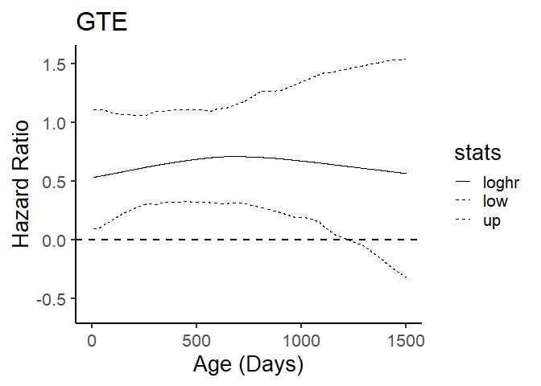

<!-- README.md is generated from README.Rmd. Please edit that file -->

# TEP

<!-- badges: start -->
<!-- badges: end -->

**TEP** provides tools to assess and visualize **temporal efficacy on
mortality hazard**. It estimates **time-varying hazard rates and hazard
ratios** based on smoothed baseline hazards, along with their associated
**confidence intervals (CI)** using both **asymptotic and
bootstrap-based** inference. To improve numerical stability in
small-sample or rare-event settings, TEP incorporates **small-sample
regularization via jittered data augmentation**.

## Installation

You can install the development version from GitHub:

``` r
# install.packages("remotes")
remotes::install_github("liu-dada/TEP")
```

## Example

``` r
library(TEP)
set.seed(123)
dat <- data.frame(
age = runif(200, 1, 1500),
dead = rbinom(200, 1, 0.4),
group = sample(c("Control", "Treatment"), 200, replace = TRUE)
)

#Bootstrap hazard ratio

hr <- bshr(
data = dat,
contr = "Control",
var = "Treatment",
n_boot = 100
)
#> Iterations: relative error in phi-hat = 1e-04 
#> phi= 16.88358   sv2= 0.06649365   df= 7.354912   lambda= 253.9126 
#> phi= 17.65971   sv2= 0.005177099   df= 3.804107   lambda= 3411.121 
#> phi= 18.96756   sv2= 0.0003412026   df= 2.463912   lambda= 55590.29 
#> Iterations: relative error in phi-hat = 1e-04 
#> phi= 2.274753   sv2= 0.03927097   df= 7.201381   lambda= 57.92454 
#> phi= 2.509121   sv2= 0.008180895   df= 5.003081   lambda= 306.7049 
#> phi= 2.669822   sv2= 0.0009026652   df= 3.612615   lambda= 2957.71 
#> phi= 2.717087   sv2= 3.859778e-05   df= 2.473273   lambda= 70394.89 
#> Iterations: relative error in phi-hat = 1e-04 
#> phi= 13.19054   sv2= 0.08034041   df= 7.308571   lambda= 164.1831 
#> phi= 16.94561   sv2= 0.004690886   df= 4.162827   lambda= 3612.455 
#> phi= 23.50164   sv2= 0.0002209849   df= 2.443216   lambda= 106349.5 
#> Iterations: relative error in phi-hat = 1e-04 
#> phi= 5.617091   sv2= 0.04698192   df= 6.918443   lambda= 119.5586 
#> phi= 6.441554   sv2= 0.004526556   df= 4.198154   lambda= 1423.058 
#> phi= 7.099676   sv2= 0.0005136136   df= 2.721775   lambda= 13822.99 
#> Iterations: relative error in phi-hat = 1e-04 
#> phi= 12.87906   sv2= 0.1021617   df= 7.208226   lambda= 126.0655 
#> phi= 16.10109   sv2= 0.01080214   df= 4.27623   lambda= 1490.546 
#> phi= 20.71429   sv2= 0.0009542019   df= 2.764654   lambda= 21708.5 
#> Iterations: relative error in phi-hat = 1e-04 
#> phi= 3.141052   sv2= 0.0684669   df= 6.875798   lambda= 45.87695 
#> phi= 3.549047   sv2= 0.01796413   df= 5.083441   lambda= 197.5629 
#> phi= 3.841544   sv2= 0.004769565   df= 3.841274   lambda= 805.4286 
#> phi= 4.049854   sv2= 0.001083471   df= 2.985306   lambda= 3737.853 
#> phi= 4.185094   sv2= 0.0001801404   df= 2.368427   lambda= 23232.4 
#> Iterations: relative error in phi-hat = 1e-04 
#> phi= 76.28036   sv2= 0.05541252   df= 7.223405   lambda= 1376.591 
#> phi= 74.69113   sv2= 0.0006186938   df= 2.825333   lambda= 120723.9 
#> Iterations: relative error in phi-hat = 1e-04 
#> phi= 3.188714   sv2= 0.07679558   df= 6.506206   lambda= 41.5221 
#> phi= 3.93426   sv2= 0.01869833   df= 4.893262   lambda= 210.407 
#> phi= 4.627956   sv2= 0.004079351   df= 3.615209   lambda= 1134.483 
#> phi= 4.929989   sv2= 0.001307517   df= 2.736946   lambda= 3770.497 
#> phi= 5.031342   sv2= 0.0005674058   df= 2.338076   lambda= 8867.273 
#> phi= 5.082608   sv2= 0.0002766415   df= 2.169828   lambda= 18372.54 
#> Iterations: relative error in phi-hat = 1e-04 
#> phi= 28.75756   sv2= 0.07844841   df= 7.140936   lambda= 366.5793 
#> phi= 28.46038   sv2= 0.006061372   df= 3.561411   lambda= 4695.37 
#> phi= 33.45699   sv2= 0.0008812479   df= 2.359919   lambda= 37965.47 
#> Iterations: relative error in phi-hat = 1e-04 
#> phi= 5.168545   sv2= 0.05508362   df= 7.093681   lambda= 93.83089 
#> phi= 5.973683   sv2= 0.005523514   df= 4.503644   lambda= 1081.5 
#> phi= 6.221264   sv2= 0.0002527878   df= 2.881443   lambda= 24610.62 
#> Iterations: relative error in phi-hat = 1e-04 
#> phi= 23.07708   sv2= 0.08486007   df= 7.388555   lambda= 271.9428 
#> phi= 29.90497   sv2= 0.004283114   df= 3.800295   lambda= 6982.062 
#> phi= 34.64159   sv2= 0.0001555243   df= 2.291502   lambda= 222740.7 
#> Iterations: relative error in phi-hat = 1e-04 
#> phi= 3.939547   sv2= 0.06088747   df= 7.390765   lambda= 64.7021 
#> phi= 4.572263   sv2= 0.01210997   df= 5.068976   lambda= 377.562 
#> phi= 4.99198   sv2= 0.001556435   df= 3.598678   lambda= 3207.316 
#> phi= 5.043957   sv2= 0.0001083924   df= 2.506231   lambda= 46534.25 
#> Iterations: relative error in phi-hat = 1e-04 
#> phi= 76.73227   sv2= 0.1035373   df= 7.235294   lambda= 741.1077 
#> phi= 90.12488   sv2= 0.002374049   df= 3.13438   lambda= 37962.52 
#> Iterations: relative error in phi-hat = 1e-04 
#> phi= 3.759883   sv2= 0.08807973   df= 7.218653   lambda= 42.68727 
#> phi= 4.172045   sv2= 0.02573389   df= 5.414697   lambda= 162.1226 
#> phi= 4.421195   sv2= 0.005904861   df= 4.18273   lambda= 748.7382 
#> phi= 4.417744   sv2= 0.001008778   df= 3.156723   lambda= 4379.304 
#> phi= 4.300629   sv2= 0.0001799132   df= 2.387249   lambda= 23903.91 
#> Iterations: relative error in phi-hat = 1e-04 
#> phi= 10.47305   sv2= 0.08654842   df= 7.485118   lambda= 121.008 
#> phi= 9.525645   sv2= 0.008790468   df= 4.533695   lambda= 1083.633 
#> phi= 9.074596   sv2= 0.001621835   df= 3.073986   lambda= 5595.264 
#> phi= 8.868306   sv2= 0.0003549937   df= 2.402167   lambda= 24981.58 
#> Iterations: relative error in phi-hat = 1e-04 
#> phi= 4.579284   sv2= 0.03787761   df= 7.236189   lambda= 120.8968 
#> phi= 4.77776   sv2= 0.002736668   df= 4.31817   lambda= 1745.831 
#> phi= 4.885579   sv2= 7.097526e-05   df= 2.664859   lambda= 68834.96 
#> Iterations: relative error in phi-hat = 1e-04 
#> phi= 87.77477   sv2= 0.1666759   df= 7.374112   lambda= 526.6194 
#> phi= 87.31996   sv2= 0.000792777   df= 3.356526   lambda= 110144.4 
#> Iterations: relative error in phi-hat = 1e-04 
#> phi= 2.206857   sv2= 0.07260915   df= 7.017623   lambda= 30.39365 
#> phi= 2.440782   sv2= 0.03049419   df= 5.621648   lambda= 80.04086 
#> phi= 2.6887   sv2= 0.01141943   df= 4.647838   lambda= 235.4496 
#> phi= 2.944197   sv2= 0.003461611   df= 3.787881   lambda= 850.528 
#> phi= 3.179873   sv2= 0.0008743627   df= 3.023072   lambda= 3636.789 
#> phi= 3.343851   sv2= 0.0002167031   df= 2.429806   lambda= 15430.57 
#> Iterations: relative error in phi-hat = 1e-04 
#> phi= 5.506085   sv2= 0.08148393   df= 6.776343   lambda= 67.57265 
#> phi= 6.275834   sv2= 0.02166315   df= 4.625434   lambda= 289.7009 
#> phi= 7.895789   sv2= 0.00697984   df= 3.523775   lambda= 1131.228 
#> phi= 10.24769   sv2= 0.001834106   df= 2.774752   lambda= 5587.296 
#> phi= 12.71335   sv2= 0.0003791566   df= 2.237925   lambda= 33530.6 
#> Iterations: relative error in phi-hat = 1e-04 
#> phi= 15.57252   sv2= 0.08834752   df= 7.308339   lambda= 176.2643 
#> phi= 18.18007   sv2= 0.007901479   df= 4.126713   lambda= 2300.844 
#> phi= 20.01498   sv2= 0.000364742   df= 2.649657   lambda= 54874.33 
#> Iterations: relative error in phi-hat = 1e-04 
#> phi= 9.279176   sv2= 0.07861022   df= 7.246346   lambda= 118.0403 
#> phi= 14.37911   sv2= 0.01906635   df= 4.37877   lambda= 754.1617 
#> phi= 25.03927   sv2= 0.003697955   df= 3.13305   lambda= 6771.112 
#> phi= 37.05529   sv2= 0.0003578641   df= 2.272267   lambda= 103545.7 
#> Iterations: relative error in phi-hat = 1e-04 
#> phi= 3.749257   sv2= 0.09109074   df= 7.150081   lambda= 41.15958 
#> phi= 4.54236   sv2= 0.03091448   df= 5.375966   lambda= 146.9331 
#> phi= 5.36421   sv2= 0.007965697   df= 4.187124   lambda= 673.4138 
#> phi= 5.954366   sv2= 0.001296713   df= 3.168528   lambda= 4591.893 
#> phi= 6.198036   sv2= 0.0001427734   df= 2.356373   lambda= 43411.7 
#> Iterations: relative error in phi-hat = 1e-04 
#> phi= 4.535493   sv2= 0.05336722   df= 7.143917   lambda= 84.9865 
#> phi= 5.293066   sv2= 0.02508442   df= 4.648136   lambda= 211.0101 
#> phi= 6.240502   sv2= 0.01632891   df= 3.93879   lambda= 382.175 
#> phi= 7.221554   sv2= 0.01073557   df= 3.550064   lambda= 672.6752 
#> phi= 8.367178   sv2= 0.006451366   df= 3.222879   lambda= 1296.962 
#> phi= 9.75392   sv2= 0.003223061   df= 2.888704   lambda= 3026.291 
#> phi= 11.26584   sv2= 0.001229683   df= 2.533196   lambda= 9161.578 
#> phi= 12.47865   sv2= 0.0003588794   df= 2.227121   lambda= 34771.15 
#> Iterations: relative error in phi-hat = 1e-04 
#> phi= 2.019737   sv2= 0.03938261   df= 6.859524   lambda= 51.28498 
#> phi= 2.152867   sv2= 0.00695064   df= 4.851717   lambda= 309.7365 
#> phi= 2.239369   sv2= 0.002387422   df= 3.411509   lambda= 937.9864 
#> phi= 2.314877   sv2= 0.001698662   df= 2.831515   lambda= 1362.765 
#> phi= 2.351508   sv2= 0.001437963   df= 2.675564   lambda= 1635.306 
#> phi= 2.371031   sv2= 0.00130829   df= 2.60617   lambda= 1812.312 
#> phi= 2.382365   sv2= 0.001235674   df= 2.568999   lambda= 1927.988 
#> phi= 2.38927   sv2= 0.001192346   df= 2.547302   lambda= 2003.839 
#> phi= 2.393601   sv2= 0.001165522   df= 2.534031   lambda= 2053.673 
#> phi= 2.396365   sv2= 0.001148535   df= 2.525687   lambda= 2086.454 
#> phi= 2.398149   sv2= 0.001137625   df= 2.520351   lambda= 2108.032 
#> phi= 2.39931   sv2= 0.001130553   df= 2.516902   lambda= 2122.244 
#> phi= 2.400068   sv2= 0.001125943   df= 2.514657   lambda= 2131.606 
#> phi= 2.400565   sv2= 0.001122927   df= 2.51319   lambda= 2137.775 
#> phi= 2.400891   sv2= 0.001120947   df= 2.512228   lambda= 2141.841 
#> phi= 2.401105   sv2= 0.001119647   df= 2.511597   lambda= 2144.52 
#> phi= 2.401247   sv2= 0.001118791   df= 2.511181   lambda= 2146.286 
#> phi= 2.40134   sv2= 0.001118228   df= 2.510908   lambda= 2147.45 
#> phi= 2.401401   sv2= 0.001117857   df= 2.510728   lambda= 2148.218 
#> phi= 2.401441   sv2= 0.001117613   df= 2.510609   lambda= 2148.723 
#> phi= 2.401468   sv2= 0.001117452   df= 2.510531   lambda= 2149.057 
#> phi= 2.401485   sv2= 0.001117346   df= 2.51048   lambda= 2149.277 
#> phi= 2.401497   sv2= 0.001117276   df= 2.510446   lambda= 2149.421 
#> Iterations: relative error in phi-hat = 1e-04 
#> phi= 2.5942   sv2= 0.1113983   df= 6.862685   lambda= 23.28761 
#> phi= 2.809673   sv2= 0.04525101   df= 5.734986   lambda= 62.09085 
#> phi= 3.077454   sv2= 0.01369041   df= 4.678073   lambda= 224.7891 
#> phi= 3.313704   sv2= 0.00279941   df= 3.652867   lambda= 1183.715 
#> phi= 3.402525   sv2= 0.0005076569   df= 2.751072   lambda= 6702.412 
#> phi= 3.381428   sv2= 0.0001113574   df= 2.21775   lambda= 30365.54 
#> Iterations: relative error in phi-hat = 1e-04 
#> phi= 11.37773   sv2= 0.02935427   df= 7.254925   lambda= 387.6005 
#> phi= 11.87146   sv2= 0.0004106484   df= 3.523434   lambda= 28909.06 
#> Iterations: relative error in phi-hat = 1e-04 
#> phi= 17.07151   sv2= 0.1312958   df= 7.607067   lambda= 130.0232 
#> phi= 18.14329   sv2= 0.01077063   df= 4.503321   lambda= 1684.515 
#> phi= 20.54502   sv2= 0.0007651321   df= 2.847724   lambda= 26851.6 
#> Iterations: relative error in phi-hat = 1e-04 
#> phi= 5.670254   sv2= 0.08603079   df= 6.91794   lambda= 65.9096 
#> phi= 6.23509   sv2= 0.01719612   df= 4.762865   lambda= 362.5871 
#> phi= 6.573281   sv2= 0.002410509   df= 3.464081   lambda= 2726.926 
#> phi= 6.78867   sv2= 0.0002712453   df= 2.485699   lambda= 25027.78 
#> Iterations: relative error in phi-hat = 1e-04 
#> phi= 3.580809   sv2= 0.0774738   df= 6.802824   lambda= 46.21961 
#> phi= 3.845758   sv2= 0.02596211   df= 4.949876   lambda= 148.1296 
#> phi= 4.263399   sv2= 0.0135929   df= 3.975154   lambda= 313.6491 
#> phi= 4.684311   sv2= 0.007754362   df= 3.48848   lambda= 604.0872 
#> phi= 5.091891   sv2= 0.004180914   df= 3.123025   lambda= 1217.889 
#> phi= 5.474184   sv2= 0.001973382   df= 2.784657   lambda= 2774.011 
#> phi= 5.78295   sv2= 0.0007902201   df= 2.465668   lambda= 7318.15 
#> phi= 5.976327   sv2= 0.0002768363   df= 2.218152   lambda= 21587.94 
#> Iterations: relative error in phi-hat = 1e-04 
#> phi= 11.96689   sv2= 0.1178199   df= 6.967312   lambda= 101.5693 
#> phi= 13.06367   sv2= 0.01800366   df= 4.414168   lambda= 725.6121 
#> phi= 14.91694   sv2= 0.002175474   df= 3.089305   lambda= 6856.869 
#> phi= 16.49095   sv2= 0.0001932819   df= 2.257963   lambda= 85320.71 
#> Iterations: relative error in phi-hat = 1e-04 
#> phi= 19.7171   sv2= 0.08096664   df= 7.599884   lambda= 243.5213 
#> phi= 30.71388   sv2= 0.005526636   df= 4.020654   lambda= 5557.429 
#> phi= 46.03306   sv2= 0.0002391306   df= 2.397838   lambda= 192501.7 
#> Iterations: relative error in phi-hat = 1e-04 
#> phi= 15.20447   sv2= 0.1229446   df= 6.794105   lambda= 123.6693 
#> phi= 22.88298   sv2= 0.009214342   df= 4.127108   lambda= 2483.409 
#> phi= 26.22688   sv2= 0.0001617774   df= 2.474717   lambda= 162117 
#> Iterations: relative error in phi-hat = 1e-04 
#> phi= 46.75771   sv2= 0.06518327   df= 7.19194   lambda= 717.3268 
#> phi= 52.16651   sv2= 0.003674299   df= 3.125014   lambda= 14197.68 
#> Iterations: relative error in phi-hat = 1e-04 
#> phi= 5.635976   sv2= 0.06562245   df= 6.91493   lambda= 85.88488 
#> phi= 6.955516   sv2= 0.006180565   df= 4.449346   lambda= 1125.385 
#> phi= 7.550917   sv2= 0.0001982268   df= 2.787833   lambda= 38092.31 
#> Iterations: relative error in phi-hat = 1e-04 
#> phi= 5.311078   sv2= 0.08988112   df= 7.443566   lambda= 59.09003 
#> phi= 5.561032   sv2= 0.01553004   df= 5.173216   lambda= 358.0823 
#> phi= 5.844354   sv2= 0.00274428   df= 3.645193   lambda= 2129.649 
#> phi= 6.241926   sv2= 0.0003792552   df= 2.675819   lambda= 16458.38 
#> Iterations: relative error in phi-hat = 1e-04 
#> phi= 4.895174   sv2= 0.04661968   df= 7.012126   lambda= 105.0023 
#> phi= 5.488018   sv2= 0.006304182   df= 4.387706   lambda= 870.5362 
#> phi= 5.661013   sv2= 0.0006628743   df= 2.985656   lambda= 8540.101 
#> phi= 5.628186   sv2= 0.0001036867   df= 2.196177   lambda= 54280.72 
#> Iterations: relative error in phi-hat = 1e-04 
#> phi= 15.96535   sv2= 0.1198085   df= 7.765217   lambda= 133.2572 
#> phi= 20.13721   sv2= 0.005630052   df= 4.502849   lambda= 3576.735 
#> phi= 28.27077   sv2= 0.0002330447   df= 2.536736   lambda= 121310.5 
#> Iterations: relative error in phi-hat = 1e-04 
#> phi= 8.940408   sv2= 0.09640714   df= 6.491447   lambda= 92.73595 
#> phi= 12.79967   sv2= 0.0169244   df= 4.271947   lambda= 756.285 
#> phi= 14.9235   sv2= 0.003539304   df= 2.984246   lambda= 4216.506 
#> phi= 15.81483   sv2= 0.001147197   df= 2.365034   lambda= 13785.62 
#> Iterations: relative error in phi-hat = 1e-04 
#> phi= 77.16411   sv2= 0.09029718   df= 7.44704   lambda= 854.5572 
#> phi= 87.45518   sv2= 0.001748957   df= 3.11968   lambda= 50004.19 
#> Iterations: relative error in phi-hat = 1e-04 
#> phi= 4.66124   sv2= 0.02196412   df= 7.118063   lambda= 212.2206 
#> phi= 5.27985   sv2= 0.002686975   df= 3.85768   lambda= 1964.979 
#> phi= 6.084467   sv2= 0.000605255   df= 2.635855   lambda= 10052.73 
#> Iterations: relative error in phi-hat = 1e-04 
#> phi= 16.08496   sv2= 0.1232738   df= 7.33086   lambda= 130.4816 
#> phi= 23.31904   sv2= 0.005732457   df= 4.398126   lambda= 4067.896 
#> phi= 37.13882   sv2= 0.0002436019   df= 2.44157   lambda= 152457 
#> Iterations: relative error in phi-hat = 1e-04 
#> phi= 1.840092   sv2= 0.07610937   df= 7.129292   lambda= 24.17695 
#> phi= 1.951666   sv2= 0.03974588   df= 5.978739   lambda= 49.1036 
#> phi= 2.043853   sv2= 0.02230211   df= 5.207074   lambda= 91.64395 
#> phi= 2.102364   sv2= 0.01344953   df= 4.621578   lambda= 156.315 
#> phi= 2.129623   sv2= 0.008947183   df= 4.181404   lambda= 238.0216 
#> phi= 2.140828   sv2= 0.006574601   df= 3.869949   lambda= 325.6211 
#> phi= 2.146708   sv2= 0.005239933   df= 3.656285   lambda= 409.6823 
#> phi= 2.150803   sv2= 0.004439536   df= 3.509065   lambda= 484.4658 
#> phi= 2.153961   sv2= 0.003935122   df= 3.406315   lambda= 547.3681 
#> phi= 2.156416   sv2= 0.003605686   df= 3.333911   lambda= 598.0599 
#> phi= 2.1583   sv2= 0.003385012   df= 3.282607   lambda= 637.6048 
#> phi= 2.159721   sv2= 0.003234506   df= 3.246145   lambda= 667.7128 
#> phi= 2.160779   sv2= 0.003130529   df= 3.220191   lambda= 690.2281 
#> phi= 2.161558   sv2= 0.003058031   df= 3.201699   lambda= 706.8462 
#> phi= 2.162126   sv2= 0.003007148   df= 3.188518   lambda= 718.9956 
#> phi= 2.162538   sv2= 0.002971265   df= 3.179118   lambda= 727.8173 
#> phi= 2.162836   sv2= 0.002945875   df= 3.172414   lambda= 734.1913 
#> phi= 2.16305   sv2= 0.002927866   df= 3.167631   lambda= 738.7804 
#> phi= 2.163204   sv2= 0.00291507   df= 3.164219   lambda= 742.0761 
#> phi= 2.163314   sv2= 0.002905967   df= 3.161785   lambda= 744.4386 
#> phi= 2.163393   sv2= 0.002899485   df= 3.160048   lambda= 746.13 
#> phi= 2.163449   sv2= 0.002894866   df= 3.158809   lambda= 747.3398 
#> phi= 2.163489   sv2= 0.002891575   df= 3.157924   lambda= 748.2046 
#> phi= 2.163518   sv2= 0.002889227   df= 3.157293   lambda= 748.8224 
#> phi= 2.163539   sv2= 0.002887553   df= 3.156843   lambda= 749.2637 
#> phi= 2.163553   sv2= 0.002886359   df= 3.156521   lambda= 749.5788 
#> phi= 2.163564   sv2= 0.002885507   df= 3.156292   lambda= 749.8037 
#> phi= 2.163571   sv2= 0.002884899   df= 3.156128   lambda= 749.9643 
#> phi= 2.163577   sv2= 0.002884465   df= 3.156012   lambda= 750.0789 
#> phi= 2.163581   sv2= 0.002884156   df= 3.155928   lambda= 750.1607 
#> phi= 2.163583   sv2= 0.002883935   df= 3.155869   lambda= 750.2191 
#> Iterations: relative error in phi-hat = 1e-04 
#> phi= 41.03977   sv2= 0.04610425   df= 6.276137   lambda= 890.1517 
#> phi= 33.57572   sv2= 0.001996597   df= 2.735906   lambda= 16816.48 
#> Iterations: relative error in phi-hat = 1e-04 
#> phi= 3.9479   sv2= 0.08965451   df= 7.120557   lambda= 44.03459 
#> phi= 4.74824   sv2= 0.01557038   df= 5.249753   lambda= 304.9533 
#> phi= 5.449698   sv2= 0.001323251   df= 3.600287   lambda= 4118.416 
#> phi= 5.8746   sv2= 7.704113e-05   df= 2.375541   lambda= 76252.77 
#> Iterations: relative error in phi-hat = 1e-04 
#> phi= 6.806042   sv2= 0.1189345   df= 7.574219   lambda= 57.22511 
#> phi= 7.674011   sv2= 0.02371476   df= 5.326846   lambda= 323.5964 
#> phi= 7.873278   sv2= 0.005087448   df= 3.817381   lambda= 1547.589 
#> phi= 8.169591   sv2= 0.0009625052   df= 2.910243   lambda= 8487.841 
#> phi= 8.496811   sv2= 0.0001342531   df= 2.29269   lambda= 63289.5 
#> Iterations: relative error in phi-hat = 1e-04 
#> phi= 5.160826   sv2= 0.06606303   df= 6.983375   lambda= 78.11972 
#> phi= 6.138388   sv2= 0.005204226   df= 4.599653   lambda= 1179.501 
#> phi= 6.389726   sv2= 0.0002920713   df= 2.789269   lambda= 21877.28 
#> Iterations: relative error in phi-hat = 1e-04 
#> phi= 6.788422   sv2= 0.1055024   df= 7.156096   lambda= 64.3438 
#> phi= 7.240737   sv2= 0.03379395   df= 4.967531   lambda= 214.2614 
#> phi= 8.101408   sv2= 0.01402925   df= 3.961925   lambda= 577.4656 
#> phi= 9.213357   sv2= 0.006046624   df= 3.322312   lambda= 1523.719 
#> phi= 10.56241   sv2= 0.002650798   df= 2.820759   lambda= 3984.616 
#> phi= 12.02857   sv2= 0.00121966   df= 2.43852   lambda= 9862.23 
#> phi= 13.20609   sv2= 0.0005671831   df= 2.209199   lambda= 23283.65 
#> Iterations: relative error in phi-hat = 1e-04 
#> phi= 3.44128   sv2= 0.08994803   df= 7.152718   lambda= 38.25854 
#> phi= 3.771251   sv2= 0.02183643   df= 5.426691   lambda= 172.7046 
#> phi= 4.017298   sv2= 0.003280221   df= 4.031282   lambda= 1224.703 
#> phi= 4.107431   sv2= 0.0002994236   df= 2.850537   lambda= 13717.8 
#> Iterations: relative error in phi-hat = 1e-04 
#> phi= 57.64804   sv2= 0.09603579   df= 7.158813   lambda= 600.2767 
#> phi= 54.27511   sv2= 0.01049167   df= 3.364066   lambda= 5173.161 
#> phi= 58.70479   sv2= 0.001084027   df= 2.390932   lambda= 54154.34 
#> Iterations: relative error in phi-hat = 1e-04 
#> phi= 8.405719   sv2= 0.03566173   df= 7.086121   lambda= 235.707 
#> phi= 9.459683   sv2= 0.003068455   df= 3.803758   lambda= 3082.882 
#> phi= 8.788098   sv2= 0.0002296592   df= 2.467494   lambda= 38265.82 
#> Iterations: relative error in phi-hat = 1e-04 
#> phi= 2.254997   sv2= 0.05443865   df= 7.175107   lambda= 41.42273 
#> phi= 2.30864   sv2= 0.02216781   df= 5.315956   lambda= 104.1438 
#> phi= 2.410019   sv2= 0.01113356   df= 4.409567   lambda= 216.4644 
#> phi= 2.550131   sv2= 0.005951013   df= 3.833278   lambda= 428.5205 
#> phi= 2.714613   sv2= 0.003043087   df= 3.386055   lambda= 892.0588 
#> phi= 2.882368   sv2= 0.001350241   df= 2.98292   lambda= 2134.706 
#> phi= 3.015398   sv2= 0.0004850645   df= 2.594431   lambda= 6216.49 
#> phi= 3.084397   sv2= 0.0001437241   df= 2.270042   lambda= 21460.55 
#> Iterations: relative error in phi-hat = 1e-04 
#> phi= 2.350341   sv2= 0.04341396   df= 7.183365   lambda= 54.13792 
#> phi= 2.718886   sv2= 0.01332672   df= 5.117464   lambda= 204.0177 
#> phi= 2.984235   sv2= 0.004615068   df= 3.952053   lambda= 646.6286 
#> phi= 3.152171   sv2= 0.00155347   df= 3.189983   lambda= 2029.116 
#> phi= 3.258931   sv2= 0.0004255792   df= 2.631245   lambda= 7657.636 
#> phi= 3.310182   sv2= 9.449054e-05   df= 2.23303   lambda= 35031.89 
#> Iterations: relative error in phi-hat = 1e-04 
#> phi= 5.994856   sv2= 0.1111179   df= 7.255596   lambda= 53.9504 
#> phi= 7.095023   sv2= 0.02437425   df= 5.099147   lambda= 291.0869 
#> phi= 8.550406   sv2= 0.006045651   df= 3.677005   lambda= 1414.307 
#> phi= 10.04516   sv2= 0.001225939   df= 2.797589   lambda= 8193.85 
#> phi= 10.67915   sv2= 0.0001929552   df= 2.230583   lambda= 55345.22 
#> Iterations: relative error in phi-hat = 1e-04 
#> phi= 8.444731   sv2= 0.07775065   df= 6.954368   lambda= 108.613 
#> phi= 11.03702   sv2= 0.008483777   df= 4.306674   lambda= 1300.956 
#> phi= 12.42709   sv2= 0.0003677187   df= 2.774095   lambda= 33795.1 
#> Iterations: relative error in phi-hat = 1e-04 
#> phi= 4.919558   sv2= 0.08880034   df= 7.370623   lambda= 55.40022 
#> phi= 5.828318   sv2= 0.0207546   df= 5.122756   lambda= 280.8206 
#> phi= 7.307877   sv2= 0.006632155   df= 3.758322   lambda= 1101.886 
#> phi= 8.82471   sv2= 0.001826631   df= 2.969278   lambda= 4831.14 
#> phi= 9.648959   sv2= 0.0003515199   df= 2.385067   lambda= 27449.25 
#> Iterations: relative error in phi-hat = 1e-04 
#> phi= 9.348081   sv2= 0.104789   df= 7.084424   lambda= 89.20862 
#> phi= 11.41235   sv2= 0.01587177   df= 4.595315   lambda= 719.0345 
#> phi= 12.4222   sv2= 0.001389126   df= 3.111228   lambda= 8942.454 
#> phi= 12.54993   sv2= 7.011602e-05   df= 2.201267   lambda= 178988.1 
#> Iterations: relative error in phi-hat = 1e-04 
#> phi= 4.481889   sv2= 0.1168201   df= 7.019801   lambda= 38.36573 
#> phi= 5.325477   sv2= 0.03420548   df= 5.372785   lambda= 155.6907 
#> phi= 6.360055   sv2= 0.009277432   df= 4.110305   lambda= 685.5405 
#> phi= 7.469837   sv2= 0.002653914   df= 3.153079   lambda= 2814.649 
#> phi= 8.336968   sv2= 0.00083939   df= 2.507312   lambda= 9932.174 
#> phi= 8.820186   sv2= 0.0002881193   df= 2.182531   lambda= 30612.97 
#> Iterations: relative error in phi-hat = 1e-04 
#> phi= 7.672204   sv2= 0.06787284   df= 6.915609   lambda= 113.0379 
#> phi= 9.153202   sv2= 0.005211803   df= 4.243432   lambda= 1756.245 
#> phi= 9.918029   sv2= 0.0004759737   df= 2.620139   lambda= 20837.35 
#> Iterations: relative error in phi-hat = 1e-04 
#> phi= 128.1824   sv2= 0.06936331   df= 7.161706   lambda= 1847.985 
#> phi= 188.9171   sv2= 0.0005788047   df= 2.665147   lambda= 326391.9 
#> Iterations: relative error in phi-hat = 1e-04 
#> phi= 5.384249   sv2= 0.06637362   df= 7.028884   lambda= 81.12031 
#> phi= 6.226496   sv2= 0.008816981   df= 4.586531   lambda= 706.1937 
#> phi= 6.738465   sv2= 0.0009088206   df= 3.051422   lambda= 7414.516 
#> phi= 6.907716   sv2= 0.0001514707   df= 2.220723   lambda= 45604.31 
#> Iterations: relative error in phi-hat = 1e-04 
#> phi= 3.743835   sv2= 0.09475523   df= 6.972764   lambda= 39.51059 
#> phi= 4.099355   sv2= 0.02859234   df= 5.278811   lambda= 143.3725 
#> phi= 4.660503   sv2= 0.007958446   df= 4.104474   lambda= 585.6047 
#> phi= 5.370448   sv2= 0.002138264   df= 3.186051   lambda= 2511.592 
#> phi= 5.94024   sv2= 0.0006275498   df= 2.519023   lambda= 9465.767 
#> phi= 6.24314   sv2= 0.0002031542   df= 2.178712   lambda= 30731.04 
#> Iterations: relative error in phi-hat = 1e-04 
#> phi= 5.845048   sv2= 0.0799854   df= 6.730581   lambda= 73.07644 
#> phi= 6.344869   sv2= 0.01191878   df= 4.602957   lambda= 532.342 
#> phi= 6.578752   sv2= 0.0009467614   df= 3.189204   lambda= 6948.69 
#> phi= 6.497348   sv2= 7.440061e-05   df= 2.210658   lambda= 87329.24 
#> Iterations: relative error in phi-hat = 1e-04 
#> phi= 4.654193   sv2= 0.059888   df= 7.086814   lambda= 77.71495 
#> phi= 5.034072   sv2= 0.01237073   df= 4.624143   lambda= 406.9341 
#> phi= 5.47541   sv2= 0.004132379   df= 3.360545   lambda= 1325.002 
#> phi= 5.917038   sv2= 0.00144037   df= 2.745659   lambda= 4107.999 
#> phi= 6.249915   sv2= 0.0005041001   df= 2.347606   lambda= 12398.16 
#> Iterations: relative error in phi-hat = 1e-04 
#> phi= 3.072646   sv2= 0.04363473   df= 7.284641   lambda= 70.41745 
#> phi= 3.368452   sv2= 0.003334708   df= 4.899907   lambda= 1010.119 
#> phi= 3.525638   sv2= 0.0001955686   df= 2.991085   lambda= 18027.63 
#> Iterations: relative error in phi-hat = 1e-04 
#> phi= 64.205   sv2= 0.04050175   df= 7.35559   lambda= 1585.24 
#> phi= 79.1258   sv2= 0.0008954136   df= 2.758851   lambda= 88367.89 
#> Iterations: relative error in phi-hat = 1e-04 
#> phi= 3.501323   sv2= 0.1020163   df= 6.609955   lambda= 34.3212 
#> phi= 4.163127   sv2= 0.02950814   df= 5.101444   lambda= 141.084 
#> phi= 4.776147   sv2= 0.005965849   df= 3.870802   lambda= 800.5813 
#> phi= 4.945872   sv2= 0.001366436   df= 2.874855   lambda= 3619.541 
#> phi= 5.019707   sv2= 0.0004893778   df= 2.339661   lambda= 10257.32 
#> Iterations: relative error in phi-hat = 1e-04 
#> phi= 5.483048   sv2= 0.06844836   df= 6.683834   lambda= 80.10489 
#> phi= 5.715248   sv2= 0.02474076   df= 4.472605   lambda= 231.0053 
#> phi= 6.017387   sv2= 0.01317705   df= 3.700925   lambda= 456.6565 
#> phi= 6.505983   sv2= 0.007604731   df= 3.293193   lambda= 855.5178 
#> phi= 7.193913   sv2= 0.004256796   df= 2.96384   lambda= 1689.983 
#> phi= 8.114125   sv2= 0.00221464   df= 2.654808   lambda= 3663.858 
#> phi= 9.182185   sv2= 0.001063058   df= 2.379882   lambda= 8637.524 
#> phi= 10.11256   sv2= 0.0004719873   df= 2.185249   lambda= 21425.49 
#> Iterations: relative error in phi-hat = 1e-04 
#> phi= 3.947259   sv2= 0.04731759   df= 7.458246   lambda= 83.42054 
#> phi= 4.78526   sv2= 0.008995979   df= 4.835329   lambda= 531.9332 
#> phi= 4.990062   sv2= 0.001654012   df= 3.393416   lambda= 3016.944 
#> phi= 4.921073   sv2= 0.0002706987   df= 2.53025   lambda= 18179.15 
#> Iterations: relative error in phi-hat = 1e-04 
#> phi= 3.417016   sv2= 0.04913684   df= 7.037412   lambda= 69.54082 
#> phi= 3.559045   sv2= 0.01123822   df= 4.77143   lambda= 316.6911 
#> phi= 3.757315   sv2= 0.003557257   df= 3.572263   lambda= 1056.239 
#> phi= 3.964389   sv2= 0.001051   df= 2.884657   lambda= 3772.017 
#> phi= 4.106536   sv2= 0.0002464123   df= 2.382755   lambda= 16665.31 
#> Iterations: relative error in phi-hat = 1e-04 
#> phi= 4.791377   sv2= 0.05815029   df= 7.116384   lambda= 82.39644 
#> phi= 5.286023   sv2= 0.009198933   df= 4.651396   lambda= 574.6344 
#> phi= 5.697502   sv2= 0.0007532874   df= 3.240279   lambda= 7563.518 
#> phi= 5.875363   sv2= 3.15094e-05   df= 2.238426   lambda= 186463.8 
#> Iterations: relative error in phi-hat = 1e-04 
#> phi= 14.15591   sv2= 0.1117322   df= 7.062407   lambda= 126.6949 
#> phi= 14.63882   sv2= 0.02621843   df= 4.341295   lambda= 558.3409 
#> phi= 17.006   sv2= 0.008599196   df= 3.342709   lambda= 1977.627 
#> phi= 19.40904   sv2= 0.002296893   df= 2.698495   lambda= 8450.127 
#> phi= 20.74684   sv2= 0.0004837504   df= 2.236037   lambda= 42887.48 
#> Iterations: relative error in phi-hat = 1e-04 
#> phi= 2.860024   sv2= 0.06489047   df= 6.879837   lambda= 44.07464 
#> phi= 3.344312   sv2= 0.01292823   df= 5.105587   lambda= 258.683 
#> phi= 3.665372   sv2= 0.001396922   df= 3.629978   lambda= 2623.892 
#> phi= 3.70759   sv2= 0.0001904016   df= 2.458744   lambda= 19472.48 
#> Iterations: relative error in phi-hat = 1e-04 
#> phi= 9.564179   sv2= 0.0653615   df= 7.299577   lambda= 146.3274 
#> phi= 10.47465   sv2= 0.002314242   df= 4.246905   lambda= 4526.169 
#> phi= 11.452   sv2= 0.000101091   df= 2.40386   lambda= 113284.1 
#> Iterations: relative error in phi-hat = 1e-04 
#> phi= 4.216753   sv2= 0.04011216   df= 7.009768   lambda= 105.124 
#> phi= 4.632985   sv2= 0.00333838   df= 4.326485   lambda= 1387.795 
#> phi= 4.814417   sv2= 8.748571e-05   df= 2.717016   lambda= 55030.89 
#> Iterations: relative error in phi-hat = 1e-04 
#> phi= 5.217736   sv2= 0.1473409   df= 7.289729   lambda= 35.41268 
#> phi= 5.635588   sv2= 0.04165021   df= 5.645781   lambda= 135.3076 
#> phi= 6.246661   sv2= 0.01222852   df= 4.352232   lambda= 510.827 
#> phi= 7.235555   sv2= 0.004315269   df= 3.422799   lambda= 1676.733 
#> phi= 8.319205   sv2= 0.00150048   df= 2.797831   lambda= 5544.361 
#> phi= 9.247946   sv2= 0.0005140187   df= 2.353991   lambda= 17991.46 
#> Iterations: relative error in phi-hat = 1e-04 
#> phi= 3.286694   sv2= 0.04585215   df= 7.128448   lambda= 71.68025 
#> phi= 3.427084   sv2= 0.004482531   df= 4.762939   lambda= 764.5422 
#> phi= 3.493745   sv2= 0.0006229015   df= 3.026059   lambda= 5608.824 
#> phi= 3.555211   sv2= 0.0002048375   df= 2.26016   lambda= 17356.25 
#> Iterations: relative error in phi-hat = 1e-04 
#> phi= 2.762177   sv2= 0.120943   df= 7.265036   lambda= 22.83866 
#> phi= 3.09083   sv2= 0.04473589   df= 6.112846   lambda= 69.0906 
#> phi= 3.504905   sv2= 0.01161681   df= 4.890395   lambda= 301.7098 
#> phi= 3.993038   sv2= 0.002468497   df= 3.704271   lambda= 1617.599 
#> phi= 4.420022   sv2= 0.0003966319   df= 2.758412   lambda= 11143.89 
#> Iterations: relative error in phi-hat = 1e-04 
#> phi= 5.871696   sv2= 0.07459017   df= 7.018619   lambda= 78.71944 
#> phi= 7.156129   sv2= 0.009783377   df= 4.657789   lambda= 731.458 
#> phi= 7.865858   sv2= 0.0009737115   df= 3.099583   lambda= 8078.222 
#> phi= 8.035097   sv2= 9.271552e-05   df= 2.218193   lambda= 86663.99 
#> Iterations: relative error in phi-hat = 1e-04 
#> phi= 34.96821   sv2= 0.1356484   df= 7.521797   lambda= 257.7856 
#> phi= 41.57151   sv2= 0.007791652   df= 3.91062   lambda= 5335.391 
#> phi= 59.82163   sv2= 0.0007915701   df= 2.377473   lambda= 75573.38 
#> Iterations: relative error in phi-hat = 1e-04 
#> phi= 2.92423   sv2= 0.03022264   df= 7.306699   lambda= 96.75625 
#> phi= 3.182838   sv2= 0.00274196   df= 4.574356   lambda= 1160.79 
#> phi= 3.286808   sv2= 0.0001998304   df= 2.905759   lambda= 16447.98 
#> Iterations: relative error in phi-hat = 1e-04 
#> phi= 3.750074   sv2= 0.07783613   df= 6.577383   lambda= 48.17909 
#> phi= 4.428106   sv2= 0.03123541   df= 4.806629   lambda= 141.7656 
#> phi= 5.512797   sv2= 0.01698663   df= 3.944909   lambda= 324.5373 
#> phi= 6.810781   sv2= 0.008861185   df= 3.415052   lambda= 768.6084 
#> phi= 8.274806   sv2= 0.003672888   df= 2.952714   lambda= 2252.942 
#> phi= 9.550255   sv2= 0.001067741   df= 2.500817   lambda= 8944.359 
#> phi= 10.19476   sv2= 0.0002299703   df= 2.166802   lambda= 44330.78 
#> Iterations: relative error in phi-hat = 1e-04 
#> phi= 4.145307   sv2= 0.08393274   df= 7.547819   lambda= 49.38844 
#> phi= 4.677366   sv2= 0.01910857   df= 5.465354   lambda= 244.7784 
#> phi= 4.899175   sv2= 0.0027007   df= 3.99056   lambda= 1814.039 
#> phi= 4.888628   sv2= 0.0002510562   df= 2.789372   lambda= 19472.24 
#> Iterations: relative error in phi-hat = 1e-04 
#> phi= 5.037847   sv2= 0.1367021   df= 6.829914   lambda= 36.85273 
#> phi= 6.021338   sv2= 0.03867182   df= 5.277553   lambda= 155.7035 
#> phi= 7.39733   sv2= 0.01131246   df= 4.050556   lambda= 653.91 
#> phi= 8.930435   sv2= 0.003331934   df= 3.168335   lambda= 2680.256 
#> phi= 9.904814   sv2= 0.0008815802   df= 2.545464   lambda= 11235.3 
#> Iterations: relative error in phi-hat = 1e-04 
#> phi= 3.509171   sv2= 0.03605208   df= 7.012571   lambda= 97.33614 
#> phi= 3.836175   sv2= 0.003612662   df= 4.392629   lambda= 1061.869 
#> phi= 3.954051   sv2= 0.0002547461   df= 2.817696   lambda= 15521.54 
#> Iterations: relative error in phi-hat = 1e-04 
#> phi= 12.81502   sv2= 0.1282158   df= 7.222174   lambda= 99.94882 
#> phi= 22.75234   sv2= 0.00811872   df= 4.478016   lambda= 2802.455 
#> phi= 33.55163   sv2= 0.0001501715   df= 2.529433   lambda= 223422.1 
#> Iterations: relative error in phi-hat = 1e-04 
#> phi= 11.45308   sv2= 0.08028675   df= 6.9519   lambda= 142.6521 
#> phi= 13.93469   sv2= 0.002767108   df= 4.041078   lambda= 5035.831 
#> phi= 14.31497   sv2= 3.518751e-05   df= 2.267543   lambda= 406819.6 
#> Iterations: relative error in phi-hat = 1e-04 
#> phi= 28.95764   sv2= 0.09999703   df= 7.147517   lambda= 289.585 
#> phi= 29.14902   sv2= 0.008843285   df= 3.700416   lambda= 3296.176 
#> phi= 32.50609   sv2= 0.0009455537   df= 2.485319   lambda= 34377.84 
#> Iterations: relative error in phi-hat = 1e-04 
#> phi= 3.841673   sv2= 0.1238377   df= 6.864326   lambda= 31.02185 
#> phi= 3.812194   sv2= 0.04237602   df= 5.531167   lambda= 89.96111 
#> phi= 4.008612   sv2= 0.0126985   df= 4.501041   lambda= 315.676 
#> phi= 4.237957   sv2= 0.003193944   df= 3.555812   lambda= 1326.872 
#> phi= 4.424067   sv2= 0.00124339   df= 2.765086   lambda= 3558.069 
#> phi= 4.57427   sv2= 0.000689743   df= 2.384655   lambda= 6631.847 
#> phi= 4.665211   sv2= 0.0004363212   df= 2.228398   lambda= 10692.15 
#> Iterations: relative error in phi-hat = 1e-04 
#> phi= 4.047448   sv2= 0.1121657   df= 7.325094   lambda= 36.08453 
#> phi= 4.607372   sv2= 0.02868995   df= 5.61748   lambda= 160.5919 
#> phi= 4.725267   sv2= 0.007980959   df= 4.165463   lambda= 592.0676 
#> phi= 4.714369   sv2= 0.002659082   df= 3.267916   lambda= 1772.931 
#> phi= 4.784453   sv2= 0.0008418555   df= 2.709116   lambda= 5683.224 
#> phi= 4.852576   sv2= 0.0002411248   df= 2.308292   lambda= 20124.75 
#> Iterations: relative error in phi-hat = 1e-04 
#> phi= 4.468061   sv2= 0.0881755   df= 7.151712   lambda= 50.67236 
#> phi= 5.306906   sv2= 0.02483286   df= 5.180207   lambda= 213.7049 
#> phi= 6.195585   sv2= 0.004612566   df= 3.914658   lambda= 1343.197 
#> phi= 6.840604   sv2= 0.0004080061   df= 2.830017   lambda= 16765.94 
#> Iterations: relative error in phi-hat = 1e-04 
#> phi= 3.467869   sv2= 0.05960377   df= 7.322246   lambda= 58.18203 
#> phi= 3.707903   sv2= 0.01435593   df= 5.111596   lambda= 258.2836 
#> phi= 4.116387   sv2= 0.005885145   df= 3.848607   lambda= 699.4538 
#> phi= 4.5617   sv2= 0.002509443   df= 3.224201   lambda= 1817.814 
#> phi= 4.926185   sv2= 0.0008936199   df= 2.751318   lambda= 5512.618 
#> phi= 5.135621   sv2= 0.0002560458   df= 2.356038   lambda= 20057.43 
#> Iterations: relative error in phi-hat = 1e-04 
#> phi= 1.018049   sv2= 0.07672876   df= 6.701702   lambda= 13.26815 
#> phi= 1.0563   sv2= 0.05831952   df= 6.327417   lambda= 18.11229 
#> phi= 1.099865   sv2= 0.04264585   df= 5.93833   lambda= 25.79068 
#> phi= 1.149944   sv2= 0.029405   df= 5.525358   lambda= 39.10709 
#> phi= 1.206968   sv2= 0.01851184   df= 5.078114   lambda= 65.19978 
#> phi= 1.269245   sv2= 0.01010064   df= 4.585374   lambda= 125.6599 
#> phi= 1.331393   sv2= 0.0044144   df= 4.037135   lambda= 301.6022 
#> phi= 1.384149   sv2= 0.00143007   df= 3.433137   lambda= 967.8889 
#> phi= 1.418808   sv2= 0.0003803341   df= 2.81235   lambda= 3730.424 
#> phi= 1.437254   sv2= 0.0001093254   df= 2.330524   lambda= 13146.57 
#> Iterations: relative error in phi-hat = 1e-04 
#> phi= 190.3401   sv2= 0.1059186   df= 7.156651   lambda= 1797.042 
#> phi= 239.1546   sv2= 0.0004142028   df= 2.708499   lambda= 577385.2 
#> Iterations: relative error in phi-hat = 1e-04 
#> phi= 5.232706   sv2= 0.07565727   df= 7.009922   lambda= 69.16329 
#> phi= 6.351134   sv2= 0.01169356   df= 4.792443   lambda= 543.1309 
#> phi= 7.184859   sv2= 0.0009813434   df= 3.27165   lambda= 7321.453 
#> phi= 7.404436   sv2= 6.539279e-05   df= 2.238179   lambda= 113230.2 
#> Iterations: relative error in phi-hat = 1e-04 
#> phi= 5.341335   sv2= 0.09270036   df= 7.206027   lambda= 57.61936 
#> phi= 5.925139   sv2= 0.01627567   df= 5.037644   lambda= 364.0489 
#> phi= 6.713647   sv2= 0.003554102   df= 3.522589   lambda= 1888.986 
#> phi= 7.477316   sv2= 0.0006030808   df= 2.647747   lambda= 12398.53 
#> Iterations: relative error in phi-hat = 1e-04 
#> phi= 2.639495   sv2= 0.0517212   df= 7.331309   lambda= 51.03313 
#> phi= 2.907552   sv2= 0.01224405   df= 5.229504   lambda= 237.4665 
#> phi= 3.128198   sv2= 0.002195279   df= 3.875412   lambda= 1424.966 
#> phi= 3.222403   sv2= 0.0003187889   df= 2.828037   lambda= 10108.27 
#> Iterations: relative error in phi-hat = 1e-04 
#> phi= 6.433871   sv2= 0.07755594   df= 6.825986   lambda= 82.95781 
#> phi= 7.730512   sv2= 0.03120142   df= 4.52919   lambda= 247.7615 
#> phi= 9.000151   sv2= 0.01657441   df= 3.73398   lambda= 543.0149 
#> phi= 10.28081   sv2= 0.008478497   df= 3.267375   lambda= 1212.575 
#> phi= 11.57309   sv2= 0.003636363   df= 2.857723   lambda= 3182.601 
#> phi= 12.65593   sv2= 0.001215991   df= 2.467643   lambda= 10407.91 
#> Iterations: relative error in phi-hat = 1e-04 
#> phi= 6.331778   sv2= 0.1396927   df= 7.090774   lambda= 45.32649 
#> phi= 8.021439   sv2= 0.03836413   df= 5.250551   lambda= 209.0869 
#> phi= 9.848935   sv2= 0.006378394   df= 3.899317   lambda= 1544.109 
#> phi= 11.34143   sv2= 0.0005143652   df= 2.753499   lambda= 22049.37 
#> Iterations: relative error in phi-hat = 1e-04 
#> phi= 81.60623   sv2= 0.1195003   df= 7.263121   lambda= 682.8955 
#> phi= 91.63798   sv2= 0.0002511577   df= 3.138098   lambda= 364862.3 
#> Iterations: relative error in phi-hat = 1e-04 
#> phi= 7.560309   sv2= 0.05041872   df= 6.984461   lambda= 149.9504 
#> phi= 9.974863   sv2= 0.003854379   df= 4.027818   lambda= 2587.93 
#> phi= 9.975828   sv2= 0.0001686272   df= 2.464528   lambda= 59159.08 
#> Iterations: relative error in phi-hat = 1e-04 
#> phi= 3.53397   sv2= 0.1279904   df= 7.885677   lambda= 27.6112 
#> phi= 3.831583   sv2= 0.05235271   df= 6.387189   lambda= 73.18786 
#> phi= 4.125462   sv2= 0.02391975   df= 5.222221   lambda= 172.4709 
#> phi= 4.414681   sv2= 0.01193931   df= 4.390481   lambda= 369.7601 
#> phi= 4.680334   sv2= 0.005896915   df= 3.786819   lambda= 793.692 
#> phi= 4.926889   sv2= 0.002604501   df= 3.293225   lambda= 1891.682 
#> phi= 5.146159   sv2= 0.0009251935   df= 2.839194   lambda= 5562.251 
#> phi= 5.300694   sv2= 0.0002512492   df= 2.419107   lambda= 21097.36 
#> Iterations: relative error in phi-hat = 1e-04 
#> phi= 6.389212   sv2= 0.06167566   df= 7.078416   lambda= 103.5937 
#> phi= 9.035817   sv2= 0.009662706   df= 4.465779   lambda= 935.1229 
#> phi= 10.92283   sv2= 0.001881386   df= 2.994763   lambda= 5805.738 
#> phi= 11.78767   sv2= 0.0004994631   df= 2.2874   lambda= 23600.69 
#> Iterations: relative error in phi-hat = 1e-04 
#> phi= 4.151516   sv2= 0.08661435   df= 7.360774   lambda= 47.93104 
#> phi= 4.314656   sv2= 0.02602097   df= 5.347441   lambda= 165.8146 
#> phi= 4.499523   sv2= 0.0109346   df= 4.204867   lambda= 411.4942 
#> phi= 4.749803   sv2= 0.005652531   df= 3.563098   lambda= 840.2967 
#> phi= 5.059365   sv2= 0.003219787   df= 3.146229   lambda= 1571.335 
#> phi= 5.407986   sv2= 0.001960096   df= 2.831532   lambda= 2759.041 
#> phi= 5.762356   sv2= 0.00126268   df= 2.589116   lambda= 4563.593 
#> phi= 6.081144   sv2= 0.0008470351   df= 2.411453   lambda= 7179.33 
#> phi= 6.341547   sv2= 0.000582652   df= 2.286728   lambda= 10883.94 
#> Iterations: relative error in phi-hat = 1e-04 
#> phi= 4.465178   sv2= 0.06022883   df= 7.289051   lambda= 74.13689 
#> phi= 5.095102   sv2= 0.006924703   df= 4.852953   lambda= 735.7864 
#> phi= 5.653153   sv2= 0.0004822562   df= 3.163807   lambda= 11722.3 
#> Iterations: relative error in phi-hat = 1e-04 
#> phi= 36.00528   sv2= 0.09557656   df= 7.253656   lambda= 376.7167 
#> phi= 29.87588   sv2= 0.007919677   df= 3.593775   lambda= 3772.361 
#> phi= 31.94678   sv2= 0.0008779452   df= 2.449145   lambda= 36388.13 
#> Iterations: relative error in phi-hat = 1e-04 
#> phi= 7.020201   sv2= 0.06522574   df= 7.142497   lambda= 107.6293 
#> phi= 8.432662   sv2= 0.007448786   df= 4.393554   lambda= 1132.085 
#> phi= 8.581983   sv2= 0.000614785   df= 2.858083   lambda= 13959.32 
#> Iterations: relative error in phi-hat = 1e-04 
#> phi= 5.683372   sv2= 0.07694698   df= 7.423095   lambda= 73.86088 
#> phi= 6.263481   sv2= 0.007734222   df= 4.860856   lambda= 809.8398 
#> phi= 6.603073   sv2= 0.0005260224   df= 3.112479   lambda= 12552.84 
#> Iterations: relative error in phi-hat = 1e-04 
#> phi= 7.531761   sv2= 0.1176124   df= 7.219216   lambda= 64.03883 
#> phi= 8.934382   sv2= 0.01608837   df= 4.898877   lambda= 555.3318 
#> phi= 9.884255   sv2= 0.001170037   df= 3.241409   lambda= 8447.811 
#> phi= 10.61493   sv2= 0.0001518558   df= 2.220608   lambda= 69901.36 
#> Iterations: relative error in phi-hat = 1e-04 
#> phi= 14.96486   sv2= 0.1032493   df= 7.818118   lambda= 144.9391 
#> phi= 17.41941   sv2= 0.02046908   df= 4.610953   lambda= 851.0107 
#> phi= 23.46988   sv2= 0.005838305   df= 3.366203   lambda= 4019.981 
#> phi= 30.00283   sv2= 0.001100547   df= 2.6136   lambda= 27261.75 
#> Iterations: relative error in phi-hat = 1e-04 
#> phi= 6.923136   sv2= 0.07858117   df= 6.942806   lambda= 88.10172 
#> phi= 7.809325   sv2= 0.007699887   df= 4.586352   lambda= 1014.213 
#> phi= 8.36746   sv2= 0.0003352634   df= 2.926901   lambda= 24957.87 
#> Iterations: relative error in phi-hat = 1e-04 
#> phi= 4.903779   sv2= 0.09057755   df= 7.404049   lambda= 54.13901 
#> phi= 5.635595   sv2= 0.01565924   df= 5.214524   lambda= 359.8895 
#> phi= 6.195533   sv2= 0.002667138   df= 3.632108   lambda= 2322.915 
#> phi= 6.503232   sv2= 0.0004052757   df= 2.63942   lambda= 16046.44 
#> Iterations: relative error in phi-hat = 1e-04 
#> phi= 7.432431   sv2= 0.07121807   df= 6.675437   lambda= 104.3616 
#> phi= 9.05747   sv2= 0.01399394   df= 4.251444   lambda= 647.2421 
#> phi= 8.516029   sv2= 0.003146029   df= 3.051244   lambda= 2706.913 
#> phi= 7.978306   sv2= 0.0007439157   df= 2.432276   lambda= 10724.74 
#> Iterations: relative error in phi-hat = 1e-04 
#> phi= 2.432184   sv2= 0.05906929   df= 6.974927   lambda= 41.1751 
#> phi= 2.590104   sv2= 0.02075174   df= 5.227691   lambda= 124.8138 
#> phi= 2.779154   sv2= 0.008783972   df= 4.203858   lambda= 316.3892 
#> phi= 3.046209   sv2= 0.004263581   df= 3.532836   lambda= 714.472 
#> phi= 3.360375   sv2= 0.002228922   df= 3.057277   lambda= 1507.623 
#> phi= 3.683705   sv2= 0.001248144   df= 2.697098   lambda= 2951.347 
#> phi= 3.973392   sv2= 0.000740577   df= 2.440088   lambda= 5365.266 
#> phi= 4.198053   sv2= 0.0004539666   df= 2.273422   lambda= 9247.493 
#> phi= 4.356759   sv2= 0.0002827073   df= 2.169937   lambda= 15410.85 
#> Iterations: relative error in phi-hat = 1e-04 
#> phi= 5.938113   sv2= 0.05795691   df= 7.176838   lambda= 102.4574 
#> phi= 6.390334   sv2= 0.007192669   df= 4.498591   lambda= 888.451 
#> phi= 6.780979   sv2= 0.0007123202   df= 3.051621   lambda= 9519.567 
#> phi= 6.984976   sv2= 4.547755e-05   df= 2.212861   lambda= 153591.8 
#> Iterations: relative error in phi-hat = 1e-04 
#> phi= 59.64796   sv2= 0.04903975   df= 7.704475   lambda= 1216.319 
#> phi= 74.07388   sv2= 0.001059204   df= 3.051676   lambda= 69933.54 
#> Iterations: relative error in phi-hat = 1e-04 
#> phi= 5.604217   sv2= 0.03800408   df= 6.690301   lambda= 147.4636 
#> phi= 6.233136   sv2= 0.002248406   df= 3.914083   lambda= 2772.247 
#> phi= 6.39157   sv2= 8.912839e-05   df= 2.395918   lambda= 71711.94 
#> Iterations: relative error in phi-hat = 1e-04 
#> phi= 7.427533   sv2= 0.1164356   df= 7.254473   lambda= 63.79093 
#> phi= 8.465983   sv2= 0.03144314   df= 5.028572   lambda= 269.2474 
#> phi= 9.564101   sv2= 0.01111489   df= 3.810265   lambda= 860.4767 
#> phi= 10.64011   sv2= 0.004533382   df= 3.091333   lambda= 2347.058 
#> phi= 11.2576   sv2= 0.002073692   df= 2.632193   lambda= 5428.772 
#> phi= 11.56695   sv2= 0.001046069   df= 2.357193   lambda= 11057.55 
#> Iterations: relative error in phi-hat = 1e-04 
#> phi= 3.10073   sv2= 0.08285804   df= 6.841891   lambda= 37.4222 
#> phi= 3.484259   sv2= 0.0324388   df= 5.272125   lambda= 107.4102 
#> phi= 3.625534   sv2= 0.01516047   df= 4.301461   lambda= 239.1438 
#> phi= 3.630281   sv2= 0.008358061   df= 3.705027   lambda= 434.3448 
#> phi= 3.645114   sv2= 0.005100198   df= 3.327113   lambda= 714.7005 
#> phi= 3.683496   sv2= 0.003278228   df= 3.049698   lambda= 1123.624 
#> phi= 3.736678   sv2= 0.002177054   df= 2.824893   lambda= 1716.392 
#> phi= 3.796927   sv2= 0.001487691   df= 2.638425   lambda= 2552.228 
#> phi= 3.857278   sv2= 0.001044691   df= 2.487429   lambda= 3692.267 
#> phi= 3.91237   sv2= 0.0007515541   df= 2.369558   lambda= 5205.707 
#> phi= 3.959458   sv2= 0.0005515326   df= 2.280007   lambda= 7179.011 
#> phi= 3.99807   sv2= 0.0004111467   df= 2.212827   lambda= 9724.195 
#> phi= 4.028989   sv2= 0.0003102438   df= 2.16253   lambda= 12986.52 
#> Iterations: relative error in phi-hat = 1e-04 
#> phi= 7.413052   sv2= 0.08601646   df= 7.264707   lambda= 86.18179 
#> phi= 8.12663   sv2= 0.0104226   df= 4.617636   lambda= 779.7121 
#> phi= 8.756898   sv2= 0.002220538   df= 3.074421   lambda= 3943.593 
#> phi= 9.372956   sv2= 0.000556017   df= 2.402414   lambda= 16857.32 
#> Iterations: relative error in phi-hat = 1e-04 
#> phi= 2.938262   sv2= 0.06248451   df= 6.919669   lambda= 47.02385 
#> phi= 3.524001   sv2= 0.01533892   df= 5.046608   lambda= 229.7424 
#> phi= 3.926253   sv2= 0.002441835   df= 3.690486   lambda= 1607.911 
#> phi= 4.069675   sv2= 0.000194095   df= 2.631008   lambda= 20967.44 
#> Iterations: relative error in phi-hat = 1e-04 
#> phi= 72.38083   sv2= 0.06593983   df= 6.915774   lambda= 1097.68 
#> phi= 68.14578   sv2= 0.000514053   df= 2.899776   lambda= 132565.7 
#> Iterations: relative error in phi-hat = 1e-04 
#> phi= 4.285332   sv2= 0.05877172   df= 7.038848   lambda= 72.91486 
#> phi= 4.984205   sv2= 0.007780475   df= 4.702549   lambda= 640.6042 
#> phi= 5.735945   sv2= 0.001772809   df= 3.106757   lambda= 3235.512 
#> phi= 6.102471   sv2= 0.0005041894   df= 2.389295   lambda= 12103.53 
#> Iterations: relative error in phi-hat = 1e-04 
#> phi= 4.563961   sv2= 0.07083284   df= 7.010166   lambda= 64.43283 
#> phi= 4.918943   sv2= 0.02597301   df= 4.860928   lambda= 189.3867 
#> phi= 5.700614   sv2= 0.01358203   df= 3.949561   lambda= 419.7172 
#> phi= 6.717655   sv2= 0.007092199   df= 3.41195   lambda= 947.1893 
#> phi= 7.819598   sv2= 0.003105598   df= 2.962574   lambda= 2517.904 
#> phi= 8.623858   sv2= 0.001057036   df= 2.541036   lambda= 8158.53 
#> phi= 8.905625   sv2= 0.000299826   df= 2.220366   lambda= 29702.64 
#> Iterations: relative error in phi-hat = 1e-04 
#> phi= 7.470819   sv2= 0.07166279   df= 7.365463   lambda= 104.2496 
#> phi= 8.984246   sv2= 0.005158518   df= 4.535386   lambda= 1741.633 
#> phi= 9.797278   sv2= 0.000167371   df= 2.711767   lambda= 58536.31 
#> Iterations: relative error in phi-hat = 1e-04 
#> phi= 22.23194   sv2= 0.08233867   df= 7.573081   lambda= 270.0061 
#> phi= 24.47834   sv2= 0.002982596   df= 3.881538   lambda= 8207.059 
#> phi= 21.47131   sv2= 0.0002804964   df= 2.28496   lambda= 76547.55 
#> Iterations: relative error in phi-hat = 1e-04 
#> phi= 5.083062   sv2= 0.03694668   df= 7.031501   lambda= 137.5783 
#> phi= 5.850836   sv2= 0.002778882   df= 4.107306   lambda= 2105.464 
#> phi= 6.48325   sv2= 0.0002546791   df= 2.564049   lambda= 25456.54 
#> Iterations: relative error in phi-hat = 1e-04 
#> phi= 21.14679   sv2= 0.1186603   df= 7.556256   lambda= 178.2129 
#> phi= 19.22536   sv2= 0.005892085   df= 4.185425   lambda= 3262.912 
#> phi= 21.33315   sv2= 0.0003661601   df= 2.530405   lambda= 58261.82 
#> Iterations: relative error in phi-hat = 1e-04 
#> phi= 2.787998   sv2= 0.04711741   df= 6.677694   lambda= 59.17129 
#> phi= 3.068315   sv2= 0.009712266   df= 4.67483   lambda= 315.9217 
#> phi= 3.251258   sv2= 0.001458325   df= 3.393904   lambda= 2229.447 
#> phi= 3.351112   sv2= 0.0001291178   df= 2.461629   lambda= 25953.92 
#> Iterations: relative error in phi-hat = 1e-04 
#> phi= 4.788445   sv2= 0.07531078   df= 7.437517   lambda= 63.58246 
#> phi= 5.360826   sv2= 0.009207307   df= 5.014802   lambda= 582.236 
#> phi= 5.8375   sv2= 0.001142883   df= 3.312498   lambda= 5107.698 
#> phi= 6.128505   sv2= 0.0001162297   df= 2.364164   lambda= 52727.53 
#> Iterations: relative error in phi-hat = 1e-04 
#> phi= 4.191561   sv2= 0.1019452   df= 7.000152   lambda= 41.11582 
#> phi= 4.78892   sv2= 0.02892503   df= 5.311133   lambda= 165.5632 
#> phi= 5.362702   sv2= 0.005295015   df= 4.074366   lambda= 1012.783 
#> phi= 5.596959   sv2= 0.0007631187   df= 2.959372   lambda= 7334.323 
#> phi= 5.591757   sv2= 0.0001834506   df= 2.245287   lambda= 30480.99 
#> Iterations: relative error in phi-hat = 1e-04 
#> phi= 3.797345   sv2= 0.1461421   df= 6.744107   lambda= 25.98392 
#> phi= 4.199734   sv2= 0.06801062   df= 5.609398   lambda= 61.75114 
#> phi= 4.731272   sv2= 0.02879044   df= 4.744465   lambda= 164.3348 
#> phi= 5.361405   sv2= 0.009807467   df= 3.94679   lambda= 546.6656 
#> phi= 6.002161   sv2= 0.002561396   df= 3.187507   lambda= 2343.316 
#> phi= 6.494486   sv2= 0.0005846204   df= 2.521473   lambda= 11108.89 
#> Iterations: relative error in phi-hat = 1e-04 
#> phi= 5.437634   sv2= 0.08202933   df= 6.876692   lambda= 66.2889 
#> phi= 6.662152   sv2= 0.01588644   df= 4.770945   lambda= 419.3609 
#> phi= 6.824552   sv2= 0.003189315   df= 3.379282   lambda= 2139.817 
#> phi= 6.722957   sv2= 0.0005230797   df= 2.567748   lambda= 12852.64 
#> Iterations: relative error in phi-hat = 1e-04 
#> phi= 27.69707   sv2= 0.05478544   df= 7.405033   lambda= 505.5554 
#> phi= 29.68944   sv2= 0.001238486   df= 3.352683   lambda= 23972.37 
#> Iterations: relative error in phi-hat = 1e-04 
#> phi= 5.025245   sv2= 0.02459561   df= 6.933869   lambda= 204.3148 
#> phi= 5.04348   sv2= 0.001064928   df= 3.737113   lambda= 4735.984 
#> phi= 5.062424   sv2= 5.321809e-05   df= 2.282915   lambda= 95126 
#> Iterations: relative error in phi-hat = 1e-04 
#> phi= 21.35181   sv2= 0.07284429   df= 7.082767   lambda= 293.1158 
#> phi= 22.59595   sv2= 0.007040919   df= 3.664245   lambda= 3209.233 
#> phi= 21.95323   sv2= 0.0005435122   df= 2.476632   lambda= 40391.42 
#> Iterations: relative error in phi-hat = 1e-04 
#> phi= 7.699751   sv2= 0.07342428   df= 7.30506   lambda= 104.8665 
#> phi= 9.464847   sv2= 0.008173003   df= 4.577763   lambda= 1158.062 
#> phi= 10.25231   sv2= 0.0004262065   df= 2.950148   lambda= 24054.81 
#> Iterations: relative error in phi-hat = 1e-04 
#> phi= 5.886141   sv2= 0.08209928   df= 7.565275   lambda= 71.6954 
#> phi= 5.794408   sv2= 0.01989538   df= 5.056813   lambda= 291.2438 
#> phi= 5.556558   sv2= 0.008970954   df= 3.869791   lambda= 619.3943 
#> phi= 5.573004   sv2= 0.004870722   df= 3.375614   lambda= 1144.185 
#> phi= 5.664733   sv2= 0.002626949   df= 3.031991   lambda= 2156.393 
#> phi= 5.777489   sv2= 0.001293107   df= 2.728002   lambda= 4467.913 
#> phi= 5.881113   sv2= 0.0005594612   df= 2.448935   lambda= 10512.1 
#> Iterations: relative error in phi-hat = 1e-04 
#> phi= 1.488542   sv2= 0.1204094   df= 6.727087   lambda= 12.36234 
#> phi= 1.511281   sv2= 0.1022371   df= 6.464322   lambda= 14.78211 
#> phi= 1.531722   sv2= 0.08845384   df= 6.251395   lambda= 17.31663 
#> phi= 1.551163   sv2= 0.07733315   df= 6.068925   lambda= 20.05819 
#> phi= 1.57053   sv2= 0.06787157   df= 5.904187   lambda= 23.13974 
#> phi= 1.590642   sv2= 0.05944639   df= 5.748114   lambda= 26.75759 
#> phi= 1.612355   sv2= 0.0516463   df= 5.593433   lambda= 31.21918 
#> phi= 1.636686   sv2= 0.04418656   df= 5.433424   lambda= 37.04035 
#> phi= 1.664941   sv2= 0.03687092   df= 5.260924   lambda= 45.15593 
#> phi= 1.698848   sv2= 0.02958765   df= 5.067346   lambda= 57.41745 
#> phi= 1.740637   sv2= 0.02234152   df= 4.841587   lambda= 77.91042 
#> phi= 1.792813   sv2= 0.01532813   df= 4.56891   lambda= 116.9623 
#> phi= 1.856917   sv2= 0.009029554   df= 4.23059   lambda= 205.6488 
#> phi= 1.93001   sv2= 0.004192258   df= 3.807124   lambda= 460.3749 
#> phi= 1.999014   sv2= 0.001396566   df= 3.290798   lambda= 1431.378 
#> phi= 2.042704   sv2= 0.0003485674   df= 2.714419   lambda= 5860.284 
#> phi= 2.058443   sv2= 8.390901e-05   df= 2.254724   lambda= 24531.84 
#> Iterations: relative error in phi-hat = 1e-04 
#> phi= 8.331229   sv2= 0.07167127   df= 7.404584   lambda= 116.2422 
#> phi= 13.56933   sv2= 0.01086545   df= 4.46627   lambda= 1248.85 
#> phi= 23.23515   sv2= 0.001369301   df= 2.90667   lambda= 16968.62 
#> Iterations: relative error in phi-hat = 1e-04 
#> phi= 7.366684   sv2= 0.04395787   df= 6.773318   lambda= 167.5851 
#> phi= 7.817504   sv2= 0.002923183   df= 3.85987   lambda= 2674.313 
#> phi= 7.524738   sv2= 0.0005277359   df= 2.404621   lambda= 14258.53 
#> Iterations: relative error in phi-hat = 1e-04 
#> phi= 64.9818   sv2= 0.09249771   df= 7.268014   lambda= 702.5233 
#> phi= 71.83295   sv2= 0.002034378   df= 3.195804   lambda= 35309.53 
#> Iterations: relative error in phi-hat = 1e-04 
#> phi= 3.112477   sv2= 0.07680877   df= 7.118257   lambda= 40.52241 
#> phi= 3.478293   sv2= 0.02615738   df= 5.383202   lambda= 132.9756 
#> phi= 3.784982   sv2= 0.007029186   df= 4.26603   lambda= 538.4666 
#> phi= 3.96463   sv2= 0.001163443   df= 3.293518   lambda= 3407.671 
#> phi= 4.000299   sv2= 0.0001589711   df= 2.450503   lambda= 25163.68 
#> Iterations: relative error in phi-hat = 1e-04 
#> phi= 6.122922   sv2= 0.1320735   df= 7.628697   lambda= 46.35997 
#> phi= 7.155624   sv2= 0.0322332   df= 5.542682   lambda= 221.9955 
#> phi= 9.435638   sv2= 0.007350992   df= 4.041783   lambda= 1283.587 
#> phi= 13.1683   sv2= 0.001128113   df= 2.936438   lambda= 11672.86 
#> Iterations: relative error in phi-hat = 1e-04 
#> phi= 8.617111   sv2= 0.0828668   df= 7.193148   lambda= 103.9875 
#> phi= 10.76811   sv2= 0.008808568   df= 4.467376   lambda= 1222.459 
#> phi= 12.06184   sv2= 0.0006998953   df= 2.859748   lambda= 17233.78 
#> Iterations: relative error in phi-hat = 1e-04 
#> phi= 5.241171   sv2= 0.1267045   df= 6.870081   lambda= 41.3653 
#> phi= 5.435646   sv2= 0.05220474   df= 5.196417   lambda= 104.1217 
#> phi= 5.650404   sv2= 0.02379205   df= 4.320627   lambda= 237.4913 
#> phi= 6.040705   sv2= 0.009819863   df= 3.700615   lambda= 615.1516 
#> phi= 6.625798   sv2= 0.00308926   df= 3.149869   lambda= 2144.785 
#> phi= 7.272034   sv2= 0.0006632203   df= 2.596496   lambda= 10964.73 
#> Iterations: relative error in phi-hat = 1e-04 
#> phi= 2.917075   sv2= 0.04821531   df= 7.127776   lambda= 60.501 
#> phi= 2.957657   sv2= 0.01318901   df= 4.959894   lambda= 224.2516 
#> phi= 3.181773   sv2= 0.004489989   df= 3.847337   lambda= 708.6371 
#> phi= 3.43444   sv2= 0.001478645   df= 3.118941   lambda= 2322.694 
#> phi= 3.621471   sv2= 0.0003928619   df= 2.567821   lambda= 9218.177 
#> phi= 3.71559   sv2= 8.686874e-05   df= 2.195254   lambda= 42772.46 
#> Iterations: relative error in phi-hat = 1e-04 
#> phi= 3.029608   sv2= 0.08416584   df= 7.374753   lambda= 35.99569 
#> phi= 3.24953   sv2= 0.02513206   df= 5.640943   lambda= 129.2982 
#> phi= 3.424536   sv2= 0.009678375   df= 4.375821   lambda= 353.8338 
#> phi= 3.641003   sv2= 0.004616703   df= 3.62432   lambda= 788.6588 
#> phi= 3.88135   sv2= 0.002160497   df= 3.143693   lambda= 1796.508 
#> phi= 4.116845   sv2= 0.0008691945   df= 2.738468   lambda= 4736.391 
#> phi= 4.30831   sv2= 0.0002885708   df= 2.382164   lambda= 14929.82 
#> Iterations: relative error in phi-hat = 1e-04 
#> phi= 4.509   sv2= 0.06403035   df= 6.958305   lambda= 70.41973 
#> phi= 4.905106   sv2= 0.01066786   df= 4.709107   lambda= 459.8022 
#> phi= 5.106728   sv2= 0.001450601   df= 3.31668   lambda= 3520.423 
#> phi= 5.13892   sv2= 0.0001861351   df= 2.392597   lambda= 27608.55 
#> Iterations: relative error in phi-hat = 1e-04 
#> phi= 9.021849   sv2= 0.1185441   df= 7.293871   lambda= 76.10545 
#> phi= 10.12224   sv2= 0.01619391   df= 4.816219   lambda= 625.0647 
#> phi= 11.33216   sv2= 0.00265782   df= 3.278999   lambda= 4263.705 
#> phi= 12.34819   sv2= 0.0003233389   df= 2.425458   lambda= 38189.63 
#> Iterations: relative error in phi-hat = 1e-04 
#> phi= 7.68674   sv2= 0.1379185   df= 6.969512   lambda= 55.73394 
#> phi= 9.646431   sv2= 0.03307092   df= 4.962104   lambda= 291.6892 
#> phi= 11.86009   sv2= 0.00441619   df= 3.603959   lambda= 2685.595 
#> phi= 13.26302   sv2= 0.0002452369   df= 2.495047   lambda= 54082.5 
#> Iterations: relative error in phi-hat = 1e-04 
#> phi= 3.834785   sv2= 0.1238794   df= 7.307295   lambda= 30.95579 
#> phi= 4.28521   sv2= 0.03645352   df= 5.748315   lambda= 117.5527 
#> phi= 4.595289   sv2= 0.007278915   df= 4.359273   lambda= 631.3152 
#> phi= 4.734473   sv2= 0.001107959   df= 3.18422   lambda= 4273.146 
#> phi= 4.750564   sv2= 0.0001331417   df= 2.373753   lambda= 35680.51 
#> Iterations: relative error in phi-hat = 1e-04 
#> phi= 7.229521   sv2= 0.08098199   df= 6.792203   lambda= 89.27319 
#> phi= 8.672119   sv2= 0.009417282   df= 4.347832   lambda= 920.8728 
#> phi= 9.387046   sv2= 0.0004356722   df= 2.840552   lambda= 21546.12 
#> Iterations: relative error in phi-hat = 1e-04 
#> phi= 2.336157   sv2= 0.07211906   df= 7.028448   lambda= 32.39306 
#> phi= 2.420536   sv2= 0.02393673   df= 5.483577   lambda= 101.1222 
#> phi= 2.516009   sv2= 0.007950402   df= 4.339823   lambda= 316.4631 
#> phi= 2.625648   sv2= 0.002441824   df= 3.504316   lambda= 1075.281 
#> phi= 2.727065   sv2= 0.0005847068   df= 2.845732   lambda= 4663.987 
#> phi= 2.7816   sv2= 0.0001030302   df= 2.317895   lambda= 26997.92 
#> Iterations: relative error in phi-hat = 1e-04 
#> phi= 6.01365   sv2= 0.03633486   df= 7.260648   lambda= 165.5064 
#> phi= 6.437655   sv2= 0.001096904   df= 4.163051   lambda= 5868.931 
#> phi= 6.596396   sv2= 6.596289e-05   df= 2.303013   lambda= 100001.6 
#> Iterations: relative error in phi-hat = 1e-04 
#> phi= 30.25331   sv2= 0.09734534   df= 7.158359   lambda= 310.7833 
#> phi= 26.68392   sv2= 0.006408608   df= 3.653195   lambda= 4163.762 
#> phi= 25.39613   sv2= 0.0004286944   df= 2.390807   lambda= 59240.64 
#> Iterations: relative error in phi-hat = 1e-04 
#> phi= 1.895223   sv2= 0.08687346   df= 7.396489   lambda= 21.8159 
#> phi= 2.069508   sv2= 0.03833208   df= 6.277021   lambda= 53.98893 
#> phi= 2.2725   sv2= 0.01282659   df= 5.190323   lambda= 177.171 
#> phi= 2.464637   sv2= 0.002568667   df= 4.081997   lambda= 959.5003 
#> phi= 2.557974   sv2= 0.0003275682   df= 2.998944   lambda= 7808.98 
#> phi= 2.567295   sv2= 5.613006e-05   df= 2.24633   lambda= 45738.32 
#> Iterations: relative error in phi-hat = 1e-04 
#> phi= 5.724504   sv2= 0.07343715   df= 6.960027   lambda= 77.95106 
#> phi= 7.584434   sv2= 0.0164969   df= 4.571464   lambda= 459.749 
#> phi= 11.27836   sv2= 0.004297948   df= 3.292269   lambda= 2624.127 
#> phi= 12.59588   sv2= 0.0008432833   df= 2.491127   lambda= 14936.71 
#> Iterations: relative error in phi-hat = 1e-04 
#> phi= 5.78811   sv2= 0.06247406   df= 7.231266   lambda= 92.64822 
#> phi= 6.707334   sv2= 0.007182951   df= 4.585857   lambda= 933.7853 
#> phi= 7.291069   sv2= 0.0004308809   df= 2.988373   lambda= 16921.31 
#> Iterations: relative error in phi-hat = 1e-04 
#> phi= 24.49979   sv2= 0.06863584   df= 7.218179   lambda= 356.9533 
#> phi= 31.26046   sv2= 0.001254301   df= 3.592752   lambda= 24922.62 
#> Iterations: relative error in phi-hat = 1e-04 
#> phi= 2.004109   sv2= 0.0463192   df= 7.088878   lambda= 43.26734 
#> phi= 2.250828   sv2= 0.01232491   df= 5.237908   lambda= 182.6243 
#> phi= 2.478294   sv2= 0.002017333   df= 3.935046   lambda= 1228.5 
#> phi= 2.588987   sv2= 0.0001451613   df= 2.80231   lambda= 17835.24 
#> Iterations: relative error in phi-hat = 1e-04 
#> phi= 5.112057   sv2= 0.1062403   df= 7.131608   lambda= 48.11789 
#> phi= 5.613002   sv2= 0.03888024   df= 5.174522   lambda= 144.3665 
#> phi= 6.20882   sv2= 0.01619473   df= 4.172982   lambda= 383.3852 
#> phi= 7.082315   sv2= 0.006701972   df= 3.495307   lambda= 1056.751 
#> phi= 8.222451   sv2= 0.002406028   df= 2.945495   lambda= 3417.438 
#> phi= 9.446821   sv2= 0.0007476136   df= 2.463491   lambda= 12635.97 
#> Iterations: relative error in phi-hat = 1e-04 
#> phi= 6.220205   sv2= 0.05965567   df= 7.575949   lambda= 104.2685 
#> phi= 7.227268   sv2= 0.007022023   df= 4.657306   lambda= 1029.229 
#> phi= 8.246623   sv2= 0.0005777586   df= 3.016594   lambda= 14273.48 
#> Iterations: relative error in phi-hat = 1e-04 
#> phi= 3.162922   sv2= 0.09466447   df= 7.502709   lambda= 33.41193 
#> phi= 3.349327   sv2= 0.03375379   df= 5.857508   lambda= 99.22819 
#> phi= 3.518018   sv2= 0.01391089   df= 4.704409   lambda= 252.8967 
#> phi= 3.67409   sv2= 0.007304734   df= 3.940213   lambda= 502.9738 
#> phi= 3.83419   sv2= 0.004261413   df= 3.484825   lambda= 899.7463 
#> phi= 3.991363   sv2= 0.002475267   df= 3.154441   lambda= 1612.498 
#> phi= 4.141622   sv2= 0.00135171   df= 2.864744   lambda= 3063.988 
#> phi= 4.275449   sv2= 0.0006793088   df= 2.592656   lambda= 6293.822 
#> phi= 4.379861   sv2= 0.0003183029   df= 2.355573   lambda= 13760.04 
#> Iterations: relative error in phi-hat = 1e-04 
#> phi= 3.588834   sv2= 0.06950377   df= 6.930667   lambda= 51.6351 
#> phi= 4.066084   sv2= 0.009726776   df= 4.911512   lambda= 418.03 
#> phi= 4.442978   sv2= 0.001237159   df= 3.267608   lambda= 3591.276 
#> phi= 4.786923   sv2= 0.0002668218   df= 2.349966   lambda= 17940.53 
#> Iterations: relative error in phi-hat = 1e-04 
#> phi= 5.490271   sv2= 0.1011266   df= 7.323548   lambda= 54.29104 
#> phi= 6.038001   sv2= 0.01561385   df= 5.140487   lambda= 386.7081 
#> phi= 6.649189   sv2= 0.002387071   df= 3.519827   lambda= 2785.501 
#> phi= 7.138924   sv2= 0.0003117082   df= 2.541711   lambda= 22902.58 
#> Iterations: relative error in phi-hat = 1e-04 
#> phi= 5.205975   sv2= 0.103419   df= 7.275205   lambda= 50.33869 
#> phi= 6.187816   sv2= 0.0270733   df= 5.214831   lambda= 228.5579 
#> phi= 6.942203   sv2= 0.00435154   df= 3.851976   lambda= 1595.344 
#> phi= 7.407589   sv2= 0.0004718426   df= 2.747886   lambda= 15699.28 
#> Iterations: relative error in phi-hat = 1e-04 
#> phi= 28.83698   sv2= 0.07105433   df= 7.477367   lambda= 405.8441 
#> phi= 37.85367   sv2= 0.002652302   df= 3.591553   lambda= 14272 
#> Iterations: relative error in phi-hat = 1e-04 
#> phi= 3.297377   sv2= 0.116549   df= 6.953049   lambda= 28.29177 
#> phi= 3.791286   sv2= 0.05230144   df= 5.644254   lambda= 72.48914 
#> phi= 4.322224   sv2= 0.02088589   df= 4.686509   lambda= 206.9447 
#> phi= 4.814589   sv2= 0.005989765   df= 3.842831   lambda= 803.8028 
#> phi= 5.128797   sv2= 0.000982948   df= 3.030155   lambda= 5217.77 
#> phi= 5.239557   sv2= 9.163299e-05   df= 2.312096   lambda= 57179.81 
#> Iterations: relative error in phi-hat = 1e-04 
#> phi= 35.30853   sv2= 0.06368346   df= 7.443257   lambda= 554.4381 
#> phi= 29.13885   sv2= 0.001330251   df= 3.318464   lambda= 21904.77 
#> Iterations: relative error in phi-hat = 1e-04 
#> phi= 2.710135   sv2= 0.0575648   df= 7.149901   lambda= 47.07972 
#> phi= 3.039916   sv2= 0.0118867   df= 5.202225   lambda= 255.7408 
#> phi= 3.240142   sv2= 0.00259922   df= 3.75553   lambda= 1246.583 
#> phi= 3.36765   sv2= 0.001564959   df= 2.849345   lambda= 2151.909 
#> phi= 3.443861   sv2= 0.001265163   df= 2.609107   lambda= 2722.07 
#> phi= 3.482802   sv2= 0.001127278   df= 2.5184   lambda= 3089.567 
#> phi= 3.504772   sv2= 0.00105283   df= 2.473101   lambda= 3328.906 
#> phi= 3.517921   sv2= 0.001009281   df= 2.447635   lambda= 3485.571 
#> phi= 3.526075   sv2= 0.0009826307   df= 2.432399   lambda= 3588.403 
#> phi= 3.531243   sv2= 0.0009658734   df= 2.422948   lambda= 3656.011 
#> phi= 3.534565   sv2= 0.0009551577   df= 2.416956   lambda= 3700.504 
#> phi= 3.536718   sv2= 0.0009482319   df= 2.413105   lambda= 3729.803 
#> phi= 3.538122   sv2= 0.0009437246   df= 2.410607   lambda= 3749.105 
#> phi= 3.539042   sv2= 0.0009407781   df= 2.408977   lambda= 3761.824 
#> phi= 3.539645   sv2= 0.0009388464   df= 2.407911   lambda= 3770.207 
#> phi= 3.540041   sv2= 0.0009375775   df= 2.407211   lambda= 3775.732 
#> phi= 3.540302   sv2= 0.000936743   df= 2.406751   lambda= 3779.374 
#> phi= 3.540474   sv2= 0.0009361937   df= 2.406448   lambda= 3781.775 
#> phi= 3.540587   sv2= 0.0009358319   df= 2.406249   lambda= 3783.358 
#> phi= 3.540661   sv2= 0.0009355936   df= 2.406117   lambda= 3784.401 
#> phi= 3.540711   sv2= 0.0009354365   df= 2.406031   lambda= 3785.089 
#> phi= 3.540743   sv2= 0.000935333   df= 2.405974   lambda= 3785.543 
#> phi= 3.540764   sv2= 0.0009352648   df= 2.405936   lambda= 3785.842 
#> Iterations: relative error in phi-hat = 1e-04 
#> phi= 80.63745   sv2= 0.05209549   df= 7.41397   lambda= 1547.878 
#> phi= 86.32673   sv2= 0.0009687134   df= 2.874426   lambda= 89114.83 
#> Iterations: relative error in phi-hat = 1e-04 
#> phi= 6.681246   sv2= 0.0905656   df= 7.125523   lambda= 73.77245 
#> phi= 8.413537   sv2= 0.01468147   df= 4.739243   lambda= 573.072 
#> phi= 10.04924   sv2= 0.001198786   df= 3.222502   lambda= 8382.851 
#> phi= 10.9641   sv2= 6.427063e-05   df= 2.219511   lambda= 170592.6 
#> Iterations: relative error in phi-hat = 1e-04 
#> phi= 80.38488   sv2= 0.06110968   df= 7.483522   lambda= 1315.42 
#> phi= 86.22375   sv2= 0.0005337091   df= 2.882109   lambda= 161555.7 
#> Iterations: relative error in phi-hat = 1e-04 
#> phi= 2.557472   sv2= 0.06654321   df= 7.017866   lambda= 38.43325 
#> phi= 2.745965   sv2= 0.02353954   df= 5.38191   lambda= 116.6533 
#> phi= 2.900832   sv2= 0.0106354   df= 4.352915   lambda= 272.7526 
#> phi= 3.032183   sv2= 0.00542673   df= 3.711206   lambda= 558.7496 
#> phi= 3.149491   sv2= 0.002779415   df= 3.253679   lambda= 1133.149 
#> phi= 3.253978   sv2= 0.001315411   df= 2.872812   lambda= 2473.734 
#> phi= 3.339134   sv2= 0.0005535925   df= 2.535102   lambda= 6031.755 
#> phi= 3.396761   sv2= 0.000210375   df= 2.269941   lambda= 16146.22 
#> Iterations: relative error in phi-hat = 1e-04 
#> phi= 144.1391   sv2= 0.1101092   df= 7.15126   lambda= 1309.056 
#> phi= 101.4865   sv2= 0.002411668   df= 2.892717   lambda= 42081.47 
#> Iterations: relative error in phi-hat = 1e-04 
#> phi= 8.347082   sv2= 0.06369784   df= 6.957887   lambda= 131.0418 
#> phi= 10.51701   sv2= 0.004102817   df= 4.150079   lambda= 2563.363 
#> phi= 11.87022   sv2= 9.752166e-05   df= 2.50298   lambda= 121718.8 
#> Iterations: relative error in phi-hat = 1e-04 
#> phi= 60.52468   sv2= 0.05858518   df= 7.245578   lambda= 1033.106 
#> phi= 76.98713   sv2= 0.00031276   df= 2.982011   lambda= 246154 
#> Iterations: relative error in phi-hat = 1e-04 
#> phi= 6.326699   sv2= 0.08963263   df= 7.117675   lambda= 70.58477 
#> phi= 7.01918   sv2= 0.01673172   df= 4.76346   lambda= 419.5134 
#> phi= 7.303627   sv2= 0.002494919   df= 3.40021   lambda= 2927.401 
#> phi= 7.50215   sv2= 0.0002455432   df= 2.486485   lambda= 30553.27 
#> Iterations: relative error in phi-hat = 1e-04 
#> phi= 5.84377   sv2= 0.0485026   df= 7.37403   lambda= 120.4836 
#> phi= 6.288713   sv2= 0.01205647   df= 4.400165   lambda= 521.6049 
#> phi= 6.998129   sv2= 0.003725163   df= 3.355523   lambda= 1878.61 
#> phi= 7.629091   sv2= 0.0008972716   df= 2.705088   lambda= 8502.543 
#> phi= 7.943225   sv2= 0.0001600642   df= 2.234363   lambda= 49625.23 
#> Iterations: relative error in phi-hat = 1e-04 
#> phi= 3.45879   sv2= 0.04657679   df= 6.930169   lambda= 74.25994 
#> phi= 3.710366   sv2= 0.002381268   df= 4.591346   lambda= 1558.147 
#> phi= 3.728814   sv2= 5.264603e-05   df= 2.661565   lambda= 70828.02 
#> Iterations: relative error in phi-hat = 1e-04 
#> phi= 11.94509   sv2= 0.12016   df= 6.980489   lambda= 99.40984 
#> phi= 15.67187   sv2= 0.02168657   df= 4.40829   lambda= 722.6532 
#> phi= 21.52401   sv2= 0.004093444   df= 3.10037   lambda= 5258.167 
#> phi= 25.5169   sv2= 0.0004325628   df= 2.314759   lambda= 58990.06 
#> Iterations: relative error in phi-hat = 1e-04 
#> phi= 5.305636   sv2= 0.05064672   df= 7.231604   lambda= 104.7578 
#> phi= 5.900057   sv2= 0.004268866   df= 4.443961   lambda= 1382.114 
#> phi= 5.622635   sv2= 0.0003582246   df= 2.779027   lambda= 15695.83 
#> Iterations: relative error in phi-hat = 1e-04 
#> phi= 4.426566   sv2= 0.06738009   df= 7.267662   lambda= 65.69547 
#> phi= 5.180337   sv2= 0.009122992   df= 4.933065   lambda= 567.8331 
#> phi= 5.985722   sv2= 0.000778796   df= 3.278194   lambda= 7685.866 
#> phi= 6.254426   sv2= 5.008931e-05   df= 2.244006   lambda= 124865.5 
#> Iterations: relative error in phi-hat = 1e-04 
#> phi= 4.450643   sv2= 0.05896536   df= 6.540354   lambda= 75.47894 
#> phi= 5.42468   sv2= 0.00844504   df= 4.396341   lambda= 642.351 
#> phi= 6.147849   sv2= 0.0005356787   df= 2.983248   lambda= 11476.75 
#> Iterations: relative error in phi-hat = 1e-04 
#> phi= 2.980337   sv2= 0.07781707   df= 7.351461   lambda= 38.29928 
#> phi= 3.113097   sv2= 0.02366261   df= 5.545369   lambda= 131.5619 
#> phi= 3.202217   sv2= 0.01031846   df= 4.315363   lambda= 310.3388 
#> phi= 3.349968   sv2= 0.005550522   df= 3.659995   lambda= 603.5411 
#> phi= 3.529846   sv2= 0.003080517   df= 3.239864   lambda= 1145.862 
#> phi= 3.724428   sv2= 0.001627892   df= 2.894356   lambda= 2287.884 
#> phi= 3.919351   sv2= 0.0007997985   df= 2.585156   lambda= 4900.423 
#> phi= 4.088341   sv2= 0.0003699312   df= 2.332572   lambda= 11051.63 
#> Iterations: relative error in phi-hat = 1e-04 
#> phi= 4.544209   sv2= 0.08298552   df= 7.531748   lambda= 54.75906 
#> phi= 5.284503   sv2= 0.01511079   df= 5.271377   lambda= 349.7173 
#> phi= 5.96653   sv2= 0.001605377   df= 3.65868   lambda= 3716.592 
#> phi= 6.296675   sv2= 0.0001981176   df= 2.48051   lambda= 31782.51 
#> Iterations: relative error in phi-hat = 1e-04 
#> phi= 7.464059   sv2= 0.05428105   df= 7.444552   lambda= 137.5076 
#> phi= 8.829734   sv2= 0.007367675   df= 4.343449   lambda= 1198.442 
#> phi= 11.74708   sv2= 0.0008503758   df= 2.927251   lambda= 13813.98 
#> Iterations: relative error in phi-hat = 1e-04 
#> phi= 1.64671   sv2= 0.05900388   df= 6.876934   lambda= 27.90851 
#> phi= 1.710593   sv2= 0.01950254   df= 5.566986   lambda= 87.71134 
#> phi= 1.732992   sv2= 0.007341751   df= 4.435176   lambda= 236.0462 
#> phi= 1.752973   sv2= 0.003571255   df= 3.686929   lambda= 490.8563 
#> phi= 1.780157   sv2= 0.001976908   df= 3.238647   lambda= 900.4754 
#> phi= 1.808132   sv2= 0.001167995   df= 2.923149   lambda= 1548.064 
#> phi= 1.833968   sv2= 0.0007247625   df= 2.681968   lambda= 2530.44 
#> phi= 1.856017   sv2= 0.0004693002   df= 2.498124   lambda= 3954.86 
#> phi= 1.873633   sv2= 0.0003146029   df= 2.361794   lambda= 5955.549 
#> phi= 1.887105   sv2= 0.0002165171   df= 2.262652   lambda= 8715.732 
#> phi= 1.89717   sv2= 0.0001519082   df= 2.191068   lambda= 12488.93 
#> Iterations: relative error in phi-hat = 1e-04 
#> phi= 5.997764   sv2= 0.098503   df= 7.058316   lambda= 60.88915 
#> phi= 6.750461   sv2= 0.01404767   df= 4.866517   lambda= 480.5397 
#> phi= 7.283995   sv2= 0.00163482   df= 3.293967   lambda= 4455.534 
#> phi= 7.683859   sv2= 0.0001573946   df= 2.33205   lambda= 48819.07 
#> Iterations: relative error in phi-hat = 1e-04 
#> phi= 6.002255   sv2= 0.09851677   df= 6.887047   lambda= 60.92623 
#> phi= 7.305772   sv2= 0.01670025   df= 4.823339   lambda= 437.4649 
#> phi= 8.30189   sv2= 0.001674634   df= 3.328686   lambda= 4957.436 
#> phi= 8.710739   sv2= 0.0001737946   df= 2.311642   lambda= 50120.89 
#> Iterations: relative error in phi-hat = 1e-04 
#> phi= 127.1458   sv2= 0.08245108   df= 7.046663   lambda= 1542.076 
#> phi= 131.3064   sv2= 0.00199679   df= 2.758653   lambda= 65758.75 
#> Iterations: relative error in phi-hat = 1e-04 
#> phi= 2.742119   sv2= 0.1120726   df= 6.866169   lambda= 24.46735 
#> phi= 3.180662   sv2= 0.05744207   df= 5.748945   lambda= 55.37164 
#> phi= 3.644127   sv2= 0.02506255   df= 4.884677   lambda= 145.4013 
#> phi= 4.089102   sv2= 0.007317195   df= 4.043177   lambda= 558.8347 
#> phi= 4.397346   sv2= 0.001054449   df= 3.167123   lambda= 4170.278 
#> phi= 4.517894   sv2= 7.03599e-05   df= 2.343959   lambda= 64211.21 
#> Iterations: relative error in phi-hat = 1e-04 
#> phi= 5.083636   sv2= 0.07265405   df= 7.558483   lambda= 69.97044 
#> phi= 5.753822   sv2= 0.009940561   df= 4.985763   lambda= 578.8226 
#> phi= 6.599442   sv2= 0.001387466   df= 3.368998   lambda= 4756.47 
#> phi= 7.254792   sv2= 0.0002139245   df= 2.419427   lambda= 33912.86 
#> Iterations: relative error in phi-hat = 1e-04 
#> phi= 1.909078   sv2= 0.04326149   df= 7.060083   lambda= 44.12882 
#> phi= 2.026138   sv2= 0.00654525   df= 5.144018   lambda= 309.5585 
#> phi= 2.103566   sv2= 0.0004354395   df= 3.501464   lambda= 4830.902 
#> phi= 2.127583   sv2= 1.655954e-05   df= 2.293548   lambda= 128480.8 
#> Iterations: relative error in phi-hat = 1e-04 
#> phi= 3.838247   sv2= 0.09234019   df= 7.141424   lambda= 41.56637 
#> phi= 4.14329   sv2= 0.02222293   df= 5.332865   lambda= 186.4422 
#> phi= 4.447545   sv2= 0.006841384   df= 3.963639   lambda= 650.0943 
#> phi= 4.812139   sv2= 0.002345077   df= 3.155083   lambda= 2052.018 
#> phi= 5.081799   sv2= 0.0007301196   df= 2.611504   lambda= 6960.228 
#> phi= 5.217226   sv2= 0.0002115826   df= 2.247681   lambda= 24658.11 
#> Iterations: relative error in phi-hat = 1e-04 
#> phi= 4.213504   sv2= 0.04572519   df= 7.314507   lambda= 92.14842 
#> phi= 4.947631   sv2= 0.004546643   df= 4.668141   lambda= 1088.194 
#> phi= 4.924815   sv2= 0.0004130542   df= 2.961664   lambda= 11922.93 
#> Iterations: relative error in phi-hat = 1e-04 
#> phi= 152.2215   sv2= 0.05165735   df= 7.183885   lambda= 2946.755 
#> phi= 151.8883   sv2= 0.0002721157   df= 2.496287   lambda= 558175.7 
#> Iterations: relative error in phi-hat = 1e-04 
#> phi= 4.692638   sv2= 0.08641059   df= 6.649143   lambda= 54.30628 
#> phi= 5.578774   sv2= 0.01594885   df= 4.799625   lambda= 349.7915 
#> phi= 6.128461   sv2= 0.0016483   df= 3.402313   lambda= 3718.05 
#> phi= 6.368018   sv2= 9.146263e-05   df= 2.355202   lambda= 69624.27 
#> Iterations: relative error in phi-hat = 1e-04 
#> phi= 29.16108   sv2= 0.06681238   df= 7.058298   lambda= 436.4623 
#> phi= 27.30704   sv2= 0.002880192   df= 3.355879   lambda= 9480.979 
#> phi= 28.17101   sv2= 9.720483e-05   df= 2.180545   lambda= 289810.8 
#> Iterations: relative error in phi-hat = 1e-04 
#> phi= 9.083324   sv2= 0.1109414   df= 7.399545   lambda= 81.87499 
#> phi= 11.5285   sv2= 0.01878691   df= 4.968482   lambda= 613.6457 
#> phi= 12.8182   sv2= 0.001477719   df= 3.409093   lambda= 8674.314 
#> phi= 12.8497   sv2= 5.728329e-05   df= 2.276724   lambda= 224318.5 
#> Iterations: relative error in phi-hat = 1e-04 
#> phi= 5.179808   sv2= 0.1035137   df= 7.292852   lambda= 50.03984 
#> phi= 5.723931   sv2= 0.02839257   df= 5.247519   lambda= 201.5996 
#> phi= 6.760493   sv2= 0.01129647   df= 4.012021   lambda= 598.4605 
#> phi= 8.083834   sv2= 0.00453143   df= 3.305112   lambda= 1783.948 
#> phi= 9.160743   sv2= 0.001455768   df= 2.757217   lambda= 6292.721 
#> phi= 9.609323   sv2= 0.0003820474   df= 2.322321   lambda= 25152.18 
#> Iterations: relative error in phi-hat = 1e-04 
#> phi= 2.251398   sv2= 0.05782475   df= 7.157861   lambda= 38.93485 
#> phi= 2.468435   sv2= 0.01377724   df= 5.465249   lambda= 179.1676 
#> phi= 2.65286   sv2= 0.002255379   df= 4.090153   lambda= 1176.237 
#> phi= 2.757347   sv2= 0.0002374997   df= 2.926746   lambda= 11609.9
```

``` r

#Plot hazard ratio

hrplot(hr, var = "Treatment")
```


