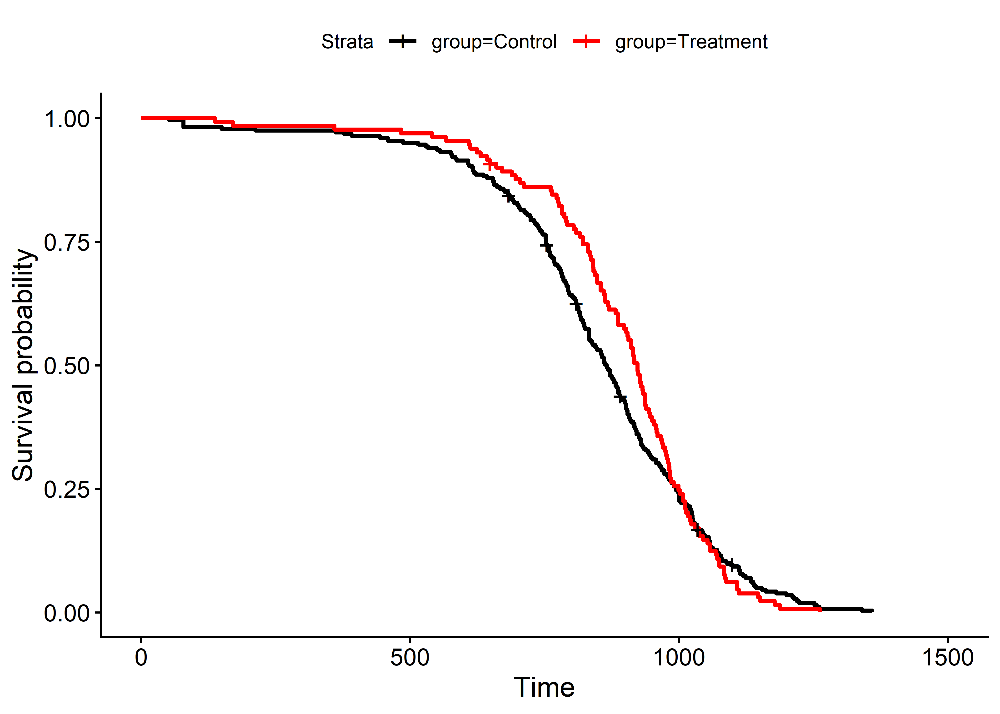
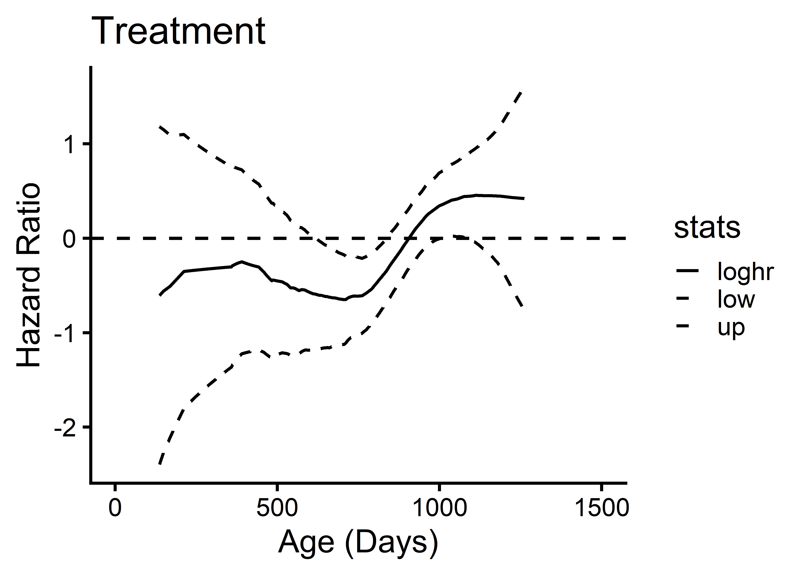
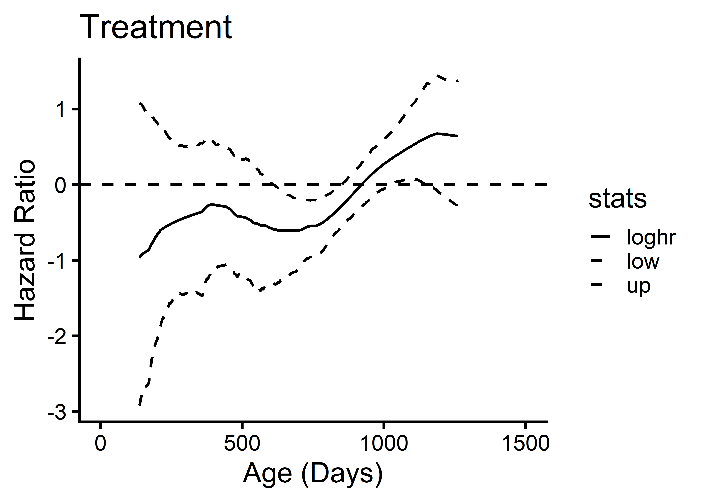
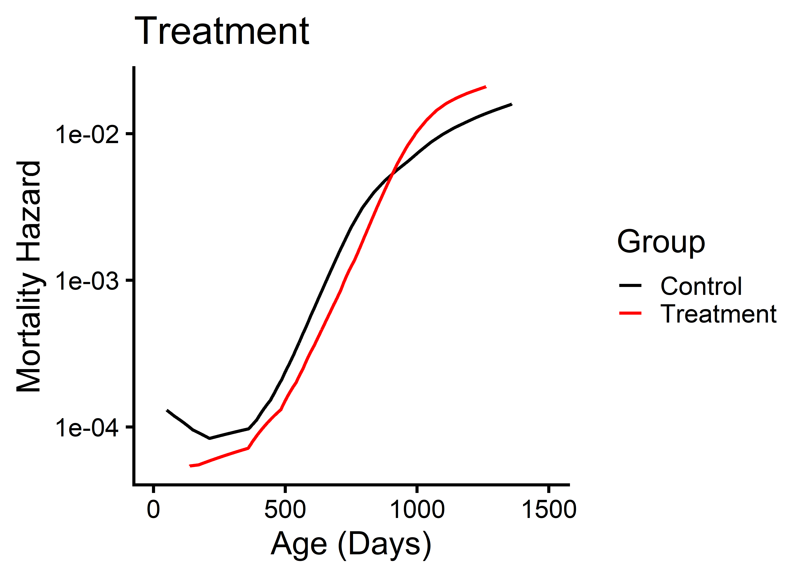
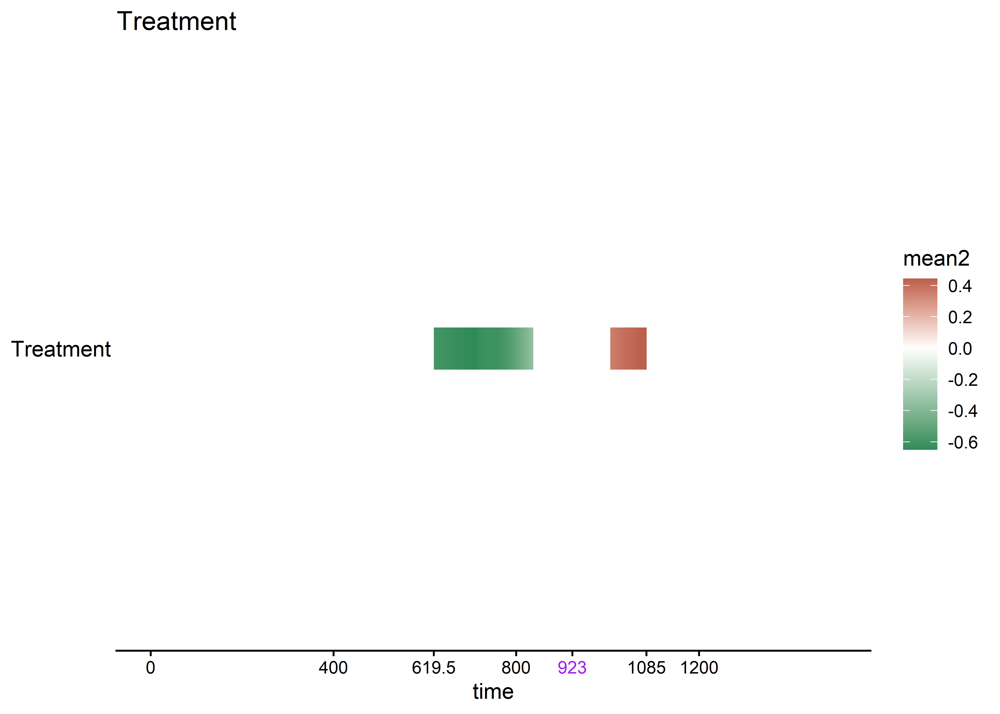
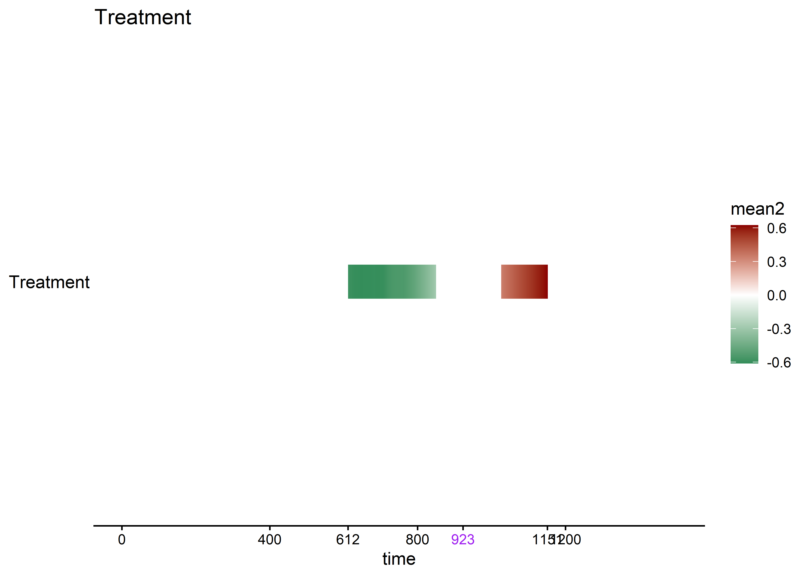
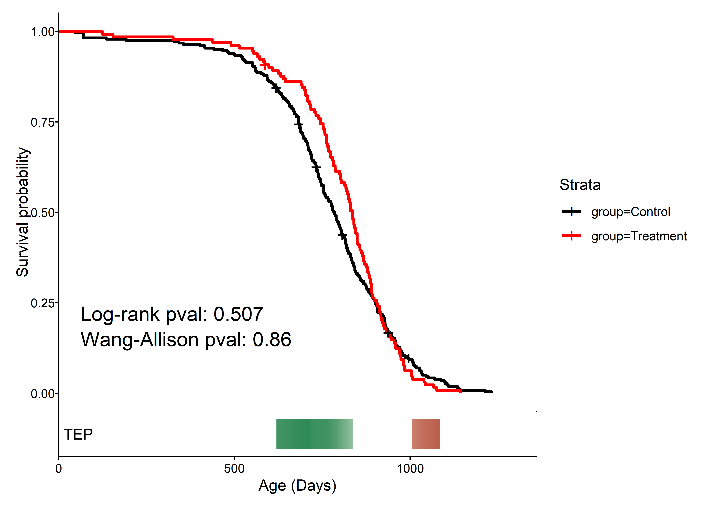
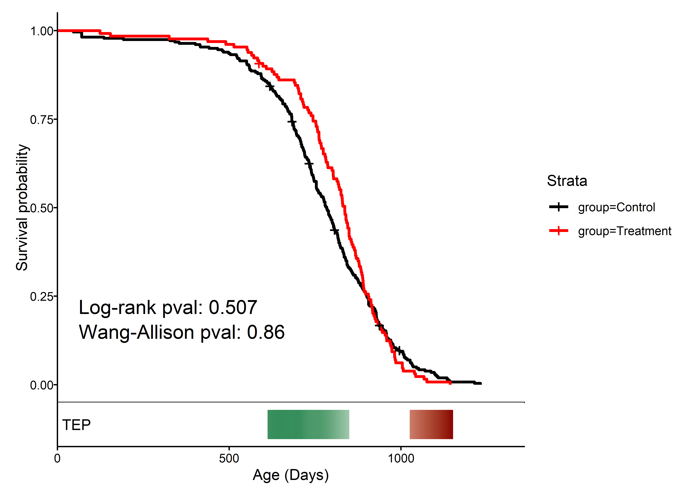

<!-- README.md is generated from README.Rmd. Please edit that file -->

# TEP

<!-- badges: start -->
<!-- badges: end -->

**TEP** provides tools to assess and visualize **temporal efficacy on
mortality hazard**. It estimates **time-varying hazard rates and hazard
ratios** based on smoothed baseline hazards, along with their associated
**confidence intervals (CI)** using both **asymptotic and
bootstrap-based** inference. To improve numerical stability in
small-sample or rare-event settings, TEP incorporates **small-sample
regularization via jittered data augmentation**.

## Installation

You can install the development version from GitHub:

``` r
# install.packages("remotes")
remotes::install_github("liu-dada/TEP")
```

## Example

``` r
library(TEP)
set.seed(42)
# Representative example data
dat <- data.frame(
  group = c(
    rep("Treatment", 130),
    rep("Control", 281)
  ),
  
  age = c(
    966, 792, 1023, 974, 821, 541, 937, 790, 1108, 946, 1085, 1008, 836, 567, 696,
    1013, 902, 648, 944, 776, 689, 804, 1087, 933, 917, 1017, 609, 929, 923, 1001,
    980, 671, 1012, 1074, 976, 787, 869, 1058, 1011, 904, 868, 1083, 1083, 985, 886,
    1020, 1007, 782, 999, 854, 1178, 1108, 990, 764, 960, 939, 978, 624, 1030, 887,
    1057, 483, 835, 1053, 882, 954, 982, 1187, 705, 1037, 840, 969, 984, 648, 970,
    957, 932, 782, 775, 937, 170, 815, 841, 886, 862, 924, 860, 821, 1262, 761, 137,
    915, 927, 927, 914, 359, 711, 911, 1038, 1075, 911, 983, 958, 863, 854, 916, 1151,
    772, 923, 1069, 612, 898, 937, 981, 831, 643, 840, 1147, 950, 1071, 631, 848, 660,
    906, 830, 808, 1111, 847, 1044, 843,
    
    # Control
    979, 832, 1133, 938, 1252, 736, 1021, 443, 1078, 1025, 878, 732, 745, 903, 930,
    656, 991, 818, 768, 973, 1340, 1200, 1099, 754, 832, 882, 608, 753, 691, 705, 794,
    578, 1111, 780, 1081, 907, 1088, 1256, 723, 741, 1154, 703, 533, 813, 889, 902,
    1058, 618, 1211, 1031, 860, 701, 617, 1071, 555, 550, 1223, 759, 808, 957, 1026,
    769, 944, 832, 994, 1024, 1056, 811, 981, 212, 871, 738, 807, 832, 1000, 892, 839,
    910, 763, 1214, 391, 810, 920, 860, 891, 683, 809, 1035, 377, 459, 78, 78, 78, 78,
    752, 724, 1011, 865, 615, 458, 948, 984, 814, 361, 1016, 857, 921, 758, 862, 767,
    965, 149, 994, 848, 654, 927, 1100, 899, 1181, 753, 904, 901, 962, 901, 1161, 999,
    756, 753, 919, 1057, 1075, 904, 917, 746, 1143, 796, 783, 973, 917, 661, 718, 487,
    781, 1219, 1031, 529, 926, 825, 1060, 866, 833, 575, 1134, 890, 968, 686, 1000,
    921, 1055, 900, 915, 724, 986, 1114, 767, 1023, 1111, 1124, 643, 868, 776, 832,
    838, 887, 1359, 791, 886, 636, 1140, 1000, 699, 783, 731, 925, 895, 1119, 942, 801,
    1025, 951, 855, 608, 1095, 753, 932, 871, 1029, 622, 977, 1042, 835, 617, 1079,
    909, 821, 884, 934, 846, 714, 879, 795, 1000, 760, 682, 1030, 785, 609, 1020, 654,
    515, 760, 882, 876, 712, 803, 683, 673, 813, 967, 856, 1072, 667, 758, 824, 1138,
    1064, 1045, 822, 586, 676, 790, 51, 785, 844, 788, 1057, 930, 793, 779, 686, 816,
    874, 774, 1044, 1003, 1048, 794, 809, 854, 887, 656, 1114, 823, 860, 990, 871, 1261,
    584, 946, 1024, 577, 957, 693, 1026, 907, 740, 997, 930, 817, 816, 752
  ),
  
  dead = c(
    rep(1, 17), 0, rep(1, 110),   # GTE
    rep(1, 24), 0, 0, rep(1, 60), 0, 0, 0, 0, rep(1, 193)  # Control
  )
)

# run full TEP workflow
res <- all_func(
  data  = dat,
  var   = "Treatment",
  contr = "Control",
  lim0  = 0,
  lim1  = 1500
)

#> Iterations: relative error in phi-hat = 1e-04
#> phi= 2.43213   sv2= 0.06205526   df= 8.280332   lambda= 39.19297 
#> phi= 2.573917   sv2= 0.02517405   df= 6.394949   lambda= 102.2449 
#> phi= 2.678353   sv2= 0.01632006   df= 5.334931   lambda= 164.1142 
#> phi= 2.732365   sv2= 0.01387279   df= 4.877859   lambda= 196.9586 
#> phi= 2.754973   sv2= 0.01304377   df= 4.711166   lambda= 211.2099 
#> phi= 2.764049   sv2= 0.01273277   df= 4.648574   lambda= 217.0814 
#> phi= 2.767684   sv2= 0.01261122   df= 4.624185   lambda= 219.4621 
#> phi= 2.769143   sv2= 0.01256292   df= 4.61451   lambda= 220.4219 
#> phi= 2.769728   sv2= 0.0125436   df= 4.610644   lambda= 220.8081 
#> phi= 2.769964   sv2= 0.01253586   df= 4.609094   lambda= 220.9632 
#> phi= 2.770058   sv2= 0.01253275   df= 4.608472   lambda= 221.0256 
#> phi= 2.770096   sv2= 0.0125315   df= 4.608222   lambda= 221.0507 
#> phi= 2.770111   sv2= 0.012531   df= 4.608121   lambda= 221.0607 
#> Iterations: relative error in phi-hat = 1e-04 
#> phi= 2.298587   sv2= 0.04898153   df= 9.891011   lambda= 46.92763 
#> phi= 2.383509   sv2= 0.02390385   df= 7.240117   lambda= 99.71235 
#> phi= 2.41271   sv2= 0.01940608   df= 6.215367   lambda= 124.3275 
#> phi= 2.419002   sv2= 0.01831686   df= 5.944192   lambda= 132.0642 
#> phi= 2.420576   sv2= 0.01802371   df= 5.872118   lambda= 134.2995 
#> phi= 2.421003   sv2= 0.01794237   df= 5.852238   lambda= 134.9322 
#> phi= 2.421122   sv2= 0.01791959   df= 5.846684   lambda= 135.1103 
#> phi= 2.421156   sv2= 0.0179132   df= 5.845126   lambda= 135.1604 
#> phi= 2.421165   sv2= 0.01791141   df= 5.844688   lambda= 135.1744 
#> phi= 2.421168   sv2= 0.01791091   df= 5.844566   lambda= 135.1784 
#> Iterations: relative error in phi-hat = 1e-04 
#> phi= 2.574298   sv2= 0.02411343   df= 8.370603   lambda= 106.7578 
phi= 2.625772   sv2= 0.01097459   df= 5.284316   lambda= 239.2591 
#> ...
```

``` r

# Print all plots
res
```
<br>
<br>
<br>
<br>
<br>
<br>
<br>

