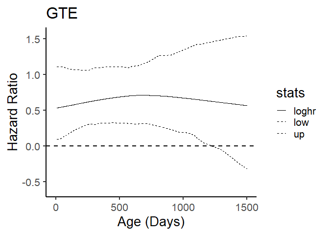
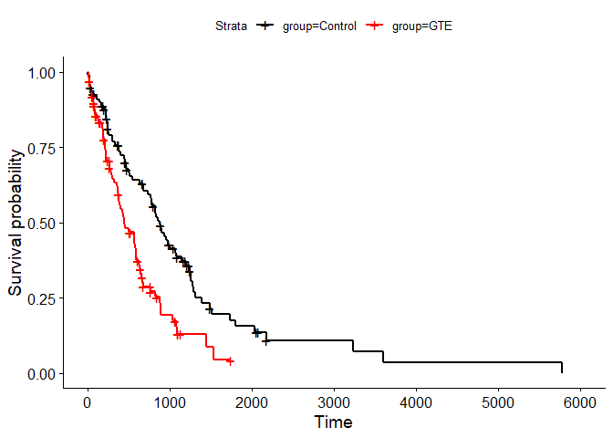
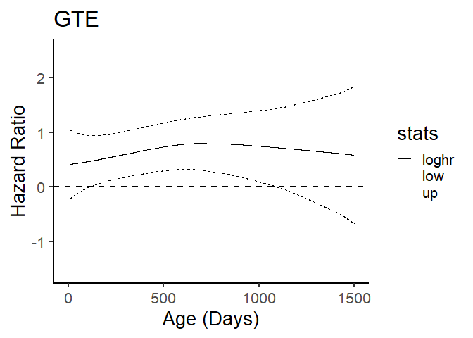
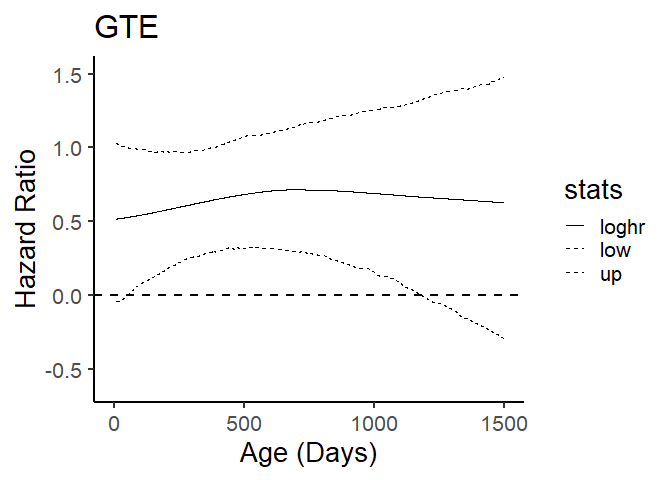
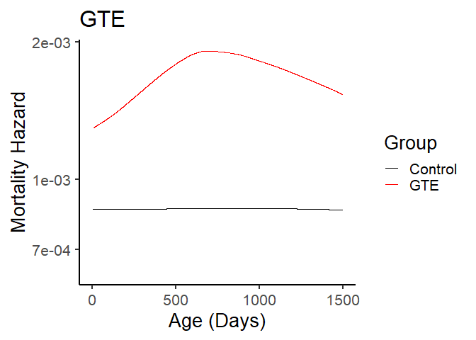
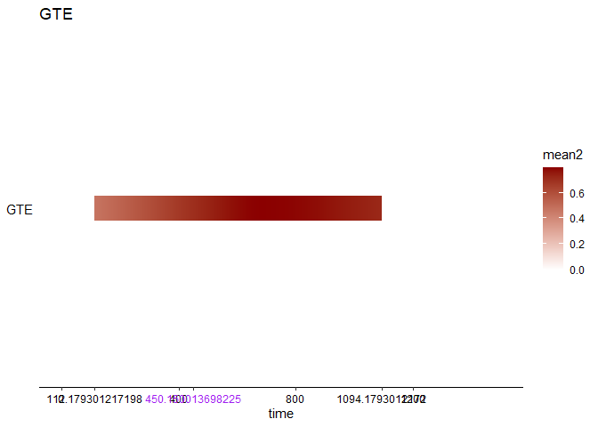
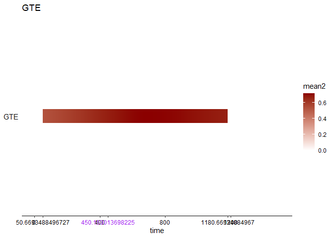
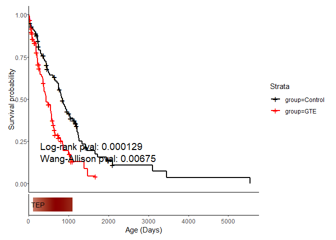
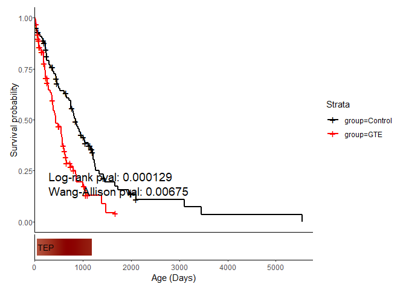

<!-- README.md is generated from README.Rmd. Please edit that file -->

# TEP

<!-- badges: start -->
<!-- badges: end -->

**TEP** provides tools to assess and visualize **temporal efficacy on
mortality hazard**. It estimates **time-varying hazard rates and hazard
ratios** based on smoothed baseline hazards, along with their associated
**confidence intervals (CI)** using both **asymptotic and
bootstrap-based** inference. To improve numerical stability in
small-sample or rare-event settings, TEP incorporates **small-sample
regularization via jittered data augmentation**.

## Installation

You can install the development version from GitHub:

``` r
# install.packages("remotes")
remotes::install_github("liu-dada/TEP")
```

## Example

``` r
library(TEP)
data(example_data_sig)
head(example_data_sig)
#>          age dead   group
#> 1  674.76581    0 Control
#> 2  461.28822    0 Control
#> 3 1063.24389    1 Control
#> 4   25.26189    1 Control
#> 5   44.96878    1 Control
#> 6  253.20097    1 Control

#Bootstrap hazard ratio

hr <- bshr(
data = example_data_sig,
contr = "Control",
var = "GTE",
n_boot = 100
)
#> Iterations: relative error in phi-hat = 1e-04 
#> phi= 7.89951   sv2= 0.02160011   df= 6.16936   lambda= 365.7162 
#> phi= 8.818376   sv2= 0.0009521536   df= 3.449788   lambda= 9261.506 
#> phi= 8.974637   sv2= 0.0001014172   df= 2.221579   lambda= 88492.3 
#> Iterations: relative error in phi-hat = 1e-04 
#> phi= 5.965572   sv2= 0.01772827   df= 7.373726   lambda= 336.5006 
#> phi= 6.42887   sv2= 0.0003149314   df= 3.682199   lambda= 20413.55 
#> Iterations: relative error in phi-hat = 1e-04 
#> phi= 14.86314   sv2= 0.02300163   df= 6.069462   lambda= 646.1775 
#> phi= 15.27171   sv2= 0.001344825   df= 3.141563   lambda= 11355.9 
#> Iterations: relative error in phi-hat = 1e-04 
#> phi= 35.69302   sv2= 0.04837741   df= 6.553456   lambda= 737.8034 
#> phi= 37.67491   sv2= 0.00197851   df= 3.04576   lambda= 19042.06 
#> Iterations: relative error in phi-hat = 1e-04 
#> phi= 46.16214   sv2= 0.02222937   df= 6.039182   lambda= 2076.629 
#> phi= 52.96315   sv2= 0.00036405   df= 2.68607   lambda= 145483.2 
#> Iterations: relative error in phi-hat = 1e-04 
#> phi= 6.686455   sv2= 0.04858775   df= 7.165529   lambda= 137.6161 
#> phi= 6.760078   sv2= 0.003259406   df= 4.344757   lambda= 2074.021 
#> phi= 7.195008   sv2= 0.0007377752   df= 2.751665   lambda= 9752.305 
#> phi= 7.625719   sv2= 0.0002523292   df= 2.274967   lambda= 30221.31 
#> Iterations: relative error in phi-hat = 1e-04 
#> phi= 15.33129   sv2= 0.08010924   df= 6.093802   lambda= 191.3798 
#> phi= 19.35505   sv2= 0.003342738   df= 3.852007   lambda= 5790.18 
#> phi= 20.3058   sv2= 9.616985e-05   df= 2.375856   lambda= 211145.1 
#> Iterations: relative error in phi-hat = 1e-04 
#> phi= 8.767084   sv2= 0.02998662   df= 7.546618   lambda= 292.3665 
#> phi= 9.071579   sv2= 0.0002289558   df= 3.895266   lambda= 39621.53 
#> Iterations: relative error in phi-hat = 1e-04 
#> phi= 16.88026   sv2= 0.1019418   df= 8.227753   lambda= 165.5872 
#> phi= 18.35159   sv2= 0.005604549   df= 4.619178   lambda= 3274.409 
#> phi= 23.02865   sv2= 0.000528215   df= 2.744458   lambda= 43597.12 
#> Iterations: relative error in phi-hat = 1e-04 
#> phi= 6.756084   sv2= 0.04786101   df= 7.5322   lambda= 141.1605 
#> phi= 7.09885   sv2= 0.002571553   df= 4.491329   lambda= 2760.53 
#> phi= 7.500299   sv2= 0.0001351466   df= 2.701924   lambda= 55497.5 
#> Iterations: relative error in phi-hat = 1e-04 
#> phi= 6.802484   sv2= 0.04093729   df= 5.875428   lambda= 166.1684 
#> phi= 7.808381   sv2= 0.003175122   df= 3.85148   lambda= 2459.238 
#> phi= 8.898064   sv2= 0.0002874389   df= 2.583617   lambda= 30956.37 
#> Iterations: relative error in phi-hat = 1e-04 
#> phi= 12.51563   sv2= 0.05748631   df= 7.608699   lambda= 217.7149 
#> phi= 15.34888   sv2= 0.003327619   df= 4.266793   lambda= 4612.573 
#> phi= 16.44732   sv2= 0.0001226466   df= 2.518463   lambda= 134103.3 
#> Iterations: relative error in phi-hat = 1e-04 
#> phi= 52.10392   sv2= 0.05065007   df= 5.756511   lambda= 1028.704 
#> phi= 64.57861   sv2= 0.001219846   df= 2.882514   lambda= 52939.95 
#> Iterations: relative error in phi-hat = 1e-04 
#> phi= 15.20412   sv2= 0.08723782   df= 7.605177   lambda= 174.2836 
#> phi= 21.29488   sv2= 0.003672445   df= 4.314587   lambda= 5798.557 
#> phi= 25.03636   sv2= 7.705417e-05   df= 2.392993   lambda= 324919 
#> Iterations: relative error in phi-hat = 1e-04 
#> phi= 8.010547   sv2= 0.02830008   df= 5.81736   lambda= 283.0574 
#> phi= 8.72687   sv2= 0.0008505817   df= 3.547891   lambda= 10259.88 
#> Iterations: relative error in phi-hat = 1e-04 
#> phi= 7.063488   sv2= 0.0285874   df= 7.174869   lambda= 247.0839 
#> phi= 7.369903   sv2= 0.001123395   df= 3.84307   lambda= 6560.387 
#> phi= 8.119509   sv2= 0.0002631551   df= 2.32583   lambda= 30854.46 
#> Iterations: relative error in phi-hat = 1e-04 
#> phi= 146.9901   sv2= 0.04308565   df= 6.979524   lambda= 3411.579 
#> phi= 158.9165   sv2= 0.0001523273   df= 2.525934   lambda= 1043257 
#> Iterations: relative error in phi-hat = 1e-04 
#> phi= 4.146266   sv2= 0.05517604   df= 7.696587   lambda= 75.14613 
#> phi= 4.635968   sv2= 0.005094073   df= 5.271273   lambda= 910.071 
#> phi= 4.846412   sv2= 0.0002457266   df= 3.304757   lambda= 19722.79 
#> Iterations: relative error in phi-hat = 1e-04 
#> phi= 18.36901   sv2= 0.02276801   df= 5.315551   lambda= 806.7902 
#> phi= 18.10846   sv2= 0.001892756   df= 2.913135   lambda= 9567.246 
#> phi= 17.48767   sv2= 0.0005545297   df= 2.215551   lambda= 31536.03 
#> Iterations: relative error in phi-hat = 1e-04 
#> phi= 6.501962   sv2= 0.07785556   df= 7.560059   lambda= 83.51313 
#> phi= 7.661891   sv2= 0.005540006   df= 5.049161   lambda= 1383.011 
#> phi= 8.232468   sv2= 0.0002358755   df= 2.939664   lambda= 34901.76 
#> Iterations: relative error in phi-hat = 1e-04 
#> phi= 17.31035   sv2= 0.06639679   df= 6.2235   lambda= 260.7106 
#> phi= 21.44924   sv2= 0.002863169   df= 3.659955   lambda= 7491.433 
#> phi= 24.7773   sv2= 0.0002343906   df= 2.274422   lambda= 105709.4 
#> Iterations: relative error in phi-hat = 1e-04 
#> phi= 7.436189   sv2= 0.02880388   df= 7.298031   lambda= 258.1662 
#> phi= 7.629806   sv2= 0.001657807   df= 3.909367   lambda= 4602.349 
#> phi= 7.711974   sv2= 0.0003624   df= 2.459591   lambda= 21280.28 
#> Iterations: relative error in phi-hat = 1e-04 
#> phi= 12.15265   sv2= 0.04909269   df= 5.700899   lambda= 247.545 
#> phi= 13.95374   sv2= 0.001483796   df= 3.470288   lambda= 9404.078 
#> phi= 15.01393   sv2= 5.007869e-05   df= 2.174363   lambda= 299806.8 
#> Iterations: relative error in phi-hat = 1e-04 
#> phi= 5.954058   sv2= 0.03560545   df= 7.541934   lambda= 167.2233 
#> phi= 5.916625   sv2= 0.002778376   df= 4.335582   lambda= 2129.527 
#> phi= 6.179667   sv2= 0.000449033   df= 2.766641   lambda= 13762.17 
#> Iterations: relative error in phi-hat = 1e-04 
#> phi= 16.22129   sv2= 0.08200497   df= 6.134416   lambda= 197.8086 
#> phi= 17.96744   sv2= 0.003881262   df= 3.851203   lambda= 4629.277 
#> phi= 17.13741   sv2= 9.564269e-05   df= 2.426691   lambda= 179181.6 
#> Iterations: relative error in phi-hat = 1e-04 
#> phi= 16.03791   sv2= 0.03546599   df= 7.343083   lambda= 452.2054 
#> phi= 18.96876   sv2= 0.001707161   df= 3.457692   lambda= 11111.29 
#> Iterations: relative error in phi-hat = 1e-04 
#> phi= 6.349425   sv2= 0.05239652   df= 7.884988   lambda= 121.1803 
#> phi= 6.551727   sv2= 0.003447237   df= 4.788186   lambda= 1900.573 
#> phi= 6.227224   sv2= 0.000455502   df= 2.884758   lambda= 13671.12 
#> Iterations: relative error in phi-hat = 1e-04 
#> phi= 18.5583   sv2= 0.02768291   df= 7.693623   lambda= 670.3884 
#> phi= 19.45183   sv2= 0.0002659016   df= 3.455099   lambda= 73154.23 
#> Iterations: relative error in phi-hat = 1e-04 
#> phi= 41.82013   sv2= 0.08121735   df= 5.786703   lambda= 514.9162 
#> phi= 60.82451   sv2= 0.003845262   df= 3.22306   lambda= 15818.04 
#> Iterations: relative error in phi-hat = 1e-04 
#> phi= 17.52396   sv2= 0.06959306   df= 7.423776   lambda= 251.8061 
#> phi= 21.0798   sv2= 0.004658896   df= 3.964958   lambda= 4524.634 
#> phi= 25.48284   sv2= 0.0003491355   df= 2.470899   lambda= 72988.4 
#> Iterations: relative error in phi-hat = 1e-04 
#> phi= 26.31416   sv2= 0.05703302   df= 6.626656   lambda= 461.3846 
#> phi= 29.99247   sv2= 0.002060664   df= 3.453421   lambda= 14554.76 
#> Iterations: relative error in phi-hat = 1e-04 
#> phi= 41.31492   sv2= 0.04563199   df= 7.427293   lambda= 905.3937 
#> phi= 47.42853   sv2= 0.00118967   df= 3.258315   lambda= 39866.98 
#> Iterations: relative error in phi-hat = 1e-04 
#> phi= 3.417394   sv2= 0.02937829   df= 7.223067   lambda= 116.3238 
#> phi= 3.546597   sv2= 0.002694469   df= 4.432221   lambda= 1316.251 
#> phi= 3.63127   sv2= 0.0005747025   df= 2.954254   lambda= 6318.521 
#> phi= 3.71597   sv2= 0.0002433021   df= 2.380217   lambda= 15273.07 
#> Iterations: relative error in phi-hat = 1e-04 
#> phi= 24.79617   sv2= 0.02119734   df= 7.066585   lambda= 1169.778 
#> phi= 26.88488   sv2= 0.001682293   df= 2.94741   lambda= 15981.09 
#> Iterations: relative error in phi-hat = 1e-04 
#> phi= 21.18273   sv2= 0.03934379   df= 7.351119   lambda= 538.4008 
#> phi= 19.11853   sv2= 0.0002524174   df= 3.503857   lambda= 75741.71 
#> Iterations: relative error in phi-hat = 1e-04 
#> phi= 6.4237   sv2= 0.04324785   df= 7.348494   lambda= 148.5322 
#> phi= 6.833165   sv2= 0.003751842   df= 4.287163   lambda= 1821.283 
#> phi= 7.056007   sv2= 0.0003029638   df= 2.752126   lambda= 23289.94 
#> Iterations: relative error in phi-hat = 1e-04 
#> phi= 6.529761   sv2= 0.006974178   df= 5.896776   lambda= 936.2769 
#> phi= 6.419606   sv2= 6.262999e-05   df= 2.993565   lambda= 102500.5 
#> Iterations: relative error in phi-hat = 1e-04 
#> phi= 8.707494   sv2= 0.03246238   df= 7.4695   lambda= 268.2334 
#> phi= 9.019701   sv2= 0.0003535272   df= 3.90266   lambda= 25513.46 
#> Iterations: relative error in phi-hat = 1e-04 
#> phi= 10.36606   sv2= 0.04682759   df= 6.203382   lambda= 221.3665 
#> phi= 11.34306   sv2= 0.005882495   df= 3.84466   lambda= 1928.274 
#> phi= 12.47145   sv2= 0.001114126   df= 2.811175   lambda= 11193.93 
#> Iterations: relative error in phi-hat = 1e-04 
#> phi= 2.939731   sv2= 0.04159474   df= 7.017692   lambda= 70.67556 
#> phi= 3.032707   sv2= 0.003750905   df= 4.829622   lambda= 808.5268 
#> phi= 3.079907   sv2= 0.0003207107   df= 3.103891   lambda= 9603.381 
#> phi= 3.107915   sv2= 5.07714e-05   df= 2.220434   lambda= 61213.89 
#> Iterations: relative error in phi-hat = 1e-04 
#> phi= 29.26012   sv2= 0.03218525   df= 5.197589   lambda= 909.1159 
#> phi= 30.70121   sv2= 0.0009945385   df= 2.8318   lambda= 30869.81 
#> Iterations: relative error in phi-hat = 1e-04 
#> phi= 9.458222   sv2= 0.05416523   df= 7.601502   lambda= 174.6179 
#> phi= 10.21814   sv2= 0.001583471   df= 4.369727   lambda= 6452.998 
#> phi= 10.52601   sv2= 0.000190023   df= 2.423546   lambda= 55393.35 
#> Iterations: relative error in phi-hat = 1e-04 
#> phi= 6.493951   sv2= 0.04034763   df= 6.176303   lambda= 160.95 
#> phi= 6.942872   sv2= 0.002516978   df= 3.959473   lambda= 2758.416 
#> phi= 7.132048   sv2= 0.0001135084   df= 2.538165   lambda= 62832.78 
#> Iterations: relative error in phi-hat = 1e-04 
#> phi= 5.883875   sv2= 0.03288596   df= 7.237035   lambda= 178.9175 
#> phi= 6.422583   sv2= 0.001019287   df= 4.088001   lambda= 6301.053 
#> phi= 6.514427   sv2= 1.386394e-05   df= 2.274171   lambda= 469882.8 
#> Iterations: relative error in phi-hat = 1e-04 
#> phi= 7.834625   sv2= 0.05724113   df= 5.985833   lambda= 136.8706 
#> phi= 9.319255   sv2= 0.003899248   df= 3.97566   lambda= 2390.013 
#> phi= 10.86591   sv2= 0.0004364926   df= 2.561138   lambda= 24893.69 
#> Iterations: relative error in phi-hat = 1e-04 
#> phi= 24.26202   sv2= 0.08189971   df= 6.519599   lambda= 296.2406 
#> phi= 31.79003   sv2= 0.006308727   df= 3.630165   lambda= 5039.055 
#> phi= 36.21753   sv2= 0.0003143556   df= 2.391011   lambda= 115212 
#> Iterations: relative error in phi-hat = 1e-04 
#> phi= 13.80716   sv2= 0.02413024   df= 4.944452   lambda= 572.1933 
#> phi= 13.55599   sv2= 0.0003073798   df= 2.930547   lambda= 44101.76 
#> Iterations: relative error in phi-hat = 1e-04 
#> phi= 16.97379   sv2= 0.05625777   df= 7.233719   lambda= 301.7145 
#> phi= 16.43928   sv2= 0.001249544   df= 3.784722   lambda= 13156.22 
#> Iterations: relative error in phi-hat = 1e-04 
#> phi= 4.020907   sv2= 0.07015283   df= 7.005261   lambda= 57.31639 
#> phi= 4.092689   sv2= 0.01036359   df= 5.119082   lambda= 394.9104 
#> phi= 4.132789   sv2= 0.001024407   df= 3.715693   lambda= 4034.323 
#> phi= 4.128192   sv2= 8.038602e-05   df= 2.598455   lambda= 51354.6 
#> Iterations: relative error in phi-hat = 1e-04 
#> phi= 6.299702   sv2= 0.03668602   df= 7.142632   lambda= 171.7194 
#> phi= 7.292626   sv2= 0.002063785   df= 4.117178   lambda= 3533.617 
#> phi= 7.630005   sv2= 0.0002213976   df= 2.507503   lambda= 34462.9 
#> Iterations: relative error in phi-hat = 1e-04 
#> phi= 29.94158   sv2= 0.02374659   df= 5.998181   lambda= 1260.879 
#> phi= 38.8363   sv2= 0.001476582   df= 2.838473   lambda= 26301.49 
#> Iterations: relative error in phi-hat = 1e-04 
#> phi= 19.16362   sv2= 0.03597458   df= 7.210729   lambda= 532.6989 
#> phi= 19.95421   sv2= 0.001405873   df= 3.320422   lambda= 14193.47 
#> Iterations: relative error in phi-hat = 1e-04 
#> phi= 2.528627   sv2= 0.03197312   df= 6.053204   lambda= 79.08601 
#> phi= 2.550292   sv2= 0.004630545   df= 4.384038   lambda= 550.7541 
#> phi= 2.598672   sv2= 0.001031577   df= 3.230822   lambda= 2519.126 
#> phi= 2.65542   sv2= 0.0004921354   df= 2.584504   lambda= 5395.71 
#> phi= 2.687875   sv2= 0.0002991334   df= 2.353293   lambda= 8985.539 
#> phi= 2.706734   sv2= 0.0002017939   df= 2.238839   lambda= 13413.36 
#> Iterations: relative error in phi-hat = 1e-04 
#> phi= 9.397722   sv2= 0.02072097   df= 6.221258   lambda= 453.5368 
#> phi= 9.648904   sv2= 0.003067089   df= 3.280996   lambda= 3145.949 
#> phi= 10.03801   sv2= 0.001354568   df= 2.544302   lambda= 7410.485 
#> phi= 10.31984   sv2= 0.0007371917   df= 2.320554   lambda= 13998.86 
#> Iterations: relative error in phi-hat = 1e-04 
#> phi= 12.75408   sv2= 0.06532761   df= 6.268647   lambda= 195.2327 
#> phi= 15.36172   sv2= 0.003599748   df= 3.883249   lambda= 4267.444 
#> phi= 14.26724   sv2= 0.0004010462   df= 2.425211   lambda= 35575.05 
#> Iterations: relative error in phi-hat = 1e-04 
#> phi= 13.74435   sv2= 0.04042591   df= 7.16774   lambda= 339.9886 
#> phi= 15.77113   sv2= 0.002475978   df= 3.699693   lambda= 6369.655 
#> phi= 18.06787   sv2= 0.0001144904   df= 2.345192   lambda= 157811.3 
#> Iterations: relative error in phi-hat = 1e-04 
#> phi= 6.792524   sv2= 0.01704929   df= 6.319687   lambda= 398.405 
#> phi= 6.694757   sv2= 0.0007784066   df= 3.537427   lambda= 8600.591 
#> phi= 6.405614   sv2= 7.326072e-05   df= 2.290194   lambda= 87435.86 
#> Iterations: relative error in phi-hat = 1e-04 
#> phi= 6.060004   sv2= 0.06668146   df= 7.086476   lambda= 90.87989 
#> phi= 6.277378   sv2= 0.003342919   df= 4.685499   lambda= 1877.813 
#> phi= 6.304847   sv2= 0.0001715218   df= 2.809819   lambda= 36758.28 
#> Iterations: relative error in phi-hat = 1e-04 
#> phi= 28.96358   sv2= 0.05038606   df= 5.225033   lambda= 574.8332 
#> phi= 35.17577   sv2= 0.0008099011   df= 3.039291   lambda= 43432.19 
#> Iterations: relative error in phi-hat = 1e-04 
#> phi= 17.4172   sv2= 0.08822203   df= 7.3012   lambda= 197.4246 
#> phi= 21.87026   sv2= 0.002104958   df= 4.097692   lambda= 10389.88 
#> Iterations: relative error in phi-hat = 1e-04 
#> phi= 4.747421   sv2= 0.01428178   df= 6.237333   lambda= 332.411 
#> phi= 4.800446   sv2= 0.0001866661   df= 3.620778   lambda= 25716.76 
#> Iterations: relative error in phi-hat = 1e-04 
#> phi= 2.490574   sv2= 0.04108681   df= 7.273387   lambda= 60.61735 
#> phi= 2.561625   sv2= 0.004799652   df= 5.115154   lambda= 533.7104 
#> phi= 2.593457   sv2= 0.000549963   df= 3.393052   lambda= 4715.693 
#> phi= 2.586007   sv2= 6.494031e-05   df= 2.404325   lambda= 39821.3 
#> Iterations: relative error in phi-hat = 1e-04 
#> phi= 19.1507   sv2= 0.03932099   df= 7.203253   lambda= 487.035 
#> phi= 24.27453   sv2= 0.001808379   df= 3.45825   lambda= 13423.37 
#> Iterations: relative error in phi-hat = 1e-04 
#> phi= 6.539033   sv2= 0.02075368   df= 6.755921   lambda= 315.0782 
#> phi= 6.936629   sv2= 0.0016374   df= 3.732845   lambda= 4236.369 
#> phi= 7.293017   sv2= 0.0002303078   df= 2.494058   lambda= 31666.4 
#> Iterations: relative error in phi-hat = 1e-04 
#> phi= 7.191725   sv2= 0.03264765   df= 7.112449   lambda= 220.2831 
#> phi= 8.332602   sv2= 0.001119763   df= 4.050039   lambda= 7441.399 
#> phi= 8.838494   sv2= 2.390354e-05   df= 2.317831   lambda= 369756.8 
#> Iterations: relative error in phi-hat = 1e-04 
#> phi= 3.112718   sv2= 0.06541389   df= 7.674006   lambda= 47.58496 
#> phi= 3.519505   sv2= 0.0100267   df= 5.627635   lambda= 351.0132 
#> phi= 3.743432   sv2= 0.001364651   df= 3.84405   lambda= 2743.142 
#> phi= 3.827787   sv2= 0.0001509893   df= 2.696179   lambda= 25351.37 
#> Iterations: relative error in phi-hat = 1e-04 
#> phi= 10.62803   sv2= 0.03774656   df= 7.002943   lambda= 281.5629 
#> phi= 11.78606   sv2= 0.001712574   df= 3.710898   lambda= 6882.073 
#> phi= 12.407   sv2= 0.0001774848   df= 2.33219   lambda= 69904.55 
#> Iterations: relative error in phi-hat = 1e-04 
#> phi= 7.751868   sv2= 0.05382175   df= 6.97336   lambda= 144.0285 
#> phi= 7.86361   sv2= 0.002926424   df= 4.216133   lambda= 2687.105 
#> phi= 8.251104   sv2= 0.000356719   df= 2.608295   lambda= 23130.55 
#> Iterations: relative error in phi-hat = 1e-04 
#> phi= 15.0743   sv2= 0.03961255   df= 6.108909   lambda= 380.5437 
#> phi= 17.08374   sv2= 0.002621475   df= 3.495778   lambda= 6516.843 
#> phi= 18.67621   sv2= 0.0001472405   df= 2.337985   lambda= 126841.5 
#> Iterations: relative error in phi-hat = 1e-04 
#> phi= 24.44015   sv2= 0.05458751   df= 7.513748   lambda= 447.7241 
#> phi= 24.00306   sv2= 0.001209285   df= 3.720444   lambda= 19848.97 
#> Iterations: relative error in phi-hat = 1e-04 
#> phi= 3.041985   sv2= 0.004942625   df= 5.950238   lambda= 615.4593 
#> phi= 3.001774   sv2= 0.0001365513   df= 3.163944   lambda= 21982.77 
#> Iterations: relative error in phi-hat = 1e-04 
#> phi= 7.579389   sv2= 0.07134364   df= 7.413609   lambda= 106.2378 
#> phi= 8.793431   sv2= 0.006397145   df= 4.693792   lambda= 1374.587 
#> phi= 9.39603   sv2= 0.0005065517   df= 2.956851   lambda= 18549.01 
#> Iterations: relative error in phi-hat = 1e-04 
#> phi= 7.695996   sv2= 0.05606274   df= 5.109694   lambda= 137.2747 
#> phi= 8.280072   sv2= 0.003180365   df= 3.543448   lambda= 2603.498 
#> phi= 7.939887   sv2= 0.0003355532   df= 2.523595   lambda= 23662.08 
#> Iterations: relative error in phi-hat = 1e-04 
#> phi= 4.322388   sv2= 0.05699257   df= 7.333054   lambda= 75.84124 
#> phi= 4.846557   sv2= 0.01267969   df= 5.00687   lambda= 382.2299 
#> phi= 5.390426   sv2= 0.00387425   df= 3.740917   lambda= 1391.347 
#> phi= 5.801089   sv2= 0.001557106   df= 3.02135   lambda= 3725.559 
#> phi= 6.135704   sv2= 0.0008246377   df= 2.612376   lambda= 7440.484 
#> phi= 6.369051   sv2= 0.0005042602   df= 2.392319   lambda= 12630.49 
#> Iterations: relative error in phi-hat = 1e-04 
#> phi= 24.44013   sv2= 0.03797937   df= 7.249546   lambda= 643.5107 
#> phi= 24.04496   sv2= 0.001145146   df= 3.244881   lambda= 20997.28 
#> Iterations: relative error in phi-hat = 1e-04 
#> phi= 10.7154   sv2= 0.0415199   df= 7.538375   lambda= 258.0786 
#> phi= 10.21667   sv2= 0.001386806   df= 4.062579   lambda= 7367.052 
#> phi= 9.75581   sv2= 3.180342e-05   df= 2.35216   lambda= 306753.5 
#> Iterations: relative error in phi-hat = 1e-04 
#> phi= 27.76056   sv2= 0.02598683   df= 7.089454   lambda= 1068.255 
#> phi= 25.23225   sv2= 0.000319855   df= 3.038178   lambda= 78886.53 
#> Iterations: relative error in phi-hat = 1e-04 
#> phi= 7.657865   sv2= 0.04395773   df= 6.679892   lambda= 174.2098 
#> phi= 7.748219   sv2= 0.003900584   df= 3.976206   lambda= 1986.425 
#> phi= 7.779776   sv2= 0.001687173   df= 2.730183   lambda= 4611.131 
#> phi= 7.837144   sv2= 0.001009505   df= 2.461918   lambda= 7763.349 
#> phi= 7.88273   sv2= 0.000684909   df= 2.329299   lambda= 11509.16 
#> Iterations: relative error in phi-hat = 1e-04 
#> phi= 12.59919   sv2= 0.08177536   df= 8.109981   lambda= 154.0707 
#> phi= 14.638   sv2= 0.00687645   df= 4.647859   lambda= 2128.715 
#> phi= 16.94977   sv2= 0.0007508235   df= 2.927347   lambda= 22574.91 
#> Iterations: relative error in phi-hat = 1e-04 
#> phi= 30.14276   sv2= 0.01588796   df= 6.742604   lambda= 1897.208 
#> phi= 32.31834   sv2= 0.001015497   df= 2.650316   lambda= 31825.16 
#> Iterations: relative error in phi-hat = 1e-04 
#> phi= 18.59889   sv2= 0.09859912   df= 6.275204   lambda= 188.6314 
#> phi= 21.51566   sv2= 0.005423079   df= 3.952599   lambda= 3967.426 
#> phi= 19.03256   sv2= 0.0002959359   df= 2.507444   lambda= 64313.13 
#> Iterations: relative error in phi-hat = 1e-04 
#> phi= 2.730202   sv2= 0.02399303   df= 6.977366   lambda= 113.7915 
#> phi= 2.847921   sv2= 0.001612049   df= 4.367576   lambda= 1766.646 
#> phi= 2.994817   sv2= 0.000278936   df= 2.738787   lambda= 10736.57 
#> Iterations: relative error in phi-hat = 1e-04 
#> phi= 9.016714   sv2= 0.01958832   df= 4.976246   lambda= 460.3108 
#> phi= 8.870715   sv2= 0.005140847   df= 2.992941   lambda= 1725.536 
#> phi= 8.153266   sv2= 0.003561192   df= 2.592052   lambda= 2289.477 
#> phi= 7.989094   sv2= 0.003122015   df= 2.509054   lambda= 2558.954 
#> phi= 7.928196   sv2= 0.002948026   df= 2.477264   lambda= 2689.324 
#> phi= 7.901849   sv2= 0.002870619   df= 2.463282   lambda= 2752.664 
#> phi= 7.889699   sv2= 0.002834459   df= 2.456782   lambda= 2783.493 
#> phi= 7.88393   sv2= 0.002817187   df= 2.453684   lambda= 2798.511 
#> phi= 7.881153   sv2= 0.00280885   df= 2.45219   lambda= 2805.829 
#> phi= 7.879808   sv2= 0.002804805   df= 2.451466   lambda= 2809.397 
#> phi= 7.879155   sv2= 0.002802837   df= 2.451114   lambda= 2811.135 
#> phi= 7.878836   sv2= 0.002801879   df= 2.450942   lambda= 2811.983 
#> phi= 7.878681   sv2= 0.002801412   df= 2.450859   lambda= 2812.396 
#> phi= 7.878606   sv2= 0.002801185   df= 2.450818   lambda= 2812.598 
#> Iterations: relative error in phi-hat = 1e-04 
#> phi= 15.15249   sv2= 0.0586799   df= 7.309048   lambda= 258.2228 
#> phi= 19.35943   sv2= 0.004794807   df= 3.942152   lambda= 4037.582 
#> phi= 21.73576   sv2= 0.0004986047   df= 2.532443   lambda= 43593.16 
#> Iterations: relative error in phi-hat = 1e-04 
#> phi= 17.94114   sv2= 0.01440529   df= 6.278612   lambda= 1245.455 
#> phi= 21.77765   sv2= 0.0003371189   df= 2.972078   lambda= 64599.31 
#> Iterations: relative error in phi-hat = 1e-04 
#> phi= 2.325067   sv2= 0.02362133   df= 6.54506   lambda= 98.43083 
#> phi= 2.365238   sv2= 0.004275569   df= 4.373423   lambda= 553.1984 
#> phi= 2.403383   sv2= 0.001335249   df= 3.264874   lambda= 1799.952 
#> phi= 2.445576   sv2= 0.0003910299   df= 2.702375   lambda= 6254.192 
#> phi= 2.47292   sv2= 9.584562e-05   df= 2.299257   lambda= 25801.08 
#> Iterations: relative error in phi-hat = 1e-04 
#> phi= 7.433274   sv2= 0.04498146   df= 8.145895   lambda= 165.2519 
#> phi= 8.512288   sv2= 0.004414687   df= 4.537614   lambda= 1928.175 
#> phi= 9.779588   sv2= 0.000508582   df= 2.922344   lambda= 19229.13 
#> Iterations: relative error in phi-hat = 1e-04 
#> phi= 7.111045   sv2= 0.01821128   df= 7.406994   lambda= 390.4748 
#> phi= 7.769787   sv2= 0.0005230386   df= 3.84027   lambda= 14855.09 
#> Iterations: relative error in phi-hat = 1e-04 
#> phi= 9.461039   sv2= 0.03725253   df= 7.122156   lambda= 253.9704 
#> phi= 11.1788   sv2= 0.00160716   df= 3.96822   lambda= 6955.623 
#> phi= 11.67888   sv2= 6.141314e-05   df= 2.365725   lambda= 190169.1 
#> Iterations: relative error in phi-hat = 1e-04 
#> phi= 7.269075   sv2= 0.04745766   df= 7.135573   lambda= 153.1697 
#> phi= 8.014909   sv2= 0.005794719   df= 4.174287   lambda= 1383.14 
#> phi= 8.515644   sv2= 0.001908762   df= 2.831849   lambda= 4461.343 
#> phi= 8.996651   sv2= 0.000868384   df= 2.409713   lambda= 10360.22 
#> Iterations: relative error in phi-hat = 1e-04 
#> phi= 10.3095   sv2= 0.05356914   df= 7.013579   lambda= 192.4522 
#> phi= 11.72923   sv2= 0.007020537   df= 3.955413   lambda= 1670.702 
#> phi= 12.83087   sv2= 0.0005311549   df= 2.803079   lambda= 24156.55 
#> Iterations: relative error in phi-hat = 1e-04 
#> phi= 12.69619   sv2= 0.06897411   df= 7.560568   lambda= 184.0718 
#> phi= 16.36756   sv2= 0.002881497   df= 4.342687   lambda= 5680.228 
#> phi= 18.64566   sv2= 8.480919e-05   df= 2.452708   lambda= 219854.3 
#> Iterations: relative error in phi-hat = 1e-04 
#> phi= 12.22075   sv2= 0.02561603   df= 5.913348   lambda= 477.0745 
#> phi= 12.18927   sv2= 0.001250699   df= 3.221004   lambda= 9745.969 
#> phi= 11.10046   sv2= 0.0001824953   df= 2.189956   lambda= 60826 
#> Iterations: relative error in phi-hat = 1e-04 
#> phi= 6.454063   sv2= 0.06371609   df= 7.431799   lambda= 101.2941 
#> phi= 7.172487   sv2= 0.003997141   df= 4.776081   lambda= 1794.404 
#> phi= 7.480387   sv2= 0.0005363963   df= 2.826084   lambda= 13945.63 
#> Iterations: relative error in phi-hat = 1e-04 
#> phi= 7.978987   sv2= 0.06481263   df= 6.35723   lambda= 123.1085 
#> phi= 8.946727   sv2= 0.004130928   df= 4.25442   lambda= 2165.791 
#> phi= 9.226018   sv2= 8.0071e-05   df= 2.765213   lambda= 115223 
#> Iterations: relative error in phi-hat = 1e-04 
#> phi= 7.55745   sv2= 0.1090341   df= 7.355445   lambda= 69.3127 
#> phi= 8.472516   sv2= 0.01253307   df= 5.122841   lambda= 676.0129 
#> phi= 8.948407   sv2= 0.0009913253   df= 3.36423   lambda= 9026.712 
#> phi= 9.104953   sv2= 0.0001670726   df= 2.310871   lambda= 54496.98 
#> Iterations: relative error in phi-hat = 1e-04 
#> phi= 7.645011   sv2= 0.02679098   df= 5.987868   lambda= 285.3576 
#> phi= 7.108065   sv2= 0.001685211   df= 3.638028   lambda= 4217.907 
#> phi= 7.099569   sv2= 7.765688e-05   df= 2.4634   lambda= 91422.28 
#> Iterations: relative error in phi-hat = 1e-04 
#> phi= 8.758857   sv2= 0.06858245   df= 7.013733   lambda= 127.7128 
#> phi= 9.71584   sv2= 0.004309425   df= 4.380137   lambda= 2254.556 
#> phi= 10.42234   sv2= 0.0002426632   df= 2.659222   lambda= 42949.84 
#> Iterations: relative error in phi-hat = 1e-04 
#> phi= 8.59337   sv2= 0.06319248   df= 6.992721   lambda= 135.9872 
#> phi= 8.507974   sv2= 0.003283974   df= 4.374424   lambda= 2590.756 
#> phi= 8.62241   sv2= 0.000175446   df= 2.610743   lambda= 49145.66 
#> Iterations: relative error in phi-hat = 1e-04 
#> phi= 6.576524   sv2= 0.0424462   df= 7.132832   lambda= 154.9379 
#> phi= 7.151312   sv2= 0.002802478   df= 4.23109   lambda= 2551.781 
#> phi= 7.944062   sv2= 0.0003420829   df= 2.647003   lambda= 23222.62 
#> Iterations: relative error in phi-hat = 1e-04 
#> phi= 5.642382   sv2= 0.04863247   df= 7.050331   lambda= 116.0209 
#> phi= 5.56092   sv2= 0.002826083   df= 4.517353   lambda= 1967.713 
#> phi= 5.572988   sv2= 0.000189001   df= 2.791153   lambda= 29486.55 
#> Iterations: relative error in phi-hat = 1e-04 
#> phi= 9.971784   sv2= 0.03940686   df= 7.159154   lambda= 253.0469 
#> phi= 11.85541   sv2= 0.001539991   df= 3.899552   lambda= 7698.363 
#> phi= 12.60254   sv2= 2.046139e-05   df= 2.302352   lambda= 615918 
#> Iterations: relative error in phi-hat = 1e-04 
#> phi= 20.15869   sv2= 0.03966717   df= 6.242314   lambda= 508.1959 
#> phi= 26.00977   sv2= 0.0002383891   df= 3.321399   lambda= 109106.4 
#> Iterations: relative error in phi-hat = 1e-04 
#> phi= 3.863022   sv2= 0.0173033   df= 7.0695   lambda= 223.2535 
#> phi= 3.903167   sv2= 0.002761086   df= 3.843158   lambda= 1413.635 
#> phi= 3.890563   sv2= 0.001704772   df= 2.826396   lambda= 2282.161 
#> phi= 3.907829   sv2= 0.001340834   df= 2.64183   lambda= 2914.476 
#> phi= 3.920465   sv2= 0.001160111   df= 2.557798   lambda= 3379.387 
#> phi= 3.92909   sv2= 0.00105552   df= 2.510237   lambda= 3722.423 
#> phi= 3.935037   sv2= 0.0009897054   df= 2.480513   lambda= 3975.969 
#> phi= 3.939206   sv2= 0.0009461162   df= 2.460867   lambda= 4163.555 
#> phi= 3.94217   sv2= 0.0009162669   df= 2.447418   lambda= 4302.425 
#> phi= 3.944299   sv2= 0.0008953587   df= 2.437996   lambda= 4405.273 
#> phi= 3.945842   sv2= 0.0008804808   df= 2.431289   lambda= 4481.462 
#> phi= 3.946966   sv2= 0.0008697753   df= 2.426461   lambda= 4537.914 
#> phi= 3.947788   sv2= 0.00086201   df= 2.422958   lambda= 4579.748 
#> phi= 3.948393   sv2= 0.0008563448   df= 2.420401   lambda= 4610.751 
#> phi= 3.948838   sv2= 0.0008521941   df= 2.418528   lambda= 4633.73 
#> phi= 3.949166   sv2= 0.0008491438   df= 2.417151   lambda= 4650.762 
#> phi= 3.949408   sv2= 0.0008468969   df= 2.416137   lambda= 4663.387 
#> phi= 3.949587   sv2= 0.0008452392   df= 2.415388   lambda= 4672.745 
#> phi= 3.94972   sv2= 0.0008440146   df= 2.414835   lambda= 4679.682 
#> phi= 3.949818   sv2= 0.0008431091   df= 2.414426   lambda= 4684.824 
#> phi= 3.94989   sv2= 0.0008424392   df= 2.414124   lambda= 4688.635 
#> phi= 3.949944   sv2= 0.0008419432   df= 2.4139   lambda= 4691.461 
#> phi= 3.949984   sv2= 0.000841576   df= 2.413734   lambda= 4693.556 
#> phi= 3.950013   sv2= 0.000841304   df= 2.413611   lambda= 4695.109 
#> phi= 3.950035   sv2= 0.0008411024   df= 2.41352   lambda= 4696.26 
#> phi= 3.950051   sv2= 0.0008409531   df= 2.413452   lambda= 4697.113 
#> phi= 3.950063   sv2= 0.0008408424   df= 2.413402   lambda= 4697.745 
#> phi= 3.950072   sv2= 0.0008407604   df= 2.413365   lambda= 4698.214 
#> Iterations: relative error in phi-hat = 1e-04 
#> phi= 13.68432   sv2= 0.05204729   df= 8.09593   lambda= 262.9209 
#> phi= 15.21291   sv2= 0.002432742   df= 4.173322   lambda= 6253.4 
#> phi= 16.06216   sv2= 0.000139964   df= 2.465953   lambda= 114759.3 
#> Iterations: relative error in phi-hat = 1e-04 
#> phi= 6.934508   sv2= 0.05891988   df= 7.375541   lambda= 117.6939 
#> phi= 7.5709   sv2= 0.004636722   df= 4.545933   lambda= 1632.813 
#> phi= 8.448069   sv2= 0.0002505892   df= 2.854289   lambda= 33712.82 
#> Iterations: relative error in phi-hat = 1e-04 
#> phi= 11.80507   sv2= 0.03294853   df= 6.354423   lambda= 358.2881 
#> phi= 11.26265   sv2= 0.002684822   df= 3.497482   lambda= 4194.933 
#> phi= 10.14117   sv2= 0.000770683   df= 2.474954   lambda= 13158.67 
#> Iterations: relative error in phi-hat = 1e-04 
#> phi= 10.87528   sv2= 0.07174778   df= 7.329561   lambda= 151.5766 
#> phi= 10.84539   sv2= 0.004944928   df= 4.239333   lambda= 2193.235 
#> phi= 10.7805   sv2= 0.0006613277   df= 2.702272   lambda= 16301.3 
#> Iterations: relative error in phi-hat = 1e-04 
#> phi= 5.460249   sv2= 0.06533139   df= 7.066406   lambda= 83.57773 
#> phi= 5.644227   sv2= 0.01408415   df= 4.748816   lambda= 400.7503 
#> phi= 5.741678   sv2= 0.002681491   df= 3.597813   lambda= 2141.226 
#> phi= 5.787729   sv2= 0.0003661586   df= 2.781629   lambda= 15806.62 
#> Iterations: relative error in phi-hat = 1e-04 
#> phi= 8.78307   sv2= 0.03113961   df= 7.336157   lambda= 282.0546 
#> phi= 8.634215   sv2= 0.00128645   df= 3.872139   lambda= 6711.659 
#> phi= 8.999088   sv2= 0.000101144   df= 2.353548   lambda= 88973.03 
#> Iterations: relative error in phi-hat = 1e-04 
#> phi= 31.81969   sv2= 0.08243351   df= 6.054298   lambda= 386.0043 
#> phi= 51.42007   sv2= 0.001847504   df= 3.468707   lambda= 27832.18 
#> Iterations: relative error in phi-hat = 1e-04 
#> phi= 9.148879   sv2= 0.04653136   df= 6.897216   lambda= 196.6175 
#> phi= 10.36022   sv2= 0.003164211   df= 4.038152   lambda= 3274.189 
#> phi= 11.09348   sv2= 0.000636521   df= 2.612323   lambda= 17428.3 
#> Iterations: relative error in phi-hat = 1e-04 
#> phi= 7.948732   sv2= 0.08315588   df= 7.890192   lambda= 95.58833 
#> phi= 8.562119   sv2= 0.007703853   df= 4.988799   lambda= 1111.407 
#> phi= 9.165525   sv2= 0.0005033114   df= 3.192056   lambda= 18210.44 
#> Iterations: relative error in phi-hat = 1e-04 
#> phi= 30.54475   sv2= 0.1081216   df= 6.716653   lambda= 282.5036 
#> phi= 43.66962   sv2= 0.003100227   df= 3.693349   lambda= 14085.94 
#> Iterations: relative error in phi-hat = 1e-04 
#> phi= 7.819042   sv2= 0.06895404   df= 5.957595   lambda= 113.395 
#> phi= 8.759784   sv2= 0.006915392   df= 4.060866   lambda= 1266.708 
#> phi= 8.610914   sv2= 0.001011998   df= 2.794697   lambda= 8508.825 
#> phi= 8.416961   sv2= 0.0002394539   df= 2.22305   lambda= 35150.66 
#> Iterations: relative error in phi-hat = 1e-04 
#> phi= 8.361467   sv2= 0.07717036   df= 7.123937   lambda= 108.3508 
#> phi= 9.463988   sv2= 0.004050365   df= 4.700907   lambda= 2336.577 
#> phi= 9.756342   sv2= 9.771554e-05   df= 2.700755   lambda= 99844.32 
#> Iterations: relative error in phi-hat = 1e-04 
#> phi= 9.50081   sv2= 0.08903513   df= 6.906237   lambda= 106.7086 
#> phi= 9.783682   sv2= 0.009579784   df= 4.432651   lambda= 1021.284 
#> phi= 9.833469   sv2= 0.0007195237   df= 3.059362   lambda= 13666.64 
#> Iterations: relative error in phi-hat = 1e-04 
#> phi= 4.99808   sv2= 0.03436946   df= 6.5666   lambda= 145.4221 
#> phi= 5.123384   sv2= 0.001930411   df= 3.975096   lambda= 2654.038 
#> phi= 5.171196   sv2= 0.0002921539   df= 2.503449   lambda= 17700.25 
#> Iterations: relative error in phi-hat = 1e-04 
#> phi= 24.29455   sv2= 0.0519476   df= 6.185925   lambda= 467.674 
#> phi= 31.04634   sv2= 0.0004269058   df= 3.335273   lambda= 72724.1 
#> Iterations: relative error in phi-hat = 1e-04 
#> phi= 4.631828   sv2= 0.02342503   df= 6.724931   lambda= 197.7298 
#> phi= 5.202868   sv2= 0.002416938   df= 3.881677   lambda= 2152.669 
#> phi= 5.50587   sv2= 0.0003245134   df= 2.538595   lambda= 16966.54 
#> Iterations: relative error in phi-hat = 1e-04 
#> phi= 4.580505   sv2= 0.01603897   df= 5.810996   lambda= 285.5859 
#> phi= 4.542658   sv2= 0.001729665   df= 3.542865   lambda= 2626.322 
#> phi= 4.388896   sv2= 0.000210063   df= 2.599448   lambda= 20893.24 
#> Iterations: relative error in phi-hat = 1e-04 
#> phi= 12.3368   sv2= 0.05756632   df= 7.49526   lambda= 214.3058 
#> phi= 15.0783   sv2= 0.001665149   df= 4.141057   lambda= 9055.227 
#> phi= 17.87659   sv2= 0.0001839661   df= 2.284007   lambda= 97173.26 
#> Iterations: relative error in phi-hat = 1e-04 
#> phi= 8.747663   sv2= 0.04548507   df= 6.364906   lambda= 192.3194 
#> phi= 8.463569   sv2= 0.001600546   df= 3.979493   lambda= 5287.926 
#> phi= 8.354338   sv2= 9.437045e-05   df= 2.387271   lambda= 88527.05 
#> Iterations: relative error in phi-hat = 1e-04 
#> phi= 4.139154   sv2= 0.02632486   df= 6.902234   lambda= 157.2337 
#> phi= 4.310756   sv2= 0.002272204   df= 4.04472   lambda= 1897.17 
#> phi= 4.459458   sv2= 0.0007956078   df= 2.686706   lambda= 5605.096 
#> phi= 4.537401   sv2= 0.0004062801   df= 2.345521   lambda= 11168.16 
#> Iterations: relative error in phi-hat = 1e-04 
#> phi= 4.47792   sv2= 0.0450004   df= 5.890552   lambda= 99.50846 
#> phi= 4.696984   sv2= 0.01078764   df= 4.176551   lambda= 435.4044 
#> phi= 4.977033   sv2= 0.003915772   df= 3.369498   lambda= 1271.022 
#> phi= 5.231878   sv2= 0.001629072   df= 2.866919   lambda= 3211.569 
#> phi= 5.445288   sv2= 0.0007517791   df= 2.507989   lambda= 7243.202 
#> phi= 5.594363   sv2= 0.0003719506   df= 2.280825   lambda= 15040.61 
#> Iterations: relative error in phi-hat = 1e-04 
#> phi= 5.247484   sv2= 0.04412416   df= 7.067339   lambda= 118.9254 
#> phi= 5.423856   sv2= 0.005599822   df= 4.306014   lambda= 968.5765 
#> phi= 5.225921   sv2= 0.002007913   df= 2.986241   lambda= 2602.663 
#> phi= 5.218295   sv2= 0.001196797   df= 2.597989   lambda= 4360.217 
#> phi= 5.242755   sv2= 0.0008483297   df= 2.438125   lambda= 6180.091 
#> phi= 5.265299   sv2= 0.0006535992   df= 2.346556   lambda= 8055.853 
#> phi= 5.283547   sv2= 0.0005290312   df= 2.28614   lambda= 9987.213 
#> phi= 5.29818   sv2= 0.0004424261   df= 2.242976   lambda= 11975.29 
#> Iterations: relative error in phi-hat = 1e-04 
#> phi= 31.63125   sv2= 0.03962207   df= 6.859484   lambda= 798.3239 
#> phi= 39.41742   sv2= 0.0006974883   df= 3.166161   lambda= 56513.39 
#> Iterations: relative error in phi-hat = 1e-04 
#> phi= 15.62667   sv2= 0.04163238   df= 7.52482   lambda= 375.3488 
#> phi= 20.38749   sv2= 0.0009308579   df= 3.698252   lambda= 21901.83 
#> Iterations: relative error in phi-hat = 1e-04 
#> phi= 4.362758   sv2= 0.02511902   df= 6.566409   lambda= 173.6835 
#> phi= 4.32686   sv2= 0.003881641   df= 4.051632   lambda= 1114.699 
#> phi= 4.361941   sv2= 0.0006581876   df= 3.025279   lambda= 6627.2 
#> phi= 4.489555   sv2= 0.0001838255   df= 2.373533   lambda= 24422.92 
#> Iterations: relative error in phi-hat = 1e-04 
#> phi= 8.486382   sv2= 0.03721172   df= 7.127569   lambda= 228.0567 
#> phi= 8.22756   sv2= 0.001506216   df= 3.990212   lambda= 5462.404 
#> phi= 8.58524   sv2= 0.0002700505   df= 2.417951   lambda= 31791.24 
#> Iterations: relative error in phi-hat = 1e-04 
#> phi= 67.8959   sv2= 0.06554738   df= 7.173605   lambda= 1035.829 
#> phi= 91.74756   sv2= 0.001083594   df= 3.124181   lambda= 84669.7 
#> Iterations: relative error in phi-hat = 1e-04 
#> phi= 5.27642   sv2= 0.03682288   df= 7.371395   lambda= 143.2919 
#> phi= 5.231364   sv2= 0.003514496   df= 4.330526   lambda= 1488.511 
#> phi= 5.432873   sv2= 0.0002652002   df= 2.862716   lambda= 20485.93 
#> Iterations: relative error in phi-hat = 1e-04 
#> phi= 17.94806   sv2= 0.05476476   df= 6.308741   lambda= 327.73 
#> phi= 24.03957   sv2= 0.0007734402   df= 3.593538   lambda= 31081.36 
#> Iterations: relative error in phi-hat = 1e-04 
#> phi= 15.54416   sv2= 0.05358716   df= 7.337067   lambda= 290.0724 
#> phi= 20.95503   sv2= 0.004032739   df= 3.842746   lambda= 5196.228 
#> phi= 19.57972   sv2= 0.0003669771   df= 2.383228   lambda= 53354.07 
#> Iterations: relative error in phi-hat = 1e-04 
#> phi= 4.072302   sv2= 0.02514231   df= 6.243809   lambda= 161.9701 
#> phi= 4.027517   sv2= 0.002148452   df= 4.051106   lambda= 1874.613 
#> phi= 4.022208   sv2= 0.0002556774   df= 2.819535   lambda= 15731.57 
#> Iterations: relative error in phi-hat = 1e-04 
#> phi= 2.933367   sv2= 0.04261674   df= 7.439494   lambda= 68.83133 
#> phi= 3.107205   sv2= 0.005834639   df= 5.068681   lambda= 532.5444 
#> phi= 3.210432   sv2= 0.001132342   df= 3.436057   lambda= 2835.213 
#> phi= 3.274768   sv2= 0.0002315376   df= 2.615348   lambda= 14143.57 
#> Iterations: relative error in phi-hat = 1e-04 
#> phi= 13.2578   sv2= 0.103205   df= 6.175211   lambda= 128.4609 
#> phi= 12.85172   sv2= 0.006088076   df= 4.073171   lambda= 2110.966 
#> phi= 12.79608   sv2= 0.0008468065   df= 2.631761   lambda= 15110.99 
#> Iterations: relative error in phi-hat = 1e-04 
#> phi= 30.38223   sv2= 0.05974454   df= 7.404949   lambda= 508.5356 
#> phi= 26.5847   sv2= 0.0005120395   df= 3.434798   lambda= 51919.23 
#> Iterations: relative error in phi-hat = 1e-04 
#> phi= 10.12419   sv2= 0.1079727   df= 6.304918   lambda= 93.76628 
#> phi= 10.88661   sv2= 0.009693514   df= 4.38615   lambda= 1123.082 
#> phi= 10.91446   sv2= 0.0004869425   df= 2.943504   lambda= 22414.26 
#> Iterations: relative error in phi-hat = 1e-04 
#> phi= 7.035196   sv2= 0.05029064   df= 7.356698   lambda= 139.8908 
#> phi= 7.31532   sv2= 0.004967401   df= 4.370759   lambda= 1472.665 
#> phi= 7.574613   sv2= 0.0004998972   df= 2.88341   lambda= 15152.34 
#> Iterations: relative error in phi-hat = 1e-04 
#> phi= 38.02732   sv2= 0.04671558   df= 5.85746   lambda= 814.0179 
#> phi= 43.14377   sv2= 0.000566232   df= 3.032951   lambda= 76194.52 
#> Iterations: relative error in phi-hat = 1e-04 
#> phi= 21.52336   sv2= 0.07640434   df= 6.912354   lambda= 281.7034 
#> phi= 31.89269   sv2= 0.003200828   df= 3.715757   lambda= 9963.887 
#> phi= 37.50683   sv2= 6.425944e-05   df= 2.222205   lambda= 583678.2 
#> Iterations: relative error in phi-hat = 1e-04 
#> phi= 5.980121   sv2= 0.03725643   df= 6.960036   lambda= 160.5124 
#> phi= 6.385617   sv2= 0.001255383   df= 4.057727   lambda= 5086.589 
#> phi= 6.552305   sv2= 7.334501e-05   df= 2.397522   lambda= 89335.39 
#> Iterations: relative error in phi-hat = 1e-04 
#> phi= 4.584765   sv2= 0.03696524   df= 6.902425   lambda= 124.0291 
#> phi= 4.832749   sv2= 0.002654928   df= 4.310066   lambda= 1820.294 
#> phi= 5.088356   sv2= 0.0002017601   df= 2.725649   lambda= 25219.83 
#> Iterations: relative error in phi-hat = 1e-04 
#> phi= 11.2485   sv2= 0.02516203   df= 6.013365   lambda= 447.0428 
#> phi= 13.08833   sv2= 0.000526656   df= 3.367751   lambda= 24851.77 
#> Iterations: relative error in phi-hat = 1e-04 
#> phi= 11.62205   sv2= 0.07508901   df= 7.698095   lambda= 154.777 
#> phi= 12.48422   sv2= 0.005076657   df= 4.518348   lambda= 2459.142 
#> phi= 13.36607   sv2= 0.0005352943   df= 2.780949   lambda= 24969.58 
#> Iterations: relative error in phi-hat = 1e-04 
#> phi= 6.582496   sv2= 0.09892233   df= 6.195247   lambda= 66.54206 
#> phi= 7.748082   sv2= 0.01473485   df= 4.576873   lambda= 525.8337 
#> phi= 8.905108   sv2= 0.001604818   df= 3.292045   lambda= 5548.983 
#> phi= 9.887085   sv2= 0.0002084864   df= 2.343405   lambda= 47423.16 
#> Iterations: relative error in phi-hat = 1e-04 
#> phi= 10.12776   sv2= 0.04286187   df= 7.356614   lambda= 236.2883 
#> phi= 11.32904   sv2= 0.001750286   df= 3.953216   lambda= 6472.677 
#> phi= 12.28512   sv2= 7.068344e-05   df= 2.357786   lambda= 173804.8 
#> Iterations: relative error in phi-hat = 1e-04 
#> phi= 24.51229   sv2= 0.08321446   df= 7.16376   lambda= 294.5677 
#> phi= 31.4772   sv2= 0.004263752   df= 3.76634   lambda= 7382.512 
#> phi= 33.64293   sv2= 7.49785e-05   df= 2.341243   lambda= 448701.1 
#> Iterations: relative error in phi-hat = 1e-04 
#> phi= 11.67269   sv2= 0.03619769   df= 7.131996   lambda= 322.4706 
#> phi= 12.64429   sv2= 0.001915185   df= 3.629034   lambda= 6602.123 
#> phi= 13.37245   sv2= 0.0004896134   df= 2.332635   lambda= 27312.25 
#> Iterations: relative error in phi-hat = 1e-04 
#> phi= 11.03872   sv2= 0.07943663   df= 5.172462   lambda= 138.9626 
#> phi= 13.14927   sv2= 0.006388594   df= 3.553532   lambda= 2058.241 
#> phi= 13.56759   sv2= 0.0003898756   df= 2.530072   lambda= 34799.79 
#> Iterations: relative error in phi-hat = 1e-04 
#> phi= 3.461251   sv2= 0.02544365   df= 7.279406   lambda= 136.0359 
#> phi= 3.445664   sv2= 0.00116368   df= 4.511786   lambda= 2961.007 
#> phi= 3.42991   sv2= 4.281189e-05   df= 2.596463   lambda= 80115.82 
#> Iterations: relative error in phi-hat = 1e-04 
#> phi= 39.64442   sv2= 0.06776118   df= 6.353837   lambda= 585.0609 
#> phi= 41.1692   sv2= 0.0002660694   df= 3.304666   lambda= 154731.1 
#> Iterations: relative error in phi-hat = 1e-04 
#> phi= 9.023572   sv2= 0.06191771   df= 7.718839   lambda= 145.7349 
#> phi= 9.501185   sv2= 0.002524623   df= 4.564812   lambda= 3763.407 
#> phi= 9.105044   sv2= 7.25687e-05   df= 2.581737   lambda= 125467.9 
#> Iterations: relative error in phi-hat = 1e-04 
#> phi= 5.203195   sv2= 0.05398941   df= 7.422583   lambda= 96.37435 
#> phi= 5.720665   sv2= 0.004226589   df= 4.684487   lambda= 1353.495 
#> phi= 5.738255   sv2= 0.0004582387   df= 2.933509   lambda= 12522.41 
#> Iterations: relative error in phi-hat = 1e-04 
#> phi= 16.45501   sv2= 0.05692783   df= 6.815355   lambda= 289.0504 
#> phi= 17.29711   sv2= 0.002926272   df= 3.770499   lambda= 5910.97 
#> phi= 18.56103   sv2= 0.0003153675   df= 2.415558   lambda= 58855.24 
#> Iterations: relative error in phi-hat = 1e-04 
#> phi= 4.842818   sv2= 0.04277558   df= 6.268657   lambda= 113.2145 
#> phi= 5.043416   sv2= 0.003518037   df= 4.244075   lambda= 1433.588 
#> phi= 5.321142   sv2= 0.0003306151   df= 2.821882   lambda= 16094.67 
#> Iterations: relative error in phi-hat = 1e-04 
#> phi= 6.064636   sv2= 0.03908782   df= 7.261214   lambda= 155.1541 
#> phi= 6.934754   sv2= 0.004091735   df= 4.215011   lambda= 1694.82 
#> phi= 7.880142   sv2= 0.0007725629   df= 2.788619   lambda= 10200 
#> Iterations: relative error in phi-hat = 1e-04 
#> phi= 9.591431   sv2= 0.01759661   df= 6.013474   lambda= 545.0727 
#> phi= 9.882336   sv2= 0.001035587   df= 3.272629   lambda= 9542.734 
#> phi= 9.212913   sv2= 0.0001168823   df= 2.228638   lambda= 78822.14 
#> Iterations: relative error in phi-hat = 1e-04 
#> phi= 40.88911   sv2= 0.05533973   df= 7.322644   lambda= 738.8744 
#> phi= 46.35257   sv2= 0.0007467108   df= 3.25392   lambda= 62075.66 
#> Iterations: relative error in phi-hat = 1e-04 
#> phi= 8.909852   sv2= 0.09360834   df= 6.033827   lambda= 95.18225 
#> phi= 9.763566   sv2= 0.01276709   df= 4.258925   lambda= 764.7446 
#> phi= 9.730921   sv2= 0.001551497   df= 3.120744   lambda= 6271.956 
#> phi= 9.510168   sv2= 0.0002004524   df= 2.327815   lambda= 47443.54 
#> Iterations: relative error in phi-hat = 1e-04 
#> phi= 3.98635   sv2= 0.04521451   df= 6.948992   lambda= 88.16528 
#> phi= 4.284972   sv2= 0.003078699   df= 4.509977   lambda= 1391.813 
#> phi= 4.451216   sv2= 0.0005856857   df= 2.786484   lambda= 7600.008 
#> phi= 4.518501   sv2= 0.0001953131   df= 2.257746   lambda= 23134.65 
#> Iterations: relative error in phi-hat = 1e-04 
#> phi= 18.22571   sv2= 0.02255136   df= 5.246004   lambda= 808.1865 
#> phi= 22.29864   sv2= 0.002557449   df= 2.916108   lambda= 8719.096 
#> phi= 28.102   sv2= 0.0008634355   df= 2.234544   lambda= 32546.73 
#> Iterations: relative error in phi-hat = 1e-04 
#> phi= 12.49562   sv2= 0.04737864   df= 7.446707   lambda= 263.7395 
#> phi= 13.51392   sv2= 0.002308071   df= 4.005315   lambda= 5855.072 
#> phi= 14.31715   sv2= 9.569815e-05   df= 2.412624   lambda= 149607.4 
#> Iterations: relative error in phi-hat = 1e-04 
#> phi= 19.12859   sv2= 0.05732595   df= 5.835289   lambda= 333.6812 
#> phi= 20.64428   sv2= 0.001195888   df= 3.366887   lambda= 17262.72 
#> Iterations: relative error in phi-hat = 1e-04 
#> phi= 9.414216   sv2= 0.0458602   df= 7.423618   lambda= 205.2807 
#> phi= 10.70049   sv2= 0.003161916   df= 4.155985   lambda= 3384.18 
#> phi= 11.94812   sv2= 0.0002104658   df= 2.57924   lambda= 56769.9 
#> Iterations: relative error in phi-hat = 1e-04 
#> phi= 12.01452   sv2= 0.06494617   df= 6.114945   lambda= 184.9919 
#> phi= 11.15147   sv2= 0.002447549   df= 3.858059   lambda= 4556.179 
#> phi= 10.82442   sv2= 0.0001045144   df= 2.360026   lambda= 103568.7 
#> Iterations: relative error in phi-hat = 1e-04 
#> phi= 5.275234   sv2= 0.06614628   df= 7.246476   lambda= 79.75102 
#> phi= 5.800942   sv2= 0.005623135   df= 4.843882   lambda= 1031.621 
#> phi= 6.228081   sv2= 0.002285742   df= 3.091779   lambda= 2724.752 
#> phi= 6.570147   sv2= 0.001639495   df= 2.688553   lambda= 4007.421 
#> phi= 6.737344   sv2= 0.001340763   df= 2.556228   lambda= 5025.009 
#> phi= 6.838831   sv2= 0.001170703   df= 2.485626   lambda= 5841.643 
#> phi= 6.906388   sv2= 0.001062458   df= 2.441607   lambda= 6500.385 
#> phi= 6.953888   sv2= 0.0009887111   df= 2.41185   lambda= 7033.286 
#> phi= 6.988522   sv2= 0.0009361519   df= 2.390707   lambda= 7465.159 
#> phi= 7.014431   sv2= 0.0008974937   df= 2.375174   lambda= 7815.577 
#> phi= 7.03418   sv2= 0.0008684018   df= 2.363488   lambda= 8100.144 
#> phi= 7.049446   sv2= 0.0008461321   df= 2.354542   lambda= 8331.378 
#> phi= 7.061376   sv2= 0.0008288623   df= 2.347602   lambda= 8519.36 
#> phi= 7.070777   sv2= 0.0008153352   df= 2.342164   lambda= 8672.234 
#> phi= 7.078234   sv2= 0.0008046565   df= 2.337871   lambda= 8796.59 
#> phi= 7.084179   sv2= 0.0007961746   df= 2.334459   lambda= 8897.77 
#> phi= 7.088938   sv2= 0.0007894047   df= 2.331736   lambda= 8980.107 
#> phi= 7.092761   sv2= 0.0007839802   df= 2.329553   lambda= 9047.118 
#> phi= 7.09584   sv2= 0.0007796202   df= 2.327798   lambda= 9101.662 
#> phi= 7.098324   sv2= 0.0007761071   df= 2.326384   lambda= 9146.062 
#> phi= 7.100332   sv2= 0.0007732708   df= 2.325243   lambda= 9182.207 
#> phi= 7.101958   sv2= 0.0007709771   df= 2.324319   lambda= 9211.633 
#> phi= 7.103276   sv2= 0.0007691198   df= 2.323571   lambda= 9235.591 
#> phi= 7.104344   sv2= 0.0007676143   df= 2.322965   lambda= 9255.097 
#> phi= 7.105212   sv2= 0.0007663929   df= 2.322473   lambda= 9270.978 
#> phi= 7.105916   sv2= 0.0007654013   df= 2.322074   lambda= 9283.91 
#> phi= 7.106489   sv2= 0.0007645958   df= 2.32175   lambda= 9294.439 
#> phi= 7.106954   sv2= 0.0007639412   df= 2.321486   lambda= 9303.013 
#> phi= 7.107333   sv2= 0.000763409   df= 2.321272   lambda= 9309.994 
#> phi= 7.107641   sv2= 0.0007629762   df= 2.321097   lambda= 9315.678 
#> phi= 7.107891   sv2= 0.0007626242   df= 2.320956   lambda= 9320.307 
#> phi= 7.108095   sv2= 0.0007623378   df= 2.32084   lambda= 9324.076 
#> phi= 7.108261   sv2= 0.0007621047   df= 2.320746   lambda= 9327.145 
#> phi= 7.108396   sv2= 0.000761915   df= 2.32067   lambda= 9329.644 
#> phi= 7.108506   sv2= 0.0007617606   df= 2.320608   lambda= 9331.679 
#> phi= 7.108595   sv2= 0.000761635   df= 2.320557   lambda= 9333.336 
#> phi= 7.108668   sv2= 0.0007615327   df= 2.320516   lambda= 9334.686 
#> phi= 7.108727   sv2= 0.0007614494   df= 2.320482   lambda= 9335.785 
#> phi= 7.108776   sv2= 0.0007613816   df= 2.320455   lambda= 9336.679 
#> Iterations: relative error in phi-hat = 1e-04 
#> phi= 21.23902   sv2= 0.03073877   df= 6.068195   lambda= 690.9522 
#> phi= 26.49809   sv2= 0.0005899   df= 3.209947   lambda= 44919.64 
#> Iterations: relative error in phi-hat = 1e-04 
#> phi= 24.25689   sv2= 0.03198282   df= 7.283404   lambda= 758.4349 
#> phi= 27.68275   sv2= 0.0004621017   df= 3.204212   lambda= 59906.19 
#> Iterations: relative error in phi-hat = 1e-04 
#> phi= 11.0198   sv2= 0.06856657   df= 6.091698   lambda= 160.7168 
#> phi= 13.91287   sv2= 0.004432449   df= 3.926818   lambda= 3138.867 
#> phi= 14.52146   sv2= 0.0001770382   df= 2.498218   lambda= 82024.44 
#> Iterations: relative error in phi-hat = 1e-04 
#> phi= 9.46438   sv2= 0.03633618   df= 7.346292   lambda= 260.4672 
#> phi= 10.05549   sv2= 0.001377375   df= 3.940849   lambda= 7300.469 
#> phi= 10.42471   sv2= 5.548928e-05   df= 2.330462   lambda= 187868.9 
#> Iterations: relative error in phi-hat = 1e-04 
#> phi= 22.06913   sv2= 0.05322897   df= 7.17201   lambda= 414.6074 
#> phi= 28.73972   sv2= 0.001858968   df= 3.576956   lambda= 15460.03 
#> Iterations: relative error in phi-hat = 1e-04 
#> phi= 8.829146   sv2= 0.03337909   df= 7.442064   lambda= 264.5113 
#> phi= 9.201122   sv2= 0.001493896   df= 3.87194   lambda= 6159.145 
#> phi= 10.18018   sv2= 0.0004444925   df= 2.374378   lambda= 22902.93 
#> Iterations: relative error in phi-hat = 1e-04 
#> phi= 21.57041   sv2= 0.06472757   df= 6.38199   lambda= 333.2492 
#> phi= 28.80569   sv2= 0.002539335   df= 3.645754   lambda= 11343.8 
#> Iterations: relative error in phi-hat = 1e-04 
#> phi= 18.7895   sv2= 0.05968472   df= 8.111693   lambda= 314.8126 
#> phi= 21.97615   sv2= 0.001024793   df= 4.076849   lambda= 21444.48 
#> Iterations: relative error in phi-hat = 1e-04 
#> phi= 4.134791   sv2= 0.04981514   df= 6.205277   lambda= 83.00271 
#> phi= 4.328921   sv2= 0.005523934   df= 4.40543   lambda= 783.6664 
#> phi= 4.354272   sv2= 0.0006212926   df= 3.08116   lambda= 7008.409 
#> phi= 4.363622   sv2= 7.365841e-05   df= 2.271082   lambda= 59241.34 
#> Iterations: relative error in phi-hat = 1e-04 
#> phi= 9.90463   sv2= 0.02525956   df= 7.186072   lambda= 392.1142 
#> phi= 10.46002   sv2= 0.0003137102   df= 3.502336   lambda= 33342.93 
#> Iterations: relative error in phi-hat = 1e-04 
#> phi= 18.42895   sv2= 0.02862912   df= 5.353485   lambda= 643.7135 
#> phi= 18.67791   sv2= 0.001694616   df= 2.980336   lambda= 11021.91 
#> Iterations: relative error in phi-hat = 1e-04 
#> phi= 5.405058   sv2= 0.0736794   df= 6.705014   lambda= 73.35914 
#> phi= 5.931885   sv2= 0.008575971   df= 4.751129   lambda= 691.6867 
#> phi= 6.238989   sv2= 0.001445627   df= 3.250851   lambda= 4315.767 
#> phi= 6.413077   sv2= 0.0003357834   df= 2.492037   lambda= 19098.85 
#> Iterations: relative error in phi-hat = 1e-04 
#> phi= 4.291684   sv2= 0.01646332   df= 6.879184   lambda= 260.6816 
#> phi= 4.451007   sv2= 0.0005769229   df= 3.697764   lambda= 7715.081 
#> phi= 4.487897   sv2= 2.338352e-05   df= 2.286155   lambda= 191925.6 
#> Iterations: relative error in phi-hat = 1e-04 
#> phi= 6.804301   sv2= 0.02997934   df= 7.712901   lambda= 226.9663 
#> phi= 7.396832   sv2= 0.001537339   df= 4.21285   lambda= 4811.452 
#> phi= 7.617629   sv2= 5.784988e-05   df= 2.485778   lambda= 131679.3 
#> Iterations: relative error in phi-hat = 1e-04 
#> phi= 21.27986   sv2= 0.06354125   df= 8.144959   lambda= 334.8984 
#> phi= 25.04559   sv2= 0.003199087   df= 4.016669   lambda= 7828.978 
#> phi= 33.14273   sv2= 0.0002692007   df= 2.385983   lambda= 123115.3 
#> Iterations: relative error in phi-hat = 1e-04 
#> phi= 6.983486   sv2= 0.09011541   df= 7.864799   lambda= 77.49491 
#> phi= 7.599075   sv2= 0.004293353   df= 5.223494   lambda= 1769.963 
#> phi= 7.954025   sv2= 0.0001972619   df= 2.962296   lambda= 40322.16 
#> Iterations: relative error in phi-hat = 1e-04 
#> phi= 14.27025   sv2= 0.1408593   df= 5.933036   lambda= 101.3085 
#> phi= 20.43813   sv2= 0.01946815   df= 4.166738   lambda= 1049.824 
#> phi= 26.30351   sv2= 0.00249766   df= 2.975722   lambda= 10531.26 
#> Iterations: relative error in phi-hat = 1e-04 
#> phi= 7.93281   sv2= 0.04654701   df= 7.154549   lambda= 170.4257 
#> phi= 8.295115   sv2= 0.003339452   df= 4.314961   lambda= 2483.975 
#> phi= 8.80522   sv2= 0.0005233025   df= 2.749356   lambda= 16826.25 
#> Iterations: relative error in phi-hat = 1e-04 
#> phi= 16.49533   sv2= 0.06601149   df= 6.942302   lambda= 249.8858 
#> phi= 16.80043   sv2= 0.001926494   df= 3.898615   lambda= 8720.728 
#> phi= 16.36185   sv2= 0.0001645731   df= 2.277321   lambda= 99419.97 
#> Iterations: relative error in phi-hat = 1e-04 
#> phi= 6.322754   sv2= 0.03116224   df= 7.161528   lambda= 202.8979 
#> phi= 5.864306   sv2= 0.001536807   df= 4.088234   lambda= 3815.903 
#> phi= 5.691986   sv2= 0.0001040154   df= 2.548633   lambda= 54722.55 
#> Iterations: relative error in phi-hat = 1e-04 
#> phi= 8.430761   sv2= 0.08345318   df= 6.008654   lambda= 101.0238 
#> phi= 8.59697   sv2= 0.005199609   df= 4.14961   lambda= 1653.388 
#> phi= 8.690284   sv2= 0.0001122993   df= 2.674513   lambda= 77385.01 
#> Iterations: relative error in phi-hat = 1e-04 
#> phi= 54.01713   sv2= 0.02895605   df= 7.53976   lambda= 1865.487 
#> phi= 62.539   sv2= 5.329931e-05   df= 3.033867   lambda= 1173355 
#> Iterations: relative error in phi-hat = 1e-04 
#> phi= 9.020072   sv2= 0.01457688   df= 6.002726   lambda= 618.793 
#> phi= 8.313719   sv2= 0.0005270873   df= 3.186916   lambda= 15772.95 
#> Iterations: relative error in phi-hat = 1e-04 
#> phi= 19.55414   sv2= 0.07270351   df= 7.418436   lambda= 268.9574 
#> phi= 23.45031   sv2= 0.002745953   df= 4.191186   lambda= 8539.954 
#> phi= 24.11954   sv2= 7.670078e-05   df= 2.456557   lambda= 314462.8 
#> Iterations: relative error in phi-hat = 1e-04 
#> phi= 15.62786   sv2= 0.0108324   df= 6.050422   lambda= 1442.696 
#> phi= 14.41826   sv2= 0.001558608   df= 2.78226   lambda= 9250.73 
#> phi= 14.06269   sv2= 0.0004108701   df= 2.233207   lambda= 34226.61 
#> Iterations: relative error in phi-hat = 1e-04 
#> phi= 4.306108   sv2= 0.05460507   df= 6.265159   lambda= 78.85913 
#> phi= 4.565961   sv2= 0.006680417   df= 4.398177   lambda= 683.4845 
#> phi= 4.680961   sv2= 0.001139765   df= 3.091918   lambda= 4106.953 
#> phi= 4.807612   sv2= 0.0003086949   df= 2.416551   lambda= 15573.99 
#> Iterations: relative error in phi-hat = 1e-04 
#> phi= 22.09185   sv2= 0.05507142   df= 6.33885   lambda= 401.1491 
#> phi= 29.49622   sv2= 0.003421255   df= 3.470077   lambda= 8621.461 
#> phi= 37.28711   sv2= 0.0005939816   df= 2.283254   lambda= 62774.85 
#> Iterations: relative error in phi-hat = 1e-04 
#> phi= 10.32289   sv2= 0.03183726   df= 6.741456   lambda= 324.2394 
#> phi= 10.71131   sv2= 0.0002491028   df= 3.499891   lambda= 42999.56 
#> Iterations: relative error in phi-hat = 1e-04 
#> phi= 33.1701   sv2= 0.01499963   df= 5.287676   lambda= 2211.395 
#> phi= 23.21804   sv2= 0.00202922   df= 2.559942   lambda= 11441.86 
#> Iterations: relative error in phi-hat = 1e-04 
#> phi= 4.375483   sv2= 0.05497191   df= 7.487586   lambda= 79.5949 
#> phi= 4.780145   sv2= 0.006783267   df= 4.972215   lambda= 704.6965 
#> phi= 4.992478   sv2= 0.0003253255   df= 3.312617   lambda= 15346.1 
#> Iterations: relative error in phi-hat = 1e-04 
#> phi= 9.965819   sv2= 0.05920658   df= 7.3139   lambda= 168.3228 
#> phi= 10.03332   sv2= 0.005269475   df= 4.214847   lambda= 1904.045 
#> phi= 9.92847   sv2= 0.000529239   df= 2.813638   lambda= 18759.9 
#> Iterations: relative error in phi-hat = 1e-04 
#> phi= 6.374614   sv2= 0.04483738   df= 7.317022   lambda= 142.1719 
#> phi= 7.174752   sv2= 0.004215622   df= 4.552772   lambda= 1701.944 
#> phi= 8.033368   sv2= 0.0003076917   df= 2.934057   lambda= 26108.5 
#> Iterations: relative error in phi-hat = 1e-04 
#> phi= 4.490522   sv2= 0.03668436   df= 8.163783   lambda= 122.4097 
#> phi= 4.642897   sv2= 0.00228629   df= 4.848583   lambda= 2030.756 
#> phi= 4.573943   sv2= 0.0004716559   df= 2.907307   lambda= 9697.626 
#> phi= 4.541881   sv2= 0.0001984681   df= 2.317121   lambda= 22884.69 
#> Iterations: relative error in phi-hat = 1e-04 
#> phi= 6.064421   sv2= 0.07134339   df= 7.057139   lambda= 85.00326 
#> phi= 6.701438   sv2= 0.007106419   df= 4.689413   lambda= 943.012 
#> phi= 7.417471   sv2= 0.0006230946   df= 3.04937   lambda= 11904.25

#Plot hazard ratio

hrplot(hr, var = "GTE")
#> Warning: Removed 738 rows containing missing values or values outside the scale range
#> (`geom_line()`).
```



``` r

#Plot KM curve with band 
all_func(example_data_sig,var='GTE',contr = 'Control')
#> Iterations: relative error in phi-hat = 1e-04 
#> phi= 7.89951   sv2= 0.02160011   df= 6.16936   lambda= 365.7162 
#> phi= 8.818376   sv2= 0.0009521536   df= 3.449788   lambda= 9261.506 
#> phi= 8.974637   sv2= 0.0001014172   df= 2.221579   lambda= 88492.3 
#> Iterations: relative error in phi-hat = 1e-04 
#> phi= 5.965572   sv2= 0.01772827   df= 7.373726   lambda= 336.5006 
#> phi= 6.42887   sv2= 0.0003149314   df= 3.682199   lambda= 20413.55 
#> Iterations: relative error in phi-hat = 1e-04 
#> phi= 7.89951   sv2= 0.02160011   df= 6.16936   lambda= 365.7162 
#> phi= 8.818376   sv2= 0.0009521536   df= 3.449788   lambda= 9261.506 
#> phi= 8.974637   sv2= 0.0001014172   df= 2.221579   lambda= 88492.3 
#> Iterations: relative error in phi-hat = 1e-04 
#> phi= 5.965572   sv2= 0.01772827   df= 7.373726   lambda= 336.5006 
#> phi= 6.42887   sv2= 0.0003149314   df= 3.682199   lambda= 20413.55 
#> Iterations: relative error in phi-hat = 1e-04 
#> phi= 18.85331   sv2= 0.01802234   df= 6.320393   lambda= 1046.108 
#> phi= 19.22295   sv2= 0.0006087911   df= 3.111227   lambda= 31575.6 
#> Iterations: relative error in phi-hat = 1e-04 
#> phi= 11.24003   sv2= 0.01694309   df= 7.094932   lambda= 663.3991 
#> phi= 12.5157   sv2= 0.001224758   df= 3.274604   lambda= 10218.92 
#> Iterations: relative error in phi-hat = 1e-04 
#> phi= 25.50517   sv2= 0.03659387   df= 6.986391   lambda= 696.9793 
#> phi= 34.71632   sv2= 0.0005469467   df= 3.204976   lambda= 63472.95 
#> Iterations: relative error in phi-hat = 1e-04 
#> phi= 7.232762   sv2= 0.05604231   df= 7.503195   lambda= 129.059 
#> phi= 7.645348   sv2= 0.002735232   df= 4.520388   lambda= 2795.137 
#> phi= 7.679998   sv2= 7.478411e-05   df= 2.608267   lambda= 102695.6 
#> Iterations: relative error in phi-hat = 1e-04 
#> phi= 4.433279   sv2= 0.02351115   df= 6.001067   lambda= 188.5607 
#> phi= 4.546146   sv2= 0.003197985   df= 3.829131   lambda= 1421.566 
#> phi= 4.677555   sv2= 0.0008760037   df= 2.821866   lambda= 5339.653 
#> phi= 4.781305   sv2= 0.0003370925   df= 2.356165   lambda= 14183.96 
#> Iterations: relative error in phi-hat = 1e-04 
#> phi= 5.418535   sv2= 0.03150869   df= 7.237129   lambda= 171.9695 
#> phi= 5.760597   sv2= 0.003549958   df= 4.208369   lambda= 1622.723 
#> phi= 6.308551   sv2= 0.0005776228   df= 2.876112   lambda= 10921.58 
#> Iterations: relative error in phi-hat = 1e-04 
#> phi= 48.3888   sv2= 0.05809454   df= 6.116901   lambda= 832.9319 
#> phi= 52.72237   sv2= 0.000365672   df= 3.032284   lambda= 144179.4 
#> Iterations: relative error in phi-hat = 1e-04 
#> phi= 7.475161   sv2= 0.03118583   df= 7.232942   lambda= 239.6974 
#> phi= 7.827841   sv2= 0.001535015   df= 3.923705   lambda= 5099.519 
#> phi= 7.984293   sv2= 2.789348e-05   df= 2.371437   lambda= 286242.3 
#> Iterations: relative error in phi-hat = 1e-04 
#> phi= 11.05122   sv2= 0.04773421   df= 6.9688   lambda= 231.5156 
#> phi= 13.53428   sv2= 0.004667848   df= 3.852854   lambda= 2899.47 
#> phi= 14.78753   sv2= 0.0002058894   df= 2.58395   lambda= 71822.69 
#> Iterations: relative error in phi-hat = 1e-04 
#> phi= 9.640359   sv2= 0.02093797   df= 7.380871   lambda= 460.4247 
#> phi= 10.01136   sv2= 0.0004953433   df= 3.543091   lambda= 20210.96 
#> Iterations: relative error in phi-hat = 1e-04 
#> phi= 12.71519   sv2= 0.02877074   df= 6.619417   lambda= 441.9488 
#> phi= 12.65327   sv2= 0.000770247   df= 3.536036   lambda= 16427.55 
#> Iterations: relative error in phi-hat = 1e-04 
#> phi= 7.050188   sv2= 0.03586062   df= 7.098989   lambda= 196.5997 
#> phi= 7.897454   sv2= 0.002566094   df= 3.98073   lambda= 3077.616 
#> phi= 8.243877   sv2= 0.0003050924   df= 2.524027   lambda= 27020.92 
#> Iterations: relative error in phi-hat = 1e-04 
#> phi= 16.60061   sv2= 0.0541231   df= 6.380686   lambda= 306.7195 
#> phi= 20.78374   sv2= 0.0009572604   df= 3.675667   lambda= 21711.69 
#> Iterations: relative error in phi-hat = 1e-04 
#> phi= 16.02104   sv2= 0.04082758   df= 7.193911   lambda= 392.4073 
#> phi= 19.89163   sv2= 0.001438166   df= 3.567906   lambda= 13831.25 
#> Iterations: relative error in phi-hat = 1e-04 
#> phi= 7.160293   sv2= 0.02241721   df= 7.232406   lambda= 319.4105 
#> phi= 6.997158   sv2= 0.001289058   df= 3.730567   lambda= 5428.117 
#> phi= 6.735285   sv2= 5.88094e-05   df= 2.450602   lambda= 114527.4 
#> Iterations: relative error in phi-hat = 1e-04 
#> phi= 22.01478   sv2= 0.03010387   df= 7.179188   lambda= 731.2941 
#> phi= 20.81738   sv2= 0.0003192743   df= 3.32981   lambda= 65202.19 
#> Iterations: relative error in phi-hat = 1e-04 
#> phi= 17.81692   sv2= 0.01838485   df= 5.903632   lambda= 969.1091 
#> phi= 19.63478   sv2= 0.0003608375   df= 2.899736   lambda= 54414.47 
#> Iterations: relative error in phi-hat = 1e-04 
#> phi= 22.33236   sv2= 0.04309189   df= 7.301371   lambda= 518.2497 
#> phi= 25.65171   sv2= 0.001661384   df= 3.360438   lambda= 15439.97 
#> Iterations: relative error in phi-hat = 1e-04 
#> phi= 7.191325   sv2= 0.0221643   df= 5.929514   lambda= 324.4553 
#> phi= 7.187343   sv2= 0.001377805   df= 3.408119   lambda= 5216.517 
#> phi= 7.038307   sv2= 0.0001518365   df= 2.329745   lambda= 46354.52 
#> Iterations: relative error in phi-hat = 1e-04 
#> phi= 18.33894   sv2= 0.04148734   df= 6.839583   lambda= 442.0369 
#> phi= 23.99567   sv2= 0.003606265   df= 3.374995   lambda= 6653.885 
#> phi= 27.97323   sv2= 0.0003139991   df= 2.308227   lambda= 89086.97 
#> Iterations: relative error in phi-hat = 1e-04 
#> phi= 28.11564   sv2= 0.05233193   df= 7.646324   lambda= 537.2559 
#> phi= 31.3898   sv2= 0.0006670124   df= 3.583825   lambda= 47060.29 
#> Iterations: relative error in phi-hat = 1e-04 
#> phi= 4.688604   sv2= 0.04966249   df= 6.856791   lambda= 94.40936 
#> phi= 4.959385   sv2= 0.004505407   df= 4.632647   lambda= 1100.763 
#> phi= 5.150528   sv2= 0.0002669218   df= 3.021453   lambda= 19296.02 
#> Iterations: relative error in phi-hat = 1e-04 
#> phi= 36.64905   sv2= 0.07198226   df= 6.128064   lambda= 509.1399 
#> phi= 40.94345   sv2= 0.00049342   df= 3.333987   lambda= 82978.9 
#> Iterations: relative error in phi-hat = 1e-04 
#> phi= 6.817342   sv2= 0.06449441   df= 7.48588   lambda= 105.7044 
#> phi= 8.266915   sv2= 0.01261351   df= 4.753674   lambda= 655.4016 
#> phi= 9.749872   sv2= 0.001741221   df= 3.428718   lambda= 5599.447 
#> phi= 10.14694   sv2= 0.0001868907   df= 2.445873   lambda= 54293.43 
#> Iterations: relative error in phi-hat = 1e-04 
#> phi= 2.905835   sv2= 0.04873092   df= 6.72771   lambda= 59.63021 
#> phi= 3.063975   sv2= 0.00622439   df= 4.926222   lambda= 492.2531 
#> phi= 3.127015   sv2= 0.0006832951   df= 3.47001   lambda= 4576.376 
#> phi= 3.141198   sv2= 8.209656e-05   df= 2.477174   lambda= 38262.23 
#> Iterations: relative error in phi-hat = 1e-04 
#> phi= 6.457237   sv2= 0.06008555   df= 7.108969   lambda= 107.4674 
#> phi= 7.044452   sv2= 0.004965713   df= 4.538929   lambda= 1418.618 
#> phi= 7.439434   sv2= 0.0007491516   df= 2.84756   lambda= 9930.48 
#> phi= 7.498455   sv2= 0.0001534412   df= 2.190634   lambda= 48868.59 
#> Iterations: relative error in phi-hat = 1e-04 
#> phi= 5.005683   sv2= 0.05163029   df= 6.169462   lambda= 96.95245 
#> phi= 5.007837   sv2= 0.004188172   df= 4.292491   lambda= 1195.709 
#> phi= 5.049803   sv2= 0.0004998541   df= 2.9588   lambda= 10102.56 
#> Iterations: relative error in phi-hat = 1e-04 
#> phi= 34.11892   sv2= 0.03857558   df= 7.090652   lambda= 884.4694 
#> phi= 41.78747   sv2= 0.001852278   df= 3.06049   lambda= 22560.05 
#> Iterations: relative error in phi-hat = 1e-04 
#> phi= 7.948963   sv2= 0.04566432   df= 5.863738   lambda= 174.0738 
#> phi= 8.742864   sv2= 0.003418745   df= 3.750826   lambda= 2557.331 
#> phi= 8.722467   sv2= 0.0004690154   df= 2.495354   lambda= 18597.4 
#> Iterations: relative error in phi-hat = 1e-04 
#> phi= 7.960907   sv2= 0.05488392   df= 7.863127   lambda= 145.0499 
#> phi= 8.470361   sv2= 0.002820471   df= 4.680698   lambda= 3003.173 
#> phi= 8.718136   sv2= 0.0002283278   df= 2.78661   lambda= 38182.55 
#> Iterations: relative error in phi-hat = 1e-04 
#> phi= 10.58165   sv2= 0.01155384   df= 6.194068   lambda= 915.8553 
#> phi= 11.20554   sv2= 0.0003835224   df= 3.041613   lambda= 29217.44 
#> Iterations: relative error in phi-hat = 1e-04 
#> phi= 4.8282   sv2= 0.04783607   df= 6.569732   lambda= 100.9322 
#> phi= 5.076017   sv2= 0.003685936   df= 4.362333   lambda= 1377.131 
#> phi= 5.312755   sv2= 0.0002946239   df= 2.804218   lambda= 18032.33 
#> Iterations: relative error in phi-hat = 1e-04 
#> phi= 13.05055   sv2= 0.0843918   df= 7.985857   lambda= 154.6424 
#> phi= 12.79276   sv2= 0.006366354   df= 4.566758   lambda= 2009.432 
#> phi= 12.79225   sv2= 0.000335429   df= 2.89431   lambda= 38136.99 
#> Iterations: relative error in phi-hat = 1e-04 
#> phi= 4.88432   sv2= 0.03483165   df= 7.576276   lambda= 140.2265 
#> phi= 5.071664   sv2= 0.004868032   df= 4.527734   lambda= 1041.831 
#> phi= 5.246671   sv2= 0.0008297482   df= 3.171272   lambda= 6323.209 
#> phi= 5.327437   sv2= 0.0001199132   df= 2.404425   lambda= 44427.44 
#> Iterations: relative error in phi-hat = 1e-04 
#> phi= 3.591996   sv2= 0.03719893   df= 6.25782   lambda= 96.56181 
#> phi= 3.718521   sv2= 0.00286986   df= 4.350926   lambda= 1295.715 
#> phi= 3.751559   sv2= 8.046905e-05   df= 2.863121   lambda= 46621.14 
#> Iterations: relative error in phi-hat = 1e-04 
#> phi= 6.318914   sv2= 0.03239013   df= 7.180712   lambda= 195.0877 
#> phi= 6.546498   sv2= 0.001674585   df= 4.069948   lambda= 3909.327 
#> phi= 6.800973   sv2= 6.785085e-05   df= 2.459768   lambda= 100234.1 
#> Iterations: relative error in phi-hat = 1e-04 
#> phi= 37.11342   sv2= 0.0663167   df= 6.633196   lambda= 559.6391 
#> phi= 45.63142   sv2= 0.002006884   df= 3.374618   lambda= 22737.45 
#> Iterations: relative error in phi-hat = 1e-04 
#> phi= 2.095054   sv2= 0.02775165   df= 6.883831   lambda= 75.49295 
#> phi= 2.17569   sv2= 0.003756651   df= 4.670662   lambda= 579.1567 
#> phi= 2.259177   sv2= 0.000788697   df= 3.249739   lambda= 2864.442 
#> phi= 2.357544   sv2= 0.0003393288   df= 2.551719   lambda= 6947.67 
#> phi= 2.413038   sv2= 0.0001824972   df= 2.299528   lambda= 13222.33 
#> Iterations: relative error in phi-hat = 1e-04 
#> phi= 14.90601   sv2= 0.007559671   df= 6.050257   lambda= 1971.78 
#> phi= 15.10909   sv2= 0.0001101151   df= 2.744944   lambda= 137211.8 
#> Iterations: relative error in phi-hat = 1e-04 
#> phi= 5.69879   sv2= 0.04402137   df= 7.089388   lambda= 129.4551 
#> phi= 5.573382   sv2= 0.00241289   df= 4.445487   lambda= 2309.836 
#> phi= 5.751647   sv2= 0.0003011605   df= 2.744863   lambda= 19098.28 
#> Iterations: relative error in phi-hat = 1e-04 
#> phi= 3.826782   sv2= 0.0452784   df= 5.343929   lambda= 84.51672 
#> phi= 3.934356   sv2= 0.006310956   df= 3.857641   lambda= 623.4168 
#> phi= 4.00327   sv2= 0.003327849   df= 3.001921   lambda= 1202.96 
#> phi= 4.045823   sv2= 0.002918658   df= 2.77988   lambda= 1386.193 
#> phi= 4.059629   sv2= 0.00280405   df= 2.732938   lambda= 1447.773 
#> phi= 4.064263   sv2= 0.002767102   df= 2.718601   lambda= 1468.78 
#> phi= 4.065842   sv2= 0.002754678   df= 2.713856   lambda= 1475.977 
#> phi= 4.066383   sv2= 0.002750441   df= 2.712247   lambda= 1478.447 
#> phi= 4.066568   sv2= 0.00274899   df= 2.711696   lambda= 1479.295 
#> phi= 4.066632   sv2= 0.002748492   df= 2.711508   lambda= 1479.586 
#> phi= 4.066654   sv2= 0.002748321   df= 2.711443   lambda= 1479.686 
#> Iterations: relative error in phi-hat = 1e-04 
#> phi= 5.885261   sv2= 0.02862606   df= 7.571763   lambda= 205.591 
#> phi= 5.907862   sv2= 0.00198504   df= 4.246223   lambda= 2976.193 
#> phi= 6.061367   sv2= 0.0002042455   df= 2.723546   lambda= 29676.87 
#> Iterations: relative error in phi-hat = 1e-04 
#> phi= 27.35588   sv2= 0.05421661   df= 6.809458   lambda= 504.5663 
#> phi= 32.87883   sv2= 0.0007256027   df= 3.367798   lambda= 45312.45 
#> Iterations: relative error in phi-hat = 1e-04 
#> phi= 10.28516   sv2= 0.04129281   df= 7.444064   lambda= 249.0788 
#> phi= 11.68461   sv2= 0.001619779   df= 4.040849   lambda= 7213.705 
#> phi= 11.21355   sv2= 0.0001618712   df= 2.297306   lambda= 69274.48 
#> Iterations: relative error in phi-hat = 1e-04 
#> phi= 19.44495   sv2= 0.05520538   df= 6.281005   lambda= 352.2292 
#> phi= 22.94015   sv2= 0.0008780087   df= 3.565493   lambda= 26127.48 
#> Iterations: relative error in phi-hat = 1e-04 
#> phi= 3.876829   sv2= 0.04055978   df= 6.821526   lambda= 95.58307 
#> phi= 4.031877   sv2= 0.007519552   df= 4.433611   lambda= 536.1858 
#> phi= 4.11565   sv2= 0.001235159   df= 3.276834   lambda= 3332.081 
#> phi= 4.128762   sv2= 0.0001362074   df= 2.443755   lambda= 30312.33 
#> Iterations: relative error in phi-hat = 1e-04 
#> phi= 7.557067   sv2= 0.01806427   df= 5.871867   lambda= 418.3432 
#> phi= 8.108521   sv2= 0.0003949329   df= 3.236848   lambda= 20531.39 
#> Iterations: relative error in phi-hat = 1e-04 
#> phi= 9.732724   sv2= 0.03401657   df= 7.254394   lambda= 286.1172 
#> phi= 9.768831   sv2= 0.002159824   df= 4.038321   lambda= 4522.976 
#> phi= 9.816602   sv2= 7.637328e-05   df= 2.527767   lambda= 128534.5 
#> Iterations: relative error in phi-hat = 1e-04 
#> phi= 17.08911   sv2= 0.04232214   df= 7.160943   lambda= 403.7865 
#> phi= 17.31635   sv2= 0.001044134   df= 3.549792   lambda= 16584.4 
#> Iterations: relative error in phi-hat = 1e-04 
#> phi= 12.5398   sv2= 0.02205022   df= 7.368928   lambda= 568.6926 
#> phi= 15.27955   sv2= 0.002138447   df= 3.339552   lambda= 7145.162 
#> phi= 18.69352   sv2= 0.0006950555   df= 2.33997   lambda= 26895 
#> Iterations: relative error in phi-hat = 1e-04 
#> phi= 11.10872   sv2= 0.05692711   df= 7.316636   lambda= 195.1394 
#> phi= 11.59194   sv2= 0.002458044   df= 4.089482   lambda= 4715.922 
#> phi= 12.1852   sv2= 0.000135068   df= 2.493347   lambda= 90215.34 
#> Iterations: relative error in phi-hat = 1e-04 
#> phi= 2.533829   sv2= 0.04141423   df= 6.907266   lambda= 61.18258 
#> phi= 2.536546   sv2= 0.01095701   df= 4.904072   lambda= 231.4999 
#> phi= 2.566065   sv2= 0.005818933   df= 3.860196   lambda= 440.9855 
#> phi= 2.610079   sv2= 0.003890765   df= 3.461208   lambda= 670.8395 
#> phi= 2.648541   sv2= 0.002890275   df= 3.230751   lambda= 916.363 
#> phi= 2.68071   sv2= 0.002295107   df= 3.072912   lambda= 1168.01 
#> phi= 2.707223   sv2= 0.00191312   df= 2.957701   lambda= 1415.083 
#> phi= 2.728833   sv2= 0.001655091   df= 2.871209   lambda= 1648.751 
#> phi= 2.746313   sv2= 0.001473952   df= 2.805241   lambda= 1863.231 
#> phi= 2.760399   sv2= 0.001342855   df= 2.754337   lambda= 2055.62 
#> phi= 2.771741   sv2= 0.001245608   df= 2.714664   lambda= 2225.212 
#> phi= 2.780885   sv2= 0.001172011   df= 2.683469   lambda= 2372.747 
#> phi= 2.788273   sv2= 0.001115395   df= 2.658745   lambda= 2499.806 
#> phi= 2.794259   sv2= 0.001071258   df= 2.639012   lambda= 2608.389 
#> phi= 2.799123   sv2= 0.001036472   df= 2.623168   lambda= 2700.625 
#> phi= 2.803086   sv2= 0.00100881   df= 2.610381   lambda= 2778.608 
#> phi= 2.806324   sv2= 0.0009866503   df= 2.600015   lambda= 2844.294 
#> phi= 2.808974   sv2= 0.0009687924   df= 2.59158   lambda= 2899.459 
#> phi= 2.811148   sv2= 0.0009543295   df= 2.584696   lambda= 2945.679 
#> phi= 2.812935   sv2= 0.0009425685   df= 2.579062   lambda= 2984.329 
#> phi= 2.814405   sv2= 0.0009329724   df= 2.574441   lambda= 3016.6 
#> phi= 2.815616   sv2= 0.0009251212   df= 2.570645   lambda= 3043.511 
#> phi= 2.816615   sv2= 0.0009186827   df= 2.567521   lambda= 3065.928 
#> phi= 2.817439   sv2= 0.0009133929   df= 2.564947   lambda= 3084.586 
#> phi= 2.81812   sv2= 0.00090904   df= 2.562823   lambda= 3100.106 
#> phi= 2.818683   sv2= 0.0009054535   df= 2.561071   lambda= 3113.007 
#> phi= 2.819149   sv2= 0.0009024952   df= 2.559623   lambda= 3123.727 
#> phi= 2.819534   sv2= 0.0009000531   df= 2.558426   lambda= 3132.631 
#> phi= 2.819853   sv2= 0.0008980354   df= 2.557436   lambda= 3140.024 
#> phi= 2.820117   sv2= 0.0008963676   df= 2.556617   lambda= 3146.161 
#> phi= 2.820335   sv2= 0.0008949881   df= 2.555939   lambda= 3151.254 
#> phi= 2.820516   sv2= 0.0008938468   df= 2.555377   lambda= 3155.481 
#> phi= 2.820666   sv2= 0.000892902   df= 2.554912   lambda= 3158.987 
#> phi= 2.820791   sv2= 0.0008921199   df= 2.554527   lambda= 3161.896 
#> phi= 2.820893   sv2= 0.0008914722   df= 2.554208   lambda= 3164.309 
#> phi= 2.820979   sv2= 0.0008909357   df= 2.553944   lambda= 3166.31 
#> phi= 2.821049   sv2= 0.0008904912   df= 2.553725   lambda= 3167.97 
#> phi= 2.821108   sv2= 0.000890123   df= 2.553544   lambda= 3169.346 
#> phi= 2.821157   sv2= 0.0008898178   df= 2.553393   lambda= 3170.488 
#> phi= 2.821197   sv2= 0.000889565   df= 2.553269   lambda= 3171.434 
#> phi= 2.82123   sv2= 0.0008893554   df= 2.553165   lambda= 3172.219 
#> phi= 2.821258   sv2= 0.0008891817   df= 2.55308   lambda= 3172.87 
#> phi= 2.821281   sv2= 0.0008890377   df= 2.553009   lambda= 3173.409 
#> phi= 2.8213   sv2= 0.0008889184   df= 2.55295   lambda= 3173.857 
#> phi= 2.821316   sv2= 0.0008888195   df= 2.552901   lambda= 3174.228 
#> phi= 2.821329   sv2= 0.0008887375   df= 2.552861   lambda= 3174.535 
#> Iterations: relative error in phi-hat = 1e-04 
#> phi= 3.312716   sv2= 0.09307197   df= 6.229742   lambda= 35.59306 
#> phi= 3.430545   sv2= 0.02479395   df= 5.060362   lambda= 138.3622 
#> phi= 3.549874   sv2= 0.003750237   df= 4.112783   lambda= 946.5731 
#> phi= 3.601796   sv2= 0.0003746962   df= 3.068421   lambda= 9612.576 
#> phi= 3.600488   sv2= 7.742755e-05   df= 2.234474   lambda= 46501.38 
#> Iterations: relative error in phi-hat = 1e-04 
#> phi= 8.207411   sv2= 0.04718747   df= 6.603669   lambda= 173.932 
#> phi= 9.148342   sv2= 0.003522651   df= 3.90465   lambda= 2597.005 
#> phi= 10.23283   sv2= 0.0007964777   df= 2.590884   lambda= 12847.61 
#> Iterations: relative error in phi-hat = 1e-04 
#> phi= 19.11   sv2= 0.06319163   df= 5.39005   lambda= 302.4135 
#> phi= 23.31323   sv2= 0.004229631   df= 3.338519   lambda= 5511.881 
#> phi= 27.47541   sv2= 0.001082865   df= 2.368692   lambda= 25372.88 
#> Iterations: relative error in phi-hat = 1e-04 
#> phi= 22.54763   sv2= 0.0364468   df= 7.407392   lambda= 618.6448 
#> phi= 27.12678   sv2= 0.000301694   df= 3.386851   lambda= 89914.89 
#> Iterations: relative error in phi-hat = 1e-04 
#> phi= 7.182461   sv2= 0.02723507   df= 5.994868   lambda= 263.721 
#> phi= 7.865761   sv2= 0.0009607927   df= 3.53634   lambda= 8186.741 
#> phi= 8.32662   sv2= 8.886081e-05   df= 2.182266   lambda= 93704.08 
#> Iterations: relative error in phi-hat = 1e-04 
#> phi= 3.695305   sv2= 0.03785126   df= 6.480711   lambda= 97.62701 
#> phi= 3.732367   sv2= 0.01078841   df= 4.325065   lambda= 345.9607 
#> phi= 3.788649   sv2= 0.003270293   df= 3.4338   lambda= 1158.504 
#> phi= 3.813837   sv2= 0.0009843437   df= 2.796431   lambda= 3874.497 
#> phi= 3.83221   sv2= 0.0003157086   df= 2.371979   lambda= 12138.44 
#> Iterations: relative error in phi-hat = 1e-04 
#> phi= 11.50005   sv2= 0.03477441   df= 6.164665   lambda= 330.7044 
#> phi= 10.92741   sv2= 0.0008034097   df= 3.521477   lambda= 13601.29 
#> Iterations: relative error in phi-hat = 1e-04 
#> phi= 15.30097   sv2= 0.06973704   df= 7.564132   lambda= 219.4094 
#> phi= 19.78288   sv2= 0.004869747   df= 4.201793   lambda= 4062.404 
#> phi= 22.74904   sv2= 0.0001239141   df= 2.567981   lambda= 183587.2 
#> Iterations: relative error in phi-hat = 1e-04 
#> phi= 19.44139   sv2= 0.03033324   df= 7.41193   lambda= 640.927 
#> phi= 22.25019   sv2= 0.0007276367   df= 3.407913   lambda= 30578.71 
#> Iterations: relative error in phi-hat = 1e-04 
#> phi= 8.45093   sv2= 0.0338609   df= 7.171222   lambda= 249.5779 
#> phi= 8.810558   sv2= 0.0009440822   df= 3.91783   lambda= 9332.406 
#> phi= 9.095443   sv2= 7.140486e-05   df= 2.284032   lambda= 127378.5 
#> Iterations: relative error in phi-hat = 1e-04 
#> phi= 5.98358   sv2= 0.05064911   df= 7.021614   lambda= 118.1379 
#> phi= 6.774429   sv2= 0.008687758   df= 4.308443   lambda= 779.7672 
#> phi= 7.607519   sv2= 0.001148439   df= 3.119444   lambda= 6624.223 
#> phi= 7.917595   sv2= 8.520284e-05   df= 2.322525   lambda= 92926.43 
#> Iterations: relative error in phi-hat = 1e-04 
#> phi= 13.45777   sv2= 0.06715522   df= 7.439265   lambda= 200.398 
#> phi= 14.26864   sv2= 0.002041337   df= 4.172051   lambda= 6989.851 
#> phi= 15.15742   sv2= 0.0001108868   df= 2.364923   lambda= 136692.7 
#> Iterations: relative error in phi-hat = 1e-04 
#> phi= 11.46731   sv2= 0.03828129   df= 6.988194   lambda= 299.554 
#> phi= 11.85683   sv2= 0.0009019956   df= 3.783371   lambda= 13145.11 
#> Iterations: relative error in phi-hat = 1e-04 
#> phi= 6.383579   sv2= 0.08843759   df= 7.800891   lambda= 72.18174 
#> phi= 6.504707   sv2= 0.00910863   df= 5.297733   lambda= 714.1258 
#> phi= 7.135789   sv2= 0.0005274973   df= 3.485831   lambda= 13527.63 
#> Iterations: relative error in phi-hat = 1e-04 
#> phi= 6.294703   sv2= 0.07883397   df= 7.65385   lambda= 79.8476 
#> phi= 6.437522   sv2= 0.007080965   df= 5.06742   lambda= 909.1306 
#> phi= 7.430581   sv2= 0.001263078   df= 3.294121   lambda= 5882.916 
#> phi= 8.347165   sv2= 0.0002564565   df= 2.496842   lambda= 32548.07 
#> Iterations: relative error in phi-hat = 1e-04 
#> phi= 6.132274   sv2= 0.05926677   df= 7.179805   lambda= 103.469 
#> phi= 6.602907   sv2= 0.004296908   df= 4.56861   lambda= 1536.665 
#> phi= 7.009754   sv2= 0.0002941645   df= 2.862679   lambda= 23829.37 
#> Iterations: relative error in phi-hat = 1e-04 
#> phi= 4.630225   sv2= 0.05242053   df= 7.055174   lambda= 88.32847 
#> phi= 4.843009   sv2= 0.01160485   df= 4.573082   lambda= 417.3261 
#> phi= 5.073535   sv2= 0.002338498   df= 3.497447   lambda= 2169.57 
#> phi= 5.117746   sv2= 0.0005515183   df= 2.722295   lambda= 9279.377 
#> phi= 5.073479   sv2= 0.0001879173   df= 2.275959   lambda= 26998.47 
#> Iterations: relative error in phi-hat = 1e-04 
#> phi= 6.348257   sv2= 0.03767412   df= 7.010474   lambda= 168.5045 
#> phi= 7.090088   sv2= 0.001062324   df= 4.02068   lambda= 6674.129 
#> phi= 7.439696   sv2= 2.22042e-05   df= 2.249886   lambda= 335058.1 
#> Iterations: relative error in phi-hat = 1e-04 
#> phi= 10.07317   sv2= 0.04905567   df= 6.260841   lambda= 205.3416 
#> phi= 10.31292   sv2= 0.001434378   df= 3.853601   lambda= 7189.821 
#> phi= 10.04516   sv2= 1.518759e-05   df= 2.267357   lambda= 661406 
#> Iterations: relative error in phi-hat = 1e-04 
#> phi= 10.69444   sv2= 0.05555924   df= 7.63799   lambda= 192.4872 
#> phi= 12.79978   sv2= 0.002420484   df= 4.277292   lambda= 5288.108 
#> phi= 14.1227   sv2= 0.0001164807   df= 2.427794   lambda= 121245 
#> Iterations: relative error in phi-hat = 1e-04 
#> phi= 42.86224   sv2= 0.008666608   df= 6.081693   lambda= 4945.676 
#> phi= 47.13096   sv2= 2.67897e-05   df= 2.326735   lambda= 1759294 
#> Iterations: relative error in phi-hat = 1e-04 
#> phi= 16.36491   sv2= 0.07635711   df= 7.574192   lambda= 214.3207 
#> phi= 19.22949   sv2= 0.002361377   df= 4.223038   lambda= 8143.337 
#> phi= 21.95279   sv2= 7.25841e-05   df= 2.347553   lambda= 302446.2 
#> Iterations: relative error in phi-hat = 1e-04 
#> phi= 7.145954   sv2= 0.05804162   df= 6.926327   lambda= 123.1178 
#> phi= 7.433123   sv2= 0.002655519   df= 4.39402   lambda= 2799.122 
#> phi= 7.295712   sv2= 0.0002272344   df= 2.625991   lambda= 32106.55 
#> Iterations: relative error in phi-hat = 1e-04 
#> phi= 8.035911   sv2= 0.06670905   df= 7.2085   lambda= 120.4621 
#> phi= 8.671911   sv2= 0.003296152   df= 4.579818   lambda= 2630.92 
#> phi= 8.80399   sv2= 0.00033743   df= 2.714487   lambda= 26091.31 
#> Iterations: relative error in phi-hat = 1e-04 
#> phi= 7.137994   sv2= 0.02377923   df= 5.312371   lambda= 300.1776 
#> phi= 6.919929   sv2= 0.0008372922   df= 3.267833   lambda= 8264.652 
#> phi= 6.740893   sv2= 0.0001828801   df= 2.233063   lambda= 36859.64 
#> Iterations: relative error in phi-hat = 1e-04 
#> phi= 23.51316   sv2= 0.0635573   df= 7.068374   lambda= 369.9521 
#> phi= 26.55904   sv2= 0.0009137248   df= 3.611316   lambda= 29066.78 
#> Iterations: relative error in phi-hat = 1e-04 
#> phi= 19.86375   sv2= 0.0487002   df= 6.280082   lambda= 407.8781 
#> phi= 18.89559   sv2= 0.001587568   df= 3.546145   lambda= 11902.22 
#> Iterations: relative error in phi-hat = 1e-04 
#> phi= 2.55002   sv2= 0.04287707   df= 7.138859   lambda= 59.47282 
#> phi= 2.631819   sv2= 0.009533633   df= 4.977783   lambda= 276.0562 
#> phi= 2.713334   sv2= 0.004692573   df= 3.678551   lambda= 578.2188 
#> phi= 2.78683   sv2= 0.00330226   df= 3.219747   lambda= 843.9159 
#> phi= 2.834612   sv2= 0.002724009   df= 3.022437   lambda= 1040.603 
#> phi= 2.863933   sv2= 0.002434529   df= 2.922697   lambda= 1176.381 
#> phi= 2.881961   sv2= 0.002274147   df= 2.867252   lambda= 1267.271 
#> phi= 2.893188   sv2= 0.002179931   df= 2.834626   lambda= 1327.192 
#> phi= 2.900257   sv2= 0.002122603   df= 2.814751   lambda= 1366.368 
#> phi= 2.904747   sv2= 0.002086955   df= 2.802384   lambda= 1391.859 
#> phi= 2.907614   sv2= 0.002064484   df= 2.794585   lambda= 1408.397 
#> phi= 2.909452   sv2= 0.002050197   df= 2.789624   lambda= 1419.108 
#> phi= 2.910633   sv2= 0.002041064   df= 2.786452   lambda= 1426.037 
#> phi= 2.911393   sv2= 0.002035205   df= 2.784417   lambda= 1430.516 
#> phi= 2.911883   sv2= 0.002031437   df= 2.783109   lambda= 1433.411 
#> phi= 2.912199   sv2= 0.002029011   df= 2.782266   lambda= 1435.28 
#> phi= 2.912403   sv2= 0.002027447   df= 2.781723   lambda= 1436.488 
#> phi= 2.912534   sv2= 0.002026438   df= 2.781372   lambda= 1437.268 
#> phi= 2.912619   sv2= 0.002025788   df= 2.781146   lambda= 1437.771 
#> phi= 2.912674   sv2= 0.002025368   df= 2.781   lambda= 1438.096 
#> phi= 2.91271   sv2= 0.002025097   df= 2.780906   lambda= 1438.306 
#> phi= 2.912732   sv2= 0.002024922   df= 2.780845   lambda= 1438.442 
#> Iterations: relative error in phi-hat = 1e-04 
#> phi= 10.28275   sv2= 0.04078599   df= 6.569503   lambda= 252.1147 
#> phi= 12.47545   sv2= 0.003117169   df= 3.66895   lambda= 4002.174 
#> phi= 13.64544   sv2= 0.0001012517   df= 2.411791   lambda= 134767.5 
#> Iterations: relative error in phi-hat = 1e-04 
#> phi= 4.919099   sv2= 0.04049714   df= 7.237226   lambda= 121.4678 
#> phi= 5.240943   sv2= 0.001316865   df= 4.464374   lambda= 3979.863 
#> phi= 5.594232   sv2= 0.0002682813   df= 2.483372   lambda= 20852.11 
#> Iterations: relative error in phi-hat = 1e-04 
#> phi= 22.56877   sv2= 0.03626046   df= 5.990821   lambda= 622.407 
#> phi= 21.10461   sv2= 0.001597   df= 3.130618   lambda= 13215.16 
#> Iterations: relative error in phi-hat = 1e-04 
#> phi= 7.810212   sv2= 0.0317366   df= 6.86007   lambda= 246.0948 
#> phi= 8.421797   sv2= 0.002401553   df= 3.698781   lambda= 3506.812 
#> phi= 9.02517   sv2= 0.0008721893   df= 2.483386   lambda= 10347.72 
#> Iterations: relative error in phi-hat = 1e-04 
#> phi= 44.72847   sv2= 0.06373052   df= 6.15721   lambda= 701.8375 
#> phi= 61.25777   sv2= 0.001558713   df= 3.15546   lambda= 39300.23 
#> Iterations: relative error in phi-hat = 1e-04 
#> phi= 7.667548   sv2= 0.01218324   df= 7.283102   lambda= 629.3521 
#> phi= 7.581211   sv2= 0.0001849669   df= 3.282511   lambda= 40986.85 
#> Iterations: relative error in phi-hat = 1e-04 
#> phi= 9.810069   sv2= 0.0214507   df= 6.213281   lambda= 457.331 
#> phi= 10.29068   sv2= 0.0005921376   df= 3.434738   lambda= 17378.87 
#> Iterations: relative error in phi-hat = 1e-04 
#> phi= 14.43969   sv2= 0.03809154   df= 7.481157   lambda= 379.0787 
#> phi= 15.9942   sv2= 0.0008473503   df= 3.702152   lambda= 18875.55 
#> Iterations: relative error in phi-hat = 1e-04 
#> phi= 9.721479   sv2= 0.05326507   df= 5.986468   lambda= 182.5113 
#> phi= 11.61406   sv2= 0.003835355   df= 3.823222   lambda= 3028.157 
#> phi= 12.04726   sv2= 0.000469644   df= 2.557812   lambda= 25651.91 
#> Iterations: relative error in phi-hat = 1e-04 
#> phi= 4.40212   sv2= 0.0381322   df= 7.089514   lambda= 115.4436 
#> phi= 4.490398   sv2= 0.00329457   df= 4.29608   lambda= 1362.969 
#> phi= 4.532531   sv2= 0.0006475923   df= 2.777572   lambda= 6999.051 
#> phi= 4.596712   sv2= 0.0002028347   df= 2.264954   lambda= 22662.36 
#> Iterations: relative error in phi-hat = 1e-04 
#> phi= 35.29225   sv2= 0.04113727   df= 6.289082   lambda= 857.9142 
#> phi= 37.63635   sv2= 8.425658e-05   df= 3.054385   lambda= 446687.4 
#> Iterations: relative error in phi-hat = 1e-04 
#> phi= 3.331591   sv2= 0.03641348   df= 7.591303   lambda= 91.49334 
#> phi= 3.369469   sv2= 0.002298684   df= 4.951346   lambda= 1465.825 
#> phi= 3.455567   sv2= 0.0001768314   df= 3.050185   lambda= 19541.59 
#> Iterations: relative error in phi-hat = 1e-04 
#> phi= 9.376897   sv2= 0.02815087   df= 5.238654   lambda= 333.0944 
#> phi= 9.915593   sv2= 0.001554086   df= 3.204439   lambda= 6380.34 
#> phi= 8.991261   sv2= 0.0004623494   df= 2.2766   lambda= 19446.9 
#> Iterations: relative error in phi-hat = 1e-04 
#> phi= 15.19093   sv2= 0.03342132   df= 6.67955   lambda= 454.5283 
#> phi= 17.04258   sv2= 0.003495463   df= 3.318521   lambda= 4875.628 
#> phi= 19.80009   sv2= 0.001015532   df= 2.434181   lambda= 19497.26 
#> Iterations: relative error in phi-hat = 1e-04 
#> phi= 11.76805   sv2= 0.02556415   df= 7.192012   lambda= 460.3342 
#> phi= 12.33851   sv2= 0.001076583   df= 3.468264   lambda= 11460.81 
#> Iterations: relative error in phi-hat = 1e-04 
#> phi= 21.06296   sv2= 0.05377179   df= 7.21845   lambda= 391.7102 
#> phi= 24.2703   sv2= 0.0007269037   df= 3.775457   lambda= 33388.6 
#> Iterations: relative error in phi-hat = 1e-04 
#> phi= 6.420452   sv2= 0.06763515   df= 5.318138   lambda= 94.92774 
#> phi= 6.737388   sv2= 0.00771888   df= 3.869666   lambda= 872.8453 
#> phi= 6.784294   sv2= 0.001240408   df= 2.915211   lambda= 5469.406 
#> phi= 6.701035   sv2= 0.0004702127   df= 2.346751   lambda= 14251.07 
#> Iterations: relative error in phi-hat = 1e-04 
#> phi= 5.066067   sv2= 0.01697906   df= 6.940695   lambda= 298.3714 
#> phi= 4.95379   sv2= 0.0005243869   df= 3.696852   lambda= 9446.823 
#> phi= 4.927582   sv2= 2.341599e-05   df= 2.226384   lambda= 210436.6 
#> Iterations: relative error in phi-hat = 1e-04 
#> phi= 23.19436   sv2= 0.05986332   df= 5.273085   lambda= 387.4553 
#> phi= 30.04606   sv2= 0.001319515   df= 3.192046   lambda= 22770.54 
#> Iterations: relative error in phi-hat = 1e-04 
#> phi= 7.97127   sv2= 0.01921656   df= 6.950277   lambda= 414.8125 
#> phi= 8.832928   sv2= 0.001624707   df= 3.480704   lambda= 5436.627 
#> phi= 9.410197   sv2= 0.0001454319   df= 2.378959   lambda= 64705.17 
#> Iterations: relative error in phi-hat = 1e-04 
#> phi= 3.92576   sv2= 0.0555112   df= 6.723599   lambda= 70.72015 
#> phi= 4.43527   sv2= 0.01299167   df= 4.625237   lambda= 341.3934 
#> phi= 4.672623   sv2= 0.002552246   df= 3.504189   lambda= 1830.789 
#> phi= 4.502735   sv2= 0.0006065132   df= 2.723378   lambda= 7423.969 
#> phi= 4.319622   sv2= 0.0002195785   df= 2.288547   lambda= 19672.33 
#> Iterations: relative error in phi-hat = 1e-04 
#> phi= 9.097094   sv2= 0.05025144   df= 7.325697   lambda= 181.0315 
#> phi= 9.684838   sv2= 0.003639999   df= 4.18845   lambda= 2660.67 
#> phi= 10.41684   sv2= 0.00023058   df= 2.646074   lambda= 45176.69 
#> Iterations: relative error in phi-hat = 1e-04 
#> phi= 24.19847   sv2= 0.04263862   df= 5.230052   lambda= 567.5248 
#> phi= 24.74417   sv2= 0.001995432   df= 3.042386   lambda= 12400.41 
#> Iterations: relative error in phi-hat = 1e-04 
#> phi= 11.13599   sv2= 0.02388031   df= 7.43868   lambda= 466.325 
#> phi= 11.67275   sv2= 0.0007091831   df= 3.513092   lambda= 16459.43 
#> Iterations: relative error in phi-hat = 1e-04 
#> phi= 6.462626   sv2= 0.05236863   df= 6.489039   lambda= 123.4064 
#> phi= 6.484822   sv2= 0.006615245   df= 4.287131   lambda= 980.2845 
#> phi= 6.725484   sv2= 0.0005668328   df= 3.04208   lambda= 11865.02 
#> Iterations: relative error in phi-hat = 1e-04 
#> phi= 12.3603   sv2= 0.04208406   df= 7.581455   lambda= 293.7051 
#> phi= 13.9932   sv2= 0.00165026   df= 3.888878   lambda= 8479.388 
#> phi= 16.30697   sv2= 0.0002577816   df= 2.315121   lambda= 63258.87 
#> Iterations: relative error in phi-hat = 1e-04 
#> phi= 30.46751   sv2= 0.009907911   df= 6.069793   lambda= 3075.069 
#> phi= 24.60408   sv2= 0.0004007224   df= 2.529904   lambda= 61399.32 
#> Iterations: relative error in phi-hat = 1e-04 
#> phi= 3.866595   sv2= 0.07681925   df= 7.45878   lambda= 50.33368 
#> phi= 4.056859   sv2= 0.01234467   df= 5.443584   lambda= 328.6324 
#> phi= 4.10049   sv2= 0.001370045   df= 3.780924   lambda= 2992.961 
#> phi= 4.118667   sv2= 8.763262e-05   df= 2.615131   lambda= 46999.24 
#> Iterations: relative error in phi-hat = 1e-04 
#> phi= 19.04303   sv2= 0.08256481   df= 5.257602   lambda= 230.6434 
#> phi= 24.15628   sv2= 0.004215584   df= 3.349103   lambda= 5730.233 
#> phi= 29.51262   sv2= 0.0008565154   df= 2.296899   lambda= 34456.62 
#> Iterations: relative error in phi-hat = 1e-04 
#> phi= 6.065468   sv2= 0.04328317   df= 6.530443   lambda= 140.1346 
#> phi= 6.885855   sv2= 0.003576077   df= 4.122543   lambda= 1925.533 
#> phi= 7.378999   sv2= 0.001700356   df= 2.771852   lambda= 4339.679 
#> phi= 7.667153   sv2= 0.001102052   df= 2.506255   lambda= 6957.162 
#> phi= 7.860055   sv2= 0.0008012171   df= 2.37798   lambda= 9810.145 
#> phi= 7.998056   sv2= 0.0006186541   df= 2.298017   lambda= 12928.15 
#> Iterations: relative error in phi-hat = 1e-04 
#> phi= 63.04419   sv2= 0.01931898   df= 6.021384   lambda= 3263.329 
#> phi= 52.42202   sv2= 0.0005470632   df= 2.447026   lambda= 95824.41 
#> Iterations: relative error in phi-hat = 1e-04 
#> phi= 16.89353   sv2= 0.02237546   df= 7.451718   lambda= 755.0028 
#> phi= 16.04548   sv2= 0.0004143433   df= 3.215358   lambda= 38725.09 
#> Iterations: relative error in phi-hat = 1e-04 
#> phi= 3.540081   sv2= 0.07984509   df= 7.48487   lambda= 44.33687 
#> phi= 3.88491   sv2= 0.01122115   df= 5.54667   lambda= 346.2133 
#> phi= 4.044445   sv2= 0.0004882893   df= 3.792421   lambda= 8282.887 
#> phi= 4.071076   sv2= 1.047652e-05   df= 2.352916   lambda= 388590.4 
#> Iterations: relative error in phi-hat = 1e-04 
#> phi= 5.516367   sv2= 0.04035857   df= 7.664542   lambda= 136.6839 
#> phi= 5.755708   sv2= 0.001873583   df= 4.586515   lambda= 3072.032 
#> phi= 5.833008   sv2= 4.131549e-05   df= 2.682693   lambda= 141182.1 
#> Iterations: relative error in phi-hat = 1e-04 
#> phi= 5.140988   sv2= 0.04996566   df= 6.74634   lambda= 102.8904 
#> phi= 5.288995   sv2= 0.006137494   df= 4.515908   lambda= 861.7516 
#> phi= 5.299471   sv2= 0.0005729326   df= 3.116556   lambda= 9249.729 
#> phi= 5.290446   sv2= 4.715738e-05   df= 2.24495   lambda= 112187 
#> Iterations: relative error in phi-hat = 1e-04 
#> phi= 12.95123   sv2= 0.03669689   df= 7.037972   lambda= 352.9245 
#> phi= 14.00674   sv2= 0.001860779   df= 3.650076   lambda= 7527.355 
#> phi= 13.93257   sv2= 6.730116e-05   df= 2.294456   lambda= 207018.3 
#> Iterations: relative error in phi-hat = 1e-04 
#> phi= 12.6873   sv2= 0.05913202   df= 7.230821   lambda= 214.5589 
#> phi= 13.72107   sv2= 0.003374237   df= 4.043995   lambda= 4066.423 
#> phi= 14.30322   sv2= 6.988507e-05   df= 2.550857   lambda= 204667.7 
#> Iterations: relative error in phi-hat = 1e-04 
#> phi= 16.15297   sv2= 0.01916438   df= 7.475916   lambda= 842.8642 
#> phi= 18.60659   sv2= 0.0005590014   df= 3.230175   lambda= 33285.4 
#> Iterations: relative error in phi-hat = 1e-04 
#> phi= 9.030423   sv2= 0.06844426   df= 6.081597   lambda= 131.9384 
#> phi= 10.85665   sv2= 0.005618691   df= 4.015802   lambda= 1932.239 
#> phi= 12.22901   sv2= 0.0005355534   df= 2.645164   lambda= 22834.34 
#> Iterations: relative error in phi-hat = 1e-04 
#> phi= 7.571813   sv2= 0.02805907   df= 7.26608   lambda= 269.8526 
#> phi= 7.906269   sv2= 0.0004260412   df= 3.842495   lambda= 18557.52 
#> Iterations: relative error in phi-hat = 1e-04 
#> phi= 42.4877   sv2= 0.04906619   df= 6.089351   lambda= 865.9261 
#> phi= 49.73338   sv2= 0.001244686   df= 3.075131   lambda= 39956.58 
#> Iterations: relative error in phi-hat = 1e-04 
#> phi= 16.36507   sv2= 0.04334406   df= 7.383581   lambda= 377.562 
#> phi= 18.86489   sv2= 0.00142902   df= 3.662937   lambda= 13201.28 
#> Iterations: relative error in phi-hat = 1e-04 
#> phi= 14.76192   sv2= 0.02772642   df= 6.851765   lambda= 532.4133 
#> phi= 16.57842   sv2= 0.0008474643   df= 3.291974   lambda= 19562.38 
#> Iterations: relative error in phi-hat = 1e-04 
#> phi= 11.15968   sv2= 0.01798586   df= 7.10576   lambda= 620.4698 
#> phi= 11.58057   sv2= 0.0002406793   df= 3.38782   lambda= 48116.2 
#> Iterations: relative error in phi-hat = 1e-04 
#> phi= 13.89542   sv2= 0.01698052   df= 7.156119   lambda= 818.3155 
#> phi= 14.56359   sv2= 0.0002325879   df= 3.192901   lambda= 62615.46 
#> Iterations: relative error in phi-hat = 1e-04 
#> phi= 4.829178   sv2= 0.06346862   df= 7.341521   lambda= 76.08765 
#> phi= 5.129932   sv2= 0.005438453   df= 4.983582   lambda= 943.2705 
#> phi= 5.076409   sv2= 0.0004414748   df= 3.14854   lambda= 11498.75 
#> Iterations: relative error in phi-hat = 1e-04 
#> phi= 18.25802   sv2= 0.02525338   df= 5.508798   lambda= 722.9933 
#> phi= 19.6178   sv2= 0.001669601   df= 2.979534   lambda= 11750 
#> Iterations: relative error in phi-hat = 1e-04 
#> phi= 13.98413   sv2= 0.03619786   df= 7.188341   lambda= 386.3247 
#> phi= 16.60242   sv2= 0.001830213   df= 3.554613   lambda= 9071.306 
#> phi= 20.15162   sv2= 0.000365903   df= 2.263571   lambda= 55073.68 
#> Iterations: relative error in phi-hat = 1e-04 
#> phi= 7.628217   sv2= 0.0321444   df= 6.195897   lambda= 237.3109 
#> phi= 7.562534   sv2= 0.001834604   df= 3.749441   lambda= 4122.161 
#> phi= 7.666962   sv2= 0.0001848573   df= 2.416727   lambda= 41475.02 
#> Iterations: relative error in phi-hat = 1e-04 
#> phi= 6.317659   sv2= 0.02479975   df= 6.283428   lambda= 254.7469 
#> phi= 6.864804   sv2= 0.006525092   df= 3.333877   lambda= 1052.062 
#> phi= 7.542971   sv2= 0.003596367   df= 2.741561   lambda= 2097.387 
#> phi= 7.965685   sv2= 0.002253655   df= 2.528047   lambda= 3534.563 
#> phi= 8.278378   sv2= 0.001486179   df= 2.391525   lambda= 5570.242 
#> phi= 8.521017   sv2= 0.001001324   df= 2.291053   lambda= 8509.753 
#> phi= 8.710403   sv2= 0.0006800891   df= 2.214047   lambda= 12807.74 
#> Iterations: relative error in phi-hat = 1e-04 
#> phi= 6.723878   sv2= 0.04468213   df= 6.453072   lambda= 150.4825 
#> phi= 6.626273   sv2= 0.004543742   df= 4.151222   lambda= 1458.329 
#> phi= 6.494669   sv2= 0.001463499   df= 2.877136   lambda= 4437.767 
#> phi= 6.495862   sv2= 0.000693297   df= 2.462006   lambda= 9369.523 
#> phi= 6.51149   sv2= 0.000379101   df= 2.26999   lambda= 17176.13 
#> Iterations: relative error in phi-hat = 1e-04 
#> phi= 19.05219   sv2= 0.03827414   df= 7.284781   lambda= 497.7823 
#> phi= 21.75987   sv2= 0.0005400685   df= 3.537075   lambda= 40290.94 
#> Iterations: relative error in phi-hat = 1e-04 
#> phi= 9.149113   sv2= 0.03474545   df= 6.000886   lambda= 263.3183 
#> phi= 9.311357   sv2= 0.002800935   df= 3.571044   lambda= 3324.374 
#> phi= 8.389632   sv2= 0.0005958505   df= 2.45209   lambda= 14080.09 
#> Iterations: relative error in phi-hat = 1e-04 
#> phi= 6.240717   sv2= 0.04889442   df= 6.637094   lambda= 127.6366 
#> phi= 6.45887   sv2= 0.003823072   df= 4.137684   lambda= 1689.445 
#> phi= 6.977332   sv2= 0.001483975   df= 2.758079   lambda= 4701.784 
#> phi= 7.344296   sv2= 0.0007906792   df= 2.432135   lambda= 9288.592 
#> phi= 7.571744   sv2= 0.000464601   df= 2.272011   lambda= 16297.31 
#> Iterations: relative error in phi-hat = 1e-04 
#> phi= 7.838364   sv2= 0.05621662   df= 7.04433   lambda= 139.4314 
#> phi= 7.691959   sv2= 0.004452027   df= 4.335291   lambda= 1727.743 
#> phi= 7.724116   sv2= 0.0001392976   df= 2.868195   lambda= 55450.46 
#> Iterations: relative error in phi-hat = 1e-04 
#> phi= 9.110291   sv2= 0.04707245   df= 7.44101   lambda= 193.5377 
#> phi= 9.542549   sv2= 0.002368967   df= 4.146597   lambda= 4028.148 
#> phi= 10.10675   sv2= 0.0002760505   df= 2.491877   lambda= 36611.94 
#> Iterations: relative error in phi-hat = 1e-04 
#> phi= 25.30458   sv2= 0.03305063   df= 6.667656   lambda= 765.6308 
#> phi= 27.48043   sv2= 0.0003766494   df= 3.200355   lambda= 72960.25 
#> Iterations: relative error in phi-hat = 1e-04 
#> phi= 16.36752   sv2= 0.02048282   df= 7.372145   lambda= 799.0852 
#> phi= 18.34505   sv2= 0.0003050238   df= 3.340834   lambda= 60143 
#> Iterations: relative error in phi-hat = 1e-04 
#> phi= 2.666604   sv2= 0.04542543   df= 5.779592   lambda= 58.70288 
#> phi= 2.756604   sv2= 0.01314308   df= 4.379807   lambda= 209.738 
#> phi= 2.863154   sv2= 0.006017515   df= 3.612995   lambda= 475.8033 
#> phi= 2.956262   sv2= 0.003551584   df= 3.201277   lambda= 832.3784 
#> phi= 3.027664   sv2= 0.002484148   df= 2.952938   lambda= 1218.794 
#> phi= 3.078731   sv2= 0.001949059   df= 2.79855   lambda= 1579.598 
#> phi= 3.114119   sv2= 0.001648488   df= 2.70046   lambda= 1889.076 
#> phi= 3.138635   sv2= 0.001464977   df= 2.636136   lambda= 2142.447 
#> phi= 3.155834   sv2= 0.001346109   df= 2.592604   lambda= 2344.412 
#> phi= 3.168079   sv2= 0.001265813   df= 2.562353   lambda= 2502.801 
#> phi= 3.176915   sv2= 0.001209918   df= 2.540888   lambda= 2625.727 
#> phi= 3.183362   sv2= 0.001170153   df= 2.525414   lambda= 2720.465 
#> phi= 3.188107   sv2= 0.00114141   df= 2.514123   lambda= 2793.129 
#> phi= 3.191622   sv2= 0.001120389   df= 2.505809   lambda= 2848.673 
#> phi= 3.194241   sv2= 0.001104881   df= 2.499645   lambda= 2891.027 
#> phi= 3.196199   sv2= 0.001093366   df= 2.495051   lambda= 2923.267 
#> phi= 3.197668   sv2= 0.001084774   df= 2.491614   lambda= 2947.774 
#> phi= 3.198773   sv2= 0.00107834   df= 2.489036   lambda= 2966.387 
#> phi= 3.199605   sv2= 0.001073508   df= 2.487096   lambda= 2980.512 
#> phi= 3.200232   sv2= 0.001069873   df= 2.485635   lambda= 2991.226 
#> phi= 3.200705   sv2= 0.001067133   df= 2.484533   lambda= 2999.349 
#> phi= 3.201063   sv2= 0.001065066   df= 2.483701   lambda= 3005.506 
#> phi= 3.201333   sv2= 0.001063505   df= 2.483073   lambda= 3010.172 
#> phi= 3.201538   sv2= 0.001062325   df= 2.482598   lambda= 3013.707 
#> phi= 3.201692   sv2= 0.001061434   df= 2.482238   lambda= 3016.385 
#> phi= 3.201809   sv2= 0.001060759   df= 2.481966   lambda= 3018.414 
#> phi= 3.201898   sv2= 0.001060249   df= 2.481761   lambda= 3019.95 
#> phi= 3.201965   sv2= 0.001059862   df= 2.481605   lambda= 3021.114 
#> phi= 3.202016   sv2= 0.00105957   df= 2.481487   lambda= 3021.995 
#> phi= 3.202054   sv2= 0.001059349   df= 2.481398   lambda= 3022.663 
#> phi= 3.202083   sv2= 0.001059181   df= 2.48133   lambda= 3023.168 
#> phi= 3.202105   sv2= 0.001059054   df= 2.481279   lambda= 3023.551 
#> phi= 3.202122   sv2= 0.001058958   df= 2.481241   lambda= 3023.841 
#> Iterations: relative error in phi-hat = 1e-04 
#> phi= 5.751604   sv2= 0.02194961   df= 7.410574   lambda= 262.0367 
#> phi= 6.102436   sv2= 0.0008674965   df= 3.913168   lambda= 7034.536 
#> phi= 5.954634   sv2= 0.0001266423   df= 2.325943   lambda= 47019.33 
#> Iterations: relative error in phi-hat = 1e-04 
#> phi= 31.70504   sv2= 0.01545126   df= 5.972509   lambda= 2051.939 
#> phi= 37.94914   sv2= 0.0002317575   df= 2.606061   lambda= 163745 
#> Iterations: relative error in phi-hat = 1e-04 
#> phi= 7.94226   sv2= 0.04981301   df= 7.604309   lambda= 159.4415 
#> phi= 8.831338   sv2= 0.001250298   df= 4.4304   lambda= 7063.388 
#> phi= 8.935512   sv2= 4.147443e-05   df= 2.373233   lambda= 215446.3 
#> Iterations: relative error in phi-hat = 1e-04 
#> phi= 12.34484   sv2= 0.04968618   df= 7.205319   lambda= 248.4563 
#> phi= 13.59935   sv2= 0.001127215   df= 3.895471   lambda= 12064.56 
#> Iterations: relative error in phi-hat = 1e-04 
#> phi= 5.626376   sv2= 0.02089297   df= 7.021266   lambda= 269.2951 
#> phi= 5.514439   sv2= 0.0004703277   df= 3.737587   lambda= 11724.67 
#> Iterations: relative error in phi-hat = 1e-04 
#> phi= 29.87687   sv2= 0.02970952   df= 6.139269   lambda= 1005.633 
#> phi= 35.92252   sv2= 0.0007024583   df= 2.947887   lambda= 51138.3 
#> Iterations: relative error in phi-hat = 1e-04 
#> phi= 9.442101   sv2= 0.03609411   df= 7.278756   lambda= 261.5967 
#> phi= 10.89621   sv2= 0.001292196   df= 3.966042   lambda= 8432.315 
#> phi= 12.14536   sv2= 5.807623e-05   df= 2.299896   lambda= 209127.8 
#> Iterations: relative error in phi-hat = 1e-04 
#> phi= 9.037468   sv2= 0.06381507   df= 7.013227   lambda= 141.6196 
#> phi= 9.558788   sv2= 0.009280422   df= 4.378051   lambda= 1029.995 
#> phi= 10.07968   sv2= 0.001374342   df= 3.113529   lambda= 7334.187 
#> phi= 10.0685   sv2= 0.0001796184   df= 2.358597   lambda= 56054.97 
#> Iterations: relative error in phi-hat = 1e-04 
#> phi= 9.018823   sv2= 0.06195938   df= 7.631456   lambda= 145.5603 
#> phi= 10.54877   sv2= 0.002594149   df= 4.518312   lambda= 4066.368 
#> phi= 11.30244   sv2= 6.436918e-05   df= 2.548707   lambda= 175587.7 
#> Iterations: relative error in phi-hat = 1e-04 
#> phi= 4.921273   sv2= 0.05066181   df= 5.978353   lambda= 97.13971 
#> phi= 4.877868   sv2= 0.007374112   df= 4.239969   lambda= 661.4855 
#> phi= 5.053038   sv2= 0.002033868   df= 3.118512   lambda= 2484.447 
#> phi= 5.273358   sv2= 0.0009314959   df= 2.555735   lambda= 5661.172 
#> phi= 5.407808   sv2= 0.0005041643   df= 2.3136   lambda= 10726.28 
#> Iterations: relative error in phi-hat = 1e-04 
#> phi= 32.48085   sv2= 0.04399586   df= 7.292502   lambda= 738.2704 
#> phi= 43.74561   sv2= 0.0007300812   df= 3.212737   lambda= 59918.83 
#> Iterations: relative error in phi-hat = 1e-04 
#> phi= 4.032473   sv2= 0.03900262   df= 7.172837   lambda= 103.3898 
#> phi= 4.205213   sv2= 0.001816067   df= 4.697387   lambda= 2315.561 
#> phi= 4.214774   sv2= 0.0001735773   df= 2.84189   lambda= 24281.83 
#> Iterations: relative error in phi-hat = 1e-04 
#> phi= 18.80541   sv2= 0.02881476   df= 7.549677   lambda= 652.6309 
#> phi= 23.93686   sv2= 0.0007087633   df= 3.398453   lambda= 33772.71 
#> Iterations: relative error in phi-hat = 1e-04 
#> phi= 8.432614   sv2= 0.0548675   df= 6.629531   lambda= 153.6905 
#> phi= 8.690489   sv2= 0.001897212   df= 4.156372   lambda= 4580.664 
#> phi= 8.931204   sv2= 2.426532e-05   df= 2.427521   lambda= 368064.6 
#> Iterations: relative error in phi-hat = 1e-04 
#> phi= 5.02135   sv2= 0.03053272   df= 7.282884   lambda= 164.458 
#> phi= 5.339836   sv2= 0.001616542   df= 4.231099   lambda= 3303.245 
#> phi= 5.584378   sv2= 0.0001183249   df= 2.533023   lambda= 47195.29 
#> Iterations: relative error in phi-hat = 1e-04 
#> phi= 5.159785   sv2= 0.03759219   df= 6.821991   lambda= 137.2568 
#> phi= 5.239894   sv2= 0.0007885147   df= 4.243163   lambda= 6645.271 
#> phi= 5.251155   sv2= 1.12489e-05   df= 2.312307   lambda= 466814.8 
#> Iterations: relative error in phi-hat = 1e-04 
#> phi= 7.714499   sv2= 0.09806962   df= 7.034348   lambda= 78.66349 
#> phi= 8.989094   sv2= 0.01285975   df= 4.869891   lambda= 699.01 
#> phi= 10.52731   sv2= 0.0015811   df= 3.316767   lambda= 6658.22 
#> phi= 11.8337   sv2= 0.0003525078   df= 2.38163   lambda= 33570.04 
#> Iterations: relative error in phi-hat = 1e-04 
#> phi= 6.673544   sv2= 0.04905889   df= 6.038147   lambda= 136.0313 
#> phi= 8.151441   sv2= 0.004148447   df= 4.057806   lambda= 1964.938 
#> phi= 9.372044   sv2= 0.0004397849   df= 2.651235   lambda= 21310.52 
#> Iterations: relative error in phi-hat = 1e-04 
#> phi= 27.73197   sv2= 0.04665761   df= 7.425591   lambda= 594.3718 
#> phi= 32.41046   sv2= 0.0006855641   df= 3.469195   lambda= 47275.6 
#> Iterations: relative error in phi-hat = 1e-04 
#> phi= 7.128102   sv2= 0.05994448   df= 5.443351   lambda= 118.9117 
#> phi= 7.810453   sv2= 0.002720824   df= 3.744545   lambda= 2870.62 
#> phi= 8.30396   sv2= 0.0002897247   df= 2.517784   lambda= 28661.56 
#> Iterations: relative error in phi-hat = 1e-04 
#> phi= 2.748784   sv2= 0.03262783   df= 7.427559   lambda= 84.2466 
#> phi= 2.856365   sv2= 0.002156011   df= 4.92051   lambda= 1324.838 
#> phi= 2.876067   sv2= 0.000172768   df= 2.977674   lambda= 16646.99 
#> Iterations: relative error in phi-hat = 1e-04 
#> phi= 4.258729   sv2= 0.07349293   df= 7.186445   lambda= 57.94746 
#> phi= 4.839137   sv2= 0.008871568   df= 5.231916   lambda= 545.4659 
#> phi= 5.144368   sv2= 0.0003412321   df= 3.574043   lambda= 15075.86 
#> Iterations: relative error in phi-hat = 1e-04 
#> phi= 23.63955   sv2= 0.04420266   df= 7.527467   lambda= 534.7994 
#> phi= 26.18539   sv2= 0.000780419   df= 3.518995   lambda= 33552.99 
#> Iterations: relative error in phi-hat = 1e-04 
#> phi= 3.36099   sv2= 0.03048413   df= 6.221211   lambda= 110.2538 
#> phi= 3.459955   sv2= 0.002726447   df= 4.197685   lambda= 1269.034 
#> phi= 3.564425   sv2= 0.000466371   df= 2.847285   lambda= 7642.896 
#> phi= 3.641803   sv2= 0.0001317135   df= 2.262023   lambda= 27649.43 
#> Iterations: relative error in phi-hat = 1e-04 
#> phi= 11.99097   sv2= 0.05614706   df= 7.018396   lambda= 213.5636 
#> phi= 13.36849   sv2= 0.002985984   df= 3.820294   lambda= 4477.079 
#> phi= 14.85785   sv2= 0.0003470884   df= 2.399861   lambda= 42807.1 
#> Iterations: relative error in phi-hat = 1e-04 
#> phi= 68.44418   sv2= 0.04269272   df= 6.107272   lambda= 1603.181 
#> phi= 77.28696   sv2= 0.0004787832   df= 2.735   lambda= 161423.7 
#> Iterations: relative error in phi-hat = 1e-04 
#> phi= 4.786099   sv2= 0.04236832   df= 7.539089   lambda= 112.9641 
#> phi= 4.93713   sv2= 0.004154412   df= 4.788184   lambda= 1188.407 
#> phi= 5.127396   sv2= 0.0005401426   df= 3.07908   lambda= 9492.672 
#> phi= 5.30192   sv2= 8.557772e-05   df= 2.278713   lambda= 61954.45 
#> Iterations: relative error in phi-hat = 1e-04 
#> phi= 4.921211   sv2= 0.02080708   df= 6.683717   lambda= 236.5162 
#> phi= 4.900964   sv2= 0.000260153   df= 3.938351   lambda= 18838.77 
#> Iterations: relative error in phi-hat = 1e-04 
#> phi= 9.249004   sv2= 0.03209105   df= 7.190773   lambda= 288.2113 
#> phi= 9.564243   sv2= 0.001821139   df= 3.811303   lambda= 5251.791 
#> phi= 9.890126   sv2= 0.0001011338   df= 2.378971   lambda= 97792.47 
#> Iterations: relative error in phi-hat = 1e-04 
#> phi= 8.13754   sv2= 0.07510414   df= 8.069538   lambda= 108.3501 
#> phi= 8.658787   sv2= 0.008804106   df= 4.940051   lambda= 983.4941 
#> phi= 9.308482   sv2= 0.0007469284   df= 3.282813   lambda= 12462.35 
#> Iterations: relative error in phi-hat = 1e-04 
#> phi= 4.309621   sv2= 0.08885762   df= 7.647418   lambda= 48.5003 
#> phi= 4.694085   sv2= 0.01007084   df= 5.609686   lambda= 466.1066 
#> phi= 4.773413   sv2= 0.0004555039   df= 3.696852   lambda= 10479.41 
#> Iterations: relative error in phi-hat = 1e-04 
#> phi= 7.722846   sv2= 0.05544837   df= 7.669347   lambda= 139.2799 
#> phi= 9.363902   sv2= 0.006173042   df= 4.525881   lambda= 1516.902 
#> phi= 11.69124   sv2= 0.0009387422   df= 2.964186   lambda= 12454.15 
#> Iterations: relative error in phi-hat = 1e-04 
#> phi= 7.84361   sv2= 0.02900118   df= 7.022713   lambda= 270.4583 
#> phi= 8.038186   sv2= 0.001299238   df= 3.785281   lambda= 6186.845 
#> phi= 8.525885   sv2= 0.0001890094   df= 2.342691   lambda= 45108.25 
#> Iterations: relative error in phi-hat = 1e-04 
#> phi= 20.49806   sv2= 0.01856925   df= 5.851026   lambda= 1103.871 
#> phi= 22.36549   sv2= 9.808619e-05   df= 2.803218   lambda= 228018.8 
#> Iterations: relative error in phi-hat = 1e-04 
#> phi= 15.54984   sv2= 0.05672798   df= 7.351387   lambda= 274.1123 
#> phi= 18.17293   sv2= 0.001802696   df= 3.899568   lambda= 10080.97 
#> Iterations: relative error in phi-hat = 1e-04 
#> phi= 32.51977   sv2= 0.04652255   df= 5.378177   lambda= 699.0109 
#> phi= 43.03292   sv2= 0.001002428   df= 2.966437   lambda= 42928.7 
#> Iterations: relative error in phi-hat = 1e-04 
#> phi= 8.692756   sv2= 0.02390875   df= 6.183977   lambda= 363.5805 
#> phi= 8.966012   sv2= 0.00218643   df= 3.257607   lambda= 4100.754 
#> phi= 9.083309   sv2= 0.0006057715   df= 2.368635   lambda= 14994.61 
#> Iterations: relative error in phi-hat = 1e-04 
#> phi= 39.59007   sv2= 0.06588446   df= 6.366129   lambda= 600.9015 
#> phi= 46.38163   sv2= 0.0002898882   df= 3.261069   lambda= 159998.3 
#> Iterations: relative error in phi-hat = 1e-04 
#> phi= 12.5914   sv2= 0.05855564   df= 7.403162   lambda= 215.0331 
#> phi= 14.04892   sv2= 0.005748703   df= 4.137671   lambda= 2443.842 
#> phi= 15.02931   sv2= 0.0002515169   df= 2.754336   lambda= 59754.69 
#> Iterations: relative error in phi-hat = 1e-04 
#> phi= 48.0006   sv2= 0.04646114   df= 5.973424   lambda= 1033.134 
#> phi= 48.11429   sv2= 0.0002468352   df= 2.877724   lambda= 194924.7 
#> Iterations: relative error in phi-hat = 1e-04 
#> phi= 34.29374   sv2= 0.04489287   df= 7.769452   lambda= 763.9016 
#> phi= 37.60085   sv2= 0.0005285436   df= 3.372801   lambda= 71140.5 
#> Iterations: relative error in phi-hat = 1e-04 
#> phi= 45.87001   sv2= 0.03435737   df= 5.97138   lambda= 1335.085 
#> phi= 67.56729   sv2= 0.001028513   df= 2.86693   lambda= 65694.13 
#> Iterations: relative error in phi-hat = 1e-04 
#> phi= 9.365644   sv2= 0.06625233   df= 7.509537   lambda= 141.3632 
#> phi= 10.20904   sv2= 0.002482492   df= 4.448976   lambda= 4112.415 
#> phi= 10.51639   sv2= 2.296007e-05   df= 2.489441   lambda= 458029.6 
#> Iterations: relative error in phi-hat = 1e-04 
#> phi= 38.15579   sv2= 0.06998309   df= 5.860348   lambda= 545.2144 
#> phi= 53.31382   sv2= 0.001283633   df= 3.130518   lambda= 41533.54 
#> Iterations: relative error in phi-hat = 1e-04 
#> phi= 7.545523   sv2= 0.04663701   df= 7.106572   lambda= 161.7926 
#> phi= 7.537999   sv2= 0.002109368   df= 4.22796   lambda= 3573.582 
#> phi= 8.080242   sv2= 0.0005492187   df= 2.555065   lambda= 14712.25 
#> Iterations: relative error in phi-hat = 1e-04 
#> phi= 18.12873   sv2= 0.01779337   df= 5.966272   lambda= 1018.847 
#> phi= 16.26469   sv2= 0.001026947   df= 2.903413   lambda= 15837.91 
#> Iterations: relative error in phi-hat = 1e-04 
#> phi= 12.92507   sv2= 0.0289322   df= 6.926426   lambda= 446.7366 
#> phi= 12.40463   sv2= 0.0002394004   df= 3.388538   lambda= 51815.42 
#> Iterations: relative error in phi-hat = 1e-04 
#> phi= 5.281482   sv2= 0.02621683   df= 6.201518   lambda= 201.4539 
#> phi= 5.298507   sv2= 0.00125209   df= 3.919555   lambda= 4231.73 
#> phi= 5.30982   sv2= 3.205514e-05   df= 2.498689   lambda= 165646.4 
#> Iterations: relative error in phi-hat = 1e-04 
#> phi= 12.09403   sv2= 0.01376186   df= 5.96025   lambda= 878.8081 
#> phi= 13.56729   sv2= 0.001294324   df= 2.730328   lambda= 10482.14 
#> Iterations: relative error in phi-hat = 1e-04 
#> phi= 9.508077   sv2= 0.08648846   df= 6.910722   lambda= 109.9346 
#> phi= 11.27168   sv2= 0.01795849   df= 4.3685   lambda= 627.652 
#> phi= 12.84865   sv2= 0.00266824   df= 3.254847   lambda= 4815.403 
#> phi= 13.79008   sv2= 0.0004426179   df= 2.428613   lambda= 31155.72 
#> Iterations: relative error in phi-hat = 1e-04 
#> phi= 15.62398   sv2= 0.06996323   df= 7.585953   lambda= 223.317 
#> phi= 16.37831   sv2= 0.001957663   df= 4.155492   lambda= 8366.256 
#> phi= 17.26113   sv2= 4.303478e-05   df= 2.339687   lambda= 401097.1 
#> Iterations: relative error in phi-hat = 1e-04 
#> phi= 10.24152   sv2= 0.0678478   df= 6.985345   lambda= 150.9485 
#> phi= 11.52249   sv2= 0.01033092   df= 4.23054   lambda= 1115.34 
#> phi= 12.1693   sv2= 0.001216717   df= 3.055599   lambda= 10001.75 
#> Iterations: relative error in phi-hat = 1e-04 
#> phi= 11.96928   sv2= 0.05407954   df= 6.65546   lambda= 221.3274 
#> phi= 13.16077   sv2= 0.002208662   df= 3.788128   lambda= 5958.707 
#> phi= 13.55876   sv2= 0.0001223866   df= 2.26625   lambda= 110786.3 
#> Iterations: relative error in phi-hat = 1e-04 
#> phi= 6.346665   sv2= 0.04636572   df= 7.049895   lambda= 136.8827 
#> phi= 6.980203   sv2= 0.006170883   df= 4.438369   lambda= 1131.151 
#> phi= 7.547316   sv2= 0.001161117   df= 3.13296   lambda= 6500.049 
#> phi= 7.812803   sv2= 0.0002426312   df= 2.442234   lambda= 32200.33 
#> Iterations: relative error in phi-hat = 1e-04 
#> phi= 4.105685   sv2= 0.03304859   df= 6.917176   lambda= 124.2318 
#> phi= 4.300097   sv2= 0.002306982   df= 4.177952   lambda= 1863.949 
#> phi= 4.32968   sv2= 0.0006808297   df= 2.641194   lambda= 6359.418 
#> phi= 4.390945   sv2= 0.000293716   df= 2.282242   lambda= 14949.63 
#> Iterations: relative error in phi-hat = 1e-04 
#> phi= 11.73698   sv2= 0.03247545   df= 6.910892   lambda= 361.4108 
#> phi= 11.94975   sv2= 0.002201893   df= 3.752185   lambda= 5427.032 
#> phi= 11.41243   sv2= 0.0002195205   df= 2.486311   lambda= 51987.97 
#> Iterations: relative error in phi-hat = 1e-04 
#> phi= 7.777762   sv2= 0.02808133   df= 6.515487   lambda= 276.9727 
#> phi= 8.008406   sv2= 0.0007760141   df= 3.519327   lambda= 10319.92 
#> Iterations: relative error in phi-hat = 1e-04 
#> phi= 9.109607   sv2= 0.06868408   df= 7.655307   lambda= 132.6305 
#> phi= 9.569346   sv2= 0.004086175   df= 4.551499   lambda= 2341.884 
#> phi= 10.55621   sv2= 0.0003469433   df= 2.732156   lambda= 30426.33 
#> Iterations: relative error in phi-hat = 1e-04 
#> phi= 48.11146   sv2= 0.04230484   df= 7.451607   lambda= 1137.257 
#> phi= 47.81791   sv2= 0.0003235951   df= 3.079222   lambda= 147770.8 
#> Iterations: relative error in phi-hat = 1e-04 
#> phi= 2.723552   sv2= 0.03183836   df= 6.105038   lambda= 85.5431 
#> phi= 2.777264   sv2= 0.003667583   df= 4.303373   lambda= 757.2464 
#> phi= 2.798026   sv2= 0.001233882   df= 3.062554   lambda= 2267.661 
#> phi= 2.824013   sv2= 0.0008006427   df= 2.625582   lambda= 3527.183 
#> phi= 2.839089   sv2= 0.0006268926   df= 2.480827   lambda= 4528.829 
#> phi= 2.848255   sv2= 0.000535132   df= 2.407953   lambda= 5322.527 
#> phi= 2.854233   sv2= 0.0004796489   df= 2.364651   lambda= 5950.673 
#> phi= 2.858333   sv2= 0.0004433261   df= 2.336536   lambda= 6447.474 
#> phi= 2.861247   sv2= 0.0004182963   df= 2.31725   lambda= 6840.238 
#> phi= 2.86337   sv2= 0.0004004338   df= 2.303524   lambda= 7150.67 
#> phi= 2.864948   sv2= 0.0003873654   df= 2.293501   lambda= 7395.984 
#> phi= 2.866137   sv2= 0.0003776295   df= 2.286043   lambda= 7589.813 
#> phi= 2.867042   sv2= 0.0003702779   df= 2.280416   lambda= 7742.947 
#> phi= 2.867737   sv2= 0.00036467   df= 2.276127   lambda= 7863.922 
#> phi= 2.868273   sv2= 0.0003603591   df= 2.272831   lambda= 7959.486 
#> phi= 2.86869   sv2= 0.0003570255   df= 2.270283   lambda= 8034.973 
#> phi= 2.869015   sv2= 0.0003544356   df= 2.268304   lambda= 8094.6 
#> phi= 2.869268   sv2= 0.0003524165   df= 2.266762   lambda= 8141.697 
#> phi= 2.869467   sv2= 0.0003508379   df= 2.265556   lambda= 8178.897 
#> phi= 2.869623   sv2= 0.000349601   df= 2.264612   lambda= 8208.279 
#> phi= 2.869745   sv2= 0.0003486303   df= 2.26387   lambda= 8231.486 
#> phi= 2.869842   sv2= 0.0003478674   df= 2.263288   lambda= 8249.815 
#> phi= 2.869917   sv2= 0.0003472672   df= 2.26283   lambda= 8264.292 
#> phi= 2.869977   sv2= 0.0003467946   df= 2.262469   lambda= 8275.726 
#> phi= 2.870024   sv2= 0.0003464223   df= 2.262184   lambda= 8284.757 
#> phi= 2.870061   sv2= 0.0003461287   df= 2.26196   lambda= 8291.889 
#> phi= 2.870091   sv2= 0.0003458973   df= 2.261784   lambda= 8297.523 
#> phi= 2.870114   sv2= 0.0003457147   df= 2.261644   lambda= 8301.972 
#> phi= 2.870132   sv2= 0.0003455706   df= 2.261534   lambda= 8305.486 
#> phi= 2.870146   sv2= 0.0003454569   df= 2.261448   lambda= 8308.261 
#> phi= 2.870158   sv2= 0.0003453672   df= 2.261379   lambda= 8310.453 
#> phi= 2.870167   sv2= 0.0003452963   df= 2.261325   lambda= 8312.184 
#> phi= 2.870174   sv2= 0.0003452404   df= 2.261282   lambda= 8313.552 
#> phi= 2.870179   sv2= 0.0003451962   df= 2.261249   lambda= 8314.632 
#> phi= 2.870184   sv2= 0.0003451613   df= 2.261222   lambda= 8315.485 
#> phi= 2.870187   sv2= 0.0003451338   df= 2.261201   lambda= 8316.158 
#> Iterations: relative error in phi-hat = 1e-04 
#> phi= 4.798487   sv2= 0.05036835   df= 7.223853   lambda= 95.26791 
#> phi= 4.75865   sv2= 0.00381768   df= 4.609987   lambda= 1246.477 
#> phi= 4.745378   sv2= 0.0001878132   df= 2.864911   lambda= 25266.47 
#> Iterations: relative error in phi-hat = 1e-04 
#> phi= 11.93325   sv2= 0.08162075   df= 7.855945   lambda= 146.2037 
#> phi= 15.92226   sv2= 0.01030351   df= 4.624559   lambda= 1545.323 
#> phi= 20.96179   sv2= 0.001902852   df= 3.038437   lambda= 11015.98 
#> Iterations: relative error in phi-hat = 1e-04 
#> phi= 8.433211   sv2= 0.04366354   df= 7.381717   lambda= 193.1408 
#> phi= 9.168806   sv2= 0.002689228   df= 4.159658   lambda= 3409.456 
#> phi= 9.883128   sv2= 0.0003386346   df= 2.593663   lambda= 29185.23 
#> Iterations: relative error in phi-hat = 1e-04 
#> phi= 6.102601   sv2= 0.07273933   df= 6.067035   lambda= 83.89686 
#> phi= 6.672812   sv2= 0.008777199   df= 4.306462   lambda= 760.2439 
#> phi= 6.716216   sv2= 0.0007598501   df= 3.040679   lambda= 8838.87 
#> phi= 6.617902   sv2= 7.035095e-05   df= 2.212008   lambda= 94069.83 
#> Iterations: relative error in phi-hat = 1e-04 
#> phi= 5.716107   sv2= 0.03772014   df= 7.180394   lambda= 151.5399 
#> phi= 5.756067   sv2= 0.001948701   df= 4.278231   lambda= 2953.797 
#> phi= 5.747092   sv2= 7.700815e-05   df= 2.56935   lambda= 74629.66 
#> Iterations: relative error in phi-hat = 1e-04 
#> phi= 19.29854   sv2= 0.0846996   df= 5.328238   lambda= 227.8469 
#> phi= 26.20111   sv2= 0.005216284   df= 3.370604   lambda= 5022.946 
#> phi= 30.52463   sv2= 0.0004811987   df= 2.326823   lambda= 63434.57 
#> Iterations: relative error in phi-hat = 1e-04 
#> phi= 21.04031   sv2= 0.03244023   df= 6.559085   lambda= 648.587 
#> phi= 23.80114   sv2= 0.002391246   df= 3.189815   lambda= 9953.446 
#> phi= 29.0509   sv2= 0.0005908558   df= 2.282092   lambda= 49167.49 
#> Iterations: relative error in phi-hat = 1e-04 
#> phi= 11.38919   sv2= 0.04412467   df= 7.216748   lambda= 258.1139 
#> phi= 11.66823   sv2= 0.00093518   df= 3.846822   lambda= 12476.99 
#> Iterations: relative error in phi-hat = 1e-04 
#> phi= 8.036519   sv2= 0.06044464   df= 7.457501   lambda= 132.9567 
#> phi= 8.988019   sv2= 0.002975869   df= 4.693941   lambda= 3020.301 
#> phi= 10.27563   sv2= 0.0002861564   df= 2.703015   lambda= 35909.15 
#> Iterations: relative error in phi-hat = 1e-04 
#> phi= 10.74438   sv2= 0.03305013   df= 6.125452   lambda= 325.0935 
#> phi= 11.40834   sv2= 0.002774605   df= 3.508964   lambda= 4111.698 
#> phi= 10.37071   sv2= 0.0005772727   df= 2.428016   lambda= 17965.02 
#> Iterations: relative error in phi-hat = 1e-04 
#> phi= 16.77869   sv2= 0.0479721   df= 6.987428   lambda= 349.7593 
#> phi= 23.20903   sv2= 0.001983538   df= 3.567545   lambda= 11700.83 
#> Iterations: relative error in phi-hat = 1e-04 
#> phi= 10.10253   sv2= 0.05325408   df= 6.511567   lambda= 189.7044 
#> phi= 11.6079   sv2= 0.003043387   df= 3.959784   lambda= 3814.14 
#> phi= 12.32901   sv2= 0.0002445181   df= 2.496582   lambda= 50421.67 
#> Iterations: relative error in phi-hat = 1e-04 
#> phi= 26.47395   sv2= 0.04671211   df= 6.994532   lambda= 566.747 
#> phi= 31.54008   sv2= 0.001273933   df= 3.361309   lambda= 24758.04 
#> Iterations: relative error in phi-hat = 1e-04 
#> phi= 9.399927   sv2= 0.09011753   df= 6.903942   lambda= 104.3074 
#> phi= 10.81068   sv2= 0.01590797   df= 4.616478   lambda= 679.5764 
#> phi= 12.21814   sv2= 0.002336104   df= 3.32553   lambda= 5230.134 
#> phi= 12.8383   sv2= 0.0003128621   df= 2.455543   lambda= 41035 
#> Iterations: relative error in phi-hat = 1e-04 
#> phi= 3.881107   sv2= 0.02365437   df= 6.914994   lambda= 164.0757 
#> phi= 4.044572   sv2= 0.002016908   df= 4.054756   lambda= 2005.333 
#> phi= 4.098035   sv2= 0.0001894582   df= 2.664331   lambda= 21630.29 
#> Iterations: relative error in phi-hat = 1e-04 
#> phi= 18.95955   sv2= 0.05012691   df= 5.438724   lambda= 378.2309 
#> phi= 21.51093   sv2= 0.002261713   df= 3.211137   lambda= 9510.9 
#> phi= 25.84712   sv2= 0.0005487853   df= 2.223395   lambda= 47098.79 
#> Iterations: relative error in phi-hat = 1e-04 
#> phi= 2.165869   sv2= 0.04922993   df= 7.528185   lambda= 43.99496 
#> phi= 2.265578   sv2= 0.008294948   df= 5.589514   lambda= 273.1275 
#> phi= 2.288575   sv2= 0.001837753   df= 3.991964   lambda= 1245.312 
#> phi= 2.322655   sv2= 0.0005306734   df= 3.066695   lambda= 4376.808 
#> phi= 2.361834   sv2= 0.0001558722   df= 2.517752   lambda= 15152.37 
#> Iterations: relative error in phi-hat = 1e-04 
#> phi= 9.164668   sv2= 0.0300904   df= 7.061352   lambda= 304.5711 
#> phi= 8.923805   sv2= 0.0008554228   df= 3.688436   lambda= 10432.04 
#> Iterations: relative error in phi-hat = 1e-04 
#> phi= 6.950962   sv2= 0.033286   df= 7.208461   lambda= 208.8254 
#> phi= 7.037662   sv2= 0.001111358   df= 4.081919   lambda= 6332.49 
#> phi= 6.9624   sv2= 0.0001621145   df= 2.390353   lambda= 42947.42 
#> Iterations: relative error in phi-hat = 1e-04 
#> phi= 7.184509   sv2= 0.03658036   df= 6.007798   lambda= 196.4035 
#> phi= 7.052818   sv2= 0.002615675   df= 3.776922   lambda= 2696.366 
#> phi= 6.895611   sv2= 0.0003422544   df= 2.521707   lambda= 20147.62 
#> Iterations: relative error in phi-hat = 1e-04 
#> phi= 20.67659   sv2= 0.0252593   df= 7.518081   lambda= 818.5736 
#> phi= 20.55448   sv2= 0.000171712   df= 3.328684   lambda= 119703.2 
#> Iterations: relative error in phi-hat = 1e-04 
#> phi= 8.632489   sv2= 0.03158589   df= 7.021805   lambda= 273.3021 
#> phi= 8.462578   sv2= 0.0002699583   df= 3.954255   lambda= 31347.72 
#> Iterations: relative error in phi-hat = 1e-04 
#> phi= 10.03116   sv2= 0.06175676   df= 7.874597   lambda= 162.4301 
#> phi= 14.01605   sv2= 0.002803623   df= 4.581712   lambda= 4999.265 
#> phi= 15.20307   sv2= 6.652556e-05   df= 2.525857   lambda= 228529.7 
#> Iterations: relative error in phi-hat = 1e-04 
#> phi= 4.48847   sv2= 0.05930501   df= 7.159483   lambda= 75.68449 
#> phi= 4.595617   sv2= 0.01212369   df= 4.938296   lambda= 379.061 
#> phi= 4.798944   sv2= 0.003331184   df= 3.758221   lambda= 1440.612 
#> phi= 4.960128   sv2= 0.001251662   df= 3.038433   lambda= 3962.832 
#> phi= 5.054275   sv2= 0.0006761871   df= 2.62366   lambda= 7474.669 
#> phi= 5.114525   sv2= 0.0004421667   df= 2.418591   lambda= 11566.96 
#> Iterations: relative error in phi-hat = 1e-04 
#> phi= 3.062679   sv2= 0.06838098   df= 7.218726   lambda= 44.78845 
#> phi= 3.279093   sv2= 0.02650277   df= 5.44075   lambda= 123.7264 
#> phi= 3.504324   sv2= 0.01270797   df= 4.540413   lambda= 275.7579 
#> phi= 3.716935   sv2= 0.005802597   df= 3.937818   lambda= 640.564 
#> phi= 3.903193   sv2= 0.002130556   df= 3.386538   lambda= 1832.007 
#> phi= 4.03717   sv2= 0.0005454647   df= 2.820976   lambda= 7401.34 
#> phi= 4.103929   sv2= 9.754234e-05   df= 2.312702   lambda= 42073.31 
#> Iterations: relative error in phi-hat = 1e-04 
#> phi= 27.34117   sv2= 0.01787978   df= 6.110442   lambda= 1529.167 
#> phi= 27.61077   sv2= 0.0005102023   df= 2.867985   lambda= 54117.3 
#> Iterations: relative error in phi-hat = 1e-04 
#> phi= 14.1351   sv2= 0.04497902   df= 6.665482   lambda= 314.2598 
#> phi= 13.27269   sv2= 0.00436818   df= 3.729231   lambda= 3038.495 
#> phi= 14.08939   sv2= 0.0004688877   df= 2.621604   lambda= 30048.53 
#> Iterations: relative error in phi-hat = 1e-04 
#> phi= 8.706366   sv2= 0.06085331   df= 5.995537   lambda= 143.0714 
#> phi= 10.18362   sv2= 0.004936606   df= 4.015183   lambda= 2062.878 
#> phi= 11.00513   sv2= 0.0001997965   df= 2.728165   lambda= 55081.68 
#> Iterations: relative error in phi-hat = 1e-04 
#> phi= 15.28817   sv2= 0.04390894   df= 7.322302   lambda= 348.1791 
#> phi= 17.38462   sv2= 0.0005173457   df= 3.731258   lambda= 33603.49 
#> Iterations: relative error in phi-hat = 1e-04 
#> phi= 11.67763   sv2= 0.05558016   df= 6.986478   lambda= 210.1043 
#> phi= 12.36291   sv2= 0.003609538   df= 3.927816   lambda= 3425.067 
#> phi= 12.30668   sv2= 9.266724e-05   df= 2.555754   lambda= 132805.1 
#> Iterations: relative error in phi-hat = 1e-04 
#> phi= 10.37785   sv2= 0.0338352   df= 7.335434   lambda= 306.7174 
#> phi= 15.08801   sv2= 0.001553056   df= 3.780185   lambda= 9715.049 
#> phi= 17.1176   sv2= 4.418608e-05   df= 2.238771   lambda= 387398.1 
#> Iterations: relative error in phi-hat = 1e-04 
#> phi= 6.269706   sv2= 0.03773198   df= 7.376044   lambda= 166.1642 
#> phi= 6.344815   sv2= 0.0022064   df= 4.237587   lambda= 2875.641 
#> phi= 6.493246   sv2= 4.961005e-05   df= 2.690808   lambda= 130885.7 
#> Iterations: relative error in phi-hat = 1e-04 
#> phi= 11.54514   sv2= 0.03482358   df= 7.179367   lambda= 331.5324 
#> phi= 11.91741   sv2= 0.0004021444   df= 3.758726   lambda= 29634.65 
#> Iterations: relative error in phi-hat = 1e-04 
#> phi= 12.37104   sv2= 0.0605113   df= 7.47626   lambda= 204.4418 
#> phi= 12.75479   sv2= 0.002961885   df= 4.194934   lambda= 4306.308 
#> phi= 13.05053   sv2= 0.0002821569   df= 2.569206   lambda= 46252.73 
#> Iterations: relative error in phi-hat = 1e-04 
#> phi= 10.49759   sv2= 0.0294673   df= 7.406522   lambda= 356.2453 
#> phi= 11.60621   sv2= 0.0004388797   df= 3.757838   lambda= 26445.08 
#> Iterations: relative error in phi-hat = 1e-04 
#> phi= 18.7584   sv2= 0.03068704   df= 5.996834   lambda= 611.2808 
#> phi= 20.46076   sv2= 0.0003551437   df= 3.173778   lambda= 57612.63 
#> Iterations: relative error in phi-hat = 1e-04 
#> phi= 4.159859   sv2= 0.05726306   df= 6.939945   lambda= 72.64473 
#> phi= 4.548601   sv2= 0.005157503   df= 4.746467   lambda= 881.9386 
#> phi= 4.748722   sv2= 0.0009884085   df= 3.043847   lambda= 4804.412 
#> phi= 4.967649   sv2= 0.0003812114   df= 2.392994   lambda= 13031.22 
#> Iterations: relative error in phi-hat = 1e-04 
#> phi= 15.65717   sv2= 0.0939458   df= 5.456226   lambda= 166.6618 
#> phi= 18.09478   sv2= 0.00398819   df= 3.603434   lambda= 4537.09 
#> phi= 16.61486   sv2= 0.0008726491   df= 2.41255   lambda= 19039.56 
#> Iterations: relative error in phi-hat = 1e-04 
#> phi= 6.288922   sv2= 0.05686868   df= 7.229859   lambda= 110.5867 
#> phi= 6.403723   sv2= 0.006696476   df= 4.489685   lambda= 956.2825 
#> phi= 6.878395   sv2= 0.0004807102   df= 3.015724   lambda= 14308.82 
#> Iterations: relative error in phi-hat = 1e-04 
#> phi= 6.961766   sv2= 0.1035229   df= 6.018976   lambda= 67.24859 
#> phi= 8.446753   sv2= 0.02320001   df= 4.469684   lambda= 364.0841 
#> phi= 9.377678   sv2= 0.003024561   df= 3.470636   lambda= 3100.508 
#> phi= 9.362544   sv2= 0.000340448   df= 2.555281   lambda= 27500.65 
#> Iterations: relative error in phi-hat = 1e-04 
#> phi= 9.942105   sv2= 0.03949096   df= 7.290422   lambda= 251.7565 
#> phi= 9.523215   sv2= 0.001006568   df= 3.968451   lambda= 9461.073 
#> phi= 9.954638   sv2= 3.910292e-05   df= 2.259817   lambda= 254575.3 
#> Iterations: relative error in phi-hat = 1e-04 
#> phi= 3.297807   sv2= 0.04708935   df= 7.195754   lambda= 70.03297 
#> phi= 3.321693   sv2= 0.01313559   df= 4.92853   lambda= 252.8773 
#> phi= 3.43159   sv2= 0.00390542   df= 3.892413   lambda= 878.6736 
#> phi= 3.539732   sv2= 0.001021781   df= 3.17633   lambda= 3464.275 
#> phi= 3.636779   sv2= 0.0003008487   df= 2.584627   lambda= 12088.4 
#> Iterations: relative error in phi-hat = 1e-04 
#> phi= 11.46904   sv2= 0.04983994   df= 7.492462   lambda= 230.1175 
#> phi= 12.08904   sv2= 0.0005559262   df= 4.03899   lambda= 21745.77 
#> Iterations: relative error in phi-hat = 1e-04 
#> phi= 18.6047   sv2= 0.06021361   df= 6.145051   lambda= 308.9783 
#> phi= 23.84429   sv2= 0.003242356   df= 3.698306   lambda= 7354 
#> phi= 28.08868   sv2= 0.00026439   df= 2.318525   lambda= 106239.6 
#> Iterations: relative error in phi-hat = 1e-04 
#> phi= 4.411563   sv2= 0.05613881   df= 7.566397   lambda= 78.58312 
#> phi= 4.887207   sv2= 0.003176961   df= 5.019669   lambda= 1538.328 
#> phi= 5.078673   sv2= 9.667479e-05   df= 2.989524   lambda= 52533.58 
#> Iterations: relative error in phi-hat = 1e-04 
#> phi= 12.45401   sv2= 0.08437027   df= 6.245451   lambda= 147.6114 
#> phi= 16.64799   sv2= 0.009412172   df= 4.026797   lambda= 1768.772 
#> phi= 20.66366   sv2= 0.001266162   df= 2.766827   lambda= 16319.92 
#> Iterations: relative error in phi-hat = 1e-04 
#> phi= 15.88575   sv2= 0.06715051   df= 7.914197   lambda= 236.5694 
#> phi= 16.73681   sv2= 0.001083871   df= 4.22598   lambda= 15441.7 
#> Iterations: relative error in phi-hat = 1e-04 
#> phi= 8.481534   sv2= 0.04872674   df= 6.008128   lambda= 174.0632 
#> phi= 9.076845   sv2= 0.004297042   df= 3.805442   lambda= 2112.348 
#> phi= 10.24316   sv2= 0.001167445   df= 2.633105   lambda= 8773.991 
#> phi= 10.98509   sv2= 0.0004310106   df= 2.238514   lambda= 25486.82 
#> Iterations: relative error in phi-hat = 1e-04 
#> phi= 7.525433   sv2= 0.0306687   df= 7.111212   lambda= 245.3783 
#> phi= 8.028221   sv2= 0.001459119   df= 3.87451   lambda= 5502.101 
#> phi= 8.761813   sv2= 0.0002181741   df= 2.394872   lambda= 40159.73 
#> Iterations: relative error in phi-hat = 1e-04 
#> phi= 11.50955   sv2= 0.04262715   df= 6.236691   lambda= 270.0051 
#> phi= 13.28513   sv2= 0.001119755   df= 3.646714   lambda= 11864.32 
#> Iterations: relative error in phi-hat = 1e-04 
#> phi= 3.116621   sv2= 0.0570043   df= 7.275524   lambda= 54.67344 
#> phi= 3.350681   sv2= 0.008133625   df= 5.232104   lambda= 411.9542 
#> phi= 3.469177   sv2= 0.0008716794   df= 3.628193   lambda= 3979.878 
#> phi= 3.458923   sv2= 0.0001511609   df= 2.51103   lambda= 22882.39 
#> Iterations: relative error in phi-hat = 1e-04 
#> phi= 10.09486   sv2= 0.03408465   df= 6.197902   lambda= 296.1703 
#> phi= 10.14782   sv2= 0.00218885   df= 3.689239   lambda= 4636.14 
#> phi= 8.990743   sv2= 0.0006485437   df= 2.455774   lambda= 13862.97 
#> Iterations: relative error in phi-hat = 1e-04 
#> phi= 9.743493   sv2= 0.0530472   df= 7.667427   lambda= 183.6759 
#> phi= 9.945939   sv2= 0.002522686   df= 4.302338   lambda= 3942.598 
#> phi= 9.593504   sv2= 0.0001595972   df= 2.56802   lambda= 60110.74 
#> Iterations: relative error in phi-hat = 1e-04 
#> phi= 12.27206   sv2= 0.01505165   df= 6.358761   lambda= 815.3296 
#> phi= 12.84564   sv2= 0.0004022701   df= 3.095394   lambda= 31932.86 
#> Iterations: relative error in phi-hat = 1e-04 
#> phi= 11.78377   sv2= 0.06286331   df= 7.227847   lambda= 187.4507 
#> phi= 11.74065   sv2= 0.002604399   df= 4.128741   lambda= 4508.006 
#> phi= 12.02891   sv2= 0.0001417305   df= 2.407299   lambda= 84871.73 
#> Iterations: relative error in phi-hat = 1e-04 
#> phi= 2.906273   sv2= 0.03052595   df= 5.381474   lambda= 95.20662 
#> phi= 3.02639   sv2= 0.001631349   df= 3.855212   lambda= 1855.146 
#> phi= 2.97811   sv2= 0.0003926514   df= 2.680171   lambda= 7584.616 
#> phi= 2.937134   sv2= 0.0001807901   df= 2.284936   lambda= 16246.1 
#> Iterations: relative error in phi-hat = 1e-04 
#> phi= 4.129574   sv2= 0.03546153   df= 7.719779   lambda= 116.4522 
#> phi= 4.35206   sv2= 0.001604771   df= 4.777064   lambda= 2711.951 
#> phi= 4.444923   sv2= 3.587985e-05   df= 2.754676   lambda= 123883.5 
#> Iterations: relative error in phi-hat = 1e-04 
#> phi= 13.96767   sv2= 0.03191657   df= 6.573079   lambda= 437.6307 
#> phi= 15.27115   sv2= 0.0006926929   df= 3.600509   lambda= 22046.07 
#> Iterations: relative error in phi-hat = 1e-04 
#> phi= 8.323782   sv2= 0.05066893   df= 7.257282   lambda= 164.2778 
#> phi= 8.34475   sv2= 0.00731619   df= 4.224892   lambda= 1140.587 
#> phi= 8.705405   sv2= 0.001310313   df= 3.094666   lambda= 6643.762 
#> phi= 9.1211   sv2= 0.000374994   df= 2.408043   lambda= 24323.32 
#> Iterations: relative error in phi-hat = 1e-04 
#> phi= 43.71176   sv2= 0.03459215   df= 5.124157   lambda= 1263.633 
#> phi= 48.82879   sv2= 0.0003418344   df= 2.745635   lambda= 142843.4 
#> Iterations: relative error in phi-hat = 1e-04 
#> phi= 42.06106   sv2= 0.03793511   df= 7.419048   lambda= 1108.764 
#> phi= 56.65587   sv2= 0.001135714   df= 3.016314   lambda= 49885.67 
#> Iterations: relative error in phi-hat = 1e-04 
#> phi= 19.76842   sv2= 0.03509874   df= 5.968385   lambda= 563.2232 
#> phi= 21.57775   sv2= 0.0003735657   df= 3.139957   lambda= 57761.61 
#> Iterations: relative error in phi-hat = 1e-04 
#> phi= 20.41038   sv2= 0.09189593   df= 6.415079   lambda= 222.1032 
#> phi= 28.15087   sv2= 0.004137209   df= 3.644206   lambda= 6804.315 
#> phi= 32.58968   sv2= 0.0001606382   df= 2.264172   lambda= 202876.2 
#> Iterations: relative error in phi-hat = 1e-04 
#> phi= 17.44209   sv2= 0.01810628   df= 6.262442   lambda= 963.317 
#> phi= 21.28167   sv2= 0.0005971117   df= 3.034785   lambda= 35641.02 
#> Iterations: relative error in phi-hat = 1e-04 
#> phi= 6.796509   sv2= 0.0320403   df= 7.064425   lambda= 212.1238 
#> phi= 8.125898   sv2= 0.001108311   df= 3.993553   lambda= 7331.788 
#> phi= 9.005486   sv2= 7.723924e-05   df= 2.318686   lambda= 116592.1 
#> Iterations: relative error in phi-hat = 1e-04 
#> phi= 28.09047   sv2= 0.02131522   df= 6.482652   lambda= 1317.86 
#> phi= 30.06333   sv2= 0.00024905   df= 2.957173   lambda= 120712.1 
#> Iterations: relative error in phi-hat = 1e-04 
#> phi= 13.18346   sv2= 0.07654134   df= 8.032592   lambda= 172.2397 
#> phi= 13.68986   sv2= 0.001478601   df= 4.563375   lambda= 9258.653 
#> phi= 13.71234   sv2= 8.214999e-06   df= 2.379012   lambda= 1669184 
#> Iterations: relative error in phi-hat = 1e-04 
#> phi= 32.47376   sv2= 0.02057968   df= 6.824093   lambda= 1577.953 
#> phi= 34.08836   sv2= 0.0003670882   df= 2.831232   lambda= 92861.5 
#> Iterations: relative error in phi-hat = 1e-04 
#> phi= 6.773638   sv2= 0.03398312   df= 7.704346   lambda= 199.3236 
#> phi= 7.1643   sv2= 0.00135325   df= 4.30001   lambda= 5294.143 
#> phi= 7.292361   sv2= 6.120927e-05   df= 2.44989   lambda= 119138.2 
#> Iterations: relative error in phi-hat = 1e-04 
#> phi= 10.29968   sv2= 0.02556716   df= 7.135647   lambda= 402.8482 
#> phi= 12.15079   sv2= 0.0006091117   df= 3.745533   lambda= 19948.37 
#> Iterations: relative error in phi-hat = 1e-04 
#> phi= 17.46654   sv2= 0.04630454   df= 7.306551   lambda= 377.2102 
#> phi= 22.598   sv2= 0.001704835   df= 3.659021   lambda= 13255.24 
#> Iterations: relative error in phi-hat = 1e-04 
#> phi= 12.604   sv2= 0.0726333   df= 6.221907   lambda= 173.5292 
#> phi= 13.89025   sv2= 0.002720758   df= 3.941413   lambda= 5105.287 
#> phi= 14.27883   sv2= 0.0001023942   df= 2.362459   lambda= 139449.6 
#> Iterations: relative error in phi-hat = 1e-04 
#> phi= 26.03819   sv2= 0.07017566   df= 6.858613   lambda= 371.0431 
#> phi= 25.9467   sv2= 0.001540747   df= 3.626487   lambda= 16840.34 
#> Iterations: relative error in phi-hat = 1e-04 
#> phi= 2.663465   sv2= 0.01179443   df= 5.000291   lambda= 225.824 
#> phi= 2.731154   sv2= 0.0002162954   df= 3.244609   lambda= 12626.96 
#> Iterations: relative error in phi-hat = 1e-04 
#> phi= 13.43255   sv2= 0.05220361   df= 7.185877   lambda= 257.3107 
#> phi= 14.71115   sv2= 0.001783855   df= 3.803731   lambda= 8246.83 
#> phi= 15.92805   sv2= 6.706603e-05   df= 2.245778   lambda= 237498 
#> Iterations: relative error in phi-hat = 1e-04 
#> phi= 14.75506   sv2= 0.03826659   df= 5.320281   lambda= 385.5859 
#> phi= 19.55091   sv2= 0.004527348   df= 3.171199   lambda= 4318.401 
#> phi= 25.16916   sv2= 0.002032715   df= 2.383981   lambda= 12382.04 
#> Iterations: relative error in phi-hat = 1e-04 
#> phi= 4.813174   sv2= 0.03209049   df= 7.034249   lambda= 149.9875 
#> phi= 5.170477   sv2= 0.0009331779   df= 4.13269   lambda= 5540.719 
#> phi= 5.262024   sv2= 3.358572e-05   df= 2.3103   lambda= 156674.5 
#> Iterations: relative error in phi-hat = 1e-04 
#> phi= 9.677117   sv2= 0.02925579   df= 6.145579   lambda= 330.7762 
#> phi= 9.384187   sv2= 0.001653092   df= 3.56393   lambda= 5676.747 
#> phi= 8.910791   sv2= 0.0002250248   df= 2.363517   lambda= 39599.15 
#> Iterations: relative error in phi-hat = 1e-04 
#> phi= 8.113995   sv2= 0.0514633   df= 7.222015   lambda= 157.6657 
#> phi= 8.269771   sv2= 0.001704822   df= 4.219474   lambda= 4850.811 
#> phi= 8.437303   sv2= 4.766649e-05   df= 2.39465   lambda= 177007 
#> Iterations: relative error in phi-hat = 1e-04 
#> phi= 9.570881   sv2= 0.03503655   df= 5.985295   lambda= 273.1685 
#> phi= 10.97869   sv2= 0.004366636   df= 3.628682   lambda= 2514.222 
#> phi= 12.4804   sv2= 0.0007601787   df= 2.610568   lambda= 16417.71 
#> Iterations: relative error in phi-hat = 1e-04 
#> phi= 7.305818   sv2= 0.08777118   df= 7.659562   lambda= 83.23709 
#> phi= 7.77279   sv2= 0.004563367   df= 5.116364   lambda= 1703.302 
#> phi= 7.729935   sv2= 0.0002088909   df= 2.977188   lambda= 37004.65 
#> Iterations: relative error in phi-hat = 1e-04 
#> phi= 26.2618   sv2= 0.0440199   df= 6.675642   lambda= 596.5893 
#> phi= 30.23957   sv2= 0.001410703   df= 3.285392   lambda= 21435.82 
#> Iterations: relative error in phi-hat = 1e-04 
#> phi= 9.67539   sv2= 0.02354793   df= 6.556286   lambda= 410.8807 
#> phi= 10.80333   sv2= 0.001382417   df= 3.390745   lambda= 7814.813 
#> phi= 11.17871   sv2= 0.000251943   df= 2.297751   lambda= 44369.99 
#> Iterations: relative error in phi-hat = 1e-04 
#> phi= 12.63677   sv2= 0.01662043   df= 6.047685   lambda= 760.3151 
#> phi= 11.70717   sv2= 0.001798368   df= 3.058116   lambda= 6509.883 
#> phi= 10.68277   sv2= 0.0004958617   df= 2.306395   lambda= 21543.86 
#> Iterations: relative error in phi-hat = 1e-04 
#> phi= 17.5717   sv2= 0.02851866   df= 6.878684   lambda= 616.1477 
#> phi= 20.54141   sv2= 0.00144511   df= 3.340843   lambda= 14214.43 
#> Iterations: relative error in phi-hat = 1e-04 
#> phi= 1.979592   sv2= 0.03996737   df= 7.259203   lambda= 49.5302 
#> phi= 2.086527   sv2= 0.01581185   df= 5.261076   lambda= 131.9597 
#> phi= 2.206713   sv2= 0.007057578   df= 4.369877   lambda= 312.6729 
#> phi= 2.31416   sv2= 0.002840567   df= 3.771994   lambda= 814.6823 
#> phi= 2.408741   sv2= 0.001081284   df= 3.240881   lambda= 2227.668 
#> phi= 2.494111   sv2= 0.0005164602   df= 2.787781   lambda= 4829.242 
#> phi= 2.56067   sv2= 0.000313387   df= 2.503941   lambda= 8170.951 
#> phi= 2.603119   sv2= 0.0002155019   df= 2.350226   lambda= 12079.33 
#> Iterations: relative error in phi-hat = 1e-04 
#> phi= 3.418339   sv2= 0.04282295   df= 7.561871   lambda= 79.82494 
#> phi= 3.600735   sv2= 0.003936403   df= 5.056419   lambda= 914.7271 
#> phi= 3.683357   sv2= 0.0002077873   df= 3.273694   lambda= 17726.57 
#> Iterations: relative error in phi-hat = 1e-04 
#> phi= 14.22557   sv2= 0.04832038   df= 6.329153   lambda= 294.401 
#> phi= 14.34462   sv2= 0.00130929   df= 3.654911   lambda= 10956.03 
#> Iterations: relative error in phi-hat = 1e-04 
#> phi= 19.51604   sv2= 0.09112042   df= 7.622019   lambda= 214.1786 
#> phi= 24.77728   sv2= 0.005430475   df= 4.344556   lambda= 4562.636 
#> phi= 27.29605   sv2= 0.0003184278   df= 2.60503   lambda= 85721.3 
#> Iterations: relative error in phi-hat = 1e-04 
#> phi= 10.11274   sv2= 0.05516163   df= 5.778918   lambda= 183.3293 
#> phi= 10.79393   sv2= 0.001049123   df= 3.694575   lambda= 10288.52 
#> Iterations: relative error in phi-hat = 1e-04 
#> phi= 19.55474   sv2= 0.04791008   df= 7.121941   lambda= 408.155 
#> phi= 24.02031   sv2= 0.001557727   df= 3.454708   lambda= 15420.1 
#> Iterations: relative error in phi-hat = 1e-04 
#> phi= 9.465327   sv2= 0.03417147   df= 7.179089   lambda= 276.995 
#> phi= 10.20953   sv2= 0.001823991   df= 3.7702   lambda= 5597.356 
#> phi= 11.11151   sv2= 0.0003732491   df= 2.403517   lambda= 29769.69 
#> Iterations: relative error in phi-hat = 1e-04 
#> phi= 16.88592   sv2= 0.0243215   df= 7.047021   lambda= 694.2795 
#> phi= 18.28294   sv2= 0.0006806976   df= 3.179639   lambda= 26859.12 
#> Iterations: relative error in phi-hat = 1e-04 
#> phi= 5.647203   sv2= 0.02854839   df= 6.396967   lambda= 197.8116 
#> phi= 5.410692   sv2= 0.001388659   df= 3.931755   lambda= 3896.343 
#> phi= 5.344179   sv2= 2.847784e-05   df= 2.457522   lambda= 187661 
#> Iterations: relative error in phi-hat = 1e-04 
#> phi= 6.533002   sv2= 0.03742653   df= 6.659541   lambda= 174.5554 
#> phi= 7.578365   sv2= 0.005920793   df= 4.03618   lambda= 1279.958 
#> phi= 8.306028   sv2= 0.001466343   df= 2.935319   lambda= 5664.453 
#> phi= 9.016072   sv2= 0.0005187862   df= 2.409301   lambda= 17379.17 
#> Iterations: relative error in phi-hat = 1e-04 
#> phi= 3.619256   sv2= 0.03008065   df= 6.208354   lambda= 120.3184 
#> phi= 3.715664   sv2= 0.003388417   df= 4.138966   lambda= 1096.578 
#> phi= 3.80624   sv2= 0.0005924746   df= 2.911272   lambda= 6424.31 
#> phi= 3.896833   sv2= 0.0001952543   df= 2.307406   lambda= 19957.74 
#> Iterations: relative error in phi-hat = 1e-04 
#> phi= 9.589544   sv2= 0.06767216   df= 6.690136   lambda= 141.7059 
#> phi= 11.26049   sv2= 0.005710692   df= 4.159263   lambda= 1971.826 
#> phi= 13.5206   sv2= 0.002728567   df= 2.80841   lambda= 4955.201 
#> phi= 14.8185   sv2= 0.001648603   df= 2.509911   lambda= 8988.52 
#> phi= 15.67659   sv2= 0.00108596   df= 2.352641   lambda= 14435.7 
#> Iterations: relative error in phi-hat = 1e-04 
#> phi= 11.51123   sv2= 0.04522498   df= 6.564082   lambda= 254.5326 
#> phi= 12.01769   sv2= 0.001452678   df= 3.777663   lambda= 8272.787 
#> phi= 12.35379   sv2= 0.0001516331   df= 2.312766   lambda= 81471.63 
#> Iterations: relative error in phi-hat = 1e-04 
#> phi= 35.54139   sv2= 0.03562729   df= 7.386281   lambda= 997.5888 
#> phi= 40.79422   sv2= 0.0001796532   df= 3.087939   lambda= 227072.1 
#> Iterations: relative error in phi-hat = 1e-04 
#> phi= 5.198214   sv2= 0.03793054   df= 6.388583   lambda= 137.0456 
#> phi= 5.537349   sv2= 0.005184191   df= 4.238772   lambda= 1068.122 
#> phi= 5.920056   sv2= 0.001378344   df= 3.093184   lambda= 4295.051 
#> phi= 6.195095   sv2= 0.0005186838   df= 2.523879   lambda= 11943.87 
#> Iterations: relative error in phi-hat = 1e-04 
#> phi= 18.76594   sv2= 0.0504109   df= 6.554464   lambda= 372.2596 
#> phi= 21.09206   sv2= 0.001611921   df= 3.459083   lambda= 13085.05 
#> Iterations: relative error in phi-hat = 1e-04 
#> phi= 5.710958   sv2= 0.01703105   df= 6.083278   lambda= 335.3262 
#> phi= 5.665273   sv2= 0.0005185605   df= 3.470587   lambda= 10925 
#> Iterations: relative error in phi-hat = 1e-04 
#> phi= 17.82071   sv2= 0.0868102   df= 7.468821   lambda= 205.2836 
#> phi= 22.48169   sv2= 0.00328823   df= 4.287071   lambda= 6837.019 
#> phi= 25.09923   sv2= 0.0001995583   df= 2.449352   lambda= 125773.9 
#> Iterations: relative error in phi-hat = 1e-04 
#> phi= 9.087657   sv2= 0.01621582   df= 6.117857   lambda= 560.4192 
#> phi= 10.15987   sv2= 0.00172587   df= 3.306947   lambda= 5886.81 
#> phi= 11.14311   sv2= 0.000365165   df= 2.329628   lambda= 30515.27 
#> Iterations: relative error in phi-hat = 1e-04 
#> phi= 8.022142   sv2= 0.04711508   df= 7.423329   lambda= 170.267 
#> phi= 8.073664   sv2= 0.003111021   df= 4.275505   lambda= 2595.181 
#> phi= 8.244256   sv2= 0.0003693724   df= 2.696241   lambda= 22319.63 
#> Iterations: relative error in phi-hat = 1e-04 
#> phi= 5.195274   sv2= 0.05857913   df= 7.692943   lambda= 88.68815 
#> phi= 5.717499   sv2= 0.008063598   df= 4.953291   lambda= 709.0505 
#> phi= 6.67035   sv2= 0.001804397   df= 3.370139   lambda= 3696.72 
#> phi= 7.136649   sv2= 0.0003158919   df= 2.590834   lambda= 22592.06 
#> Iterations: relative error in phi-hat = 1e-04 
#> phi= 8.849302   sv2= 0.03988573   df= 7.242339   lambda= 221.8663 
#> phi= 9.758193   sv2= 0.00143802   df= 4.047832   lambda= 6785.852 
#> phi= 10.47589   sv2= 0.0001298846   df= 2.347859   lambda= 80655.33 
#> Iterations: relative error in phi-hat = 1e-04 
#> phi= 3.644899   sv2= 0.04881462   df= 6.919132   lambda= 74.66818 
#> phi= 3.604855   sv2= 0.01698397   df= 4.719567   lambda= 212.2505 
#> phi= 3.629643   sv2= 0.005614871   df= 3.905342   lambda= 646.4339 
#> phi= 3.671481   sv2= 0.001264465   df= 3.248278   lambda= 2903.585 
#> phi= 3.712079   sv2= 0.0001628134   df= 2.587661   lambda= 22799.59 
#> Iterations: relative error in phi-hat = 1e-04 
#> phi= 7.648135   sv2= 0.03457951   df= 7.38332   lambda= 221.1754 
#> phi= 8.087535   sv2= 0.001449488   df= 4.014061   lambda= 5579.58 
#> phi= 8.503245   sv2= 0.0001820766   df= 2.386758   lambda= 46701.47 
#> Iterations: relative error in phi-hat = 1e-04 
#> phi= 4.123022   sv2= 0.02680855   df= 5.960475   lambda= 153.7951 
#> phi= 4.267283   sv2= 0.005467737   df= 4.025585   lambda= 780.4477 
#> phi= 4.497678   sv2= 0.001721475   df= 3.192562   lambda= 2612.688 
#> phi= 4.67149   sv2= 0.0005320631   df= 2.665931   lambda= 8779.954 
#> phi= 4.784575   sv2= 0.000161071   df= 2.286658   lambda= 29704.76 
#> Iterations: relative error in phi-hat = 1e-04 
#> phi= 57.26264   sv2= 0.03207905   df= 7.170253   lambda= 1785.048 
#> phi= 52.62969   sv2= 0.0004539134   df= 2.765267   lambda= 115946.5 
#> Iterations: relative error in phi-hat = 1e-04 
#> phi= 17.97146   sv2= 0.08089867   df= 5.946635   lambda= 222.1478 
#> phi= 24.88781   sv2= 0.002716314   df= 3.669254   lambda= 9162.347 
#> phi= 30.35513   sv2= 0.0001342162   df= 2.207011   lambda= 226165.9 
#> Iterations: relative error in phi-hat = 1e-04 
#> phi= 3.106834   sv2= 0.05564008   df= 7.498231   lambda= 55.83805 
#> phi= 3.338121   sv2= 0.01005397   df= 5.298502   lambda= 332.0201 
#> phi= 3.498579   sv2= 0.003766913   df= 3.861516   lambda= 928.7655 
#> phi= 3.600924   sv2= 0.00195091   df= 3.269057   lambda= 1845.766 
#> phi= 3.650837   sv2= 0.001197109   df= 2.925149   lambda= 3049.711 
#> phi= 3.675944   sv2= 0.0008354768   df= 2.698144   lambda= 4399.816 
#> phi= 3.6911   sv2= 0.0006396696   df= 2.550224   lambda= 5770.323 
#> phi= 3.701679   sv2= 0.0005220003   df= 2.453115   lambda= 7091.336 
#> phi= 3.709558   sv2= 0.000445277   df= 2.387176   lambda= 8330.899 
#> phi= 3.715614   sv2= 0.0003920733   df= 2.340582   lambda= 9476.836 
#> phi= 3.720369   sv2= 0.0003534184   df= 2.306432   lambda= 10526.81 
#> Iterations: relative error in phi-hat = 1e-04 
#> phi= 7.869664   sv2= 0.02490999   df= 6.107415   lambda= 315.924 
#> phi= 8.287834   sv2= 0.001582004   df= 3.627898   lambda= 5238.82 
#> phi= 7.643019   sv2= 0.0002553679   df= 2.433021   lambda= 29929.45 
#> Iterations: relative error in phi-hat = 1e-04 
#> phi= 38.72381   sv2= 0.04461769   df= 7.337275   lambda= 867.9026 
#> phi= 47.07979   sv2= 0.0008876855   df= 3.113256   lambda= 53036.57 
#> Iterations: relative error in phi-hat = 1e-04 
#> phi= 7.764219   sv2= 0.03606555   df= 6.042399   lambda= 215.2808 
#> phi= 8.879454   sv2= 0.002395422   df= 3.710088   lambda= 3706.844 
#> phi= 8.470804   sv2= 0.0005610552   df= 2.459789   lambda= 15097.99 
#> Iterations: relative error in phi-hat = 1e-04 
#> phi= 6.80168   sv2= 0.03499141   df= 6.444852   lambda= 194.3814 
#> phi= 7.205983   sv2= 0.002463641   df= 3.795696   lambda= 2924.932 
#> phi= 7.642049   sv2= 0.0006733508   df= 2.539422   lambda= 11349.28 
#> Iterations: relative error in phi-hat = 1e-04 
#> phi= 10.08448   sv2= 0.01511697   df= 6.028764   lambda= 667.0967 
#> phi= 9.081367   sv2= 0.001037675   df= 3.092351   lambda= 8751.651 
#> phi= 8.445145   sv2= 0.000155292   df= 2.242829   lambda= 54382.36 
#> Iterations: relative error in phi-hat = 1e-04 
#> phi= 4.858883   sv2= 0.02772027   df= 7.398985   lambda= 175.2827 
#> phi= 4.983181   sv2= 0.001699268   df= 4.233701   lambda= 2932.546 
#> phi= 5.104944   sv2= 0.0006315679   df= 2.641297   lambda= 8082.969 
#> phi= 5.213658   sv2= 0.0003311429   df= 2.328492   lambda= 15744.44 
#> Iterations: relative error in phi-hat = 1e-04 
#> phi= 40.1078   sv2= 0.03609722   df= 6.699099   lambda= 1111.105 
#> phi= 51.31105   sv2= 0.0004769712   df= 3.070775   lambda= 107576.8 
#> Iterations: relative error in phi-hat = 1e-04 
#> phi= 7.221216   sv2= 0.04527416   df= 7.484674   lambda= 159.4997 
#> phi= 7.592731   sv2= 0.001797858   df= 4.516371   lambda= 4223.209 
#> phi= 7.590662   sv2= 8.118273e-05   df= 2.533146   lambda= 93500.94 
#> Iterations: relative error in phi-hat = 1e-04 
#> phi= 22.83489   sv2= 0.04947364   df= 6.180365   lambda= 461.5567 
#> phi= 29.92086   sv2= 0.001694803   df= 3.33376   lambda= 17654.48 
#> Iterations: relative error in phi-hat = 1e-04 
#> phi= 14.75486   sv2= 0.04928562   df= 7.634043   lambda= 299.3745 
#> phi= 17.82309   sv2= 0.001594613   df= 3.990818   lambda= 11177.06 
#> Iterations: relative error in phi-hat = 1e-04 
#> phi= 8.240916   sv2= 0.05456377   df= 6.085251   lambda= 151.0328 
#> phi= 8.580812   sv2= 0.003918934   df= 3.948021   lambda= 2189.578 
#> phi= 8.771054   sv2= 0.0003800116   df= 2.602359   lambda= 23081.02 
#> Iterations: relative error in phi-hat = 1e-04 
#> phi= 21.41646   sv2= 0.06597719   df= 7.650227   lambda= 324.604 
#> phi= 26.44062   sv2= 0.00148279   df= 4.016358   lambda= 17831.67 
#> Iterations: relative error in phi-hat = 1e-04 
#> phi= 8.889617   sv2= 0.02595684   df= 6.125216   lambda= 342.4768 
#> phi= 8.95239   sv2= 0.001135585   df= 3.50193   lambda= 7883.508 
#> phi= 8.433512   sv2= 7.008355e-05   df= 2.255803   lambda= 120335.1 
#> Iterations: relative error in phi-hat = 1e-04 
#> phi= 9.398076   sv2= 0.02926776   df= 6.969394   lambda= 321.1068 
#> phi= 9.537257   sv2= 0.0006878561   df= 3.636082   lambda= 13865.19 
#> Iterations: relative error in phi-hat = 1e-04 
#> phi= 16.97378   sv2= 0.07708292   df= 6.803264   lambda= 220.2015 
#> phi= 26.18162   sv2= 0.001844111   df= 3.94704   lambda= 14197.42 
#> Iterations: relative error in phi-hat = 1e-04 
#> phi= 6.931402   sv2= 0.04896897   df= 7.594723   lambda= 141.5468 
#> phi= 7.391226   sv2= 0.001131726   df= 4.497285   lambda= 6530.932 
#> phi= 7.385137   sv2= 6.77843e-06   df= 2.377395   lambda= 1089505 
#> Iterations: relative error in phi-hat = 1e-04 
#> phi= 19.96565   sv2= 0.01935405   df= 6.249019   lambda= 1031.601 
#> phi= 19.55295   sv2= 0.00118214   df= 3.079249   lambda= 16540.3 
#> Iterations: relative error in phi-hat = 1e-04 
#> phi= 5.723011   sv2= 0.03615715   df= 5.869271   lambda= 158.2816 
#> phi= 6.265452   sv2= 0.005206034   df= 3.778119   lambda= 1203.498 
#> phi= 6.862009   sv2= 0.001527511   df= 2.819355   lambda= 4492.28 
#> phi= 7.325046   sv2= 0.0006337682   df= 2.403027   lambda= 11557.93 
#> Iterations: relative error in phi-hat = 1e-04 
#> phi= 30.0978   sv2= 0.03070515   df= 6.578757   lambda= 980.2197 
#> phi= 42.58528   sv2= 0.001249777   df= 3.154014   lambda= 34074.31 
#> Iterations: relative error in phi-hat = 1e-04 
#> phi= 10.69795   sv2= 0.02228639   df= 6.720753   lambda= 480.0217 
#> phi= 10.6073   sv2= 0.0009406159   df= 3.284053   lambda= 11276.97 
#> Iterations: relative error in phi-hat = 1e-04 
#> phi= 15.36728   sv2= 0.02236994   df= 6.027727   lambda= 686.9611 
#> phi= 18.13826   sv2= 0.000594963   df= 3.134307   lambda= 30486.36 
#> Iterations: relative error in phi-hat = 1e-04 
#> phi= 5.673332   sv2= 0.04612023   df= 6.588593   lambda= 123.0118 
#> phi= 6.719405   sv2= 0.003091853   df= 4.231818   lambda= 2173.262 
#> phi= 7.456988   sv2= 0.0001770821   df= 2.614503   lambda= 42110.35 
#> Iterations: relative error in phi-hat = 1e-04 
#> phi= 36.7934   sv2= 0.07444024   df= 6.934245   lambda= 494.2677 
#> phi= 38.5268   sv2= 0.001362885   df= 3.374244   lambda= 28268.57 
#> Iterations: relative error in phi-hat = 1e-04 
#> phi= 7.423375   sv2= 0.01831281   df= 7.386945   lambda= 405.3651 
#> phi= 7.600803   sv2= 0.001143728   df= 3.615308   lambda= 6645.637 
#> phi= 7.999138   sv2= 0.0004465536   df= 2.377327   lambda= 17913.05 
#> Iterations: relative error in phi-hat = 1e-04 
#> phi= 56.79149   sv2= 0.02841842   df= 6.97214   lambda= 1998.404 
#> phi= 87.57567   sv2= 0.0004349916   df= 2.898108   lambda= 201327.3 
#> Iterations: relative error in phi-hat = 1e-04 
#> phi= 19.25469   sv2= 0.06242107   df= 7.160315   lambda= 308.4646 
#> phi= 20.92157   sv2= 0.001668594   df= 3.997156   lambda= 12538.44 
#> Iterations: relative error in phi-hat = 1e-04 
#> phi= 8.526035   sv2= 0.02956006   df= 8.015653   lambda= 288.4309 
#> phi= 8.40749   sv2= 0.001136951   df= 4.064809   lambda= 7394.767 
#> phi= 8.589127   sv2= 2.460981e-05   df= 2.404664   lambda= 349012.3 
#> Iterations: relative error in phi-hat = 1e-04 
#> phi= 18.59721   sv2= 0.02761931   df= 7.147702   lambda= 673.3409 
#> phi= 18.53328   sv2= 0.001358835   df= 3.225124   lambda= 13639.1 
#> Iterations: relative error in phi-hat = 1e-04 
#> phi= 37.69231   sv2= 0.03468294   df= 7.042935   lambda= 1086.768 
#> phi= 53.50847   sv2= 0.0006081184   df= 3.025364   lambda= 87990.21 
#> Iterations: relative error in phi-hat = 1e-04 
#> phi= 7.360235   sv2= 0.02855793   df= 7.274543   lambda= 257.73 
#> phi= 7.589264   sv2= 0.0005288268   df= 3.857242   lambda= 14351.13 
#> Iterations: relative error in phi-hat = 1e-04 
#> phi= 4.545609   sv2= 0.01334306   df= 5.784728   lambda= 340.6722 
#> phi= 4.702181   sv2= 0.00201545   df= 3.453136   lambda= 2333.068 
#> phi= 4.878986   sv2= 0.0003894978   df= 2.633126   lambda= 12526.35 
#> Iterations: relative error in phi-hat = 1e-04 
#> phi= 9.689104   sv2= 0.02079572   df= 7.273233   lambda= 465.9183 
#> phi= 10.56313   sv2= 0.0003688075   df= 3.464178   lambda= 28641.32 
#> Iterations: relative error in phi-hat = 1e-04 
#> phi= 7.00199   sv2= 0.07251078   df= 6.324584   lambda= 96.56482 
#> phi= 6.522856   sv2= 0.006560755   df= 4.390891   lambda= 994.2233 
#> phi= 6.46448   sv2= 0.0004187185   df= 3.01133   lambda= 15438.72 
#> Iterations: relative error in phi-hat = 1e-04 
#> phi= 8.512728   sv2= 0.05584365   df= 7.116225   lambda= 152.4386 
#> phi= 9.046473   sv2= 0.003691404   df= 4.264323   lambda= 2450.687 
#> phi= 9.584846   sv2= 0.0004788352   df= 2.676278   lambda= 20017 
#> Iterations: relative error in phi-hat = 1e-04 
#> phi= 8.185385   sv2= 0.07242282   df= 6.665898   lambda= 113.0222 
#> phi= 8.175346   sv2= 0.006604019   df= 4.38187   lambda= 1237.935 
#> phi= 8.027051   sv2= 0.0003395731   df= 2.901549   lambda= 23638.66 
#> Iterations: relative error in phi-hat = 1e-04 
#> phi= 4.961938   sv2= 0.0516247   df= 7.449625   lambda= 96.11559 
#> phi= 5.223698   sv2= 0.003580023   df= 4.782449   lambda= 1459.124 
#> phi= 5.225226   sv2= 0.0001430074   df= 2.946527   lambda= 36538.15 
#> Iterations: relative error in phi-hat = 1e-04 
#> phi= 19.24835   sv2= 0.09743488   df= 7.412203   lambda= 197.551 
#> phi= 26.37166   sv2= 0.008889664   df= 4.248985   lambda= 2966.553 
#> phi= 40.62534   sv2= 0.001038922   df= 2.695105   lambda= 39103.35 
#> Iterations: relative error in phi-hat = 1e-04 
#> phi= 2.998896   sv2= 0.03308181   df= 7.64128   lambda= 90.6509 
#> phi= 3.121812   sv2= 0.002162104   df= 4.931205   lambda= 1443.877 
#> phi= 3.146527   sv2= 0.0002610229   df= 2.973508   lambda= 12054.6 
#> Iterations: relative error in phi-hat = 1e-04 
#> phi= 7.262884   sv2= 0.04989238   df= 6.519413   lambda= 145.571 
#> phi= 8.497069   sv2= 0.009215384   df= 4.139491   lambda= 922.0526 
#> phi= 9.64571   sv2= 0.001554943   df= 3.074336   lambda= 6203.257 
#> phi= 10.09679   sv2= 0.0001608147   df= 2.361384   lambda= 62785.23 
#> Iterations: relative error in phi-hat = 1e-04 
#> phi= 14.28537   sv2= 0.04937013   df= 7.186273   lambda= 289.3525 
#> phi= 16.18664   sv2= 0.0009305194   df= 3.794742   lambda= 17395.28 
#> Iterations: relative error in phi-hat = 1e-04 
#> phi= 20.89338   sv2= 0.02350284   df= 6.023877   lambda= 888.9726 
#> phi= 23.05005   sv2= 9.678974e-05   df= 2.969101   lambda= 238145.6 
#> Iterations: relative error in phi-hat = 1e-04 
#> phi= 20.19442   sv2= 0.05782356   df= 7.535095   lambda= 349.2421 
#> phi= 22.4929   sv2= 0.001380819   df= 3.873986   lambda= 16289.54 
#> Iterations: relative error in phi-hat = 1e-04 
#> phi= 23.70553   sv2= 0.1036545   df= 5.782322   lambda= 228.6975 
#> phi= 31.28111   sv2= 0.002488707   df= 3.566229   lambda= 12569.22 
#> Iterations: relative error in phi-hat = 1e-04 
#> phi= 3.825585   sv2= 0.02608607   df= 7.013612   lambda= 146.6524 
#> phi= 3.872043   sv2= 0.001344359   df= 4.19048   lambda= 2880.215 
#> phi= 3.851099   sv2= 0.0001271123   df= 2.509173   lambda= 30296.83 
#> Iterations: relative error in phi-hat = 1e-04 
#> phi= 8.292561   sv2= 0.05524154   df= 6.576703   lambda= 150.1146 
#> phi= 8.694635   sv2= 0.003859836   df= 4.181931   lambda= 2252.592 
#> phi= 8.421534   sv2= 0.000379438   df= 2.789747   lambda= 22194.76 
#> Iterations: relative error in phi-hat = 1e-04 
#> phi= 9.127434   sv2= 0.05207705   df= 7.451674   lambda= 175.2679 
#> phi= 9.295618   sv2= 0.001091525   df= 4.205893   lambda= 8516.176 
#> phi= 9.514497   sv2= 3.861757e-05   df= 2.273355   lambda= 246377.4 
#> Iterations: relative error in phi-hat = 1e-04 
#> phi= 6.102596   sv2= 0.02845635   df= 6.143008   lambda= 214.4546 
#> phi= 7.315705   sv2= 0.001308856   df= 3.779206   lambda= 5589.388 
#> phi= 6.976521   sv2= 0.0002010989   df= 2.362477   lambda= 34691.99 
#> Iterations: relative error in phi-hat = 1e-04 
#> phi= 20.05362   sv2= 0.04940715   df= 7.055922   lambda= 405.8849 
#> phi= 28.00534   sv2= 0.001538563   df= 3.542748   lambda= 18202.27 
#> Iterations: relative error in phi-hat = 1e-04 
#> phi= 17.06297   sv2= 0.0361177   df= 6.297564   lambda= 472.427 
#> phi= 19.53166   sv2= 0.001666352   df= 3.398076   lambda= 11721.2 
#> Iterations: relative error in phi-hat = 1e-04 
#> phi= 8.745631   sv2= 0.04108248   df= 7.024091   lambda= 212.8798 
#> phi= 10.22869   sv2= 0.001861442   df= 3.875333   lambda= 5495.035 
#> phi= 11.70256   sv2= 0.0001793674   df= 2.337739   lambda= 65243.51 
#> Iterations: relative error in phi-hat = 1e-04 
#> phi= 6.927675   sv2= 0.04636622   df= 5.816008   lambda= 149.4121 
#> phi= 6.599197   sv2= 0.002663079   df= 3.791694   lambda= 2478.033 
#> phi= 6.509949   sv2= 0.0001303834   df= 2.510584   lambda= 49929.27 
#> Iterations: relative error in phi-hat = 1e-04 
#> phi= 9.134075   sv2= 0.03148363   df= 7.24116   lambda= 290.1214 
#> phi= 9.601055   sv2= 0.001346187   df= 3.83807   lambda= 7132.035 
#> phi= 8.87053   sv2= 0.0002162857   df= 2.321286   lambda= 41013.02 
#> Iterations: relative error in phi-hat = 1e-04 
#> phi= 8.125326   sv2= 0.07581229   df= 6.252065   lambda= 107.1769 
#> phi= 8.724512   sv2= 0.006276386   df= 4.301988   lambda= 1390.054 
#> phi= 9.330969   sv2= 0.0005614436   df= 2.952043   lambda= 16619.6 
#> Iterations: relative error in phi-hat = 1e-04 
#> phi= 24.30571   sv2= 0.03226441   df= 7.289924   lambda= 753.3288 
#> phi= 23.70277   sv2= 0.0001800494   df= 3.400036   lambda= 131645.9 
#> Iterations: relative error in phi-hat = 1e-04 
#> phi= 73.49812   sv2= 0.03763838   df= 6.128215   lambda= 1952.744 
#> phi= 105.0346   sv2= 0.0002487414   df= 2.756564   lambda= 422264.2 
#> Iterations: relative error in phi-hat = 1e-04 
#> phi= 8.870447   sv2= 0.0612067   df= 6.406763   lambda= 144.9261 
#> phi= 8.850012   sv2= 0.005221877   df= 4.047217   lambda= 1694.795 
#> phi= 9.056717   sv2= 0.0008889985   df= 2.767041   lambda= 10187.55 
#> Iterations: relative error in phi-hat = 1e-04 
#> phi= 16.85301   sv2= 0.03786921   df= 6.13065   lambda= 445.032 
#> phi= 19.50124   sv2= 0.001495513   df= 3.340374   lambda= 13039.83 
#> Iterations: relative error in phi-hat = 1e-04 
#> phi= 25.71795   sv2= 0.01946517   df= 7.453025   lambda= 1321.229 
#> phi= 29.29599   sv2= 0.001067239   df= 2.925471   lambda= 27450.25 
#> Iterations: relative error in phi-hat = 1e-04 
#> phi= 3.516946   sv2= 0.008705703   df= 5.978915   lambda= 403.9818 
#> phi= 3.627727   sv2= 0.0001011431   df= 3.31024   lambda= 35867.29 
#> Iterations: relative error in phi-hat = 1e-04 
#> phi= 9.573248   sv2= 0.05907371   df= 7.729687   lambda= 162.056 
#> phi= 9.817962   sv2= 0.002185004   df= 4.43836   lambda= 4493.337 
#> phi= 10.1863   sv2= 0.0005528153   df= 2.544463   lambda= 18426.22 
#> Iterations: relative error in phi-hat = 1e-04 
#> phi= 4.418929   sv2= 0.04098942   df= 6.225297   lambda= 107.8066 
#> phi= 4.321875   sv2= 0.002274889   df= 4.264698   lambda= 1899.818 
#> phi= 4.299732   sv2= 6.600386e-05   df= 2.756323   lambda= 65143.65 
#> Iterations: relative error in phi-hat = 1e-04 
#> phi= 12.0266   sv2= 0.06635855   df= 7.515426   lambda= 181.2366 
#> phi= 15.46175   sv2= 0.004310291   df= 4.299335   lambda= 3587.172 
#> phi= 17.17788   sv2= 9.191518e-05   df= 2.622608   lambda= 186888.4 
#> Iterations: relative error in phi-hat = 1e-04 
#> phi= 5.199216   sv2= 0.03383497   df= 6.015828   lambda= 153.664 
#> phi= 5.217005   sv2= 0.002311161   df= 3.935948   lambda= 2257.309 
#> phi= 5.274306   sv2= 0.0001318551   df= 2.690777   lambda= 40000.78 
#> Iterations: relative error in phi-hat = 1e-04 
#> phi= 6.605108   sv2= 0.03569526   df= 6.924418   lambda= 185.0416 
#> phi= 6.55356   sv2= 0.001450911   df= 4.014082   lambda= 4516.858 
#> phi= 6.457187   sv2= 4.328676e-05   df= 2.380543   lambda= 149172.3 
#> Iterations: relative error in phi-hat = 1e-04 
#> phi= 7.00331   sv2= 0.006602172   df= 6.001396   lambda= 1060.758 
#> phi= 6.624722   sv2= 0.0003272811   df= 3.045321   lambda= 20241.69 
#> Iterations: relative error in phi-hat = 1e-04 
#> phi= 13.81914   sv2= 0.03449119   df= 7.472027   lambda= 400.6572 
#> phi= 15.61685   sv2= 0.0005175042   df= 3.616947   lambda= 30177.25 
#> Iterations: relative error in phi-hat = 1e-04 
#> phi= 8.638963   sv2= 0.007897925   df= 6.041229   lambda= 1093.827 
#> phi= 7.661408   sv2= 0.001036266   df= 2.915155   lambda= 7393.282 
#> phi= 7.228848   sv2= 0.0003087608   df= 2.284497   lambda= 23412.45 
#> Iterations: relative error in phi-hat = 1e-04 
#> phi= 10.43072   sv2= 0.02799636   df= 7.359215   lambda= 372.5742 
#> phi= 11.62729   sv2= 0.001480633   df= 3.607686   lambda= 7852.917 
#> phi= 13.14746   sv2= 0.0003263876   df= 2.303687   lambda= 40281.75 
#> Iterations: relative error in phi-hat = 1e-04 
#> phi= 5.388011   sv2= 0.0248801   df= 6.324242   lambda= 216.5591 
#> phi= 5.426789   sv2= 0.0006582806   df= 3.882792   lambda= 8243.884 
#> phi= 5.398405   sv2= 1.884137e-05   df= 2.295931   lambda= 286518.7 
#> Iterations: relative error in phi-hat = 1e-04 
#> phi= 8.176094   sv2= 0.04875832   df= 6.994036   lambda= 167.6861 
#> phi= 7.872331   sv2= 0.002396457   df= 4.082167   lambda= 3284.987 
#> phi= 8.728283   sv2= 0.0004732009   df= 2.520585   lambda= 18445.2 
#> Iterations: relative error in phi-hat = 1e-04 
#> phi= 9.635132   sv2= 0.05777157   df= 7.272892   lambda= 166.7798 
#> phi= 10.22002   sv2= 0.005391147   df= 4.236631   lambda= 1895.704 
#> phi= 10.74397   sv2= 0.0003245795   df= 2.85537   lambda= 33101.2 
#> Iterations: relative error in phi-hat = 1e-04 
#> phi= 10.13147   sv2= 0.05011884   df= 6.957378   lambda= 202.149 
#> phi= 11.24189   sv2= 0.00197903   df= 3.889943   lambda= 5680.505 
#> phi= 11.72214   sv2= 8.398754e-05   df= 2.276271   lambda= 139570 
#> Iterations: relative error in phi-hat = 1e-04 
#> phi= 20.62877   sv2= 0.04475592   df= 6.001471   lambda= 460.9171 
#> phi= 24.94871   sv2= 0.00107196   df= 3.270814   lambda= 23273.91 
#> Iterations: relative error in phi-hat = 1e-04 
#> phi= 5.094857   sv2= 0.0838053   df= 7.41028   lambda= 60.79398 
#> phi= 5.515592   sv2= 0.009141756   df= 5.181563   lambda= 603.3406 
#> phi= 5.88063   sv2= 0.0006099199   df= 3.319921   lambda= 9641.642 
#> phi= 6.194084   sv2= 5.966531e-05   df= 2.230994   lambda= 103813.8 
#> Iterations: relative error in phi-hat = 1e-04 
#> phi= 7.701311   sv2= 0.07255761   df= 7.408738   lambda= 106.1406 
#> phi= 9.400624   sv2= 0.008195901   df= 4.632798   lambda= 1146.991 
#> phi= 10.96098   sv2= 0.0007694465   df= 3.033545   lambda= 14245.27 
#> Iterations: relative error in phi-hat = 1e-04 
#> phi= 8.564257   sv2= 0.04079063   df= 7.570499   lambda= 209.9565 
#> phi= 8.767736   sv2= 0.001409035   df= 4.163066   lambda= 6222.512 
#> phi= 8.735072   sv2= 3.507424e-05   df= 2.360948   lambda= 249045.3 
#> Iterations: relative error in phi-hat = 1e-04 
#> phi= 8.030695   sv2= 0.05857343   df= 6.790105   lambda= 137.1047 
#> phi= 11.13756   sv2= 0.009610814   df= 4.20654   lambda= 1158.857 
#> phi= 12.92139   sv2= 0.0006530232   df= 2.974076   lambda= 19787.03 
#> Iterations: relative error in phi-hat = 1e-04 
#> phi= 10.30293   sv2= 0.03092705   df= 6.765888   lambda= 333.1366 
#> phi= 11.63111   sv2= 0.002485756   df= 3.477601   lambda= 4679.103 
#> phi= 12.24613   sv2= 0.000667554   df= 2.394768   lambda= 18344.77 
#> Iterations: relative error in phi-hat = 1e-04 
#> phi= 28.9705   sv2= 0.01845744   df= 6.082496   lambda= 1569.584 
#> phi= 28.45806   sv2= 8.84982e-05   df= 2.720288   lambda= 321566.5 
#> Iterations: relative error in phi-hat = 1e-04 
#> phi= 7.414438   sv2= 0.08290748   df= 7.363584   lambda= 89.43027 
#> phi= 8.682649   sv2= 0.01460249   df= 4.831302   lambda= 594.6004 
#> phi= 9.994233   sv2= 0.001967963   df= 3.469945   lambda= 5078.466 
#> phi= 10.24048   sv2= 0.0002948203   df= 2.475951   lambda= 34734.66 
#> Iterations: relative error in phi-hat = 1e-04 
#> phi= 7.610478   sv2= 0.04340635   df= 6.039082   lambda= 175.331 
#> phi= 8.046867   sv2= 0.001323966   df= 3.827889   lambda= 6077.851 
#> phi= 7.747038   sv2= 0.0002787875   df= 2.330423   lambda= 27788.33 
#> Iterations: relative error in phi-hat = 1e-04 
#> phi= 13.40762   sv2= 0.04825847   df= 7.452353   lambda= 277.8293 
#> phi= 15.42815   sv2= 0.001438463   df= 3.973003   lambda= 10725.44 
#> Iterations: relative error in phi-hat = 1e-04 
#> phi= 36.62772   sv2= 0.04141501   df= 7.211674   lambda= 884.4071 
#> phi= 43.78918   sv2= 0.0004298226   df= 3.158154   lambda= 101877.3 
#> Iterations: relative error in phi-hat = 1e-04 
#> phi= 30.7163   sv2= 0.05183651   df= 7.496363   lambda= 592.5612 
#> phi= 36.8474   sv2= 0.0006512146   df= 3.393289   lambda= 56582.57 
#> Iterations: relative error in phi-hat = 1e-04 
#> phi= 23.81304   sv2= 0.01964723   df= 6.157459   lambda= 1212.03 
#> phi= 28.10295   sv2= 0.001121909   df= 2.869158   lambda= 25049.23 
#> Iterations: relative error in phi-hat = 1e-04 
#> phi= 22.45546   sv2= 0.04334043   df= 6.998691   lambda= 518.1181 
#> phi= 23.48369   sv2= 0.000296298   df= 3.36331   lambda= 79256.98 
#> Iterations: relative error in phi-hat = 1e-04 
#> phi= 39.38759   sv2= 0.08279344   df= 7.574525   lambda= 475.7332 
#> phi= 60.88741   sv2= 0.002677514   df= 3.554521   lambda= 22740.28 
#> Iterations: relative error in phi-hat = 1e-04 
#> phi= 17.2557   sv2= 0.04569338   df= 7.656981   lambda= 377.6412 
#> phi= 19.61793   sv2= 0.001325319   df= 3.846504   lambda= 14802.42 
#> Iterations: relative error in phi-hat = 1e-04 
#> phi= 3.950529   sv2= 0.02833027   df= 6.159049   lambda= 139.4455 
#> phi= 4.043889   sv2= 0.002610634   df= 4.143912   lambda= 1549.007 
#> phi= 4.09314   sv2= 0.0002037825   df= 2.877742   lambda= 20085.82 
#> Iterations: relative error in phi-hat = 1e-04 
#> phi= 9.008753   sv2= 0.07276051   df= 7.780886   lambda= 123.8138 
#> phi= 10.71683   sv2= 0.003927112   df= 4.71918   lambda= 2728.934 
#> phi= 11.24331   sv2= 8.025969e-05   df= 2.770561   lambda= 140086.7 
#> Iterations: relative error in phi-hat = 1e-04 
#> phi= 39.62308   sv2= 0.0265271   df= 6.726982   lambda= 1493.683 
#> phi= 43.39179   sv2= 0.0003799848   df= 2.922004   lambda= 114193.5 
#> Iterations: relative error in phi-hat = 1e-04 
#> phi= 10.62832   sv2= 0.02501333   df= 7.123216   lambda= 424.9064 
#> phi= 11.85174   sv2= 0.0004728921   df= 3.433265   lambda= 25062.25 
#> Iterations: relative error in phi-hat = 1e-04 
#> phi= 8.868377   sv2= 0.03448112   df= 6.700892   lambda= 257.1952 
#> phi= 9.39499   sv2= 0.0005705976   df= 3.823983   lambda= 16465.18 
#> Iterations: relative error in phi-hat = 1e-04 
#> phi= 3.670296   sv2= 0.03399087   df= 7.532923   lambda= 107.9789 
#> phi= 3.886703   sv2= 0.002417687   df= 4.662236   lambda= 1607.612 
#> phi= 3.991006   sv2= 0.0001673115   df= 2.831617   lambda= 23853.74 
#> Iterations: relative error in phi-hat = 1e-04 
#> phi= 27.02263   sv2= 0.02696031   df= 6.583441   lambda= 1002.311 
#> phi= 29.61489   sv2= 0.0002845289   df= 3.106067   lambda= 104084 
#> Iterations: relative error in phi-hat = 1e-04 
#> phi= 6.167462   sv2= 0.03136802   df= 7.425455   lambda= 196.6162 
#> phi= 6.634031   sv2= 0.001144452   df= 4.163943   lambda= 5796.688 
#> phi= 7.193145   sv2= 0.0002350535   df= 2.428041   lambda= 30602.16 
#> Iterations: relative error in phi-hat = 1e-04 
#> phi= 3.101918   sv2= 0.02137965   df= 6.109416   lambda= 145.0874 
#> phi= 3.221769   sv2= 0.002957512   df= 4.116774   lambda= 1089.351 
#> phi= 3.405732   sv2= 0.0006334043   df= 3.069205   lambda= 5376.869 
#> phi= 3.512281   sv2= 0.0001173003   df= 2.44024   lambda= 29942.64 
#> Iterations: relative error in phi-hat = 1e-04 
#> phi= 8.587724   sv2= 0.03704948   df= 6.950461   lambda= 231.7906 
#> phi= 8.714509   sv2= 0.002445287   df= 3.951689   lambda= 3563.799 
#> phi= 9.276025   sv2= 0.0003747223   df= 2.559239   lambda= 24754.4 
#> Iterations: relative error in phi-hat = 1e-04 
#> phi= 16.41838   sv2= 0.008142705   df= 6.074698   lambda= 2016.33 
#> phi= 17.3716   sv2= 3.480805e-05   df= 2.717515   lambda= 499068.6 
#> Iterations: relative error in phi-hat = 1e-04 
#> phi= 12.10801   sv2= 0.09086867   df= 7.337331   lambda= 133.2474 
#> phi= 13.15828   sv2= 0.006293429   df= 4.551633   lambda= 2090.796 
#> phi= 14.02346   sv2= 0.0004483917   df= 2.901896   lambda= 31275.03 
#> Iterations: relative error in phi-hat = 1e-04 
#> phi= 3.445926   sv2= 0.07075335   df= 5.992962   lambda= 48.70337 
#> phi= 3.552238   sv2= 0.01255169   df= 4.722968   lambda= 283.0088 
#> phi= 3.629366   sv2= 0.001297251   df= 3.562968   lambda= 2797.735 
#> phi= 3.636366   sv2= 0.0001123068   df= 2.490535   lambda= 32378.85 
#> Iterations: relative error in phi-hat = 1e-04 
#> phi= 6.358617   sv2= 0.02847342   df= 7.541363   lambda= 223.3176 
#> phi= 6.567261   sv2= 0.000440013   df= 4.159623   lambda= 14925.15 
#> Iterations: relative error in phi-hat = 1e-04 
#> phi= 8.014172   sv2= 0.028972   df= 7.833015   lambda= 276.6178 
#> phi= 8.387204   sv2= 0.0009311257   df= 4.090198   lambda= 9007.596 
#> phi= 8.331058   sv2= 0.0003040129   df= 2.318247   lambda= 27403.63 
#> Iterations: relative error in phi-hat = 1e-04 
#> phi= 8.393162   sv2= 0.06760197   df= 7.935719   lambda= 124.1556 
#> phi= 8.850851   sv2= 0.003055446   df= 4.804577   lambda= 2896.746 
#> phi= 9.119305   sv2= 7.087655e-05   df= 2.775129   lambda= 128664.6 
#> Iterations: relative error in phi-hat = 1e-04 
#> phi= 9.256544   sv2= 0.04500208   df= 6.034771   lambda= 205.6915 
#> phi= 9.558839   sv2= 0.002717836   df= 3.724375   lambda= 3517.077 
#> phi= 9.196875   sv2= 0.0003685409   df= 2.44005   lambda= 24954.83 
#> Iterations: relative error in phi-hat = 1e-04 
#> phi= 10.14062   sv2= 0.0288404   df= 7.483684   lambda= 351.6115 
#> phi= 11.24561   sv2= 0.0003873803   df= 3.723276   lambda= 29029.9 
#> Iterations: relative error in phi-hat = 1e-04 
#> phi= 33.18244   sv2= 0.05036371   df= 6.112018   lambda= 658.8561 
#> phi= 46.63619   sv2= 0.0009337824   df= 3.226635   lambda= 49943.32 
#> Iterations: relative error in phi-hat = 1e-04 
#> phi= 12.94037   sv2= 0.04663531   df= 7.706704   lambda= 277.4801 
#> phi= 14.05542   sv2= 0.001096711   df= 4.095387   lambda= 12815.97 
#> Iterations: relative error in phi-hat = 1e-04 
#> phi= 8.739986   sv2= 0.02629484   df= 5.380562   lambda= 332.384 
#> phi= 9.666239   sv2= 0.001097542   df= 3.261385   lambda= 8807.168 
#> phi= 9.649633   sv2= 4.278511e-05   df= 2.246345   lambda= 225537.2 
#> Iterations: relative error in phi-hat = 1e-04 
#> phi= 3.173576   sv2= 0.04222725   df= 6.475123   lambda= 75.1547 
#> phi= 3.478074   sv2= 0.004258748   df= 4.401429   lambda= 816.6893 
#> phi= 3.659312   sv2= 0.0004987733   df= 2.913134   lambda= 7336.624 
#> phi= 3.741315   sv2= 8.264867e-05   df= 2.215518   lambda= 45267.69 
#> Iterations: relative error in phi-hat = 1e-04 
#> phi= 3.245116   sv2= 0.06672267   df= 5.290898   lambda= 48.63588 
#> phi= 3.270212   sv2= 0.01558966   df= 4.153336   lambda= 209.768 
#> phi= 3.312279   sv2= 0.003614357   df= 3.401747   lambda= 916.4229 
#> phi= 3.375039   sv2= 0.0017835   df= 2.848199   lambda= 1892.368 
#> phi= 3.440064   sv2= 0.001343866   df= 2.607709   lambda= 2559.827 
#> phi= 3.475291   sv2= 0.001160658   df= 2.512877   lambda= 2994.242 
#> phi= 3.494924   sv2= 0.001066874   df= 2.465929   lambda= 3275.854 
#> phi= 3.506466   sv2= 0.001013925   df= 2.439883   lambda= 3458.309 
#> phi= 3.513496   sv2= 0.0009823799   df= 2.42452   lambda= 3576.514 
#> phi= 3.517875   sv2= 0.0009629839   df= 2.415129   lambda= 3653.098 
#> phi= 3.520642   sv2= 0.000950826   df= 2.409265   lambda= 3702.719 
#> phi= 3.522405   sv2= 0.0009431131   df= 2.405553   lambda= 3734.871 
#> phi= 3.523536   sv2= 0.0009381827   df= 2.403184   lambda= 3755.704 
#> phi= 3.524264   sv2= 0.0009350157   df= 2.401664   lambda= 3769.203 
#> phi= 3.524734   sv2= 0.0009329751   df= 2.400684   lambda= 3777.951 
#> phi= 3.525037   sv2= 0.0009316576   df= 2.400053   lambda= 3783.619 
#> phi= 3.525234   sv2= 0.0009308059   df= 2.399644   lambda= 3787.292 
#> phi= 3.525361   sv2= 0.0009302549   df= 2.39938   lambda= 3789.672 
#> phi= 3.525443   sv2= 0.0009298981   df= 2.399209   lambda= 3791.214 
#> phi= 3.525496   sv2= 0.0009296671   df= 2.399098   lambda= 3792.214 
#> phi= 3.525531   sv2= 0.0009295175   df= 2.399027   lambda= 3792.861 
#> phi= 3.525553   sv2= 0.0009294205   df= 2.39898   lambda= 3793.281 
#> phi= 3.525568   sv2= 0.0009293577   df= 2.39895   lambda= 3793.553 
#> Iterations: relative error in phi-hat = 1e-04 
#> phi= 4.011283   sv2= 0.03875182   df= 6.649892   lambda= 103.5121 
#> phi= 4.245787   sv2= 0.002196039   df= 4.365731   lambda= 1933.384 
#> phi= 4.359702   sv2= 0.0005502023   df= 2.689701   lambda= 7923.817 
#> phi= 4.431839   sv2= 0.0002103535   df= 2.276596   lambda= 21068.53 
#> Iterations: relative error in phi-hat = 1e-04 
#> phi= 8.995459   sv2= 0.02107624   df= 6.092836   lambda= 426.8056 
#> phi= 10.26252   sv2= 0.000896745   df= 3.334858   lambda= 11444.18 
#> Iterations: relative error in phi-hat = 1e-04 
#> phi= 7.200315   sv2= 0.04062686   df= 7.315842   lambda= 177.2304 
#> phi= 7.735747   sv2= 0.0023236   df= 4.186707   lambda= 3329.208 
#> phi= 8.245817   sv2= 0.0003337733   df= 2.601764   lambda= 24704.84 
#> Iterations: relative error in phi-hat = 1e-04 
#> phi= 45.34586   sv2= 0.05192386   df= 7.292356   lambda= 873.3146 
#> phi= 54.2369   sv2= 0.0009452551   df= 3.169685   lambda= 57378.05 
#> Iterations: relative error in phi-hat = 1e-04 
#> phi= 3.956614   sv2= 0.04256712   df= 7.077091   lambda= 92.95 
#> phi= 4.083751   sv2= 0.002108909   df= 4.749582   lambda= 1936.428 
#> phi= 4.102807   sv2= 4.654349e-05   df= 2.826765   lambda= 88149.95 
#> Iterations: relative error in phi-hat = 1e-04 
#> phi= 13.70568   sv2= 0.05267952   df= 5.96186   lambda= 260.171 
#> phi= 16.08921   sv2= 0.002925903   df= 3.565903   lambda= 5498.886 
#> phi= 14.89943   sv2= 0.0003454141   df= 2.323963   lambda= 43134.98 
#> Iterations: relative error in phi-hat = 1e-04 
#> phi= 35.24924   sv2= 0.02724001   df= 7.200859   lambda= 1294.024 
#> phi= 38.90261   sv2= 0.0001496878   df= 2.960872   lambda= 259891.7 
#> Iterations: relative error in phi-hat = 1e-04 
#> phi= 13.87373   sv2= 0.08617691   df= 6.25935   lambda= 160.9913 
#> phi= 15.98485   sv2= 0.002893727   df= 4.005498   lambda= 5523.967 
#> phi= 16.87671   sv2= 2.656251e-05   df= 2.327709   lambda= 635358.3 
#> Iterations: relative error in phi-hat = 1e-04 
#> phi= 8.575455   sv2= 0.04407517   df= 6.974582   lambda= 194.5643 
#> phi= 9.72619   sv2= 0.001591029   df= 3.904493   lambda= 6113.146 
#> phi= 10.41562   sv2= 0.0001378863   df= 2.294341   lambda= 75537.79 
#> Iterations: relative error in phi-hat = 1e-04 
#> phi= 9.553175   sv2= 0.03461866   df= 6.120517   lambda= 275.9545 
#> phi= 9.906403   sv2= 0.001465666   df= 3.655824   lambda= 6758.977 
#> phi= 9.886318   sv2= 3.707727e-05   df= 2.348151   lambda= 266640.9 
#> Iterations: relative error in phi-hat = 1e-04 
#> phi= 25.04436   sv2= 0.04459591   df= 7.37247   lambda= 561.5843 
#> phi= 25.59883   sv2= 0.0004965375   df= 3.457617   lambda= 51554.67 
#> Iterations: relative error in phi-hat = 1e-04 
#> phi= 10.31029   sv2= 0.04852241   df= 6.298558   lambda= 212.4852 
#> phi= 12.06545   sv2= 0.001184491   df= 3.844493   lambda= 10186.19 
#> Iterations: relative error in phi-hat = 1e-04 
#> phi= 18.40477   sv2= 0.03715419   df= 7.492914   lambda= 495.3621 
#> phi= 21.08444   sv2= 0.001085538   df= 3.612607   lambda= 19423.03 
#> Iterations: relative error in phi-hat = 1e-04 
#> phi= 12.82193   sv2= 0.02704077   df= 5.907401   lambda= 474.1706 
#> phi= 12.87277   sv2= 0.001475349   df= 3.227053   lambda= 8725.236 
#> phi= 11.50602   sv2= 0.0003114143   df= 2.233476   lambda= 36947.61 
#> Iterations: relative error in phi-hat = 1e-04 
#> phi= 8.2297   sv2= 0.03872605   df= 7.681054   lambda= 212.5107 
#> phi= 8.627631   sv2= 0.00138972   df= 4.293061   lambda= 6208.178 
#> phi= 8.797443   sv2= 7.404844e-05   df= 2.41224   lambda= 118806.6 
#> Iterations: relative error in phi-hat = 1e-04 
#> phi= 8.444859   sv2= 0.03850867   df= 5.832152   lambda= 219.2976 
#> phi= 8.625715   sv2= 0.001837373   df= 3.571137   lambda= 4694.591 
#> phi= 8.615414   sv2= 0.0002229988   df= 2.304729   lambda= 38634.34 
#> Iterations: relative error in phi-hat = 1e-04 
#> phi= 16.21774   sv2= 0.04335647   df= 6.824505   lambda= 374.0559 
#> phi= 19.89215   sv2= 0.001936008   df= 3.565324   lambda= 10274.83 
#> Iterations: relative error in phi-hat = 1e-04 
#> phi= 61.15504   sv2= 0.02441311   df= 6.225778   lambda= 2505.008 
#> phi= 82.13821   sv2= 0.001383636   df= 2.624481   lambda= 59364.02 
#> Iterations: relative error in phi-hat = 1e-04 
#> phi= 10.78594   sv2= 0.02627991   df= 6.955893   lambda= 410.4252 
#> phi= 11.78956   sv2= 0.003849146   df= 3.388291   lambda= 3062.904 
#> phi= 14.19001   sv2= 0.001836299   df= 2.539478   lambda= 7727.503 
#> phi= 15.54918   sv2= 0.0009467964   df= 2.293139   lambda= 16422.94 
#> Iterations: relative error in phi-hat = 1e-04 
#> phi= 2.321048   sv2= 0.05419179   df= 5.951267   lambda= 42.83024 
#> phi= 2.392993   sv2= 0.01187411   df= 4.696471   lambda= 201.5303 
#> phi= 2.459766   sv2= 0.003325623   df= 3.684078   lambda= 739.6406 
#> phi= 2.52322   sv2= 0.001434107   df= 3.011643   lambda= 1759.437 
#> phi= 2.571204   sv2= 0.0008212683   df= 2.650678   lambda= 3130.772 
#> phi= 2.602665   sv2= 0.0005466318   df= 2.455329   lambda= 4761.277 
#> phi= 2.623423   sv2= 0.0003958438   df= 2.338898   lambda= 6627.42 
#> phi= 2.637767   sv2= 0.0003020548   df= 2.263054   lambda= 8732.742 
#> phi= 2.648128   sv2= 0.0002387349   df= 2.210311   lambda= 11092.34 
#> Iterations: relative error in phi-hat = 1e-04 
#> phi= 30.89686   sv2= 0.04424315   df= 7.527054   lambda= 698.3423 
#> phi= 36.27818   sv2= 0.001967353   df= 3.444128   lambda= 18440.1 
#> Iterations: relative error in phi-hat = 1e-04 
#> phi= 12.51276   sv2= 0.01385977   df= 5.970448   lambda= 902.8116 
#> phi= 12.71995   sv2= 9.146049e-05   df= 2.929949   lambda= 139075.9 
#> Iterations: relative error in phi-hat = 1e-04 
#> phi= 7.467914   sv2= 0.04745017   df= 7.802786   lambda= 157.3843 
#> phi= 8.166563   sv2= 0.004329717   df= 4.558629   lambda= 1886.166 
#> phi= 8.715795   sv2= 0.0004362508   df= 2.993117   lambda= 19978.86 
#> Iterations: relative error in phi-hat = 1e-04 
#> phi= 34.28807   sv2= 0.02416894   df= 5.882519   lambda= 1418.684 
#> phi= 35.94699   sv2= 0.0001444833   df= 2.829435   lambda= 248796.8 
#> Iterations: relative error in phi-hat = 1e-04 
#> phi= 7.746129   sv2= 0.04081077   df= 7.735385   lambda= 189.806 
#> phi= 7.972838   sv2= 0.001262002   df= 4.295259   lambda= 6317.61 
#> phi= 8.188088   sv2= 3.915386e-05   df= 2.408743   lambda= 209125.9 
#> Iterations: relative error in phi-hat = 1e-04 
#> phi= 17.75884   sv2= 0.03680569   df= 6.133356   lambda= 482.5024 
#> phi= 18.51208   sv2= 0.001540969   df= 3.315031   lambda= 12013.27 
#> Iterations: relative error in phi-hat = 1e-04 
#> phi= 20.06996   sv2= 0.06472583   df= 7.314849   lambda= 310.0765 
#> phi= 23.85027   sv2= 0.001921709   df= 3.843379   lambda= 12410.97 
#> Iterations: relative error in phi-hat = 1e-04 
#> phi= 8.366006   sv2= 0.05628713   df= 5.185097   lambda= 148.6309 
#> phi= 8.267179   sv2= 0.004404749   df= 3.548693   lambda= 1876.879 
#> phi= 7.913518   sv2= 0.001519449   df= 2.599457   lambda= 5208.15 
#> phi= 7.792322   sv2= 0.0008385703   df= 2.314947   lambda= 9292.39 
#> phi= 7.759012   sv2= 0.0005429763   df= 2.19969   lambda= 14289.78 
#> Iterations: relative error in phi-hat = 1e-04 
#> phi= 6.313308   sv2= 0.05230441   df= 7.432271   lambda= 120.7032 
#> phi= 6.890409   sv2= 0.004083358   df= 4.671986   lambda= 1687.437 
#> phi= 7.430768   sv2= 0.0006012251   df= 2.862982   lambda= 12359.38 
#> Iterations: relative error in phi-hat = 1e-04 
#> phi= 7.511434   sv2= 0.03484915   df= 6.964487   lambda= 215.5414 
#> phi= 7.944433   sv2= 0.004589835   df= 3.867147   lambda= 1730.875 
#> phi= 8.386516   sv2= 0.0004083989   df= 2.772668   lambda= 20535.11 
#> Iterations: relative error in phi-hat = 1e-04 
#> phi= 50.96827   sv2= 0.03496635   df= 7.52131   lambda= 1457.638 
#> phi= 63.26597   sv2= 0.0009910883   df= 2.932603   lambda= 63834.85 
#> Iterations: relative error in phi-hat = 1e-04 
#> phi= 3.426112   sv2= 0.05691701   df= 6.791138   lambda= 60.19488 
#> phi= 3.717584   sv2= 0.0202544   df= 4.901456   lambda= 183.5445 
#> phi= 4.013074   sv2= 0.007091646   df= 3.998771   lambda= 565.8875 
#> phi= 4.234747   sv2= 0.002061214   df= 3.31782   lambda= 2054.491 
#> phi= 4.41521   sv2= 0.000671548   df= 2.714409   lambda= 6574.676 
#> phi= 4.568194   sv2= 0.0002818987   df= 2.319361   lambda= 16205.09 
#> Iterations: relative error in phi-hat = 1e-04 
#> phi= 8.142263   sv2= 0.02553009   df= 7.201551   lambda= 318.9281 
#> phi= 8.247574   sv2= 0.0008394187   df= 3.703375   lambda= 9825.34 
#> phi= 8.089412   sv2= 0.0001279933   df= 2.248365   lambda= 63201.86 
#> Iterations: relative error in phi-hat = 1e-04 
#> phi= 25.90247   sv2= 0.05005564   df= 6.069033   lambda= 517.4736 
#> phi= 29.67348   sv2= 0.001658806   df= 3.316014   lambda= 17888.46 
#> Iterations: relative error in phi-hat = 1e-04 
#> phi= 5.681296   sv2= 0.01897172   df= 7.350577   lambda= 299.4612 
#> phi= 5.882299   sv2= 0.0006713151   df= 3.861858   lambda= 8762.351 
#> phi= 5.916658   sv2= 2.554024e-05   df= 2.289697   lambda= 231660.2 
#> Iterations: relative error in phi-hat = 1e-04 
#> phi= 11.0939   sv2= 0.039856   df= 7.109268   lambda= 278.3496 
#> phi= 11.81614   sv2= 0.001823969   df= 3.756311   lambda= 6478.257 
#> phi= 11.68886   sv2= 8.256124e-05   df= 2.372655   lambda= 141578 
#> Iterations: relative error in phi-hat = 1e-04 
#> phi= 10.24654   sv2= 0.02700144   df= 7.172996   lambda= 379.4814 
#> phi= 11.36416   sv2= 0.001457805   df= 3.79036   lambda= 7795.389 
#> phi= 11.97372   sv2= 2.535577e-05   df= 2.400874   lambda= 472228.7 
#> Iterations: relative error in phi-hat = 1e-04 
#> phi= 9.447874   sv2= 0.03489638   df= 6.704098   lambda= 270.7408 
#> phi= 10.38742   sv2= 0.0008555161   df= 3.863253   lambda= 12141.7 
#> Iterations: relative error in phi-hat = 1e-04 
#> phi= 5.804679   sv2= 0.02617087   df= 7.435191   lambda= 221.7992 
#> phi= 6.123259   sv2= 0.001045743   df= 4.158028   lambda= 5855.414 
#> phi= 6.416861   sv2= 7.117134e-05   df= 2.448636   lambda= 90160.73 
#> Iterations: relative error in phi-hat = 1e-04 
#> phi= 19.81786   sv2= 0.03496188   df= 5.058109   lambda= 566.8419 
#> phi= 22.58171   sv2= 0.0004933161   df= 2.988476   lambda= 45775.33 
#> Iterations: relative error in phi-hat = 1e-04 
#> phi= 12.32934   sv2= 0.05436573   df= 7.674721   lambda= 226.7852 
#> phi= 13.74597   sv2= 0.002648708   df= 4.177068   lambda= 5189.688 
#> phi= 14.38385   sv2= 5.278814e-05   df= 2.442733   lambda= 272482.7 
#> Iterations: relative error in phi-hat = 1e-04 
#> phi= 5.048467   sv2= 0.0339607   df= 7.052946   lambda= 148.6562 
#> phi= 5.009622   sv2= 0.003393726   df= 4.150952   lambda= 1476.142 
#> phi= 4.860424   sv2= 0.001736079   df= 2.887627   lambda= 2799.656 
#> phi= 4.858407   sv2= 0.001365085   df= 2.643153   lambda= 3559.051 
#> phi= 4.864868   sv2= 0.001214527   df= 2.560901   lambda= 4005.567 
#> phi= 4.869402   sv2= 0.001140308   df= 2.522421   lambda= 4270.25 
#> phi= 4.872198   sv2= 0.001100391   df= 2.502175   lambda= 4427.698 
#> phi= 4.87388   sv2= 0.00107793   df= 2.490905   lambda= 4521.519 
#> phi= 4.874886   sv2= 0.001064972   df= 2.484442   lambda= 4577.479 
#> phi= 4.875486   sv2= 0.001057389   df= 2.480672   lambda= 4610.874 
#> phi= 4.875845   sv2= 0.001052914   df= 2.478452   lambda= 4630.81 
#> phi= 4.876059   sv2= 0.001050261   df= 2.477137   lambda= 4642.712 
#> phi= 4.876186   sv2= 0.001048683   df= 2.476355   lambda= 4649.82 
#> phi= 4.876263   sv2= 0.001047743   df= 2.47589   lambda= 4654.064 
#> phi= 4.876308   sv2= 0.001047182   df= 2.475612   lambda= 4656.598 
#> phi= 4.876336   sv2= 0.001046848   df= 2.475447   lambda= 4658.112 
#> phi= 4.876352   sv2= 0.001046648   df= 2.475348   lambda= 4659.016 
#> phi= 4.876362   sv2= 0.001046529   df= 2.475289   lambda= 4659.556 
#> phi= 4.876367   sv2= 0.001046458   df= 2.475254   lambda= 4659.878 
#> Iterations: relative error in phi-hat = 1e-04 
#> phi= 4.447361   sv2= 0.04601444   df= 7.12672   lambda= 96.65143 
#> phi= 4.537054   sv2= 0.002865644   df= 4.630069   lambda= 1583.258 
#> phi= 4.451764   sv2= 0.0002643248   df= 2.826391   lambda= 16842.02 
#> Iterations: relative error in phi-hat = 1e-04 
#> phi= 6.195276   sv2= 0.07540743   df= 7.08709   lambda= 82.15737 
#> phi= 6.258704   sv2= 0.01394676   df= 4.739567   lambda= 448.7569 
#> phi= 6.227365   sv2= 0.002574497   df= 3.523492   lambda= 2418.867 
#> phi= 6.283394   sv2= 0.0003313901   df= 2.733419   lambda= 18960.72 
#> Iterations: relative error in phi-hat = 1e-04 
#> phi= 10.25534   sv2= 0.04908958   df= 7.001132   lambda= 208.9107 
#> phi= 11.65025   sv2= 0.001883255   df= 3.92742   lambda= 6186.23 
#> phi= 12.09201   sv2= 5.137256e-05   df= 2.291082   lambda= 235378.8 
#> Iterations: relative error in phi-hat = 1e-04 
#> phi= 11.1124   sv2= 0.05314573   df= 7.131738   lambda= 209.0931 
#> phi= 11.61666   sv2= 0.003269804   df= 3.949669   lambda= 3552.708 
#> phi= 12.36846   sv2= 0.0001453277   df= 2.559788   lambda= 85107.37 
#> Iterations: relative error in phi-hat = 1e-04 
#> phi= 9.150337   sv2= 0.0365275   df= 7.470106   lambda= 250.5054 
#> phi= 10.07609   sv2= 0.001856438   df= 3.952158   lambda= 5427.646 
#> phi= 11.66114   sv2= 0.0003409335   df= 2.431682   lambda= 34203.55 
#> Iterations: relative error in phi-hat = 1e-04 
#> phi= 16.34558   sv2= 0.05184472   df= 5.960898   lambda= 315.2796 
#> phi= 18.52524   sv2= 0.001005488   df= 3.440311   lambda= 18424.14 
#> Iterations: relative error in phi-hat = 1e-04 
#> phi= 4.65211   sv2= 0.02887214   df= 6.914967   lambda= 161.128 
#> phi= 4.723709   sv2= 0.002107495   df= 4.07551   lambda= 2241.386 
#> phi= 4.857122   sv2= 0.0005745558   df= 2.63014   lambda= 8453.7 
#> phi= 4.995507   sv2= 0.0002259006   df= 2.250386   lambda= 22113.74 
#> Iterations: relative error in phi-hat = 1e-04 
#> phi= 6.525698   sv2= 0.04350867   df= 6.918426   lambda= 149.9861 
#> phi= 6.626304   sv2= 0.007640404   df= 4.356308   lambda= 867.2713 
#> phi= 6.549606   sv2= 0.001432443   df= 3.216712   lambda= 4572.334 
#> phi= 6.55547   sv2= 0.0002860876   df= 2.497502   lambda= 22914.21 
#> Iterations: relative error in phi-hat = 1e-04 
#> phi= 4.368019   sv2= 0.04106199   df= 7.303075   lambda= 106.3762 
#> phi= 4.580351   sv2= 0.002398174   df= 4.671924   lambda= 1909.933 
#> phi= 4.742493   sv2= 0.0002667612   df= 2.846779   lambda= 17778.04 
#> Iterations: relative error in phi-hat = 1e-04 
#> phi= 16.9231   sv2= 0.05460309   df= 5.196232   lambda= 309.9293 
#> phi= 18.27901   sv2= 0.001044281   df= 3.247817   lambda= 17503.92 
#> Iterations: relative error in phi-hat = 1e-04 
#> phi= 9.425235   sv2= 0.0791232   df= 7.202519   lambda= 119.121 
#> phi= 9.402886   sv2= 0.007436529   df= 4.457576   lambda= 1264.419 
#> phi= 9.826935   sv2= 0.0004862499   df= 2.915843   lambda= 20209.64 
#> Iterations: relative error in phi-hat = 1e-04 
#> phi= 7.944851   sv2= 0.1027499   df= 7.740243   lambda= 77.32222 
#> phi= 9.503105   sv2= 0.007338545   df= 5.155123   lambda= 1294.958 
#> phi= 11.32771   sv2= 0.000548779   df= 3.080365   lambda= 20641.67 
#> Iterations: relative error in phi-hat = 1e-04 
#> phi= 9.748406   sv2= 0.07984095   df= 7.73152   lambda= 122.0978 
#> phi= 11.29265   sv2= 0.004163088   df= 4.748202   lambda= 2712.566 
#> phi= 11.26822   sv2= 7.267341e-05   df= 2.75722   lambda= 155052.9 
#> Iterations: relative error in phi-hat = 1e-04 
#> phi= 8.353563   sv2= 0.04099473   df= 5.215478   lambda= 203.7716 
#> phi= 10.1339   sv2= 0.002230279   df= 3.370252   lambda= 4543.782 
#> phi= 11.73322   sv2= 0.0004705702   df= 2.332975   lambda= 24934.06 
#> Iterations: relative error in phi-hat = 1e-04 
#> phi= 5.752722   sv2= 0.02948524   df= 7.196764   lambda= 195.1051 
#> phi= 6.63562   sv2= 0.001158607   df= 4.116889   lambda= 5727.24 
#> phi= 7.187399   sv2= 5.569913e-05   df= 2.381152   lambda= 129039.7 
#> Iterations: relative error in phi-hat = 1e-04 
#> phi= 5.935569   sv2= 0.04639125   df= 7.03201   lambda= 127.9459 
#> phi= 6.367028   sv2= 0.002455568   df= 4.422572   lambda= 2592.895 
#> phi= 6.762724   sv2= 8.511272e-05   df= 2.658549   lambda= 79456.09 
#> Iterations: relative error in phi-hat = 1e-04 
#> phi= 5.901929   sv2= 0.05559427   df= 7.310024   lambda= 106.1607 
#> phi= 6.212605   sv2= 0.003967539   df= 4.620251   lambda= 1565.858 
#> phi= 6.519517   sv2= 0.0002622979   df= 2.880787   lambda= 24855.39 
#> Iterations: relative error in phi-hat = 1e-04 
#> phi= 11.61183   sv2= 0.03043853   df= 6.313901   lambda= 381.4846 
#> phi= 12.88451   sv2= 0.0006629115   df= 3.57773   lambda= 19436.25 
#> Iterations: relative error in phi-hat = 1e-04 
#> phi= 13.81504   sv2= 0.07324365   df= 7.556504   lambda= 188.6176 
#> phi= 17.23136   sv2= 0.00238389   df= 4.316624   lambda= 7228.255 
#> phi= 18.73776   sv2= 5.749479e-05   df= 2.364302   lambda= 325903.6 
#> Iterations: relative error in phi-hat = 1e-04 
#> phi= 50.10074   sv2= 0.01962824   df= 6.056467   lambda= 2552.482 
#> phi= 47.91828   sv2= 0.0003412071   df= 2.544946   lambda= 140437.5 
#> Iterations: relative error in phi-hat = 1e-04 
#> phi= 5.329043   sv2= 0.05861271   df= 7.594288   lambda= 90.91957 
#> phi= 5.817428   sv2= 0.003248369   df= 5.075502   lambda= 1790.876 
#> phi= 6.24987   sv2= 9.56406e-05   df= 2.97778   lambda= 65347.46 
#> Iterations: relative error in phi-hat = 1e-04 
#> phi= 14.05235   sv2= 0.05740967   df= 6.155749   lambda= 244.7731 
#> phi= 17.49969   sv2= 0.002753438   df= 3.694021   lambda= 6355.578 
#> phi= 15.49259   sv2= 0.0003429974   df= 2.334397   lambda= 45168.25 
#> Iterations: relative error in phi-hat = 1e-04 
#> phi= 4.644674   sv2= 0.07522752   df= 7.453599   lambda= 61.74168 
#> phi= 5.146874   sv2= 0.008707862   df= 5.263554   lambda= 591.0606 
#> phi= 5.052033   sv2= 0.00105042   df= 3.490795   lambda= 4809.537 
#> phi= 4.92804   sv2= 0.0001883945   df= 2.482982   lambda= 26158.09 
#> Iterations: relative error in phi-hat = 1e-04 
#> phi= 6.68329   sv2= 0.06423233   df= 6.169209   lambda= 104.0487 
#> phi= 6.960799   sv2= 0.01026084   df= 4.254814   lambda= 678.3852 
#> phi= 6.904462   sv2= 0.001774553   df= 3.211967   lambda= 3890.817 
#> phi= 6.650519   sv2= 0.0004635124   df= 2.485007   lambda= 14348.09 
#> Iterations: relative error in phi-hat = 1e-04 
#> phi= 7.611486   sv2= 0.04602403   df= 6.639971   lambda= 165.3807 
#> phi= 7.54148   sv2= 0.003395506   df= 4.074583   lambda= 2221.018 
#> phi= 7.818177   sv2= 0.0006890965   df= 2.703666   lambda= 11345.55 
#> Iterations: relative error in phi-hat = 1e-04 
#> phi= 11.35853   sv2= 0.03660676   df= 5.998683   lambda= 310.2851 
#> phi= 12.2276   sv2= 0.002029822   df= 3.519775   lambda= 6023.978 
#> phi= 12.99731   sv2= 0.0003206375   df= 2.32465   lambda= 40535.84 
#> Iterations: relative error in phi-hat = 1e-04 
#> phi= 9.401671   sv2= 0.07963293   df= 7.731726   lambda= 118.0626 
#> phi= 10.45421   sv2= 0.002748245   df= 4.930202   lambda= 3803.958 
#> phi= 10.95052   sv2= 0.0001409079   df= 2.709729   lambda= 77714.04 
#> Iterations: relative error in phi-hat = 1e-04 
#> phi= 11.62777   sv2= 0.01892885   df= 6.003458   lambda= 614.2881 
#> phi= 13.0349   sv2= 0.0006724902   df= 3.125149   lambda= 19383.03 
#> Iterations: relative error in phi-hat = 1e-04 
#> phi= 6.454433   sv2= 0.03658022   df= 6.921304   lambda= 176.446 
#> phi= 6.522228   sv2= 0.001672496   df= 4.020395   lambda= 3899.697 
#> phi= 6.446211   sv2= 0.0003209575   df= 2.450081   lambda= 20084.31 
#> Iterations: relative error in phi-hat = 1e-04 
#> phi= 2.132838   sv2= 0.0638754   df= 5.188903   lambda= 33.3906 
#> phi= 2.167238   sv2= 0.02146364   df= 4.328169   lambda= 100.9725 
#> phi= 2.207805   sv2= 0.006352586   df= 3.71914   lambda= 347.5442 
#> phi= 2.234265   sv2= 0.002475231   df= 3.188665   lambda= 902.6493 
#> phi= 2.248499   sv2= 0.001773979   df= 2.853436   lambda= 1267.489 
#> phi= 2.256246   sv2= 0.00158353   df= 2.740345   lambda= 1424.82 
#> phi= 2.259556   sv2= 0.001516773   df= 2.701827   lambda= 1489.713 
#> phi= 2.260914   sv2= 0.001491123   df= 2.687241   lambda= 1516.248 
#> phi= 2.261467   sv2= 0.001480918   df= 2.681472   lambda= 1527.071 
#> phi= 2.261692   sv2= 0.001476801   df= 2.67915   lambda= 1531.481 
#> phi= 2.261784   sv2= 0.00147513   df= 2.678209   lambda= 1533.277 
#> phi= 2.261821   sv2= 0.001474451   df= 2.677826   lambda= 1534.009 
#> phi= 2.261836   sv2= 0.001474175   df= 2.677671   lambda= 1534.307 
#> phi= 2.261843   sv2= 0.001474062   df= 2.677607   lambda= 1534.428 
#> Iterations: relative error in phi-hat = 1e-04 
#> phi= 20.17623   sv2= 0.06920578   df= 7.533943   lambda= 291.5396 
#> phi= 22.3728   sv2= 0.00118519   df= 3.939222   lambda= 18876.97 
#> Iterations: relative error in phi-hat = 1e-04 
#> phi= 17.16341   sv2= 0.03083362   df= 5.260564   lambda= 556.646 
#> phi= 16.40597   sv2= 0.0009938048   df= 3.002302   lambda= 16508.24 
#> Iterations: relative error in phi-hat = 1e-04 
#> phi= 3.105174   sv2= 0.02505485   df= 7.235922   lambda= 123.935 
#> phi= 3.085051   sv2= 0.001863912   df= 4.400644   lambda= 1655.148 
#> phi= 3.100683   sv2= 0.0003794573   df= 2.760516   lambda= 8171.361 
#> phi= 3.169812   sv2= 0.0001130623   df= 2.248722   lambda= 28035.98 
#> Iterations: relative error in phi-hat = 1e-04 
#> phi= 6.552526   sv2= 0.01668893   df= 5.215064   lambda= 392.627 
#> phi= 6.470305   sv2= 0.001347292   df= 3.123015   lambda= 4802.453 
#> phi= 6.586462   sv2= 0.0005768071   df= 2.333629   lambda= 11418.83 
#> Iterations: relative error in phi-hat = 1e-04 
#> phi= 5.917678   sv2= 0.04836807   df= 7.442978   lambda= 122.3468 
#> phi= 5.865413   sv2= 0.002998092   df= 4.777962   lambda= 1956.382 
#> phi= 5.887476   sv2= 0.0001786466   df= 2.991502   lambda= 32955.99 
#> Iterations: relative error in phi-hat = 1e-04 
#> phi= 30.76349   sv2= 0.0306418   df= 7.13797   lambda= 1003.971 
#> phi= 30.87397   sv2= 0.0002485446   df= 3.071704   lambda= 124219 
#> Iterations: relative error in phi-hat = 1e-04 
#> phi= 35.51053   sv2= 0.04306364   df= 7.282552   lambda= 824.6058 
#> phi= 45.74476   sv2= 0.0006774805   df= 3.123043   lambda= 67521.87 
#> Iterations: relative error in phi-hat = 1e-04 
#> phi= 15.73401   sv2= 0.03225173   df= 6.233756   lambda= 487.8501 
#> phi= 15.23799   sv2= 0.0006410817   df= 3.403229   lambda= 23769.18 
#> Iterations: relative error in phi-hat = 1e-04 
#> phi= 4.842272   sv2= 0.03549557   df= 7.455626   lambda= 136.4191 
#> phi= 5.142579   sv2= 0.003550874   df= 4.470769   lambda= 1448.257 
#> phi= 5.332677   sv2= 0.0001775089   df= 2.907155   lambda= 30041.75 
#> Iterations: relative error in phi-hat = 1e-04 
#> phi= 7.462986   sv2= 0.04348059   df= 5.881753   lambda= 171.6395 
#> phi= 9.351525   sv2= 0.002677155   df= 3.728177   lambda= 3493.083 
#> phi= 10.42823   sv2= 0.0001436028   df= 2.409292   lambda= 72618.57 
#> Iterations: relative error in phi-hat = 1e-04 
#> phi= 18.67642   sv2= 0.0355772   df= 7.460888   lambda= 524.9546 
#> phi= 21.62983   sv2= 0.00189117   df= 3.526449   lambda= 11437.27 
#> Iterations: relative error in phi-hat = 1e-04 
#> phi= 5.610019   sv2= 0.06007384   df= 6.001699   lambda= 93.38539 
#> phi= 5.368797   sv2= 0.00739816   df= 4.284215   lambda= 725.6935 
#> phi= 5.302175   sv2= 0.0006075542   df= 3.151073   lambda= 8727.081 
#> phi= 5.203557   sv2= 6.524351e-05   df= 2.265276   lambda= 79755.93 
#> Iterations: relative error in phi-hat = 1e-04 
#> phi= 54.80087   sv2= 0.07133912   df= 7.921791   lambda= 768.1741 
#> phi= 65.46573   sv2= 0.0001720263   df= 3.516296   lambda= 380556.5 
#> Iterations: relative error in phi-hat = 1e-04 
#> phi= 4.859954   sv2= 0.02344299   df= 5.968349   lambda= 207.3095 
#> phi= 4.880963   sv2= 0.002062844   df= 3.715352   lambda= 2366.133 
#> phi= 4.995814   sv2= 0.0002810055   df= 2.626089   lambda= 17778.35 
#> Iterations: relative error in phi-hat = 1e-04 
#> phi= 4.979192   sv2= 0.02818746   df= 6.663197   lambda= 176.6457 
#> phi= 5.298498   sv2= 0.002136346   df= 4.008983   lambda= 2480.169 
#> phi= 5.622034   sv2= 0.0004001964   df= 2.635713   lambda= 14048.19 
#> Iterations: relative error in phi-hat = 1e-04 
#> phi= 6.228453   sv2= 0.04218441   df= 5.186154   lambda= 147.6482 
#> phi= 6.294242   sv2= 0.001383373   df= 3.524818   lambda= 4549.925 
#> phi= 6.068242   sv2= 0.0002818725   df= 2.343534   lambda= 21528.32 
#> Iterations: relative error in phi-hat = 1e-04 
#> phi= 10.58855   sv2= 0.05464802   df= 6.7389   lambda= 193.7591 
#> phi= 12.79046   sv2= 0.004129291   df= 3.913309   lambda= 3097.495 
#> phi= 14.24407   sv2= 0.0003737197   df= 2.53303   lambda= 38114.31 
#> Iterations: relative error in phi-hat = 1e-04 
#> phi= 6.020258   sv2= 0.0309877   df= 6.581778   lambda= 194.2789 
#> phi= 6.261882   sv2= 0.001581963   df= 3.958041   lambda= 3958.299 
#> phi= 6.214407   sv2= 0.0002711165   df= 2.508341   lambda= 22921.54 
#> Iterations: relative error in phi-hat = 1e-04 
#> phi= 24.99724   sv2= 0.03643047   df= 7.217833   lambda= 686.163 
#> phi= 26.86047   sv2= 0.0009184416   df= 3.268694   lambda= 29245.7 
#> Iterations: relative error in phi-hat = 1e-04 
#> phi= 8.036767   sv2= 0.07273721   df= 6.424879   lambda= 110.4904 
#> phi= 9.692404   sv2= 0.005425949   df= 4.300626   lambda= 1786.306 
#> phi= 10.13231   sv2= 0.0002475282   df= 2.747003   lambda= 40933.95 
#> Iterations: relative error in phi-hat = 1e-04 
#> phi= 13.59832   sv2= 0.05753455   df= 7.437759   lambda= 236.3505 
#> phi= 15.54269   sv2= 0.001832632   df= 4.13323   lambda= 8481.074 
#> phi= 16.7516   sv2= 0.0001262553   df= 2.327493   lambda= 132680.4 
#> Iterations: relative error in phi-hat = 1e-04 
#> phi= 8.016775   sv2= 0.03650997   df= 7.370238   lambda= 219.5777 
#> phi= 9.062287   sv2= 0.002721363   df= 4.042612   lambda= 3330.054 
#> phi= 10.0078   sv2= 0.000277976   df= 2.629271   lambda= 36002.39 
#> Iterations: relative error in phi-hat = 1e-04 
#> phi= 14.82459   sv2= 0.03016631   df= 7.065855   lambda= 491.4285 
#> phi= 18.30867   sv2= 0.0008630583   df= 3.509098   lambda= 21213.71 
#> Iterations: relative error in phi-hat = 1e-04 
#> phi= 38.65885   sv2= 0.08754518   df= 6.236064   lambda= 441.5874 
#> phi= 53.54285   sv2= 0.001416674   df= 3.40964   lambda= 37794.77 
#> Iterations: relative error in phi-hat = 1e-04 
#> phi= 8.686372   sv2= 0.0693206   df= 7.443096   lambda= 125.3072 
#> phi= 10.477   sv2= 0.005656063   df= 4.510618   lambda= 1852.349 
#> phi= 11.44867   sv2= 0.0002243768   df= 2.802115   lambda= 51024.32 
#> Iterations: relative error in phi-hat = 1e-04 
#> phi= 3.993138   sv2= 0.01442012   df= 6.02312   lambda= 276.9144 
#> phi= 3.955157   sv2= 0.001717969   df= 3.560657   lambda= 2302.228 
#> phi= 3.829208   sv2= 0.0007187931   df= 2.617114   lambda= 5327.274 
#> phi= 3.795707   sv2= 0.0004228882   df= 2.361706   lambda= 8975.673 
#> phi= 3.783546   sv2= 0.0002842049   df= 2.243882   lambda= 13312.74 
#> Iterations: relative error in phi-hat = 1e-04 
#> phi= 6.169838   sv2= 0.05061421   df= 7.567809   lambda= 121.8993 
#> phi= 6.060724   sv2= 0.002607398   df= 4.780731   lambda= 2324.434 
#> phi= 5.876336   sv2= 0.000173412   df= 2.798887   lambda= 33886.55 
#> Iterations: relative error in phi-hat = 1e-04 
#> phi= 17.75903   sv2= 0.04826265   df= 6.145151   lambda= 367.9664 
#> phi= 18.16993   sv2= 0.0005883481   df= 3.526932   lambda= 30882.95 
#> Iterations: relative error in phi-hat = 1e-04 
#> phi= 11.36921   sv2= 0.07770906   df= 7.1167   lambda= 146.3048 
#> phi= 12.79839   sv2= 0.006443792   df= 4.290567   lambda= 1986.158 
#> phi= 14.18987   sv2= 0.0003718751   df= 2.730876   lambda= 38157.62 
#> Iterations: relative error in phi-hat = 1e-04 
#> phi= 7.449693   sv2= 0.03779077   df= 6.367764   lambda= 197.13 
#> phi= 8.611789   sv2= 0.001232646   df= 3.974188   lambda= 6986.427 
#> phi= 9.244881   sv2= 4.590418e-05   df= 2.350806   lambda= 201395.2 
#> Iterations: relative error in phi-hat = 1e-04 
#> phi= 5.186075   sv2= 0.02232076   df= 7.380986   lambda= 232.3431 
#> phi= 5.394666   sv2= 0.001424891   df= 3.96663   lambda= 3786.021 
#> phi= 5.731654   sv2= 0.0001500978   df= 2.48541   lambda= 38186.13 
#> Iterations: relative error in phi-hat = 1e-04 
#> phi= 7.165019   sv2= 0.07161899   df= 6.182304   lambda= 100.0436 
#> phi= 8.206995   sv2= 0.01373968   df= 4.300098   lambda= 597.3208 
#> phi= 9.279261   sv2= 0.003014527   df= 3.284388   lambda= 3078.181 
#> phi= 10.28775   sv2= 0.0007687916   df= 2.576238   lambda= 13381.72 
#> Iterations: relative error in phi-hat = 1e-04 
#> phi= 7.686828   sv2= 0.0343685   df= 7.683512   lambda= 223.6591 
#> phi= 7.427783   sv2= 0.002935   df= 4.212617   lambda= 2530.761 
#> phi= 6.911806   sv2= 0.0004237937   df= 2.78056   lambda= 16309.37 
#> Iterations: relative error in phi-hat = 1e-04 
#> phi= 21.10074   sv2= 0.05586057   df= 5.302829   lambda= 377.7394 
#> phi= 23.53705   sv2= 0.0032923   df= 3.152737   lambda= 7149.123 
#> phi= 22.65975   sv2= 0.0009426167   df= 2.241555   lambda= 24039.19 
#> Iterations: relative error in phi-hat = 1e-04 
#> phi= 8.730643   sv2= 0.07042344   df= 6.493714   lambda= 123.9735 
#> phi= 9.642623   sv2= 0.005720762   df= 4.109367   lambda= 1685.549 
#> phi= 10.57462   sv2= 0.001227077   df= 2.750221   lambda= 8617.728 
#> phi= 11.38011   sv2= 0.0003945406   df= 2.277888   lambda= 28843.94 
#> Iterations: relative error in phi-hat = 1e-04 
#> phi= 27.65917   sv2= 0.1136462   df= 5.099025   lambda= 243.3797 
#> phi= 36.03172   sv2= 0.002813988   df= 3.282428   lambda= 12804.5 
#> Iterations: relative error in phi-hat = 1e-04 
#> phi= 14.63631   sv2= 0.06199047   df= 7.183131   lambda= 236.1058 
#> phi= 19.33419   sv2= 0.003067765   df= 3.929582   lambda= 6302.371 
#> phi= 23.36414   sv2= 0.000203687   df= 2.366604   lambda= 114706.1 
#> Iterations: relative error in phi-hat = 1e-04 
#> phi= 17.13103   sv2= 0.02956635   df= 7.348442   lambda= 579.4095 
#> phi= 19.08248   sv2= 0.0005921239   df= 3.422991   lambda= 32227.18 
#> Iterations: relative error in phi-hat = 1e-04 
#> phi= 2.092099   sv2= 0.02978439   df= 7.317564   lambda= 70.24145 
#> phi= 2.199392   sv2= 0.003234754   df= 5.020302   lambda= 679.9257 
#> phi= 2.293137   sv2= 0.0001488189   df= 3.287785   lambda= 15408.91 
#> Iterations: relative error in phi-hat = 1e-04 
#> phi= 8.370923   sv2= 0.08008653   df= 6.175342   lambda= 104.5235 
#> phi= 9.196911   sv2= 0.009660859   df= 4.275048   lambda= 951.9765 
#> phi= 8.886203   sv2= 0.001050444   df= 3.091686   lambda= 8459.475 
#> phi= 8.606691   sv2= 8.686772e-05   df= 2.297051   lambda= 99078.13 
#> Iterations: relative error in phi-hat = 1e-04 
#> phi= 10.45862   sv2= 0.02139559   df= 7.401372   lambda= 488.8212 
#> phi= 10.41087   sv2= 0.0003549216   df= 3.467767   lambda= 29332.87 
#> Iterations: relative error in phi-hat = 1e-04 
#> phi= 6.421025   sv2= 0.01969391   df= 6.019196   lambda= 326.0411 
#> phi= 6.307762   sv2= 0.002399799   df= 3.501027   lambda= 2628.454 
#> phi= 6.001864   sv2= 0.000878205   df= 2.584246   lambda= 6834.24 
#> phi= 5.913343   sv2= 0.000454903   df= 2.309819   lambda= 12999.13 
#> Iterations: relative error in phi-hat = 1e-04 
#> phi= 6.880144   sv2= 0.04169833   df= 7.312732   lambda= 164.9981 
#> phi= 6.917124   sv2= 0.001173765   df= 4.358379   lambda= 5893.11 
#> phi= 7.386778   sv2= 0.0002338939   df= 2.411893   lambda= 31581.75 
#> Iterations: relative error in phi-hat = 1e-04 
#> phi= 8.619218   sv2= 0.04807025   df= 7.331464   lambda= 179.3046 
#> phi= 9.630263   sv2= 0.00226863   df= 4.163142   lambda= 4244.969 
#> phi= 10.18868   sv2= 0.0003817754   df= 2.546826   lambda= 26687.64 
#> Iterations: relative error in phi-hat = 1e-04 
#> phi= 11.70994   sv2= 0.05171558   df= 7.418315   lambda= 226.4297 
#> phi= 12.72713   sv2= 0.00341189   df= 3.983345   lambda= 3730.227 
#> phi= 14.41356   sv2= 0.0005057533   df= 2.521884   lambda= 28499.2 
#> Iterations: relative error in phi-hat = 1e-04 
#> phi= 7.676093   sv2= 0.04642577   df= 6.789239   lambda= 165.3412 
#> phi= 8.135976   sv2= 0.002016701   df= 4.206265   lambda= 4034.3 
#> phi= 8.363999   sv2= 3.237792e-05   df= 2.582348   lambda= 258324.2 
#> Iterations: relative error in phi-hat = 1e-04 
#> phi= 8.047972   sv2= 0.02924548   df= 7.364094   lambda= 275.1868 
#> phi= 8.822149   sv2= 0.001185904   df= 3.947079   lambda= 7439.175 
#> phi= 9.850416   sv2= 0.0001473554   df= 2.395373   lambda= 66848 
#> Iterations: relative error in phi-hat = 1e-04 
#> phi= 6.920902   sv2= 0.03298613   df= 6.25644   lambda= 209.8125 
#> phi= 7.933106   sv2= 0.004091095   df= 3.839813   lambda= 1939.116 
#> phi= 8.999915   sv2= 0.001425979   df= 2.723515   lambda= 6311.392 
#> phi= 9.629143   sv2= 0.0006428832   df= 2.345714   lambda= 14978.06 
#> Iterations: relative error in phi-hat = 1e-04 
#> phi= 6.837809   sv2= 0.02918479   df= 7.375616   lambda= 234.2936 
#> phi= 7.279011   sv2= 0.0005577057   df= 4.015498   lambda= 13051.71 
#> Iterations: relative error in phi-hat = 1e-04 
#> phi= 49.66307   sv2= 0.03864613   df= 5.37118   lambda= 1285.072 
#> phi= 70.06132   sv2= 0.002662033   df= 2.774916   lambda= 26318.73 
#> Iterations: relative error in phi-hat = 1e-04 
#> phi= 11.62606   sv2= 0.04685603   df= 6.894148   lambda= 248.123 
#> phi= 12.22474   sv2= 0.0009933386   df= 3.759973   lambda= 12306.72 
#> Iterations: relative error in phi-hat = 1e-04 
#> phi= 5.825736   sv2= 0.02650819   df= 6.331879   lambda= 219.7711 
#> phi= 5.935632   sv2= 0.0007437717   df= 3.856225   lambda= 7980.449 
#> phi= 5.879926   sv2= 5.526718e-05   df= 2.273622   lambda= 106390.9 
#> Iterations: relative error in phi-hat = 1e-04 
#> phi= 6.555511   sv2= 0.05507861   df= 7.657764   lambda= 119.021 
#> phi= 7.967989   sv2= 0.002218574   df= 4.704686   lambda= 3591.491 
#> phi= 8.539374   sv2= 0.000127522   df= 2.59266   lambda= 66963.93 
#> Iterations: relative error in phi-hat = 1e-04 
#> phi= 7.766364   sv2= 0.05157104   df= 6.181599   lambda= 150.5954 
#> phi= 9.124013   sv2= 0.00367224   df= 4.053265   lambda= 2484.591 
#> phi= 8.759533   sv2= 0.0001962586   df= 2.678123   lambda= 44632.62 
#> Iterations: relative error in phi-hat = 1e-04 
#> phi= 4.109969   sv2= 0.0228773   df= 7.452225   lambda= 179.6528 
#> phi= 4.243331   sv2= 0.000725009   df= 4.26477   lambda= 5852.798 
#> phi= 4.253397   sv2= 0.0001316824   df= 2.36634   lambda= 32300.42 
#> Iterations: relative error in phi-hat = 1e-04 
#> phi= 41.65513   sv2= 0.07358732   df= 5.945727   lambda= 566.064 
#> phi= 59.6358   sv2= 0.0007977615   df= 3.130985   lambda= 74753.92 
#> Iterations: relative error in phi-hat = 1e-04 
#> phi= 3.550254   sv2= 0.02728031   df= 7.187786   lambda= 130.1398 
#> phi= 3.696197   sv2= 0.001040302   df= 4.47709   lambda= 3553.004 
#> phi= 3.635136   sv2= 0.0001308475   df= 2.477185   lambda= 27781.47 
#> Iterations: relative error in phi-hat = 1e-04 
#> phi= 7.779568   sv2= 0.02487347   df= 5.410509   lambda= 312.7657 
#> phi= 7.589078   sv2= 0.002987783   df= 3.254471   lambda= 2540.036 
#> phi= 8.03266   sv2= 0.001095731   df= 2.522552   lambda= 7330.869 
#> phi= 8.427964   sv2= 0.0005394587   df= 2.253567   lambda= 15623 
#> Iterations: relative error in phi-hat = 1e-04 
#> phi= 10.59615   sv2= 0.03346494   df= 6.437114   lambda= 316.6343 
#> phi= 10.58224   sv2= 0.002056472   df= 3.4259   lambda= 5145.822 
#> phi= 11.13985   sv2= 0.0004446532   df= 2.322329   lambda= 25052.9 
#> Iterations: relative error in phi-hat = 1e-04 
#> phi= 24.84597   sv2= 0.07844881   df= 5.154452   lambda= 316.7157 
#> phi= 25.64501   sv2= 0.002325972   df= 3.2092   lambda= 11025.5 
#> Iterations: relative error in phi-hat = 1e-04 
#> phi= 4.635881   sv2= 0.02686392   df= 7.269146   lambda= 172.569 
#> phi= 4.850066   sv2= 0.001576605   df= 4.242732   lambda= 3076.272 
#> phi= 4.797038   sv2= 7.804002e-05   df= 2.54369   lambda= 61468.95 
#> Iterations: relative error in phi-hat = 1e-04 
#> phi= 7.586104   sv2= 0.03370103   df= 7.131444   lambda= 225.1001 
#> phi= 8.068011   sv2= 0.004551599   df= 3.924957   lambda= 1772.566 
#> phi= 8.421415   sv2= 0.0005572183   df= 2.834042   lambda= 15113.31 
#> Iterations: relative error in phi-hat = 1e-04 
#> phi= 7.111315   sv2= 0.05026726   df= 6.831594   lambda= 141.4701 
#> phi= 7.565543   sv2= 0.003006845   df= 4.26325   lambda= 2516.106 
#> phi= 7.885471   sv2= 0.0002798756   df= 2.65751   lambda= 28174.91 
#> Iterations: relative error in phi-hat = 1e-04 
#> phi= 3.706991   sv2= 0.0417873   df= 7.063565   lambda= 88.71094 
#> phi= 3.791689   sv2= 0.01150012   df= 4.663827   lambda= 329.7085 
#> phi= 3.81817   sv2= 0.004651248   df= 3.698781   lambda= 820.8916 
#> phi= 3.837478   sv2= 0.002503781   df= 3.205334   lambda= 1532.674 
#> phi= 3.848906   sv2= 0.001706846   df= 2.92052   lambda= 2254.982 
#> phi= 3.857121   sv2= 0.001358414   df= 2.76125   lambda= 2839.43 
#> phi= 3.863232   sv2= 0.001182714   df= 2.672351   lambda= 3266.413 
#> phi= 3.86751   sv2= 0.001084995   df= 2.620738   lambda= 3564.54 
#> phi= 3.870404   sv2= 0.001027146   df= 2.589547   lambda= 3768.115 
#> phi= 3.872335   sv2= 0.0009915188   df= 2.570125   lambda= 3905.458 
#> phi= 3.873616   sv2= 0.0009690164   df= 2.557779   lambda= 3997.472 
#> phi= 3.874464   sv2= 0.0009545703   df= 2.549823   lambda= 4058.857 
#> phi= 3.875026   sv2= 0.0009451973   df= 2.544649   lambda= 4099.7 
#> phi= 3.875398   sv2= 0.0009390737   df= 2.541263   lambda= 4126.83 
#> phi= 3.875644   sv2= 0.0009350547   df= 2.539039   lambda= 4144.831 
#> phi= 3.875806   sv2= 0.000932409   df= 2.537574   lambda= 4156.766 
#> phi= 3.875914   sv2= 0.000930664   df= 2.536607   lambda= 4164.676 
#> phi= 3.875986   sv2= 0.0009295114   df= 2.535968   lambda= 4169.917 
#> phi= 3.876033   sv2= 0.0009287496   df= 2.535546   lambda= 4173.388 
#> phi= 3.876064   sv2= 0.0009282457   df= 2.535267   lambda= 4175.688 
#> phi= 3.876085   sv2= 0.0009279123   df= 2.535082   lambda= 4177.21 
#> phi= 3.876099   sv2= 0.0009276917   df= 2.534959   lambda= 4178.218 
#> phi= 3.876108   sv2= 0.0009275457   df= 2.534878   lambda= 4178.886 
#> phi= 3.876114   sv2= 0.000927449   df= 2.534825   lambda= 4179.328 
#> phi= 3.876118   sv2= 0.000927385   df= 2.534789   lambda= 4179.621 
#> Iterations: relative error in phi-hat = 1e-04 
#> phi= 8.693383   sv2= 0.07461079   df= 7.655415   lambda= 116.5164 
#> phi= 9.876627   sv2= 0.006833664   df= 4.725568   lambda= 1445.29 
#> phi= 10.23641   sv2= 0.0003182601   df= 3.087601   lambda= 32163.67 
#> Iterations: relative error in phi-hat = 1e-04 
#> phi= 4.14185   sv2= 0.01983142   df= 6.297611   lambda= 208.8529 
#> phi= 4.184803   sv2= 0.001500877   df= 3.932361   lambda= 2788.238 
#> phi= 4.321592   sv2= 0.0001900834   df= 2.649966   lambda= 22735.24 
#> Iterations: relative error in phi-hat = 1e-04 
#> phi= 6.244351   sv2= 0.02398465   df= 6.395551   lambda= 260.3478 
#> phi= 6.477242   sv2= 0.0006484495   df= 3.547782   lambda= 9988.814 
#> phi= 6.448173   sv2= 2.458296e-05   df= 2.156202   lambda= 262302.5 
#> Iterations: relative error in phi-hat = 1e-04 
#> phi= 5.414713   sv2= 0.05168951   df= 6.967249   lambda= 104.7546 
#> phi= 5.002633   sv2= 0.008620065   df= 4.386968   lambda= 580.3475 
#> phi= 4.951344   sv2= 0.0009539148   df= 3.271144   lambda= 5190.552 
#> phi= 4.947192   sv2= 4.882766e-05   df= 2.363113   lambda= 101319.5 
#> Iterations: relative error in phi-hat = 1e-04 
#> phi= 5.904843   sv2= 0.0550169   df= 7.465991   lambda= 107.3278 
#> phi= 6.007679   sv2= 0.003939684   df= 4.732252   lambda= 1524.914 
#> phi= 6.131302   sv2= 0.0003292815   df= 2.905025   lambda= 18620.24 
#> Iterations: relative error in phi-hat = 1e-04 
#> phi= 7.950585   sv2= 0.01205391   df= 6.237537   lambda= 659.5853 
#> phi= 8.22224   sv2= 0.0008108616   df= 3.284867   lambda= 10140.13 
#> Iterations: relative error in phi-hat = 1e-04 
#> phi= 5.223517   sv2= 0.08411118   df= 7.304936   lambda= 62.10253 
#> phi= 6.176085   sv2= 0.009525372   df= 5.100337   lambda= 648.3826 
#> phi= 6.870937   sv2= 0.0004117404   df= 3.32407   lambda= 16687.55 
#> Iterations: relative error in phi-hat = 1e-04 
#> phi= 4.81517   sv2= 0.0404303   df= 6.985991   lambda= 119.0981 
#> phi= 4.609007   sv2= 0.003983743   df= 4.292826   lambda= 1156.954 
#> phi= 4.48564   sv2= 0.0004508818   df= 2.960332   lambda= 9948.595 
#> phi= 4.508082   sv2= 8.719425e-05   df= 2.252833   lambda= 51701.6 
#> Iterations: relative error in phi-hat = 1e-04 
#> phi= 30.27485   sv2= 0.07773868   df= 7.041723   lambda= 389.4439 
#> phi= 38.998   sv2= 0.00169256   df= 3.547519   lambda= 23040.83 
#> Iterations: relative error in phi-hat = 1e-04 
#> phi= 14.46589   sv2= 0.06709629   df= 6.134199   lambda= 215.5989 
#> phi= 18.15678   sv2= 0.002503545   df= 3.908972   lambda= 7252.427 
#> phi= 17.40083   sv2= 4.98576e-05   df= 2.346889   lambda= 349010.6 
#> Iterations: relative error in phi-hat = 1e-04 
#> phi= 4.886379   sv2= 0.03229384   df= 7.380687   lambda= 151.3099 
#> phi= 5.578311   sv2= 0.001867248   df= 4.458809   lambda= 2987.45 
#> phi= 6.129984   sv2= 0.000166366   df= 2.66616   lambda= 36846.37 
#> Iterations: relative error in phi-hat = 1e-04 
#> phi= 9.000872   sv2= 0.05576537   df= 7.236133   lambda= 161.4061 
#> phi= 12.11899   sv2= 0.006148314   df= 4.194661   lambda= 1971.108 
#> phi= 14.26945   sv2= 0.000273921   df= 2.788148   lambda= 52093.31 
#> Iterations: relative error in phi-hat = 1e-04 
#> phi= 12.22175   sv2= 0.06730721   df= 7.659996   lambda= 181.5816 
#> phi= 13.99639   sv2= 0.001015262   df= 4.491146   lambda= 13785.98 
#> Iterations: relative error in phi-hat = 1e-04 
#> phi= 25.55311   sv2= 0.06726689   df= 6.071601   lambda= 379.8765 
#> phi= 27.39795   sv2= 0.0007473319   df= 3.393353   lambda= 36661.02 
#> Iterations: relative error in phi-hat = 1e-04 
#> phi= 8.340425   sv2= 0.07119826   df= 7.080056   lambda= 117.1437 
#> phi= 8.709352   sv2= 0.006408873   df= 4.413634   lambda= 1358.952 
#> phi= 9.457317   sv2= 0.0005937123   df= 2.883195   lambda= 15929.13 
#> Iterations: relative error in phi-hat = 1e-04 
#> phi= 20.74678   sv2= 0.04091639   df= 6.090174   lambda= 507.053 
#> phi= 25.65881   sv2= 0.0007484453   df= 3.34735   lambda= 34282.82 
#> Iterations: relative error in phi-hat = 1e-04 
#> phi= 4.50461   sv2= 0.03378772   df= 7.032932   lambda= 133.3209 
#> phi= 4.608175   sv2= 0.001655784   df= 4.347625   lambda= 2783.078 
#> phi= 4.606717   sv2= 9.384313e-05   df= 2.628661   lambda= 49089.55 
#> Iterations: relative error in phi-hat = 1e-04 
#> phi= 21.68123   sv2= 0.07229063   df= 5.946837   lambda= 299.9176 
#> phi= 23.6491   sv2= 0.002335909   df= 3.545617   lambda= 10124.15 
#> Iterations: relative error in phi-hat = 1e-04 
#> phi= 6.031053   sv2= 0.0548269   df= 6.991853   lambda= 110.0017 
#> phi= 6.610656   sv2= 0.002531099   df= 4.441607   lambda= 2611.773 
#> phi= 7.128647   sv2= 0.0003355976   df= 2.616092   lambda= 21241.65 
#> Iterations: relative error in phi-hat = 1e-04 
#> phi= 8.911235   sv2= 0.05872149   df= 6.304745   lambda= 151.7542 
#> phi= 9.081436   sv2= 0.002740787   df= 4.078561   lambda= 3313.44 
#> phi= 8.764508   sv2= 5.653732e-05   df= 2.496995   lambda= 155021.7 
#> Iterations: relative error in phi-hat = 1e-04 
#> phi= 13.8525   sv2= 0.06922165   df= 7.636385   lambda= 200.118 
#> phi= 15.93232   sv2= 0.002730817   df= 4.209325   lambda= 5834.267 
#> phi= 15.56053   sv2= 0.0001495747   df= 2.41819   lambda= 104031.8 
#> Iterations: relative error in phi-hat = 1e-04 
#> phi= 20.51848   sv2= 0.03152549   df= 6.527858   lambda= 650.8537 
#> phi= 24.71446   sv2= 0.0003676773   df= 3.243888   lambda= 67217.81 
#> Iterations: relative error in phi-hat = 1e-04 
#> phi= 11.86853   sv2= 0.04842278   df= 7.513956   lambda= 245.1022 
#> phi= 13.22551   sv2= 0.001647613   df= 3.970377   lambda= 8027.072 
#> phi= 15.05551   sv2= 0.0001861709   df= 2.304337   lambda= 80869.32 
#> Iterations: relative error in phi-hat = 1e-04 
#> phi= 12.58159   sv2= 0.06228964   df= 7.010468   lambda= 201.9853 
#> phi= 14.38131   sv2= 0.001772477   df= 3.92439   lambda= 8113.68 
#> phi= 14.84111   sv2= 1.870738e-05   df= 2.279472   lambda= 793328.9 
#> Iterations: relative error in phi-hat = 1e-04 
#> phi= 8.959617   sv2= 0.05081606   df= 7.841157   lambda= 176.3147 
#> phi= 9.658253   sv2= 0.001509806   df= 4.460729   lambda= 6397.016 
#> phi= 9.851059   sv2= 4.552497e-05   df= 2.449997   lambda= 216388 
#> Iterations: relative error in phi-hat = 1e-04 
#> phi= 3.534204   sv2= 0.04680334   df= 5.178056   lambda= 75.51178 
#> phi= 3.636184   sv2= 0.004588662   df= 3.848969   lambda= 792.4278 
#> phi= 3.677864   sv2= 0.001117419   df= 2.881065   lambda= 3291.392 
#> phi= 3.732537   sv2= 0.0006239921   df= 2.428644   lambda= 5981.706 
#> phi= 3.765935   sv2= 0.0004236159   df= 2.27963   lambda= 8889.975 
#> phi= 3.786694   sv2= 0.0003143465   df= 2.203229   lambda= 12046.24 
#> Iterations: relative error in phi-hat = 1e-04 
#> phi= 6.655177   sv2= 0.04223355   df= 7.594402   lambda= 157.5803 
#> phi= 7.688153   sv2= 0.001470857   df= 4.361241   lambda= 5226.988 
#> phi= 8.126153   sv2= 8.052754e-05   df= 2.421823   lambda= 100911.5 
#> Iterations: relative error in phi-hat = 1e-04 
#> phi= 5.870469   sv2= 0.06430498   df= 7.133888   lambda= 91.29104 
#> phi= 6.782512   sv2= 0.01700888   df= 4.63414   lambda= 398.763 
#> phi= 7.771517   sv2= 0.004007965   df= 3.568334   lambda= 1939.018 
#> phi= 8.640397   sv2= 0.0006700492   df= 2.782985   lambda= 12895.17 
#> Iterations: relative error in phi-hat = 1e-04 
#> phi= 11.38976   sv2= 0.0456059   df= 7.294211   lambda= 249.7432 
#> phi= 12.67628   sv2= 0.001562287   df= 4.101922   lambda= 8113.927 
#> phi= 12.47641   sv2= 9.883684e-05   df= 2.316228   lambda= 126232.4 
#> Iterations: relative error in phi-hat = 1e-04 
#> phi= 40.86079   sv2= 0.03418536   df= 6.231807   lambda= 1195.272 
#> phi= 48.79892   sv2= 0.0001287811   df= 2.879545   lambda= 378929.2 
#> Iterations: relative error in phi-hat = 1e-04 
#> phi= 4.634336   sv2= 0.02282374   df= 7.008005   lambda= 203.049 
#> phi= 5.163194   sv2= 0.001078155   df= 3.965442   lambda= 4788.918 
#> phi= 5.570756   sv2= 0.0001896139   df= 2.407724   lambda= 29379.47 
#> Iterations: relative error in phi-hat = 1e-04 
#> phi= 6.556368   sv2= 0.02449999   df= 6.124186   lambda= 267.607 
#> phi= 6.826489   sv2= 0.0008635335   df= 3.747023   lambda= 7905.297 
#> phi= 7.123442   sv2= 2.050406e-05   df= 2.314436   lambda= 347416.1 
#> Iterations: relative error in phi-hat = 1e-04 
#> phi= 10.76113   sv2= 0.04682583   df= 7.561894   lambda= 229.8118 
#> phi= 11.82794   sv2= 0.002170966   df= 4.136194   lambda= 5448.237 
#> phi= 13.17044   sv2= 0.0001494798   df= 2.442941   lambda= 88108.54 
#> Iterations: relative error in phi-hat = 1e-04 
#> phi= 44.15193   sv2= 0.03958205   df= 5.999199   lambda= 1115.453 
#> phi= 58.78032   sv2= 0.0004659693   df= 2.938079   lambda= 126146.3 
#> Iterations: relative error in phi-hat = 1e-04 
#> phi= 3.084308   sv2= 0.0368899   df= 6.807527   lambda= 83.60849 
#> phi= 3.177801   sv2= 0.004052427   df= 4.600537   lambda= 784.1723 
#> phi= 3.205308   sv2= 0.0002896727   df= 3.078134   lambda= 11065.28 
#> Iterations: relative error in phi-hat = 1e-04 
#> phi= 3.892908   sv2= 0.0466862   df= 5.909438   lambda= 83.38456 
#> phi= 4.350225   sv2= 0.003380431   df= 4.259847   lambda= 1286.885 
#> phi= 4.427861   sv2= 0.0001469929   df= 2.821353   lambda= 30122.95 
#> Iterations: relative error in phi-hat = 1e-04 
#> phi= 5.498894   sv2= 0.03053328   df= 7.327095   lambda= 180.0951 
#> phi= 5.795527   sv2= 0.001659294   df= 4.10659   lambda= 3492.767 
#> phi= 5.920298   sv2= 3.97379e-05   df= 2.44877   lambda= 148983.7 
#> Iterations: relative error in phi-hat = 1e-04 
#> phi= 5.273551   sv2= 0.01356795   df= 5.164384   lambda= 388.6771 
#> phi= 5.238935   sv2= 0.0005831967   df= 3.086265   lambda= 8983.135 
#> phi= 5.190443   sv2= 5.973844e-05   df= 2.182533   lambda= 86886.16 
#> Iterations: relative error in phi-hat = 1e-04 
#> phi= 4.108557   sv2= 0.04060287   df= 6.522636   lambda= 101.1888 
#> phi= 4.259242   sv2= 0.003439879   df= 4.285768   lambda= 1238.195 
#> phi= 4.288697   sv2= 0.0003364065   df= 2.777228   lambda= 12748.56 
#> Iterations: relative error in phi-hat = 1e-04 
#> phi= 23.36829   sv2= 0.05107533   df= 5.950452   lambda= 457.5259 
#> phi= 24.51475   sv2= 0.001303885   df= 3.270234   lambda= 18801.31 
#> Iterations: relative error in phi-hat = 1e-04 
#> phi= 9.891534   sv2= 0.02747725   df= 7.515538   lambda= 359.99 
#> phi= 10.15572   sv2= 0.0002659908   df= 3.730638   lambda= 38180.74 
#> Iterations: relative error in phi-hat = 1e-04 
#> phi= 43.1292   sv2= 0.06279315   df= 5.362791   lambda= 686.8457 
#> phi= 52.13778   sv2= 0.002962551   df= 2.959945   lambda= 17598.95 
#> Iterations: relative error in phi-hat = 1e-04 
#> phi= 4.607619   sv2= 0.04597033   df= 7.314413   lambda= 100.2303 
#> phi= 4.950439   sv2= 0.00275228   df= 4.635937   lambda= 1798.668 
#> phi= 5.135624   sv2= 0.0007498906   df= 2.791385   lambda= 6848.498 
#> phi= 5.239055   sv2= 0.0003417494   df= 2.342413   lambda= 15330.11 
#> Iterations: relative error in phi-hat = 1e-04 
#> phi= 22.72541   sv2= 0.06001616   df= 7.166112   lambda= 378.6548 
#> phi= 21.50622   sv2= 0.0006697342   df= 3.745467   lambda= 32111.58 
#> Iterations: relative error in phi-hat = 1e-04 
#> phi= 9.679356   sv2= 0.03015754   df= 7.027551   lambda= 320.9597 
#> phi= 10.81473   sv2= 0.002546104   df= 3.722662   lambda= 4247.56 
#> phi= 11.69772   sv2= 0.0001621428   df= 2.453849   lambda= 72144.52 
#> Iterations: relative error in phi-hat = 1e-04 
#> phi= 6.417446   sv2= 0.04768446   df= 5.258003   lambda= 134.5815 
#> phi= 6.791106   sv2= 0.002683421   df= 3.579915   lambda= 2530.764 
#> phi= 6.726055   sv2= 0.001112718   df= 2.526728   lambda= 6044.706 
#> phi= 6.716426   sv2= 0.0006578498   df= 2.298539   lambda= 10209.66 
#> Iterations: relative error in phi-hat = 1e-04 
#> phi= 12.66467   sv2= 0.0332646   df= 7.563079   lambda= 380.725 
#> phi= 15.4258   sv2= 0.001066403   df= 3.805333   lambda= 14465.26 
#> Iterations: relative error in phi-hat = 1e-04 
#> phi= 16.40828   sv2= 0.0856148   df= 6.213414   lambda= 191.6524 
#> phi= 14.25256   sv2= 0.002558794   df= 3.886269   lambda= 5570.032 
#> phi= 14.01523   sv2= 2.222363e-05   df= 2.321192   lambda= 630645.5 
#> Iterations: relative error in phi-hat = 1e-04 
#> phi= 7.885664   sv2= 0.03578456   df= 7.407854   lambda= 220.365 
#> phi= 7.931376   sv2= 0.0009386404   df= 4.207184   lambda= 8449.856 
#> phi= 7.824696   sv2= 3.448712e-05   df= 2.317432   lambda= 226887.5 
#> Iterations: relative error in phi-hat = 1e-04 
#> phi= 4.401981   sv2= 0.1190238   df= 7.466227   lambda= 36.98404 
#> phi= 4.857119   sv2= 0.02847627   df= 5.72072   lambda= 170.5673 
#> phi= 5.158626   sv2= 0.004458184   df= 4.324006   lambda= 1157.114 
#> phi= 5.229519   sv2= 0.0005724734   df= 3.13029   lambda= 9134.955 
#> phi= 5.212753   sv2= 0.0001206436   df= 2.340373   lambda= 43207.88 
#> Iterations: relative error in phi-hat = 1e-04 
#> phi= 16.77055   sv2= 0.07196735   df= 6.701346   lambda= 233.03 
#> phi= 17.05892   sv2= 0.003685361   df= 3.947111   lambda= 4628.831 
#> phi= 18.24991   sv2= 0.0003386249   df= 2.497334   lambda= 53894.18 
#> Iterations: relative error in phi-hat = 1e-04 
#> phi= 7.671493   sv2= 0.0501405   df= 6.843849   lambda= 152.9999 
#> phi= 8.003655   sv2= 0.003167695   df= 4.20728   lambda= 2526.65 
#> phi= 8.7602   sv2= 0.0003154251   df= 2.65169   lambda= 27772.68 
#> Iterations: relative error in phi-hat = 1e-04 
#> phi= 7.083989   sv2= 0.02210049   df= 7.284035   lambda= 320.5354 
#> phi= 7.484388   sv2= 0.0007742361   df= 3.777658   lambda= 9666.802 
#> phi= 7.485576   sv2= 4.102878e-05   df= 2.218719   lambda= 182447 
#> Iterations: relative error in phi-hat = 1e-04 
#> phi= 5.43083   sv2= 0.09189554   df= 7.625665   lambda= 59.09786 
#> phi= 5.925084   sv2= 0.007828338   df= 5.290368   lambda= 756.8764 
#> phi= 6.164729   sv2= 0.0005126084   df= 3.287947   lambda= 12026.2 
#> Iterations: relative error in phi-hat = 1e-04 
#> phi= 7.794137   sv2= 0.04470199   df= 7.341812   lambda= 174.3577 
#> phi= 8.485667   sv2= 0.003251448   df= 4.214035   lambda= 2609.812 
#> phi= 8.609499   sv2= 0.0001351014   df= 2.641455   lambda= 63726.2 
#> Iterations: relative error in phi-hat = 1e-04 
#> phi= 34.56784   sv2= 0.04455804   df= 6.960203   lambda= 775.7936 
#> phi= 31.36045   sv2= 0.0002811663   df= 3.251982   lambda= 111537 
#> Iterations: relative error in phi-hat = 1e-04 
#> phi= 8.296214   sv2= 0.0773615   df= 7.619506   lambda= 107.2396 
#> phi= 8.797405   sv2= 0.005553256   df= 4.773547   lambda= 1584.189 
#> phi= 9.113109   sv2= 0.0006726498   df= 2.992215   lambda= 13548.07 
#> Iterations: relative error in phi-hat = 1e-04 
#> phi= 22.24853   sv2= 0.05011371   df= 7.123939   lambda= 443.9609 
#> phi= 29.31763   sv2= 0.001726018   df= 3.491646   lambda= 16985.7 
#> Iterations: relative error in phi-hat = 1e-04 
#> phi= 6.56645   sv2= 0.03387713   df= 7.181739   lambda= 193.8313 
#> phi= 6.745611   sv2= 0.001830891   df= 4.075094   lambda= 3684.333 
#> phi= 6.999864   sv2= 9.268497e-05   df= 2.478325   lambda= 75523.18 
#> Iterations: relative error in phi-hat = 1e-04 
#> phi= 7.514695   sv2= 0.0688222   df= 6.121894   lambda= 109.19 
#> phi= 9.083122   sv2= 0.00629669   df= 4.248631   lambda= 1442.523 
#> phi= 9.542306   sv2= 0.0001987505   df= 2.812296   lambda= 48011.48 
#> Iterations: relative error in phi-hat = 1e-04 
#> phi= 4.125521   sv2= 0.02752228   df= 7.206753   lambda= 149.8975 
#> phi= 4.263079   sv2= 0.001028201   df= 4.255443   lambda= 4146.153 
#> phi= 4.374504   sv2= 0.0002426317   df= 2.455031   lambda= 18029.4 
#> Iterations: relative error in phi-hat = 1e-04 
#> phi= 7.693284   sv2= 0.05309823   df= 5.906322   lambda= 144.8878 
#> phi= 7.398637   sv2= 0.007552295   df= 3.956396   lambda= 979.6542 
#> phi= 7.185374   sv2= 0.001868886   df= 2.956638   lambda= 3844.736 
#> phi= 7.141416   sv2= 0.000651172   df= 2.454242   lambda= 10967.02 
#> Iterations: relative error in phi-hat = 1e-04 
#> phi= 4.881438   sv2= 0.06474008   df= 7.572648   lambda= 75.40056 
#> phi= 5.267849   sv2= 0.01341585   df= 5.062765   lambda= 392.6587 
#> phi= 5.852352   sv2= 0.002423563   df= 3.76067   lambda= 2414.771 
#> phi= 6.209969   sv2= 0.0002344492   df= 2.782477   lambda= 26487.48 
#> Iterations: relative error in phi-hat = 1e-04 
#> phi= 8.361831   sv2= 0.03206803   df= 6.301158   lambda= 260.7529 
#> phi= 9.294882   sv2= 0.001420465   df= 3.700738   lambda= 6543.551 
#> phi= 9.694338   sv2= 0.0001889653   df= 2.319806   lambda= 51302.23 
#> Iterations: relative error in phi-hat = 1e-04 
#> phi= 3.210613   sv2= 0.04751312   df= 7.283946   lambda= 67.57319 
#> phi= 3.313966   sv2= 0.005197566   df= 5.128965   lambda= 637.5996 
#> phi= 3.383016   sv2= 0.001128204   df= 3.407417   lambda= 2998.586 
#> phi= 3.472707   sv2= 0.0006365936   df= 2.658315   lambda= 5455.141 
#> phi= 3.521075   sv2= 0.0004431449   df= 2.453794   lambda= 7945.653 
#> phi= 3.550607   sv2= 0.0003385699   df= 2.349184   lambda= 10487.07 
#> Iterations: relative error in phi-hat = 1e-04 
#> phi= 21.39681   sv2= 0.07735027   df= 6.460017   lambda= 276.6223 
#> phi= 18.41164   sv2= 0.00172222   df= 3.751113   lambda= 10690.65 
#> Iterations: relative error in phi-hat = 1e-04 
#> phi= 11.42029   sv2= 0.05058283   df= 7.359178   lambda= 225.774 
#> phi= 13.08726   sv2= 0.002470106   df= 4.057985   lambda= 5298.257 
#> phi= 13.85519   sv2= 5.827951e-05   df= 2.431671   lambda= 237736.8 
#> Iterations: relative error in phi-hat = 1e-04 
#> phi= 11.62976   sv2= 0.04800776   df= 6.961008   lambda= 242.2475 
#> phi= 12.98838   sv2= 0.004143622   df= 3.849987   lambda= 3134.546 
#> phi= 12.77019   sv2= 0.0001903457   df= 2.590077   lambda= 67089.46 
#> Iterations: relative error in phi-hat = 1e-04 
#> phi= 10.54382   sv2= 0.04572406   df= 6.789837   lambda= 230.5966 
#> phi= 11.39371   sv2= 0.002604133   df= 3.857921   lambda= 4375.241 
#> phi= 12.34908   sv2= 0.0008415613   df= 2.507582   lambda= 14674.01 
#> Iterations: relative error in phi-hat = 1e-04 
#> phi= 5.676795   sv2= 0.04175823   df= 5.913157   lambda= 135.9444 
#> phi= 5.442936   sv2= 0.005446121   df= 3.920576   lambda= 999.4151 
#> phi= 5.468392   sv2= 0.001461475   df= 2.875053   lambda= 3741.695 
#> phi= 5.519457   sv2= 0.0005742539   df= 2.400744   lambda= 9611.528 
#> phi= 5.55424   sv2= 0.0002609172   df= 2.19276   lambda= 21287.37 
#> Iterations: relative error in phi-hat = 1e-04 
#> phi= 4.154485   sv2= 0.04315168   df= 7.384321   lambda= 96.27633 
#> phi= 4.305832   sv2= 0.002084722   df= 4.704577   lambda= 2065.422 
#> phi= 4.440034   sv2= 4.051024e-05   df= 2.701329   lambda= 109602.8 
#> Iterations: relative error in phi-hat = 1e-04 
#> phi= 6.309762   sv2= 0.03108794   df= 6.615617   lambda= 202.9649 
#> phi= 6.344985   sv2= 0.001093889   df= 3.922809   lambda= 5800.391 
#> phi= 6.314321   sv2= 2.975115e-05   df= 2.369529   lambda= 212237.9 
#> Iterations: relative error in phi-hat = 1e-04 
#> phi= 10.01285   sv2= 0.02862405   df= 7.549931   lambda= 349.8056 
#> phi= 10.54771   sv2= 0.0003209909   df= 3.764659   lambda= 32859.85 
#> Iterations: relative error in phi-hat = 1e-04 
#> phi= 9.307787   sv2= 0.07799587   df= 6.074201   lambda= 119.3369 
#> phi= 10.16435   sv2= 0.007973333   df= 4.139455   lambda= 1274.793 
#> phi= 9.996601   sv2= 0.0008460879   df= 2.913022   lambda= 11815.09 
#> Iterations: relative error in phi-hat = 1e-04 
#> phi= 11.43588   sv2= 0.02866344   df= 7.030917   lambda= 398.971 
#> phi= 14.42451   sv2= 0.002043927   df= 3.452324   lambda= 7057.253 
#> phi= 16.91202   sv2= 0.0003172276   df= 2.297106   lambda= 53311.96 
#> Iterations: relative error in phi-hat = 1e-04 
#> phi= 35.3109   sv2= 0.02612595   df= 6.281093   lambda= 1351.564 
#> phi= 37.34198   sv2= 3.087999e-05   df= 2.859318   lambda= 1209262 
#> Iterations: relative error in phi-hat = 1e-04 
#> phi= 12.66997   sv2= 0.06167258   df= 7.186609   lambda= 205.4393 
#> phi= 14.45232   sv2= 0.00356259   df= 3.967011   lambda= 4056.688 
#> phi= 16.08349   sv2= 0.0005725179   df= 2.483617   lambda= 28092.55 
#> Iterations: relative error in phi-hat = 1e-04 
#> phi= 2.988399   sv2= 0.04625508   df= 6.90133   lambda= 64.60694 
#> phi= 3.031439   sv2= 0.003809624   df= 4.962645   lambda= 795.7319 
#> phi= 3.081601   sv2= 0.0004022987   df= 3.264347   lambda= 7659.981 
#> phi= 3.107577   sv2= 0.0001247314   df= 2.372738   lambda= 24914.15 
#> Iterations: relative error in phi-hat = 1e-04 
#> phi= 5.690073   sv2= 0.02524147   df= 6.990954   lambda= 225.4256 
#> phi= 5.960314   sv2= 0.001096755   df= 3.845133   lambda= 5434.5 
#> phi= 6.150628   sv2= 0.0003821891   df= 2.366878   lambda= 16093.15 
#> Iterations: relative error in phi-hat = 1e-04 
#> phi= 13.23209   sv2= 0.0449478   df= 7.075971   lambda= 294.388 
#> phi= 14.12146   sv2= 0.00217527   df= 3.767235   lambda= 6491.821 
#> phi= 14.67707   sv2= 2.97908e-05   df= 2.391224   lambda= 492671.2 
#> Iterations: relative error in phi-hat = 1e-04 
#> phi= 10.78945   sv2= 0.03586294   df= 7.418559   lambda= 300.8524 
#> phi= 11.61762   sv2= 0.001122953   df= 3.801604   lambda= 10345.6 
#> Iterations: relative error in phi-hat = 1e-04 
#> phi= 8.546068   sv2= 0.04018693   df= 6.897746   lambda= 212.6579 
#> phi= 9.251304   sv2= 0.003341227   df= 3.835891   lambda= 2768.834 
#> phi= 9.301465   sv2= 0.0007062838   df= 2.599097   lambda= 13169.59 
#> Iterations: relative error in phi-hat = 1e-04 
#> phi= 7.155479   sv2= 0.06199844   df= 7.579817   lambda= 115.4138 
#> phi= 7.99502   sv2= 0.004055191   df= 4.714626   lambda= 1971.552 
#> phi= 8.437607   sv2= 0.000428142   df= 2.853094   lambda= 19707.5 
#> Iterations: relative error in phi-hat = 1e-04 
#> phi= 4.606099   sv2= 0.04964899   df= 6.204188   lambda= 92.77326 
#> phi= 4.617571   sv2= 0.006429008   df= 4.369592   lambda= 718.24 
#> phi= 4.657396   sv2= 0.0008048893   df= 3.226851   lambda= 5786.381 
#> phi= 4.693122   sv2= 7.126775e-05   df= 2.399109   lambda= 65851.97 
#> Iterations: relative error in phi-hat = 1e-04 
#> phi= 6.093106   sv2= 0.06634761   df= 7.451081   lambda= 91.83611 
#> phi= 6.539669   sv2= 0.009495394   df= 4.827134   lambda= 688.7201 
#> phi= 6.786044   sv2= 0.0009564654   df= 3.384278   lambda= 7094.919 
#> phi= 6.885895   sv2= 4.821512e-05   df= 2.358525   lambda= 142816.1 
#> Iterations: relative error in phi-hat = 1e-04 
#> phi= 3.612001   sv2= 0.08672779   df= 6.093095   lambda= 41.64756 
#> phi= 3.580708   sv2= 0.02243718   df= 4.852873   lambda= 159.5882 
#> phi= 3.610936   sv2= 0.004399676   df= 3.933394   lambda= 820.7277 
#> phi= 3.646629   sv2= 0.0006799439   df= 3.025387   lambda= 5363.132 
#> phi= 3.674463   sv2= 0.0001032897   df= 2.318648   lambda= 35574.34 
#> Iterations: relative error in phi-hat = 1e-04 
#> phi= 10.0696   sv2= 0.03758353   df= 7.449246   lambda= 267.9257 
#> phi= 11.72507   sv2= 0.001111377   df= 3.882005   lambda= 10550.04 
#> Iterations: relative error in phi-hat = 1e-04 
#> phi= 33.79937   sv2= 0.08533902   df= 5.165316   lambda= 396.06 
#> phi= 41.92902   sv2= 0.001280581   df= 3.143345   lambda= 32742.19 
#> Iterations: relative error in phi-hat = 1e-04 
#> phi= 10.49105   sv2= 0.06405615   df= 7.381464   lambda= 163.779 
#> phi= 11.7196   sv2= 0.003423775   df= 4.235189   lambda= 3423.006 
#> phi= 12.85174   sv2= 0.0002879086   df= 2.51378   lambda= 44638.27 
#> Iterations: relative error in phi-hat = 1e-04 
#> phi= 7.190352   sv2= 0.02052577   df= 7.175402   lambda= 350.3085 
#> phi= 6.876822   sv2= 0.001055751   df= 3.619932   lambda= 6513.681 
#> phi= 6.795787   sv2= 3.679356e-05   df= 2.356455   lambda= 184700.4 
#> Iterations: relative error in phi-hat = 1e-04 
#> phi= 4.394834   sv2= 0.05554094   df= 7.21754   lambda= 79.12784 
#> phi= 4.692833   sv2= 0.004031121   df= 4.840763   lambda= 1164.151 
#> phi= 4.773016   sv2= 0.0001080787   df= 2.968131   lambda= 44162.43 
#> Iterations: relative error in phi-hat = 1e-04 
#> phi= 14.45672   sv2= 0.06721437   df= 7.236116   lambda= 215.0838 
#> phi= 20.34801   sv2= 0.006635576   df= 4.020163   lambda= 3066.502 
#> phi= 24.7853   sv2= 0.000352804   df= 2.614533   lambda= 70252.32 
#> Iterations: relative error in phi-hat = 1e-04 
#> phi= 23.29822   sv2= 0.04875451   df= 7.43933   lambda= 477.8679 
#> phi= 25.57783   sv2= 0.0004775118   df= 3.527238   lambda= 53564.81 
#> Iterations: relative error in phi-hat = 1e-04 
#> phi= 4.879292   sv2= 0.02695472   df= 6.372317   lambda= 181.0181 
#> phi= 4.845466   sv2= 0.002649702   df= 4.008951   lambda= 1828.683 
#> phi= 4.638426   sv2= 0.001129956   df= 2.78426   lambda= 4104.963 
#> phi= 4.592365   sv2= 0.0006976737   df= 2.491751   lambda= 6582.398 
#> phi= 4.577207   sv2= 0.0004960626   df= 2.357026   lambda= 9227.075 
#> phi= 4.57052   sv2= 0.0003798438   df= 2.277687   lambda= 12032.63 
#> Iterations: relative error in phi-hat = 1e-04 
#> phi= 19.66514   sv2= 0.03257603   df= 7.159903   lambda= 603.669 
#> phi= 21.00286   sv2= 0.0005178337   df= 3.365356   lambda= 40559.08 
#> Iterations: relative error in phi-hat = 1e-04 
#> phi= 9.892811   sv2= 0.03709054   df= 6.096428   lambda= 266.7206 
#> phi= 11.24551   sv2= 0.000809379   df= 3.678035   lambda= 13894 
#> Iterations: relative error in phi-hat = 1e-04 
#> phi= 15.82678   sv2= 0.045842   df= 7.477937   lambda= 345.2462 
#> phi= 16.88207   sv2= 0.001682402   df= 3.779166   lambda= 10034.5 
#> Iterations: relative error in phi-hat = 1e-04 
#> phi= 4.743206   sv2= 0.04085759   df= 6.552363   lambda= 116.0912 
#> phi= 4.953678   sv2= 0.002343504   df= 4.303678   lambda= 2113.791 
#> phi= 5.16905   sv2= 0.0001979687   df= 2.714293   lambda= 26110.44 
#> Iterations: relative error in phi-hat = 1e-04 
#> phi= 4.978819   sv2= 0.05458636   df= 7.819366   lambda= 91.20993 
#> phi= 5.663817   sv2= 0.006625974   df= 5.031043   lambda= 854.7901 
#> phi= 6.332151   sv2= 0.00053133   df= 3.370609   lambda= 11917.55 
#> Iterations: relative error in phi-hat = 1e-04 
#> phi= 7.537245   sv2= 0.02277998   df= 5.436584   lambda= 330.8714 
#> phi= 7.49249   sv2= 0.002332357   df= 3.474179   lambda= 3212.412 
#> phi= 7.497861   sv2= 0.0002465165   df= 2.478256   lambda= 30415.25 
#> Iterations: relative error in phi-hat = 1e-04 
#> phi= 4.077305   sv2= 0.06054109   df= 6.898327   lambda= 67.34772 
#> phi= 4.254565   sv2= 0.009224088   df= 4.933736   lambda= 461.245 
#> phi= 4.398051   sv2= 0.002610254   df= 3.551184   lambda= 1684.913 
#> phi= 4.584393   sv2= 0.0009529783   df= 2.896203   lambda= 4810.596 
#> phi= 4.740582   sv2= 0.0004055667   df= 2.506959   lambda= 11688.79 
#> Iterations: relative error in phi-hat = 1e-04 
#> phi= 43.88832   sv2= 0.05022626   df= 6.202973   lambda= 873.8124 
#> phi= 53.86733   sv2= 0.0001455722   df= 2.995485   lambda= 370038.5 
#> Iterations: relative error in phi-hat = 1e-04 
#> phi= 4.021799   sv2= 0.04522742   df= 6.75744   lambda= 88.92391 
#> phi= 4.172555   sv2= 0.006034019   df= 4.594908   lambda= 691.505 
#> phi= 4.312082   sv2= 0.0005743918   df= 3.199805   lambda= 7507.213 
#> phi= 4.366535   sv2= 4.210621e-05   df= 2.270871   lambda= 103702.9 
#> Iterations: relative error in phi-hat = 1e-04 
#> phi= 10.92206   sv2= 0.0387251   df= 5.972801   lambda= 282.0409 
#> phi= 10.72426   sv2= 0.003370905   df= 3.596163   lambda= 3181.418 
#> phi= 10.15625   sv2= 0.0004243954   df= 2.520687   lambda= 23931.1 
#> Iterations: relative error in phi-hat = 1e-04 
#> phi= 5.392174   sv2= 0.05352836   df= 7.254928   lambda= 100.7349 
#> phi= 5.836685   sv2= 0.003637498   df= 4.613117   lambda= 1604.588 
#> phi= 5.99534   sv2= 0.000499647   df= 2.836593   lambda= 11999.15 
#> Iterations: relative error in phi-hat = 1e-04 
#> phi= 8.845792   sv2= 0.03414795   df= 6.404082   lambda= 259.0432 
#> phi= 10.07097   sv2= 0.001563471   df= 3.837825   lambda= 6441.417 
#> phi= 11.11269   sv2= 9.35794e-05   df= 2.383594   lambda= 118751.4 
#> Iterations: relative error in phi-hat = 1e-04 
#> phi= 19.15604   sv2= 0.03306314   df= 6.513294   lambda= 579.3774 
#> phi= 19.61711   sv2= 0.0007475724   df= 3.191475   lambda= 26241.08 
#> Iterations: relative error in phi-hat = 1e-04 
#> phi= 19.37668   sv2= 0.0673897   df= 6.261534   lambda= 287.5317 
#> phi= 21.35532   sv2= 0.002685422   df= 3.697432   lambda= 7952.313 
#> phi= 20.86872   sv2= 9.623884e-05   df= 2.297583   lambda= 216843 
#> Iterations: relative error in phi-hat = 1e-04 
#> phi= 4.535973   sv2= 0.0193073   df= 6.58625   lambda= 234.9356 
#> phi= 4.23085   sv2= 0.003096686   df= 3.714039   lambda= 1366.251 
#> phi= 4.156398   sv2= 0.0008367591   df= 2.761499   lambda= 4967.258 
#> phi= 4.218645   sv2= 0.0002816551   df= 2.321434   lambda= 14978.05 
#> Iterations: relative error in phi-hat = 1e-04 
#> phi= 4.979321   sv2= 0.05754999   df= 6.695858   lambda= 86.52166 
#> phi= 5.633559   sv2= 0.01106661   df= 4.554629   lambda= 509.059 
#> phi= 6.075118   sv2= 0.001418473   df= 3.325401   lambda= 4282.858 
#> phi= 6.239896   sv2= 0.0001069034   df= 2.391918   lambda= 58369.45 
#> Iterations: relative error in phi-hat = 1e-04 
#> phi= 4.953385   sv2= 0.0281048   df= 6.760851   lambda= 176.247 
#> phi= 5.132745   sv2= 0.002382709   df= 4.082358   lambda= 2154.164 
#> phi= 5.197909   sv2= 0.0007199609   df= 2.73382   lambda= 7219.71 
#> phi= 5.242905   sv2= 0.0003386991   df= 2.3549   lambda= 15479.54 
#> Iterations: relative error in phi-hat = 1e-04 
#> phi= 2.86295   sv2= 0.03930333   df= 6.595037   lambda= 72.84242 
#> phi= 3.065356   sv2= 0.003228584   df= 4.675526   lambda= 949.4428 
#> phi= 3.271744   sv2= 0.0003632746   df= 3.077348   lambda= 9006.256 
#> phi= 3.327848   sv2= 4.159513e-05   df= 2.273519   lambda= 80005.71 
#> Iterations: relative error in phi-hat = 1e-04 
#> phi= 18.88575   sv2= 0.03246958   df= 7.543774   lambda= 581.6445 
#> phi= 21.93613   sv2= 0.0001626333   df= 3.479485   lambda= 134881 
#> Iterations: relative error in phi-hat = 1e-04 
#> phi= 8.294008   sv2= 0.08487551   df= 5.371955   lambda= 97.71968 
#> phi= 9.001455   sv2= 0.01170553   df= 3.842136   lambda= 768.9915 
#> phi= 9.336228   sv2= 0.003581997   df= 2.960067   lambda= 2606.431 
#> phi= 9.537072   sv2= 0.002293401   df= 2.564795   lambda= 4158.484 
#> phi= 9.673507   sv2= 0.001781453   df= 2.429203   lambda= 5430.123 
#> phi= 9.762714   sv2= 0.001507896   df= 2.359115   lambda= 6474.397 
#> phi= 9.823534   sv2= 0.001339618   df= 2.316662   lambda= 7333.084 
#> phi= 9.866717   sv2= 0.00122725   df= 2.288589   lambda= 8039.696 
#> phi= 9.898374   sv2= 0.001148112   df= 2.268953   lambda= 8621.435 
#> phi= 9.922159   sv2= 0.001090285   df= 2.254677   lambda= 9100.516 
#> phi= 9.94037   sv2= 0.001046891   df= 2.244005   lambda= 9495.138 
#> phi= 9.95452   sv2= 0.001013674   df= 2.235861   lambda= 9820.242 
#> phi= 9.965642   sv2= 0.0009878608   df= 2.229546   lambda= 10088.1 
#> Iterations: relative error in phi-hat = 1e-04 
#> phi= 19.46903   sv2= 0.0733216   df= 7.407197   lambda= 265.5293 
#> phi= 21.24876   sv2= 0.002327593   df= 3.964435   lambda= 9129.069 
#> phi= 22.56316   sv2= 3.288564e-05   df= 2.267205   lambda= 686109.6 
#> Iterations: relative error in phi-hat = 1e-04 
#> phi= 28.84282   sv2= 0.05932116   df= 6.111363   lambda= 486.2146 
#> phi= 40.10981   sv2= 0.001769253   df= 3.348937   lambda= 22670.48 
#> Iterations: relative error in phi-hat = 1e-04 
#> phi= 7.33951   sv2= 0.04912574   df= 7.780937   lambda= 149.4025 
#> phi= 7.357966   sv2= 0.002630797   df= 4.585016   lambda= 2796.858 
#> phi= 7.597269   sv2= 0.0006992297   df= 2.745414   lambda= 10865.2 
#> Iterations: relative error in phi-hat = 1e-04 
#> phi= 16.62758   sv2= 0.04210192   df= 6.011833   lambda= 394.9363 
#> phi= 21.43034   sv2= 0.001995139   df= 3.485646   lambda= 10741.28 
#> Iterations: relative error in phi-hat = 1e-04 
#> phi= 6.930563   sv2= 0.04157717   df= 7.593996   lambda= 166.6916 
#> phi= 7.51904   sv2= 0.001579151   df= 4.495357   lambda= 4761.445 
#> phi= 7.084657   sv2= 3.552078e-05   df= 2.471271   lambda= 199451.1 
#> Iterations: relative error in phi-hat = 1e-04 
#> phi= 9.623663   sv2= 0.07922693   df= 8.002303   lambda= 121.4696 
#> phi= 10.8446   sv2= 0.004962448   df= 4.77536   lambda= 2185.332 
#> phi= 11.69422   sv2= 0.0002511583   df= 2.862858   lambda= 46561.17 
#> Iterations: relative error in phi-hat = 1e-04 
#> phi= 4.355431   sv2= 0.03106593   df= 7.277199   lambda= 140.1996 
#> phi= 4.568289   sv2= 0.0007118473   df= 4.410616   lambda= 6417.512 
#> phi= 4.594915   sv2= 2.711978e-05   df= 2.345093   lambda= 169430.4 
#> Iterations: relative error in phi-hat = 1e-04 
#> phi= 7.330967   sv2= 0.04825987   df= 7.15639   lambda= 151.9061 
#> phi= 6.881404   sv2= 0.006414382   df= 4.250471   lambda= 1072.809 
#> phi= 6.802795   sv2= 0.0005553865   df= 3.073888   lambda= 12248.76 
#> Iterations: relative error in phi-hat = 1e-04 
#> phi= 8.486884   sv2= 0.03304702   df= 6.080398   lambda= 256.8123 
#> phi= 8.835236   sv2= 0.002229057   df= 3.44247   lambda= 3963.664 
#> phi= 9.702077   sv2= 0.0005047427   df= 2.369443   lambda= 19221.83 
#> Iterations: relative error in phi-hat = 1e-04 
#> phi= 19.8066   sv2= 0.06495397   df= 6.417185   lambda= 304.9328 
#> phi= 25.48294   sv2= 0.0008364006   df= 3.761128   lambda= 30467.39 
#> Iterations: relative error in phi-hat = 1e-04 
#> phi= 4.299672   sv2= 0.01960905   df= 7.364015   lambda= 219.2698 
#> phi= 4.471829   sv2= 0.0003878207   df= 4.003163   lambda= 11530.66 
#> Iterations: relative error in phi-hat = 1e-04 
#> phi= 10.17582   sv2= 0.02991104   df= 6.083532   lambda= 340.2027 
#> phi= 11.40929   sv2= 0.002338589   df= 3.468348   lambda= 4878.707 
#> phi= 12.87104   sv2= 0.0005052085   df= 2.369072   lambda= 25476.69 
#> Iterations: relative error in phi-hat = 1e-04 
#> phi= 7.888099   sv2= 0.02350649   df= 7.500065   lambda= 335.5712 
#> phi= 7.984917   sv2= 0.0007719276   df= 3.863734   lambda= 10344.13 
#> Iterations: relative error in phi-hat = 1e-04 
#> phi= 9.612218   sv2= 0.02064276   df= 6.250016   lambda= 465.6459 
#> phi= 10.17642   sv2= 0.0001401278   df= 3.415163   lambda= 72622.41 
#> Iterations: relative error in phi-hat = 1e-04 
#> phi= 27.44914   sv2= 0.1082332   df= 5.856719   lambda= 253.6112 
#> phi= 23.84822   sv2= 0.003860151   df= 3.577246   lambda= 6178.053 
#> phi= 24.77165   sv2= 0.0001499559   df= 2.280037   lambda= 165192.9 
#> Iterations: relative error in phi-hat = 1e-04 
#> phi= 9.270549   sv2= 0.0620244   df= 6.51467   lambda= 149.4662 
#> phi= 11.78693   sv2= 0.004046656   df= 4.096259   lambda= 2912.759 
#> phi= 13.43022   sv2= 0.0001385257   df= 2.575723   lambda= 96951.06 
#> Iterations: relative error in phi-hat = 1e-04 
#> phi= 25.46787   sv2= 0.04272701   df= 7.563781   lambda= 596.0602 
#> phi= 33.96486   sv2= 0.00141101   df= 3.577765   lambda= 24071.32 
#> Iterations: relative error in phi-hat = 1e-04 
#> phi= 9.068703   sv2= 0.05117542   df= 6.667436   lambda= 177.2082 
#> phi= 9.235118   sv2= 0.002113371   df= 4.051718   lambda= 4369.851 
#> phi= 9.145929   sv2= 0.0001752926   df= 2.474092   lambda= 52175.22 
#> Iterations: relative error in phi-hat = 1e-04 
#> phi= 5.138242   sv2= 0.02912917   df= 6.986896   lambda= 176.3951 
#> phi= 5.477896   sv2= 0.001973237   df= 4.187197   lambda= 2776.096 
#> phi= 5.782753   sv2= 0.0001372259   df= 2.656744   lambda= 42140.39 
#> Iterations: relative error in phi-hat = 1e-04 
#> phi= 16.42561   sv2= 0.05523498   df= 6.788205   lambda= 297.3769 
#> phi= 20.37163   sv2= 0.003082444   df= 3.612159   lambda= 6608.921 
#> phi= 21.52848   sv2= 8.133101e-05   df= 2.332324   lambda= 264701.9 
#> Iterations: relative error in phi-hat = 1e-04 
#> phi= 7.507702   sv2= 0.02262777   df= 7.386932   lambda= 331.7915 
#> phi= 7.737664   sv2= 0.001255601   df= 3.813867   lambda= 6162.516 
#> phi= 8.664142   sv2= 0.0004205781   df= 2.424922   lambda= 20600.55 
#> Iterations: relative error in phi-hat = 1e-04 
#> phi= 12.21396   sv2= 0.04472651   df= 5.253537   lambda= 273.081 
#> phi= 12.99008   sv2= 0.002933072   df= 3.304751   lambda= 4428.832 
#> phi= 11.19549   sv2= 0.001204988   df= 2.365734   lambda= 9290.95 
#> phi= 10.87258   sv2= 0.0007182253   df= 2.204018   lambda= 15138.12 
#> Iterations: relative error in phi-hat = 1e-04 
#> phi= 4.479386   sv2= 0.03607738   df= 7.51026   lambda= 124.1605 
#> phi= 4.679664   sv2= 0.002305186   df= 4.571011   lambda= 2030.059 
#> phi= 4.812267   sv2= 0.0001741603   df= 2.77451   lambda= 27631.25 
#> Iterations: relative error in phi-hat = 1e-04 
#> phi= 11.25297   sv2= 0.03161054   df= 5.923661   lambda= 355.9878 
#> phi= 11.55047   sv2= 0.001784272   df= 3.368621   lambda= 6473.492 
#> phi= 10.94859   sv2= 0.000336599   df= 2.289948   lambda= 32527.09 
#> Iterations: relative error in phi-hat = 1e-04 
#> phi= 7.485166   sv2= 0.03085156   df= 6.873675   lambda= 242.6187 
#> phi= 8.228461   sv2= 0.002228838   df= 3.760045   lambda= 3691.817 
#> phi= 8.852171   sv2= 0.000645419   df= 2.453767   lambda= 13715.39 
#> Iterations: relative error in phi-hat = 1e-04 
#> phi= 3.973632   sv2= 0.03415637   df= 6.065597   lambda= 116.3365 
#> phi= 4.064643   sv2= 0.00413681   df= 4.132556   lambda= 982.5551 
#> phi= 4.210755   sv2= 0.0005635738   df= 3.036086   lambda= 7471.524 
#> phi= 4.281608   sv2= 5.024293e-05   df= 2.308133   lambda= 85218.12 
#> Iterations: relative error in phi-hat = 1e-04 
#> phi= 19.55793   sv2= 0.0246996   df= 7.439903   lambda= 791.8319 
#> phi= 25.77813   sv2= 0.0005921315   df= 3.209613   lambda= 43534.46 
#> Iterations: relative error in phi-hat = 1e-04 
#> phi= 18.64026   sv2= 0.058297   df= 6.105732   lambda= 319.7464 
#> phi= 23.80385   sv2= 0.002079192   df= 3.614031   lambda= 11448.61 
#> Iterations: relative error in phi-hat = 1e-04 
#> phi= 10.48912   sv2= 0.02254847   df= 7.174709   lambda= 465.1809 
#> phi= 11.19276   sv2= 0.0005314736   df= 3.542129   lambda= 21059.86 
#> Iterations: relative error in phi-hat = 1e-04 
#> phi= 38.3158   sv2= 0.0786872   df= 7.058334   lambda= 486.9381 
#> phi= 52.46263   sv2= 0.003070917   df= 3.426056   lambda= 17083.7 
#> Iterations: relative error in phi-hat = 1e-04 
#> phi= 4.968725   sv2= 0.08248343   df= 7.66997   lambda= 60.23908 
#> phi= 5.414787   sv2= 0.008682188   df= 5.377828   lambda= 623.6663 
#> phi= 5.575073   sv2= 0.0004560579   df= 3.493266   lambda= 12224.49 
#> Iterations: relative error in phi-hat = 1e-04 
#> phi= 36.51056   sv2= 0.02326243   df= 6.186093   lambda= 1569.508 
#> phi= 43.27946   sv2= 0.0001995208   df= 2.748493   lambda= 216917 
#> Iterations: relative error in phi-hat = 1e-04 
#> phi= 8.355325   sv2= 0.04675627   df= 7.551546   lambda= 178.6996 
#> phi= 9.371586   sv2= 0.001252725   df= 4.328859   lambda= 7480.961 
#> phi= 9.551509   sv2= 3.805072e-05   df= 2.345354   lambda= 251020.5 
#> Iterations: relative error in phi-hat = 1e-04 
#> phi= 51.98715   sv2= 0.04737466   df= 6.794952   lambda= 1097.362 
#> phi= 54.47678   sv2= 0.0002067089   df= 3.13352   lambda= 263543.4 
#> Iterations: relative error in phi-hat = 1e-04 
#> phi= 6.419235   sv2= 0.05715149   df= 7.47623   lambda= 112.3197 
#> phi= 6.870484   sv2= 0.003888253   df= 4.66508   lambda= 1766.985 
#> phi= 7.37273   sv2= 0.0005581622   df= 2.843453   lambda= 13208.94 
#> Iterations: relative error in phi-hat = 1e-04 
#> phi= 64.51289   sv2= 0.009445467   df= 5.948174   lambda= 6830.037 
#> phi= 65.06911   sv2= 2.062161e-05   df= 2.284901   lambda= 3155385 
#> Iterations: relative error in phi-hat = 1e-04 
#> phi= 9.477577   sv2= 0.04191271   df= 7.260374   lambda= 226.1265 
#> phi= 10.87503   sv2= 0.002334117   df= 3.965497   lambda= 4659.16 
#> phi= 11.52526   sv2= 0.0002731013   df= 2.439998   lambda= 42201.43 
#> Iterations: relative error in phi-hat = 1e-04 
#> phi= 12.65652   sv2= 0.05617309   df= 7.509168   lambda= 225.3128 
#> phi= 12.93768   sv2= 0.001087452   df= 4.029647   lambda= 11897.24 
#> Iterations: relative error in phi-hat = 1e-04 
#> phi= 2.771929   sv2= 0.06350813   df= 6.346307   lambda= 43.64684 
#> phi= 2.881068   sv2= 0.02119329   df= 4.887161   lambda= 135.9425 
#> phi= 2.961158   sv2= 0.008329269   df= 4.029471   lambda= 355.5124 
#> phi= 3.049355   sv2= 0.003505629   df= 3.452813   lambda= 869.8453 
#> phi= 3.133779   sv2= 0.001587382   df= 3.009795   lambda= 1974.181 
#> phi= 3.202334   sv2= 0.0008138679   df= 2.678748   lambda= 3934.71 
#> phi= 3.253878   sv2= 0.0004668254   df= 2.455   lambda= 6970.224 
#> phi= 3.291091   sv2= 0.0002879925   df= 2.308802   lambda= 11427.7 
#> Iterations: relative error in phi-hat = 1e-04 
#> phi= 10.52041   sv2= 0.0534896   df= 5.78342   lambda= 196.6814 
#> phi= 10.81157   sv2= 0.004731796   df= 3.721003   lambda= 2284.877 
#> phi= 10.83404   sv2= 0.0003868757   df= 2.695439   lambda= 28003.92 
#> Iterations: relative error in phi-hat = 1e-04 
#> phi= 7.159899   sv2= 0.06103009   df= 6.533969   lambda= 117.3175 
#> phi= 7.259424   sv2= 0.003094567   df= 4.23535   lambda= 2345.861 
#> phi= 7.411569   sv2= 0.0002244704   df= 2.572743   lambda= 33018.03 
#> Iterations: relative error in phi-hat = 1e-04 
#> phi= 13.17721   sv2= 0.100211   df= 6.064234   lambda= 131.4946 
#> phi= 13.84722   sv2= 0.01016243   df= 4.165486   lambda= 1362.589 
#> phi= 13.44437   sv2= 0.001573446   df= 2.945389   lambda= 8544.534 
#> phi= 13.31685   sv2= 0.0003284495   df= 2.294094   lambda= 40544.58 
#> Iterations: relative error in phi-hat = 1e-04 
#> phi= 16.12655   sv2= 0.02424119   df= 7.015906   lambda= 665.254 
#> phi= 19.57413   sv2= 0.001480101   df= 3.178767   lambda= 13224.86 
#> Iterations: relative error in phi-hat = 1e-04 
#> phi= 15.29095   sv2= 0.1065909   df= 6.244217   lambda= 143.4546 
#> phi= 17.61478   sv2= 0.005197268   df= 4.109056   lambda= 3389.238 
#> phi= 18.3179   sv2= 8.425892e-05   df= 2.474483   lambda= 217400.1 
#> Iterations: relative error in phi-hat = 1e-04 
#> phi= 18.7839   sv2= 0.08161571   df= 6.804852   lambda= 230.1505 
#> phi= 21.38459   sv2= 0.002276054   df= 3.903842   lambda= 9395.468 
#> phi= 23.46243   sv2= 0.0002795744   df= 2.288448   lambda= 83921.95 
#> Iterations: relative error in phi-hat = 1e-04 
#> phi= 53.89475   sv2= 0.04574493   df= 5.833028   lambda= 1178.158 
#> phi= 81.7317   sv2= 0.001558165   df= 2.801642   lambda= 52453.82 
#> Iterations: relative error in phi-hat = 1e-04 
#> phi= 7.609289   sv2= 0.04765976   df= 7.390726   lambda= 159.6586 
#> phi= 7.821726   sv2= 0.002631243   df= 4.291883   lambda= 2972.635 
#> phi= 7.653939   sv2= 0.0001826572   df= 2.589166   lambda= 41903.29 
#> Iterations: relative error in phi-hat = 1e-04 
#> phi= 17.38027   sv2= 0.05309278   df= 6.267226   lambda= 327.3566 
#> phi= 22.52291   sv2= 0.001798151   df= 3.54867   lambda= 12525.59 
#> Iterations: relative error in phi-hat = 1e-04 
#> phi= 5.798276   sv2= 0.03864514   df= 6.895631   lambda= 150.0389 
#> phi= 6.644244   sv2= 0.005454077   df= 4.320709   lambda= 1218.216 
#> phi= 7.176689   sv2= 0.0007764109   df= 3.008849   lambda= 9243.415 
#> phi= 7.257033   sv2= 0.0001403249   df= 2.249353   lambda= 51715.95 
#> Iterations: relative error in phi-hat = 1e-04 
#> phi= 50.35624   sv2= 0.06468952   df= 6.394446   lambda= 778.4296 
#> phi= 60.08473   sv2= 0.0004631622   df= 3.125554   lambda= 129727.2 
#> Iterations: relative error in phi-hat = 1e-04 
#> phi= 19.86604   sv2= 0.0778773   df= 7.088981   lambda= 255.0941 
#> phi= 19.86556   sv2= 0.005183158   df= 3.758358   lambda= 3832.713 
#> phi= 23.17039   sv2= 0.001160107   df= 2.47068   lambda= 19972.62 
#> Iterations: relative error in phi-hat = 1e-04 
#> phi= 18.17664   sv2= 0.03486745   df= 5.198032   lambda= 521.3068 
#> phi= 17.58326   sv2= 0.000776422   df= 3.068955   lambda= 22646.53 
#> Iterations: relative error in phi-hat = 1e-04 
#> phi= 12.35453   sv2= 0.03405413   df= 7.279261   lambda= 362.791 
#> phi= 13.50925   sv2= 0.001694754   df= 3.61501   lambda= 7971.217 
#> phi= 14.55184   sv2= 9.574332e-05   df= 2.272466   lambda= 151988.1 
#> Iterations: relative error in phi-hat = 1e-04 
#> phi= 7.686409   sv2= 0.01794861   df= 6.084623   lambda= 428.2454 
#> phi= 7.921702   sv2= 0.0009553058   df= 3.459566   lambda= 8292.321 
#> phi= 8.078631   sv2= 4.556405e-05   df= 2.295379   lambda= 177302.8 
#> Iterations: relative error in phi-hat = 1e-04 
#> phi= 26.47978   sv2= 0.03956003   df= 7.473292   lambda= 669.3569 
#> phi= 31.10331   sv2= 0.0004961352   df= 3.374906   lambda= 62691.19 
#> Iterations: relative error in phi-hat = 1e-04 
#> phi= 9.566438   sv2= 0.04283455   df= 7.101705   lambda= 223.3346 
#> phi= 11.22766   sv2= 0.004298558   df= 3.952719   lambda= 2611.959 
#> phi= 11.85   sv2= 0.0001608879   df= 2.70248   lambda= 73653.77 
#> Iterations: relative error in phi-hat = 1e-04 
#> phi= 18.7356   sv2= 0.03949488   df= 7.109223   lambda= 474.3806 
#> phi= 24.93293   sv2= 0.0008757242   df= 3.299062   lambda= 28471.21 
#> Iterations: relative error in phi-hat = 1e-04 
#> phi= 15.29097   sv2= 0.0583053   df= 8.074425   lambda= 262.257 
#> phi= 17.21306   sv2= 0.002614999   df= 4.200653   lambda= 6582.433 
#> phi= 18.61857   sv2= 0.0001892386   df= 2.423443   lambda= 98386.73 
#> Iterations: relative error in phi-hat = 1e-04 
#> phi= 14.30666   sv2= 0.03967477   df= 7.636803   lambda= 360.5983 
#> phi= 16.90475   sv2= 0.001940288   df= 3.952638   lambda= 8712.493 
#> phi= 18.05556   sv2= 3.814356e-05   df= 2.346801   lambda= 473358.1 
#> Iterations: relative error in phi-hat = 1e-04 
#> phi= 9.397318   sv2= 0.04845099   df= 6.444125   lambda= 193.9551 
#> phi= 9.953024   sv2= 0.001778291   df= 4.002948   lambda= 5596.961 
#> phi= 10.46171   sv2= 0.000101191   df= 2.418183   lambda= 103385.8 
#> Iterations: relative error in phi-hat = 1e-04 
#> phi= 13.32114   sv2= 0.05769523   df= 7.286162   lambda= 230.8881 
#> phi= 16.31706   sv2= 0.001734303   df= 4.129883   lambda= 9408.422 
#> phi= 17.1254   sv2= 4.720471e-05   df= 2.253052   lambda= 362790 
#> Iterations: relative error in phi-hat = 1e-04 
#> phi= 14.74153   sv2= 0.0567405   df= 6.662298   lambda= 259.8061 
#> phi= 18.14439   sv2= 0.002311568   df= 3.79634   lambda= 7849.387 
#> phi= 20.83174   sv2= 0.0001420754   df= 2.322641   lambda= 146624.5 
#> Iterations: relative error in phi-hat = 1e-04 
#> phi= 4.162743   sv2= 0.03894706   df= 7.398406   lambda= 106.8821 
#> phi= 4.292178   sv2= 0.002832872   df= 4.673927   lambda= 1515.133 
#> phi= 4.248329   sv2= 0.0001042309   df= 2.90546   lambda= 40758.81 
#> Iterations: relative error in phi-hat = 1e-04 
#> phi= 4.423461   sv2= 0.06549314   df= 5.601806   lambda= 67.54083 
#> phi= 4.591991   sv2= 0.01536281   df= 4.16638   lambda= 298.9031 
#> phi= 4.851494   sv2= 0.005765377   df= 3.363958   lambda= 841.4878 
#> phi= 5.095858   sv2= 0.002678606   df= 2.897712   lambda= 1902.429 
#> phi= 5.291824   sv2= 0.001456874   df= 2.588085   lambda= 3632.314 
#> phi= 5.432193   sv2= 0.0008799495   df= 2.388276   lambda= 6173.3 
#> phi= 5.527532   sv2= 0.0005669482   df= 2.261192   lambda= 9749.625 
#> phi= 5.591885   sv2= 0.0003804355   df= 2.179192   lambda= 14698.64 
#> Iterations: relative error in phi-hat = 1e-04 
#> phi= 45.91867   sv2= 0.02855472   df= 7.426855   lambda= 1608.094 
#> phi= 43.71996   sv2= 0.0006150879   df= 2.835107   lambda= 71079.21 
#> Iterations: relative error in phi-hat = 1e-04 
#> phi= 4.206865   sv2= 0.0551057   df= 6.143216   lambda= 76.34175 
#> phi= 4.593487   sv2= 0.007332655   df= 4.412256   lambda= 626.4426 
#> phi= 4.720228   sv2= 0.001392636   df= 3.168653   lambda= 3389.42 
#> phi= 4.730319   sv2= 0.0005910671   df= 2.504905   lambda= 8003.015 
#> phi= 4.742773   sv2= 0.0003226567   df= 2.277636   lambda= 14699.13 
#> Iterations: relative error in phi-hat = 1e-04 
#> phi= 14.575   sv2= 0.03287588   df= 7.567526   lambda= 443.334 
#> phi= 16.08722   sv2= 0.0007535102   df= 3.599199   lambda= 21349.7 
#> Iterations: relative error in phi-hat = 1e-04 
#> phi= 24.78506   sv2= 0.02489191   df= 6.066131   lambda= 995.7075 
#> phi= 27.62436   sv2= 0.001216299   df= 2.956296   lambda= 22711.82 
#> Iterations: relative error in phi-hat = 1e-04 
#> phi= 12.52063   sv2= 0.05409887   df= 7.476581   lambda= 231.4397 
#> phi= 13.14041   sv2= 0.001185279   df= 4.209722   lambda= 11086.34 
#> Iterations: relative error in phi-hat = 1e-04 
#> phi= 5.498436   sv2= 0.01650208   df= 6.109351   lambda= 333.1965 
#> phi= 5.483629   sv2= 0.0009748813   df= 3.568908   lambda= 5624.92 
#> phi= 5.361696   sv2= 0.0001845109   df= 2.389499   lambda= 29058.96 
#> Iterations: relative error in phi-hat = 1e-04 
#> phi= 19.27955   sv2= 0.05294626   df= 7.3582   lambda= 364.1343 
#> phi= 20.92072   sv2= 0.000541412   df= 3.652781   lambda= 38641.03 
#> Iterations: relative error in phi-hat = 1e-04 
#> phi= 3.379037   sv2= 0.0579041   df= 7.495027   lambda= 58.35575 
#> phi= 3.615903   sv2= 0.008769166   df= 5.258616   lambda= 412.3428 
#> phi= 3.837923   sv2= 0.001590051   df= 3.628605   lambda= 2413.71 
#> phi= 3.986605   sv2= 0.0002410952   df= 2.689994   lambda= 16535.4 
#> Iterations: relative error in phi-hat = 1e-04 
#> phi= 7.742177   sv2= 0.04559222   df= 7.440421   lambda= 169.8135 
#> phi= 9.073573   sv2= 0.004603695   df= 4.293573   lambda= 1970.933 
#> phi= 10.33473   sv2= 0.0005949307   df= 2.761476   lambda= 17371.32 
#> Iterations: relative error in phi-hat = 1e-04 
#> phi= 8.91854   sv2= 0.03840045   df= 7.259716   lambda= 232.2509 
#> phi= 9.385157   sv2= 0.0009102035   df= 4.087049   lambda= 10311.05 
#> Iterations: relative error in phi-hat = 1e-04 
#> phi= 21.22249   sv2= 0.02895857   df= 6.183965   lambda= 732.857 
#> phi= 28.02556   sv2= 0.001495115   df= 2.945587   lambda= 18744.75 
#> Iterations: relative error in phi-hat = 1e-04 
#> phi= 2.806478   sv2= 0.06696608   df= 6.381423   lambda= 41.90896 
#> phi= 2.904696   sv2= 0.01682726   df= 5.052713   lambda= 172.6184 
#> phi= 3.004259   sv2= 0.003515298   df= 4.06948   lambda= 854.6244 
#> phi= 3.0764   sv2= 0.0007443192   df= 3.203002   lambda= 4133.173 
#> phi= 3.122598   sv2= 0.0001778791   df= 2.5443   lambda= 17554.61 
#> Iterations: relative error in phi-hat = 1e-04 
#> phi= 8.500036   sv2= 0.06155495   df= 7.417647   lambda= 138.0886 
#> phi= 9.068379   sv2= 0.001505419   df= 4.415954   lambda= 6023.823 
#> phi= 9.127293   sv2= 2.065011e-05   df= 2.381922   lambda= 441997.2 
#> Iterations: relative error in phi-hat = 1e-04 
#> phi= 48.45268   sv2= 0.04689646   df= 6.037637   lambda= 1033.184 
#> phi= 57.71777   sv2= 0.0009693942   df= 2.976791   lambda= 59540.04 
#> Iterations: relative error in phi-hat = 1e-04 
#> phi= 17.32829   sv2= 0.03728561   df= 6.476467   lambda= 464.7448 
#> phi= 20.00838   sv2= 0.003967754   df= 3.292419   lambda= 5042.745 
#> phi= 24.38648   sv2= 0.001289575   df= 2.431902   lambda= 18910.48 
#> Iterations: relative error in phi-hat = 1e-04 
#> phi= 10.50602   sv2= 0.0417496   df= 6.559711   lambda= 251.6435 
#> phi= 12.34061   sv2= 0.004951812   df= 3.769338   lambda= 2492.14 
#> phi= 13.63485   sv2= 0.0004364146   df= 2.653114   lambda= 31242.87 
#> Iterations: relative error in phi-hat = 1e-04 
#> phi= 5.770402   sv2= 0.07185737   df= 7.04268   lambda= 80.30355 
#> phi= 5.927642   sv2= 0.01011972   df= 4.894951   lambda= 585.7518 
#> phi= 6.100467   sv2= 0.002534787   df= 3.433721   lambda= 2406.698 
#> phi= 6.213037   sv2= 0.00128694   df= 2.741574   lambda= 4827.76 
#> phi= 6.306954   sv2= 0.0008335651   df= 2.494086   lambda= 7566.24 
#> phi= 6.372719   sv2= 0.0006000262   df= 2.36561   lambda= 10620.74 
#> Iterations: relative error in phi-hat = 1e-04 
#> phi= 33.52636   sv2= 0.04765939   df= 6.778125   lambda= 703.4575 
#> phi= 38.16547   sv2= 0.001435463   df= 3.241414   lambda= 26587.56 
#> Iterations: relative error in phi-hat = 1e-04 
#> phi= 8.92597   sv2= 0.02585872   df= 7.442719   lambda= 345.1822 
#> phi= 8.792001   sv2= 0.0009906339   df= 3.830418   lambda= 8875.126 
#> phi= 9.548934   sv2= 0.0002080798   df= 2.327303   lambda= 45890.74 
#> Iterations: relative error in phi-hat = 1e-04 
#> phi= 34.46794   sv2= 0.02371321   df= 7.310748   lambda= 1453.533 
#> phi= 36.8892   sv2= 0.0003937831   df= 3.017221   lambda= 93678.96 
#> Iterations: relative error in phi-hat = 1e-04 
#> phi= 23.46162   sv2= 0.04208204   df= 7.464628   lambda= 557.5209 
#> phi= 27.12655   sv2= 0.0007685815   df= 3.553492   lambda= 35294.3 
#> Iterations: relative error in phi-hat = 1e-04 
#> phi= 29.69481   sv2= 0.08629497   df= 6.046134   lambda= 344.1083 
#> phi= 44.00018   sv2= 0.002630627   df= 3.520635   lambda= 16726.12 
#> Iterations: relative error in phi-hat = 1e-04 
#> phi= 7.069367   sv2= 0.07170998   df= 6.804874   lambda= 98.58276 
#> phi= 7.795714   sv2= 0.009958043   df= 4.54498   lambda= 782.8559 
#> phi= 8.421906   sv2= 0.002170304   df= 3.226957   lambda= 3880.519 
#> phi= 8.894311   sv2= 0.0006838506   df= 2.566366   lambda= 13006.22 
#> Iterations: relative error in phi-hat = 1e-04 
#> phi= 7.251589   sv2= 0.08624744   df= 5.904983   lambda= 84.07889 
#> phi= 8.178959   sv2= 0.01208361   df= 4.238006   lambda= 676.8639 
#> phi= 8.131331   sv2= 0.001281142   df= 3.157838   lambda= 6346.942 
#> phi= 7.827207   sv2= 0.0001249269   df= 2.338686   lambda= 62654.3 
#> Iterations: relative error in phi-hat = 1e-04 
#> phi= 10.25416   sv2= 0.03045174   df= 7.29198   lambda= 336.7347 
#> phi= 10.82267   sv2= 0.0008811657   df= 3.84781   lambda= 12282.22 
#> Iterations: relative error in phi-hat = 1e-04 
#> phi= 16.01388   sv2= 0.03679928   df= 6.129481   lambda= 435.1683 
#> phi= 16.77386   sv2= 0.002377392   df= 3.36736   lambda= 7055.575 
#> phi= 14.63927   sv2= 0.0004348665   df= 2.3018   lambda= 33663.83 
#> Iterations: relative error in phi-hat = 1e-04 
#> phi= 4.415732   sv2= 0.02307563   df= 7.444688   lambda= 191.3591 
#> phi= 4.65006   sv2= 0.001142682   df= 4.283805   lambda= 4069.427 
#> phi= 4.684953   sv2= 7.667942e-05   df= 2.522851   lambda= 61097.92 
#> Iterations: relative error in phi-hat = 1e-04 
#> phi= 4.160681   sv2= 0.1204296   df= 6.170154   lambda= 34.54866 
#> phi= 4.462344   sv2= 0.03533317   df= 5.059945   lambda= 126.2933 
#> phi= 4.742532   sv2= 0.008034479   df= 4.179889   lambda= 590.2725 
#> phi= 5.01228   sv2= 0.001627847   df= 3.340691   lambda= 3079.085 
#> phi= 5.223984   sv2= 0.0002422168   df= 2.610363   lambda= 21567.39 
#> Iterations: relative error in phi-hat = 1e-04 
#> phi= 10.29131   sv2= 0.04766028   df= 7.816906   lambda= 215.9306 
#> phi= 9.79702   sv2= 0.002633944   df= 4.27135   lambda= 3719.525 
#> phi= 9.670245   sv2= 0.0001457028   df= 2.662126   lambda= 66369.67 
#> Iterations: relative error in phi-hat = 1e-04 
#> phi= 31.45617   sv2= 0.06763883   df= 7.177595   lambda= 465.0608 
#> phi= 39.34255   sv2= 0.0007044588   df= 3.499484   lambda= 55847.91 
#> Iterations: relative error in phi-hat = 1e-04 
#> phi= 8.962362   sv2= 0.02148397   df= 7.373359   lambda= 417.1651 
#> phi= 9.751556   sv2= 0.000653725   df= 3.691292   lambda= 14916.91 
#> Iterations: relative error in phi-hat = 1e-04 
#> phi= 4.970293   sv2= 0.04430847   df= 7.097493   lambda= 112.1748 
#> phi= 5.623145   sv2= 0.01083096   df= 4.591508   lambda= 519.1734 
#> phi= 6.494822   sv2= 0.003214991   df= 3.518284   lambda= 2020.168 
#> phi= 7.051535   sv2= 0.0007521349   df= 2.821806   lambda= 9375.359 
#> phi= 7.206453   sv2= 0.000137946   df= 2.305228   lambda= 52241.1 
#> Iterations: relative error in phi-hat = 1e-04 
#> phi= 23.87032   sv2= 0.02981768   df= 7.007427   lambda= 800.5425 
#> phi= 27.68729   sv2= 0.0004354024   df= 3.100188   lambda= 63590.11 
#> Iterations: relative error in phi-hat = 1e-04 
#> phi= 2.571509   sv2= 0.03614622   df= 6.209895   lambda= 71.14186 
#> phi= 2.642856   sv2= 0.004405289   df= 4.532176   lambda= 599.9279 
#> phi= 2.709107   sv2= 0.000302136   df= 3.229396   lambda= 8966.515 
#> phi= 2.746126   sv2= 2.891543e-05   df= 2.226978   lambda= 94970.95 
#> Iterations: relative error in phi-hat = 1e-04 
#> phi= 13.84003   sv2= 0.03860498   df= 7.378525   lambda= 358.5036 
#> phi= 14.83881   sv2= 0.0004684134   df= 3.725583   lambda= 31678.87 
#> Iterations: relative error in phi-hat = 1e-04 
#> phi= 69.70668   sv2= 0.04527271   df= 6.968121   lambda= 1539.706 
#> phi= 111.8277   sv2= 0.000206717   df= 2.883663   lambda= 540969.9 
#> Iterations: relative error in phi-hat = 1e-04 
#> phi= 7.931629   sv2= 0.03299204   df= 7.24664   lambda= 240.4104 
#> phi= 8.013077   sv2= 0.002353855   df= 3.939067   lambda= 3404.236 
#> phi= 8.608236   sv2= 0.0009636019   df= 2.578874   lambda= 8933.395 
#> phi= 8.960058   sv2= 0.000496399   df= 2.302409   lambda= 18050.11 
#> Iterations: relative error in phi-hat = 1e-04 
#> phi= 13.89175   sv2= 0.05374897   df= 7.756834   lambda= 258.4561 
#> phi= 17.07928   sv2= 0.003955103   df= 4.019242   lambda= 4318.29 
#> phi= 18.31318   sv2= 0.0004669848   df= 2.529465   lambda= 39215.8 
#> Iterations: relative error in phi-hat = 1e-04 
#> phi= 8.703339   sv2= 0.03039212   df= 7.288169   lambda= 286.3683 
#> phi= 9.750625   sv2= 0.0004295554   df= 3.947062   lambda= 22699.34 
#> Iterations: relative error in phi-hat = 1e-04 
#> phi= 9.811798   sv2= 0.07285568   df= 6.138912   lambda= 134.6744 
#> phi= 11.20672   sv2= 0.004650227   df= 4.060726   lambda= 2409.929 
#> phi= 12.08238   sv2= 0.0001996521   df= 2.641973   lambda= 60517.14 
#> Iterations: relative error in phi-hat = 1e-04 
#> phi= 23.0041   sv2= 0.01797455   df= 7.183784   lambda= 1279.815 
#> phi= 24.59176   sv2= 6.230438e-05   df= 3.047954   lambda= 394703.5 
#> Iterations: relative error in phi-hat = 1e-04 
#> phi= 4.703091   sv2= 0.06652202   df= 6.929671   lambda= 70.69976 
#> phi= 5.102817   sv2= 0.0178857   df= 4.957915   lambda= 285.3015 
#> phi= 5.146598   sv2= 0.005822594   df= 3.881062   lambda= 883.9012 
#> phi= 5.204487   sv2= 0.001927829   df= 3.210531   lambda= 2699.662 
#> phi= 5.276446   sv2= 0.0006803007   df= 2.709027   lambda= 7756.049 
#> phi= 5.341505   sv2= 0.0002737811   df= 2.365656   lambda= 19510.13 
#> Iterations: relative error in phi-hat = 1e-04 
#> phi= 3.599557   sv2= 0.02934179   df= 7.327277   lambda= 122.6768 
#> phi= 3.933182   sv2= 0.001979007   df= 4.47814   lambda= 1987.453 
#> phi= 4.029756   sv2= 0.0003298776   df= 2.729466   lambda= 12215.91 
#> Iterations: relative error in phi-hat = 1e-04 
#> phi= 17.68094   sv2= 0.07916746   df= 5.249568   lambda= 223.336 
#> phi= 23.1945   sv2= 0.00451605   df= 3.345394   lambda= 5136.016 
#> phi= 28.4084   sv2= 0.0008701363   df= 2.313373   lambda= 32648.22 
#> Iterations: relative error in phi-hat = 1e-04 
#> phi= 4.556317   sv2= 0.04702828   df= 7.218408   lambda= 96.88462 
#> phi= 4.707713   sv2= 0.002758319   df= 4.662035   lambda= 1706.733 
#> phi= 4.78892   sv2= 0.0001571092   df= 2.820736   lambda= 30481.48 
#> Iterations: relative error in phi-hat = 1e-04 
#> phi= 8.243583   sv2= 0.05308073   df= 5.462411   lambda= 155.3027 
#> phi= 8.812581   sv2= 0.004135581   df= 3.634649   lambda= 2130.917 
#> phi= 9.336511   sv2= 0.0007876408   df= 2.633186   lambda= 11853.77 
#> Iterations: relative error in phi-hat = 1e-04 
#> phi= 7.372546   sv2= 0.04862013   df= 6.086261   lambda= 151.6357 
#> phi= 8.202888   sv2= 0.003540927   df= 3.826337   lambda= 2316.593 
#> phi= 8.740769   sv2= 0.0003328204   df= 2.516749   lambda= 26262.72 
#> Iterations: relative error in phi-hat = 1e-04 
#> phi= 7.799682   sv2= 0.03691393   df= 6.074916   lambda= 211.2938 
#> phi= 9.155375   sv2= 0.002553457   df= 3.746803   lambda= 3585.483 
#> phi= 10.35248   sv2= 0.0002946182   df= 2.446519   lambda= 35138.64 
#> Iterations: relative error in phi-hat = 1e-04 
#> phi= 14.68738   sv2= 0.05128932   df= 7.450732   lambda= 286.3633 
#> phi= 17.73385   sv2= 0.00226831   df= 3.850952   lambda= 7818.088 
#> phi= 19.13178   sv2= 4.2981e-05   df= 2.305201   lambda= 445121.8 
#> Iterations: relative error in phi-hat = 1e-04 
#> phi= 3.831856   sv2= 0.06584303   df= 6.047219   lambda= 58.19684 
#> phi= 3.867061   sv2= 0.01342071   df= 4.580875   lambda= 288.1413 
#> phi= 3.858457   sv2= 0.003356063   df= 3.615861   lambda= 1149.697 
#> phi= 3.842434   sv2= 0.0009609855   df= 2.942384   lambda= 3998.431 
#> phi= 3.836637   sv2= 0.0003034791   df= 2.462687   lambda= 12642.18 
#> Iterations: relative error in phi-hat = 1e-04 
#> phi= 10.62515   sv2= 0.04899875   df= 7.626529   lambda= 216.8454 
#> phi= 11.72864   sv2= 0.001087313   df= 4.19937   lambda= 10786.81 
#> Iterations: relative error in phi-hat = 1e-04 
#> phi= 6.121453   sv2= 0.04103573   df= 6.571865   lambda= 149.1738 
#> phi= 6.43352   sv2= 0.008610754   df= 4.172323   lambda= 747.1495 
#> phi= 6.955893   sv2= 0.00277594   df= 3.245415   lambda= 2505.779 
#> phi= 7.320882   sv2= 0.000651712   df= 2.736511   lambda= 11233.31 
#> Iterations: relative error in phi-hat = 1e-04 
#> phi= 6.849674   sv2= 0.04364987   df= 7.417256   lambda= 156.9231 
#> phi= 8.20566   sv2= 0.003011435   df= 4.377663   lambda= 2724.833 
#> phi= 8.846413   sv2= 0.0002123952   df= 2.624137   lambda= 41650.73 
#> Iterations: relative error in phi-hat = 1e-04 
#> phi= 16.49343   sv2= 0.0502408   df= 6.00785   lambda= 328.2875 
#> phi= 21.06947   sv2= 0.002784067   df= 3.452356   lambda= 7567.877 
#> phi= 24.99706   sv2= 0.0002919296   df= 2.273068   lambda= 85627.03 
#> Iterations: relative error in phi-hat = 1e-04 
#> phi= 5.393284   sv2= 0.06396039   df= 7.386474   lambda= 84.32225 
#> phi= 5.98043   sv2= 0.003624772   df= 4.94051   lambda= 1649.877 
#> phi= 6.406081   sv2= 0.0001503715   df= 2.925709   lambda= 42601.69 
#> Iterations: relative error in phi-hat = 1e-04 
#> phi= 22.87325   sv2= 0.05787103   df= 6.498811   lambda= 395.2453 
#> phi= 25.74723   sv2= 0.0006573846   df= 3.573196   lambda= 39166.16 
#> Iterations: relative error in phi-hat = 1e-04 
#> phi= 3.643776   sv2= 0.01478954   df= 7.100173   lambda= 246.3753 
#> phi= 3.624789   sv2= 0.000282443   df= 3.799954   lambda= 12833.7 
#> Iterations: relative error in phi-hat = 1e-04 
#> phi= 25.6832   sv2= 0.03312439   df= 5.986415   lambda= 775.3561 
#> phi= 33.24566   sv2= 0.0003993524   df= 3.022432   lambda= 83248.91 
#> Iterations: relative error in phi-hat = 1e-04 
#> phi= 15.45462   sv2= 0.04528726   df= 7.666104   lambda= 341.2576 
#> phi= 15.64357   sv2= 0.00097239   df= 4.015485   lambda= 16087.76 
#> Iterations: relative error in phi-hat = 1e-04 
#> phi= 20.89684   sv2= 0.04406943   df= 7.36308   lambda= 474.1801 
#> phi= 23.80546   sv2= 0.001221798   df= 3.566334   lambda= 19483.95 
#> Iterations: relative error in phi-hat = 1e-04 
#> phi= 5.014468   sv2= 0.03026571   df= 6.014641   lambda= 165.6815 
#> phi= 5.179892   sv2= 0.003245678   df= 3.714571   lambda= 1595.935 
#> phi= 5.218033   sv2= 0.0006468172   df= 2.653367   lambda= 8067.247 
#> phi= 5.201481   sv2= 0.0001798185   df= 2.223907   lambda= 28926.28 
#> Iterations: relative error in phi-hat = 1e-04 
#> phi= 29.36215   sv2= 0.03296772   df= 6.74708   lambda= 890.6333 
#> phi= 41.14244   sv2= 0.0008947223   df= 3.160967   lambda= 45983.48 
#> Iterations: relative error in phi-hat = 1e-04 
#> phi= 2.541843   sv2= 0.04176808   df= 7.572514   lambda= 60.8561 
#> phi= 2.84696   sv2= 0.007180542   df= 5.256778   lambda= 396.4826 
#> phi= 2.994677   sv2= 0.001412379   df= 3.720299   lambda= 2120.307 
#> phi= 3.118649   sv2= 0.0004177592   df= 2.809319   lambda= 7465.183 
#> phi= 3.218957   sv2= 0.0001676125   df= 2.350871   lambda= 19204.75 
#> Iterations: relative error in phi-hat = 1e-04 
#> phi= 31.99701   sv2= 0.06201026   df= 6.65293   lambda= 515.9954 
#> phi= 48.24942   sv2= 0.001430023   df= 3.458946   lambda= 33740.3 
#> Iterations: relative error in phi-hat = 1e-04 
#> phi= 11.5061   sv2= 0.01058829   df= 7.09638   lambda= 1086.682 
#> phi= 11.73145   sv2= 0.0002386651   df= 2.987002   lambda= 49154.43 
#> Iterations: relative error in phi-hat = 1e-04 
#> phi= 13.61772   sv2= 0.04106558   df= 6.599274   lambda= 331.6092 
#> phi= 14.9354   sv2= 0.0007493278   df= 3.676098   lambda= 19931.73 
#> Iterations: relative error in phi-hat = 1e-04 
#> phi= 5.389761   sv2= 0.02589548   df= 7.384408   lambda= 208.1352 
#> phi= 5.523065   sv2= 0.0007513768   df= 4.314563   lambda= 7350.593 
#> phi= 5.663488   sv2= 0.0001546853   df= 2.470873   lambda= 36612.97 
#> Iterations: relative error in phi-hat = 1e-04 
#> phi= 29.05619   sv2= 0.02725542   df= 5.900942   lambda= 1066.07 
#> phi= 24.03052   sv2= 0.002502231   df= 2.947359   lambda= 9603.637 
#> phi= 21.28343   sv2= 0.0004738533   df= 2.225375   lambda= 44915.64 
#> Iterations: relative error in phi-hat = 1e-04 
#> phi= 9.28285   sv2= 0.06090695   df= 7.306732   lambda= 152.4103 
#> phi= 10.26073   sv2= 0.00371304   df= 4.261594   lambda= 2763.431 
#> phi= 10.37266   sv2= 0.0005435591   df= 2.607239   lambda= 19082.86 
#> Iterations: relative error in phi-hat = 1e-04 
#> phi= 6.430276   sv2= 0.03548773   df= 5.350688   lambda= 181.1972 
#> phi= 6.531227   sv2= 0.001871925   df= 3.53129   lambda= 3489.043 
#> phi= 6.561778   sv2= 0.0005617598   df= 2.496411   lambda= 11680.75 
#> Iterations: relative error in phi-hat = 1e-04 
#> phi= 13.64808   sv2= 0.03279874   df= 7.44219   lambda= 416.116 
#> phi= 16.23507   sv2= 0.001074078   df= 3.68426   lambda= 15115.36 
#> Iterations: relative error in phi-hat = 1e-04 
#> phi= 7.773661   sv2= 0.02382443   df= 6.074093   lambda= 326.2895 
#> phi= 7.975479   sv2= 0.001920969   df= 3.514273   lambda= 4151.8 
#> phi= 7.995974   sv2= 0.0005157366   df= 2.437923   lambda= 15503.99 
#> Iterations: relative error in phi-hat = 1e-04 
#> phi= 8.518285   sv2= 0.03275434   df= 6.778804   lambda= 260.0658 
#> phi= 9.585975   sv2= 0.001425201   df= 3.761758   lambda= 6726.053 
#> phi= 9.790615   sv2= 5.572146e-05   df= 2.289259   lambda= 175706.3 
#> Iterations: relative error in phi-hat = 1e-04 
#> phi= 5.872067   sv2= 0.03884001   df= 5.989474   lambda= 151.1861 
#> phi= 6.153168   sv2= 0.00116094   df= 3.885512   lambda= 5300.162 
#> phi= 6.239355   sv2= 2.962547e-05   df= 2.288443   lambda= 210607.8 
#> Iterations: relative error in phi-hat = 1e-04 
#> phi= 19.56025   sv2= 0.06455623   df= 7.669582   lambda= 302.9955 
#> phi= 20.66479   sv2= 0.0008007355   df= 3.969663   lambda= 25807.25 
#> Iterations: relative error in phi-hat = 1e-04 
#> phi= 4.703715   sv2= 0.05584325   df= 6.287274   lambda= 84.23068 
#> phi= 4.730361   sv2= 0.01061294   df= 4.531756   lambda= 445.7162 
#> phi= 4.541933   sv2= 0.001791232   df= 3.566102   lambda= 2535.647 
#> phi= 4.447235   sv2= 0.0002168936   df= 2.76494   lambda= 20504.23 
#> Iterations: relative error in phi-hat = 1e-04 
#> phi= 7.045582   sv2= 0.0400338   df= 7.540329   lambda= 175.9909 
#> phi= 7.430673   sv2= 0.0006192948   df= 4.262801   lambda= 11998.6 
#> Iterations: relative error in phi-hat = 1e-04 
#> phi= 10.23801   sv2= 0.05103266   df= 6.649559   lambda= 200.6169 
#> phi= 12.37975   sv2= 0.005254356   df= 3.979228   lambda= 2356.093 
#> phi= 13.67097   sv2= 0.0004823145   df= 2.713676   lambda= 28344.51 
#> Iterations: relative error in phi-hat = 1e-04 
#> phi= 7.299873   sv2= 0.02819686   df= 7.508036   lambda= 258.8896 
#> phi= 8.33559   sv2= 0.001201651   df= 3.971388   lambda= 6936.778 
#> phi= 8.792294   sv2= 2.126937e-05   df= 2.346601   lambda= 413378.2 
#> Iterations: relative error in phi-hat = 1e-04 
#> phi= 5.977745   sv2= 0.04921624   df= 6.825014   lambda= 121.4588 
#> phi= 5.890793   sv2= 0.005310435   df= 4.425698   lambda= 1109.286 
#> phi= 6.041878   sv2= 0.0005723006   df= 3.096617   lambda= 10557.18 
#> Iterations: relative error in phi-hat = 1e-04 
#> phi= 42.72717   sv2= 0.04328755   df= 7.257949   lambda= 987.0545 
#> phi= 52.67272   sv2= 0.0008565188   df= 3.178472   lambda= 61496.29 
#> Iterations: relative error in phi-hat = 1e-04 
#> phi= 7.156887   sv2= 0.03560428   df= 5.986959   lambda= 201.012 
#> phi= 7.710367   sv2= 0.005855196   df= 3.776301   lambda= 1316.842 
#> phi= 8.619309   sv2= 0.002156314   df= 2.889084   lambda= 3997.242 
#> phi= 9.338491   sv2= 0.001101477   df= 2.480626   lambda= 8478.155 
#> phi= 9.786174   sv2= 0.0006369955   df= 2.278499   lambda= 15363.02 
#> Iterations: relative error in phi-hat = 1e-04 
#> phi= 35.05056   sv2= 0.03554964   df= 7.33384   lambda= 985.9609 
#> phi= 45.1819   sv2= 0.0004583697   df= 3.281592   lambda= 98570.86 
#> Iterations: relative error in phi-hat = 1e-04 
#> phi= 50.97653   sv2= 0.03306355   df= 6.307109   lambda= 1541.774 
#> phi= 63.90651   sv2= 0.0004405712   df= 2.806394   lambda= 145053.8 
#> Iterations: relative error in phi-hat = 1e-04 
#> phi= 76.73989   sv2= 0.05388189   df= 6.724747   lambda= 1424.224 
#> phi= 92.01679   sv2= 0.001080811   df= 2.877823   lambda= 85136.78 
#> Iterations: relative error in phi-hat = 1e-04 
#> phi= 47.12353   sv2= 0.02567572   df= 6.099429   lambda= 1835.334 
#> phi= 58.72523   sv2= 0.0001550668   df= 2.674319   lambda= 378709.1 
#> Iterations: relative error in phi-hat = 1e-04 
#> phi= 10.87732   sv2= 0.0519301   df= 7.543751   lambda= 209.4608 
#> phi= 12.26038   sv2= 0.001439066   df= 4.235811   lambda= 8519.678 
#> phi= 12.98856   sv2= 2.363771e-05   df= 2.305501   lambda= 549484.8 
#> Iterations: relative error in phi-hat = 1e-04 
#> phi= 24.37759   sv2= 0.04298212   df= 5.924687   lambda= 567.1564 
#> phi= 27.1173   sv2= 0.0004755848   df= 3.134531   lambda= 57018.85 
#> Iterations: relative error in phi-hat = 1e-04 
#> phi= 9.967645   sv2= 0.1224636   df= 6.902505   lambda= 81.3927 
#> phi= 12.08935   sv2= 0.01045937   df= 4.561714   lambda= 1155.84 
#> phi= 13.66081   sv2= 0.0006175937   df= 2.842847   lambda= 22119.42 
#> Iterations: relative error in phi-hat = 1e-04 
#> phi= 9.587418   sv2= 0.02366479   df= 6.535383   lambda= 405.1343 
#> phi= 9.944815   sv2= 0.0005395178   df= 3.473787   lambda= 18432.78 
#> Iterations: relative error in phi-hat = 1e-04 
#> phi= 7.556564   sv2= 0.06415224   df= 7.580825   lambda= 117.7911 
#> phi= 8.247962   sv2= 0.002811875   df= 4.623272   lambda= 2933.261 
#> phi= 8.726617   sv2= 0.0005670866   df= 2.671067   lambda= 15388.51 
#> Iterations: relative error in phi-hat = 1e-04 
#> phi= 15.38231   sv2= 0.02799655   df= 6.085833   lambda= 549.436 
#> phi= 16.03041   sv2= 0.0004498177   df= 3.273651   lambda= 35637.57 
#> Iterations: relative error in phi-hat = 1e-04 
#> phi= 8.86048   sv2= 0.03341175   df= 7.477483   lambda= 265.1905 
#> phi= 10.80262   sv2= 0.001752158   df= 3.959118   lambda= 6165.325 
#> phi= 11.10474   sv2= 5.71737e-05   df= 2.370406   lambda= 194228.2 
#> Iterations: relative error in phi-hat = 1e-04 
#> phi= 19.18933   sv2= 0.05691855   df= 6.214892   lambda= 337.1367 
#> phi= 21.60623   sv2= 0.0005662158   df= 3.565274   lambda= 38159.01 
#> Iterations: relative error in phi-hat = 1e-04 
#> phi= 18.43497   sv2= 0.05185566   df= 7.073803   lambda= 355.5055 
#> phi= 23.25429   sv2= 0.001583794   df= 3.649509   lambda= 14682.64 
#> Iterations: relative error in phi-hat = 1e-04 
#> phi= 4.496295   sv2= 0.05055329   df= 6.110484   lambda= 88.94168 
#> phi= 4.534913   sv2= 0.006689268   df= 4.338629   lambda= 677.9387 
#> phi= 4.681436   sv2= 0.0009348983   df= 3.2209   lambda= 5007.428 
#> phi= 4.763654   sv2= 0.0001321374   df= 2.42513   lambda= 36050.77 
#> Iterations: relative error in phi-hat = 1e-04 
#> phi= 21.15359   sv2= 0.05175147   df= 7.349372   lambda= 408.7534 
#> phi= 22.99483   sv2= 0.003415316   df= 3.660158   lambda= 6732.856 
#> phi= 25.42587   sv2= 0.0001956356   df= 2.354576   lambda= 129965.5 
#> Iterations: relative error in phi-hat = 1e-04 
#> phi= 7.554169   sv2= 0.0278166   df= 6.970281   lambda= 271.5705 
#> phi= 7.35175   sv2= 0.001637806   df= 3.91397   lambda= 4488.779 
#> phi= 7.841474   sv2= 0.0001667321   df= 2.517823   lambda= 47030.37 
#> Iterations: relative error in phi-hat = 1e-04 
#> phi= 18.43413   sv2= 0.03809699   df= 7.340061   lambda= 483.8737 
#> phi= 22.66245   sv2= 0.0008526311   df= 3.442029   lambda= 26579.44 
#> Iterations: relative error in phi-hat = 1e-04 
#> phi= 4.429255   sv2= 0.07460443   df= 5.144737   lambda= 59.36987 
#> phi= 4.601942   sv2= 0.01149068   df= 3.960412   lambda= 400.4933 
#> phi= 4.69327   sv2= 0.001454912   df= 3.096316   lambda= 3225.81 
#> phi= 4.735239   sv2= 0.0004568294   df= 2.417612   lambda= 10365.44 
#> Iterations: relative error in phi-hat = 1e-04 
#> phi= 28.06125   sv2= 0.04583812   df= 7.155545   lambda= 612.1815 
#> phi= 30.66812   sv2= 0.002175628   df= 3.285392   lambda= 14096.21 
#> Iterations: relative error in phi-hat = 1e-04 
#> phi= 4.18238   sv2= 0.03175906   df= 5.231585   lambda= 131.6909 
#> phi= 4.290048   sv2= 0.001768421   df= 3.586604   lambda= 2425.92 
#> phi= 4.240258   sv2= 0.0009158151   df= 2.557858   lambda= 4630.037 
#> phi= 4.244318   sv2= 0.0006508069   df= 2.37263   lambda= 6521.625 
#> phi= 4.251131   sv2= 0.0005202615   df= 2.29002   lambda= 8171.143 
#> phi= 4.256567   sv2= 0.0004426426   df= 2.242955   lambda= 9616.262 
#> phi= 4.260698   sv2= 0.0003914307   df= 2.212673   lambda= 10884.93 
#> Iterations: relative error in phi-hat = 1e-04 
#> phi= 13.17549   sv2= 0.06210482   df= 7.119478   lambda= 212.1493 
#> phi= 15.8737   sv2= 0.002119182   df= 3.922791   lambda= 7490.486 
#> phi= 18.21497   sv2= 0.0001554288   df= 2.28872   lambda= 117191.7 
#> Iterations: relative error in phi-hat = 1e-04 
#> phi= 11.36885   sv2= 0.06202009   df= 5.27937   lambda= 183.3091 
#> phi= 12.40126   sv2= 0.003844845   df= 3.532614   lambda= 3225.425 
#> phi= 12.68981   sv2= 0.0009899963   df= 2.485716   lambda= 12818.03 
#> Iterations: relative error in phi-hat = 1e-04 
#> phi= 13.21084   sv2= 0.0342968   df= 7.266948   lambda= 385.1916 
#> phi= 14.71532   sv2= 0.001003641   df= 3.57822   lambda= 14661.93 
#> Iterations: relative error in phi-hat = 1e-04 
#> phi= 9.825201   sv2= 0.05054146   df= 6.208224   lambda= 194.3988 
#> phi= 9.723811   sv2= 0.008304576   df= 3.934828   lambda= 1170.898 
#> phi= 8.51546   sv2= 0.00249901   df= 2.999507   lambda= 3407.533 
#> phi= 8.045059   sv2= 0.001115037   df= 2.568206   lambda= 7215.058 
#> phi= 7.846822   sv2= 0.0006079917   df= 2.3417   lambda= 12906.13 
#> Iterations: relative error in phi-hat = 1e-04 
#> phi= 6.001596   sv2= 0.07899003   df= 7.324816   lambda= 75.97916 
#> phi= 7.374011   sv2= 0.007877871   df= 5.065405   lambda= 936.0411 
#> phi= 8.348103   sv2= 0.0002831758   df= 3.194713   lambda= 29480.29 
#> Iterations: relative error in phi-hat = 1e-04 
#> phi= 35.78756   sv2= 0.05911822   df= 7.226476   lambda= 605.3559 
#> phi= 43.26816   sv2= 0.0005805226   df= 3.349378   lambda= 74533.11 
#> Iterations: relative error in phi-hat = 1e-04 
#> phi= 8.269601   sv2= 0.04121001   df= 7.226982   lambda= 200.6697 
#> phi= 8.685568   sv2= 0.001339013   df= 4.065437   lambda= 6486.543 
#> phi= 8.810501   sv2= 0.000161604   df= 2.344286   lambda= 54519.08 
#> Iterations: relative error in phi-hat = 1e-04 
#> phi= 19.33089   sv2= 0.03401127   df= 6.088091   lambda= 568.3673 
#> phi= 22.32281   sv2= 0.00209906   df= 3.212192   lambda= 10634.67 
#> Iterations: relative error in phi-hat = 1e-04 
#> phi= 7.785032   sv2= 0.03866644   df= 7.441063   lambda= 201.3382 
#> phi= 8.813671   sv2= 0.001405705   df= 4.209956   lambda= 6269.93 
#> phi= 8.189649   sv2= 0.00023183   df= 2.398096   lambda= 35326.09 
#> Iterations: relative error in phi-hat = 1e-04 
#> phi= 10.95734   sv2= 0.02893282   df= 6.212256   lambda= 378.7165 
#> phi= 12.19169   sv2= 0.001281552   df= 3.538384   lambda= 9513.223 
#> phi= 12.77394   sv2= 0.0001058283   df= 2.261933   lambda= 120704.4 
#> Iterations: relative error in phi-hat = 1e-04 
#> phi= 14.97397   sv2= 0.05164582   df= 6.827975   lambda= 289.9357 
#> phi= 17.16912   sv2= 0.003852384   df= 3.704265   lambda= 4456.752 
#> phi= 19.83442   sv2= 0.0006087301   df= 2.490786   lambda= 32583.28 
#> Iterations: relative error in phi-hat = 1e-04 
#> phi= 13.05989   sv2= 0.0230587   df= 5.966457   lambda= 566.3758 
#> phi= 12.97246   sv2= 0.001252018   df= 3.1656   lambda= 10361.25 
#> Iterations: relative error in phi-hat = 1e-04 
#> phi= 5.061992   sv2= 0.03220519   df= 6.525508   lambda= 157.1794 
#> phi= 5.459037   sv2= 0.004583885   df= 4.018268   lambda= 1190.919 
#> phi= 5.555927   sv2= 0.0009726743   df= 2.866385   lambda= 5712.011 
#> phi= 5.537647   sv2= 0.0003152398   df= 2.338137   lambda= 17566.46 
#> Iterations: relative error in phi-hat = 1e-04 
#> phi= 5.729694   sv2= 0.02645934   df= 6.485035   lambda= 216.5471 
#> phi= 5.870882   sv2= 0.001232519   df= 3.96035   lambda= 4763.322 
#> phi= 6.143008   sv2= 5.664781e-05   df= 2.498544   lambda= 108442.1 
#> Iterations: relative error in phi-hat = 1e-04 
#> phi= 13.6104   sv2= 0.04099776   df= 7.015687   lambda= 331.9791 
#> phi= 16.91959   sv2= 0.002571189   df= 3.671715   lambda= 6580.452 
#> phi= 20.51499   sv2= 0.0003961977   df= 2.338507   lambda= 51779.69 
#> Iterations: relative error in phi-hat = 1e-04 
#> phi= 10.45504   sv2= 0.03806946   df= 5.267494   lambda= 274.6305 
#> phi= 10.49815   sv2= 0.002691692   df= 3.32566   lambda= 3900.204 
#> phi= 9.584153   sv2= 0.0008993923   df= 2.445755   lambda= 10656.26 
#> Iterations: relative error in phi-hat = 1e-04 
#> phi= 6.406298   sv2= 0.01216255   df= 7.419094   lambda= 526.7232 
#> phi= 6.180355   sv2= 0.0004442889   df= 3.522132   lambda= 13910.67 
#> Iterations: relative error in phi-hat = 1e-04 
#> phi= 10.0467   sv2= 0.03741424   df= 6.255624   lambda= 268.526 
#> phi= 9.785297   sv2= 0.000675375   df= 3.73639   lambda= 14488.69 
#> Iterations: relative error in phi-hat = 1e-04 
#> phi= 16.53007   sv2= 0.06155121   df= 7.195875   lambda= 268.558 
#> phi= 18.16046   sv2= 0.0008449608   df= 3.849435   lambda= 21492.66 
#> Iterations: relative error in phi-hat = 1e-04 
#> phi= 4.448925   sv2= 0.01724001   df= 6.167   lambda= 258.0582 
#> phi= 4.464403   sv2= 0.0002696932   df= 3.668698   lambda= 16553.63 
#> Iterations: relative error in phi-hat = 1e-04 
#> phi= 7.182624   sv2= 0.06392896   df= 6.773343   lambda= 112.3532 
#> phi= 8.406028   sv2= 0.007012676   df= 4.392241   lambda= 1198.691 
#> phi= 9.5931   sv2= 0.0008270158   df= 2.93203   lambda= 11599.66 
#> Iterations: relative error in phi-hat = 1e-04 
#> phi= 4.83224   sv2= 0.02617001   df= 6.176502   lambda= 184.648 
#> phi= 4.796648   sv2= 0.003477696   df= 3.935289   lambda= 1379.26 
#> phi= 4.88061   sv2= 0.0005287977   df= 2.954646   lambda= 9229.635 
#> phi= 4.929743   sv2= 5.346242e-05   df= 2.300549   lambda= 92209.49 
#> Iterations: relative error in phi-hat = 1e-04 
#> phi= 2.475846   sv2= 0.04991709   df= 7.3694   lambda= 49.59916 
#> phi= 2.518563   sv2= 0.01055728   df= 5.52181   lambda= 238.5617 
#> phi= 2.586694   sv2= 0.001690295   df= 4.140187   lambda= 1530.321 
#> phi= 2.638438   sv2= 0.0001576895   df= 2.953467   lambda= 16731.85 
#> Iterations: relative error in phi-hat = 1e-04 
#> phi= 8.403323   sv2= 0.02759985   df= 5.191013   lambda= 304.4699 
#> phi= 8.589774   sv2= 0.0005833881   df= 3.216764   lambda= 14723.94 
#> Iterations: relative error in phi-hat = 1e-04 
#> phi= 15.86841   sv2= 0.08126931   df= 7.351537   lambda= 195.2571 
#> phi= 18.8561   sv2= 0.002906696   df= 4.226063   lambda= 6487.127 
#> phi= 22.27125   sv2= 0.0002862647   df= 2.366043   lambda= 77799.5 
#> Iterations: relative error in phi-hat = 1e-04 
#> phi= 25.31137   sv2= 0.07009985   df= 6.303121   lambda= 361.076 
#> phi= 28.18505   sv2= 0.00270378   df= 3.616393   lambda= 10424.31 
#> Iterations: relative error in phi-hat = 1e-04 
#> phi= 7.755188   sv2= 0.02162571   df= 6.995777   lambda= 358.6097 
#> phi= 8.675035   sv2= 0.001270189   df= 3.801009   lambda= 6829.719 
#> phi= 9.091835   sv2= 4.663057e-05   df= 2.403758   lambda= 194975.8 
#> Iterations: relative error in phi-hat = 1e-04 
#> phi= 19.83071   sv2= 0.03572628   df= 6.12731   lambda= 555.0734 
#> phi= 24.95113   sv2= 0.001282605   df= 3.304405   lambda= 19453.47 
#> Iterations: relative error in phi-hat = 1e-04 
#> phi= 7.105219   sv2= 0.04154364   df= 6.624898   lambda= 171.0302 
#> phi= 7.422157   sv2= 0.003046568   df= 4.054031   lambda= 2436.235 
#> phi= 7.471424   sv2= 0.0004488042   df= 2.662029   lambda= 16647.4 
#> Iterations: relative error in phi-hat = 1e-04 
#> phi= 7.92001   sv2= 0.06624813   df= 6.346015   lambda= 119.5507 
#> phi= 8.725275   sv2= 0.005116084   df= 4.235279   lambda= 1705.46 
#> phi= 8.718673   sv2= 0.0003183458   df= 2.762904   lambda= 27387.43 
#> Iterations: relative error in phi-hat = 1e-04 
#> phi= 9.624164   sv2= 0.06647229   df= 7.644996   lambda= 144.7846 
#> phi= 10.82268   sv2= 0.002463401   df= 4.71913   lambda= 4393.39 
#> phi= 11.04153   sv2= 0.0001633227   df= 2.572521   lambda= 67605.65 
#> Iterations: relative error in phi-hat = 1e-04 
#> phi= 60.58002   sv2= 0.05120201   df= 5.147291   lambda= 1183.157 
#> phi= 72.57824   sv2= 0.0006774646   df= 2.697426   lambda= 107132.2 
#> Iterations: relative error in phi-hat = 1e-04 
#> phi= 8.322671   sv2= 0.04432678   df= 6.751619   lambda= 187.7572 
#> phi= 8.482872   sv2= 0.003669749   df= 4.116419   lambda= 2311.568 
#> phi= 8.856697   sv2= 0.0003977478   df= 2.727621   lambda= 22267.12 
#> Iterations: relative error in phi-hat = 1e-04 
#> phi= 8.993772   sv2= 0.03392698   df= 6.57529   lambda= 265.092 
#> phi= 9.783868   sv2= 0.003503856   df= 3.769512   lambda= 2792.314 
#> phi= 10.31749   sv2= 0.0008164409   df= 2.64076   lambda= 12637.15 
#> Iterations: relative error in phi-hat = 1e-04 
#> phi= 3.459976   sv2= 0.03842654   df= 7.03785   lambda= 90.04133 
#> phi= 3.479123   sv2= 0.004110092   df= 4.67485   lambda= 846.483 
#> phi= 3.518315   sv2= 0.0003927349   df= 3.157628   lambda= 8958.498 
#> phi= 3.606624   sv2= 6.053808e-05   df= 2.281024   lambda= 59576.12 
#> Iterations: relative error in phi-hat = 1e-04 
#> phi= 13.49378   sv2= 0.04160282   df= 7.230626   lambda= 324.3478 
#> phi= 14.17158   sv2= 0.002225706   df= 3.718612   lambda= 6367.228 
#> phi= 12.79828   sv2= 0.0006468621   df= 2.417699   lambda= 19785.18 
#> Iterations: relative error in phi-hat = 1e-04 
#> phi= 3.828958   sv2= 0.0150631   df= 7.26549   lambda= 254.1946 
#> phi= 4.002205   sv2= 0.0005273607   df= 3.840532   lambda= 7589.123 
#> phi= 4.083283   sv2= 1.709363e-05   df= 2.269096   lambda= 238877.5 
#> Iterations: relative error in phi-hat = 1e-04 
#> phi= 36.23279   sv2= 0.02515799   df= 6.136791   lambda= 1440.21 
#> phi= 33.9751   sv2= 0.0003115826   df= 2.857739   lambda= 109040.4 
#> Iterations: relative error in phi-hat = 1e-04 
#> phi= 2.48967   sv2= 0.03084905   df= 6.834373   lambda= 80.70493 
#> phi= 2.588165   sv2= 0.007090983   df= 4.549808   lambda= 364.9938 
#> phi= 2.672758   sv2= 0.002778373   df= 3.466655   lambda= 961.9868 
#> phi= 2.739815   sv2= 0.001827921   df= 2.970007   lambda= 1498.869 
#> phi= 2.778178   sv2= 0.00150007   df= 2.783184   lambda= 1852.032 
#> phi= 2.798514   sv2= 0.001350786   df= 2.701673   lambda= 2071.767 
#> phi= 2.809774   sv2= 0.001273435   df= 2.660396   lambda= 2206.452 
#> phi= 2.81623   sv2= 0.001230585   df= 2.637789   lambda= 2288.529 
#> phi= 2.820013   sv2= 0.001205953   df= 2.624871   lambda= 2338.41 
#> phi= 2.822259   sv2= 0.001191489   df= 2.61731   lambda= 2368.682 
#> phi= 2.823603   sv2= 0.00118289   df= 2.612824   lambda= 2387.038 
#> phi= 2.824412   sv2= 0.001177739   df= 2.61014   lambda= 2398.163 
#> phi= 2.824899   sv2= 0.001174641   df= 2.608526   lambda= 2404.905 
#> phi= 2.825194   sv2= 0.001172771   df= 2.607553   lambda= 2408.99 
#> phi= 2.825372   sv2= 0.001171642   df= 2.606965   lambda= 2411.464 
#> phi= 2.825479   sv2= 0.001170959   df= 2.606609   lambda= 2412.963 
#> phi= 2.825545   sv2= 0.001170545   df= 2.606394   lambda= 2413.871 
#> phi= 2.825584   sv2= 0.001170295   df= 2.606264   lambda= 2414.421 
#> phi= 2.825608   sv2= 0.001170143   df= 2.606185   lambda= 2414.754 
#> phi= 2.825622   sv2= 0.001170052   df= 2.606137   lambda= 2414.956 
#> Iterations: relative error in phi-hat = 1e-04 
#> phi= 26.76008   sv2= 0.01793439   df= 6.008869   lambda= 1492.11 
#> phi= 33.21701   sv2= 0.0008183506   df= 2.724979   lambda= 40590.2 
#> Iterations: relative error in phi-hat = 1e-04 
#> phi= 10.21119   sv2= 0.04507275   df= 7.345263   lambda= 226.5492 
#> phi= 10.79232   sv2= 0.001125866   df= 3.997924   lambda= 9585.801 
#> phi= 10.48869   sv2= 1.332277e-05   df= 2.242682   lambda= 787275.6 
#> Iterations: relative error in phi-hat = 1e-04 
#> phi= 67.2078   sv2= 0.06486451   df= 5.901342   lambda= 1036.126 
#> phi= 99.10875   sv2= 0.001437254   df= 2.987748   lambda= 68957 
#> Iterations: relative error in phi-hat = 1e-04 
#> phi= 8.18262   sv2= 0.03446183   df= 7.450003   lambda= 237.4401 
#> phi= 8.516255   sv2= 0.001944935   df= 4.030305   lambda= 4378.683 
#> phi= 8.965793   sv2= 0.0006050059   df= 2.503811   lambda= 14819.35 
#> Iterations: relative error in phi-hat = 1e-04 
#> phi= 8.664123   sv2= 0.03817606   df= 7.649827   lambda= 226.9517 
#> phi= 8.652833   sv2= 0.002172847   df= 4.068012   lambda= 3982.256 
#> phi= 8.2021   sv2= 0.000124238   df= 2.517933   lambda= 66019.24 
#> Iterations: relative error in phi-hat = 1e-04 
#> phi= 10.73597   sv2= 0.05964407   df= 7.789366   lambda= 180.0006 
#> phi= 11.81876   sv2= 0.002192757   df= 4.417179   lambda= 5389.911 
#> phi= 13.11427   sv2= 0.0001309372   df= 2.479708   lambda= 100157 
#> Iterations: relative error in phi-hat = 1e-04 
#> phi= 14.08167   sv2= 0.0849699   df= 7.488237   lambda= 165.7253 
#> phi= 16.33462   sv2= 0.004541662   df= 4.292317   lambda= 3596.617 
#> phi= 18.79329   sv2= 0.0002040998   df= 2.61153   lambda= 92078.95 
#> Iterations: relative error in phi-hat = 1e-04 
#> phi= 16.22735   sv2= 0.04015979   df= 7.404511   lambda= 404.0696 
#> phi= 20.46608   sv2= 0.001516787   df= 3.641955   lambda= 13493.04 
#> Iterations: relative error in phi-hat = 1e-04 
#> phi= 18.42138   sv2= 0.02054105   df= 6.158143   lambda= 896.8083 
#> phi= 20.00841   sv2= 0.00049803   df= 2.994267   lambda= 40175.1 
#> Iterations: relative error in phi-hat = 1e-04 
#> phi= 15.02206   sv2= 0.03674534   df= 7.267778   lambda= 408.8155 
#> phi= 16.04288   sv2= 0.0007710898   df= 3.570772   lambda= 20805.46 
#> Iterations: relative error in phi-hat = 1e-04 
#> phi= 21.31924   sv2= 0.06615155   df= 7.292135   lambda= 322.2788 
#> phi= 26.05773   sv2= 0.004694716   df= 3.790759   lambda= 5550.437 
#> phi= 30.52234   sv2= 0.0003150159   df= 2.457647   lambda= 96891.42 
#> Iterations: relative error in phi-hat = 1e-04 
#> phi= 7.635598   sv2= 0.04663752   df= 7.415426   lambda= 163.7222 
#> phi= 9.096495   sv2= 0.003144592   df= 4.353762   lambda= 2892.743 
#> phi= 9.940292   sv2= 8.438061e-05   df= 2.649796   lambda= 117803 
#> Iterations: relative error in phi-hat = 1e-04 
#> phi= 8.792812   sv2= 0.02788004   df= 6.985632   lambda= 315.3802 
#> phi= 8.8513   sv2= 0.001300377   df= 3.756268   lambda= 6806.719 
#> phi= 8.480568   sv2= 0.0002363185   df= 2.346395   lambda= 35886.18 
#> Iterations: relative error in phi-hat = 1e-04 
#> phi= 17.6666   sv2= 0.02507725   df= 7.402378   lambda= 704.4872 
#> phi= 20.38797   sv2= 0.0003394684   df= 3.264379   lambda= 60058.51 
#> Iterations: relative error in phi-hat = 1e-04 
#> phi= 21.87356   sv2= 0.06009719   df= 6.337036   lambda= 363.9698 
#> phi= 26.82513   sv2= 0.001999706   df= 3.586235   lambda= 13414.53 
#> Iterations: relative error in phi-hat = 1e-04 
#> phi= 6.142417   sv2= 0.05317521   df= 7.305409   lambda= 115.5128 
#> phi= 7.123125   sv2= 0.01021686   df= 4.58064   lambda= 697.1931 
#> phi= 8.088875   sv2= 0.00169314   df= 3.321265   lambda= 4777.439 
#> phi= 8.472463   sv2= 0.000277028   df= 2.480341   lambda= 30583.41 
#> Iterations: relative error in phi-hat = 1e-04 
#> phi= 14.64204   sv2= 0.06243843   df= 5.970788   lambda= 234.5036 
#> phi= 15.2177   sv2= 0.002026303   df= 3.686132   lambda= 7510.08 
#> phi= 15.84506   sv2= 0.0001760032   df= 2.297062   lambda= 90027.08 
#> Iterations: relative error in phi-hat = 1e-04 
#> phi= 14.25866   sv2= 0.0529698   df= 7.749252   lambda= 269.1846 
#> phi= 15.73213   sv2= 0.001327127   df= 4.059022   lambda= 11854.28 
#> Iterations: relative error in phi-hat = 1e-04 
#> phi= 14.09629   sv2= 0.0416997   df= 7.119223   lambda= 338.0431 
#> phi= 16.01699   sv2= 0.002495984   df= 3.645123   lambda= 6417.104 
#> phi= 16.40747   sv2= 0.0003002046   df= 2.363647   lambda= 54654.29 
#> Iterations: relative error in phi-hat = 1e-04 
#> phi= 6.528205   sv2= 0.05336823   df= 7.392546   lambda= 122.3238 
#> phi= 7.039933   sv2= 0.003047842   df= 4.729272   lambda= 2309.809 
#> phi= 7.76461   sv2= 0.0004033207   df= 2.851966   lambda= 19251.7 
#> Iterations: relative error in phi-hat = 1e-04 
#> phi= 6.361049   sv2= 0.05384106   df= 6.379812   lambda= 118.1449 
#> phi= 6.266991   sv2= 0.0152551   df= 4.294747   lambda= 410.8129 
#> phi= 6.379725   sv2= 0.004502168   df= 3.496216   lambda= 1417.034 
#> phi= 6.471131   sv2= 0.001147334   df= 2.875283   lambda= 5640.144 
#> phi= 6.453879   sv2= 0.0002914425   df= 2.383096   lambda= 22144.6 
#> Iterations: relative error in phi-hat = 1e-04 
#> phi= 19.54797   sv2= 0.03805924   df= 7.260081   lambda= 513.6197 
#> phi= 21.39194   sv2= 0.00107196   df= 3.455798   lambda= 19955.92 
#> Iterations: relative error in phi-hat = 1e-04 
#> phi= 6.169946   sv2= 0.04828651   df= 5.158457   lambda= 127.7778 
#> phi= 6.384407   sv2= 0.003381627   df= 3.629159   lambda= 1887.969 
#> phi= 6.244336   sv2= 0.0006329664   df= 2.615746   lambda= 9865.193 
#> phi= 6.142976   sv2= 0.0002192591   df= 2.195711   lambda= 28016.97 
#> Iterations: relative error in phi-hat = 1e-04 
#> phi= 4.034522   sv2= 0.04973256   df= 6.971671   lambda= 81.12436 
#> phi= 4.706515   sv2= 0.004679835   df= 4.657849   lambda= 1005.701 
#> phi= 5.085879   sv2= 0.0003524233   df= 2.972446   lambda= 14431.16 
#> Iterations: relative error in phi-hat = 1e-04 
#> phi= 5.199669   sv2= 0.04909983   df= 6.074395   lambda= 105.9 
#> phi= 5.007552   sv2= 0.003510141   df= 4.147876   lambda= 1426.596 
#> phi= 4.972421   sv2= 0.0001004912   df= 2.743797   lambda= 49481.19 
#> Iterations: relative error in phi-hat = 1e-04 
#> phi= 9.77432   sv2= 0.05230968   df= 7.192446   lambda= 186.8549 
#> phi= 9.344088   sv2= 0.00166721   df= 4.120588   lambda= 5604.625 
#> phi= 9.374751   sv2= 1.554254e-05   df= 2.345455   lambda= 603167.1 
#> Iterations: relative error in phi-hat = 1e-04 
#> phi= 38.69574   sv2= 0.05439848   df= 6.131074   lambda= 711.3387 
#> phi= 49.28807   sv2= 0.002135554   df= 3.128715   lambda= 23079.75 
#> Iterations: relative error in phi-hat = 1e-04 
#> phi= 6.471821   sv2= 0.0351181   df= 7.037155   lambda= 184.2873 
#> phi= 7.067594   sv2= 0.001314082   df= 3.984548   lambda= 5378.349 
#> phi= 7.469001   sv2= 0.0002368188   df= 2.343205   lambda= 31538.89 
#> Iterations: relative error in phi-hat = 1e-04 
#> phi= 6.021792   sv2= 0.04232051   df= 5.347078   lambda= 142.2902 
#> phi= 5.777803   sv2= 0.001854665   df= 3.629854   lambda= 3115.281 
#> phi= 5.74524   sv2= 0.0004666395   df= 2.481456   lambda= 12311.94 
#> Iterations: relative error in phi-hat = 1e-04 
#> phi= 3.951523   sv2= 0.04823384   df= 7.020573   lambda= 81.92427 
#> phi= 4.488236   sv2= 0.003936483   df= 4.67444   lambda= 1140.164 
#> phi= 4.740244   sv2= 0.000397784   df= 2.91693   lambda= 11916.63 
#> Iterations: relative error in phi-hat = 1e-04 
#> phi= 19.21619   sv2= 0.06925891   df= 7.264798   lambda= 277.4543 
#> phi= 17.91694   sv2= 0.004737982   df= 3.90651   lambda= 3781.556 
#> phi= 17.40166   sv2= 0.0001508511   df= 2.598214   lambda= 115356.6 
#> Iterations: relative error in phi-hat = 1e-04 
#> phi= 10.0047   sv2= 0.03124704   df= 7.058966   lambda= 320.1809 
#> phi= 11.24495   sv2= 0.001286618   df= 3.634064   lambda= 8739.93 
#> phi= 11.8298   sv2= 2.26343e-05   df= 2.212827   lambda= 522649.2 
#> Iterations: relative error in phi-hat = 1e-04 
#> phi= 10.25234   sv2= 0.03368838   df= 7.197869   lambda= 304.3288 
#> phi= 10.7758   sv2= 0.0006495996   df= 3.872787   lambda= 16588.37 
#> Iterations: relative error in phi-hat = 1e-04 
#> phi= 11.54554   sv2= 0.05099057   df= 7.166545   lambda= 226.425 
#> phi= 13.31244   sv2= 0.0024646   df= 3.939092   lambda= 5401.46 
#> phi= 15.30866   sv2= 0.0004157574   df= 2.41409   lambda= 36821.14 
#> Iterations: relative error in phi-hat = 1e-04 
#> phi= 23.82256   sv2= 0.06011497   df= 5.107764   lambda= 396.2833 
#> phi= 25.42533   sv2= 0.0008092387   df= 3.108324   lambda= 31418.82 
#> Iterations: relative error in phi-hat = 1e-04 
#> phi= 5.491126   sv2= 0.04324696   df= 7.584295   lambda= 126.9714 
#> phi= 5.956768   sv2= 0.002258099   df= 4.643249   lambda= 2637.957 
#> phi= 6.181996   sv2= 0.0001760587   df= 2.725777   lambda= 35113.27 
#> Iterations: relative error in phi-hat = 1e-04 
#> phi= 42.38161   sv2= 0.03454874   df= 6.098293   lambda= 1226.72 
#> phi= 39.54043   sv2= 0.0003470514   df= 2.80924   lambda= 113932.5 
#> Iterations: relative error in phi-hat = 1e-04 
#> phi= 12.56631   sv2= 0.03153352   df= 7.469146   lambda= 398.5065 
#> phi= 13.61276   sv2= 0.0007982452   df= 3.72202   lambda= 17053.35 
#> Iterations: relative error in phi-hat = 1e-04 
#> phi= 8.013232   sv2= 0.02724377   df= 7.033724   lambda= 294.1308 
#> phi= 7.997044   sv2= 0.0006922868   df= 3.679944   lambda= 11551.63 
#> Iterations: relative error in phi-hat = 1e-04 
#> phi= 7.349396   sv2= 0.0786923   df= 7.823388   lambda= 93.39409 
#> phi= 7.925091   sv2= 0.009652896   df= 5.00878   lambda= 821.0065 
#> phi= 8.241446   sv2= 0.0008040177   df= 3.405564   lambda= 10250.33 
#> Iterations: relative error in phi-hat = 1e-04 
#> phi= 9.949085   sv2= 0.04583941   df= 5.920966   lambda= 217.0421 
#> phi= 10.72404   sv2= 0.002442412   df= 3.679619   lambda= 4390.759 
#> phi= 10.195   sv2= 0.0001682537   df= 2.416762   lambda= 60593.04 
#> Iterations: relative error in phi-hat = 1e-04 
#> phi= 28.1951   sv2= 0.03022136   df= 7.474388   lambda= 932.9526 
#> phi= 34.34716   sv2= 0.0003993643   df= 3.119485   lambda= 86004.56 
#> Iterations: relative error in phi-hat = 1e-04 
#> phi= 4.539367   sv2= 0.0432114   df= 7.006232   lambda= 105.0502 
#> phi= 4.884726   sv2= 0.004466929   df= 4.605864   lambda= 1093.531 
#> phi= 4.828514   sv2= 0.0005666619   df= 3.123717   lambda= 8520.978 
#> phi= 4.700911   sv2= 0.0001644871   df= 2.342868   lambda= 28579.2 
#> Iterations: relative error in phi-hat = 1e-04 
#> phi= 27.36719   sv2= 0.05790435   df= 7.332658   lambda= 472.6275 
#> phi= 36.57247   sv2= 0.001231901   df= 3.525649   lambda= 29687.83 
#> Iterations: relative error in phi-hat = 1e-04 
#> phi= 2.897728   sv2= 0.03628094   df= 6.365479   lambda= 79.86916 
#> phi= 3.037618   sv2= 0.003968165   df= 4.529696   lambda= 765.4968 
#> phi= 3.058713   sv2= 0.001156935   df= 3.146147   lambda= 2643.807 
#> phi= 3.067574   sv2= 0.000613001   df= 2.615087   lambda= 5004.191 
#> phi= 3.076618   sv2= 0.0004000508   df= 2.410178   lambda= 7690.568 
#> phi= 3.083273   sv2= 0.0002882225   df= 2.300641   lambda= 10697.54 
#> Iterations: relative error in phi-hat = 1e-04 
#> phi= 3.226271   sv2= 0.03255544   df= 7.600385   lambda= 99.10081 
#> phi= 3.190735   sv2= 0.004905951   df= 4.821704   lambda= 650.3806 
#> phi= 3.197061   sv2= 0.0007125201   df= 3.379866   lambda= 4486.977 
#> phi= 3.231409   sv2= 0.0001362645   df= 2.486259   lambda= 23714.24 
#> Iterations: relative error in phi-hat = 1e-04 
#> phi= 10.18468   sv2= 0.02281898   df= 6.171562   lambda= 446.3249 
#> phi= 11.23449   sv2= 0.001228535   df= 3.412211   lambda= 9144.62 
#> phi= 12.04144   sv2= 0.0001198834   df= 2.2622   lambda= 100442.9 
#> Iterations: relative error in phi-hat = 1e-04 
#> phi= 8.227947   sv2= 0.0503216   df= 7.691065   lambda= 163.5073 
#> phi= 8.97934   sv2= 0.00164182   df= 4.521804   lambda= 5469.137 
#> phi= 8.685495   sv2= 0.0001720555   df= 2.478127   lambda= 50480.76 
#> Iterations: relative error in phi-hat = 1e-04 
#> phi= 4.788622   sv2= 0.03207743   df= 6.038819   lambda= 149.2832 
#> phi= 5.002555   sv2= 0.00173272   df= 3.948204   lambda= 2887.112 
#> phi= 5.102   sv2= 8.441797e-05   df= 2.493249   lambda= 60437.37 
#> Iterations: relative error in phi-hat = 1e-04 
#> phi= 3.11026   sv2= 0.02754074   df= 7.118243   lambda= 112.9331 
#> phi= 3.117183   sv2= 0.003098975   df= 4.520292   lambda= 1005.876 
#> phi= 3.097492   sv2= 0.0008454574   df= 3.063761   lambda= 3663.687 
#> phi= 3.08623   sv2= 0.0004522629   df= 2.529958   lambda= 6823.974 
#> phi= 3.088445   sv2= 0.0002963986   df= 2.34763   lambda= 10419.9 
#> Iterations: relative error in phi-hat = 1e-04 
#> phi= 4.148047   sv2= 0.03845905   df= 7.618169   lambda= 107.8562 
#> phi= 4.448738   sv2= 0.004378657   df= 4.699894   lambda= 1016.005 
#> phi= 4.555897   sv2= 0.0007438889   df= 3.120233   lambda= 6124.432 
#> phi= 4.573642   sv2= 0.0001239401   df= 2.393376   lambda= 36902.05 
#> Iterations: relative error in phi-hat = 1e-04 
#> phi= 14.5056   sv2= 0.0618791   df= 7.419727   lambda= 234.4184 
#> phi= 13.76546   sv2= 0.004435153   df= 4.143336   lambda= 3103.717 
#> phi= 13.55556   sv2= 0.0005163267   df= 2.6405   lambda= 26253.84 
#> Iterations: relative error in phi-hat = 1e-04 
#> phi= 4.367722   sv2= 0.0711954   df= 5.934028   lambda= 61.34838 
#> phi= 4.375702   sv2= 0.01020625   df= 4.574495   lambda= 428.7276 
#> phi= 4.415243   sv2= 0.001051434   df= 3.39695   lambda= 4199.257 
#> phi= 4.460511   sv2= 0.0001611997   df= 2.409775   lambda= 27670.72 
#> Iterations: relative error in phi-hat = 1e-04 
#> phi= 8.035572   sv2= 0.03766878   df= 7.401858   lambda= 213.3218 
#> phi= 9.190201   sv2= 0.002794808   df= 4.062037   lambda= 3288.313 
#> phi= 10.76121   sv2= 0.0004490574   df= 2.597888   lambda= 23964 
#> Iterations: relative error in phi-hat = 1e-04 
#> phi= 7.445279   sv2= 0.05400009   df= 7.44236   lambda= 137.8753 
#> phi= 7.678194   sv2= 0.002645762   df= 4.42468   lambda= 2902.072 
#> phi= 7.954052   sv2= 7.837102e-05   df= 2.728658   lambda= 101492.3 
#> Iterations: relative error in phi-hat = 1e-04 
#> phi= 4.437752   sv2= 0.07092932   df= 7.114726   lambda= 62.56584 
#> phi= 4.755959   sv2= 0.007749696   df= 5.096954   lambda= 613.6962 
#> phi= 4.953012   sv2= 0.0005293629   df= 3.342918   lambda= 9356.553 
#> phi= 4.992661   sv2= 7.222193e-05   df= 2.255902   lambda= 69129.43 
#> Iterations: relative error in phi-hat = 1e-04 
#> phi= 7.203381   sv2= 0.1074005   df= 6.289974   lambda= 67.0703 
#> phi= 6.500679   sv2= 0.01636981   df= 4.617934   lambda= 397.114 
#> phi= 6.246539   sv2= 0.002052509   df= 3.477561   lambda= 3043.367 
#> phi= 6.111351   sv2= 0.0003541192   df= 2.531614   lambda= 17257.89 
#> Iterations: relative error in phi-hat = 1e-04 
#> phi= 13.22654   sv2= 0.05248217   df= 7.817712   lambda= 252.0198 
#> phi= 15.8712   sv2= 0.001657378   df= 4.123658   lambda= 9576.091 
#> phi= 17.09955   sv2= 2.302487e-05   df= 2.314768   lambda= 742655.7 
#> Iterations: relative error in phi-hat = 1e-04 
#> phi= 43.04315   sv2= 0.01369296   df= 6.286051   lambda= 3143.451 
#> phi= 52.41578   sv2= 0.0002167429   df= 2.539107   lambda= 241833.9 
#> Iterations: relative error in phi-hat = 1e-04 
#> phi= 5.954114   sv2= 0.02585268   df= 7.356336   lambda= 230.3093 
#> phi= 6.746191   sv2= 0.00167904   df= 3.996358   lambda= 4017.887 
#> phi= 7.441474   sv2= 0.0002561388   df= 2.473647   lambda= 29052.5 
#> Iterations: relative error in phi-hat = 1e-04 
#> phi= 11.70832   sv2= 0.04501048   df= 6.944022   lambda= 260.1243 
#> phi= 12.8209   sv2= 0.00426999   df= 3.79738   lambda= 3002.56 
#> phi= 12.17772   sv2= 0.0005233668   df= 2.578528   lambda= 23268.04 
#> Iterations: relative error in phi-hat = 1e-04 
#> phi= 7.401468   sv2= 0.02312977   df= 7.226952   lambda= 319.9974 
#> phi= 7.372637   sv2= 0.000366748   df= 3.921766   lambda= 20102.73 
#> Iterations: relative error in phi-hat = 1e-04 
#> phi= 15.97232   sv2= 0.03653611   df= 6.215159   lambda= 437.1651 
#> phi= 16.31583   sv2= 0.0001237549   df= 3.3763   lambda= 131839.9 
#> Iterations: relative error in phi-hat = 1e-04 
#> phi= 7.901022   sv2= 0.08365181   df= 7.754297   lambda= 94.45129 
#> phi= 8.46743   sv2= 0.009768401   df= 4.950804   lambda= 866.8184 
#> phi= 9.07982   sv2= 0.0009382721   df= 3.354423   lambda= 9677.171 
#> phi= 9.699793   sv2= 0.0001138654   df= 2.349849   lambda= 85186.48 
#> Iterations: relative error in phi-hat = 1e-04 
#> phi= 4.680859   sv2= 0.05872324   df= 6.763799   lambda= 79.7105 
#> phi= 4.812612   sv2= 0.01652328   df= 4.554574   lambda= 291.2624 
#> phi= 4.959957   sv2= 0.004548979   df= 3.619678   lambda= 1090.345 
#> phi= 5.164588   sv2= 0.001162571   df= 2.930089   lambda= 4442.384 
#> phi= 5.403649   sv2= 0.0003681779   df= 2.411909   lambda= 14676.73 
#> Iterations: relative error in phi-hat = 1e-04 
#> phi= 8.409453   sv2= 0.03618211   df= 7.410527   lambda= 232.4202 
#> phi= 8.638369   sv2= 0.001249501   df= 4.007854   lambda= 6913.457 
#> phi= 9.100051   sv2= 0.0001854273   df= 2.325663   lambda= 49076.11 
#> Iterations: relative error in phi-hat = 1e-04 
#> phi= 22.12573   sv2= 0.08708994   df= 6.289401   lambda= 254.0561 
#> phi= 25.17842   sv2= 0.00399219   df= 3.798117   lambda= 6306.919 
#> phi= 22.65731   sv2= 0.0002114696   df= 2.391656   lambda= 107142.1 
#> Iterations: relative error in phi-hat = 1e-04 
#> phi= 11.59846   sv2= 0.02162502   df= 7.237777   lambda= 536.3446 
#> phi= 13.09282   sv2= 0.0003620391   df= 3.502223   lambda= 36164.11 
#> Iterations: relative error in phi-hat = 1e-04 
#> phi= 44.43606   sv2= 0.07028848   df= 6.028315   lambda= 632.1954 
#> phi= 68.12217   sv2= 0.001191848   df= 3.141696   lambda= 57156.78 
#> Iterations: relative error in phi-hat = 1e-04 
#> phi= 4.412518   sv2= 0.05760358   df= 7.30528   lambda= 76.60147 
#> phi= 4.544368   sv2= 0.005241428   df= 4.888279   lambda= 867.0095 
#> phi= 4.627545   sv2= 0.0004452103   df= 3.180425   lambda= 10394.07 
#> Iterations: relative error in phi-hat = 1e-04 
#> phi= 11.99659   sv2= 0.03629623   df= 5.94038   lambda= 330.5188 
#> phi= 13.68478   sv2= 0.002847789   df= 3.470987   lambda= 4805.407 
#> phi= 14.61081   sv2= 0.0003113321   df= 2.398042   lambda= 46929.99 
#> Iterations: relative error in phi-hat = 1e-04 
#> phi= 7.985144   sv2= 0.06166171   df= 6.875898   lambda= 129.4992 
#> phi= 8.672335   sv2= 0.005268291   df= 4.331042   lambda= 1646.138 
#> phi= 9.458492   sv2= 0.0006574677   df= 2.729442   lambda= 14386.25 
#> Iterations: relative error in phi-hat = 1e-04 
#> phi= 4.095883   sv2= 0.03422072   df= 7.061714   lambda= 119.6902 
#> phi= 4.381849   sv2= 0.002771619   df= 4.339832   lambda= 1580.971 
#> phi= 4.424275   sv2= 0.0001137418   df= 2.827781   lambda= 38897.54 
#> Iterations: relative error in phi-hat = 1e-04 
#> phi= 10.64336   sv2= 0.03832267   df= 7.285832   lambda= 277.7302 
#> phi= 11.01287   sv2= 0.001015231   df= 3.784021   lambda= 10847.65 
#> Iterations: relative error in phi-hat = 1e-04 
#> phi= 9.645274   sv2= 0.03548996   df= 5.980939   lambda= 271.7747 
#> phi= 9.137472   sv2= 0.002974564   df= 3.720404   lambda= 3071.869 
#> phi= 8.548203   sv2= 0.0003802964   df= 2.556296   lambda= 22477.74 
#> Iterations: relative error in phi-hat = 1e-04 
#> phi= 11.22841   sv2= 0.1011568   df= 7.47475   lambda= 111.0001 
#> phi= 11.89267   sv2= 0.004435415   df= 4.641058   lambda= 2681.298 
#> phi= 12.36966   sv2= 0.0002064511   df= 2.647818   lambda= 59915.68 
#> Iterations: relative error in phi-hat = 1e-04 
#> phi= 18.85153   sv2= 0.06035177   df= 7.208426   lambda= 312.3608 
#> phi= 21.32643   sv2= 0.003090724   df= 3.743141   lambda= 6900.141 
#> phi= 22.31766   sv2= 0.0001211046   df= 2.371502   lambda= 184284.2 
#> Iterations: relative error in phi-hat = 1e-04 
#> phi= 4.282673   sv2= 0.07195283   df= 7.791408   lambda= 59.52056 
#> phi= 4.7974   sv2= 0.01547925   df= 5.464105   lambda= 309.9245 
#> phi= 5.052807   sv2= 0.003081105   df= 4.041189   lambda= 1639.934 
#> phi= 5.269826   sv2= 0.000429638   df= 3.053931   lambda= 12265.73 
#> Iterations: relative error in phi-hat = 1e-04 
#> phi= 4.406652   sv2= 0.108795   df= 7.466999   lambda= 40.50419 
#> phi= 4.699105   sv2= 0.01674498   df= 5.642416   lambda= 280.6278 
#> phi= 4.881965   sv2= 0.002828673   df= 3.97332   lambda= 1725.885 
#> phi= 5.132177   sv2= 0.0005380558   df= 2.949454   lambda= 9538.373 
#> phi= 5.266166   sv2= 7.277524e-05   df= 2.331722   lambda= 72362.05 
#> Iterations: relative error in phi-hat = 1e-04 
#> phi= 8.778391   sv2= 0.03484016   df= 7.122109   lambda= 251.9618 
#> phi= 8.868014   sv2= 0.001366579   df= 3.812987   lambda= 6489.207 
#> phi= 9.294103   sv2= 0.0001256951   df= 2.304528   lambda= 73941.63 
#> Iterations: relative error in phi-hat = 1e-04 
#> phi= 5.06449   sv2= 0.048428   df= 6.127082   lambda= 104.5777 
#> phi= 5.308943   sv2= 0.008179021   df= 4.23872   lambda= 649.0928 
#> phi= 5.579147   sv2= 0.00328026   df= 3.189651   lambda= 1700.825 
#> phi= 5.795337   sv2= 0.002041323   df= 2.769169   lambda= 2839.01 
#> phi= 5.928202   sv2= 0.001511428   df= 2.582057   lambda= 3922.253 
#> phi= 6.013445   sv2= 0.001223067   df= 2.477532   lambda= 4916.694 
#> phi= 6.071691   sv2= 0.001043975   df= 2.411221   lambda= 5815.934 
#> phi= 6.113508   sv2= 0.0009231164   df= 2.365766   lambda= 6622.684 
#> phi= 6.144682   sv2= 0.0008368031   df= 2.332932   lambda= 7343.043 
#> phi= 6.168607   sv2= 0.0007725933   df= 2.3083   lambda= 7984.288 
#> phi= 6.187395   sv2= 0.0007233427   df= 2.289287   lambda= 8553.892 
#> phi= 6.202421   sv2= 0.0006846633   df= 2.274282   lambda= 9059.081 
#> phi= 6.214618   sv2= 0.0006537145   df= 2.26223   lambda= 9506.624 
#> phi= 6.224639   sv2= 0.000628577   df= 2.252411   lambda= 9902.748 
#> phi= 6.232957   sv2= 0.0006079085   df= 2.244318   lambda= 10253.12 
#> Iterations: relative error in phi-hat = 1e-04 
#> phi= 7.532335   sv2= 0.06445516   df= 7.371482   lambda= 116.8616 
#> phi= 8.252548   sv2= 0.001718548   df= 4.788578   lambda= 4802.046 
#> phi= 8.252468   sv2= 4.21666e-05   df= 2.568739   lambda= 195711 
#> Iterations: relative error in phi-hat = 1e-04 
#> phi= 7.46748   sv2= 0.03269302   df= 6.077343   lambda= 228.4121 
#> phi= 8.207944   sv2= 0.003909004   df= 3.66989   lambda= 2099.753 
#> phi= 8.468912   sv2= 0.0002848163   df= 2.622889   lambda= 29734.65 
#> Iterations: relative error in phi-hat = 1e-04 
#> phi= 13.11424   sv2= 0.02728132   df= 7.438028   lambda= 480.7039 
#> phi= 14.48822   sv2= 0.0005589055   df= 3.530421   lambda= 25922.49 
#> Iterations: relative error in phi-hat = 1e-04 
#> phi= 6.321854   sv2= 0.04078476   df= 6.893099   lambda= 155.0053 
#> phi= 6.611035   sv2= 0.008240592   df= 4.146846   lambda= 802.2524 
#> phi= 6.56667   sv2= 0.002410427   df= 3.136551   lambda= 2724.277 
#> phi= 6.612134   sv2= 0.0006585579   df= 2.607261   lambda= 10040.32 
#> Iterations: relative error in phi-hat = 1e-04 
#> phi= 12.88232   sv2= 0.04190854   df= 6.984928   lambda= 307.3914 
#> phi= 15.01013   sv2= 0.001659504   df= 3.645219   lambda= 9044.947 
#> phi= 17.09142   sv2= 0.000133451   df= 2.239674   lambda= 128072.6 
#> Iterations: relative error in phi-hat = 1e-04 
#> phi= 4.364928   sv2= 0.03328824   df= 6.900856   lambda= 131.1252 
#> phi= 4.419326   sv2= 0.003029201   df= 4.227762   lambda= 1458.908 
#> phi= 4.534988   sv2= 0.0003637561   df= 2.870529   lambda= 12467.11 
#> Iterations: relative error in phi-hat = 1e-04 
#> phi= 11.34462   sv2= 0.06337583   df= 7.690821   lambda= 179.0054 
#> phi= 12.1449   sv2= 0.002380234   df= 4.492571   lambda= 5102.398 
#> phi= 12.67386   sv2= 9.696954e-05   df= 2.457036   lambda= 130699.4 
#> Iterations: relative error in phi-hat = 1e-04 
#> phi= 9.956833   sv2= 0.03585225   df= 5.892702   lambda= 277.7185 
#> phi= 10.08439   sv2= 0.00115101   df= 3.525955   lambda= 8761.338 
#> phi= 9.581364   sv2= 9.460118e-05   df= 2.21788   lambda= 101281.7 
#> Iterations: relative error in phi-hat = 1e-04 
#> phi= 23.95076   sv2= 0.05038952   df= 7.76671   lambda= 475.3122 
#> phi= 24.52369   sv2= 0.0004468042   df= 3.738552   lambda= 54886.88 
#> Iterations: relative error in phi-hat = 1e-04 
#> phi= 6.314068   sv2= 0.04991037   df= 7.162045   lambda= 126.5082 
#> phi= 7.1346   sv2= 0.007243843   df= 4.359849   lambda= 984.9192 
#> phi= 7.992762   sv2= 0.0007415932   df= 3.109543   lambda= 10777.83 
#> Iterations: relative error in phi-hat = 1e-04 
#> phi= 3.568019   sv2= 0.08570773   df= 8.017748   lambda= 41.63007 
#> phi= 3.905777   sv2= 0.01450885   df= 6.010977   lambda= 269.1996 
#> phi= 4.124833   sv2= 0.001321062   df= 4.206758   lambda= 3122.36 
#> phi= 4.133701   sv2= 0.0001639885   df= 2.739179   lambda= 25207.26 
#> Iterations: relative error in phi-hat = 1e-04 
#> phi= 10.1083   sv2= 0.06913915   df= 6.049059   lambda= 146.2023 
#> phi= 11.61859   sv2= 0.007124497   df= 3.976345   lambda= 1630.794 
#> phi= 11.75192   sv2= 0.0006784055   df= 2.716438   lambda= 17322.86 
#> Iterations: relative error in phi-hat = 1e-04 
#> phi= 6.580848   sv2= 0.03390651   df= 6.963354   lambda= 194.088 
#> phi= 6.755203   sv2= 0.001243811   df= 3.909906   lambda= 5431.052 
#> phi= 7.071704   sv2= 8.23126e-05   df= 2.306493   lambda= 85912.78 
#> Iterations: relative error in phi-hat = 1e-04 
#> phi= 11.02178   sv2= 0.05310638   df= 8.239582   lambda= 207.5416 
#> phi= 11.46676   sv2= 0.002564649   df= 4.39346   lambda= 4471.085 
#> phi= 12.12536   sv2= 0.0001818138   df= 2.597199   lambda= 66691.09 
#> Iterations: relative error in phi-hat = 1e-04 
#> phi= 8.357086   sv2= 0.05560087   df= 6.750879   lambda= 150.305 
#> phi= 10.11496   sv2= 0.004751314   df= 4.164349   lambda= 2128.876 
#> phi= 10.9449   sv2= 0.0004613493   df= 2.707508   lambda= 23723.68 
#> Iterations: relative error in phi-hat = 1e-04 
#> phi= 11.26569   sv2= 0.05535557   df= 6.718523   lambda= 203.5151 
#> phi= 11.713   sv2= 0.005548498   df= 3.841752   lambda= 2111.021 
#> phi= 11.59338   sv2= 0.0003400937   df= 2.672265   lambda= 34088.8 
#> Iterations: relative error in phi-hat = 1e-04 
#> phi= 3.221878   sv2= 0.04427021   df= 7.39661   lambda= 72.77757 
#> phi= 3.466854   sv2= 0.005634237   df= 5.009471   lambda= 615.3191 
#> phi= 3.563979   sv2= 0.0003638854   df= 3.334583   lambda= 9794.235 
#> phi= 3.584829   sv2= 1.058626e-05   df= 2.220141   lambda= 338630.5 
#> Iterations: relative error in phi-hat = 1e-04 
#> phi= 4.352397   sv2= 0.02949647   df= 6.765705   lambda= 147.5565 
#> phi= 4.419344   sv2= 0.003118865   df= 4.257312   lambda= 1416.972 
#> phi= 4.484811   sv2= 0.000335166   df= 2.993467   lambda= 13380.86 
#> Iterations: relative error in phi-hat = 1e-04 
#> phi= 12.49439   sv2= 0.04762866   df= 6.811693   lambda= 262.3292 
#> phi= 13.51142   sv2= 0.003947679   df= 3.738741   lambda= 3422.624 
#> phi= 12.99403   sv2= 0.0003122634   df= 2.464519   lambda= 41612.39 
#> Iterations: relative error in phi-hat = 1e-04 
#> phi= 24.78112   sv2= 0.05504448   df= 7.016638   lambda= 450.2017 
#> phi= 32.4799   sv2= 0.003300394   df= 3.571822   lambda= 9841.22 
#> phi= 36.42185   sv2= 8.322464e-05   df= 2.258399   lambda= 437633 
#> Iterations: relative error in phi-hat = 1e-04 
#> phi= 6.485292   sv2= 0.02419726   df= 7.361121   lambda= 268.0176 
#> phi= 6.60038   sv2= 0.0006053423   df= 3.826877   lambda= 10903.55 
#> Iterations: relative error in phi-hat = 1e-04 
#> phi= 12.10618   sv2= 0.02673757   df= 5.110814   lambda= 452.7781 
#> phi= 11.45151   sv2= 0.00132172   df= 3.045559   lambda= 8664.092 
#> phi= 10.72221   sv2= 0.0001805498   df= 2.199496   lambda= 59386.44 
#> Iterations: relative error in phi-hat = 1e-04 
#> phi= 8.194007   sv2= 0.05757562   df= 7.725045   lambda= 142.3173 
#> phi= 8.261909   sv2= 0.003975104   df= 4.563649   lambda= 2078.413 
#> phi= 8.883455   sv2= 0.0007790107   df= 2.841538   lambda= 11403.51 
#> Iterations: relative error in phi-hat = 1e-04 
#> phi= 11.56887   sv2= 0.02868281   df= 6.061835   lambda= 403.338 
#> phi= 11.78577   sv2= 0.001725195   df= 3.355322   lambda= 6831.561 
#> phi= 11.42441   sv2= 0.0002673696   df= 2.276887   lambda= 42728.89 
#> Iterations: relative error in phi-hat = 1e-04 
#> phi= 6.748132   sv2= 0.03758853   df= 7.284207   lambda= 179.5263 
#> phi= 7.117766   sv2= 0.00262911   df= 4.190718   lambda= 2707.291 
#> phi= 7.57032   sv2= 0.000596445   df= 2.627833   lambda= 12692.4 
#> Iterations: relative error in phi-hat = 1e-04 
#> phi= 9.636145   sv2= 0.05942244   df= 6.306578   lambda= 162.1634 
#> phi= 11.66783   sv2= 0.002003048   df= 4.024572   lambda= 5825.035 
#> phi= 12.11958   sv2= 1.270524e-05   df= 2.325593   lambda= 953904 
#> Iterations: relative error in phi-hat = 1e-04 
#> phi= 6.767175   sv2= 0.05968068   df= 6.783173   lambda= 113.3897 
#> phi= 7.024822   sv2= 0.003450035   df= 4.450693   lambda= 2036.159 
#> phi= 6.954939   sv2= 0.0003182208   df= 2.777743   lambda= 21855.7 
#> Iterations: relative error in phi-hat = 1e-04 
#> phi= 15.88339   sv2= 0.06237878   df= 7.212242   lambda= 254.6281 
#> phi= 20.11344   sv2= 0.006230407   df= 3.901914   lambda= 3228.271 
#> phi= 23.00154   sv2= 0.0003685702   df= 2.604616   lambda= 62407.49 
#> Iterations: relative error in phi-hat = 1e-04 
#> phi= 5.209505   sv2= 0.08281983   df= 7.473676   lambda= 62.90166 
#> phi= 6.200439   sv2= 0.01070862   df= 5.39323   lambda= 579.014 
#> phi= 6.780184   sv2= 0.0005952224   df= 3.642444   lambda= 11391.01 
#> Iterations: relative error in phi-hat = 1e-04 
#> phi= 16.08465   sv2= 0.0466006   df= 7.156861   lambda= 345.1597 
#> phi= 20.16583   sv2= 0.002748865   df= 3.784282   lambda= 7336.059 
#> phi= 21.6045   sv2= 0.0001362245   df= 2.365513   lambda= 158594.8 
#> Iterations: relative error in phi-hat = 1e-04 
#> phi= 6.506293   sv2= 0.03256543   df= 7.856744   lambda= 199.7914 
#> phi= 6.369057   sv2= 0.0009871513   df= 4.363767   lambda= 6451.956 
#> phi= 6.454961   sv2= 8.12628e-05   df= 2.441341   lambda= 79433.16 
#> Iterations: relative error in phi-hat = 1e-04 
#> phi= 16.39966   sv2= 0.05136038   df= 5.861564   lambda= 319.3058 
#> phi= 17.88631   sv2= 0.001512345   df= 3.387225   lambda= 11826.87 
#> Iterations: relative error in phi-hat = 1e-04 
#> phi= 12.56985   sv2= 0.07463375   df= 7.633796   lambda= 168.4205 
#> phi= 14.68955   sv2= 0.005232875   df= 4.475294   lambda= 2807.167 
#> phi= 16.26079   sv2= 0.0001418716   df= 2.711617   lambda= 114616.3 
#> Iterations: relative error in phi-hat = 1e-04 
#> phi= 20.59621   sv2= 0.04226381   df= 7.425823   lambda= 487.325 
#> phi= 20.61512   sv2= 0.0003338302   df= 3.546276   lambda= 61753.31 
#> Iterations: relative error in phi-hat = 1e-04 
#> phi= 12.98749   sv2= 0.03339574   df= 6.902094   lambda= 388.8965 
#> phi= 14.83576   sv2= 0.001242874   df= 3.462795   lambda= 11936.65 
#> Iterations: relative error in phi-hat = 1e-04 
#> phi= 10.95811   sv2= 0.03391248   df= 6.381989   lambda= 323.1291 
#> phi= 11.48611   sv2= 0.001371611   df= 3.5955   lambda= 8374.17 
#> phi= 11.9985   sv2= 0.0002867229   df= 2.300494   lambda= 41847 
#> Iterations: relative error in phi-hat = 1e-04 
#> phi= 8.181134   sv2= 0.03415926   df= 7.020537   lambda= 239.4997 
#> phi= 9.292414   sv2= 0.0009935131   df= 3.77292   lambda= 9353.087 
#> phi= 9.576441   sv2= 1.337202e-05   df= 2.199997   lambda= 716154.9 
#> Iterations: relative error in phi-hat = 1e-04 
#> phi= 5.773622   sv2= 0.0319046   df= 5.953713   lambda= 180.9652 
#> phi= 5.894129   sv2= 0.00283501   df= 3.887178   lambda= 2079.051 
#> phi= 5.927949   sv2= 0.0006849781   df= 2.714969   lambda= 8654.217 
#> phi= 5.971613   sv2= 0.0002428346   df= 2.273874   lambda= 24591.28 
#> Iterations: relative error in phi-hat = 1e-04 
#> phi= 34.42519   sv2= 0.03708475   df= 7.712876   lambda= 928.2842 
#> phi= 38.14277   sv2= 6.454272e-05   df= 3.242309   lambda= 590969.4 
#> Iterations: relative error in phi-hat = 1e-04 
#> phi= 35.42476   sv2= 0.01698215   df= 6.513615   lambda= 2086 
#> phi= 37.55438   sv2= 0.0001990445   df= 2.800055   lambda= 188673.3 
#> Iterations: relative error in phi-hat = 1e-04 
#> phi= 12.34033   sv2= 0.0381399   df= 6.741945   lambda= 323.5543 
#> phi= 15.38549   sv2= 0.0009978213   df= 3.500619   lambda= 15419.08 
#> Iterations: relative error in phi-hat = 1e-04 
#> phi= 6.498054   sv2= 0.1571969   df= 5.94974   lambda= 41.33704 
#> phi= 7.678415   sv2= 0.04353258   df= 4.849004   lambda= 176.3832 
#> phi= 8.406282   sv2= 0.007703846   df= 3.867081   lambda= 1091.18 
#> phi= 8.279678   sv2= 0.001122431   df= 2.876851   lambda= 7376.56 
#> phi= 8.024458   sv2= 0.0002020252   df= 2.245644   lambda= 39720.09 
#> Iterations: relative error in phi-hat = 1e-04 
#> phi= 9.517681   sv2= 0.06546401   df= 7.289689   lambda= 145.388 
#> phi= 11.49516   sv2= 0.002537706   df= 4.318397   lambda= 4529.746 
#> phi= 13.4987   sv2= 0.0004152319   df= 2.453056   lambda= 32508.82 
#> Iterations: relative error in phi-hat = 1e-04 
#> phi= 7.483099   sv2= 0.04372747   df= 7.300285   lambda= 171.1304 
#> phi= 7.903506   sv2= 0.003842555   df= 4.304635   lambda= 2056.836 
#> phi= 8.145789   sv2= 0.000521654   df= 2.83322   lambda= 15615.31 
#> Iterations: relative error in phi-hat = 1e-04 
#> phi= 2.541335   sv2= 0.04090932   df= 7.546097   lambda= 62.12116 
#> phi= 2.695245   sv2= 0.007932753   df= 5.22763   lambda= 339.7616 
#> phi= 2.81541   sv2= 0.001739181   df= 3.841897   lambda= 1618.814 
#> phi= 2.916465   sv2= 0.0003098655   df= 2.973183   lambda= 9412.033 
#> phi= 2.972532   sv2= 3.75143e-05   df= 2.321267   lambda= 79237.3 
#> Iterations: relative error in phi-hat = 1e-04 
#> phi= 4.129605   sv2= 0.05778358   df= 7.1576   lambda= 71.46674 
#> phi= 4.333264   sv2= 0.005073397   df= 4.822751   lambda= 854.115 
#> phi= 4.52073   sv2= 0.0005465947   df= 3.165183   lambda= 8270.716 
#> phi= 4.694049   sv2= 0.0001386835   df= 2.311169   lambda= 33847.21 
#> Iterations: relative error in phi-hat = 1e-04 
#> phi= 9.746444   sv2= 0.07555269   df= 7.400158   lambda= 129.002 
#> phi= 10.70001   sv2= 0.001803153   df= 4.553301   lambda= 5934.058 
#> phi= 10.51561   sv2= 0.000183111   df= 2.416564   lambda= 57427.5 
#> Iterations: relative error in phi-hat = 1e-04 
#> phi= 8.583969   sv2= 0.07303148   df= 5.269369   lambda= 117.5379 
#> phi= 8.423632   sv2= 0.007310495   df= 3.666117   lambda= 1152.266 
#> phi= 8.359034   sv2= 0.0008450271   df= 2.743025   lambda= 9892.031 
#> phi= 8.298769   sv2= 0.0001716693   df= 2.18248   lambda= 48341.61 
#> Iterations: relative error in phi-hat = 1e-04 
#> phi= 20.44788   sv2= 0.01652459   df= 7.430903   lambda= 1237.421 
#> phi= 20.18251   sv2= 0.0001282243   df= 3.190303   lambda= 157400 
#> Iterations: relative error in phi-hat = 1e-04 
#> phi= 7.62127   sv2= 0.06760295   df= 6.220639   lambda= 112.7358 
#> phi= 7.866605   sv2= 0.006960325   df= 4.167803   lambda= 1130.207 
#> phi= 8.463067   sv2= 0.002280834   df= 2.900886   lambda= 3710.515 
#> phi= 9.077709   sv2= 0.001240608   df= 2.479794   lambda= 7317.146 
#> phi= 9.451378   sv2= 0.0007673561   df= 2.301378   lambda= 12316.81 
#> Iterations: relative error in phi-hat = 1e-04 
#> phi= 15.78546   sv2= 0.07138946   df= 7.353306   lambda= 221.1175 
#> phi= 19.02309   sv2= 0.004715681   df= 4.078362   lambda= 4034.008 
#> phi= 21.49791   sv2= 0.0005744105   df= 2.541772   lambda= 37426.05 
#> Iterations: relative error in phi-hat = 1e-04 
#> phi= 10.51225   sv2= 0.02179673   df= 6.918351   lambda= 482.2855 
#> phi= 11.89296   sv2= 0.0005656664   df= 3.450206   lambda= 21024.69 
#> Iterations: relative error in phi-hat = 1e-04 
#> phi= 6.767852   sv2= 0.07513159   df= 7.499943   lambda= 90.07997 
#> phi= 8.050012   sv2= 0.007402437   df= 4.841411   lambda= 1087.481 
#> phi= 9.143236   sv2= 0.0003475774   df= 3.05247   lambda= 26305.61 
#> Iterations: relative error in phi-hat = 1e-04 
#> phi= 11.2343   sv2= 0.04928098   df= 7.222727   lambda= 227.9643 
#> phi= 10.74287   sv2= 0.002609062   df= 3.991806   lambda= 4117.523 
#> phi= 10.39441   sv2= 0.0001148087   df= 2.542201   lambda= 90536.8 
#> Iterations: relative error in phi-hat = 1e-04 
#> phi= 24.72852   sv2= 0.04645943   df= 7.342138   lambda= 532.2605 
#> phi= 31.80443   sv2= 0.001133747   df= 3.533868   lambda= 28052.5 
#> Iterations: relative error in phi-hat = 1e-04 
#> phi= 19.04786   sv2= 0.03427331   df= 7.300938   lambda= 555.7636 
#> phi= 23.25441   sv2= 0.0006994434   df= 3.432522   lambda= 33247.03 
#> Iterations: relative error in phi-hat = 1e-04 
#> phi= 9.126902   sv2= 0.06630237   df= 6.511093   lambda= 137.6557 
#> phi= 10.87835   sv2= 0.003355987   df= 4.003423   lambda= 3241.475 
#> phi= 12.12623   sv2= 0.000295314   df= 2.464865   lambda= 41062.17 
#> Iterations: relative error in phi-hat = 1e-04 
#> phi= 12.77928   sv2= 0.0531607   df= 6.008013   lambda= 240.3897 
#> phi= 11.94359   sv2= 0.002522387   df= 3.619795   lambda= 4735.037 
#> phi= 11.6486   sv2= 0.0003466634   df= 2.347322   lambda= 33602.06 
#> Iterations: relative error in phi-hat = 1e-04 
#> phi= 18.81107   sv2= 0.05178328   df= 7.499957   lambda= 363.2654 
#> phi= 21.31032   sv2= 0.001232426   df= 3.754727   lambda= 17291.36 
#> Iterations: relative error in phi-hat = 1e-04 
#> phi= 5.262401   sv2= 0.04659997   df= 7.145901   lambda= 112.9271 
#> phi= 5.189357   sv2= 0.006581111   df= 4.418398   lambda= 788.523 
#> phi= 5.25725   sv2= 0.001027588   df= 3.164484   lambda= 5116.106 
#> phi= 5.377104   sv2= 0.0001422527   df= 2.396133   lambda= 37799.67 
#> Iterations: relative error in phi-hat = 1e-04 
#> phi= 5.963694   sv2= 0.0722002   df= 6.395804   lambda= 82.59941 
#> phi= 6.741785   sv2= 0.005433732   df= 4.451407   lambda= 1240.728 
#> phi= 7.057732   sv2= 0.0005263718   df= 2.816815   lambda= 13408.27 
#> Iterations: relative error in phi-hat = 1e-04 
#> phi= 4.147843   sv2= 0.06471065   df= 6.550993   lambda= 64.09831 
#> phi= 4.53076   sv2= 0.005386583   df= 4.752018   lambda= 841.1196 
#> phi= 4.677712   sv2= 0.0001075175   df= 3.122571   lambda= 43506.5 
#> Iterations: relative error in phi-hat = 1e-04 
#> phi= 3.609287   sv2= 0.02794753   df= 7.251677   lambda= 129.1451 
#> phi= 3.604941   sv2= 0.003287927   df= 4.35217   lambda= 1096.417 
#> phi= 3.703258   sv2= 0.0009024561   df= 2.972913   lambda= 4103.532 
#> phi= 3.805506   sv2= 0.0004547332   df= 2.456349   lambda= 8368.658 
#> phi= 3.861097   sv2= 0.0002703801   df= 2.27104   lambda= 14280.26 
#> Iterations: relative error in phi-hat = 1e-04 
#> phi= 11.3376   sv2= 0.06372655   df= 6.165456   lambda= 177.9102 
#> phi= 11.86051   sv2= 0.002725139   df= 3.894887   lambda= 4352.26 
#> phi= 10.99077   sv2= 0.0002019313   df= 2.390122   lambda= 54428.29 
#> Iterations: relative error in phi-hat = 1e-04 
#> phi= 3.421333   sv2= 0.06111278   df= 7.550412   lambda= 55.98392 
#> phi= 3.764281   sv2= 0.01351846   df= 5.524637   lambda= 278.4549 
#> phi= 3.943299   sv2= 0.00343307   df= 4.15347   lambda= 1148.622 
#> phi= 4.012944   sv2= 0.0007821282   df= 3.244142   lambda= 5130.801 
#> phi= 4.027638   sv2= 0.0001802719   df= 2.543489   lambda= 22342.02 
#> Iterations: relative error in phi-hat = 1e-04 
#> phi= 4.224843   sv2= 0.07674124   df= 6.267561   lambda= 55.0531 
#> phi= 4.73049   sv2= 0.01514574   df= 4.760337   lambda= 312.3314 
#> phi= 5.03964   sv2= 0.002154698   df= 3.655193   lambda= 2338.908 
#> phi= 5.122791   sv2= 0.0003300115   df= 2.687287   lambda= 15523.07 
#> Iterations: relative error in phi-hat = 1e-04 
#> phi= 7.712481   sv2= 0.03382496   df= 7.392202   lambda= 228.0115 
#> phi= 7.957702   sv2= 0.0005388868   df= 4.073066   lambda= 14766.93 
#> Iterations: relative error in phi-hat = 1e-04 
#> phi= 10.03281   sv2= 0.04754636   df= 5.803998   lambda= 211.0111 
#> phi= 10.11925   sv2= 0.004665402   df= 3.672519   lambda= 2168.999 
#> phi= 10.2838   sv2= 0.0007035923   df= 2.594776   lambda= 14616.14 
#> Iterations: relative error in phi-hat = 1e-04 
#> phi= 8.408387   sv2= 0.06257928   df= 7.195664   lambda= 134.3637 
#> phi= 8.770173   sv2= 0.002281437   df= 4.511376   lambda= 3844.145 
#> phi= 9.262485   sv2= 0.0002152397   df= 2.485395   lambda= 43033.36 
#> Iterations: relative error in phi-hat = 1e-04 
#> phi= 6.616814   sv2= 0.05455462   df= 7.42   lambda= 121.2879 
#> phi= 7.054328   sv2= 0.006433347   df= 4.548775   lambda= 1096.525 
#> phi= 7.720849   sv2= 0.0006049198   df= 3.113827   lambda= 12763.43 
#> Iterations: relative error in phi-hat = 1e-04 
#> phi= 5.227126   sv2= 0.02356893   df= 7.364314   lambda= 221.7804 
#> phi= 5.38946   sv2= 0.0004938904   df= 4.003909   lambda= 10912.26 
#> Iterations: relative error in phi-hat = 1e-04 
#> phi= 6.882976   sv2= 0.02031804   df= 6.303486   lambda= 338.7617 
#> phi= 7.054511   sv2= 0.0007627965   df= 3.635257   lambda= 9248.221 
#> phi= 7.020886   sv2= 1.834966e-05   df= 2.28863   lambda= 382616.6 
#> Iterations: relative error in phi-hat = 1e-04 
#> phi= 70.50492   sv2= 0.03553664   df= 7.001191   lambda= 1984.006 
#> phi= 95.48886   sv2= 0.001072831   df= 2.698546   lambda= 89006.44 
#> Iterations: relative error in phi-hat = 1e-04 
#> phi= 9.667987   sv2= 0.06158422   df= 6.952234   lambda= 156.9881 
#> phi= 11.29823   sv2= 0.002362846   df= 4.24298   lambda= 4781.616 
#> phi= 11.83916   sv2= 5.315537e-05   df= 2.423324   lambda= 222727.5 
#> Iterations: relative error in phi-hat = 1e-04 
#> phi= 5.489658   sv2= 0.03488807   df= 7.252861   lambda= 157.3506 
#> phi= 6.104719   sv2= 0.001609499   df= 4.161689   lambda= 3792.932 
#> phi= 6.553002   sv2= 0.0001473266   df= 2.451606   lambda= 44479.42 
#> Iterations: relative error in phi-hat = 1e-04 
#> phi= 5.91918   sv2= 0.06913148   df= 6.149985   lambda= 85.62207 
#> phi= 6.439932   sv2= 0.007663787   df= 4.382211   lambda= 840.3068 
#> phi= 6.772402   sv2= 0.0007756275   df= 3.052732   lambda= 8731.514 
#> phi= 6.967021   sv2= 0.0001188459   df= 2.238556   lambda= 58622.3 
#> Iterations: relative error in phi-hat = 1e-04 
#> phi= 9.281993   sv2= 0.06393179   df= 6.996481   lambda= 145.1859 
#> phi= 10.95129   sv2= 0.001662804   df= 4.100496   lambda= 6586.036 
#> phi= 11.80497   sv2= 6.226482e-05   df= 2.256085   lambda= 189592.9 
#> Iterations: relative error in phi-hat = 1e-04 
#> phi= 9.433811   sv2= 0.03758924   df= 5.982454   lambda= 250.9711 
#> phi= 9.453774   sv2= 0.002506088   df= 3.578825   lambda= 3772.323 
#> phi= 9.116085   sv2= 0.0003910824   df= 2.393719   lambda= 23309.88 
#> Iterations: relative error in phi-hat = 1e-04 
#> phi= 12.18304   sv2= 0.0241652   df= 7.372005   lambda= 504.1563 
#> phi= 12.92159   sv2= 0.0009294725   df= 3.430123   lambda= 13902.07 
#> Iterations: relative error in phi-hat = 1e-04 
#> phi= 39.00416   sv2= 0.03918628   df= 6.087784   lambda= 995.3526 
#> phi= 56.37072   sv2= 0.001489667   df= 3.119452   lambda= 37841.15 
#> Iterations: relative error in phi-hat = 1e-04 
#> phi= 13.7645   sv2= 0.03966952   df= 7.309015   lambda= 346.9792 
#> phi= 14.86976   sv2= 0.000706988   df= 3.886137   lambda= 21032.55 
#> Iterations: relative error in phi-hat = 1e-04 
#> phi= 5.353536   sv2= 0.04308186   df= 5.077606   lambda= 124.2643 
#> phi= 5.467907   sv2= 0.004938763   df= 3.574245   lambda= 1107.141 
#> phi= 5.359451   sv2= 0.001062124   df= 2.770365   lambda= 5045.975 
#> phi= 5.25117   sv2= 0.0004341952   df= 2.321342   lambda= 12094.03 
#> Iterations: relative error in phi-hat = 1e-04 
#> phi= 8.056068   sv2= 0.04217244   df= 7.438332   lambda= 191.0268 
#> phi= 8.589015   sv2= 0.0008028313   df= 4.281671   lambda= 10698.41 
#> Iterations: relative error in phi-hat = 1e-04 
#> phi= 9.103999   sv2= 0.03753081   df= 6.629259   lambda= 242.574 
#> phi= 9.124068   sv2= 0.0006279007   df= 3.861813   lambda= 14531.07 
#> Iterations: relative error in phi-hat = 1e-04 
#> phi= 10.58568   sv2= 0.0426936   df= 6.975424   lambda= 247.9454 
#> phi= 10.79321   sv2= 0.002415127   df= 3.786932   lambda= 4469.003 
#> phi= 10.65089   sv2= 0.0003980936   df= 2.3945   lambda= 26754.73 
#> Iterations: relative error in phi-hat = 1e-04 
#> phi= 8.6489   sv2= 0.0483257   df= 6.205164   lambda= 178.971 
#> phi= 8.271448   sv2= 0.002235844   df= 3.981405   lambda= 3699.474 
#> phi= 8.146723   sv2= 0.0001339621   df= 2.460494   lambda= 60813.65 
#> Iterations: relative error in phi-hat = 1e-04 
#> phi= 69.04174   sv2= 0.01978287   df= 7.043549   lambda= 3489.977 
#> phi= 100.6032   sv2= 0.001144014   df= 2.488608   lambda= 87938.75 
#> Iterations: relative error in phi-hat = 1e-04 
#> phi= 3.493506   sv2= 0.02114178   df= 7.212975   lambda= 165.2418 
#> phi= 3.38734   sv2= 0.001377627   df= 4.149067   lambda= 2458.822 
#> phi= 3.338487   sv2= 0.000429635   df= 2.694573   lambda= 7770.518 
#> phi= 3.364458   sv2= 0.0002172642   df= 2.330003   lambda= 15485.56 
#> Iterations: relative error in phi-hat = 1e-04 
#> phi= 44.75898   sv2= 0.05588588   df= 7.433106   lambda= 800.8997 
#> phi= 58.33786   sv2= 0.0002163168   df= 3.214391   lambda= 269687.1 
#> Iterations: relative error in phi-hat = 1e-04 
#> phi= 3.54764   sv2= 0.01560275   df= 6.148625   lambda= 227.3728 
#> phi= 3.616222   sv2= 0.001544802   df= 3.753345   lambda= 2340.897 
#> phi= 3.64564   sv2= 0.0002304017   df= 2.652548   lambda= 15822.97 
#> Iterations: relative error in phi-hat = 1e-04 
#> phi= 4.59667   sv2= 0.02539045   df= 7.407762   lambda= 181.0393 
#> phi= 4.922497   sv2= 0.001038413   df= 4.170067   lambda= 4740.404 
#> phi= 5.275082   sv2= 0.0002386924   df= 2.437919   lambda= 22099.92 
#> Iterations: relative error in phi-hat = 1e-04 
#> phi= 4.614702   sv2= 0.05046022   df= 6.765633   lambda= 91.45227 
#> phi= 4.720991   sv2= 0.004023669   df= 4.532736   lambda= 1173.305 
#> phi= 4.805515   sv2= 0.0008969978   df= 2.97557   lambda= 5357.332 
#> phi= 4.916392   sv2= 0.0004361603   df= 2.434981   lambda= 11271.98 
#> Iterations: relative error in phi-hat = 1e-04 
#> phi= 10.75334   sv2= 0.06076663   df= 6.644192   lambda= 176.9613 
#> phi= 11.42572   sv2= 0.003565999   df= 3.950936   lambda= 3204.073 
#> phi= 11.90178   sv2= 0.0004631089   df= 2.534214   lambda= 25699.75 
#> Iterations: relative error in phi-hat = 1e-04 
#> phi= 10.38805   sv2= 0.03172286   df= 6.724942   lambda= 327.4628 
#> phi= 10.85784   sv2= 0.002612671   df= 3.539852   lambda= 4155.84 
#> phi= 10.39761   sv2= 0.0002720329   df= 2.406614   lambda= 38221.88 
#> Iterations: relative error in phi-hat = 1e-04 
#> phi= 16.50302   sv2= 0.05199487   df= 6.732505   lambda= 317.397 
#> phi= 19.51133   sv2= 0.002751011   df= 3.646456   lambda= 7092.423 
#> phi= 21.53031   sv2= 0.0002264074   df= 2.339357   lambda= 95095.43 
#> Iterations: relative error in phi-hat = 1e-04 
#> phi= 7.111089   sv2= 0.03197258   df= 5.347389   lambda= 222.4121 
#> phi= 7.413562   sv2= 0.003933887   df= 3.440192   lambda= 1884.539 
#> phi= 7.992766   sv2= 0.00199844   df= 2.688186   lambda= 3999.503 
#> phi= 8.354423   sv2= 0.001415096   df= 2.453938   lambda= 5903.786 
#> phi= 8.558412   sv2= 0.001123021   df= 2.347766   lambda= 7620.88 
#> phi= 8.68826   sv2= 0.0009471601   df= 2.286946   lambda= 9172.958 
#> phi= 8.777694   sv2= 0.0008298269   df= 2.247647   lambda= 10577.74 
#> Iterations: relative error in phi-hat = 1e-04 
#> phi= 8.230797   sv2= 0.04157184   df= 7.273044   lambda= 197.9897 
#> phi= 8.698036   sv2= 0.0009566624   df= 4.134113   lambda= 9092.064 
#> phi= 8.707905   sv2= 0.0001126775   df= 2.229971   lambda= 77281.65 
#> Iterations: relative error in phi-hat = 1e-04 
#> phi= 35.84133   sv2= 0.05400126   df= 6.150703   lambda= 663.7129 
#> phi= 34.30705   sv2= 0.0005435325   df= 3.163302   lambda= 63118.67 
#> Iterations: relative error in phi-hat = 1e-04 
#> phi= 12.74675   sv2= 0.04215736   df= 7.364177   lambda= 302.3612 
#> phi= 14.06071   sv2= 0.0009619996   df= 3.791929   lambda= 14616.12 
#> Iterations: relative error in phi-hat = 1e-04 
#> phi= 7.419646   sv2= 0.02142239   df= 6.22309   lambda= 346.35 
#> phi= 7.640083   sv2= 0.003346013   df= 3.579477   lambda= 2283.339 
#> phi= 7.007679   sv2= 0.001517174   df= 2.657983   lambda= 4618.904 
#> phi= 6.835495   sv2= 0.0009445904   df= 2.422235   lambda= 7236.465 
#> phi= 6.76072   sv2= 0.0006653237   df= 2.305198   lambda= 10161.55 
#> Iterations: relative error in phi-hat = 1e-04 
#> phi= 8.83727   sv2= 0.03158422   df= 7.300161   lambda= 279.8002 
#> phi= 9.088305   sv2= 0.0008280721   df= 4.072334   lambda= 10975.26 
#> Iterations: relative error in phi-hat = 1e-04 
#> phi= 15.25243   sv2= 0.06004775   df= 6.329747   lambda= 254.005 
#> phi= 16.62231   sv2= 0.004810688   df= 3.788772   lambda= 3455.288 
#> phi= 15.52358   sv2= 0.0009858228   df= 2.57635   lambda= 15746.83 
#> Iterations: relative error in phi-hat = 1e-04 
#> phi= 24.97127   sv2= 0.07913844   df= 7.098091   lambda= 315.5391 
#> phi= 25.75432   sv2= 0.0009551723   df= 3.740078   lambda= 26963 
#> Iterations: relative error in phi-hat = 1e-04 
#> phi= 2.93034   sv2= 0.04605813   df= 6.03072   lambda= 63.62265 
#> phi= 2.809646   sv2= 0.00845844   df= 4.572317   lambda= 332.1707 
#> phi= 2.817944   sv2= 0.001319507   df= 3.578889   lambda= 2135.603 
#> phi= 2.867236   sv2= 0.0001713882   df= 2.740974   lambda= 16729.48 
#> Iterations: relative error in phi-hat = 1e-04 
#> phi= 8.28424   sv2= 0.04783016   df= 7.076576   lambda= 173.2012 
#> phi= 8.559596   sv2= 0.003203343   df= 4.356458   lambda= 2672.082 
#> phi= 8.43673   sv2= 0.0004200845   df= 2.721985   lambda= 20083.41 
#> Iterations: relative error in phi-hat = 1e-04 
#> phi= 6.63523   sv2= 0.05885595   df= 6.053076   lambda= 112.7368 
#> phi= 6.552049   sv2= 0.0072595   df= 4.182854   lambda= 902.5482 
#> phi= 6.832135   sv2= 0.001285535   df= 3.05361   lambda= 5314.625 
#> phi= 7.153092   sv2= 0.0003404556   df= 2.375131   lambda= 21010.35 
#> Iterations: relative error in phi-hat = 1e-04 
#> phi= 5.850611   sv2= 0.048132   df= 6.140672   lambda= 121.5535 
#> phi= 6.39861   sv2= 0.01293247   df= 3.933959   lambda= 494.7708 
#> phi= 7.022924   sv2= 0.004449937   df= 3.187161   lambda= 1578.208 
#> phi= 7.527062   sv2= 0.002077063   df= 2.723205   lambda= 3623.897 
#> phi= 7.911629   sv2= 0.001178259   df= 2.460089   lambda= 6714.679 
#> phi= 8.185571   sv2= 0.0007323236   df= 2.30508   lambda= 11177.53 
#> Iterations: relative error in phi-hat = 1e-04 
#> phi= 17.19626   sv2= 0.08323456   df= 5.97612   lambda= 206.6 
#> phi= 19.53499   sv2= 0.005836126   df= 3.691257   lambda= 3347.253 
#> phi= 17.49954   sv2= 0.0006160914   df= 2.437327   lambda= 28404.13 
#> Iterations: relative error in phi-hat = 1e-04 
#> phi= 49.84739   sv2= 0.03283991   df= 7.140258   lambda= 1517.89 
#> phi= 63.53348   sv2= 0.0004755667   df= 2.88479   lambda= 133595.3 
#> Iterations: relative error in phi-hat = 1e-04 
#> phi= 2.826132   sv2= 0.03579343   df= 6.036431   lambda= 78.95674 
#> phi= 2.80925   sv2= 0.008266477   df= 4.396402   lambda= 339.8365 
#> phi= 2.851247   sv2= 0.001507922   df= 3.531159   lambda= 1890.844 
#> phi= 2.879783   sv2= 0.0001494062   df= 2.735695   lambda= 19274.86 
#> Iterations: relative error in phi-hat = 1e-04 
#> phi= 24.02961   sv2= 0.03252048   df= 6.767525   lambda= 738.9072 
#> phi= 21.83182   sv2= 0.001806678   df= 3.234784   lambda= 12083.95 
#> Iterations: relative error in phi-hat = 1e-04 
#> phi= 10.68049   sv2= 0.06006571   df= 6.905777   lambda= 177.8135 
#> phi= 11.15937   sv2= 0.002222855   df= 4.134529   lambda= 5020.289 
#> phi= 11.86221   sv2= 4.11515e-05   df= 2.405626   lambda= 288256.9 
#> Iterations: relative error in phi-hat = 1e-04 
#> phi= 33.90533   sv2= 0.03919299   df= 7.390501   lambda= 865.0867 
#> phi= 37.77316   sv2= 0.0007927259   df= 3.23594   lambda= 47649.71 
#> Iterations: relative error in phi-hat = 1e-04 
#> phi= 9.324622   sv2= 0.05281719   df= 7.069472   lambda= 176.5452 
#> phi= 9.619045   sv2= 0.00570149   df= 4.112841   lambda= 1687.111 
#> phi= 9.393623   sv2= 0.0004953643   df= 2.876962   lambda= 18963.06 
#> Iterations: relative error in phi-hat = 1e-04 
#> phi= 5.549495   sv2= 0.02875645   df= 7.176061   lambda= 192.9826 
#> phi= 5.691847   sv2= 0.0004078855   df= 4.103956   lambda= 13954.52 
#> Iterations: relative error in phi-hat = 1e-04 
#> phi= 5.17042   sv2= 0.03218837   df= 5.369262   lambda= 160.6301 
#> phi= 5.110512   sv2= 0.001835176   df= 3.538846   lambda= 2784.753 
#> phi= 5.089795   sv2= 0.0008286709   df= 2.491664   lambda= 6142.119 
#> phi= 5.108172   sv2= 0.0005057925   df= 2.286943   lambda= 10099.34 
#> Iterations: relative error in phi-hat = 1e-04 
#> phi= 8.697533   sv2= 0.03251464   df= 7.45038   lambda= 267.4959 
#> phi= 9.381429   sv2= 0.0007260472   df= 3.923564   lambda= 12921.24 
#> Iterations: relative error in phi-hat = 1e-04 
#> phi= 9.235011   sv2= 0.08503196   df= 5.945885   lambda= 108.6063 
#> phi= 9.878153   sv2= 0.005809549   df= 4.134346   lambda= 1700.33 
#> phi= 9.951182   sv2= 0.0001364864   df= 2.764142   lambda= 72909.72 
#> Iterations: relative error in phi-hat = 1e-04 
#> phi= 3.459732   sv2= 0.0651675   df= 7.617217   lambda= 53.08983 
#> phi= 3.668407   sv2= 0.005408625   df= 5.494452   lambda= 678.2513 
#> phi= 3.741056   sv2= 0.000122927   df= 3.436088   lambda= 30433.14 
#> Iterations: relative error in phi-hat = 1e-04 
#> phi= 26.76969   sv2= 0.08393042   df= 7.705569   lambda= 318.951 
#> phi= 29.53506   sv2= 0.003723011   df= 3.862501   lambda= 7933.111 
#> phi= 30.01468   sv2= 0.0001224259   df= 2.34217   lambda= 245166 
#> Iterations: relative error in phi-hat = 1e-04 
#> phi= 11.8442   sv2= 0.06312493   df= 7.632349   lambda= 187.6312 
#> phi= 12.34472   sv2= 0.002149586   df= 4.32014   lambda= 5742.836 
#> phi= 12.68138   sv2= 5.877319e-05   df= 2.441505   lambda= 215768 
#> Iterations: relative error in phi-hat = 1e-04 
#> phi= 11.37045   sv2= 0.02485089   df= 5.995002   lambda= 457.5468 
#> phi= 12.52528   sv2= 0.001898032   df= 3.321068   lambda= 6599.086 
#> phi= 13.61248   sv2= 0.000339071   df= 2.307535   lambda= 40146.4 
#> Iterations: relative error in phi-hat = 1e-04 
#> phi= 19.10938   sv2= 0.05510326   df= 7.944108   lambda= 346.7922 
#> phi= 22.49617   sv2= 0.001126284   df= 4.049667   lambda= 19973.8 
#> Iterations: relative error in phi-hat = 1e-04 
#> phi= 15.19742   sv2= 0.03107013   df= 6.324084   lambda= 489.133 
#> phi= 17.02822   sv2= 0.0003517422   df= 3.369315   lambda= 48411.06 
#> Iterations: relative error in phi-hat = 1e-04 
#> phi= 63.97248   sv2= 0.06900238   df= 7.014699   lambda= 927.1054 
#> phi= 105.474   sv2= 0.0009999696   df= 3.106859   lambda= 105477.2 
#> Iterations: relative error in phi-hat = 1e-04 
#> phi= 21.35159   sv2= 0.013437   df= 6.178566   lambda= 1589.014 
#> phi= 20.60632   sv2= 0.0003667467   df= 2.737395   lambda= 56186.79 
#> Iterations: relative error in phi-hat = 1e-04 
#> phi= 31.14588   sv2= 0.06940744   df= 7.5827   lambda= 448.7397 
#> phi= 38.02326   sv2= 0.0008138276   df= 3.715908   lambda= 46721.51 
#> Iterations: relative error in phi-hat = 1e-04 
#> phi= 43.47927   sv2= 0.1102527   df= 5.954046   lambda= 394.3603 
#> phi= 57.14064   sv2= 0.002972679   df= 3.347805   lambda= 19221.94 
#> Iterations: relative error in phi-hat = 1e-04 
#> phi= 2.105232   sv2= 0.01631698   df= 7.140451   lambda= 129.0209 
#> phi= 2.220423   sv2= 0.001624195   df= 4.299756   lambda= 1367.092 
#> phi= 2.268395   sv2= 0.0001337131   df= 2.822738   lambda= 16964.65 
#> Iterations: relative error in phi-hat = 1e-04 
#> phi= 9.62288   sv2= 0.05672152   df= 6.474746   lambda= 169.6513 
#> phi= 10.85802   sv2= 0.004047123   df= 4.075153   lambda= 2682.898 
#> phi= 11.65354   sv2= 0.0004458895   df= 2.650637   lambda= 26135.49 
#> Iterations: relative error in phi-hat = 1e-04 
#> phi= 7.55562   sv2= 0.05281881   df= 7.18469   lambda= 143.0479 
#> phi= 7.963744   sv2= 0.003874393   df= 4.198457   lambda= 2055.482 
#> phi= 8.218619   sv2= 0.0008279861   df= 2.645309   lambda= 9926.034 
#> phi= 8.610656   sv2= 0.0002619273   df= 2.210914   lambda= 32874.22 
#> Iterations: relative error in phi-hat = 1e-04 
#> phi= 18.071   sv2= 0.05509838   df= 6.143846   lambda= 327.9769 
#> phi= 21.6399   sv2= 0.005290008   df= 3.6957   lambda= 4090.713 
#> phi= 25.79439   sv2= 0.000782477   df= 2.553625   lambda= 32965.05 
#> Iterations: relative error in phi-hat = 1e-04 
#> phi= 6.663564   sv2= 0.03373007   df= 7.122709   lambda= 197.5556 
#> phi= 7.314877   sv2= 0.004262608   df= 4.056896   lambda= 1716.057 
#> phi= 8.139232   sv2= 0.0009929804   df= 2.83971   lambda= 8196.77 
#> phi= 8.796129   sv2= 0.0003152643   df= 2.321723   lambda= 27900.81 
#> Iterations: relative error in phi-hat = 1e-04 
#> phi= 5.235822   sv2= 0.0166062   df= 6.019567   lambda= 315.2932 
#> phi= 5.266177   sv2= 0.0006111598   df= 3.471658   lambda= 8616.693 
#> phi= 5.206962   sv2= 5.022892e-05   df= 2.237264   lambda= 103664.6 
#> Iterations: relative error in phi-hat = 1e-04 
#> phi= 6.850079   sv2= 0.1261326   df= 7.310136   lambda= 54.30854 
#> phi= 7.546121   sv2= 0.02282272   df= 5.292495   lambda= 330.6407 
#> phi= 8.079213   sv2= 0.002865058   df= 3.829007   lambda= 2819.913 
#> phi= 8.283711   sv2= 0.0002214123   df= 2.719025   lambda= 37413.06 
#> Iterations: relative error in phi-hat = 1e-04 
#> phi= 9.613902   sv2= 0.07936933   df= 5.995408   lambda= 121.1287 
#> phi= 11.94978   sv2= 0.006904262   df= 4.022242   lambda= 1730.783 
#> phi= 11.27598   sv2= 0.0009400386   df= 2.739662   lambda= 11995.23 
#> Iterations: relative error in phi-hat = 1e-04 
#> phi= 10.37913   sv2= 0.04120734   df= 7.662908   lambda= 251.8756 
#> phi= 11.14851   sv2= 0.001184405   df= 4.069995   lambda= 9412.75 
#> phi= 11.82179   sv2= 3.938157e-05   df= 2.334426   lambda= 300185.9 
#> Iterations: relative error in phi-hat = 1e-04 
#> phi= 8.156881   sv2= 0.04575427   df= 6.500625   lambda= 178.2758 
#> phi= 10.04112   sv2= 0.004476735   df= 4.026525   lambda= 2242.956 
#> phi= 10.98403   sv2= 0.0002538175   df= 2.765372   lambda= 43275.3 
#> Iterations: relative error in phi-hat = 1e-04 
#> phi= 23.19941   sv2= 0.02796775   df= 7.426078   lambda= 829.5057 
#> phi= 24.21892   sv2= 0.0001743496   df= 3.267297   lambda= 138910.1 
#> Iterations: relative error in phi-hat = 1e-04 
#> phi= 20.8101   sv2= 0.02828422   df= 5.961549   lambda= 735.7493 
#> phi= 25.7445   sv2= 0.001494309   df= 3.056411   lambda= 17228.37 
#> Iterations: relative error in phi-hat = 1e-04 
#> phi= 7.507473   sv2= 0.01728843   df= 7.124567   lambda= 434.2484 
#> phi= 7.779662   sv2= 0.0005359067   df= 3.478683   lambda= 14516.82 
#> Iterations: relative error in phi-hat = 1e-04 
#> phi= 22.99896   sv2= 0.0975525   df= 5.951024   lambda= 235.7598 
#> phi= 28.76801   sv2= 0.003510433   df= 3.698109   lambda= 8195.005 
#> phi= 28.00816   sv2= 8.35773e-05   df= 2.27361   lambda= 335116.9 
#> Iterations: relative error in phi-hat = 1e-04 
#> phi= 4.916556   sv2= 0.04039126   df= 7.184438   lambda= 121.7233 
#> phi= 5.082613   sv2= 0.005434622   df= 4.431583   lambda= 935.2286 
#> phi= 5.421017   sv2= 0.001650295   df= 3.026235   lambda= 3284.877 
#> phi= 5.755491   sv2= 0.0007680445   df= 2.502039   lambda= 7493.695 
#> phi= 5.957834   sv2= 0.0004035192   df= 2.277662   lambda= 14764.69 
#> Iterations: relative error in phi-hat = 1e-04 
#> phi= 12.61336   sv2= 0.04132103   df= 6.522596   lambda= 305.2527 
#> phi= 12.61882   sv2= 0.002578275   df= 3.789706   lambda= 4894.29 
#> phi= 12.29262   sv2= 0.0004908107   df= 2.497383   lambda= 25045.54 
#> Iterations: relative error in phi-hat = 1e-04 
#> phi= 5.861089   sv2= 0.03941071   df= 7.4393   lambda= 148.7182 
#> phi= 6.159544   sv2= 0.001606345   df= 4.509591   lambda= 3834.509 
#> phi= 6.456057   sv2= 0.0001243461   df= 2.597205   lambda= 51920.06 
#> Iterations: relative error in phi-hat = 1e-04 
#> phi= 13.02607   sv2= 0.01803559   df= 5.954401   lambda= 722.2425 
#> phi= 14.04445   sv2= 0.0006726463   df= 3.069825   lambda= 20879.4 
#> Iterations: relative error in phi-hat = 1e-04 
#> phi= 5.455344   sv2= 0.02678389   df= 7.484795   lambda= 203.68 
#> phi= 5.630505   sv2= 0.0007760819   df= 4.189277   lambda= 7255.039 
#> phi= 5.775027   sv2= 2.015849e-05   df= 2.36289   lambda= 286481.2 
#> Iterations: relative error in phi-hat = 1e-04 
#> phi= 23.50153   sv2= 0.05660868   df= 6.666681   lambda= 415.1577 
#> phi= 21.98562   sv2= 0.0008814765   df= 3.611648   lambda= 24941.81 
#> Iterations: relative error in phi-hat = 1e-04 
#> phi= 4.545651   sv2= 0.0253155   df= 7.130682   lambda= 179.56 
#> phi= 4.7536   sv2= 0.001308148   df= 4.040953   lambda= 3633.839 
#> phi= 4.864757   sv2= 0.0001374433   df= 2.445757   lambda= 35394.66 
#> Iterations: relative error in phi-hat = 1e-04 
#> phi= 22.31475   sv2= 0.04423792   df= 6.003212   lambda= 504.4258 
#> phi= 29.54018   sv2= 0.0004643156   df= 3.302759   lambda= 63620.91 
#> Iterations: relative error in phi-hat = 1e-04 
#> phi= 3.632127   sv2= 0.03913143   df= 7.298016   lambda= 92.81866 
#> phi= 3.794102   sv2= 0.001594211   df= 4.846908   lambda= 2379.925 
#> phi= 3.872348   sv2= 9.138657e-05   df= 2.729397   lambda= 42373.28 
#> Iterations: relative error in phi-hat = 1e-04 
#> phi= 26.86169   sv2= 0.04907987   df= 7.272743   lambda= 547.3056 
#> phi= 39.8977   sv2= 0.003220075   df= 3.438699   lambda= 12390.3 
#> Iterations: relative error in phi-hat = 1e-04 
#> phi= 8.096258   sv2= 0.05580072   df= 7.340308   lambda= 145.0924 
#> phi= 8.509462   sv2= 0.005927477   df= 4.335503   lambda= 1435.596 
#> phi= 8.972305   sv2= 0.000601434   df= 2.860357   lambda= 14918.19 
#> Iterations: relative error in phi-hat = 1e-04 
#> phi= 21.72096   sv2= 0.09571278   df= 6.09724   lambda= 226.939 
#> phi= 31.94728   sv2= 0.003620994   df= 3.686303   lambda= 8822.792 
#> phi= 37.47603   sv2= 8.794982e-05   df= 2.2143   lambda= 426106.9 
#> Iterations: relative error in phi-hat = 1e-04 
#> phi= 4.001422   sv2= 0.04558542   df= 7.465261   lambda= 87.77855 
#> phi= 3.95521   sv2= 0.007737853   df= 4.902687   lambda= 511.1508 
#> phi= 3.85537   sv2= 0.002060654   df= 3.597401   lambda= 1870.945 
#> phi= 3.819311   sv2= 0.0005354829   df= 2.892726   lambda= 7132.462 
#> phi= 3.811745   sv2= 0.000113602   df= 2.375607   lambda= 33553.51 
#> Iterations: relative error in phi-hat = 1e-04 
#> phi= 5.979272   sv2= 0.1000407   df= 5.143481   lambda= 59.76842 
#> phi= 6.502309   sv2= 0.0182969   df= 3.966138   lambda= 355.3776 
#> phi= 6.903792   sv2= 0.00170801   df= 3.135889   lambda= 4042.009 
#> phi= 6.861043   sv2= 0.0001354921   df= 2.345565   lambda= 50637.97 
#> Iterations: relative error in phi-hat = 1e-04 
#> phi= 11.45456   sv2= 0.07089204   df= 7.076823   lambda= 161.5775 
#> phi= 12.21149   sv2= 0.005379686   df= 4.29095   lambda= 2269.926 
#> phi= 12.53821   sv2= 0.0006388422   df= 2.707046   lambda= 19626.45 
#> Iterations: relative error in phi-hat = 1e-04 
#> phi= 8.474977   sv2= 0.009887025   df= 5.971763   lambda= 857.1818 
#> phi= 8.128598   sv2= 0.000138501   df= 3.038154   lambda= 58689.83 
#> Iterations: relative error in phi-hat = 1e-04 
#> phi= 11.15798   sv2= 0.04119593   df= 7.653925   lambda= 270.8514 
#> phi= 12.66212   sv2= 0.002612687   df= 3.980389   lambda= 4846.397 
#> phi= 14.008   sv2= 0.0002528682   df= 2.479882   lambda= 55396.43 
#> Iterations: relative error in phi-hat = 1e-04 
#> phi= 6.122911   sv2= 0.0930121   df= 6.287769   lambda= 65.82919 
#> phi= 5.927031   sv2= 0.01397917   df= 4.645694   lambda= 423.9904 
#> phi= 5.886165   sv2= 0.001411338   df= 3.464592   lambda= 4170.628 
#> phi= 5.88436   sv2= 0.0001494115   df= 2.426161   lambda= 39383.58 
#> Iterations: relative error in phi-hat = 1e-04 
#> phi= 3.859722   sv2= 0.03138438   df= 7.357858   lambda= 122.9823 
#> phi= 4.199576   sv2= 0.001879056   df= 4.511548   lambda= 2234.94 
#> phi= 4.36122   sv2= 9.608933e-05   df= 2.689964   lambda= 45387.14 
#> Iterations: relative error in phi-hat = 1e-04 
#> phi= 35.54813   sv2= 0.01347276   df= 6.008315   lambda= 2638.519 
#> phi= 33.35719   sv2= 0.0005750095   df= 2.556279   lambda= 58011.54 
#> Iterations: relative error in phi-hat = 1e-04 
#> phi= 4.136782   sv2= 0.04004093   df= 7.273301   lambda= 103.3138 
#> phi= 4.397303   sv2= 0.002319093   df= 4.651486   lambda= 1896.13 
#> phi= 4.451301   sv2= 5.496644e-05   df= 2.719869   lambda= 80982.16 
#> Iterations: relative error in phi-hat = 1e-04 
#> phi= 11.10865   sv2= 0.02213306   df= 6.223496   lambda= 501.903 
#> phi= 10.8838   sv2= 0.001239337   df= 3.304612   lambda= 8781.953 
#> phi= 10.078   sv2= 0.0001893613   df= 2.252094   lambda= 53221 
#> Iterations: relative error in phi-hat = 1e-04 
#> phi= 31.62125   sv2= 0.03116196   df= 7.137161   lambda= 1014.739 
#> phi= 37.59751   sv2= 0.0008323388   df= 3.033246   lambda= 45170.92 
#> Iterations: relative error in phi-hat = 1e-04 
#> phi= 6.576163   sv2= 0.07478371   df= 6.096357   lambda= 87.93578 
#> phi= 7.349315   sv2= 0.006648054   df= 4.30225   lambda= 1105.484 
#> phi= 7.5881   sv2= 0.0001942852   df= 2.867394   lambda= 39056.5 
#> Iterations: relative error in phi-hat = 1e-04 
#> phi= 42.11351   sv2= 0.07034365   df= 7.493184   lambda= 598.6824 
#> phi= 47.55122   sv2= 0.0009261281   df= 3.494501   lambda= 51344.11 
#> Iterations: relative error in phi-hat = 1e-04 
#> phi= 3.691704   sv2= 0.03629645   df= 6.280604   lambda= 101.7098 
#> phi= 3.602419   sv2= 0.003764336   df= 4.364646   lambda= 956.9866 
#> phi= 3.639449   sv2= 0.0003404254   df= 3.12205   lambda= 10690.89 
#> Iterations: relative error in phi-hat = 1e-04 
#> phi= 6.027334   sv2= 0.05440258   df= 7.859176   lambda= 110.7913 
#> phi= 6.362965   sv2= 0.003380546   df= 4.885743   lambda= 1882.23 
#> phi= 6.543224   sv2= 0.000196291   df= 2.99942   lambda= 33334.31 
#> Iterations: relative error in phi-hat = 1e-04 
#> phi= 15.68618   sv2= 0.109594   df= 6.433236   lambda= 143.1298 
#> phi= 19.36452   sv2= 0.004056141   df= 4.179057   lambda= 4774.125 
#> phi= 20.75295   sv2= 2.579677e-05   df= 2.403699   lambda= 804478.7 
#> Iterations: relative error in phi-hat = 1e-04 
#> phi= 49.42449   sv2= 0.05631692   df= 7.279557   lambda= 877.6136 
#> phi= 57.32774   sv2= 0.0002841992   df= 3.13347   lambda= 201716.8 
#> Iterations: relative error in phi-hat = 1e-04 
#> phi= 7.227876   sv2= 0.02148604   df= 6.064696   lambda= 336.3987 
#> phi= 8.304157   sv2= 0.0004986149   df= 3.617922   lambda= 16654.45 
#> Iterations: relative error in phi-hat = 1e-04 
#> phi= 16.29056   sv2= 0.05507876   df= 7.687412   lambda= 295.7684 
#> phi= 16.91733   sv2= 0.0006872149   df= 3.972929   lambda= 24617.24 
#> Iterations: relative error in phi-hat = 1e-04 
#> phi= 14.7039   sv2= 0.06260112   df= 6.267889   lambda= 234.8824 
#> phi= 16.99485   sv2= 0.0009116022   df= 3.819498   lambda= 18642.84 
#> Iterations: relative error in phi-hat = 1e-04 
#> phi= 7.635785   sv2= 0.05583372   df= 7.396674   lambda= 136.7594 
#> phi= 8.370561   sv2= 0.001920202   df= 4.435381   lambda= 4359.207 
#> phi= 8.942725   sv2= 0.0003189948   df= 2.486089   lambda= 28034.08 
#> Iterations: relative error in phi-hat = 1e-04 
#> phi= 42.03546   sv2= 0.07033812   df= 6.380049   lambda= 597.6198 
#> phi= 44.3226   sv2= 0.0006571943   df= 3.275841   lambda= 67442.15 
#> Iterations: relative error in phi-hat = 1e-04 
#> phi= 18.75718   sv2= 0.05234841   df= 7.134185   lambda= 358.3141 
#> phi= 21.1443   sv2= 0.00192162   df= 3.584488   lambda= 11003.37 
#> Iterations: relative error in phi-hat = 1e-04 
#> phi= 18.67047   sv2= 0.07871354   df= 7.731175   lambda= 237.1952 
#> phi= 29.03779   sv2= 0.003416786   df= 4.073265   lambda= 8498.569 
#> phi= 35.25425   sv2= 8.380485e-05   df= 2.306328   lambda= 420670.8 
#> Iterations: relative error in phi-hat = 1e-04 
#> phi= 7.880567   sv2= 0.06211795   df= 7.57629   lambda= 126.8646 
#> phi= 8.458972   sv2= 0.005094124   df= 4.59644   lambda= 1660.535 
#> phi= 8.849938   sv2= 0.0003537355   df= 2.915757   lambda= 25018.52 
#> Iterations: relative error in phi-hat = 1e-04 
#> phi= 13.34682   sv2= 0.02926375   df= 7.425817   lambda= 456.0871 
#> phi= 13.57364   sv2= 0.0022482   df= 3.56773   lambda= 6037.558 
#> phi= 11.37451   sv2= 0.0008438823   df= 2.441747   lambda= 13478.79 
#> Iterations: relative error in phi-hat = 1e-04 
#> phi= 5.423147   sv2= 0.02567535   df= 6.641893   lambda= 211.22 
#> phi= 5.725378   sv2= 0.003055511   df= 3.8192   lambda= 1873.788 
#> phi= 6.181038   sv2= 0.001058633   df= 2.734009   lambda= 5838.7 
#> phi= 6.498604   sv2= 0.0005072686   df= 2.379259   lambda= 12810.97 
#> Iterations: relative error in phi-hat = 1e-04 
#> phi= 4.239708   sv2= 0.02415028   df= 6.251181   lambda= 175.5552 
#> phi= 4.359298   sv2= 0.003374433   df= 3.918982   lambda= 1291.861 
#> phi= 4.470224   sv2= 0.001498729   df= 2.871719   lambda= 2982.677 
#> phi= 4.541581   sv2= 0.0009223436   df= 2.553299   lambda= 4923.958 
#> phi= 4.585517   sv2= 0.0006502917   df= 2.399685   lambda= 7051.477 
#> phi= 4.614665   sv2= 0.0004934946   df= 2.308389   lambda= 9350.994 
#> phi= 4.635235   sv2= 0.0003920986   df= 2.247865   lambda= 11821.6 
#> Iterations: relative error in phi-hat = 1e-04 
#> phi= 7.487215   sv2= 0.03911506   df= 7.322819   lambda= 191.4151 
#> phi= 8.224363   sv2= 0.002022943   df= 4.295368   lambda= 4065.545 
#> phi= 8.507198   sv2= 5.785651e-05   df= 2.538027   lambda= 147039.6 
#> Iterations: relative error in phi-hat = 1e-04 
#> phi= 19.18141   sv2= 0.03140793   df= 7.429555   lambda= 610.7188 
#> phi= 20.39602   sv2= 0.0004277552   df= 3.333029   lambda= 47681.52 
#> Iterations: relative error in phi-hat = 1e-04 
#> phi= 8.294122   sv2= 0.02513232   df= 7.201238   lambda= 330.0182 
#> phi= 8.259932   sv2= 0.002378156   df= 3.748415   lambda= 3473.25 
#> phi= 8.34296   sv2= 0.0002635818   df= 2.519611   lambda= 31652.27 
#> Iterations: relative error in phi-hat = 1e-04 
#> phi= 20.67186   sv2= 0.05654906   df= 6.003762   lambda= 365.5562 
#> phi= 30.4384   sv2= 0.002359947   df= 3.469968   lambda= 12897.91 
#> Iterations: relative error in phi-hat = 1e-04 
#> phi= 4.098986   sv2= 0.02854107   df= 7.327548   lambda= 143.6171 
#> phi= 4.321134   sv2= 0.001985749   df= 4.296341   lambda= 2176.073 
#> phi= 4.630532   sv2= 0.0003177618   df= 2.659534   lambda= 14572.33 
#> Iterations: relative error in phi-hat = 1e-04 
#> phi= 18.95369   sv2= 0.03932967   df= 7.129426   lambda= 481.9183 
#> phi= 26.19951   sv2= 0.001225794   df= 3.457136   lambda= 21373.5 
#> Iterations: relative error in phi-hat = 1e-04 
#> phi= 10.09929   sv2= 0.02468863   df= 7.234445   lambda= 409.0663 
#> phi= 11.0455   sv2= 0.001876956   df= 3.601227   lambda= 5884.794 
#> phi= 12.92127   sv2= 0.0006688287   df= 2.413094   lambda= 19319.25 
#> Iterations: relative error in phi-hat = 1e-04 
#> phi= 6.603232   sv2= 0.06725272   df= 6.978218   lambda= 98.18535 
#> phi= 7.457447   sv2= 0.01530691   df= 4.441337   lambda= 487.1949 
#> phi= 8.404153   sv2= 0.002485074   df= 3.366904   lambda= 3381.853 
#> phi= 8.965587   sv2= 0.0001926593   df= 2.507647   lambda= 46535.97 
#> Iterations: relative error in phi-hat = 1e-04 
#> phi= 8.687862   sv2= 0.03930163   df= 7.775698   lambda= 221.056 
#> phi= 9.317989   sv2= 0.0006473699   df= 4.267633   lambda= 14393.61 
#> Iterations: relative error in phi-hat = 1e-04 
#> phi= 3.512629   sv2= 0.06614207   df= 6.345288   lambda= 53.10733 
#> phi= 3.687578   sv2= 0.01680097   df= 4.791975   lambda= 219.486 
#> phi= 3.844436   sv2= 0.004938665   df= 3.806658   lambda= 778.4363 
#> phi= 3.989033   sv2= 0.001425596   df= 3.140437   lambda= 2798.15 
#> phi= 4.132448   sv2= 0.000378521   df= 2.637466   lambda= 10917.36 
#> Iterations: relative error in phi-hat = 1e-04 
#> phi= 8.168179   sv2= 0.05699771   df= 7.310522   lambda= 143.3071 
#> phi= 8.518328   sv2= 0.00207681   df= 4.366362   lambda= 4101.64 
#> phi= 8.76895   sv2= 0.0001342155   df= 2.503059   lambda= 65334.85 
#> Iterations: relative error in phi-hat = 1e-04 
#> phi= 11.18446   sv2= 0.01709284   df= 6.046703   lambda= 654.3361 
#> phi= 12.06736   sv2= 0.001785085   df= 3.121644   lambda= 6760.103 
#> phi= 13.13329   sv2= 0.0004536062   df= 2.299479   lambda= 28953.06 
#> Iterations: relative error in phi-hat = 1e-04 
#> phi= 4.001041   sv2= 0.04548342   df= 7.456246   lambda= 87.96703 
#> phi= 4.320223   sv2= 0.003560213   df= 4.88144   lambda= 1213.473 
#> phi= 4.536757   sv2= 0.0001941953   df= 3.050793   lambda= 23361.82 
#> Iterations: relative error in phi-hat = 1e-04 
#> phi= 11.89778   sv2= 0.06507157   df= 7.123214   lambda= 182.8414 
#> phi= 13.34013   sv2= 0.002543975   df= 4.224691   lambda= 5243.814 
#> phi= 14.09292   sv2= 0.0001750717   df= 2.468142   lambda= 80498 
#> Iterations: relative error in phi-hat = 1e-04 
#> phi= 9.588661   sv2= 0.02083848   df= 7.124286   lambda= 460.1421 
#> phi= 10.36657   sv2= 0.0008141431   df= 3.453599   lambda= 12733.1 
#> Iterations: relative error in phi-hat = 1e-04 
#> phi= 12.10537   sv2= 0.0791746   df= 7.136521   lambda= 152.8947 
#> phi= 13.5007   sv2= 0.003261531   df= 4.397815   lambda= 4139.376 
#> phi= 14.53185   sv2= 8.267687e-05   df= 2.583163   lambda= 175766.8 
#> Iterations: relative error in phi-hat = 1e-04 
#> phi= 26.86922   sv2= 0.03960036   df= 7.156402   lambda= 678.5093 
#> phi= 25.99021   sv2= 0.0008266378   df= 3.212284   lambda= 31440.87 
#> Iterations: relative error in phi-hat = 1e-04 
#> phi= 13.15467   sv2= 0.04288202   df= 6.22752   lambda= 306.7644 
#> phi= 16.65766   sv2= 0.001973939   df= 3.640228   lambda= 8438.79 
#> phi= 16.77007   sv2= 4.655014e-05   df= 2.279019   lambda= 360258.2 
#> Iterations: relative error in phi-hat = 1e-04 
#> phi= 8.306406   sv2= 0.02057641   df= 7.39672   lambda= 403.6859 
#> phi= 8.365528   sv2= 0.000290144   df= 3.63276   lambda= 28832.33 
#> Iterations: relative error in phi-hat = 1e-04 
#> phi= 11.95161   sv2= 0.04839346   df= 7.072064   lambda= 246.9674 
#> phi= 13.85609   sv2= 0.002413375   df= 3.840321   lambda= 5741.375 
#> phi= 14.69717   sv2= 7.617458e-05   df= 2.366868   lambda= 192940.6 
#> Iterations: relative error in phi-hat = 1e-04 
#> phi= 8.516853   sv2= 0.03357418   df= 7.377351   lambda= 253.6727 
#> phi= 9.094362   sv2= 0.001830045   df= 3.952129   lambda= 4969.475 
#> phi= 8.990115   sv2= 0.0001612208   df= 2.405762   lambda= 55762.74 
#> Iterations: relative error in phi-hat = 1e-04 
#> phi= 7.31587   sv2= 0.02038501   df= 5.963305   lambda= 358.8847 
#> phi= 7.680043   sv2= 0.0003745044   df= 3.419873   lambda= 20507.22 
#> Iterations: relative error in phi-hat = 1e-04 
#> phi= 4.846187   sv2= 0.02512567   df= 7.182369   lambda= 192.8779 
#> phi= 5.12603   sv2= 0.004676096   df= 4.279099   lambda= 1096.22 
#> phi= 5.415151   sv2= 0.0006860287   df= 3.135288   lambda= 7893.476 
#> phi= 5.588387   sv2= 9.233497e-05   df= 2.309917   lambda= 60522.98 
#> Iterations: relative error in phi-hat = 1e-04 
#> phi= 8.329819   sv2= 0.06849377   df= 7.162964   lambda= 121.6143 
#> phi= 10.10951   sv2= 0.007930599   df= 4.376825   lambda= 1274.747 
#> phi= 11.16438   sv2= 0.000381149   df= 2.971152   lambda= 29291.39 
#> Iterations: relative error in phi-hat = 1e-04 
#> phi= 50.35941   sv2= 0.06340645   df= 7.802321   lambda= 794.2317 
#> phi= 56.13089   sv2= 0.0003067569   df= 3.423045   lambda= 182981.7 
#> Iterations: relative error in phi-hat = 1e-04 
#> phi= 3.044358   sv2= 0.09137461   df= 6.202584   lambda= 33.31733 
#> phi= 3.165881   sv2= 0.02802975   df= 5.092833   lambda= 112.9472 
#> phi= 3.307464   sv2= 0.005338497   df= 4.202242   lambda= 619.5497 
#> phi= 3.398935   sv2= 0.0004273461   df= 3.192989   lambda= 7953.589 
#> phi= 3.42511   sv2= 1.607982e-05   df= 2.231689   lambda= 213006.7 
#> Iterations: relative error in phi-hat = 1e-04 
#> phi= 8.157116   sv2= 0.02831805   df= 7.506655   lambda= 288.0536 
#> phi= 9.276345   sv2= 0.001709335   df= 3.888034   lambda= 5426.874 
#> phi= 9.748944   sv2= 0.0001213028   df= 2.426578   lambda= 80368.64 
#> Iterations: relative error in phi-hat = 1e-04 
#> phi= 11.06871   sv2= 0.03189371   df= 5.890807   lambda= 347.0501 
#> phi= 10.0059   sv2= 0.00458713   df= 3.531434   lambda= 2181.299 
#> phi= 9.209086   sv2= 0.001059107   df= 2.694097   lambda= 8695.14 
#> phi= 8.923778   sv2= 0.0003174973   df= 2.264869   lambda= 28106.62 
#> Iterations: relative error in phi-hat = 1e-04 
#> phi= 4.113178   sv2= 0.05427072   df= 7.672667   lambda= 75.79001 
#> phi= 4.428603   sv2= 0.005808214   df= 5.180485   lambda= 762.4725 
#> phi= 4.63402   sv2= 0.0007024506   df= 3.361519   lambda= 6596.933 
#> phi= 4.807554   sv2= 0.0001796291   df= 2.417458   lambda= 26763.78 
#> Iterations: relative error in phi-hat = 1e-04 
#> phi= 40.15486   sv2= 0.02355416   df= 7.095022   lambda= 1704.788 
#> phi= 51.69948   sv2= 8.363639e-05   df= 2.832209   lambda= 618145.7 
#> Iterations: relative error in phi-hat = 1e-04 
#> phi= 10.9856   sv2= 0.05443704   df= 7.714926   lambda= 201.8038 
#> phi= 12.43335   sv2= 0.003735451   df= 4.340737   lambda= 3328.474 
#> phi= 12.42727   sv2= 0.0002135555   df= 2.729006   lambda= 58192.22 
#> Iterations: relative error in phi-hat = 1e-04 
#> phi= 32.09992   sv2= 0.04455677   df= 6.273268   lambda= 720.4275 
#> phi= 41.76833   sv2= 0.0008787774   df= 3.147038   lambda= 47530.05 
#> Iterations: relative error in phi-hat = 1e-04 
#> phi= 7.28695   sv2= 0.03682851   df= 7.246606   lambda= 197.8617 
#> phi= 7.549329   sv2= 0.001717268   df= 4.124571   lambda= 4396.127 
#> phi= 7.874598   sv2= 0.0001083979   df= 2.44843   lambda= 72645.29 
#> Iterations: relative error in phi-hat = 1e-04 
#> phi= 8.175581   sv2= 0.01409982   df= 5.936821   lambda= 579.836 
#> phi= 8.96923   sv2= 0.001075807   df= 3.179778   lambda= 8337.213 
#> phi= 9.952144   sv2= 0.0002651963   df= 2.247937   lambda= 37527.46 
#> Iterations: relative error in phi-hat = 1e-04 
#> phi= 9.896948   sv2= 0.05816165   df= 7.159199   lambda= 170.1628 
#> phi= 11.01986   sv2= 0.004437568   df= 4.2293   lambda= 2483.311 
#> phi= 11.4717   sv2= 0.0003910509   df= 2.649382   lambda= 29335.57 
#> Iterations: relative error in phi-hat = 1e-04 
#> phi= 11.70997   sv2= 0.04040377   df= 5.151627   lambda= 289.8238 
#> phi= 13.74092   sv2= 0.001033481   df= 3.208289   lambda= 13295.77 
#> Iterations: relative error in phi-hat = 1e-04 
#> phi= 10.068   sv2= 0.05377907   df= 7.160537   lambda= 187.2104 
#> phi= 11.14625   sv2= 0.001550289   df= 4.170838   lambda= 7189.793 
#> phi= 11.41158   sv2= 2.55935e-05   df= 2.341004   lambda= 445878.2 
#> Iterations: relative error in phi-hat = 1e-04 
#> phi= 13.8856   sv2= 0.01612462   df= 6.094463   lambda= 861.1431 
#> phi= 13.53782   sv2= 0.001039114   df= 3.057987   lambda= 13028.24 
#> Iterations: relative error in phi-hat = 1e-04 
#> phi= 7.771397   sv2= 0.04462021   df= 7.58119   lambda= 174.1677 
#> phi= 8.229328   sv2= 0.001846954   df= 4.2666   lambda= 4455.622 
#> phi= 8.396309   sv2= 0.0005697688   df= 2.510608   lambda= 14736.34 
#> Iterations: relative error in phi-hat = 1e-04 
#> phi= 23.16609   sv2= 0.01847148   df= 6.115588   lambda= 1254.154 
#> phi= 26.99434   sv2= 0.0001469606   df= 2.856692   lambda= 183684.2 
#> Iterations: relative error in phi-hat = 1e-04 
#> phi= 2.907897   sv2= 0.05905877   df= 7.403655   lambda= 49.23734 
#> phi= 3.192975   sv2= 0.01115372   df= 5.41231   lambda= 286.2699 
#> phi= 3.518437   sv2= 0.001735576   df= 3.835479   lambda= 2027.244 
#> phi= 3.760422   sv2= 0.0002444173   df= 2.744598   lambda= 15385.25 
#> Iterations: relative error in phi-hat = 1e-04 
#> phi= 3.846786   sv2= 0.05006103   df= 5.185039   lambda= 76.84193 
#> phi= 4.034845   sv2= 0.00959915   df= 3.874476   lambda= 420.3335 
#> phi= 4.202491   sv2= 0.001993697   df= 3.159011   lambda= 2107.888 
#> phi= 4.364829   sv2= 0.0006548582   df= 2.624288   lambda= 6665.305 
#> phi= 4.494188   sv2= 0.0003091003   df= 2.300773   lambda= 14539.58 
#> Iterations: relative error in phi-hat = 1e-04 
#> phi= 12.30138   sv2= 0.04555177   df= 7.646058   lambda= 270.0527 
#> phi= 15.28085   sv2= 0.001196842   df= 4.077006   lambda= 12767.64 
#> Iterations: relative error in phi-hat = 1e-04 
#> phi= 19.2079   sv2= 0.08388329   df= 6.878323   lambda= 228.9836 
#> phi= 21.80109   sv2= 0.005313691   df= 4.083363   lambda= 4102.815 
#> phi= 23.96634   sv2= 0.0001391402   df= 2.549978   lambda= 172246 
#> Iterations: relative error in phi-hat = 1e-04 
#> phi= 4.267623   sv2= 0.03587707   df= 6.994122   lambda= 118.9513 
#> phi= 4.659657   sv2= 0.001945591   df= 4.535187   lambda= 2394.982 
#> phi= 4.757199   sv2= 0.0001865238   df= 2.785229   lambda= 25504.52 
#> Iterations: relative error in phi-hat = 1e-04 
#> phi= 7.896598   sv2= 0.04192317   df= 7.107404   lambda= 188.3588 
#> phi= 8.186836   sv2= 0.004052534   df= 4.168147   lambda= 2020.177 
#> phi= 8.645167   sv2= 0.0003562229   df= 2.794101   lambda= 24268.98 
#> Iterations: relative error in phi-hat = 1e-04 
#> phi= 8.391757   sv2= 0.07405778   df= 6.633038   lambda= 113.3136 
#> phi= 9.278225   sv2= 0.01107834   df= 4.253432   lambda= 837.5106 
#> phi= 10.4275   sv2= 0.002001498   df= 3.082806   lambda= 5209.849 
#> phi= 11.31375   sv2= 0.0004544291   df= 2.410101   lambda= 24896.62 
#> Iterations: relative error in phi-hat = 1e-04 
#> phi= 9.642459   sv2= 0.01627541   df= 6.049303   lambda= 592.4556 
#> phi= 10.5799   sv2= 0.000540257   df= 3.226125   lambda= 19583.09 
#> Iterations: relative error in phi-hat = 1e-04 
#> phi= 3.580593   sv2= 0.03265718   df= 7.334907   lambda= 109.6418 
#> phi= 3.551811   sv2= 0.002621315   df= 4.699218   lambda= 1354.973 
#> phi= 3.426675   sv2= 0.0001166965   df= 2.96353   lambda= 29364 
#> Iterations: relative error in phi-hat = 1e-04 
#> phi= 6.996155   sv2= 0.07045712   df= 6.171744   lambda= 99.29664 
#> phi= 7.627583   sv2= 0.008995928   df= 4.277864   lambda= 847.8929 
#> phi= 7.884602   sv2= 0.0008024021   df= 3.018481   lambda= 9826.249 
#> phi= 7.800699   sv2= 0.0001027417   df= 2.21215   lambda= 75925.38 
#> Iterations: relative error in phi-hat = 1e-04 
#> phi= 10.1943   sv2= 0.08100054   df= 7.576283   lambda= 125.8547 
#> phi= 11.26856   sv2= 0.00358002   df= 4.617723   lambda= 3147.625 
#> phi= 11.94494   sv2= 8.818462e-05   df= 2.640924   lambda= 135453.8 
#> Iterations: relative error in phi-hat = 1e-04 
#> phi= 5.231317   sv2= 0.07958945   df= 6.394042   lambda= 65.72878 
#> phi= 5.522018   sv2= 0.007106158   df= 4.713701   lambda= 777.0751 
#> phi= 5.523526   sv2= 0.0005269199   df= 3.235796   lambda= 10482.67 
#> Iterations: relative error in phi-hat = 1e-04 
#> phi= 24.27163   sv2= 0.07445285   df= 7.060731   lambda= 326 
#> phi= 26.34029   sv2= 0.0025282   df= 3.578221   lambda= 10418.6 
#> Iterations: relative error in phi-hat = 1e-04 
#> phi= 16.59719   sv2= 0.0468157   df= 6.971522   lambda= 354.5218 
#> phi= 19.02622   sv2= 0.00210256   df= 3.618906   lambda= 9049.075 
#> phi= 19.6609   sv2= 2.743878e-05   df= 2.28274   lambda= 716536.9 
#> Iterations: relative error in phi-hat = 1e-04 
#> phi= 32.56988   sv2= 0.04922035   df= 7.410739   lambda= 661.7159 
#> phi= 39.10462   sv2= 0.0005646935   df= 3.362114   lambda= 69249.29 
#> Iterations: relative error in phi-hat = 1e-04 
#> phi= 3.915125   sv2= 0.03696585   df= 6.661502   lambda= 105.9119 
#> phi= 3.80259   sv2= 0.002564612   df= 4.410122   lambda= 1482.716 
#> phi= 3.651584   sv2= 0.0004116442   df= 2.889444   lambda= 8870.729 
#> phi= 3.63645   sv2= 0.0001150682   df= 2.295326   lambda= 31602.56 
#> Iterations: relative error in phi-hat = 1e-04 
#> phi= 4.704703   sv2= 0.05035985   df= 7.104286   lambda= 93.4217 
#> phi= 4.940635   sv2= 0.003961368   df= 4.653399   lambda= 1247.204 
#> phi= 5.26245   sv2= 0.001414303   df= 2.971235   lambda= 3720.878 
#> phi= 5.53422   sv2= 0.0008761915   df= 2.543359   lambda= 6316.222 
#> phi= 5.674234   sv2= 0.0006226126   df= 2.385746   lambda= 9113.587 
#> phi= 5.762875   sv2= 0.0004742788   df= 2.296194   lambda= 12150.82 
#> Iterations: relative error in phi-hat = 1e-04 
#> phi= 5.494949   sv2= 0.04936908   df= 6.461606   lambda= 111.3034 
#> phi= 5.84637   sv2= 0.003729634   df= 4.289726   lambda= 1567.545 
#> phi= 5.83735   sv2= 0.000250274   df= 2.791964   lambda= 23323.84 
#> Iterations: relative error in phi-hat = 1e-04 
#> phi= 7.755074   sv2= 0.05907029   df= 8.06289   lambda= 131.2855 
#> phi= 8.145025   sv2= 0.003052161   df= 4.816591   lambda= 2668.609 
#> phi= 8.249844   sv2= 0.0002245137   df= 2.840538   lambda= 36745.39 
#> Iterations: relative error in phi-hat = 1e-04 
#> phi= 22.48007   sv2= 0.01818513   df= 5.907805   lambda= 1236.179 
#> phi= 21.31902   sv2= 0.0001336666   df= 2.799026   lambda= 159493.9 
#> Iterations: relative error in phi-hat = 1e-04 
#> phi= 8.544768   sv2= 0.05390191   df= 7.810049   lambda= 158.5244 
#> phi= 8.57439   sv2= 0.002358428   df= 4.568544   lambda= 3635.638 
#> phi= 9.283192   sv2= 0.0001489765   df= 2.662547   lambda= 62313.12 
#> Iterations: relative error in phi-hat = 1e-04 
#> phi= 4.114345   sv2= 0.05747234   df= 5.121992   lambda= 71.58826 
#> phi= 4.188551   sv2= 0.01025768   df= 3.810593   lambda= 408.3331 
#> phi= 4.237168   sv2= 0.002576769   df= 3.043726   lambda= 1644.372 
#> phi= 4.185754   sv2= 0.001328318   df= 2.591109   lambda= 3151.169 
#> phi= 4.161878   sv2= 0.0009154977   df= 2.403504   lambda= 4546.028 
#> phi= 4.154012   sv2= 0.0007152898   df= 2.312677   lambda= 5807.454 
#> phi= 4.15091   sv2= 0.0005979068   df= 2.25984   lambda= 6942.404 
#> phi= 4.149538   sv2= 0.0005211926   df= 2.225542   lambda= 7961.621 
#> phi= 4.148897   sv2= 0.0004674251   df= 2.201632   lambda= 8876.068 
#> phi= 4.148597   sv2= 0.0004278628   df= 2.184114   lambda= 9696.09 
#> phi= 4.148467   sv2= 0.0003976979   df= 2.170804   lambda= 10431.2 
#> Iterations: relative error in phi-hat = 1e-04 
#> phi= 25.43696   sv2= 0.03553064   df= 7.131481   lambda= 715.9161 
#> phi= 29.59151   sv2= 0.001054036   df= 3.184364   lambda= 28074.49 
#> Iterations: relative error in phi-hat = 1e-04 
#> phi= 34.39048   sv2= 0.059894   df= 6.268986   lambda= 574.1891 
#> phi= 58.34458   sv2= 0.001712465   df= 3.268411   lambda= 34070.53 
#> Iterations: relative error in phi-hat = 1e-04 
#> phi= 14.66695   sv2= 0.06162242   df= 7.646581   lambda= 238.0132 
#> phi= 15.45009   sv2= 0.0008917664   df= 4.149039   lambda= 17325.26 
#> Iterations: relative error in phi-hat = 1e-04 
#> phi= 18.68239   sv2= 0.03485985   df= 6.080714   lambda= 535.9286 
#> phi= 25.28986   sv2= 0.001699423   df= 3.244946   lambda= 14881.44 
#> Iterations: relative error in phi-hat = 1e-04 
#> phi= 17.00118   sv2= 0.0243254   df= 7.228322   lambda= 698.9064 
#> phi= 20.75154   sv2= 0.001516148   df= 3.241871   lambda= 13687.01 
#> Iterations: relative error in phi-hat = 1e-04 
#> phi= 10.64893   sv2= 0.05574664   df= 6.125045   lambda= 191.0237 
#> phi= 11.8748   sv2= 0.01314359   df= 3.822073   lambda= 903.467 
#> phi= 13.75702   sv2= 0.003554322   df= 3.076048   lambda= 3870.504 
#> phi= 14.72184   sv2= 0.0009040477   df= 2.571629   lambda= 16284.36 
#> Iterations: relative error in phi-hat = 1e-04 
#> phi= 6.612955   sv2= 0.05837819   df= 7.011246   lambda= 113.2778 
#> phi= 7.589107   sv2= 0.008145093   df= 4.426936   lambda= 931.7398 
#> phi= 8.706044   sv2= 0.001123275   df= 3.056407   lambda= 7750.593 
#> phi= 9.254257   sv2= 0.0001095331   df= 2.268131   lambda= 84488.2 
#> Iterations: relative error in phi-hat = 1e-04 
#> phi= 39.76042   sv2= 0.03264757   df= 7.173285   lambda= 1217.868 
#> phi= 52.05922   sv2= 0.0006647317   df= 2.97503   lambda= 78316.14 
#> Iterations: relative error in phi-hat = 1e-04 
#> phi= 11.31777   sv2= 0.06804245   df= 7.290358   lambda= 166.3339 
#> phi= 14.01528   sv2= 0.005642402   df= 4.278727   lambda= 2483.922 
#> phi= 16.0246   sv2= 0.000357812   df= 2.667079   lambda= 44784.97 
#> Iterations: relative error in phi-hat = 1e-04 
#> phi= 28.23145   sv2= 0.03559042   df= 7.179322   lambda= 793.2317 
#> phi= 31.07911   sv2= 0.0008062053   df= 3.332578   lambda= 38549.87 
#> Iterations: relative error in phi-hat = 1e-04 
#> phi= 19.29272   sv2= 0.02862172   df= 7.596349   lambda= 674.0589 
#> phi= 19.75537   sv2= 0.0002608483   df= 3.455018   lambda= 75735.07 
#> Iterations: relative error in phi-hat = 1e-04 
#> phi= 6.092276   sv2= 0.03936071   df= 6.588524   lambda= 154.7806 
#> phi= 7.114198   sv2= 0.003425412   df= 4.071297   lambda= 2076.888 
#> phi= 7.794693   sv2= 0.0001999699   df= 2.603016   lambda= 38979.33 
#> Iterations: relative error in phi-hat = 1e-04 
#> phi= 5.412365   sv2= 0.04600152   df= 7.069716   lambda= 117.6562 
#> phi= 5.92237   sv2= 0.006166442   df= 4.491716   lambda= 960.4193 
#> phi= 6.246669   sv2= 0.0009261102   df= 3.111477   lambda= 6745.059 
#> phi= 6.250429   sv2= 0.0001623454   df= 2.320901   lambda= 38500.81 
#> Iterations: relative error in phi-hat = 1e-04 
#> phi= 9.787936   sv2= 0.04476857   df= 7.071906   lambda= 218.6341 
#> phi= 10.72637   sv2= 0.001965976   df= 3.917509   lambda= 5456.003 
#> phi= 11.20568   sv2= 3.217303e-05   df= 2.38248   lambda= 348294.1 
#> Iterations: relative error in phi-hat = 1e-04 
#> phi= 12.45716   sv2= 0.04411388   df= 7.357136   lambda= 282.3864 
#> phi= 14.77744   sv2= 0.00323652   df= 3.811833   lambda= 4565.843 
#> phi= 16.41614   sv2= 0.0001941982   df= 2.434923   lambda= 84532.89 
#> Iterations: relative error in phi-hat = 1e-04 
#> phi= 10.91543   sv2= 0.02256902   df= 5.85502   lambda= 483.6465 
#> phi= 12.24164   sv2= 0.0007145185   df= 3.191165   lambda= 17132.72 
#> Iterations: relative error in phi-hat = 1e-04 
#> phi= 5.936058   sv2= 0.06093442   df= 7.210339   lambda= 97.41716 
#> phi= 6.414906   sv2= 0.00291394   df= 4.849275   lambda= 2201.455 
#> phi= 6.645105   sv2= 7.831284e-05   df= 2.890009   lambda= 84853.33 
#> Iterations: relative error in phi-hat = 1e-04 
#> phi= 6.009833   sv2= 0.08158365   df= 6.299463   lambda= 73.66467 
#> phi= 6.198528   sv2= 0.009062502   df= 4.570503   lambda= 683.9753 
#> phi= 6.370742   sv2= 0.0004278201   df= 3.281638   lambda= 14891.17 
#> Iterations: relative error in phi-hat = 1e-04 
#> phi= 7.965744   sv2= 0.03358793   df= 7.171119   lambda= 237.1609 
#> phi= 8.591362   sv2= 0.0004801568   df= 3.959907   lambda= 17892.83 
#> Iterations: relative error in phi-hat = 1e-04 
#> phi= 39.51613   sv2= 0.04291981   df= 5.307653   lambda= 920.6968 
#> phi= 43.24846   sv2= 0.0007135481   df= 2.889787   lambda= 60610.44 
#> Iterations: relative error in phi-hat = 1e-04 
#> phi= 29.8505   sv2= 0.04570406   df= 7.389219   lambda= 653.1257 
#> phi= 36.65681   sv2= 0.0003743637   df= 3.281824   lambda= 97917.64 
#> Iterations: relative error in phi-hat = 1e-04 
#> phi= 41.63684   sv2= 0.05554585   df= 6.978182   lambda= 749.5942 
#> phi= 56.8163   sv2= 0.0001443531   df= 3.321076   lambda= 393592.5 
#> Iterations: relative error in phi-hat = 1e-04 
#> phi= 7.847614   sv2= 0.02666428   df= 7.621766   lambda= 294.3119 
#> phi= 8.523757   sv2= 0.0006947269   df= 3.967469   lambda= 12269.22 
#> Iterations: relative error in phi-hat = 1e-04 
#> phi= 8.958568   sv2= 0.03735299   df= 6.325277   lambda= 239.8354 
#> phi= 9.920361   sv2= 0.00101602   df= 3.775056   lambda= 9763.939 
#> phi= 10.5316   sv2= 4.376693e-05   df= 2.220252   lambda= 240629.1 
#> Iterations: relative error in phi-hat = 1e-04 
#> phi= 10.63587   sv2= 0.01964013   df= 7.061518   lambda= 541.538 
#> phi= 10.55511   sv2= 0.000434573   df= 3.337765   lambda= 24288.47 
#> Iterations: relative error in phi-hat = 1e-04 
#> phi= 25.13808   sv2= 0.05208625   df= 6.192396   lambda= 482.624 
#> phi= 33.51073   sv2= 0.003839404   df= 3.328311   lambda= 8728.109 
#> phi= 40.43888   sv2= 0.0006341036   df= 2.266891   lambda= 63773.31 
#> Iterations: relative error in phi-hat = 1e-04 
#> phi= 7.574193   sv2= 0.07162057   df= 6.448921   lambda= 105.7544 
#> phi= 8.503294   sv2= 0.005911172   df= 4.227066   lambda= 1438.513 
#> phi= 9.171615   sv2= 0.001433953   df= 2.810067   lambda= 6396.035 
#> phi= 9.846161   sv2= 0.0005622085   df= 2.344646   lambda= 17513.36 
#> Iterations: relative error in phi-hat = 1e-04 
#> phi= 8.218805   sv2= 0.03072281   df= 7.131468   lambda= 267.5147 
#> phi= 8.69897   sv2= 0.0006534445   df= 3.798844   lambda= 13312.49 
#> Iterations: relative error in phi-hat = 1e-04 
#> phi= 5.049484   sv2= 0.05188506   df= 7.679233   lambda= 97.32058 
#> phi= 5.445822   sv2= 0.002170822   df= 4.885549   lambda= 2508.645 
#> phi= 5.571948   sv2= 7.550811e-05   df= 2.757235   lambda= 73792.7 
#> Iterations: relative error in phi-hat = 1e-04 
#> phi= 7.089   sv2= 0.02033433   df= 6.391111   lambda= 348.6223 
#> phi= 7.582955   sv2= 0.0005931338   df= 3.671746   lambda= 12784.56 
#> Iterations: relative error in phi-hat = 1e-04 
#> phi= 11.05356   sv2= 0.07025816   df= 6.903301   lambda= 157.3278 
#> phi= 13.90988   sv2= 0.003052915   df= 4.204171   lambda= 4556.261 
#> phi= 15.60952   sv2= 0.0004084132   df= 2.46767   lambda= 38219.92 
#> Iterations: relative error in phi-hat = 1e-04 
#> phi= 8.43567   sv2= 0.04501474   df= 6.915674   lambda= 187.398 
#> phi= 9.120713   sv2= 0.006122037   df= 4.12429   lambda= 1489.817 
#> phi= 9.869173   sv2= 0.001129081   df= 2.943049   lambda= 8740.888 
#> phi= 9.702733   sv2= 0.0002651513   df= 2.333695   lambda= 36593.2 
#> Iterations: relative error in phi-hat = 1e-04 
#> phi= 4.937649   sv2= 0.07622692   df= 7.351786   lambda= 64.77566 
#> phi= 5.41963   sv2= 0.009742889   df= 5.208153   lambda= 556.2652 
#> phi= 5.888726   sv2= 0.001666435   df= 3.513026   lambda= 3533.727 
#> phi= 6.339907   sv2= 0.0005993392   df= 2.632349   lambda= 10578.16 
#> Iterations: relative error in phi-hat = 1e-04 
#> phi= 12.94709   sv2= 0.06555118   df= 5.789769   lambda= 197.5111 
#> phi= 13.03416   sv2= 0.002837003   df= 3.730445   lambda= 4594.34 
#> phi= 13.22245   sv2= 0.000102179   df= 2.314349   lambda= 129404.8 
#> Iterations: relative error in phi-hat = 1e-04 
#> phi= 9.035525   sv2= 0.0346364   df= 7.843591   lambda= 260.8679 
#> phi= 9.020569   sv2= 0.0005758111   df= 4.212786   lambda= 15665.85 
#> Iterations: relative error in phi-hat = 1e-04 
#> phi= 29.13858   sv2= 0.1423399   df= 6.192096   lambda= 204.7113 
#> phi= 48.90875   sv2= 0.003894784   df= 3.862272   lambda= 12557.5 
#> Iterations: relative error in phi-hat = 1e-04 
#> phi= 8.566551   sv2= 0.0548475   df= 6.257972   lambda= 156.1886 
#> phi= 9.393058   sv2= 0.003960389   df= 3.98716   lambda= 2371.751 
#> phi= 10.19301   sv2= 0.0005131663   df= 2.608839   lambda= 19862.98 
#> Iterations: relative error in phi-hat = 1e-04 
#> phi= 10.7862   sv2= 0.02787482   df= 6.003161   lambda= 386.9514 
#> phi= 10.83983   sv2= 0.0002837536   df= 3.336437   lambda= 38201.55 
#> Iterations: relative error in phi-hat = 1e-04 
#> phi= 24.38876   sv2= 0.01615762   df= 6.95764   lambda= 1509.428 
#> phi= 32.0883   sv2= 0.0006502358   df= 2.792922   lambda= 49348.72 
#> Iterations: relative error in phi-hat = 1e-04 
#> phi= 4.039408   sv2= 0.04423517   df= 6.320708   lambda= 91.31667 
#> phi= 4.210767   sv2= 0.005086311   df= 4.44833   lambda= 827.8627 
#> phi= 4.161479   sv2= 0.001230441   df= 3.214366   lambda= 3382.103 
#> phi= 4.140872   sv2= 0.0003640984   df= 2.613998   lambda= 11372.95 
#> Iterations: relative error in phi-hat = 1e-04 
#> phi= 21.45233   sv2= 0.06064583   df= 7.122233   lambda= 353.7314 
#> phi= 21.81366   sv2= 0.001191522   df= 3.57775   lambda= 18307.39 
#> Iterations: relative error in phi-hat = 1e-04 
#> phi= 13.57343   sv2= 0.03090955   df= 6.144933   lambda= 439.1339 
#> phi= 13.08812   sv2= 0.001052416   df= 3.389865   lambda= 12436.26 
#> Iterations: relative error in phi-hat = 1e-04 
#> phi= 13.57204   sv2= 0.02473937   df= 7.295732   lambda= 548.6009 
#> phi= 14.48656   sv2= 0.0007880445   df= 3.375627   lambda= 18382.93 
#> Iterations: relative error in phi-hat = 1e-04 
#> phi= 4.523053   sv2= 0.04503137   df= 6.336577   lambda= 100.4423 
#> phi= 4.464764   sv2= 0.00715186   df= 4.363621   lambda= 624.2802 
#> phi= 4.288033   sv2= 0.002896543   df= 3.262449   lambda= 1480.397 
#> phi= 4.214039   sv2= 0.001768044   df= 2.843675   lambda= 2383.447 
#> phi= 4.187621   sv2= 0.001286929   df= 2.65018   lambda= 3253.965 
#> phi= 4.175984   sv2= 0.001025985   df= 2.538996   lambda= 4070.219 
#> phi= 4.170009   sv2= 0.0008640048   df= 2.46672   lambda= 4826.373 
#> phi= 4.166603   sv2= 0.0007545063   df= 2.41605   lambda= 5522.291 
#> phi= 4.164512   sv2= 0.0006760325   df= 2.378676   lambda= 6160.223 
#> phi= 4.163154   sv2= 0.0006173617   df= 2.350081   lambda= 6743.46 
#> phi= 4.162233   sv2= 0.0005720732   df= 2.327594   lambda= 7275.7 
#> phi= 4.161587   sv2= 0.0005362356   df= 2.309525   lambda= 7760.744 
#> phi= 4.161122   sv2= 0.0005073103   df= 2.294755   lambda= 8202.321 
#> phi= 4.160778   sv2= 0.0004835862   df= 2.282512   lambda= 8604.003 
#> phi= 4.160518   sv2= 0.0004638692   df= 2.272245   lambda= 8969.163 
#> phi= 4.16032   sv2= 0.0004473005   df= 2.26355   lambda= 9300.951 
#> phi= 4.160165   sv2= 0.0004332473   df= 2.256128   lambda= 9602.289 
#> phi= 4.160044   sv2= 0.0004212329   df= 2.249746   lambda= 9875.875 
#> phi= 4.159947   sv2= 0.0004108917   df= 2.244226   lambda= 10124.19 
#> Iterations: relative error in phi-hat = 1e-04 
#> phi= 3.052127   sv2= 0.02554468   df= 6.964451   lambda= 119.4819 
#> phi= 3.174338   sv2= 0.002954683   df= 4.40721   lambda= 1074.341 
#> phi= 3.309601   sv2= 0.0005977935   df= 3.018961   lambda= 5536.362 
#> phi= 3.358065   sv2= 0.0001136123   df= 2.371519   lambda= 29557.24 
#> Iterations: relative error in phi-hat = 1e-04 
#> phi= 7.441973   sv2= 0.05437542   df= 6.458014   lambda= 136.8628 
#> phi= 7.738772   sv2= 0.003288386   df= 4.180082   lambda= 2353.365 
#> phi= 7.504844   sv2= 0.0005607741   df= 2.736848   lambda= 13383.01 
#> Iterations: relative error in phi-hat = 1e-04 
#> phi= 11.75155   sv2= 0.0290909   df= 7.040672   lambda= 403.9598 
#> phi= 12.20249   sv2= 0.0004660982   df= 3.429238   lambda= 26180.07 
#> Iterations: relative error in phi-hat = 1e-04 
#> phi= 22.26959   sv2= 0.06283832   df= 6.046501   lambda= 354.395 
#> phi= 26.22243   sv2= 0.001415398   df= 3.415586   lambda= 18526.54 
#> Iterations: relative error in phi-hat = 1e-04 
#> phi= 3.303248   sv2= 0.04530256   df= 7.424667   lambda= 72.91527 
#> phi= 3.623133   sv2= 0.0068271   df= 4.992603   lambda= 530.6987 
#> phi= 3.749737   sv2= 0.00093877   df= 3.439069   lambda= 3994.308 
#> phi= 3.819426   sv2= 0.0001115658   df= 2.48637   lambda= 34234.74 
#> Iterations: relative error in phi-hat = 1e-04 
#> phi= 16.01112   sv2= 0.08904843   df= 6.247799   lambda= 179.8023 
#> phi= 24.31698   sv2= 0.008993395   df= 3.912185   lambda= 2703.871 
#> phi= 31.48058   sv2= 0.0005105542   df= 2.581413   lambda= 61659.62 
#> Iterations: relative error in phi-hat = 1e-04 
#> phi= 10.49395   sv2= 0.06046645   df= 6.994241   lambda= 173.55 
#> phi= 11.15574   sv2= 0.002190959   df= 4.215951   lambda= 5091.716 
#> phi= 11.23547   sv2= 0.0001652627   df= 2.452156   lambda= 67985.5 
#> Iterations: relative error in phi-hat = 1e-04 
#> phi= 5.366583   sv2= 0.02768255   df= 6.126011   lambda= 193.8616 
#> phi= 5.338052   sv2= 0.002723402   df= 3.841483   lambda= 1960.068 
#> phi= 5.313515   sv2= 0.0008224239   df= 2.686667   lambda= 6460.799 
#> phi= 5.364111   sv2= 0.0003879767   df= 2.317378   lambda= 13825.86 
#> Iterations: relative error in phi-hat = 1e-04 
#> phi= 3.301478   sv2= 0.05934051   df= 7.393307   lambda= 55.63616 
#> phi= 3.418339   sv2= 0.00787527   df= 5.345498   lambda= 434.0599 
#> phi= 3.457731   sv2= 0.001024338   df= 3.645541   lambda= 3375.578 
#> phi= 3.559947   sv2= 0.0003404048   df= 2.619049   lambda= 10457.98 
#> Iterations: relative error in phi-hat = 1e-04 
#> phi= 10.23212   sv2= 0.01673754   df= 6.121556   lambda= 611.3273 
#> phi= 10.4272   sv2= 0.0001809426   df= 3.233747   lambda= 57627.13 
#> Iterations: relative error in phi-hat = 1e-04 
#> phi= 44.67986   sv2= 0.03638174   df= 7.339884   lambda= 1228.085 
#> phi= 67.56649   sv2= 0.0009534308   df= 2.942297   lambda= 70866.69 
#> Iterations: relative error in phi-hat = 1e-04 
#> phi= 7.911721   sv2= 0.03667764   df= 6.164403   lambda= 215.7096 
#> phi= 8.225741   sv2= 0.002423109   df= 3.804656   lambda= 3394.706 
#> phi= 8.251657   sv2= 0.000248629   df= 2.516622   lambda= 33188.63 
#> Iterations: relative error in phi-hat = 1e-04 
#> phi= 4.299529   sv2= 0.02862601   df= 6.94884   lambda= 150.1966 
#> phi= 4.503324   sv2= 0.001797699   df= 4.196685   lambda= 2505.05 
#> phi= 4.571122   sv2= 0.0001975794   df= 2.612148   lambda= 23135.62 
#> Iterations: relative error in phi-hat = 1e-04 
#> phi= 13.94062   sv2= 0.06107715   df= 7.260668   lambda= 228.2461 
#> phi= 14.93381   sv2= 0.0008962219   df= 3.98448   lambda= 16663.08 
#> Iterations: relative error in phi-hat = 1e-04 
#> phi= 4.116333   sv2= 0.04413813   df= 6.854863   lambda= 93.26024 
#> phi= 4.147477   sv2= 0.003258672   df= 4.402761   lambda= 1272.751 
#> phi= 3.934386   sv2= 0.001295105   df= 2.829505   lambda= 3037.889 
#> phi= 3.893062   sv2= 0.0008371631   df= 2.517092   lambda= 4650.303 
#> phi= 3.885008   sv2= 0.0006321291   df= 2.393784   lambda= 6145.908 
#> phi= 3.883155   sv2= 0.0005151396   df= 2.324079   lambda= 7538.063 
#> phi= 3.883058   sv2= 0.0004394746   df= 2.278721   lambda= 8835.681 
#> phi= 3.883525   sv2= 0.0003865745   df= 2.246746   lambda= 10045.99 
#> Iterations: relative error in phi-hat = 1e-04 
#> phi= 12.26969   sv2= 0.02629496   df= 5.343731   lambda= 466.6177 
#> phi= 13.71267   sv2= 0.002223948   df= 3.125413   lambda= 6165.914 
#> phi= 15.9133   sv2= 0.0008670632   df= 2.291898   lambda= 18353.1 
#> Iterations: relative error in phi-hat = 1e-04 
#> phi= 25.88632   sv2= 0.04759895   df= 7.2366   lambda= 543.8421 
#> phi= 26.31331   sv2= 0.0004507156   df= 3.399404   lambda= 58381.19 
#> Iterations: relative error in phi-hat = 1e-04 
#> phi= 3.434847   sv2= 0.05203124   df= 6.411625   lambda= 66.01509 
#> phi= 3.652973   sv2= 0.01118221   df= 4.660527   lambda= 326.6771 
#> phi= 3.752185   sv2= 0.003702965   df= 3.586893   lambda= 1013.292 
#> phi= 3.788907   sv2= 0.002332359   df= 3.030585   lambda= 1624.496 
#> phi= 3.801635   sv2= 0.001964417   df= 2.843106   lambda= 1935.249 
#> phi= 3.807652   sv2= 0.00183131   df= 2.778614   lambda= 2079.196 
#> phi= 3.810441   sv2= 0.001776809   df= 2.752878   lambda= 2144.541 
#> phi= 3.811709   sv2= 0.001753308   df= 2.741899   lambda= 2174.009 
#> phi= 3.812281   sv2= 0.001742945   df= 2.73708   lambda= 2187.264 
#> phi= 3.812539   sv2= 0.00173833   df= 2.734938   lambda= 2193.219 
#> phi= 3.812654   sv2= 0.001736265   df= 2.733981   lambda= 2195.894 
#> phi= 3.812706   sv2= 0.00173534   df= 2.733552   lambda= 2197.095 
#> phi= 3.81273   sv2= 0.001734925   df= 2.73336   lambda= 2197.634 
#> phi= 3.81274   sv2= 0.001734739   df= 2.733273   lambda= 2197.876 
#> phi= 3.812745   sv2= 0.001734655   df= 2.733235   lambda= 2197.984 
#> Iterations: relative error in phi-hat = 1e-04 
#> phi= 11.18593   sv2= 0.01761675   df= 7.30474   lambda= 634.9601 
#> phi= 11.54676   sv2= 0.001311566   df= 3.266066   lambda= 8803.799 
#> phi= 12.84842   sv2= 0.0002713407   df= 2.259079   lambda= 47351.62 
#> Iterations: relative error in phi-hat = 1e-04 
#> phi= 20.39029   sv2= 0.0511646   df= 5.897983   lambda= 398.5233 
#> phi= 19.50668   sv2= 0.001332526   df= 3.306321   lambda= 14638.88 
#> Iterations: relative error in phi-hat = 1e-04 
#> phi= 9.653977   sv2= 0.0480799   df= 7.515969   lambda= 200.7903 
#> phi= 10.20529   sv2= 0.002493983   df= 4.135417   lambda= 4091.964 
#> phi= 9.907873   sv2= 0.00034019   df= 2.48965   lambda= 29124.53 
#> Iterations: relative error in phi-hat = 1e-04 
#> phi= 11.73778   sv2= 0.1050059   df= 5.718735   lambda= 111.782 
#> phi= 11.87171   sv2= 0.00819266   df= 3.9181   lambda= 1449.067 
#> phi= 11.94232   sv2= 0.0002913725   df= 2.679692   lambda= 40986.44 
#> Iterations: relative error in phi-hat = 1e-04 
#> phi= 17.30558   sv2= 0.02946611   df= 7.303753   lambda= 587.3044 
#> phi= 18.96072   sv2= 0.0003562886   df= 3.357732   lambda= 53217.32 
#> Iterations: relative error in phi-hat = 1e-04 
#> phi= 9.190828   sv2= 0.07358488   df= 5.228939   lambda= 124.901 
#> phi= 10.5355   sv2= 0.007638341   df= 3.700401   lambda= 1379.292 
#> phi= 12.1703   sv2= 0.001695399   df= 2.774072   lambda= 7178.426 
#> phi= 13.839   sv2= 0.0007043883   df= 2.284128   lambda= 19646.83 
#> Iterations: relative error in phi-hat = 1e-04 
#> phi= 17.33444   sv2= 0.0440295   df= 7.227926   lambda= 393.7007 
#> phi= 19.29316   sv2= 0.001787085   df= 3.48914   lambda= 10795.88 
#> Iterations: relative error in phi-hat = 1e-04 
#> phi= 7.238213   sv2= 0.04306657   df= 6.520465   lambda= 168.0703 
#> phi= 7.125374   sv2= 0.0009697948   df= 4.113811   lambda= 7347.301 
#> phi= 6.912387   sv2= 1.685156e-05   df= 2.309203   lambda= 410192.7 
#> Iterations: relative error in phi-hat = 1e-04 
#> phi= 9.740808   sv2= 0.03974909   df= 7.368783   lambda= 245.0574 
#> phi= 10.1003   sv2= 0.001438785   df= 4.206134   lambda= 7020.019 
#> phi= 10.12359   sv2= 2.801347e-05   df= 2.416611   lambda= 361382.9 
#> Iterations: relative error in phi-hat = 1e-04 
#> phi= 20.45067   sv2= 0.04164282   df= 6.416963   lambda= 491.097 
#> phi= 24.80837   sv2= 0.0002355627   df= 3.460106   lambda= 105315.4 
#> Iterations: relative error in phi-hat = 1e-04 
#> phi= 2.67701   sv2= 0.02600465   df= 7.294042   lambda= 102.9435 
#> phi= 2.715047   sv2= 0.001032726   df= 4.593309   lambda= 2629.011 
#> phi= 2.726689   sv2= 6.784987e-05   df= 2.604924   lambda= 40187.09 
#> Iterations: relative error in phi-hat = 1e-04 
#> phi= 5.794791   sv2= 0.007693846   df= 6.958704   lambda= 753.1722 
#> phi= 5.872766   sv2= 0.0006382892   df= 3.33127   lambda= 9200.792 
#> phi= 6.107978   sv2= 0.0001685028   df= 2.33202   lambda= 36248.52 
#> Iterations: relative error in phi-hat = 1e-04 
#> phi= 6.648399   sv2= 0.05370882   df= 6.574165   lambda= 123.786 
#> phi= 7.298022   sv2= 0.004121962   df= 4.057066   lambda= 1770.522 
#> phi= 8.027286   sv2= 0.00145571   df= 2.647472   lambda= 5514.343 
#> phi= 8.464502   sv2= 0.0006265831   df= 2.324669   lambda= 13508.99 
#> Iterations: relative error in phi-hat = 1e-04 
#> phi= 7.555064   sv2= 0.06818077   df= 6.166348   lambda= 110.8093 
#> phi= 8.735806   sv2= 0.005141175   df= 4.365788   lambda= 1699.185 
#> phi= 9.53381   sv2= 0.0001854755   df= 2.876457   lambda= 51402 
#> Iterations: relative error in phi-hat = 1e-04 
#> phi= 15.39398   sv2= 0.07172457   df= 6.501677   lambda= 214.6263 
#> phi= 16.21521   sv2= 0.0035202   df= 3.783265   lambda= 4606.332 
#> phi= 15.91484   sv2= 0.0003281375   df= 2.389023   lambda= 48500.52 
#> Iterations: relative error in phi-hat = 1e-04 
#> phi= 20.4554   sv2= 0.05006133   df= 6.230131   lambda= 408.6068 
#> phi= 24.64942   sv2= 0.001427719   df= 3.477362   lambda= 17264.9 
#> Iterations: relative error in phi-hat = 1e-04 
#> phi= 9.211927   sv2= 0.02728241   df= 7.330935   lambda= 337.6508 
#> phi= 9.690387   sv2= 0.0002181752   df= 3.722797   lambda= 44415.62 
#> Iterations: relative error in phi-hat = 1e-04 
#> phi= 6.096236   sv2= 0.0275578   df= 5.416965   lambda= 221.2163 
#> phi= 6.233255   sv2= 0.001815921   df= 3.436743   lambda= 3432.558 
#> phi= 5.810856   sv2= 0.0009786288   df= 2.483683   lambda= 5937.752 
#> phi= 5.716039   sv2= 0.0007092585   df= 2.335185   lambda= 8059.176 
#> phi= 5.674793   sv2= 0.0005747053   df= 2.265965   lambda= 9874.267 
#> phi= 5.651992   sv2= 0.0004943881   df= 2.225961   lambda= 11432.3 
#> Iterations: relative error in phi-hat = 1e-04 
#> phi= 7.408538   sv2= 0.04366177   df= 7.355916   lambda= 169.6802 
#> phi= 8.088269   sv2= 0.001260398   df= 4.221212   lambda= 6417.235 
#> phi= 7.968011   sv2= 0.0001893893   df= 2.311656   lambda= 42072.14 
#> Iterations: relative error in phi-hat = 1e-04 
#> phi= 14.85623   sv2= 0.04165893   df= 7.019175   lambda= 356.6157 
#> phi= 14.70213   sv2= 0.00101214   df= 3.584226   lambda= 14525.79 
#> Iterations: relative error in phi-hat = 1e-04 
#> phi= 10.85166   sv2= 0.06455283   df= 7.784633   lambda= 168.1052 
#> phi= 11.49264   sv2= 0.001157252   df= 4.491268   lambda= 9930.979 
#> phi= 11.53365   sv2= 1.091958e-05   df= 2.286421   lambda= 1056235 
#> Iterations: relative error in phi-hat = 1e-04 
#> phi= 6.545213   sv2= 0.0966365   df= 5.975932   lambda= 67.73023 
#> phi= 7.850715   sv2= 0.01202072   df= 4.62225   lambda= 653.0986 
#> phi= 8.63315   sv2= 0.0006537439   df= 3.338273   lambda= 13205.71 
#> Iterations: relative error in phi-hat = 1e-04 
#> phi= 47.2227   sv2= 0.02774838   df= 7.272039   lambda= 1701.818 
#> phi= 58.75373   sv2= 0.001208439   df= 2.798305   lambda= 48619.53 
#> Iterations: relative error in phi-hat = 1e-04 
#> phi= 9.338197   sv2= 0.04289482   df= 6.553368   lambda= 217.6999 
#> phi= 10.84034   sv2= 0.003138801   df= 3.918943   lambda= 3453.657 
#> phi= 10.42119   sv2= 0.0005434881   df= 2.544902   lambda= 19174.64 
#> Iterations: relative error in phi-hat = 1e-04 
#> phi= 4.197579   sv2= 0.07554023   df= 7.400142   lambda= 55.56746 
#> phi= 4.908051   sv2= 0.009300639   df= 5.429835   lambda= 527.7112 
#> phi= 5.301519   sv2= 0.0005983182   df= 3.571256   lambda= 8860.702 
#> phi= 5.429091   sv2= 3.625088e-05   df= 2.30116   lambda= 149764.4 
#> Iterations: relative error in phi-hat = 1e-04 
#> phi= 4.805703   sv2= 0.04941852   df= 6.652467   lambda= 97.24498 
#> phi= 4.990393   sv2= 0.007015693   df= 4.493167   lambda= 711.3186 
#> phi= 4.923063   sv2= 0.001693644   df= 3.265134   lambda= 2906.787 
#> phi= 4.891439   sv2= 0.0006570252   df= 2.675569   lambda= 7444.827 
#> phi= 4.911952   sv2= 0.000339689   df= 2.382955   lambda= 14460.14 
#> Iterations: relative error in phi-hat = 1e-04 
#> phi= 3.429756   sv2= 0.03120934   df= 6.885101   lambda= 109.8952 
#> phi= 3.485936   sv2= 0.006912275   df= 4.403595   lambda= 504.311 
#> phi= 3.516048   sv2= 0.001702698   df= 3.349972   lambda= 2064.986 
#> phi= 3.555444   sv2= 0.0003550289   df= 2.64441   lambda= 10014.52 
#> Iterations: relative error in phi-hat = 1e-04 
#> phi= 53.59328   sv2= 0.1910179   df= 5.416337   lambda= 280.5669 
#> phi= 73.5816   sv2= 0.004098318   df= 3.364493   lambda= 17954.1 
#> Iterations: relative error in phi-hat = 1e-04 
#> phi= 8.164863   sv2= 0.03362313   df= 7.345426   lambda= 242.8347 
#> phi= 8.486208   sv2= 0.0007494877   df= 3.934283   lambda= 11322.68 
#> Iterations: relative error in phi-hat = 1e-04 
#> phi= 33.65432   sv2= 0.03158421   df= 7.250068   lambda= 1065.543 
#> phi= 34.15518   sv2= 7.443738e-05   df= 3.064896   lambda= 458844.5 
#> Iterations: relative error in phi-hat = 1e-04 
#> phi= 6.882289   sv2= 0.02779095   df= 7.387233   lambda= 247.645 
#> phi= 7.146406   sv2= 0.001421895   df= 4.035707   lambda= 5025.972 
#> phi= 7.864704   sv2= 0.0003846107   df= 2.503773   lambda= 20448.48 
#> Iterations: relative error in phi-hat = 1e-04 
#> phi= 17.19878   sv2= 0.07642628   df= 6.071575   lambda= 225.0375 
#> phi= 21.82966   sv2= 0.001936906   df= 3.665986   lambda= 11270.38 
#> Iterations: relative error in phi-hat = 1e-04 
#> phi= 23.66664   sv2= 0.02817604   df= 7.642654   lambda= 839.9563 
#> phi= 26.83152   sv2= 0.0001443665   df= 3.318026   lambda= 185856.9 
#> Iterations: relative error in phi-hat = 1e-04 
#> phi= 3.545516   sv2= 0.04395697   df= 5.218517   lambda= 80.65878 
#> phi= 3.622976   sv2= 0.003810671   df= 3.839905   lambda= 950.745 
#> phi= 3.646464   sv2= 0.0001544305   df= 2.838078   lambda= 23612.33 
#> Iterations: relative error in phi-hat = 1e-04 
#> phi= 30.63222   sv2= 0.05248369   df= 7.266081   lambda= 583.6521 
#> phi= 38.83023   sv2= 0.0004912142   df= 3.351297   lambda= 79049.49 
#> Iterations: relative error in phi-hat = 1e-04 
#> phi= 12.45362   sv2= 0.06012429   df= 5.902441   lambda= 207.1312 
#> phi= 13.10133   sv2= 0.002303473   df= 3.656131   lambda= 5687.642 
#> phi= 12.37438   sv2= 0.0001963489   df= 2.305967   lambda= 63022.39 
#> Iterations: relative error in phi-hat = 1e-04 
#> phi= 42.73283   sv2= 0.03038332   df= 7.422492   lambda= 1406.457 
#> phi= 54.00244   sv2= 0.0002598574   df= 2.997118   lambda= 207815.7 
#> Iterations: relative error in phi-hat = 1e-04 
#> phi= 10.24332   sv2= 0.01738816   df= 5.929262   lambda= 589.0972 
#> phi= 9.434901   sv2= 0.002549663   df= 3.227424   lambda= 3700.451 
#> phi= 9.115727   sv2= 0.0008819909   df= 2.477092   lambda= 10335.4 
#> Iterations: relative error in phi-hat = 1e-04 
#> phi= 6.701174   sv2= 0.04579681   df= 6.614368   lambda= 146.324 
#> phi= 7.219241   sv2= 0.005015791   df= 4.068649   lambda= 1439.302 
#> phi= 7.551373   sv2= 0.0007247016   df= 2.80918   lambda= 10419.98 
#> Iterations: relative error in phi-hat = 1e-04 
#> phi= 52.59708   sv2= 0.01799999   df= 6.302891   lambda= 2922.061 
#> phi= 58.27499   sv2= 7.036918e-05   df= 2.552732   lambda= 828132.2 
#> Iterations: relative error in phi-hat = 1e-04 
#> phi= 6.356481   sv2= 0.02069304   df= 7.132473   lambda= 307.1797 
#> phi= 6.631469   sv2= 0.0006665845   df= 3.700289   lambda= 9948.431 
#> phi= 7.180853   sv2= 0.0001492714   df= 2.235174   lambda= 48106.01 
#> Iterations: relative error in phi-hat = 1e-04 
#> phi= 39.74471   sv2= 0.04078082   df= 6.222581   lambda= 974.5932 
#> phi= 50.38164   sv2= 0.0008416683   df= 3.016121   lambda= 59859.26 
#> Iterations: relative error in phi-hat = 1e-04 
#> phi= 22.04258   sv2= 0.02491199   df= 7.200736   lambda= 884.8181 
#> phi= 22.86824   sv2= 0.0005618172   df= 3.162472   lambda= 40704.07 
#> Iterations: relative error in phi-hat = 1e-04 
#> phi= 3.989206   sv2= 0.009849471   df= 6.07539   lambda= 405.0173 
#> phi= 3.819176   sv2= 0.0006052102   df= 3.386056   lambda= 6310.495 
#> phi= 3.813018   sv2= 2.163712e-05   df= 2.271551   lambda= 176225.8 
#> Iterations: relative error in phi-hat = 1e-04 
#> phi= 24.83597   sv2= 0.07315321   df= 7.522036   lambda= 339.5063 
#> phi= 26.89599   sv2= 0.0009013991   df= 3.725781   lambda= 29838.05 
#> Iterations: relative error in phi-hat = 1e-04 
#> phi= 38.62775   sv2= 0.09874312   df= 5.304257   lambda= 391.1944 
#> phi= 54.54591   sv2= 0.002205058   df= 3.125229   lambda= 24736.73 
#> Iterations: relative error in phi-hat = 1e-04 
#> phi= 7.10235   sv2= 0.03887789   df= 7.037501   lambda= 182.6835 
#> phi= 7.274233   sv2= 0.001250682   df= 4.045682   lambda= 5816.215 
#> phi= 7.193031   sv2= 2.397289e-05   df= 2.313208   lambda= 300048.6 
#> Iterations: relative error in phi-hat = 1e-04 
#> phi= 4.539918   sv2= 0.03753747   df= 6.379167   lambda= 120.9436 
#> phi= 4.703917   sv2= 0.002594011   df= 4.255378   lambda= 1813.375 
#> phi= 4.882024   sv2= 0.0002203655   df= 2.809627   lambda= 22154.21 
#> Iterations: relative error in phi-hat = 1e-04 
#> phi= 5.840151   sv2= 0.02740787   df= 6.983802   lambda= 213.083 
#> phi= 6.101841   sv2= 0.00110585   df= 3.944121   lambda= 5517.785 
#> phi= 6.355627   sv2= 0.0001033655   df= 2.365374   lambda= 61486.91 
#> Iterations: relative error in phi-hat = 1e-04 
#> phi= 18.16504   sv2= 0.07762323   df= 5.816344   lambda= 234.0155 
#> phi= 25.57672   sv2= 0.002107214   df= 3.590886   lambda= 12137.69 
#> Iterations: relative error in phi-hat = 1e-04 
#> phi= 4.863957   sv2= 0.04894725   df= 7.318101   lambda= 99.37139 
#> phi= 5.249751   sv2= 0.005967537   df= 4.642227   lambda= 879.7182 
#> phi= 5.447525   sv2= 0.0005400796   df= 3.131718   lambda= 10086.52 
#> Iterations: relative error in phi-hat = 1e-04 
#> phi= 19.49661   sv2= 0.07929808   df= 5.811282   lambda= 245.8648 
#> phi= 26.48933   sv2= 0.002027641   df= 3.555943   lambda= 13064.12 
#> Iterations: relative error in phi-hat = 1e-04 
#> phi= 18.48836   sv2= 0.03693506   df= 7.396329   lambda= 500.564 
#> phi= 20.08655   sv2= 0.0008337199   df= 3.662077   lambda= 24092.69 
#> Iterations: relative error in phi-hat = 1e-04 
#> phi= 65.13159   sv2= 0.04734054   df= 5.824687   lambda= 1375.81 
#> phi= 57.54173   sv2= 0.001029894   df= 2.76488   lambda= 55871.53 
#> Iterations: relative error in phi-hat = 1e-04 
#> phi= 4.321739   sv2= 0.02470964   df= 7.406192   lambda= 174.901 
#> phi= 4.216797   sv2= 0.001880804   df= 4.218135   lambda= 2242.018 
#> phi= 4.148701   sv2= 8.289521e-05   df= 2.686242   lambda= 50047.54 
#> Iterations: relative error in phi-hat = 1e-04 
#> phi= 6.698347   sv2= 0.02290012   df= 5.929835   lambda= 292.5027 
#> phi= 7.062048   sv2= 0.001423976   df= 3.552804   lambda= 4959.385 
#> phi= 6.909542   sv2= 4.855201e-05   df= 2.42273   lambda= 142312.2 
#> Iterations: relative error in phi-hat = 1e-04 
#> phi= 5.225163   sv2= 0.09016589   df= 8.150826   lambda= 57.95054 
#> phi= 5.994077   sv2= 0.01042195   df= 5.704884   lambda= 575.1399 
#> phi= 6.228024   sv2= 0.0005578895   df= 3.722409   lambda= 11163.54 
#> Iterations: relative error in phi-hat = 1e-04 
#> phi= 5.932596   sv2= 0.02856634   df= 6.030178   lambda= 207.6779 
#> phi= 5.672455   sv2= 0.003090464   df= 3.792948   lambda= 1835.47 
#> phi= 5.640517   sv2= 0.0003258337   df= 2.77525   lambda= 17311.03 
#> Iterations: relative error in phi-hat = 1e-04 
#> phi= 43.20122   sv2= 0.04563144   df= 7.107072   lambda= 946.7425 
#> phi= 45.56283   sv2= 0.002786838   df= 2.987585   lambda= 16349.29 
#> Iterations: relative error in phi-hat = 1e-04 
#> phi= 10.03244   sv2= 0.0416347   df= 6.167257   lambda= 240.9635 
#> phi= 10.10892   sv2= 0.00125598   df= 3.690058   lambda= 8048.632 
#> phi= 10.16526   sv2= 1.067373e-05   df= 2.228274   lambda= 952362.2 
#> Iterations: relative error in phi-hat = 1e-04 
#> phi= 82.15421   sv2= 0.03380417   df= 7.322681   lambda= 2430.298 
#> phi= 117.1836   sv2= 0.001341328   df= 2.673688   lambda= 87363.87 
#> Iterations: relative error in phi-hat = 1e-04 
#> phi= 3.647691   sv2= 0.04315706   df= 6.124384   lambda= 84.52131 
#> phi= 3.757041   sv2= 0.004394444   df= 4.348314   lambda= 854.9524 
#> phi= 3.875319   sv2= 0.001498284   df= 3.035253   lambda= 2586.505 
#> phi= 3.940008   sv2= 0.0008988455   df= 2.602962   lambda= 4383.41 
#> phi= 3.972533   sv2= 0.0006522538   df= 2.436636   lambda= 6090.471 
#> phi= 3.992111   sv2= 0.0005193822   df= 2.348031   lambda= 7686.268 
#> phi= 4.005134   sv2= 0.0004368129   df= 2.292994   lambda= 9168.991 
#> phi= 4.014379   sv2= 0.0003807835   df= 2.255599   lambda= 10542.42 
#> Iterations: relative error in phi-hat = 1e-04 
#> phi= 5.913655   sv2= 0.0538285   df= 7.319799   lambda= 109.861 
#> phi= 6.634356   sv2= 0.003817434   df= 4.594571   lambda= 1737.91 
#> phi= 7.337581   sv2= 0.0002667519   df= 2.880584   lambda= 27507.13 
#> Iterations: relative error in phi-hat = 1e-04 
#> phi= 7.123276   sv2= 0.02991384   df= 7.383172   lambda= 238.1265 
#> phi= 7.912287   sv2= 0.002705727   df= 3.977954   lambda= 2924.274 
#> phi= 8.73764   sv2= 0.0005354249   df= 2.670426   lambda= 16319.08 
#> Iterations: relative error in phi-hat = 1e-04 
#> phi= 3.903623   sv2= 0.04112506   df= 7.533401   lambda= 94.9208 
#> phi= 4.177721   sv2= 0.001822668   df= 4.837553   lambda= 2292.091 
#> phi= 4.214141   sv2= 2.135507e-05   df= 2.727383   lambda= 197336.8 
#> Iterations: relative error in phi-hat = 1e-04 
#> phi= 8.200231   sv2= 0.01681781   df= 6.299988   lambda= 487.592 
#> phi= 8.781523   sv2= 0.001192224   df= 3.390056   lambda= 7365.665 
#> phi= 9.434742   sv2= 0.0002300753   df= 2.307166   lambda= 41007.18 
#> Iterations: relative error in phi-hat = 1e-04 
#> phi= 6.792756   sv2= 0.03133845   df= 7.629165   lambda= 216.7547 
#> phi= 6.828471   sv2= 0.0005158125   df= 4.158237   lambda= 13238.28 
#> Iterations: relative error in phi-hat = 1e-04 
#> phi= 19.68048   sv2= 0.01661015   df= 6.154725   lambda= 1184.846 
#> phi= 22.87644   sv2= 0.0003096054   df= 2.935986   lambda= 73889.01 
#> Iterations: relative error in phi-hat = 1e-04 
#> phi= 10.5772   sv2= 0.05728182   df= 7.937908   lambda= 184.6519 
#> phi= 11.5211   sv2= 0.001112933   df= 4.457134   lambda= 10352.01 
#> Iterations: relative error in phi-hat = 1e-04 
#> phi= 29.07913   sv2= 0.02025902   df= 6.786373   lambda= 1435.367 
#> phi= 29.23602   sv2= 0.0005328068   df= 2.876578   lambda= 54871.71 
#> Iterations: relative error in phi-hat = 1e-04 
#> phi= 7.418301   sv2= 0.04271379   df= 7.170743   lambda= 173.6746 
#> phi= 7.730713   sv2= 0.002287754   df= 4.0862   lambda= 3379.171 
#> phi= 7.899586   sv2= 0.0001471496   df= 2.502065   lambda= 53684.03 
#> Iterations: relative error in phi-hat = 1e-04 
#> phi= 9.850833   sv2= 0.03005387   df= 6.239938   lambda= 327.7725 
#> phi= 10.29921   sv2= 0.0004690767   df= 3.657076   lambda= 21956.35 
#> Iterations: relative error in phi-hat = 1e-04 
#> phi= 11.52267   sv2= 0.05872939   df= 7.387287   lambda= 196.1993 
#> phi= 12.76125   sv2= 0.001990246   df= 4.326416   lambda= 6411.895 
#> phi= 13.46127   sv2= 7.615383e-05   df= 2.403594   lambda= 176764.2 
#> Iterations: relative error in phi-hat = 1e-04 
#> phi= 15.28831   sv2= 0.02960042   df= 6.125314   lambda= 516.4897 
#> phi= 15.81038   sv2= 0.001996365   df= 3.29061   lambda= 7919.585 
#> phi= 15.81323   sv2= 0.0004055578   df= 2.284195   lambda= 38991.3 
#> Iterations: relative error in phi-hat = 1e-04 
#> phi= 16.11208   sv2= 0.07754435   df= 7.137786   lambda= 207.7789 
#> phi= 18.10934   sv2= 0.006950831   df= 3.986771   lambda= 2605.349 
#> phi= 20.46487   sv2= 0.001055688   df= 2.585151   lambda= 19385.33 
#> Iterations: relative error in phi-hat = 1e-04 
#> phi= 12.28892   sv2= 0.03705177   df= 6.381362   lambda= 331.6689 
#> phi= 12.69539   sv2= 0.0007047049   df= 3.619982   lambda= 18015.18 
#> Iterations: relative error in phi-hat = 1e-04 
#> phi= 21.10691   sv2= 0.06189083   df= 7.77674   lambda= 341.0345 
#> phi= 23.53568   sv2= 0.0006324272   df= 3.936618   lambda= 37214.85 
#> Iterations: relative error in phi-hat = 1e-04 
#> phi= 7.545568   sv2= 0.06354851   df= 6.327873   lambda= 118.7371 
#> phi= 8.288751   sv2= 0.006526546   df= 4.236581   lambda= 1270.006 
#> phi= 8.780258   sv2= 0.0006116399   df= 2.89274   lambda= 14355.27 
#> Iterations: relative error in phi-hat = 1e-04 
#> phi= 12.81158   sv2= 0.03674769   df= 6.249978   lambda= 348.6364 
#> phi= 13.93632   sv2= 0.002395926   df= 3.393811   lambda= 5816.676 
#> phi= 16.02152   sv2= 0.0005602845   df= 2.361163   lambda= 28595.33 
#> Iterations: relative error in phi-hat = 1e-04 
#> phi= 14.30694   sv2= 0.05594038   df= 5.197466   lambda= 255.7534 
#> phi= 13.40724   sv2= 0.00185069   df= 3.275177   lambda= 7244.453 
#> phi= 12.8365   sv2= 0.0001915207   df= 2.231781   lambda= 67024.07 
#> Iterations: relative error in phi-hat = 1e-04 
#> phi= 42.26591   sv2= 0.04118242   df= 7.249912   lambda= 1026.31 
#> phi= 47.10914   sv2= 0.0003246111   df= 2.987464   lambda= 145124.8 
#> Iterations: relative error in phi-hat = 1e-04 
#> phi= 7.900745   sv2= 0.07383669   df= 6.70968   lambda= 107.003 
#> phi= 8.835864   sv2= 0.02224493   df= 4.279424   lambda= 397.208 
#> phi= 10.08522   sv2= 0.005341129   df= 3.419781   lambda= 1888.219 
#> phi= 11.02956   sv2= 0.0006909136   df= 2.694423   lambda= 15963.73 
#> Iterations: relative error in phi-hat = 1e-04 
#> phi= 7.311914   sv2= 0.05311881   df= 7.888461   lambda= 137.6521 
#> phi= 7.917632   sv2= 0.002279941   df= 4.707962   lambda= 3472.736 
#> phi= 8.01025   sv2= 0.0001466079   df= 2.681859   lambda= 54637.25 
#> Iterations: relative error in phi-hat = 1e-04 
#> phi= 74.85388   sv2= 0.03969778   df= 5.155352   lambda= 1885.594 
#> phi= 79.35997   sv2= 0.0006784948   df= 2.556461   lambda= 116964.7 
#> Iterations: relative error in phi-hat = 1e-04 
#> phi= 6.145446   sv2= 0.03878657   df= 7.443023   lambda= 158.4426 
#> phi= 6.486168   sv2= 0.002348706   df= 4.403283   lambda= 2761.592 
#> phi= 7.061606   sv2= 0.0001262721   df= 2.661512   lambda= 55923.72 
#> Iterations: relative error in phi-hat = 1e-04 
#> phi= 3.422488   sv2= 0.0381914   df= 6.596233   lambda= 89.6141 
#> phi= 3.790306   sv2= 0.006187966   df= 4.574113   lambda= 612.5285 
#> phi= 4.084214   sv2= 0.0007200191   df= 3.365996   lambda= 5672.368 
#> phi= 4.121202   sv2= 6.635877e-05   df= 2.425025   lambda= 62104.85 
#> Iterations: relative error in phi-hat = 1e-04 
#> phi= 8.906754   sv2= 0.02206166   df= 7.325774   lambda= 403.721 
#> phi= 9.816178   sv2= 0.001108251   df= 3.573358   lambda= 8857.361 
#> phi= 9.802286   sv2= 0.000154465   df= 2.222722   lambda= 63459.61 
#> Iterations: relative error in phi-hat = 1e-04 
#> phi= 4.612454   sv2= 0.0438297   df= 6.044264   lambda= 105.2358 
#> phi= 4.718181   sv2= 0.003285022   df= 4.141987   lambda= 1436.271 
#> phi= 4.867445   sv2= 0.0001368566   df= 2.745252   lambda= 35566.04 
#> Iterations: relative error in phi-hat = 1e-04 
#> phi= 18.39994   sv2= 0.06878915   df= 7.188924   lambda= 267.4832 
#> phi= 21.8783   sv2= 0.001522082   df= 3.769964   lambda= 14373.93 
#> Iterations: relative error in phi-hat = 1e-04 
#> phi= 7.432792   sv2= 0.008579463   df= 6.094726   lambda= 866.347 
#> phi= 7.464496   sv2= 0.0005601988   df= 3.000184   lambda= 13324.73 
#> Iterations: relative error in phi-hat = 1e-04 
#> phi= 6.190183   sv2= 0.04609704   df= 7.550686   lambda= 134.2859 
#> phi= 6.31962   sv2= 0.002212454   df= 4.5405   lambda= 2856.385 
#> phi= 6.488685   sv2= 0.0001510654   df= 2.734768   lambda= 42952.83 
#> Iterations: relative error in phi-hat = 1e-04 
#> phi= 77.48887   sv2= 0.03639769   df= 7.136401   lambda= 2128.95 
#> phi= 80.85614   sv2= 0.0006819829   df= 2.758382   lambda= 118560.4 
#> Iterations: relative error in phi-hat = 1e-04 
#> phi= 53.91197   sv2= 0.05529446   df= 7.394034   lambda= 974.9976 
#> phi= 64.83778   sv2= 0.000372041   df= 3.242768   lambda= 174275.9 
#> Iterations: relative error in phi-hat = 1e-04 
#> phi= 2.450332   sv2= 0.0814526   df= 7.116194   lambda= 30.08292 
#> phi= 2.613927   sv2= 0.02678382   df= 5.811098   lambda= 97.59352 
#> phi= 2.767351   sv2= 0.006682079   df= 4.725019   lambda= 414.1452 
#> phi= 2.889004   sv2= 0.0009951322   df= 3.710895   lambda= 2903.135 
#> phi= 2.947328   sv2= 0.0001279632   df= 2.718851   lambda= 23032.62 
#> Iterations: relative error in phi-hat = 1e-04 
#> phi= 24.50409   sv2= 0.03943998   df= 7.798769   lambda= 621.3007 
#> phi= 25.68149   sv2= 0.0003498368   df= 3.557722   lambda= 73409.91 
#> Iterations: relative error in phi-hat = 1e-04 
#> phi= 42.55316   sv2= 0.0774669   df= 7.017193   lambda= 549.3076 
#> phi= 67.45749   sv2= 0.002462752   df= 3.371884   lambda= 27391.1 
#> Iterations: relative error in phi-hat = 1e-04 
#> phi= 25.98759   sv2= 0.0430368   df= 6.853417   lambda= 603.8457 
#> phi= 34.15659   sv2= 0.001649721   df= 3.244789   lambda= 20704.46 
#> Iterations: relative error in phi-hat = 1e-04 
#> phi= 2.687817   sv2= 0.05691692   df= 7.154663   lambda= 47.22352 
#> phi= 2.835146   sv2= 0.01171477   df= 5.39886   lambda= 242.0147 
#> phi= 3.019893   sv2= 0.002349261   df= 4.026533   lambda= 1285.465 
#> phi= 3.19087   sv2= 0.0003529005   df= 3.008224   lambda= 9041.84 
#> phi= 3.284219   sv2= 3.809203e-05   df= 2.272995   lambda= 86217.99 
#> Iterations: relative error in phi-hat = 1e-04 
#> phi= 33.4208   sv2= 0.0821983   df= 7.780246   lambda= 406.5875 
#> phi= 38.06053   sv2= 0.001429132   df= 3.809777   lambda= 26631.93 
#> Iterations: relative error in phi-hat = 1e-04 
#> phi= 10.23291   sv2= 0.0431   df= 5.794355   lambda= 237.4225 
#> phi= 12.43791   sv2= 0.001274412   df= 3.601377   lambda= 9759.72 
#> phi= 13.14724   sv2= 1.389062e-05   df= 2.191482   lambda= 946483.4 
#> Iterations: relative error in phi-hat = 1e-04 
#> phi= 5.421713   sv2= 0.04466957   df= 7.055749   lambda= 121.3738 
#> phi= 5.667702   sv2= 0.001735124   df= 4.41867   lambda= 3266.453 
#> phi= 5.768637   sv2= 6.92756e-05   df= 2.520876   lambda= 83270.82 
#> Iterations: relative error in phi-hat = 1e-04 
#> phi= 23.69496   sv2= 0.02335976   df= 6.189053   lambda= 1014.349 
#> phi= 26.73146   sv2= 0.0006224216   df= 2.977922   lambda= 42947.51 
#> Iterations: relative error in phi-hat = 1e-04 
#> phi= 7.327549   sv2= 0.04239553   df= 7.763462   lambda= 172.8378 
#> phi= 7.759353   sv2= 0.001048182   df= 4.458421   lambda= 7402.674 
#> phi= 7.420677   sv2= 3.223506e-05   df= 2.389619   lambda= 230205.2 
#> Iterations: relative error in phi-hat = 1e-04 
#> phi= 12.49398   sv2= 0.05494297   df= 6.402844   lambda= 227.3991 
#> phi= 13.38108   sv2= 0.001881885   df= 3.78269   lambda= 7110.465 
#> phi= 12.87542   sv2= 0.000148912   df= 2.312982   lambda= 86463.29 
#> Iterations: relative error in phi-hat = 1e-04 
#> phi= 19.51585   sv2= 0.03601684   df= 7.450753   lambda= 541.8536 
#> phi= 24.01683   sv2= 0.001162179   df= 3.491789   lambda= 20665.35 
#> Iterations: relative error in phi-hat = 1e-04 
#> phi= 4.014103   sv2= 0.02801982   df= 6.060964   lambda= 143.2594 
#> phi= 4.165974   sv2= 0.005152453   df= 4.049326   lambda= 808.542 
#> phi= 4.360337   sv2= 0.00202711   df= 3.12504   lambda= 2151.011 
#> phi= 4.468104   sv2= 0.001107294   df= 2.702455   lambda= 4035.156 
#> phi= 4.531706   sv2= 0.000721112   df= 2.47902   lambda= 6284.331 
#> phi= 4.57143   sv2= 0.0005171346   df= 2.350667   lambda= 8839.922 
#> phi= 4.597949   sv2= 0.0003932227   df= 2.269615   lambda= 11692.99 
#> Iterations: relative error in phi-hat = 1e-04 
#> phi= 31.49882   sv2= 0.03325823   df= 7.085326   lambda= 947.0985 
#> phi= 38.16187   sv2= 0.001256014   df= 3.080247   lambda= 30383.33 
#> Iterations: relative error in phi-hat = 1e-04 
#> phi= 7.40054   sv2= 0.009618822   df= 6.059952   lambda= 769.3812 
#> phi= 7.749706   sv2= 0.000409013   df= 3.169735   lambda= 18947.33 
#> Iterations: relative error in phi-hat = 1e-04 
#> phi= 14.59036   sv2= 0.04998086   df= 7.064391   lambda= 291.9189 
#> phi= 16.01677   sv2= 0.001416756   df= 3.766303   lambda= 11305.24 
#> Iterations: relative error in phi-hat = 1e-04 
#> phi= 5.399776   sv2= 0.03495416   df= 5.955066   lambda= 154.4816 
#> phi= 5.369945   sv2= 0.003720655   df= 3.871303   lambda= 1443.279 
#> phi= 5.297929   sv2= 0.001053186   df= 2.738558   lambda= 5030.385 
#> phi= 5.286228   sv2= 0.0004566296   df= 2.331118   lambda= 11576.62 
#> Iterations: relative error in phi-hat = 1e-04 
#> phi= 9.395965   sv2= 0.04838921   df= 7.225828   lambda= 194.1748 
#> phi= 9.375408   sv2= 0.002828425   df= 4.072653   lambda= 3314.71 
#> phi= 9.150529   sv2= 0.0002860653   df= 2.550764   lambda= 31987.56 
#> Iterations: relative error in phi-hat = 1e-04 
#> phi= 10.0242   sv2= 0.04932971   df= 7.057099   lambda= 203.2081 
#> phi= 11.69583   sv2= 0.00217978   df= 3.97356   lambda= 5365.602 
#> phi= 12.47475   sv2= 5.518399e-05   df= 2.375414   lambda= 226057.3 
#> Iterations: relative error in phi-hat = 1e-04 
#> phi= 11.81491   sv2= 0.06737329   df= 6.993416   lambda= 175.3649 
#> phi= 11.44706   sv2= 0.003073307   df= 4.14066   lambda= 3724.673 
#> phi= 11.41152   sv2= 7.171683e-05   df= 2.48892   lambda= 159119.1 
#> Iterations: relative error in phi-hat = 1e-04 
#> phi= 19.16014   sv2= 0.07567531   df= 6.708028   lambda= 253.1888 
#> phi= 25.90222   sv2= 0.00690561   df= 3.624545   lambda= 3750.896 
#> phi= 32.75316   sv2= 0.0004312839   df= 2.482788   lambda= 75943.39 
#> Iterations: relative error in phi-hat = 1e-04 
#> phi= 6.158083   sv2= 0.03929688   df= 7.262974   lambda= 156.7067 
#> phi= 6.773101   sv2= 0.001499082   df= 4.40229   lambda= 4518.164 
#> phi= 7.272763   sv2= 4.721379e-05   df= 2.478921   lambda= 154038.9 
#> Iterations: relative error in phi-hat = 1e-04 
#> phi= 64.73678   sv2= 0.0303881   df= 7.296808   lambda= 2130.334 
#> phi= 84.99017   sv2= 0.0004189477   df= 2.872775   lambda= 202865.8 
#> Iterations: relative error in phi-hat = 1e-04 
#> phi= 9.204139   sv2= 0.05701853   df= 7.723418   lambda= 161.4237 
#> phi= 10.52884   sv2= 0.0009728281   df= 4.440521   lambda= 10822.92 
#> Iterations: relative error in phi-hat = 1e-04 
#> phi= 7.300271   sv2= 0.02921625   df= 5.258744   lambda= 249.8702 
#> phi= 7.268369   sv2= 0.00380047   df= 3.319841   lambda= 1912.492 
#> phi= 6.72882   sv2= 0.001645839   df= 2.597651   lambda= 4088.383 
#> phi= 6.551982   sv2= 0.001068747   df= 2.377953   lambda= 6130.528 
#> phi= 6.482838   sv2= 0.0008081544   df= 2.281716   lambda= 8021.781 
#> phi= 6.446898   sv2= 0.0006599798   df= 2.227929   lambda= 9768.325 
#> phi= 6.425114   sv2= 0.0005646231   df= 2.193731   lambda= 11379.47 
#> Iterations: relative error in phi-hat = 1e-04 
#> phi= 11.75385   sv2= 0.06496224   df= 7.572118   lambda= 180.9336 
#> phi= 12.31279   sv2= 0.003425598   df= 4.284756   lambda= 3594.348 
#> phi= 12.65808   sv2= 0.0001604953   df= 2.541615   lambda= 78868.81 
#> Iterations: relative error in phi-hat = 1e-04 
#> phi= 39.71814   sv2= 0.03795834   df= 6.846894   lambda= 1046.361 
#> phi= 45.52922   sv2= 0.000388291   df= 2.960853   lambda= 117255.4 
#> Iterations: relative error in phi-hat = 1e-04 
#> phi= 8.761414   sv2= 0.0545088   df= 7.579781   lambda= 160.734 
#> phi= 10.41433   sv2= 0.004225928   df= 4.46804   lambda= 2464.388 
#> phi= 11.61892   sv2= 0.0001798309   df= 2.794309   lambda= 64610.24 
#> Iterations: relative error in phi-hat = 1e-04 
#> phi= 36.3332   sv2= 0.06569255   df= 7.252359   lambda= 553.0795 
#> phi= 41.64703   sv2= 0.0005710782   df= 3.408825   lambda= 72927.02 
#> Iterations: relative error in phi-hat = 1e-04 
#> phi= 7.952653   sv2= 0.02720166   df= 7.155488   lambda= 292.3591 
#> phi= 7.874811   sv2= 0.0005246445   df= 3.732199   lambda= 15009.8 
#> Iterations: relative error in phi-hat = 1e-04 
#> phi= 9.758501   sv2= 0.05670034   df= 6.289163   lambda= 172.1066 
#> phi= 10.08777   sv2= 0.002402222   df= 3.96109   lambda= 4199.349 
#> phi= 9.829264   sv2= 0.000158905   df= 2.420426   lambda= 61856.24 
#> Iterations: relative error in phi-hat = 1e-04 
#> phi= 3.625122   sv2= 0.05204545   df= 6.912527   lambda= 69.65301 
#> phi= 3.862656   sv2= 0.004534258   df= 4.777331   lambda= 851.8826 
#> phi= 3.92666   sv2= 0.0002644164   df= 2.988934   lambda= 14850.29 
#> Iterations: relative error in phi-hat = 1e-04 
#> phi= 4.670664   sv2= 0.09405926   df= 6.158316   lambda= 49.65661 
#> phi= 4.850535   sv2= 0.01901443   df= 4.76528   lambda= 255.0976 
#> phi= 5.052063   sv2= 0.00192904   df= 3.720396   lambda= 2618.952 
#> phi= 5.141611   sv2= 7.553647e-05   df= 2.611538   lambda= 68067.92 
#> Iterations: relative error in phi-hat = 1e-04 
#> phi= 6.431303   sv2= 0.01985272   df= 6.889852   lambda= 323.9508 
#> phi= 6.819409   sv2= 0.0005070162   df= 3.542251   lambda= 13450.08 
#> Iterations: relative error in phi-hat = 1e-04 
#> phi= 4.846788   sv2= 0.0238946   df= 6.169783   lambda= 202.8403 
#> phi= 4.974953   sv2= 0.00232758   df= 3.852477   lambda= 2137.393 
#> phi= 5.027634   sv2= 0.0004953959   df= 2.65514   lambda= 10148.72 
#> Iterations: relative error in phi-hat = 1e-04 
#> phi= 20.14032   sv2= 0.05771274   df= 7.257122   lambda= 348.9754 
#> phi= 18.85111   sv2= 0.0009398819   df= 3.936715   lambda= 20056.89 
#> Iterations: relative error in phi-hat = 1e-04 
#> phi= 22.55896   sv2= 0.06169378   df= 6.035588   lambda= 365.6602 
#> phi= 25.37159   sv2= 0.002632159   df= 3.397824   lambda= 9639.079 
#> phi= 23.48451   sv2= 0.0002663799   df= 2.207423   lambda= 88161.73 
#> Iterations: relative error in phi-hat = 1e-04 
#> phi= 4.546473   sv2= 0.0406296   df= 7.51926   lambda= 111.9005 
#> phi= 4.517543   sv2= 0.002363745   df= 4.694785   lambda= 1911.181 
#> phi= 4.340592   sv2= 0.0003693893   df= 2.835947   lambda= 11750.73 
#> Iterations: relative error in phi-hat = 1e-04 
#> phi= 3.020153   sv2= 0.03276285   df= 7.025676   lambda= 92.18225 
#> phi= 3.172258   sv2= 0.0047074   df= 4.513805   lambda= 673.8876 
#> phi= 3.233193   sv2= 0.001064717   df= 3.232063   lambda= 3036.67 
#> phi= 3.240722   sv2= 0.0004741098   df= 2.589519   lambda= 6835.383 
#> phi= 3.249143   sv2= 0.0002749679   df= 2.344307   lambda= 11816.44 
#> Iterations: relative error in phi-hat = 1e-04 
#> phi= 14.50596   sv2= 0.03890799   df= 7.323289   lambda= 372.8274 
#> phi= 17.64524   sv2= 0.0007785912   df= 3.650115   lambda= 22663.03 
#> Iterations: relative error in phi-hat = 1e-04 
#> phi= 7.317682   sv2= 0.04863745   df= 7.158115   lambda= 150.4537 
#> phi= 7.522502   sv2= 0.00816988   df= 4.383698   lambda= 920.7604 
#> phi= 7.833358   sv2= 0.001454645   df= 3.19998   lambda= 5385.064 
#> phi= 7.967676   sv2= 0.0001886816   df= 2.451405   lambda= 42228.15 
#> Iterations: relative error in phi-hat = 1e-04 
#> phi= 18.40926   sv2= 0.02887397   df= 7.442008   lambda= 637.573 
#> phi= 20.65399   sv2= 0.0003144819   df= 3.434735   lambda= 65676.24 
#> Iterations: relative error in phi-hat = 1e-04 
#> phi= 10.27483   sv2= 0.02188963   df= 6.943715   lambda= 469.3925 
#> phi= 10.79451   sv2= 0.0003110799   df= 3.53525   lambda= 34700.11 
#> Iterations: relative error in phi-hat = 1e-04 
#> phi= 23.46227   sv2= 0.02777951   df= 7.245565   lambda= 844.5891 
#> phi= 25.99787   sv2= 0.001749624   df= 3.11712   lambda= 14859.11 
#> Iterations: relative error in phi-hat = 1e-04 
#> phi= 8.390424   sv2= 0.05941949   df= 7.244078   lambda= 141.2066 
#> phi= 8.121281   sv2= 0.004871426   df= 4.302097   lambda= 1667.126 
#> phi= 8.130026   sv2= 0.0001934071   df= 2.874098   lambda= 42035.83 
#> Iterations: relative error in phi-hat = 1e-04 
#> phi= 21.39917   sv2= 0.05286084   df= 7.597483   lambda= 404.8208 
#> phi= 21.71353   sv2= 0.0007545376   df= 3.76511   lambda= 28777.26 
#> Iterations: relative error in phi-hat = 1e-04 
#> phi= 8.895475   sv2= 0.01836934   df= 6.527929   lambda= 484.2565 
#> phi= 10.31352   sv2= 0.001190163   df= 3.417072   lambda= 8665.635 
#> phi= 11.031   sv2= 3.875309e-05   df= 2.295055   lambda= 284648.2 
#> Iterations: relative error in phi-hat = 1e-04 
#> phi= 7.702502   sv2= 0.03667842   df= 7.658256   lambda= 210.0009 
#> phi= 8.625086   sv2= 0.001878871   df= 4.187164   lambda= 4590.569 
#> phi= 9.526028   sv2= 0.0002047943   df= 2.497126   lambda= 46515.11 
#> Iterations: relative error in phi-hat = 1e-04 
#> phi= 7.481799   sv2= 0.04445227   df= 6.35716   lambda= 168.3109 
#> phi= 7.691195   sv2= 0.003645949   df= 4.008982   lambda= 2109.518 
#> phi= 7.588576   sv2= 0.0003909907   df= 2.679415   lambda= 19408.59 
#> Iterations: relative error in phi-hat = 1e-04 
#> phi= 11.82312   sv2= 0.02728572   df= 7.409708   lambda= 433.308 
#> phi= 12.3996   sv2= 0.0005921086   df= 3.551456   lambda= 20941.43 
#> Iterations: relative error in phi-hat = 1e-04 
#> phi= 10.21205   sv2= 0.04013387   df= 7.068305   lambda= 254.4496 
#> phi= 12.42606   sv2= 0.004264495   df= 3.8677   lambda= 2913.84 
#> phi= 12.98682   sv2= 0.0002479547   df= 2.651766   lambda= 52375.78 
#> Iterations: relative error in phi-hat = 1e-04 
#> phi= 2.735667   sv2= 0.06635368   df= 6.987506   lambda= 41.22856 
#> phi= 2.971128   sv2= 0.01791619   df= 5.325438   lambda= 165.8349 
#> phi= 3.132272   sv2= 0.00495479   df= 4.099752   lambda= 632.1706 
#> phi= 3.287968   sv2= 0.001392053   df= 3.237157   lambda= 2361.956 
#> phi= 3.424799   sv2= 0.0003453446   df= 2.624446   lambda= 9917.049 
#> phi= 3.510535   sv2= 7.91281e-05   df= 2.220145   lambda= 44365.21 
#> Iterations: relative error in phi-hat = 1e-04 
#> phi= 14.86179   sv2= 0.01788774   df= 6.169368   lambda= 830.8365 
#> phi= 16.59504   sv2= 0.001417317   df= 3.056108   lambda= 11708.77 
#> Iterations: relative error in phi-hat = 1e-04 
#> phi= 5.734797   sv2= 0.03419017   df= 7.415348   lambda= 167.7323 
#> phi= 5.413967   sv2= 0.001827811   df= 4.290487   lambda= 2961.995 
#> phi= 5.464956   sv2= 0.0004334425   df= 2.61664   lambda= 12608.26 
#> Iterations: relative error in phi-hat = 1e-04 
#> phi= 9.405161   sv2= 0.06101071   df= 6.404076   lambda= 154.1559 
#> phi= 10.97843   sv2= 0.004849036   df= 4.122584   lambda= 2264.045 
#> phi= 12.12431   sv2= 0.0002079031   df= 2.769699   lambda= 58317.1 
#> Iterations: relative error in phi-hat = 1e-04 
#> phi= 8.114099   sv2= 0.05186039   df= 6.883142   lambda= 156.4604 
#> phi= 8.460537   sv2= 0.003711926   df= 4.12068   lambda= 2279.285 
#> phi= 9.389602   sv2= 0.001552063   df= 2.67795   lambda= 6049.756 
#> phi= 10.00412   sv2= 0.0008492007   df= 2.371356   lambda= 11780.63 
#> Iterations: relative error in phi-hat = 1e-04 
#> phi= 48.79517   sv2= 0.07428658   df= 6.816836   lambda= 656.8504 
#> phi= 49.9326   sv2= 0.00218499   df= 3.249117   lambda= 22852.56 
#> Iterations: relative error in phi-hat = 1e-04 
#> phi= 26.24662   sv2= 0.06040483   df= 7.749916   lambda= 434.5119 
#> phi= 32.05997   sv2= 0.001252762   df= 3.687846   lambda= 25591.43 
#> Iterations: relative error in phi-hat = 1e-04 
#> phi= 13.90521   sv2= 0.008100558   df= 6.01133   lambda= 1716.574 
#> phi= 11.30956   sv2= 0.0008563734   df= 2.691243   lambda= 13206.34 
#> Iterations: relative error in phi-hat = 1e-04 
#> phi= 10.10357   sv2= 0.06870702   df= 7.57064   lambda= 147.0529 
#> phi= 10.64907   sv2= 0.006310543   df= 4.505875   lambda= 1687.505 
#> phi= 10.68327   sv2= 0.0005243971   df= 2.968958   lambda= 20372.49 
#> Iterations: relative error in phi-hat = 1e-04 
#> phi= 6.311546   sv2= 0.04923943   df= 6.906279   lambda= 128.1807 
#> phi= 7.12048   sv2= 0.006786333   df= 4.505199   lambda= 1049.238 
#> phi= 8.108912   sv2= 0.0007525976   df= 3.182168   lambda= 10774.57 
#> Iterations: relative error in phi-hat = 1e-04 
#> phi= 8.687436   sv2= 0.05729413   df= 7.465079   lambda= 151.6287 
#> phi= 10.20683   sv2= 0.002705751   df= 4.414551   lambda= 3772.275 
#> phi= 10.80109   sv2= 6.571782e-05   df= 2.538758   lambda= 164355.5 
#> Iterations: relative error in phi-hat = 1e-04 
#> phi= 4.166279   sv2= 0.0302146   df= 6.163062   lambda= 137.8896 
#> phi= 4.145175   sv2= 0.002607929   df= 4.109084   lambda= 1589.451 
#> phi= 4.167039   sv2= 0.000298208   df= 2.838594   lambda= 13973.6 
#> Iterations: relative error in phi-hat = 1e-04 
#> phi= 5.140068   sv2= 0.04023279   df= 7.247563   lambda= 127.7582 
#> phi= 5.256529   sv2= 0.003087229   df= 4.386604   lambda= 1702.669 
#> phi= 5.283741   sv2= 0.0005240704   df= 2.767201   lambda= 10082.12 
#> Iterations: relative error in phi-hat = 1e-04 
#> phi= 22.59235   sv2= 0.01880702   df= 6.038771   lambda= 1201.272 
#> phi= 25.48405   sv2= 0.0002488271   df= 2.825101   lambda= 102416.7 
#> Iterations: relative error in phi-hat = 1e-04 
#> phi= 14.39243   sv2= 0.05380636   df= 7.358131   lambda= 267.4857 
#> phi= 16.05373   sv2= 0.001375936   df= 3.841326   lambda= 11667.5 
#> Iterations: relative error in phi-hat = 1e-04 
#> phi= 8.935016   sv2= 0.05088244   df= 7.131688   lambda= 175.6012 
#> phi= 10.47566   sv2= 0.002732995   df= 4.087906   lambda= 3833.031 
#> phi= 11.20227   sv2= 0.0001933927   df= 2.525162   lambda= 57924.98 
#> Iterations: relative error in phi-hat = 1e-04 
#> phi= 3.798345   sv2= 0.03050661   df= 7.080059   lambda= 124.5089 
#> phi= 3.965946   sv2= 0.001442552   df= 4.438967   lambda= 2749.258 
#> phi= 4.054888   sv2= 0.0003262126   df= 2.646239   lambda= 12430.2 
#> Iterations: relative error in phi-hat = 1e-04 
#> phi= 43.50439   sv2= 0.03653776   df= 6.207007   lambda= 1190.67 
#> phi= 50.18486   sv2= 0.0005483897   df= 2.997749   lambda= 91513.13 
#> Iterations: relative error in phi-hat = 1e-04 
#> phi= 4.8733   sv2= 0.02574563   df= 7.178432   lambda= 189.2865 
#> phi= 4.915213   sv2= 0.001686556   df= 4.066312   lambda= 2914.349 
#> phi= 4.934201   sv2= 0.0002041585   df= 2.574616   lambda= 24168.48 
#> Iterations: relative error in phi-hat = 1e-04 
#> phi= 21.41818   sv2= 0.04558426   df= 6.884865   lambda= 469.8592 
#> phi= 26.72644   sv2= 0.001460935   df= 3.502042   lambda= 18294.06 
#> Iterations: relative error in phi-hat = 1e-04 
#> phi= 19.02085   sv2= 0.03356538   df= 7.565614   lambda= 566.6805 
#> phi= 20.64871   sv2= 0.0003043405   df= 3.468502   lambda= 67847.39 
#> Iterations: relative error in phi-hat = 1e-04 
#> phi= 9.96936   sv2= 0.0523162   df= 7.067944   lambda= 190.5597 
#> phi= 12.17258   sv2= 0.005310792   df= 4.033739   lambda= 2292.047 
#> phi= 13.08333   sv2= 0.0001993069   df= 2.711344   lambda= 65644.13 
#> Iterations: relative error in phi-hat = 1e-04 
#> phi= 10.25379   sv2= 0.04016327   df= 7.169135   lambda= 255.3027 
#> phi= 11.11442   sv2= 0.001646351   df= 3.861722   lambda= 6750.942 
#> phi= 11.64154   sv2= 6.145691e-05   df= 2.316892   lambda= 189426.1 
#> Iterations: relative error in phi-hat = 1e-04 
#> phi= 18.24494   sv2= 0.05296844   df= 6.176699   lambda= 344.4493 
#> phi= 24.11139   sv2= 0.004342959   df= 3.637352   lambda= 5551.835 
#> phi= 28.01113   sv2= 0.000295744   df= 2.450747   lambda= 94714.11 
#> Iterations: relative error in phi-hat = 1e-04 
#> phi= 5.425156   sv2= 0.05882592   df= 7.193733   lambda= 92.22391 
#> phi= 6.60396   sv2= 0.00620411   df= 4.784651   lambda= 1064.449 
#> phi= 7.273829   sv2= 0.0002520641   df= 3.008676   lambda= 28857.06 
#> Iterations: relative error in phi-hat = 1e-04 
#> phi= 98.22477   sv2= 0.06563668   df= 6.280175   lambda= 1496.492 
#> phi= 129.2376   sv2= 0.0004110181   df= 2.790521   lambda= 314433 
#> Iterations: relative error in phi-hat = 1e-04 
#> phi= 4.135094   sv2= 0.06823953   df= 7.292669   lambda= 60.59676 
#> phi= 4.285267   sv2= 0.01031433   df= 5.138406   lambda= 415.4675 
#> phi= 4.456103   sv2= 0.0009528151   df= 3.569148   lambda= 4676.776 
#> phi= 4.55231   sv2= 3.988693e-05   df= 2.418494   lambda= 114130.4 
#> Iterations: relative error in phi-hat = 1e-04 
#> phi= 10.21918   sv2= 0.03052419   df= 6.973241   lambda= 334.7897 
#> phi= 11.48847   sv2= 0.0003594483   df= 3.754891   lambda= 31961.39 
#> Iterations: relative error in phi-hat = 1e-04 
#> phi= 13.34304   sv2= 0.05006283   df= 7.480608   lambda= 266.5259 
#> phi= 17.00354   sv2= 0.002100741   df= 3.935897   lambda= 8094.068 
#> phi= 21.16584   sv2= 0.0003733848   df= 2.322992   lambda= 56686.41 
#> Iterations: relative error in phi-hat = 1e-04 
#> phi= 5.338859   sv2= 0.01705112   df= 6.035867   lambda= 313.109 
#> phi= 6.045046   sv2= 0.00399878   df= 3.502028   lambda= 1511.723 
#> phi= 6.800391   sv2= 0.002043343   df= 2.767108   lambda= 3328.071 
#> phi= 7.271622   sv2= 0.001275037   df= 2.489206   lambda= 5703.066 
#> phi= 7.573833   sv2= 0.0008658349   df= 2.338387   lambda= 8747.434 
#> phi= 7.779428   sv2= 0.0006159941   df= 2.243727   lambda= 12629.06 
#> Iterations: relative error in phi-hat = 1e-04 
#> phi= 3.096775   sv2= 0.02935746   df= 7.240815   lambda= 105.4851 
#> phi= 3.219821   sv2= 0.00232519   df= 4.589765   lambda= 1384.756 
#> phi= 3.303567   sv2= 0.0004156272   df= 2.886588   lambda= 7948.388 
#> phi= 3.389808   sv2= 0.0001445165   df= 2.2845   lambda= 23456.21 
#> Iterations: relative error in phi-hat = 1e-04 
#> phi= 12.34101   sv2= 0.06902494   df= 8.043861   lambda= 178.7905 
#> phi= 14.77014   sv2= 0.006634642   df= 4.473605   lambda= 2226.216 
#> phi= 17.13297   sv2= 0.0008381204   df= 2.854649   lambda= 20442.14 
#> Iterations: relative error in phi-hat = 1e-04 
#> phi= 7.528687   sv2= 0.04698439   df= 7.355617   lambda= 160.238 
#> phi= 8.145587   sv2= 0.0008764105   df= 4.260231   lambda= 9294.26 
#> phi= 8.383107   sv2= 2.406506e-05   df= 2.25317   lambda= 348351.8 
#> Iterations: relative error in phi-hat = 1e-04 
#> phi= 27.0479   sv2= 0.0212825   df= 5.978697   lambda= 1270.899 
#> phi= 33.14778   sv2= 0.0001726297   df= 2.793327   lambda= 192016.7 
#> Iterations: relative error in phi-hat = 1e-04 
#> phi= 14.19285   sv2= 0.03027664   df= 7.132842   lambda= 468.7724 
#> phi= 14.59074   sv2= 0.0001990744   df= 3.472888   lambda= 73292.89 
#> Iterations: relative error in phi-hat = 1e-04 
#> phi= 11.59038   sv2= 0.05832336   df= 6.963355   lambda= 198.7262 
#> phi= 12.6719   sv2= 0.001064094   df= 4.10456   lambda= 11908.63 
#> Iterations: relative error in phi-hat = 1e-04 
#> phi= 6.602317   sv2= 0.0153727   df= 7.239855   lambda= 429.4831 
#> phi= 6.885026   sv2= 0.0002622921   df= 3.517776   lambda= 26249.46 
#> Iterations: relative error in phi-hat = 1e-04 
#> phi= 2.634881   sv2= 0.02945841   df= 6.70443   lambda= 89.44409 
#> phi= 2.735681   sv2= 0.00289725   df= 4.555314   lambda= 944.2336 
#> phi= 2.797   sv2= 0.001169583   df= 3.103792   lambda= 2391.451 
#> phi= 2.83546   sv2= 0.0008062182   df= 2.712519   lambda= 3516.989 
#> phi= 2.854693   sv2= 0.00065491   df= 2.577077   lambda= 4358.909 
#> phi= 2.865837   sv2= 0.0005749477   df= 2.508376   lambda= 4984.518 
#> phi= 2.872849   sv2= 0.0005273031   df= 2.467916   lambda= 5448.193 
#> phi= 2.877488   sv2= 0.0004968557   df= 2.442152   lambda= 5791.396 
#> phi= 2.88066   sv2= 0.0004765175   df= 2.424958   lambda= 6045.233 
#> phi= 2.882876   sv2= 0.0004625269   df= 2.413131   lambda= 6232.883 
#> phi= 2.884449   sv2= 0.000452707   df= 2.404828   lambda= 6371.559 
#> phi= 2.885578   sv2= 0.0004457166   df= 2.398915   lambda= 6474.019 
#> phi= 2.886394   sv2= 0.0004406903   df= 2.394662   lambda= 6549.711 
#> phi= 2.886988   sv2= 0.0004370501   df= 2.391581   lambda= 6605.622 
#> phi= 2.887421   sv2= 0.0004344   df= 2.389338   lambda= 6646.917 
#> phi= 2.887738   sv2= 0.0004324634   df= 2.387699   lambda= 6677.416 
#> phi= 2.887971   sv2= 0.0004310443   df= 2.386497   lambda= 6699.941 
#> phi= 2.888143   sv2= 0.0004300023   df= 2.385615   lambda= 6716.575 
#> phi= 2.888269   sv2= 0.000429236   df= 2.384966   lambda= 6728.86 
#> phi= 2.888362   sv2= 0.0004286718   df= 2.384488   lambda= 6737.932 
#> phi= 2.88843   sv2= 0.0004282562   df= 2.384136   lambda= 6744.631 
#> phi= 2.88848   sv2= 0.0004279498   df= 2.383876   lambda= 6749.578 
#> phi= 2.888518   sv2= 0.0004277238   df= 2.383685   lambda= 6753.231 
#> phi= 2.888545   sv2= 0.000427557   df= 2.383544   lambda= 6755.929 
#> phi= 2.888565   sv2= 0.000427434   df= 2.38344   lambda= 6757.921 
#> phi= 2.88858   sv2= 0.0004273432   df= 2.383363   lambda= 6759.393 
#> phi= 2.888591   sv2= 0.0004272762   df= 2.383306   lambda= 6760.479 
#> phi= 2.8886   sv2= 0.0004272267   df= 2.383264   lambda= 6761.281 
#> phi= 2.888606   sv2= 0.0004271901   df= 2.383233   lambda= 6761.874 
#> Iterations: relative error in phi-hat = 1e-04 
#> phi= 3.91764   sv2= 0.04463065   df= 7.745339   lambda= 87.77915 
#> phi= 4.150058   sv2= 0.00270934   df= 5.002298   lambda= 1531.759 
#> phi= 4.191301   sv2= 0.0003280862   df= 2.982006   lambda= 12775 
#> Iterations: relative error in phi-hat = 1e-04 
#> phi= 10.84517   sv2= 0.03893796   df= 6.266119   lambda= 278.5245 
#> phi= 10.68023   sv2= 0.002441801   df= 3.660587   lambda= 4373.913 
#> phi= 9.914088   sv2= 0.0004304045   df= 2.415551   lambda= 23034.35 
#> Iterations: relative error in phi-hat = 1e-04 
#> phi= 10.84584   sv2= 0.028769   df= 6.376538   lambda= 376.9976 
#> phi= 11.39506   sv2= 0.0009792256   df= 3.301622   lambda= 11636.81 
#> Iterations: relative error in phi-hat = 1e-04 
#> phi= 11.42707   sv2= 0.03749986   df= 6.849043   lambda= 304.723 
#> phi= 10.62035   sv2= 0.001131497   df= 3.73773   lambda= 9386.104 
#> phi= 9.900652   sv2= 9.164958e-05   df= 2.260532   lambda= 108027.3 
#> Iterations: relative error in phi-hat = 1e-04 
#> phi= 9.795201   sv2= 0.04089079   df= 7.296187   lambda= 239.5454 
#> phi= 10.79723   sv2= 0.002049926   df= 3.961236   lambda= 5267.129 
#> phi= 11.44879   sv2= 0.0001067454   df= 2.407913   lambda= 107253.3 
#> Iterations: relative error in phi-hat = 1e-04 
#> phi= 10.54283   sv2= 0.05493166   df= 5.823578   lambda= 191.9262 
#> phi= 10.81294   sv2= 0.003370158   df= 3.762495   lambda= 3208.438 
#> phi= 10.22509   sv2= 0.0002082587   df= 2.462782   lambda= 49098.02 
#> Iterations: relative error in phi-hat = 1e-04 
#> phi= 17.51619   sv2= 0.03410183   df= 7.37808   lambda= 513.6437 
#> phi= 20.22893   sv2= 0.0006135907   df= 3.564131   lambda= 32968.12 
#> Iterations: relative error in phi-hat = 1e-04 
#> phi= 20.28318   sv2= 0.08856899   df= 5.13249   lambda= 229.01 
#> phi= 22.25602   sv2= 0.003542583   df= 3.353953   lambda= 6282.427 
#> phi= 19.27613   sv2= 0.0004177873   df= 2.296941   lambda= 46138.62 
#> Iterations: relative error in phi-hat = 1e-04 
#> phi= 6.364714   sv2= 0.04502821   df= 7.363606   lambda= 141.3495 
#> phi= 7.062514   sv2= 0.002359269   df= 4.375729   lambda= 2993.517 
#> phi= 7.599404   sv2= 0.0002198362   df= 2.592174   lambda= 34568.49 
#> Iterations: relative error in phi-hat = 1e-04 
#> phi= 7.334983   sv2= 0.0258401   df= 5.912366   lambda= 283.8605 
#> phi= 7.308613   sv2= 0.001754225   df= 3.499828   lambda= 4166.291 
#> phi= 7.060275   sv2= 0.0002417636   df= 2.39745   lambda= 29203.21 
#> Iterations: relative error in phi-hat = 1e-04 
#> phi= 3.621765   sv2= 0.0366768   df= 7.389187   lambda= 98.74812 
#> phi= 3.730473   sv2= 0.001784765   df= 4.738967   lambda= 2090.176 
#> phi= 3.988469   sv2= 6.70096e-05   df= 2.786804   lambda= 59520.86 
#> Iterations: relative error in phi-hat = 1e-04 
#> phi= 56.37337   sv2= 0.06712308   df= 6.284328   lambda= 839.8507 
#> phi= 66.72609   sv2= 0.003376764   df= 3.15649   lambda= 19760.36 
#> Iterations: relative error in phi-hat = 1e-04 
#> phi= 2.792926   sv2= 0.07011544   df= 7.611014   lambda= 39.83325 
#> phi= 2.962795   sv2= 0.02005901   df= 5.784927   lambda= 147.704 
#> phi= 3.019042   sv2= 0.004738198   df= 4.501306   lambda= 637.171 
#> phi= 3.058662   sv2= 0.0006407287   df= 3.44065   lambda= 4773.725 
#> phi= 3.082967   sv2= 4.278597e-05   df= 2.483165   lambda= 72055.55 
#> Iterations: relative error in phi-hat = 1e-04 
#> phi= 10.83903   sv2= 0.04543914   df= 6.399075   lambda= 238.5395 
#> phi= 13.79559   sv2= 0.003862041   df= 3.817579   lambda= 3572.098 
#> phi= 15.51367   sv2= 0.0001696736   df= 2.590797   lambda= 91432.43 
#> Iterations: relative error in phi-hat = 1e-04 
#> phi= 10.30127   sv2= 0.06025473   df= 7.113642   lambda= 170.9621 
#> phi= 11.35028   sv2= 0.001956875   df= 4.245823   lambda= 5800.207 
#> phi= 11.18355   sv2= 0.0003046425   df= 2.418748   lambda= 36710.4 
#> Iterations: relative error in phi-hat = 1e-04 
#> phi= 45.59148   sv2= 0.03585757   df= 6.25433   lambda= 1271.461 
#> phi= 52.69493   sv2= 0.0002549498   df= 2.863989   lambda= 206687.5 
#> Iterations: relative error in phi-hat = 1e-04 
#> phi= 45.5949   sv2= 0.03492916   df= 7.238246   lambda= 1305.353 
#> phi= 65.33819   sv2= 0.0002166498   df= 3.119065   lambda= 301584.4 
#> Iterations: relative error in phi-hat = 1e-04 
#> phi= 17.77907   sv2= 0.06598798   df= 5.763821   lambda= 269.429 
#> phi= 19.74345   sv2= 0.002316127   df= 3.445714   lambda= 8524.341 
#> phi= 20.67668   sv2= 9.751239e-05   df= 2.201031   lambda= 212041.5 
#> Iterations: relative error in phi-hat = 1e-04 
#> phi= 10.36227   sv2= 0.04389438   df= 7.054058   lambda= 236.0728 
#> phi= 11.62437   sv2= 0.003059313   df= 3.854469   lambda= 3799.665 
#> phi= 13.71331   sv2= 0.0007823569   df= 2.483236   lambda= 17528.21 
#> Iterations: relative error in phi-hat = 1e-04 
#> phi= 30.19053   sv2= 0.01328775   df= 6.205349   lambda= 2272.056 
#> phi= 41.10254   sv2= 0.0006927801   df= 2.637873   lambda= 59329.85 
#> Iterations: relative error in phi-hat = 1e-04 
#> phi= 5.487255   sv2= 0.08855393   df= 6.672788   lambda= 61.96512 
#> phi= 5.928113   sv2= 0.02280011   df= 4.827437   lambda= 260.0037 
#> phi= 6.410806   sv2= 0.005541908   df= 3.737319   lambda= 1156.787 
#> phi= 6.86023   sv2= 0.001467153   df= 2.938505   lambda= 4675.879 
#> phi= 7.271679   sv2= 0.0005156861   df= 2.433252   lambda= 14100.98 
#> Iterations: relative error in phi-hat = 1e-04 
#> phi= 12.2731   sv2= 0.05978108   df= 5.882455   lambda= 205.3008 
#> phi= 14.25965   sv2= 0.004140491   df= 3.650436   lambda= 3443.953 
#> phi= 15.10059   sv2= 0.0003003927   df= 2.439438   lambda= 50269.51 
#> Iterations: relative error in phi-hat = 1e-04 
#> phi= 8.475304   sv2= 0.0289134   df= 7.311162   lambda= 293.1272 
#> phi= 8.955736   sv2= 0.001362011   df= 3.95549   lambda= 6575.375 
#> phi= 8.939721   sv2= 5.282324e-05   df= 2.370597   lambda= 169238.4 
#> Iterations: relative error in phi-hat = 1e-04 
#> phi= 64.07334   sv2= 0.06271655   df= 5.968346   lambda= 1021.634 
#> phi= 56.92502   sv2= 0.001795307   df= 3.051382   lambda= 31707.68 
#> Iterations: relative error in phi-hat = 1e-04 
#> phi= 15.19634   sv2= 0.03238096   df= 7.043001   lambda= 469.2985 
#> phi= 16.78096   sv2= 0.004601884   df= 3.355662   lambda= 3646.541 
#> phi= 20.05459   sv2= 0.001706287   df= 2.492936   lambda= 11753.35 
#> Iterations: relative error in phi-hat = 1e-04 
#> phi= 8.43029   sv2= 0.05980737   df= 7.230019   lambda= 140.9574 
#> phi= 9.545149   sv2= 0.003133876   df= 4.325056   lambda= 3045.796 
#> phi= 10.24102   sv2= 0.0001030001   df= 2.639929   lambda= 99427.26 
#> Iterations: relative error in phi-hat = 1e-04 
#> phi= 26.38069   sv2= 0.02787721   df= 7.578534   lambda= 946.3174 
#> phi= 25.72029   sv2= 0.0001406494   df= 3.368123   lambda= 182868.2 
#> Iterations: relative error in phi-hat = 1e-04 
#> phi= 3.681324   sv2= 0.02636654   df= 5.927794   lambda= 139.6211 
#> phi= 3.685485   sv2= 0.001653603   df= 3.934359   lambda= 2228.761 
#> phi= 3.734483   sv2= 5.335851e-05   df= 2.551511   lambda= 69988.53 
#> Iterations: relative error in phi-hat = 1e-04 
#> phi= 14.0765   sv2= 0.05318013   df= 7.736833   lambda= 264.6947 
#> phi= 17.05964   sv2= 0.002424719   df= 4.150005   lambda= 7035.719 
#> phi= 19.10939   sv2= 5.13161e-05   df= 2.419831   lambda= 372385.8 
#> Iterations: relative error in phi-hat = 1e-04 
#> phi= 5.068197   sv2= 0.02437659   df= 6.621432   lambda= 207.9124 
#> phi= 5.248177   sv2= 0.0006674651   df= 3.954859   lambda= 7862.849 
#> phi= 5.22014   sv2= 0.0001477444   df= 2.346915   lambda= 35332.23 
#> Iterations: relative error in phi-hat = 1e-04 
#> phi= 7.080213   sv2= 0.04390094   df= 6.549144   lambda= 161.277 
#> phi= 7.166982   sv2= 0.003459947   df= 3.988344   lambda= 2071.414 
#> phi= 7.306828   sv2= 0.00099523   df= 2.694523   lambda= 7341.849 
#> phi= 7.42946   sv2= 0.0004221539   df= 2.322027   lambda= 17598.94 
#> Iterations: relative error in phi-hat = 1e-04 
#> phi= 65.96764   sv2= 0.04218114   df= 7.222083   lambda= 1563.913 
#> phi= 75.38962   sv2= 0.0005182229   df= 2.920743   lambda= 145477.2 
#> Iterations: relative error in phi-hat = 1e-04 
#> phi= 9.581257   sv2= 0.04935379   df= 7.102441   lambda= 194.1342 
#> phi= 10.38847   sv2= 0.001361548   df= 3.944117   lambda= 7629.9 
#> phi= 10.74315   sv2= 2.118208e-05   df= 2.233361   lambda= 507181 
#> Iterations: relative error in phi-hat = 1e-04 
#> phi= 19.35803   sv2= 0.07810662   df= 6.174659   lambda= 247.8411 
#> phi= 27.80923   sv2= 0.002043767   df= 3.706409   lambda= 13606.85 
#> Iterations: relative error in phi-hat = 1e-04 
#> phi= 7.011858   sv2= 0.02953393   df= 6.148236   lambda= 237.417 
#> phi= 7.118355   sv2= 0.003274409   df= 3.524491   lambda= 2173.936 
#> phi= 7.744024   sv2= 0.00131768   df= 2.570233   lambda= 5877.016 
#> phi= 8.063662   sv2= 0.000620358   df= 2.308912   lambda= 12998.4 
#> Iterations: relative error in phi-hat = 1e-04 
#> phi= 7.527759   sv2= 0.0374175   df= 5.235545   lambda= 201.1829 
#> phi= 8.465055   sv2= 0.002644782   df= 3.420143   lambda= 3200.663 
#> phi= 9.810043   sv2= 0.001125264   df= 2.4561   lambda= 8717.99 
#> phi= 10.51436   sv2= 0.0005795589   df= 2.21745   lambda= 18142 
#> Iterations: relative error in phi-hat = 1e-04 
#> phi= 15.09903   sv2= 0.04768034   df= 7.537658   lambda= 316.672 
#> phi= 18.5835   sv2= 0.001200544   df= 3.987427   lambda= 15479.23 
#> Iterations: relative error in phi-hat = 1e-04 
#> phi= 7.241461   sv2= 0.08397894   df= 7.13986   lambda= 86.22948 
#> phi= 8.57763   sv2= 0.005547638   df= 4.620669   lambda= 1546.177 
#> phi= 8.90009   sv2= 9.35619e-05   df= 2.888615   lambda= 95125.15 
#> Iterations: relative error in phi-hat = 1e-04 
#> phi= 69.4348   sv2= 0.03118635   df= 7.075408   lambda= 2226.448 
#> phi= 87.86636   sv2= 0.0004971626   df= 2.646273   lambda= 176735.7 
#> Iterations: relative error in phi-hat = 1e-04 
#> phi= 3.188373   sv2= 0.09669274   df= 5.916165   lambda= 32.97428 
#> phi= 3.434128   sv2= 0.02579416   df= 4.910867   lambda= 133.1359 
#> phi= 3.608636   sv2= 0.005158876   df= 3.935762   lambda= 699.5005 
#> phi= 3.720583   sv2= 0.0009306246   df= 3.033319   lambda= 3997.942 
#> phi= 3.806667   sv2= 0.0002383993   df= 2.373237   lambda= 15967.61 
#> Iterations: relative error in phi-hat = 1e-04 
#> phi= 14.19376   sv2= 0.05834414   df= 7.438416   lambda= 243.2765 
#> phi= 16.22965   sv2= 0.001384866   df= 4.080827   lambda= 11719.3 
#> Iterations: relative error in phi-hat = 1e-04 
#> phi= 2.029671   sv2= 0.09387243   df= 6.614283   lambda= 21.62158 
#> phi= 2.13908   sv2= 0.04863323   df= 5.76886   lambda= 43.98391 
#> phi= 2.247459   sv2= 0.02528421   df= 5.104681   lambda= 88.88785 
#> phi= 2.360095   sv2= 0.01249497   df= 4.535286   lambda= 188.8836 
#> phi= 2.476082   sv2= 0.005483676   df= 4.004952   lambda= 451.5368 
#> phi= 2.584913   sv2= 0.002007361   df= 3.475285   lambda= 1287.717 
#> phi= 2.676582   sv2= 0.0006033505   df= 2.945257   lambda= 4436.198 
#> phi= 2.750864   sv2= 0.0001658653   df= 2.469729   lambda= 16584.92 
#> Iterations: relative error in phi-hat = 1e-04 
#> phi= 10.09976   sv2= 0.02840958   df= 7.137696   lambda= 355.5055 
#> phi= 11.81711   sv2= 0.001073213   df= 3.630504   lambda= 11010.96 
#> Iterations: relative error in phi-hat = 1e-04 
#> phi= 26.82856   sv2= 0.0416466   df= 6.078122   lambda= 644.1957 
#> phi= 35.36995   sv2= 0.001212187   df= 3.151972   lambda= 29178.63 
#> Iterations: relative error in phi-hat = 1e-04 
#> phi= 6.156605   sv2= 0.04757983   df= 7.134218   lambda= 129.3953 
#> phi= 6.665662   sv2= 0.003435046   df= 4.349432   lambda= 1940.487 
#> phi= 6.816008   sv2= 0.0001741795   df= 2.715329   lambda= 39132.09 
#> Iterations: relative error in phi-hat = 1e-04 
#> phi= 15.48058   sv2= 0.073858   df= 5.385696   lambda= 209.5992 
#> phi= 19.37081   sv2= 0.005298471   df= 3.470562   lambda= 3655.924 
#> phi= 24.52254   sv2= 0.002265991   df= 2.455094   lambda= 10821.99 
#> Iterations: relative error in phi-hat = 1e-04 
#> phi= 6.895938   sv2= 0.02936356   df= 7.158985   lambda= 234.8468 
#> phi= 6.979239   sv2= 0.001125631   df= 3.884036   lambda= 6200.289 
#> phi= 6.600205   sv2= 0.0002487966   df= 2.351982   lambda= 26528.52 
#> Iterations: relative error in phi-hat = 1e-04 
#> phi= 3.615775   sv2= 0.03471246   df= 5.285532   lambda= 104.1636 
#> phi= 3.716474   sv2= 0.002935665   df= 3.759901   lambda= 1265.973 
#> phi= 3.793649   sv2= 0.0009973896   df= 2.792928   lambda= 3803.578 
#> phi= 3.827379   sv2= 0.0006073899   df= 2.451342   lambda= 6301.354 
#> phi= 3.847045   sv2= 0.0004419068   df= 2.319949   lambda= 8705.558 
#> phi= 3.859566   sv2= 0.0003503393   df= 2.249985   lambda= 11016.65 
#> Iterations: relative error in phi-hat = 1e-04 
#> phi= 20.46112   sv2= 0.0286241   df= 7.206267   lambda= 714.8214 
#> phi= 20.89249   sv2= 0.0008148125   df= 3.158134   lambda= 25640.85 
#> Iterations: relative error in phi-hat = 1e-04 
#> phi= 20.99608   sv2= 0.06210857   df= 7.131479   lambda= 338.0545 
#> phi= 24.6393   sv2= 0.0008916731   df= 3.709193   lambda= 27632.66 
#> Iterations: relative error in phi-hat = 1e-04 
#> phi= 15.13749   sv2= 0.04646625   df= 7.676522   lambda= 325.7738 
#> phi= 16.88732   sv2= 0.0005394209   df= 3.953831   lambda= 31306.4 
#> Iterations: relative error in phi-hat = 1e-04 
#> phi= 23.9857   sv2= 0.03172595   df= 4.943542   lambda= 756.0279 
#> phi= 31.49526   sv2= 0.002806754   df= 2.836084   lambda= 11221.24 
#> Iterations: relative error in phi-hat = 1e-04 
#> phi= 8.616481   sv2= 0.01635568   df= 7.272258   lambda= 526.8189 
#> phi= 8.962732   sv2= 0.000260236   df= 3.369056   lambda= 34440.79 
#> Iterations: relative error in phi-hat = 1e-04 
#> phi= 2.992506   sv2= 0.06068713   df= 5.75176   lambda= 49.31038 
#> phi= 3.131469   sv2= 0.009549261   df= 4.581277   lambda= 327.9279 
#> phi= 3.234341   sv2= 0.0006094411   df= 3.484506   lambda= 5307.062 
#> phi= 3.249851   sv2= 5.198473e-05   df= 2.370841   lambda= 62515.49 
#> Iterations: relative error in phi-hat = 1e-04 
#> phi= 15.80174   sv2= 0.05254277   df= 7.266429   lambda= 300.7405 
#> phi= 18.46906   sv2= 0.002561315   df= 3.731326   lambda= 7210.772 
#> phi= 21.67765   sv2= 0.0002129538   df= 2.289952   lambda= 101795.1 
#> Iterations: relative error in phi-hat = 1e-04 
#> phi= 14.38947   sv2= 0.0399217   df= 5.865758   lambda= 360.4423 
#> phi= 15.05785   sv2= 0.002384649   df= 3.439775   lambda= 6314.491 
#> phi= 15.56961   sv2= 0.0001114223   df= 2.306682   lambda= 139735.1 
#> Iterations: relative error in phi-hat = 1e-04 
#> phi= 6.686202   sv2= 0.0358958   df= 7.56552   lambda= 186.267 
#> phi= 6.989404   sv2= 0.001299833   df= 4.229699   lambda= 5377.154 
#> phi= 7.37269   sv2= 0.0001302344   df= 2.407382   lambda= 56610.93 
#> Iterations: relative error in phi-hat = 1e-04 
#> phi= 8.450709   sv2= 0.01638905   df= 6.111657   lambda= 515.6314 
#> phi= 8.976376   sv2= 0.0004554219   df= 3.279968   lambda= 19710.02 
#> Iterations: relative error in phi-hat = 1e-04 
#> phi= 3.361787   sv2= 0.0523091   df= 7.382032   lambda= 64.26773 
#> phi= 3.600947   sv2= 0.008803949   df= 5.205433   lambda= 409.015 
#> phi= 3.84123   sv2= 0.001328337   df= 3.705656   lambda= 2891.76 
#> phi= 4.041416   sv2= 0.0002828289   df= 2.618277   lambda= 14289.26 
#> Iterations: relative error in phi-hat = 1e-04 
#> phi= 8.377597   sv2= 0.04741852   df= 7.223741   lambda= 176.6735 
#> phi= 9.549006   sv2= 0.002841304   df= 4.33461   lambda= 3360.783 
#> phi= 10.44317   sv2= 0.0004901121   df= 2.680012   lambda= 21307.73 
#> Iterations: relative error in phi-hat = 1e-04 
#> phi= 8.549141   sv2= 0.05130881   df= 7.655121   lambda= 166.6213 
#> phi= 8.797528   sv2= 0.00230731   df= 4.42691   lambda= 3812.894 
#> phi= 9.277897   sv2= 6.392222e-05   df= 2.616165   lambda= 145143.5 
#> Iterations: relative error in phi-hat = 1e-04 
#> phi= 8.240426   sv2= 0.04101847   df= 6.124016   lambda= 200.8955 
#> phi= 8.869648   sv2= 0.001074612   df= 3.842322   lambda= 8253.814 
#> phi= 8.727714   sv2= 1.221937e-05   df= 2.285785   lambda= 714252.1 
#> Iterations: relative error in phi-hat = 1e-04 
#> phi= 6.934219   sv2= 0.06766637   df= 7.495268   lambda= 102.4766 
#> phi= 7.28471   sv2= 0.004351395   df= 4.748453   lambda= 1674.109 
#> phi= 7.584972   sv2= 0.0007288959   df= 2.902275   lambda= 10406.11 
#> Iterations: relative error in phi-hat = 1e-04 
#> phi= 10.52739   sv2= 0.06306591   df= 6.779014   lambda= 166.9268 
#> phi= 10.40414   sv2= 0.005561233   df= 4.115307   lambda= 1870.833 
#> phi= 10.17539   sv2= 0.0004426747   df= 2.749853   lambda= 22986.16 
#> Iterations: relative error in phi-hat = 1e-04 
#> phi= 19.9479   sv2= 0.03039045   df= 7.578757   lambda= 656.387 
#> phi= 21.45928   sv2= 0.0001557627   df= 3.409346   lambda= 137769 
#> Iterations: relative error in phi-hat = 1e-04 
#> phi= 5.932578   sv2= 0.0481727   df= 6.777646   lambda= 123.1523 
#> phi= 7.424772   sv2= 0.006923613   df= 4.468628   lambda= 1072.384 
#> phi= 8.695192   sv2= 0.000655949   df= 3.180826   lambda= 13255.9 
#> Iterations: relative error in phi-hat = 1e-04 
#> phi= 10.12304   sv2= 0.06936604   df= 7.241941   lambda= 145.9365 
#> phi= 11.54582   sv2= 0.004350476   df= 4.321749   lambda= 2653.921 
#> phi= 11.29457   sv2= 0.0001911274   df= 2.650837   lambda= 59094.47 
#> Iterations: relative error in phi-hat = 1e-04 
#> phi= 17.82124   sv2= 0.04636803   df= 6.003585   lambda= 384.3433 
#> phi= 19.83061   sv2= 0.0006420206   df= 3.360933   lambda= 30887.81 
#> Iterations: relative error in phi-hat = 1e-04 
#> phi= 9.31129   sv2= 0.01422882   df= 6.53674   lambda= 654.3966 
#> phi= 10.4453   sv2= 0.0008777875   df= 3.114074   lambda= 11899.57 
#> Iterations: relative error in phi-hat = 1e-04 
#> phi= 42.87838   sv2= 0.03922779   df= 6.105725   lambda= 1093.061 
#> phi= 49.9873   sv2= 0.00022747   df= 2.993159   lambda= 219753.3 
#> Iterations: relative error in phi-hat = 1e-04 
#> phi= 7.697935   sv2= 0.03849835   df= 7.020817   lambda= 199.9549 
#> phi= 8.324908   sv2= 0.002015047   df= 4.016299   lambda= 4131.372 
#> phi= 8.349046   sv2= 8.197582e-05   df= 2.426122   lambda= 101847.7 
#> Iterations: relative error in phi-hat = 1e-04 
#> phi= 8.928799   sv2= 0.04752197   df= 6.222577   lambda= 187.8878 
#> phi= 10.22211   sv2= 0.00276561   df= 4.008498   lambda= 3696.149 
#> phi= 10.64572   sv2= 4.967858e-05   df= 2.547543   lambda= 214292 
#> Iterations: relative error in phi-hat = 1e-04 
#> phi= 5.172316   sv2= 0.02585034   df= 7.164052   lambda= 200.0869 
#> phi= 5.420234   sv2= 0.001492492   df= 4.059845   lambda= 3631.668 
#> phi= 5.596754   sv2= 0.0001559913   df= 2.514927   lambda= 35878.63 
#> Iterations: relative error in phi-hat = 1e-04 
#> phi= 24.53042   sv2= 0.08021552   df= 7.092875   lambda= 305.8064 
#> phi= 32.36532   sv2= 0.003804857   df= 3.761235   lambda= 8506.316 
#> phi= 35.45835   sv2= 0.0001125006   df= 2.316012   lambda= 315183.8 
#> Iterations: relative error in phi-hat = 1e-04 
#> phi= 7.494862   sv2= 0.03967785   df= 6.483754   lambda= 188.8928 
#> phi= 7.965008   sv2= 0.003989847   df= 3.895559   lambda= 1996.319 
#> phi= 8.463761   sv2= 0.0006030436   df= 2.691262   lambda= 14035.07 
#> Iterations: relative error in phi-hat = 1e-04 
#> phi= 9.813148   sv2= 0.03418945   df= 7.015937   lambda= 287.0227 
#> phi= 10.68079   sv2= 0.0008459819   df= 3.681241   lambda= 12625.32 
#> Iterations: relative error in phi-hat = 1e-04 
#> phi= 10.22633   sv2= 0.04685379   df= 7.594887   lambda= 218.2604 
#> phi= 11.07685   sv2= 0.0009390624   df= 4.342452   lambda= 11795.65 
#> Iterations: relative error in phi-hat = 1e-04 
#> phi= 5.932178   sv2= 0.03015744   df= 6.015515   lambda= 196.7069 
#> phi= 5.879254   sv2= 0.002301192   df= 3.79627   lambda= 2554.873 
#> phi= 5.866268   sv2= 0.0002141245   df= 2.617776   lambda= 27396.53 
#> Iterations: relative error in phi-hat = 1e-04 
#> phi= 26.69827   sv2= 0.03547727   df= 7.024298   lambda= 752.5458 
#> phi= 26.00474   sv2= 0.001127201   df= 3.198907   lambda= 23070.2 
#> Iterations: relative error in phi-hat = 1e-04 
#> phi= 38.42785   sv2= 0.0824571   df= 5.09537   lambda= 466.0345 
#> phi= 51.54149   sv2= 0.001879685   df= 3.004384   lambda= 27420.28 
#> Iterations: relative error in phi-hat = 1e-04 
#> phi= 4.672724   sv2= 0.02165521   df= 7.269185   lambda= 215.7783 
#> phi= 4.775929   sv2= 0.00164446   df= 3.985539   lambda= 2904.253 
#> phi= 5.012578   sv2= 0.0003203686   df= 2.575442   lambda= 15646.28 
#> Iterations: relative error in phi-hat = 1e-04 
#> phi= 3.406684   sv2= 0.08233178   df= 5.829813   lambda= 41.37752 
#> phi= 3.615554   sv2= 0.01811443   df= 4.733431   lambda= 199.5952 
#> phi= 3.752262   sv2= 0.002410212   df= 3.723408   lambda= 1556.818 
#> phi= 3.81256   sv2= 0.0001642573   df= 2.709196   lambda= 23210.9 
#> Iterations: relative error in phi-hat = 1e-04 
#> phi= 6.323389   sv2= 0.03876226   df= 7.22227   lambda= 163.1326 
#> phi= 6.556816   sv2= 0.003665298   df= 4.23208   lambda= 1788.891 
#> phi= 6.497448   sv2= 0.0002125138   df= 2.763105   lambda= 30574.24 
#> Iterations: relative error in phi-hat = 1e-04 
#> phi= 3.643941   sv2= 0.0181   df= 5.987471   lambda= 201.3228 
#> phi= 3.560587   sv2= 0.002781722   df= 3.706788   lambda= 1279.994 
#> phi= 3.513322   sv2= 0.001146338   df= 2.777605   lambda= 3064.823 
#> phi= 3.506761   sv2= 0.0006767338   df= 2.461243   lambda= 5181.892 
#> phi= 3.508831   sv2= 0.0004608034   df= 2.316567   lambda= 7614.594 
#> phi= 3.511758   sv2= 0.0003380111   df= 2.233601   lambda= 10389.48 
#> Iterations: relative error in phi-hat = 1e-04 
#> phi= 8.087849   sv2= 0.04210338   df= 7.329588   lambda= 192.095 
#> phi= 9.676376   sv2= 0.003301608   df= 4.169989   lambda= 2930.807 
#> phi= 10.87116   sv2= 0.0002080108   df= 2.604493   lambda= 52262.48 
#> Iterations: relative error in phi-hat = 1e-04 
#> phi= 18.00702   sv2= 0.02046877   df= 5.337786   lambda= 879.7314 
#> phi= 19.5668   sv2= 0.0005542912   df= 2.845482   lambda= 35300.59 
#> Iterations: relative error in phi-hat = 1e-04 
#> phi= 10.26855   sv2= 0.03210473   df= 7.055553   lambda= 319.8455 
#> phi= 11.03965   sv2= 0.0007207036   df= 3.66726   lambda= 15317.87 
#> Iterations: relative error in phi-hat = 1e-04 
#> phi= 6.330349   sv2= 0.06111936   df= 7.955983   lambda= 103.5735 
#> phi= 6.976099   sv2= 0.004607193   df= 4.939458   lambda= 1514.176 
#> phi= 7.257177   sv2= 0.0001633863   df= 3.012183   lambda= 44417.3 
#> Iterations: relative error in phi-hat = 1e-04 
#> phi= 3.976644   sv2= 0.03351559   df= 7.226534   lambda= 118.6506 
#> phi= 4.205974   sv2= 0.00260018   df= 4.553186   lambda= 1617.57 
#> phi= 4.477307   sv2= 0.0004574084   df= 2.89725   lambda= 9788.423 
#> phi= 4.595078   sv2= 0.0001034713   df= 2.283652   lambda= 44409.19 
#> Iterations: relative error in phi-hat = 1e-04 
#> phi= 31.37228   sv2= 0.0368597   df= 6.615744   lambda= 851.1269 
#> phi= 41.59729   sv2= 0.0009278311   df= 3.136558   lambda= 44832.82 
#> Iterations: relative error in phi-hat = 1e-04 
#> phi= 9.444046   sv2= 0.04171881   df= 7.394621   lambda= 226.3738 
#> phi= 10.21194   sv2= 0.00112088   df= 4.186025   lambda= 9110.646 
#> phi= 10.11793   sv2= 1.818185e-05   df= 2.279756   lambda= 556485.4 
#> Iterations: relative error in phi-hat = 1e-04 
#> phi= 8.157838   sv2= 0.04313186   df= 7.461451   lambda= 189.1372 
#> phi= 9.006745   sv2= 0.001090313   df= 4.108627   lambda= 8260.694 
#> phi= 9.689967   sv2= 6.751885e-05   df= 2.284915   lambda= 143515 
#> Iterations: relative error in phi-hat = 1e-04 
#> phi= 9.5421   sv2= 0.03437149   df= 7.560211   lambda= 277.6167 
#> phi= 10.47467   sv2= 0.0009400967   df= 3.938204   lambda= 11142.12 
#> Iterations: relative error in phi-hat = 1e-04 
#> phi= 6.815589   sv2= 0.04902673   df= 5.896844   lambda= 139.0178 
#> phi= 6.345599   sv2= 0.004365198   df= 3.900523   lambda= 1453.68 
#> phi= 6.165047   sv2= 0.0007334624   df= 2.714739   lambda= 8405.403 
#> phi= 6.096689   sv2= 0.0001846876   df= 2.211222   lambda= 33010.81 
#> Iterations: relative error in phi-hat = 1e-04 
#> phi= 4.836084   sv2= 0.03548408   df= 7.421602   lambda= 136.2888 
#> phi= 4.723337   sv2= 0.002482017   df= 4.494821   lambda= 1903.024 
#> phi= 4.705095   sv2= 0.0001572702   df= 2.831857   lambda= 29917.27 
#> Iterations: relative error in phi-hat = 1e-04 
#> phi= 6.04767   sv2= 0.07457798   df= 5.909954   lambda= 81.09189 
#> phi= 7.592745   sv2= 0.01160433   df= 4.292421   lambda= 654.3028 
#> phi= 8.604183   sv2= 0.001412252   df= 3.155885   lambda= 6092.525 
#> phi= 9.243359   sv2= 0.000155096   df= 2.319275   lambda= 59597.66 
#> Iterations: relative error in phi-hat = 1e-04 
#> phi= 4.486412   sv2= 0.03732555   df= 7.594332   lambda= 120.1968 
#> phi= 4.625237   sv2= 0.001675041   df= 4.711453   lambda= 2761.269 
#> phi= 4.691129   sv2= 0.0001015934   df= 2.714286   lambda= 46175.54 
#> Iterations: relative error in phi-hat = 1e-04 
#> phi= 5.776084   sv2= 0.02470136   df= 7.011804   lambda= 233.8366 
#> phi= 5.911524   sv2= 0.000600856   df= 3.813543   lambda= 9838.503 
#> phi= 6.015557   sv2= 4.324742e-06   df= 2.253008   lambda= 1390963 
#> Iterations: relative error in phi-hat = 1e-04 
#> phi= 6.370976   sv2= 0.03130114   df= 7.454716   lambda= 203.5382 
#> phi= 6.504037   sv2= 0.001528941   df= 4.238742   lambda= 4253.949 
#> phi= 6.537718   sv2= 4.650635e-05   df= 2.507908   lambda= 140576.9 
#> Iterations: relative error in phi-hat = 1e-04 
#> phi= 7.64786   sv2= 0.01906725   df= 6.008437   lambda= 401.0994 
#> phi= 8.323058   sv2= 0.0006543062   df= 3.385337   lambda= 12720.43 
#> Iterations: relative error in phi-hat = 1e-04 
#> phi= 33.15693   sv2= 0.1005972   df= 7.000056   lambda= 329.601 
#> phi= 41.61353   sv2= 0.001160815   df= 3.703074   lambda= 35848.56 
#> Iterations: relative error in phi-hat = 1e-04 
#> phi= 30.72684   sv2= 0.05022369   df= 6.029228   lambda= 611.7997 
#> phi= 37.23021   sv2= 0.0008138715   df= 3.244604   lambda= 45744.59 
#> Iterations: relative error in phi-hat = 1e-04 
#> phi= 4.958122   sv2= 0.03610632   df= 7.276113   lambda= 137.32 
#> phi= 4.992464   sv2= 0.001456147   df= 4.536435   lambda= 3428.544 
#> phi= 4.96136   sv2= 4.052884e-05   df= 2.588818   lambda= 122415.6 
#> Iterations: relative error in phi-hat = 1e-04 
#> phi= 5.079801   sv2= 0.04063794   df= 6.895525   lambda= 125.0015 
#> phi= 5.258113   sv2= 0.002454734   df= 4.395387   lambda= 2142.029 
#> phi= 5.28486   sv2= 0.0004647287   df= 2.790206   lambda= 11371.93 
#> Iterations: relative error in phi-hat = 1e-04 
#> phi= 5.820307   sv2= 0.06166822   df= 7.034292   lambda= 94.38097 
#> phi= 6.805042   sv2= 0.01334608   df= 4.634322   lambda= 509.8906 
#> phi= 7.516795   sv2= 0.003306084   df= 3.438717   lambda= 2273.625 
#> phi= 7.983583   sv2= 0.0008480717   df= 2.714482   lambda= 9413.807 
#> phi= 8.349053   sv2= 0.0002444   df= 2.277715   lambda= 34161.43 
#> Iterations: relative error in phi-hat = 1e-04 
#> phi= 6.688464   sv2= 0.07168463   df= 6.754187   lambda= 93.30401 
#> phi= 8.398956   sv2= 0.006597841   df= 4.596668   lambda= 1272.986 
#> phi= 9.486887   sv2= 0.0002463033   df= 2.984118   lambda= 38517.1 
#> Iterations: relative error in phi-hat = 1e-04 
#> phi= 38.68368   sv2= 0.040548   df= 6.905178   lambda= 954.022 
#> phi= 43.76209   sv2= 0.0006415563   df= 3.019474   lambda= 68212.39 
#> Iterations: relative error in phi-hat = 1e-04 
#> phi= 8.15275   sv2= 0.08441732   df= 5.352177   lambda= 96.57675 
#> phi= 7.807892   sv2= 0.02492215   df= 3.813476   lambda= 313.2913 
#> phi= 7.890687   sv2= 0.008781088   df= 3.2643   lambda= 898.6002 
#> phi= 7.971711   sv2= 0.002885473   df= 2.888963   lambda= 2762.705 
#> phi= 7.942051   sv2= 0.001065081   df= 2.528912   lambda= 7456.755 
#> phi= 7.907059   sv2= 0.0004773558   df= 2.269147   lambda= 16564.29 
#> Iterations: relative error in phi-hat = 1e-04 
#> phi= 2.881732   sv2= 0.02961791   df= 7.788481   lambda= 97.29693 
#> phi= 2.995593   sv2= 0.001566409   df= 5.026141   lambda= 1912.395 
#> phi= 3.144357   sv2= 9.509976e-05   df= 2.97555   lambda= 33063.78 
#> Iterations: relative error in phi-hat = 1e-04 
#> phi= 10.9201   sv2= 0.04137548   df= 6.345708   lambda= 263.9268 
#> phi= 10.58194   sv2= 0.001707923   df= 3.836061   lambda= 6195.795 
#> phi= 10.70672   sv2= 5.85403e-05   df= 2.417967   lambda= 182894.9 
#> Iterations: relative error in phi-hat = 1e-04 
#> phi= 16.49638   sv2= 0.02482148   df= 6.460781   lambda= 664.6012 
#> phi= 14.20328   sv2= 0.0002003791   df= 2.962633   lambda= 70882.04 
#> Iterations: relative error in phi-hat = 1e-04 
#> phi= 8.256854   sv2= 0.04539601   df= 6.168856   lambda= 181.885 
#> phi= 9.711496   sv2= 0.001825026   df= 3.861378   lambda= 5321.292 
#> phi= 10.41174   sv2= 5.279086e-05   df= 2.334202   lambda= 197226.2 
#> Iterations: relative error in phi-hat = 1e-04 
#> phi= 19.85087   sv2= 0.0374272   df= 7.054754   lambda= 530.3863 
#> phi= 22.21856   sv2= 0.001831396   df= 3.279627   lambda= 12132.04 
#> Iterations: relative error in phi-hat = 1e-04 
#> phi= 12.90137   sv2= 0.03584985   df= 6.784312   lambda= 359.8725 
#> phi= 15.03875   sv2= 0.002126681   df= 3.715411   lambda= 7071.464 
#> phi= 15.35149   sv2= 0.0002252465   df= 2.367574   lambda= 68154.19 
#> Iterations: relative error in phi-hat = 1e-04 
#> phi= 3.120222   sv2= 0.0356381   df= 7.523056   lambda= 87.55298 
#> phi= 3.247285   sv2= 0.006922094   df= 4.912985   lambda= 469.1189 
#> phi= 3.369326   sv2= 0.001915792   df= 3.648611   lambda= 1758.712 
#> phi= 3.44956   sv2= 0.0004790387   df= 2.919973   lambda= 7201.005 
#> phi= 3.496937   sv2= 9.242206e-05   df= 2.372704   lambda= 37836.6 
#> Iterations: relative error in phi-hat = 1e-04 
#> phi= 42.52655   sv2= 0.05670947   df= 5.91064   lambda= 749.9021 
#> phi= 64.03423   sv2= 0.0008460001   df= 3.083568   lambda= 75690.57 
#> Iterations: relative error in phi-hat = 1e-04 
#> phi= 6.783265   sv2= 0.05034241   df= 7.507143   lambda= 134.7425 
#> phi= 7.087002   sv2= 0.001901718   df= 4.461011   lambda= 3726.632 
#> phi= 7.214224   sv2= 7.32253e-05   df= 2.53249   lambda= 98520.92 
#> Iterations: relative error in phi-hat = 1e-04 
#> phi= 8.283571   sv2= 0.04069456   df= 6.132505   lambda= 203.5548 
#> phi= 9.137684   sv2= 0.006241318   df= 3.861021   lambda= 1464.063 
#> phi= 9.787913   sv2= 0.001868908   df= 2.890875   lambda= 5237.236 
#> phi= 10.34213   sv2= 0.0007813073   df= 2.429448   lambda= 13236.95 
#> Iterations: relative error in phi-hat = 1e-04 
#> phi= 41.12379   sv2= 0.04367844   df= 7.518958   lambda= 941.5124 
#> phi= 39.8825   sv2= 0.0009865694   df= 3.227063   lambda= 40425.44 
#> Iterations: relative error in phi-hat = 1e-04 
#> phi= 11.88074   sv2= 0.07937657   df= 5.824824   lambda= 149.6757 
#> phi= 14.07349   sv2= 0.009111257   df= 3.838865   lambda= 1544.627 
#> phi= 16.62834   sv2= 0.001968128   df= 2.676325   lambda= 8448.808 
#> phi= 18.57009   sv2= 0.0005111271   df= 2.202825   lambda= 36331.65 
#> Iterations: relative error in phi-hat = 1e-04 
#> phi= 12.1938   sv2= 0.02848184   df= 7.335604   lambda= 428.1255 
#> phi= 12.26512   sv2= 0.0001580451   df= 3.632164   lambda= 77605.15 
#> Iterations: relative error in phi-hat = 1e-04 
#> phi= 12.29081   sv2= 0.03762957   df= 6.538801   lambda= 326.6263 
#> phi= 12.3556   sv2= 0.001675906   df= 3.625703   lambda= 7372.486 
#> phi= 11.28816   sv2= 0.0003578193   df= 2.33561   lambda= 31547.08 
#> Iterations: relative error in phi-hat = 1e-04 
#> phi= 4.52195   sv2= 0.03236033   df= 7.33999   lambda= 139.7375 
#> phi= 4.844072   sv2= 0.002396396   df= 4.438217   lambda= 2021.399 
#> phi= 5.208424   sv2= 0.0002609049   df= 2.789514   lambda= 19962.92 
#> Iterations: relative error in phi-hat = 1e-04 
#> phi= 3.318553   sv2= 0.07427728   df= 5.985893   lambda= 44.67791 
#> phi= 3.47383   sv2= 0.01984355   df= 4.856312   lambda= 175.0609 
#> phi= 3.604986   sv2= 0.006012697   df= 3.977272   lambda= 599.5622 
#> phi= 3.721964   sv2= 0.002439268   df= 3.295329   lambda= 1525.852 
#> phi= 3.832808   sv2= 0.001218412   df= 2.844777   lambda= 3145.74 
#> phi= 3.924201   sv2= 0.0006975503   df= 2.554604   lambda= 5625.689 
#> phi= 3.990953   sv2= 0.0004337445   df= 2.370868   lambda= 9201.162 
#> phi= 4.037434   sv2= 0.000283545   df= 2.252812   lambda= 14239.13 
#> Iterations: relative error in phi-hat = 1e-04 
#> phi= 12.51164   sv2= 0.03467778   df= 7.47397   lambda= 360.7971 
#> phi= 13.14628   sv2= 0.000806157   df= 3.698272   lambda= 16307.34 
#> Iterations: relative error in phi-hat = 1e-04 
#> phi= 51.36876   sv2= 0.02270121   df= 6.281149   lambda= 2262.82 
#> phi= 68.50573   sv2= 0.0002431379   df= 2.607031   lambda= 281756.7 
#> Iterations: relative error in phi-hat = 1e-04 
#> phi= 34.95386   sv2= 0.07824148   df= 7.799452   lambda= 446.7433 
#> phi= 36.6532   sv2= 0.0006150566   df= 3.769942   lambda= 59593.22 
#> Iterations: relative error in phi-hat = 1e-04 
#> phi= 7.84059   sv2= 0.01266786   df= 6.271433   lambda= 618.9358 
#> phi= 8.10489   sv2= 0.0001526771   df= 3.326047   lambda= 53085.18 
#> Iterations: relative error in phi-hat = 1e-04 
#> phi= 4.228133   sv2= 0.03645772   df= 7.258322   lambda= 115.9736 
#> phi= 4.52515   sv2= 0.001623668   df= 4.515442   lambda= 2786.992 
#> phi= 4.754047   sv2= 0.0002505821   df= 2.622101   lambda= 18972.02 
#> Iterations: relative error in phi-hat = 1e-04 
#> phi= 39.43587   sv2= 0.01594812   df= 6.155853   lambda= 2472.76 
#> phi= 33.67252   sv2= 0.0007578156   df= 2.603085   lambda= 44433.65 
#> Iterations: relative error in phi-hat = 1e-04 
#> phi= 9.992552   sv2= 0.04444584   df= 7.16015   lambda= 224.8254 
#> phi= 10.77125   sv2= 0.000698205   df= 4.038163   lambda= 15427.06 
#> Iterations: relative error in phi-hat = 1e-04 
#> phi= 40.00096   sv2= 0.05041103   df= 6.059297   lambda= 793.4963 
#> phi= 38.43797   sv2= 0.001728522   df= 3.046219   lambda= 22237.47 
#> Iterations: relative error in phi-hat = 1e-04 
#> phi= 3.970412   sv2= 0.04597441   df= 7.405734   lambda= 86.36135 
#> phi= 4.164162   sv2= 0.004151944   df= 5.005574   lambda= 1002.943 
#> phi= 4.307741   sv2= 0.0008132916   df= 3.183722   lambda= 5296.674 
#> phi= 4.373168   sv2= 0.0003066748   df= 2.413677   lambda= 14259.95 
#> Iterations: relative error in phi-hat = 1e-04 
#> phi= 6.643842   sv2= 0.03489767   df= 7.33203   lambda= 190.3807 
#> phi= 8.075871   sv2= 0.005403799   df= 4.119853   lambda= 1494.48 
#> phi= 9.861355   sv2= 0.0008312229   df= 2.903555   lambda= 11863.67 
#> Iterations: relative error in phi-hat = 1e-04 
#> phi= 4.421677   sv2= 0.05323535   df= 7.409021   lambda= 83.05904 
#> phi= 4.712133   sv2= 0.004236568   df= 4.930024   lambda= 1112.252 
#> phi= 4.933676   sv2= 0.0009925779   df= 3.128916   lambda= 4970.568 
#> phi= 5.013702   sv2= 0.0005160219   df= 2.512435   lambda= 9716.064 
#> phi= 5.057095   sv2= 0.0003298205   df= 2.321643   lambda= 15332.87 
#> Iterations: relative error in phi-hat = 1e-04 
#> phi= 8.24841   sv2= 0.05115997   df= 6.417468   lambda= 161.2278 
#> phi= 9.489131   sv2= 0.004123851   df= 4.147495   lambda= 2301.037 
#> phi= 9.97013   sv2= 9.980113e-05   df= 2.770943   lambda= 99899.97 
#> Iterations: relative error in phi-hat = 1e-04 
#> phi= 22.81411   sv2= 0.02246221   df= 7.265527   lambda= 1015.666 
#> phi= 24.7886   sv2= 0.000346494   df= 3.150517   lambda= 71541.23 
#> Iterations: relative error in phi-hat = 1e-04 
#> phi= 27.94515   sv2= 0.07257745   df= 5.985355   lambda= 385.039 
#> phi= 25.42185   sv2= 0.003538404   df= 3.442587   lambda= 7184.553 
#> phi= 22.40654   sv2= 0.0001739218   df= 2.293674   lambda= 128831.1 
#> Iterations: relative error in phi-hat = 1e-04 
#> phi= 6.319956   sv2= 0.07285791   df= 7.624786   lambda= 86.74358 
#> phi= 6.813049   sv2= 0.005351814   df= 5.138134   lambda= 1273.036 
#> phi= 6.89014   sv2= 0.000305328   df= 3.101417   lambda= 22566.36 
#> Iterations: relative error in phi-hat = 1e-04 
#> phi= 13.7653   sv2= 0.03692234   df= 7.195884   lambda= 372.8176 
#> phi= 14.8551   sv2= 0.001402918   df= 3.766744   lambda= 10588.72 
#> Iterations: relative error in phi-hat = 1e-04 
#> phi= 20.9962   sv2= 0.04103629   df= 7.529885   lambda= 511.6496 
#> phi= 22.67742   sv2= 0.0007521901   df= 3.496279   lambda= 30148.52 
#> Iterations: relative error in phi-hat = 1e-04 
#> phi= 9.544116   sv2= 0.08227496   df= 6.69354   lambda= 116.0027 
#> phi= 11.96387   sv2= 0.005887305   df= 4.506708   lambda= 2032.148 
#> phi= 13.29116   sv2= 0.0001620888   df= 2.905974   lambda= 81999.29 
#> Iterations: relative error in phi-hat = 1e-04 
#> phi= 4.889853   sv2= 0.03906822   df= 7.132688   lambda= 125.1619 
#> phi= 5.495069   sv2= 0.003054522   df= 4.396835   lambda= 1798.994 
#> phi= 5.784264   sv2= 0.0004260829   df= 2.790971   lambda= 13575.44 
#> Iterations: relative error in phi-hat = 1e-04 
#> phi= 6.96759   sv2= 0.07362302   df= 6.499433   lambda= 94.63874 
#> phi= 8.252128   sv2= 0.01156435   df= 4.538749   lambda= 713.5832 
#> phi= 9.24342   sv2= 0.00122354   df= 3.331551   lambda= 7554.653 
#> phi= 9.221551   sv2= 0.0001707205   df= 2.389419   lambda= 54015.48 
#> Iterations: relative error in phi-hat = 1e-04 
#> phi= 8.86568   sv2= 0.04257918   df= 6.834693   lambda= 208.2163 
#> phi= 9.317726   sv2= 0.003986117   df= 4.049773   lambda= 2337.544 
#> phi= 9.572733   sv2= 0.000954535   df= 2.774701   lambda= 10028.69 
#> Iterations: relative error in phi-hat = 1e-04 
#> phi= 8.794356   sv2= 0.05228942   df= 7.195434   lambda= 168.1862 
#> phi= 9.704899   sv2= 0.001950211   df= 4.365298   lambda= 4976.332 
#> phi= 10.27199   sv2= 5.389286e-05   df= 2.55609   lambda= 190600.3 
#> Iterations: relative error in phi-hat = 1e-04 
#> phi= 17.07455   sv2= 0.02705651   df= 7.286233   lambda= 631.07 
#> phi= 18.92354   sv2= 0.0004960556   df= 3.343886   lambda= 38148.02 
#> Iterations: relative error in phi-hat = 1e-04 
#> phi= 4.845374   sv2= 0.05920777   df= 7.103661   lambda= 81.83679 
#> phi= 4.996516   sv2= 0.01203859   df= 4.681433   lambda= 415.0415 
#> phi= 4.896375   sv2= 0.002263761   df= 3.523308   lambda= 2162.938 
#> phi= 4.818643   sv2= 0.0005611765   df= 2.727565   lambda= 8586.68 
#> phi= 4.778464   sv2= 0.0002056959   df= 2.2952   lambda= 23230.73 
#> Iterations: relative error in phi-hat = 1e-04 
#> phi= 15.95898   sv2= 0.05019633   df= 7.004371   lambda= 317.9311 
#> phi= 19.48022   sv2= 0.0009635161   df= 3.641064   lambda= 20217.84 
#> Iterations: relative error in phi-hat = 1e-04 
#> phi= 23.54271   sv2= 0.08094206   df= 6.316084   lambda= 290.8587 
#> phi= 26.71845   sv2= 0.00173259   df= 3.757647   lambda= 15421.11 
#> Iterations: relative error in phi-hat = 1e-04 
#> phi= 14.05794   sv2= 0.06199285   df= 7.623704   lambda= 226.7672 
#> phi= 15.03754   sv2= 0.001649963   df= 4.089072   lambda= 9113.865 
#> phi= 15.56237   sv2= 1.454716e-05   df= 2.276134   lambda= 1069787 
#> Iterations: relative error in phi-hat = 1e-04 
#> phi= 10.22616   sv2= 0.06834575   df= 7.091009   lambda= 149.6239 
#> phi= 11.83601   sv2= 0.004465475   df= 4.314341   lambda= 2650.559 
#> phi= 13.57522   sv2= 0.000281614   df= 2.667517   lambda= 48205.05 
#> Iterations: relative error in phi-hat = 1e-04 
#> phi= 5.918727   sv2= 0.06476522   df= 7.435498   lambda= 91.38743 
#> phi= 6.87867   sv2= 0.007664829   df= 4.808818   lambda= 897.4328 
#> phi= 7.642396   sv2= 0.0005975384   df= 3.145835   lambda= 12789.8 
#> Iterations: relative error in phi-hat = 1e-04 
#> phi= 5.255801   sv2= 0.05304979   df= 6.01892   lambda= 99.07298 
#> phi= 5.336431   sv2= 0.005563571   df= 4.223508   lambda= 959.1738 
#> phi= 5.396363   sv2= 0.00105902   df= 2.972095   lambda= 5095.619 
#> phi= 5.456902   sv2= 0.0003880372   df= 2.371901   lambda= 14062.83 
#> Iterations: relative error in phi-hat = 1e-04 
#> phi= 17.61034   sv2= 0.03813402   df= 7.082635   lambda= 461.8013 
#> phi= 22.69967   sv2= 0.002314816   df= 3.426447   lambda= 9806.253 
#> phi= 29.3037   sv2= 0.0005117086   df= 2.256328   lambda= 57266.38 
#> Iterations: relative error in phi-hat = 1e-04 
#> phi= 12.37503   sv2= 0.05896921   df= 7.945667   lambda= 209.8557 
#> phi= 13.51487   sv2= 0.001575948   df= 4.300647   lambda= 8575.712 
#> phi= 13.807   sv2= 3.591129e-05   df= 2.30361   lambda= 384475.1 
#> Iterations: relative error in phi-hat = 1e-04 
#> phi= 18.74612   sv2= 0.02867678   df= 6.365006   lambda= 653.7036 
#> phi= 22.44451   sv2= 0.003105268   df= 3.114535   lambda= 7227.883 
#> phi= 26.90438   sv2= 0.0007170637   df= 2.324526   lambda= 37520.2 
#> Iterations: relative error in phi-hat = 1e-04 
#> phi= 30.14365   sv2= 0.06028545   df= 6.476447   lambda= 500.0154 
#> phi= 39.77752   sv2= 0.002898499   df= 3.413425   lambda= 13723.49 
#> Iterations: relative error in phi-hat = 1e-04 
#> phi= 10.86311   sv2= 0.05341409   df= 7.669573   lambda= 203.3754 
#> phi= 11.71039   sv2= 0.001486046   df= 4.316438   lambda= 7880.231 
#> phi= 11.28788   sv2= 0.0001640547   df= 2.391004   lambda= 68805.59 
#> Iterations: relative error in phi-hat = 1e-04 
#> phi= 15.87219   sv2= 0.05796512   df= 6.287193   lambda= 273.8232 
#> phi= 19.2769   sv2= 0.002318291   df= 3.694805   lambda= 8315.133 
#> phi= 18.49857   sv2= 0.0002738058   df= 2.266304   lambda= 67560.91 
#> Iterations: relative error in phi-hat = 1e-04 
#> phi= 12.15727   sv2= 0.01140276   df= 6.909707   lambda= 1066.169 
#> phi= 12.85645   sv2= 0.0001170787   df= 3.008158   lambda= 109810.3 
#> Iterations: relative error in phi-hat = 1e-04 
#> phi= 8.195456   sv2= 0.02549268   df= 6.130174   lambda= 321.4827 
#> phi= 8.461142   sv2= 0.001129134   df= 3.561918   lambda= 7493.481 
#> phi= 8.555473   sv2= 8.817003e-05   df= 2.291644   lambda= 97033.8 
#> Iterations: relative error in phi-hat = 1e-04 
#> phi= 12.07183   sv2= 0.04307635   df= 7.567575   lambda= 280.2427 
#> phi= 13.5168   sv2= 0.0005885739   df= 3.920182   lambda= 22965.34 
#> Iterations: relative error in phi-hat = 1e-04 
#> phi= 11.41485   sv2= 0.01763622   df= 6.06539   lambda= 647.2391 
#> phi= 10.91663   sv2= 0.0004443685   df= 3.109821   lambda= 24566.61 
#> Iterations: relative error in phi-hat = 1e-04 
#> phi= 4.639721   sv2= 0.05592063   df= 7.294916   lambda= 82.96976 
#> phi= 5.132969   sv2= 0.004239586   df= 5.031106   lambda= 1210.724 
#> phi= 5.231972   sv2= 0.000130996   df= 3.104834   lambda= 39939.93 
#> Iterations: relative error in phi-hat = 1e-04 
#> phi= 1.867411   sv2= 0.02417871   df= 6.281786   lambda= 77.23368 
#> phi= 1.915023   sv2= 0.001012233   df= 4.492454   lambda= 1891.88 
#> phi= 1.926288   sv2= 2.931071e-05   df= 2.700502   lambda= 65719.6 
#> Iterations: relative error in phi-hat = 1e-04 
#> phi= 5.157075   sv2= 0.04035423   df= 7.762729   lambda= 127.7952 
#> phi= 5.38467   sv2= 0.001862108   df= 4.693521   lambda= 2891.706 
#> phi= 5.596324   sv2= 0.0001058768   df= 2.700853   lambda= 52856.96 
#> Iterations: relative error in phi-hat = 1e-04 
#> phi= 10.10984   sv2= 0.01969311   df= 6.021416   lambda= 513.3695 
#> phi= 10.12657   sv2= 0.0006339802   df= 3.36787   lambda= 15973.01 
#> Iterations: relative error in phi-hat = 1e-04 
#> phi= 5.903931   sv2= 0.04751334   df= 6.930572   lambda= 124.2584 
#> phi= 6.307923   sv2= 0.005586498   df= 4.456516   lambda= 1129.137 
#> phi= 6.706678   sv2= 0.0009382176   df= 3.067161   lambda= 7148.318 
#> phi= 6.956522   sv2= 0.000152036   df= 2.364916   lambda= 45755.76 
#> Iterations: relative error in phi-hat = 1e-04 
#> phi= 11.16721   sv2= 0.05719339   df= 7.484578   lambda= 195.2536 
#> phi= 11.35184   sv2= 0.001664395   df= 4.179576   lambda= 6820.401 
#> phi= 11.21378   sv2= 0.0001221979   df= 2.411414   lambda= 91767.35 
#> Iterations: relative error in phi-hat = 1e-04 
#> phi= 8.768444   sv2= 0.02196612   df= 6.996198   lambda= 399.1804 
#> phi= 9.362036   sv2= 0.0005473391   df= 3.491107   lambda= 17104.63 
#> Iterations: relative error in phi-hat = 1e-04 
#> phi= 11.32864   sv2= 0.03206678   df= 6.358182   lambda= 353.2827 
#> phi= 10.89796   sv2= 0.001146323   df= 3.504379   lambda= 9506.884 
#> phi= 10.09853   sv2= 0.0001832451   df= 2.258426   lambda= 55109.4 
#> Iterations: relative error in phi-hat = 1e-04 
#> phi= 5.384207   sv2= 0.03498405   df= 7.341715   lambda= 153.9046 
#> phi= 5.601333   sv2= 0.002266153   df= 4.21687   lambda= 2471.736 
#> phi= 5.897811   sv2= 0.0005902519   df= 2.616964   lambda= 9992.025 
#> phi= 6.086584   sv2= 0.000218935   df= 2.229104   lambda= 27800.87 
#> Iterations: relative error in phi-hat = 1e-04 
#> phi= 24.71677   sv2= 0.05161325   df= 6.224177   lambda= 478.8841 
#> phi= 28.59426   sv2= 0.002506931   df= 3.437568   lambda= 11406.08 
#> Iterations: relative error in phi-hat = 1e-04 
#> phi= 8.751015   sv2= 0.04689964   df= 7.491306   lambda= 186.5902 
#> phi= 9.806562   sv2= 0.003000435   df= 4.28889   lambda= 3268.38 
#> phi= 10.6782   sv2= 0.0002890976   df= 2.621011   lambda= 36936.34 
#> Iterations: relative error in phi-hat = 1e-04 
#> phi= 11.55504   sv2= 0.0384571   df= 6.163095   lambda= 300.4658 
#> phi= 13.06403   sv2= 0.001219694   df= 3.652869   lambda= 10710.91 
#> Iterations: relative error in phi-hat = 1e-04 
#> phi= 21.77401   sv2= 0.02470737   df= 7.495093   lambda= 881.2759 
#> phi= 23.40563   sv2= 4.555269e-05   df= 3.164079   lambda= 513814.5 
#> Iterations: relative error in phi-hat = 1e-04 
#> phi= 4.841208   sv2= 0.01847575   df= 6.368482   lambda= 262.0304 
#> phi= 4.744125   sv2= 0.0002873458   df= 3.796233   lambda= 16510.16 
#> Iterations: relative error in phi-hat = 1e-04 
#> phi= 9.385304   sv2= 0.03760963   df= 7.550927   lambda= 249.5452 
#> phi= 9.19579   sv2= 0.0004831241   df= 4.06585   lambda= 19034.01 
#> Iterations: relative error in phi-hat = 1e-04 
#> phi= 39.02314   sv2= 0.03286462   df= 6.408083   lambda= 1187.391 
#> phi= 49.10059   sv2= 0.0003190262   df= 3.012061   lambda= 153907.7 
#> Iterations: relative error in phi-hat = 1e-04 
#> phi= 11.78749   sv2= 0.0337441   df= 7.299267   lambda= 349.3201 
#> phi= 13.157   sv2= 0.001257739   df= 3.713191   lambda= 10460.83 
#> Iterations: relative error in phi-hat = 1e-04 
#> phi= 45.77957   sv2= 0.02198573   df= 6.236615   lambda= 2082.24 
#> phi= 54.62987   sv2= 0.0001475591   df= 2.769745   lambda= 370223.7 
#> Iterations: relative error in phi-hat = 1e-04 
#> phi= 11.03754   sv2= 0.02904455   df= 7.227704   lambda= 380.0212 
#> phi= 11.77538   sv2= 0.0005205714   df= 3.791307   lambda= 22620.11 
#> Iterations: relative error in phi-hat = 1e-04 
#> phi= 6.480388   sv2= 0.03882036   df= 7.367718   lambda= 166.9327 
#> phi= 6.701327   sv2= 0.002325792   df= 4.284451   lambda= 2881.31 
#> phi= 7.045716   sv2= 0.0001133906   df= 2.693638   lambda= 62136.69 
#> Iterations: relative error in phi-hat = 1e-04 
#> phi= 16.10498   sv2= 0.04246786   df= 7.019156   lambda= 379.2275 
#> phi= 19.64476   sv2= 0.003329136   df= 3.482933   lambda= 5900.858 
#> phi= 24.09375   sv2= 0.0007525993   df= 2.361068   lambda= 32014.04 
#> Iterations: relative error in phi-hat = 1e-04 
#> phi= 8.566404   sv2= 0.05744243   df= 6.111644   lambda= 149.1303 
#> phi= 8.347593   sv2= 0.003812725   df= 4.013699   lambda= 2189.403 
#> phi= 8.195116   sv2= 0.0002184575   df= 2.6152   lambda= 37513.55 
#> Iterations: relative error in phi-hat = 1e-04 
#> phi= 6.38782   sv2= 0.03870456   df= 7.528074   lambda= 165.0405 
#> phi= 6.885984   sv2= 0.00107089   df= 4.29893   lambda= 6430.148 
#> phi= 7.381419   sv2= 0.0001676156   df= 2.376013   lambda= 44037.77 
#> Iterations: relative error in phi-hat = 1e-04 
#> phi= 18.1508   sv2= 0.0551486   df= 5.987893   lambda= 329.1253 
#> phi= 17.8129   sv2= 0.001540899   df= 3.423583   lambda= 11560.07 
#> Iterations: relative error in phi-hat = 1e-04 
#> phi= 14.01753   sv2= 0.04803011   df= 7.029225   lambda= 291.8488 
#> phi= 15.42923   sv2= 0.0008895008   df= 3.716828   lambda= 17345.95 
#> Iterations: relative error in phi-hat = 1e-04 
#> phi= 7.523273   sv2= 0.01390085   df= 6.141747   lambda= 541.2094 
#> phi= 7.918437   sv2= 0.0002576242   df= 3.309655   lambda= 30736.39 
#> Iterations: relative error in phi-hat = 1e-04 
#> phi= 4.446088   sv2= 0.06746313   df= 7.427536   lambda= 65.90397 
#> phi= 4.702269   sv2= 0.005508099   df= 5.100503   lambda= 853.701 
#> phi= 4.770573   sv2= 0.0005135431   df= 3.184437   lambda= 9289.528 
#> phi= 4.910504   sv2= 0.0001312011   df= 2.278713   lambda= 37427.3 
#> Iterations: relative error in phi-hat = 1e-04 
#> phi= 9.497626   sv2= 0.03526569   df= 7.206386   lambda= 269.3163 
#> phi= 10.10097   sv2= 0.001053135   df= 3.823815   lambda= 9591.333 
#> phi= 10.69509   sv2= 0.0001578341   df= 2.280875   lambda= 67761.6 
#> Iterations: relative error in phi-hat = 1e-04 
#> phi= 10.37125   sv2= 0.03183302   df= 7.382303   lambda= 325.8017 
#> phi= 10.27242   sv2= 0.001103149   df= 3.808005   lambda= 9311.905 
#> phi= 10.57208   sv2= 0.0001607802   df= 2.255876   lambda= 65754.89 
#> Iterations: relative error in phi-hat = 1e-04 
#> phi= 16.60505   sv2= 0.1115887   df= 6.85018   lambda= 148.8058 
#> phi= 21.58269   sv2= 0.006953036   df= 4.291311   lambda= 3104.066 
#> phi= 24.21125   sv2= 0.0002866336   df= 2.651116   lambda= 84467.62 
#> Iterations: relative error in phi-hat = 1e-04 
#> phi= 9.301183   sv2= 0.03102216   df= 7.078215   lambda= 299.8238 
#> phi= 10.28551   sv2= 0.00138751   df= 3.617892   lambda= 7412.926 
#> phi= 10.6349   sv2= 0.0003388422   df= 2.277501   lambda= 31385.99 
#> Iterations: relative error in phi-hat = 1e-04 
#> phi= 8.353595   sv2= 0.05161958   df= 7.351239   lambda= 161.83 
#> phi= 9.003619   sv2= 0.003306263   df= 4.241422   lambda= 2723.201 
#> phi= 8.9322   sv2= 0.0002820483   df= 2.680172   lambda= 31669.04 
#> Iterations: relative error in phi-hat = 1e-04 
#> phi= 4.851634   sv2= 0.02172834   df= 7.319264   lambda= 223.286 
#> phi= 5.026987   sv2= 0.0003763714   df= 4.007222   lambda= 13356.45 
#> Iterations: relative error in phi-hat = 1e-04 
#> phi= 13.48342   sv2= 0.03494576   df= 7.273054   lambda= 385.8384 
#> phi= 13.43604   sv2= 0.000741362   df= 3.626451   lambda= 18123.46 
#> Iterations: relative error in phi-hat = 1e-04 
#> phi= 14.49551   sv2= 0.04783009   df= 6.683832   lambda= 303.0625 
#> phi= 15.62509   sv2= 0.002210583   df= 3.590877   lambda= 7068.313 
#> phi= 18.02693   sv2= 0.0003533958   df= 2.314658   lambda= 51010.59 
#> Iterations: relative error in phi-hat = 1e-04 
#> phi= 46.75481   sv2= 0.0836616   df= 6.352507   lambda= 558.8563 
#> phi= 71.34139   sv2= 0.00139783   df= 3.301347   lambda= 51037.25 
#> Iterations: relative error in phi-hat = 1e-04 
#> phi= 11.14816   sv2= 0.04223576   df= 7.517992   lambda= 263.9507 
#> phi= 11.64521   sv2= 0.0007674188   df= 4.105815   lambda= 15174.51 
#> Iterations: relative error in phi-hat = 1e-04 
#> phi= 11.89142   sv2= 0.05370003   df= 5.441368   lambda= 221.4416 
#> phi= 14.19575   sv2= 0.002544231   df= 3.455334   lambda= 5579.586 
#> phi= 13.88683   sv2= 0.0003087283   df= 2.341853   lambda= 44980.73 
#> Iterations: relative error in phi-hat = 1e-04 
#> phi= 8.301381   sv2= 0.03451551   df= 7.318563   lambda= 240.5116 
#> phi= 8.625974   sv2= 0.0003264929   df= 3.965394   lambda= 26420.1 
#> Iterations: relative error in phi-hat = 1e-04 
#> phi= 2.553099   sv2= 0.06986949   df= 6.654934   lambda= 36.54097 
#> phi= 2.660205   sv2= 0.01736125   df= 5.294851   lambda= 153.2266 
#> phi= 2.736759   sv2= 0.004031823   df= 4.163428   lambda= 678.7895 
#> phi= 2.788216   sv2= 0.001401056   df= 3.265633   lambda= 1990.083 
#> phi= 2.834966   sv2= 0.0008030492   df= 2.770019   lambda= 3530.252 
#> phi= 2.866169   sv2= 0.0005705135   df= 2.559298   lambda= 5023.841 
#> phi= 2.886036   sv2= 0.0004492814   df= 2.448298   lambda= 6423.671 
#> phi= 2.899503   sv2= 0.0003754914   df= 2.379707   lambda= 7721.889 
#> phi= 2.909152   sv2= 0.0003261251   df= 2.333136   lambda= 8920.356 
#> phi= 2.916364   sv2= 0.0002909366   df= 2.299515   lambda= 10024.05 
#> Iterations: relative error in phi-hat = 1e-04 
#> phi= 8.311338   sv2= 0.03593186   df= 7.668511   lambda= 231.3083 
#> phi= 9.262477   sv2= 0.001623963   df= 4.106729   lambda= 5703.625 
#> phi= 9.646263   sv2= 3.632622e-05   df= 2.408362   lambda= 265545.4 
#> Iterations: relative error in phi-hat = 1e-04 
#> phi= 3.616376   sv2= 0.03890144   df= 7.23118   lambda= 92.96251 
#> phi= 3.808874   sv2= 0.004221578   df= 4.657533   lambda= 902.2394 
#> phi= 3.983309   sv2= 0.001170469   df= 3.163771   lambda= 3403.174 
#> phi= 4.150082   sv2= 0.0007092881   df= 2.595518   lambda= 5851.052 
#> phi= 4.230825   sv2= 0.0005155535   df= 2.420863   lambda= 8206.373 
#> phi= 4.278776   sv2= 0.0004080344   df= 2.330438   lambda= 10486.31 
#> Iterations: relative error in phi-hat = 1e-04 
#> phi= 5.553573   sv2= 0.02763363   df= 7.019722   lambda= 200.9715 
#> phi= 5.782215   sv2= 0.001250475   df= 4.066967   lambda= 4624.014 
#> phi= 6.133276   sv2= 7.005199e-05   df= 2.422328   lambda= 87553.21 
#> Iterations: relative error in phi-hat = 1e-04 
#> phi= 3.708758   sv2= 0.03991313   df= 7.242126   lambda= 92.92075 
#> phi= 3.871888   sv2= 0.005784944   df= 4.846643   lambda= 669.3044 
#> phi= 4.047025   sv2= 0.001036229   df= 3.472126   lambda= 3905.532 
#> phi= 4.16157   sv2= 0.0001313626   df= 2.626403   lambda= 31680.02 
#> Iterations: relative error in phi-hat = 1e-04 
#> phi= 9.023084   sv2= 0.03505981   df= 6.921849   lambda= 257.3626 
#> phi= 10.32095   sv2= 0.00131811   df= 3.639341   lambda= 7830.115 
#> phi= 10.60812   sv2= 2.279596e-05   df= 2.171309   lambda= 465350.8 
#> Iterations: relative error in phi-hat = 1e-04 
#> phi= 12.69689   sv2= 0.0177238   df= 5.71163   lambda= 716.3754 
#> phi= 12.15894   sv2= 0.0004896564   df= 2.967659   lambda= 24831.57 
#> Iterations: relative error in phi-hat = 1e-04 
#> phi= 9.723941   sv2= 0.02060403   df= 7.425348   lambda= 471.9438 
#> phi= 10.21291   sv2= 0.0006483849   df= 3.521343   lambda= 15751.3 
#> Iterations: relative error in phi-hat = 1e-04 
#> phi= 17.2192   sv2= 0.02766452   df= 6.991259   lambda= 622.429 
#> phi= 17.08857   sv2= 0.0002494491   df= 3.320398   lambda= 68505.24 
#> Iterations: relative error in phi-hat = 1e-04 
#> phi= 27.27412   sv2= 0.03993917   df= 7.106   lambda= 682.8916 
#> phi= 35.35512   sv2= 0.0002123607   df= 3.291955   lambda= 166486.2 
#> Iterations: relative error in phi-hat = 1e-04 
#> phi= 9.25355   sv2= 0.01141383   df= 6.112521   lambda= 810.7317 
#> phi= 9.584657   sv2= 0.0003564855   df= 3.062299   lambda= 26886.53 
#> Iterations: relative error in phi-hat = 1e-04 
#> phi= 6.179796   sv2= 0.02836977   df= 7.05297   lambda= 217.8303 
#> phi= 6.467929   sv2= 0.0008961433   df= 3.907431   lambda= 7217.517 
#> phi= 6.453562   sv2= 6.322684e-05   df= 2.277656   lambda= 102070 
#> Iterations: relative error in phi-hat = 1e-04 
#> phi= 42.47579   sv2= 0.01435379   df= 6.045582   lambda= 2959.204 
#> phi= 58.16239   sv2= 0.0004307593   df= 2.492129   lambda= 135022.9 
#> Iterations: relative error in phi-hat = 1e-04 
#> phi= 5.522024   sv2= 0.01406117   df= 7.527177   lambda= 392.7144 
#> phi= 5.474286   sv2= 0.0006302646   df= 3.803743   lambda= 8685.694 
#> phi= 5.338924   sv2= 0.0001172496   df= 2.340426   lambda= 45534.68 
#> Iterations: relative error in phi-hat = 1e-04 
#> phi= 15.33142   sv2= 0.08200376   df= 7.266391   lambda= 186.96 
#> phi= 16.48668   sv2= 0.002409186   df= 4.132898   lambda= 6843.258 
#> phi= 17.04167   sv2= 1.683768e-05   df= 2.382455   lambda= 1012115 
#> Iterations: relative error in phi-hat = 1e-04 
#> phi= 18.08078   sv2= 0.06905347   df= 6.76593   lambda= 261.8374 
#> phi= 18.61556   sv2= 0.003457611   df= 3.817092   lambda= 5383.938 
#> phi= 19.93017   sv2= 0.0005709834   df= 2.462774   lambda= 34904.99 
#> Iterations: relative error in phi-hat = 1e-04 
#> phi= 16.18466   sv2= 0.04402668   df= 6.661565   lambda= 367.6102 
#> phi= 20.05724   sv2= 0.003501795   df= 3.616562   lambda= 5727.704 
#> phi= 22.40832   sv2= 0.000170717   df= 2.401705   lambda= 131260 
#> Iterations: relative error in phi-hat = 1e-04 
#> phi= 8.696375   sv2= 0.05761249   df= 7.373481   lambda= 150.946 
#> phi= 9.17491   sv2= 0.001536679   df= 4.299986   lambda= 5970.61 
#> phi= 9.520828   sv2= 8.744785e-05   df= 2.354946   lambda= 108874.4 
#> Iterations: relative error in phi-hat = 1e-04 
#> phi= 8.697297   sv2= 0.08164261   df= 6.439251   lambda= 106.5289 
#> phi= 10.93398   sv2= 0.009358583   df= 4.361605   lambda= 1168.337 
#> phi= 12.71679   sv2= 0.000379995   df= 3.030115   lambda= 33465.67 
#> Iterations: relative error in phi-hat = 1e-04 
#> phi= 13.50693   sv2= 0.05883752   df= 7.513788   lambda= 229.5632 
#> phi= 15.32059   sv2= 0.003785267   df= 4.068892   lambda= 4047.426 
#> phi= 18.23735   sv2= 0.0005257114   df= 2.530805   lambda= 34690.81 
#> Iterations: relative error in phi-hat = 1e-04 
#> phi= 6.652054   sv2= 0.09907722   df= 5.824529   lambda= 67.14009 
#> phi= 6.805913   sv2= 0.01752561   df= 4.315149   lambda= 388.341 
#> phi= 7.163577   sv2= 0.002168221   df= 3.293539   lambda= 3303.897 
#> phi= 7.520015   sv2= 0.0003759239   df= 2.428891   lambda= 20004.09 
#> Iterations: relative error in phi-hat = 1e-04 
#> phi= 10.11689   sv2= 0.0714873   df= 7.796505   lambda= 141.5201 
#> phi= 10.77275   sv2= 0.002285641   df= 4.623006   lambda= 4713.231 
#> phi= 10.86555   sv2= 2.461364e-05   df= 2.513377   lambda= 441444.2 
#> Iterations: relative error in phi-hat = 1e-04 
#> phi= 10.7752   sv2= 0.02350214   df= 6.146527   lambda= 458.4772 
#> phi= 11.04324   sv2= 0.0003086591   df= 3.381894   lambda= 35778.12 
#> Iterations: relative error in phi-hat = 1e-04 
#> phi= 12.33198   sv2= 0.06150595   df= 7.673537   lambda= 200.5005 
#> phi= 14.25316   sv2= 0.002092712   df= 4.304592   lambda= 6810.857 
#> phi= 15.29821   sv2= 1.853341e-05   df= 2.424081   lambda= 825439.2 
#> Iterations: relative error in phi-hat = 1e-04 
#> phi= 7.716224   sv2= 0.03762012   df= 5.892482   lambda= 205.109 
#> phi= 7.403048   sv2= 0.001787872   df= 3.673799   lambda= 4140.704 
#> phi= 7.410152   sv2= 3.09605e-05   df= 2.406058   lambda= 239342.1 
#> Iterations: relative error in phi-hat = 1e-04 
#> phi= 22.93813   sv2= 0.08630989   df= 5.71703   lambda= 265.7648 
#> phi= 33.11953   sv2= 0.005688488   df= 3.332448   lambda= 5822.202 
#> phi= 40.48486   sv2= 0.0004089898   df= 2.276144   lambda= 98987.46 
#> Iterations: relative error in phi-hat = 1e-04 
#> phi= 5.868593   sv2= 0.07590703   df= 5.331274   lambda= 77.31291 
#> phi= 5.764593   sv2= 0.01361097   df= 3.917802   lambda= 423.5255 
#> phi= 5.795424   sv2= 0.002348921   df= 3.116975   lambda= 2467.271 
#> phi= 5.747738   sv2= 0.0006171493   df= 2.516011   lambda= 9313.366 
#> phi= 5.710454   sv2= 0.000224383   df= 2.201311   lambda= 25449.58 
#> Iterations: relative error in phi-hat = 1e-04 
#> phi= 4.156864   sv2= 0.02970171   df= 7.084404   lambda= 139.9537 
#> phi= 4.229108   sv2= 0.001774249   df= 4.347193   lambda= 2383.604 
#> phi= 4.288895   sv2= 0.0003482812   df= 2.704519   lambda= 12314.46 
#> Iterations: relative error in phi-hat = 1e-04 
#> phi= 3.511778   sv2= 0.05811948   df= 5.0716   lambda= 60.42342 
#> phi= 3.671818   sv2= 0.007304588   df= 3.92198   lambda= 502.6728 
#> phi= 3.752277   sv2= 0.000430201   df= 3.052336   lambda= 8722.149 
#> phi= 3.758045   sv2= 1.22397e-05   df= 2.240258   lambda= 307037.3 
#> Iterations: relative error in phi-hat = 1e-04 
#> phi= 13.15663   sv2= 0.03810359   df= 7.29489   lambda= 345.2857 
#> phi= 15.30093   sv2= 0.00222079   df= 3.696671   lambda= 6889.858 
#> phi= 19.06065   sv2= 0.0007933255   df= 2.38261   lambda= 24026.27 
#> Iterations: relative error in phi-hat = 1e-04 
#> phi= 13.91459   sv2= 0.03905051   df= 5.375014   lambda= 356.3229 
#> phi= 16.15208   sv2= 0.002660388   df= 3.206637   lambda= 6071.326 
#> phi= 16.42324   sv2= 0.0003231431   df= 2.306776   lambda= 50823.43 
#> Iterations: relative error in phi-hat = 1e-04 
#> phi= 78.77153   sv2= 0.01610097   df= 7.178783   lambda= 4892.348 
#> phi= 103.6378   sv2= 0.0002314141   df= 2.402806   lambda= 447845.9 
#> Iterations: relative error in phi-hat = 1e-04 
#> phi= 3.454075   sv2= 0.0396861   df= 6.175088   lambda= 87.0349 
#> phi= 3.550714   sv2= 0.004672324   df= 4.358325   lambda= 759.946 
#> phi= 3.631574   sv2= 0.0008543758   df= 3.086919   lambda= 4250.559 
#> phi= 3.701116   sv2= 0.000225611   df= 2.406517   lambda= 16404.86 
#> Iterations: relative error in phi-hat = 1e-04 
#> phi= 12.22056   sv2= 0.04297959   df= 7.731339   lambda= 284.334 
#> phi= 13.08226   sv2= 0.0004551064   df= 4.12427   lambda= 28745.5 
#> Iterations: relative error in phi-hat = 1e-04 
#> phi= 34.42784   sv2= 0.06375341   df= 7.102788   lambda= 540.0157 
#> phi= 45.77271   sv2= 0.002210474   df= 3.377229   lambda= 20707.19 
#> Iterations: relative error in phi-hat = 1e-04 
#> phi= 8.72536   sv2= 0.06151639   df= 7.294816   lambda= 141.838 
#> phi= 9.737811   sv2= 0.002976737   df= 4.305844   lambda= 3271.303 
#> phi= 11.13864   sv2= 0.000832677   df= 2.566008   lambda= 13376.9 
#> Iterations: relative error in phi-hat = 1e-04 
#> phi= 4.320844   sv2= 0.05057526   df= 6.34324   lambda= 85.43395 
#> phi= 4.568059   sv2= 0.007682687   df= 4.485039   lambda= 594.5913 
#> phi= 4.457118   sv2= 0.002220059   df= 3.284934   lambda= 2007.658 
#> phi= 4.320004   sv2= 0.001130845   df= 2.726108   lambda= 3820.154 
#> phi= 4.266346   sv2= 0.0007376589   df= 2.497711   lambda= 5783.63 
#> phi= 4.241326   sv2= 0.0005412598   df= 2.376673   lambda= 7836.027 
#> phi= 4.227375   sv2= 0.0004246698   df= 2.301665   lambda= 9954.498 
#> phi= 4.218629   sv2= 0.0003478341   df= 2.250664   lambda= 12128.28 
#> Iterations: relative error in phi-hat = 1e-04 
#> phi= 4.877394   sv2= 0.02137246   df= 7.093966   lambda= 228.2092 
#> phi= 5.068934   sv2= 0.0006277784   df= 4.053453   lambda= 8074.4 
#> phi= 5.080632   sv2= 9.247761e-06   df= 2.285311   lambda= 549390.5 
#> Iterations: relative error in phi-hat = 1e-04 
#> phi= 23.94505   sv2= 0.03534551   df= 7.256969   lambda= 677.4568 
#> phi= 25.66449   sv2= 0.000823816   df= 3.29455   lambda= 31153.18 
#> Iterations: relative error in phi-hat = 1e-04 
#> phi= 7.122339   sv2= 0.02462149   df= 7.051651   lambda= 289.2732 
#> phi= 7.406084   sv2= 0.0002508005   df= 3.644354   lambda= 29529.78 
#> Iterations: relative error in phi-hat = 1e-04 
#> phi= 14.19297   sv2= 0.03214728   df= 7.292365   lambda= 441.4983 
#> phi= 13.04171   sv2= 0.001557243   df= 3.542377   lambda= 8374.871 
#> phi= 12.96506   sv2= 5.513521e-05   df= 2.308738   lambda= 235150.3 
#> Iterations: relative error in phi-hat = 1e-04 
#> phi= 9.56442   sv2= 0.05907676   df= 7.616094   lambda= 161.8982 
#> phi= 10.29373   sv2= 0.001354033   df= 4.461002   lambda= 7602.276 
#> phi= 10.29277   sv2= 1.251061e-05   df= 2.380048   lambda= 822722.9 
#> Iterations: relative error in phi-hat = 1e-04 
#> phi= 22.30935   sv2= 0.08409983   df= 5.216837   lambda= 265.2722 
#> phi= 27.6244   sv2= 0.002837934   df= 3.25811   lambda= 9733.983 
#> phi= 32.62849   sv2= 0.0002014906   df= 2.181528   lambda= 161935.6 
#> Iterations: relative error in phi-hat = 1e-04 
#> phi= 2.39259   sv2= 0.03886377   df= 7.003918   lambda= 61.5635 
#> phi= 2.57965   sv2= 0.004069227   df= 4.988227   lambda= 633.941 
#> phi= 2.662489   sv2= 0.0004579589   df= 3.277735   lambda= 5813.817 
#> phi= 2.705501   sv2= 5.177171e-05   df= 2.346092   lambda= 52258.29 
#> Iterations: relative error in phi-hat = 1e-04 
#> phi= 4.193358   sv2= 0.03213441   df= 6.931443   lambda= 130.4943 
#> phi= 4.137355   sv2= 0.004790625   df= 4.267864   lambda= 863.6358 
#> phi= 4.057747   sv2= 0.0009291355   df= 3.111816   lambda= 4367.228 
#> phi= 4.030075   sv2= 0.0003484035   df= 2.457049   lambda= 11567.26 
#> Iterations: relative error in phi-hat = 1e-04 
#> phi= 12.43385   sv2= 0.09223034   df= 7.743335   lambda= 134.813 
#> phi= 13.45026   sv2= 0.003343194   df= 4.650365   lambda= 4023.176 
#> phi= 14.36824   sv2= 7.258279e-05   df= 2.599918   lambda= 197956.6 
#> Iterations: relative error in phi-hat = 1e-04 
#> phi= 3.371739   sv2= 0.01978472   df= 5.795405   lambda= 170.4213 
#> phi= 3.453203   sv2= 0.00350034   df= 3.856109   lambda= 986.5338 
#> phi= 3.585062   sv2= 0.0009073808   df= 2.961007   lambda= 3951.001 
#> phi= 3.666034   sv2= 0.0002544595   df= 2.420467   lambda= 14407.14 
#> Iterations: relative error in phi-hat = 1e-04 
#> phi= 8.624896   sv2= 0.0554636   df= 7.247653   lambda= 155.5055 
#> phi= 9.03807   sv2= 0.002665885   df= 4.287668   lambda= 3390.269 
#> phi= 9.553093   sv2= 9.678289e-05   df= 2.544985   lambda= 98706.43 
#> Iterations: relative error in phi-hat = 1e-04 
#> phi= 39.43095   sv2= 0.02788797   df= 7.202959   lambda= 1413.905 
#> phi= 54.03721   sv2= 0.000145067   df= 2.919495   lambda= 372498.2 
#> Iterations: relative error in phi-hat = 1e-04 
#> phi= 10.84709   sv2= 0.07359774   df= 7.673969   lambda= 147.3835 
#> phi= 13.87045   sv2= 0.003957137   df= 4.535726   lambda= 3505.173 
#> phi= 16.21634   sv2= 0.0001176895   df= 2.672513   lambda= 137789.2 
#> Iterations: relative error in phi-hat = 1e-04 
#> phi= 9.083701   sv2= 0.04776814   df= 6.217723   lambda= 190.1624 
#> phi= 10.28052   sv2= 0.005407421   df= 3.895757   lambda= 1901.188 
#> phi= 11.02985   sv2= 0.0003800265   df= 2.724545   lambda= 29023.89 
#> Iterations: relative error in phi-hat = 1e-04 
#> phi= 6.632894   sv2= 0.02873132   df= 7.153675   lambda= 230.8593 
#> phi= 6.806531   sv2= 0.0007306074   df= 3.986813   lambda= 9316.264 
#> phi= 6.836165   sv2= 9.270117e-06   df= 2.259267   lambda= 737441.1 
#> Iterations: relative error in phi-hat = 1e-04 
#> phi= 9.463496   sv2= 0.0164707   df= 6.129359   lambda= 574.5656 
#> phi= 9.968812   sv2= 0.0002968405   df= 3.190708   lambda= 33583.05 
#> Iterations: relative error in phi-hat = 1e-04 
#> phi= 6.100566   sv2= 0.0626035   df= 6.797872   lambda= 97.44768 
#> phi= 6.390561   sv2= 0.004585497   df= 4.518526   lambda= 1393.646 
#> phi= 6.585075   sv2= 0.0002807904   df= 2.797244   lambda= 23451.93 
#> Iterations: relative error in phi-hat = 1e-04 
#> phi= 6.313671   sv2= 0.03410595   df= 6.074194   lambda= 185.1193 
#> phi= 7.526055   sv2= 0.004742831   df= 3.906276   lambda= 1586.827 
#> phi= 8.346967   sv2= 0.0008085242   df= 2.852166   lambda= 10323.71 
#> Iterations: relative error in phi-hat = 1e-04 
#> phi= 11.84646   sv2= 0.02962711   df= 7.386355   lambda= 399.8522 
#> phi= 12.59525   sv2= 0.000781576   df= 3.56973   lambda= 16115.2 
#> Iterations: relative error in phi-hat = 1e-04 
#> phi= 6.825538   sv2= 0.1065934   df= 6.341538   lambda= 64.03339 
#> phi= 7.494115   sv2= 0.01538707   df= 4.684173   lambda= 487.0397 
#> phi= 7.78909   sv2= 0.0009540506   df= 3.388372   lambda= 8164.231 
#> phi= 7.655561   sv2= 3.947229e-05   df= 2.254068   lambda= 193947.7 
#> Iterations: relative error in phi-hat = 1e-04 
#> phi= 11.0361   sv2= 0.05920001   df= 5.02841   lambda= 186.4207 
#> phi= 11.47546   sv2= 0.007662332   df= 3.31227   lambda= 1497.645 
#> phi= 11.19281   sv2= 0.002049422   df= 2.611288   lambda= 5461.445 
#> phi= 11.0571   sv2= 0.0007545677   df= 2.292637   lambda= 14653.56 
#> Iterations: relative error in phi-hat = 1e-04 
#> phi= 16.12504   sv2= 0.09389135   df= 5.178891   lambda= 171.7415 
#> phi= 21.96735   sv2= 0.00505287   df= 3.457361   lambda= 4347.499 
#> phi= 26.40309   sv2= 0.0005013246   df= 2.348039   lambda= 52666.66 
#> Iterations: relative error in phi-hat = 1e-04 
#> phi= 7.468018   sv2= 0.03276945   df= 7.478821   lambda= 227.8958 
#> phi= 7.74548   sv2= 0.0009324327   df= 4.04104   lambda= 8306.745 
#> phi= 7.561227   sv2= 3.032483e-05   df= 2.26224   lambda= 249341.1 
#> Iterations: relative error in phi-hat = 1e-04 
#> phi= 18.14872   sv2= 0.07307312   df= 7.058809   lambda= 248.3639 
#> phi= 29.729   sv2= 0.004630073   df= 3.808555   lambda= 6420.848 
#> phi= 34.56775   sv2= 5.497099e-05   df= 2.351706   lambda= 628836.3 
#> Iterations: relative error in phi-hat = 1e-04 
#> phi= 5.910316   sv2= 0.0533589   df= 6.663103   lambda= 110.7653 
#> phi= 6.433359   sv2= 0.003320865   df= 4.251935   lambda= 1937.254 
#> phi= 6.91517   sv2= 0.0009968525   df= 2.691173   lambda= 6937.005 
#> phi= 7.249717   sv2= 0.0004249543   df= 2.318528   lambda= 17059.99 
#> Iterations: relative error in phi-hat = 1e-04 
#> phi= 4.308906   sv2= 0.0381572   df= 5.770503   lambda= 112.9251 
#> phi= 4.481392   sv2= 0.006734459   df= 4.029891   lambda= 665.442 
#> phi= 4.801542   sv2= 0.001400852   df= 3.141349   lambda= 3427.586 
#> phi= 4.975466   sv2= 0.000206742   df= 2.490184   lambda= 24066.06 
#> Iterations: relative error in phi-hat = 1e-04 
#> phi= 6.626182   sv2= 0.03249765   df= 7.655739   lambda= 203.8972 
#> phi= 6.617007   sv2= 0.00194939   df= 4.299681   lambda= 3394.399 
#> phi= 6.446442   sv2= 0.0002189088   df= 2.619256   lambda= 29448.07 
#> Iterations: relative error in phi-hat = 1e-04 
#> phi= 6.667643   sv2= 0.06772909   df= 6.109827   lambda= 98.44578 
#> phi= 6.811984   sv2= 0.007476183   df= 4.273166   lambda= 911.158 
#> phi= 6.854512   sv2= 0.001132135   df= 3.017459   lambda= 6054.501 
#> phi= 6.835718   sv2= 0.0003401208   df= 2.343473   lambda= 20097.91 
#> Iterations: relative error in phi-hat = 1e-04 
#> phi= 7.986507   sv2= 0.02480229   df= 6.887381   lambda= 322.0068 
#> phi= 7.668224   sv2= 0.0005034264   df= 3.578148   lambda= 15232.07 
#> Iterations: relative error in phi-hat = 1e-04 
#> phi= 11.77218   sv2= 0.03707748   df= 5.432685   lambda= 317.5023 
#> phi= 14.22686   sv2= 0.005083994   df= 3.308974   lambda= 2798.362 
#> phi= 14.16845   sv2= 0.0009056764   df= 2.568883   lambda= 15644.06 
#> Iterations: relative error in phi-hat = 1e-04 
#> phi= 11.22172   sv2= 0.02557792   df= 7.074442   lambda= 438.7268 
#> phi= 11.26365   sv2= 0.0002497644   df= 3.532729   lambda= 45097.09 
#> Iterations: relative error in phi-hat = 1e-04 
#> phi= 6.433253   sv2= 0.03709315   df= 7.3613   lambda= 173.4351 
#> phi= 6.143637   sv2= 0.002553193   df= 4.182092   lambda= 2406.257 
#> phi= 6.056947   sv2= 6.90705e-05   df= 2.76339   lambda= 87692.24 
#> Iterations: relative error in phi-hat = 1e-04 
#> phi= 7.787496   sv2= 0.06721044   df= 7.111753   lambda= 115.8674 
#> phi= 9.081351   sv2= 0.007099519   df= 4.349137   lambda= 1279.15 
#> phi= 10.15801   sv2= 0.001606074   df= 2.823255   lambda= 6324.747 
#> phi= 11.01286   sv2= 0.0005503586   df= 2.294968   lambda= 20010.33 
#> Iterations: relative error in phi-hat = 1e-04 
#> phi= 3.872575   sv2= 0.01111906   df= 5.224574   lambda= 348.2826 
#> phi= 3.918667   sv2= 0.001676637   df= 3.165478   lambda= 2337.219 
#> phi= 3.953781   sv2= 0.0009830978   df= 2.530247   lambda= 4021.757 
#> phi= 3.978117   sv2= 0.0007228866   df= 2.37868   lambda= 5503.1 
#> phi= 3.993812   sv2= 0.0005863123   df= 2.303083   lambda= 6811.748 
#> phi= 4.004475   sv2= 0.0005024956   df= 2.257677   lambda= 7969.175 
#> phi= 4.012093   sv2= 0.0004461206   df= 2.227525   lambda= 8993.292 
#> phi= 4.017756   sv2= 0.000405849   df= 2.206172   lambda= 9899.632 
#> phi= 4.022096   sv2= 0.0003758328   df= 2.190357   lambda= 10701.82 
#> Iterations: relative error in phi-hat = 1e-04 
#> phi= 6.370043   sv2= 0.06296137   df= 7.193172   lambda= 101.1738 
#> phi= 6.721955   sv2= 0.006101458   df= 4.771551   lambda= 1101.696 
#> phi= 7.429461   sv2= 0.0005782918   df= 3.168211   lambda= 12847.25 
#> Iterations: relative error in phi-hat = 1e-04 
#> phi= 8.614833   sv2= 0.01647899   df= 6.490343   lambda= 522.7767 
#> phi= 9.173633   sv2= 0.000666667   df= 3.321798   lambda= 13760.44 
#> Iterations: relative error in phi-hat = 1e-04 
#> phi= 5.595233   sv2= 0.0417034   df= 7.002011   lambda= 134.1673 
#> phi= 6.056583   sv2= 0.001839455   df= 4.250463   lambda= 3292.596 
#> phi= 6.556399   sv2= 0.0003171318   df= 2.504883   lambda= 20674.05 
#> Iterations: relative error in phi-hat = 1e-04 
#> phi= 4.334579   sv2= 0.03539946   df= 6.86362   lambda= 122.4476 
#> phi= 4.693728   sv2= 0.002260728   df= 4.425187   lambda= 2076.202 
#> phi= 4.935154   sv2= 0.0005547165   df= 2.837208   lambda= 8896.713 
#> phi= 5.035022   sv2= 0.0002402044   df= 2.343254   lambda= 20961.41 
#> Iterations: relative error in phi-hat = 1e-04 
#> phi= 3.882953   sv2= 0.03432405   df= 7.315093   lambda= 113.1263 
#> phi= 4.023616   sv2= 0.004408916   df= 4.551536   lambda= 912.6089 
#> phi= 4.210051   sv2= 0.0003564749   df= 3.107402   lambda= 11810.23 
#> Iterations: relative error in phi-hat = 1e-04 
#> phi= 4.300257   sv2= 0.05981901   df= 8.125574   lambda= 71.88779 
#> phi= 4.648713   sv2= 0.004561404   df= 5.411347   lambda= 1019.141 
#> phi= 4.807978   sv2= 0.0002805096   df= 3.27361   lambda= 17140.16 
#> Iterations: relative error in phi-hat = 1e-04 
#> phi= 5.895676   sv2= 0.0371843   df= 7.051804   lambda= 158.5528 
#> phi= 5.823202   sv2= 0.001657276   df= 4.138113   lambda= 3513.72 
#> phi= 5.903285   sv2= 0.0004736587   df= 2.492866   lambda= 12463.16 
#> Iterations: relative error in phi-hat = 1e-04 
#> phi= 4.464394   sv2= 0.01273105   df= 5.772436   lambda= 350.6697 
#> phi= 4.349957   sv2= 0.0001704747   df= 3.281202   lambda= 25516.74 
#> Iterations: relative error in phi-hat = 1e-04 
#> phi= 5.596492   sv2= 0.05942623   df= 7.298768   lambda= 94.17545 
#> phi= 6.077182   sv2= 0.005979063   df= 4.733531   lambda= 1016.41 
#> phi= 6.123518   sv2= 0.0005926015   df= 3.067837   lambda= 10333.28 
#> Iterations: relative error in phi-hat = 1e-04 
#> phi= 5.317806   sv2= 0.03278413   df= 5.419172   lambda= 162.2067 
#> phi= 5.405037   sv2= 0.00275452   df= 3.571599   lambda= 1962.243 
#> phi= 5.423197   sv2= 0.0002554845   df= 2.619873   lambda= 21227.1 
#> Iterations: relative error in phi-hat = 1e-04 
#> phi= 5.036825   sv2= 0.04328099   df= 7.296999   lambda= 116.375 
#> phi= 5.254729   sv2= 0.002040186   df= 4.767521   lambda= 2575.613 
#> phi= 5.248203   sv2= 4.738735e-05   df= 2.811915   lambda= 110751.1 
#> Iterations: relative error in phi-hat = 1e-04 
#> phi= 22.57429   sv2= 0.03041028   df= 6.140247   lambda= 742.3243 
#> phi= 27.57553   sv2= 0.001278619   df= 3.079601   lambda= 21566.65 
#> Iterations: relative error in phi-hat = 1e-04 
#> phi= 21.67393   sv2= 0.04092609   df= 7.550606   lambda= 529.5871 
#> phi= 27.27233   sv2= 0.0006079304   df= 3.493427   lambda= 44860.94 
#> Iterations: relative error in phi-hat = 1e-04 
#> phi= 12.98416   sv2= 0.05554621   df= 5.953551   lambda= 233.7542 
#> phi= 15.73618   sv2= 0.001920181   df= 3.626239   lambda= 8195.154 
#> phi= 16.29642   sv2= 2.334699e-05   df= 2.25084   lambda= 698009.4 
#> Iterations: relative error in phi-hat = 1e-04 
#> phi= 9.439812   sv2= 0.0602778   df= 7.412637   lambda= 156.6051 
#> phi= 11.39088   sv2= 0.002866737   df= 4.411938   lambda= 3973.464 
#> phi= 12.49606   sv2= 5.211896e-05   df= 2.541452   lambda= 239760.4 
#> Iterations: relative error in phi-hat = 1e-04 
#> phi= 8.509367   sv2= 0.03575229   df= 5.854215   lambda= 238.009 
#> phi= 10.0357   sv2= 0.002852369   df= 3.68606   lambda= 3518.374 
#> phi= 11.17108   sv2= 0.0001730618   df= 2.465514   lambda= 64549.68 
#> Iterations: relative error in phi-hat = 1e-04 
#> phi= 2.297842   sv2= 0.05086672   df= 7.881791   lambda= 45.17378 
#> phi= 2.417986   sv2= 0.01395246   df= 5.807664   lambda= 173.3017 
#> phi= 2.592558   sv2= 0.004964007   df= 4.518883   lambda= 522.2711 
#> phi= 2.753809   sv2= 0.001515854   df= 3.713754   lambda= 1816.671 
#> phi= 2.866352   sv2= 0.0002982688   df= 3.004961   lambda= 9609.962 
#> phi= 2.915416   sv2= 3.551371e-05   df= 2.35418   lambda= 82092.7 
#> Iterations: relative error in phi-hat = 1e-04 
#> phi= 20.28789   sv2= 0.02594394   df= 6.88441   lambda= 781.9898 
#> phi= 20.90322   sv2= 0.0002669055   df= 3.17547   lambda= 78316.94 
#> Iterations: relative error in phi-hat = 1e-04 
#> phi= 5.795769   sv2= 0.03612872   df= 7.354647   lambda= 160.42 
#> phi= 5.989412   sv2= 0.001422887   df= 4.24277   lambda= 4209.339 
#> phi= 6.397377   sv2= 0.0003344497   df= 2.46918   lambda= 19128.07 
#> Iterations: relative error in phi-hat = 1e-04 
#> phi= 8.488044   sv2= 0.03804703   df= 6.637158   lambda= 223.0935 
#> phi= 9.885925   sv2= 0.002451905   df= 3.909979   lambda= 4031.937 
#> phi= 10.75292   sv2= 0.0001431273   df= 2.503592   lambda= 75128.35 
#> Iterations: relative error in phi-hat = 1e-04 
#> phi= 16.63746   sv2= 0.07343939   df= 7.152296   lambda= 226.5468 
#> phi= 18.66757   sv2= 0.008679751   df= 3.967726   lambda= 2150.703 
#> phi= 22.16189   sv2= 0.002148209   df= 2.708869   lambda= 10316.45 
#> Iterations: relative error in phi-hat = 1e-04 
#> phi= 10.84444   sv2= 0.05335355   df= 6.519251   lambda= 203.2563 
#> phi= 10.88009   sv2= 0.001136055   df= 3.987003   lambda= 9577.079 
#> phi= 10.96559   sv2= 1.49153e-05   df= 2.235476   lambda= 735190.3 
#> Iterations: relative error in phi-hat = 1e-04 
#> phi= 18.19167   sv2= 0.02544274   df= 7.113276   lambda= 715.0043 
#> phi= 18.54395   sv2= 0.0006894495   df= 3.148649   lambda= 26896.74 
#> Iterations: relative error in phi-hat = 1e-04 
#> phi= 33.27161   sv2= 0.1107938   df= 5.147364   lambda= 300.3022 
#> phi= 53.74806   sv2= 0.003229365   df= 3.23067   lambda= 16643.54 
#> Iterations: relative error in phi-hat = 1e-04 
#> phi= 6.697092   sv2= 0.06443117   df= 7.178257   lambda= 103.9418 
#> phi= 8.412412   sv2= 0.005904552   df= 4.546339   lambda= 1424.733 
#> phi= 10.0484   sv2= 0.0003694203   df= 2.858921   lambda= 27200.45 
#> Iterations: relative error in phi-hat = 1e-04 
#> phi= 2.742117   sv2= 0.05258034   df= 6.056167   lambda= 52.15099 
#> phi= 2.932949   sv2= 0.01013563   df= 4.736508   lambda= 289.37 
#> phi= 3.060321   sv2= 0.001209369   df= 3.632515   lambda= 2530.511 
#> phi= 3.103861   sv2= 0.0001020467   df= 2.591156   lambda= 30416.09 
#> Iterations: relative error in phi-hat = 1e-04 
#> phi= 10.13723   sv2= 0.09840994   df= 7.531989   lambda= 103.0102 
#> phi= 10.83428   sv2= 0.005536215   df= 4.769012   lambda= 1956.983 
#> phi= 10.26199   sv2= 0.0009468372   df= 2.806427   lambda= 10838.18 
#> Iterations: relative error in phi-hat = 1e-04 
#> phi= 9.978592   sv2= 0.04169872   df= 5.300361   lambda= 239.3021 
#> phi= 10.50302   sv2= 0.001877967   df= 3.37133   lambda= 5592.759 
#> phi= 9.707946   sv2= 0.0005076707   df= 2.317204   lambda= 19122.53 
#> Iterations: relative error in phi-hat = 1e-04 
#> phi= 5.998824   sv2= 0.0370689   df= 7.622302   lambda= 161.829 
#> phi= 6.537172   sv2= 0.001399123   df= 4.488681   lambda= 4672.336 
#> phi= 6.688514   sv2= 2.161092e-05   df= 2.498631   lambda= 309496.9 
#> Iterations: relative error in phi-hat = 1e-04 
#> phi= 9.629577   sv2= 0.05055869   df= 7.007694   lambda= 190.4633 
#> phi= 9.997375   sv2= 0.0008060134   df= 4.159256   lambda= 12403.48 
#> Iterations: relative error in phi-hat = 1e-04 
#> phi= 11.11321   sv2= 0.06716647   df= 7.8417   lambda= 165.4577 
#> phi= 11.84447   sv2= 0.002157181   df= 4.514266   lambda= 5490.715 
#> phi= 11.91477   sv2= 9.133052e-05   df= 2.528284   lambda= 130457.7 
#> Iterations: relative error in phi-hat = 1e-04 
#> phi= 22.40106   sv2= 0.03183858   df= 5.11571   lambda= 703.5823 
#> phi= 20.96098   sv2= 0.0004673042   df= 2.887758   lambda= 44855.11 
#> Iterations: relative error in phi-hat = 1e-04 
#> phi= 28.04343   sv2= 0.03809553   df= 7.038565   lambda= 736.1343 
#> phi= 37.55105   sv2= 0.002650459   df= 3.148107   lambda= 14167.75 
#> Iterations: relative error in phi-hat = 1e-04 
#> phi= 9.043585   sv2= 0.04338909   df= 6.168439   lambda= 208.4299 
#> phi= 9.384772   sv2= 0.003405958   df= 3.841771   lambda= 2755.398 
#> phi= 9.128287   sv2= 0.0007399485   df= 2.615959   lambda= 12336.38 
#> Iterations: relative error in phi-hat = 1e-04 
#> phi= 11.99234   sv2= 0.03666078   df= 7.211203   lambda= 327.1163 
#> phi= 12.51062   sv2= 0.002291571   df= 3.645742   lambda= 5459.41 
#> phi= 13.57004   sv2= 0.0005074337   df= 2.371909   lambda= 26742.5 
#> Iterations: relative error in phi-hat = 1e-04 
#> phi= 5.916296   sv2= 0.05734171   df= 7.245852   lambda= 103.1761 
#> phi= 6.189378   sv2= 0.004585255   df= 4.732811   lambda= 1349.844 
#> phi= 6.863436   sv2= 0.0007469452   df= 3.037458   lambda= 9188.675 
#> phi= 7.323696   sv2= 0.0001506364   df= 2.286443   lambda= 48618.37 
#> Iterations: relative error in phi-hat = 1e-04 
#> phi= 8.559903   sv2= 0.01089319   df= 6.833605   lambda= 785.8029 
#> phi= 8.877688   sv2= 0.000350829   df= 3.248904   lambda= 25304.89 
#> Iterations: relative error in phi-hat = 1e-04 
#> phi= 7.562706   sv2= 0.01954252   df= 6.087617   lambda= 386.9874 
#> phi= 7.609317   sv2= 0.001134097   df= 3.428777   lambda= 6709.584 
#> phi= 7.391385   sv2= 0.0001837807   df= 2.276862   lambda= 40218.5 
#> Iterations: relative error in phi-hat = 1e-04 
#> phi= 11.18318   sv2= 0.03688594   df= 7.302027   lambda= 303.1827 
#> phi= 10.50885   sv2= 0.001954313   df= 3.733581   lambda= 5377.26 
#> phi= 11.3407   sv2= 0.0004593286   df= 2.386931   lambda= 24689.74 
#> Iterations: relative error in phi-hat = 1e-04 
#> phi= 3.728744   sv2= 0.06363931   df= 6.196677   lambda= 58.59183 
#> phi= 3.754306   sv2= 0.01338609   df= 4.676211   lambda= 280.4633 
#> phi= 3.838265   sv2= 0.002936357   df= 3.70498   lambda= 1307.152 
#> phi= 3.945899   sv2= 0.0006434716   df= 2.927084   lambda= 6132.204 
#> phi= 4.022597   sv2= 0.0001322123   df= 2.357792   lambda= 30425.29 
#> Iterations: relative error in phi-hat = 1e-04 
#> phi= 7.019166   sv2= 0.09613965   df= 7.305335   lambda= 73.01011 
#> phi= 8.324523   sv2= 0.0144053   df= 4.963196   lambda= 577.8792 
#> phi= 8.920155   sv2= 0.001322361   df= 3.424257   lambda= 6745.629 
#> phi= 9.196671   sv2= 0.0001450472   df= 2.363595   lambda= 63404.69 
#> Iterations: relative error in phi-hat = 1e-04 
#> phi= 17.82873   sv2= 0.03419898   df= 7.050129   lambda= 521.3234 
#> phi= 20.85692   sv2= 0.001240344   df= 3.477204   lambda= 16815.44 
#> Iterations: relative error in phi-hat = 1e-04 
#> phi= 17.31794   sv2= 0.0215836   df= 7.267263   lambda= 802.3655 
#> phi= 19.4101   sv2= 0.0004672693   df= 3.186139   lambda= 41539.42 
#> Iterations: relative error in phi-hat = 1e-04 
#> phi= 13.37694   sv2= 0.0430135   df= 7.356644   lambda= 310.9939 
#> phi= 13.41354   sv2= 0.0008317945   df= 3.811352   lambda= 16126.03 
#> Iterations: relative error in phi-hat = 1e-04 
#> phi= 8.93027   sv2= 0.07108599   df= 7.376017   lambda= 125.6263 
#> phi= 10.592   sv2= 0.002846034   df= 4.718657   lambda= 3721.671 
#> phi= 11.25145   sv2= 5.118422e-05   df= 2.637986   lambda= 219822.7 
#> Iterations: relative error in phi-hat = 1e-04 
#> phi= 9.247893   sv2= 0.04491391   df= 6.587927   lambda= 205.9026 
#> phi= 10.68305   sv2= 0.001919412   df= 3.929051   lambda= 5565.792 
#> phi= 11.74658   sv2= 0.0001858238   df= 2.407398   lambda= 63213.52 
#> Iterations: relative error in phi-hat = 1e-04 
#> phi= 16.56094   sv2= 0.04116873   df= 7.486949   lambda= 402.2698 
#> phi= 20.56473   sv2= 0.001124514   df= 3.714319   lambda= 18287.66 
#> Iterations: relative error in phi-hat = 1e-04 
#> phi= 31.32814   sv2= 0.07423102   df= 5.165095   lambda= 422.0358 
#> phi= 43.66233   sv2= 0.001562193   df= 3.126879   lambda= 27949.39 
#> Iterations: relative error in phi-hat = 1e-04 
#> phi= 23.95931   sv2= 0.05633424   df= 7.063519   lambda= 425.3064 
#> phi= 30.58366   sv2= 0.000855669   df= 3.54822   lambda= 35742.39 
#> Iterations: relative error in phi-hat = 1e-04 
#> phi= 24.16877   sv2= 0.07358262   df= 6.195401   lambda= 328.4575 
#> phi= 31.63673   sv2= 0.001131086   df= 3.636299   lambda= 27970.23 
#> Iterations: relative error in phi-hat = 1e-04 
#> phi= 7.721073   sv2= 0.05534413   df= 7.249426   lambda= 139.5102 
#> phi= 8.440211   sv2= 0.001613738   df= 4.358676   lambda= 5230.225 
#> phi= 8.42958   sv2= 0.0001198492   df= 2.388426   lambda= 70334.87 
#> Iterations: relative error in phi-hat = 1e-04 
#> phi= 12.45298   sv2= 0.06554015   df= 6.657823   lambda= 190.0054 
#> phi= 14.81492   sv2= 0.006364784   df= 4.064712   lambda= 2327.639 
#> phi= 15.90793   sv2= 0.0006707036   df= 2.779007   lambda= 23718.27 
#> Iterations: relative error in phi-hat = 1e-04 
#> phi= 8.448536   sv2= 0.03467551   df= 7.165326   lambda= 243.6456 
#> phi= 8.57545   sv2= 0.003096222   df= 3.808783   lambda= 2769.65 
#> phi= 8.940454   sv2= 0.001772683   df= 2.626152   lambda= 5043.459 
#> phi= 9.15011   sv2= 0.001231657   df= 2.440714   lambda= 7429.109 
#> phi= 9.292343   sv2= 0.0009329567   df= 2.340204   lambda= 9960.102 
#> phi= 9.395311   sv2= 0.0007423252   df= 2.274929   lambda= 12656.6 
#> Iterations: relative error in phi-hat = 1e-04 
#> phi= 20.45346   sv2= 0.03689205   df= 6.053286   lambda= 554.4139 
#> phi= 26.82542   sv2= 0.0006804284   df= 3.29656   lambda= 39424.31 
#> Iterations: relative error in phi-hat = 1e-04 
#> phi= 25.93867   sv2= 0.02513882   df= 7.454176   lambda= 1031.817 
#> phi= 27.25494   sv2= 0.0001189668   df= 3.109142   lambda= 229097 
#> Iterations: relative error in phi-hat = 1e-04 
#> phi= 35.37651   sv2= 0.01333222   df= 6.04115   lambda= 2653.459 
#> phi= 38.83313   sv2= 0.0004441851   df= 2.538406   lambda= 87425.55 
#> Iterations: relative error in phi-hat = 1e-04 
#> phi= 6.378418   sv2= 0.07594563   df= 8.013419   lambda= 83.98664 
#> phi= 6.879963   sv2= 0.006379666   df= 5.250654   lambda= 1078.421 
#> phi= 7.274958   sv2= 0.001069387   df= 3.298432   lambda= 6802.925 
#> phi= 7.334135   sv2= 0.0003572319   df= 2.451455   lambda= 20530.46 
#> Iterations: relative error in phi-hat = 1e-04 
#> phi= 7.56223   sv2= 0.04979637   df= 5.477734   lambda= 151.8631 
#> phi= 7.328761   sv2= 0.004729726   df= 3.655671   lambda= 1549.511 
#> phi= 7.150155   sv2= 0.0005423112   df= 2.725171   lambda= 13184.6 
#> Iterations: relative error in phi-hat = 1e-04 
#> phi= 11.95215   sv2= 0.1019755   df= 7.174622   lambda= 117.2061 
#> phi= 13.35825   sv2= 0.009072312   df= 4.647255   lambda= 1472.419 
#> phi= 13.44217   sv2= 0.0003513778   df= 2.978681   lambda= 38255.59 
#> Iterations: relative error in phi-hat = 1e-04 
#> phi= 8.669347   sv2= 0.04717526   df= 6.595556   lambda= 183.7689 
#> phi= 8.220427   sv2= 0.002804286   df= 4.007696   lambda= 2931.379 
#> phi= 8.018041   sv2= 8.575469e-05   df= 2.624871   lambda= 93499.74 
#> Iterations: relative error in phi-hat = 1e-04 
#> phi= 11.93591   sv2= 0.03187809   df= 7.492842   lambda= 374.4237 
#> phi= 12.61001   sv2= 0.0007643124   df= 3.656917   lambda= 16498.5 
#> Iterations: relative error in phi-hat = 1e-04 
#> phi= 12.57455   sv2= 0.05447755   df= 5.275029   lambda= 230.8208 
#> phi= 12.44173   sv2= 0.002817368   df= 3.381887   lambda= 4416.083 
#> phi= 11.84685   sv2= 0.0009837579   df= 2.388072   lambda= 12042.44 
#> Iterations: relative error in phi-hat = 1e-04 
#> phi= 14.45486   sv2= 0.05129983   df= 7.65352   lambda= 281.7721 
#> phi= 16.84374   sv2= 0.001059708   df= 4.155694   lambda= 15894.7 
#> Iterations: relative error in phi-hat = 1e-04 
#> phi= 45.1616   sv2= 0.02516372   df= 6.208222   lambda= 1794.711 
#> phi= 61.61885   sv2= 0.001299827   df= 2.853607   lambda= 47405.42 
#> Iterations: relative error in phi-hat = 1e-04 
#> phi= 10.36536   sv2= 0.04887421   df= 6.410037   lambda= 212.0824 
#> phi= 11.68501   sv2= 0.003153974   df= 3.707583   lambda= 3704.853 
#> phi= 12.94951   sv2= 0.000331586   df= 2.423417   lambda= 39053.25 
#> Iterations: relative error in phi-hat = 1e-04 
#> phi= 9.822458   sv2= 0.04728379   df= 7.307504   lambda= 207.7342 
#> phi= 10.56945   sv2= 0.002724392   df= 4.079389   lambda= 3879.562 
#> phi= 10.96789   sv2= 0.0002147123   df= 2.585756   lambda= 51081.8 
#> Iterations: relative error in phi-hat = 1e-04 
#> phi= 5.854791   sv2= 0.04660659   df= 7.080602   lambda= 125.6215 
#> phi= 6.439355   sv2= 0.001382447   df= 4.487171   lambda= 4657.941 
#> phi= 6.710218   sv2= 6.390184e-05   df= 2.468661   lambda= 105008.2 
#> Iterations: relative error in phi-hat = 1e-04 
#> phi= 3.590736   sv2= 0.03912851   df= 6.664601   lambda= 91.76777 
#> phi= 3.666525   sv2= 0.006094287   df= 4.592924   lambda= 601.633 
#> phi= 3.675417   sv2= 0.0008289624   df= 3.360784   lambda= 4433.756 
#> phi= 3.699044   sv2= 0.0001042832   df= 2.490663   lambda= 35471.13 
#> Iterations: relative error in phi-hat = 1e-04 
#> phi= 4.376698   sv2= 0.03035502   df= 7.706911   lambda= 144.1837 
#> phi= 4.673758   sv2= 0.005176769   df= 4.57584   lambda= 902.8329 
#> phi= 4.851711   sv2= 0.001473086   df= 3.333699   lambda= 3293.57 
#> phi= 4.920749   sv2= 0.0003990752   df= 2.687297   lambda= 12330.38 
#> Iterations: relative error in phi-hat = 1e-04 
#> phi= 8.116176   sv2= 0.06379276   df= 6.163154   lambda= 127.2272 
#> phi= 9.03578   sv2= 0.005091025   df= 4.134295   lambda= 1774.845 
#> phi= 9.8934   sv2= 0.0009421745   df= 2.754732   lambda= 10500.6 
#> Iterations: relative error in phi-hat = 1e-04 
#> phi= 7.43768   sv2= 0.03212027   df= 7.029009   lambda= 231.5572 
#> phi= 7.786428   sv2= 0.001199598   df= 3.899593   lambda= 6490.862 
#> phi= 8.254758   sv2= 0.0001516185   df= 2.337827   lambda= 54444.29 
#> Iterations: relative error in phi-hat = 1e-04 
#> phi= 12.84944   sv2= 0.03723546   df= 7.298451   lambda= 345.0861 
#> phi= 13.71101   sv2= 0.001649726   df= 3.730593   lambda= 8311.08 
#> phi= 13.81704   sv2= 6.513917e-05   df= 2.32768   lambda= 212115.6 
#> Iterations: relative error in phi-hat = 1e-04 
#> phi= 16.20819   sv2= 0.0282143   df= 7.337762   lambda= 574.4671 
#> phi= 18.88206   sv2= 0.000572364   df= 3.358814   lambda= 32989.6 
#> Iterations: relative error in phi-hat = 1e-04 
#> phi= 4.964639   sv2= 0.04783505   df= 6.719941   lambda= 103.7866 
#> phi= 4.861925   sv2= 0.01140388   df= 4.489661   lambda= 426.3394 
#> phi= 4.870089   sv2= 0.003151106   df= 3.490128   lambda= 1545.517 
#> phi= 4.909487   sv2= 0.001022816   df= 2.826839   lambda= 4799.97 
#> phi= 4.950507   sv2= 0.0004203759   df= 2.419405   lambda= 11776.38 
#> Iterations: relative error in phi-hat = 1e-04 
#> phi= 6.671196   sv2= 0.03190824   df= 7.304515   lambda= 209.0744 
#> phi= 7.462954   sv2= 0.0007508913   df= 4.175131   lambda= 9938.794 
#> phi= 7.743733   sv2= 8.609827e-06   df= 2.263887   lambda= 899406.4 
#> Iterations: relative error in phi-hat = 1e-04 
#> phi= 16.44509   sv2= 0.01620319   df= 6.203822   lambda= 1014.929 
#> phi= 16.18771   sv2= 0.0005731444   df= 2.955049   lambda= 28243.68 
#> Iterations: relative error in phi-hat = 1e-04 
#> phi= 4.228131   sv2= 0.08380146   df= 7.704122   lambda= 50.45415 
#> phi= 4.803153   sv2= 0.01538664   df= 5.574995   lambda= 312.1639 
#> phi= 5.270009   sv2= 0.001861359   df= 3.975983   lambda= 2831.269 
#> phi= 5.488655   sv2= 9.02429e-05   df= 2.757327   lambda= 60820.91 
#> Iterations: relative error in phi-hat = 1e-04 
#> phi= 20.92985   sv2= 0.04177229   df= 7.802506   lambda= 501.0462 
#> phi= 21.70354   sv2= 0.003216532   df= 3.688915   lambda= 6747.498 
#> phi= 24.70748   sv2= 0.0003264685   df= 2.413725   lambda= 75681.05 
#> Iterations: relative error in phi-hat = 1e-04 
#> phi= 6.942736   sv2= 0.03677295   df= 7.520322   lambda= 188.8001 
#> phi= 7.768271   sv2= 0.002375122   df= 4.375937   lambda= 3270.682 
#> phi= 8.546985   sv2= 0.0001495373   df= 2.646524   lambda= 57156.22 
#> Iterations: relative error in phi-hat = 1e-04 
#> phi= 6.892353   sv2= 0.05974779   df= 5.318318   lambda= 115.3575 
#> phi= 8.020127   sv2= 0.004741203   df= 3.715851   lambda= 1691.581 
#> phi= 8.718364   sv2= 0.0005660275   df= 2.693081   lambda= 15402.72 
#> Iterations: relative error in phi-hat = 1e-04 
#> phi= 30.82671   sv2= 0.03441494   df= 6.940468   lambda= 895.7364 
#> phi= 34.01899   sv2= 0.000192627   df= 3.049033   lambda= 176605.5 
#> Iterations: relative error in phi-hat = 1e-04 
#> phi= 2.395698   sv2= 0.02937109   df= 6.203595   lambda= 81.56655 
#> phi= 2.493856   sv2= 0.001940186   df= 4.485476   lambda= 1285.37 
#> phi= 2.545879   sv2= 0.0003694536   df= 2.86646   lambda= 6890.931 
#> phi= 2.581112   sv2= 0.0001334977   df= 2.298106   lambda= 19334.51 
#> Iterations: relative error in phi-hat = 1e-04 
#> phi= 6.061579   sv2= 0.05960842   df= 7.774835   lambda= 101.69 
#> phi= 6.351929   sv2= 0.004309291   df= 4.928484   lambda= 1474.008 
#> phi= 6.324362   sv2= 0.0004187274   df= 3.099077   lambda= 15103.77 
#> Iterations: relative error in phi-hat = 1e-04 
#> phi= 11.43557   sv2= 0.02205771   df= 6.070775   lambda= 518.4386 
#> phi= 12.39541   sv2= 0.001362198   df= 3.353434   lambda= 9099.565 
#> phi= 12.81565   sv2= 0.0001042713   df= 2.24996   lambda= 122906.8 
#> Iterations: relative error in phi-hat = 1e-04 
#> phi= 17.02549   sv2= 0.02870883   df= 7.095998   lambda= 593.0403 
#> phi= 19.37813   sv2= 0.003699873   df= 3.376956   lambda= 5237.511 
#> phi= 20.0932   sv2= 0.0003536391   df= 2.433159   lambda= 56818.38 
#> Iterations: relative error in phi-hat = 1e-04 
#> phi= 16.19847   sv2= 0.04018642   df= 6.057203   lambda= 403.0831 
#> phi= 13.82198   sv2= 0.0005565249   df= 3.401803   lambda= 24836.23 
#> Iterations: relative error in phi-hat = 1e-04 
#> phi= 8.424394   sv2= 0.03872366   df= 7.48311   lambda= 217.5516 
#> phi= 8.905742   sv2= 0.002145884   df= 4.095735   lambda= 4150.151 
#> phi= 9.503092   sv2= 0.0001274967   df= 2.497516   lambda= 74535.98 
#> Iterations: relative error in phi-hat = 1e-04 
#> phi= 3.777607   sv2= 0.03834434   df= 6.166973   lambda= 98.51796 
#> phi= 3.998349   sv2= 0.002543085   df= 4.240817   lambda= 1572.244 
#> phi= 4.150567   sv2= 0.0001269615   df= 2.72249   lambda= 32691.55 
#> Iterations: relative error in phi-hat = 1e-04 
#> phi= 48.76866   sv2= 0.03635523   df= 7.531218   lambda= 1341.448 
#> phi= 50.25935   sv2= 6.059802e-05   df= 2.988717   lambda= 829389.3 
#> Iterations: relative error in phi-hat = 1e-04 
#> phi= 30.45346   sv2= 0.04522451   df= 7.536679   lambda= 673.3839 
#> phi= 35.302   sv2= 0.0009821109   df= 3.307806   lambda= 35945.03 
#> Iterations: relative error in phi-hat = 1e-04 
#> phi= 6.389771   sv2= 0.05881164   df= 7.475271   lambda= 108.6481 
#> phi= 7.138641   sv2= 0.004848908   df= 4.700807   lambda= 1472.216 
#> phi= 7.996959   sv2= 0.0002565431   df= 2.947436   lambda= 31171.99 
#> Iterations: relative error in phi-hat = 1e-04 
#> phi= 6.576545   sv2= 0.02555021   df= 7.460049   lambda= 257.3969 
#> phi= 6.401858   sv2= 0.001902278   df= 3.96007   lambda= 3365.365 
#> phi= 6.355056   sv2= 9.233859e-05   df= 2.646363   lambda= 68823.41 
#> Iterations: relative error in phi-hat = 1e-04 
#> phi= 16.54413   sv2= 0.05104698   df= 6.992095   lambda= 324.0961 
#> phi= 17.34119   sv2= 0.002091427   df= 3.678186   lambda= 8291.561 
#> phi= 20.94544   sv2= 0.0005831011   df= 2.313265   lambda= 35920.77 
#> Iterations: relative error in phi-hat = 1e-04 
#> phi= 14.2755   sv2= 0.03678276   df= 5.358751   lambda= 388.1031 
#> phi= 15.94458   sv2= 0.0008665224   df= 3.182935   lambda= 18400.65 
#> Iterations: relative error in phi-hat = 1e-04 
#> phi= 10.46567   sv2= 0.05978429   df= 7.394549   lambda= 175.0571 
#> phi= 11.961   sv2= 0.004956402   df= 4.26954   lambda= 2413.243 
#> phi= 14.09864   sv2= 0.0006520782   df= 2.724403   lambda= 21621.09 
#> Iterations: relative error in phi-hat = 1e-04 
#> phi= 11.99677   sv2= 0.04080437   df= 6.294577   lambda= 294.0069 
#> phi= 14.11463   sv2= 0.001195968   df= 3.666873   lambda= 11801.84 
#> Iterations: relative error in phi-hat = 1e-04 
#> phi= 9.519112   sv2= 0.03069488   df= 6.894931   lambda= 310.1205 
#> phi= 10.79879   sv2= 0.001163964   df= 3.653826   lambda= 9277.603 
#> phi= 11.83341   sv2= 5.580686e-05   df= 2.228422   lambda= 212042.3 
#> Iterations: relative error in phi-hat = 1e-04 
#> phi= 4.700662   sv2= 0.04010371   df= 6.230385   lambda= 117.2126 
#> phi= 4.887627   sv2= 0.004433114   df= 4.234487   lambda= 1102.527 
#> phi= 4.780663   sv2= 0.0006822975   df= 3.046118   lambda= 7006.712 
#> phi= 4.713977   sv2= 0.0001145119   df= 2.357174   lambda= 41165.84 
#> Iterations: relative error in phi-hat = 1e-04 
#> phi= 5.594803   sv2= 0.04456364   df= 7.068944   lambda= 125.5464 
#> phi= 6.279105   sv2= 0.002734967   df= 4.386388   lambda= 2295.861 
#> phi= 6.342458   sv2= 5.99658e-05   df= 2.578056   lambda= 105767.9 
#> Iterations: relative error in phi-hat = 1e-04 
#> phi= 8.658308   sv2= 0.03273536   df= 7.202689   lambda= 264.4941 
#> phi= 9.649939   sv2= 0.001445775   df= 3.850028   lambda= 6674.581 
#> phi= 9.926641   sv2= 2.048678e-05   df= 2.384855   lambda= 484538.8 
#> Iterations: relative error in phi-hat = 1e-04 
#> phi= 7.982932   sv2= 0.05688964   df= 7.84786   lambda= 140.3231 
#> phi= 8.493108   sv2= 0.002189009   df= 4.663324   lambda= 3879.887 
#> phi= 9.763459   sv2= 0.0003935846   df= 2.656976   lambda= 24806.5 
#> Iterations: relative error in phi-hat = 1e-04 
#> phi= 11.27187   sv2= 0.05702371   df= 6.064796   lambda= 197.6699 
#> phi= 12.47793   sv2= 0.003422914   df= 3.763221   lambda= 3645.413 
#> phi= 13.24235   sv2= 0.0003877803   df= 2.440099   lambda= 34149.1 
#> Iterations: relative error in phi-hat = 1e-04 
#> phi= 29.24542   sv2= 0.06303648   df= 7.371299   lambda= 463.9444 
#> phi= 44.14706   sv2= 0.003022377   df= 3.544517   lambda= 14606.74 
#> Iterations: relative error in phi-hat = 1e-04 
#> phi= 8.820023   sv2= 0.0119721   df= 5.948238   lambda= 736.7149 
#> phi= 8.206606   sv2= 0.0008679089   df= 3.027273   lambda= 9455.607 
#> phi= 7.85303   sv2= 0.0001432528   df= 2.200045   lambda= 54819.36 
#> Iterations: relative error in phi-hat = 1e-04 
#> phi= 23.24158   sv2= 0.05214687   df= 7.530405   lambda= 445.6947 
#> phi= 32.6215   sv2= 0.001722371   df= 3.646669   lambda= 18939.88 
#> Iterations: relative error in phi-hat = 1e-04 
#> phi= 9.475411   sv2= 0.0227755   df= 6.128245   lambda= 416.0352 
#> phi= 9.853554   sv2= 0.001055813   df= 3.443602   lambda= 9332.671 
#> phi= 9.707893   sv2= 8.745351e-05   df= 2.250161   lambda= 111006.3 
#> Iterations: relative error in phi-hat = 1e-04 
#> phi= 14.92255   sv2= 0.05398626   df= 7.564374   lambda= 276.4138 
#> phi= 19.26064   sv2= 0.002405191   df= 4.007995   lambda= 8007.945 
#> phi= 20.98933   sv2= 3.547297e-05   df= 2.334983   lambda= 591699.2 
#> Iterations: relative error in phi-hat = 1e-04 
#> phi= 4.244967   sv2= 0.03423233   df= 6.069306   lambda= 124.0046 
#> phi= 4.824438   sv2= 0.004987413   df= 4.050144   lambda= 967.3228 
#> phi= 4.999658   sv2= 0.001068312   df= 2.946307   lambda= 4679.961 
#> phi= 4.997713   sv2= 0.0004362711   df= 2.385279   lambda= 11455.52 
#> Iterations: relative error in phi-hat = 1e-04 
#> phi= 3.808531   sv2= 0.09684986   df= 7.530693   lambda= 39.32407 
#> phi= 4.13712   sv2= 0.01738095   df= 5.806422   lambda= 238.0261 
#> phi= 4.311864   sv2= 0.001835478   df= 4.09589   lambda= 2349.178 
#> phi= 4.383312   sv2= 0.0001447228   df= 2.745712   lambda= 30287.63 
#> Iterations: relative error in phi-hat = 1e-04 
#> phi= 6.562396   sv2= 0.04953557   df= 6.35415   lambda= 132.4785 
#> phi= 8.202328   sv2= 0.01006452   df= 4.154676   lambda= 814.9749 
#> phi= 9.86857   sv2= 0.001635826   df= 3.133048   lambda= 6032.776 
#> phi= 10.47502   sv2= 0.0001547049   df= 2.384253   lambda= 67709.73 
#> Iterations: relative error in phi-hat = 1e-04 
#> phi= 20.30094   sv2= 0.04137747   df= 7.630342   lambda= 490.6279 
#> phi= 20.21188   sv2= 0.0008511252   df= 3.563755   lambda= 23747.24 
#> Iterations: relative error in phi-hat = 1e-04 
#> phi= 7.215945   sv2= 0.03644634   df= 6.190898   lambda= 197.9882 
#> phi= 7.524548   sv2= 0.001545496   df= 3.841519   lambda= 4868.696 
#> phi= 7.290919   sv2= 0.0001354441   df= 2.371864   lambda= 53829.72 
#> Iterations: relative error in phi-hat = 1e-04 
#> phi= 5.534504   sv2= 0.02720377   df= 7.453398   lambda= 203.4462 
#> phi= 5.673521   sv2= 0.001241781   df= 4.137365   lambda= 4568.857 
#> phi= 5.766881   sv2= 6.830397e-05   df= 2.44114   lambda= 84429.66 
#> Iterations: relative error in phi-hat = 1e-04 
#> phi= 11.14835   sv2= 0.02902131   df= 6.382794   lambda= 384.1438 
#> phi= 12.89892   sv2= 0.001711518   df= 3.490035   lambda= 7536.536 
#> phi= 12.8472   sv2= 7.587882e-05   df= 2.3032   lambda= 169312.1 
#> Iterations: relative error in phi-hat = 1e-04 
#> phi= 6.287922   sv2= 0.05445531   df= 7.207846   lambda= 115.4694 
#> phi= 6.789275   sv2= 0.003820213   df= 4.625669   lambda= 1777.198 
#> phi= 7.089561   sv2= 0.000875515   df= 2.88551   lambda= 8097.589 
#> phi= 7.391298   sv2= 0.0003772824   df= 2.357269   lambda= 19590.89 
#> Iterations: relative error in phi-hat = 1e-04 
#> phi= 25.24306   sv2= 0.03173854   df= 6.053182   lambda= 795.344 
#> phi= 25.47025   sv2= 0.002290079   df= 3.040938   lambda= 11122 
#> Iterations: relative error in phi-hat = 1e-04 
#> phi= 5.470475   sv2= 0.04576198   df= 7.525111   lambda= 119.5419 
#> phi= 5.743858   sv2= 0.006636505   df= 4.62092   lambda= 865.4944 
#> phi= 5.967679   sv2= 0.0007803471   df= 3.28794   lambda= 7647.467 
#> phi= 6.021439   sv2= 0.0001095806   df= 2.371424   lambda= 54949.84 
#> Iterations: relative error in phi-hat = 1e-04 
#> phi= 23.37767   sv2= 0.0612707   df= 5.117553   lambda= 381.5473 
#> phi= 28.38419   sv2= 0.001087213   df= 3.111849   lambda= 26107.29 
#> Iterations: relative error in phi-hat = 1e-04 
#> phi= 6.724188   sv2= 0.05663054   df= 7.319198   lambda= 118.7378 
#> phi= 7.526878   sv2= 0.00149062   df= 4.645646   lambda= 5049.494 
#> phi= 7.747582   sv2= 1.228271e-05   df= 2.500717   lambda= 630771.4 
#> Iterations: relative error in phi-hat = 1e-04 
#> phi= 17.05567   sv2= 0.03535423   df= 7.193029   lambda= 482.4222 
#> phi= 21.71785   sv2= 0.001256574   df= 3.458704   lambda= 17283.38 
#> Iterations: relative error in phi-hat = 1e-04 
#> phi= 4.865901   sv2= 0.04071638   df= 6.58763   lambda= 119.5072 
#> phi= 5.096855   sv2= 0.002411507   df= 4.153887   lambda= 2113.556 
#> phi= 5.178255   sv2= 0.0005676784   df= 2.601125   lambda= 9121.811 
#> phi= 5.229453   sv2= 0.0001892359   df= 2.219864   lambda= 27634.58 
#> Iterations: relative error in phi-hat = 1e-04 
#> phi= 8.892953   sv2= 0.05264049   df= 7.455519   lambda= 168.9375 
#> phi= 9.21968   sv2= 0.001924059   df= 4.26381   lambda= 4791.785 
#> phi= 9.140118   sv2= 4.611314e-05   df= 2.503486   lambda= 198210.7 
#> Iterations: relative error in phi-hat = 1e-04 
#> phi= 8.20345   sv2= 0.01520456   df= 7.120631   lambda= 539.5388 
#> phi= 8.267833   sv2= 0.0001764727   df= 3.387888   lambda= 46850.49 
#> Iterations: relative error in phi-hat = 1e-04 
#> phi= 33.55017   sv2= 0.09848118   df= 6.141376   lambda= 340.6759 
#> phi= 47.21943   sv2= 0.002134318   df= 3.456396   lambda= 22123.89 
#> Iterations: relative error in phi-hat = 1e-04 
#> phi= 24.3284   sv2= 0.02569199   df= 7.362858   lambda= 946.9252 
#> phi= 29.14398   sv2= 0.0003141774   df= 3.111252   lambda= 92762.83 
#> Iterations: relative error in phi-hat = 1e-04 
#> phi= 8.757475   sv2= 0.07277053   df= 6.218133   lambda= 120.3437 
#> phi= 10.09434   sv2= 0.005118088   df= 4.171654   lambda= 1972.288 
#> phi= 10.81487   sv2= 0.0002491178   df= 2.675988   lambda= 43412.67 
#> Iterations: relative error in phi-hat = 1e-04 
#> phi= 5.181786   sv2= 0.02858692   df= 7.034071   lambda= 181.2642 
#> phi= 5.415224   sv2= 0.002608347   df= 3.936378   lambda= 2076.114 
#> phi= 5.93185   sv2= 0.001375582   df= 2.657476   lambda= 4312.246 
#> phi= 6.170503   sv2= 0.0008750242   df= 2.425927   lambda= 7051.809 
#> phi= 6.318424   sv2= 0.0006047969   df= 2.30318   lambda= 10447.18 
#> Iterations: relative error in phi-hat = 1e-04 
#> phi= 22.94806   sv2= 0.06365677   df= 6.300704   lambda= 360.4968 
#> phi= 28.62583   sv2= 0.001248286   df= 3.568079   lambda= 22932.11 
#> Iterations: relative error in phi-hat = 1e-04 
#> phi= 18.0325   sv2= 0.02108925   df= 6.90802   lambda= 855.0565 
#> phi= 19.74079   sv2= 0.001937231   df= 2.979678   lambda= 10190.21 
#> Iterations: relative error in phi-hat = 1e-04 
#> phi= 8.456516   sv2= 0.1090976   df= 6.691557   lambda= 77.5133 
#> phi= 9.63762   sv2= 0.02245991   df= 4.725797   lambda= 429.1032 
#> phi= 11.00558   sv2= 0.004955024   df= 3.592619   lambda= 2221.096 
#> phi= 11.96743   sv2= 0.0007591899   df= 2.789071   lambda= 15763.42 
#> Iterations: relative error in phi-hat = 1e-04 
#> phi= 12.42211   sv2= 0.02849577   df= 7.016536   lambda= 435.9283 
#> phi= 13.11801   sv2= 9.392393e-05   df= 3.345921   lambda= 139666.3 
#> Iterations: relative error in phi-hat = 1e-04 
#> phi= 18.09856   sv2= 0.04936923   df= 5.254129   lambda= 366.5959 
#> phi= 20.79829   sv2= 0.003730273   df= 3.20549   lambda= 5575.541 
#> phi= 25.91591   sv2= 0.001390449   df= 2.347675   lambda= 18638.53 
#> Iterations: relative error in phi-hat = 1e-04 
#> phi= 4.580815   sv2= 0.01992829   df= 7.428676   lambda= 229.8649 
#> phi= 4.885579   sv2= 0.0005992655   df= 3.957852   lambda= 8152.611 
#> phi= 4.898394   sv2= 2.337258e-05   df= 2.256627   lambda= 209578.7 
#> Iterations: relative error in phi-hat = 1e-04 
#> phi= 5.17355   sv2= 0.01567392   df= 6.081441   lambda= 330.0738 
#> phi= 5.1994   sv2= 0.0002194813   df= 3.468978   lambda= 23689.49 
#> Iterations: relative error in phi-hat = 1e-04 
#> phi= 24.40392   sv2= 0.03068355   df= 7.287668   lambda= 795.3422 
#> phi= 28.47644   sv2= 0.0002364353   df= 3.181794   lambda= 120440.7 
#> Iterations: relative error in phi-hat = 1e-04 
#> phi= 11.84412   sv2= 0.04484769   df= 6.539737   lambda= 264.0966 
#> phi= 14.26589   sv2= 0.004042106   df= 3.863338   lambda= 3529.321 
#> phi= 15.16421   sv2= 0.0003916796   df= 2.671991   lambda= 38715.85 
#> Iterations: relative error in phi-hat = 1e-04 
#> phi= 5.375185   sv2= 0.02983042   df= 7.473846   lambda= 180.1914 
#> phi= 5.800646   sv2= 0.001615491   df= 4.279041   lambda= 3590.641 
#> phi= 6.210068   sv2= 9.159003e-05   df= 2.537819   lambda= 67802.88 
#> Iterations: relative error in phi-hat = 1e-04 
#> phi= 23.29119   sv2= 0.05285195   df= 6.232535   lambda= 440.6875 
#> phi= 28.2458   sv2= 0.002956263   df= 3.419294   lambda= 9554.562 
#> phi= 32.23946   sv2= 0.0001929847   df= 2.230069   lambda= 167057 
#> Iterations: relative error in phi-hat = 1e-04 
#> phi= 29.36701   sv2= 0.02754291   df= 7.350451   lambda= 1066.228 
#> phi= 34.06543   sv2= 0.0009413263   df= 3.024859   lambda= 36188.76 
#> Iterations: relative error in phi-hat = 1e-04 
#> phi= 17.84644   sv2= 0.03920451   df= 5.978115   lambda= 455.214 
#> phi= 21.12416   sv2= 0.001682578   df= 3.308636   lambda= 12554.64 
#> Iterations: relative error in phi-hat = 1e-04 
#> phi= 13.88889   sv2= 0.07943453   df= 7.602387   lambda= 174.847 
#> phi= 16.84676   sv2= 0.00293421   df= 4.401792   lambda= 5741.497 
#> phi= 18.25239   sv2= 9.332648e-05   df= 2.482778   lambda= 195575.6 
#> Iterations: relative error in phi-hat = 1e-04 
#> phi= 4.585994   sv2= 0.03600838   df= 6.220547   lambda= 127.3591 
#> phi= 4.636791   sv2= 0.002300163   df= 4.137364   lambda= 2015.853 
#> phi= 4.653485   sv2= 0.0004588421   df= 2.6768   lambda= 10141.8 
#> Iterations: relative error in phi-hat = 1e-04 
#> phi= 2.261368   sv2= 0.03397484   df= 7.379798   lambda= 66.56008 
#> phi= 2.361315   sv2= 0.002981182   df= 5.097575   lambda= 792.0735 
#> phi= 2.397956   sv2= 0.0002639766   df= 3.221978   lambda= 9083.971 
#> phi= 2.393073   sv2= 3.446869e-05   df= 2.269798   lambda= 69427.43 
#> Iterations: relative error in phi-hat = 1e-04 
#> phi= 21.83062   sv2= 0.01784622   df= 6.275543   lambda= 1223.263 
#> phi= 21.09903   sv2= 0.0001265287   df= 2.919626   lambda= 166752.9 
#> Iterations: relative error in phi-hat = 1e-04 
#> phi= 16.3924   sv2= 0.05605244   df= 7.411332   lambda= 292.4475 
#> phi= 21.1969   sv2= 0.002848712   df= 3.818275   lambda= 7440.872 
#> phi= 24.97291   sv2= 0.0001100119   df= 2.309033   lambda= 227001.8 
#> Iterations: relative error in phi-hat = 1e-04 
#> phi= 3.077708   sv2= 0.02924984   df= 5.651792   lambda= 105.2214 
#> phi= 3.139641   sv2= 0.004023178   df= 3.948521   lambda= 780.3882 
#> phi= 3.310796   sv2= 0.001014944   df= 2.936943   lambda= 3262.047 
#> phi= 3.451265   sv2= 0.0003724699   df= 2.413715   lambda= 9265.889 
#> phi= 3.524633   sv2= 0.000157182   df= 2.18353   lambda= 22423.89 
#> Iterations: relative error in phi-hat = 1e-04 
#> phi= 10.89893   sv2= 0.03995524   df= 6.707793   lambda= 272.7785 
#> phi= 12.15738   sv2= 0.002821613   df= 3.713149   lambda= 4308.664 
#> phi= 13.96807   sv2= 0.0009885235   df= 2.50808   lambda= 14130.23 
#> Iterations: relative error in phi-hat = 1e-04 
#> phi= 4.903753   sv2= 0.03082012   df= 5.94775   lambda= 159.1088 
#> phi= 5.179119   sv2= 0.001837594   df= 3.891974   lambda= 2818.424 
#> phi= 5.476148   sv2= 0.0001321292   df= 2.487096   lambda= 41445.39 
#> Iterations: relative error in phi-hat = 1e-04 
#> phi= 9.373941   sv2= 0.06379654   df= 7.549159   lambda= 146.9349 
#> phi= 9.999177   sv2= 0.002546461   df= 4.417673   lambda= 3926.695 
#> phi= 10.93896   sv2= 0.0004117478   df= 2.543692   lambda= 26567.13 
#> Iterations: relative error in phi-hat = 1e-04 
#> phi= 15.56248   sv2= 0.04343321   df= 5.292858   lambda= 358.3084 
#> phi= 17.06081   sv2= 0.001920731   df= 3.202244   lambda= 8882.455 
#> phi= 17.51443   sv2= 0.0003606775   df= 2.224723   lambda= 48559.79 
#> Iterations: relative error in phi-hat = 1e-04 
#> phi= 29.29475   sv2= 0.07982656   df= 7.133177   lambda= 366.98 
#> phi= 38.78705   sv2= 0.0007003697   df= 3.690442   lambda= 55380.83 
#> Iterations: relative error in phi-hat = 1e-04 
#> phi= 2.289234   sv2= 0.02425804   df= 6.12379   lambda= 94.37013 
#> phi= 2.402559   sv2= 0.002101226   df= 4.308648   lambda= 1143.408 
#> phi= 2.49325   sv2= 0.0001555695   df= 2.952881   lambda= 16026.6 
#> Iterations: relative error in phi-hat = 1e-04 
#> phi= 3.128489   sv2= 0.09132674   df= 7.455504   lambda= 34.256 
#> phi= 3.600277   sv2= 0.02017916   df= 5.748703   lambda= 178.4156 
#> phi= 3.94233   sv2= 0.001749439   df= 4.232687   lambda= 2253.482 
#> phi= 4.049424   sv2= 0.0001526135   df= 2.80104   lambda= 26533.84 
#> Iterations: relative error in phi-hat = 1e-04 
#> phi= 18.89085   sv2= 0.02434658   df= 5.231339   lambda= 775.9138 
#> phi= 18.34814   sv2= 0.001009925   df= 2.883622   lambda= 18167.83 
#> Iterations: relative error in phi-hat = 1e-04 
#> phi= 14.94365   sv2= 0.01998216   df= 7.594646   lambda= 747.8492 
#> phi= 15.38368   sv2= 0.0002999535   df= 3.31273   lambda= 51286.87 
#> Iterations: relative error in phi-hat = 1e-04 
#> phi= 46.15726   sv2= 0.02196057   df= 7.045047   lambda= 2101.824 
#> phi= 48.60507   sv2= 0.0001115104   df= 2.842077   lambda= 435879.4 
#> Iterations: relative error in phi-hat = 1e-04 
#> phi= 9.555437   sv2= 0.0431971   df= 7.453787   lambda= 221.2055 
#> phi= 10.27021   sv2= 0.002060666   df= 4.070453   lambda= 4983.927 
#> phi= 10.34982   sv2= 5.702522e-05   df= 2.423493   lambda= 181495.4 
#> Iterations: relative error in phi-hat = 1e-04 
#> phi= 2.508035   sv2= 0.009567049   df= 5.009635   lambda= 262.1534 
#> phi= 2.509835   sv2= 0.0006407265   df= 3.178455   lambda= 3917.172 
#> phi= 2.574005   sv2= 0.0002295155   df= 2.319797   lambda= 11214.95 
#> Iterations: relative error in phi-hat = 1e-04 
#> phi= 6.575074   sv2= 0.05966329   df= 7.439466   lambda= 110.203 
#> phi= 6.821906   sv2= 0.003875622   df= 4.777824   lambda= 1760.21 
#> phi= 7.130175   sv2= 0.0003444544   df= 2.87569   lambda= 20699.91 
#> Iterations: relative error in phi-hat = 1e-04 
#> phi= 22.88955   sv2= 0.02489247   df= 6.102813   lambda= 919.5374 
#> phi= 21.63698   sv2= 0.001848434   df= 2.985813   lambda= 11705.58 
#> Iterations: relative error in phi-hat = 1e-04 
#> phi= 6.63232   sv2= 0.04021568   df= 7.658218   lambda= 164.9187 
#> phi= 7.095118   sv2= 0.003196028   df= 4.408843   lambda= 2219.98 
#> phi= 7.369777   sv2= 0.0001775169   df= 2.806098   lambda= 41515.93 
#> Iterations: relative error in phi-hat = 1e-04 
#> phi= 4.365531   sv2= 0.07140637   df= 6.636378   lambda= 61.13643 
#> phi= 4.855343   sv2= 0.006993277   df= 4.803296   lambda= 694.2872 
#> phi= 5.007676   sv2= 0.0006713314   df= 3.212973   lambda= 7459.32 
#> phi= 5.148254   sv2= 0.000164396   df= 2.335184   lambda= 31316.17 
#> Iterations: relative error in phi-hat = 1e-04 
#> phi= 20.25169   sv2= 0.05851773   df= 7.170731   lambda= 346.0778 
#> phi= 22.61106   sv2= 0.001773004   df= 3.630848   lambda= 12752.96 
#> Iterations: relative error in phi-hat = 1e-04 
#> phi= 14.69237   sv2= 0.01105986   df= 5.975488   lambda= 1328.44 
#> phi= 15.52925   sv2= 1.708785e-05   df= 2.745963   lambda= 908788.9 
#> Iterations: relative error in phi-hat = 1e-04 
#> phi= 6.540372   sv2= 0.03864391   df= 7.090824   lambda= 169.2472 
#> phi= 7.063331   sv2= 0.001717729   df= 4.033001   lambda= 4112.016 
#> phi= 7.45927   sv2= 0.0002765571   df= 2.4054   lambda= 26971.9 
#> Iterations: relative error in phi-hat = 1e-04 
#> phi= 3.003668   sv2= 0.07145371   df= 6.215071   lambda= 42.03656 
#> phi= 2.913575   sv2= 0.01581927   df= 4.914737   lambda= 184.1789 
#> phi= 2.897203   sv2= 0.003378315   df= 3.936182   lambda= 857.5881 
#> phi= 2.892612   sv2= 0.0008495552   df= 3.116525   lambda= 3404.854 
#> phi= 2.889443   sv2= 0.0002567275   df= 2.541059   lambda= 11254.9 
#> Iterations: relative error in phi-hat = 1e-04 
#> phi= 12.38855   sv2= 0.04595867   df= 6.749935   lambda= 269.5585 
#> phi= 13.48469   sv2= 0.002232898   df= 3.799259   lambda= 6039.096 
#> phi= 14.90392   sv2= 0.0004427204   df= 2.411377   lambda= 33664.4 
#> Iterations: relative error in phi-hat = 1e-04 
#> phi= 9.152501   sv2= 0.05776886   df= 7.217025   lambda= 158.4331 
#> phi= 10.38379   sv2= 0.003383993   df= 4.241719   lambda= 3068.504 
#> phi= 10.49271   sv2= 0.0001211967   df= 2.636204   lambda= 86575.88 
#> Iterations: relative error in phi-hat = 1e-04 
#> phi= 11.80907   sv2= 0.0928351   df= 7.075778   lambda= 127.2048 
#> phi= 13.06737   sv2= 0.005624182   df= 4.367796   lambda= 2323.426 
#> phi= 14.02041   sv2= 0.001111657   df= 2.703648   lambda= 12612.17 
#> Iterations: relative error in phi-hat = 1e-04 
#> phi= 9.702995   sv2= 0.0229419   df= 6.175153   lambda= 422.9377 
#> phi= 11.17404   sv2= 0.003949007   df= 3.500854   lambda= 2829.583 
#> phi= 12.31504   sv2= 0.0006259807   df= 2.661595   lambda= 19673.19 
#> Iterations: relative error in phi-hat = 1e-04 
#> phi= 7.503789   sv2= 0.04463668   df= 6.823258   lambda= 168.1081 
#> phi= 9.33307   sv2= 0.003246687   df= 3.992117   lambda= 2874.644 
#> phi= 10.50681   sv2= 0.0002526217   df= 2.525173   lambda= 41591.08 
#> Iterations: relative error in phi-hat = 1e-04 
#> phi= 7.541252   sv2= 0.0514912   df= 6.470226   lambda= 146.4571 
#> phi= 7.514845   sv2= 0.002663815   df= 4.172197   lambda= 2821.084 
#> phi= 7.213574   sv2= 0.0002745136   df= 2.601686   lambda= 26277.65 
#> Iterations: relative error in phi-hat = 1e-04 
#> phi= 5.529631   sv2= 0.04180483   df= 7.424301   lambda= 132.2725 
#> phi= 5.682695   sv2= 0.005455733   df= 4.465529   lambda= 1041.601 
#> phi= 5.709828   sv2= 0.001804548   df= 3.073892   lambda= 3164.132 
#> phi= 5.893506   sv2= 0.0008670803   df= 2.590343   lambda= 6796.956 
#> phi= 6.041661   sv2= 0.0004868339   df= 2.350853   lambda= 12410.11 
#> Iterations: relative error in phi-hat = 1e-04 
#> phi= 7.127588   sv2= 0.03952449   df= 6.487825   lambda= 180.3335 
#> phi= 7.789934   sv2= 0.001246086   df= 4.040512   lambda= 6251.521 
#> phi= 7.462   sv2= 0.0001305864   df= 2.352298   lambda= 57142.23 
#> Iterations: relative error in phi-hat = 1e-04 
#> phi= 8.583865   sv2= 0.01559733   df= 7.161363   lambda= 550.3419 
#> phi= 9.028363   sv2= 0.0003896366   df= 3.318108   lambda= 23171.24 
#> Iterations: relative error in phi-hat = 1e-04 
#> phi= 6.834836   sv2= 0.0397285   df= 6.139299   lambda= 172.0386 
#> phi= 7.384095   sv2= 0.001163096   df= 3.955227   lambda= 6348.654 
#> phi= 7.187421   sv2= 8.949866e-05   df= 2.326906   lambda= 80307.58 
#> Iterations: relative error in phi-hat = 1e-04 
#> phi= 10.91322   sv2= 0.07007969   df= 7.285583   lambda= 155.7258 
#> phi= 11.45771   sv2= 0.003232779   df= 4.386877   lambda= 3544.23 
#> phi= 11.87935   sv2= 0.0001954585   df= 2.601567   lambda= 60776.82 
#> Iterations: relative error in phi-hat = 1e-04 
#> phi= 14.13088   sv2= 0.04443974   df= 7.044836   lambda= 317.9783 
#> phi= 16.85394   sv2= 0.002172081   df= 3.751736   lambda= 7759.35 
#> phi= 17.10111   sv2= 3.43777e-05   df= 2.326925   lambda= 497447.7 
#> Iterations: relative error in phi-hat = 1e-04 
#> phi= 9.354193   sv2= 0.02400469   df= 7.009892   lambda= 389.6818 
#> phi= 10.01371   sv2= 0.001312004   df= 3.425724   lambda= 7632.378 
#> phi= 10.12112   sv2= 0.0002829479   df= 2.257599   lambda= 35770.27 
#> Iterations: relative error in phi-hat = 1e-04 
#> phi= 14.89093   sv2= 0.04300938   df= 5.974649   lambda= 346.2252 
#> phi= 15.36197   sv2= 0.005171867   df= 3.561335   lambda= 2970.296 
#> phi= 15.54339   sv2= 0.001030677   df= 2.597062   lambda= 15080.76 
#> Iterations: relative error in phi-hat = 1e-04 
#> phi= 13.08877   sv2= 0.03123134   df= 7.59514   lambda= 419.0909 
#> phi= 14.25119   sv2= 0.0008306847   df= 3.791447   lambda= 17155.96 
#> Iterations: relative error in phi-hat = 1e-04 
#> phi= 8.623917   sv2= 0.05812835   df= 7.373934   lambda= 148.3599 
#> phi= 9.221517   sv2= 0.006261299   df= 4.359524   lambda= 1472.78 
#> phi= 9.42591   sv2= 0.0005351974   df= 2.984333   lambda= 17612.02 
#> Iterations: relative error in phi-hat = 1e-04 
#> phi= 8.454662   sv2= 0.06556911   df= 7.011581   lambda= 128.9427 
#> phi= 9.397275   sv2= 0.001972932   df= 4.266762   lambda= 4763.101 
#> phi= 10.08317   sv2= 0.0001331909   df= 2.376742   lambda= 75704.61 
#> Iterations: relative error in phi-hat = 1e-04 
#> phi= 4.767922   sv2= 0.08389166   df= 5.854396   lambda= 56.83427 
#> phi= 4.925666   sv2= 0.01781057   df= 4.503667   lambda= 276.5586 
#> phi= 5.16393   sv2= 0.003560659   df= 3.605318   lambda= 1450.274 
#> phi= 5.392476   sv2= 0.0005492084   df= 2.847105   lambda= 9818.633 
#> phi= 5.483542   sv2= 5.947727e-05   df= 2.233669   lambda= 92195.6 
#> Iterations: relative error in phi-hat = 1e-04 
#> phi= 16.10002   sv2= 0.06320578   df= 7.148134   lambda= 254.7238 
#> phi= 19.77057   sv2= 0.002825463   df= 3.936592   lambda= 6997.284 
#> phi= 22.6762   sv2= 0.0002240738   df= 2.310101   lambda= 101199.7 
#> Iterations: relative error in phi-hat = 1e-04 
#> phi= 4.767213   sv2= 0.0095945   df= 5.989175   lambda= 496.8694 
#> phi= 4.691283   sv2= 0.0003223289   df= 3.337331   lambda= 14554.34 
#> Iterations: relative error in phi-hat = 1e-04 
#> phi= 5.66419   sv2= 0.02864428   df= 7.133463   lambda= 197.7424 
#> phi= 5.97989   sv2= 0.0074489   df= 4.007674   lambda= 802.7883 
#> phi= 6.424285   sv2= 0.003557447   df= 3.138649   lambda= 1805.869 
#> phi= 6.845155   sv2= 0.002157729   df= 2.767643   lambda= 3172.389 
#> phi= 7.178854   sv2= 0.001470753   df= 2.55682   lambda= 4881.074 
#> phi= 7.431029   sv2= 0.001067457   df= 2.421397   lambda= 6961.432 
#> phi= 7.62268   sv2= 0.0008046367   df= 2.327333   lambda= 9473.444 
#> phi= 7.770637   sv2= 0.0006217223   df= 2.258644   lambda= 12498.57 
#> Iterations: relative error in phi-hat = 1e-04 
#> phi= 12.6185   sv2= 0.08146089   df= 6.650408   lambda= 154.9026 
#> phi= 14.43847   sv2= 0.007672277   df= 4.24605   lambda= 1881.902 
#> phi= 15.93795   sv2= 0.0004096116   df= 2.894784   lambda= 38909.91 
#> Iterations: relative error in phi-hat = 1e-04 
#> phi= 8.449232   sv2= 0.0581614   df= 7.383609   lambda= 145.2722 
#> phi= 9.393013   sv2= 0.002031834   df= 4.600101   lambda= 4622.924 
#> phi= 9.993264   sv2= 5.164875e-05   df= 2.58207   lambda= 193485.1 
#> Iterations: relative error in phi-hat = 1e-04 
#> phi= 23.2641   sv2= 0.03462412   df= 6.799622   lambda= 671.9046 
#> phi= 31.41853   sv2= 0.00107277   df= 3.354972   lambda= 29287.3 
#> Iterations: relative error in phi-hat = 1e-04 
#> phi= 8.815209   sv2= 0.0412847   df= 7.541375   lambda= 213.5224 
#> phi= 9.148253   sv2= 0.0004892207   df= 4.340237   lambda= 18699.64 
#> Iterations: relative error in phi-hat = 1e-04 
#> phi= 16.32246   sv2= 0.06657811   df= 5.344957   lambda= 245.1625 
#> phi= 21.869   sv2= 0.005083267   df= 3.320642   lambda= 4302.154 
#> phi= 27.5358   sv2= 0.0007968889   df= 2.351638   lambda= 34554.12 
#> Iterations: relative error in phi-hat = 1e-04 
#> phi= 6.420093   sv2= 0.04315687   df= 6.840814   lambda= 148.7618 
#> phi= 6.291806   sv2= 0.005393365   df= 4.171942   lambda= 1166.583 
#> phi= 6.204252   sv2= 0.000991501   df= 2.960418   lambda= 6257.434 
#> phi= 6.358519   sv2= 0.0001939443   df= 2.35006   lambda= 32785.27 
#> Iterations: relative error in phi-hat = 1e-04 
#> phi= 4.140549   sv2= 0.05478248   df= 6.933271   lambda= 75.58162 
#> phi= 4.377916   sv2= 0.007232197   df= 4.647241   lambda= 605.3369 
#> phi= 4.462519   sv2= 0.001055419   df= 3.251526   lambda= 4228.198 
#> phi= 4.514151   sv2= 0.0002762559   df= 2.443452   lambda= 16340.47 
#> Iterations: relative error in phi-hat = 1e-04 
#> phi= 8.698508   sv2= 0.0190299   df= 7.262835   lambda= 457.0969 
#> phi= 9.395221   sv2= 0.0006759397   df= 3.471003   lambda= 13899.5 
#> Iterations: relative error in phi-hat = 1e-04 
#> phi= 21.60688   sv2= 0.02988423   df= 6.821083   lambda= 723.0193 
#> phi= 22.89345   sv2= 0.0003449213   df= 3.332468   lambda= 66372.96 
#> Iterations: relative error in phi-hat = 1e-04 
#> phi= 2.745393   sv2= 0.04896609   df= 7.492897   lambda= 56.06722 
#> phi= 2.906213   sv2= 0.005637803   df= 5.285338   lambda= 515.4867 
#> phi= 2.971413   sv2= 0.0003038919   df= 3.540784   lambda= 9777.861 
#> phi= 3.011827   sv2= 3.53517e-05   df= 2.305797   lambda= 85196.1 
#> Iterations: relative error in phi-hat = 1e-04 
#> phi= 28.5476   sv2= 0.05734422   df= 6.205024   lambda= 497.8287 
#> phi= 37.18907   sv2= 0.002773652   df= 3.32325   lambda= 13407.98 
#> Iterations: relative error in phi-hat = 1e-04 
#> phi= 5.142663   sv2= 0.04513811   df= 7.522304   lambda= 113.9317 
#> phi= 5.59081   sv2= 0.003893822   df= 4.785732   lambda= 1435.815 
#> phi= 5.924663   sv2= 0.0003362467   df= 3.002754   lambda= 17619.99 
#> Iterations: relative error in phi-hat = 1e-04 
#> phi= 37.71622   sv2= 0.07421549   df= 5.969116   lambda= 508.1988 
#> phi= 37.71276   sv2= 0.0019312   df= 3.361806   lambda= 19528.14 
#> Iterations: relative error in phi-hat = 1e-04 
#> phi= 7.170839   sv2= 0.05694494   df= 7.493935   lambda= 125.9258 
#> phi= 7.792888   sv2= 0.002541379   df= 4.70833   lambda= 3066.402 
#> phi= 7.833756   sv2= 6.820581e-05   df= 2.678889   lambda= 114854.7 
#> Iterations: relative error in phi-hat = 1e-04 
#> phi= 9.419918   sv2= 0.04651693   df= 6.37304   lambda= 202.5052 
#> phi= 9.812349   sv2= 0.001726101   df= 3.944299   lambda= 5684.69 
#> phi= 10.22598   sv2= 5.016638e-05   df= 2.397583   lambda= 203841.3 
#> Iterations: relative error in phi-hat = 1e-04 
#> phi= 16.41907   sv2= 0.03686833   df= 7.156008   lambda= 445.3434 
#> phi= 18.1167   sv2= 0.0007648812   df= 3.495121   lambda= 23685.64 
#> Iterations: relative error in phi-hat = 1e-04 
#> phi= 9.164851   sv2= 0.05729148   df= 5.389863   lambda= 159.9688 
#> phi= 10.49122   sv2= 0.003778543   df= 3.572558   lambda= 2776.524 
#> phi= 9.829668   sv2= 0.00129987   df= 2.536529   lambda= 7562.039 
#> phi= 9.615996   sv2= 0.0007090928   df= 2.270818   lambda= 13560.98 
#> Iterations: relative error in phi-hat = 1e-04 
#> phi= 4.768655   sv2= 0.05261465   df= 7.271691   lambda= 90.63359 
#> phi= 5.199298   sv2= 0.002967677   df= 4.847618   lambda= 1751.975 
#> phi= 5.357313   sv2= 0.0001557735   df= 2.769665   lambda= 34391.68 
#> Iterations: relative error in phi-hat = 1e-04 
#> phi= 4.400519   sv2= 0.04599937   df= 6.109732   lambda= 95.66477 
#> phi= 4.630375   sv2= 0.004220147   df= 4.272871   lambda= 1097.207 
#> phi= 4.715249   sv2= 0.0002838471   df= 2.910343   lambda= 16611.93 
#> Iterations: relative error in phi-hat = 1e-04 
#> phi= 4.985507   sv2= 0.03549726   df= 6.800162   lambda= 140.4476 
#> phi= 5.498898   sv2= 0.004527169   df= 4.247197   lambda= 1214.644 
#> phi= 5.812146   sv2= 0.001573436   df= 2.993256   lambda= 3693.919 
#> phi= 5.971385   sv2= 0.0009245155   df= 2.573828   lambda= 6458.934 
#> phi= 6.069449   sv2= 0.0006439026   df= 2.409537   lambda= 9426.036 
#> phi= 6.136006   sv2= 0.0004868936   df= 2.31651   lambda= 12602.35 
#> Iterations: relative error in phi-hat = 1e-04 
#> phi= 4.151074   sv2= 0.06357433   df= 6.042896   lambda= 65.29482 
#> phi= 4.287995   sv2= 0.007620782   df= 4.457693   lambda= 562.6713 
#> phi= 4.436385   sv2= 0.0006750166   df= 3.174951   lambda= 6572.26 
#> phi= 4.569354   sv2= 7.182829e-05   df= 2.263915   lambda= 63614.96 
#> Iterations: relative error in phi-hat = 1e-04 
#> phi= 8.247095   sv2= 0.04532277   df= 7.108755   lambda= 181.9636 
#> phi= 7.694336   sv2= 0.003769161   df= 4.141115   lambda= 2041.392 
#> phi= 7.356452   sv2= 0.000548457   df= 2.750386   lambda= 13413 
#> Iterations: relative error in phi-hat = 1e-04 
#> phi= 3.845736   sv2= 0.04592092   df= 4.98533   lambda= 83.74693 
#> phi= 4.064413   sv2= 0.00475953   df= 3.684143   lambda= 853.9526 
#> phi= 4.176301   sv2= 0.0005036277   df= 2.802236   lambda= 8292.438 
#> phi= 4.252451   sv2= 0.0001140139   df= 2.191643   lambda= 37297.67 
#> Iterations: relative error in phi-hat = 1e-04 
#> phi= 22.38761   sv2= 0.0252489   df= 7.139514   lambda= 886.6768 
#> phi= 26.62479   sv2= 0.001024806   df= 3.052619   lambda= 25980.33 
#> Iterations: relative error in phi-hat = 1e-04 
#> phi= 7.21732   sv2= 0.03055447   df= 6.133403   lambda= 236.2116 
#> phi= 7.108235   sv2= 0.001652965   df= 3.737725   lambda= 4300.293 
#> phi= 7.198459   sv2= 5.843479e-05   df= 2.442982   lambda= 123187.9 
#> Iterations: relative error in phi-hat = 1e-04 
#> phi= 3.76659   sv2= 0.03846872   df= 7.312675   lambda= 97.91306 
#> phi= 3.94953   sv2= 0.008316498   df= 4.65026   lambda= 474.903 
#> phi= 4.081703   sv2= 0.003694668   df= 3.452125   lambda= 1104.755 
#> phi= 4.197563   sv2= 0.002047018   df= 2.987738   lambda= 2050.575 
#> phi= 4.288084   sv2= 0.001294279   df= 2.710874   lambda= 3313.108 
#> phi= 4.355844   sv2= 0.0008933272   df= 2.530952   lambda= 4875.978 
#> phi= 4.405874   sv2= 0.0006536   df= 2.408781   lambda= 6740.934 
#> phi= 4.443177   sv2= 0.0004976449   df= 2.322337   lambda= 8928.408 
#> phi= 4.471505   sv2= 0.0003897584   df= 2.258917   lambda= 11472.5 
#> Iterations: relative error in phi-hat = 1e-04 
#> phi= 12.87866   sv2= 0.03980729   df= 7.026176   lambda= 323.5252 
#> phi= 13.27164   sv2= 0.00145797   df= 3.624584   lambda= 9102.821 
#> phi= 13.73242   sv2= 0.0001748596   df= 2.26192   lambda= 78533.98 
#> Iterations: relative error in phi-hat = 1e-04 
#> phi= 9.260368   sv2= 0.09687348   df= 7.35771   lambda= 95.59239 
#> phi= 10.43315   sv2= 0.006552668   df= 4.716095   lambda= 1592.199 
#> phi= 10.93904   sv2= 0.0003048667   df= 2.846197   lambda= 35881.38 
#> Iterations: relative error in phi-hat = 1e-04 
#> phi= 10.63613   sv2= 0.01662766   df= 5.352358   lambda= 639.6646 
#> phi= 10.73188   sv2= 0.001063882   df= 3.019215   lambda= 10087.47 
#> Iterations: relative error in phi-hat = 1e-04 
#> phi= 22.75867   sv2= 0.04037588   df= 7.624196   lambda= 563.6701 
#> phi= 20.3033   sv2= 0.0008055848   df= 3.588341   lambda= 25203.19 
#> Iterations: relative error in phi-hat = 1e-04 
#> phi= 8.354329   sv2= 0.01788438   df= 7.001775   lambda= 467.1301 
#> phi= 8.963659   sv2= 0.0003338567   df= 3.510239   lambda= 26848.82 
#> Iterations: relative error in phi-hat = 1e-04 
#> phi= 26.83916   sv2= 0.07907801   df= 7.610098   lambda= 339.401 
#> phi= 31.50366   sv2= 0.0007041554   df= 3.964763   lambda= 44739.64 
#> Iterations: relative error in phi-hat = 1e-04 
#> phi= 13.03248   sv2= 0.06948016   df= 6.991748   lambda= 187.5712 
#> phi= 13.72886   sv2= 0.00767599   df= 4.057747   lambda= 1788.546 
#> phi= 13.85371   sv2= 0.0004834123   df= 2.822902   lambda= 28658.16 
#> Iterations: relative error in phi-hat = 1e-04 
#> phi= 2.605061   sv2= 0.03113868   df= 7.72219   lambda= 83.65996 
#> phi= 2.600387   sv2= 0.002643112   df= 5.072924   lambda= 983.8356 
#> phi= 2.579774   sv2= 0.0001499369   df= 3.280524   lambda= 17205.74 
#> Iterations: relative error in phi-hat = 1e-04 
#> phi= 6.221654   sv2= 0.01257753   df= 6.071259   lambda= 494.6643 
#> phi= 6.09639   sv2= 0.0005717955   df= 3.285533   lambda= 10661.84 
#> Iterations: relative error in phi-hat = 1e-04 
#> phi= 6.714086   sv2= 0.06426385   df= 7.630165   lambda= 104.4769 
#> phi= 7.095418   sv2= 0.005513109   df= 4.802495   lambda= 1287.009 
#> phi= 7.511929   sv2= 0.0003284074   df= 3.083539   lambda= 22873.81 
#> Iterations: relative error in phi-hat = 1e-04 
#> phi= 3.914574   sv2= 0.05318131   df= 6.044205   lambda= 73.60808 
#> phi= 4.209069   sv2= 0.005533311   df= 4.399398   lambda= 760.6781 
#> phi= 4.382495   sv2= 0.0002607083   df= 3.042594   lambda= 16809.95 
#> Iterations: relative error in phi-hat = 1e-04 
#> phi= 4.554665   sv2= 0.0568771   df= 7.847642   lambda= 80.07907 
#> phi= 4.809387   sv2= 0.005174292   df= 5.183612   lambda= 929.4773 
#> phi= 5.043973   sv2= 0.0002345809   df= 3.322481   lambda= 21502.07 
#> Iterations: relative error in phi-hat = 1e-04 
#> phi= 1.916365   sv2= 0.08168565   df= 6.009088   lambda= 23.46025 
#> phi= 2.029068   sv2= 0.04319395   df= 5.25363   lambda= 46.97574 
#> phi= 2.111304   sv2= 0.02317748   df= 4.720597   lambda= 91.09289 
#> phi= 2.172461   sv2= 0.01211994   df= 4.272527   lambda= 179.2468 
#> phi= 2.219617   sv2= 0.006201625   df= 3.868284   lambda= 357.9089 
#> phi= 2.258191   sv2= 0.003261851   df= 3.502025   lambda= 692.3037 
#> phi= 2.292215   sv2= 0.001900932   df= 3.187404   lambda= 1205.838 
#> phi= 2.322764   sv2= 0.001283457   df= 2.944963   lambda= 1809.771 
#> phi= 2.347798   sv2= 0.0009857501   df= 2.780193   lambda= 2381.738 
#> phi= 2.366228   sv2= 0.000826963   df= 2.67554   lambda= 2861.347 
#> phi= 2.379128   sv2= 0.0007343341   df= 2.609148   lambda= 3239.845 
#> phi= 2.388068   sv2= 0.0006766382   df= 2.565972   lambda= 3529.313 
#> phi= 2.394294   sv2= 0.0006390172   df= 2.537128   lambda= 3746.838 
#> phi= 2.398667   sv2= 0.000613692   df= 2.517425   lambda= 3908.584 
#> phi= 2.401764   sv2= 0.0005962589   df= 2.503736   lambda= 4028.056 
#> phi= 2.403973   sv2= 0.0005840676   df= 2.494103   lambda= 4115.916 
#> phi= 2.405556   sv2= 0.0005754457   df= 2.487262   lambda= 4180.336 
#> phi= 2.406696   sv2= 0.0005692989   df= 2.482371   lambda= 4227.473 
#> phi= 2.407518   sv2= 0.0005648913   df= 2.478857   lambda= 4261.914 
#> phi= 2.408114   sv2= 0.0005617176   df= 2.476322   lambda= 4287.054 
#> phi= 2.408545   sv2= 0.0005594255   df= 2.47449   lambda= 4305.39 
#> phi= 2.408858   sv2= 0.0005577665   df= 2.473163   lambda= 4318.758 
#> phi= 2.409086   sv2= 0.0005565637   df= 2.4722   lambda= 4328.499 
#> phi= 2.409251   sv2= 0.0005556908   df= 2.471501   lambda= 4335.596 
#> phi= 2.409371   sv2= 0.0005550567   df= 2.470994   lambda= 4340.766 
#> phi= 2.409458   sv2= 0.0005545958   df= 2.470624   lambda= 4344.531 
#> phi= 2.409522   sv2= 0.0005542607   df= 2.470356   lambda= 4347.272 
#> phi= 2.409568   sv2= 0.0005540169   df= 2.470161   lambda= 4349.269 
#> phi= 2.409602   sv2= 0.0005538396   df= 2.470018   lambda= 4350.722 
#> phi= 2.409626   sv2= 0.0005537105   df= 2.469915   lambda= 4351.78 
#> phi= 2.409644   sv2= 0.0005536166   df= 2.46984   lambda= 4352.551 
#> phi= 2.409657   sv2= 0.0005535482   df= 2.469785   lambda= 4353.112 
#> phi= 2.409667   sv2= 0.0005534984   df= 2.469745   lambda= 4353.52 
#> Iterations: relative error in phi-hat = 1e-04 
#> phi= 13.24649   sv2= 0.05802718   df= 7.300722   lambda= 228.2809 
#> phi= 15.0997   sv2= 0.001100425   df= 4.134026   lambda= 13721.69 
#> Iterations: relative error in phi-hat = 1e-04 
#> phi= 3.086105   sv2= 0.02792925   df= 6.536168   lambda= 110.4973 
#> phi= 3.224027   sv2= 0.001914148   df= 4.322529   lambda= 1684.315 
#> phi= 3.304124   sv2= 0.0001659123   df= 2.797903   lambda= 19914.88 
#> Iterations: relative error in phi-hat = 1e-04 
#> phi= 13.19838   sv2= 0.05162103   df= 6.85735   lambda= 255.6784 
#> phi= 15.21847   sv2= 0.002391695   df= 3.752602   lambda= 6363.046 
#> phi= 16.61559   sv2= 7.82806e-05   df= 2.278372   lambda= 212256.8 
#> Iterations: relative error in phi-hat = 1e-04 
#> phi= 9.704933   sv2= 0.04109474   df= 7.044195   lambda= 236.16 
#> phi= 10.1743   sv2= 0.0004456724   df= 3.9072   lambda= 22829.11 
#> Iterations: relative error in phi-hat = 1e-04 
#> phi= 10.34242   sv2= 0.04752957   df= 7.296091   lambda= 217.5997 
#> phi= 11.7761   sv2= 0.00244835   df= 3.992096   lambda= 4809.81 
#> phi= 12.42413   sv2= 0.0004997482   df= 2.445386   lambda= 24860.79 
#> Iterations: relative error in phi-hat = 1e-04 
#> phi= 67.15112   sv2= 0.09924462   df= 6.29197   lambda= 676.6223 
#> phi= 89.56198   sv2= 0.0007366936   df= 3.192273   lambda= 121572.9 
#> Iterations: relative error in phi-hat = 1e-04 
#> phi= 5.183031   sv2= 0.04312311   df= 6.715472   lambda= 120.1915 
#> phi= 5.518004   sv2= 0.009069085   df= 4.332312   lambda= 608.4411 
#> phi= 5.864693   sv2= 0.001288581   df= 3.268994   lambda= 4551.281 
#> phi= 6.007021   sv2= 0.0001037263   df= 2.402423   lambda= 57912.22 
#> Iterations: relative error in phi-hat = 1e-04 
#> phi= 14.8024   sv2= 0.04442403   df= 5.680955   lambda= 333.2071 
#> phi= 14.74291   sv2= 0.001611419   df= 3.314313   lambda= 9149.025 
#> phi= 14.07523   sv2= 0.0001215869   df= 2.175417   lambda= 115762.8 
#> Iterations: relative error in phi-hat = 1e-04 
#> phi= 10.0348   sv2= 0.02769433   df= 7.721453   lambda= 362.3413 
#> phi= 10.13084   sv2= 0.001445665   df= 3.863589   lambda= 7007.733 
#> phi= 9.809346   sv2= 8.11069e-05   df= 2.396374   lambda= 120943.4 
#> Iterations: relative error in phi-hat = 1e-04 
#> phi= 4.116792   sv2= 0.04052471   df= 6.896206   lambda= 101.5872 
#> phi= 4.174165   sv2= 0.007835162   df= 4.363677   lambda= 532.7478 
#> phi= 4.289359   sv2= 0.00120119   df= 3.299663   lambda= 3570.925 
#> phi= 4.408318   sv2= 0.0002115574   df= 2.478394   lambda= 20837.45 
#> Iterations: relative error in phi-hat = 1e-04 
#> phi= 24.74193   sv2= 0.04422462   df= 7.396595   lambda= 559.4606 
#> phi= 28.10785   sv2= 0.0002941908   df= 3.450941   lambda= 95542.94 
#> Iterations: relative error in phi-hat = 1e-04 
#> phi= 15.21284   sv2= 0.02953328   df= 6.801615   lambda= 515.1083 
#> phi= 16.87365   sv2= 0.0008633819   df= 3.482069   lambda= 19543.67 
#> Iterations: relative error in phi-hat = 1e-04 
#> phi= 3.714431   sv2= 0.02968529   df= 7.310617   lambda= 125.127 
#> phi= 3.975629   sv2= 0.004500795   df= 4.42339   lambda= 883.3171 
#> phi= 4.260717   sv2= 0.000653775   df= 3.107973   lambda= 6517.1 
#> phi= 4.460429   sv2= 0.0001014787   df= 2.330026   lambda= 43954.35 
#> Iterations: relative error in phi-hat = 1e-04 
#> phi= 5.47326   sv2= 0.02811699   df= 5.362271   lambda= 194.6602 
#> phi= 5.5513   sv2= 0.003252078   df= 3.506545   lambda= 1707.001 
#> phi= 5.722034   sv2= 0.001241983   df= 2.712335   lambda= 4607.175 
#> phi= 5.819837   sv2= 0.0007491741   df= 2.410122   lambda= 7768.337 
#> phi= 5.873457   sv2= 0.0005277051   df= 2.282154   lambda= 11130.19 
#> Iterations: relative error in phi-hat = 1e-04 
#> phi= 9.318729   sv2= 0.03957064   df= 7.300933   lambda= 235.496 
#> phi= 11.20534   sv2= 0.0009432799   df= 4.043024   lambda= 11879.12 
#> Iterations: relative error in phi-hat = 1e-04 
#> phi= 7.749695   sv2= 0.04439791   df= 5.405357   lambda= 174.5509 
#> phi= 8.491269   sv2= 0.002471503   df= 3.544974   lambda= 3435.671 
#> phi= 9.075648   sv2= 0.0007775833   df= 2.475923   lambda= 11671.61 
#> Iterations: relative error in phi-hat = 1e-04 
#> phi= 8.953563   sv2= 0.04389822   df= 7.381766   lambda= 203.9619 
#> phi= 8.810859   sv2= 0.002882011   df= 4.133938   lambda= 3057.191 
#> phi= 8.639076   sv2= 0.0002805804   df= 2.589467   lambda= 30790.02 
#> Iterations: relative error in phi-hat = 1e-04 
#> phi= 21.94462   sv2= 0.046982   df= 6.202804   lambda= 467.0856 
#> phi= 28.62079   sv2= 0.000760124   df= 3.338038   lambda= 37652.8 
#> Iterations: relative error in phi-hat = 1e-04 
#> phi= 4.966092   sv2= 0.03105844   df= 7.266492   lambda= 159.8951 
#> phi= 5.467842   sv2= 0.001448891   df= 4.231775   lambda= 3773.812 
#> phi= 6.028456   sv2= 0.0001182601   df= 2.500889   lambda= 50976.25 
#> Iterations: relative error in phi-hat = 1e-04 
#> phi= 22.60956   sv2= 0.03394709   df= 6.007115   lambda= 666.0235 
#> phi= 29.52057   sv2= 0.0007598686   df= 3.16687   lambda= 38849.58 
#> Iterations: relative error in phi-hat = 1e-04 
#> phi= 7.967811   sv2= 0.03182761   df= 7.358236   lambda= 250.3428 
#> phi= 8.414784   sv2= 0.002003692   df= 3.889957   lambda= 4199.64 
#> phi= 9.136631   sv2= 0.0003574719   df= 2.458564   lambda= 25559.02 
#> Iterations: relative error in phi-hat = 1e-04 
#> phi= 9.618434   sv2= 0.03231366   df= 6.412465   lambda= 297.6584 
#> phi= 10.17292   sv2= 0.0004749447   df= 3.702866   lambda= 21419.18 
#> Iterations: relative error in phi-hat = 1e-04 
#> phi= 10.62434   sv2= 0.03415854   df= 6.920529   lambda= 311.0303 
#> phi= 12.63588   sv2= 0.0005292309   df= 3.707093   lambda= 23875.92 
#> Iterations: relative error in phi-hat = 1e-04 
#> phi= 11.4848   sv2= 0.03579767   df= 6.114559   lambda= 320.8254 
#> phi= 13.06793   sv2= 0.001842292   df= 3.509594   lambda= 7093.3 
#> phi= 13.40662   sv2= 0.0002936   df= 2.279641   lambda= 45662.86 
#> Iterations: relative error in phi-hat = 1e-04 
#> phi= 15.32913   sv2= 0.0391377   df= 7.281952   lambda= 391.6718 
#> phi= 16.94525   sv2= 0.001678896   df= 3.51883   lambda= 10093.09 
#> Iterations: relative error in phi-hat = 1e-04 
#> phi= 8.72751   sv2= 0.01714596   df= 7.127666   lambda= 509.0125 
#> phi= 9.122251   sv2= 0.0003404022   df= 3.530588   lambda= 26798.45 
#> Iterations: relative error in phi-hat = 1e-04 
#> phi= 8.810115   sv2= 0.04092258   df= 6.880875   lambda= 215.2874 
#> phi= 10.28524   sv2= 0.001618654   df= 3.901226   lambda= 6354.191 
#> phi= 11.62619   sv2= 0.0001773573   df= 2.335585   lambda= 65552.38 
#> Iterations: relative error in phi-hat = 1e-04 
#> phi= 21.64278   sv2= 0.03698627   df= 5.239314   lambda= 585.1572 
#> phi= 24.14981   sv2= 0.0003050734   df= 2.981715   lambda= 79160.67 
#> Iterations: relative error in phi-hat = 1e-04 
#> phi= 19.46949   sv2= 0.04089725   df= 6.813369   lambda= 476.0586 
#> phi= 24.6089   sv2= 0.001773146   df= 3.41565   lambda= 13878.66 
#> Iterations: relative error in phi-hat = 1e-04 
#> phi= 5.65768   sv2= 0.07975306   df= 6.226388   lambda= 70.93998 
#> phi= 6.280801   sv2= 0.008863608   df= 4.532594   lambda= 708.6054 
#> phi= 6.338072   sv2= 0.001124931   df= 3.224638   lambda= 5634.186 
#> phi= 6.211176   sv2= 0.0002870888   df= 2.43268   lambda= 21635.04 
#> Iterations: relative error in phi-hat = 1e-04 
#> phi= 17.5061   sv2= 0.05698682   df= 7.263112   lambda= 307.1956 
#> phi= 18.6049   sv2= 0.001065327   df= 3.810431   lambda= 17464.03 
#> Iterations: relative error in phi-hat = 1e-04 
#> phi= 10.58746   sv2= 0.03265002   df= 7.314846   lambda= 324.2713 
#> phi= 10.05527   sv2= 0.001343444   df= 3.741646   lambda= 7484.697 
#> phi= 9.874314   sv2= 2.180276e-05   df= 2.35705   lambda= 452892.9 
#> Iterations: relative error in phi-hat = 1e-04 
#> phi= 7.747492   sv2= 0.02230837   df= 7.334565   lambda= 347.2908 
#> phi= 8.431682   sv2= 0.001212264   df= 3.70265   lambda= 6955.32 
#> phi= 9.415134   sv2= 0.0003503505   df= 2.351271   lambda= 26873.47 
#> Iterations: relative error in phi-hat = 1e-04 
#> phi= 11.02191   sv2= 0.0561878   df= 6.195113   lambda= 196.1619 
#> phi= 11.41753   sv2= 0.003510789   df= 3.941219   lambda= 3252.126 
#> phi= 11.13133   sv2= 0.0002431613   df= 2.556368   lambda= 45777.55 
#> Iterations: relative error in phi-hat = 1e-04 
#> phi= 4.680177   sv2= 0.0434401   df= 7.198465   lambda= 107.7386 
#> phi= 4.952395   sv2= 0.001291674   df= 4.716539   lambda= 3834.091 
#> phi= 4.975453   sv2= 1.588437e-05   df= 2.571242   lambda= 313229.5 
#> Iterations: relative error in phi-hat = 1e-04 
#> phi= 21.06171   sv2= 0.07858985   df= 7.870326   lambda= 267.9952 
#> phi= 25.63199   sv2= 0.002941786   df= 4.077524   lambda= 8713.069 
#> phi= 28.30406   sv2= 7.040533e-05   df= 2.338445   lambda= 402015.8 
#> Iterations: relative error in phi-hat = 1e-04 
#> phi= 4.001605   sv2= 0.03907575   df= 7.358392   lambda= 102.4064 
#> phi= 4.370137   sv2= 0.003365694   df= 4.890672   lambda= 1298.435 
#> phi= 4.669776   sv2= 0.0003078105   df= 3.143005   lambda= 15170.95 
#> Iterations: relative error in phi-hat = 1e-04 
#> phi= 8.712852   sv2= 0.06366192   df= 6.463828   lambda= 136.8613 
#> phi= 8.927184   sv2= 0.004021692   df= 4.156618   lambda= 2219.758 
#> phi= 9.184584   sv2= 8.297845e-05   df= 2.721424   lambda= 110686.4 
#> Iterations: relative error in phi-hat = 1e-04 
#> phi= 8.188136   sv2= 0.02350226   df= 6.419405   lambda= 348.3979 
#> phi= 8.83606   sv2= 0.001537322   df= 3.397332   lambda= 5747.696 
#> phi= 9.381344   sv2= 9.268785e-05   df= 2.236816   lambda= 101214.4 
#> Iterations: relative error in phi-hat = 1e-04 
#> phi= 6.694789   sv2= 0.08970914   df= 7.014601   lambda= 74.62772 
#> phi= 6.117626   sv2= 0.01944777   df= 4.741752   lambda= 314.5669 
#> phi= 6.176306   sv2= 0.004260357   df= 3.646499   lambda= 1449.716 
#> phi= 6.319835   sv2= 0.0005976314   df= 2.859538   lambda= 10574.8 
#> Iterations: relative error in phi-hat = 1e-04 
#> phi= 5.760764   sv2= 0.03141193   df= 7.872363   lambda= 183.3941 
#> phi= 5.903832   sv2= 0.001253367   df= 4.44402   lambda= 4710.377 
#> phi= 6.207438   sv2= 4.045843e-05   df= 2.571324   lambda= 153427.6 
#> Iterations: relative error in phi-hat = 1e-04 
#> phi= 16.95427   sv2= 0.04928913   df= 7.724512   lambda= 343.9759 
#> phi= 17.56417   sv2= 0.002640107   df= 3.895992   lambda= 6652.825 
#> phi= 19.32506   sv2= 0.0001897716   df= 2.483009   lambda= 101833.3 
#> Iterations: relative error in phi-hat = 1e-04 
#> phi= 8.801414   sv2= 0.03436852   df= 7.550052   lambda= 256.0894 
#> phi= 8.650072   sv2= 0.000621133   df= 3.972751   lambda= 13926.28 
#> Iterations: relative error in phi-hat = 1e-04 
#> phi= 7.314426   sv2= 0.04226043   df= 7.270976   lambda= 173.0798 
#> phi= 8.503586   sv2= 0.002720732   df= 4.160758   lambda= 3125.477 
#> phi= 8.953657   sv2= 0.0001012382   df= 2.63572   lambda= 88441.51 
#> Iterations: relative error in phi-hat = 1e-04 
#> phi= 2.441487   sv2= 0.03066785   df= 7.797621   lambda= 79.61063 
#> phi= 2.593949   sv2= 0.001837422   df= 5.183082   lambda= 1411.733 
#> phi= 2.624711   sv2= 9.022041e-05   df= 3.089417   lambda= 29092.21 
#> Iterations: relative error in phi-hat = 1e-04 
#> phi= 3.731216   sv2= 0.04317123   df= 6.879909   lambda= 86.42829 
#> phi= 4.13591   sv2= 0.007970951   df= 4.557791   lambda= 518.8728 
#> phi= 4.353612   sv2= 0.0009174581   df= 3.337443   lambda= 4745.298 
#> phi= 4.435845   sv2= 5.09692e-05   df= 2.427691   lambda= 87029.92 
#> Iterations: relative error in phi-hat = 1e-04 
#> phi= 23.22756   sv2= 0.03812419   df= 7.68742   lambda= 609.2604 
#> phi= 24.47841   sv2= 0.0001846865   df= 3.472584   lambda= 132540.3 
#> Iterations: relative error in phi-hat = 1e-04 
#> phi= 4.478332   sv2= 0.02675395   df= 5.931071   lambda= 167.3896 
#> phi= 4.408958   sv2= 0.001977809   df= 3.900859   lambda= 2229.213 
#> phi= 4.466559   sv2= 0.0001499026   df= 2.665703   lambda= 29796.4 
#> Iterations: relative error in phi-hat = 1e-04 
#> phi= 9.347267   sv2= 0.06619109   df= 7.22718   lambda= 141.2164 
#> phi= 9.465662   sv2= 0.005481297   df= 4.372392   lambda= 1726.902 
#> phi= 10.05853   sv2= 0.0008537785   df= 2.885673   lambda= 11781.19 
#> Iterations: relative error in phi-hat = 1e-04 
#> phi= 22.69278   sv2= 0.06078033   df= 5.952902   lambda= 373.3573 
#> phi= 26.78332   sv2= 0.001094664   df= 3.449308   lambda= 24467.16 
#> Iterations: relative error in phi-hat = 1e-04 
#> phi= 19.38954   sv2= 0.04819782   df= 7.439259   lambda= 402.2909 
#> phi= 24.37365   sv2= 0.0006466625   df= 3.801851   lambda= 37691.45 
#> Iterations: relative error in phi-hat = 1e-04 
#> phi= 5.020166   sv2= 0.04860344   df= 7.016452   lambda= 103.2883 
#> phi= 5.041982   sv2= 0.003655818   df= 4.397793   lambda= 1379.167 
#> phi= 5.122434   sv2= 0.0002650967   df= 2.876547   lambda= 19322.88 
#> Iterations: relative error in phi-hat = 1e-04 
#> phi= 21.08838   sv2= 0.01268053   df= 7.495635   lambda= 1663.051 
#> phi= 21.54675   sv2= 0.000144442   df= 2.853634   lambda= 149172.3
#> Warning: Vectorized input to `element_text()` is not officially supported.
#> ℹ Results may be unexpected or may change in future versions of ggplot2.
#> Warning: Vectorized input to `element_text()` is not officially supported.
#> ℹ Results may be unexpected or may change in future versions of ggplot2.
#> Scale for colour is already present.
#> Adding another scale for colour, which will replace the existing scale.
#> Scale for fill is already present.
#> Adding another scale for fill, which will replace the existing scale.
#> Scale for x is already present.
#> Adding another scale for x, which will replace the existing scale.
#> Scale for x is already present.
#> Adding another scale for x, which will replace the existing scale.
#> Scale for colour is already present.
#> Adding another scale for colour, which will replace the existing scale.
#> Scale for fill is already present.
#> Adding another scale for fill, which will replace the existing scale.
#> Scale for x is already present.
#> Adding another scale for x, which will replace the existing scale.
#> Scale for x is already present.
#> Adding another scale for x, which will replace the existing scale.
#> $Asymptotic
#>             time           h0       se0          h1       se1       hr
#> 1       3.679301 0.0008575628 0.1662929          NA        NA       NA
#> 2       4.179301 0.0008575663 0.1662352          NA        NA       NA
#> 3       4.679301 0.0008575697 0.1661775          NA        NA       NA
#> 4       5.179301 0.0008575731 0.1661199          NA        NA       NA
#> 5       5.679301 0.0008575765 0.1660622          NA        NA       NA
#> 6       6.179301 0.0008575799 0.1660045          NA        NA       NA
#> 7       6.679301 0.0008575833 0.1659469          NA        NA       NA
#> 8       7.179301 0.0008575867 0.1658892          NA        NA       NA
#> 9       7.679301 0.0008575901 0.1658315          NA        NA       NA
#> 10      8.179301 0.0008575935 0.1657739          NA        NA       NA
#> 11      8.679301 0.0008575969 0.1657162          NA        NA       NA
#> 12      9.179301 0.0008576003 0.1656585          NA        NA       NA
#> 13      9.679301 0.0008576037 0.1656009 0.001298957 0.2736207 1.514636
#> 14     10.179301 0.0008576071 0.1655432 0.001299309 0.2730195 1.515040
#> 15     10.679301 0.0008576105 0.1654856 0.001299660 0.2724186 1.515444
#> 16     11.179301 0.0008576139 0.1654279 0.001300012 0.2718181 1.515848
#> 17     11.679301 0.0008576173 0.1653702 0.001300364 0.2712180 1.516252
#> 18     12.179301 0.0008576208 0.1653126 0.001300715 0.2706181 1.516656
#> 19     12.679301 0.0008576242 0.1652549 0.001301067 0.2700186 1.517060
#> 20     13.179301 0.0008576276 0.1651973 0.001301419 0.2694194 1.517464
#> 21     13.679301 0.0008576310 0.1651396 0.001301770 0.2688206 1.517868
#> 22     14.179301 0.0008576344 0.1650819 0.001302122 0.2682221 1.518272
#> 23     14.679301 0.0008576378 0.1650243 0.001302474 0.2676239 1.518676
#> 24     15.179301 0.0008576412 0.1649666 0.001302825 0.2670260 1.519080
#> 25     15.679301 0.0008576446 0.1649090 0.001303177 0.2664284 1.519484
#> 26     16.179301 0.0008576480 0.1648513 0.001303529 0.2658312 1.519888
#> 27     16.679301 0.0008576514 0.1647937 0.001303880 0.2652343 1.520292
#> 28     17.179301 0.0008576548 0.1647360 0.001304232 0.2646377 1.520696
#> 29     17.679301 0.0008576582 0.1646783 0.001304584 0.2640414 1.521100
#> 30     18.179301 0.0008576616 0.1646207 0.001304935 0.2634454 1.521504
#> 31     18.679301 0.0008576650 0.1645630 0.001305287 0.2628497 1.521908
#> 32     19.179301 0.0008576684 0.1645054 0.001305639 0.2622571 1.522312
#> 33     19.679301 0.0008576718 0.1644477 0.001305992 0.2616735 1.522717
#> 34     20.179301 0.0008576752 0.1643901 0.001306344 0.2610902 1.523122
#> 35     20.679301 0.0008576787 0.1643324 0.001306697 0.2605083 1.523528
#> 36     21.179301 0.0008576821 0.1642748 0.001307051 0.2599354 1.523934
#> 37     21.679301 0.0008576855 0.1642171 0.001307404 0.2593629 1.524340
#> 38     22.179301 0.0008576889 0.1641595 0.001307758 0.2587906 1.524746
#> 39     22.679301 0.0008576923 0.1641018 0.001308111 0.2582187 1.525152
#> 40     23.179301 0.0008576957 0.1640442 0.001308465 0.2576471 1.525558
#> 41     23.679301 0.0008576991 0.1639870 0.001308818 0.2570757 1.525964
#> 42     24.179301 0.0008577025 0.1639299 0.001309172 0.2565047 1.526370
#> 43     24.679301 0.0008577059 0.1638729 0.001309525 0.2559340 1.526777
#> 44     25.179301 0.0008577093 0.1638158 0.001309879 0.2553637 1.527183
#> 45     25.679301 0.0008577127 0.1637590 0.001310232 0.2547936 1.527589
#> 46     26.179301 0.0008577161 0.1637022 0.001310586 0.2542238 1.527995
#> 47     26.679301 0.0008577195 0.1636455 0.001310939 0.2536543 1.528401
#> 48     27.179301 0.0008577229 0.1635888 0.001311293 0.2530851 1.528807
#> 49     27.679301 0.0008577263 0.1635320 0.001311647 0.2525214 1.529214
#> 50     28.179301 0.0008577298 0.1634753 0.001312001 0.2519644 1.529621
#> 51     28.679301 0.0008577332 0.1634186 0.001312356 0.2514078 1.530028
#> 52     29.179301 0.0008577366 0.1633618 0.001312710 0.2508515 1.530435
#> 53     29.679301 0.0008577400 0.1633051 0.001313064 0.2502955 1.530842
#> 54     30.179301 0.0008577434 0.1632484 0.001313419 0.2497414 1.531249
#> 55     30.679301 0.0008577468 0.1631916 0.001313774 0.2491938 1.531657
#> 56     31.179301 0.0008577502 0.1631349 0.001314129 0.2486464 1.532065
#> 57     31.679301 0.0008577536 0.1630782 0.001314484 0.2480993 1.532472
#> 58     32.179301 0.0008577570 0.1630214 0.001314839 0.2475526 1.532880
#> 59     32.679301 0.0008577604 0.1629647 0.001315194 0.2470061 1.533288
#> 60     33.179301 0.0008577638 0.1629080 0.001315549 0.2464622 1.533696
#> 61     33.679301 0.0008577672 0.1628512 0.001315905 0.2459316 1.534105
#> 62     34.179301 0.0008577706 0.1627950 0.001316261 0.2454014 1.534514
#> 63     34.679301 0.0008577740 0.1627388 0.001316617 0.2448715 1.534923
#> 64     35.179301 0.0008577774 0.1626827 0.001316973 0.2443419 1.535331
#> 65     35.679301 0.0008577809 0.1626265 0.001317329 0.2438125 1.535740
#> 66     36.179301 0.0008577843 0.1625704 0.001317685 0.2432835 1.536149
#> 67     36.679301 0.0008577877 0.1625142 0.001318041 0.2427547 1.536558
#> 68     37.179301 0.0008577911 0.1624581 0.001318397 0.2422262 1.536967
#> 69     37.679301 0.0008577945 0.1624019 0.001318753 0.2416980 1.537376
#> 70     38.179301 0.0008577979 0.1623458 0.001319109 0.2411701 1.537785
#> 71     38.679301 0.0008578013 0.1622896 0.001319465 0.2406425 1.538194
#> 72     39.179301 0.0008578047 0.1622335 0.001319821 0.2401151 1.538603
#> 73     39.679301 0.0008578081 0.1621773 0.001320177 0.2395880 1.539011
#> 74     40.179301 0.0008578115 0.1621212 0.001320533 0.2390612 1.539420
#> 75     40.679301 0.0008578149 0.1620650 0.001320889 0.2385347 1.539829
#> 76     41.179301 0.0008578183 0.1620089 0.001321245 0.2380241 1.540239
#> 77     41.679301 0.0008578217 0.1619527 0.001321603 0.2375172 1.540649
#> 78     42.179301 0.0008578251 0.1618966 0.001321960 0.2370106 1.541060
#> 79     42.679301 0.0008578285 0.1618405 0.001322317 0.2365042 1.541470
#> 80     43.179301 0.0008578320 0.1617843 0.001322674 0.2359981 1.541880
#> 81     43.679301 0.0008578354 0.1617282 0.001323031 0.2354924 1.542290
#> 82     44.179301 0.0008578388 0.1616720 0.001323388 0.2349868 1.542701
#> 83     44.679301 0.0008578422 0.1616159 0.001323745 0.2344816 1.543111
#> 84     45.179301 0.0008578456 0.1615600 0.001324103 0.2339766 1.543521
#> 85     45.679301 0.0008578490 0.1615044 0.001324461 0.2334891 1.543932
#> 86     46.179301 0.0008578524 0.1614489 0.001324819 0.2330031 1.544344
#> 87     46.679301 0.0008578558 0.1613933 0.001325177 0.2325173 1.544755
#> 88     47.179301 0.0008578592 0.1613378 0.001325535 0.2320318 1.545166
#> 89     47.679301 0.0008578626 0.1612823 0.001325893 0.2315466 1.545578
#> 90     48.179301 0.0008578660 0.1612267 0.001326252 0.2310617 1.545989
#> 91     48.679301 0.0008578694 0.1611712 0.001326610 0.2305770 1.546401
#> 92     49.179301 0.0008578728 0.1611156 0.001326968 0.2300926 1.546812
#> 93     49.679301 0.0008578762 0.1610601 0.001327326 0.2296084 1.547223
#> 94     50.179301 0.0008578797 0.1610046 0.001327684 0.2291245 1.547635
#> 95     50.679301 0.0008578831 0.1609490 0.001328042 0.2286408 1.548046
#> 96     51.179301 0.0008578865 0.1608935 0.001328401 0.2281574 1.548457
#> 97     51.679301 0.0008578899 0.1608379 0.001328760 0.2276890 1.548870
#> 98     52.179301 0.0008578933 0.1607824 0.001329119 0.2272302 1.549282
#> 99     52.679301 0.0008578967 0.1607269 0.001329478 0.2267717 1.549695
#> 100    53.179301 0.0008579001 0.1606713 0.001329838 0.2263135 1.550108
#> 101    53.679301 0.0008579035 0.1606158 0.001330197 0.2258555 1.550521
#> 102    54.179301 0.0008579069 0.1605607 0.001330557 0.2253977 1.550933
#> 103    54.679301 0.0008579103 0.1605060 0.001330916 0.2249402 1.551346
#> 104    55.179301 0.0008579137 0.1604513 0.001331275 0.2244830 1.551759
#> 105    55.679301 0.0008579171 0.1603966 0.001331635 0.2240260 1.552172
#> 106    56.179301 0.0008579205 0.1603419 0.001331994 0.2235692 1.552584
#> 107    56.679301 0.0008579240 0.1602873 0.001332354 0.2231127 1.552997
#> 108    57.179301 0.0008579274 0.1602326 0.001332713 0.2226564 1.553410
#> 109    57.679301 0.0008579308 0.1601779 0.001333072 0.2222004 1.553823
#> 110    58.179301 0.0008579342 0.1601232 0.001333432 0.2217581 1.554236
#> 111    58.679301 0.0008579376 0.1600685 0.001333793 0.2213280 1.554650
#> 112    59.179301 0.0008579410 0.1600138 0.001334154 0.2208980 1.555064
#> 113    59.679301 0.0008579444 0.1599591 0.001334514 0.2204683 1.555479
#> 114    60.179301 0.0008579478 0.1599044 0.001334875 0.2200388 1.555893
#> 115    60.679301 0.0008579512 0.1598497 0.001335235 0.2196096 1.556307
#> 116    61.179301 0.0008579546 0.1597950 0.001335596 0.2191806 1.556721
#> 117    61.679301 0.0008579580 0.1597404 0.001335956 0.2187518 1.557135
#> 118    62.179301 0.0008579614 0.1596857 0.001336317 0.2183232 1.557549
#> 119    62.679301 0.0008579648 0.1596310 0.001336678 0.2178949 1.557963
#> 120    63.179301 0.0008579682 0.1595763 0.001337038 0.2174668 1.558377
#> 121    63.679301 0.0008579717 0.1595216 0.001337399 0.2170438 1.558792
#> 122    64.179301 0.0008579751 0.1594669 0.001337761 0.2166368 1.559207
#> 123    64.679301 0.0008579785 0.1594122 0.001338122 0.2162300 1.559622
#> 124    65.179301 0.0008579819 0.1593576 0.001338483 0.2158234 1.560037
#> 125    65.679301 0.0008579853 0.1593029 0.001338845 0.2154170 1.560452
#> 126    66.179301 0.0008579887 0.1592482 0.001339206 0.2150108 1.560867
#> 127    66.679301 0.0008579921 0.1591935 0.001339568 0.2146049 1.561282
#> 128    67.179301 0.0008579955 0.1591388 0.001339933 0.2141985 1.561701
#> 129    67.679301 0.0008579989 0.1590841 0.001340315 0.2137891 1.562141
#> 130    68.179301 0.0008580023 0.1590295 0.001340697 0.2133799 1.562580
#> 131    68.679301 0.0008580057 0.1589748 0.001341079 0.2129709 1.563019
#> 132    69.179301 0.0008580091 0.1589201 0.001341461 0.2125622 1.563458
#> 133    69.679301 0.0008580125 0.1588654 0.001341844 0.2121537 1.563897
#> 134    70.179301 0.0008580160 0.1588107 0.001342226 0.2117455 1.564337
#> 135    70.679301 0.0008580194 0.1587561 0.001342608 0.2113374 1.564776
#> 136    71.179301 0.0008580228 0.1587014 0.001342990 0.2109296 1.565215
#> 137    71.679301 0.0008580262 0.1586467 0.001343372 0.2105221 1.565654
#> 138    72.179301 0.0008580296 0.1585920 0.001343754 0.2101148 1.566093
#> 139    72.679301 0.0008580330 0.1585377 0.001344136 0.2097077 1.566532
#> 140    73.179301 0.0008580364 0.1584838 0.001344519 0.2093008 1.566972
#> 141    73.679301 0.0008580398 0.1584299 0.001344901 0.2088942 1.567411
#> 142    74.179301 0.0008580432 0.1583760 0.001345283 0.2084878 1.567850
#> 143    74.679301 0.0008580466 0.1583221 0.001345665 0.2080816 1.568289
#> 144    75.179301 0.0008580500 0.1582682 0.001346047 0.2076757 1.568728
#> 145    75.679301 0.0008580534 0.1582143 0.001346429 0.2072699 1.569167
#> 146    76.179301 0.0008580568 0.1581604 0.001346812 0.2068645 1.569606
#> 147    76.679301 0.0008580603 0.1581065 0.001347194 0.2064592 1.570046
#> 148    77.179301 0.0008580637 0.1580526 0.001347577 0.2060615 1.570486
#> 149    77.679301 0.0008580671 0.1579988 0.001347961 0.2056785 1.570928
#> 150    78.179301 0.0008580705 0.1579449 0.001348346 0.2052958 1.571370
#> 151    78.679301 0.0008580739 0.1578910 0.001348731 0.2049133 1.571812
#> 152    79.179301 0.0008580773 0.1578379 0.001349116 0.2045310 1.572254
#> 153    79.679301 0.0008580807 0.1577854 0.001349500 0.2041489 1.572696
#> 154    80.179301 0.0008580841 0.1577330 0.001349885 0.2037670 1.573139
#> 155    80.679301 0.0008580875 0.1576805 0.001350270 0.2033853 1.573581
#> 156    81.179301 0.0008580909 0.1576281 0.001350655 0.2030039 1.574023
#> 157    81.679301 0.0008580943 0.1575756 0.001351039 0.2026227 1.574465
#> 158    82.179301 0.0008580977 0.1575232 0.001351424 0.2022423 1.574907
#> 159    82.679301 0.0008581012 0.1574707 0.001351810 0.2018731 1.575350
#> 160    83.179301 0.0008581046 0.1574183 0.001352195 0.2015041 1.575793
#> 161    83.679301 0.0008581080 0.1573658 0.001352581 0.2011353 1.576236
#> 162    84.179301 0.0008581114 0.1573134 0.001352966 0.2007690 1.576679
#> 163    84.679301 0.0008581148 0.1572609 0.001353352 0.2004063 1.577123
#> 164    85.179301 0.0008581182 0.1572085 0.001353738 0.2000439 1.577566
#> 165    85.679301 0.0008581216 0.1571560 0.001354124 0.1996862 1.578010
#> 166    86.179301 0.0008581250 0.1571036 0.001354511 0.1993335 1.578454
#> 167    86.679301 0.0008581284 0.1570511 0.001354897 0.1989810 1.578898
#> 168    87.179301 0.0008581318 0.1569987 0.001355284 0.1986286 1.579342
#> 169    87.679301 0.0008581352 0.1569462 0.001355670 0.1982765 1.579786
#> 170    88.179301 0.0008581386 0.1568938 0.001356056 0.1979245 1.580230
#> 171    88.679301 0.0008581421 0.1568414 0.001356443 0.1975728 1.580674
#> 172    89.179301 0.0008581455 0.1567889 0.001356829 0.1972212 1.581118
#> 173    89.679301 0.0008581489 0.1567365 0.001357216 0.1968789 1.581563
#> 174    90.179301 0.0008581523 0.1566840 0.001357605 0.1965634 1.582009
#> 175    90.679301 0.0008581557 0.1566316 0.001357993 0.1962481 1.582456
#> 176    91.179301 0.0008581591 0.1565791 0.001358382 0.1959330 1.582902
#> 177    91.679301 0.0008581625 0.1565267 0.001358770 0.1956180 1.583348
#> 178    92.179301 0.0008581659 0.1564742 0.001359159 0.1953033 1.583795
#> 179    92.679301 0.0008581693 0.1564218 0.001359547 0.1949887 1.584241
#> 180    93.179301 0.0008581727 0.1563694 0.001359936 0.1946743 1.584688
#> 181    93.679301 0.0008581761 0.1563169 0.001360324 0.1943601 1.585134
#> 182    94.179301 0.0008581795 0.1562645 0.001360713 0.1940460 1.585580
#> 183    94.679301 0.0008581830 0.1562120 0.001361101 0.1937322 1.586027
#> 184    95.179301 0.0008581864 0.1561596 0.001361489 0.1934185 1.586473
#> 185    95.679301 0.0008581898 0.1561072 0.001361878 0.1931050 1.586919
#> 186    96.179301 0.0008581932 0.1560547 0.001362266 0.1927917 1.587366
#> 187    96.679301 0.0008581966 0.1560023 0.001362655 0.1924786 1.587812
#> 188    97.179301 0.0008582000 0.1559498 0.001363043 0.1921656 1.588258
#> 189    97.679301 0.0008582034 0.1558974 0.001363432 0.1918528 1.588705
#> 190    98.179301 0.0008582068 0.1558450 0.001363820 0.1915402 1.589151
#> 191    98.679301 0.0008582102 0.1557925 0.001364209 0.1912278 1.589597
#> 192    99.179301 0.0008582136 0.1557401 0.001364597 0.1909156 1.590044
#> 193    99.679301 0.0008582170 0.1556877 0.001364986 0.1906035 1.590490
#> 194   100.179301 0.0008582204 0.1556352 0.001365374 0.1902916 1.590936
#> 195   100.679301 0.0008582239 0.1555828 0.001365763 0.1899799 1.591383
#> 196   101.179301 0.0008582273 0.1555304 0.001366151 0.1896683 1.591829
#> 197   101.679301 0.0008582307 0.1554779 0.001366540 0.1893570 1.592275
#> 198   102.179301 0.0008582341 0.1554255 0.001366928 0.1890458 1.592722
#> 199   102.679301 0.0008582375 0.1553731 0.001367317 0.1887348 1.593168
#> 200   103.179301 0.0008582409 0.1553206 0.001367705 0.1884239 1.593614
#> 201   103.679301 0.0008582443 0.1552682 0.001368095 0.1881339 1.594062
#> 202   104.179301 0.0008582477 0.1552158 0.001368485 0.1878557 1.594510
#> 203   104.679301 0.0008582511 0.1551633 0.001368876 0.1875897 1.594959
#> 204   105.179301 0.0008582545 0.1551109 0.001369266 0.1873239 1.595408
#> 205   105.679301 0.0008582579 0.1550585 0.001369657 0.1870583 1.595857
#> 206   106.179301 0.0008582614 0.1550060 0.001370048 0.1867928 1.596306
#> 207   106.679301 0.0008582648 0.1549536 0.001370439 0.1865274 1.596755
#> 208   107.179301 0.0008582682 0.1549012 0.001370829 0.1862623 1.597204
#> 209   107.679301 0.0008582716 0.1548487 0.001371220 0.1859972 1.597653
#> 210   108.179301 0.0008582750 0.1547963 0.001371611 0.1857323 1.598102
#> 211   108.679301 0.0008582784 0.1547439 0.001372002 0.1854676 1.598551
#> 212   109.179301 0.0008582818 0.1546915 0.001372393 0.1852030 1.599000
#> 213   109.679301 0.0008582852 0.1546390 0.001372784 0.1849423 1.599449
#> 214   110.179301 0.0008582886 0.1545866 0.001373180 0.1847279 1.599905
#> 215   110.679301 0.0008582920 0.1545342 0.001373577 0.1845137 1.600361
#> 216   111.179301 0.0008582954 0.1544817 0.001373974 0.1842996 1.600817
#> 217   111.679301 0.0008582988 0.1544293 0.001374370 0.1840856 1.601273
#> 218   112.179301 0.0008583023 0.1543769 0.001374767 0.1838718 1.601728
#> 219   112.679301 0.0008583057 0.1543245 0.001375164 0.1836580 1.602184
#> 220   113.179301 0.0008583091 0.1542720 0.001375560 0.1834444 1.602640
#> 221   113.679301 0.0008583125 0.1542196 0.001375957 0.1832309 1.603096
#> 222   114.179301 0.0008583159 0.1541672 0.001376354 0.1830176 1.603552
#> 223   114.679301 0.0008583193 0.1541148 0.001376750 0.1828043 1.604007
#> 224   115.179301 0.0008583227 0.1540623 0.001377147 0.1825912 1.604463
#> 225   115.679301 0.0008583261 0.1540099 0.001377544 0.1823782 1.604919
#> 226   116.179301 0.0008583295 0.1539575 0.001377940 0.1821653 1.605375
#> 227   116.679301 0.0008583329 0.1539074 0.001378337 0.1819526 1.605830
#> 228   117.179301 0.0008583363 0.1538574 0.001378734 0.1817400 1.606286
#> 229   117.679301 0.0008583397 0.1538075 0.001379130 0.1815275 1.606742
#> 230   118.179301 0.0008583432 0.1537576 0.001379527 0.1813151 1.607198
#> 231   118.679301 0.0008583466 0.1537076 0.001379924 0.1811028 1.607653
#> 232   119.179301 0.0008583500 0.1536577 0.001380320 0.1808907 1.608109
#> 233   119.679301 0.0008583534 0.1536077 0.001380717 0.1806787 1.608565
#> 234   120.179301 0.0008583568 0.1535578 0.001381114 0.1804668 1.609021
#> 235   120.679301 0.0008583602 0.1535079 0.001381510 0.1802550 1.609476
#> 236   121.179301 0.0008583636 0.1534579 0.001381907 0.1800434 1.609932
#> 237   121.679301 0.0008583670 0.1534080 0.001382304 0.1798318 1.610388
#> 238   122.179301 0.0008583704 0.1533581 0.001382701 0.1796204 1.610844
#> 239   122.679301 0.0008583738 0.1533081 0.001383097 0.1794091 1.611299
#> 240   123.179301 0.0008583773 0.1532582 0.001383494 0.1791980 1.611755
#> 241   123.679301 0.0008583807 0.1532082 0.001383891 0.1789869 1.612211
#> 242   124.179301 0.0008583841 0.1531583 0.001384287 0.1787760 1.612666
#> 243   124.679301 0.0008583875 0.1531084 0.001384684 0.1785652 1.613122
#> 244   125.179301 0.0008583909 0.1530584 0.001385081 0.1783545 1.613578
#> 245   125.679301 0.0008583943 0.1530085 0.001385477 0.1781439 1.614034
#> 246   126.179301 0.0008583977 0.1529586 0.001385874 0.1779335 1.614489
#> 247   126.679301 0.0008584011 0.1529086 0.001386348 0.1777079 1.615035
#> 248   127.179301 0.0008584045 0.1528587 0.001386822 0.1774824 1.615581
#> 249   127.679301 0.0008584079 0.1528088 0.001387296 0.1772571 1.616127
#> 250   128.179301 0.0008584113 0.1527588 0.001387771 0.1770319 1.616673
#> 251   128.679301 0.0008584148 0.1527089 0.001388245 0.1768069 1.617220
#> 252   129.179301 0.0008584182 0.1526590 0.001388719 0.1765820 1.617766
#> 253   129.679301 0.0008584216 0.1526090 0.001389194 0.1763573 1.618312
#> 254   130.179301 0.0008584250 0.1525591 0.001389668 0.1761327 1.618858
#> 255   130.679301 0.0008584284 0.1525092 0.001390143 0.1759083 1.619404
#> 256   131.179301 0.0008584318 0.1524593 0.001390617 0.1756840 1.619950
#> 257   131.679301 0.0008584352 0.1524093 0.001391091 0.1754599 1.620497
#> 258   132.179301 0.0008584386 0.1523594 0.001391566 0.1752359 1.621043
#> 259   132.679301 0.0008584420 0.1523095 0.001392040 0.1750121 1.621589
#> 260   133.179301 0.0008584454 0.1522595 0.001392514 0.1747885 1.622135
#> 261   133.679301 0.0008584489 0.1522096 0.001392989 0.1745650 1.622681
#> 262   134.179301 0.0008584523 0.1521597 0.001393463 0.1743416 1.623227
#> 263   134.679301 0.0008584557 0.1521098 0.001393937 0.1741184 1.623773
#> 264   135.179301 0.0008584591 0.1520598 0.001394412 0.1738954 1.624319
#> 265   135.679301 0.0008584625 0.1520099 0.001394886 0.1736725 1.624866
#> 266   136.179301 0.0008584659 0.1519600 0.001395360 0.1734497 1.625412
#> 267   136.679301 0.0008584693 0.1519101 0.001395835 0.1732271 1.625958
#> 268   137.179301 0.0008584727 0.1518601 0.001396309 0.1730047 1.626504
#> 269   137.679301 0.0008584761 0.1518102 0.001396784 0.1727824 1.627050
#> 270   138.179301 0.0008584795 0.1517603 0.001397258 0.1725603 1.627596
#> 271   138.679301 0.0008584829 0.1517104 0.001397732 0.1723392 1.628142
#> 272   139.179301 0.0008584864 0.1516604 0.001398210 0.1721515 1.628692
#> 273   139.679301 0.0008584898 0.1516105 0.001398687 0.1719640 1.629241
#> 274   140.179301 0.0008584932 0.1515606 0.001399164 0.1717765 1.629791
#> 275   140.679301 0.0008584966 0.1515107 0.001399642 0.1715892 1.630340
#> 276   141.179301 0.0008585000 0.1514607 0.001400119 0.1714021 1.630890
#> 277   141.679301 0.0008585034 0.1514108 0.001400596 0.1712150 1.631440
#> 278   142.179301 0.0008585068 0.1513609 0.001401074 0.1710281 1.631989
#> 279   142.679301 0.0008585102 0.1513110 0.001401551 0.1708413 1.632539
#> 280   143.179301 0.0008585136 0.1512611 0.001402028 0.1706547 1.633088
#> 281   143.679301 0.0008585170 0.1512111 0.001402506 0.1704682 1.633638
#> 282   144.179301 0.0008585204 0.1511612 0.001402983 0.1702818 1.634187
#> 283   144.679301 0.0008585239 0.1511113 0.001403461 0.1700990 1.634737
#> 284   145.179301 0.0008585273 0.1510614 0.001403941 0.1699484 1.635290
#> 285   145.679301 0.0008585307 0.1510115 0.001404421 0.1697979 1.635843
#> 286   146.179301 0.0008585341 0.1509615 0.001404901 0.1696476 1.636396
#> 287   146.679301 0.0008585375 0.1509116 0.001405382 0.1694973 1.636949
#> 288   147.179301 0.0008585409 0.1508617 0.001405862 0.1693472 1.637501
#> 289   147.679301 0.0008585443 0.1508118 0.001406342 0.1691971 1.638054
#> 290   148.179301 0.0008585477 0.1507619 0.001406822 0.1690471 1.638607
#> 291   148.679301 0.0008585511 0.1507120 0.001407303 0.1688973 1.639160
#> 292   149.179301 0.0008585545 0.1506620 0.001407783 0.1687475 1.639713
#> 293   149.679301 0.0008585580 0.1506121 0.001408263 0.1685979 1.640266
#> 294   150.179301 0.0008585614 0.1505622 0.001408743 0.1684484 1.640818
#> 295   150.679301 0.0008585648 0.1505125 0.001409223 0.1682989 1.641371
#> 296   151.179301 0.0008585682 0.1504647 0.001409704 0.1681496 1.641924
#> 297   151.679301 0.0008585716 0.1504169 0.001410184 0.1680003 1.642477
#> 298   152.179301 0.0008585750 0.1503690 0.001410664 0.1678512 1.643030
#> 299   152.679301 0.0008585784 0.1503212 0.001411144 0.1677022 1.643582
#> 300   153.179301 0.0008585818 0.1502734 0.001411625 0.1675532 1.644135
#> 301   153.679301 0.0008585852 0.1502255 0.001412105 0.1674044 1.644688
#> 302   154.179301 0.0008585886 0.1501777 0.001412585 0.1672557 1.645241
#> 303   154.679301 0.0008585921 0.1501299 0.001413065 0.1671070 1.645794
#> 304   155.179301 0.0008585955 0.1500821 0.001413545 0.1669585 1.646346
#> 305   155.679301 0.0008585989 0.1500342 0.001414026 0.1668101 1.646899
#> 306   156.179301 0.0008586023 0.1499864 0.001414506 0.1666617 1.647452
#> 307   156.679301 0.0008586057 0.1499386 0.001414989 0.1665455 1.648007
#> 308   157.179301 0.0008586091 0.1498908 0.001415472 0.1664370 1.648564
#> 309   157.679301 0.0008586125 0.1498429 0.001415955 0.1663285 1.649120
#> 310   158.179301 0.0008586159 0.1497951 0.001416438 0.1662201 1.649676
#> 311   158.679301 0.0008586193 0.1497473 0.001416922 0.1661118 1.650233
#> 312   159.179301 0.0008586227 0.1496995 0.001417405 0.1660036 1.650789
#> 313   159.679301 0.0008586262 0.1496517 0.001417888 0.1658954 1.651345
#> 314   160.179301 0.0008586296 0.1496038 0.001418371 0.1657873 1.651902
#> 315   160.679301 0.0008586330 0.1495560 0.001418855 0.1656793 1.652458
#> 316   161.179301 0.0008586364 0.1495082 0.001419338 0.1655714 1.653014
#> 317   161.679301 0.0008586398 0.1494604 0.001419821 0.1654635 1.653570
#> 318   162.179301 0.0008586432 0.1494125 0.001420305 0.1653557 1.654127
#> 319   162.679301 0.0008586466 0.1493647 0.001420788 0.1652480 1.654683
#> 320   163.179301 0.0008586500 0.1493169 0.001421271 0.1651403 1.655239
#> 321   163.679301 0.0008586534 0.1492691 0.001421759 0.1650922 1.655801
#> 322   164.179301 0.0008586568 0.1492213 0.001422247 0.1650459 1.656362
#> 323   164.679301 0.0008586603 0.1491735 0.001422735 0.1649995 1.656924
#> 324   165.179301 0.0008586637 0.1491256 0.001423223 0.1649533 1.657486
#> 325   165.679301 0.0008586671 0.1490778 0.001423711 0.1649070 1.658048
#> 326   166.179301 0.0008586705 0.1490300 0.001424199 0.1648608 1.658609
#> 327   166.679301 0.0008586739 0.1489822 0.001424687 0.1648146 1.659171
#> 328   167.179301 0.0008586773 0.1489344 0.001425175 0.1647684 1.659733
#> 329   167.679301 0.0008586807 0.1488866 0.001425663 0.1647223 1.660295
#> 330   168.179301 0.0008586841 0.1488387 0.001426151 0.1646762 1.660856
#> 331   168.679301 0.0008586875 0.1487909 0.001426639 0.1646302 1.661418
#> 332   169.179301 0.0008586909 0.1487431 0.001427127 0.1645841 1.661980
#> 333   169.679301 0.0008586944 0.1486953 0.001427615 0.1645381 1.662542
#> 334   170.179301 0.0008586978 0.1486475 0.001428103 0.1644922 1.663103
#> 335   170.679301 0.0008587012 0.1485997 0.001428591 0.1644462 1.663665
#> 336   171.179301 0.0008587046 0.1485519 0.001429079 0.1644003 1.664227
#> 337   171.679301 0.0008587080 0.1485040 0.001429567 0.1643545 1.664788
#> 338   172.179301 0.0008587114 0.1484562 0.001430055 0.1643086 1.665350
#> 339   172.679301 0.0008587148 0.1484084 0.001430543 0.1642628 1.665912
#> 340   173.179301 0.0008587182 0.1483614 0.001431031 0.1642170 1.666473
#> 341   173.679301 0.0008587216 0.1483147 0.001431519 0.1641713 1.667035
#> 342   174.179301 0.0008587251 0.1482680 0.001432007 0.1641256 1.667597
#> 343   174.679301 0.0008587285 0.1482214 0.001432495 0.1640799 1.668158
#> 344   175.179301 0.0008587319 0.1481747 0.001432983 0.1640342 1.668720
#> 345   175.679301 0.0008587353 0.1481280 0.001433471 0.1639886 1.669282
#> 346   176.179301 0.0008587387 0.1480814 0.001433959 0.1639430 1.669843
#> 347   176.679301 0.0008587421 0.1480347 0.001434447 0.1638975 1.670405
#> 348   177.179301 0.0008587455 0.1479880 0.001434935 0.1638519 1.670967
#> 349   177.679301 0.0008587489 0.1479414 0.001435423 0.1638064 1.671528
#> 350   178.179301 0.0008587523 0.1478947 0.001435911 0.1637610 1.672090
#> 351   178.679301 0.0008587557 0.1478481 0.001436399 0.1637155 1.672652
#> 352   179.179301 0.0008587592 0.1478014 0.001436887 0.1636701 1.673213
#> 353   179.679301 0.0008587626 0.1477547 0.001437375 0.1636248 1.673775
#> 354   180.179301 0.0008587660 0.1477081 0.001437863 0.1635794 1.674336
#> 355   180.679301 0.0008587694 0.1476618 0.001438351 0.1635341 1.674898
#> 356   181.179301 0.0008587728 0.1476158 0.001438839 0.1634888 1.675460
#> 357   181.679301 0.0008587762 0.1475698 0.001439327 0.1634436 1.676021
#> 358   182.179301 0.0008587796 0.1475239 0.001439815 0.1633983 1.676583
#> 359   182.679301 0.0008587830 0.1474779 0.001440303 0.1633532 1.677144
#> 360   183.179301 0.0008587864 0.1474320 0.001440791 0.1633080 1.677706
#> 361   183.679301 0.0008587899 0.1473860 0.001441289 0.1632369 1.678279
#> 362   184.179301 0.0008587933 0.1473401 0.001441807 0.1631139 1.678876
#> 363   184.679301 0.0008587967 0.1472941 0.001442325 0.1629910 1.679472
#> 364   185.179301 0.0008588001 0.1472482 0.001442843 0.1628682 1.680069
#> 365   185.679301 0.0008588035 0.1472022 0.001443362 0.1627504 1.680666
#> 366   186.179301 0.0008588069 0.1471563 0.001443881 0.1626357 1.681263
#> 367   186.679301 0.0008588103 0.1471103 0.001444399 0.1625211 1.681861
#> 368   187.179301 0.0008588137 0.1470644 0.001444918 0.1624066 1.682458
#> 369   187.679301 0.0008588171 0.1470184 0.001445437 0.1622922 1.683056
#> 370   188.179301 0.0008588206 0.1469725 0.001445956 0.1621784 1.683653
#> 371   188.679301 0.0008588240 0.1469265 0.001446476 0.1620725 1.684252
#> 372   189.179301 0.0008588274 0.1468806 0.001446995 0.1619668 1.684850
#> 373   189.679301 0.0008588308 0.1468347 0.001447515 0.1618611 1.685449
#> 374   190.179301 0.0008588342 0.1467887 0.001448035 0.1617556 1.686047
#> 375   190.679301 0.0008588376 0.1467428 0.001448556 0.1616631 1.686647
#> 376   191.179301 0.0008588411 0.1466974 0.001449077 0.1615724 1.687247
#> 377   191.679301 0.0008588445 0.1466523 0.001449599 0.1614817 1.687847
#> 378   192.179301 0.0008588480 0.1466072 0.001450120 0.1613912 1.688448
#> 379   192.679301 0.0008588515 0.1465621 0.001450641 0.1613007 1.689048
#> 380   193.179301 0.0008588549 0.1465170 0.001451162 0.1612102 1.689648
#> 381   193.679301 0.0008588584 0.1464719 0.001451684 0.1611199 1.690248
#> 382   194.179301 0.0008588619 0.1464268 0.001452205 0.1610296 1.690848
#> 383   194.679301 0.0008588653 0.1463817 0.001452726 0.1609393 1.691448
#> 384   195.179301 0.0008588688 0.1463366 0.001453248 0.1608491 1.692048
#> 385   195.679301 0.0008588723 0.1462914 0.001453769 0.1607590 1.692649
#> 386   196.179301 0.0008588757 0.1462463 0.001454290 0.1606690 1.693249
#> 387   196.679301 0.0008588792 0.1462012 0.001454813 0.1605924 1.693850
#> 388   197.179301 0.0008588827 0.1461561 0.001455337 0.1605329 1.694454
#> 389   197.679301 0.0008588861 0.1461110 0.001455862 0.1604734 1.695058
#> 390   198.179301 0.0008588896 0.1460659 0.001456386 0.1604140 1.695662
#> 391   198.679301 0.0008588931 0.1460208 0.001456911 0.1603546 1.696265
#> 392   199.179301 0.0008588965 0.1459757 0.001457435 0.1602952 1.696869
#> 393   199.679301 0.0008589000 0.1459306 0.001457959 0.1602359 1.697473
#> 394   200.179301 0.0008589035 0.1458855 0.001458484 0.1601766 1.698077
#> 395   200.679301 0.0008589069 0.1458404 0.001459008 0.1601174 1.698680
#> 396   201.179301 0.0008589104 0.1457953 0.001459533 0.1600582 1.699284
#> 397   201.679301 0.0008589139 0.1457502 0.001460057 0.1599991 1.699888
#> 398   202.179301 0.0008589173 0.1457051 0.001460582 0.1599400 1.700491
#> 399   202.679301 0.0008589208 0.1456600 0.001461106 0.1598809 1.701095
#> 400   203.179301 0.0008589243 0.1456149 0.001461630 0.1598219 1.701699
#> 401   203.679301 0.0008589277 0.1455698 0.001462155 0.1597629 1.702302
#> 402   204.179301 0.0008589312 0.1455247 0.001462679 0.1597040 1.702906
#> 403   204.679301 0.0008589347 0.1454796 0.001463204 0.1596451 1.703510
#> 404   205.179301 0.0008589381 0.1454345 0.001463728 0.1595863 1.704114
#> 405   205.679301 0.0008589416 0.1453894 0.001464253 0.1595275 1.704717
#> 406   206.179301 0.0008589451 0.1453443 0.001464777 0.1594687 1.705321
#> 407   206.679301 0.0008589485 0.1452992 0.001465301 0.1594100 1.705925
#> 408   207.179301 0.0008589520 0.1452541 0.001465827 0.1593635 1.706530
#> 409   207.679301 0.0008589555 0.1452090 0.001466354 0.1593286 1.707136
#> 410   208.179301 0.0008589590 0.1451647 0.001466881 0.1592944 1.707743
#> 411   208.679301 0.0008589625 0.1451208 0.001467408 0.1592601 1.708349
#> 412   209.179301 0.0008589659 0.1450768 0.001467935 0.1592277 1.708956
#> 413   209.679301 0.0008589694 0.1450328 0.001468463 0.1592090 1.709564
#> 414   210.179301 0.0008589729 0.1449889 0.001468992 0.1591902 1.710172
#> 415   210.679301 0.0008589764 0.1449449 0.001469520 0.1591715 1.710780
#> 416   211.179301 0.0008589799 0.1449010 0.001470048 0.1591528 1.711389
#> 417   211.679301 0.0008589834 0.1448570 0.001470577 0.1591342 1.711997
#> 418   212.179301 0.0008589869 0.1448131 0.001471105 0.1591155 1.712605
#> 419   212.679301 0.0008589904 0.1447691 0.001471634 0.1590968 1.713213
#> 420   213.179301 0.0008589939 0.1447252 0.001472162 0.1590782 1.713821
#> 421   213.679301 0.0008589974 0.1446812 0.001472690 0.1590596 1.714430
#> 422   214.179301 0.0008590009 0.1446373 0.001473219 0.1590410 1.715038
#> 423   214.679301 0.0008590043 0.1445933 0.001473747 0.1590224 1.715646
#> 424   215.179301 0.0008590078 0.1445494 0.001474276 0.1590038 1.716254
#> 425   215.679301 0.0008590113 0.1445054 0.001474805 0.1589941 1.716863
#> 426   216.179301 0.0008590148 0.1444615 0.001475335 0.1589892 1.717473
#> 427   216.679301 0.0008590183 0.1444175 0.001475866 0.1589970 1.718084
#> 428   217.179301 0.0008590218 0.1443736 0.001476397 0.1590074 1.718696
#> 429   217.679301 0.0008590253 0.1443296 0.001476928 0.1590178 1.719307
#> 430   218.179301 0.0008590288 0.1442857 0.001477460 0.1590282 1.719919
#> 431   218.679301 0.0008590323 0.1442417 0.001477991 0.1590386 1.720530
#> 432   219.179301 0.0008590358 0.1441978 0.001478522 0.1590490 1.721142
#> 433   219.679301 0.0008590393 0.1441538 0.001479053 0.1590593 1.721753
#> 434   220.179301 0.0008590428 0.1441099 0.001479585 0.1590697 1.722365
#> 435   220.679301 0.0008590462 0.1440659 0.001480116 0.1590801 1.722976
#> 436   221.179301 0.0008590497 0.1440220 0.001480647 0.1590904 1.723587
#> 437   221.679301 0.0008590532 0.1439780 0.001481179 0.1591008 1.724199
#> 438   222.179301 0.0008590567 0.1439341 0.001481710 0.1591111 1.724810
#> 439   222.679301 0.0008590602 0.1438901 0.001482241 0.1591215 1.725422
#> 440   223.179301 0.0008590637 0.1438462 0.001482772 0.1591318 1.726033
#> 441   223.679301 0.0008590672 0.1438022 0.001483306 0.1591601 1.726647
#> 442   224.179301 0.0008590707 0.1437583 0.001483839 0.1591915 1.727261
#> 443   224.679301 0.0008590742 0.1437148 0.001484372 0.1592229 1.727874
#> 444   225.179301 0.0008590777 0.1436716 0.001484906 0.1592543 1.728488
#> 445   225.679301 0.0008590812 0.1436284 0.001485439 0.1592856 1.729102
#> 446   226.179301 0.0008590846 0.1435852 0.001485972 0.1593170 1.729716
#> 447   226.679301 0.0008590881 0.1435420 0.001486506 0.1593483 1.730330
#> 448   227.179301 0.0008590916 0.1434988 0.001487039 0.1593799 1.730944
#> 449   227.679301 0.0008590951 0.1434556 0.001487573 0.1594204 1.731558
#> 450   228.179301 0.0008590986 0.1434129 0.001488111 0.1594784 1.732177
#> 451   228.679301 0.0008591021 0.1433701 0.001488648 0.1595364 1.732795
#> 452   229.179301 0.0008591056 0.1433274 0.001489185 0.1595943 1.733413
#> 453   229.679301 0.0008591091 0.1432846 0.001489722 0.1596522 1.734031
#> 454   230.179301 0.0008591126 0.1432419 0.001490259 0.1597101 1.734649
#> 455   230.679301 0.0008591161 0.1431992 0.001490796 0.1597679 1.735267
#> 456   231.179301 0.0008591196 0.1431564 0.001491333 0.1598257 1.735885
#> 457   231.679301 0.0008591231 0.1431137 0.001491870 0.1598834 1.736503
#> 458   232.179301 0.0008591265 0.1430709 0.001492407 0.1599411 1.737122
#> 459   232.679301 0.0008591300 0.1430282 0.001492944 0.1599987 1.737740
#> 460   233.179301 0.0008591335 0.1429855 0.001493481 0.1600563 1.738358
#> 461   233.679301 0.0008591370 0.1429427 0.001494019 0.1601139 1.738976
#> 462   234.179301 0.0008591405 0.1429000 0.001494556 0.1601714 1.739594
#> 463   234.679301 0.0008591440 0.1428573 0.001495093 0.1602288 1.740212
#> 464   235.179301 0.0008591475 0.1428145 0.001495630 0.1602863 1.740830
#> 465   235.679301 0.0008591510 0.1427718 0.001496167 0.1603437 1.741448
#> 466   236.179301 0.0008591545 0.1427291 0.001496704 0.1604010 1.742066
#> 467   236.679301 0.0008591580 0.1426864 0.001497241 0.1604583 1.742684
#> 468   237.179301 0.0008591615 0.1426441 0.001497778 0.1605156 1.743302
#> 469   237.679301 0.0008591650 0.1426018 0.001498315 0.1605728 1.743920
#> 470   238.179301 0.0008591684 0.1425596 0.001498852 0.1606300 1.744538
#> 471   238.679301 0.0008591719 0.1425173 0.001499389 0.1606872 1.745156
#> 472   239.179301 0.0008591754 0.1424750 0.001499926 0.1607443 1.745774
#> 473   239.679301 0.0008591789 0.1424328 0.001500464 0.1608013 1.746392
#> 474   240.179301 0.0008591824 0.1423906 0.001501001 0.1608584 1.747010
#> 475   240.679301 0.0008591859 0.1423487 0.001501538 0.1609153 1.747628
#> 476   241.179301 0.0008591894 0.1423068 0.001502075 0.1609723 1.748247
#> 477   241.679301 0.0008591929 0.1422648 0.001502612 0.1610292 1.748865
#> 478   242.179301 0.0008591964 0.1422229 0.001503149 0.1610860 1.749483
#> 479   242.679301 0.0008591999 0.1421809 0.001503692 0.1610729 1.750107
#> 480   243.179301 0.0008592034 0.1421390 0.001504236 0.1610483 1.750734
#> 481   243.679301 0.0008592069 0.1420971 0.001504780 0.1610237 1.751360
#> 482   244.179301 0.0008592103 0.1420551 0.001505324 0.1609992 1.751986
#> 483   244.679301 0.0008592138 0.1420132 0.001505868 0.1609746 1.752612
#> 484   245.179301 0.0008592173 0.1419714 0.001506412 0.1609501 1.753238
#> 485   245.679301 0.0008592208 0.1419299 0.001506956 0.1609256 1.753864
#> 486   246.179301 0.0008592243 0.1418884 0.001507501 0.1609011 1.754490
#> 487   246.679301 0.0008592278 0.1418469 0.001508045 0.1608767 1.755116
#> 488   247.179301 0.0008592313 0.1418054 0.001508589 0.1608522 1.755742
#> 489   247.679301 0.0008592348 0.1417638 0.001509133 0.1608278 1.756368
#> 490   248.179301 0.0008592383 0.1417223 0.001509677 0.1608034 1.756994
#> 491   248.679301 0.0008592418 0.1416808 0.001510221 0.1607790 1.757620
#> 492   249.179301 0.0008592453 0.1416393 0.001510765 0.1607546 1.758246
#> 493   249.679301 0.0008592488 0.1415978 0.001511309 0.1607302 1.758872
#> 494   250.179301 0.0008592523 0.1415563 0.001511853 0.1607059 1.759498
#> 495   250.679301 0.0008592557 0.1415148 0.001512397 0.1606815 1.760125
#> 496   251.179301 0.0008592592 0.1414734 0.001512941 0.1606572 1.760751
#> 497   251.679301 0.0008592627 0.1414322 0.001513485 0.1606329 1.761377
#> 498   252.179301 0.0008592662 0.1413911 0.001514029 0.1606087 1.762003
#> 499   252.679301 0.0008592697 0.1413499 0.001514573 0.1605844 1.762629
#> 500   253.179301 0.0008592732 0.1413087 0.001515117 0.1605602 1.763255
#> 501   253.679301 0.0008592767 0.1412677 0.001515661 0.1605359 1.763881
#> 502   254.179301 0.0008592802 0.1412267 0.001516206 0.1605117 1.764507
#> 503   254.679301 0.0008592837 0.1411857 0.001516750 0.1604876 1.765133
#> 504   255.179301 0.0008592872 0.1411447 0.001517294 0.1604634 1.765759
#> 505   255.679301 0.0008592907 0.1411038 0.001517838 0.1604392 1.766384
#> 506   256.179301 0.0008592942 0.1410645 0.001518382 0.1604151 1.767010
#> 507   256.679301 0.0008592977 0.1410255 0.001518926 0.1603910 1.767636
#> 508   257.179301 0.0008593011 0.1409865 0.001519470 0.1603669 1.768262
#> 509   257.679301 0.0008593046 0.1409474 0.001520014 0.1603428 1.768888
#> 510   258.179301 0.0008593081 0.1409084 0.001520558 0.1603187 1.769514
#> 511   258.679301 0.0008593116 0.1408694 0.001521102 0.1602947 1.770140
#> 512   259.179301 0.0008593151 0.1408304 0.001521646 0.1602706 1.770766
#> 513   259.679301 0.0008593186 0.1407914 0.001522190 0.1602466 1.771392
#> 514   260.179301 0.0008593221 0.1407524 0.001522734 0.1602226 1.772018
#> 515   260.679301 0.0008593256 0.1407133 0.001523278 0.1601986 1.772644
#> 516   261.179301 0.0008593291 0.1406743 0.001523822 0.1601747 1.773270
#> 517   261.679301 0.0008593326 0.1406353 0.001524366 0.1601507 1.773896
#> 518   262.179301 0.0008593361 0.1405963 0.001524910 0.1601268 1.774522
#> 519   262.679301 0.0008593396 0.1405573 0.001525455 0.1601029 1.775148
#> 520   263.179301 0.0008593431 0.1405183 0.001525999 0.1600790 1.775773
#> 521   263.679301 0.0008593466 0.1404793 0.001526543 0.1600551 1.776399
#> 522   264.179301 0.0008593500 0.1404402 0.001527087 0.1600312 1.777025
#> 523   264.679301 0.0008593535 0.1404012 0.001527631 0.1600074 1.777651
#> 524   265.179301 0.0008593570 0.1403622 0.001528175 0.1599836 1.778277
#> 525   265.679301 0.0008593605 0.1403232 0.001528723 0.1599944 1.778908
#> 526   266.179301 0.0008593640 0.1402842 0.001529272 0.1600113 1.779539
#> 527   266.679301 0.0008593675 0.1402452 0.001529821 0.1600283 1.780171
#> 528   267.179301 0.0008593710 0.1402062 0.001530370 0.1600453 1.780802
#> 529   267.679301 0.0008593745 0.1401672 0.001530919 0.1600665 1.781435
#> 530   268.179301 0.0008593780 0.1401281 0.001531469 0.1600883 1.782067
#> 531   268.679301 0.0008593815 0.1400891 0.001532019 0.1601164 1.782700
#> 532   269.179301 0.0008593850 0.1400501 0.001532571 0.1601593 1.783335
#> 533   269.679301 0.0008593885 0.1400111 0.001533123 0.1602021 1.783970
#> 534   270.179301 0.0008593920 0.1399721 0.001533675 0.1602450 1.784605
#> 535   270.679301 0.0008593955 0.1399331 0.001534227 0.1602878 1.785240
#> 536   271.179301 0.0008593989 0.1398941 0.001534779 0.1603305 1.785875
#> 537   271.679301 0.0008594024 0.1398551 0.001535332 0.1603733 1.786511
#> 538   272.179301 0.0008594059 0.1398161 0.001535884 0.1604160 1.787146
#> 539   272.679301 0.0008594094 0.1397771 0.001536436 0.1604586 1.787781
#> 540   273.179301 0.0008594129 0.1397381 0.001536988 0.1605013 1.788416
#> 541   273.679301 0.0008594164 0.1396991 0.001537540 0.1605439 1.789051
#> 542   274.179301 0.0008594199 0.1396600 0.001538092 0.1605865 1.789686
#> 543   274.679301 0.0008594234 0.1396210 0.001538644 0.1606290 1.790321
#> 544   275.179301 0.0008594269 0.1395820 0.001539196 0.1606715 1.790956
#> 545   275.679301 0.0008594304 0.1395430 0.001539748 0.1607140 1.791591
#> 546   276.179301 0.0008594339 0.1395040 0.001540300 0.1607565 1.792226
#> 547   276.679301 0.0008594374 0.1394650 0.001540852 0.1607989 1.792861
#> 548   277.179301 0.0008594409 0.1394260 0.001541404 0.1608413 1.793496
#> 549   277.679301 0.0008594444 0.1393870 0.001541956 0.1608837 1.794131
#> 550   278.179301 0.0008594479 0.1393480 0.001542508 0.1609260 1.794766
#> 551   278.679301 0.0008594513 0.1393090 0.001543060 0.1609683 1.795401
#> 552   279.179301 0.0008594548 0.1392700 0.001543612 0.1610106 1.796036
#> 553   279.679301 0.0008594583 0.1392310 0.001544166 0.1610642 1.796673
#> 554   280.179301 0.0008594618 0.1391920 0.001544722 0.1611462 1.797314
#> 555   280.679301 0.0008594653 0.1391530 0.001545279 0.1612282 1.797954
#> 556   281.179301 0.0008594688 0.1391140 0.001545836 0.1613101 1.798595
#> 557   281.679301 0.0008594723 0.1390750 0.001546393 0.1613920 1.799235
#> 558   282.179301 0.0008594758 0.1390360 0.001546950 0.1614738 1.799876
#> 559   282.679301 0.0008594793 0.1389970 0.001547507 0.1615555 1.800516
#> 560   283.179301 0.0008594828 0.1389580 0.001548063 0.1616372 1.801157
#> 561   283.679301 0.0008594863 0.1389190 0.001548620 0.1617188 1.801797
#> 562   284.179301 0.0008594898 0.1388800 0.001549177 0.1618004 1.802438
#> 563   284.679301 0.0008594933 0.1388410 0.001549734 0.1618819 1.803078
#> 564   285.179301 0.0008594968 0.1388020 0.001550291 0.1619633 1.803719
#> 565   285.679301 0.0008595002 0.1387630 0.001550847 0.1620447 1.804360
#> 566   286.179301 0.0008595037 0.1387240 0.001551404 0.1621260 1.805000
#> 567   286.679301 0.0008595072 0.1386850 0.001551961 0.1622073 1.805641
#> 568   287.179301 0.0008595107 0.1386460 0.001552518 0.1622885 1.806281
#> 569   287.679301 0.0008595142 0.1386070 0.001553075 0.1623697 1.806922
#> 570   288.179301 0.0008595177 0.1385680 0.001553632 0.1624508 1.807562
#> 571   288.679301 0.0008595212 0.1385290 0.001554188 0.1625318 1.808203
#> 572   289.179301 0.0008595247 0.1384900 0.001554745 0.1626128 1.808843
#> 573   289.679301 0.0008595282 0.1384510 0.001555302 0.1626937 1.809483
#> 574   290.179301 0.0008595317 0.1384120 0.001555859 0.1627746 1.810124
#> 575   290.679301 0.0008595352 0.1383730 0.001556416 0.1628554 1.810764
#> 576   291.179301 0.0008595387 0.1383340 0.001556973 0.1629361 1.811405
#> 577   291.679301 0.0008595422 0.1382950 0.001557529 0.1630168 1.812045
#> 578   292.179301 0.0008595457 0.1382560 0.001558086 0.1630974 1.812686
#> 579   292.679301 0.0008595491 0.1382170 0.001558644 0.1631800 1.813327
#> 580   293.179301 0.0008595526 0.1381780 0.001559205 0.1632718 1.813973
#> 581   293.679301 0.0008595561 0.1381390 0.001559767 0.1633635 1.814619
#> 582   294.179301 0.0008595596 0.1381000 0.001560328 0.1634552 1.815264
#> 583   294.679301 0.0008595631 0.1380611 0.001560889 0.1635468 1.815910
#> 584   295.179301 0.0008595666 0.1380221 0.001561451 0.1636383 1.816556
#> 585   295.679301 0.0008595701 0.1379831 0.001562012 0.1637298 1.817202
#> 586   296.179301 0.0008595736 0.1379441 0.001562574 0.1638212 1.817848
#> 587   296.679301 0.0008595771 0.1379051 0.001563135 0.1639125 1.818493
#> 588   297.179301 0.0008595806 0.1378661 0.001563697 0.1640038 1.819139
#> 589   297.679301 0.0008595841 0.1378271 0.001564258 0.1640950 1.819785
#> 590   298.179301 0.0008595876 0.1377881 0.001564819 0.1641861 1.820431
#> 591   298.679301 0.0008595911 0.1377491 0.001565381 0.1642772 1.821076
#> 592   299.179301 0.0008595946 0.1377101 0.001565942 0.1643682 1.821722
#> 593   299.679301 0.0008595980 0.1376711 0.001566504 0.1644592 1.822368
#> 594   300.179301 0.0008596015 0.1376321 0.001567066 0.1645422 1.823015
#> 595   300.679301 0.0008596050 0.1375931 0.001567638 0.1645474 1.823673
#> 596   301.179301 0.0008596085 0.1375542 0.001568210 0.1645526 1.824331
#> 597   301.679301 0.0008596120 0.1375152 0.001568782 0.1645577 1.824989
#> 598   302.179301 0.0008596155 0.1374781 0.001569355 0.1645629 1.825647
#> 599   302.679301 0.0008596190 0.1374412 0.001569927 0.1645681 1.826305
#> 600   303.179301 0.0008596225 0.1374042 0.001570499 0.1645733 1.826963
#> 601   303.679301 0.0008596260 0.1373672 0.001571071 0.1645784 1.827621
#> 602   304.179301 0.0008596295 0.1373308 0.001571643 0.1645836 1.828280
#> 603   304.679301 0.0008596330 0.1372953 0.001572215 0.1645887 1.828938
#> 604   305.179301 0.0008596365 0.1372599 0.001572787 0.1645939 1.829596
#> 605   305.679301 0.0008596400 0.1372244 0.001573359 0.1645990 1.830254
#> 606   306.179301 0.0008596435 0.1371890 0.001573931 0.1646042 1.830912
#> 607   306.679301 0.0008596470 0.1371535 0.001574504 0.1646093 1.831570
#> 608   307.179301 0.0008596505 0.1371181 0.001575076 0.1646145 1.832228
#> 609   307.679301 0.0008596539 0.1370826 0.001575648 0.1646196 1.832886
#> 610   308.179301 0.0008596574 0.1370472 0.001576220 0.1646247 1.833544
#> 611   308.679301 0.0008596609 0.1370117 0.001576792 0.1646298 1.834202
#> 612   309.179301 0.0008596644 0.1369763 0.001577364 0.1646350 1.834860
#> 613   309.679301 0.0008596679 0.1369408 0.001577936 0.1646401 1.835518
#> 614   310.179301 0.0008596714 0.1369054 0.001578508 0.1646452 1.836176
#> 615   310.679301 0.0008596749 0.1368699 0.001579080 0.1646503 1.836834
#> 616   311.179301 0.0008596784 0.1368345 0.001579653 0.1646554 1.837492
#> 617   311.679301 0.0008596819 0.1367991 0.001580225 0.1646605 1.838150
#> 618   312.179301 0.0008596854 0.1367636 0.001580797 0.1646656 1.838808
#> 619   312.679301 0.0008596889 0.1367282 0.001581369 0.1646707 1.839466
#> 620   313.179301 0.0008596924 0.1366927 0.001581941 0.1646758 1.840124
#> 621   313.679301 0.0008596959 0.1366573 0.001582513 0.1646809 1.840782
#> 622   314.179301 0.0008596994 0.1366218 0.001583085 0.1646860 1.841440
#> 623   314.679301 0.0008597029 0.1365864 0.001583657 0.1646911 1.842098
#> 624   315.179301 0.0008597064 0.1365509 0.001584229 0.1646962 1.842756
#> 625   315.679301 0.0008597099 0.1365155 0.001584802 0.1647012 1.843414
#> 626   316.179301 0.0008597133 0.1364800 0.001585374 0.1647063 1.844072
#> 627   316.679301 0.0008597168 0.1364446 0.001585946 0.1647114 1.844730
#> 628   317.179301 0.0008597203 0.1364092 0.001586518 0.1647164 1.845388
#> 629   317.679301 0.0008597238 0.1363737 0.001587090 0.1647215 1.846046
#> 630   318.179301 0.0008597273 0.1363383 0.001587662 0.1647265 1.846704
#> 631   318.679301 0.0008597308 0.1363028 0.001588234 0.1647316 1.847362
#> 632   319.179301 0.0008597343 0.1362674 0.001588806 0.1647366 1.848020
#> 633   319.679301 0.0008597378 0.1362319 0.001589378 0.1647417 1.848678
#> 634   320.179301 0.0008597413 0.1361965 0.001589951 0.1647467 1.849336
#> 635   320.679301 0.0008597448 0.1361611 0.001590523 0.1647518 1.849994
#> 636   321.179301 0.0008597483 0.1361256 0.001591095 0.1647568 1.850652
#> 637   321.679301 0.0008597518 0.1360902 0.001591667 0.1647618 1.851310
#> 638   322.179301 0.0008597553 0.1360547 0.001592239 0.1647669 1.851968
#> 639   322.679301 0.0008597588 0.1360193 0.001592811 0.1647719 1.852626
#> 640   323.179301 0.0008597623 0.1359839 0.001593383 0.1647769 1.853284
#> 641   323.679301 0.0008597658 0.1359484 0.001593955 0.1647819 1.853941
#> 642   324.179301 0.0008597693 0.1359130 0.001594527 0.1647869 1.854599
#> 643   324.679301 0.0008597727 0.1358775 0.001595100 0.1647919 1.855257
#> 644   325.179301 0.0008597762 0.1358421 0.001595672 0.1647970 1.855915
#> 645   325.679301 0.0008597797 0.1358067 0.001596244 0.1648020 1.856573
#> 646   326.179301 0.0008597832 0.1357712 0.001596816 0.1648070 1.857231
#> 647   326.679301 0.0008597867 0.1357358 0.001597388 0.1648119 1.857889
#> 648   327.179301 0.0008597902 0.1357004 0.001597960 0.1648169 1.858547
#> 649   327.679301 0.0008597937 0.1356649 0.001598532 0.1648219 1.859204
#> 650   328.179301 0.0008597972 0.1356295 0.001599104 0.1648269 1.859862
#> 651   328.679301 0.0008598007 0.1355940 0.001599676 0.1648319 1.860520
#> 652   329.179301 0.0008598042 0.1355586 0.001600249 0.1648369 1.861178
#> 653   329.679301 0.0008598077 0.1355232 0.001600821 0.1648418 1.861836
#> 654   330.179301 0.0008598112 0.1354877 0.001601396 0.1648681 1.862497
#> 655   330.679301 0.0008598147 0.1354523 0.001601979 0.1649538 1.863168
#> 656   331.179301 0.0008598182 0.1354169 0.001602562 0.1650394 1.863839
#> 657   331.679301 0.0008598217 0.1353814 0.001603146 0.1651250 1.864509
#> 658   332.179301 0.0008598252 0.1353460 0.001603729 0.1652104 1.865180
#> 659   332.679301 0.0008598287 0.1353106 0.001604312 0.1652959 1.865851
#> 660   333.179301 0.0008598322 0.1352751 0.001604895 0.1653812 1.866522
#> 661   333.679301 0.0008598356 0.1352397 0.001605479 0.1654665 1.867192
#> 662   334.179301 0.0008598391 0.1352043 0.001606062 0.1655518 1.867863
#> 663   334.679301 0.0008598426 0.1351688 0.001606645 0.1656370 1.868534
#> 664   335.179301 0.0008598461 0.1351334 0.001607228 0.1657221 1.869205
#> 665   335.679301 0.0008598496 0.1350980 0.001607812 0.1658071 1.869875
#> 666   336.179301 0.0008598531 0.1350625 0.001608395 0.1658921 1.870546
#> 667   336.679301 0.0008598566 0.1350295 0.001608978 0.1659771 1.871217
#> 668   337.179301 0.0008598601 0.1349972 0.001609562 0.1660620 1.871888
#> 669   337.679301 0.0008598636 0.1349650 0.001610145 0.1661468 1.872558
#> 670   338.179301 0.0008598671 0.1349327 0.001610728 0.1662315 1.873229
#> 671   338.679301 0.0008598706 0.1349004 0.001611311 0.1663162 1.873900
#> 672   339.179301 0.0008598741 0.1348681 0.001611895 0.1664008 1.874571
#> 673   339.679301 0.0008598776 0.1348358 0.001612478 0.1664854 1.875241
#> 674   340.179301 0.0008598811 0.1348035 0.001613061 0.1665699 1.875912
#> 675   340.679301 0.0008598846 0.1347712 0.001613644 0.1666543 1.876583
#> 676   341.179301 0.0008598881 0.1347389 0.001614228 0.1667387 1.877253
#> 677   341.679301 0.0008598916 0.1347067 0.001614811 0.1668230 1.877924
#> 678   342.179301 0.0008598951 0.1346744 0.001615394 0.1669073 1.878595
#> 679   342.679301 0.0008598986 0.1346421 0.001615978 0.1669915 1.879265
#> 680   343.179301 0.0008599020 0.1346098 0.001616561 0.1670756 1.879936
#> 681   343.679301 0.0008599055 0.1345775 0.001617144 0.1671597 1.880607
#> 682   344.179301 0.0008599090 0.1345452 0.001617727 0.1672437 1.881277
#> 683   344.679301 0.0008599125 0.1345130 0.001618311 0.1673277 1.881948
#> 684   345.179301 0.0008599160 0.1344807 0.001618894 0.1674116 1.882619
#> 685   345.679301 0.0008599195 0.1344484 0.001619477 0.1674954 1.883289
#> 686   346.179301 0.0008599230 0.1344161 0.001620060 0.1675792 1.883960
#> 687   346.679301 0.0008599265 0.1343838 0.001620644 0.1676629 1.884630
#> 688   347.179301 0.0008599300 0.1343515 0.001621227 0.1677466 1.885301
#> 689   347.679301 0.0008599335 0.1343193 0.001621810 0.1678302 1.885972
#> 690   348.179301 0.0008599370 0.1342870 0.001622394 0.1679137 1.886642
#> 691   348.679301 0.0008599405 0.1342547 0.001622977 0.1679972 1.887313
#> 692   349.179301 0.0008599440 0.1342224 0.001623560 0.1680806 1.887983
#> 693   349.679301 0.0008599475 0.1341901 0.001624143 0.1681640 1.888654
#> 694   350.179301 0.0008599510 0.1341578 0.001624727 0.1682472 1.889325
#> 695   350.679301 0.0008599545 0.1341256 0.001625310 0.1683305 1.889995
#> 696   351.179301 0.0008599580 0.1340933 0.001625893 0.1684137 1.890666
#> 697   351.679301 0.0008599615 0.1340610 0.001626476 0.1684968 1.891336
#> 698   352.179301 0.0008599650 0.1340287 0.001627060 0.1685798 1.892007
#> 699   352.679301 0.0008599685 0.1339964 0.001627643 0.1686628 1.892678
#> 700   353.179301 0.0008599719 0.1339642 0.001628226 0.1687458 1.893348
#> 701   353.679301 0.0008599754 0.1339319 0.001628809 0.1688239 1.894018
#> 702   354.179301 0.0008599789 0.1338996 0.001629389 0.1688364 1.894685
#> 703   354.679301 0.0008599824 0.1338673 0.001629970 0.1688489 1.895352
#> 704   355.179301 0.0008599859 0.1338351 0.001630550 0.1688614 1.896019
#> 705   355.679301 0.0008599894 0.1338028 0.001631130 0.1688739 1.896686
#> 706   356.179301 0.0008599929 0.1337705 0.001631710 0.1688863 1.897353
#> 707   356.679301 0.0008599964 0.1337382 0.001632290 0.1688988 1.898020
#> 708   357.179301 0.0008599999 0.1337059 0.001632871 0.1689112 1.898687
#> 709   357.679301 0.0008600034 0.1336737 0.001633451 0.1689237 1.899354
#> 710   358.179301 0.0008600069 0.1336414 0.001634031 0.1689361 1.900021
#> 711   358.679301 0.0008600104 0.1336091 0.001634611 0.1689485 1.900688
#> 712   359.179301 0.0008600139 0.1335768 0.001635191 0.1689609 1.901355
#> 713   359.679301 0.0008600174 0.1335446 0.001635772 0.1689733 1.902022
#> 714   360.179301 0.0008600209 0.1335123 0.001636352 0.1689857 1.902688
#> 715   360.679301 0.0008600244 0.1334800 0.001636932 0.1689981 1.903355
#> 716   361.179301 0.0008600279 0.1334477 0.001637512 0.1690105 1.904022
#> 717   361.679301 0.0008600314 0.1334155 0.001638092 0.1690228 1.904689
#> 718   362.179301 0.0008600349 0.1333832 0.001638673 0.1690352 1.905356
#> 719   362.679301 0.0008600384 0.1333509 0.001639253 0.1690475 1.906023
#> 720   363.179301 0.0008600419 0.1333186 0.001639833 0.1690599 1.906690
#> 721   363.679301 0.0008600453 0.1332864 0.001640413 0.1690722 1.907357
#> 722   364.179301 0.0008600488 0.1332541 0.001640993 0.1690845 1.908023
#> 723   364.679301 0.0008600523 0.1332218 0.001641574 0.1690968 1.908690
#> 724   365.179301 0.0008600558 0.1331895 0.001642154 0.1691091 1.909357
#> 725   365.679301 0.0008600593 0.1331573 0.001642734 0.1691214 1.910024
#> 726   366.179301 0.0008600628 0.1331250 0.001643314 0.1691337 1.910691
#> 727   366.679301 0.0008600663 0.1330927 0.001643894 0.1691460 1.911358
#> 728   367.179301 0.0008600698 0.1330605 0.001644475 0.1691583 1.912024
#> 729   367.679301 0.0008600733 0.1330282 0.001645055 0.1691705 1.912691
#> 730   368.179301 0.0008600768 0.1329959 0.001645635 0.1691828 1.913358
#> 731   368.679301 0.0008600803 0.1329636 0.001646215 0.1691950 1.914025
#> 732   369.179301 0.0008600838 0.1329314 0.001646795 0.1692072 1.914692
#> 733   369.679301 0.0008600873 0.1328991 0.001647375 0.1692195 1.915358
#> 734   370.179301 0.0008600908 0.1328668 0.001647956 0.1692317 1.916025
#> 735   370.679301 0.0008600943 0.1328346 0.001648536 0.1692439 1.916692
#> 736   371.179301 0.0008600978 0.1328023 0.001649116 0.1692561 1.917359
#> 737   371.679301 0.0008601013 0.1327700 0.001649697 0.1692657 1.918027
#> 738   372.179301 0.0008601048 0.1327377 0.001650278 0.1692743 1.918695
#> 739   372.679301 0.0008601083 0.1327055 0.001650861 0.1692924 1.919364
#> 740   373.179301 0.0008601118 0.1326732 0.001651444 0.1693138 1.920034
#> 741   373.679301 0.0008601153 0.1326431 0.001652027 0.1693351 1.920704
#> 742   374.179301 0.0008601187 0.1326130 0.001652610 0.1693565 1.921374
#> 743   374.679301 0.0008601222 0.1325830 0.001653193 0.1693778 1.922044
#> 744   375.179301 0.0008601257 0.1325529 0.001653776 0.1693991 1.922714
#> 745   375.679301 0.0008601292 0.1325229 0.001654359 0.1694204 1.923384
#> 746   376.179301 0.0008601327 0.1324928 0.001654942 0.1694417 1.924055
#> 747   376.679301 0.0008601362 0.1324627 0.001655525 0.1694629 1.924725
#> 748   377.179301 0.0008601397 0.1324327 0.001656108 0.1694842 1.925395
#> 749   377.679301 0.0008601432 0.1324026 0.001656691 0.1695054 1.926065
#> 750   378.179301 0.0008601467 0.1323726 0.001657274 0.1695266 1.926735
#> 751   378.679301 0.0008601502 0.1323425 0.001657858 0.1695478 1.927405
#> 752   379.179301 0.0008601537 0.1323124 0.001658441 0.1695690 1.928075
#> 753   379.679301 0.0008601572 0.1322824 0.001659024 0.1695901 1.928745
#> 754   380.179301 0.0008601607 0.1322523 0.001659607 0.1696144 1.929415
#> 755   380.679301 0.0008601642 0.1322223 0.001660193 0.1696531 1.930088
#> 756   381.179301 0.0008601677 0.1321922 0.001660778 0.1696918 1.930761
#> 757   381.679301 0.0008601712 0.1321622 0.001661364 0.1697305 1.931434
#> 758   382.179301 0.0008601747 0.1321321 0.001661949 0.1697692 1.932107
#> 759   382.679301 0.0008601782 0.1321020 0.001662535 0.1698078 1.932780
#> 760   383.179301 0.0008601817 0.1320722 0.001663120 0.1698464 1.933452
#> 761   383.679301 0.0008601852 0.1320426 0.001663706 0.1698850 1.934125
#> 762   384.179301 0.0008601887 0.1320131 0.001664291 0.1699235 1.934798
#> 763   384.679301 0.0008601921 0.1319837 0.001664878 0.1699666 1.935472
#> 764   385.179301 0.0008601954 0.1319542 0.001665464 0.1700126 1.936146
#> 765   385.679301 0.0008601987 0.1319248 0.001666052 0.1700681 1.936822
#> 766   386.179301 0.0008602020 0.1318954 0.001666640 0.1701257 1.937499
#> 767   386.679301 0.0008602053 0.1318659 0.001667229 0.1701833 1.938175
#> 768   387.179301 0.0008602086 0.1318365 0.001667817 0.1702409 1.938852
#> 769   387.679301 0.0008602119 0.1318070 0.001668405 0.1702984 1.939528
#> 770   388.179301 0.0008602151 0.1317776 0.001668993 0.1703559 1.940205
#> 771   388.679301 0.0008602184 0.1317482 0.001669582 0.1704133 1.940881
#> 772   389.179301 0.0008602217 0.1317187 0.001670170 0.1704707 1.941558
#> 773   389.679301 0.0008602250 0.1316893 0.001670758 0.1705281 1.942234
#> 774   390.179301 0.0008602283 0.1316598 0.001671346 0.1705854 1.942910
#> 775   390.679301 0.0008602316 0.1316304 0.001671935 0.1706427 1.943587
#> 776   391.179301 0.0008602349 0.1316010 0.001672523 0.1706999 1.944263
#> 777   391.679301 0.0008602382 0.1315715 0.001673111 0.1707571 1.944940
#> 778   392.179301 0.0008602415 0.1315421 0.001673700 0.1708143 1.945616
#> 779   392.679301 0.0008602448 0.1315127 0.001674290 0.1708893 1.946295
#> 780   393.179301 0.0008602481 0.1314832 0.001674883 0.1709743 1.946976
#> 781   393.679301 0.0008602514 0.1314538 0.001675475 0.1710593 1.947657
#> 782   394.179301 0.0008602547 0.1314244 0.001676067 0.1711442 1.948338
#> 783   394.679301 0.0008602579 0.1313949 0.001676659 0.1712291 1.949019
#> 784   395.179301 0.0008602612 0.1313655 0.001677252 0.1713139 1.949700
#> 785   395.679301 0.0008602645 0.1313360 0.001677844 0.1713986 1.950381
#> 786   396.179301 0.0008602678 0.1313066 0.001678436 0.1714833 1.951062
#> 787   396.679301 0.0008602711 0.1312772 0.001679028 0.1715679 1.951743
#> 788   397.179301 0.0008602744 0.1312477 0.001679621 0.1716524 1.952424
#> 789   397.679301 0.0008602777 0.1312183 0.001680213 0.1717369 1.953105
#> 790   398.179301 0.0008602810 0.1311889 0.001680805 0.1718214 1.953786
#> 791   398.679301 0.0008602843 0.1311594 0.001681398 0.1719057 1.954467
#> 792   399.179301 0.0008602876 0.1311300 0.001681990 0.1719901 1.955148
#> 793   399.679301 0.0008602909 0.1311006 0.001682582 0.1720743 1.955829
#> 794   400.179301 0.0008602942 0.1310711 0.001683174 0.1721585 1.956510
#> 795   400.679301 0.0008602975 0.1310417 0.001683767 0.1722426 1.957191
#> 796   401.179301 0.0008603007 0.1310123 0.001684359 0.1723267 1.957872
#> 797   401.679301 0.0008603040 0.1309828 0.001684951 0.1724107 1.958553
#> 798   402.179301 0.0008603073 0.1309534 0.001685543 0.1724947 1.959234
#> 799   402.679301 0.0008603106 0.1309240 0.001686136 0.1725786 1.959915
#> 800   403.179301 0.0008603139 0.1308945 0.001686728 0.1726624 1.960596
#> 801   403.679301 0.0008603172 0.1308651 0.001687320 0.1727462 1.961277
#> 802   404.179301 0.0008603205 0.1308357 0.001687912 0.1728299 1.961958
#> 803   404.679301 0.0008603238 0.1308062 0.001688500 0.1729096 1.962633
#> 804   405.179301 0.0008603271 0.1307768 0.001689076 0.1729795 1.963295
#> 805   405.679301 0.0008603303 0.1307496 0.001689652 0.1730492 1.963958
#> 806   406.179301 0.0008603336 0.1307230 0.001690229 0.1731190 1.964620
#> 807   406.679301 0.0008603368 0.1306964 0.001690805 0.1731887 1.965282
#> 808   407.179301 0.0008603401 0.1306698 0.001691381 0.1732583 1.965945
#> 809   407.679301 0.0008603434 0.1306433 0.001691957 0.1733279 1.966607
#> 810   408.179301 0.0008603466 0.1306167 0.001692533 0.1733974 1.967269
#> 811   408.679301 0.0008603499 0.1305901 0.001693110 0.1734669 1.967931
#> 812   409.179301 0.0008603531 0.1305635 0.001693686 0.1735364 1.968594
#> 813   409.679301 0.0008603564 0.1305369 0.001694262 0.1736058 1.969256
#> 814   410.179301 0.0008603596 0.1305104 0.001694838 0.1736752 1.969918
#> 815   410.679301 0.0008603629 0.1304838 0.001695414 0.1737445 1.970581
#> 816   411.179301 0.0008603661 0.1304572 0.001695990 0.1738137 1.971243
#> 817   411.679301 0.0008603694 0.1304306 0.001696567 0.1738829 1.971905
#> 818   412.179301 0.0008603726 0.1304040 0.001697143 0.1739521 1.972567
#> 819   412.679301 0.0008603759 0.1303775 0.001697719 0.1740212 1.973229
#> 820   413.179301 0.0008603791 0.1303509 0.001698295 0.1740903 1.973892
#> 821   413.679301 0.0008603824 0.1303243 0.001698871 0.1741593 1.974554
#> 822   414.179301 0.0008603856 0.1302977 0.001699448 0.1742283 1.975216
#> 823   414.679301 0.0008603889 0.1302711 0.001700024 0.1742972 1.975878
#> 824   415.179301 0.0008603921 0.1302446 0.001700600 0.1743661 1.976541
#> 825   415.679301 0.0008603954 0.1302180 0.001701176 0.1744350 1.977203
#> 826   416.179301 0.0008603986 0.1301914 0.001701752 0.1745038 1.977865
#> 827   416.679301 0.0008604019 0.1301648 0.001702328 0.1745725 1.978527
#> 828   417.179301 0.0008604051 0.1301383 0.001702905 0.1746412 1.979189
#> 829   417.679301 0.0008604084 0.1301117 0.001703481 0.1747099 1.979852
#> 830   418.179301 0.0008604116 0.1300851 0.001704057 0.1747785 1.980514
#> 831   418.679301 0.0008604149 0.1300585 0.001704633 0.1748470 1.981176
#> 832   419.179301 0.0008604181 0.1300320 0.001705209 0.1749156 1.981838
#> 833   419.679301 0.0008604214 0.1300054 0.001705786 0.1749840 1.982500
#> 834   420.179301 0.0008604246 0.1299788 0.001706360 0.1750501 1.983161
#> 835   420.679301 0.0008604279 0.1299522 0.001706899 0.1750604 1.983779
#> 836   421.179301 0.0008604312 0.1299256 0.001707438 0.1750707 1.984398
#> 837   421.679301 0.0008604344 0.1298991 0.001707977 0.1750810 1.985017
#> 838   422.179301 0.0008604377 0.1298725 0.001708516 0.1750913 1.985636
#> 839   422.679301 0.0008604409 0.1298459 0.001709055 0.1751016 1.986255
#> 840   423.179301 0.0008604442 0.1298193 0.001709594 0.1751119 1.986874
#> 841   423.679301 0.0008604474 0.1297928 0.001710133 0.1751222 1.987492
#> 842   424.179301 0.0008604507 0.1297662 0.001710672 0.1751324 1.988111
#> 843   424.679301 0.0008604539 0.1297396 0.001711211 0.1751427 1.988730
#> 844   425.179301 0.0008604572 0.1297130 0.001711749 0.1751530 1.989349
#> 845   425.679301 0.0008604604 0.1296865 0.001712288 0.1751632 1.989968
#> 846   426.179301 0.0008604637 0.1296599 0.001712827 0.1751735 1.990586
#> 847   426.679301 0.0008604669 0.1296333 0.001713366 0.1751837 1.991205
#> 848   427.179301 0.0008604702 0.1296068 0.001713905 0.1751939 1.991824
#> 849   427.679301 0.0008604734 0.1295802 0.001714444 0.1752042 1.992443
#> 850   428.179301 0.0008604767 0.1295536 0.001714983 0.1752144 1.993062
#> 851   428.679301 0.0008604799 0.1295270 0.001715522 0.1752246 1.993680
#> 852   429.179301 0.0008604832 0.1295005 0.001716061 0.1752348 1.994299
#> 853   429.679301 0.0008604864 0.1294739 0.001716600 0.1752450 1.994918
#> 854   430.179301 0.0008604897 0.1294473 0.001717139 0.1752552 1.995537
#> 855   430.679301 0.0008604929 0.1294207 0.001717678 0.1752654 1.996155
#> 856   431.179301 0.0008604962 0.1293942 0.001718217 0.1752756 1.996774
#> 857   431.679301 0.0008604994 0.1293676 0.001718755 0.1752858 1.997393
#> 858   432.179301 0.0008605027 0.1293410 0.001719294 0.1752959 1.998012
#> 859   432.679301 0.0008605059 0.1293145 0.001719833 0.1753061 1.998630
#> 860   433.179301 0.0008605092 0.1292879 0.001720372 0.1753162 1.999249
#> 861   433.679301 0.0008605124 0.1292613 0.001720911 0.1753264 1.999868
#> 862   434.179301 0.0008605157 0.1292348 0.001721450 0.1753365 2.000486
#> 863   434.679301 0.0008605190 0.1292082 0.001721989 0.1753467 2.001105
#> 864   435.179301 0.0008605222 0.1291816 0.001722528 0.1753568 2.001724
#> 865   435.679301 0.0008605255 0.1291550 0.001723067 0.1753669 2.002343
#> 866   436.179301 0.0008605287 0.1291285 0.001723606 0.1753770 2.002961
#> 867   436.679301 0.0008605320 0.1291019 0.001724145 0.1753872 2.003580
#> 868   437.179301 0.0008605352 0.1290753 0.001724686 0.1754141 2.004201
#> 869   437.679301 0.0008605385 0.1290488 0.001725229 0.1754597 2.004825
#> 870   438.179301 0.0008605417 0.1290222 0.001725772 0.1755053 2.005448
#> 871   438.679301 0.0008605450 0.1289956 0.001726315 0.1755508 2.006072
#> 872   439.179301 0.0008605482 0.1289691 0.001726858 0.1755963 2.006695
#> 873   439.679301 0.0008605515 0.1289425 0.001727401 0.1756418 2.007319
#> 874   440.179301 0.0008605547 0.1289159 0.001727944 0.1756872 2.007942
#> 875   440.679301 0.0008605580 0.1288894 0.001728487 0.1757327 2.008566
#> 876   441.179301 0.0008605612 0.1288628 0.001729031 0.1757780 2.009189
#> 877   441.679301 0.0008605645 0.1288362 0.001729574 0.1758234 2.009813
#> 878   442.179301 0.0008605677 0.1288097 0.001730117 0.1758687 2.010437
#> 879   442.679301 0.0008605710 0.1287831 0.001730660 0.1759140 2.011060
#> 880   443.179301 0.0008605742 0.1287565 0.001731203 0.1759593 2.011684
#> 881   443.679301 0.0008605775 0.1287299 0.001731746 0.1760046 2.012307
#> 882   444.179301 0.0008605807 0.1287034 0.001732289 0.1760498 2.012931
#> 883   444.679301 0.0008605840 0.1286768 0.001732832 0.1760950 2.013554
#> 884   445.179301 0.0008605872 0.1286503 0.001733377 0.1761503 2.014179
#> 885   445.679301 0.0008605905 0.1286237 0.001733922 0.1762144 2.014805
#> 886   446.179301 0.0008605937 0.1285971 0.001734468 0.1762784 2.015431
#> 887   446.679301 0.0008605970 0.1285706 0.001735013 0.1763424 2.016057
#> 888   447.179301 0.0008606002 0.1285440 0.001735558 0.1764064 2.016684
#> 889   447.679301 0.0008606035 0.1285174 0.001736104 0.1764703 2.017310
#> 890   448.179301 0.0008606068 0.1284909 0.001736649 0.1765342 2.017936
#> 891   448.679301 0.0008606100 0.1284643 0.001737194 0.1765981 2.018562
#> 892   449.179301 0.0008606133 0.1284377 0.001737740 0.1766619 2.019188
#> 893   449.679301 0.0008606165 0.1284112 0.001738285 0.1767257 2.019814
#> 894   450.179301 0.0008606198 0.1283846 0.001738831 0.1767902 2.020440
#> 895   450.679301 0.0008606230 0.1283580 0.001739378 0.1768685 2.021068
#> 896   451.179301 0.0008606263 0.1283315 0.001739925 0.1769467 2.021696
#> 897   451.679301 0.0008606295 0.1283050 0.001740472 0.1770249 2.022324
#> 898   452.179301 0.0008606328 0.1282808 0.001741019 0.1771030 2.022953
#> 899   452.679301 0.0008606360 0.1282567 0.001741566 0.1771811 2.023581
#> 900   453.179301 0.0008606393 0.1282326 0.001742114 0.1772591 2.024209
#> 901   453.679301 0.0008606425 0.1282085 0.001742661 0.1773371 2.024837
#> 902   454.179301 0.0008606458 0.1281844 0.001743208 0.1774150 2.025465
#> 903   454.679301 0.0008606490 0.1281603 0.001743755 0.1774929 2.026093
#> 904   455.179301 0.0008606523 0.1281362 0.001744299 0.1775676 2.026717
#> 905   455.679301 0.0008606555 0.1281121 0.001744821 0.1776226 2.027316
#> 906   456.179301 0.0008606588 0.1280880 0.001745343 0.1776776 2.027916
#> 907   456.679301 0.0008606620 0.1280639 0.001745866 0.1777325 2.028515
#> 908   457.179301 0.0008606653 0.1280398 0.001746388 0.1777874 2.029114
#> 909   457.679301 0.0008606685 0.1280157 0.001746911 0.1778423 2.029714
#> 910   458.179301 0.0008606718 0.1279918 0.001747433 0.1778972 2.030313
#> 911   458.679301 0.0008606751 0.1279681 0.001747955 0.1779520 2.030912
#> 912   459.179301 0.0008606783 0.1279445 0.001748478 0.1780068 2.031511
#> 913   459.679301 0.0008606816 0.1279208 0.001749000 0.1780615 2.032111
#> 914   460.179301 0.0008606848 0.1278972 0.001749523 0.1781163 2.032710
#> 915   460.679301 0.0008606881 0.1278735 0.001750045 0.1781710 2.033309
#> 916   461.179301 0.0008606913 0.1278499 0.001750567 0.1782256 2.033908
#> 917   461.679301 0.0008606946 0.1278268 0.001751090 0.1782802 2.034508
#> 918   462.179301 0.0008606978 0.1278038 0.001751612 0.1783348 2.035107
#> 919   462.679301 0.0008607011 0.1277807 0.001752134 0.1783894 2.035706
#> 920   463.179301 0.0008607043 0.1277577 0.001752657 0.1784439 2.036305
#> 921   463.679301 0.0008607076 0.1277347 0.001753179 0.1784984 2.036905
#> 922   464.179301 0.0008607108 0.1277117 0.001753702 0.1785529 2.037504
#> 923   464.679301 0.0008607141 0.1276887 0.001754224 0.1786073 2.038103
#> 924   465.179301 0.0008607173 0.1276656 0.001754746 0.1786617 2.038702
#> 925   465.679301 0.0008607206 0.1276426 0.001755269 0.1787161 2.039302
#> 926   466.179301 0.0008607238 0.1276196 0.001755791 0.1787704 2.039901
#> 927   466.679301 0.0008607271 0.1275966 0.001756314 0.1788247 2.040500
#> 928   467.179301 0.0008607303 0.1275736 0.001756836 0.1788790 2.041099
#> 929   467.679301 0.0008607336 0.1275506 0.001757358 0.1789332 2.041698
#> 930   468.179301 0.0008607369 0.1275275 0.001757881 0.1789874 2.042298
#> 931   468.679301 0.0008607401 0.1275045 0.001758403 0.1790416 2.042897
#> 932   469.179301 0.0008607434 0.1274815 0.001758926 0.1790957 2.043496
#> 933   469.679301 0.0008607466 0.1274585 0.001759448 0.1791498 2.044095
#> 934   470.179301 0.0008607499 0.1274355 0.001759970 0.1792039 2.044694
#> 935   470.679301 0.0008607531 0.1274125 0.001760493 0.1792579 2.045293
#> 936   471.179301 0.0008607564 0.1273897 0.001761015 0.1793119 2.045893
#> 937   471.679301 0.0008607596 0.1273672 0.001761537 0.1793659 2.046492
#> 938   472.179301 0.0008607629 0.1273448 0.001762060 0.1794199 2.047091
#> 939   472.679301 0.0008607661 0.1273223 0.001762582 0.1794738 2.047690
#> 940   473.179301 0.0008607694 0.1273002 0.001763105 0.1795277 2.048289
#> 941   473.679301 0.0008607726 0.1272781 0.001763627 0.1795815 2.048888
#> 942   474.179301 0.0008607759 0.1272559 0.001764149 0.1796353 2.049487
#> 943   474.679301 0.0008607791 0.1272338 0.001764672 0.1796891 2.050087
#> 944   475.179301 0.0008607824 0.1272117 0.001765194 0.1797429 2.050686
#> 945   475.679301 0.0008607856 0.1271896 0.001765717 0.1797966 2.051285
#> 946   476.179301 0.0008607889 0.1271675 0.001766239 0.1798503 2.051884
#> 947   476.679301 0.0008607922 0.1271454 0.001766761 0.1799040 2.052483
#> 948   477.179301 0.0008607954 0.1271233 0.001767284 0.1799576 2.053082
#> 949   477.679301 0.0008607987 0.1271012 0.001767806 0.1800112 2.053681
#> 950   478.179301 0.0008608019 0.1270791 0.001768329 0.1800647 2.054280
#> 951   478.679301 0.0008608052 0.1270582 0.001768851 0.1801183 2.054880
#> 952   479.179301 0.0008608084 0.1270376 0.001769373 0.1801718 2.055479
#> 953   479.679301 0.0008608117 0.1270170 0.001769896 0.1802252 2.056078
#> 954   480.179301 0.0008608149 0.1269964 0.001770418 0.1802787 2.056677
#> 955   480.679301 0.0008608182 0.1269758 0.001770940 0.1803321 2.057276
#> 956   481.179301 0.0008608214 0.1269552 0.001771463 0.1803855 2.057875
#> 957   481.679301 0.0008608247 0.1269347 0.001771985 0.1804388 2.058474
#> 958   482.179301 0.0008608279 0.1269141 0.001772508 0.1804921 2.059073
#> 959   482.679301 0.0008608312 0.1268935 0.001773030 0.1805454 2.059672
#> 960   483.179301 0.0008608344 0.1268729 0.001773552 0.1805986 2.060271
#> 961   483.679301 0.0008608377 0.1268523 0.001774075 0.1806519 2.060870
#> 962   484.179301 0.0008608410 0.1268317 0.001774597 0.1807051 2.061469
#> 963   484.679301 0.0008608442 0.1268111 0.001775120 0.1807582 2.062068
#> 964   485.179301 0.0008608475 0.1267905 0.001775642 0.1808113 2.062667
#> 965   485.679301 0.0008608507 0.1267699 0.001776164 0.1808644 2.063266
#> 966   486.179301 0.0008608540 0.1267493 0.001776687 0.1809175 2.063865
#> 967   486.679301 0.0008608572 0.1267287 0.001777209 0.1809705 2.064464
#> 968   487.179301 0.0008608605 0.1267081 0.001777732 0.1810235 2.065063
#> 969   487.679301 0.0008608637 0.1266875 0.001778254 0.1810765 2.065662
#> 970   488.179301 0.0008608670 0.1266669 0.001778776 0.1811294 2.066262
#> 971   488.679301 0.0008608702 0.1266464 0.001779299 0.1811823 2.066861
#> 972   489.179301 0.0008608735 0.1266258 0.001779821 0.1812352 2.067460
#> 973   489.679301 0.0008608767 0.1266052 0.001780343 0.1812880 2.068059
#> 974   490.179301 0.0008608800 0.1265846 0.001780866 0.1813409 2.068657
#> 975   490.679301 0.0008608832 0.1265640 0.001781388 0.1813936 2.069256
#> 976   491.179301 0.0008608865 0.1265434 0.001781911 0.1814464 2.069855
#> 977   491.679301 0.0008608898 0.1265228 0.001782433 0.1814991 2.070454
#> 978   492.179301 0.0008608930 0.1265022 0.001782955 0.1815518 2.071053
#> 979   492.679301 0.0008608963 0.1264816 0.001783478 0.1816045 2.071652
#> 980   493.179301 0.0008608995 0.1264610 0.001784000 0.1816571 2.072251
#> 981   493.679301 0.0008609028 0.1264404 0.001784523 0.1817097 2.072850
#> 982   494.179301 0.0008609060 0.1264199 0.001785045 0.1817623 2.073449
#> 983   494.679301 0.0008609093 0.1263993 0.001785567 0.1818148 2.074048
#> 984   495.179301 0.0008609125 0.1263787 0.001786090 0.1818673 2.074647
#> 985   495.679301 0.0008609158 0.1263581 0.001786612 0.1819198 2.075246
#> 986   496.179301 0.0008609190 0.1263375 0.001787135 0.1819722 2.075845
#> 987   496.679301 0.0008609223 0.1263169 0.001787657 0.1820246 2.076444
#> 988   497.179301 0.0008609255 0.1262963 0.001788179 0.1820770 2.077043
#> 989   497.679301 0.0008609288 0.1262757 0.001788702 0.1821294 2.077642
#> 990   498.179301 0.0008609320 0.1262551 0.001789224 0.1821817 2.078241
#> 991   498.679301 0.0008609353 0.1262345 0.001789738 0.1822452 2.078830
#> 992   499.179301 0.0008609386 0.1262140 0.001790246 0.1823166 2.079412
#> 993   499.679301 0.0008609418 0.1261934 0.001790754 0.1823879 2.079995
#> 994   500.179301 0.0008609451 0.1261728 0.001791263 0.1824592 2.080577
#> 995   500.679301 0.0008609483 0.1261522 0.001791771 0.1825305 2.081160
#> 996   501.179301 0.0008609516 0.1261316 0.001792279 0.1826017 2.081742
#> 997   501.679301 0.0008609548 0.1261110 0.001792787 0.1826729 2.082324
#> 998   502.179301 0.0008609581 0.1260904 0.001793295 0.1827440 2.082907
#> 999   502.679301 0.0008609613 0.1260698 0.001793804 0.1828151 2.083489
#> 1000  503.179301 0.0008609646 0.1260493 0.001794312 0.1828862 2.084071
#> 1001  503.679301 0.0008609678 0.1260296 0.001794820 0.1829572 2.084654
#> 1002  504.179301 0.0008609711 0.1260108 0.001795328 0.1830282 2.085236
#> 1003  504.679301 0.0008609743 0.1259921 0.001795836 0.1830992 2.085819
#> 1004  505.179301 0.0008609776 0.1259733 0.001796344 0.1831701 2.086401
#> 1005  505.679301 0.0008609809 0.1259546 0.001796853 0.1832409 2.086983
#> 1006  506.179301 0.0008609841 0.1259358 0.001797361 0.1833118 2.087566
#> 1007  506.679301 0.0008609874 0.1259170 0.001797869 0.1833825 2.088148
#> 1008  507.179301 0.0008609906 0.1258983 0.001798377 0.1834533 2.088730
#> 1009  507.679301 0.0008609939 0.1258795 0.001798885 0.1835240 2.089313
#> 1010  508.179301 0.0008609971 0.1258608 0.001799393 0.1835946 2.089895
#> 1011  508.679301 0.0008610004 0.1258420 0.001799902 0.1836653 2.090477
#> 1012  509.179301 0.0008610036 0.1258232 0.001800410 0.1837359 2.091059
#> 1013  509.679301 0.0008610069 0.1258045 0.001800918 0.1838064 2.091642
#> 1014  510.179301 0.0008610101 0.1257857 0.001801426 0.1838769 2.092224
#> 1015  510.679301 0.0008610134 0.1257669 0.001801934 0.1839474 2.092806
#> 1016  511.179301 0.0008610166 0.1257482 0.001802442 0.1840178 2.093389
#> 1017  511.679301 0.0008610199 0.1257294 0.001802951 0.1840882 2.093971
#> 1018  512.179301 0.0008610232 0.1257107 0.001803462 0.1841906 2.094557
#> 1019  512.679301 0.0008610264 0.1256919 0.001803975 0.1843025 2.095144
#> 1020  513.179301 0.0008610297 0.1256732 0.001804487 0.1844143 2.095731
#> 1021  513.679301 0.0008610329 0.1256544 0.001804999 0.1845261 2.096319
#> 1022  514.179301 0.0008610362 0.1256356 0.001805512 0.1846378 2.096906
#> 1023  514.679301 0.0008610394 0.1256169 0.001806024 0.1847495 2.097493
#> 1024  515.179301 0.0008610427 0.1255994 0.001806537 0.1848611 2.098080
#> 1025  515.679301 0.0008610459 0.1255830 0.001807049 0.1849726 2.098667
#> 1026  516.179301 0.0008610492 0.1255665 0.001807562 0.1850841 2.099255
#> 1027  516.679301 0.0008610524 0.1255500 0.001808074 0.1851955 2.099842
#> 1028  517.179301 0.0008610557 0.1255336 0.001808586 0.1853068 2.100429
#> 1029  517.679301 0.0008610589 0.1255171 0.001809099 0.1854181 2.101016
#> 1030  518.179301 0.0008610622 0.1255006 0.001809611 0.1855293 2.101603
#> 1031  518.679301 0.0008610655 0.1254842 0.001810124 0.1856405 2.102191
#> 1032  519.179301 0.0008610687 0.1254677 0.001810636 0.1857515 2.102778
#> 1033  519.679301 0.0008610720 0.1254512 0.001811149 0.1858626 2.103365
#> 1034  520.179301 0.0008610752 0.1254347 0.001811661 0.1859735 2.103952
#> 1035  520.679301 0.0008610785 0.1254183 0.001812173 0.1860844 2.104539
#> 1036  521.179301 0.0008610817 0.1254018 0.001812686 0.1861953 2.105126
#> 1037  521.679301 0.0008610850 0.1253853 0.001813198 0.1863060 2.105713
#> 1038  522.179301 0.0008610882 0.1253689 0.001813711 0.1864167 2.106301
#> 1039  522.679301 0.0008610915 0.1253524 0.001814223 0.1865274 2.106888
#> 1040  523.179301 0.0008610947 0.1253359 0.001814735 0.1866380 2.107475
#> 1041  523.679301 0.0008610980 0.1253195 0.001815248 0.1867485 2.108062
#> 1042  524.179301 0.0008611013 0.1253030 0.001815760 0.1868590 2.108649
#> 1043  524.679301 0.0008611045 0.1252865 0.001816273 0.1869694 2.109236
#> 1044  525.179301 0.0008611078 0.1252701 0.001816785 0.1870797 2.109823
#> 1045  525.679301 0.0008611110 0.1252536 0.001817298 0.1871900 2.110410
#> 1046  526.179301 0.0008611143 0.1252371 0.001817810 0.1873002 2.110997
#> 1047  526.679301 0.0008611175 0.1252207 0.001818322 0.1874103 2.111585
#> 1048  527.179301 0.0008611208 0.1252042 0.001818835 0.1875204 2.112172
#> 1049  527.679301 0.0008611240 0.1251877 0.001819347 0.1876304 2.112759
#> 1050  528.179301 0.0008611273 0.1251713 0.001819822 0.1877034 2.113302
#> 1051  528.679301 0.0008611305 0.1251548 0.001820281 0.1877601 2.113827
#> 1052  529.179301 0.0008611338 0.1251383 0.001820739 0.1878168 2.114351
#> 1053  529.679301 0.0008611371 0.1251219 0.001821198 0.1878735 2.114876
#> 1054  530.179301 0.0008611403 0.1251054 0.001821657 0.1879301 2.115400
#> 1055  530.679301 0.0008611436 0.1250889 0.001822115 0.1879867 2.115925
#> 1056  531.179301 0.0008611468 0.1250725 0.001822574 0.1880433 2.116449
#> 1057  531.679301 0.0008611501 0.1250560 0.001823032 0.1880998 2.116974
#> 1058  532.179301 0.0008611533 0.1250395 0.001823491 0.1881563 2.117498
#> 1059  532.679301 0.0008611566 0.1250231 0.001823949 0.1882128 2.118023
#> 1060  533.179301 0.0008611598 0.1250066 0.001824408 0.1882693 2.118547
#> 1061  533.679301 0.0008611631 0.1249901 0.001824866 0.1883257 2.119072
#> 1062  534.179301 0.0008611663 0.1249737 0.001825325 0.1883821 2.119596
#> 1063  534.679301 0.0008611696 0.1249572 0.001825784 0.1884385 2.120121
#> 1064  535.179301 0.0008611729 0.1249407 0.001826242 0.1884948 2.120645
#> 1065  535.679301 0.0008611761 0.1249243 0.001826701 0.1885511 2.121170
#> 1066  536.179301 0.0008611794 0.1249078 0.001827159 0.1886074 2.121694
#> 1067  536.679301 0.0008611826 0.1248913 0.001827618 0.1886637 2.122219
#> 1068  537.179301 0.0008611859 0.1248749 0.001828076 0.1887199 2.122743
#> 1069  537.679301 0.0008611891 0.1248584 0.001828535 0.1887761 2.123268
#> 1070  538.179301 0.0008611924 0.1248419 0.001828994 0.1888323 2.123792
#> 1071  538.679301 0.0008611956 0.1248255 0.001829452 0.1888885 2.124316
#> 1072  539.179301 0.0008611989 0.1248090 0.001829911 0.1889446 2.124841
#> 1073  539.679301 0.0008612021 0.1247925 0.001830369 0.1890007 2.125365
#> 1074  540.179301 0.0008612054 0.1247761 0.001830828 0.1890567 2.125890
#> 1075  540.679301 0.0008612087 0.1247596 0.001831286 0.1891128 2.126414
#> 1076  541.179301 0.0008612119 0.1247432 0.001831745 0.1891688 2.126939
#> 1077  541.679301 0.0008612152 0.1247267 0.001832203 0.1892248 2.127463
#> 1078  542.179301 0.0008612184 0.1247102 0.001832662 0.1892807 2.127987
#> 1079  542.679301 0.0008612217 0.1246938 0.001833121 0.1893366 2.128512
#> 1080  543.179301 0.0008612249 0.1246773 0.001833579 0.1893925 2.129036
#> 1081  543.679301 0.0008612282 0.1246608 0.001834038 0.1894484 2.129561
#> 1082  544.179301 0.0008612314 0.1246444 0.001834496 0.1895042 2.130085
#> 1083  544.679301 0.0008612347 0.1246279 0.001834955 0.1895600 2.130610
#> 1084  545.179301 0.0008612379 0.1246114 0.001835413 0.1896158 2.131134
#> 1085  545.679301 0.0008612412 0.1245950 0.001835872 0.1896716 2.131658
#> 1086  546.179301 0.0008612444 0.1245785 0.001836330 0.1897273 2.132183
#> 1087  546.679301 0.0008612477 0.1245621 0.001836789 0.1897830 2.132707
#> 1088  547.179301 0.0008612510 0.1245456 0.001837248 0.1898387 2.133231
#> 1089  547.679301 0.0008612542 0.1245291 0.001837706 0.1898943 2.133756
#> 1090  548.179301 0.0008612575 0.1245127 0.001838165 0.1899500 2.134280
#> 1091  548.679301 0.0008612604 0.1244991 0.001838623 0.1900055 2.134805
#> 1092  549.179301 0.0008612631 0.1244873 0.001839082 0.1900611 2.135331
#> 1093  549.679301 0.0008612659 0.1244755 0.001839540 0.1901166 2.135857
#> 1094  550.179301 0.0008612686 0.1244637 0.001839999 0.1901721 2.136382
#> 1095  550.679301 0.0008612714 0.1244519 0.001840458 0.1902276 2.136908
#> 1096  551.179301 0.0008612741 0.1244401 0.001840916 0.1902831 2.137433
#> 1097  551.679301 0.0008612769 0.1244283 0.001841375 0.1903385 2.137959
#> 1098  552.179301 0.0008612796 0.1244165 0.001841833 0.1903939 2.138485
#> 1099  552.679301 0.0008612824 0.1244047 0.001842292 0.1904493 2.139010
#> 1100  553.179301 0.0008612851 0.1243929 0.001842750 0.1905046 2.139536
#> 1101  553.679301 0.0008612878 0.1243811 0.001843209 0.1905599 2.140061
#> 1102  554.179301 0.0008612906 0.1243693 0.001843667 0.1906152 2.140587
#> 1103  554.679301 0.0008612933 0.1243575 0.001844126 0.1906705 2.141113
#> 1104  555.179301 0.0008612961 0.1243457 0.001844585 0.1907257 2.141638
#> 1105  555.679301 0.0008612988 0.1243339 0.001845043 0.1907809 2.142164
#> 1106  556.179301 0.0008613016 0.1243221 0.001845502 0.1908361 2.142689
#> 1107  556.679301 0.0008613043 0.1243103 0.001845960 0.1908912 2.143215
#> 1108  557.179301 0.0008613071 0.1242985 0.001846419 0.1909463 2.143741
#> 1109  557.679301 0.0008613098 0.1242867 0.001846877 0.1910014 2.144266
#> 1110  558.179301 0.0008613125 0.1242749 0.001847336 0.1910565 2.144792
#> 1111  558.679301 0.0008613153 0.1242631 0.001847795 0.1911115 2.145317
#> 1112  559.179301 0.0008613180 0.1242513 0.001848253 0.1911665 2.145843
#> 1113  559.679301 0.0008613208 0.1242395 0.001848712 0.1912215 2.146368
#> 1114  560.179301 0.0008613235 0.1242277 0.001849170 0.1912765 2.146894
#> 1115  560.679301 0.0008613263 0.1242159 0.001849629 0.1913314 2.147419
#> 1116  561.179301 0.0008613290 0.1242041 0.001850087 0.1913863 2.147945
#> 1117  561.679301 0.0008613317 0.1241923 0.001850546 0.1914412 2.148471
#> 1118  562.179301 0.0008613345 0.1241805 0.001851004 0.1914960 2.148996
#> 1119  562.679301 0.0008613372 0.1241687 0.001851463 0.1915509 2.149522
#> 1120  563.179301 0.0008613400 0.1241569 0.001851922 0.1916057 2.150047
#> 1121  563.679301 0.0008613427 0.1241451 0.001852380 0.1916604 2.150573
#> 1122  564.179301 0.0008613455 0.1241333 0.001852839 0.1917152 2.151098
#> 1123  564.679301 0.0008613482 0.1241215 0.001853297 0.1917699 2.151624
#> 1124  565.179301 0.0008613510 0.1241097 0.001853756 0.1918246 2.152149
#> 1125  565.679301 0.0008613537 0.1240979 0.001854214 0.1918792 2.152675
#> 1126  566.179301 0.0008613564 0.1240861 0.001854673 0.1919339 2.153200
#> 1127  566.679301 0.0008613592 0.1240743 0.001855132 0.1919885 2.153726
#> 1128  567.179301 0.0008613619 0.1240626 0.001855590 0.1920430 2.154251
#> 1129  567.679301 0.0008613647 0.1240508 0.001856049 0.1920976 2.154777
#> 1130  568.179301 0.0008613674 0.1240390 0.001856507 0.1921521 2.155302
#> 1131  568.679301 0.0008613702 0.1240272 0.001856966 0.1922066 2.155828
#> 1132  569.179301 0.0008613729 0.1240154 0.001857424 0.1922611 2.156353
#> 1133  569.679301 0.0008613757 0.1240036 0.001857883 0.1923171 2.156879
#> 1134  570.179301 0.0008613784 0.1239918 0.001858342 0.1924226 2.157405
#> 1135  570.679301 0.0008613811 0.1239800 0.001858801 0.1925292 2.157931
#> 1136  571.179301 0.0008613839 0.1239682 0.001859261 0.1926526 2.158458
#> 1137  571.679301 0.0008613866 0.1239564 0.001859722 0.1927759 2.158986
#> 1138  572.179301 0.0008613894 0.1239446 0.001860182 0.1928992 2.159514
#> 1139  572.679301 0.0008613921 0.1239328 0.001860642 0.1930224 2.160041
#> 1140  573.179301 0.0008613949 0.1239210 0.001861103 0.1931456 2.160569
#> 1141  573.679301 0.0008613976 0.1239092 0.001861563 0.1932687 2.161096
#> 1142  574.179301 0.0008614003 0.1238974 0.001862024 0.1933917 2.161624
#> 1143  574.679301 0.0008614031 0.1238856 0.001862484 0.1935147 2.162152
#> 1144  575.179301 0.0008614058 0.1238738 0.001862944 0.1936376 2.162679
#> 1145  575.679301 0.0008614086 0.1238620 0.001863405 0.1937604 2.163207
#> 1146  576.179301 0.0008614113 0.1238502 0.001863865 0.1938832 2.163734
#> 1147  576.679301 0.0008614141 0.1238384 0.001864326 0.1940060 2.164262
#> 1148  577.179301 0.0008614168 0.1238266 0.001864786 0.1941286 2.164789
#> 1149  577.679301 0.0008614196 0.1238148 0.001865246 0.1942512 2.165317
#> 1150  578.179301 0.0008614223 0.1238030 0.001865707 0.1943738 2.165844
#> 1151  578.679301 0.0008614250 0.1237912 0.001866167 0.1944963 2.166372
#> 1152  579.179301 0.0008614278 0.1237794 0.001866628 0.1946187 2.166900
#> 1153  579.679301 0.0008614305 0.1237676 0.001867088 0.1947411 2.167427
#> 1154  580.179301 0.0008614333 0.1237558 0.001867548 0.1948634 2.167955
#> 1155  580.679301 0.0008614360 0.1237440 0.001868009 0.1949856 2.168482
#> 1156  581.179301 0.0008614388 0.1237322 0.001868469 0.1951078 2.169010
#> 1157  581.679301 0.0008614415 0.1237204 0.001868929 0.1952300 2.169537
#> 1158  582.179301 0.0008614442 0.1237087 0.001869390 0.1953520 2.170065
#> 1159  582.679301 0.0008614470 0.1236969 0.001869833 0.1954692 2.170573
#> 1160  583.179301 0.0008614497 0.1236851 0.001870234 0.1955740 2.171031
#> 1161  583.679301 0.0008614525 0.1236733 0.001870635 0.1956788 2.171490
#> 1162  584.179301 0.0008614552 0.1236615 0.001871036 0.1957835 2.171948
#> 1163  584.679301 0.0008614580 0.1236497 0.001871437 0.1958882 2.172406
#> 1164  585.179301 0.0008614607 0.1236379 0.001871838 0.1959928 2.172865
#> 1165  585.679301 0.0008614635 0.1236261 0.001872239 0.1960974 2.173323
#> 1166  586.179301 0.0008614662 0.1236143 0.001872639 0.1962020 2.173782
#> 1167  586.679301 0.0008614689 0.1236025 0.001873040 0.1963065 2.174240
#> 1168  587.179301 0.0008614717 0.1235907 0.001873441 0.1964110 2.174699
#> 1169  587.679301 0.0008614744 0.1235789 0.001873842 0.1965154 2.175157
#> 1170  588.179301 0.0008614772 0.1235671 0.001874243 0.1966198 2.175615
#> 1171  588.679301 0.0008614799 0.1235553 0.001874644 0.1967241 2.176074
#> 1172  589.179301 0.0008614827 0.1235435 0.001875045 0.1968284 2.176532
#> 1173  589.679301 0.0008614854 0.1235317 0.001875446 0.1969326 2.176991
#> 1174  590.179301 0.0008614882 0.1235199 0.001875846 0.1970368 2.177449
#> 1175  590.679301 0.0008614909 0.1235081 0.001876247 0.1971410 2.177907
#> 1176  591.179301 0.0008614936 0.1234963 0.001876648 0.1972451 2.178366
#> 1177  591.679301 0.0008614964 0.1234846 0.001876989 0.1973118 2.178754
#> 1178  592.179301 0.0008614991 0.1234728 0.001877261 0.1973358 2.179063
#> 1179  592.679301 0.0008615019 0.1234610 0.001877533 0.1973598 2.179372
#> 1180  593.179301 0.0008615046 0.1234492 0.001877805 0.1973839 2.179681
#> 1181  593.679301 0.0008615074 0.1234374 0.001878078 0.1974366 2.179991
#> 1182  594.179301 0.0008615101 0.1234256 0.001878351 0.1974941 2.180301
#> 1183  594.679301 0.0008615128 0.1234138 0.001878624 0.1975515 2.180611
#> 1184  595.179301 0.0008615156 0.1234020 0.001878897 0.1976090 2.180921
#> 1185  595.679301 0.0008615183 0.1233902 0.001879170 0.1976664 2.181231
#> 1186  596.179301 0.0008615211 0.1233784 0.001879443 0.1977238 2.181541
#> 1187  596.679301 0.0008615238 0.1233666 0.001879716 0.1977812 2.181851
#> 1188  597.179301 0.0008615266 0.1233548 0.001879989 0.1978386 2.182161
#> 1189  597.679301 0.0008615293 0.1233430 0.001880262 0.1978959 2.182471
#> 1190  598.179301 0.0008615321 0.1233312 0.001880536 0.1979533 2.182781
#> 1191  598.679301 0.0008615348 0.1233194 0.001880809 0.1980106 2.183091
#> 1192  599.179301 0.0008615375 0.1233076 0.001881082 0.1980679 2.183401
#> 1193  599.679301 0.0008615403 0.1232959 0.001881355 0.1981252 2.183711
#> 1194  600.179301 0.0008615430 0.1232841 0.001881628 0.1981825 2.184020
#> 1195  600.679301 0.0008615458 0.1232723 0.001881901 0.1982397 2.184330
#> 1196  601.179301 0.0008615485 0.1232605 0.001882174 0.1982970 2.184640
#> 1197  601.679301 0.0008615513 0.1232487 0.001882447 0.1983542 2.184950
#> 1198  602.179301 0.0008615540 0.1232369 0.001882720 0.1984114 2.185260
#> 1199  602.679301 0.0008615568 0.1232251 0.001882993 0.1984686 2.185570
#> 1200  603.179301 0.0008615595 0.1232133 0.001883266 0.1985257 2.185880
#> 1201  603.679301 0.0008615622 0.1232015 0.001883539 0.1985829 2.186190
#> 1202  604.179301 0.0008615650 0.1231897 0.001883812 0.1986400 2.186500
#> 1203  604.679301 0.0008615677 0.1231779 0.001884085 0.1986972 2.186810
#> 1204  605.179301 0.0008615705 0.1231661 0.001884358 0.1987543 2.187120
#> 1205  605.679301 0.0008615732 0.1231543 0.001884631 0.1988114 2.187430
#> 1206  606.179301 0.0008615760 0.1231426 0.001884904 0.1988684 2.187740
#> 1207  606.679301 0.0008615787 0.1231308 0.001885177 0.1989255 2.188050
#> 1208  607.179301 0.0008615814 0.1231190 0.001885450 0.1989825 2.188360
#> 1209  607.679301 0.0008615842 0.1231072 0.001885723 0.1990396 2.188669
#> 1210  608.179301 0.0008615869 0.1230954 0.001885996 0.1990966 2.188979
#> 1211  608.679301 0.0008615897 0.1230836 0.001886269 0.1991536 2.189289
#> 1212  609.179301 0.0008615924 0.1230718 0.001886542 0.1992105 2.189599
#> 1213  609.679301 0.0008615952 0.1230600 0.001886815 0.1992675 2.189909
#> 1214  610.179301 0.0008615979 0.1230482 0.001887088 0.1993244 2.190219
#> 1215  610.679301 0.0008616007 0.1230364 0.001887361 0.1993814 2.190529
#> 1216  611.179301 0.0008616034 0.1230246 0.001887634 0.1994383 2.190839
#> 1217  611.679301 0.0008616061 0.1230128 0.001887907 0.1994952 2.191149
#> 1218  612.179301 0.0008616089 0.1230011 0.001888180 0.1995520 2.191459
#> 1219  612.679301 0.0008616116 0.1229893 0.001888453 0.1996089 2.191768
#> 1220  613.179301 0.0008616144 0.1229775 0.001888726 0.1996657 2.192078
#> 1221  613.679301 0.0008616171 0.1229657 0.001888999 0.1997226 2.192388
#> 1222  614.179301 0.0008616199 0.1229539 0.001889272 0.1997794 2.192698
#> 1223  614.679301 0.0008616226 0.1229421 0.001889545 0.1998362 2.193008
#> 1224  615.179301 0.0008616254 0.1229303 0.001889819 0.1999331 2.193319
#> 1225  615.679301 0.0008616281 0.1229185 0.001890094 0.2000348 2.193631
#> 1226  616.179301 0.0008616308 0.1229067 0.001890368 0.2001365 2.193942
#> 1227  616.679301 0.0008616336 0.1228949 0.001890642 0.2002382 2.194253
#> 1228  617.179301 0.0008616363 0.1228832 0.001890917 0.2003398 2.194565
#> 1229  617.679301 0.0008616391 0.1228714 0.001891191 0.2004414 2.194876
#> 1230  618.179301 0.0008616418 0.1228596 0.001891465 0.2005429 2.195187
#> 1231  618.679301 0.0008616446 0.1228478 0.001891739 0.2006445 2.195499
#> 1232  619.179301 0.0008616473 0.1228360 0.001892014 0.2007459 2.195810
#> 1233  619.679301 0.0008616500 0.1228242 0.001892288 0.2008474 2.196121
#> 1234  620.179301 0.0008616528 0.1228124 0.001892562 0.2009489 2.196433
#> 1235  620.679301 0.0008616555 0.1228006 0.001892837 0.2010503 2.196744
#> 1236  621.179301 0.0008616583 0.1227888 0.001893111 0.2011516 2.197055
#> 1237  621.679301 0.0008616610 0.1227770 0.001893385 0.2012530 2.197367
#> 1238  622.179301 0.0008616638 0.1227653 0.001893660 0.2013543 2.197678
#> 1239  622.679301 0.0008616665 0.1227535 0.001893934 0.2014556 2.197989
#> 1240  623.179301 0.0008616693 0.1227417 0.001894208 0.2015569 2.198301
#> 1241  623.679301 0.0008616720 0.1227299 0.001894482 0.2016581 2.198612
#> 1242  624.179301 0.0008616747 0.1227181 0.001894757 0.2017593 2.198923
#> 1243  624.679301 0.0008616775 0.1227063 0.001895031 0.2018605 2.199235
#> 1244  625.179301 0.0008616802 0.1226945 0.001895305 0.2019616 2.199546
#> 1245  625.679301 0.0008616830 0.1226827 0.001895580 0.2020848 2.199858
#> 1246  626.179301 0.0008616857 0.1226709 0.001895855 0.2022083 2.200170
#> 1247  626.679301 0.0008616885 0.1226592 0.001896130 0.2023317 2.200482
#> 1248  627.179301 0.0008616912 0.1226474 0.001896405 0.2024551 2.200794
#> 1249  627.679301 0.0008616940 0.1226356 0.001896680 0.2025785 2.201106
#> 1250  628.179301 0.0008616967 0.1226238 0.001896955 0.2027018 2.201418
#> 1251  628.679301 0.0008616994 0.1226120 0.001897230 0.2028251 2.201730
#> 1252  629.179301 0.0008617022 0.1226002 0.001897505 0.2029484 2.202042
#> 1253  629.679301 0.0008617049 0.1225884 0.001897780 0.2030716 2.202354
#> 1254  630.179301 0.0008617077 0.1225766 0.001898055 0.2031948 2.202667
#> 1255  630.679301 0.0008617104 0.1225648 0.001898330 0.2033180 2.202979
#> 1256  631.179301 0.0008617132 0.1225531 0.001898595 0.2034424 2.203279
#> 1257  631.679301 0.0008617159 0.1225413 0.001898830 0.2035709 2.203546
#> 1258  632.179301 0.0008617186 0.1225295 0.001899066 0.2036993 2.203812
#> 1259  632.679301 0.0008617213 0.1225192 0.001899302 0.2038277 2.204079
#> 1260  633.179301 0.0008617237 0.1225128 0.001899538 0.2039560 2.204346
#> 1261  633.679301 0.0008617262 0.1225065 0.001899773 0.2040843 2.204614
#> 1262  634.179301 0.0008617286 0.1225002 0.001900009 0.2042126 2.204881
#> 1263  634.679301 0.0008617310 0.1224939 0.001900245 0.2043409 2.205148
#> 1264  635.179301 0.0008617335 0.1224876 0.001900480 0.2044691 2.205416
#> 1265  635.679301 0.0008617359 0.1224812 0.001900716 0.2045973 2.205683
#> 1266  636.179301 0.0008617383 0.1224749 0.001900952 0.2047254 2.205950
#> 1267  636.679301 0.0008617408 0.1224686 0.001901188 0.2048535 2.206217
#> 1268  637.179301 0.0008617432 0.1224623 0.001901423 0.2049816 2.206485
#> 1269  637.679301 0.0008617456 0.1224560 0.001901659 0.2051097 2.206752
#> 1270  638.179301 0.0008617481 0.1224496 0.001901895 0.2052377 2.207019
#> 1271  638.679301 0.0008617505 0.1224433 0.001902130 0.2053657 2.207287
#> 1272  639.179301 0.0008617529 0.1224370 0.001902366 0.2054937 2.207554
#> 1273  639.679301 0.0008617554 0.1224307 0.001902602 0.2056216 2.207821
#> 1274  640.179301 0.0008617578 0.1224244 0.001902838 0.2057495 2.208088
#> 1275  640.679301 0.0008617603 0.1224180 0.001903073 0.2058774 2.208356
#> 1276  641.179301 0.0008617627 0.1224117 0.001903309 0.2060052 2.208623
#> 1277  641.679301 0.0008617651 0.1224054 0.001903545 0.2061330 2.208890
#> 1278  642.179301 0.0008617676 0.1223991 0.001903780 0.2062608 2.209158
#> 1279  642.679301 0.0008617700 0.1223928 0.001904016 0.2063885 2.209425
#> 1280  643.179301 0.0008617724 0.1223865 0.001904252 0.2065163 2.209692
#> 1281  643.679301 0.0008617749 0.1223801 0.001904487 0.2066439 2.209959
#> 1282  644.179301 0.0008617773 0.1223738 0.001904723 0.2067716 2.210227
#> 1283  644.679301 0.0008617797 0.1223675 0.001904959 0.2068992 2.210494
#> 1284  645.179301 0.0008617822 0.1223612 0.001905195 0.2070268 2.210761
#> 1285  645.679301 0.0008617846 0.1223549 0.001905430 0.2071543 2.211029
#> 1286  646.179301 0.0008617870 0.1223485 0.001905666 0.2072819 2.211296
#> 1287  646.679301 0.0008617895 0.1223422 0.001905902 0.2074094 2.211563
#> 1288  647.179301 0.0008617919 0.1223359 0.001906137 0.2075368 2.211830
#> 1289  647.679301 0.0008617943 0.1223296 0.001906373 0.2076642 2.212098
#> 1290  648.179301 0.0008617968 0.1223233 0.001906609 0.2077916 2.212365
#> 1291  648.679301 0.0008617992 0.1223169 0.001906845 0.2079190 2.212632
#> 1292  649.179301 0.0008618016 0.1223106 0.001907080 0.2080463 2.212899
#> 1293  649.679301 0.0008618041 0.1223043 0.001907316 0.2081736 2.213167
#> 1294  650.179301 0.0008618065 0.1222980 0.001907552 0.2083009 2.213434
#> 1295  650.679301 0.0008618089 0.1222917 0.001907642 0.2083536 2.213533
#> 1296  651.179301 0.0008618114 0.1222854 0.001907715 0.2083969 2.213610
#> 1297  651.679301 0.0008618138 0.1222790 0.001907787 0.2084402 2.213688
#> 1298  652.179301 0.0008618162 0.1222727 0.001907859 0.2084834 2.213766
#> 1299  652.679301 0.0008618187 0.1222664 0.001907931 0.2085270 2.213843
#> 1300  653.179301 0.0008618211 0.1222601 0.001908004 0.2085800 2.213921
#> 1301  653.679301 0.0008618235 0.1222538 0.001908076 0.2086330 2.213999
#> 1302  654.179301 0.0008618260 0.1222474 0.001908148 0.2086859 2.214076
#> 1303  654.679301 0.0008618284 0.1222411 0.001908221 0.2087389 2.214154
#> 1304  655.179301 0.0008618308 0.1222348 0.001908293 0.2087918 2.214232
#> 1305  655.679301 0.0008618333 0.1222285 0.001908365 0.2088448 2.214309
#> 1306  656.179301 0.0008618357 0.1222222 0.001908438 0.2088977 2.214387
#> 1307  656.679301 0.0008618381 0.1222159 0.001908510 0.2089507 2.214465
#> 1308  657.179301 0.0008618406 0.1222095 0.001908582 0.2090043 2.214542
#> 1309  657.679301 0.0008618430 0.1222032 0.001908655 0.2090786 2.214620
#> 1310  658.179301 0.0008618454 0.1221969 0.001908727 0.2091529 2.214698
#> 1311  658.679301 0.0008618479 0.1221906 0.001908800 0.2092271 2.214775
#> 1312  659.179301 0.0008618503 0.1221843 0.001908872 0.2093014 2.214853
#> 1313  659.679301 0.0008618527 0.1221779 0.001908944 0.2093756 2.214931
#> 1314  660.179301 0.0008618552 0.1221716 0.001909017 0.2094499 2.215009
#> 1315  660.679301 0.0008618576 0.1221653 0.001909089 0.2095241 2.215086
#> 1316  661.179301 0.0008618600 0.1221590 0.001909161 0.2095984 2.215164
#> 1317  661.679301 0.0008618625 0.1221527 0.001909234 0.2096726 2.215242
#> 1318  662.179301 0.0008618649 0.1221464 0.001909306 0.2097468 2.215319
#> 1319  662.679301 0.0008618673 0.1221400 0.001909378 0.2098210 2.215397
#> 1320  663.179301 0.0008618698 0.1221337 0.001909451 0.2098952 2.215475
#> 1321  663.679301 0.0008618722 0.1221274 0.001909523 0.2099694 2.215553
#> 1322  664.179301 0.0008618746 0.1221211 0.001909596 0.2100436 2.215630
#> 1323  664.679301 0.0008618771 0.1221148 0.001909668 0.2101178 2.215708
#> 1324  665.179301 0.0008618795 0.1221085 0.001909740 0.2101920 2.215786
#> 1325  665.679301 0.0008618819 0.1221021 0.001909813 0.2102662 2.215863
#> 1326  666.179301 0.0008618844 0.1220958 0.001909885 0.2103404 2.215941
#> 1327  666.679301 0.0008618868 0.1220895 0.001909957 0.2104146 2.216019
#> 1328  667.179301 0.0008618892 0.1220832 0.001910030 0.2104887 2.216097
#> 1329  667.679301 0.0008618917 0.1220769 0.001910102 0.2105629 2.216174
#> 1330  668.179301 0.0008618941 0.1220706 0.001910175 0.2106421 2.216252
#> 1331  668.679301 0.0008618965 0.1220642 0.001910247 0.2107342 2.216330
#> 1332  669.179301 0.0008618990 0.1220579 0.001910319 0.2108263 2.216407
#> 1333  669.679301 0.0008619014 0.1220516 0.001910392 0.2109184 2.216485
#> 1334  670.179301 0.0008619038 0.1220453 0.001910464 0.2110105 2.216563
#> 1335  670.679301 0.0008619063 0.1220390 0.001910537 0.2111164 2.216641
#> 1336  671.179301 0.0008619087 0.1220327 0.001910609 0.2112246 2.216719
#> 1337  671.679301 0.0008619112 0.1220263 0.001910681 0.2113328 2.216796
#> 1338  672.179301 0.0008619136 0.1220200 0.001910754 0.2114409 2.216874
#> 1339  672.679301 0.0008619160 0.1220137 0.001910826 0.2115491 2.216952
#> 1340  673.179301 0.0008619185 0.1220074 0.001910899 0.2116572 2.217030
#> 1341  673.679301 0.0008619209 0.1220011 0.001910971 0.2117653 2.217107
#> 1342  674.179301 0.0008619233 0.1219948 0.001911044 0.2118734 2.217185
#> 1343  674.679301 0.0008619258 0.1219891 0.001911116 0.2119816 2.217263
#> 1344  675.179301 0.0008619282 0.1219850 0.001911189 0.2120897 2.217341
#> 1345  675.679301 0.0008619306 0.1219809 0.001911261 0.2121978 2.217419
#> 1346  676.179301 0.0008619331 0.1219768 0.001911333 0.2123058 2.217496
#> 1347  676.679301 0.0008619355 0.1219728 0.001911406 0.2124139 2.217574
#> 1348  677.179301 0.0008619379 0.1219690 0.001911478 0.2125220 2.217652
#> 1349  677.679301 0.0008619404 0.1219652 0.001911551 0.2126301 2.217730
#> 1350  678.179301 0.0008619428 0.1219613 0.001911623 0.2127381 2.217807
#> 1351  678.679301 0.0008619452 0.1219575 0.001911696 0.2128462 2.217885
#> 1352  679.179301 0.0008619477 0.1219537 0.001911768 0.2129542 2.217963
#> 1353  679.679301 0.0008619501 0.1219498 0.001911840 0.2130622 2.218041
#> 1354  680.179301 0.0008619525 0.1219482 0.001911913 0.2131771 2.218119
#> 1355  680.679301 0.0008619550 0.1219476 0.001911985 0.2133036 2.218196
#> 1356  681.179301 0.0008619574 0.1219470 0.001912058 0.2134301 2.218274
#> 1357  681.679301 0.0008619598 0.1219463 0.001912130 0.2135566 2.218352
#> 1358  682.179301 0.0008619623 0.1219457 0.001912203 0.2136830 2.218430
#> 1359  682.679301 0.0008619647 0.1219450 0.001912275 0.2138095 2.218508
#> 1360  683.179301 0.0008619671 0.1219444 0.001912348 0.2139359 2.218585
#> 1361  683.679301 0.0008619696 0.1219437 0.001912420 0.2140624 2.218663
#> 1362  684.179301 0.0008619720 0.1219431 0.001912493 0.2141888 2.218741
#> 1363  684.679301 0.0008619744 0.1219424 0.001912457 0.2143107 2.218693
#> 1364  685.179301 0.0008619769 0.1219418 0.001912420 0.2144326 2.218644
#> 1365  685.679301 0.0008619793 0.1219411 0.001912383 0.2145545 2.218595
#> 1366  686.179301 0.0008619817 0.1219405 0.001912347 0.2146763 2.218547
#> 1367  686.679301 0.0008619842 0.1219398 0.001912310 0.2147982 2.218498
#> 1368  687.179301 0.0008619866 0.1219392 0.001912273 0.2149201 2.218449
#> 1369  687.679301 0.0008619891 0.1219385 0.001912236 0.2150420 2.218400
#> 1370  688.179301 0.0008619915 0.1219379 0.001912199 0.2151639 2.218351
#> 1371  688.679301 0.0008619939 0.1219372 0.001912163 0.2152858 2.218302
#> 1372  689.179301 0.0008619964 0.1219366 0.001912126 0.2154077 2.218253
#> 1373  689.679301 0.0008619988 0.1219360 0.001912089 0.2155296 2.218204
#> 1374  690.179301 0.0008620012 0.1219353 0.001912052 0.2156516 2.218155
#> 1375  690.679301 0.0008620037 0.1219347 0.001912015 0.2157735 2.218106
#> 1376  691.179301 0.0008620061 0.1219340 0.001911978 0.2158954 2.218057
#> 1377  691.679301 0.0008620085 0.1219334 0.001911942 0.2160173 2.218008
#> 1378  692.179301 0.0008620110 0.1219327 0.001911905 0.2161393 2.217959
#> 1379  692.679301 0.0008620134 0.1219321 0.001911868 0.2162612 2.217910
#> 1380  693.179301 0.0008620158 0.1219314 0.001911831 0.2163831 2.217861
#> 1381  693.679301 0.0008620183 0.1219308 0.001911794 0.2165051 2.217812
#> 1382  694.179301 0.0008620207 0.1219301 0.001911758 0.2166270 2.217763
#> 1383  694.679301 0.0008620231 0.1219295 0.001911721 0.2167490 2.217714
#> 1384  695.179301 0.0008620256 0.1219288 0.001911684 0.2168709 2.217665
#> 1385  695.679301 0.0008620280 0.1219282 0.001911647 0.2169929 2.217616
#> 1386  696.179301 0.0008620304 0.1219275 0.001911610 0.2171148 2.217567
#> 1387  696.679301 0.0008620329 0.1219269 0.001911573 0.2172368 2.217518
#> 1388  697.179301 0.0008620353 0.1219262 0.001911537 0.2173588 2.217469
#> 1389  697.679301 0.0008620377 0.1219256 0.001911500 0.2174807 2.217420
#> 1390  698.179301 0.0008620402 0.1219250 0.001911463 0.2176027 2.217371
#> 1391  698.679301 0.0008620426 0.1219243 0.001911426 0.2177247 2.217322
#> 1392  699.179301 0.0008620450 0.1219237 0.001911389 0.2178467 2.217273
#> 1393  699.679301 0.0008620475 0.1219230 0.001911353 0.2179687 2.217224
#> 1394  700.179301 0.0008620499 0.1219224 0.001911316 0.2180907 2.217175
#> 1395  700.679301 0.0008620524 0.1219217 0.001911279 0.2182126 2.217126
#> 1396  701.179301 0.0008620548 0.1219211 0.001911242 0.2183346 2.217077
#> 1397  701.679301 0.0008620572 0.1219204 0.001911205 0.2184566 2.217028
#> 1398  702.179301 0.0008620597 0.1219198 0.001911168 0.2185787 2.216979
#> 1399  702.679301 0.0008620621 0.1219191 0.001911132 0.2187007 2.216930
#> 1400  703.179301 0.0008620645 0.1219185 0.001911095 0.2188227 2.216881
#> 1401  703.679301 0.0008620670 0.1219178 0.001911058 0.2189447 2.216832
#> 1402  704.179301 0.0008620694 0.1219172 0.001911021 0.2190667 2.216783
#> 1403  704.679301 0.0008620718 0.1219165 0.001910984 0.2191888 2.216735
#> 1404  705.179301 0.0008620743 0.1219159 0.001910948 0.2193108 2.216686
#> 1405  705.679301 0.0008620767 0.1219153 0.001910911 0.2194328 2.216637
#> 1406  706.179301 0.0008620791 0.1219146 0.001910874 0.2195549 2.216588
#> 1407  706.679301 0.0008620816 0.1219140 0.001910837 0.2196769 2.216539
#> 1408  707.179301 0.0008620840 0.1219133 0.001910800 0.2197990 2.216490
#> 1409  707.679301 0.0008620864 0.1219127 0.001910763 0.2199210 2.216441
#> 1410  708.179301 0.0008620889 0.1219120 0.001910727 0.2200431 2.216392
#> 1411  708.679301 0.0008620913 0.1219114 0.001910690 0.2201651 2.216343
#> 1412  709.179301 0.0008620937 0.1219107 0.001910653 0.2202872 2.216294
#> 1413  709.679301 0.0008620962 0.1219101 0.001910616 0.2204093 2.216245
#> 1414  710.179301 0.0008620986 0.1219094 0.001910579 0.2205313 2.216196
#> 1415  710.679301 0.0008621010 0.1219088 0.001910543 0.2206534 2.216147
#> 1416  711.179301 0.0008621035 0.1219081 0.001910506 0.2207755 2.216098
#> 1417  711.679301 0.0008621059 0.1219075 0.001910469 0.2208976 2.216049
#> 1418  712.179301 0.0008621083 0.1219068 0.001910432 0.2210197 2.216000
#> 1419  712.679301 0.0008621108 0.1219062 0.001910395 0.2211418 2.215951
#> 1420  713.179301 0.0008621132 0.1219056 0.001910358 0.2212639 2.215902
#> 1421  713.679301 0.0008621157 0.1219049 0.001910322 0.2213860 2.215853
#> 1422  714.179301 0.0008621181 0.1219043 0.001910285 0.2215081 2.215804
#> 1423  714.679301 0.0008621205 0.1219036 0.001910248 0.2216302 2.215755
#> 1424  715.179301 0.0008621230 0.1219030 0.001910211 0.2217523 2.215706
#> 1425  715.679301 0.0008621254 0.1219023 0.001910174 0.2218744 2.215657
#> 1426  716.179301 0.0008621278 0.1219017 0.001910138 0.2219965 2.215608
#> 1427  716.679301 0.0008621303 0.1219010 0.001910101 0.2221187 2.215559
#> 1428  717.179301 0.0008621327 0.1219004 0.001910064 0.2222408 2.215510
#> 1429  717.679301 0.0008621351 0.1218997 0.001910027 0.2223629 2.215461
#> 1430  718.179301 0.0008621376 0.1218991 0.001909990 0.2224851 2.215412
#> 1431  718.679301 0.0008621400 0.1218984 0.001909953 0.2226072 2.215364
#> 1432  719.179301 0.0008621424 0.1218978 0.001909917 0.2227294 2.215315
#> 1433  719.679301 0.0008621449 0.1218971 0.001909880 0.2228515 2.215266
#> 1434  720.179301 0.0008621473 0.1218965 0.001909843 0.2229737 2.215217
#> 1435  720.679301 0.0008621497 0.1218958 0.001909806 0.2230959 2.215168
#> 1436  721.179301 0.0008621522 0.1218952 0.001909769 0.2232180 2.215119
#> 1437  721.679301 0.0008621546 0.1218946 0.001909733 0.2233402 2.215070
#> 1438  722.179301 0.0008621570 0.1218939 0.001909696 0.2234624 2.215021
#> 1439  722.679301 0.0008621595 0.1218933 0.001909659 0.2235846 2.214972
#> 1440  723.179301 0.0008621619 0.1218926 0.001909622 0.2237068 2.214923
#> 1441  723.679301 0.0008621643 0.1218920 0.001909585 0.2238289 2.214874
#> 1442  724.179301 0.0008621668 0.1218913 0.001909549 0.2239511 2.214825
#> 1443  724.679301 0.0008621692 0.1218907 0.001909512 0.2240733 2.214776
#> 1444  725.179301 0.0008621716 0.1218900 0.001909475 0.2241956 2.214727
#> 1445  725.679301 0.0008621741 0.1218894 0.001909438 0.2243178 2.214678
#> 1446  726.179301 0.0008621765 0.1218887 0.001909401 0.2244400 2.214629
#> 1447  726.679301 0.0008621790 0.1218881 0.001909364 0.2245622 2.214580
#> 1448  727.179301 0.0008621814 0.1218874 0.001909328 0.2246844 2.214531
#> 1449  727.679301 0.0008621838 0.1218868 0.001909291 0.2248067 2.214482
#> 1450  728.179301 0.0008621863 0.1218861 0.001909254 0.2249289 2.214433
#> 1451  728.679301 0.0008621887 0.1218855 0.001909217 0.2250511 2.214384
#> 1452  729.179301 0.0008621911 0.1218849 0.001909180 0.2251734 2.214335
#> 1453  729.679301 0.0008621936 0.1218842 0.001909144 0.2252956 2.214286
#> 1454  730.179301 0.0008621960 0.1218836 0.001909107 0.2254179 2.214237
#> 1455  730.679301 0.0008621984 0.1218829 0.001909070 0.2255401 2.214189
#> 1456  731.179301 0.0008622009 0.1218823 0.001909033 0.2256624 2.214140
#> 1457  731.679301 0.0008622033 0.1218816 0.001908996 0.2257847 2.214091
#> 1458  732.179301 0.0008622057 0.1218810 0.001908959 0.2259069 2.214042
#> 1459  732.679301 0.0008622082 0.1218803 0.001908923 0.2260292 2.213993
#> 1460  733.179301 0.0008622106 0.1218797 0.001908886 0.2261515 2.213944
#> 1461  733.679301 0.0008622130 0.1218790 0.001908849 0.2262738 2.213895
#> 1462  734.179301 0.0008622155 0.1218784 0.001908812 0.2263961 2.213846
#> 1463  734.679301 0.0008622179 0.1218777 0.001908775 0.2265184 2.213797
#> 1464  735.179301 0.0008622203 0.1218771 0.001908739 0.2266407 2.213748
#> 1465  735.679301 0.0008622228 0.1218764 0.001908702 0.2267630 2.213699
#> 1466  736.179301 0.0008622252 0.1218758 0.001908665 0.2268853 2.213650
#> 1467  736.679301 0.0008622276 0.1218752 0.001908628 0.2270076 2.213601
#> 1468  737.179301 0.0008622301 0.1218745 0.001908591 0.2271299 2.213552
#> 1469  737.679301 0.0008622325 0.1218739 0.001908554 0.2272523 2.213503
#> 1470  738.179301 0.0008622349 0.1218732 0.001908518 0.2273746 2.213454
#> 1471  738.679301 0.0008622374 0.1218726 0.001908481 0.2274969 2.213405
#> 1472  739.179301 0.0008622398 0.1218719 0.001908444 0.2276193 2.213356
#> 1473  739.679301 0.0008622422 0.1218756 0.001908407 0.2277416 2.213307
#> 1474  740.179301 0.0008622446 0.1218796 0.001908370 0.2278640 2.213259
#> 1475  740.679301 0.0008622471 0.1218836 0.001908334 0.2279863 2.213210
#> 1476  741.179301 0.0008622495 0.1218877 0.001908297 0.2281087 2.213161
#> 1477  741.679301 0.0008622519 0.1218917 0.001908260 0.2282311 2.213112
#> 1478  742.179301 0.0008622543 0.1218957 0.001908223 0.2283534 2.213063
#> 1479  742.679301 0.0008622567 0.1218998 0.001908186 0.2284758 2.213014
#> 1480  743.179301 0.0008622591 0.1219038 0.001908149 0.2285982 2.212965
#> 1481  743.679301 0.0008622616 0.1219079 0.001908113 0.2287206 2.212916
#> 1482  744.179301 0.0008622640 0.1219119 0.001908076 0.2288430 2.212867
#> 1483  744.679301 0.0008622664 0.1219159 0.001908039 0.2289654 2.212819
#> 1484  745.179301 0.0008622688 0.1219200 0.001908002 0.2290878 2.212770
#> 1485  745.679301 0.0008622712 0.1219240 0.001907965 0.2292102 2.212721
#> 1486  746.179301 0.0008622736 0.1219280 0.001907929 0.2293326 2.212672
#> 1487  746.679301 0.0008622760 0.1219321 0.001907892 0.2294550 2.212623
#> 1488  747.179301 0.0008622785 0.1219361 0.001907855 0.2295775 2.212574
#> 1489  747.679301 0.0008622809 0.1219401 0.001907818 0.2296999 2.212525
#> 1490  748.179301 0.0008622833 0.1219442 0.001907781 0.2298223 2.212476
#> 1491  748.679301 0.0008622857 0.1219482 0.001907744 0.2299448 2.212427
#> 1492  749.179301 0.0008622881 0.1219523 0.001907708 0.2300672 2.212378
#> 1493  749.679301 0.0008622905 0.1219563 0.001907671 0.2301897 2.212330
#> 1494  750.179301 0.0008622929 0.1219603 0.001907634 0.2303121 2.212281
#> 1495  750.679301 0.0008622954 0.1219644 0.001907597 0.2304346 2.212232
#> 1496  751.179301 0.0008622978 0.1219684 0.001907560 0.2305571 2.212183
#> 1497  751.679301 0.0008623002 0.1219724 0.001907524 0.2306795 2.212134
#> 1498  752.179301 0.0008623026 0.1219765 0.001907487 0.2308020 2.212085
#> 1499  752.679301 0.0008623050 0.1219805 0.001907450 0.2309245 2.212036
#> 1500  753.179301 0.0008623074 0.1219845 0.001907413 0.2310470 2.211987
#> 1501  753.679301 0.0008623098 0.1219886 0.001907376 0.2311695 2.211938
#> 1502  754.179301 0.0008623123 0.1219926 0.001907339 0.2312920 2.211890
#> 1503  754.679301 0.0008623147 0.1219967 0.001907303 0.2314145 2.211841
#> 1504  755.179301 0.0008623171 0.1220007 0.001907266 0.2315370 2.211792
#> 1505  755.679301 0.0008623195 0.1220047 0.001907229 0.2316595 2.211743
#> 1506  756.179301 0.0008623219 0.1220088 0.001907192 0.2317821 2.211694
#> 1507  756.679301 0.0008623243 0.1220128 0.001907155 0.2319046 2.211645
#> 1508  757.179301 0.0008623268 0.1220168 0.001907119 0.2320271 2.211596
#> 1509  757.679301 0.0008623292 0.1220209 0.001907082 0.2321497 2.211547
#> 1510  758.179301 0.0008623316 0.1220249 0.001907045 0.2322722 2.211498
#> 1511  758.679301 0.0008623340 0.1220289 0.001907008 0.2323948 2.211450
#> 1512  759.179301 0.0008623364 0.1220330 0.001906971 0.2325173 2.211401
#> 1513  759.679301 0.0008623388 0.1220370 0.001906934 0.2326399 2.211352
#> 1514  760.179301 0.0008623412 0.1220410 0.001906898 0.2327624 2.211303
#> 1515  760.679301 0.0008623437 0.1220451 0.001906861 0.2328850 2.211254
#> 1516  761.179301 0.0008623461 0.1220491 0.001906824 0.2330076 2.211205
#> 1517  761.679301 0.0008623485 0.1220532 0.001906787 0.2331302 2.211156
#> 1518  762.179301 0.0008623509 0.1220572 0.001906750 0.2332528 2.211107
#> 1519  762.679301 0.0008623533 0.1220612 0.001906714 0.2333754 2.211058
#> 1520  763.179301 0.0008623557 0.1220653 0.001906677 0.2334980 2.211010
#> 1521  763.679301 0.0008623581 0.1220693 0.001906640 0.2336206 2.210961
#> 1522  764.179301 0.0008623606 0.1220733 0.001906603 0.2337432 2.210912
#> 1523  764.679301 0.0008623630 0.1220774 0.001906566 0.2338658 2.210863
#> 1524  765.179301 0.0008623654 0.1220814 0.001906530 0.2339884 2.210814
#> 1525  765.679301 0.0008623678 0.1220854 0.001906493 0.2341111 2.210765
#> 1526  766.179301 0.0008623702 0.1220895 0.001906456 0.2342337 2.210716
#> 1527  766.679301 0.0008623726 0.1220935 0.001906419 0.2343563 2.210667
#> 1528  767.179301 0.0008623750 0.1220975 0.001906382 0.2344790 2.210619
#> 1529  767.679301 0.0008623775 0.1221016 0.001906345 0.2346017 2.210570
#> 1530  768.179301 0.0008623799 0.1221056 0.001906309 0.2347243 2.210521
#> 1531  768.679301 0.0008623823 0.1221097 0.001906272 0.2348470 2.210472
#> 1532  769.179301 0.0008623847 0.1221137 0.001906208 0.2349527 2.210392
#> 1533  769.679301 0.0008623871 0.1221177 0.001906101 0.2350302 2.210261
#> 1534  770.179301 0.0008623895 0.1221218 0.001905993 0.2351077 2.210130
#> 1535  770.679301 0.0008623919 0.1221258 0.001905885 0.2351851 2.209999
#> 1536  771.179301 0.0008623944 0.1221298 0.001905777 0.2352626 2.209867
#> 1537  771.679301 0.0008623968 0.1221339 0.001905669 0.2353418 2.209736
#> 1538  772.179301 0.0008623992 0.1221379 0.001905562 0.2354251 2.209605
#> 1539  772.679301 0.0008624016 0.1221419 0.001905454 0.2355085 2.209474
#> 1540  773.179301 0.0008624021 0.1221448 0.001905346 0.2355918 2.209348
#> 1541  773.679301 0.0008624024 0.1221476 0.001905235 0.2357118 2.209218
#> 1542  774.179301 0.0008624028 0.1221504 0.001905123 0.2358475 2.209087
#> 1543  774.679301 0.0008624032 0.1221533 0.001905010 0.2359833 2.208955
#> 1544  775.179301 0.0008624036 0.1221561 0.001904898 0.2361191 2.208824
#> 1545  775.679301 0.0008624040 0.1221589 0.001904785 0.2362549 2.208693
#> 1546  776.179301 0.0008624043 0.1221617 0.001904673 0.2363907 2.208561
#> 1547  776.679301 0.0008624047 0.1221645 0.001904561 0.2365266 2.208430
#> 1548  777.179301 0.0008624051 0.1221674 0.001904448 0.2366624 2.208299
#> 1549  777.679301 0.0008624055 0.1221702 0.001904336 0.2367983 2.208168
#> 1550  778.179301 0.0008624059 0.1221731 0.001904223 0.2369342 2.208036
#> 1551  778.679301 0.0008624063 0.1221763 0.001904111 0.2370700 2.207905
#> 1552  779.179301 0.0008624066 0.1221794 0.001903999 0.2372060 2.207774
#> 1553  779.679301 0.0008624070 0.1221826 0.001903886 0.2373419 2.207642
#> 1554  780.179301 0.0008624074 0.1221869 0.001903774 0.2374778 2.207511
#> 1555  780.679301 0.0008624078 0.1221913 0.001903661 0.2376138 2.207380
#> 1556  781.179301 0.0008624082 0.1221956 0.001903549 0.2377498 2.207248
#> 1557  781.679301 0.0008624085 0.1222000 0.001903437 0.2378857 2.207117
#> 1558  782.179301 0.0008624089 0.1222044 0.001903324 0.2380217 2.206986
#> 1559  782.679301 0.0008624093 0.1222088 0.001903212 0.2381578 2.206854
#> 1560  783.179301 0.0008624097 0.1222131 0.001903099 0.2382938 2.206723
#> 1561  783.679301 0.0008624101 0.1222175 0.001902987 0.2384298 2.206592
#> 1562  784.179301 0.0008624104 0.1222219 0.001902875 0.2385659 2.206461
#> 1563  784.679301 0.0008624108 0.1222263 0.001902762 0.2387020 2.206329
#> 1564  785.179301 0.0008624112 0.1222306 0.001902650 0.2388381 2.206198
#> 1565  785.679301 0.0008624116 0.1222350 0.001902537 0.2389742 2.206067
#> 1566  786.179301 0.0008624120 0.1222394 0.001902425 0.2391103 2.205935
#> 1567  786.679301 0.0008624123 0.1222438 0.001902313 0.2392465 2.205804
#> 1568  787.179301 0.0008624127 0.1222481 0.001902200 0.2393826 2.205673
#> 1569  787.679301 0.0008624131 0.1222525 0.001902088 0.2395188 2.205541
#> 1570  788.179301 0.0008624135 0.1222569 0.001901975 0.2396550 2.205410
#> 1571  788.679301 0.0008624139 0.1222613 0.001901863 0.2397912 2.205279
#> 1572  789.179301 0.0008624143 0.1222656 0.001901751 0.2399274 2.205147
#> 1573  789.679301 0.0008624146 0.1222700 0.001901638 0.2400636 2.205016
#> 1574  790.179301 0.0008624150 0.1222744 0.001901526 0.2401999 2.204885
#> 1575  790.679301 0.0008624154 0.1222788 0.001901413 0.2403362 2.204754
#> 1576  791.179301 0.0008624158 0.1222831 0.001901301 0.2404724 2.204622
#> 1577  791.679301 0.0008624162 0.1222875 0.001901189 0.2406087 2.204491
#> 1578  792.179301 0.0008624165 0.1222919 0.001901076 0.2407450 2.204360
#> 1579  792.679301 0.0008624169 0.1222963 0.001900964 0.2408814 2.204228
#> 1580  793.179301 0.0008624173 0.1223006 0.001900851 0.2410177 2.204097
#> 1581  793.679301 0.0008624177 0.1223050 0.001900739 0.2411541 2.203966
#> 1582  794.179301 0.0008624181 0.1223094 0.001900627 0.2412905 2.203834
#> 1583  794.679301 0.0008624184 0.1223138 0.001900514 0.2414269 2.203703
#> 1584  795.179301 0.0008624188 0.1223181 0.001900402 0.2415633 2.203572
#> 1585  795.679301 0.0008624192 0.1223225 0.001900289 0.2416997 2.203441
#> 1586  796.179301 0.0008624196 0.1223269 0.001900177 0.2418361 2.203309
#> 1587  796.679301 0.0008624200 0.1223312 0.001900065 0.2419726 2.203178
#> 1588  797.179301 0.0008624203 0.1223356 0.001899952 0.2421091 2.203047
#> 1589  797.679301 0.0008624207 0.1223400 0.001899840 0.2422455 2.202915
#> 1590  798.179301 0.0008624211 0.1223444 0.001899727 0.2423820 2.202784
#> 1591  798.679301 0.0008624215 0.1223487 0.001899615 0.2425186 2.202653
#> 1592  799.179301 0.0008624219 0.1223531 0.001899503 0.2426551 2.202521
#> 1593  799.679301 0.0008624223 0.1223575 0.001899390 0.2427917 2.202390
#> 1594  800.179301 0.0008624226 0.1223619 0.001899278 0.2429282 2.202259
#> 1595  800.679301 0.0008624230 0.1223662 0.001899165 0.2430648 2.202127
#> 1596  801.179301 0.0008624234 0.1223706 0.001899053 0.2432014 2.201996
#> 1597  801.679301 0.0008624238 0.1223750 0.001898941 0.2433380 2.201865
#> 1598  802.179301 0.0008624242 0.1223794 0.001898828 0.2434747 2.201734
#> 1599  802.679301 0.0008624245 0.1223837 0.001898716 0.2436113 2.201602
#> 1600  803.179301 0.0008624249 0.1223881 0.001898603 0.2437480 2.201471
#> 1601  803.679301 0.0008624253 0.1223925 0.001898491 0.2438847 2.201340
#> 1602  804.179301 0.0008624257 0.1223980 0.001898379 0.2440214 2.201208
#> 1603  804.679301 0.0008624261 0.1224043 0.001898266 0.2441581 2.201077
#> 1604  805.179301 0.0008624264 0.1224105 0.001898154 0.2442948 2.200946
#> 1605  805.679301 0.0008624268 0.1224168 0.001898041 0.2444316 2.200814
#> 1606  806.179301 0.0008624272 0.1224230 0.001897929 0.2445683 2.200683
#> 1607  806.679301 0.0008624276 0.1224293 0.001897817 0.2447051 2.200552
#> 1608  807.179301 0.0008624280 0.1224355 0.001897704 0.2448419 2.200421
#> 1609  807.679301 0.0008624284 0.1224418 0.001897592 0.2449787 2.200289
#> 1610  808.179301 0.0008624287 0.1224480 0.001897479 0.2451155 2.200158
#> 1611  808.679301 0.0008624291 0.1224543 0.001897367 0.2452524 2.200027
#> 1612  809.179301 0.0008624295 0.1224605 0.001897255 0.2453892 2.199895
#> 1613  809.679301 0.0008624299 0.1224668 0.001897142 0.2455261 2.199764
#> 1614  810.179301 0.0008624303 0.1224730 0.001897030 0.2456630 2.199633
#> 1615  810.679301 0.0008624306 0.1224793 0.001896917 0.2457999 2.199501
#> 1616  811.179301 0.0008624310 0.1224855 0.001896805 0.2459369 2.199370
#> 1617  811.679301 0.0008624314 0.1224918 0.001896693 0.2460738 2.199239
#> 1618  812.179301 0.0008624318 0.1224980 0.001896580 0.2462108 2.199108
#> 1619  812.679301 0.0008624322 0.1225043 0.001896468 0.2463477 2.198976
#> 1620  813.179301 0.0008624325 0.1225105 0.001896355 0.2464847 2.198845
#> 1621  813.679301 0.0008624329 0.1225168 0.001896243 0.2466218 2.198714
#> 1622  814.179301 0.0008624333 0.1225230 0.001896131 0.2467588 2.198582
#> 1623  814.679301 0.0008624337 0.1225293 0.001896018 0.2468958 2.198451
#> 1624  815.179301 0.0008624341 0.1225355 0.001895906 0.2470329 2.198320
#> 1625  815.679301 0.0008624344 0.1225418 0.001895793 0.2471700 2.198188
#> 1626  816.179301 0.0008624348 0.1225480 0.001895681 0.2473071 2.198057
#> 1627  816.679301 0.0008624352 0.1225543 0.001895569 0.2474442 2.197926
#> 1628  817.179301 0.0008624356 0.1225605 0.001895456 0.2475813 2.197795
#> 1629  817.679301 0.0008624360 0.1225668 0.001895344 0.2477185 2.197663
#> 1630  818.179301 0.0008624364 0.1225730 0.001895231 0.2478556 2.197532
#> 1631  818.679301 0.0008624367 0.1225793 0.001895119 0.2479928 2.197401
#> 1632  819.179301 0.0008624371 0.1225855 0.001895007 0.2481300 2.197269
#> 1633  819.679301 0.0008624375 0.1225920 0.001894894 0.2482672 2.197138
#> 1634  820.179301 0.0008624379 0.1225991 0.001894782 0.2484045 2.197007
#> 1635  820.679301 0.0008624383 0.1226062 0.001894669 0.2485417 2.196876
#> 1636  821.179301 0.0008624386 0.1226133 0.001894557 0.2486790 2.196744
#> 1637  821.679301 0.0008624390 0.1226204 0.001894445 0.2488163 2.196613
#> 1638  822.179301 0.0008624394 0.1226276 0.001894332 0.2489536 2.196482
#> 1639  822.679301 0.0008624398 0.1226353 0.001894220 0.2490909 2.196350
#> 1640  823.179301 0.0008624402 0.1226433 0.001894107 0.2492282 2.196219
#> 1641  823.679301 0.0008624405 0.1226513 0.001893995 0.2493656 2.196088
#> 1642  824.179301 0.0008624409 0.1226593 0.001893883 0.2495029 2.195956
#> 1643  824.679301 0.0008624413 0.1226673 0.001893770 0.2496403 2.195825
#> 1644  825.179301 0.0008624417 0.1226752 0.001893658 0.2497777 2.195694
#> 1645  825.679301 0.0008624421 0.1226832 0.001893545 0.2499151 2.195563
#> 1646  826.179301 0.0008624424 0.1226912 0.001893433 0.2500526 2.195431
#> 1647  826.679301 0.0008624428 0.1226992 0.001893321 0.2501900 2.195300
#> 1648  827.179301 0.0008624432 0.1227072 0.001893208 0.2503275 2.195169
#> 1649  827.679301 0.0008624436 0.1227151 0.001893096 0.2504650 2.195037
#> 1650  828.179301 0.0008624440 0.1227231 0.001892978 0.2505985 2.194899
#> 1651  828.679301 0.0008624444 0.1227311 0.001892837 0.2507169 2.194735
#> 1652  829.179301 0.0008624447 0.1227391 0.001892696 0.2508352 2.194570
#> 1653  829.679301 0.0008624451 0.1227471 0.001892555 0.2509535 2.194406
#> 1654  830.179301 0.0008624455 0.1227551 0.001892414 0.2510719 2.194241
#> 1655  830.679301 0.0008624459 0.1227630 0.001892273 0.2511903 2.194077
#> 1656  831.179301 0.0008624463 0.1227710 0.001892132 0.2513087 2.193913
#> 1657  831.679301 0.0008624466 0.1227790 0.001891991 0.2514271 2.193748
#> 1658  832.179301 0.0008624470 0.1227870 0.001891850 0.2515455 2.193584
#> 1659  832.679301 0.0008624474 0.1227950 0.001891709 0.2516640 2.193419
#> 1660  833.179301 0.0008624478 0.1228029 0.001891568 0.2517824 2.193255
#> 1661  833.679301 0.0008624482 0.1228109 0.001891427 0.2519009 2.193090
#> 1662  834.179301 0.0008624485 0.1228189 0.001891286 0.2520194 2.192926
#> 1663  834.679301 0.0008624489 0.1228269 0.001891145 0.2521380 2.192761
#> 1664  835.179301 0.0008624493 0.1228349 0.001891004 0.2522565 2.192597
#> 1665  835.679301 0.0008624497 0.1228429 0.001890863 0.2523750 2.192432
#> 1666  836.179301 0.0008624501 0.1228508 0.001890722 0.2524936 2.192268
#> 1667  836.679301 0.0008624505 0.1228588 0.001890581 0.2526122 2.192104
#> 1668  837.179301 0.0008624508 0.1228668 0.001890440 0.2527308 2.191939
#> 1669  837.679301 0.0008624512 0.1228748 0.001890299 0.2528494 2.191775
#> 1670  838.179301 0.0008624516 0.1228828 0.001890158 0.2529681 2.191610
#> 1671  838.679301 0.0008624520 0.1228923 0.001890017 0.2530868 2.191446
#> 1672  839.179301 0.0008624524 0.1229017 0.001889876 0.2532054 2.191281
#> 1673  839.679301 0.0008624527 0.1229112 0.001889735 0.2533241 2.191117
#> 1674  840.179301 0.0008624531 0.1229206 0.001889594 0.2534428 2.190952
#> 1675  840.679301 0.0008624535 0.1229300 0.001889453 0.2535616 2.190788
#> 1676  841.179301 0.0008624539 0.1229395 0.001889312 0.2536803 2.190623
#> 1677  841.679301 0.0008624543 0.1229489 0.001889171 0.2537991 2.190459
#> 1678  842.179301 0.0008624546 0.1229584 0.001889030 0.2539179 2.190295
#> 1679  842.679301 0.0008624550 0.1229678 0.001888889 0.2540367 2.190130
#> 1680  843.179301 0.0008624554 0.1229773 0.001888748 0.2541555 2.189966
#> 1681  843.679301 0.0008624558 0.1229867 0.001888607 0.2542744 2.189801
#> 1682  844.179301 0.0008624562 0.1229962 0.001888466 0.2543932 2.189637
#> 1683  844.679301 0.0008624565 0.1230056 0.001888325 0.2545121 2.189472
#> 1684  845.179301 0.0008624569 0.1230150 0.001888184 0.2546310 2.189308
#> 1685  845.679301 0.0008624573 0.1230245 0.001888043 0.2547499 2.189143
#> 1686  846.179301 0.0008624577 0.1230339 0.001887902 0.2548688 2.188979
#> 1687  846.679301 0.0008624581 0.1230434 0.001887761 0.2549878 2.188814
#> 1688  847.179301 0.0008624585 0.1230528 0.001887620 0.2551067 2.188650
#> 1689  847.679301 0.0008624588 0.1230623 0.001887479 0.2552692 2.188486
#> 1690  848.179301 0.0008624592 0.1230717 0.001887339 0.2554482 2.188322
#> 1691  848.679301 0.0008624596 0.1230811 0.001887198 0.2556274 2.188158
#> 1692  849.179301 0.0008624600 0.1230906 0.001887058 0.2558065 2.187994
#> 1693  849.679301 0.0008624604 0.1231000 0.001886917 0.2559856 2.187831
#> 1694  850.179301 0.0008624607 0.1231095 0.001886777 0.2561648 2.187667
#> 1695  850.679301 0.0008624611 0.1231189 0.001886636 0.2563440 2.187503
#> 1696  851.179301 0.0008624615 0.1231284 0.001886496 0.2565233 2.187339
#> 1697  851.679301 0.0008624619 0.1231378 0.001886355 0.2567025 2.187175
#> 1698  852.179301 0.0008624623 0.1231473 0.001886215 0.2568818 2.187011
#> 1699  852.679301 0.0008624626 0.1231567 0.001886074 0.2570611 2.186848
#> 1700  853.179301 0.0008624630 0.1231661 0.001885934 0.2572405 2.186684
#> 1701  853.679301 0.0008624634 0.1231756 0.001885793 0.2574198 2.186520
#> 1702  854.179301 0.0008624638 0.1231866 0.001885653 0.2575992 2.186356
#> 1703  854.679301 0.0008624642 0.1231980 0.001885512 0.2577786 2.186192
#> 1704  855.179301 0.0008624645 0.1232094 0.001885372 0.2579581 2.186028
#> 1705  855.679301 0.0008624649 0.1232208 0.001885231 0.2581376 2.185864
#> 1706  856.179301 0.0008624653 0.1232322 0.001885091 0.2583170 2.185701
#> 1707  856.679301 0.0008624657 0.1232435 0.001884951 0.2584966 2.185537
#> 1708  857.179301 0.0008624661 0.1232549 0.001884810 0.2586761 2.185373
#> 1709  857.679301 0.0008624665 0.1232663 0.001884670 0.2588557 2.185209
#> 1710  858.179301 0.0008624668 0.1232777 0.001884529 0.2590353 2.185045
#> 1711  858.679301 0.0008624672 0.1232891 0.001884389 0.2592149 2.184881
#> 1712  859.179301 0.0008624676 0.1233005 0.001884248 0.2593946 2.184718
#> 1713  859.679301 0.0008624680 0.1233118 0.001884108 0.2595742 2.184554
#> 1714  860.179301 0.0008624684 0.1233232 0.001883967 0.2597539 2.184390
#> 1715  860.679301 0.0008624687 0.1233346 0.001883827 0.2599337 2.184226
#> 1716  861.179301 0.0008624691 0.1233460 0.001883686 0.2601134 2.184062
#> 1717  861.679301 0.0008624695 0.1233574 0.001883546 0.2602932 2.183898
#> 1718  862.179301 0.0008624699 0.1233688 0.001883405 0.2604730 2.183735
#> 1719  862.679301 0.0008624703 0.1233801 0.001883265 0.2606529 2.183571
#> 1720  863.179301 0.0008624706 0.1233915 0.001883124 0.2608327 2.183407
#> 1721  863.679301 0.0008624710 0.1234029 0.001882984 0.2610126 2.183243
#> 1722  864.179301 0.0008624714 0.1234143 0.001882843 0.2611926 2.183079
#> 1723  864.679301 0.0008624718 0.1234257 0.001882703 0.2613725 2.182915
#> 1724  865.179301 0.0008624722 0.1234371 0.001882562 0.2615525 2.182751
#> 1725  865.679301 0.0008624726 0.1234484 0.001882422 0.2617325 2.182588
#> 1726  866.179301 0.0008624729 0.1234598 0.001882281 0.2619125 2.182424
#> 1727  866.679301 0.0008624733 0.1234712 0.001882141 0.2620926 2.182260
#> 1728  867.179301 0.0008624737 0.1234826 0.001882000 0.2622726 2.182096
#> 1729  867.679301 0.0008624741 0.1234940 0.001881860 0.2624527 2.181932
#> 1730  868.179301 0.0008624745 0.1235053 0.001881720 0.2626329 2.181768
#> 1731  868.679301 0.0008624748 0.1235167 0.001881579 0.2628130 2.181605
#> 1732  869.179301 0.0008624752 0.1235281 0.001881439 0.2629932 2.181441
#> 1733  869.679301 0.0008624756 0.1235395 0.001881298 0.2631735 2.181277
#> 1734  870.179301 0.0008624760 0.1235509 0.001881158 0.2633537 2.181113
#> 1735  870.679301 0.0008624764 0.1235623 0.001881017 0.2635340 2.180949
#> 1736  871.179301 0.0008624767 0.1235736 0.001880877 0.2637143 2.180785
#> 1737  871.679301 0.0008624771 0.1235850 0.001880736 0.2638946 2.180622
#> 1738  872.179301 0.0008624775 0.1235964 0.001880596 0.2640750 2.180458
#> 1739  872.679301 0.0008624779 0.1236078 0.001880455 0.2642554 2.180294
#> 1740  873.179301 0.0008624783 0.1236192 0.001880315 0.2644358 2.180130
#> 1741  873.679301 0.0008624786 0.1236306 0.001880174 0.2646162 2.179966
#> 1742  874.179301 0.0008624790 0.1236419 0.001880034 0.2647967 2.179802
#> 1743  874.679301 0.0008624794 0.1236533 0.001879893 0.2649772 2.179638
#> 1744  875.179301 0.0008624798 0.1236647 0.001879753 0.2651577 2.179475
#> 1745  875.679301 0.0008624802 0.1236761 0.001879612 0.2653383 2.179311
#> 1746  876.179301 0.0008624806 0.1236875 0.001879472 0.2655188 2.179147
#> 1747  876.679301 0.0008624809 0.1236989 0.001879331 0.2656994 2.178983
#> 1748  877.179301 0.0008624813 0.1237102 0.001879191 0.2658801 2.178819
#> 1749  877.679301 0.0008624817 0.1237216 0.001879040 0.2660502 2.178644
#> 1750  878.179301 0.0008624821 0.1237330 0.001878830 0.2661577 2.178399
#> 1751  878.679301 0.0008624825 0.1237444 0.001878619 0.2662652 2.178154
#> 1752  879.179301 0.0008624828 0.1237558 0.001878409 0.2663728 2.177909
#> 1753  879.679301 0.0008624832 0.1237672 0.001878199 0.2664804 2.177664
#> 1754  880.179301 0.0008624836 0.1237785 0.001877988 0.2665880 2.177419
#> 1755  880.679301 0.0008624840 0.1237912 0.001877778 0.2666956 2.177174
#> 1756  881.179301 0.0008624844 0.1238041 0.001877567 0.2668033 2.176929
#> 1757  881.679301 0.0008624847 0.1238170 0.001877357 0.2669110 2.176684
#> 1758  882.179301 0.0008624851 0.1238299 0.001877146 0.2670187 2.176439
#> 1759  882.679301 0.0008624855 0.1238428 0.001876936 0.2671264 2.176194
#> 1760  883.179301 0.0008624859 0.1238557 0.001876725 0.2672342 2.175949
#> 1761  883.679301 0.0008624863 0.1238686 0.001876515 0.2673420 2.175704
#> 1762  884.179301 0.0008624866 0.1238815 0.001876305 0.2674498 2.175459
#> 1763  884.679301 0.0008624870 0.1238944 0.001876094 0.2675576 2.175214
#> 1764  885.179301 0.0008624874 0.1239073 0.001875884 0.2676655 2.174969
#> 1765  885.679301 0.0008624878 0.1239202 0.001875673 0.2677733 2.174724
#> 1766  886.179301 0.0008624882 0.1239331 0.001875463 0.2678812 2.174479
#> 1767  886.679301 0.0008624886 0.1239460 0.001875252 0.2679892 2.174235
#> 1768  887.179301 0.0008624889 0.1239590 0.001875042 0.2680971 2.173990
#> 1769  887.679301 0.0008624893 0.1239725 0.001874832 0.2682051 2.173745
#> 1770  888.179301 0.0008624897 0.1239859 0.001874621 0.2683131 2.173500
#> 1771  888.679301 0.0008624901 0.1239993 0.001874411 0.2684211 2.173255
#> 1772  889.179301 0.0008624905 0.1240128 0.001874200 0.2685292 2.173010
#> 1773  889.679301 0.0008624908 0.1240262 0.001873990 0.2686372 2.172765
#> 1774  890.179301 0.0008624912 0.1240396 0.001873779 0.2687453 2.172520
#> 1775  890.679301 0.0008624916 0.1240530 0.001873569 0.2688535 2.172275
#> 1776  891.179301 0.0008624920 0.1240665 0.001873358 0.2689616 2.172030
#> 1777  891.679301 0.0008624924 0.1240799 0.001873148 0.2690698 2.171785
#> 1778  892.179301 0.0008624927 0.1240937 0.001872937 0.2691848 2.171539
#> 1779  892.679301 0.0008624931 0.1241079 0.001872725 0.2693087 2.171292
#> 1780  893.179301 0.0008624935 0.1241220 0.001872494 0.2694527 2.171024
#> 1781  893.679301 0.0008624939 0.1241362 0.001872244 0.2696188 2.170733
#> 1782  894.179301 0.0008624943 0.1241504 0.001871994 0.2697849 2.170442
#> 1783  894.679301 0.0008624947 0.1241645 0.001871743 0.2699511 2.170151
#> 1784  895.179301 0.0008624950 0.1241787 0.001871493 0.2701173 2.169859
#> 1785  895.679301 0.0008624954 0.1241929 0.001871243 0.2702835 2.169568
#> 1786  896.179301 0.0008624958 0.1242070 0.001870992 0.2704498 2.169277
#> 1787  896.679301 0.0008624962 0.1242212 0.001870742 0.2706162 2.168986
#> 1788  897.179301 0.0008624966 0.1242354 0.001870491 0.2707826 2.168694
#> 1789  897.679301 0.0008624969 0.1242495 0.001870241 0.2709490 2.168403
#> 1790  898.179301 0.0008624973 0.1242637 0.001869991 0.2711154 2.168112
#> 1791  898.679301 0.0008624977 0.1242779 0.001869740 0.2712819 2.167821
#> 1792  899.179301 0.0008624981 0.1242920 0.001869490 0.2714485 2.167529
#> 1793  899.679301 0.0008624985 0.1243062 0.001869239 0.2716150 2.167238
#> 1794  900.179301 0.0008624988 0.1243204 0.001868989 0.2717816 2.166947
#> 1795  900.679301 0.0008624992 0.1243346 0.001868739 0.2719483 2.166656
#> 1796  901.179301 0.0008624996 0.1243487 0.001868488 0.2721150 2.166364
#> 1797  901.679301 0.0008625000 0.1243629 0.001868238 0.2722817 2.166073
#> 1798  902.179301 0.0008625004 0.1243771 0.001867988 0.2724485 2.165782
#> 1799  902.679301 0.0008625007 0.1243912 0.001867737 0.2726153 2.165491
#> 1800  903.179301 0.0008625011 0.1244054 0.001867487 0.2727822 2.165199
#> 1801  903.679301 0.0008625015 0.1244205 0.001867236 0.2729490 2.164908
#> 1802  904.179301 0.0008625019 0.1244366 0.001866986 0.2731160 2.164617
#> 1803  904.679301 0.0008625023 0.1244527 0.001866736 0.2732830 2.164326
#> 1804  905.179301 0.0008625027 0.1244688 0.001866485 0.2734500 2.164034
#> 1805  905.679301 0.0008625030 0.1244848 0.001866235 0.2736170 2.163743
#> 1806  906.179301 0.0008625034 0.1245009 0.001865985 0.2737841 2.163452
#> 1807  906.679301 0.0008625038 0.1245170 0.001865734 0.2739512 2.163161
#> 1808  907.179301 0.0008625042 0.1245331 0.001865484 0.2741184 2.162869
#> 1809  907.679301 0.0008625046 0.1245492 0.001865233 0.2742856 2.162578
#> 1810  908.179301 0.0008625049 0.1245652 0.001864983 0.2744529 2.162287
#> 1811  908.679301 0.0008625053 0.1245813 0.001864733 0.2746202 2.161996
#> 1812  909.179301 0.0008625057 0.1245974 0.001864482 0.2747875 2.161704
#> 1813  909.679301 0.0008625061 0.1246135 0.001864232 0.2749549 2.161413
#> 1814  910.179301 0.0008625065 0.1246295 0.001863982 0.2751223 2.161122
#> 1815  910.679301 0.0008625068 0.1246456 0.001863731 0.2752898 2.160831
#> 1816  911.179301 0.0008625072 0.1246617 0.001863481 0.2754573 2.160539
#> 1817  911.679301 0.0008625076 0.1246778 0.001863230 0.2756248 2.160248
#> 1818  912.179301 0.0008625080 0.1246939 0.001862980 0.2757924 2.159957
#> 1819  912.679301 0.0008625084 0.1247099 0.001862730 0.2759600 2.159666
#> 1820  913.179301 0.0008625087 0.1247260 0.001862479 0.2761277 2.159374
#> 1821  913.679301 0.0008625091 0.1247421 0.001862229 0.2762954 2.159083
#> 1822  914.179301 0.0008625095 0.1247582 0.001861978 0.2764631 2.158792
#> 1823  914.679301 0.0008625099 0.1247743 0.001861728 0.2766309 2.158501
#> 1824  915.179301 0.0008625103 0.1247903 0.001861478 0.2767987 2.158209
#> 1825  915.679301 0.0008625107 0.1248064 0.001861227 0.2769666 2.157918
#> 1826  916.179301 0.0008625110 0.1248225 0.001860977 0.2771345 2.157627
#> 1827  916.679301 0.0008625114 0.1248386 0.001860727 0.2773025 2.157336
#> 1828  917.179301 0.0008625118 0.1248547 0.001860476 0.2774705 2.157044
#> 1829  917.679301 0.0008625122 0.1248707 0.001860226 0.2776385 2.156753
#> 1830  918.179301 0.0008625126 0.1248868 0.001859975 0.2778066 2.156462
#> 1831  918.679301 0.0008625129 0.1249029 0.001859725 0.2779747 2.156171
#> 1832  919.179301 0.0008625133 0.1249190 0.001859475 0.2781429 2.155879
#> 1833  919.679301 0.0008625137 0.1249351 0.001859224 0.2783111 2.155588
#> 1834  920.179301 0.0008625141 0.1249511 0.001858974 0.2784793 2.155297
#> 1835  920.679301 0.0008625145 0.1249672 0.001858724 0.2786476 2.155006
#> 1836  921.179301 0.0008625148 0.1249833 0.001858473 0.2788159 2.154714
#> 1837  921.679301 0.0008625152 0.1249994 0.001858223 0.2789843 2.154423
#> 1838  922.179301 0.0008625156 0.1250155 0.001857972 0.2791527 2.154132
#> 1839  922.679301 0.0008625160 0.1250315 0.001857722 0.2793211 2.153841
#> 1840  923.179301 0.0008625164 0.1250476 0.001857472 0.2794896 2.153549
#> 1841  923.679301 0.0008625168 0.1250637 0.001857221 0.2796582 2.153258
#> 1842  924.179301 0.0008625171 0.1250798 0.001856971 0.2798268 2.152967
#> 1843  924.679301 0.0008625175 0.1250959 0.001856720 0.2799954 2.152676
#> 1844  925.179301 0.0008625179 0.1251119 0.001856470 0.2801640 2.152384
#> 1845  925.679301 0.0008625183 0.1251280 0.001856220 0.2803327 2.152093
#> 1846  926.179301 0.0008625187 0.1251441 0.001855969 0.2805015 2.151802
#> 1847  926.679301 0.0008625190 0.1251602 0.001855719 0.2806703 2.151511
#> 1848  927.179301 0.0008625194 0.1251763 0.001855469 0.2808391 2.151220
#> 1849  927.679301 0.0008625198 0.1251923 0.001855218 0.2810080 2.150928
#> 1850  928.179301 0.0008625202 0.1252084 0.001854968 0.2811769 2.150637
#> 1851  928.679301 0.0008625206 0.1252245 0.001854717 0.2813459 2.150346
#> 1852  929.179301 0.0008625209 0.1252406 0.001854467 0.2815149 2.150055
#> 1853  929.679301 0.0008625213 0.1252566 0.001854217 0.2816839 2.149763
#> 1854  930.179301 0.0008625217 0.1252727 0.001853966 0.2818530 2.149472
#> 1855  930.679301 0.0008625221 0.1252888 0.001853716 0.2820221 2.149181
#> 1856  931.179301 0.0008625225 0.1253049 0.001853466 0.2821913 2.148890
#> 1857  931.679301 0.0008625228 0.1253210 0.001853215 0.2823605 2.148598
#> 1858  932.179301 0.0008625232 0.1253370 0.001852965 0.2825298 2.148307
#> 1859  932.679301 0.0008625236 0.1253531 0.001852714 0.2826991 2.148016
#> 1860  933.179301 0.0008625240 0.1253692 0.001852464 0.2828684 2.147725
#> 1861  933.679301 0.0008625244 0.1253853 0.001852214 0.2830378 2.147433
#> 1862  934.179301 0.0008625248 0.1254014 0.001851963 0.2832073 2.147142
#> 1863  934.679301 0.0008625251 0.1254174 0.001851713 0.2833767 2.146851
#> 1864  935.179301 0.0008625255 0.1254351 0.001851463 0.2835463 2.146560
#> 1865  935.679301 0.0008625259 0.1254534 0.001851212 0.2837158 2.146268
#> 1866  936.179301 0.0008625263 0.1254716 0.001850962 0.2838854 2.145977
#> 1867  936.679301 0.0008625267 0.1254899 0.001850711 0.2840551 2.145686
#> 1868  937.179301 0.0008625270 0.1255082 0.001850461 0.2842248 2.145395
#> 1869  937.679301 0.0008625274 0.1255265 0.001850211 0.2843945 2.145104
#> 1870  938.179301 0.0008625278 0.1255448 0.001849960 0.2845643 2.144812
#> 1871  938.679301 0.0008625282 0.1255630 0.001849710 0.2847341 2.144521
#> 1872  939.179301 0.0008625286 0.1255813 0.001849459 0.2849040 2.144230
#> 1873  939.679301 0.0008625289 0.1255996 0.001849209 0.2850739 2.143939
#> 1874  940.179301 0.0008625293 0.1256179 0.001848959 0.2852439 2.143647
#> 1875  940.679301 0.0008625297 0.1256362 0.001848708 0.2854139 2.143356
#> 1876  941.179301 0.0008625301 0.1256544 0.001848458 0.2855839 2.143065
#> 1877  941.679301 0.0008625305 0.1256727 0.001848208 0.2857540 2.142774
#> 1878  942.179301 0.0008625309 0.1256910 0.001847957 0.2859241 2.142482
#> 1879  942.679301 0.0008625312 0.1257093 0.001847707 0.2860943 2.142191
#> 1880  943.179301 0.0008625316 0.1257276 0.001847456 0.2862645 2.141900
#> 1881  943.679301 0.0008625320 0.1257458 0.001847206 0.2864348 2.141609
#> 1882  944.179301 0.0008625324 0.1257641 0.001846956 0.2866051 2.141318
#> 1883  944.679301 0.0008625328 0.1257824 0.001846705 0.2867755 2.141026
#> 1884  945.179301 0.0008625331 0.1258007 0.001846455 0.2869459 2.140735
#> 1885  945.679301 0.0008625335 0.1258190 0.001846205 0.2871163 2.140444
#> 1886  946.179301 0.0008625339 0.1258372 0.001845954 0.2872868 2.140153
#> 1887  946.679301 0.0008625343 0.1258555 0.001845704 0.2874573 2.139861
#> 1888  947.179301 0.0008625347 0.1258738 0.001845453 0.2876279 2.139570
#> 1889  947.679301 0.0008625350 0.1258921 0.001845203 0.2877985 2.139279
#> 1890  948.179301 0.0008625354 0.1259103 0.001844953 0.2879692 2.138988
#> 1891  948.679301 0.0008625358 0.1259286 0.001844702 0.2881399 2.138696
#> 1892  949.179301 0.0008625362 0.1259469 0.001844452 0.2883107 2.138405
#> 1893  949.679301 0.0008625366 0.1259652 0.001844202 0.2884815 2.138114
#> 1894  950.179301 0.0008625369 0.1259835 0.001843951 0.2886523 2.137823
#> 1895  950.679301 0.0008625373 0.1260017 0.001843701 0.2888232 2.137532
#> 1896  951.179301 0.0008625377 0.1260200 0.001843450 0.2889941 2.137240
#> 1897  951.679301 0.0008625381 0.1260383 0.001843200 0.2891651 2.136949
#> 1898  952.179301 0.0008625385 0.1260566 0.001842950 0.2893361 2.136658
#> 1899  952.679301 0.0008625389 0.1260749 0.001842699 0.2895072 2.136367
#> 1900  953.179301 0.0008625392 0.1260931 0.001842449 0.2896783 2.136075
#> 1901  953.679301 0.0008625393 0.1261113 0.001842198 0.2898495 2.135785
#> 1902  954.179301 0.0008625377 0.1261292 0.001841948 0.2900207 2.135499
#> 1903  954.679301 0.0008625360 0.1261470 0.001841698 0.2901919 2.135212
#> 1904  955.179301 0.0008625344 0.1261648 0.001841447 0.2903632 2.134926
#> 1905  955.679301 0.0008625328 0.1261827 0.001841197 0.2905346 2.134640
#> 1906  956.179301 0.0008625312 0.1262005 0.001840947 0.2907060 2.134354
#> 1907  956.679301 0.0008625295 0.1262183 0.001840696 0.2908774 2.134067
#> 1908  957.179301 0.0008625279 0.1262362 0.001840446 0.2910489 2.133781
#> 1909  957.679301 0.0008625263 0.1262540 0.001840195 0.2912204 2.133495
#> 1910  958.179301 0.0008625246 0.1262718 0.001839945 0.2913920 2.133209
#> 1911  958.679301 0.0008625230 0.1262897 0.001839695 0.2915636 2.132922
#> 1912  959.179301 0.0008625214 0.1263075 0.001839444 0.2917353 2.132636
#> 1913  959.679301 0.0008625198 0.1263253 0.001839194 0.2919070 2.132350
#> 1914  960.179301 0.0008625181 0.1263432 0.001838944 0.2920788 2.132064
#> 1915  960.679301 0.0008625165 0.1263610 0.001838693 0.2922506 2.131777
#> 1916  961.179301 0.0008625149 0.1263788 0.001838443 0.2924224 2.131491
#> 1917  961.679301 0.0008625132 0.1263967 0.001838192 0.2925943 2.131205
#> 1918  962.179301 0.0008625116 0.1264145 0.001837942 0.2927663 2.130919
#> 1919  962.679301 0.0008625100 0.1264323 0.001837692 0.2929382 2.130632
#> 1920  963.179301 0.0008625083 0.1264502 0.001837441 0.2931103 2.130346
#> 1921  963.679301 0.0008625067 0.1264680 0.001837191 0.2932824 2.130060
#> 1922  964.179301 0.0008625051 0.1264858 0.001836941 0.2934545 2.129774
#> 1923  964.679301 0.0008625035 0.1265037 0.001836690 0.2936267 2.129487
#> 1924  965.179301 0.0008625018 0.1265215 0.001836440 0.2937989 2.129201
#> 1925  965.679301 0.0008625002 0.1265394 0.001836189 0.2939712 2.128915
#> 1926  966.179301 0.0008624986 0.1265572 0.001835939 0.2941435 2.128628
#> 1927  966.679301 0.0008624969 0.1265750 0.001835689 0.2943158 2.128342
#> 1928  967.179301 0.0008624953 0.1265929 0.001835438 0.2944882 2.128056
#> 1929  967.679301 0.0008624937 0.1266107 0.001835188 0.2946607 2.127770
#> 1930  968.179301 0.0008624920 0.1266285 0.001834937 0.2948332 2.127483
#> 1931  968.679301 0.0008624904 0.1266464 0.001834687 0.2950058 2.127197
#> 1932  969.179301 0.0008624888 0.1266642 0.001834437 0.2951784 2.126911
#> 1933  969.679301 0.0008624872 0.1266820 0.001834186 0.2953510 2.126625
#> 1934  970.179301 0.0008624855 0.1266999 0.001833936 0.2955237 2.126338
#> 1935  970.679301 0.0008624839 0.1267177 0.001833686 0.2956964 2.126052
#> 1936  971.179301 0.0008624823 0.1267355 0.001833435 0.2958692 2.125766
#> 1937  971.679301 0.0008624806 0.1267534 0.001833185 0.2960421 2.125479
#> 1938  972.179301 0.0008624790 0.1267712 0.001832934 0.2962149 2.125193
#> 1939  972.679301 0.0008624774 0.1267890 0.001832684 0.2963879 2.124907
#> 1940  973.179301 0.0008624758 0.1268069 0.001832434 0.2965608 2.124621
#> 1941  973.679301 0.0008624741 0.1268247 0.001832183 0.2967339 2.124334
#> 1942  974.179301 0.0008624725 0.1268425 0.001831933 0.2969069 2.124048
#> 1943  974.679301 0.0008624709 0.1268604 0.001831683 0.2970801 2.123762
#> 1944  975.179301 0.0008624692 0.1268782 0.001831432 0.2972532 2.123475
#> 1945  975.679301 0.0008624676 0.1268960 0.001831182 0.2974264 2.123189
#> 1946  976.179301 0.0008624660 0.1269139 0.001830931 0.2975997 2.122903
#> 1947  976.679301 0.0008624643 0.1269317 0.001830681 0.2977730 2.122616
#> 1948  977.179301 0.0008624627 0.1269496 0.001830431 0.2979464 2.122330
#> 1949  977.679301 0.0008624611 0.1269674 0.001830180 0.2981198 2.122044
#> 1950  978.179301 0.0008624595 0.1269852 0.001829930 0.2982933 2.121758
#> 1951  978.679301 0.0008624578 0.1270031 0.001829680 0.2984668 2.121471
#> 1952  979.179301 0.0008624562 0.1270209 0.001829429 0.2986403 2.121185
#> 1953  979.679301 0.0008624546 0.1270387 0.001829179 0.2988139 2.120899
#> 1954  980.179301 0.0008624529 0.1270566 0.001828928 0.2989876 2.120612
#> 1955  980.679301 0.0008624513 0.1270744 0.001828678 0.2991613 2.120326
#> 1956  981.179301 0.0008624497 0.1270922 0.001828428 0.2993350 2.120040
#> 1957  981.679301 0.0008624480 0.1271101 0.001828177 0.2995088 2.119753
#> 1958  982.179301 0.0008624464 0.1271279 0.001827927 0.2996827 2.119467
#> 1959  982.679301 0.0008624448 0.1271458 0.001827676 0.2998566 2.119181
#> 1960  983.179301 0.0008624432 0.1271636 0.001827426 0.3000305 2.118895
#> 1961  983.679301 0.0008624405 0.1271817 0.001827176 0.3002045 2.118611
#> 1962  984.179301 0.0008624376 0.1271998 0.001826925 0.3003785 2.118327
#> 1963  984.679301 0.0008624348 0.1272179 0.001826675 0.3005526 2.118044
#> 1964  985.179301 0.0008624320 0.1272360 0.001826425 0.3007268 2.117761
#> 1965  985.679301 0.0008624292 0.1272541 0.001826174 0.3009009 2.117477
#> 1966  986.179301 0.0008624264 0.1272722 0.001825924 0.3010752 2.117194
#> 1967  986.679301 0.0008624236 0.1272903 0.001825673 0.3012495 2.116910
#> 1968  987.179301 0.0008624208 0.1273083 0.001825423 0.3014238 2.116627
#> 1969  987.679301 0.0008624180 0.1273264 0.001825173 0.3015982 2.116343
#> 1970  988.179301 0.0008624152 0.1273445 0.001824922 0.3017726 2.116060
#> 1971  988.679301 0.0008624124 0.1273626 0.001824672 0.3019471 2.115777
#> 1972  989.179301 0.0008624096 0.1273807 0.001824422 0.3021216 2.115493
#> 1973  989.679301 0.0008624068 0.1273988 0.001824171 0.3022962 2.115210
#> 1974  990.179301 0.0008624040 0.1274169 0.001823921 0.3024709 2.114926
#> 1975  990.679301 0.0008624012 0.1274350 0.001823670 0.3026455 2.114643
#> 1976  991.179301 0.0008623984 0.1274531 0.001823420 0.3028203 2.114359
#> 1977  991.679301 0.0008623956 0.1274712 0.001823170 0.3029951 2.114076
#> 1978  992.179301 0.0008623928 0.1274893 0.001822919 0.3031699 2.113792
#> 1979  992.679301 0.0008623900 0.1275074 0.001822669 0.3033448 2.113509
#> 1980  993.179301 0.0008623871 0.1275255 0.001822419 0.3035197 2.113226
#> 1981  993.679301 0.0008623843 0.1275436 0.001822168 0.3036947 2.112942
#> 1982  994.179301 0.0008623815 0.1275617 0.001821918 0.3038697 2.112659
#> 1983  994.679301 0.0008623787 0.1275798 0.001821667 0.3040448 2.112375
#> 1984  995.179301 0.0008623759 0.1275979 0.001821417 0.3042199 2.112092
#> 1985  995.679301 0.0008623731 0.1276160 0.001821167 0.3043951 2.111808
#> 1986  996.179301 0.0008623703 0.1276347 0.001820916 0.3045704 2.111525
#> 1987  996.679301 0.0008623675 0.1276536 0.001820666 0.3047457 2.111241
#> 1988  997.179301 0.0008623647 0.1276726 0.001820415 0.3049210 2.110958
#> 1989  997.679301 0.0008623619 0.1276915 0.001820165 0.3050964 2.110674
#> 1990  998.179301 0.0008623591 0.1277104 0.001819915 0.3052718 2.110391
#> 1991  998.679301 0.0008623563 0.1277293 0.001819664 0.3054473 2.110107
#> 1992  999.179301 0.0008623535 0.1277482 0.001819414 0.3056228 2.109824
#> 1993  999.679301 0.0008623507 0.1277672 0.001819164 0.3057984 2.109540
#> 1994 1000.179301 0.0008623479 0.1277861 0.001818913 0.3059741 2.109257
#> 1995 1000.679301 0.0008623451 0.1278050 0.001818663 0.3061498 2.108973
#> 1996 1001.179301 0.0008623423 0.1278239 0.001818412 0.3063255 2.108690
#> 1997 1001.679301 0.0008623395 0.1278429 0.001818162 0.3065013 2.108406
#> 1998 1002.179301 0.0008623366 0.1278618 0.001817912 0.3066772 2.108123
#> 1999 1002.679301 0.0008623338 0.1278807 0.001817661 0.3068530 2.107839
#> 2000 1003.179301 0.0008623310 0.1278996 0.001817411 0.3070290 2.107556
#> 2001 1003.679301 0.0008623282 0.1279186 0.001817161 0.3072050 2.107272
#> 2002 1004.179301 0.0008623254 0.1279395 0.001816910 0.3073810 2.106989
#> 2003 1004.679301 0.0008623226 0.1279605 0.001816660 0.3075572 2.106705
#> 2004 1005.179301 0.0008623198 0.1279815 0.001816409 0.3077333 2.106422
#> 2005 1005.679301 0.0008623170 0.1280026 0.001816159 0.3079095 2.106138
#> 2006 1006.179301 0.0008623142 0.1280236 0.001815909 0.3080858 2.105855
#> 2007 1006.679301 0.0008623114 0.1280447 0.001815658 0.3082621 2.105571
#> 2008 1007.179301 0.0008623086 0.1280657 0.001815408 0.3084384 2.105288
#> 2009 1007.679301 0.0008623058 0.1280868 0.001815158 0.3086149 2.105004
#> 2010 1008.179301 0.0008623030 0.1281078 0.001814907 0.3087913 2.104721
#> 2011 1008.679301 0.0008623002 0.1281288 0.001814657 0.3089678 2.104437
#> 2012 1009.179301 0.0008622974 0.1281499 0.001814406 0.3091444 2.104154
#> 2013 1009.679301 0.0008622946 0.1281709 0.001814156 0.3093210 2.103870
#> 2014 1010.179301 0.0008622918 0.1281920 0.001813906 0.3094977 2.103587
#> 2015 1010.679301 0.0008622890 0.1282130 0.001813655 0.3096744 2.103303
#> 2016 1011.179301 0.0008622862 0.1282341 0.001813405 0.3098512 2.103020
#> 2017 1011.679301 0.0008622834 0.1282551 0.001813154 0.3100280 2.102736
#> 2018 1012.179301 0.0008622806 0.1282762 0.001812904 0.3102049 2.102453
#> 2019 1012.679301 0.0008622777 0.1282972 0.001812654 0.3103819 2.102169
#> 2020 1013.179301 0.0008622749 0.1283182 0.001812403 0.3105589 2.101886
#> 2021 1013.679301 0.0008622721 0.1283393 0.001812153 0.3107359 2.101602
#> 2022 1014.179301 0.0008622693 0.1283603 0.001811903 0.3109130 2.101319
#> 2023 1014.679301 0.0008622665 0.1283814 0.001811652 0.3110901 2.101035
#> 2024 1015.179301 0.0008622637 0.1284024 0.001811402 0.3112673 2.100752
#> 2025 1015.679301 0.0008622609 0.1284235 0.001811151 0.3114446 2.100468
#> 2026 1016.179301 0.0008622581 0.1284445 0.001810901 0.3116219 2.100184
#> 2027 1016.679301 0.0008622553 0.1284656 0.001810651 0.3117993 2.099901
#> 2028 1017.179301 0.0008622525 0.1284866 0.001810400 0.3119767 2.099617
#> 2029 1017.679301 0.0008622497 0.1285076 0.001810150 0.3121541 2.099334
#> 2030 1018.179301 0.0008622469 0.1285287 0.001809900 0.3123317 2.099050
#> 2031 1018.679301 0.0008622441 0.1285497 0.001809649 0.3125092 2.098767
#> 2032 1019.179301 0.0008622413 0.1285708 0.001809399 0.3126869 2.098483
#> 2033 1019.679301 0.0008622385 0.1285918 0.001809148 0.3128645 2.098200
#> 2034 1020.179301 0.0008622357 0.1286129 0.001808898 0.3130423 2.097916
#> 2035 1020.679301 0.0008622329 0.1286339 0.001808648 0.3132201 2.097632
#> 2036 1021.179301 0.0008622301 0.1286550 0.001808397 0.3133979 2.097349
#> 2037 1021.679301 0.0008622273 0.1286760 0.001808147 0.3135758 2.097065
#> 2038 1022.179301 0.0008622245 0.1286971 0.001807897 0.3137537 2.096782
#> 2039 1022.679301 0.0008622216 0.1287181 0.001807646 0.3139317 2.096498
#> 2040 1023.179301 0.0008622188 0.1287392 0.001807396 0.3141098 2.096215
#> 2041 1023.679301 0.0008622160 0.1287602 0.001807145 0.3142879 2.095931
#> 2042 1024.179301 0.0008622132 0.1287813 0.001806895 0.3144661 2.095647
#> 2043 1024.679301 0.0008622104 0.1288023 0.001806645 0.3146443 2.095364
#> 2044 1025.179301 0.0008622076 0.1288234 0.001806394 0.3148226 2.095080
#> 2045 1025.679301 0.0008622048 0.1288444 0.001806144 0.3150009 2.094797
#> 2046 1026.179301 0.0008622020 0.1288654 0.001805893 0.3151793 2.094513
#> 2047 1026.679301 0.0008621992 0.1288865 0.001805643 0.3153577 2.094230
#> 2048 1027.179301 0.0008621964 0.1289075 0.001805393 0.3155362 2.093946
#> 2049 1027.679301 0.0008621936 0.1289286 0.001805142 0.3157148 2.093662
#> 2050 1028.179301 0.0008621908 0.1289496 0.001804892 0.3158934 2.093379
#> 2051 1028.679301 0.0008621880 0.1289707 0.001804642 0.3160720 2.093095
#> 2052 1029.179301 0.0008621852 0.1289917 0.001804391 0.3162507 2.092812
#> 2053 1029.679301 0.0008621824 0.1290128 0.001804141 0.3164295 2.092528
#> 2054 1030.179301 0.0008621796 0.1290338 0.001803890 0.3166083 2.092244
#> 2055 1030.679301 0.0008621768 0.1290549 0.001803640 0.3167872 2.091961
#> 2056 1031.179301 0.0008621740 0.1290759 0.001803390 0.3169661 2.091677
#> 2057 1031.679301 0.0008621712 0.1290970 0.001803139 0.3171451 2.091394
#> 2058 1032.179301 0.0008621684 0.1291180 0.001802889 0.3173241 2.091110
#> 2059 1032.679301 0.0008621656 0.1291391 0.001802639 0.3175032 2.090826
#> 2060 1033.179301 0.0008621627 0.1291601 0.001802388 0.3176824 2.090543
#> 2061 1033.679301 0.0008621599 0.1291812 0.001802138 0.3178616 2.090259
#> 2062 1034.179301 0.0008621571 0.1292022 0.001801887 0.3180409 2.089976
#> 2063 1034.679301 0.0008621543 0.1292233 0.001801637 0.3182202 2.089692
#> 2064 1035.179301 0.0008621515 0.1292443 0.001801387 0.3183995 2.089408
#> 2065 1035.679301 0.0008621487 0.1292654 0.001801136 0.3185790 2.089125
#> 2066 1036.179301 0.0008621459 0.1292864 0.001800886 0.3187585 2.088841
#> 2067 1036.679301 0.0008621431 0.1293075 0.001800636 0.3189380 2.088558
#> 2068 1037.179301 0.0008621403 0.1293285 0.001800385 0.3191176 2.088274
#> 2069 1037.679301 0.0008621375 0.1293496 0.001800135 0.3192972 2.087990
#> 2070 1038.179301 0.0008621347 0.1293706 0.001799884 0.3194770 2.087707
#> 2071 1038.679301 0.0008621319 0.1293917 0.001799634 0.3196567 2.087423
#> 2072 1039.179301 0.0008621291 0.1294127 0.001799384 0.3198365 2.087139
#> 2073 1039.679301 0.0008621263 0.1294338 0.001799128 0.3200208 2.086850
#> 2074 1040.179301 0.0008621235 0.1294549 0.001798862 0.3202161 2.086548
#> 2075 1040.679301 0.0008621207 0.1294759 0.001798595 0.3204114 2.086245
#> 2076 1041.179301 0.0008621179 0.1294970 0.001798328 0.3206068 2.085942
#> 2077 1041.679301 0.0008621151 0.1295180 0.001798061 0.3208022 2.085639
#> 2078 1042.179301 0.0008621123 0.1295391 0.001797794 0.3209977 2.085336
#> 2079 1042.679301 0.0008621095 0.1295601 0.001797527 0.3211932 2.085034
#> 2080 1043.179301 0.0008621067 0.1295812 0.001797260 0.3213888 2.084731
#> 2081 1043.679301 0.0008621038 0.1296022 0.001796993 0.3215845 2.084428
#> 2082 1044.179301 0.0008621010 0.1296233 0.001796726 0.3217802 2.084125
#> 2083 1044.679301 0.0008620982 0.1296443 0.001796460 0.3219760 2.083822
#> 2084 1045.179301 0.0008620954 0.1296654 0.001796193 0.3221718 2.083519
#> 2085 1045.679301 0.0008620926 0.1296864 0.001795926 0.3223677 2.083217
#> 2086 1046.179301 0.0008620898 0.1297075 0.001795659 0.3225636 2.082914
#> 2087 1046.679301 0.0008620870 0.1297285 0.001795392 0.3227596 2.082611
#> 2088 1047.179301 0.0008620842 0.1297496 0.001795125 0.3229557 2.082308
#> 2089 1047.679301 0.0008620814 0.1297706 0.001794858 0.3231518 2.082005
#> 2090 1048.179301 0.0008620786 0.1297917 0.001794591 0.3233480 2.081703
#> 2091 1048.679301 0.0008620758 0.1298128 0.001794324 0.3235442 2.081400
#> 2092 1049.179301 0.0008620730 0.1298338 0.001794057 0.3237405 2.081097
#> 2093 1049.679301 0.0008620702 0.1298549 0.001793791 0.3239369 2.080794
#> 2094 1050.179301 0.0008620674 0.1298780 0.001793524 0.3241333 2.080491
#> 2095 1050.679301 0.0008620646 0.1299013 0.001793257 0.3243297 2.080188
#> 2096 1051.179301 0.0008620618 0.1299247 0.001792990 0.3245262 2.079886
#> 2097 1051.679301 0.0008620590 0.1299480 0.001792723 0.3247228 2.079583
#> 2098 1052.179301 0.0008620562 0.1299713 0.001792456 0.3249195 2.079280
#> 2099 1052.679301 0.0008620534 0.1299947 0.001792189 0.3251162 2.078977
#> 2100 1053.179301 0.0008620506 0.1300180 0.001791922 0.3253129 2.078674
#> 2101 1053.679301 0.0008620478 0.1300414 0.001791655 0.3255097 2.078371
#> 2102 1054.179301 0.0008620450 0.1300647 0.001791388 0.3257066 2.078068
#> 2103 1054.679301 0.0008620421 0.1300881 0.001791122 0.3259035 2.077766
#> 2104 1055.179301 0.0008620393 0.1301114 0.001790855 0.3261005 2.077463
#> 2105 1055.679301 0.0008620365 0.1301348 0.001790588 0.3262976 2.077160
#> 2106 1056.179301 0.0008620337 0.1301581 0.001790321 0.3264947 2.076857
#> 2107 1056.679301 0.0008620309 0.1301814 0.001790054 0.3266918 2.076554
#> 2108 1057.179301 0.0008620281 0.1302048 0.001789787 0.3268891 2.076251
#> 2109 1057.679301 0.0008620253 0.1302281 0.001789520 0.3270863 2.075948
#> 2110 1058.179301 0.0008620225 0.1302515 0.001789253 0.3272837 2.075646
#> 2111 1058.679301 0.0008620197 0.1302748 0.001788986 0.3274811 2.075343
#> 2112 1059.179301 0.0008620169 0.1302982 0.001788719 0.3276785 2.075040
#> 2113 1059.679301 0.0008620141 0.1303215 0.001788453 0.3278761 2.074737
#> 2114 1060.179301 0.0008620113 0.1303449 0.001788186 0.3280737 2.074434
#> 2115 1060.679301 0.0008620085 0.1303682 0.001787919 0.3282713 2.074131
#> 2116 1061.179301 0.0008620057 0.1303915 0.001787652 0.3284690 2.073828
#> 2117 1061.679301 0.0008620029 0.1304149 0.001787385 0.3286668 2.073526
#> 2118 1062.179301 0.0008620001 0.1304382 0.001787118 0.3288646 2.073223
#> 2119 1062.679301 0.0008619973 0.1304616 0.001786851 0.3290625 2.072920
#> 2120 1063.179301 0.0008619945 0.1304849 0.001786584 0.3292604 2.072617
#> 2121 1063.679301 0.0008619917 0.1305092 0.001786317 0.3294584 2.072314
#> 2122 1064.179301 0.0008619889 0.1305336 0.001786050 0.3296565 2.072011
#> 2123 1064.679301 0.0008619861 0.1305581 0.001785784 0.3298546 2.071708
#> 2124 1065.179301 0.0008619833 0.1305825 0.001785517 0.3300528 2.071405
#> 2125 1065.679301 0.0008619805 0.1306069 0.001785250 0.3302510 2.071102
#> 2126 1066.179301 0.0008619776 0.1306313 0.001784983 0.3304493 2.070800
#> 2127 1066.679301 0.0008619748 0.1306557 0.001784716 0.3306477 2.070497
#> 2128 1067.179301 0.0008619720 0.1306802 0.001784449 0.3308461 2.070194
#> 2129 1067.679301 0.0008619692 0.1307046 0.001784182 0.3310446 2.069891
#> 2130 1068.179301 0.0008619664 0.1307290 0.001783915 0.3312431 2.069588
#> 2131 1068.679301 0.0008619636 0.1307534 0.001783652 0.3314389 2.069289
#> 2132 1069.179301 0.0008619608 0.1307778 0.001783389 0.3316344 2.068990
#> 2133 1069.679301 0.0008619580 0.1308023 0.001783126 0.3318300 2.068692
#> 2134 1070.179301 0.0008619552 0.1308267 0.001782862 0.3320256 2.068393
#> 2135 1070.679301 0.0008619524 0.1308511 0.001782599 0.3322213 2.068095
#> 2136 1071.179301 0.0008619496 0.1308755 0.001782336 0.3324170 2.067796
#> 2137 1071.679301 0.0008619468 0.1309000 0.001782073 0.3326128 2.067498
#> 2138 1072.179301 0.0008619440 0.1309244 0.001781810 0.3328087 2.067199
#> 2139 1072.679301 0.0008619412 0.1309488 0.001781547 0.3330046 2.066901
#> 2140 1073.179301 0.0008619384 0.1309732 0.001781284 0.3332005 2.066602
#> 2141 1073.679301 0.0008619356 0.1309976 0.001781021 0.3333966 2.066304
#> 2142 1074.179301 0.0008619328 0.1310221 0.001780757 0.3335926 2.066005
#> 2143 1074.679301 0.0008619300 0.1310465 0.001780494 0.3337888 2.065706
#> 2144 1075.179301 0.0008619272 0.1310709 0.001780231 0.3339850 2.065408
#> 2145 1075.679301 0.0008619244 0.1310953 0.001779968 0.3341812 2.065109
#> 2146 1076.179301 0.0008619216 0.1311198 0.001779705 0.3343775 2.064811
#> 2147 1076.679301 0.0008619188 0.1311442 0.001779442 0.3345916 2.064513
#> 2148 1077.179301 0.0008619160 0.1311686 0.001779180 0.3348191 2.064216
#> 2149 1077.679301 0.0008619132 0.1311930 0.001778918 0.3350466 2.063918
#> 2150 1078.179301 0.0008619104 0.1312175 0.001778656 0.3352742 2.063621
#> 2151 1078.679301 0.0008619075 0.1312424 0.001778394 0.3355019 2.063324
#> 2152 1079.179301 0.0008619047 0.1312678 0.001778132 0.3357296 2.063026
#> 2153 1079.679301 0.0008619019 0.1312933 0.001777870 0.3359574 2.062729
#> 2154 1080.179301 0.0008618991 0.1313187 0.001777608 0.3361852 2.062432
#> 2155 1080.679301 0.0008618963 0.1313442 0.001777346 0.3364132 2.062134
#> 2156 1081.179301 0.0008618935 0.1313696 0.001777084 0.3366412 2.061837
#> 2157 1081.679301 0.0008618907 0.1313951 0.001776822 0.3368692 2.061540
#> 2158 1082.179301 0.0008618879 0.1314205 0.001776560 0.3370974 2.061242
#> 2159 1082.679301 0.0008618851 0.1314460 0.001776298 0.3373255 2.060945
#> 2160 1083.179301 0.0008618823 0.1314714 0.001776036 0.3375538 2.060648
#> 2161 1083.679301 0.0008618795 0.1314969 0.001775774 0.3377821 2.060350
#> 2162 1084.179301 0.0008618767 0.1315223 0.001775512 0.3380105 2.060053
#> 2163 1084.679301 0.0008618739 0.1315478 0.001775250 0.3382390 2.059756
#> 2164 1085.179301 0.0008618711 0.1315732 0.001774988 0.3384675 2.059458
#> 2165 1085.679301 0.0008618683 0.1315987 0.001774726 0.3386961 2.059161
#> 2166 1086.179301 0.0008618655 0.1316241 0.001774464 0.3389248 2.058864
#> 2167 1086.679301 0.0008618627 0.1316496 0.001774202 0.3391535 2.058566
#> 2168 1087.179301 0.0008618599 0.1316750 0.001773940 0.3393823 2.058269
#> 2169 1087.679301 0.0008618571 0.1317005 0.001773677 0.3396112 2.057972
#> 2170 1088.179301 0.0008618543 0.1317259 0.001773415 0.3398401 2.057674
#> 2171 1088.679301 0.0008618515 0.1317514 0.001773153 0.3400691 2.057377
#> 2172 1089.179301 0.0008618487 0.1317768 0.001772891 0.3402982 2.057080
#> 2173 1089.679301 0.0008618459 0.1318023 0.001772629 0.3405273 2.056782
#> 2174 1090.179301 0.0008618431 0.1318277 0.001772367 0.3407565 2.056485
#> 2175 1090.679301 0.0008618403 0.1318532 0.001772105 0.3409858 2.056188
#> 2176 1091.179301 0.0008618375 0.1318796 0.001771843 0.3412151 2.055890
#> 2177 1091.679301 0.0008618347 0.1319077 0.001771581 0.3414446 2.055593
#> 2178 1092.179301 0.0008618318 0.1319357 0.001771319 0.3416740 2.055295
#> 2179 1092.679301 0.0008618290 0.1319638 0.001771057 0.3419036 2.054998
#> 2180 1093.179301 0.0008618262 0.1319918 0.001770795 0.3421332 2.054701
#> 2181 1093.679301 0.0008618234 0.1320199 0.001770533 0.3423629 2.054403
#> 2182 1094.179301 0.0008618206 0.1320479 0.001770271 0.3425927 2.054106
#> 2183 1094.679301 0.0008618178 0.1320760 0.001770009 0.3428225 2.053809
#> 2184 1095.179301 0.0008618150 0.1321040 0.001769747 0.3430524 2.053511
#> 2185 1095.679301 0.0008618122 0.1321321 0.001769485 0.3432823 2.053214
#> 2186 1096.179301 0.0008618094 0.1321601 0.001769223 0.3435148 2.052917
#> 2187 1096.679301 0.0008618066 0.1321882 0.001768962 0.3437751 2.052621
#> 2188 1097.179301 0.0008618038 0.1322162 0.001768701 0.3440354 2.052324
#> 2189 1097.679301 0.0008618010 0.1322443 0.001768440 0.3442958 2.052028
#> 2190 1098.179301 0.0008617982 0.1322723 0.001768179 0.3445563 2.051732
#> 2191 1098.679301 0.0008617954 0.1323004 0.001767918 0.3448169 2.051436
#> 2192 1099.179301 0.0008617926 0.1323284 0.001767657 0.3450775 2.051140
#> 2193 1099.679301 0.0008617898 0.1323565 0.001767396 0.3453382 2.050844
#> 2194 1100.179301 0.0008617870 0.1323846 0.001767135 0.3455990 2.050548
#> 2195 1100.679301 0.0008617842 0.1324126 0.001766874 0.3458599 2.050252
#> 2196 1101.179301 0.0008617814 0.1324407 0.001766614 0.3461208 2.049956
#> 2197 1101.679301 0.0008617786 0.1324687 0.001766353 0.3463819 2.049659
#> 2198 1102.179301 0.0008617758 0.1324968 0.001766092 0.3466430 2.049363
#> 2199 1102.679301 0.0008617730 0.1325248 0.001765831 0.3469041 2.049067
#> 2200 1103.179301 0.0008617702 0.1325529 0.001765570 0.3471654 2.048771
#> 2201 1103.679301 0.0008617674 0.1325809 0.001765309 0.3474267 2.048475
#> 2202 1104.179301 0.0008617646 0.1326090 0.001765048 0.3476882 2.048179
#> 2203 1104.679301 0.0008617618 0.1326370 0.001764787 0.3479496 2.047883
#> 2204 1105.179301 0.0008617590 0.1326651 0.001764526 0.3482114 2.047587
#> 2205 1105.679301 0.0008617562 0.1326932 0.001764266 0.3484833 2.047291
#> 2206 1106.179301 0.0008617534 0.1327212 0.001764005 0.3487553 2.046995
#> 2207 1106.679301 0.0008617506 0.1327493 0.001763738 0.3489992 2.046692
#> 2208 1107.179301 0.0008617478 0.1327773 0.001763464 0.3492099 2.046380
#> 2209 1107.679301 0.0008617450 0.1328054 0.001763189 0.3494207 2.046068
#> 2210 1108.179301 0.0008617421 0.1328334 0.001762914 0.3496315 2.045756
#> 2211 1108.679301 0.0008617393 0.1328615 0.001762640 0.3498424 2.045444
#> 2212 1109.179301 0.0008617365 0.1328895 0.001762365 0.3500534 2.045132
#> 2213 1109.679301 0.0008617337 0.1329176 0.001762091 0.3502644 2.044821
#> 2214 1110.179301 0.0008617309 0.1329457 0.001761816 0.3504755 2.044509
#> 2215 1110.679301 0.0008617281 0.1329737 0.001761542 0.3506866 2.044197
#> 2216 1111.179301 0.0008617253 0.1330018 0.001761267 0.3508978 2.043885
#> 2217 1111.679301 0.0008617225 0.1330298 0.001760993 0.3511091 2.043573
#> 2218 1112.179301 0.0008617197 0.1330579 0.001760718 0.3513205 2.043261
#> 2219 1112.679301 0.0008617169 0.1330860 0.001760444 0.3515319 2.042949
#> 2220 1113.179301 0.0008617141 0.1331140 0.001760169 0.3517433 2.042637
#> 2221 1113.679301 0.0008617113 0.1331421 0.001759894 0.3519549 2.042325
#> 2222 1114.179301 0.0008617085 0.1331701 0.001759620 0.3521665 2.042013
#> 2223 1114.679301 0.0008617057 0.1331982 0.001759345 0.3523781 2.041701
#> 2224 1115.179301 0.0008617029 0.1332262 0.001759071 0.3525899 2.041389
#> 2225 1115.679301 0.0008617001 0.1332543 0.001758796 0.3528017 2.041077
#> 2226 1116.179301 0.0008616973 0.1332824 0.001758522 0.3530135 2.040765
#> 2227 1116.679301 0.0008616945 0.1333104 0.001758247 0.3532254 2.040453
#> 2228 1117.179301 0.0008616917 0.1333385 0.001757973 0.3534374 2.040141
#> 2229 1117.679301 0.0008616889 0.1333665 0.001757698 0.3536495 2.039829
#> 2230 1118.179301 0.0008616861 0.1333946 0.001757424 0.3538616 2.039517
#> 2231 1118.679301 0.0008616833 0.1334227 0.001757149 0.3540738 2.039205
#> 2232 1119.179301 0.0008616805 0.1334507 0.001756874 0.3542861 2.038893
#> 2233 1119.679301 0.0008616777 0.1334788 0.001756600 0.3544984 2.038581
#> 2234 1120.179301 0.0008616749 0.1335068 0.001756325 0.3547108 2.038269
#> 2235 1120.679301 0.0008616721 0.1335349 0.001756051 0.3549232 2.037957
#> 2236 1121.179301 0.0008616693 0.1335630 0.001755776 0.3551357 2.037645
#> 2237 1121.679301 0.0008616665 0.1335910 0.001755502 0.3553483 2.037333
#> 2238 1122.179301 0.0008616637 0.1336191 0.001755227 0.3555610 2.037021
#> 2239 1122.679301 0.0008616609 0.1336471 0.001754953 0.3557737 2.036709
#> 2240 1123.179301 0.0008616581 0.1336752 0.001754678 0.3559864 2.036397
#> 2241 1123.679301 0.0008616553 0.1337033 0.001754404 0.3561993 2.036085
#> 2242 1124.179301 0.0008616524 0.1337313 0.001754129 0.3564122 2.035773
#> 2243 1124.679301 0.0008616496 0.1337594 0.001753854 0.3566252 2.035461
#> 2244 1125.179301 0.0008616468 0.1337875 0.001753580 0.3568382 2.035149
#> 2245 1125.679301 0.0008616440 0.1338155 0.001753305 0.3570513 2.034837
#> 2246 1126.179301 0.0008616412 0.1338436 0.001753031 0.3572645 2.034525
#> 2247 1126.679301 0.0008616384 0.1338716 0.001752756 0.3574778 2.034213
#> 2248 1127.179301 0.0008616356 0.1338997 0.001752482 0.3576911 2.033901
#> 2249 1127.679301 0.0008616328 0.1339278 0.001752207 0.3579045 2.033589
#> 2250 1128.179301 0.0008616300 0.1339558 0.001751933 0.3581179 2.033277
#> 2251 1128.679301 0.0008616272 0.1339839 0.001751658 0.3583314 2.032965
#> 2252 1129.179301 0.0008616244 0.1340120 0.001751384 0.3585450 2.032653
#> 2253 1129.679301 0.0008616216 0.1340400 0.001751109 0.3587587 2.032341
#> 2254 1130.179301 0.0008616188 0.1340681 0.001750834 0.3589724 2.032029
#> 2255 1130.679301 0.0008616160 0.1340962 0.001750560 0.3591862 2.031717
#> 2256 1131.179301 0.0008616132 0.1341242 0.001750285 0.3594001 2.031405
#> 2257 1131.679301 0.0008616104 0.1341523 0.001750011 0.3596140 2.031093
#> 2258 1132.179301 0.0008616076 0.1341804 0.001749736 0.3598280 2.030781
#> 2259 1132.679301 0.0008616048 0.1342084 0.001749462 0.3600420 2.030469
#> 2260 1133.179301 0.0008616020 0.1342365 0.001749187 0.3602562 2.030157
#> 2261 1133.679301 0.0008615992 0.1342646 0.001748913 0.3604704 2.029845
#> 2262 1134.179301 0.0008615964 0.1342926 0.001748638 0.3606846 2.029533
#> 2263 1134.679301 0.0008615936 0.1343207 0.001748364 0.3608990 2.029221
#> 2264 1135.179301 0.0008615908 0.1343488 0.001748089 0.3611134 2.028909
#> 2265 1135.679301 0.0008615880 0.1343768 0.001747814 0.3613279 2.028597
#> 2266 1136.179301 0.0008615852 0.1344049 0.001747540 0.3615424 2.028285
#> 2267 1136.679301 0.0008615824 0.1344330 0.001747265 0.3617570 2.027973
#> 2268 1137.179301 0.0008615796 0.1344610 0.001746991 0.3619717 2.027660
#> 2269 1137.679301 0.0008615768 0.1344891 0.001746716 0.3621864 2.027348
#> 2270 1138.179301 0.0008615740 0.1345172 0.001746442 0.3624013 2.027036
#> 2271 1138.679301 0.0008615712 0.1345452 0.001746167 0.3626162 2.026724
#> 2272 1139.179301 0.0008615684 0.1345733 0.001745893 0.3628311 2.026412
#> 2273 1139.679301 0.0008615656 0.1346014 0.001745618 0.3630462 2.026100
#> 2274 1140.179301 0.0008615627 0.1346294 0.001745344 0.3632613 2.025788
#> 2275 1140.679301 0.0008615599 0.1346575 0.001745069 0.3634764 2.025476
#> 2276 1141.179301 0.0008615571 0.1346856 0.001744780 0.3637614 2.025148
#> 2277 1141.679301 0.0008615543 0.1347136 0.001744490 0.3640581 2.024817
#> 2278 1142.179301 0.0008615515 0.1347417 0.001744199 0.3643548 2.024486
#> 2279 1142.679301 0.0008615487 0.1347698 0.001743908 0.3646516 2.024154
#> 2280 1143.179301 0.0008615459 0.1347978 0.001743617 0.3649484 2.023823
#> 2281 1143.679301 0.0008615431 0.1348259 0.001743326 0.3652452 2.023492
#> 2282 1144.179301 0.0008615403 0.1348540 0.001743035 0.3655421 2.023161
#> 2283 1144.679301 0.0008615375 0.1348820 0.001742744 0.3658390 2.022830
#> 2284 1145.179301 0.0008615347 0.1349101 0.001742453 0.3661359 2.022499
#> 2285 1145.679301 0.0008615319 0.1349382 0.001742162 0.3664329 2.022168
#> 2286 1146.179301 0.0008615291 0.1349663 0.001741871 0.3667299 2.021837
#> 2287 1146.679301 0.0008615263 0.1349943 0.001741580 0.3670270 2.021506
#> 2288 1147.179301 0.0008615235 0.1350224 0.001741290 0.3673241 2.021175
#> 2289 1147.679301 0.0008615207 0.1350505 0.001740999 0.3676212 2.020844
#> 2290 1148.179301 0.0008615179 0.1350785 0.001740708 0.3679184 2.020513
#> 2291 1148.679301 0.0008615151 0.1351066 0.001740417 0.3682156 2.020182
#> 2292 1149.179301 0.0008615123 0.1351347 0.001740126 0.3685128 2.019850
#> 2293 1149.679301 0.0008615095 0.1351628 0.001739835 0.3688101 2.019519
#> 2294 1150.179301 0.0008615067 0.1351908 0.001739544 0.3691074 2.019188
#> 2295 1150.679301 0.0008615039 0.1352189 0.001739253 0.3694047 2.018857
#> 2296 1151.179301 0.0008615011 0.1352470 0.001738962 0.3697021 2.018526
#> 2297 1151.679301 0.0008614976 0.1352749 0.001738671 0.3699995 2.018196
#> 2298 1152.179301 0.0008614920 0.1353025 0.001738381 0.3702970 2.017872
#> 2299 1152.679301 0.0008614865 0.1353300 0.001738090 0.3705945 2.017547
#> 2300 1153.179301 0.0008614809 0.1353576 0.001737799 0.3708921 2.017223
#> 2301 1153.679301 0.0008614753 0.1353851 0.001737508 0.3711896 2.016898
#> 2302 1154.179301 0.0008614697 0.1354127 0.001737217 0.3714873 2.016573
#> 2303 1154.679301 0.0008614641 0.1354402 0.001736926 0.3717849 2.016249
#> 2304 1155.179301 0.0008614585 0.1354678 0.001736635 0.3720826 2.015924
#> 2305 1155.679301 0.0008614529 0.1354953 0.001736344 0.3723804 2.015600
#> 2306 1156.179301 0.0008614474 0.1355229 0.001736053 0.3726782 2.015275
#> 2307 1156.679301 0.0008614418 0.1355504 0.001735762 0.3729760 2.014950
#> 2308 1157.179301 0.0008614362 0.1355780 0.001735471 0.3732738 2.014626
#> 2309 1157.679301 0.0008614306 0.1356055 0.001735181 0.3735717 2.014301
#> 2310 1158.179301 0.0008614250 0.1356331 0.001734890 0.3738697 2.013976
#> 2311 1158.679301 0.0008614194 0.1356606 0.001734599 0.3741677 2.013652
#> 2312 1159.179301 0.0008614138 0.1356882 0.001734308 0.3744657 2.013327
#> 2313 1159.679301 0.0008614083 0.1357158 0.001734017 0.3747638 2.013002
#> 2314 1160.179301 0.0008614027 0.1357433 0.001733726 0.3750619 2.012678
#> 2315 1160.679301 0.0008613971 0.1357709 0.001733435 0.3753601 2.012353
#> 2316 1161.179301 0.0008613915 0.1357984 0.001733144 0.3756583 2.012028
#> 2317 1161.679301 0.0008613859 0.1358260 0.001732853 0.3759565 2.011704
#> 2318 1162.179301 0.0008613803 0.1358535 0.001732562 0.3762548 2.011379
#> 2319 1162.679301 0.0008613747 0.1358811 0.001732272 0.3765531 2.011054
#> 2320 1163.179301 0.0008613692 0.1359086 0.001731981 0.3768515 2.010730
#> 2321 1163.679301 0.0008613636 0.1359362 0.001731690 0.3771499 2.010405
#> 2322 1164.179301 0.0008613580 0.1359638 0.001731399 0.3774484 2.010080
#> 2323 1164.679301 0.0008613524 0.1359913 0.001731108 0.3777469 2.009756
#> 2324 1165.179301 0.0008613468 0.1360189 0.001730817 0.3780454 2.009431
#> 2325 1165.679301 0.0008613412 0.1360464 0.001730526 0.3783440 2.009106
#> 2326 1166.179301 0.0008613357 0.1360740 0.001730235 0.3786427 2.008782
#> 2327 1166.679301 0.0008613301 0.1361016 0.001729944 0.3789414 2.008457
#> 2328 1167.179301 0.0008613245 0.1361291 0.001729653 0.3792401 2.008132
#> 2329 1167.679301 0.0008613189 0.1361567 0.001729362 0.3795389 2.007807
#> 2330 1168.179301 0.0008613133 0.1361842 0.001729072 0.3798377 2.007483
#> 2331 1168.679301 0.0008613077 0.1362118 0.001728781 0.3801365 2.007158
#> 2332 1169.179301 0.0008613021 0.1362394 0.001728490 0.3804355 2.006833
#> 2333 1169.679301 0.0008612966 0.1362669 0.001728199 0.3807344 2.006509
#> 2334 1170.179301 0.0008612910 0.1362945 0.001727908 0.3810334 2.006184
#> 2335 1170.679301 0.0008612853 0.1363220 0.001727617 0.3813325 2.005859
#> 2336 1171.179301 0.0008612787 0.1363496 0.001727326 0.3816316 2.005537
#> 2337 1171.679301 0.0008612721 0.1363772 0.001727035 0.3819307 2.005214
#> 2338 1172.179301 0.0008612655 0.1364047 0.001726744 0.3822299 2.004892
#> 2339 1172.679301 0.0008612589 0.1364323 0.001726453 0.3825292 2.004570
#> 2340 1173.179301 0.0008612522 0.1364599 0.001726163 0.3828284 2.004247
#> 2341 1173.679301 0.0008612456 0.1364874 0.001725872 0.3831278 2.003925
#> 2342 1174.179301 0.0008612390 0.1365150 0.001725581 0.3834272 2.003603
#> 2343 1174.679301 0.0008612324 0.1365426 0.001725290 0.3837266 2.003280
#> 2344 1175.179301 0.0008612258 0.1365702 0.001724999 0.3840261 2.002958
#> 2345 1175.679301 0.0008612192 0.1365977 0.001724708 0.3843256 2.002635
#> 2346 1176.179301 0.0008612126 0.1366253 0.001724417 0.3846252 2.002313
#> 2347 1176.679301 0.0008612060 0.1366529 0.001724126 0.3849248 2.001991
#> 2348 1177.179301 0.0008611994 0.1366804 0.001723835 0.3852245 2.001668
#> 2349 1177.679301 0.0008611928 0.1367080 0.001723544 0.3855242 2.001346
#> 2350 1178.179301 0.0008611861 0.1367356 0.001723253 0.3858240 2.001023
#> 2351 1178.679301 0.0008611795 0.1367632 0.001722963 0.3861238 2.000701
#> 2352 1179.179301 0.0008611729 0.1367907 0.001722672 0.3864237 2.000378
#> 2353 1179.679301 0.0008611663 0.1368183 0.001722381 0.3867237 2.000056
#> 2354 1180.179301 0.0008611597 0.1368459 0.001722090 0.3870236 1.999733
#> 2355 1180.679301 0.0008611531 0.1368735 0.001721799 0.3873237 1.999411
#> 2356 1181.179301 0.0008611465 0.1369010 0.001721508 0.3876237 1.999089
#> 2357 1181.679301 0.0008611399 0.1369286 0.001721217 0.3879239 1.998766
#> 2358 1182.179301 0.0008611333 0.1369562 0.001720926 0.3882241 1.998444
#> 2359 1182.679301 0.0008611266 0.1369838 0.001720635 0.3885243 1.998121
#> 2360 1183.179301 0.0008611200 0.1370113 0.001720344 0.3888246 1.997799
#> 2361 1183.679301 0.0008611134 0.1370389 0.001720054 0.3891249 1.997476
#> 2362 1184.179301 0.0008611068 0.1370665 0.001719763 0.3894253 1.997154
#> 2363 1184.679301 0.0008611002 0.1370941 0.001719472 0.3897258 1.996831
#> 2364 1185.179301 0.0008610936 0.1371216 0.001719181 0.3900263 1.996509
#> 2365 1185.679301 0.0008610870 0.1371492 0.001718890 0.3903269 1.996186
#> 2366 1186.179301 0.0008610804 0.1371768 0.001718599 0.3906275 1.995864
#> 2367 1186.679301 0.0008610738 0.1372044 0.001718308 0.3909281 1.995541
#> 2368 1187.179301 0.0008610672 0.1372320 0.001718017 0.3912288 1.995219
#> 2369 1187.679301 0.0008610605 0.1372595 0.001717726 0.3915296 1.994896
#> 2370 1188.179301 0.0008610539 0.1372871 0.001717435 0.3918304 1.994574
#> 2371 1188.679301 0.0008610473 0.1373155 0.001717144 0.3921313 1.994251
#> 2372 1189.179301 0.0008610407 0.1373439 0.001716854 0.3924323 1.993928
#> 2373 1189.679301 0.0008610341 0.1373724 0.001716563 0.3927332 1.993606
#> 2374 1190.179301 0.0008610275 0.1374008 0.001716272 0.3930343 1.993283
#> 2375 1190.679301 0.0008610209 0.1374293 0.001715981 0.3933354 1.992961
#> 2376 1191.179301 0.0008610143 0.1374577 0.001715690 0.3936365 1.992638
#> 2377 1191.679301 0.0008610077 0.1374861 0.001715399 0.3939378 1.992316
#> 2378 1192.179301 0.0008610011 0.1375146 0.001715108 0.3942390 1.991993
#> 2379 1192.679301 0.0008609944 0.1375430 0.001714817 0.3945404 1.991671
#> 2380 1193.179301 0.0008609878 0.1375715 0.001714526 0.3948417 1.991348
#> 2381 1193.679301 0.0008609812 0.1375999 0.001714235 0.3951432 1.991025
#> 2382 1194.179301 0.0008609746 0.1376284 0.001713945 0.3954447 1.990703
#> 2383 1194.679301 0.0008609680 0.1376568 0.001713654 0.3957462 1.990380
#> 2384 1195.179301 0.0008609614 0.1376853 0.001713363 0.3960478 1.990058
#> 2385 1195.679301 0.0008609548 0.1377137 0.001713072 0.3963495 1.989735
#> 2386 1196.179301 0.0008609482 0.1377421 0.001712781 0.3966512 1.989412
#> 2387 1196.679301 0.0008609416 0.1377706 0.001712490 0.3969530 1.989090
#> 2388 1197.179301 0.0008609350 0.1377990 0.001712199 0.3972549 1.988767
#> 2389 1197.679301 0.0008609284 0.1378280 0.001711908 0.3975568 1.988444
#> 2390 1198.179301 0.0008609217 0.1378574 0.001711617 0.3978587 1.988122
#> 2391 1198.679301 0.0008609151 0.1378867 0.001711326 0.3981608 1.987799
#> 2392 1199.179301 0.0008609085 0.1379161 0.001711035 0.3984628 1.987477
#> 2393 1199.679301 0.0008609019 0.1379455 0.001710745 0.3987650 1.987154
#> 2394 1200.179301 0.0008608953 0.1379748 0.001710454 0.3990672 1.986831
#> 2395 1200.679301 0.0008608887 0.1380042 0.001710163 0.3993694 1.986509
#> 2396 1201.179301 0.0008608821 0.1380336 0.001709872 0.3996718 1.986186
#> 2397 1201.679301 0.0008608755 0.1380629 0.001709581 0.3999741 1.985863
#> 2398 1202.179301 0.0008608689 0.1380923 0.001709290 0.4002766 1.985541
#> 2399 1202.679301 0.0008608623 0.1381217 0.001708999 0.4005791 1.985218
#> 2400 1203.179301 0.0008608557 0.1381510 0.001708708 0.4008816 1.984895
#> 2401 1203.679301 0.0008608491 0.1381804 0.001708417 0.4011843 1.984572
#> 2402 1204.179301 0.0008608425 0.1382098 0.001708126 0.4014870 1.984250
#> 2403 1204.679301 0.0008608358 0.1382391 0.001707836 0.4017897 1.983927
#> 2404 1205.179301 0.0008608292 0.1382685 0.001707545 0.4020925 1.983604
#> 2405 1205.679301 0.0008608226 0.1382979 0.001707254 0.4023954 1.983282
#> 2406 1206.179301 0.0008608160 0.1383272 0.001706963 0.4026983 1.982959
#> 2407 1206.679301 0.0008608094 0.1383566 0.001706672 0.4030013 1.982636
#> 2408 1207.179301 0.0008608028 0.1383860 0.001706381 0.4033044 1.982313
#> 2409 1207.679301 0.0008607962 0.1384153 0.001706090 0.4036075 1.981991
#> 2410 1208.179301 0.0008607896 0.1384447 0.001705799 0.4039107 1.981668
#> 2411 1208.679301 0.0008607830 0.1384741 0.001705508 0.4042140 1.981345
#> 2412 1209.179301 0.0008607764 0.1385035 0.001705217 0.4045173 1.981023
#> 2413 1209.679301 0.0008607698 0.1385328 0.001704926 0.4048207 1.980700
#> 2414 1210.179301 0.0008607632 0.1385622 0.001704636 0.4051241 1.980377
#> 2415 1210.679301 0.0008607566 0.1385916 0.001704345 0.4054276 1.980054
#> 2416 1211.179301 0.0008607499 0.1386210 0.001704054 0.4057312 1.979731
#> 2417 1211.679301 0.0008607433 0.1386503 0.001703763 0.4060348 1.979409
#> 2418 1212.179301 0.0008607367 0.1386797 0.001703472 0.4063385 1.979086
#> 2419 1212.679301 0.0008607301 0.1387091 0.001703181 0.4066423 1.978763
#> 2420 1213.179301 0.0008607235 0.1387385 0.001702890 0.4069462 1.978440
#> 2421 1213.679301 0.0008607169 0.1387678 0.001702599 0.4072501 1.978118
#> 2422 1214.179301 0.0008607103 0.1387972 0.001702308 0.4075540 1.977795
#> 2423 1214.679301 0.0008607037 0.1388266 0.001702017 0.4078581 1.977472
#> 2424 1215.179301 0.0008606971 0.1388560 0.001701727 0.4081622 1.977149
#> 2425 1215.679301 0.0008606905 0.1388853 0.001701436 0.4084663 1.976826
#> 2426 1216.179301 0.0008606839 0.1389147 0.001701145 0.4087706 1.976504
#> 2427 1216.679301 0.0008606773 0.1389441 0.001700854 0.4090749 1.976181
#> 2428 1217.179301 0.0008606706 0.1389735 0.001700563 0.4093793 1.975858
#> 2429 1217.679301 0.0008606640 0.1390037 0.001700272 0.4096837 1.975535
#> 2430 1218.179301 0.0008606574 0.1390341 0.001699981 0.4099882 1.975212
#> 2431 1218.679301 0.0008606508 0.1390645 0.001699690 0.4102928 1.974889
#> 2432 1219.179301 0.0008606442 0.1390949 0.001699399 0.4105974 1.974567
#> 2433 1219.679301 0.0008606376 0.1391253 0.001699108 0.4109022 1.974244
#> 2434 1220.179301 0.0008606310 0.1391557 0.001698817 0.4112070 1.973921
#> 2435 1220.679301 0.0008606244 0.1391861 0.001698527 0.4115118 1.973598
#> 2436 1221.179301 0.0008606178 0.1392164 0.001698236 0.4118167 1.973275
#> 2437 1221.679301 0.0008606112 0.1392468 0.001697945 0.4121217 1.972952
#> 2438 1222.179301 0.0008606046 0.1392772 0.001697654 0.4124268 1.972629
#> 2439 1222.679301 0.0008605980 0.1393076 0.001697363 0.4127319 1.972306
#> 2440 1223.179301 0.0008605914 0.1393380 0.001697072 0.4130371 1.971984
#> 2441 1223.679301 0.0008605848 0.1393684 0.001696781 0.4133424 1.971661
#> 2442 1224.179301 0.0008605782 0.1393988 0.001696490 0.4136478 1.971338
#> 2443 1224.679301 0.0008605716 0.1394292 0.001696199 0.4139532 1.971015
#> 2444 1225.179301 0.0008605649 0.1394596 0.001695908 0.4142587 1.970692
#> 2445 1225.679301 0.0008605583 0.1394900 0.001695618 0.4145643 1.970369
#> 2446 1226.179301 0.0008605517 0.1395204 0.001695327 0.4148699 1.970046
#> 2447 1226.679301 0.0008605451 0.1395507 0.001695036 0.4151756 1.969723
#> 2448 1227.179301 0.0008605385 0.1395811 0.001694745 0.4154814 1.969400
#> 2449 1227.679301 0.0008605319 0.1396115 0.001694454 0.4157872 1.969077
#> 2450 1228.179301 0.0008605253 0.1396419 0.001694163 0.4160932 1.968754
#> 2451 1228.679301 0.0008605187 0.1396723 0.001693872 0.4163992 1.968431
#> 2452 1229.179301 0.0008605121 0.1397027 0.001693581 0.4167052 1.968109
#> 2453 1229.679301 0.0008605055 0.1397331 0.001693290 0.4170114 1.967786
#> 2454 1230.179301 0.0008604989 0.1397640 0.001692999 0.4173176 1.967463
#> 2455 1230.679301 0.0008604923 0.1397954 0.001692708 0.4176239 1.967140
#> 2456 1231.179301 0.0008604857 0.1398268 0.001692418 0.4179303 1.966817
#> 2457 1231.679301 0.0008604791 0.1398582 0.001692127 0.4182367 1.966494
#> 2458 1232.179301 0.0008604725 0.1398896 0.001691836 0.4185433 1.966171
#> 2459 1232.679301 0.0008604659 0.1399210 0.001691545 0.4188499 1.965848
#> 2460 1233.179301 0.0008604593 0.1399524 0.001691254 0.4191565 1.965525
#> 2461 1233.679301 0.0008604527 0.1399838 0.001690963 0.4194633 1.965202
#> 2462 1234.179301 0.0008604461 0.1400152 0.001690672 0.4197701 1.964879
#> 2463 1234.679301 0.0008604394 0.1400466 0.001690381 0.4200770 1.964556
#> 2464 1235.179301 0.0008604328 0.1400781 0.001690090 0.4203840 1.964233
#> 2465 1235.679301 0.0008604262 0.1401095 0.001689799 0.4206910 1.963910
#> 2466 1236.179301 0.0008604196 0.1401409 0.001689509 0.4209982 1.963587
#> 2467 1236.679301 0.0008604130 0.1401723 0.001689218 0.4213054 1.963264
#> 2468 1237.179301 0.0008604064 0.1402037 0.001688927 0.4216127 1.962941
#> 2469 1237.679301 0.0008603998 0.1402351 0.001688636 0.4219200 1.962618
#> 2470 1238.179301 0.0008603932 0.1402665 0.001688345 0.4222275 1.962295
#> 2471 1238.679301 0.0008603866 0.1402979 0.001688054 0.4225350 1.961971
#> 2472 1239.179301 0.0008603800 0.1403293 0.001687763 0.4228426 1.961648
#> 2473 1239.679301 0.0008603734 0.1403607 0.001687472 0.4231503 1.961325
#> 2474 1240.179301 0.0008603668 0.1403921 0.001687181 0.4234581 1.961002
#> 2475 1240.679301 0.0008603602 0.1404235 0.001686890 0.4237659 1.960679
#> 2476 1241.179301 0.0008603536 0.1404549 0.001686599 0.4240738 1.960356
#> 2477 1241.679301 0.0008603470 0.1404863 0.001686309 0.4243818 1.960033
#> 2478 1242.179301 0.0008603404 0.1405177 0.001686018 0.4246899 1.959710
#> 2479 1242.679301 0.0008603338 0.1405492 0.001685727 0.4249980 1.959387
#> 2480 1243.179301 0.0008603272 0.1405806 0.001685436 0.4253063 1.959064
#> 2481 1243.679301 0.0008603206 0.1406120 0.001685145 0.4256146 1.958741
#> 2482 1244.179301 0.0008603140 0.1406434 0.001684854 0.4259230 1.958418
#> 2483 1244.679301 0.0008603074 0.1406748 0.001684563 0.4262315 1.958095
#> 2484 1245.179301 0.0008603008 0.1407062 0.001684272 0.4265401 1.957771
#> 2485 1245.679301 0.0008602941 0.1407376 0.001683981 0.4268487 1.957448
#> 2486 1246.179301 0.0008602875 0.1407690 0.001683690 0.4271574 1.957125
#> 2487 1246.679301 0.0008602809 0.1408005 0.001683400 0.4274663 1.956802
#> 2488 1247.179301 0.0008602743 0.1408319 0.001683109 0.4277751 1.956479
#> 2489 1247.679301 0.0008602677 0.1408633 0.001682818 0.4280841 1.956156
#> 2490 1248.179301 0.0008602611 0.1408947 0.001682527 0.4283932 1.955833
#> 2491 1248.679301 0.0008602545 0.1409261 0.001682236 0.4287023 1.955510
#> 2492 1249.179301 0.0008602479 0.1409575 0.001681945 0.4290116 1.955186
#> 2493 1249.679301 0.0008602413 0.1409890 0.001681654 0.4293209 1.954863
#> 2494 1250.179301 0.0008602347 0.1410204 0.001681363 0.4296303 1.954540
#> 2495 1250.679301 0.0008602281 0.1410521 0.001681072 0.4299398 1.954217
#> 2496 1251.179301 0.0008602215 0.1410843 0.001680781 0.4302493 1.953894
#> 2497 1251.679301 0.0008602149 0.1411165 0.001680490 0.4305590 1.953571
#> 2498 1252.179301 0.0008602083 0.1411487 0.001680200 0.4308687 1.953247
#> 2499 1252.679301 0.0008602017 0.1411810 0.001679909 0.4311785 1.952924
#> 2500 1253.179301 0.0008601951 0.1412132 0.001679618 0.4314884 1.952601
#> 2501 1253.679301 0.0008601885 0.1412454 0.001679327 0.4317984 1.952278
#> 2502 1254.179301 0.0008601819 0.1412776 0.001679036 0.4321085 1.951955
#> 2503 1254.679301 0.0008601753 0.1413098 0.001678745 0.4324187 1.951631
#> 2504 1255.179301 0.0008601687 0.1413420 0.001678454 0.4327290 1.951308
#> 2505 1255.679301 0.0008601621 0.1413742 0.001678163 0.4330393 1.950985
#> 2506 1256.179301 0.0008601555 0.1414064 0.001677872 0.4333497 1.950662
#> 2507 1256.679301 0.0008601489 0.1414390 0.001677581 0.4336602 1.950338
#> 2508 1257.179301 0.0008601423 0.1414722 0.001677291 0.4339708 1.950015
#> 2509 1257.679301 0.0008601357 0.1415054 0.001677000 0.4342815 1.949692
#> 2510 1258.179301 0.0008601291 0.1415386 0.001676709 0.4345923 1.949369
#> 2511 1258.679301 0.0008601225 0.1415718 0.001676418 0.4349032 1.949045
#> 2512 1259.179301 0.0008601159 0.1416050 0.001676127 0.4352142 1.948722
#> 2513 1259.679301 0.0008601093 0.1416382 0.001675836 0.4355252 1.948399
#> 2514 1260.179301 0.0008601027 0.1416714 0.001675545 0.4358364 1.948076
#> 2515 1260.679301 0.0008600961 0.1417046 0.001675254 0.4361476 1.947752
#> 2516 1261.179301 0.0008600895 0.1417378 0.001674963 0.4364589 1.947429
#> 2517 1261.679301 0.0008600829 0.1417710 0.001674672 0.4367703 1.947106
#> 2518 1262.179301 0.0008600763 0.1418042 0.001674381 0.4370818 1.946783
#> 2519 1262.679301 0.0008600697 0.1418374 0.001674091 0.4373934 1.946459
#> 2520 1263.179301 0.0008600630 0.1418707 0.001673800 0.4377051 1.946136
#> 2521 1263.679301 0.0008600564 0.1419039 0.001673509 0.4380169 1.945813
#> 2522 1264.179301 0.0008600498 0.1419371 0.001673218 0.4383287 1.945489
#> 2523 1264.679301 0.0008600432 0.1419703 0.001672927 0.4386407 1.945166
#> 2524 1265.179301 0.0008600366 0.1420035 0.001672636 0.4389528 1.944843
#> 2525 1265.679301 0.0008600300 0.1420367 0.001672345 0.4392649 1.944519
#> 2526 1266.179301 0.0008600234 0.1420699 0.001672054 0.4395771 1.944196
#> 2527 1266.679301 0.0008600168 0.1421031 0.001671763 0.4398895 1.943873
#> 2528 1267.179301 0.0008600102 0.1421363 0.001671472 0.4402019 1.943549
#> 2529 1267.679301 0.0008600036 0.1421695 0.001671182 0.4405144 1.943226
#> 2530 1268.179301 0.0008599970 0.1422028 0.001670891 0.4408270 1.942903
#> 2531 1268.679301 0.0008599904 0.1422360 0.001670600 0.4411397 1.942579
#> 2532 1269.179301 0.0008599838 0.1422692 0.001670309 0.4414525 1.942256
#> 2533 1269.679301 0.0008599772 0.1423024 0.001670018 0.4417654 1.941933
#> 2534 1270.179301 0.0008599706 0.1423356 0.001669727 0.4420784 1.941609
#> 2535 1270.679301 0.0008599640 0.1423688 0.001669436 0.4423915 1.941286
#> 2536 1271.179301 0.0008599574 0.1424020 0.001669145 0.4427047 1.940963
#> 2537 1271.679301 0.0008599508 0.1424353 0.001668854 0.4430180 1.940639
#> 2538 1272.179301 0.0008599442 0.1424685 0.001668563 0.4433313 1.940316
#> 2539 1272.679301 0.0008599376 0.1425017 0.001668272 0.4436448 1.939992
#> 2540 1273.179301 0.0008599310 0.1425349 0.001667982 0.4439584 1.939669
#> 2541 1273.679301 0.0008599244 0.1425681 0.001667691 0.4442720 1.939346
#> 2542 1274.179301 0.0008599178 0.1426013 0.001667400 0.4445858 1.939022
#> 2543 1274.679301 0.0008599112 0.1426346 0.001667109 0.4448997 1.938699
#> 2544 1275.179301 0.0008599046 0.1426678 0.001666818 0.4452136 1.938375
#> 2545 1275.679301 0.0008598980 0.1427010 0.001666527 0.4455277 1.938052
#> 2546 1276.179301 0.0008598914 0.1427342 0.001666236 0.4458418 1.937729
#> 2547 1276.679301 0.0008598848 0.1427674 0.001665945 0.4461561 1.937405
#> 2548 1277.179301 0.0008598782 0.1428007 0.001665654 0.4464704 1.937082
#> 2549 1277.679301 0.0008598716 0.1428339 0.001665363 0.4467849 1.936758
#> 2550 1278.179301 0.0008598650 0.1428671 0.001665073 0.4470995 1.936435
#> 2551 1278.679301 0.0008598584 0.1429003 0.001664782 0.4474141 1.936111
#> 2552 1279.179301 0.0008598518 0.1429336 0.001664491 0.4477289 1.935788
#> 2553 1279.679301 0.0008598452 0.1429668 0.001664200 0.4480437 1.935464
#> 2554 1280.179301 0.0008598386 0.1430000 0.001663909 0.4483587 1.935141
#> 2555 1280.679301 0.0008598320 0.1430332 0.001663618 0.4486737 1.934817
#> 2556 1281.179301 0.0008598254 0.1430665 0.001663327 0.4489889 1.934494
#> 2557 1281.679301 0.0008598188 0.1430997 0.001663036 0.4493041 1.934171
#> 2558 1282.179301 0.0008598122 0.1431329 0.001662745 0.4496195 1.933847
#> 2559 1282.679301 0.0008598056 0.1431661 0.001662454 0.4499350 1.933524
#> 2560 1283.179301 0.0008597990 0.1431994 0.001662163 0.4502505 1.933200
#> 2561 1283.679301 0.0008597924 0.1432326 0.001661873 0.4505662 1.932877
#> 2562 1284.179301 0.0008597858 0.1432658 0.001661582 0.4508820 1.932553
#> 2563 1284.679301 0.0008597792 0.1432990 0.001661291 0.4511978 1.932230
#> 2564 1285.179301 0.0008597726 0.1433334 0.001661000 0.4515138 1.931906
#> 2565 1285.679301 0.0008597660 0.1433677 0.001660709 0.4518299 1.931583
#> 2566 1286.179301 0.0008597594 0.1434021 0.001660418 0.4521461 1.931259
#> 2567 1286.679301 0.0008597528 0.1434364 0.001660127 0.4524624 1.930935
#> 2568 1287.179301 0.0008597462 0.1434708 0.001659836 0.4527788 1.930612
#> 2569 1287.679301 0.0008597396 0.1435051 0.001659545 0.4530953 1.930288
#> 2570 1288.179301 0.0008597330 0.1435395 0.001659254 0.4534119 1.929965
#> 2571 1288.679301 0.0008597264 0.1435738 0.001658964 0.4537286 1.929641
#> 2572 1289.179301 0.0008597198 0.1436081 0.001658673 0.4540454 1.929318
#> 2573 1289.679301 0.0008597132 0.1436425 0.001658382 0.4543623 1.928994
#> 2574 1290.179301 0.0008597066 0.1436768 0.001658091 0.4546794 1.928671
#> 2575 1290.679301 0.0008597000 0.1437112 0.001657800 0.4549965 1.928347
#> 2576 1291.179301 0.0008596934 0.1437455 0.001657509 0.4553138 1.928023
#> 2577 1291.679301 0.0008596868 0.1437799 0.001657218 0.4556311 1.927700
#> 2578 1292.179301 0.0008596802 0.1438142 0.001656927 0.4559486 1.927376
#> 2579 1292.679301 0.0008596736 0.1438486 0.001656636 0.4562661 1.927053
#> 2580 1293.179301 0.0008596670 0.1438829 0.001656345 0.4565838 1.926729
#> 2581 1293.679301 0.0008596604 0.1439173 0.001656054 0.4569016 1.926405
#> 2582 1294.179301 0.0008596538 0.1439516 0.001655764 0.4572195 1.926082
#> 2583 1294.679301 0.0008596472 0.1439860 0.001655473 0.4575375 1.925758
#> 2584 1295.179301 0.0008596406 0.1440203 0.001655182 0.4578556 1.925435
#> 2585 1295.679301 0.0008596340 0.1440547 0.001654891 0.4581739 1.925111
#> 2586 1296.179301 0.0008596274 0.1440895 0.001654600 0.4584922 1.924787
#> 2587 1296.679301 0.0008596208 0.1441246 0.001654309 0.4588106 1.924464
#> 2588 1297.179301 0.0008596142 0.1441598 0.001654018 0.4591292 1.924140
#> 2589 1297.679301 0.0008596076 0.1441949 0.001653727 0.4594479 1.923816
#> 2590 1298.179301 0.0008596010 0.1442301 0.001653436 0.4597666 1.923493
#> 2591 1298.679301 0.0008595944 0.1442652 0.001653145 0.4600855 1.923169
#> 2592 1299.179301 0.0008595878 0.1443004 0.001652855 0.4604045 1.922845
#> 2593 1299.679301 0.0008595812 0.1443356 0.001652564 0.4607237 1.922522
#> 2594 1300.179301 0.0008595746 0.1443707 0.001652273 0.4610429 1.922198
#> 2595 1300.679301 0.0008595680 0.1444059 0.001651982 0.4613622 1.921874
#> 2596 1301.179301 0.0008595614 0.1444411 0.001651691 0.4616817 1.921551
#> 2597 1301.679301 0.0008595548 0.1444762 0.001651400 0.4620013 1.921227
#> 2598 1302.179301 0.0008595482 0.1445114 0.001651109 0.4623209 1.920903
#> 2599 1302.679301 0.0008595416 0.1445465 0.001650818 0.4626407 1.920580
#> 2600 1303.179301 0.0008595350 0.1445817 0.001650527 0.4629607 1.920256
#> 2601 1303.679301 0.0008595284 0.1446169 0.001650236 0.4632807 1.919932
#> 2602 1304.179301 0.0008595218 0.1446520 0.001649945 0.4636008 1.919609
#> 2603 1304.679301 0.0008595152 0.1446872 0.001649655 0.4639211 1.919285
#> 2604 1305.179301 0.0008595086 0.1447224 0.001649364 0.4642415 1.918961
#> 2605 1305.679301 0.0008595020 0.1447575 0.001649073 0.4645619 1.918637
#> 2606 1306.179301 0.0008594954 0.1447927 0.001648782 0.4648826 1.918314
#> 2607 1306.679301 0.0008594888 0.1448279 0.001648491 0.4652033 1.917990
#> 2608 1307.179301 0.0008594822 0.1448630 0.001648200 0.4655241 1.917666
#> 2609 1307.679301 0.0008594757 0.1448982 0.001647909 0.4658451 1.917342
#> 2610 1308.179301 0.0008594691 0.1449334 0.001647618 0.4661662 1.917019
#> 2611 1308.679301 0.0008594625 0.1449685 0.001647327 0.4664874 1.916695
#> 2612 1309.179301 0.0008594559 0.1450037 0.001647036 0.4668087 1.916371
#> 2613 1309.679301 0.0008594493 0.1450389 0.001646746 0.4671301 1.916047
#> 2614 1310.179301 0.0008594427 0.1450741 0.001646455 0.4674516 1.915724
#> 2615 1310.679301 0.0008594361 0.1451092 0.001646164 0.4677733 1.915400
#> 2616 1311.179301 0.0008594295 0.1451444 0.001645873 0.4680951 1.915076
#> 2617 1311.679301 0.0008594229 0.1451796 0.001645582 0.4684170 1.914752
#> 2618 1312.179301 0.0008594163 0.1452148 0.001645291 0.4687391 1.914428
#> 2619 1312.679301 0.0008594097 0.1452499 0.001645000 0.4690612 1.914105
#> 2620 1313.179301 0.0008594031 0.1452851 0.001644709 0.4693835 1.913781
#> 2621 1313.679301 0.0008593965 0.1453203 0.001644418 0.4697059 1.913457
#> 2622 1314.179301 0.0008593888 0.1453554 0.001644127 0.4700284 1.913136
#> 2623 1314.679301 0.0008593801 0.1453906 0.001643836 0.4703510 1.912817
#> 2624 1315.179301 0.0008593714 0.1454257 0.001643546 0.4706738 1.912497
#> 2625 1315.679301 0.0008593626 0.1454608 0.001643255 0.4709967 1.912178
#> 2626 1316.179301 0.0008593539 0.1454960 0.001642964 0.4713197 1.911859
#> 2627 1316.679301 0.0008593452 0.1455311 0.001642673 0.4716428 1.911540
#> 2628 1317.179301 0.0008593365 0.1455662 0.001642382 0.4719661 1.911221
#> 2629 1317.679301 0.0008593278 0.1456014 0.001642091 0.4722894 1.910902
#> 2630 1318.179301 0.0008593191 0.1456365 0.001641800 0.4726129 1.910583
#> 2631 1318.679301 0.0008593103 0.1456717 0.001641509 0.4729366 1.910264
#> 2632 1319.179301 0.0008593016 0.1457068 0.001641218 0.4732603 1.909944
#> 2633 1319.679301 0.0008592929 0.1457419 0.001640927 0.4735842 1.909625
#> 2634 1320.179301 0.0008592842 0.1457771 0.001640637 0.4739082 1.909306
#> 2635 1320.679301 0.0008592755 0.1458122 0.001640346 0.4742323 1.908987
#> 2636 1321.179301 0.0008592667 0.1458474 0.001640055 0.4745566 1.908668
#> 2637 1321.679301 0.0008592580 0.1458825 0.001639764 0.4748810 1.908349
#> 2638 1322.179301 0.0008592493 0.1459176 0.001639473 0.4752055 1.908029
#> 2639 1322.679301 0.0008592406 0.1459528 0.001639182 0.4755301 1.907710
#> 2640 1323.179301 0.0008592319 0.1459879 0.001638891 0.4758549 1.907391
#> 2641 1323.679301 0.0008592232 0.1460231 0.001638600 0.4761797 1.907072
#> 2642 1324.179301 0.0008592144 0.1460582 0.001638309 0.4765048 1.906752
#> 2643 1324.679301 0.0008592057 0.1460934 0.001638018 0.4768299 1.906433
#> 2644 1325.179301 0.0008591970 0.1461285 0.001637727 0.4771552 1.906114
#> 2645 1325.679301 0.0008591883 0.1461637 0.001637437 0.4774806 1.905795
#> 2646 1326.179301 0.0008591796 0.1461988 0.001637146 0.4778061 1.905476
#> 2647 1326.679301 0.0008591709 0.1462340 0.001636855 0.4781318 1.905156
#> 2648 1327.179301 0.0008591621 0.1462691 0.001636564 0.4784576 1.904837
#> 2649 1327.679301 0.0008591534 0.1463043 0.001636273 0.4787835 1.904518
#> 2650 1328.179301 0.0008591447 0.1463394 0.001635982 0.4791096 1.904198
#> 2651 1328.679301 0.0008591360 0.1463746 0.001635691 0.4794358 1.903879
#> 2652 1329.179301 0.0008591273 0.1464097 0.001635400 0.4797621 1.903560
#> 2653 1329.679301 0.0008591186 0.1464449 0.001635109 0.4800885 1.903241
#> 2654 1330.179301 0.0008591098 0.1464800 0.001634818 0.4804151 1.902921
#> 2655 1330.679301 0.0008591011 0.1465152 0.001634528 0.4807419 1.902602
#> 2656 1331.179301 0.0008590924 0.1465503 0.001634237 0.4810687 1.902283
#> 2657 1331.679301 0.0008590837 0.1465855 0.001633946 0.4813957 1.901963
#> 2658 1332.179301 0.0008590750 0.1466207 0.001633655 0.4817228 1.901644
#> 2659 1332.679301 0.0008590662 0.1466558 0.001633364 0.4820501 1.901325
#> 2660 1333.179301 0.0008590575 0.1466910 0.001633073 0.4823774 1.901005
#> 2661 1333.679301 0.0008590488 0.1467261 0.001632782 0.4827050 1.900686
#> 2662 1334.179301 0.0008590401 0.1467613 0.001632491 0.4830326 1.900367
#> 2663 1334.679301 0.0008590314 0.1467964 0.001632200 0.4833604 1.900047
#> 2664 1335.179301 0.0008590227 0.1468316 0.001631909 0.4836884 1.899728
#> 2665 1335.679301 0.0008590139 0.1468668 0.001631618 0.4840164 1.899409
#> 2666 1336.179301 0.0008590052 0.1469019 0.001631328 0.4843446 1.899089
#> 2667 1336.679301 0.0008589965 0.1469371 0.001631037 0.4846730 1.898770
#> 2668 1337.179301 0.0008589878 0.1469723 0.001630746 0.4850014 1.898450
#> 2669 1337.679301 0.0008589791 0.1470074 0.001630455 0.4853301 1.898131
#> 2670 1338.179301 0.0008589704 0.1470426 0.001630164 0.4856588 1.897812
#> 2671 1338.679301 0.0008589616 0.1470778 0.001629873 0.4859877 1.897492
#> 2672 1339.179301 0.0008589529 0.1471129 0.001629582 0.4863167 1.897173
#> 2673 1339.679301 0.0008589442 0.1471481 0.001629291 0.4866459 1.896853
#> 2674 1340.179301 0.0008589355 0.1471833 0.001629000 0.4869752 1.896534
#> 2675 1340.679301 0.0008589268 0.1472184 0.001628709 0.4873047 1.896215
#> 2676 1341.179301 0.0008589180 0.1472536 0.001628419 0.4876343 1.895895
#> 2677 1341.679301 0.0008589093 0.1472888 0.001628128 0.4879640 1.895576
#> 2678 1342.179301 0.0008589006 0.1473239 0.001627837 0.4882939 1.895256
#> 2679 1342.679301 0.0008588919 0.1473591 0.001627546 0.4886239 1.894937
#> 2680 1343.179301 0.0008588832 0.1473943 0.001627255 0.4889540 1.894617
#> 2681 1343.679301 0.0008588745 0.1474295 0.001626964 0.4892843 1.894298
#> 2682 1344.179301 0.0008588657 0.1474646 0.001626673 0.4896148 1.893978
#> 2683 1344.679301 0.0008588570 0.1474998 0.001626382 0.4899453 1.893659
#> 2684 1345.179301 0.0008588483 0.1475350 0.001626091 0.4902761 1.893339
#> 2685 1345.679301 0.0008588396 0.1475702 0.001625800 0.4906069 1.893020
#> 2686 1346.179301 0.0008588309 0.1476053 0.001625509 0.4909380 1.892700
#> 2687 1346.679301 0.0008588222 0.1476405 0.001625219 0.4912691 1.892381
#> 2688 1347.179301 0.0008588134 0.1476757 0.001624928 0.4916004 1.892061
#> 2689 1347.679301 0.0008588047 0.1477109 0.001624637 0.4919319 1.891742
#> 2690 1348.179301 0.0008587960 0.1477461 0.001624346 0.4922635 1.891422
#> 2691 1348.679301 0.0008587873 0.1477812 0.001624055 0.4925952 1.891103
#> 2692 1349.179301 0.0008587786 0.1478164 0.001623764 0.4929271 1.890783
#> 2693 1349.679301 0.0008587699 0.1478516 0.001623473 0.4932591 1.890464
#> 2694 1350.179301 0.0008587611 0.1478868 0.001623182 0.4935913 1.890144
#> 2695 1350.679301 0.0008587524 0.1479220 0.001622891 0.4939236 1.889824
#> 2696 1351.179301 0.0008587437 0.1479571 0.001622600 0.4942561 1.889505
#> 2697 1351.679301 0.0008587350 0.1479923 0.001622310 0.4945887 1.889185
#> 2698 1352.179301 0.0008587263 0.1480275 0.001622019 0.4949215 1.888866
#> 2699 1352.679301 0.0008587175 0.1480627 0.001621728 0.4952544 1.888546
#> 2700 1353.179301 0.0008587088 0.1480979 0.001621437 0.4955875 1.888227
#> 2701 1353.679301 0.0008587001 0.1481331 0.001621146 0.4959207 1.887907
#> 2702 1354.179301 0.0008586914 0.1481683 0.001620855 0.4962541 1.887587
#> 2703 1354.679301 0.0008586827 0.1482035 0.001620564 0.4965876 1.887268
#> 2704 1355.179301 0.0008586740 0.1482386 0.001620273 0.4969212 1.886948
#> 2705 1355.679301 0.0008586652 0.1482738 0.001619982 0.4972551 1.886628
#> 2706 1356.179301 0.0008586565 0.1483090 0.001619691 0.4975890 1.886309
#> 2707 1356.679301 0.0008586478 0.1483442 0.001619400 0.4979232 1.885989
#> 2708 1357.179301 0.0008586391 0.1483794 0.001619110 0.4982574 1.885670
#> 2709 1357.679301 0.0008586304 0.1484146 0.001618819 0.4985919 1.885350
#> 2710 1358.179301 0.0008586217 0.1484498 0.001618528 0.4989265 1.885030
#> 2711 1358.679301 0.0008586129 0.1484850 0.001618237 0.4992612 1.884711
#> 2712 1359.179301 0.0008586042 0.1485202 0.001617946 0.4995961 1.884391
#> 2713 1359.679301 0.0008585955 0.1485554 0.001617655 0.4999311 1.884071
#> 2714 1360.179301 0.0008585868 0.1485906 0.001617364 0.5002663 1.883751
#> 2715 1360.679301 0.0008585781 0.1486258 0.001617073 0.5006017 1.883432
#> 2716 1361.179301 0.0008585693 0.1486610 0.001616782 0.5009372 1.883112
#> 2717 1361.679301 0.0008585606 0.1486962 0.001616491 0.5012729 1.882792
#> 2718 1362.179301 0.0008585519 0.1487314 0.001616201 0.5016087 1.882473
#> 2719 1362.679301 0.0008585432 0.1487666 0.001615910 0.5019447 1.882153
#> 2720 1363.179301 0.0008585345 0.1488018 0.001615619 0.5022808 1.881833
#> 2721 1363.679301 0.0008585258 0.1488370 0.001615328 0.5026171 1.881513
#> 2722 1364.179301 0.0008585170 0.1488722 0.001615037 0.5029535 1.881194
#> 2723 1364.679301 0.0008585083 0.1489074 0.001614746 0.5032902 1.880874
#> 2724 1365.179301 0.0008584996 0.1489426 0.001614455 0.5036269 1.880554
#> 2725 1365.679301 0.0008584909 0.1489778 0.001614164 0.5039638 1.880234
#> 2726 1366.179301 0.0008584822 0.1490130 0.001613873 0.5043009 1.879915
#> 2727 1366.679301 0.0008584735 0.1490482 0.001613582 0.5046382 1.879595
#> 2728 1367.179301 0.0008584647 0.1490834 0.001613291 0.5049756 1.879275
#> 2729 1367.679301 0.0008584560 0.1491186 0.001613001 0.5053132 1.878955
#> 2730 1368.179301 0.0008584473 0.1491538 0.001612710 0.5056509 1.878636
#> 2731 1368.679301 0.0008584386 0.1491890 0.001612419 0.5059888 1.878316
#> 2732 1369.179301 0.0008584299 0.1492243 0.001612128 0.5063268 1.877996
#> 2733 1369.679301 0.0008584212 0.1492595 0.001611837 0.5066651 1.877676
#> 2734 1370.179301 0.0008584124 0.1492947 0.001611546 0.5070034 1.877356
#> 2735 1370.679301 0.0008584037 0.1493299 0.001611255 0.5073420 1.877037
#> 2736 1371.179301 0.0008583950 0.1493651 0.001610964 0.5076807 1.876717
#> 2737 1371.679301 0.0008583863 0.1494003 0.001610673 0.5080196 1.876397
#> 2738 1372.179301 0.0008583776 0.1494355 0.001610382 0.5083586 1.876077
#> 2739 1372.679301 0.0008583688 0.1494707 0.001610092 0.5086978 1.875757
#> 2740 1373.179301 0.0008583601 0.1495060 0.001609801 0.5090372 1.875437
#> 2741 1373.679301 0.0008583514 0.1495412 0.001609510 0.5093767 1.875117
#> 2742 1374.179301 0.0008583427 0.1495764 0.001609219 0.5097164 1.874798
#> 2743 1374.679301 0.0008583340 0.1496116 0.001608928 0.5100562 1.874478
#> 2744 1375.179301 0.0008583253 0.1496468 0.001608637 0.5103963 1.874158
#> 2745 1375.679301 0.0008583165 0.1496821 0.001608346 0.5107365 1.873838
#> 2746 1376.179301 0.0008583078 0.1497173 0.001608055 0.5110768 1.873518
#> 2747 1376.679301 0.0008582991 0.1497525 0.001607764 0.5114174 1.873198
#> 2748 1377.179301 0.0008582904 0.1497877 0.001607473 0.5117581 1.872878
#> 2749 1377.679301 0.0008582817 0.1498229 0.001607182 0.5120990 1.872558
#> 2750 1378.179301 0.0008582730 0.1498582 0.001606892 0.5124400 1.872238
#> 2751 1378.679301 0.0008582642 0.1498934 0.001606601 0.5127812 1.871918
#> 2752 1379.179301 0.0008582555 0.1499286 0.001606310 0.5131226 1.871598
#> 2753 1379.679301 0.0008582468 0.1499638 0.001606019 0.5134641 1.871279
#> 2754 1380.179301 0.0008582381 0.1499991 0.001605728 0.5138059 1.870959
#> 2755 1380.679301 0.0008582294 0.1500343 0.001605437 0.5141478 1.870639
#> 2756 1381.179301 0.0008582206 0.1500695 0.001605146 0.5144898 1.870319
#> 2757 1381.679301 0.0008582119 0.1501047 0.001604855 0.5148321 1.869999
#> 2758 1382.179301 0.0008582032 0.1501400 0.001604564 0.5151745 1.869679
#> 2759 1382.679301 0.0008581945 0.1501752 0.001604273 0.5155171 1.869359
#> 2760 1383.179301 0.0008581858 0.1502104 0.001603983 0.5158598 1.869039
#> 2761 1383.679301 0.0008581771 0.1502457 0.001603692 0.5162028 1.868719
#> 2762 1384.179301 0.0008581683 0.1502809 0.001603401 0.5165459 1.868399
#> 2763 1384.679301 0.0008581596 0.1503161 0.001603110 0.5168892 1.868079
#> 2764 1385.179301 0.0008581499 0.1503523 0.001602819 0.5172326 1.867761
#> 2765 1385.679301 0.0008581391 0.1503895 0.001602528 0.5175763 1.867445
#> 2766 1386.179301 0.0008581284 0.1504266 0.001602237 0.5179201 1.867130
#> 2767 1386.679301 0.0008581176 0.1504638 0.001601946 0.5182641 1.866814
#> 2768 1387.179301 0.0008581068 0.1505009 0.001601655 0.5186083 1.866499
#> 2769 1387.679301 0.0008580961 0.1505380 0.001601364 0.5189526 1.866183
#> 2770 1388.179301 0.0008580853 0.1505752 0.001601073 0.5192971 1.865867
#> 2771 1388.679301 0.0008580746 0.1506123 0.001600783 0.5196418 1.865552
#> 2772 1389.179301 0.0008580638 0.1506495 0.001600492 0.5199867 1.865236
#> 2773 1389.679301 0.0008580531 0.1506866 0.001600201 0.5203318 1.864921
#> 2774 1390.179301 0.0008580423 0.1507237 0.001599910 0.5206770 1.864605
#> 2775 1390.679301 0.0008580315 0.1507609 0.001599619 0.5210225 1.864289
#> 2776 1391.179301 0.0008580208 0.1507980 0.001599328 0.5213681 1.863974
#> 2777 1391.679301 0.0008580100 0.1508352 0.001599037 0.5217139 1.863658
#> 2778 1392.179301 0.0008579993 0.1508723 0.001598746 0.5220598 1.863342
#> 2779 1392.679301 0.0008579885 0.1509095 0.001598455 0.5224060 1.863026
#> 2780 1393.179301 0.0008579778 0.1509466 0.001598164 0.5227523 1.862711
#> 2781 1393.679301 0.0008579670 0.1509838 0.001597874 0.5230988 1.862395
#> 2782 1394.179301 0.0008579562 0.1510209 0.001597583 0.5234455 1.862079
#> 2783 1394.679301 0.0008579455 0.1510581 0.001597292 0.5237924 1.861764
#> 2784 1395.179301 0.0008579347 0.1510952 0.001597001 0.5241395 1.861448
#> 2785 1395.679301 0.0008579240 0.1511324 0.001596710 0.5244868 1.861132
#> 2786 1396.179301 0.0008579132 0.1511696 0.001596419 0.5248342 1.860816
#> 2787 1396.679301 0.0008579025 0.1512067 0.001596128 0.5251818 1.860501
#> 2788 1397.179301 0.0008578917 0.1512439 0.001595837 0.5255297 1.860185
#> 2789 1397.679301 0.0008578809 0.1512810 0.001595546 0.5258777 1.859869
#> 2790 1398.179301 0.0008578702 0.1513182 0.001595255 0.5262259 1.859553
#> 2791 1398.679301 0.0008578594 0.1513554 0.001594964 0.5265742 1.859238
#> 2792 1399.179301 0.0008578487 0.1513925 0.001594674 0.5269228 1.858922
#> 2793 1399.679301 0.0008578379 0.1514297 0.001594383 0.5272716 1.858606
#> 2794 1400.179301 0.0008578272 0.1514668 0.001594092 0.5276205 1.858290
#> 2795 1400.679301 0.0008578164 0.1515040 0.001593801 0.5279697 1.857974
#> 2796 1401.179301 0.0008578056 0.1515412 0.001593510 0.5283190 1.857658
#> 2797 1401.679301 0.0008577949 0.1515783 0.001593219 0.5286685 1.857343
#> 2798 1402.179301 0.0008577841 0.1516155 0.001592928 0.5290182 1.857027
#> 2799 1402.679301 0.0008577734 0.1516527 0.001592637 0.5293681 1.856711
#> 2800 1403.179301 0.0008577626 0.1516898 0.001592346 0.5297182 1.856395
#> 2801 1403.679301 0.0008577519 0.1517270 0.001592055 0.5300685 1.856079
#> 2802 1404.179301 0.0008577411 0.1517642 0.001591765 0.5304190 1.855763
#> 2803 1404.679301 0.0008577303 0.1518013 0.001591474 0.5307697 1.855447
#> 2804 1405.179301 0.0008577196 0.1518385 0.001591183 0.5311206 1.855132
#> 2805 1405.679301 0.0008577088 0.1518757 0.001590892 0.5314716 1.854816
#> 2806 1406.179301 0.0008576981 0.1519129 0.001590601 0.5318229 1.854500
#> 2807 1406.679301 0.0008576873 0.1519500 0.001590310 0.5321743 1.854184
#> 2808 1407.179301 0.0008576766 0.1519872 0.001590019 0.5325260 1.853868
#> 2809 1407.679301 0.0008576658 0.1520244 0.001589728 0.5328779 1.853552
#> 2810 1408.179301 0.0008576551 0.1520616 0.001589437 0.5332299 1.853236
#> 2811 1408.679301 0.0008576443 0.1520987 0.001589146 0.5335821 1.852920
#> 2812 1409.179301 0.0008576335 0.1521359 0.001588855 0.5339346 1.852604
#> 2813 1409.679301 0.0008576228 0.1521731 0.001588565 0.5342872 1.852288
#> 2814 1410.179301 0.0008576120 0.1522103 0.001588274 0.5346401 1.851972
#> 2815 1410.679301 0.0008576013 0.1522475 0.001587983 0.5349931 1.851656
#> 2816 1411.179301 0.0008575905 0.1522847 0.001587692 0.5353464 1.851340
#> 2817 1411.679301 0.0008575798 0.1523218 0.001587401 0.5356998 1.851024
#> 2818 1412.179301 0.0008575690 0.1523590 0.001587110 0.5360535 1.850708
#> 2819 1412.679301 0.0008575582 0.1523962 0.001586819 0.5364073 1.850392
#> 2820 1413.179301 0.0008575475 0.1524334 0.001586528 0.5367614 1.850076
#> 2821 1413.679301 0.0008575367 0.1524706 0.001586237 0.5371156 1.849760
#> 2822 1414.179301 0.0008575260 0.1525078 0.001585946 0.5374701 1.849444
#> 2823 1414.679301 0.0008575152 0.1525450 0.001585655 0.5378248 1.849128
#> 2824 1415.179301 0.0008575045 0.1525821 0.001585365 0.5381796 1.848812
#> 2825 1415.679301 0.0008574937 0.1526193 0.001585074 0.5385347 1.848496
#> 2826 1416.179301 0.0008574829 0.1526565 0.001584783 0.5388900 1.848180
#> 2827 1416.679301 0.0008574722 0.1526937 0.001584492 0.5392455 1.847864
#> 2828 1417.179301 0.0008574614 0.1527309 0.001584201 0.5396012 1.847548
#> 2829 1417.679301 0.0008574507 0.1527681 0.001583910 0.5399571 1.847232
#> 2830 1418.179301 0.0008574399 0.1528053 0.001583619 0.5403132 1.846916
#> 2831 1418.679301 0.0008574292 0.1528425 0.001583328 0.5406695 1.846600
#> 2832 1419.179301 0.0008574184 0.1528797 0.001583037 0.5410260 1.846283
#> 2833 1419.679301 0.0008574076 0.1529169 0.001582746 0.5413827 1.845967
#> 2834 1420.179301 0.0008573969 0.1529541 0.001582456 0.5417397 1.845651
#> 2835 1420.679301 0.0008573861 0.1529913 0.001582165 0.5420968 1.845335
#> 2836 1421.179301 0.0008573754 0.1530285 0.001581874 0.5424542 1.845019
#> 2837 1421.679301 0.0008573646 0.1530657 0.001581583 0.5428118 1.844703
#> 2838 1422.179301 0.0008573539 0.1531029 0.001581292 0.5431696 1.844387
#> 2839 1422.679301 0.0008573431 0.1531401 0.001581001 0.5435276 1.844070
#> 2840 1423.179301 0.0008573323 0.1531773 0.001580710 0.5438858 1.843754
#> 2841 1423.679301 0.0008573216 0.1532145 0.001580419 0.5442442 1.843438
#> 2842 1424.179301 0.0008573108 0.1532517 0.001580128 0.5446029 1.843122
#> 2843 1424.679301 0.0008573001 0.1532889 0.001579837 0.5449617 1.842806
#> 2844 1425.179301 0.0008572893 0.1533261 0.001579546 0.5453208 1.842489
#> 2845 1425.679301 0.0008572786 0.1533634 0.001579256 0.5456801 1.842173
#> 2846 1426.179301 0.0008572678 0.1534006 0.001578965 0.5460396 1.841857
#> 2847 1426.679301 0.0008572571 0.1534378 0.001578674 0.5463993 1.841541
#> 2848 1427.179301 0.0008572463 0.1534750 0.001578383 0.5467593 1.841224
#> 2849 1427.679301 0.0008572355 0.1535122 0.001578092 0.5471194 1.840908
#> 2850 1428.179301 0.0008572248 0.1535494 0.001577801 0.5474798 1.840592
#> 2851 1428.679301 0.0008572140 0.1535866 0.001577510 0.5478404 1.840276
#> 2852 1429.179301 0.0008572033 0.1536238 0.001577219 0.5482012 1.839959
#> 2853 1429.679301 0.0008571925 0.1536611 0.001576928 0.5485622 1.839643
#> 2854 1430.179301 0.0008571818 0.1536983 0.001576637 0.5489235 1.839327
#> 2855 1430.679301 0.0008571710 0.1537355 0.001576347 0.5492850 1.839011
#> 2856 1431.179301 0.0008571602 0.1537727 0.001576056 0.5496467 1.838694
#> 2857 1431.679301 0.0008571495 0.1538099 0.001575765 0.5500086 1.838378
#> 2858 1432.179301 0.0008571387 0.1538472 0.001575474 0.5503707 1.838062
#> 2859 1432.679301 0.0008571280 0.1538844 0.001575183 0.5507331 1.837745
#> 2860 1433.179301 0.0008571172 0.1539216 0.001574892 0.5510957 1.837429
#> 2861 1433.679301 0.0008571065 0.1539588 0.001574601 0.5514585 1.837113
#> 2862 1434.179301 0.0008570957 0.1539961 0.001574310 0.5518216 1.836796
#> 2863 1434.679301 0.0008570849 0.1540333 0.001574019 0.5521848 1.836480
#> 2864 1435.179301 0.0008570742 0.1540705 0.001573728 0.5525483 1.836164
#> 2865 1435.679301 0.0008570634 0.1541077 0.001573437 0.5529121 1.835847
#> 2866 1436.179301 0.0008570527 0.1541450 0.001573147 0.5532760 1.835531
#> 2867 1436.679301 0.0008570419 0.1541822 0.001572856 0.5536402 1.835214
#> 2868 1437.179301 0.0008570312 0.1542194 0.001572565 0.5540046 1.834898
#> 2869 1437.679301 0.0008570204 0.1542567 0.001572274 0.5543693 1.834582
#> 2870 1438.179301 0.0008570096 0.1542939 0.001571983 0.5547341 1.834265
#> 2871 1438.679301 0.0008569989 0.1543311 0.001571692 0.5550992 1.833949
#> 2872 1439.179301 0.0008569881 0.1543684 0.001571401 0.5554646 1.833632
#> 2873 1439.679301 0.0008569774 0.1544056 0.001571110 0.5558301 1.833316
#> 2874 1440.179301 0.0008569666 0.1544428 0.001570819 0.5561959 1.832999
#> 2875 1440.679301 0.0008569559 0.1544801 0.001570528 0.5565620 1.832683
#> 2876 1441.179301 0.0008569451 0.1545173 0.001570233 0.5569571 1.832361
#> 2877 1441.679301 0.0008569343 0.1545546 0.001569914 0.5575039 1.832012
#> 2878 1442.179301 0.0008569236 0.1545918 0.001569595 0.5580507 1.831662
#> 2879 1442.679301 0.0008569128 0.1546290 0.001569276 0.5585977 1.831313
#> 2880 1443.179301 0.0008569021 0.1546663 0.001568956 0.5591447 1.830964
#> 2881 1443.679301 0.0008568913 0.1547035 0.001568637 0.5596919 1.830614
#> 2882 1444.179301 0.0008568806 0.1547408 0.001568318 0.5602392 1.830265
#> 2883 1444.679301 0.0008568698 0.1547780 0.001567999 0.5607865 1.829915
#> 2884 1445.179301 0.0008568591 0.1548153 0.001567680 0.5613340 1.829566
#> 2885 1445.679301 0.0008568483 0.1548525 0.001567361 0.5618816 1.829216
#> 2886 1446.179301 0.0008568375 0.1548898 0.001567042 0.5624293 1.828867
#> 2887 1446.679301 0.0008568268 0.1549270 0.001566722 0.5629771 1.828517
#> 2888 1447.179301 0.0008568160 0.1549643 0.001566403 0.5635250 1.828168
#> 2889 1447.679301 0.0008568053 0.1550015 0.001566084 0.5640730 1.827818
#> 2890 1448.179301 0.0008567945 0.1550388 0.001565765 0.5646211 1.827469
#> 2891 1448.679301 0.0008567838 0.1550760 0.001565446 0.5651694 1.827119
#> 2892 1449.179301 0.0008567730 0.1551133 0.001565127 0.5657177 1.826769
#> 2893 1449.679301 0.0008567622 0.1551505 0.001564808 0.5662662 1.826420
#> 2894 1450.179301 0.0008567515 0.1551878 0.001564488 0.5668148 1.826070
#> 2895 1450.679301 0.0008567407 0.1552250 0.001564169 0.5673635 1.825721
#> 2896 1451.179301 0.0008567300 0.1552623 0.001563850 0.5679124 1.825371
#> 2897 1451.679301 0.0008567192 0.1552995 0.001563531 0.5684614 1.825022
#> 2898 1452.179301 0.0008567085 0.1553368 0.001563212 0.5690105 1.824672
#> 2899 1452.679301 0.0008566977 0.1553741 0.001562893 0.5695597 1.824322
#> 2900 1453.179301 0.0008566869 0.1554113 0.001562574 0.5701090 1.823973
#> 2901 1453.679301 0.0008566762 0.1554486 0.001562254 0.5706585 1.823623
#> 2902 1454.179301 0.0008566654 0.1554858 0.001561935 0.5712081 1.823273
#> 2903 1454.679301 0.0008566547 0.1555231 0.001561616 0.5717578 1.822924
#> 2904 1455.179301 0.0008566439 0.1555604 0.001561297 0.5723077 1.822574
#> 2905 1455.679301 0.0008566332 0.1555976 0.001560978 0.5728577 1.822224
#> 2906 1456.179301 0.0008566224 0.1556349 0.001560659 0.5734078 1.821875
#> 2907 1456.679301 0.0008566116 0.1556722 0.001560340 0.5739581 1.821525
#> 2908 1457.179301 0.0008566009 0.1557094 0.001560020 0.5745085 1.821175
#> 2909 1457.679301 0.0008565901 0.1557467 0.001559701 0.5750591 1.820826
#> 2910 1458.179301 0.0008565794 0.1557840 0.001559382 0.5756097 1.820476
#> 2911 1458.679301 0.0008565686 0.1558213 0.001559063 0.5761606 1.820126
#> 2912 1459.179301 0.0008565579 0.1558585 0.001558744 0.5767115 1.819777
#> 2913 1459.679301 0.0008565471 0.1558958 0.001558425 0.5772627 1.819427
#> 2914 1460.179301 0.0008565363 0.1559331 0.001558106 0.5778139 1.819077
#> 2915 1460.679301 0.0008565256 0.1559704 0.001557786 0.5783653 1.818727
#> 2916 1461.179301 0.0008565148 0.1560076 0.001557467 0.5789169 1.818377
#> 2917 1461.679301 0.0008565041 0.1560449 0.001557148 0.5794686 1.818028
#> 2918 1462.179301 0.0008564933 0.1560822 0.001556829 0.5800205 1.817678
#> 2919 1462.679301 0.0008564826 0.1561195 0.001556510 0.5805725 1.817328
#> 2920 1463.179301 0.0008564718 0.1561567 0.001556191 0.5811246 1.816978
#> 2921 1463.679301 0.0008564610 0.1561940 0.001555872 0.5816770 1.816629
#> 2922 1464.179301 0.0008564503 0.1562313 0.001555552 0.5822294 1.816279
#> 2923 1464.679301 0.0008564395 0.1562686 0.001555233 0.5827821 1.815929
#> 2924 1465.179301 0.0008564288 0.1563059 0.001554914 0.5833349 1.815579
#> 2925 1465.679301 0.0008564180 0.1563432 0.001554595 0.5838878 1.815229
#> 2926 1466.179301 0.0008564073 0.1563804 0.001554276 0.5844409 1.814879
#> 2927 1466.679301 0.0008563965 0.1564177 0.001553957 0.5849942 1.814530
#> 2928 1467.179301 0.0008563858 0.1564550 0.001553638 0.5855477 1.814180
#> 2929 1467.679301 0.0008563750 0.1564923 0.001553318 0.5861013 1.813830
#> 2930 1468.179301 0.0008563642 0.1565296 0.001552999 0.5866550 1.813480
#> 2931 1468.679301 0.0008563535 0.1565669 0.001552680 0.5872090 1.813130
#> 2932 1469.179301 0.0008563427 0.1566042 0.001552361 0.5877631 1.812780
#> 2933 1469.679301 0.0008563320 0.1566415 0.001552042 0.5883174 1.812430
#> 2934 1470.179301 0.0008563212 0.1566788 0.001551723 0.5888719 1.812080
#> 2935 1470.679301 0.0008563105 0.1567161 0.001551404 0.5894265 1.811730
#> 2936 1471.179301 0.0008562997 0.1567534 0.001551084 0.5899813 1.811380
#> 2937 1471.679301 0.0008562889 0.1567907 0.001550765 0.5905363 1.811030
#> 2938 1472.179301 0.0008562782 0.1568280 0.001550446 0.5910915 1.810680
#> 2939 1472.679301 0.0008562674 0.1568653 0.001550127 0.5916468 1.810330
#> 2940 1473.179301 0.0008562567 0.1569026 0.001549808 0.5922023 1.809980
#> 2941 1473.679301 0.0008562459 0.1569399 0.001549489 0.5927580 1.809631
#> 2942 1474.179301 0.0008562352 0.1569772 0.001549170 0.5933139 1.809281
#> 2943 1474.679301 0.0008562244 0.1570145 0.001548850 0.5938700 1.808931
#> 2944 1475.179301 0.0008562136 0.1570518 0.001548531 0.5944263 1.808581
#> 2945 1475.679301 0.0008562029 0.1570891 0.001548212 0.5949827 1.808230
#> 2946 1476.179301 0.0008561921 0.1571264 0.001547893 0.5955394 1.807880
#> 2947 1476.679301 0.0008561814 0.1571637 0.001547574 0.5960962 1.807530
#> 2948 1477.179301 0.0008561706 0.1572010 0.001547255 0.5966532 1.807180
#> 2949 1477.679301 0.0008561599 0.1572383 0.001546936 0.5972105 1.806830
#> 2950 1478.179301 0.0008561491 0.1572756 0.001546616 0.5977679 1.806480
#> 2951 1478.679301 0.0008561383 0.1573129 0.001546297 0.5983255 1.806130
#> 2952 1479.179301 0.0008561276 0.1573502 0.001545978 0.5988833 1.805780
#> 2953 1479.679301 0.0008561168 0.1573875 0.001545659 0.5994413 1.805430
#> 2954 1480.179301 0.0008561061 0.1574248 0.001545340 0.5999995 1.805080
#> 2955 1480.679301 0.0008560953 0.1574622 0.001545021 0.6005580 1.804730
#> 2956 1481.179301 0.0008560846 0.1574995 0.001544702 0.6011166 1.804380
#> 2957 1481.679301 0.0008560738 0.1575368 0.001544382 0.6016754 1.804030
#> 2958 1482.179301 0.0008560630 0.1575741 0.001544063 0.6022344 1.803679
#> 2959 1482.679301 0.0008560523 0.1576114 0.001543744 0.6027937 1.803329
#> 2960 1483.179301 0.0008560415 0.1576487 0.001543425 0.6033531 1.802979
#> 2961 1483.679301 0.0008560308 0.1576861 0.001543106 0.6039128 1.802629
#> 2962 1484.179301 0.0008560200 0.1577234 0.001542787 0.6044727 1.802279
#> 2963 1484.679301 0.0008560093 0.1577607 0.001542468 0.6050328 1.801929
#> 2964 1485.179301 0.0008559985 0.1577980 0.001542148 0.6055931 1.801578
#> 2965 1485.679301 0.0008559878 0.1578360 0.001541829 0.6061536 1.801228
#> 2966 1486.179301 0.0008559770 0.1578761 0.001541510 0.6067144 1.800878
#> 2967 1486.679301 0.0008559663 0.1579162 0.001541191 0.6072753 1.800528
#> 2968 1487.179301 0.0008559555 0.1579563 0.001540872 0.6078365 1.800177
#> 2969 1487.679301 0.0008559448 0.1579965 0.001540553 0.6083979 1.799827
#> 2970 1488.179301 0.0008559341 0.1580366 0.001540234 0.6089596 1.799477
#> 2971 1488.679301 0.0008559233 0.1580767 0.001539914 0.6095214 1.799127
#> 2972 1489.179301 0.0008559126 0.1581168 0.001539595 0.6100835 1.798776
#> 2973 1489.679301 0.0008559018 0.1581569 0.001539276 0.6106458 1.798426
#> 2974 1490.179301 0.0008558911 0.1581970 0.001538957 0.6112084 1.798076
#> 2975 1490.679301 0.0008558804 0.1582372 0.001538638 0.6117711 1.797725
#> 2976 1491.179301 0.0008558696 0.1582773 0.001538319 0.6123342 1.797375
#> 2977 1491.679301 0.0008558589 0.1583174 0.001538000 0.6128974 1.797025
#> 2978 1492.179301 0.0008558481 0.1583575 0.001537680 0.6134609 1.796674
#> 2979 1492.679301 0.0008558374 0.1583977 0.001537361 0.6140246 1.796324
#> 2980 1493.179301 0.0008558267 0.1584378 0.001537042 0.6145886 1.795974
#> 2981 1493.679301 0.0008558159 0.1584779 0.001536723 0.6151528 1.795623
#> 2982 1494.179301 0.0008558052 0.1585180 0.001536404 0.6157172 1.795273
#> 2983 1494.679301 0.0008557944 0.1585582 0.001536085 0.6162819 1.794923
#> 2984 1495.179301 0.0008557837 0.1585983 0.001535766 0.6168469 1.794572
#> 2985 1495.679301 0.0008557730 0.1586384 0.001535446 0.6174121 1.794222
#> 2986 1496.179301 0.0008557622 0.1586786 0.001535127 0.6179775 1.793871
#> 2987 1496.679301 0.0008557515 0.1587187 0.001534808 0.6185432 1.793521
#> 2988 1497.179301 0.0008557407 0.1587588 0.001534489 0.6191091 1.793170
#> 2989 1497.679301 0.0008557300 0.1587990 0.001534170 0.6196753 1.792820
#> 2990 1498.179301 0.0008557193 0.1588391 0.001533851 0.6202418 1.792470
#> 2991 1498.679301 0.0008557085 0.1588792 0.001533532 0.6208085 1.792119
#> 2992 1499.179301 0.0008556978 0.1589194 0.001533212 0.6213754 1.791769
#> 2993 1499.679301 0.0008556870 0.1589595 0.001532893 0.6219427 1.791418
#> 2994 1500.179301 0.0008556763 0.1589996 0.001532574 0.6225102 1.791068
#> 2995 1500.679301 0.0008556656 0.1590398 0.001532255 0.6230779 1.790717
#> 2996 1501.179301 0.0008556548 0.1590799 0.001531936 0.6236459 1.790367
#> 2997 1501.679301 0.0008556441 0.1591201 0.001531617 0.6242142 1.790016
#> 2998 1502.179301 0.0008556333 0.1591602 0.001531298 0.6247828 1.789666
#> 2999 1502.679301 0.0008556226 0.1592004 0.001530978 0.6253516 1.789315
#> 3000 1503.179301 0.0008556119 0.1592405 0.001530659 0.6259207 1.788965
#> 3001 1503.679301 0.0008556011 0.1592806 0.001530340 0.6264900 1.788614
#> 3002 1504.179301 0.0008555904 0.1593208 0.001530021 0.6270597 1.788263
#> 3003 1504.679301 0.0008555796 0.1593609 0.001529702 0.6276296 1.787913
#> 3004 1505.179301 0.0008555689 0.1594011 0.001529383 0.6281998 1.787562
#> 3005 1505.679301 0.0008555582 0.1594412 0.001529064 0.6287702 1.787212
#> 3006 1506.179301 0.0008555474 0.1594814 0.001528744 0.6293410 1.786861
#> 3007 1506.679301 0.0008555367 0.1595215 0.001528425 0.6299120 1.786511
#> 3008 1507.179301 0.0008555259 0.1595617 0.001528106 0.6304833 1.786160
#> 3009 1507.679301 0.0008555152 0.1596019 0.001527787 0.6310550 1.785809
#> 3010 1508.179301 0.0008555045 0.1596420 0.001527468 0.6316268 1.785459
#> 3011 1508.679301 0.0008554937 0.1596822 0.001527149 0.6321990 1.785108
#> 3012 1509.179301 0.0008554830 0.1597223 0.001526830 0.6327715 1.784757
#> 3013 1509.679301 0.0008554722 0.1597625 0.001526510 0.6333443 1.784407
#> 3014 1510.179301 0.0008554615 0.1598026 0.001526191 0.6339173 1.784056
#> 3015 1510.679301 0.0008554480 0.1598434 0.001525872 0.6344907 1.783711
#> 3016 1511.179301 0.0008554340 0.1598843 0.001525553 0.6350643 1.783367
#> 3017 1511.679301 0.0008554200 0.1599252 0.001525234 0.6356383 1.783023
#> 3018 1512.179301 0.0008554060 0.1599660 0.001524915 0.6362125 1.782680
#> 3019 1512.679301 0.0008553920 0.1600069 0.001524596 0.6367871 1.782336
#> 3020 1513.179301 0.0008553780 0.1600478 0.001524276 0.6373620 1.781992
#> 3021 1513.679301 0.0008553640 0.1600887 0.001523957 0.6379371 1.781648
#> 3022 1514.179301 0.0008553499 0.1601296 0.001523638 0.6385126 1.781304
#> 3023 1514.679301 0.0008553359 0.1601704 0.001523319 0.6390884 1.780960
#> 3024 1515.179301 0.0008553219 0.1602113 0.001523000 0.6396645 1.780616
#> 3025 1515.679301 0.0008553079 0.1602522 0.001522681 0.6402409 1.780272
#> 3026 1516.179301 0.0008552939 0.1602931 0.001522362 0.6408176 1.779928
#> 3027 1516.679301 0.0008552799 0.1603340 0.001522042 0.6413946 1.779584
#> 3028 1517.179301 0.0008552659 0.1603749 0.001521723 0.6419720 1.779240
#> 3029 1517.679301 0.0008552519 0.1604158 0.001521404 0.6425497 1.778896
#> 3030 1518.179301 0.0008552379 0.1604567 0.001521085 0.6431277 1.778552
#> 3031 1518.679301 0.0008552239 0.1604975 0.001520766 0.6437060 1.778208
#> 3032 1519.179301 0.0008552099 0.1605384 0.001520447 0.6442846 1.777864
#> 3033 1519.679301 0.0008551959 0.1605793 0.001520128 0.6448636 1.777520
#> 3034 1520.179301 0.0008551818 0.1606202 0.001519808 0.6454429 1.777176
#> 3035 1520.679301 0.0008551678 0.1606611 0.001519489 0.6460226 1.776832
#> 3036 1521.179301 0.0008551538 0.1607020 0.001519170 0.6466025 1.776488
#> 3037 1521.679301 0.0008551398 0.1607429 0.001518851 0.6471828 1.776143
#> 3038 1522.179301 0.0008551258 0.1607838 0.001518532 0.6477635 1.775799
#> 3039 1522.679301 0.0008551118 0.1608247 0.001518213 0.6483444 1.775455
#> 3040 1523.179301 0.0008550978 0.1608656 0.001517894 0.6489257 1.775111
#> 3041 1523.679301 0.0008550838 0.1609065 0.001517574 0.6495074 1.774767
#> 3042 1524.179301 0.0008550698 0.1609474 0.001517255 0.6500894 1.774423
#> 3043 1524.679301 0.0008550558 0.1609884 0.001516936 0.6506717 1.774079
#> 3044 1525.179301 0.0008550418 0.1610293 0.001516617 0.6512544 1.773734
#> 3045 1525.679301 0.0008550277 0.1610702 0.001516298 0.6518375 1.773390
#> 3046 1526.179301 0.0008550137 0.1611111 0.001515979 0.6524208 1.773046
#> 3047 1526.679301 0.0008549997 0.1611520 0.001515660 0.6530046 1.772702
#> 3048 1527.179301 0.0008549857 0.1611929 0.001515340 0.6535887 1.772358
#> 3049 1527.679301 0.0008549717 0.1612338 0.001515021 0.6541731 1.772013
#> 3050 1528.179301 0.0008549577 0.1612747 0.001514702 0.6547579 1.771669
#> 3051 1528.679301 0.0008549437 0.1613157 0.001514383 0.6553431 1.771325
#> 3052 1529.179301 0.0008549297 0.1613566 0.001514064 0.6559286 1.770981
#> 3053 1529.679301 0.0008549157 0.1613975 0.001513745 0.6565145 1.770636
#> 3054 1530.179301 0.0008549017 0.1614384 0.001513426 0.6571008 1.770292
#> 3055 1530.679301 0.0008548877 0.1614793 0.001513106 0.6576874 1.769948
#> 3056 1531.179301 0.0008548736 0.1615203 0.001512787 0.6582744 1.769603
#> 3057 1531.679301 0.0008548596 0.1615612 0.001512468 0.6588617 1.769259
#> 3058 1532.179301 0.0008548456 0.1616021 0.001512149 0.6594495 1.768915
#> 3059 1532.679301 0.0008548316 0.1616430 0.001511830 0.6600376 1.768570
#> 3060 1533.179301 0.0008548176 0.1616840 0.001511511 0.6606261 1.768226
#> 3061 1533.679301 0.0008548036 0.1617249 0.001511192 0.6612149 1.767882
#> 3062 1534.179301 0.0008547896 0.1617658 0.001510872 0.6618042 1.767537
#> 3063 1534.679301 0.0008547756 0.1618068 0.001510553 0.6623938 1.767193
#> 3064 1535.179301 0.0008547616 0.1618477 0.001510234 0.6629838 1.766848
#> 3065 1535.679301 0.0008547476 0.1618886 0.001509915 0.6635742 1.766504
#> 3066 1536.179301 0.0008547336 0.1619296 0.001509596 0.6641650 1.766160
#> 3067 1536.679301 0.0008547196 0.1619705 0.001509277 0.6647562 1.765815
#> 3068 1537.179301 0.0008547055 0.1620114 0.001508958 0.6653478 1.765471
#> 3069 1537.679301 0.0008546915 0.1620524 0.001508638 0.6659397 1.765126
#> 3070 1538.179301 0.0008546775 0.1620933 0.001508311 0.6665747 1.764772
#> 3071 1538.679301 0.0008546635 0.1621343 0.001507947 0.6673868 1.764375
#> 3072 1539.179301 0.0008546495 0.1621752 0.001507584 0.6681983 1.763979
#> 3073 1539.679301 0.0008546355 0.1622162 0.001507221 0.6690095 1.763583
#> 3074 1540.179301 0.0008546215 0.1622571 0.001506857 0.6698202 1.763187
#> 3075 1540.679301 0.0008546075 0.1622981 0.001506494 0.6706304 1.762791
#> 3076 1541.179301 0.0008545935 0.1623390 0.001506131 0.6714403 1.762394
#> 3077 1541.679301 0.0008545795 0.1623800 0.001505767 0.6722496 1.761998
#> 3078 1542.179301 0.0008545655 0.1624209 0.001505404 0.6730586 1.761602
#> 3079 1542.679301 0.0008545514 0.1624619 0.001505041 0.6738671 1.761205
#> 3080 1543.179301 0.0008545374 0.1625028 0.001504677 0.6746753 1.760809
#> 3081 1543.679301 0.0008545234 0.1625438 0.001504314 0.6754830 1.760413
#> 3082 1544.179301 0.0008545094 0.1625847 0.001503950 0.6762903 1.760016
#> 3083 1544.679301 0.0008544954 0.1626257 0.001503587 0.6770972 1.759620
#> 3084 1545.179301 0.0008544814 0.1626666 0.001503224 0.6779037 1.759223
#> 3085 1545.679301 0.0008544674 0.1627076 0.001502860 0.6787097 1.758827
#> 3086 1546.179301 0.0008544534 0.1627486 0.001502497 0.6795154 1.758431
#> 3087 1546.679301 0.0008544394 0.1627895 0.001502134 0.6803208 1.758034
#> 3088 1547.179301 0.0008544254 0.1628305 0.001501770 0.6811257 1.757638
#> 3089 1547.679301 0.0008544114 0.1628715 0.001501407 0.6819302 1.757241
#> 3090 1548.179301 0.0008543973 0.1629124 0.001501044 0.6827344 1.756845
#> 3091 1548.679301 0.0008543833 0.1629534 0.001500680 0.6835382 1.756448
#> 3092 1549.179301 0.0008543693 0.1629944 0.001500317 0.6843417 1.756052
#> 3093 1549.679301 0.0008543553 0.1630353 0.001499954 0.6851447 1.755655
#> 3094 1550.179301 0.0008543413 0.1630763 0.001499590 0.6859475 1.755259
#> 3095 1550.679301 0.0008543273 0.1631173 0.001499227 0.6867498 1.754862
#> 3096 1551.179301 0.0008543133 0.1631582 0.001498864 0.6875518 1.754466
#> 3097 1551.679301 0.0008542993 0.1631992 0.001498500 0.6883535 1.754069
#> 3098 1552.179301 0.0008542853 0.1632402 0.001498137 0.6891548 1.753673
#> 3099 1552.679301 0.0008542713 0.1632812 0.001497773 0.6899558 1.753276
#> 3100 1553.179301 0.0008542573 0.1633222 0.001497410 0.6907565 1.752880
#> 3101 1553.679301 0.0008542433 0.1633631 0.001497047 0.6915568 1.752483
#> 3102 1554.179301 0.0008542292 0.1634041 0.001496683 0.6923568 1.752086
#> 3103 1554.679301 0.0008542152 0.1634451 0.001496320 0.6931565 1.751690
#> 3104 1555.179301 0.0008542012 0.1634861 0.001495957 0.6939559 1.751293
#> 3105 1555.679301 0.0008541872 0.1635271 0.001495593 0.6947549 1.750896
#> 3106 1556.179301 0.0008541732 0.1635681 0.001495230 0.6955537 1.750500
#> 3107 1556.679301 0.0008541592 0.1636090 0.001494867 0.6963521 1.750103
#> 3108 1557.179301 0.0008541452 0.1636500 0.001494503 0.6971502 1.749706
#> 3109 1557.679301 0.0008541312 0.1636910 0.001494140 0.6979481 1.749310
#> 3110 1558.179301 0.0008541172 0.1637320 0.001493777 0.6987456 1.748913
#> 3111 1558.679301 0.0008541032 0.1637730 0.001493413 0.6995429 1.748516
#> 3112 1559.179301 0.0008540892 0.1638140 0.001493050 0.7003399 1.748119
#> 3113 1559.679301 0.0008540751 0.1638550 0.001492686 0.7011366 1.747723
#> 3114 1560.179301 0.0008540611 0.1638960 0.001492323 0.7019330 1.747326
#> 3115 1560.679301 0.0008540471 0.1639370 0.001491960 0.7027292 1.746929
#> 3116 1561.179301 0.0008540331 0.1639780 0.001491596 0.7035251 1.746532
#> 3117 1561.679301 0.0008540191 0.1640190 0.001491233 0.7043207 1.746135
#> 3118 1562.179301 0.0008540051 0.1640600 0.001490870 0.7051161 1.745739
#> 3119 1562.679301 0.0008539911 0.1641010 0.001490506 0.7059112 1.745342
#> 3120 1563.179301 0.0008539771 0.1641420 0.001490143 0.7067060 1.744945
#> 3121 1563.679301 0.0008539631 0.1641830 0.001489780 0.7075006 1.744548
#> 3122 1564.179301 0.0008539491 0.1642240 0.001489416 0.7082950 1.744151
#> 3123 1564.679301 0.0008539351 0.1642650 0.001489053 0.7090891 1.743754
#> 3124 1565.179301 0.0008539210 0.1643060 0.001488690 0.7098830 1.743357
#> 3125 1565.679301 0.0008539070 0.1643470 0.001488326 0.7106767 1.742960
#> 3126 1566.179301 0.0008538930 0.1643881 0.001487963 0.7114701 1.742564
#> 3127 1566.679301 0.0008538790 0.1644291 0.001487600 0.7122633 1.742167
#> 3128 1567.179301 0.0008538650 0.1644701 0.001487236 0.7130563 1.741770
#> 3129 1567.679301 0.0008538510 0.1645111 0.001486873 0.7138490 1.741373
#> 3130 1568.179301 0.0008538370 0.1645521 0.001486509 0.7146416 1.740976
#> 3131 1568.679301 0.0008538230 0.1645931 0.001486146 0.7154339 1.740579
#> 3132 1569.179301 0.0008538090 0.1646342 0.001485783 0.7162261 1.740182
#> 3133 1569.679301 0.0008537950 0.1646752 0.001485419 0.7170180 1.739785
#> 3134 1570.179301 0.0008537810 0.1647162 0.001485056 0.7178098 1.739388
#> 3135 1570.679301 0.0008537669 0.1647572 0.001484693 0.7186013 1.738991
#> 3136 1571.179301 0.0008537529 0.1647983 0.001484329 0.7193927 1.738594
#> 3137 1571.679301 0.0008537389 0.1648393 0.001483966 0.7201839 1.738196
#> 3138 1572.179301 0.0008537249 0.1648803 0.001483603 0.7209749 1.737799
#> 3139 1572.679301 0.0008537109 0.1649213 0.001483239 0.7217657 1.737402
#> 3140 1573.179301 0.0008536969 0.1649624 0.001482876 0.7225563 1.737005
#> 3141 1573.679301 0.0008536829 0.1650034 0.001482513 0.7233468 1.736608
#> 3142 1574.179301 0.0008536689 0.1650444 0.001482149 0.7241371 1.736211
#> 3143 1574.679301 0.0008536549 0.1650855 0.001481786 0.7249273 1.735814
#> 3144 1575.179301 0.0008536409 0.1651265 0.001481422 0.7257173 1.735417
#> 3145 1575.679301 0.0008536269 0.1651675 0.001481059 0.7265071 1.735019
#> 3146 1576.179301 0.0008536129 0.1652086 0.001480696 0.7272968 1.734622
#> 3147 1576.679301 0.0008535988 0.1652496 0.001480332 0.7280863 1.734225
#> 3148 1577.179301 0.0008535848 0.1652907 0.001479969 0.7288757 1.733828
#> 3149 1577.679301 0.0008535708 0.1653317 0.001479606 0.7296650 1.733431
#> 3150 1578.179301 0.0008535568 0.1653727 0.001479242 0.7304541 1.733033
#> 3151 1578.679301 0.0008535428 0.1654138 0.001478879 0.7312431 1.732636
#> 3152 1579.179301 0.0008535288 0.1654548 0.001478516 0.7320320 1.732239
#> 3153 1579.679301 0.0008535148 0.1654959 0.001478152 0.7328207 1.731841
#> 3154 1580.179301 0.0008535008 0.1655369 0.001477789 0.7336093 1.731444
#> 3155 1580.679301 0.0008534868 0.1655780 0.001477426 0.7343978 1.731047
#> 3156 1581.179301 0.0008534728 0.1656190 0.001477062 0.7351862 1.730650
#> 3157 1581.679301 0.0008534588 0.1656601 0.001476699 0.7359745 1.730252
#> 3158 1582.179301 0.0008534447 0.1657011 0.001476336 0.7367627 1.729855
#> 3159 1582.679301 0.0008534307 0.1657422 0.001475972 0.7375508 1.729457
#> 3160 1583.179301 0.0008534167 0.1657833 0.001475609 0.7383387 1.729060
#> 3161 1583.679301 0.0008534027 0.1658243 0.001475245 0.7391266 1.728663
#> 3162 1584.179301 0.0008533887 0.1658654 0.001474882 0.7399144 1.728265
#> 3163 1584.679301 0.0008533747 0.1659064 0.001474519 0.7407021 1.727868
#> 3164 1585.179301 0.0008533607 0.1659475 0.001474155 0.7414898 1.727470
#> 3165 1585.679301 0.0008533467 0.1659886 0.001473792 0.7422773 1.727073
#> 3166 1586.179301 0.0008533327 0.1660296 0.001473429 0.7430648 1.726676
#> 3167 1586.679301 0.0008533187 0.1660707 0.001473065 0.7438522 1.726278
#> 3168 1587.179301 0.0008533047 0.1661117 0.001472702 0.7446395 1.725881
#> 3169 1587.679301 0.0008532906 0.1661528 0.001472339 0.7454268 1.725483
#> 3170 1588.179301 0.0008532766 0.1661939 0.001471975 0.7462140 1.725086
#> 3171 1588.679301 0.0008532626 0.1662350 0.001471612 0.7470012 1.724688
#> 3172 1589.179301 0.0008532486 0.1662760 0.001471249 0.7477883 1.724291
#> 3173 1589.679301 0.0008532346 0.1663171 0.001470885 0.7485753 1.723893
#> 3174 1590.179301 0.0008532206 0.1663582 0.001470522 0.7493624 1.723495
#> 3175 1590.679301 0.0008532066 0.1663993 0.001470158 0.7501493 1.723098
#> 3176 1591.179301 0.0008531926 0.1664403 0.001469795 0.7509363 1.722700
#> 3177 1591.679301 0.0008531786 0.1664814 0.001469432 0.7517232 1.722303
#> 3178 1592.179301 0.0008531646 0.1665225 0.001469068 0.7525101 1.721905
#> 3179 1592.679301 0.0008531506 0.1665636 0.001468705 0.7532969 1.721507
#> 3180 1593.179301 0.0008531366 0.1666047 0.001468342 0.7540837 1.721110
#> 3181 1593.679301 0.0008531225 0.1666457 0.001467978 0.7548705 1.720712
#> 3182 1594.179301 0.0008531085 0.1666868 0.001467615 0.7556573 1.720315
#> 3183 1594.679301 0.0008530945 0.1667279 0.001467252 0.7564441 1.719917
#> 3184 1595.179301 0.0008530805 0.1667690 0.001466888 0.7572309 1.719519
#> 3185 1595.679301 0.0008530665 0.1668101 0.001466525 0.7580177 1.719121
#> 3186 1596.179301 0.0008530525 0.1668512 0.001466162 0.7588044 1.718724
#> 3187 1596.679301 0.0008530385 0.1668923 0.001465798 0.7595912 1.718326
#> 3188 1597.179301 0.0008530245 0.1669334 0.001465435 0.7603780 1.717928
#> 3189 1597.679301 0.0008530105 0.1669745 0.001465072 0.7611648 1.717531
#> 3190 1598.179301 0.0008529965 0.1670156 0.001464708 0.7619516 1.717133
#> 3191 1598.679301 0.0008529825 0.1670566 0.001464345 0.7627384 1.716735
#> 3192 1599.179301 0.0008529684 0.1670977 0.001463981 0.7635253 1.716337
#> 3193 1599.679301 0.0008529544 0.1671388 0.001463618 0.7643122 1.715939
#> 3194 1600.179301 0.0008529404 0.1671799 0.001463255 0.7650991 1.715542
#> 3195 1600.679301 0.0008529264 0.1672211 0.001462891 0.7658860 1.715144
#> 3196 1601.179301 0.0008529124 0.1672622 0.001462528 0.7666730 1.714746
#> 3197 1601.679301 0.0008528984 0.1673033 0.001462165 0.7674600 1.714348
#> 3198 1602.179301 0.0008528844 0.1673444 0.001461801 0.7682471 1.713950
#> 3199 1602.679301 0.0008528704 0.1673855 0.001461438 0.7690342 1.713552
#> 3200 1603.179301 0.0008528564 0.1674266 0.001461075 0.7698214 1.713154
#> 3201 1603.679301 0.0008528424 0.1674677 0.001460711 0.7706086 1.712756
#> 3202 1604.179301 0.0008528284 0.1675088 0.001460348 0.7713959 1.712359
#> 3203 1604.679301 0.0008528143 0.1675499 0.001459985 0.7721832 1.711961
#> 3204 1605.179301 0.0008528003 0.1675910 0.001459621 0.7729706 1.711563
#> 3205 1605.679301 0.0008527863 0.1676321 0.001459258 0.7737581 1.711165
#> 3206 1606.179301 0.0008527723 0.1676733 0.001458894 0.7745457 1.710767
#> 3207 1606.679301 0.0008527583 0.1677144 0.001458531 0.7753334 1.710369
#> 3208 1607.179301 0.0008527443 0.1677555 0.001458168 0.7761211 1.709971
#> 3209 1607.679301 0.0008527303 0.1677966 0.001457804 0.7769089 1.709573
#> 3210 1608.179301 0.0008527163 0.1678377 0.001457441 0.7776968 1.709175
#> 3211 1608.679301 0.0008527023 0.1678789 0.001457078 0.7784848 1.708777
#> 3212 1609.179301 0.0008526883 0.1679200 0.001456714 0.7792729 1.708379
#> 3213 1609.679301 0.0008526743 0.1679611 0.001456351 0.7800611 1.707981
#> 3214 1610.179301 0.0008526602 0.1680023 0.001455988 0.7808494 1.707582
#> 3215 1610.679301 0.0008526462 0.1680434 0.001455624 0.7816378 1.707184
#> 3216 1611.179301 0.0008526322 0.1680845 0.001455261 0.7824263 1.706786
#> 3217 1611.679301 0.0008526182 0.1681256 0.001454898 0.7832150 1.706388
#> 3218 1612.179301 0.0008526042 0.1681668 0.001454534 0.7840037 1.705990
#> 3219 1612.679301 0.0008525902 0.1682079 0.001454171 0.7847926 1.705592
#> 3220 1613.179301 0.0008525762 0.1682490 0.001453808 0.7855817 1.705194
#> 3221 1613.679301 0.0008525622 0.1682902 0.001453444 0.7863708 1.704795
#> 3222 1614.179301 0.0008525482 0.1683313 0.001453081 0.7871601 1.704397
#> 3223 1614.679301 0.0008525342 0.1683725 0.001452717 0.7879495 1.703999
#> 3224 1615.179301 0.0008525202 0.1684136 0.001452354 0.7887391 1.703601
#> 3225 1615.679301 0.0008525062 0.1684547 0.001451991 0.7895288 1.703203
#> 3226 1616.179301 0.0008524921 0.1684959 0.001451627 0.7903187 1.702804
#> 3227 1616.679301 0.0008524781 0.1685370 0.001451264 0.7911087 1.702406
#> 3228 1617.179301 0.0008524641 0.1685782 0.001450901 0.7918989 1.702008
#> 3229 1617.679301 0.0008524501 0.1686193 0.001450537 0.7926892 1.701610
#> 3230 1618.179301 0.0008524361 0.1686605 0.001450174 0.7934797 1.701211
#> 3231 1618.679301 0.0008524221 0.1687016 0.001449811 0.7942704 1.700813
#> 3232 1619.179301 0.0008524081 0.1687428 0.001449447 0.7950613 1.700415
#> 3233 1619.679301 0.0008523941 0.1687839 0.001449084 0.7958523 1.700016
#> 3234 1620.179301 0.0008523801 0.1688251 0.001448721 0.7966435 1.699618
#> 3235 1620.679301 0.0008523661 0.1688662 0.001448357 0.7974349 1.699220
#> 3236 1621.179301 0.0008523521 0.1689074 0.001447994 0.7982265 1.698821
#> 3237 1621.679301 0.0008523380 0.1689486 0.001447630 0.7990183 1.698423
#> 3238 1622.179301 0.0008523240 0.1689897 0.001447267 0.7998103 1.698025
#> 3239 1622.679301 0.0008523100 0.1690309 0.001446904 0.8006024 1.697626
#> 3240 1623.179301 0.0008522960 0.1690720 0.001446540 0.8013948 1.697228
#> 3241 1623.679301 0.0008522820 0.1691132 0.001446177 0.8021874 1.696829
#> 3242 1624.179301 0.0008522680 0.1691544 0.001445814 0.8029802 1.696431
#> 3243 1624.679301 0.0008522540 0.1691955 0.001445450 0.8037733 1.696032
#> 3244 1625.179301 0.0008522400 0.1692367 0.001445087 0.8045665 1.695634
#> 3245 1625.679301 0.0008522260 0.1692779 0.001444724 0.8053600 1.695235
#> 3246 1626.179301 0.0008522120 0.1693190 0.001444360 0.8061537 1.694837
#> 3247 1626.679301 0.0008521980 0.1693602 0.001443997 0.8069476 1.694438
#> 3248 1627.179301 0.0008521839 0.1694014 0.001443634 0.8077418 1.694040
#> 3249 1627.679301 0.0008521699 0.1694426 0.001443270 0.8085362 1.693641
#> 3250 1628.179301 0.0008521559 0.1694837 0.001442907 0.8093309 1.693243
#> 3251 1628.679301 0.0008521419 0.1695249 0.001442544 0.8101258 1.692844
#> 3252 1629.179301 0.0008521279 0.1695661 0.001442180 0.8109209 1.692446
#> 3253 1629.679301 0.0008521139 0.1696073 0.001441817 0.8117163 1.692047
#> 3254 1630.179301 0.0008520999 0.1696485 0.001441453 0.8125120 1.691648
#> 3255 1630.679301 0.0008520859 0.1696896 0.001441090 0.8133080 1.691250
#> 3256 1631.179301 0.0008520719 0.1697308 0.001440727 0.8141042 1.690851
#> 3257 1631.679301 0.0008520579 0.1697720 0.001440363 0.8149006 1.690453
#> 3258 1632.179301 0.0008520439 0.1698132 0.001440000 0.8156974 1.690054
#> 3259 1632.679301 0.0008520299 0.1698544 0.001439637 0.8164944 1.689655
#> 3260 1633.179301 0.0008520158 0.1698956 0.001439273 0.8172918 1.689257
#> 3261 1633.679301 0.0008520018 0.1699368 0.001438910 0.8180894 1.688858
#> 3262 1634.179301 0.0008519878 0.1699780 0.001438547 0.8188873 1.688459
#> 3263 1634.679301 0.0008519738 0.1700192 0.001438183 0.8196855 1.688060
#> 3264 1635.179301 0.0008519598 0.1700604 0.001437820 0.8204840 1.687662
#> 3265 1635.679301 0.0008519458 0.1701016 0.001437457 0.8212828 1.687263
#> 3266 1636.179301 0.0008519318 0.1701428 0.001437093 0.8220819 1.686864
#> 3267 1636.679301 0.0008519178 0.1701840 0.001436730 0.8228813 1.686465
#> 3268 1637.179301 0.0008519038 0.1702252 0.001436367 0.8236811 1.686067
#> 3269 1637.679301 0.0008518898 0.1702664 0.001436003 0.8244811 1.685668
#> 3270 1638.179301 0.0008518758 0.1703076 0.001435640 0.8252815 1.685269
#> 3271 1638.679301 0.0008518617 0.1703488 0.001435276 0.8260823 1.684870
#> 3272 1639.179301 0.0008518477 0.1703900 0.001434913 0.8268833 1.684471
#> 3273 1639.679301 0.0008518337 0.1704312 0.001434550 0.8276847 1.684072
#> 3274 1640.179301 0.0008518197 0.1704724 0.001434186 0.8284865 1.683674
#> 3275 1640.679301 0.0008518057 0.1705136 0.001433823 0.8292885 1.683275
#> 3276 1641.179301 0.0008517917 0.1705548 0.001433460 0.8300910 1.682876
#> 3277 1641.679301 0.0008517777 0.1705960 0.001433096 0.8308938 1.682477
#> 3278 1642.179301 0.0008517637 0.1706372 0.001432733 0.8316969 1.682078
#> 3279 1642.679301 0.0008517497 0.1706785 0.001432370 0.8325004 1.681679
#> 3280 1643.179301 0.0008517357 0.1707197 0.001432006 0.8333043 1.681280
#> 3281 1643.679301 0.0008517217 0.1707609 0.001431643 0.8341085 1.680881
#> 3282 1644.179301 0.0008517076 0.1708021 0.001431280 0.8349132 1.680482
#> 3283 1644.679301 0.0008516936 0.1708433 0.001430916 0.8357182 1.680083
#> 3284 1645.179301 0.0008516796 0.1708846 0.001430553 0.8365236 1.679684
#> 3285 1645.679301 0.0008516656 0.1709258 0.001430189 0.8373293 1.679285
#> 3286 1646.179301 0.0008516516 0.1709670 0.001429826 0.8381355 1.678886
#> 3287 1646.679301 0.0008516376 0.1710082 0.001429463 0.8389421 1.678487
#> 3288 1647.179301 0.0008516236 0.1710495 0.001429099 0.8397491 1.678088
#> 3289 1647.679301 0.0008516096 0.1710907 0.001428736 0.8405564 1.677689
#> 3290 1648.179301 0.0008515956 0.1711319 0.001428373 0.8413642 1.677290
#> 3291 1648.679301 0.0008515816 0.1711732 0.001428009 0.8421724 1.676891
#> 3292 1649.179301 0.0008515676 0.1712144 0.001427646 0.8429810 1.676492
#> 3293 1649.679301 0.0008515535 0.1712556 0.001427283 0.8437901 1.676093
#> 3294 1650.179301 0.0008515395 0.1712969 0.001426919 0.8445996 1.675694
#> 3295 1650.679301 0.0008515255 0.1713381 0.001426556 0.8454095 1.675294
#> 3296 1651.179301 0.0008515115 0.1713793 0.001426193 0.8462198 1.674895
#> 3297 1651.679301 0.0008514975 0.1714206 0.001425829 0.8470306 1.674496
#> 3298 1652.179301 0.0008514835 0.1714618 0.001425466 0.8478418 1.674097
#> 3299 1652.679301 0.0008514695 0.1715031 0.001425103 0.8486535 1.673698
#> 3300 1653.179301 0.0008514555 0.1715443 0.001424739 0.8494656 1.673298
#> 3301 1653.679301 0.0008514415 0.1715856 0.001424376 0.8502782 1.672899
#> 3302 1654.179301 0.0008514275 0.1716268 0.001424012 0.8510913 1.672500
#> 3303 1654.679301 0.0008514135 0.1716681 0.001423649 0.8519048 1.672101
#> 3304 1655.179301 0.0008513995 0.1717093 0.001423286 0.8527188 1.671701
#> 3305 1655.679301 0.0008513854 0.1717506 0.001422922 0.8535333 1.671302
#> 3306 1656.179301 0.0008513714 0.1717918 0.001422559 0.8543482 1.670903
#> 3307 1656.679301 0.0008513574 0.1718331 0.001422196 0.8551637 1.670504
#> 3308 1657.179301 0.0008513434 0.1718743 0.001421832 0.8559796 1.670104
#> 3309 1657.679301 0.0008513294 0.1719156 0.001421469 0.8567960 1.669705
#> 3310 1658.179301 0.0008513154 0.1719568 0.001421106 0.8576130 1.669306
#> 3311 1658.679301 0.0008513014 0.1719981 0.001420742 0.8584304 1.668906
#> 3312 1659.179301 0.0008512874 0.1720394 0.001420379 0.8592484 1.668507
#> 3313 1659.679301 0.0008512734 0.1720806 0.001420016 0.8600668 1.668108
#> 3314 1660.179301 0.0008512594 0.1721219 0.001419652 0.8608858 1.667708
#> 3315 1660.679301 0.0008512454 0.1721632 0.001419289 0.8617053 1.667309
#> 3316 1661.179301 0.0008512313 0.1722044 0.001418925 0.8625253 1.666909
#> 3317 1661.679301 0.0008512173 0.1722457 0.001418562 0.8633459 1.666510
#> 3318 1662.179301 0.0008512033 0.1722870 0.001418199 0.8641670 1.666110
#> 3319 1662.679301 0.0008511893 0.1723282 0.001417835 0.8649886 1.665711
#> 3320 1663.179301 0.0008511753 0.1723695 0.001417472 0.8658108 1.665312
#> 3321 1663.679301 0.0008511613 0.1724108 0.001417109 0.8666336 1.664912
#> 3322 1664.179301 0.0008511473 0.1724521 0.001416745 0.8674569 1.664513
#> 3323 1664.679301 0.0008511333 0.1724933 0.001416382 0.8682807 1.664113
#> 3324 1665.179301 0.0008511193 0.1725346 0.001416019 0.8691052 1.663714
#> 3325 1665.679301 0.0008511053 0.1725759 0.001415655 0.8699302 1.663314
#> 3326 1666.179301 0.0008510913 0.1726172 0.001415292 0.8707558 1.662914
#> 3327 1666.679301 0.0008510772 0.1726585 0.001414929 0.8715819 1.662515
#> 3328 1667.179301 0.0008510632 0.1726997 0.001414565 0.8724087 1.662115
#> 3329 1667.679301 0.0008510492 0.1727410 0.001414202 0.8732360 1.661716
#> 3330 1668.179301 0.0008510352 0.1727823 0.001413839 0.8740639 1.661316
#> 3331 1668.679301 0.0008510212 0.1728236 0.001413475 0.8748925 1.660916
#> 3332 1669.179301 0.0008510072 0.1728649 0.001413112 0.8757216 1.660517
#> 3333 1669.679301 0.0008509932 0.1729062 0.001412748 0.8765514 1.660117
#> 3334 1670.179301 0.0008509792 0.1729475 0.001412385 0.8773818 1.659718
#> 3335 1670.679301 0.0008509652 0.1729888 0.001412022 0.8782128 1.659318
#> 3336 1671.179301 0.0008509512 0.1730301 0.001411658 0.8790444 1.658918
#> 3337 1671.679301 0.0008509372 0.1730714 0.001411295 0.8798766 1.658519
#> 3338 1672.179301 0.0008509232 0.1731127 0.001410932 0.8807095 1.658119
#> 3339 1672.679301 0.0008509091 0.1731540 0.001410568 0.8815431 1.657719
#> 3340 1673.179301 0.0008508951 0.1731953 0.001410205 0.8823772 1.657319
#> 3341 1673.679301 0.0008508811 0.1732366 0.001409842 0.8832121 1.656920
#> 3342 1674.179301 0.0008508671 0.1732779 0.001409478 0.8840476 1.656520
#> 3343 1674.679301 0.0008508531 0.1733192 0.001409115 0.8848837 1.656120
#> 3344 1675.179301 0.0008508391 0.1733605 0.001408752 0.8857206 1.655720
#> 3345 1675.679301 0.0008508251 0.1734018 0.001408388 0.8865581 1.655320
#> 3346 1676.179301 0.0008508111 0.1734431 0.001408025 0.8873962 1.654921
#> 3347 1676.679301 0.0008507971 0.1734844 0.001407661 0.8882351 1.654521
#> 3348 1677.179301 0.0008507831 0.1735257 0.001407298 0.8890747 1.654121
#> 3349 1677.679301 0.0008507691 0.1735670 0.001406935 0.8899149 1.653721
#> 3350 1678.179301 0.0008507550 0.1736083 0.001406571 0.8907559 1.653321
#> 3351 1678.679301 0.0008507410 0.1736497 0.001406208 0.8915975 1.652921
#> 3352 1679.179301 0.0008507270 0.1736910 0.001405845 0.8924399 1.652522
#> 3353 1679.679301 0.0008507130 0.1737323 0.001405481 0.8932830 1.652122
#> 3354 1680.179301 0.0008506990 0.1737736 0.001405118 0.8941268 1.651722
#> 3355 1680.679301 0.0008506850 0.1738149 0.001404755 0.8949713 1.651322
#> 3356 1681.179301 0.0008506710 0.1738563 0.001404391 0.8958166 1.650922
#> 3357 1681.679301 0.0008506570 0.1738976 0.001404028 0.8966626 1.650522
#> 3358 1682.179301 0.0008506430 0.1739389 0.001403665 0.8975093 1.650122
#> 3359 1682.679301 0.0008506290 0.1739802 0.001403301 0.8983569 1.649722
#> 3360 1683.179301 0.0008506150 0.1740216 0.001402938 0.8992051 1.649322
#> 3361 1683.679301 0.0008506009 0.1740629 0.001402575 0.9000541 1.648922
#> 3362 1684.179301 0.0008505869 0.1741042 0.001402211 0.9009039 1.648522
#> 3363 1684.679301 0.0008505729 0.1741456 0.001401848 0.9017545 1.648122
#> 3364 1685.179301 0.0008505589 0.1741869 0.001401484 0.9026059 1.647722
#> 3365 1685.679301 0.0008505449 0.1742282 0.001401121 0.9034580 1.647322
#> 3366 1686.179301 0.0008505309 0.1742696 0.001400758 0.9043109 1.646922
#> 3367 1686.679301 0.0008505169 0.1743109 0.001400394 0.9051646 1.646522
#> 3368 1687.179301 0.0008505029 0.1743523 0.001400031 0.9060192 1.646121
#> 3369 1687.679301 0.0008504889 0.1743936 0.001399668 0.9068745 1.645721
#> 3370 1688.179301 0.0008504749 0.1744350 0.001399304 0.9077306 1.645321
#> 3371 1688.679301 0.0008504609 0.1744763 0.001398941 0.9085876 1.644921
#> 3372 1689.179301 0.0008504469 0.1745176 0.001398578 0.9094454 1.644521
#> 3373 1689.679301 0.0008504328 0.1745590 0.001398214 0.9103040 1.644121
#> 3374 1690.179301 0.0008504188 0.1746003 0.001397851 0.9111635 1.643721
#> 3375 1690.679301 0.0008504048 0.1746417 0.001397488 0.9120238 1.643320
#> 3376 1691.179301 0.0008503908 0.1746830 0.001397124 0.9128850 1.642920
#> 3377 1691.679301 0.0008503768 0.1747244 0.001396761 0.9137470 1.642520
#> 3378 1692.179301 0.0008503628 0.1747658 0.001396397 0.9146099 1.642120
#> 3379 1692.679301 0.0008503488 0.1748071 0.001396034 0.9154736 1.641719
#> 3380 1693.179301 0.0008503348 0.1748485 0.001395671 0.9163383 1.641319
#> 3381 1693.679301 0.0008503208 0.1748898 0.001395307 0.9172038 1.640919
#> 3382 1694.179301 0.0008503068 0.1749312 0.001394944 0.9180702 1.640519
#> 3383 1694.679301 0.0008502928 0.1749726 0.001394581 0.9189375 1.640118
#> 3384 1695.179301 0.0008502787 0.1750139 0.001394217 0.9198057 1.639718
#> 3385 1695.679301 0.0008502647 0.1750553 0.001393854 0.9206748 1.639318
#> 3386 1696.179301 0.0008502507 0.1750966 0.001393491 0.9215448 1.638917
#> 3387 1696.679301 0.0008502367 0.1751380 0.001393127 0.9224158 1.638517
#> 3388 1697.179301 0.0008502227 0.1751794 0.001392764 0.9232876 1.638117
#> 3389 1697.679301 0.0008502087 0.1752208 0.001392401 0.9241604 1.637716
#> 3390 1698.179301 0.0008501947 0.1752621 0.001392037 0.9250342 1.637316
#> 3391 1698.679301 0.0008501807 0.1753035 0.001391674 0.9259089 1.636915
#> 3392 1699.179301 0.0008501667 0.1753449 0.001391311 0.9267845 1.636515
#> 3393 1699.679301 0.0008501527 0.1753863 0.001390947 0.9276612 1.636115
#> 3394 1700.179301 0.0008501387 0.1754276 0.001390584 0.9285387 1.635714
#> 3395 1700.679301 0.0008501246 0.1754690 0.001390220 0.9294173 1.635314
#> 3396 1701.179301 0.0008501106 0.1755104 0.001389857 0.9302968 1.634913
#> 3397 1701.679301 0.0008500966 0.1755518 0.001389494 0.9311773 1.634513
#> 3398 1702.179301 0.0008500826 0.1755932 0.001389130 0.9320589 1.634112
#> 3399 1702.679301 0.0008500686 0.1756345 0.001388767 0.9329414 1.633712
#> 3400 1703.179301 0.0008500546 0.1756759 0.001388404 0.9338249 1.633311
#> 3401 1703.679301 0.0008500406 0.1757173 0.001388040 0.9347094 1.632911
#> 3402 1704.179301 0.0008500266 0.1757587 0.001387677 0.9355950 1.632510
#> 3403 1704.679301 0.0008500126 0.1758001 0.001387314 0.9364816 1.632110
#> 3404 1705.179301 0.0008499986 0.1758415 0.001386950 0.9373692 1.631709
#> 3405 1705.679301 0.0008499846 0.1758829 0.001386587 0.9382579 1.631308
#> 3406 1706.179301 0.0008499705 0.1759243 0.001386224 0.9391477 1.630908
#> 3407 1706.679301 0.0008499565 0.1759657 0.001385860 0.9400385 1.630507
#> 3408 1707.179301 0.0008499425 0.1760071 0.001385497 0.9409303 1.630107
#> 3409 1707.679301 0.0008499285 0.1760485 0.001385133 0.9418232 1.629706
#> 3410 1708.179301 0.0008499145 0.1760899 0.001384770 0.9427173 1.629305
#> 3411 1708.679301 0.0008499005 0.1761313 0.001384407 0.9436124 1.628905
#> 3412 1709.179301 0.0008498865 0.1761727 0.001384043 0.9445086 1.628504
#> 3413 1709.679301 0.0008498725 0.1762141 0.001383680 0.9454059 1.628103
#> 3414 1710.179301 0.0008498585 0.1762555 0.001383317 0.9463043 1.627702
#> 3415 1710.679301 0.0008498445 0.1762969 0.001382953 0.9472038 1.627302
#> 3416 1711.179301 0.0008498305 0.1763383 0.001382590 0.9481045 1.626901
#> 3417 1711.679301 0.0008498165 0.1763797 0.001382227 0.9490063 1.626500
#> 3418 1712.179301 0.0008498024 0.1764212 0.001381863 0.9499092 1.626099
#> 3419 1712.679301 0.0008497884 0.1764626 0.001381500 0.9508133 1.625699
#> 3420 1713.179301 0.0008497744 0.1765040 0.001381137 0.9517185 1.625298
#> 3421 1713.679301 0.0008497604 0.1765454 0.001380773 0.9526250 1.624897
#> 3422 1714.179301 0.0008497464 0.1765868 0.001380410 0.9535325 1.624496
#> 3423 1714.679301 0.0008497324 0.1766282 0.001380047 0.9544413 1.624095
#> 3424 1715.179301 0.0008497184 0.1766697 0.001379683 0.9553513 1.623695
#> 3425 1715.679301 0.0008497044 0.1767111 0.001379320 0.9562624 1.623294
#> 3426 1716.179301 0.0008496904 0.1767525 0.001378956 0.9571748 1.622893
#> 3427 1716.679301 0.0008496764 0.1767939 0.001378593 0.9580884 1.622492
#> 3428 1717.179301 0.0008496624 0.1768354 0.001378230 0.9590032 1.622091
#> 3429 1717.679301 0.0008496483 0.1768768 0.001377866 0.9599192 1.621690
#> 3430 1718.179301 0.0008496343 0.1769182 0.001377503 0.9608365 1.621289
#> 3431 1718.679301 0.0008496203 0.1769597 0.001377140 0.9617550 1.620888
#> 3432 1719.179301 0.0008496063 0.1770011 0.001376776 0.9626748 1.620487
#> 3433 1719.679301 0.0008495923 0.1770425 0.001376413 0.9635958 1.620086
#> 3434 1720.179301 0.0008495783 0.1770840 0.001376050 0.9645181 1.619685
#> 3435 1720.679301 0.0008495643 0.1771254 0.001375686 0.9654417 1.619284
#> 3436 1721.179301 0.0008495503 0.1771668 0.001375323 0.9663666 1.618883
#> 3437 1721.679301 0.0008495363 0.1772083 0.001374960 0.9672928 1.618482
#> 3438 1722.179301 0.0008495223 0.1772497 0.001374596 0.9682203 1.618081
#> 3439 1722.679301 0.0008495083 0.1772912 0.001374233 0.9691491 1.617680
#> 3440 1723.179301 0.0008494942 0.1773326 0.001373870 0.9700793 1.617279
#> 3441 1723.679301 0.0008494802 0.1773741 0.001373506 0.9710108 1.616878
#> 3442 1724.179301 0.0008494662 0.1774155 0.001373143 0.9719436 1.616477
#> 3443 1724.679301 0.0008494522 0.1774570 0.001372779 0.9728778 1.616076
#> 3444 1725.179301 0.0008494382 0.1774984 0.001372416 0.9738133 1.615675
#> 3445 1725.679301 0.0008494242 0.1775399 0.001372053 0.9747502 1.615274
#> 3446 1726.179301 0.0008494102 0.1775813 0.001371689 0.9756885 1.614873
#> 3447 1726.679301 0.0008493962 0.1776228 0.001371326 0.9766282 1.614472
#> 3448 1727.179301 0.0008493822 0.1776642 0.001370963 0.9775693 1.614070
#> 3449 1727.679301 0.0008493682 0.1777057 0.001370599 0.9785118 1.613669
#> 3450 1728.179301 0.0008493542 0.1777472 0.001370236 0.9794557 1.613268
#> 3451 1728.679301 0.0008493402 0.1777886 0.001369873 0.9804011 1.612867
#> 3452 1729.179301 0.0008493261 0.1778301 0.001369509 0.9813479 1.612466
#> 3453 1729.679301 0.0008493121 0.1778715 0.001369146 0.9822961 1.612064
#> 3454 1730.179301 0.0008492981 0.1779130 0.001368783 0.9832458 1.611663
#> 3455 1730.679301 0.0008492841 0.1779545 0.001368419 0.9841970 1.611262
#> 3456 1731.179301 0.0008492701 0.1779959 0.001368056 0.9851497 1.610861
#> 3457 1731.679301 0.0008492561 0.1780374 0.001367692 0.9861038 1.610459
#> 3458 1732.179301 0.0008492421 0.1780789 0.001367329 0.9870594 1.610058
#> 3459 1732.679301 0.0008492281 0.1781204 0.001366966 0.9880166 1.609657
#> 3460 1733.179301 0.0008492141 0.1781618 0.001366602 0.9889753 1.609255
#> 3461 1733.679301 0.0008492001 0.1782033 0.001366239 0.9899355 1.608854
#> 3462 1734.179301 0.0008491861 0.1782448 0.001365876 0.9908972 1.608453
#> 3463 1734.679301 0.0008491690 0.1782860 0.001365512 0.9918605 1.608057
#> 3464 1735.179301 0.0008491512 0.1783272 0.001365149 0.9928254 1.607663
#> 3465 1735.679301 0.0008491334 0.1783684 0.001364786 0.9937918 1.607269
#> 3466 1736.179301 0.0008491156 0.1784096 0.001364422 0.9947598 1.606875
#> 3467 1736.679301 0.0008490979 0.1784509 0.001364059 0.9957294 1.606480
#> 3468 1737.179301 0.0008490801 0.1784921 0.001363696 0.9967006 1.606086
#> 3469 1737.679301 0.0008490623 0.1785333 0.001363332 0.9976735 1.605692
#> 3470 1738.179301 0.0008490445 0.1785745 0.001362969 0.9986479 1.605297
#> 3471 1738.679301 0.0008490268 0.1786157 0.001362606 0.9996240 1.604903
#> 3472 1739.179301 0.0008490090 0.1786569 0.001362242 1.0006018 1.604509
#> 3473 1739.679301 0.0008489912 0.1786981 0.001361879 1.0015812 1.604114
#> 3474 1740.179301 0.0008489734 0.1787393 0.001361515 1.0025623 1.603720
#> 3475 1740.679301 0.0008489557 0.1787805 0.001361152 1.0035450 1.603325
#> 3476 1741.179301 0.0008489379 0.1788218 0.001360789 1.0045295 1.602931
#> 3477 1741.679301 0.0008489201 0.1788630 0.001360425 1.0055157 1.602536
#> 3478 1742.179301 0.0008489023 0.1789042 0.001360062 1.0065036 1.602142
#> 3479 1742.679301 0.0008488846 0.1789454 0.001359699 1.0074932 1.601747
#> 3480 1743.179301 0.0008488668 0.1789867 0.001359335 1.0084846 1.601353
#> 3481 1743.679301 0.0008488490 0.1790279 0.001358972 1.0094777 1.600958
#> 3482 1744.179301 0.0008488312 0.1790691 0.001358609 1.0104726 1.600564
#> 3483 1744.679301 0.0008488135 0.1791103 0.001358245 1.0114693 1.600169
#> 3484 1745.179301 0.0008487957 0.1791516 0.001357882 1.0124678 1.599775
#> 3485 1745.679301 0.0008487779 0.1791928 0.001357519 1.0134680 1.599380
#> 3486 1746.179301 0.0008487601 0.1792340 0.001357155 1.0144701 1.598986
#> 3487 1746.679301 0.0008487424 0.1792753          NA        NA       NA
#> 3488 1747.179301 0.0008487246 0.1793165          NA        NA       NA
#> 3489 1747.679301 0.0008487068 0.1793578          NA        NA       NA
#> 3490 1748.179301 0.0008486890 0.1793990          NA        NA       NA
#> 3491 1748.679301 0.0008486712 0.1794403          NA        NA       NA
#> 3492 1749.179301 0.0008486535 0.1794815          NA        NA       NA
#> 3493 1749.679301 0.0008486357 0.1795227          NA        NA       NA
#> 3494 1750.179301 0.0008486179 0.1795640          NA        NA       NA
#> 3495 1750.679301 0.0008486001 0.1796052          NA        NA       NA
#> 3496 1751.179301 0.0008485824 0.1796465          NA        NA       NA
#> 3497 1751.679301 0.0008485646 0.1796878          NA        NA       NA
#> 3498 1752.179301 0.0008485468 0.1797290          NA        NA       NA
#> 3499 1752.679301 0.0008485290 0.1797703          NA        NA       NA
#> 3500 1753.179301 0.0008485113 0.1798115          NA        NA       NA
#> 3501 1753.679301 0.0008484935 0.1798528          NA        NA       NA
#> 3502 1754.179301 0.0008484757 0.1798941          NA        NA       NA
#> 3503 1754.679301 0.0008484579 0.1799353          NA        NA       NA
#> 3504 1755.179301 0.0008484402 0.1799766          NA        NA       NA
#> 3505 1755.679301 0.0008484224 0.1800179          NA        NA       NA
#> 3506 1756.179301 0.0008484046 0.1800591          NA        NA       NA
#> 3507 1756.679301 0.0008483868 0.1801004          NA        NA       NA
#> 3508 1757.179301 0.0008483691 0.1801417          NA        NA       NA
#> 3509 1757.679301 0.0008483513 0.1801829          NA        NA       NA
#> 3510 1758.179301 0.0008483335 0.1802242          NA        NA       NA
#> 3511 1758.679301 0.0008483157 0.1802655          NA        NA       NA
#> 3512 1759.179301 0.0008482980 0.1803068          NA        NA       NA
#> 3513 1759.679301 0.0008482802 0.1803481          NA        NA       NA
#> 3514 1760.179301 0.0008482624 0.1803894          NA        NA       NA
#> 3515 1760.679301 0.0008482446 0.1804306          NA        NA       NA
#> 3516 1761.179301 0.0008482268 0.1804719          NA        NA       NA
#> 3517 1761.679301 0.0008482091 0.1805132          NA        NA       NA
#> 3518 1762.179301 0.0008481913 0.1805545          NA        NA       NA
#> 3519 1762.679301 0.0008481735 0.1805958          NA        NA       NA
#> 3520 1763.179301 0.0008481557 0.1806371          NA        NA       NA
#> 3521 1763.679301 0.0008481380 0.1806784          NA        NA       NA
#> 3522 1764.179301 0.0008481202 0.1807197          NA        NA       NA
#> 3523 1764.679301 0.0008481024 0.1807610          NA        NA       NA
#> 3524 1765.179301 0.0008480846 0.1808023          NA        NA       NA
#> 3525 1765.679301 0.0008480669 0.1808436          NA        NA       NA
#> 3526 1766.179301 0.0008480491 0.1808849          NA        NA       NA
#> 3527 1766.679301 0.0008480313 0.1809262          NA        NA       NA
#> 3528 1767.179301 0.0008480135 0.1809675          NA        NA       NA
#> 3529 1767.679301 0.0008479958 0.1810088          NA        NA       NA
#> 3530 1768.179301 0.0008479780 0.1810501          NA        NA       NA
#> 3531 1768.679301 0.0008479602 0.1810914          NA        NA       NA
#> 3532 1769.179301 0.0008479424 0.1811328          NA        NA       NA
#> 3533 1769.679301 0.0008479247 0.1811741          NA        NA       NA
#> 3534 1770.179301 0.0008479069 0.1812154          NA        NA       NA
#> 3535 1770.679301 0.0008478891 0.1812567          NA        NA       NA
#> 3536 1771.179301 0.0008478713 0.1812980          NA        NA       NA
#> 3537 1771.679301 0.0008478536 0.1813394          NA        NA       NA
#> 3538 1772.179301 0.0008478358 0.1813807          NA        NA       NA
#> 3539 1772.679301 0.0008478180 0.1814220          NA        NA       NA
#> 3540 1773.179301 0.0008478002 0.1814633          NA        NA       NA
#> 3541 1773.679301 0.0008477825 0.1815047          NA        NA       NA
#> 3542 1774.179301 0.0008477647 0.1815460          NA        NA       NA
#> 3543 1774.679301 0.0008477469 0.1815873          NA        NA       NA
#> 3544 1775.179301 0.0008477291 0.1816287          NA        NA       NA
#> 3545 1775.679301 0.0008477113 0.1816700          NA        NA       NA
#> 3546 1776.179301 0.0008476936 0.1817114          NA        NA       NA
#> 3547 1776.679301 0.0008476758 0.1817527          NA        NA       NA
#> 3548 1777.179301 0.0008476580 0.1817940          NA        NA       NA
#> 3549 1777.679301 0.0008476402 0.1818354          NA        NA       NA
#> 3550 1778.179301 0.0008476225 0.1818767          NA        NA       NA
#> 3551 1778.679301 0.0008476047 0.1819181          NA        NA       NA
#> 3552 1779.179301 0.0008475869 0.1819594          NA        NA       NA
#> 3553 1779.679301 0.0008475691 0.1820008          NA        NA       NA
#> 3554 1780.179301 0.0008475514 0.1820421          NA        NA       NA
#> 3555 1780.679301 0.0008475336 0.1820835          NA        NA       NA
#> 3556 1781.179301 0.0008475158 0.1821248          NA        NA       NA
#> 3557 1781.679301 0.0008474980 0.1821662          NA        NA       NA
#> 3558 1782.179301 0.0008474803 0.1822076          NA        NA       NA
#> 3559 1782.679301 0.0008474625 0.1822489          NA        NA       NA
#> 3560 1783.179301 0.0008474447 0.1822903          NA        NA       NA
#> 3561 1783.679301 0.0008474269 0.1823317          NA        NA       NA
#> 3562 1784.179301 0.0008474092 0.1823730          NA        NA       NA
#> 3563 1784.679301 0.0008473914 0.1824144          NA        NA       NA
#> 3564 1785.179301 0.0008473736 0.1824558          NA        NA       NA
#> 3565 1785.679301 0.0008473558 0.1824971          NA        NA       NA
#> 3566 1786.179301 0.0008473381 0.1825385          NA        NA       NA
#> 3567 1786.679301 0.0008473203 0.1825799          NA        NA       NA
#> 3568 1787.179301 0.0008473025 0.1826213          NA        NA       NA
#> 3569 1787.679301 0.0008472847 0.1826626          NA        NA       NA
#> 3570 1788.179301 0.0008472669 0.1827040          NA        NA       NA
#> 3571 1788.679301 0.0008472492 0.1827454          NA        NA       NA
#> 3572 1789.179301 0.0008472314 0.1827868          NA        NA       NA
#> 3573 1789.679301 0.0008472136 0.1828282          NA        NA       NA
#> 3574 1790.179301 0.0008471958 0.1828696          NA        NA       NA
#> 3575 1790.679301 0.0008471781 0.1829110          NA        NA       NA
#> 3576 1791.179301 0.0008471603 0.1829524          NA        NA       NA
#> 3577 1791.679301 0.0008471425 0.1829938          NA        NA       NA
#> 3578 1792.179301 0.0008471247 0.1830351          NA        NA       NA
#> 3579 1792.679301 0.0008471070 0.1830765          NA        NA       NA
#> 3580 1793.179301 0.0008470892 0.1831179          NA        NA       NA
#> 3581 1793.679301 0.0008470714 0.1831593          NA        NA       NA
#> 3582 1794.179301 0.0008470536 0.1832007          NA        NA       NA
#> 3583 1794.679301 0.0008470359 0.1832422          NA        NA       NA
#> 3584 1795.179301 0.0008470181 0.1832836          NA        NA       NA
#> 3585 1795.679301 0.0008470003 0.1833250          NA        NA       NA
#> 3586 1796.179301 0.0008469825 0.1833664          NA        NA       NA
#> 3587 1796.679301 0.0008469648 0.1834078          NA        NA       NA
#> 3588 1797.179301 0.0008469470 0.1834492          NA        NA       NA
#> 3589 1797.679301 0.0008469292 0.1834906          NA        NA       NA
#> 3590 1798.179301 0.0008469114 0.1835320          NA        NA       NA
#> 3591 1798.679301 0.0008468936 0.1835736          NA        NA       NA
#> 3592 1799.179301 0.0008468746 0.1836173          NA        NA       NA
#> 3593 1799.679301 0.0008468556 0.1836609          NA        NA       NA
#> 3594 1800.179301 0.0008468366 0.1837045          NA        NA       NA
#> 3595 1800.679301 0.0008468176 0.1837482          NA        NA       NA
#> 3596 1801.179301 0.0008467986 0.1837919          NA        NA       NA
#> 3597 1801.679301 0.0008467796 0.1838355          NA        NA       NA
#> 3598 1802.179301 0.0008467606 0.1838792          NA        NA       NA
#> 3599 1802.679301 0.0008467416 0.1839228          NA        NA       NA
#> 3600 1803.179301 0.0008467226 0.1839665          NA        NA       NA
#> 3601 1803.679301 0.0008467036 0.1840101          NA        NA       NA
#> 3602 1804.179301 0.0008466846 0.1840538          NA        NA       NA
#> 3603 1804.679301 0.0008466656 0.1840975          NA        NA       NA
#> 3604 1805.179301 0.0008466466 0.1841411          NA        NA       NA
#> 3605 1805.679301 0.0008466276 0.1841848          NA        NA       NA
#> 3606 1806.179301 0.0008466086 0.1842285          NA        NA       NA
#> 3607 1806.679301 0.0008465896 0.1842722          NA        NA       NA
#> 3608 1807.179301 0.0008465706 0.1843158          NA        NA       NA
#> 3609 1807.679301 0.0008465516 0.1843595          NA        NA       NA
#> 3610 1808.179301 0.0008465326 0.1844032          NA        NA       NA
#> 3611 1808.679301 0.0008465136 0.1844469          NA        NA       NA
#> 3612 1809.179301 0.0008464946 0.1844905          NA        NA       NA
#> 3613 1809.679301 0.0008464756 0.1845342          NA        NA       NA
#> 3614 1810.179301 0.0008464566 0.1845779          NA        NA       NA
#> 3615 1810.679301 0.0008464376 0.1846216          NA        NA       NA
#> 3616 1811.179301 0.0008464186 0.1846653          NA        NA       NA
#> 3617 1811.679301 0.0008463996 0.1847090          NA        NA       NA
#> 3618 1812.179301 0.0008463807 0.1847527          NA        NA       NA
#> 3619 1812.679301 0.0008463617 0.1847964          NA        NA       NA
#> 3620 1813.179301 0.0008463427 0.1848401          NA        NA       NA
#> 3621 1813.679301 0.0008463237 0.1848838          NA        NA       NA
#> 3622 1814.179301 0.0008463047 0.1849275          NA        NA       NA
#> 3623 1814.679301 0.0008462857 0.1849712          NA        NA       NA
#> 3624 1815.179301 0.0008462667 0.1850149          NA        NA       NA
#> 3625 1815.679301 0.0008462477 0.1850586          NA        NA       NA
#> 3626 1816.179301 0.0008462287 0.1851023          NA        NA       NA
#> 3627 1816.679301 0.0008462097 0.1851460          NA        NA       NA
#> 3628 1817.179301 0.0008461907 0.1851897          NA        NA       NA
#> 3629 1817.679301 0.0008461717 0.1852334          NA        NA       NA
#> 3630 1818.179301 0.0008461527 0.1852771          NA        NA       NA
#> 3631 1818.679301 0.0008461337 0.1853208          NA        NA       NA
#> 3632 1819.179301 0.0008461147 0.1853646          NA        NA       NA
#> 3633 1819.679301 0.0008460957 0.1854083          NA        NA       NA
#> 3634 1820.179301 0.0008460767 0.1854520          NA        NA       NA
#> 3635 1820.679301 0.0008460577 0.1854957          NA        NA       NA
#> 3636 1821.179301 0.0008460387 0.1855395          NA        NA       NA
#> 3637 1821.679301 0.0008460197 0.1855832          NA        NA       NA
#> 3638 1822.179301 0.0008460007 0.1856269          NA        NA       NA
#> 3639 1822.679301 0.0008459817 0.1856706          NA        NA       NA
#> 3640 1823.179301 0.0008459627 0.1857144          NA        NA       NA
#> 3641 1823.679301 0.0008459437 0.1857581          NA        NA       NA
#> 3642 1824.179301 0.0008459247 0.1858018          NA        NA       NA
#> 3643 1824.679301 0.0008459057 0.1858456          NA        NA       NA
#> 3644 1825.179301 0.0008458867 0.1858893          NA        NA       NA
#> 3645 1825.679301 0.0008458677 0.1859331          NA        NA       NA
#> 3646 1826.179301 0.0008458487 0.1859768          NA        NA       NA
#> 3647 1826.679301 0.0008458297 0.1860206          NA        NA       NA
#> 3648 1827.179301 0.0008458107 0.1860643          NA        NA       NA
#> 3649 1827.679301 0.0008457917 0.1861081          NA        NA       NA
#> 3650 1828.179301 0.0008457728 0.1861518          NA        NA       NA
#> 3651 1828.679301 0.0008457538 0.1861956          NA        NA       NA
#> 3652 1829.179301 0.0008457348 0.1862393          NA        NA       NA
#> 3653 1829.679301 0.0008457158 0.1862831          NA        NA       NA
#> 3654 1830.179301 0.0008456968 0.1863268          NA        NA       NA
#> 3655 1830.679301 0.0008456778 0.1863706          NA        NA       NA
#> 3656 1831.179301 0.0008456588 0.1864144          NA        NA       NA
#> 3657 1831.679301 0.0008456398 0.1864581          NA        NA       NA
#> 3658 1832.179301 0.0008456208 0.1865019          NA        NA       NA
#> 3659 1832.679301 0.0008456018 0.1865457          NA        NA       NA
#> 3660 1833.179301 0.0008455828 0.1865894          NA        NA       NA
#> 3661 1833.679301 0.0008455638 0.1866332          NA        NA       NA
#> 3662 1834.179301 0.0008455448 0.1866770          NA        NA       NA
#> 3663 1834.679301 0.0008455258 0.1867207          NA        NA       NA
#> 3664 1835.179301 0.0008455068 0.1867645          NA        NA       NA
#> 3665 1835.679301 0.0008454878 0.1868083          NA        NA       NA
#> 3666 1836.179301 0.0008454688 0.1868521          NA        NA       NA
#> 3667 1836.679301 0.0008454498 0.1868959          NA        NA       NA
#> 3668 1837.179301 0.0008454308 0.1869397          NA        NA       NA
#> 3669 1837.679301 0.0008454118 0.1869834          NA        NA       NA
#> 3670 1838.179301 0.0008453928 0.1870272          NA        NA       NA
#> 3671 1838.679301 0.0008453738 0.1870710          NA        NA       NA
#> 3672 1839.179301 0.0008453548 0.1871148          NA        NA       NA
#> 3673 1839.679301 0.0008453358 0.1871586          NA        NA       NA
#> 3674 1840.179301 0.0008453168 0.1872024          NA        NA       NA
#> 3675 1840.679301 0.0008452978 0.1872462          NA        NA       NA
#> 3676 1841.179301 0.0008452788 0.1872900          NA        NA       NA
#> 3677 1841.679301 0.0008452598 0.1873338          NA        NA       NA
#> 3678 1842.179301 0.0008452408 0.1873776          NA        NA       NA
#> 3679 1842.679301 0.0008452218 0.1874214          NA        NA       NA
#> 3680 1843.179301 0.0008452028 0.1874652          NA        NA       NA
#> 3681 1843.679301 0.0008451838 0.1875090          NA        NA       NA
#> 3682 1844.179301 0.0008451648 0.1875528          NA        NA       NA
#> 3683 1844.679301 0.0008451459 0.1875967          NA        NA       NA
#> 3684 1845.179301 0.0008451269 0.1876405          NA        NA       NA
#> 3685 1845.679301 0.0008451079 0.1876843          NA        NA       NA
#> 3686 1846.179301 0.0008450889 0.1877281          NA        NA       NA
#> 3687 1846.679301 0.0008450699 0.1877719          NA        NA       NA
#> 3688 1847.179301 0.0008450509 0.1878158          NA        NA       NA
#> 3689 1847.679301 0.0008450319 0.1878596          NA        NA       NA
#> 3690 1848.179301 0.0008450129 0.1879034          NA        NA       NA
#> 3691 1848.679301 0.0008449939 0.1879472          NA        NA       NA
#> 3692 1849.179301 0.0008449749 0.1879911          NA        NA       NA
#> 3693 1849.679301 0.0008449559 0.1880349          NA        NA       NA
#> 3694 1850.179301 0.0008449369 0.1880787          NA        NA       NA
#> 3695 1850.679301 0.0008449179 0.1881226          NA        NA       NA
#> 3696 1851.179301 0.0008448989 0.1881664          NA        NA       NA
#> 3697 1851.679301 0.0008448799 0.1882102          NA        NA       NA
#> 3698 1852.179301 0.0008448609 0.1882541          NA        NA       NA
#> 3699 1852.679301 0.0008448419 0.1882979          NA        NA       NA
#> 3700 1853.179301 0.0008448229 0.1883418          NA        NA       NA
#> 3701 1853.679301 0.0008448039 0.1883856          NA        NA       NA
#> 3702 1854.179301 0.0008447849 0.1884295          NA        NA       NA
#> 3703 1854.679301 0.0008447659 0.1884733          NA        NA       NA
#> 3704 1855.179301 0.0008447469 0.1885172          NA        NA       NA
#> 3705 1855.679301 0.0008447279 0.1885610          NA        NA       NA
#> 3706 1856.179301 0.0008447089 0.1886049          NA        NA       NA
#> 3707 1856.679301 0.0008446899 0.1886487          NA        NA       NA
#> 3708 1857.179301 0.0008446709 0.1886926          NA        NA       NA
#> 3709 1857.679301 0.0008446519 0.1887365          NA        NA       NA
#> 3710 1858.179301 0.0008446329 0.1887803          NA        NA       NA
#> 3711 1858.679301 0.0008446139 0.1888242          NA        NA       NA
#> 3712 1859.179301 0.0008445949 0.1888681          NA        NA       NA
#> 3713 1859.679301 0.0008445759 0.1889119          NA        NA       NA
#> 3714 1860.179301 0.0008445569 0.1889558          NA        NA       NA
#> 3715 1860.679301 0.0008445380 0.1889997          NA        NA       NA
#> 3716 1861.179301 0.0008445190 0.1890436          NA        NA       NA
#> 3717 1861.679301 0.0008445000 0.1890874          NA        NA       NA
#> 3718 1862.179301 0.0008444810 0.1891313          NA        NA       NA
#> 3719 1862.679301 0.0008444620 0.1891752          NA        NA       NA
#> 3720 1863.179301 0.0008444430 0.1892191          NA        NA       NA
#> 3721 1863.679301 0.0008444240 0.1892630          NA        NA       NA
#> 3722 1864.179301 0.0008444050 0.1893068          NA        NA       NA
#> 3723 1864.679301 0.0008443860 0.1893507          NA        NA       NA
#> 3724 1865.179301 0.0008443670 0.1893946          NA        NA       NA
#> 3725 1865.679301 0.0008443480 0.1894385          NA        NA       NA
#> 3726 1866.179301 0.0008443290 0.1894824          NA        NA       NA
#> 3727 1866.679301 0.0008443100 0.1895263          NA        NA       NA
#> 3728 1867.179301 0.0008442910 0.1895702          NA        NA       NA
#> 3729 1867.679301 0.0008442720 0.1896141          NA        NA       NA
#> 3730 1868.179301 0.0008442530 0.1896580          NA        NA       NA
#> 3731 1868.679301 0.0008442340 0.1897019          NA        NA       NA
#> 3732 1869.179301 0.0008442150 0.1897458          NA        NA       NA
#> 3733 1869.679301 0.0008441960 0.1897897          NA        NA       NA
#> 3734 1870.179301 0.0008441770 0.1898336          NA        NA       NA
#> 3735 1870.679301 0.0008441580 0.1898776          NA        NA       NA
#> 3736 1871.179301 0.0008441390 0.1899215          NA        NA       NA
#> 3737 1871.679301 0.0008441200 0.1899654          NA        NA       NA
#> 3738 1872.179301 0.0008441010 0.1900093          NA        NA       NA
#> 3739 1872.679301 0.0008440820 0.1900532          NA        NA       NA
#> 3740 1873.179301 0.0008440630 0.1900971          NA        NA       NA
#> 3741 1873.679301 0.0008440440 0.1901411          NA        NA       NA
#> 3742 1874.179301 0.0008440250 0.1901850          NA        NA       NA
#> 3743 1874.679301 0.0008440060 0.1902289          NA        NA       NA
#> 3744 1875.179301 0.0008439870 0.1902728          NA        NA       NA
#> 3745 1875.679301 0.0008439680 0.1903168          NA        NA       NA
#> 3746 1876.179301 0.0008439490 0.1903607          NA        NA       NA
#> 3747 1876.679301 0.0008439300 0.1904046          NA        NA       NA
#> 3748 1877.179301 0.0008439111 0.1904486          NA        NA       NA
#> 3749 1877.679301 0.0008438921 0.1904925          NA        NA       NA
#> 3750 1878.179301 0.0008438731 0.1905365          NA        NA       NA
#> 3751 1878.679301 0.0008438541 0.1905804          NA        NA       NA
#> 3752 1879.179301 0.0008438351 0.1906244          NA        NA       NA
#> 3753 1879.679301 0.0008438161 0.1906683          NA        NA       NA
#> 3754 1880.179301 0.0008437971 0.1907122          NA        NA       NA
#> 3755 1880.679301 0.0008437781 0.1907562          NA        NA       NA
#> 3756 1881.179301 0.0008437591 0.1908002          NA        NA       NA
#> 3757 1881.679301 0.0008437401 0.1908441          NA        NA       NA
#> 3758 1882.179301 0.0008437211 0.1908881          NA        NA       NA
#> 3759 1882.679301 0.0008437021 0.1909320          NA        NA       NA
#> 3760 1883.179301 0.0008436831 0.1909760          NA        NA       NA
#> 3761 1883.679301 0.0008436641 0.1910199          NA        NA       NA
#> 3762 1884.179301 0.0008436451 0.1910639          NA        NA       NA
#> 3763 1884.679301 0.0008436261 0.1911079          NA        NA       NA
#> 3764 1885.179301 0.0008436071 0.1911518          NA        NA       NA
#> 3765 1885.679301 0.0008435881 0.1911958          NA        NA       NA
#> 3766 1886.179301 0.0008435691 0.1912398          NA        NA       NA
#> 3767 1886.679301 0.0008435501 0.1912838          NA        NA       NA
#> 3768 1887.179301 0.0008435311 0.1913277          NA        NA       NA
#> 3769 1887.679301 0.0008435121 0.1913717          NA        NA       NA
#> 3770 1888.179301 0.0008434931 0.1914157          NA        NA       NA
#> 3771 1888.679301 0.0008434741 0.1914597          NA        NA       NA
#> 3772 1889.179301 0.0008434551 0.1915037          NA        NA       NA
#> 3773 1889.679301 0.0008434361 0.1915476          NA        NA       NA
#> 3774 1890.179301 0.0008434171 0.1915916          NA        NA       NA
#> 3775 1890.679301 0.0008433981 0.1916356          NA        NA       NA
#> 3776 1891.179301 0.0008433791 0.1916796          NA        NA       NA
#> 3777 1891.679301 0.0008433601 0.1917236          NA        NA       NA
#> 3778 1892.179301 0.0008433411 0.1917676          NA        NA       NA
#> 3779 1892.679301 0.0008433221 0.1918116          NA        NA       NA
#> 3780 1893.179301 0.0008433032 0.1918556          NA        NA       NA
#> 3781 1893.679301 0.0008432842 0.1918996          NA        NA       NA
#> 3782 1894.179301 0.0008432652 0.1919436          NA        NA       NA
#> 3783 1894.679301 0.0008432462 0.1919876          NA        NA       NA
#> 3784 1895.179301 0.0008432272 0.1920316          NA        NA       NA
#> 3785 1895.679301 0.0008432082 0.1920756          NA        NA       NA
#> 3786 1896.179301 0.0008431892 0.1921196          NA        NA       NA
#> 3787 1896.679301 0.0008431702 0.1921636          NA        NA       NA
#> 3788 1897.179301 0.0008431512 0.1922077          NA        NA       NA
#> 3789 1897.679301 0.0008431322 0.1922517          NA        NA       NA
#> 3790 1898.179301 0.0008431132 0.1922957          NA        NA       NA
#> 3791 1898.679301 0.0008430942 0.1923397          NA        NA       NA
#> 3792 1899.179301 0.0008430752 0.1923837          NA        NA       NA
#> 3793 1899.679301 0.0008430562 0.1924278          NA        NA       NA
#> 3794 1900.179301 0.0008430372 0.1924718          NA        NA       NA
#> 3795 1900.679301 0.0008430182 0.1925158          NA        NA       NA
#> 3796 1901.179301 0.0008429992 0.1925598          NA        NA       NA
#> 3797 1901.679301 0.0008429802 0.1926039          NA        NA       NA
#> 3798 1902.179301 0.0008429612 0.1926479          NA        NA       NA
#> 3799 1902.679301 0.0008429422 0.1926919          NA        NA       NA
#> 3800 1903.179301 0.0008429232 0.1927360          NA        NA       NA
#> 3801 1903.679301 0.0008429042 0.1927800          NA        NA       NA
#> 3802 1904.179301 0.0008428852 0.1928241          NA        NA       NA
#> 3803 1904.679301 0.0008428662 0.1928681          NA        NA       NA
#> 3804 1905.179301 0.0008428472 0.1929122          NA        NA       NA
#> 3805 1905.679301 0.0008428282 0.1929562          NA        NA       NA
#> 3806 1906.179301 0.0008428092 0.1930003          NA        NA       NA
#> 3807 1906.679301 0.0008427902 0.1930443          NA        NA       NA
#> 3808 1907.179301 0.0008427712 0.1930884          NA        NA       NA
#> 3809 1907.679301 0.0008427522 0.1931324          NA        NA       NA
#> 3810 1908.179301 0.0008427332 0.1931765          NA        NA       NA
#> 3811 1908.679301 0.0008427142 0.1932205          NA        NA       NA
#> 3812 1909.179301 0.0008426953 0.1932646          NA        NA       NA
#> 3813 1909.679301 0.0008426763 0.1933087          NA        NA       NA
#> 3814 1910.179301 0.0008426573 0.1933527          NA        NA       NA
#> 3815 1910.679301 0.0008426383 0.1933968          NA        NA       NA
#> 3816 1911.179301 0.0008426193 0.1934409          NA        NA       NA
#> 3817 1911.679301 0.0008426003 0.1934849          NA        NA       NA
#> 3818 1912.179301 0.0008425813 0.1935290          NA        NA       NA
#> 3819 1912.679301 0.0008425623 0.1935731          NA        NA       NA
#> 3820 1913.179301 0.0008425433 0.1936172          NA        NA       NA
#> 3821 1913.679301 0.0008425243 0.1936612          NA        NA       NA
#> 3822 1914.179301 0.0008425053 0.1937053          NA        NA       NA
#> 3823 1914.679301 0.0008424863 0.1937494          NA        NA       NA
#> 3824 1915.179301 0.0008424673 0.1937935          NA        NA       NA
#> 3825 1915.679301 0.0008424483 0.1938376          NA        NA       NA
#> 3826 1916.179301 0.0008424293 0.1938817          NA        NA       NA
#> 3827 1916.679301 0.0008424103 0.1939258          NA        NA       NA
#> 3828 1917.179301 0.0008423913 0.1939699          NA        NA       NA
#> 3829 1917.679301 0.0008423723 0.1940140          NA        NA       NA
#> 3830 1918.179301 0.0008423533 0.1940581          NA        NA       NA
#> 3831 1918.679301 0.0008423343 0.1941022          NA        NA       NA
#> 3832 1919.179301 0.0008423153 0.1941463          NA        NA       NA
#> 3833 1919.679301 0.0008422963 0.1941904          NA        NA       NA
#> 3834 1920.179301 0.0008422773 0.1942345          NA        NA       NA
#> 3835 1920.679301 0.0008422583 0.1942786          NA        NA       NA
#> 3836 1921.179301 0.0008422393 0.1943227          NA        NA       NA
#> 3837 1921.679301 0.0008422203 0.1943668          NA        NA       NA
#> 3838 1922.179301 0.0008422013 0.1944109          NA        NA       NA
#> 3839 1922.679301 0.0008421823 0.1944550          NA        NA       NA
#> 3840 1923.179301 0.0008421633 0.1944991          NA        NA       NA
#> 3841 1923.679301 0.0008421443 0.1945433          NA        NA       NA
#> 3842 1924.179301 0.0008421253 0.1945874          NA        NA       NA
#> 3843 1924.679301 0.0008421063 0.1946315          NA        NA       NA
#> 3844 1925.179301 0.0008420873 0.1946756          NA        NA       NA
#> 3845 1925.679301 0.0008420684 0.1947198          NA        NA       NA
#> 3846 1926.179301 0.0008420494 0.1947639          NA        NA       NA
#> 3847 1926.679301 0.0008420304 0.1948080          NA        NA       NA
#> 3848 1927.179301 0.0008420114 0.1948522          NA        NA       NA
#> 3849 1927.679301 0.0008419924 0.1948963          NA        NA       NA
#> 3850 1928.179301 0.0008419734 0.1949404          NA        NA       NA
#> 3851 1928.679301 0.0008419544 0.1949846          NA        NA       NA
#> 3852 1929.179301 0.0008419354 0.1950287          NA        NA       NA
#> 3853 1929.679301 0.0008419164 0.1950729          NA        NA       NA
#> 3854 1930.179301 0.0008418974 0.1951170          NA        NA       NA
#> 3855 1930.679301 0.0008418784 0.1951612          NA        NA       NA
#> 3856 1931.179301 0.0008418594 0.1952053          NA        NA       NA
#> 3857 1931.679301 0.0008418404 0.1952495          NA        NA       NA
#> 3858 1932.179301 0.0008418214 0.1952936          NA        NA       NA
#> 3859 1932.679301 0.0008418024 0.1953378          NA        NA       NA
#> 3860 1933.179301 0.0008417834 0.1953819          NA        NA       NA
#> 3861 1933.679301 0.0008417644 0.1954261          NA        NA       NA
#> 3862 1934.179301 0.0008417454 0.1954702          NA        NA       NA
#> 3863 1934.679301 0.0008417264 0.1955144          NA        NA       NA
#> 3864 1935.179301 0.0008417074 0.1955586          NA        NA       NA
#> 3865 1935.679301 0.0008416884 0.1956027          NA        NA       NA
#> 3866 1936.179301 0.0008416694 0.1956469          NA        NA       NA
#> 3867 1936.679301 0.0008416504 0.1956911          NA        NA       NA
#> 3868 1937.179301 0.0008416314 0.1957353          NA        NA       NA
#> 3869 1937.679301 0.0008416124 0.1957794          NA        NA       NA
#> 3870 1938.179301 0.0008415934 0.1958236          NA        NA       NA
#> 3871 1938.679301 0.0008415744 0.1958678          NA        NA       NA
#> 3872 1939.179301 0.0008415554 0.1959120          NA        NA       NA
#> 3873 1939.679301 0.0008415364 0.1959562          NA        NA       NA
#> 3874 1940.179301 0.0008415174 0.1960003          NA        NA       NA
#> 3875 1940.679301 0.0008414984 0.1960445          NA        NA       NA
#> 3876 1941.179301 0.0008414794 0.1960887          NA        NA       NA
#> 3877 1941.679301 0.0008414605 0.1961329          NA        NA       NA
#> 3878 1942.179301 0.0008414415 0.1961771          NA        NA       NA
#> 3879 1942.679301 0.0008414225 0.1962213          NA        NA       NA
#> 3880 1943.179301 0.0008414035 0.1962655          NA        NA       NA
#> 3881 1943.679301 0.0008413845 0.1963097          NA        NA       NA
#> 3882 1944.179301 0.0008413655 0.1963539          NA        NA       NA
#> 3883 1944.679301 0.0008413465 0.1963981          NA        NA       NA
#> 3884 1945.179301 0.0008413275 0.1964423          NA        NA       NA
#> 3885 1945.679301 0.0008413085 0.1964865          NA        NA       NA
#> 3886 1946.179301 0.0008412895 0.1965307          NA        NA       NA
#> 3887 1946.679301 0.0008412705 0.1965750          NA        NA       NA
#> 3888 1947.179301 0.0008412515 0.1966192          NA        NA       NA
#> 3889 1947.679301 0.0008412325 0.1966634          NA        NA       NA
#> 3890 1948.179301 0.0008412135 0.1967076          NA        NA       NA
#> 3891 1948.679301 0.0008411945 0.1967518          NA        NA       NA
#> 3892 1949.179301 0.0008411755 0.1967960          NA        NA       NA
#> 3893 1949.679301 0.0008411565 0.1968403          NA        NA       NA
#> 3894 1950.179301 0.0008411375 0.1968845          NA        NA       NA
#> 3895 1950.679301 0.0008411185 0.1969287          NA        NA       NA
#> 3896 1951.179301 0.0008410995 0.1969730          NA        NA       NA
#> 3897 1951.679301 0.0008410805 0.1970172          NA        NA       NA
#> 3898 1952.179301 0.0008410615 0.1970614          NA        NA       NA
#> 3899 1952.679301 0.0008410425 0.1971057          NA        NA       NA
#> 3900 1953.179301 0.0008410235 0.1971499          NA        NA       NA
#> 3901 1953.679301 0.0008410045 0.1971941          NA        NA       NA
#> 3902 1954.179301 0.0008409855 0.1972384          NA        NA       NA
#> 3903 1954.679301 0.0008409665 0.1972826          NA        NA       NA
#> 3904 1955.179301 0.0008409475 0.1973269          NA        NA       NA
#> 3905 1955.679301 0.0008409285 0.1973711          NA        NA       NA
#> 3906 1956.179301 0.0008409095 0.1974154          NA        NA       NA
#> 3907 1956.679301 0.0008408905 0.1974596          NA        NA       NA
#> 3908 1957.179301 0.0008408715 0.1975039          NA        NA       NA
#> 3909 1957.679301 0.0008408525 0.1975482          NA        NA       NA
#> 3910 1958.179301 0.0008408336 0.1975924          NA        NA       NA
#> 3911 1958.679301 0.0008408146 0.1976367          NA        NA       NA
#> 3912 1959.179301 0.0008407956 0.1976809          NA        NA       NA
#> 3913 1959.679301 0.0008407766 0.1977252          NA        NA       NA
#> 3914 1960.179301 0.0008407576 0.1977695          NA        NA       NA
#> 3915 1960.679301 0.0008407386 0.1978137          NA        NA       NA
#> 3916 1961.179301 0.0008407196 0.1978580          NA        NA       NA
#> 3917 1961.679301 0.0008407006 0.1979023          NA        NA       NA
#> 3918 1962.179301 0.0008406816 0.1979466          NA        NA       NA
#> 3919 1962.679301 0.0008406626 0.1979908          NA        NA       NA
#> 3920 1963.179301 0.0008406436 0.1980351          NA        NA       NA
#> 3921 1963.679301 0.0008406246 0.1980794          NA        NA       NA
#> 3922 1964.179301 0.0008406056 0.1981237          NA        NA       NA
#> 3923 1964.679301 0.0008405866 0.1981680          NA        NA       NA
#> 3924 1965.179301 0.0008405676 0.1982123          NA        NA       NA
#> 3925 1965.679301 0.0008405486 0.1982566          NA        NA       NA
#> 3926 1966.179301 0.0008405296 0.1983009          NA        NA       NA
#> 3927 1966.679301 0.0008405106 0.1983451          NA        NA       NA
#> 3928 1967.179301 0.0008404916 0.1983894          NA        NA       NA
#> 3929 1967.679301 0.0008404726 0.1984337          NA        NA       NA
#> 3930 1968.179301 0.0008404536 0.1984780          NA        NA       NA
#> 3931 1968.679301 0.0008404346 0.1985223          NA        NA       NA
#> 3932 1969.179301 0.0008404156 0.1985667          NA        NA       NA
#> 3933 1969.679301 0.0008403966 0.1986110          NA        NA       NA
#> 3934 1970.179301 0.0008403776 0.1986553          NA        NA       NA
#> 3935 1970.679301 0.0008403586 0.1986996          NA        NA       NA
#> 3936 1971.179301 0.0008403396 0.1987439          NA        NA       NA
#> 3937 1971.679301 0.0008403206 0.1987882          NA        NA       NA
#> 3938 1972.179301 0.0008403016 0.1988325          NA        NA       NA
#> 3939 1972.679301 0.0008402826 0.1988768          NA        NA       NA
#> 3940 1973.179301 0.0008402636 0.1989212          NA        NA       NA
#> 3941 1973.679301 0.0008402446 0.1989655          NA        NA       NA
#> 3942 1974.179301 0.0008402257 0.1990098          NA        NA       NA
#> 3943 1974.679301 0.0008402067 0.1990541          NA        NA       NA
#> 3944 1975.179301 0.0008401877 0.1990985          NA        NA       NA
#> 3945 1975.679301 0.0008401687 0.1991428          NA        NA       NA
#> 3946 1976.179301 0.0008401497 0.1991871          NA        NA       NA
#> 3947 1976.679301 0.0008401307 0.1992315          NA        NA       NA
#> 3948 1977.179301 0.0008401117 0.1992758          NA        NA       NA
#> 3949 1977.679301 0.0008400927 0.1993202          NA        NA       NA
#> 3950 1978.179301 0.0008400737 0.1993645          NA        NA       NA
#> 3951 1978.679301 0.0008400547 0.1994089          NA        NA       NA
#> 3952 1979.179301 0.0008400357 0.1994532          NA        NA       NA
#> 3953 1979.679301 0.0008400167 0.1994975          NA        NA       NA
#> 3954 1980.179301 0.0008399977 0.1995419          NA        NA       NA
#> 3955 1980.679301 0.0008399787 0.1995863          NA        NA       NA
#> 3956 1981.179301 0.0008399597 0.1996306          NA        NA       NA
#> 3957 1981.679301 0.0008399407 0.1996750          NA        NA       NA
#> 3958 1982.179301 0.0008399217 0.1997193          NA        NA       NA
#> 3959 1982.679301 0.0008399027 0.1997637          NA        NA       NA
#> 3960 1983.179301 0.0008398837 0.1998080          NA        NA       NA
#> 3961 1983.679301 0.0008398647 0.1998524          NA        NA       NA
#> 3962 1984.179301 0.0008398457 0.1998968          NA        NA       NA
#> 3963 1984.679301 0.0008398267 0.1999412          NA        NA       NA
#> 3964 1985.179301 0.0008398077 0.1999855          NA        NA       NA
#> 3965 1985.679301 0.0008397887 0.2000299          NA        NA       NA
#> 3966 1986.179301 0.0008397697 0.2000743          NA        NA       NA
#> 3967 1986.679301 0.0008397507 0.2001187          NA        NA       NA
#> 3968 1987.179301 0.0008397317 0.2001630          NA        NA       NA
#> 3969 1987.679301 0.0008397127 0.2002074          NA        NA       NA
#> 3970 1988.179301 0.0008396937 0.2002518          NA        NA       NA
#> 3971 1988.679301 0.0008396747 0.2002962          NA        NA       NA
#> 3972 1989.179301 0.0008396557 0.2003406          NA        NA       NA
#> 3973 1989.679301 0.0008396367 0.2003850          NA        NA       NA
#> 3974 1990.179301 0.0008396177 0.2004294          NA        NA       NA
#> 3975 1990.679301 0.0008395988 0.2004738          NA        NA       NA
#> 3976 1991.179301 0.0008395798 0.2005182          NA        NA       NA
#> 3977 1991.679301 0.0008395608 0.2005626          NA        NA       NA
#> 3978 1992.179301 0.0008395418 0.2006070          NA        NA       NA
#> 3979 1992.679301 0.0008395228 0.2006514          NA        NA       NA
#> 3980 1993.179301 0.0008395038 0.2006958          NA        NA       NA
#> 3981 1993.679301 0.0008394848 0.2007402          NA        NA       NA
#> 3982 1994.179301 0.0008394658 0.2007846          NA        NA       NA
#> 3983 1994.679301 0.0008394468 0.2008290          NA        NA       NA
#> 3984 1995.179301 0.0008394278 0.2008734          NA        NA       NA
#> 3985 1995.679301 0.0008394088 0.2009178          NA        NA       NA
#> 3986 1996.179301 0.0008393898 0.2009622          NA        NA       NA
#> 3987 1996.679301 0.0008393708 0.2010067          NA        NA       NA
#> 3988 1997.179301 0.0008393518 0.2010511          NA        NA       NA
#> 3989 1997.679301 0.0008393328 0.2010955          NA        NA       NA
#> 3990 1998.179301 0.0008393138 0.2011399          NA        NA       NA
#> 3991 1998.679301 0.0008392948 0.2011844          NA        NA       NA
#> 3992 1999.179301 0.0008392758 0.2012288          NA        NA       NA
#> 3993 1999.679301 0.0008392568 0.2012732          NA        NA       NA
#> 3994 2000.179301 0.0008392378 0.2013177          NA        NA       NA
#> 3995 2000.679301 0.0008392188 0.2013621          NA        NA       NA
#> 3996 2001.179301 0.0008391998 0.2014066          NA        NA       NA
#> 3997 2001.679301 0.0008391808 0.2014510          NA        NA       NA
#> 3998 2002.179301 0.0008391618 0.2014954          NA        NA       NA
#> 3999 2002.679301 0.0008391428 0.2015399          NA        NA       NA
#> 4000 2003.179301 0.0008391238 0.2015843          NA        NA       NA
#> 4001 2003.679301 0.0008391048 0.2016288          NA        NA       NA
#> 4002 2004.179301 0.0008390858 0.2016732          NA        NA       NA
#> 4003 2004.679301 0.0008390668 0.2017177          NA        NA       NA
#> 4004 2005.179301 0.0008390478 0.2017621          NA        NA       NA
#> 4005 2005.679301 0.0008390288 0.2018066          NA        NA       NA
#> 4006 2006.179301 0.0008390098 0.2018511          NA        NA       NA
#> 4007 2006.679301 0.0008389909 0.2018955          NA        NA       NA
#> 4008 2007.179301 0.0008389719 0.2019400          NA        NA       NA
#> 4009 2007.679301 0.0008389529 0.2019845          NA        NA       NA
#> 4010 2008.179301 0.0008389339 0.2020289          NA        NA       NA
#> 4011 2008.679301 0.0008389149 0.2020734          NA        NA       NA
#> 4012 2009.179301 0.0008388959 0.2021179          NA        NA       NA
#> 4013 2009.679301 0.0008388769 0.2021624          NA        NA       NA
#> 4014 2010.179301 0.0008388579 0.2022068          NA        NA       NA
#> 4015 2010.679301 0.0008388389 0.2022513          NA        NA       NA
#> 4016 2011.179301 0.0008388199 0.2022958          NA        NA       NA
#> 4017 2011.679301 0.0008388009 0.2023403          NA        NA       NA
#> 4018 2012.179301 0.0008387819 0.2023848          NA        NA       NA
#> 4019 2012.679301 0.0008387629 0.2024293          NA        NA       NA
#> 4020 2013.179301 0.0008387439 0.2024737          NA        NA       NA
#> 4021 2013.679301 0.0008387249 0.2025182          NA        NA       NA
#> 4022 2014.179301 0.0008387059 0.2025627          NA        NA       NA
#> 4023 2014.679301 0.0008386869 0.2026072          NA        NA       NA
#> 4024 2015.179301 0.0008386679 0.2026517          NA        NA       NA
#> 4025 2015.679301 0.0008386489 0.2026962          NA        NA       NA
#> 4026 2016.179301 0.0008386299 0.2027407          NA        NA       NA
#> 4027 2016.679301 0.0008386109 0.2027852          NA        NA       NA
#> 4028 2017.179301 0.0008385919 0.2028298          NA        NA       NA
#> 4029 2017.679301 0.0008385729 0.2028743          NA        NA       NA
#> 4030 2018.179301 0.0008385539 0.2029188          NA        NA       NA
#> 4031 2018.679301 0.0008385349 0.2029633          NA        NA       NA
#> 4032 2019.179301 0.0008385159 0.2030078          NA        NA       NA
#> 4033 2019.679301 0.0008384969 0.2030523          NA        NA       NA
#> 4034 2020.179301 0.0008384779 0.2030969          NA        NA       NA
#> 4035 2020.679301 0.0008384589 0.2031414          NA        NA       NA
#> 4036 2021.179301 0.0008384399 0.2031859          NA        NA       NA
#> 4037 2021.679301 0.0008384209 0.2032304          NA        NA       NA
#> 4038 2022.179301 0.0008384019 0.2032750          NA        NA       NA
#> 4039 2022.679301 0.0008383829 0.2033195          NA        NA       NA
#> 4040 2023.179301 0.0008383640 0.2033640          NA        NA       NA
#> 4041 2023.679301 0.0008383450 0.2034086          NA        NA       NA
#> 4042 2024.179301 0.0008383260 0.2034531          NA        NA       NA
#> 4043 2024.679301 0.0008383070 0.2034976          NA        NA       NA
#> 4044 2025.179301 0.0008382880 0.2035422          NA        NA       NA
#> 4045 2025.679301 0.0008382690 0.2035867          NA        NA       NA
#> 4046 2026.179301 0.0008382500 0.2036313          NA        NA       NA
#> 4047 2026.679301 0.0008382310 0.2036758          NA        NA       NA
#> 4048 2027.179301 0.0008382120 0.2037204          NA        NA       NA
#> 4049 2027.679301 0.0008381930 0.2037649          NA        NA       NA
#> 4050 2028.179301 0.0008381740 0.2038095          NA        NA       NA
#> 4051 2028.679301 0.0008381550 0.2038540          NA        NA       NA
#> 4052 2029.179301 0.0008381352 0.2038991          NA        NA       NA
#> 4053 2029.679301 0.0008381147 0.2039446          NA        NA       NA
#> 4054 2030.179301 0.0008380942 0.2039902          NA        NA       NA
#> 4055 2030.679301 0.0008380737 0.2040357          NA        NA       NA
#> 4056 2031.179301 0.0008380532 0.2040813          NA        NA       NA
#> 4057 2031.679301 0.0008380326 0.2041268          NA        NA       NA
#> 4058 2032.179301 0.0008380121 0.2041723          NA        NA       NA
#> 4059 2032.679301 0.0008379916 0.2042179          NA        NA       NA
#> 4060 2033.179301 0.0008379711 0.2042634          NA        NA       NA
#> 4061 2033.679301 0.0008379506 0.2043090          NA        NA       NA
#> 4062 2034.179301 0.0008379301 0.2043545          NA        NA       NA
#> 4063 2034.679301 0.0008379096 0.2044001          NA        NA       NA
#> 4064 2035.179301 0.0008378891 0.2044457          NA        NA       NA
#> 4065 2035.679301 0.0008378686 0.2044912          NA        NA       NA
#> 4066 2036.179301 0.0008378481 0.2045368          NA        NA       NA
#> 4067 2036.679301 0.0008378275 0.2045823          NA        NA       NA
#> 4068 2037.179301 0.0008378070 0.2046279          NA        NA       NA
#> 4069 2037.679301 0.0008377865 0.2046735          NA        NA       NA
#> 4070 2038.179301 0.0008377660 0.2047191          NA        NA       NA
#> 4071 2038.679301 0.0008377455 0.2047646          NA        NA       NA
#> 4072 2039.179301 0.0008377250 0.2048102          NA        NA       NA
#> 4073 2039.679301 0.0008377045 0.2048558          NA        NA       NA
#> 4074 2040.179301 0.0008376840 0.2049014          NA        NA       NA
#> 4075 2040.679301 0.0008376635 0.2049469          NA        NA       NA
#> 4076 2041.179301 0.0008376430 0.2049925          NA        NA       NA
#> 4077 2041.679301 0.0008376224 0.2050381          NA        NA       NA
#> 4078 2042.179301 0.0008376019 0.2050837          NA        NA       NA
#> 4079 2042.679301 0.0008375814 0.2051293          NA        NA       NA
#> 4080 2043.179301 0.0008375609 0.2051749          NA        NA       NA
#> 4081 2043.679301 0.0008375404 0.2052205          NA        NA       NA
#> 4082 2044.179301 0.0008375199 0.2052661          NA        NA       NA
#> 4083 2044.679301 0.0008374994 0.2053117          NA        NA       NA
#> 4084 2045.179301 0.0008374789 0.2053573          NA        NA       NA
#> 4085 2045.679301 0.0008374584 0.2054029          NA        NA       NA
#> 4086 2046.179301 0.0008374378 0.2054485          NA        NA       NA
#> 4087 2046.679301 0.0008374173 0.2054941          NA        NA       NA
#> 4088 2047.179301 0.0008373968 0.2055397          NA        NA       NA
#> 4089 2047.679301 0.0008373763 0.2055853          NA        NA       NA
#> 4090 2048.179301 0.0008373558 0.2056309          NA        NA       NA
#> 4091 2048.679301 0.0008373353 0.2056766          NA        NA       NA
#> 4092 2049.179301 0.0008373148 0.2057222          NA        NA       NA
#> 4093 2049.679301 0.0008372943 0.2057678          NA        NA       NA
#> 4094 2050.179301 0.0008372738 0.2058134          NA        NA       NA
#> 4095 2050.679301 0.0008372533 0.2058590          NA        NA       NA
#> 4096 2051.179301 0.0008372327 0.2059047          NA        NA       NA
#> 4097 2051.679301 0.0008372122 0.2059503          NA        NA       NA
#> 4098 2052.179301 0.0008371917 0.2059959          NA        NA       NA
#> 4099 2052.679301 0.0008371712 0.2060416          NA        NA       NA
#> 4100 2053.179301 0.0008371507 0.2060872          NA        NA       NA
#> 4101 2053.679301 0.0008371302 0.2061329          NA        NA       NA
#> 4102 2054.179301 0.0008371097 0.2061785          NA        NA       NA
#> 4103 2054.679301 0.0008370892 0.2062241          NA        NA       NA
#> 4104 2055.179301 0.0008370687 0.2062698          NA        NA       NA
#> 4105 2055.679301 0.0008370482 0.2063154          NA        NA       NA
#> 4106 2056.179301 0.0008370276 0.2063611          NA        NA       NA
#> 4107 2056.679301 0.0008370071 0.2064067          NA        NA       NA
#> 4108 2057.179301 0.0008369866 0.2064524          NA        NA       NA
#> 4109 2057.679301 0.0008369661 0.2064981          NA        NA       NA
#> 4110 2058.179301 0.0008369456 0.2065437          NA        NA       NA
#> 4111 2058.679301 0.0008369251 0.2065894          NA        NA       NA
#> 4112 2059.179301 0.0008369046 0.2066350          NA        NA       NA
#> 4113 2059.679301 0.0008368841 0.2066807          NA        NA       NA
#> 4114 2060.179301 0.0008368636 0.2067264          NA        NA       NA
#> 4115 2060.679301 0.0008368431 0.2067721          NA        NA       NA
#> 4116 2061.179301 0.0008368225 0.2068177          NA        NA       NA
#> 4117 2061.679301 0.0008368020 0.2068635          NA        NA       NA
#> 4118 2062.179301 0.0008367816 0.2069098          NA        NA       NA
#> 4119 2062.679301 0.0008367611 0.2069560          NA        NA       NA
#> 4120 2063.179301 0.0008367406 0.2070023          NA        NA       NA
#> 4121 2063.679301 0.0008367201 0.2070485          NA        NA       NA
#> 4122 2064.179301 0.0008366996 0.2070948          NA        NA       NA
#> 4123 2064.679301 0.0008366791 0.2071410          NA        NA       NA
#> 4124 2065.179301 0.0008366586 0.2071873          NA        NA       NA
#> 4125 2065.679301 0.0008366382 0.2072335          NA        NA       NA
#> 4126 2066.179301 0.0008366177 0.2072798          NA        NA       NA
#> 4127 2066.679301 0.0008365972 0.2073260          NA        NA       NA
#> 4128 2067.179301 0.0008365767 0.2073723          NA        NA       NA
#> 4129 2067.679301 0.0008365562 0.2074186          NA        NA       NA
#> 4130 2068.179301 0.0008365357 0.2074648          NA        NA       NA
#> 4131 2068.679301 0.0008365152 0.2075111          NA        NA       NA
#> 4132 2069.179301 0.0008364948 0.2075574          NA        NA       NA
#> 4133 2069.679301 0.0008364743 0.2076037          NA        NA       NA
#> 4134 2070.179301 0.0008364538 0.2076499          NA        NA       NA
#> 4135 2070.679301 0.0008364333 0.2076962          NA        NA       NA
#> 4136 2071.179301 0.0008364128 0.2077425          NA        NA       NA
#> 4137 2071.679301 0.0008363923 0.2077888          NA        NA       NA
#> 4138 2072.179301 0.0008363718 0.2078351          NA        NA       NA
#> 4139 2072.679301 0.0008363514 0.2078814          NA        NA       NA
#> 4140 2073.179301 0.0008363309 0.2079277          NA        NA       NA
#> 4141 2073.679301 0.0008363104 0.2079740          NA        NA       NA
#> 4142 2074.179301 0.0008362899 0.2080203          NA        NA       NA
#> 4143 2074.679301 0.0008362694 0.2080666          NA        NA       NA
#> 4144 2075.179301 0.0008362489 0.2081129          NA        NA       NA
#> 4145 2075.679301 0.0008362284 0.2081592          NA        NA       NA
#> 4146 2076.179301 0.0008362080 0.2082055          NA        NA       NA
#> 4147 2076.679301 0.0008361875 0.2082518          NA        NA       NA
#> 4148 2077.179301 0.0008361670 0.2082981          NA        NA       NA
#> 4149 2077.679301 0.0008361460 0.2083440          NA        NA       NA
#> 4150 2078.179301 0.0008361239 0.2083890          NA        NA       NA
#> 4151 2078.679301 0.0008361019 0.2084340          NA        NA       NA
#> 4152 2079.179301 0.0008360799 0.2084791          NA        NA       NA
#> 4153 2079.679301 0.0008360578 0.2085241          NA        NA       NA
#> 4154 2080.179301 0.0008360358 0.2085691          NA        NA       NA
#> 4155 2080.679301 0.0008360138 0.2086142          NA        NA       NA
#> 4156 2081.179301 0.0008359917 0.2086592          NA        NA       NA
#> 4157 2081.679301 0.0008359697 0.2087043          NA        NA       NA
#> 4158 2082.179301 0.0008359476 0.2087493          NA        NA       NA
#> 4159 2082.679301 0.0008359256 0.2087944          NA        NA       NA
#> 4160 2083.179301 0.0008359036 0.2088394          NA        NA       NA
#> 4161 2083.679301 0.0008358815 0.2088845          NA        NA       NA
#> 4162 2084.179301 0.0008358595 0.2089295          NA        NA       NA
#> 4163 2084.679301 0.0008358375 0.2089746          NA        NA       NA
#> 4164 2085.179301 0.0008358154 0.2090197          NA        NA       NA
#> 4165 2085.679301 0.0008357934 0.2090647          NA        NA       NA
#> 4166 2086.179301 0.0008357713 0.2091098          NA        NA       NA
#> 4167 2086.679301 0.0008357493 0.2091549          NA        NA       NA
#> 4168 2087.179301 0.0008357273 0.2091999          NA        NA       NA
#> 4169 2087.679301 0.0008357052 0.2092450          NA        NA       NA
#> 4170 2088.179301 0.0008356832 0.2092901          NA        NA       NA
#> 4171 2088.679301 0.0008356612 0.2093352          NA        NA       NA
#> 4172 2089.179301 0.0008356391 0.2093802          NA        NA       NA
#> 4173 2089.679301 0.0008356171 0.2094253          NA        NA       NA
#> 4174 2090.179301 0.0008355950 0.2094704          NA        NA       NA
#> 4175 2090.679301 0.0008355730 0.2095155          NA        NA       NA
#> 4176 2091.179301 0.0008355510 0.2095606          NA        NA       NA
#> 4177 2091.679301 0.0008355289 0.2096057          NA        NA       NA
#> 4178 2092.179301 0.0008355069 0.2096508          NA        NA       NA
#> 4179 2092.679301 0.0008354849 0.2096959          NA        NA       NA
#> 4180 2093.179301 0.0008354628 0.2097410          NA        NA       NA
#> 4181 2093.679301 0.0008354408 0.2097861          NA        NA       NA
#> 4182 2094.179301 0.0008354188 0.2098312          NA        NA       NA
#> 4183 2094.679301 0.0008353967 0.2098763          NA        NA       NA
#> 4184 2095.179301 0.0008353747 0.2099214          NA        NA       NA
#> 4185 2095.679301 0.0008353526 0.2099665          NA        NA       NA
#> 4186 2096.179301 0.0008353306 0.2100116          NA        NA       NA
#> 4187 2096.679301 0.0008353086 0.2100567          NA        NA       NA
#> 4188 2097.179301 0.0008352865 0.2101018          NA        NA       NA
#> 4189 2097.679301 0.0008352645 0.2101470          NA        NA       NA
#> 4190 2098.179301 0.0008352425 0.2101921          NA        NA       NA
#> 4191 2098.679301 0.0008352204 0.2102372          NA        NA       NA
#> 4192 2099.179301 0.0008351984 0.2102823          NA        NA       NA
#> 4193 2099.679301 0.0008351763 0.2103275          NA        NA       NA
#> 4194 2100.179301 0.0008351543 0.2103726          NA        NA       NA
#> 4195 2100.679301 0.0008351323 0.2104177          NA        NA       NA
#> 4196 2101.179301 0.0008351102 0.2104629          NA        NA       NA
#> 4197 2101.679301 0.0008350882 0.2105080          NA        NA       NA
#> 4198 2102.179301 0.0008350662 0.2105532          NA        NA       NA
#> 4199 2102.679301 0.0008350441 0.2105983          NA        NA       NA
#> 4200 2103.179301 0.0008350221 0.2106434          NA        NA       NA
#> 4201 2103.679301 0.0008350000 0.2106886          NA        NA       NA
#> 4202 2104.179301 0.0008349780 0.2107337          NA        NA       NA
#> 4203 2104.679301 0.0008349560 0.2107789          NA        NA       NA
#> 4204 2105.179301 0.0008349339 0.2108241          NA        NA       NA
#> 4205 2105.679301 0.0008349119 0.2108692          NA        NA       NA
#> 4206 2106.179301 0.0008348899 0.2109144          NA        NA       NA
#> 4207 2106.679301 0.0008348678 0.2109595          NA        NA       NA
#> 4208 2107.179301 0.0008348458 0.2110047          NA        NA       NA
#> 4209 2107.679301 0.0008348237 0.2110499          NA        NA       NA
#> 4210 2108.179301 0.0008348017 0.2110950          NA        NA       NA
#> 4211 2108.679301 0.0008347797 0.2111402          NA        NA       NA
#> 4212 2109.179301 0.0008347576 0.2111854          NA        NA       NA
#> 4213 2109.679301 0.0008347356 0.2112306          NA        NA       NA
#> 4214 2110.179301 0.0008347136 0.2112757          NA        NA       NA
#> 4215 2110.679301 0.0008346915 0.2113209          NA        NA       NA
#> 4216 2111.179301 0.0008346695 0.2113661          NA        NA       NA
#> 4217 2111.679301 0.0008346474 0.2114113          NA        NA       NA
#> 4218 2112.179301 0.0008346254 0.2114565          NA        NA       NA
#> 4219 2112.679301 0.0008346034 0.2115017          NA        NA       NA
#> 4220 2113.179301 0.0008345813 0.2115469          NA        NA       NA
#> 4221 2113.679301 0.0008345593 0.2115921          NA        NA       NA
#> 4222 2114.179301 0.0008345373 0.2116373          NA        NA       NA
#> 4223 2114.679301 0.0008345152 0.2116825          NA        NA       NA
#> 4224 2115.179301 0.0008344932 0.2117277          NA        NA       NA
#> 4225 2115.679301 0.0008344711 0.2117729          NA        NA       NA
#> 4226 2116.179301 0.0008344491 0.2118181          NA        NA       NA
#> 4227 2116.679301 0.0008344271 0.2118633          NA        NA       NA
#> 4228 2117.179301 0.0008344050 0.2119085          NA        NA       NA
#> 4229 2117.679301 0.0008343830 0.2119537          NA        NA       NA
#> 4230 2118.179301 0.0008343610 0.2119989          NA        NA       NA
#> 4231 2118.679301 0.0008343389 0.2120442          NA        NA       NA
#> 4232 2119.179301 0.0008343169 0.2120894          NA        NA       NA
#> 4233 2119.679301 0.0008342948 0.2121346          NA        NA       NA
#> 4234 2120.179301 0.0008342728 0.2121798          NA        NA       NA
#> 4235 2120.679301 0.0008342508 0.2122251          NA        NA       NA
#> 4236 2121.179301 0.0008342287 0.2122703          NA        NA       NA
#> 4237 2121.679301 0.0008342067 0.2123155          NA        NA       NA
#> 4238 2122.179301 0.0008341847 0.2123608          NA        NA       NA
#> 4239 2122.679301 0.0008341626 0.2124060          NA        NA       NA
#> 4240 2123.179301 0.0008341406 0.2124512          NA        NA       NA
#> 4241 2123.679301 0.0008341185 0.2124965          NA        NA       NA
#> 4242 2124.179301 0.0008340965 0.2125417          NA        NA       NA
#> 4243 2124.679301 0.0008340745 0.2125870          NA        NA       NA
#> 4244 2125.179301 0.0008340524 0.2126322          NA        NA       NA
#> 4245 2125.679301 0.0008340304 0.2126775          NA        NA       NA
#> 4246 2126.179301 0.0008340084 0.2127227          NA        NA       NA
#> 4247 2126.679301 0.0008339863 0.2127680          NA        NA       NA
#> 4248 2127.179301 0.0008339643 0.2128132          NA        NA       NA
#> 4249 2127.679301 0.0008339423 0.2128585          NA        NA       NA
#> 4250 2128.179301 0.0008339202 0.2129038          NA        NA       NA
#> 4251 2128.679301 0.0008338982 0.2129490          NA        NA       NA
#> 4252 2129.179301 0.0008338761 0.2129943          NA        NA       NA
#> 4253 2129.679301 0.0008338541 0.2130396          NA        NA       NA
#> 4254 2130.179301 0.0008338321 0.2130849          NA        NA       NA
#> 4255 2130.679301 0.0008338100 0.2131301          NA        NA       NA
#> 4256 2131.179301 0.0008337880 0.2131754          NA        NA       NA
#> 4257 2131.679301 0.0008337660 0.2132207          NA        NA       NA
#> 4258 2132.179301 0.0008337439 0.2132660          NA        NA       NA
#> 4259 2132.679301 0.0008337219 0.2133113          NA        NA       NA
#> 4260 2133.179301 0.0008336998 0.2133565          NA        NA       NA
#> 4261 2133.679301 0.0008336778 0.2134018          NA        NA       NA
#> 4262 2134.179301 0.0008336558 0.2134471          NA        NA       NA
#> 4263 2134.679301 0.0008336337 0.2134924          NA        NA       NA
#> 4264 2135.179301 0.0008336117 0.2135377          NA        NA       NA
#> 4265 2135.679301 0.0008335897 0.2135830          NA        NA       NA
#> 4266 2136.179301 0.0008335676 0.2136283          NA        NA       NA
#> 4267 2136.679301 0.0008335456 0.2136736          NA        NA       NA
#> 4268 2137.179301 0.0008335235 0.2137189          NA        NA       NA
#> 4269 2137.679301 0.0008335015 0.2137643          NA        NA       NA
#> 4270 2138.179301 0.0008334795 0.2138096          NA        NA       NA
#> 4271 2138.679301 0.0008334574 0.2138549          NA        NA       NA
#> 4272 2139.179301 0.0008334354 0.2139002          NA        NA       NA
#> 4273 2139.679301 0.0008334134 0.2139455          NA        NA       NA
#> 4274 2140.179301 0.0008333913 0.2139908          NA        NA       NA
#> 4275 2140.679301 0.0008333693 0.2140362          NA        NA       NA
#> 4276 2141.179301 0.0008333472 0.2140815          NA        NA       NA
#> 4277 2141.679301 0.0008333252 0.2141268          NA        NA       NA
#> 4278 2142.179301 0.0008333032 0.2141722          NA        NA       NA
#> 4279 2142.679301 0.0008332811 0.2142175          NA        NA       NA
#> 4280 2143.179301 0.0008332591 0.2142628          NA        NA       NA
#> 4281 2143.679301 0.0008332371 0.2143082          NA        NA       NA
#> 4282 2144.179301 0.0008332150 0.2143535          NA        NA       NA
#> 4283 2144.679301 0.0008331930 0.2143989          NA        NA       NA
#> 4284 2145.179301 0.0008331709 0.2144442          NA        NA       NA
#> 4285 2145.679301 0.0008331489 0.2144895          NA        NA       NA
#> 4286 2146.179301 0.0008331269 0.2145349          NA        NA       NA
#> 4287 2146.679301 0.0008331048 0.2145803          NA        NA       NA
#> 4288 2147.179301 0.0008330828 0.2146256          NA        NA       NA
#> 4289 2147.679301 0.0008330608 0.2146710          NA        NA       NA
#> 4290 2148.179301 0.0008330387 0.2147163          NA        NA       NA
#> 4291 2148.679301 0.0008330167 0.2147617          NA        NA       NA
#> 4292 2149.179301 0.0008329946 0.2148071          NA        NA       NA
#> 4293 2149.679301 0.0008329726 0.2148524          NA        NA       NA
#> 4294 2150.179301 0.0008329506 0.2148978          NA        NA       NA
#> 4295 2150.679301 0.0008329285 0.2149432          NA        NA       NA
#> 4296 2151.179301 0.0008329065 0.2149885          NA        NA       NA
#> 4297 2151.679301 0.0008328845 0.2150339          NA        NA       NA
#> 4298 2152.179301 0.0008328624 0.2150793          NA        NA       NA
#> 4299 2152.679301 0.0008328404 0.2151247          NA        NA       NA
#> 4300 2153.179301 0.0008328183 0.2151701          NA        NA       NA
#> 4301 2153.679301 0.0008327963 0.2152155          NA        NA       NA
#> 4302 2154.179301 0.0008327743 0.2152608          NA        NA       NA
#> 4303 2154.679301 0.0008327522 0.2153062          NA        NA       NA
#> 4304 2155.179301 0.0008327302 0.2153516          NA        NA       NA
#> 4305 2155.679301 0.0008327082 0.2153970          NA        NA       NA
#> 4306 2156.179301 0.0008326861 0.2154424          NA        NA       NA
#> 4307 2156.679301 0.0008326641 0.2154878          NA        NA       NA
#> 4308 2157.179301 0.0008326420 0.2155332          NA        NA       NA
#> 4309 2157.679301 0.0008326200 0.2155786          NA        NA       NA
#> 4310 2158.179301 0.0008325980 0.2156241          NA        NA       NA
#> 4311 2158.679301 0.0008325759 0.2156695          NA        NA       NA
#> 4312 2159.179301 0.0008325539 0.2157149          NA        NA       NA
#> 4313 2159.679301 0.0008325319 0.2157603          NA        NA       NA
#> 4314 2160.179301 0.0008325098 0.2158057          NA        NA       NA
#> 4315 2160.679301 0.0008324878 0.2158511          NA        NA       NA
#> 4316 2161.179301 0.0008324657 0.2158966          NA        NA       NA
#> 4317 2161.679301 0.0008324437 0.2159420          NA        NA       NA
#> 4318 2162.179301 0.0008324217 0.2159874          NA        NA       NA
#> 4319 2162.679301 0.0008323996 0.2160329          NA        NA       NA
#> 4320 2163.179301 0.0008323776 0.2160783          NA        NA       NA
#> 4321 2163.679301 0.0008323556 0.2161237          NA        NA       NA
#> 4322 2164.179301 0.0008323335 0.2161692          NA        NA       NA
#> 4323 2164.679301 0.0008323115 0.2162146          NA        NA       NA
#> 4324 2165.179301 0.0008322895 0.2162601          NA        NA       NA
#> 4325 2165.679301 0.0008322674 0.2163055          NA        NA       NA
#> 4326 2166.179301 0.0008322454 0.2163509          NA        NA       NA
#> 4327 2166.679301 0.0008322233 0.2163964          NA        NA       NA
#> 4328 2167.179301 0.0008322013 0.2164419          NA        NA       NA
#> 4329 2167.679301 0.0008321793 0.2164873          NA        NA       NA
#> 4330 2168.179301 0.0008321572 0.2165328          NA        NA       NA
#> 4331 2168.679301 0.0008321352 0.2165782          NA        NA       NA
#> 4332 2169.179301 0.0008321132 0.2166237          NA        NA       NA
#> 4333 2169.679301 0.0008320911 0.2166692          NA        NA       NA
#> 4334 2170.179301 0.0008320691 0.2167146          NA        NA       NA
#> 4335 2170.679301 0.0008320470 0.2167601          NA        NA       NA
#> 4336 2171.179301 0.0008320250 0.2168056          NA        NA       NA
#> 4337 2171.679301 0.0008320030 0.2168510          NA        NA       NA
#> 4338 2172.179301 0.0008319809 0.2168965          NA        NA       NA
#> 4339 2172.679301 0.0008319589 0.2169420          NA        NA       NA
#> 4340 2173.179301 0.0008319369 0.2169875          NA        NA       NA
#> 4341 2173.679301 0.0008319148 0.2170330          NA        NA       NA
#> 4342 2174.179301 0.0008318928 0.2170785          NA        NA       NA
#> 4343 2174.679301 0.0008318707 0.2171240          NA        NA       NA
#> 4344 2175.179301 0.0008318487 0.2171694          NA        NA       NA
#> 4345 2175.679301 0.0008318267 0.2172149          NA        NA       NA
#> 4346 2176.179301 0.0008318046 0.2172604          NA        NA       NA
#> 4347 2176.679301 0.0008317826 0.2173059          NA        NA       NA
#> 4348 2177.179301 0.0008317606 0.2173514          NA        NA       NA
#> 4349 2177.679301 0.0008317385 0.2173970          NA        NA       NA
#> 4350 2178.179301 0.0008317165 0.2174425          NA        NA       NA
#> 4351 2178.679301 0.0008316944 0.2174880          NA        NA       NA
#> 4352 2179.179301 0.0008316724 0.2175335          NA        NA       NA
#> 4353 2179.679301 0.0008316504 0.2175790          NA        NA       NA
#> 4354 2180.179301 0.0008316283 0.2176245          NA        NA       NA
#> 4355 2180.679301 0.0008316054 0.2176696          NA        NA       NA
#> 4356 2181.179301 0.0008315809 0.2177146          NA        NA       NA
#> 4357 2181.679301 0.0008315538 0.2177596          NA        NA       NA
#> 4358 2182.179301 0.0008315267 0.2178046          NA        NA       NA
#> 4359 2182.679301 0.0008314996 0.2178496          NA        NA       NA
#> 4360 2183.179301 0.0008314726 0.2178946          NA        NA       NA
#> 4361 2183.679301 0.0008314455 0.2179396          NA        NA       NA
#> 4362 2184.179301 0.0008314184 0.2179846          NA        NA       NA
#> 4363 2184.679301 0.0008313914 0.2180297          NA        NA       NA
#> 4364 2185.179301 0.0008313643 0.2180747          NA        NA       NA
#> 4365 2185.679301 0.0008313372 0.2181197          NA        NA       NA
#> 4366 2186.179301 0.0008313101 0.2181647          NA        NA       NA
#> 4367 2186.679301 0.0008312831 0.2182097          NA        NA       NA
#> 4368 2187.179301 0.0008312560 0.2182547          NA        NA       NA
#> 4369 2187.679301 0.0008312289 0.2182998          NA        NA       NA
#> 4370 2188.179301 0.0008312018 0.2183448          NA        NA       NA
#> 4371 2188.679301 0.0008311748 0.2183898          NA        NA       NA
#> 4372 2189.179301 0.0008311477 0.2184348          NA        NA       NA
#> 4373 2189.679301 0.0008311206 0.2184799          NA        NA       NA
#> 4374 2190.179301 0.0008310936 0.2185249          NA        NA       NA
#> 4375 2190.679301 0.0008310665 0.2185699          NA        NA       NA
#> 4376 2191.179301 0.0008310394 0.2186150          NA        NA       NA
#> 4377 2191.679301 0.0008310123 0.2186600          NA        NA       NA
#> 4378 2192.179301 0.0008309853 0.2187050          NA        NA       NA
#> 4379 2192.679301 0.0008309582 0.2187501          NA        NA       NA
#> 4380 2193.179301 0.0008309311 0.2187951          NA        NA       NA
#> 4381 2193.679301 0.0008309041 0.2188402          NA        NA       NA
#> 4382 2194.179301 0.0008308770 0.2188852          NA        NA       NA
#> 4383 2194.679301 0.0008308499 0.2189303          NA        NA       NA
#> 4384 2195.179301 0.0008308228 0.2189753          NA        NA       NA
#> 4385 2195.679301 0.0008307958 0.2190204          NA        NA       NA
#> 4386 2196.179301 0.0008307687 0.2190655          NA        NA       NA
#> 4387 2196.679301 0.0008307416 0.2191105          NA        NA       NA
#> 4388 2197.179301 0.0008307146 0.2191556          NA        NA       NA
#> 4389 2197.679301 0.0008306875 0.2192006          NA        NA       NA
#> 4390 2198.179301 0.0008306604 0.2192457          NA        NA       NA
#> 4391 2198.679301 0.0008306333 0.2192908          NA        NA       NA
#> 4392 2199.179301 0.0008306063 0.2193359          NA        NA       NA
#> 4393 2199.679301 0.0008305792 0.2193809          NA        NA       NA
#> 4394 2200.179301 0.0008305521 0.2194260          NA        NA       NA
#> 4395 2200.679301 0.0008305251 0.2194711          NA        NA       NA
#> 4396 2201.179301 0.0008304980 0.2195162          NA        NA       NA
#> 4397 2201.679301 0.0008304709 0.2195612          NA        NA       NA
#> 4398 2202.179301 0.0008304438 0.2196063          NA        NA       NA
#> 4399 2202.679301 0.0008304168 0.2196514          NA        NA       NA
#> 4400 2203.179301 0.0008303897 0.2196965          NA        NA       NA
#> 4401 2203.679301 0.0008303626 0.2197416          NA        NA       NA
#> 4402 2204.179301 0.0008303355 0.2197867          NA        NA       NA
#> 4403 2204.679301 0.0008303085 0.2198318          NA        NA       NA
#> 4404 2205.179301 0.0008302814 0.2198769          NA        NA       NA
#> 4405 2205.679301 0.0008302543 0.2199220          NA        NA       NA
#> 4406 2206.179301 0.0008302273 0.2199671          NA        NA       NA
#> 4407 2206.679301 0.0008302002 0.2200122          NA        NA       NA
#> 4408 2207.179301 0.0008301731 0.2200573          NA        NA       NA
#> 4409 2207.679301 0.0008301460 0.2201024          NA        NA       NA
#> 4410 2208.179301 0.0008301190 0.2201475          NA        NA       NA
#> 4411 2208.679301 0.0008300919 0.2201926          NA        NA       NA
#> 4412 2209.179301 0.0008300648 0.2202378          NA        NA       NA
#> 4413 2209.679301 0.0008300378 0.2202829          NA        NA       NA
#> 4414 2210.179301 0.0008300107 0.2203280          NA        NA       NA
#> 4415 2210.679301 0.0008299836 0.2203731          NA        NA       NA
#> 4416 2211.179301 0.0008299565 0.2204182          NA        NA       NA
#> 4417 2211.679301 0.0008299295 0.2204634          NA        NA       NA
#> 4418 2212.179301 0.0008299024 0.2205085          NA        NA       NA
#> 4419 2212.679301 0.0008298753 0.2205536          NA        NA       NA
#> 4420 2213.179301 0.0008298483 0.2205988          NA        NA       NA
#> 4421 2213.679301 0.0008298212 0.2206439          NA        NA       NA
#> 4422 2214.179301 0.0008297941 0.2206890          NA        NA       NA
#> 4423 2214.679301 0.0008297670 0.2207342          NA        NA       NA
#> 4424 2215.179301 0.0008297400 0.2207793          NA        NA       NA
#> 4425 2215.679301 0.0008297129 0.2208245          NA        NA       NA
#> 4426 2216.179301 0.0008296858 0.2208696          NA        NA       NA
#> 4427 2216.679301 0.0008296588 0.2209148          NA        NA       NA
#> 4428 2217.179301 0.0008296317 0.2209599          NA        NA       NA
#> 4429 2217.679301 0.0008296046 0.2210051          NA        NA       NA
#> 4430 2218.179301 0.0008295775 0.2210502          NA        NA       NA
#> 4431 2218.679301 0.0008295505 0.2210954          NA        NA       NA
#> 4432 2219.179301 0.0008295234 0.2211405          NA        NA       NA
#> 4433 2219.679301 0.0008294963 0.2211857          NA        NA       NA
#> 4434 2220.179301 0.0008294692 0.2212309          NA        NA       NA
#> 4435 2220.679301 0.0008294422 0.2212760          NA        NA       NA
#> 4436 2221.179301 0.0008294151 0.2213212          NA        NA       NA
#> 4437 2221.679301 0.0008293880 0.2213664          NA        NA       NA
#> 4438 2222.179301 0.0008293610 0.2214115          NA        NA       NA
#> 4439 2222.679301 0.0008293339 0.2214567          NA        NA       NA
#> 4440 2223.179301 0.0008293068 0.2215019          NA        NA       NA
#> 4441 2223.679301 0.0008292797 0.2215471          NA        NA       NA
#> 4442 2224.179301 0.0008292527 0.2215922          NA        NA       NA
#> 4443 2224.679301 0.0008292256 0.2216374          NA        NA       NA
#> 4444 2225.179301 0.0008291985 0.2216826          NA        NA       NA
#> 4445 2225.679301 0.0008291715 0.2217278          NA        NA       NA
#> 4446 2226.179301 0.0008291444 0.2217730          NA        NA       NA
#> 4447 2226.679301 0.0008291173 0.2218182          NA        NA       NA
#> 4448 2227.179301 0.0008290902 0.2218634          NA        NA       NA
#> 4449 2227.679301 0.0008290632 0.2219086          NA        NA       NA
#> 4450 2228.179301 0.0008290361 0.2219538          NA        NA       NA
#> 4451 2228.679301 0.0008290090 0.2219990          NA        NA       NA
#> 4452 2229.179301 0.0008289820 0.2220442          NA        NA       NA
#> 4453 2229.679301 0.0008289549 0.2220894          NA        NA       NA
#> 4454 2230.179301 0.0008289278 0.2221346          NA        NA       NA
#> 4455 2230.679301 0.0008289007 0.2221798          NA        NA       NA
#> 4456 2231.179301 0.0008288737 0.2222250          NA        NA       NA
#> 4457 2231.679301 0.0008288466 0.2222702          NA        NA       NA
#> 4458 2232.179301 0.0008288195 0.2223155          NA        NA       NA
#> 4459 2232.679301 0.0008287925 0.2223607          NA        NA       NA
#> 4460 2233.179301 0.0008287654 0.2224059          NA        NA       NA
#> 4461 2233.679301 0.0008287383 0.2224511          NA        NA       NA
#> 4462 2234.179301 0.0008287112 0.2224964          NA        NA       NA
#> 4463 2234.679301 0.0008286842 0.2225416          NA        NA       NA
#> 4464 2235.179301 0.0008286571 0.2225868          NA        NA       NA
#> 4465 2235.679301 0.0008286300 0.2226320          NA        NA       NA
#> 4466 2236.179301 0.0008286029 0.2226773          NA        NA       NA
#> 4467 2236.679301 0.0008285759 0.2227225          NA        NA       NA
#> 4468 2237.179301 0.0008285488 0.2227678          NA        NA       NA
#> 4469 2237.679301 0.0008285217 0.2228130          NA        NA       NA
#> 4470 2238.179301 0.0008284947 0.2228582          NA        NA       NA
#> 4471 2238.679301 0.0008284676 0.2229035          NA        NA       NA
#> 4472 2239.179301 0.0008284405 0.2229487          NA        NA       NA
#> 4473 2239.679301 0.0008284134 0.2229940          NA        NA       NA
#> 4474 2240.179301 0.0008283864 0.2230392          NA        NA       NA
#> 4475 2240.679301 0.0008283593 0.2230845          NA        NA       NA
#> 4476 2241.179301 0.0008283322 0.2231298          NA        NA       NA
#> 4477 2241.679301 0.0008283052 0.2231750          NA        NA       NA
#> 4478 2242.179301 0.0008282781 0.2232203          NA        NA       NA
#> 4479 2242.679301 0.0008282510 0.2232655          NA        NA       NA
#> 4480 2243.179301 0.0008282239 0.2233108          NA        NA       NA
#> 4481 2243.679301 0.0008281969 0.2233561          NA        NA       NA
#> 4482 2244.179301 0.0008281698 0.2234014          NA        NA       NA
#> 4483 2244.679301 0.0008281427 0.2234466          NA        NA       NA
#> 4484 2245.179301 0.0008281157 0.2234919          NA        NA       NA
#> 4485 2245.679301 0.0008280886 0.2235372          NA        NA       NA
#> 4486 2246.179301 0.0008280615 0.2235825          NA        NA       NA
#> 4487 2246.679301 0.0008280344 0.2236277          NA        NA       NA
#> 4488 2247.179301 0.0008280074 0.2236730          NA        NA       NA
#> 4489 2247.679301 0.0008279803 0.2237183          NA        NA       NA
#> 4490 2248.179301 0.0008279532 0.2237636          NA        NA       NA
#> 4491 2248.679301 0.0008279262 0.2238089          NA        NA       NA
#> 4492 2249.179301 0.0008278991 0.2238542          NA        NA       NA
#> 4493 2249.679301 0.0008278720 0.2238995          NA        NA       NA
#> 4494 2250.179301 0.0008278449 0.2239448          NA        NA       NA
#> 4495 2250.679301 0.0008278179 0.2239901          NA        NA       NA
#> 4496 2251.179301 0.0008277908 0.2240354          NA        NA       NA
#> 4497 2251.679301 0.0008277637 0.2240807          NA        NA       NA
#> 4498 2252.179301 0.0008277366 0.2241260          NA        NA       NA
#> 4499 2252.679301 0.0008277096 0.2241713          NA        NA       NA
#> 4500 2253.179301 0.0008276825 0.2242166          NA        NA       NA
#> 4501 2253.679301 0.0008276554 0.2242619          NA        NA       NA
#> 4502 2254.179301 0.0008276284 0.2243073          NA        NA       NA
#> 4503 2254.679301 0.0008276013 0.2243526          NA        NA       NA
#> 4504 2255.179301 0.0008275742 0.2243979          NA        NA       NA
#> 4505 2255.679301 0.0008275471 0.2244432          NA        NA       NA
#> 4506 2256.179301 0.0008275201 0.2244885          NA        NA       NA
#> 4507 2256.679301 0.0008274930 0.2245339          NA        NA       NA
#> 4508 2257.179301 0.0008274659 0.2245792          NA        NA       NA
#> 4509 2257.679301 0.0008274389 0.2246245          NA        NA       NA
#> 4510 2258.179301 0.0008274118 0.2246699          NA        NA       NA
#> 4511 2258.679301 0.0008273847 0.2247152          NA        NA       NA
#> 4512 2259.179301 0.0008273576 0.2247606          NA        NA       NA
#> 4513 2259.679301 0.0008273306 0.2248059          NA        NA       NA
#> 4514 2260.179301 0.0008273035 0.2248512          NA        NA       NA
#> 4515 2260.679301 0.0008272764 0.2248966          NA        NA       NA
#> 4516 2261.179301 0.0008272494 0.2249419          NA        NA       NA
#> 4517 2261.679301 0.0008272223 0.2249873          NA        NA       NA
#> 4518 2262.179301 0.0008271952 0.2250326          NA        NA       NA
#> 4519 2262.679301 0.0008271681 0.2250780          NA        NA       NA
#> 4520 2263.179301 0.0008271411 0.2251233          NA        NA       NA
#> 4521 2263.679301 0.0008271140 0.2251687          NA        NA       NA
#> 4522 2264.179301 0.0008270869 0.2252141          NA        NA       NA
#> 4523 2264.679301 0.0008270599 0.2252594          NA        NA       NA
#> 4524 2265.179301 0.0008270328 0.2253048          NA        NA       NA
#> 4525 2265.679301 0.0008270057 0.2253502          NA        NA       NA
#> 4526 2266.179301 0.0008269786 0.2253955          NA        NA       NA
#> 4527 2266.679301 0.0008269516 0.2254409          NA        NA       NA
#> 4528 2267.179301 0.0008269245 0.2254863          NA        NA       NA
#> 4529 2267.679301 0.0008268974 0.2255317          NA        NA       NA
#> 4530 2268.179301 0.0008268703 0.2255771          NA        NA       NA
#> 4531 2268.679301 0.0008268433 0.2256224          NA        NA       NA
#> 4532 2269.179301 0.0008268162 0.2256678          NA        NA       NA
#> 4533 2269.679301 0.0008267891 0.2257132          NA        NA       NA
#> 4534 2270.179301 0.0008267621 0.2257586          NA        NA       NA
#> 4535 2270.679301 0.0008267350 0.2258040          NA        NA       NA
#> 4536 2271.179301 0.0008267079 0.2258494          NA        NA       NA
#> 4537 2271.679301 0.0008266808 0.2258948          NA        NA       NA
#> 4538 2272.179301 0.0008266538 0.2259402          NA        NA       NA
#> 4539 2272.679301 0.0008266267 0.2259856          NA        NA       NA
#> 4540 2273.179301 0.0008265996 0.2260310          NA        NA       NA
#> 4541 2273.679301 0.0008265726 0.2260764          NA        NA       NA
#> 4542 2274.179301 0.0008265455 0.2261218          NA        NA       NA
#> 4543 2274.679301 0.0008265184 0.2261672          NA        NA       NA
#> 4544 2275.179301 0.0008264913 0.2262126          NA        NA       NA
#> 4545 2275.679301 0.0008264643 0.2262580          NA        NA       NA
#> 4546 2276.179301 0.0008264372 0.2263035          NA        NA       NA
#> 4547 2276.679301 0.0008264101 0.2263489          NA        NA       NA
#> 4548 2277.179301 0.0008263831 0.2263943          NA        NA       NA
#> 4549 2277.679301 0.0008263560 0.2264397          NA        NA       NA
#> 4550 2278.179301 0.0008263289 0.2264852          NA        NA       NA
#> 4551 2278.679301 0.0008263018 0.2265306          NA        NA       NA
#> 4552 2279.179301 0.0008262748 0.2265760          NA        NA       NA
#> 4553 2279.679301 0.0008262477 0.2266214          NA        NA       NA
#> 4554 2280.179301 0.0008262206 0.2266669          NA        NA       NA
#> 4555 2280.679301 0.0008261936 0.2267123          NA        NA       NA
#> 4556 2281.179301 0.0008261665 0.2267578          NA        NA       NA
#> 4557 2281.679301 0.0008261394 0.2268032          NA        NA       NA
#> 4558 2282.179301 0.0008261123 0.2268487          NA        NA       NA
#> 4559 2282.679301 0.0008260853 0.2268941          NA        NA       NA
#> 4560 2283.179301 0.0008260582 0.2269395          NA        NA       NA
#> 4561 2283.679301 0.0008260311 0.2269850          NA        NA       NA
#> 4562 2284.179301 0.0008260040 0.2270305          NA        NA       NA
#> 4563 2284.679301 0.0008259770 0.2270759          NA        NA       NA
#> 4564 2285.179301 0.0008259499 0.2271214          NA        NA       NA
#> 4565 2285.679301 0.0008259228 0.2271668          NA        NA       NA
#> 4566 2286.179301 0.0008258958 0.2272123          NA        NA       NA
#> 4567 2286.679301 0.0008258687 0.2272578          NA        NA       NA
#> 4568 2287.179301 0.0008258416 0.2273032          NA        NA       NA
#> 4569 2287.679301 0.0008258145 0.2273487          NA        NA       NA
#> 4570 2288.179301 0.0008257875 0.2273942          NA        NA       NA
#> 4571 2288.679301 0.0008257604 0.2274397          NA        NA       NA
#> 4572 2289.179301 0.0008257333 0.2274851          NA        NA       NA
#> 4573 2289.679301 0.0008257063 0.2275306          NA        NA       NA
#> 4574 2290.179301 0.0008256792 0.2275761          NA        NA       NA
#> 4575 2290.679301 0.0008256521 0.2276216          NA        NA       NA
#> 4576 2291.179301 0.0008256250 0.2276671          NA        NA       NA
#> 4577 2291.679301 0.0008255980 0.2277126          NA        NA       NA
#> 4578 2292.179301 0.0008255709 0.2277581          NA        NA       NA
#> 4579 2292.679301 0.0008255438 0.2278035          NA        NA       NA
#> 4580 2293.179301 0.0008255168 0.2278490          NA        NA       NA
#> 4581 2293.679301 0.0008254897 0.2278945          NA        NA       NA
#> 4582 2294.179301 0.0008254626 0.2279400          NA        NA       NA
#> 4583 2294.679301 0.0008254355 0.2279855          NA        NA       NA
#> 4584 2295.179301 0.0008254085 0.2280311          NA        NA       NA
#> 4585 2295.679301 0.0008253814 0.2280766          NA        NA       NA
#> 4586 2296.179301 0.0008253543 0.2281221          NA        NA       NA
#> 4587 2296.679301 0.0008253273 0.2281676          NA        NA       NA
#> 4588 2297.179301 0.0008253002 0.2282131          NA        NA       NA
#> 4589 2297.679301 0.0008252731 0.2282586          NA        NA       NA
#> 4590 2298.179301 0.0008252460 0.2283041          NA        NA       NA
#> 4591 2298.679301 0.0008252190 0.2283497          NA        NA       NA
#> 4592 2299.179301 0.0008251919 0.2283952          NA        NA       NA
#> 4593 2299.679301 0.0008251648 0.2284407          NA        NA       NA
#> 4594 2300.179301 0.0008251377 0.2284862          NA        NA       NA
#> 4595 2300.679301 0.0008251107 0.2285318          NA        NA       NA
#> 4596 2301.179301 0.0008250836 0.2285773          NA        NA       NA
#> 4597 2301.679301 0.0008250565 0.2286228          NA        NA       NA
#> 4598 2302.179301 0.0008250295 0.2286684          NA        NA       NA
#> 4599 2302.679301 0.0008250024 0.2287139          NA        NA       NA
#> 4600 2303.179301 0.0008249753 0.2287595          NA        NA       NA
#> 4601 2303.679301 0.0008249482 0.2288050          NA        NA       NA
#> 4602 2304.179301 0.0008249212 0.2288506          NA        NA       NA
#> 4603 2304.679301 0.0008248941 0.2288961          NA        NA       NA
#> 4604 2305.179301 0.0008248670 0.2289417          NA        NA       NA
#> 4605 2305.679301 0.0008248400 0.2289872          NA        NA       NA
#> 4606 2306.179301 0.0008248129 0.2290328          NA        NA       NA
#> 4607 2306.679301 0.0008247858 0.2290783          NA        NA       NA
#> 4608 2307.179301 0.0008247587 0.2291239          NA        NA       NA
#> 4609 2307.679301 0.0008247317 0.2291695          NA        NA       NA
#> 4610 2308.179301 0.0008247046 0.2292150          NA        NA       NA
#> 4611 2308.679301 0.0008246775 0.2292606          NA        NA       NA
#> 4612 2309.179301 0.0008246505 0.2293062          NA        NA       NA
#> 4613 2309.679301 0.0008246234 0.2293518          NA        NA       NA
#> 4614 2310.179301 0.0008245963 0.2293973          NA        NA       NA
#> 4615 2310.679301 0.0008245692 0.2294429          NA        NA       NA
#> 4616 2311.179301 0.0008245422 0.2294885          NA        NA       NA
#> 4617 2311.679301 0.0008245151 0.2295341          NA        NA       NA
#> 4618 2312.179301 0.0008244880 0.2295797          NA        NA       NA
#> 4619 2312.679301 0.0008244610 0.2296253          NA        NA       NA
#> 4620 2313.179301 0.0008244339 0.2296708          NA        NA       NA
#> 4621 2313.679301 0.0008244068 0.2297164          NA        NA       NA
#> 4622 2314.179301 0.0008243797 0.2297620          NA        NA       NA
#> 4623 2314.679301 0.0008243527 0.2298076          NA        NA       NA
#> 4624 2315.179301 0.0008243256 0.2298532          NA        NA       NA
#> 4625 2315.679301 0.0008242985 0.2298988          NA        NA       NA
#> 4626 2316.179301 0.0008242714 0.2299444          NA        NA       NA
#> 4627 2316.679301 0.0008242444 0.2299901          NA        NA       NA
#> 4628 2317.179301 0.0008242173 0.2300357          NA        NA       NA
#> 4629 2317.679301 0.0008241902 0.2300813          NA        NA       NA
#> 4630 2318.179301 0.0008241632 0.2301269          NA        NA       NA
#> 4631 2318.679301 0.0008241361 0.2301725          NA        NA       NA
#> 4632 2319.179301 0.0008241090 0.2302181          NA        NA       NA
#> 4633 2319.679301 0.0008240819 0.2302637          NA        NA       NA
#> 4634 2320.179301 0.0008240549 0.2303094          NA        NA       NA
#> 4635 2320.679301 0.0008240278 0.2303550          NA        NA       NA
#> 4636 2321.179301 0.0008240007 0.2304006          NA        NA       NA
#> 4637 2321.679301 0.0008239737 0.2304463          NA        NA       NA
#> 4638 2322.179301 0.0008239466 0.2304919          NA        NA       NA
#> 4639 2322.679301 0.0008239195 0.2305375          NA        NA       NA
#> 4640 2323.179301 0.0008238924 0.2305832          NA        NA       NA
#> 4641 2323.679301 0.0008238654 0.2306288          NA        NA       NA
#> 4642 2324.179301 0.0008238383 0.2306745          NA        NA       NA
#> 4643 2324.679301 0.0008238112 0.2307201          NA        NA       NA
#> 4644 2325.179301 0.0008237842 0.2307658          NA        NA       NA
#> 4645 2325.679301 0.0008237571 0.2308114          NA        NA       NA
#> 4646 2326.179301 0.0008237300 0.2308571          NA        NA       NA
#> 4647 2326.679301 0.0008237029 0.2309027          NA        NA       NA
#> 4648 2327.179301 0.0008236759 0.2309484          NA        NA       NA
#> 4649 2327.679301 0.0008236488 0.2309940          NA        NA       NA
#> 4650 2328.179301 0.0008236217 0.2310397          NA        NA       NA
#> 4651 2328.679301 0.0008235947 0.2310854          NA        NA       NA
#> 4652 2329.179301 0.0008235676 0.2311310          NA        NA       NA
#> 4653 2329.679301 0.0008235405 0.2311767          NA        NA       NA
#> 4654 2330.179301 0.0008235134 0.2312224          NA        NA       NA
#> 4655 2330.679301 0.0008234864 0.2312680          NA        NA       NA
#> 4656 2331.179301 0.0008234593 0.2313137          NA        NA       NA
#> 4657 2331.679301 0.0008234322 0.2313594          NA        NA       NA
#> 4658 2332.179301 0.0008234051 0.2314051          NA        NA       NA
#> 4659 2332.679301 0.0008233781 0.2314508          NA        NA       NA
#> 4660 2333.179301 0.0008233510 0.2314965          NA        NA       NA
#> 4661 2333.679301 0.0008233239 0.2315421          NA        NA       NA
#> 4662 2334.179301 0.0008232969 0.2315878          NA        NA       NA
#> 4663 2334.679301 0.0008232698 0.2316335          NA        NA       NA
#> 4664 2335.179301 0.0008232427 0.2316792          NA        NA       NA
#> 4665 2335.679301 0.0008232156 0.2317249          NA        NA       NA
#> 4666 2336.179301 0.0008231886 0.2317706          NA        NA       NA
#> 4667 2336.679301 0.0008231615 0.2318163          NA        NA       NA
#> 4668 2337.179301 0.0008231344 0.2318620          NA        NA       NA
#> 4669 2337.679301 0.0008231074 0.2319078          NA        NA       NA
#> 4670 2338.179301 0.0008230803 0.2319535          NA        NA       NA
#> 4671 2338.679301 0.0008230532 0.2319992          NA        NA       NA
#> 4672 2339.179301 0.0008230261 0.2320449          NA        NA       NA
#> 4673 2339.679301 0.0008229991 0.2320906          NA        NA       NA
#> 4674 2340.179301 0.0008229720 0.2321363          NA        NA       NA
#> 4675 2340.679301 0.0008229449 0.2321821          NA        NA       NA
#> 4676 2341.179301 0.0008229179 0.2322278          NA        NA       NA
#> 4677 2341.679301 0.0008228908 0.2322735          NA        NA       NA
#> 4678 2342.179301 0.0008228637 0.2323192          NA        NA       NA
#> 4679 2342.679301 0.0008228366 0.2323650          NA        NA       NA
#> 4680 2343.179301 0.0008228096 0.2324107          NA        NA       NA
#> 4681 2343.679301 0.0008227825 0.2324565          NA        NA       NA
#> 4682 2344.179301 0.0008227554 0.2325022          NA        NA       NA
#> 4683 2344.679301 0.0008227284 0.2325479          NA        NA       NA
#> 4684 2345.179301 0.0008227013 0.2325937          NA        NA       NA
#> 4685 2345.679301 0.0008226742 0.2326394          NA        NA       NA
#> 4686 2346.179301 0.0008226471 0.2326852          NA        NA       NA
#> 4687 2346.679301 0.0008226201 0.2327309          NA        NA       NA
#> 4688 2347.179301 0.0008225930 0.2327767          NA        NA       NA
#> 4689 2347.679301 0.0008225659 0.2328224          NA        NA       NA
#> 4690 2348.179301 0.0008225389 0.2328682          NA        NA       NA
#> 4691 2348.679301 0.0008225118 0.2329140          NA        NA       NA
#> 4692 2349.179301 0.0008224847 0.2329597          NA        NA       NA
#> 4693 2349.679301 0.0008224576 0.2330055          NA        NA       NA
#> 4694 2350.179301 0.0008224306 0.2330513          NA        NA       NA
#> 4695 2350.679301 0.0008224035 0.2330970          NA        NA       NA
#> 4696 2351.179301 0.0008223764 0.2331428          NA        NA       NA
#> 4697 2351.679301 0.0008223493 0.2331886          NA        NA       NA
#> 4698 2352.179301 0.0008223223 0.2332344          NA        NA       NA
#> 4699 2352.679301 0.0008222952 0.2332802          NA        NA       NA
#> 4700 2353.179301 0.0008222681 0.2333259          NA        NA       NA
#> 4701 2353.679301 0.0008222411 0.2333717          NA        NA       NA
#> 4702 2354.179301 0.0008222140 0.2334175          NA        NA       NA
#> 4703 2354.679301 0.0008221869 0.2334633          NA        NA       NA
#> 4704 2355.179301 0.0008221598 0.2335091          NA        NA       NA
#> 4705 2355.679301 0.0008221328 0.2335549          NA        NA       NA
#> 4706 2356.179301 0.0008221057 0.2336007          NA        NA       NA
#> 4707 2356.679301 0.0008220786 0.2336465          NA        NA       NA
#> 4708 2357.179301 0.0008220516 0.2336923          NA        NA       NA
#> 4709 2357.679301 0.0008220245 0.2337381          NA        NA       NA
#> 4710 2358.179301 0.0008219974 0.2337839          NA        NA       NA
#> 4711 2358.679301 0.0008219703 0.2338297          NA        NA       NA
#> 4712 2359.179301 0.0008219433 0.2338755          NA        NA       NA
#> 4713 2359.679301 0.0008219162 0.2339214          NA        NA       NA
#> 4714 2360.179301 0.0008218891 0.2339672          NA        NA       NA
#> 4715 2360.679301 0.0008218621 0.2340130          NA        NA       NA
#> 4716 2361.179301 0.0008218350 0.2340588          NA        NA       NA
#> 4717 2361.679301 0.0008218079 0.2341047          NA        NA       NA
#> 4718 2362.179301 0.0008217808 0.2341505          NA        NA       NA
#> 4719 2362.679301 0.0008217538 0.2341963          NA        NA       NA
#> 4720 2363.179301 0.0008217267 0.2342421          NA        NA       NA
#> 4721 2363.679301 0.0008216996 0.2342880          NA        NA       NA
#> 4722 2364.179301 0.0008216726 0.2343338          NA        NA       NA
#> 4723 2364.679301 0.0008216455 0.2343797          NA        NA       NA
#> 4724 2365.179301 0.0008216184 0.2344255          NA        NA       NA
#> 4725 2365.679301 0.0008215913 0.2344714          NA        NA       NA
#> 4726 2366.179301 0.0008215643 0.2345172          NA        NA       NA
#> 4727 2366.679301 0.0008215372 0.2345631          NA        NA       NA
#> 4728 2367.179301 0.0008215101 0.2346089          NA        NA       NA
#> 4729 2367.679301 0.0008214830 0.2346548          NA        NA       NA
#> 4730 2368.179301 0.0008214560 0.2347006          NA        NA       NA
#> 4731 2368.679301 0.0008214289 0.2347465          NA        NA       NA
#> 4732 2369.179301 0.0008214018 0.2347923          NA        NA       NA
#> 4733 2369.679301 0.0008213748 0.2348382          NA        NA       NA
#> 4734 2370.179301 0.0008213477 0.2348841          NA        NA       NA
#> 4735 2370.679301 0.0008213206 0.2349300          NA        NA       NA
#> 4736 2371.179301 0.0008212935 0.2349758          NA        NA       NA
#> 4737 2371.679301 0.0008212665 0.2350217          NA        NA       NA
#> 4738 2372.179301 0.0008212394 0.2350676          NA        NA       NA
#> 4739 2372.679301 0.0008212123 0.2351135          NA        NA       NA
#> 4740 2373.179301 0.0008211853 0.2351593          NA        NA       NA
#> 4741 2373.679301 0.0008211582 0.2352052          NA        NA       NA
#> 4742 2374.179301 0.0008211311 0.2352511          NA        NA       NA
#> 4743 2374.679301 0.0008211040 0.2352970          NA        NA       NA
#> 4744 2375.179301 0.0008210770 0.2353429          NA        NA       NA
#> 4745 2375.679301 0.0008210499 0.2353888          NA        NA       NA
#> 4746 2376.179301 0.0008210228 0.2354347          NA        NA       NA
#> 4747 2376.679301 0.0008209958 0.2354806          NA        NA       NA
#> 4748 2377.179301 0.0008209687 0.2355265          NA        NA       NA
#> 4749 2377.679301 0.0008209416 0.2355724          NA        NA       NA
#> 4750 2378.179301 0.0008209145 0.2356183          NA        NA       NA
#> 4751 2378.679301 0.0008208875 0.2356642          NA        NA       NA
#> 4752 2379.179301 0.0008208604 0.2357101          NA        NA       NA
#> 4753 2379.679301 0.0008208333 0.2357561          NA        NA       NA
#> 4754 2380.179301 0.0008208063 0.2358020          NA        NA       NA
#> 4755 2380.679301 0.0008207792 0.2358479          NA        NA       NA
#> 4756 2381.179301 0.0008207521 0.2358938          NA        NA       NA
#> 4757 2381.679301 0.0008207250 0.2359398          NA        NA       NA
#> 4758 2382.179301 0.0008206980 0.2359857          NA        NA       NA
#> 4759 2382.679301 0.0008206709 0.2360316          NA        NA       NA
#> 4760 2383.179301 0.0008206438 0.2360775          NA        NA       NA
#> 4761 2383.679301 0.0008206167 0.2361235          NA        NA       NA
#> 4762 2384.179301 0.0008205897 0.2361694          NA        NA       NA
#> 4763 2384.679301 0.0008205626 0.2362154          NA        NA       NA
#> 4764 2385.179301 0.0008205355 0.2362613          NA        NA       NA
#> 4765 2385.679301 0.0008205085 0.2363072          NA        NA       NA
#> 4766 2386.179301 0.0008204814 0.2363532          NA        NA       NA
#> 4767 2386.679301 0.0008204543 0.2363991          NA        NA       NA
#> 4768 2387.179301 0.0008204272 0.2364451          NA        NA       NA
#> 4769 2387.679301 0.0008204002 0.2364911          NA        NA       NA
#> 4770 2388.179301 0.0008203731 0.2365370          NA        NA       NA
#> 4771 2388.679301 0.0008203460 0.2365830          NA        NA       NA
#> 4772 2389.179301 0.0008203190 0.2366289          NA        NA       NA
#> 4773 2389.679301 0.0008202919 0.2366749          NA        NA       NA
#> 4774 2390.179301 0.0008202648 0.2367209          NA        NA       NA
#> 4775 2390.679301 0.0008202377 0.2367668          NA        NA       NA
#> 4776 2391.179301 0.0008202107 0.2368128          NA        NA       NA
#> 4777 2391.679301 0.0008201836 0.2368588          NA        NA       NA
#> 4778 2392.179301 0.0008201565 0.2369048          NA        NA       NA
#> 4779 2392.679301 0.0008201295 0.2369508          NA        NA       NA
#> 4780 2393.179301 0.0008201024 0.2369967          NA        NA       NA
#> 4781 2393.679301 0.0008200753 0.2370427          NA        NA       NA
#> 4782 2394.179301 0.0008200482 0.2370887          NA        NA       NA
#> 4783 2394.679301 0.0008200212 0.2371347          NA        NA       NA
#> 4784 2395.179301 0.0008199941 0.2371807          NA        NA       NA
#> 4785 2395.679301 0.0008199670 0.2372267          NA        NA       NA
#> 4786 2396.179301 0.0008199400 0.2372727          NA        NA       NA
#> 4787 2396.679301 0.0008199129 0.2373187          NA        NA       NA
#> 4788 2397.179301 0.0008198858 0.2373647          NA        NA       NA
#> 4789 2397.679301 0.0008198587 0.2374107          NA        NA       NA
#> 4790 2398.179301 0.0008198317 0.2374567          NA        NA       NA
#> 4791 2398.679301 0.0008198046 0.2375027          NA        NA       NA
#> 4792 2399.179301 0.0008197775 0.2375487          NA        NA       NA
#> 4793 2399.679301 0.0008197504 0.2375948          NA        NA       NA
#> 4794 2400.179301 0.0008197234 0.2376408          NA        NA       NA
#> 4795 2400.679301 0.0008196963 0.2376868          NA        NA       NA
#> 4796 2401.179301 0.0008196692 0.2377328          NA        NA       NA
#> 4797 2401.679301 0.0008196422 0.2377789          NA        NA       NA
#> 4798 2402.179301 0.0008196151 0.2378249          NA        NA       NA
#> 4799 2402.679301 0.0008195880 0.2378709          NA        NA       NA
#> 4800 2403.179301 0.0008195609 0.2379170          NA        NA       NA
#> 4801 2403.679301 0.0008195339 0.2379630          NA        NA       NA
#> 4802 2404.179301 0.0008195068 0.2380090          NA        NA       NA
#> 4803 2404.679301 0.0008194797 0.2380551          NA        NA       NA
#> 4804 2405.179301 0.0008194527 0.2381011          NA        NA       NA
#> 4805 2405.679301 0.0008194256 0.2381472          NA        NA       NA
#> 4806 2406.179301 0.0008193985 0.2381932          NA        NA       NA
#> 4807 2406.679301 0.0008193714 0.2382393          NA        NA       NA
#> 4808 2407.179301 0.0008193444 0.2382853          NA        NA       NA
#> 4809 2407.679301 0.0008193173 0.2383314          NA        NA       NA
#> 4810 2408.179301 0.0008192902 0.2383774          NA        NA       NA
#> 4811 2408.679301 0.0008192632 0.2384235          NA        NA       NA
#> 4812 2409.179301 0.0008192361 0.2384696          NA        NA       NA
#> 4813 2409.679301 0.0008192090 0.2385156          NA        NA       NA
#> 4814 2410.179301 0.0008191819 0.2385617          NA        NA       NA
#> 4815 2410.679301 0.0008191549 0.2386078          NA        NA       NA
#> 4816 2411.179301 0.0008191278 0.2386539          NA        NA       NA
#> 4817 2411.679301 0.0008191007 0.2386999          NA        NA       NA
#> 4818 2412.179301 0.0008190737 0.2387460          NA        NA       NA
#> 4819 2412.679301 0.0008190466 0.2387921          NA        NA       NA
#> 4820 2413.179301 0.0008190195 0.2388382          NA        NA       NA
#> 4821 2413.679301 0.0008189924 0.2388843          NA        NA       NA
#> 4822 2414.179301 0.0008189654 0.2389304          NA        NA       NA
#> 4823 2414.679301 0.0008189383 0.2389765          NA        NA       NA
#> 4824 2415.179301 0.0008189112 0.2390226          NA        NA       NA
#> 4825 2415.679301 0.0008188841 0.2390687          NA        NA       NA
#> 4826 2416.179301 0.0008188571 0.2391148          NA        NA       NA
#> 4827 2416.679301 0.0008188300 0.2391609          NA        NA       NA
#> 4828 2417.179301 0.0008188029 0.2392070          NA        NA       NA
#> 4829 2417.679301 0.0008187759 0.2392531          NA        NA       NA
#> 4830 2418.179301 0.0008187488 0.2392992          NA        NA       NA
#> 4831 2418.679301 0.0008187217 0.2393453          NA        NA       NA
#> 4832 2419.179301 0.0008186946 0.2393914          NA        NA       NA
#> 4833 2419.679301 0.0008186676 0.2394375          NA        NA       NA
#> 4834 2420.179301 0.0008186405 0.2394837          NA        NA       NA
#> 4835 2420.679301 0.0008186134 0.2395298          NA        NA       NA
#> 4836 2421.179301 0.0008185864 0.2395759          NA        NA       NA
#> 4837 2421.679301 0.0008185593 0.2396220          NA        NA       NA
#> 4838 2422.179301 0.0008185322 0.2396682          NA        NA       NA
#> 4839 2422.679301 0.0008185051 0.2397143          NA        NA       NA
#> 4840 2423.179301 0.0008184781 0.2397604          NA        NA       NA
#> 4841 2423.679301 0.0008184510 0.2398066          NA        NA       NA
#> 4842 2424.179301 0.0008184239 0.2398527          NA        NA       NA
#> 4843 2424.679301 0.0008183969 0.2398989          NA        NA       NA
#> 4844 2425.179301 0.0008183698 0.2399450          NA        NA       NA
#> 4845 2425.679301 0.0008183427 0.2399912          NA        NA       NA
#> 4846 2426.179301 0.0008183156 0.2400373          NA        NA       NA
#> 4847 2426.679301 0.0008182886 0.2400835          NA        NA       NA
#> 4848 2427.179301 0.0008182615 0.2401296          NA        NA       NA
#> 4849 2427.679301 0.0008182344 0.2401758          NA        NA       NA
#> 4850 2428.179301 0.0008182074 0.2402220          NA        NA       NA
#> 4851 2428.679301 0.0008181803 0.2402681          NA        NA       NA
#> 4852 2429.179301 0.0008181532 0.2403143          NA        NA       NA
#> 4853 2429.679301 0.0008181261 0.2403605          NA        NA       NA
#> 4854 2430.179301 0.0008180991 0.2404066          NA        NA       NA
#> 4855 2430.679301 0.0008180720 0.2404528          NA        NA       NA
#> 4856 2431.179301 0.0008180449 0.2404990          NA        NA       NA
#> 4857 2431.679301 0.0008180178 0.2405452          NA        NA       NA
#> 4858 2432.179301 0.0008179908 0.2405914          NA        NA       NA
#> 4859 2432.679301 0.0008179637 0.2406376          NA        NA       NA
#> 4860 2433.179301 0.0008179366 0.2406837          NA        NA       NA
#> 4861 2433.679301 0.0008179096 0.2407299          NA        NA       NA
#> 4862 2434.179301 0.0008178825 0.2407761          NA        NA       NA
#> 4863 2434.679301 0.0008178554 0.2408223          NA        NA       NA
#> 4864 2435.179301 0.0008178283 0.2408685          NA        NA       NA
#> 4865 2435.679301 0.0008178013 0.2409147          NA        NA       NA
#> 4866 2436.179301 0.0008177742 0.2409609          NA        NA       NA
#> 4867 2436.679301 0.0008177471 0.2410071          NA        NA       NA
#> 4868 2437.179301 0.0008177201 0.2410533          NA        NA       NA
#> 4869 2437.679301 0.0008176930 0.2410996          NA        NA       NA
#> 4870 2438.179301 0.0008176659 0.2411458          NA        NA       NA
#> 4871 2438.679301 0.0008176388 0.2411920          NA        NA       NA
#> 4872 2439.179301 0.0008176118 0.2412382          NA        NA       NA
#> 4873 2439.679301 0.0008175847 0.2412844          NA        NA       NA
#> 4874 2440.179301 0.0008175576 0.2413307          NA        NA       NA
#> 4875 2440.679301 0.0008175306 0.2413769          NA        NA       NA
#> 4876 2441.179301 0.0008175035 0.2414231          NA        NA       NA
#> 4877 2441.679301 0.0008174764 0.2414694          NA        NA       NA
#> 4878 2442.179301 0.0008174493 0.2415156          NA        NA       NA
#> 4879 2442.679301 0.0008174223 0.2415618          NA        NA       NA
#> 4880 2443.179301 0.0008173952 0.2416081          NA        NA       NA
#> 4881 2443.679301 0.0008173681 0.2416543          NA        NA       NA
#> 4882 2444.179301 0.0008173411 0.2417006          NA        NA       NA
#> 4883 2444.679301 0.0008173140 0.2417468          NA        NA       NA
#> 4884 2445.179301 0.0008172869 0.2417931          NA        NA       NA
#> 4885 2445.679301 0.0008172598 0.2418393          NA        NA       NA
#> 4886 2446.179301 0.0008172328 0.2418856          NA        NA       NA
#> 4887 2446.679301 0.0008172057 0.2419318          NA        NA       NA
#> 4888 2447.179301 0.0008171786 0.2419781          NA        NA       NA
#> 4889 2447.679301 0.0008171515 0.2420244          NA        NA       NA
#> 4890 2448.179301 0.0008171245 0.2420706          NA        NA       NA
#> 4891 2448.679301 0.0008170974 0.2421169          NA        NA       NA
#> 4892 2449.179301 0.0008170703 0.2421632          NA        NA       NA
#> 4893 2449.679301 0.0008170433 0.2422095          NA        NA       NA
#> 4894 2450.179301 0.0008170162 0.2422557          NA        NA       NA
#> 4895 2450.679301 0.0008169891 0.2423020          NA        NA       NA
#> 4896 2451.179301 0.0008169620 0.2423483          NA        NA       NA
#> 4897 2451.679301 0.0008169350 0.2423946          NA        NA       NA
#> 4898 2452.179301 0.0008169079 0.2424409          NA        NA       NA
#> 4899 2452.679301 0.0008168808 0.2424872          NA        NA       NA
#> 4900 2453.179301 0.0008168538 0.2425335          NA        NA       NA
#> 4901 2453.679301 0.0008168267 0.2425798          NA        NA       NA
#> 4902 2454.179301 0.0008167996 0.2426261          NA        NA       NA
#> 4903 2454.679301 0.0008167725 0.2426724          NA        NA       NA
#> 4904 2455.179301 0.0008167455 0.2427187          NA        NA       NA
#> 4905 2455.679301 0.0008167184 0.2427650          NA        NA       NA
#> 4906 2456.179301 0.0008166913 0.2428113          NA        NA       NA
#> 4907 2456.679301 0.0008166643 0.2428576          NA        NA       NA
#> 4908 2457.179301 0.0008166372 0.2429039          NA        NA       NA
#> 4909 2457.679301 0.0008166101 0.2429502          NA        NA       NA
#> 4910 2458.179301 0.0008165830 0.2429966          NA        NA       NA
#> 4911 2458.679301 0.0008165560 0.2430429          NA        NA       NA
#> 4912 2459.179301 0.0008165289 0.2430892          NA        NA       NA
#> 4913 2459.679301 0.0008165018 0.2431355          NA        NA       NA
#> 4914 2460.179301 0.0008164748 0.2431819          NA        NA       NA
#> 4915 2460.679301 0.0008164477 0.2432282          NA        NA       NA
#> 4916 2461.179301 0.0008164206 0.2432745          NA        NA       NA
#> 4917 2461.679301 0.0008163935 0.2433209          NA        NA       NA
#> 4918 2462.179301 0.0008163665 0.2433672          NA        NA       NA
#> 4919 2462.679301 0.0008163394 0.2434136          NA        NA       NA
#> 4920 2463.179301 0.0008163123 0.2434599          NA        NA       NA
#> 4921 2463.679301 0.0008162852 0.2435063          NA        NA       NA
#> 4922 2464.179301 0.0008162582 0.2435526          NA        NA       NA
#> 4923 2464.679301 0.0008162311 0.2435990          NA        NA       NA
#> 4924 2465.179301 0.0008162040 0.2436453          NA        NA       NA
#> 4925 2465.679301 0.0008161770 0.2436917          NA        NA       NA
#> 4926 2466.179301 0.0008161499 0.2437381          NA        NA       NA
#> 4927 2466.679301 0.0008161228 0.2437844          NA        NA       NA
#> 4928 2467.179301 0.0008160957 0.2438308          NA        NA       NA
#> 4929 2467.679301 0.0008160687 0.2438772          NA        NA       NA
#> 4930 2468.179301 0.0008160416 0.2439235          NA        NA       NA
#> 4931 2468.679301 0.0008160145 0.2439699          NA        NA       NA
#> 4932 2469.179301 0.0008159875 0.2440163          NA        NA       NA
#> 4933 2469.679301 0.0008159604 0.2440627          NA        NA       NA
#> 4934 2470.179301 0.0008159333 0.2441091          NA        NA       NA
#> 4935 2470.679301 0.0008159062 0.2441554          NA        NA       NA
#> 4936 2471.179301 0.0008158792 0.2442018          NA        NA       NA
#> 4937 2471.679301 0.0008158521 0.2442482          NA        NA       NA
#> 4938 2472.179301 0.0008158250 0.2442946          NA        NA       NA
#> 4939 2472.679301 0.0008157980 0.2443410          NA        NA       NA
#> 4940 2473.179301 0.0008157709 0.2443874          NA        NA       NA
#> 4941 2473.679301 0.0008157438 0.2444338          NA        NA       NA
#> 4942 2474.179301 0.0008157167 0.2444802          NA        NA       NA
#> 4943 2474.679301 0.0008156897 0.2445266          NA        NA       NA
#> 4944 2475.179301 0.0008156626 0.2445731          NA        NA       NA
#> 4945 2475.679301 0.0008156355 0.2446195          NA        NA       NA
#> 4946 2476.179301 0.0008156085 0.2446659          NA        NA       NA
#> 4947 2476.679301 0.0008155814 0.2447123          NA        NA       NA
#> 4948 2477.179301 0.0008155543 0.2447587          NA        NA       NA
#> 4949 2477.679301 0.0008155272 0.2448052          NA        NA       NA
#> 4950 2478.179301 0.0008155002 0.2448516          NA        NA       NA
#> 4951 2478.679301 0.0008154731 0.2448980          NA        NA       NA
#> 4952 2479.179301 0.0008154460 0.2449444          NA        NA       NA
#> 4953 2479.679301 0.0008154189 0.2449909          NA        NA       NA
#> 4954 2480.179301 0.0008153919 0.2450373          NA        NA       NA
#> 4955 2480.679301 0.0008153648 0.2450838          NA        NA       NA
#> 4956 2481.179301 0.0008153377 0.2451302          NA        NA       NA
#> 4957 2481.679301 0.0008153107 0.2451767          NA        NA       NA
#> 4958 2482.179301 0.0008152836 0.2452231          NA        NA       NA
#> 4959 2482.679301 0.0008152565 0.2452696          NA        NA       NA
#> 4960 2483.179301 0.0008152294 0.2453160          NA        NA       NA
#> 4961 2483.679301 0.0008152024 0.2453625          NA        NA       NA
#> 4962 2484.179301 0.0008151753 0.2454089          NA        NA       NA
#> 4963 2484.679301 0.0008151482 0.2454554          NA        NA       NA
#> 4964 2485.179301 0.0008151212 0.2455019          NA        NA       NA
#> 4965 2485.679301 0.0008150941 0.2455483          NA        NA       NA
#> 4966 2486.179301 0.0008150670 0.2455948          NA        NA       NA
#> 4967 2486.679301 0.0008150399 0.2456413          NA        NA       NA
#> 4968 2487.179301 0.0008150129 0.2456878          NA        NA       NA
#> 4969 2487.679301 0.0008149858 0.2457342          NA        NA       NA
#> 4970 2488.179301 0.0008149587 0.2457807          NA        NA       NA
#> 4971 2488.679301 0.0008149317 0.2458272          NA        NA       NA
#> 4972 2489.179301 0.0008149046 0.2458737          NA        NA       NA
#> 4973 2489.679301 0.0008148775 0.2459202          NA        NA       NA
#> 4974 2490.179301 0.0008148504 0.2459667          NA        NA       NA
#> 4975 2490.679301 0.0008148234 0.2460132          NA        NA       NA
#> 4976 2491.179301 0.0008147963 0.2460597          NA        NA       NA
#> 4977 2491.679301 0.0008147692 0.2461062          NA        NA       NA
#> 4978 2492.179301 0.0008147422 0.2461527          NA        NA       NA
#> 4979 2492.679301 0.0008147151 0.2461992          NA        NA       NA
#> 4980 2493.179301 0.0008146880 0.2462457          NA        NA       NA
#> 4981 2493.679301 0.0008146609 0.2462922          NA        NA       NA
#> 4982 2494.179301 0.0008146339 0.2463387          NA        NA       NA
#> 4983 2494.679301 0.0008146068 0.2463852          NA        NA       NA
#> 4984 2495.179301 0.0008145797 0.2464317          NA        NA       NA
#> 4985 2495.679301 0.0008145527 0.2464783          NA        NA       NA
#> 4986 2496.179301 0.0008145256 0.2465248          NA        NA       NA
#> 4987 2496.679301 0.0008144985 0.2465713          NA        NA       NA
#> 4988 2497.179301 0.0008144714 0.2466179          NA        NA       NA
#> 4989 2497.679301 0.0008144444 0.2466644          NA        NA       NA
#> 4990 2498.179301 0.0008144173 0.2467109          NA        NA       NA
#> 4991 2498.679301 0.0008143902 0.2467575          NA        NA       NA
#> 4992 2499.179301 0.0008143631 0.2468040          NA        NA       NA
#> 4993 2499.679301 0.0008143361 0.2468506          NA        NA       NA
#> 4994 2500.179301 0.0008143090 0.2468971          NA        NA       NA
#> 4995 2500.679301 0.0008142819 0.2469437          NA        NA       NA
#> 4996 2501.179301 0.0008142549 0.2469902          NA        NA       NA
#> 4997 2501.679301 0.0008142278 0.2470368          NA        NA       NA
#> 4998 2502.179301 0.0008142007 0.2470833          NA        NA       NA
#> 4999 2502.679301 0.0008141736 0.2471299          NA        NA       NA
#> 5000 2503.179301 0.0008141466 0.2471764          NA        NA       NA
#> 5001 2503.679301 0.0008141195 0.2472230          NA        NA       NA
#> 5002 2504.179301 0.0008140924 0.2472696          NA        NA       NA
#> 5003 2504.679301 0.0008140654 0.2473162          NA        NA       NA
#> 5004 2505.179301 0.0008140383 0.2473627          NA        NA       NA
#> 5005 2505.679301 0.0008140112 0.2474093          NA        NA       NA
#> 5006 2506.179301 0.0008139841 0.2474559          NA        NA       NA
#> 5007 2506.679301 0.0008139571 0.2475025          NA        NA       NA
#> 5008 2507.179301 0.0008139300 0.2475491          NA        NA       NA
#> 5009 2507.679301 0.0008139029 0.2475956          NA        NA       NA
#> 5010 2508.179301 0.0008138759 0.2476422          NA        NA       NA
#> 5011 2508.679301 0.0008138488 0.2476888          NA        NA       NA
#> 5012 2509.179301 0.0008138217 0.2477354          NA        NA       NA
#> 5013 2509.679301 0.0008137946 0.2477820          NA        NA       NA
#> 5014 2510.179301 0.0008137676 0.2478286          NA        NA       NA
#> 5015 2510.679301 0.0008137405 0.2478752          NA        NA       NA
#> 5016 2511.179301 0.0008137134 0.2479218          NA        NA       NA
#> 5017 2511.679301 0.0008136864 0.2479685          NA        NA       NA
#> 5018 2512.179301 0.0008136593 0.2480151          NA        NA       NA
#> 5019 2512.679301 0.0008136322 0.2480617          NA        NA       NA
#> 5020 2513.179301 0.0008136051 0.2481083          NA        NA       NA
#> 5021 2513.679301 0.0008135781 0.2481549          NA        NA       NA
#> 5022 2514.179301 0.0008135510 0.2482016          NA        NA       NA
#> 5023 2514.679301 0.0008135239 0.2482482          NA        NA       NA
#> 5024 2515.179301 0.0008134968 0.2482948          NA        NA       NA
#> 5025 2515.679301 0.0008134698 0.2483414          NA        NA       NA
#> 5026 2516.179301 0.0008134427 0.2483881          NA        NA       NA
#> 5027 2516.679301 0.0008134156 0.2484347          NA        NA       NA
#> 5028 2517.179301 0.0008133886 0.2484814          NA        NA       NA
#> 5029 2517.679301 0.0008133615 0.2485280          NA        NA       NA
#> 5030 2518.179301 0.0008133344 0.2485747          NA        NA       NA
#> 5031 2518.679301 0.0008133073 0.2486213          NA        NA       NA
#> 5032 2519.179301 0.0008132803 0.2486680          NA        NA       NA
#> 5033 2519.679301 0.0008132532 0.2487146          NA        NA       NA
#> 5034 2520.179301 0.0008132261 0.2487613          NA        NA       NA
#> 5035 2520.679301 0.0008131991 0.2488079          NA        NA       NA
#> 5036 2521.179301 0.0008131720 0.2488546          NA        NA       NA
#> 5037 2521.679301 0.0008131449 0.2489013          NA        NA       NA
#> 5038 2522.179301 0.0008131178 0.2489479          NA        NA       NA
#> 5039 2522.679301 0.0008130908 0.2489946          NA        NA       NA
#> 5040 2523.179301 0.0008130637 0.2490413          NA        NA       NA
#> 5041 2523.679301 0.0008130366 0.2490880          NA        NA       NA
#> 5042 2524.179301 0.0008130096 0.2491346          NA        NA       NA
#> 5043 2524.679301 0.0008129825 0.2491813          NA        NA       NA
#> 5044 2525.179301 0.0008129554 0.2492280          NA        NA       NA
#> 5045 2525.679301 0.0008129283 0.2492747          NA        NA       NA
#> 5046 2526.179301 0.0008129013 0.2493214          NA        NA       NA
#> 5047 2526.679301 0.0008128742 0.2493681          NA        NA       NA
#> 5048 2527.179301 0.0008128471 0.2494148          NA        NA       NA
#> 5049 2527.679301 0.0008128201 0.2494615          NA        NA       NA
#> 5050 2528.179301 0.0008127930 0.2495082          NA        NA       NA
#> 5051 2528.679301 0.0008127659 0.2495549          NA        NA       NA
#> 5052 2529.179301 0.0008127388 0.2496016          NA        NA       NA
#> 5053 2529.679301 0.0008127118 0.2496483          NA        NA       NA
#> 5054 2530.179301 0.0008126847 0.2496950          NA        NA       NA
#> 5055 2530.679301 0.0008126576 0.2497417          NA        NA       NA
#> 5056 2531.179301 0.0008126305 0.2497885          NA        NA       NA
#> 5057 2531.679301 0.0008126035 0.2498352          NA        NA       NA
#> 5058 2532.179301 0.0008125764 0.2498819          NA        NA       NA
#> 5059 2532.679301 0.0008125493 0.2499286          NA        NA       NA
#> 5060 2533.179301 0.0008125223 0.2499754          NA        NA       NA
#> 5061 2533.679301 0.0008124952 0.2500221          NA        NA       NA
#> 5062 2534.179301 0.0008124681 0.2500688          NA        NA       NA
#> 5063 2534.679301 0.0008124410 0.2501156          NA        NA       NA
#> 5064 2535.179301 0.0008124140 0.2501623          NA        NA       NA
#> 5065 2535.679301 0.0008123869 0.2502091          NA        NA       NA
#> 5066 2536.179301 0.0008123598 0.2502558          NA        NA       NA
#> 5067 2536.679301 0.0008123328 0.2503026          NA        NA       NA
#> 5068 2537.179301 0.0008123057 0.2503493          NA        NA       NA
#> 5069 2537.679301 0.0008122786 0.2503961          NA        NA       NA
#> 5070 2538.179301 0.0008122515 0.2504428          NA        NA       NA
#> 5071 2538.679301 0.0008122245 0.2504896          NA        NA       NA
#> 5072 2539.179301 0.0008121974 0.2505363          NA        NA       NA
#> 5073 2539.679301 0.0008121703 0.2505831          NA        NA       NA
#> 5074 2540.179301 0.0008121433 0.2506299          NA        NA       NA
#> 5075 2540.679301 0.0008121162 0.2506767          NA        NA       NA
#> 5076 2541.179301 0.0008120891 0.2507234          NA        NA       NA
#> 5077 2541.679301 0.0008120620 0.2507702          NA        NA       NA
#> 5078 2542.179301 0.0008120350 0.2508170          NA        NA       NA
#> 5079 2542.679301 0.0008120079 0.2508638          NA        NA       NA
#> 5080 2543.179301 0.0008119808 0.2509106          NA        NA       NA
#> 5081 2543.679301 0.0008119538 0.2509574          NA        NA       NA
#> 5082 2544.179301 0.0008119267 0.2510041          NA        NA       NA
#> 5083 2544.679301 0.0008118996 0.2510509          NA        NA       NA
#> 5084 2545.179301 0.0008118725 0.2510977          NA        NA       NA
#> 5085 2545.679301 0.0008118455 0.2511445          NA        NA       NA
#> 5086 2546.179301 0.0008118184 0.2511913          NA        NA       NA
#> 5087 2546.679301 0.0008117913 0.2512382          NA        NA       NA
#> 5088 2547.179301 0.0008117642 0.2512850          NA        NA       NA
#> 5089 2547.679301 0.0008117372 0.2513318          NA        NA       NA
#> 5090 2548.179301 0.0008117101 0.2513786          NA        NA       NA
#> 5091 2548.679301 0.0008116830 0.2514254          NA        NA       NA
#> 5092 2549.179301 0.0008116560 0.2514722          NA        NA       NA
#> 5093 2549.679301 0.0008116289 0.2515191          NA        NA       NA
#> 5094 2550.179301 0.0008116018 0.2515659          NA        NA       NA
#> 5095 2550.679301 0.0008115747 0.2516127          NA        NA       NA
#> 5096 2551.179301 0.0008115477 0.2516595          NA        NA       NA
#> 5097 2551.679301 0.0008115206 0.2517064          NA        NA       NA
#> 5098 2552.179301 0.0008114935 0.2517532          NA        NA       NA
#> 5099 2552.679301 0.0008114665 0.2518001          NA        NA       NA
#> 5100 2553.179301 0.0008114394 0.2518469          NA        NA       NA
#> 5101 2553.679301 0.0008114123 0.2518937          NA        NA       NA
#> 5102 2554.179301 0.0008113852 0.2519406          NA        NA       NA
#> 5103 2554.679301 0.0008113582 0.2519874          NA        NA       NA
#> 5104 2555.179301 0.0008113311 0.2520343          NA        NA       NA
#> 5105 2555.679301 0.0008113040 0.2520812          NA        NA       NA
#> 5106 2556.179301 0.0008112770 0.2521280          NA        NA       NA
#> 5107 2556.679301 0.0008112499 0.2521749          NA        NA       NA
#> 5108 2557.179301 0.0008112228 0.2522218          NA        NA       NA
#> 5109 2557.679301 0.0008111957 0.2522686          NA        NA       NA
#> 5110 2558.179301 0.0008111687 0.2523155          NA        NA       NA
#> 5111 2558.679301 0.0008111416 0.2523624          NA        NA       NA
#> 5112 2559.179301 0.0008111145 0.2524093          NA        NA       NA
#> 5113 2559.679301 0.0008110875 0.2524561          NA        NA       NA
#> 5114 2560.179301 0.0008110604 0.2525030          NA        NA       NA
#> 5115 2560.679301 0.0008110333 0.2525499          NA        NA       NA
#> 5116 2561.179301 0.0008110062 0.2525968          NA        NA       NA
#> 5117 2561.679301 0.0008109792 0.2526437          NA        NA       NA
#> 5118 2562.179301 0.0008109521 0.2526906          NA        NA       NA
#> 5119 2562.679301 0.0008109250 0.2527375          NA        NA       NA
#> 5120 2563.179301 0.0008108979 0.2527844          NA        NA       NA
#> 5121 2563.679301 0.0008108709 0.2528313          NA        NA       NA
#> 5122 2564.179301 0.0008108438 0.2528782          NA        NA       NA
#> 5123 2564.679301 0.0008108167 0.2529251          NA        NA       NA
#> 5124 2565.179301 0.0008107897 0.2529720          NA        NA       NA
#> 5125 2565.679301 0.0008107626 0.2530189          NA        NA       NA
#> 5126 2566.179301 0.0008107355 0.2530658          NA        NA       NA
#> 5127 2566.679301 0.0008107084 0.2531128          NA        NA       NA
#> 5128 2567.179301 0.0008106814 0.2531597          NA        NA       NA
#> 5129 2567.679301 0.0008106543 0.2532066          NA        NA       NA
#> 5130 2568.179301 0.0008106272 0.2532535          NA        NA       NA
#> 5131 2568.679301 0.0008106002 0.2533005          NA        NA       NA
#> 5132 2569.179301 0.0008105731 0.2533474          NA        NA       NA
#> 5133 2569.679301 0.0008105460 0.2533944          NA        NA       NA
#> 5134 2570.179301 0.0008105189 0.2534413          NA        NA       NA
#> 5135 2570.679301 0.0008104919 0.2534882          NA        NA       NA
#> 5136 2571.179301 0.0008104648 0.2535352          NA        NA       NA
#> 5137 2571.679301 0.0008104377 0.2535821          NA        NA       NA
#> 5138 2572.179301 0.0008104107 0.2536291          NA        NA       NA
#> 5139 2572.679301 0.0008103836 0.2536760          NA        NA       NA
#> 5140 2573.179301 0.0008103565 0.2537230          NA        NA       NA
#> 5141 2573.679301 0.0008103294 0.2537700          NA        NA       NA
#> 5142 2574.179301 0.0008103024 0.2538169          NA        NA       NA
#> 5143 2574.679301 0.0008102753 0.2538639          NA        NA       NA
#> 5144 2575.179301 0.0008102482 0.2539109          NA        NA       NA
#> 5145 2575.679301 0.0008102212 0.2539578          NA        NA       NA
#> 5146 2576.179301 0.0008101941 0.2540048          NA        NA       NA
#> 5147 2576.679301 0.0008101670 0.2540518          NA        NA       NA
#> 5148 2577.179301 0.0008101399 0.2540988          NA        NA       NA
#> 5149 2577.679301 0.0008101129 0.2541458          NA        NA       NA
#> 5150 2578.179301 0.0008100858 0.2541928          NA        NA       NA
#> 5151 2578.679301 0.0008100587 0.2542397          NA        NA       NA
#> 5152 2579.179301 0.0008100316 0.2542867          NA        NA       NA
#> 5153 2579.679301 0.0008100046 0.2543337          NA        NA       NA
#> 5154 2580.179301 0.0008099775 0.2543807          NA        NA       NA
#> 5155 2580.679301 0.0008099504 0.2544277          NA        NA       NA
#> 5156 2581.179301 0.0008099234 0.2544747          NA        NA       NA
#> 5157 2581.679301 0.0008098963 0.2545217          NA        NA       NA
#> 5158 2582.179301 0.0008098692 0.2545688          NA        NA       NA
#> 5159 2582.679301 0.0008098421 0.2546158          NA        NA       NA
#> 5160 2583.179301 0.0008098151 0.2546628          NA        NA       NA
#> 5161 2583.679301 0.0008097880 0.2547098          NA        NA       NA
#> 5162 2584.179301 0.0008097609 0.2547568          NA        NA       NA
#> 5163 2584.679301 0.0008097339 0.2548039          NA        NA       NA
#> 5164 2585.179301 0.0008097068 0.2548509          NA        NA       NA
#> 5165 2585.679301 0.0008096797 0.2548979          NA        NA       NA
#> 5166 2586.179301 0.0008096526 0.2549450          NA        NA       NA
#> 5167 2586.679301 0.0008096256 0.2549920          NA        NA       NA
#> 5168 2587.179301 0.0008095985 0.2550390          NA        NA       NA
#> 5169 2587.679301 0.0008095714 0.2550861          NA        NA       NA
#> 5170 2588.179301 0.0008095444 0.2551331          NA        NA       NA
#> 5171 2588.679301 0.0008095173 0.2551802          NA        NA       NA
#> 5172 2589.179301 0.0008094902 0.2552272          NA        NA       NA
#> 5173 2589.679301 0.0008094631 0.2552743          NA        NA       NA
#> 5174 2590.179301 0.0008094361 0.2553213          NA        NA       NA
#> 5175 2590.679301 0.0008094090 0.2553684          NA        NA       NA
#> 5176 2591.179301 0.0008093819 0.2554155          NA        NA       NA
#> 5177 2591.679301 0.0008093549 0.2554625          NA        NA       NA
#> 5178 2592.179301 0.0008093278 0.2555096          NA        NA       NA
#> 5179 2592.679301 0.0008093007 0.2555567          NA        NA       NA
#> 5180 2593.179301 0.0008092736 0.2556037          NA        NA       NA
#> 5181 2593.679301 0.0008092466 0.2556508          NA        NA       NA
#> 5182 2594.179301 0.0008092195 0.2556979          NA        NA       NA
#> 5183 2594.679301 0.0008091924 0.2557450          NA        NA       NA
#> 5184 2595.179301 0.0008091653 0.2557921          NA        NA       NA
#> 5185 2595.679301 0.0008091383 0.2558392          NA        NA       NA
#> 5186 2596.179301 0.0008091112 0.2558863          NA        NA       NA
#> 5187 2596.679301 0.0008090841 0.2559333          NA        NA       NA
#> 5188 2597.179301 0.0008090571 0.2559804          NA        NA       NA
#> 5189 2597.679301 0.0008090300 0.2560276          NA        NA       NA
#> 5190 2598.179301 0.0008090029 0.2560747          NA        NA       NA
#> 5191 2598.679301 0.0008089758 0.2561218          NA        NA       NA
#> 5192 2599.179301 0.0008089488 0.2561689          NA        NA       NA
#> 5193 2599.679301 0.0008089217 0.2562160          NA        NA       NA
#> 5194 2600.179301 0.0008088946 0.2562631          NA        NA       NA
#> 5195 2600.679301 0.0008088676 0.2563102          NA        NA       NA
#> 5196 2601.179301 0.0008088405 0.2563573          NA        NA       NA
#> 5197 2601.679301 0.0008088134 0.2564045          NA        NA       NA
#> 5198 2602.179301 0.0008087863 0.2564516          NA        NA       NA
#> 5199 2602.679301 0.0008087593 0.2564987          NA        NA       NA
#> 5200 2603.179301 0.0008087322 0.2565459          NA        NA       NA
#> 5201 2603.679301 0.0008087051 0.2565930          NA        NA       NA
#> 5202 2604.179301 0.0008086781 0.2566401          NA        NA       NA
#> 5203 2604.679301 0.0008086510 0.2566873          NA        NA       NA
#> 5204 2605.179301 0.0008086239 0.2567344          NA        NA       NA
#> 5205 2605.679301 0.0008085968 0.2567816          NA        NA       NA
#> 5206 2606.179301 0.0008085698 0.2568287          NA        NA       NA
#> 5207 2606.679301 0.0008085427 0.2568759          NA        NA       NA
#> 5208 2607.179301 0.0008085156 0.2569230          NA        NA       NA
#> 5209 2607.679301 0.0008084886 0.2569702          NA        NA       NA
#> 5210 2608.179301 0.0008084615 0.2570174          NA        NA       NA
#> 5211 2608.679301 0.0008084344 0.2570645          NA        NA       NA
#> 5212 2609.179301 0.0008084073 0.2571117          NA        NA       NA
#> 5213 2609.679301 0.0008083803 0.2571589          NA        NA       NA
#> 5214 2610.179301 0.0008083532 0.2572061          NA        NA       NA
#> 5215 2610.679301 0.0008083261 0.2572532          NA        NA       NA
#> 5216 2611.179301 0.0008082990 0.2573004          NA        NA       NA
#> 5217 2611.679301 0.0008082720 0.2573476          NA        NA       NA
#> 5218 2612.179301 0.0008082449 0.2573948          NA        NA       NA
#> 5219 2612.679301 0.0008082178 0.2574420          NA        NA       NA
#> 5220 2613.179301 0.0008081908 0.2574892          NA        NA       NA
#> 5221 2613.679301 0.0008081637 0.2575364          NA        NA       NA
#> 5222 2614.179301 0.0008081366 0.2575836          NA        NA       NA
#> 5223 2614.679301 0.0008081095 0.2576308          NA        NA       NA
#> 5224 2615.179301 0.0008080825 0.2576780          NA        NA       NA
#> 5225 2615.679301 0.0008080554 0.2577252          NA        NA       NA
#> 5226 2616.179301 0.0008080283 0.2577724          NA        NA       NA
#> 5227 2616.679301 0.0008080013 0.2578196          NA        NA       NA
#> 5228 2617.179301 0.0008079742 0.2578668          NA        NA       NA
#> 5229 2617.679301 0.0008079471 0.2579140          NA        NA       NA
#> 5230 2618.179301 0.0008079200 0.2579613          NA        NA       NA
#> 5231 2618.679301 0.0008078930 0.2580085          NA        NA       NA
#> 5232 2619.179301 0.0008078659 0.2580557          NA        NA       NA
#> 5233 2619.679301 0.0008078388 0.2581030          NA        NA       NA
#> 5234 2620.179301 0.0008078118 0.2581502          NA        NA       NA
#> 5235 2620.679301 0.0008077847 0.2581974          NA        NA       NA
#> 5236 2621.179301 0.0008077576 0.2582447          NA        NA       NA
#> 5237 2621.679301 0.0008077305 0.2582919          NA        NA       NA
#> 5238 2622.179301 0.0008077035 0.2583392          NA        NA       NA
#> 5239 2622.679301 0.0008076764 0.2583864          NA        NA       NA
#> 5240 2623.179301 0.0008076493 0.2584337          NA        NA       NA
#> 5241 2623.679301 0.0008076223 0.2584809          NA        NA       NA
#> 5242 2624.179301 0.0008075952 0.2585282          NA        NA       NA
#> 5243 2624.679301 0.0008075681 0.2585754          NA        NA       NA
#> 5244 2625.179301 0.0008075410 0.2586227          NA        NA       NA
#> 5245 2625.679301 0.0008075140 0.2586700          NA        NA       NA
#> 5246 2626.179301 0.0008074869 0.2587173          NA        NA       NA
#> 5247 2626.679301 0.0008074598 0.2587645          NA        NA       NA
#> 5248 2627.179301 0.0008074327 0.2588118          NA        NA       NA
#> 5249 2627.679301 0.0008074057 0.2588591          NA        NA       NA
#> 5250 2628.179301 0.0008073786 0.2589064          NA        NA       NA
#> 5251 2628.679301 0.0008073515 0.2589537          NA        NA       NA
#> 5252 2629.179301 0.0008073245 0.2590009          NA        NA       NA
#> 5253 2629.679301 0.0008072974 0.2590482          NA        NA       NA
#> 5254 2630.179301 0.0008072703 0.2590955          NA        NA       NA
#> 5255 2630.679301 0.0008072432 0.2591428          NA        NA       NA
#> 5256 2631.179301 0.0008072162 0.2591901          NA        NA       NA
#> 5257 2631.679301 0.0008071891 0.2592374          NA        NA       NA
#> 5258 2632.179301 0.0008071620 0.2592847          NA        NA       NA
#> 5259 2632.679301 0.0008071350 0.2593321          NA        NA       NA
#> 5260 2633.179301 0.0008071079 0.2593794          NA        NA       NA
#> 5261 2633.679301 0.0008070808 0.2594267          NA        NA       NA
#> 5262 2634.179301 0.0008070537 0.2594740          NA        NA       NA
#> 5263 2634.679301 0.0008070267 0.2595213          NA        NA       NA
#> 5264 2635.179301 0.0008069996 0.2595687          NA        NA       NA
#> 5265 2635.679301 0.0008069725 0.2596160          NA        NA       NA
#> 5266 2636.179301 0.0008069455 0.2596633          NA        NA       NA
#> 5267 2636.679301 0.0008069184 0.2597106          NA        NA       NA
#> 5268 2637.179301 0.0008068913 0.2597580          NA        NA       NA
#> 5269 2637.679301 0.0008068642 0.2598053          NA        NA       NA
#> 5270 2638.179301 0.0008068372 0.2598527          NA        NA       NA
#> 5271 2638.679301 0.0008068101 0.2599000          NA        NA       NA
#> 5272 2639.179301 0.0008067830 0.2599474          NA        NA       NA
#> 5273 2639.679301 0.0008067560 0.2599947          NA        NA       NA
#> 5274 2640.179301 0.0008067289 0.2600421          NA        NA       NA
#> 5275 2640.679301 0.0008067018 0.2600894          NA        NA       NA
#> 5276 2641.179301 0.0008066747 0.2601368          NA        NA       NA
#> 5277 2641.679301 0.0008066477 0.2601842          NA        NA       NA
#> 5278 2642.179301 0.0008066206 0.2602315          NA        NA       NA
#> 5279 2642.679301 0.0008065935 0.2602789          NA        NA       NA
#> 5280 2643.179301 0.0008065665 0.2603263          NA        NA       NA
#> 5281 2643.679301 0.0008065394 0.2603737          NA        NA       NA
#> 5282 2644.179301 0.0008065123 0.2604210          NA        NA       NA
#> 5283 2644.679301 0.0008064852 0.2604684          NA        NA       NA
#> 5284 2645.179301 0.0008064582 0.2605158          NA        NA       NA
#> 5285 2645.679301 0.0008064311 0.2605632          NA        NA       NA
#> 5286 2646.179301 0.0008064040 0.2606106          NA        NA       NA
#> 5287 2646.679301 0.0008063769 0.2606580          NA        NA       NA
#> 5288 2647.179301 0.0008063499 0.2607054          NA        NA       NA
#> 5289 2647.679301 0.0008063228 0.2607528          NA        NA       NA
#> 5290 2648.179301 0.0008062957 0.2608002          NA        NA       NA
#> 5291 2648.679301 0.0008062687 0.2608476          NA        NA       NA
#> 5292 2649.179301 0.0008062416 0.2608950          NA        NA       NA
#> 5293 2649.679301 0.0008062145 0.2609424          NA        NA       NA
#> 5294 2650.179301 0.0008061874 0.2609898          NA        NA       NA
#> 5295 2650.679301 0.0008061604 0.2610373          NA        NA       NA
#> 5296 2651.179301 0.0008061333 0.2610847          NA        NA       NA
#> 5297 2651.679301 0.0008061062 0.2611321          NA        NA       NA
#> 5298 2652.179301 0.0008060792 0.2611795          NA        NA       NA
#> 5299 2652.679301 0.0008060521 0.2612270          NA        NA       NA
#> 5300 2653.179301 0.0008060250 0.2612744          NA        NA       NA
#> 5301 2653.679301 0.0008059979 0.2613218          NA        NA       NA
#> 5302 2654.179301 0.0008059709 0.2613693          NA        NA       NA
#> 5303 2654.679301 0.0008059438 0.2614167          NA        NA       NA
#> 5304 2655.179301 0.0008059167 0.2614642          NA        NA       NA
#> 5305 2655.679301 0.0008058897 0.2615116          NA        NA       NA
#> 5306 2656.179301 0.0008058626 0.2615591          NA        NA       NA
#> 5307 2656.679301 0.0008058355 0.2616065          NA        NA       NA
#> 5308 2657.179301 0.0008058084 0.2616540          NA        NA       NA
#> 5309 2657.679301 0.0008057814 0.2617015          NA        NA       NA
#> 5310 2658.179301 0.0008057543 0.2617489          NA        NA       NA
#> 5311 2658.679301 0.0008057272 0.2617964          NA        NA       NA
#> 5312 2659.179301 0.0008057002 0.2618439          NA        NA       NA
#> 5313 2659.679301 0.0008056731 0.2618913          NA        NA       NA
#> 5314 2660.179301 0.0008056460 0.2619388          NA        NA       NA
#> 5315 2660.679301 0.0008056189 0.2619863          NA        NA       NA
#> 5316 2661.179301 0.0008055919 0.2620338          NA        NA       NA
#> 5317 2661.679301 0.0008055648 0.2620813          NA        NA       NA
#> 5318 2662.179301 0.0008055377 0.2621288          NA        NA       NA
#> 5319 2662.679301 0.0008055106 0.2621763          NA        NA       NA
#> 5320 2663.179301 0.0008054836 0.2622238          NA        NA       NA
#> 5321 2663.679301 0.0008054565 0.2622713          NA        NA       NA
#> 5322 2664.179301 0.0008054294 0.2623188          NA        NA       NA
#> 5323 2664.679301 0.0008054024 0.2623663          NA        NA       NA
#> 5324 2665.179301 0.0008053753 0.2624138          NA        NA       NA
#> 5325 2665.679301 0.0008053482 0.2624613          NA        NA       NA
#> 5326 2666.179301 0.0008053211 0.2625088          NA        NA       NA
#> 5327 2666.679301 0.0008052941 0.2625563          NA        NA       NA
#> 5328 2667.179301 0.0008052670 0.2626038          NA        NA       NA
#> 5329 2667.679301 0.0008052399 0.2626514          NA        NA       NA
#> 5330 2668.179301 0.0008052129 0.2626989          NA        NA       NA
#> 5331 2668.679301 0.0008051858 0.2627464          NA        NA       NA
#> 5332 2669.179301 0.0008051587 0.2627940          NA        NA       NA
#> 5333 2669.679301 0.0008051316 0.2628415          NA        NA       NA
#> 5334 2670.179301 0.0008051046 0.2628890          NA        NA       NA
#> 5335 2670.679301 0.0008050775 0.2629366          NA        NA       NA
#> 5336 2671.179301 0.0008050504 0.2629841          NA        NA       NA
#> 5337 2671.679301 0.0008050234 0.2630317          NA        NA       NA
#> 5338 2672.179301 0.0008049963 0.2630792          NA        NA       NA
#> 5339 2672.679301 0.0008049692 0.2631268          NA        NA       NA
#> 5340 2673.179301 0.0008049421 0.2631743          NA        NA       NA
#> 5341 2673.679301 0.0008049151 0.2632219          NA        NA       NA
#> 5342 2674.179301 0.0008048880 0.2632695          NA        NA       NA
#> 5343 2674.679301 0.0008048609 0.2633170          NA        NA       NA
#> 5344 2675.179301 0.0008048339 0.2633646          NA        NA       NA
#> 5345 2675.679301 0.0008048068 0.2634122          NA        NA       NA
#> 5346 2676.179301 0.0008047797 0.2634598          NA        NA       NA
#> 5347 2676.679301 0.0008047526 0.2635073          NA        NA       NA
#> 5348 2677.179301 0.0008047256 0.2635549          NA        NA       NA
#> 5349 2677.679301 0.0008046985 0.2636025          NA        NA       NA
#> 5350 2678.179301 0.0008046714 0.2636501          NA        NA       NA
#> 5351 2678.679301 0.0008046443 0.2636977          NA        NA       NA
#> 5352 2679.179301 0.0008046173 0.2637453          NA        NA       NA
#> 5353 2679.679301 0.0008045902 0.2637929          NA        NA       NA
#> 5354 2680.179301 0.0008045631 0.2638405          NA        NA       NA
#> 5355 2680.679301 0.0008045361 0.2638881          NA        NA       NA
#> 5356 2681.179301 0.0008045090 0.2639357          NA        NA       NA
#> 5357 2681.679301 0.0008044819 0.2639833          NA        NA       NA
#> 5358 2682.179301 0.0008044548 0.2640309          NA        NA       NA
#> 5359 2682.679301 0.0008044278 0.2640786          NA        NA       NA
#> 5360 2683.179301 0.0008044007 0.2641262          NA        NA       NA
#> 5361 2683.679301 0.0008043736 0.2641738          NA        NA       NA
#> 5362 2684.179301 0.0008043466 0.2642214          NA        NA       NA
#> 5363 2684.679301 0.0008043195 0.2642691          NA        NA       NA
#> 5364 2685.179301 0.0008042924 0.2643167          NA        NA       NA
#> 5365 2685.679301 0.0008042653 0.2643643          NA        NA       NA
#> 5366 2686.179301 0.0008042383 0.2644120          NA        NA       NA
#> 5367 2686.679301 0.0008042112 0.2644596          NA        NA       NA
#> 5368 2687.179301 0.0008041841 0.2645073          NA        NA       NA
#> 5369 2687.679301 0.0008041571 0.2645549          NA        NA       NA
#> 5370 2688.179301 0.0008041300 0.2646026          NA        NA       NA
#> 5371 2688.679301 0.0008041029 0.2646502          NA        NA       NA
#> 5372 2689.179301 0.0008040758 0.2646979          NA        NA       NA
#> 5373 2689.679301 0.0008040488 0.2647455          NA        NA       NA
#> 5374 2690.179301 0.0008040217 0.2647932          NA        NA       NA
#> 5375 2690.679301 0.0008039946 0.2648409          NA        NA       NA
#> 5376 2691.179301 0.0008039676 0.2648885          NA        NA       NA
#> 5377 2691.679301 0.0008039405 0.2649362          NA        NA       NA
#> 5378 2692.179301 0.0008039134 0.2649839          NA        NA       NA
#> 5379 2692.679301 0.0008038863 0.2650316          NA        NA       NA
#> 5380 2693.179301 0.0008038593 0.2650793          NA        NA       NA
#> 5381 2693.679301 0.0008038322 0.2651270          NA        NA       NA
#> 5382 2694.179301 0.0008038051 0.2651746          NA        NA       NA
#> 5383 2694.679301 0.0008037780 0.2652223          NA        NA       NA
#> 5384 2695.179301 0.0008037510 0.2652700          NA        NA       NA
#> 5385 2695.679301 0.0008037239 0.2653177          NA        NA       NA
#> 5386 2696.179301 0.0008036968 0.2653654          NA        NA       NA
#> 5387 2696.679301 0.0008036698 0.2654131          NA        NA       NA
#> 5388 2697.179301 0.0008036427 0.2654609          NA        NA       NA
#> 5389 2697.679301 0.0008036156 0.2655086          NA        NA       NA
#> 5390 2698.179301 0.0008035885 0.2655563          NA        NA       NA
#> 5391 2698.679301 0.0008035615 0.2656040          NA        NA       NA
#> 5392 2699.179301 0.0008035344 0.2656517          NA        NA       NA
#> 5393 2699.679301 0.0008035073 0.2656995          NA        NA       NA
#> 5394 2700.179301 0.0008034803 0.2657472          NA        NA       NA
#> 5395 2700.679301 0.0008034532 0.2657949          NA        NA       NA
#> 5396 2701.179301 0.0008034261 0.2658426          NA        NA       NA
#> 5397 2701.679301 0.0008033990 0.2658904          NA        NA       NA
#> 5398 2702.179301 0.0008033720 0.2659381          NA        NA       NA
#> 5399 2702.679301 0.0008033449 0.2659859          NA        NA       NA
#> 5400 2703.179301 0.0008033178 0.2660336          NA        NA       NA
#> 5401 2703.679301 0.0008032908 0.2660814          NA        NA       NA
#> 5402 2704.179301 0.0008032637 0.2661291          NA        NA       NA
#> 5403 2704.679301 0.0008032366 0.2661769          NA        NA       NA
#> 5404 2705.179301 0.0008032095 0.2662246          NA        NA       NA
#> 5405 2705.679301 0.0008031825 0.2662724          NA        NA       NA
#> 5406 2706.179301 0.0008031554 0.2663202          NA        NA       NA
#> 5407 2706.679301 0.0008031283 0.2663679          NA        NA       NA
#> 5408 2707.179301 0.0008031013 0.2664157          NA        NA       NA
#> 5409 2707.679301 0.0008030742 0.2664635          NA        NA       NA
#> 5410 2708.179301 0.0008030471 0.2665113          NA        NA       NA
#> 5411 2708.679301 0.0008030200 0.2665591          NA        NA       NA
#> 5412 2709.179301 0.0008029930 0.2666068          NA        NA       NA
#> 5413 2709.679301 0.0008029659 0.2666546          NA        NA       NA
#> 5414 2710.179301 0.0008029388 0.2667024          NA        NA       NA
#> 5415 2710.679301 0.0008029117 0.2667502          NA        NA       NA
#> 5416 2711.179301 0.0008028847 0.2667980          NA        NA       NA
#> 5417 2711.679301 0.0008028576 0.2668458          NA        NA       NA
#> 5418 2712.179301 0.0008028305 0.2668936          NA        NA       NA
#> 5419 2712.679301 0.0008028035 0.2669414          NA        NA       NA
#> 5420 2713.179301 0.0008027764 0.2669892          NA        NA       NA
#> 5421 2713.679301 0.0008027493 0.2670371          NA        NA       NA
#> 5422 2714.179301 0.0008027222 0.2670849          NA        NA       NA
#> 5423 2714.679301 0.0008026952 0.2671327          NA        NA       NA
#> 5424 2715.179301 0.0008026681 0.2671805          NA        NA       NA
#> 5425 2715.679301 0.0008026410 0.2672283          NA        NA       NA
#> 5426 2716.179301 0.0008026140 0.2672762          NA        NA       NA
#> 5427 2716.679301 0.0008025869 0.2673240          NA        NA       NA
#> 5428 2717.179301 0.0008025598 0.2673718          NA        NA       NA
#> 5429 2717.679301 0.0008025327 0.2674197          NA        NA       NA
#> 5430 2718.179301 0.0008025057 0.2674675          NA        NA       NA
#> 5431 2718.679301 0.0008024786 0.2675154          NA        NA       NA
#> 5432 2719.179301 0.0008024515 0.2675632          NA        NA       NA
#> 5433 2719.679301 0.0008024245 0.2676111          NA        NA       NA
#> 5434 2720.179301 0.0008023974 0.2676589          NA        NA       NA
#> 5435 2720.679301 0.0008023703 0.2677068          NA        NA       NA
#> 5436 2721.179301 0.0008023432 0.2677547          NA        NA       NA
#> 5437 2721.679301 0.0008023162 0.2678025          NA        NA       NA
#> 5438 2722.179301 0.0008022891 0.2678504          NA        NA       NA
#> 5439 2722.679301 0.0008022620 0.2678983          NA        NA       NA
#> 5440 2723.179301 0.0008022350 0.2679461          NA        NA       NA
#> 5441 2723.679301 0.0008022079 0.2679940          NA        NA       NA
#> 5442 2724.179301 0.0008021808 0.2680419          NA        NA       NA
#> 5443 2724.679301 0.0008021537 0.2680898          NA        NA       NA
#> 5444 2725.179301 0.0008021267 0.2681377          NA        NA       NA
#> 5445 2725.679301 0.0008020996 0.2681856          NA        NA       NA
#> 5446 2726.179301 0.0008020725 0.2682335          NA        NA       NA
#> 5447 2726.679301 0.0008020454 0.2682814          NA        NA       NA
#> 5448 2727.179301 0.0008020184 0.2683293          NA        NA       NA
#> 5449 2727.679301 0.0008019913 0.2683772          NA        NA       NA
#> 5450 2728.179301 0.0008019642 0.2684251          NA        NA       NA
#> 5451 2728.679301 0.0008019372 0.2684730          NA        NA       NA
#> 5452 2729.179301 0.0008019101 0.2685209          NA        NA       NA
#> 5453 2729.679301 0.0008018830 0.2685688          NA        NA       NA
#> 5454 2730.179301 0.0008018559 0.2686167          NA        NA       NA
#> 5455 2730.679301 0.0008018289 0.2686647          NA        NA       NA
#> 5456 2731.179301 0.0008018018 0.2687126          NA        NA       NA
#> 5457 2731.679301 0.0008017747 0.2687605          NA        NA       NA
#> 5458 2732.179301 0.0008017477 0.2688085          NA        NA       NA
#> 5459 2732.679301 0.0008017206 0.2688564          NA        NA       NA
#> 5460 2733.179301 0.0008016935 0.2689043          NA        NA       NA
#> 5461 2733.679301 0.0008016664 0.2689523          NA        NA       NA
#> 5462 2734.179301 0.0008016394 0.2690002          NA        NA       NA
#> 5463 2734.679301 0.0008016123 0.2690482          NA        NA       NA
#> 5464 2735.179301 0.0008015852 0.2690961          NA        NA       NA
#> 5465 2735.679301 0.0008015582 0.2691441          NA        NA       NA
#> 5466 2736.179301 0.0008015311 0.2691921          NA        NA       NA
#> 5467 2736.679301 0.0008015040 0.2692400          NA        NA       NA
#> 5468 2737.179301 0.0008014769 0.2692880          NA        NA       NA
#> 5469 2737.679301 0.0008014499 0.2693360          NA        NA       NA
#> 5470 2738.179301 0.0008014228 0.2693839          NA        NA       NA
#> 5471 2738.679301 0.0008013957 0.2694319          NA        NA       NA
#> 5472 2739.179301 0.0008013687 0.2694799          NA        NA       NA
#> 5473 2739.679301 0.0008013416 0.2695279          NA        NA       NA
#> 5474 2740.179301 0.0008013145 0.2695759          NA        NA       NA
#> 5475 2740.679301 0.0008012874 0.2696238          NA        NA       NA
#> 5476 2741.179301 0.0008012604 0.2696718          NA        NA       NA
#> 5477 2741.679301 0.0008012333 0.2697198          NA        NA       NA
#> 5478 2742.179301 0.0008012062 0.2697678          NA        NA       NA
#> 5479 2742.679301 0.0008011791 0.2698158          NA        NA       NA
#> 5480 2743.179301 0.0008011521 0.2698638          NA        NA       NA
#> 5481 2743.679301 0.0008011250 0.2699118          NA        NA       NA
#> 5482 2744.179301 0.0008010979 0.2699599          NA        NA       NA
#> 5483 2744.679301 0.0008010709 0.2700079          NA        NA       NA
#> 5484 2745.179301 0.0008010438 0.2700559          NA        NA       NA
#> 5485 2745.679301 0.0008010167 0.2701039          NA        NA       NA
#> 5486 2746.179301 0.0008009896 0.2701519          NA        NA       NA
#> 5487 2746.679301 0.0008009626 0.2702000          NA        NA       NA
#> 5488 2747.179301 0.0008009355 0.2702480          NA        NA       NA
#> 5489 2747.679301 0.0008009084 0.2702960          NA        NA       NA
#> 5490 2748.179301 0.0008008814 0.2703441          NA        NA       NA
#> 5491 2748.679301 0.0008008543 0.2703921          NA        NA       NA
#> 5492 2749.179301 0.0008008272 0.2704402          NA        NA       NA
#> 5493 2749.679301 0.0008008001 0.2704882          NA        NA       NA
#> 5494 2750.179301 0.0008007731 0.2705363          NA        NA       NA
#> 5495 2750.679301 0.0008007460 0.2705843          NA        NA       NA
#> 5496 2751.179301 0.0008007189 0.2706324          NA        NA       NA
#> 5497 2751.679301 0.0008006919 0.2706804          NA        NA       NA
#> 5498 2752.179301 0.0008006648 0.2707285          NA        NA       NA
#> 5499 2752.679301 0.0008006377 0.2707766          NA        NA       NA
#> 5500 2753.179301 0.0008006106 0.2708246          NA        NA       NA
#> 5501 2753.679301 0.0008005836 0.2708727          NA        NA       NA
#> 5502 2754.179301 0.0008005565 0.2709208          NA        NA       NA
#> 5503 2754.679301 0.0008005294 0.2709689          NA        NA       NA
#> 5504 2755.179301 0.0008005024 0.2710170          NA        NA       NA
#> 5505 2755.679301 0.0008004753 0.2710651          NA        NA       NA
#> 5506 2756.179301 0.0008004482 0.2711131          NA        NA       NA
#> 5507 2756.679301 0.0008004211 0.2711612          NA        NA       NA
#> 5508 2757.179301 0.0008003941 0.2712093          NA        NA       NA
#> 5509 2757.679301 0.0008003670 0.2712574          NA        NA       NA
#> 5510 2758.179301 0.0008003399 0.2713055          NA        NA       NA
#> 5511 2758.679301 0.0008003128 0.2713536          NA        NA       NA
#> 5512 2759.179301 0.0008002858 0.2714018          NA        NA       NA
#> 5513 2759.679301 0.0008002587 0.2714499          NA        NA       NA
#> 5514 2760.179301 0.0008002316 0.2714980          NA        NA       NA
#> 5515 2760.679301 0.0008002046 0.2715461          NA        NA       NA
#> 5516 2761.179301 0.0008001775 0.2715942          NA        NA       NA
#> 5517 2761.679301 0.0008001504 0.2716424          NA        NA       NA
#> 5518 2762.179301 0.0008001233 0.2716905          NA        NA       NA
#> 5519 2762.679301 0.0008000963 0.2717386          NA        NA       NA
#> 5520 2763.179301 0.0008000692 0.2717868          NA        NA       NA
#> 5521 2763.679301 0.0008000421 0.2718349          NA        NA       NA
#> 5522 2764.179301 0.0008000151 0.2718831          NA        NA       NA
#> 5523 2764.679301 0.0007999880 0.2719312          NA        NA       NA
#> 5524 2765.179301 0.0007999609 0.2719794          NA        NA       NA
#> 5525 2765.679301 0.0007999338 0.2720275          NA        NA       NA
#> 5526 2766.179301 0.0007999068 0.2720757          NA        NA       NA
#> 5527 2766.679301 0.0007998797 0.2721238          NA        NA       NA
#> 5528 2767.179301 0.0007998526 0.2721720          NA        NA       NA
#> 5529 2767.679301 0.0007998256 0.2722202          NA        NA       NA
#> 5530 2768.179301 0.0007997985 0.2722683          NA        NA       NA
#> 5531 2768.679301 0.0007997714 0.2723165          NA        NA       NA
#> 5532 2769.179301 0.0007997443 0.2723647          NA        NA       NA
#> 5533 2769.679301 0.0007997173 0.2724129          NA        NA       NA
#> 5534 2770.179301 0.0007996902 0.2724610          NA        NA       NA
#> 5535 2770.679301 0.0007996631 0.2725092          NA        NA       NA
#> 5536 2771.179301 0.0007996361 0.2725574          NA        NA       NA
#> 5537 2771.679301 0.0007996090 0.2726056          NA        NA       NA
#> 5538 2772.179301 0.0007995819 0.2726538          NA        NA       NA
#> 5539 2772.679301 0.0007995548 0.2727020          NA        NA       NA
#> 5540 2773.179301 0.0007995278 0.2727502          NA        NA       NA
#> 5541 2773.679301 0.0007995007 0.2727984          NA        NA       NA
#> 5542 2774.179301 0.0007994736 0.2728466          NA        NA       NA
#> 5543 2774.679301 0.0007994465 0.2728949          NA        NA       NA
#> 5544 2775.179301 0.0007994195 0.2729431          NA        NA       NA
#> 5545 2775.679301 0.0007993924 0.2729913          NA        NA       NA
#> 5546 2776.179301 0.0007993653 0.2730395          NA        NA       NA
#> 5547 2776.679301 0.0007993383 0.2730877          NA        NA       NA
#> 5548 2777.179301 0.0007993112 0.2731360          NA        NA       NA
#> 5549 2777.679301 0.0007992841 0.2731842          NA        NA       NA
#> 5550 2778.179301 0.0007992570 0.2732325          NA        NA       NA
#> 5551 2778.679301 0.0007992300 0.2732807          NA        NA       NA
#> 5552 2779.179301 0.0007992029 0.2733289          NA        NA       NA
#> 5553 2779.679301 0.0007991758 0.2733772          NA        NA       NA
#> 5554 2780.179301 0.0007991488 0.2734254          NA        NA       NA
#> 5555 2780.679301 0.0007991217 0.2734737          NA        NA       NA
#> 5556 2781.179301 0.0007990946 0.2735219          NA        NA       NA
#> 5557 2781.679301 0.0007990675 0.2735702          NA        NA       NA
#> 5558 2782.179301 0.0007990405 0.2736185          NA        NA       NA
#> 5559 2782.679301 0.0007990134 0.2736667          NA        NA       NA
#> 5560 2783.179301 0.0007989863 0.2737150          NA        NA       NA
#> 5561 2783.679301 0.0007989593 0.2737633          NA        NA       NA
#> 5562 2784.179301 0.0007989322 0.2738116          NA        NA       NA
#> 5563 2784.679301 0.0007989051 0.2738599          NA        NA       NA
#> 5564 2785.179301 0.0007988780 0.2739081          NA        NA       NA
#> 5565 2785.679301 0.0007988510 0.2739564          NA        NA       NA
#> 5566 2786.179301 0.0007988239 0.2740047          NA        NA       NA
#> 5567 2786.679301 0.0007987968 0.2740530          NA        NA       NA
#> 5568 2787.179301 0.0007987698 0.2741013          NA        NA       NA
#> 5569 2787.679301 0.0007987427 0.2741496          NA        NA       NA
#> 5570 2788.179301 0.0007987156 0.2741979          NA        NA       NA
#> 5571 2788.679301 0.0007986885 0.2742462          NA        NA       NA
#> 5572 2789.179301 0.0007986615 0.2742945          NA        NA       NA
#> 5573 2789.679301 0.0007986344 0.2743429          NA        NA       NA
#> 5574 2790.179301 0.0007986073 0.2743912          NA        NA       NA
#> 5575 2790.679301 0.0007985803 0.2744395          NA        NA       NA
#> 5576 2791.179301 0.0007985532 0.2744878          NA        NA       NA
#> 5577 2791.679301 0.0007985261 0.2745361          NA        NA       NA
#> 5578 2792.179301 0.0007984990 0.2745845          NA        NA       NA
#> 5579 2792.679301 0.0007984720 0.2746328          NA        NA       NA
#> 5580 2793.179301 0.0007984449 0.2746812          NA        NA       NA
#> 5581 2793.679301 0.0007984178 0.2747295          NA        NA       NA
#> 5582 2794.179301 0.0007983907 0.2747778          NA        NA       NA
#> 5583 2794.679301 0.0007983637 0.2748262          NA        NA       NA
#> 5584 2795.179301 0.0007983366 0.2748745          NA        NA       NA
#> 5585 2795.679301 0.0007983095 0.2749229          NA        NA       NA
#> 5586 2796.179301 0.0007982825 0.2749713          NA        NA       NA
#> 5587 2796.679301 0.0007982554 0.2750196          NA        NA       NA
#> 5588 2797.179301 0.0007982283 0.2750680          NA        NA       NA
#> 5589 2797.679301 0.0007982012 0.2751164          NA        NA       NA
#> 5590 2798.179301 0.0007981742 0.2751647          NA        NA       NA
#> 5591 2798.679301 0.0007981471 0.2752131          NA        NA       NA
#> 5592 2799.179301 0.0007981200 0.2752615          NA        NA       NA
#> 5593 2799.679301 0.0007980930 0.2753099          NA        NA       NA
#> 5594 2800.179301 0.0007980659 0.2753583          NA        NA       NA
#> 5595 2800.679301 0.0007980388 0.2754067          NA        NA       NA
#> 5596 2801.179301 0.0007980117 0.2754550          NA        NA       NA
#> 5597 2801.679301 0.0007979847 0.2755034          NA        NA       NA
#> 5598 2802.179301 0.0007979576 0.2755518          NA        NA       NA
#> 5599 2802.679301 0.0007979305 0.2756002          NA        NA       NA
#> 5600 2803.179301 0.0007979035 0.2756487          NA        NA       NA
#> 5601 2803.679301 0.0007978764 0.2756971          NA        NA       NA
#> 5602 2804.179301 0.0007978493 0.2757455          NA        NA       NA
#> 5603 2804.679301 0.0007978222 0.2757939          NA        NA       NA
#> 5604 2805.179301 0.0007977952 0.2758423          NA        NA       NA
#> 5605 2805.679301 0.0007977681 0.2758907          NA        NA       NA
#> 5606 2806.179301 0.0007977410 0.2759392          NA        NA       NA
#> 5607 2806.679301 0.0007977140 0.2759876          NA        NA       NA
#> 5608 2807.179301 0.0007976869 0.2760360          NA        NA       NA
#> 5609 2807.679301 0.0007976598 0.2760845          NA        NA       NA
#> 5610 2808.179301 0.0007976327 0.2761329          NA        NA       NA
#> 5611 2808.679301 0.0007976057 0.2761814          NA        NA       NA
#> 5612 2809.179301 0.0007975786 0.2762298          NA        NA       NA
#> 5613 2809.679301 0.0007975515 0.2762783          NA        NA       NA
#> 5614 2810.179301 0.0007975244 0.2763267          NA        NA       NA
#> 5615 2810.679301 0.0007974974 0.2763752          NA        NA       NA
#> 5616 2811.179301 0.0007974703 0.2764236          NA        NA       NA
#> 5617 2811.679301 0.0007974432 0.2764721          NA        NA       NA
#> 5618 2812.179301 0.0007974162 0.2765206          NA        NA       NA
#> 5619 2812.679301 0.0007973891 0.2765690          NA        NA       NA
#> 5620 2813.179301 0.0007973620 0.2766175          NA        NA       NA
#> 5621 2813.679301 0.0007973349 0.2766660          NA        NA       NA
#> 5622 2814.179301 0.0007973079 0.2767145          NA        NA       NA
#> 5623 2814.679301 0.0007972808 0.2767630          NA        NA       NA
#> 5624 2815.179301 0.0007972537 0.2768115          NA        NA       NA
#> 5625 2815.679301 0.0007972267 0.2768600          NA        NA       NA
#> 5626 2816.179301 0.0007971996 0.2769084          NA        NA       NA
#> 5627 2816.679301 0.0007971725 0.2769569          NA        NA       NA
#> 5628 2817.179301 0.0007971454 0.2770055          NA        NA       NA
#> 5629 2817.679301 0.0007971184 0.2770540          NA        NA       NA
#> 5630 2818.179301 0.0007970913 0.2771025          NA        NA       NA
#> 5631 2818.679301 0.0007970642 0.2771510          NA        NA       NA
#> 5632 2819.179301 0.0007970372 0.2771995          NA        NA       NA
#> 5633 2819.679301 0.0007970101 0.2772480          NA        NA       NA
#> 5634 2820.179301 0.0007969830 0.2772965          NA        NA       NA
#> 5635 2820.679301 0.0007969559 0.2773451          NA        NA       NA
#> 5636 2821.179301 0.0007969289 0.2773936          NA        NA       NA
#> 5637 2821.679301 0.0007969018 0.2774421          NA        NA       NA
#> 5638 2822.179301 0.0007968747 0.2774907          NA        NA       NA
#> 5639 2822.679301 0.0007968477 0.2775392          NA        NA       NA
#> 5640 2823.179301 0.0007968206 0.2775878          NA        NA       NA
#> 5641 2823.679301 0.0007967935 0.2776363          NA        NA       NA
#> 5642 2824.179301 0.0007967664 0.2776849          NA        NA       NA
#> 5643 2824.679301 0.0007967394 0.2777334          NA        NA       NA
#> 5644 2825.179301 0.0007967123 0.2777820          NA        NA       NA
#> 5645 2825.679301 0.0007966852 0.2778305          NA        NA       NA
#> 5646 2826.179301 0.0007966581 0.2778791          NA        NA       NA
#> 5647 2826.679301 0.0007966311 0.2779277          NA        NA       NA
#> 5648 2827.179301 0.0007966040 0.2779763          NA        NA       NA
#> 5649 2827.679301 0.0007965769 0.2780248          NA        NA       NA
#> 5650 2828.179301 0.0007965499 0.2780734          NA        NA       NA
#> 5651 2828.679301 0.0007965228 0.2781220          NA        NA       NA
#> 5652 2829.179301 0.0007964957 0.2781706          NA        NA       NA
#> 5653 2829.679301 0.0007964686 0.2782192          NA        NA       NA
#> 5654 2830.179301 0.0007964416 0.2782678          NA        NA       NA
#> 5655 2830.679301 0.0007964145 0.2783164          NA        NA       NA
#> 5656 2831.179301 0.0007963874 0.2783650          NA        NA       NA
#> 5657 2831.679301 0.0007963604 0.2784136          NA        NA       NA
#> 5658 2832.179301 0.0007963333 0.2784622          NA        NA       NA
#> 5659 2832.679301 0.0007963062 0.2785108          NA        NA       NA
#> 5660 2833.179301 0.0007962791 0.2785594          NA        NA       NA
#> 5661 2833.679301 0.0007962521 0.2786080          NA        NA       NA
#> 5662 2834.179301 0.0007962250 0.2786566          NA        NA       NA
#> 5663 2834.679301 0.0007961979 0.2787053          NA        NA       NA
#> 5664 2835.179301 0.0007961709 0.2787539          NA        NA       NA
#> 5665 2835.679301 0.0007961438 0.2788025          NA        NA       NA
#> 5666 2836.179301 0.0007961167 0.2788512          NA        NA       NA
#> 5667 2836.679301 0.0007960896 0.2788998          NA        NA       NA
#> 5668 2837.179301 0.0007960626 0.2789484          NA        NA       NA
#> 5669 2837.679301 0.0007960355 0.2789971          NA        NA       NA
#> 5670 2838.179301 0.0007960084 0.2790457          NA        NA       NA
#> 5671 2838.679301 0.0007959814 0.2790944          NA        NA       NA
#> 5672 2839.179301 0.0007959543 0.2791430          NA        NA       NA
#> 5673 2839.679301 0.0007959272 0.2791917          NA        NA       NA
#> 5674 2840.179301 0.0007959001 0.2792404          NA        NA       NA
#> 5675 2840.679301 0.0007958731 0.2792890          NA        NA       NA
#> 5676 2841.179301 0.0007958460 0.2793377          NA        NA       NA
#> 5677 2841.679301 0.0007958189 0.2793864          NA        NA       NA
#> 5678 2842.179301 0.0007957918 0.2794351          NA        NA       NA
#> 5679 2842.679301 0.0007957648 0.2794837          NA        NA       NA
#> 5680 2843.179301 0.0007957377 0.2795324          NA        NA       NA
#> 5681 2843.679301 0.0007957106 0.2795811          NA        NA       NA
#> 5682 2844.179301 0.0007956836 0.2796298          NA        NA       NA
#> 5683 2844.679301 0.0007956565 0.2796785          NA        NA       NA
#> 5684 2845.179301 0.0007956294 0.2797272          NA        NA       NA
#> 5685 2845.679301 0.0007956023 0.2797759          NA        NA       NA
#> 5686 2846.179301 0.0007955753 0.2798246          NA        NA       NA
#> 5687 2846.679301 0.0007955482 0.2798733          NA        NA       NA
#> 5688 2847.179301 0.0007955211 0.2799220          NA        NA       NA
#> 5689 2847.679301 0.0007954941 0.2799707          NA        NA       NA
#> 5690 2848.179301 0.0007954670 0.2800195          NA        NA       NA
#> 5691 2848.679301 0.0007954399 0.2800682          NA        NA       NA
#> 5692 2849.179301 0.0007954128 0.2801169          NA        NA       NA
#> 5693 2849.679301 0.0007953858 0.2801657          NA        NA       NA
#> 5694 2850.179301 0.0007953587 0.2802144          NA        NA       NA
#> 5695 2850.679301 0.0007953316 0.2802631          NA        NA       NA
#> 5696 2851.179301 0.0007953046 0.2803119          NA        NA       NA
#> 5697 2851.679301 0.0007952775 0.2803606          NA        NA       NA
#> 5698 2852.179301 0.0007952504 0.2804094          NA        NA       NA
#> 5699 2852.679301 0.0007952233 0.2804581          NA        NA       NA
#> 5700 2853.179301 0.0007951963 0.2805069          NA        NA       NA
#> 5701 2853.679301 0.0007951692 0.2805556          NA        NA       NA
#> 5702 2854.179301 0.0007951421 0.2806044          NA        NA       NA
#> 5703 2854.679301 0.0007951151 0.2806532          NA        NA       NA
#> 5704 2855.179301 0.0007950880 0.2807019          NA        NA       NA
#> 5705 2855.679301 0.0007950609 0.2807507          NA        NA       NA
#> 5706 2856.179301 0.0007950338 0.2807995          NA        NA       NA
#> 5707 2856.679301 0.0007950068 0.2808483          NA        NA       NA
#> 5708 2857.179301 0.0007949797 0.2808970          NA        NA       NA
#> 5709 2857.679301 0.0007949526 0.2809458          NA        NA       NA
#> 5710 2858.179301 0.0007949255 0.2809946          NA        NA       NA
#> 5711 2858.679301 0.0007948985 0.2810434          NA        NA       NA
#> 5712 2859.179301 0.0007948714 0.2810922          NA        NA       NA
#> 5713 2859.679301 0.0007948443 0.2811410          NA        NA       NA
#> 5714 2860.179301 0.0007948173 0.2811898          NA        NA       NA
#> 5715 2860.679301 0.0007947902 0.2812386          NA        NA       NA
#> 5716 2861.179301 0.0007947631 0.2812874          NA        NA       NA
#> 5717 2861.679301 0.0007947360 0.2813363          NA        NA       NA
#> 5718 2862.179301 0.0007947090 0.2813851          NA        NA       NA
#> 5719 2862.679301 0.0007946819 0.2814339          NA        NA       NA
#> 5720 2863.179301 0.0007946548 0.2814827          NA        NA       NA
#> 5721 2863.679301 0.0007946278 0.2815315          NA        NA       NA
#> 5722 2864.179301 0.0007946007 0.2815804          NA        NA       NA
#> 5723 2864.679301 0.0007945736 0.2816292          NA        NA       NA
#> 5724 2865.179301 0.0007945465 0.2816781          NA        NA       NA
#> 5725 2865.679301 0.0007945195 0.2817269          NA        NA       NA
#> 5726 2866.179301 0.0007944924 0.2817758          NA        NA       NA
#> 5727 2866.679301 0.0007944653 0.2818246          NA        NA       NA
#> 5728 2867.179301 0.0007944383 0.2818735          NA        NA       NA
#> 5729 2867.679301 0.0007944112 0.2819223          NA        NA       NA
#> 5730 2868.179301 0.0007943841 0.2819712          NA        NA       NA
#> 5731 2868.679301 0.0007943570 0.2820200          NA        NA       NA
#> 5732 2869.179301 0.0007943300 0.2820689          NA        NA       NA
#> 5733 2869.679301 0.0007943029 0.2821178          NA        NA       NA
#> 5734 2870.179301 0.0007942758 0.2821667          NA        NA       NA
#> 5735 2870.679301 0.0007942488 0.2822155          NA        NA       NA
#> 5736 2871.179301 0.0007942217 0.2822644          NA        NA       NA
#> 5737 2871.679301 0.0007941946 0.2823133          NA        NA       NA
#> 5738 2872.179301 0.0007941675 0.2823622          NA        NA       NA
#> 5739 2872.679301 0.0007941405 0.2824111          NA        NA       NA
#> 5740 2873.179301 0.0007941134 0.2824600          NA        NA       NA
#> 5741 2873.679301 0.0007940863 0.2825089          NA        NA       NA
#> 5742 2874.179301 0.0007940592 0.2825578          NA        NA       NA
#> 5743 2874.679301 0.0007940322 0.2826067          NA        NA       NA
#> 5744 2875.179301 0.0007940051 0.2826556          NA        NA       NA
#> 5745 2875.679301 0.0007939780 0.2827045          NA        NA       NA
#> 5746 2876.179301 0.0007939510 0.2827535          NA        NA       NA
#> 5747 2876.679301 0.0007939239 0.2828024          NA        NA       NA
#> 5748 2877.179301 0.0007938968 0.2828513          NA        NA       NA
#> 5749 2877.679301 0.0007938697 0.2829002          NA        NA       NA
#> 5750 2878.179301 0.0007938427 0.2829492          NA        NA       NA
#> 5751 2878.679301 0.0007938156 0.2829981          NA        NA       NA
#> 5752 2879.179301 0.0007937885 0.2830471          NA        NA       NA
#> 5753 2879.679301 0.0007937615 0.2830960          NA        NA       NA
#> 5754 2880.179301 0.0007937344 0.2831450          NA        NA       NA
#> 5755 2880.679301 0.0007937073 0.2831939          NA        NA       NA
#> 5756 2881.179301 0.0007936802 0.2832429          NA        NA       NA
#> 5757 2881.679301 0.0007936532 0.2832918          NA        NA       NA
#> 5758 2882.179301 0.0007936261 0.2833408          NA        NA       NA
#> 5759 2882.679301 0.0007935990 0.2833898          NA        NA       NA
#> 5760 2883.179301 0.0007935720 0.2834387          NA        NA       NA
#> 5761 2883.679301 0.0007935449 0.2834877          NA        NA       NA
#> 5762 2884.179301 0.0007935178 0.2835367          NA        NA       NA
#> 5763 2884.679301 0.0007934907 0.2835857          NA        NA       NA
#> 5764 2885.179301 0.0007934637 0.2836346          NA        NA       NA
#> 5765 2885.679301 0.0007934366 0.2836836          NA        NA       NA
#> 5766 2886.179301 0.0007934095 0.2837326          NA        NA       NA
#> 5767 2886.679301 0.0007933825 0.2837816          NA        NA       NA
#> 5768 2887.179301 0.0007933554 0.2838306          NA        NA       NA
#> 5769 2887.679301 0.0007933283 0.2838796          NA        NA       NA
#> 5770 2888.179301 0.0007933012 0.2839286          NA        NA       NA
#> 5771 2888.679301 0.0007932742 0.2839776          NA        NA       NA
#> 5772 2889.179301 0.0007932471 0.2840267          NA        NA       NA
#> 5773 2889.679301 0.0007932200 0.2840757          NA        NA       NA
#> 5774 2890.179301 0.0007931929 0.2841247          NA        NA       NA
#> 5775 2890.679301 0.0007931659 0.2841737          NA        NA       NA
#> 5776 2891.179301 0.0007931388 0.2842227          NA        NA       NA
#> 5777 2891.679301 0.0007931117 0.2842718          NA        NA       NA
#> 5778 2892.179301 0.0007930847 0.2843208          NA        NA       NA
#> 5779 2892.679301 0.0007930576 0.2843699          NA        NA       NA
#> 5780 2893.179301 0.0007930305 0.2844189          NA        NA       NA
#> 5781 2893.679301 0.0007930034 0.2844679          NA        NA       NA
#> 5782 2894.179301 0.0007929764 0.2845170          NA        NA       NA
#> 5783 2894.679301 0.0007929493 0.2845660          NA        NA       NA
#> 5784 2895.179301 0.0007929222 0.2846151          NA        NA       NA
#> 5785 2895.679301 0.0007928952 0.2846642          NA        NA       NA
#> 5786 2896.179301 0.0007928681 0.2847132          NA        NA       NA
#> 5787 2896.679301 0.0007928410 0.2847623          NA        NA       NA
#> 5788 2897.179301 0.0007928139 0.2848114          NA        NA       NA
#> 5789 2897.679301 0.0007927869 0.2848604          NA        NA       NA
#> 5790 2898.179301 0.0007927598 0.2849095          NA        NA       NA
#> 5791 2898.679301 0.0007927327 0.2849586          NA        NA       NA
#> 5792 2899.179301 0.0007927057 0.2850077          NA        NA       NA
#> 5793 2899.679301 0.0007926786 0.2850568          NA        NA       NA
#> 5794 2900.179301 0.0007926515 0.2851059          NA        NA       NA
#> 5795 2900.679301 0.0007926244 0.2851550          NA        NA       NA
#> 5796 2901.179301 0.0007925974 0.2852041          NA        NA       NA
#> 5797 2901.679301 0.0007925703 0.2852532          NA        NA       NA
#> 5798 2902.179301 0.0007925432 0.2853023          NA        NA       NA
#> 5799 2902.679301 0.0007925162 0.2853514          NA        NA       NA
#> 5800 2903.179301 0.0007924891 0.2854005          NA        NA       NA
#> 5801 2903.679301 0.0007924620 0.2854496          NA        NA       NA
#> 5802 2904.179301 0.0007924349 0.2854988          NA        NA       NA
#> 5803 2904.679301 0.0007924079 0.2855479          NA        NA       NA
#> 5804 2905.179301 0.0007923808 0.2855970          NA        NA       NA
#> 5805 2905.679301 0.0007923537 0.2856462          NA        NA       NA
#> 5806 2906.179301 0.0007923266 0.2856953          NA        NA       NA
#> 5807 2906.679301 0.0007922996 0.2857444          NA        NA       NA
#> 5808 2907.179301 0.0007922725 0.2857936          NA        NA       NA
#> 5809 2907.679301 0.0007922454 0.2858427          NA        NA       NA
#> 5810 2908.179301 0.0007922184 0.2858919          NA        NA       NA
#> 5811 2908.679301 0.0007921913 0.2859411          NA        NA       NA
#> 5812 2909.179301 0.0007921642 0.2859902          NA        NA       NA
#> 5813 2909.679301 0.0007921371 0.2860394          NA        NA       NA
#> 5814 2910.179301 0.0007921101 0.2860885          NA        NA       NA
#> 5815 2910.679301 0.0007920830 0.2861377          NA        NA       NA
#> 5816 2911.179301 0.0007920559 0.2861869          NA        NA       NA
#> 5817 2911.679301 0.0007920289 0.2862361          NA        NA       NA
#> 5818 2912.179301 0.0007920018 0.2862853          NA        NA       NA
#> 5819 2912.679301 0.0007919747 0.2863344          NA        NA       NA
#> 5820 2913.179301 0.0007919476 0.2863836          NA        NA       NA
#> 5821 2913.679301 0.0007919206 0.2864328          NA        NA       NA
#> 5822 2914.179301 0.0007918935 0.2864820          NA        NA       NA
#> 5823 2914.679301 0.0007918664 0.2865312          NA        NA       NA
#> 5824 2915.179301 0.0007918394 0.2865804          NA        NA       NA
#> 5825 2915.679301 0.0007918123 0.2866296          NA        NA       NA
#> 5826 2916.179301 0.0007917852 0.2866788          NA        NA       NA
#> 5827 2916.679301 0.0007917581 0.2867281          NA        NA       NA
#> 5828 2917.179301 0.0007917311 0.2867773          NA        NA       NA
#> 5829 2917.679301 0.0007917040 0.2868265          NA        NA       NA
#> 5830 2918.179301 0.0007916769 0.2868757          NA        NA       NA
#> 5831 2918.679301 0.0007916499 0.2869250          NA        NA       NA
#> 5832 2919.179301 0.0007916228 0.2869742          NA        NA       NA
#> 5833 2919.679301 0.0007915957 0.2870234          NA        NA       NA
#> 5834 2920.179301 0.0007915686 0.2870727          NA        NA       NA
#> 5835 2920.679301 0.0007915416 0.2871219          NA        NA       NA
#> 5836 2921.179301 0.0007915145 0.2871712          NA        NA       NA
#> 5837 2921.679301 0.0007914874 0.2872204          NA        NA       NA
#> 5838 2922.179301 0.0007914603 0.2872697          NA        NA       NA
#> 5839 2922.679301 0.0007914333 0.2873189          NA        NA       NA
#> 5840 2923.179301 0.0007914062 0.2873682          NA        NA       NA
#> 5841 2923.679301 0.0007913791 0.2874175          NA        NA       NA
#> 5842 2924.179301 0.0007913521 0.2874668          NA        NA       NA
#> 5843 2924.679301 0.0007913250 0.2875160          NA        NA       NA
#> 5844 2925.179301 0.0007912979 0.2875653          NA        NA       NA
#> 5845 2925.679301 0.0007912708 0.2876146          NA        NA       NA
#> 5846 2926.179301 0.0007912438 0.2876639          NA        NA       NA
#> 5847 2926.679301 0.0007912167 0.2877132          NA        NA       NA
#> 5848 2927.179301 0.0007911896 0.2877625          NA        NA       NA
#> 5849 2927.679301 0.0007911626 0.2878118          NA        NA       NA
#> 5850 2928.179301 0.0007911355 0.2878611          NA        NA       NA
#> 5851 2928.679301 0.0007911084 0.2879104          NA        NA       NA
#> 5852 2929.179301 0.0007910813 0.2879597          NA        NA       NA
#> 5853 2929.679301 0.0007910543 0.2880090          NA        NA       NA
#> 5854 2930.179301 0.0007910272 0.2880583          NA        NA       NA
#> 5855 2930.679301 0.0007910001 0.2881076          NA        NA       NA
#> 5856 2931.179301 0.0007909731 0.2881569          NA        NA       NA
#> 5857 2931.679301 0.0007909460 0.2882063          NA        NA       NA
#> 5858 2932.179301 0.0007909189 0.2882556          NA        NA       NA
#> 5859 2932.679301 0.0007908918 0.2883049          NA        NA       NA
#> 5860 2933.179301 0.0007908648 0.2883543          NA        NA       NA
#> 5861 2933.679301 0.0007908377 0.2884036          NA        NA       NA
#> 5862 2934.179301 0.0007908106 0.2884530          NA        NA       NA
#> 5863 2934.679301 0.0007907836 0.2885023          NA        NA       NA
#> 5864 2935.179301 0.0007907565 0.2885517          NA        NA       NA
#> 5865 2935.679301 0.0007907294 0.2886010          NA        NA       NA
#> 5866 2936.179301 0.0007907023 0.2886504          NA        NA       NA
#> 5867 2936.679301 0.0007906753 0.2886998          NA        NA       NA
#> 5868 2937.179301 0.0007906482 0.2887491          NA        NA       NA
#> 5869 2937.679301 0.0007906211 0.2887985          NA        NA       NA
#> 5870 2938.179301 0.0007905940 0.2888479          NA        NA       NA
#> 5871 2938.679301 0.0007905670 0.2888973          NA        NA       NA
#> 5872 2939.179301 0.0007905399 0.2889466          NA        NA       NA
#> 5873 2939.679301 0.0007905128 0.2889960          NA        NA       NA
#> 5874 2940.179301 0.0007904858 0.2890454          NA        NA       NA
#> 5875 2940.679301 0.0007904587 0.2890948          NA        NA       NA
#> 5876 2941.179301 0.0007904316 0.2891442          NA        NA       NA
#> 5877 2941.679301 0.0007904045 0.2891936          NA        NA       NA
#> 5878 2942.179301 0.0007903775 0.2892430          NA        NA       NA
#> 5879 2942.679301 0.0007903504 0.2892924          NA        NA       NA
#> 5880 2943.179301 0.0007903233 0.2893419          NA        NA       NA
#> 5881 2943.679301 0.0007902963 0.2893913          NA        NA       NA
#> 5882 2944.179301 0.0007902692 0.2894407          NA        NA       NA
#> 5883 2944.679301 0.0007902421 0.2894901          NA        NA       NA
#> 5884 2945.179301 0.0007902150 0.2895396          NA        NA       NA
#> 5885 2945.679301 0.0007901880 0.2895890          NA        NA       NA
#> 5886 2946.179301 0.0007901609 0.2896384          NA        NA       NA
#> 5887 2946.679301 0.0007901338 0.2896879          NA        NA       NA
#> 5888 2947.179301 0.0007901068 0.2897373          NA        NA       NA
#> 5889 2947.679301 0.0007900797 0.2897868          NA        NA       NA
#> 5890 2948.179301 0.0007900526 0.2898362          NA        NA       NA
#> 5891 2948.679301 0.0007900255 0.2898857          NA        NA       NA
#> 5892 2949.179301 0.0007899985 0.2899351          NA        NA       NA
#> 5893 2949.679301 0.0007899714 0.2899846          NA        NA       NA
#> 5894 2950.179301 0.0007899443 0.2900341          NA        NA       NA
#> 5895 2950.679301 0.0007899173 0.2900835          NA        NA       NA
#> 5896 2951.179301 0.0007898902 0.2901330          NA        NA       NA
#> 5897 2951.679301 0.0007898631 0.2901825          NA        NA       NA
#> 5898 2952.179301 0.0007898360 0.2902320          NA        NA       NA
#> 5899 2952.679301 0.0007898090 0.2902815          NA        NA       NA
#> 5900 2953.179301 0.0007897819 0.2903309          NA        NA       NA
#> 5901 2953.679301 0.0007897548 0.2903804          NA        NA       NA
#> 5902 2954.179301 0.0007897278 0.2904299          NA        NA       NA
#> 5903 2954.679301 0.0007897007 0.2904794          NA        NA       NA
#> 5904 2955.179301 0.0007896736 0.2905289          NA        NA       NA
#> 5905 2955.679301 0.0007896465 0.2905785          NA        NA       NA
#> 5906 2956.179301 0.0007896195 0.2906280          NA        NA       NA
#> 5907 2956.679301 0.0007895924 0.2906775          NA        NA       NA
#> 5908 2957.179301 0.0007895653 0.2907270          NA        NA       NA
#> 5909 2957.679301 0.0007895382 0.2907765          NA        NA       NA
#> 5910 2958.179301 0.0007895112 0.2908261          NA        NA       NA
#> 5911 2958.679301 0.0007894841 0.2908756          NA        NA       NA
#> 5912 2959.179301 0.0007894570 0.2909251          NA        NA       NA
#> 5913 2959.679301 0.0007894300 0.2909747          NA        NA       NA
#> 5914 2960.179301 0.0007894029 0.2910242          NA        NA       NA
#> 5915 2960.679301 0.0007893758 0.2910738          NA        NA       NA
#> 5916 2961.179301 0.0007893487 0.2911233          NA        NA       NA
#> 5917 2961.679301 0.0007893217 0.2911729          NA        NA       NA
#> 5918 2962.179301 0.0007892946 0.2912224          NA        NA       NA
#> 5919 2962.679301 0.0007892675 0.2912720          NA        NA       NA
#> 5920 2963.179301 0.0007892405 0.2913216          NA        NA       NA
#> 5921 2963.679301 0.0007892134 0.2913711          NA        NA       NA
#> 5922 2964.179301 0.0007891863 0.2914207          NA        NA       NA
#> 5923 2964.679301 0.0007891592 0.2914703          NA        NA       NA
#> 5924 2965.179301 0.0007891322 0.2915199          NA        NA       NA
#> 5925 2965.679301 0.0007891051 0.2915695          NA        NA       NA
#> 5926 2966.179301 0.0007890780 0.2916190          NA        NA       NA
#> 5927 2966.679301 0.0007890510 0.2916686          NA        NA       NA
#> 5928 2967.179301 0.0007890239 0.2917182          NA        NA       NA
#> 5929 2967.679301 0.0007889968 0.2917678          NA        NA       NA
#> 5930 2968.179301 0.0007889697 0.2918174          NA        NA       NA
#> 5931 2968.679301 0.0007889427 0.2918670          NA        NA       NA
#> 5932 2969.179301 0.0007889156 0.2919167          NA        NA       NA
#> 5933 2969.679301 0.0007888885 0.2919663          NA        NA       NA
#> 5934 2970.179301 0.0007888615 0.2920159          NA        NA       NA
#> 5935 2970.679301 0.0007888344 0.2920655          NA        NA       NA
#> 5936 2971.179301 0.0007888073 0.2921152          NA        NA       NA
#> 5937 2971.679301 0.0007887802 0.2921648          NA        NA       NA
#> 5938 2972.179301 0.0007887532 0.2922144          NA        NA       NA
#> 5939 2972.679301 0.0007887261 0.2922641          NA        NA       NA
#> 5940 2973.179301 0.0007886990 0.2923137          NA        NA       NA
#> 5941 2973.679301 0.0007886719 0.2923634          NA        NA       NA
#> 5942 2974.179301 0.0007886449 0.2924130          NA        NA       NA
#> 5943 2974.679301 0.0007886178 0.2924627          NA        NA       NA
#> 5944 2975.179301 0.0007885907 0.2925123          NA        NA       NA
#> 5945 2975.679301 0.0007885637 0.2925620          NA        NA       NA
#> 5946 2976.179301 0.0007885366 0.2926116          NA        NA       NA
#> 5947 2976.679301 0.0007885095 0.2926613          NA        NA       NA
#> 5948 2977.179301 0.0007884824 0.2927110          NA        NA       NA
#> 5949 2977.679301 0.0007884554 0.2927607          NA        NA       NA
#> 5950 2978.179301 0.0007884283 0.2928104          NA        NA       NA
#> 5951 2978.679301 0.0007884012 0.2928600          NA        NA       NA
#> 5952 2979.179301 0.0007883742 0.2929097          NA        NA       NA
#> 5953 2979.679301 0.0007883471 0.2929594          NA        NA       NA
#> 5954 2980.179301 0.0007883200 0.2930091          NA        NA       NA
#> 5955 2980.679301 0.0007882929 0.2930588          NA        NA       NA
#> 5956 2981.179301 0.0007882659 0.2931085          NA        NA       NA
#> 5957 2981.679301 0.0007882388 0.2931582          NA        NA       NA
#> 5958 2982.179301 0.0007882117 0.2932080          NA        NA       NA
#> 5959 2982.679301 0.0007881847 0.2932577          NA        NA       NA
#> 5960 2983.179301 0.0007881576 0.2933074          NA        NA       NA
#> 5961 2983.679301 0.0007881305 0.2933571          NA        NA       NA
#> 5962 2984.179301 0.0007881034 0.2934069          NA        NA       NA
#> 5963 2984.679301 0.0007880764 0.2934566          NA        NA       NA
#> 5964 2985.179301 0.0007880493 0.2935063          NA        NA       NA
#> 5965 2985.679301 0.0007880222 0.2935561          NA        NA       NA
#> 5966 2986.179301 0.0007879952 0.2936058          NA        NA       NA
#> 5967 2986.679301 0.0007879681 0.2936556          NA        NA       NA
#> 5968 2987.179301 0.0007879410 0.2937053          NA        NA       NA
#> 5969 2987.679301 0.0007879139 0.2937551          NA        NA       NA
#> 5970 2988.179301 0.0007878869 0.2938048          NA        NA       NA
#> 5971 2988.679301 0.0007878598 0.2938546          NA        NA       NA
#> 5972 2989.179301 0.0007878327 0.2939044          NA        NA       NA
#> 5973 2989.679301 0.0007878056 0.2939541          NA        NA       NA
#> 5974 2990.179301 0.0007877786 0.2940039          NA        NA       NA
#> 5975 2990.679301 0.0007877515 0.2940537          NA        NA       NA
#> 5976 2991.179301 0.0007877244 0.2941035          NA        NA       NA
#> 5977 2991.679301 0.0007876974 0.2941533          NA        NA       NA
#> 5978 2992.179301 0.0007876703 0.2942031          NA        NA       NA
#> 5979 2992.679301 0.0007876432 0.2942528          NA        NA       NA
#> 5980 2993.179301 0.0007876161 0.2943026          NA        NA       NA
#> 5981 2993.679301 0.0007875891 0.2943525          NA        NA       NA
#> 5982 2994.179301 0.0007875620 0.2944023          NA        NA       NA
#> 5983 2994.679301 0.0007875349 0.2944521          NA        NA       NA
#> 5984 2995.179301 0.0007875079 0.2945019          NA        NA       NA
#> 5985 2995.679301 0.0007874808 0.2945517          NA        NA       NA
#> 5986 2996.179301 0.0007874537 0.2946015          NA        NA       NA
#> 5987 2996.679301 0.0007874266 0.2946514          NA        NA       NA
#> 5988 2997.179301 0.0007873996 0.2947012          NA        NA       NA
#> 5989 2997.679301 0.0007873725 0.2947510          NA        NA       NA
#> 5990 2998.179301 0.0007873454 0.2948009          NA        NA       NA
#> 5991 2998.679301 0.0007873184 0.2948507          NA        NA       NA
#> 5992 2999.179301 0.0007872913 0.2949005          NA        NA       NA
#> 5993 2999.679301 0.0007872642 0.2949504          NA        NA       NA
#> 5994 3000.179301 0.0007872371 0.2950003          NA        NA       NA
#> 5995 3000.679301 0.0007872101 0.2950501          NA        NA       NA
#> 5996 3001.179301 0.0007871830 0.2951000          NA        NA       NA
#> 5997 3001.679301 0.0007871559 0.2951498          NA        NA       NA
#> 5998 3002.179301 0.0007871289 0.2951997          NA        NA       NA
#> 5999 3002.679301 0.0007871018 0.2952496          NA        NA       NA
#> 6000 3003.179301 0.0007870747 0.2952995          NA        NA       NA
#> 6001 3003.679301 0.0007870476 0.2953493          NA        NA       NA
#> 6002 3004.179301 0.0007870206 0.2953992          NA        NA       NA
#> 6003 3004.679301 0.0007869935 0.2954491          NA        NA       NA
#> 6004 3005.179301 0.0007869664 0.2954990          NA        NA       NA
#> 6005 3005.679301 0.0007869393 0.2955489          NA        NA       NA
#> 6006 3006.179301 0.0007869123 0.2955988          NA        NA       NA
#> 6007 3006.679301 0.0007868852 0.2956487          NA        NA       NA
#> 6008 3007.179301 0.0007868581 0.2956986          NA        NA       NA
#> 6009 3007.679301 0.0007868311 0.2957485          NA        NA       NA
#> 6010 3008.179301 0.0007868040 0.2957985          NA        NA       NA
#> 6011 3008.679301 0.0007867769 0.2958484          NA        NA       NA
#> 6012 3009.179301 0.0007867498 0.2958983          NA        NA       NA
#> 6013 3009.679301 0.0007867228 0.2959482          NA        NA       NA
#> 6014 3010.179301 0.0007866957 0.2959982          NA        NA       NA
#> 6015 3010.679301 0.0007866686 0.2960481          NA        NA       NA
#> 6016 3011.179301 0.0007866416 0.2960981          NA        NA       NA
#> 6017 3011.679301 0.0007866145 0.2961480          NA        NA       NA
#> 6018 3012.179301 0.0007865874 0.2961980          NA        NA       NA
#> 6019 3012.679301 0.0007865603 0.2962479          NA        NA       NA
#> 6020 3013.179301 0.0007865333 0.2962979          NA        NA       NA
#> 6021 3013.679301 0.0007865062 0.2963478          NA        NA       NA
#> 6022 3014.179301 0.0007864791 0.2963978          NA        NA       NA
#> 6023 3014.679301 0.0007864521 0.2964478          NA        NA       NA
#> 6024 3015.179301 0.0007864250 0.2964977          NA        NA       NA
#> 6025 3015.679301 0.0007863979 0.2965477          NA        NA       NA
#> 6026 3016.179301 0.0007863708 0.2965977          NA        NA       NA
#> 6027 3016.679301 0.0007863438 0.2966477          NA        NA       NA
#> 6028 3017.179301 0.0007863167 0.2966977          NA        NA       NA
#> 6029 3017.679301 0.0007862896 0.2967477          NA        NA       NA
#> 6030 3018.179301 0.0007862626 0.2967977          NA        NA       NA
#> 6031 3018.679301 0.0007862355 0.2968477          NA        NA       NA
#> 6032 3019.179301 0.0007862084 0.2968977          NA        NA       NA
#> 6033 3019.679301 0.0007861813 0.2969477          NA        NA       NA
#> 6034 3020.179301 0.0007861543 0.2969977          NA        NA       NA
#> 6035 3020.679301 0.0007861272 0.2970477          NA        NA       NA
#> 6036 3021.179301 0.0007861001 0.2970977          NA        NA       NA
#> 6037 3021.679301 0.0007860730 0.2971478          NA        NA       NA
#> 6038 3022.179301 0.0007860460 0.2971978          NA        NA       NA
#> 6039 3022.679301 0.0007860189 0.2972478          NA        NA       NA
#> 6040 3023.179301 0.0007859918 0.2972979          NA        NA       NA
#> 6041 3023.679301 0.0007859648 0.2973479          NA        NA       NA
#> 6042 3024.179301 0.0007859377 0.2973979          NA        NA       NA
#> 6043 3024.679301 0.0007859106 0.2974480          NA        NA       NA
#> 6044 3025.179301 0.0007858835 0.2974980          NA        NA       NA
#> 6045 3025.679301 0.0007858565 0.2975481          NA        NA       NA
#> 6046 3026.179301 0.0007858294 0.2975982          NA        NA       NA
#> 6047 3026.679301 0.0007858023 0.2976482          NA        NA       NA
#> 6048 3027.179301 0.0007857753 0.2976983          NA        NA       NA
#> 6049 3027.679301 0.0007857482 0.2977484          NA        NA       NA
#> 6050 3028.179301 0.0007857211 0.2977984          NA        NA       NA
#> 6051 3028.679301 0.0007856940 0.2978485          NA        NA       NA
#> 6052 3029.179301 0.0007856670 0.2978986          NA        NA       NA
#> 6053 3029.679301 0.0007856399 0.2979487          NA        NA       NA
#> 6054 3030.179301 0.0007856128 0.2979988          NA        NA       NA
#> 6055 3030.679301 0.0007855858 0.2980489          NA        NA       NA
#> 6056 3031.179301 0.0007855587 0.2980990          NA        NA       NA
#> 6057 3031.679301 0.0007855316 0.2981491          NA        NA       NA
#> 6058 3032.179301 0.0007855045 0.2981992          NA        NA       NA
#> 6059 3032.679301 0.0007854775 0.2982493          NA        NA       NA
#> 6060 3033.179301 0.0007854504 0.2982994          NA        NA       NA
#> 6061 3033.679301 0.0007854233 0.2983496          NA        NA       NA
#> 6062 3034.179301 0.0007853963 0.2983997          NA        NA       NA
#> 6063 3034.679301 0.0007853692 0.2984498          NA        NA       NA
#> 6064 3035.179301 0.0007853421 0.2985000          NA        NA       NA
#> 6065 3035.679301 0.0007853150 0.2985501          NA        NA       NA
#> 6066 3036.179301 0.0007852880 0.2986002          NA        NA       NA
#> 6067 3036.679301 0.0007852609 0.2986504          NA        NA       NA
#> 6068 3037.179301 0.0007852338 0.2987005          NA        NA       NA
#> 6069 3037.679301 0.0007852067 0.2987507          NA        NA       NA
#> 6070 3038.179301 0.0007851797 0.2988008          NA        NA       NA
#> 6071 3038.679301 0.0007851526 0.2988510          NA        NA       NA
#> 6072 3039.179301 0.0007851255 0.2989012          NA        NA       NA
#> 6073 3039.679301 0.0007850985 0.2989513          NA        NA       NA
#> 6074 3040.179301 0.0007850714 0.2990015          NA        NA       NA
#> 6075 3040.679301 0.0007850443 0.2990517          NA        NA       NA
#> 6076 3041.179301 0.0007850172 0.2991019          NA        NA       NA
#> 6077 3041.679301 0.0007849902 0.2991521          NA        NA       NA
#> 6078 3042.179301 0.0007849631 0.2992023          NA        NA       NA
#> 6079 3042.679301 0.0007849360 0.2992525          NA        NA       NA
#> 6080 3043.179301 0.0007849090 0.2993027          NA        NA       NA
#> 6081 3043.679301 0.0007848819 0.2993529          NA        NA       NA
#> 6082 3044.179301 0.0007848548 0.2994031          NA        NA       NA
#> 6083 3044.679301 0.0007848277 0.2994533          NA        NA       NA
#> 6084 3045.179301 0.0007848007 0.2995035          NA        NA       NA
#> 6085 3045.679301 0.0007847736 0.2995537          NA        NA       NA
#> 6086 3046.179301 0.0007847465 0.2996039          NA        NA       NA
#> 6087 3046.679301 0.0007847195 0.2996542          NA        NA       NA
#> 6088 3047.179301 0.0007846924 0.2997044          NA        NA       NA
#> 6089 3047.679301 0.0007846653 0.2997546          NA        NA       NA
#> 6090 3048.179301 0.0007846382 0.2998049          NA        NA       NA
#> 6091 3048.679301 0.0007846112 0.2998551          NA        NA       NA
#> 6092 3049.179301 0.0007845841 0.2999054          NA        NA       NA
#> 6093 3049.679301 0.0007845570 0.2999556          NA        NA       NA
#> 6094 3050.179301 0.0007845300 0.3000059          NA        NA       NA
#> 6095 3050.679301 0.0007845029 0.3000561          NA        NA       NA
#> 6096 3051.179301 0.0007844758 0.3001064          NA        NA       NA
#> 6097 3051.679301 0.0007844487 0.3001567          NA        NA       NA
#> 6098 3052.179301 0.0007844217 0.3002069          NA        NA       NA
#> 6099 3052.679301 0.0007843946 0.3002572          NA        NA       NA
#> 6100 3053.179301 0.0007843675 0.3003075          NA        NA       NA
#> 6101 3053.679301 0.0007843404 0.3003578          NA        NA       NA
#> 6102 3054.179301 0.0007843134 0.3004081          NA        NA       NA
#> 6103 3054.679301 0.0007842863 0.3004583          NA        NA       NA
#> 6104 3055.179301 0.0007842592 0.3005086          NA        NA       NA
#> 6105 3055.679301 0.0007842322 0.3005589          NA        NA       NA
#> 6106 3056.179301 0.0007842051 0.3006093          NA        NA       NA
#> 6107 3056.679301 0.0007841780 0.3006596          NA        NA       NA
#> 6108 3057.179301 0.0007841509 0.3007099          NA        NA       NA
#> 6109 3057.679301 0.0007841239 0.3007602          NA        NA       NA
#> 6110 3058.179301 0.0007840968 0.3008105          NA        NA       NA
#> 6111 3058.679301 0.0007840697 0.3008608          NA        NA       NA
#> 6112 3059.179301 0.0007840427 0.3009112          NA        NA       NA
#> 6113 3059.679301 0.0007840156 0.3009615          NA        NA       NA
#> 6114 3060.179301 0.0007839885 0.3010118          NA        NA       NA
#> 6115 3060.679301 0.0007839614 0.3010622          NA        NA       NA
#> 6116 3061.179301 0.0007839344 0.3011125          NA        NA       NA
#> 6117 3061.679301 0.0007839073 0.3011629          NA        NA       NA
#> 6118 3062.179301 0.0007838802 0.3012132          NA        NA       NA
#> 6119 3062.679301 0.0007838532 0.3012636          NA        NA       NA
#> 6120 3063.179301 0.0007838261 0.3013140          NA        NA       NA
#> 6121 3063.679301 0.0007837990 0.3013643          NA        NA       NA
#> 6122 3064.179301 0.0007837719 0.3014147          NA        NA       NA
#> 6123 3064.679301 0.0007837449 0.3014651          NA        NA       NA
#> 6124 3065.179301 0.0007837178 0.3015154          NA        NA       NA
#> 6125 3065.679301 0.0007836907 0.3015658          NA        NA       NA
#> 6126 3066.179301 0.0007836637 0.3016162          NA        NA       NA
#> 6127 3066.679301 0.0007836366 0.3016666          NA        NA       NA
#> 6128 3067.179301 0.0007836095 0.3017170          NA        NA       NA
#> 6129 3067.679301 0.0007835824 0.3017674          NA        NA       NA
#> 6130 3068.179301 0.0007835554 0.3018178          NA        NA       NA
#> 6131 3068.679301 0.0007835283 0.3018682          NA        NA       NA
#> 6132 3069.179301 0.0007835012 0.3019186          NA        NA       NA
#> 6133 3069.679301 0.0007834741 0.3019690          NA        NA       NA
#> 6134 3070.179301 0.0007834471 0.3020195          NA        NA       NA
#> 6135 3070.679301 0.0007834200 0.3020699          NA        NA       NA
#> 6136 3071.179301 0.0007833929 0.3021203          NA        NA       NA
#> 6137 3071.679301 0.0007833659 0.3021707          NA        NA       NA
#> 6138 3072.179301 0.0007833388 0.3022212          NA        NA       NA
#> 6139 3072.679301 0.0007833117 0.3022716          NA        NA       NA
#> 6140 3073.179301 0.0007832846 0.3023221          NA        NA       NA
#> 6141 3073.679301 0.0007832576 0.3023725          NA        NA       NA
#> 6142 3074.179301 0.0007832305 0.3024230          NA        NA       NA
#> 6143 3074.679301 0.0007832034 0.3024734          NA        NA       NA
#> 6144 3075.179301 0.0007831764 0.3025239          NA        NA       NA
#> 6145 3075.679301 0.0007831493 0.3025744          NA        NA       NA
#> 6146 3076.179301 0.0007831222 0.3026248          NA        NA       NA
#> 6147 3076.679301 0.0007830951 0.3026753          NA        NA       NA
#> 6148 3077.179301 0.0007830681 0.3027258          NA        NA       NA
#> 6149 3077.679301 0.0007830410 0.3027763          NA        NA       NA
#> 6150 3078.179301 0.0007830139 0.3028268          NA        NA       NA
#> 6151 3078.679301 0.0007829869 0.3028772          NA        NA       NA
#> 6152 3079.179301 0.0007829598 0.3029277          NA        NA       NA
#> 6153 3079.679301 0.0007829327 0.3029782          NA        NA       NA
#> 6154 3080.179301 0.0007829056 0.3030287          NA        NA       NA
#> 6155 3080.679301 0.0007828786 0.3030793          NA        NA       NA
#> 6156 3081.179301 0.0007828515 0.3031298          NA        NA       NA
#> 6157 3081.679301 0.0007828244 0.3031803          NA        NA       NA
#> 6158 3082.179301 0.0007827974 0.3032308          NA        NA       NA
#> 6159 3082.679301 0.0007827703 0.3032813          NA        NA       NA
#> 6160 3083.179301 0.0007827432 0.3033319          NA        NA       NA
#> 6161 3083.679301 0.0007827161 0.3033824          NA        NA       NA
#> 6162 3084.179301 0.0007826891 0.3034329          NA        NA       NA
#> 6163 3084.679301 0.0007826620 0.3034835          NA        NA       NA
#> 6164 3085.179301 0.0007826349 0.3035340          NA        NA       NA
#> 6165 3085.679301 0.0007826078 0.3035846          NA        NA       NA
#> 6166 3086.179301 0.0007825808 0.3036351          NA        NA       NA
#> 6167 3086.679301 0.0007825537 0.3036857          NA        NA       NA
#> 6168 3087.179301 0.0007825266 0.3037362          NA        NA       NA
#> 6169 3087.679301 0.0007824996 0.3037868          NA        NA       NA
#> 6170 3088.179301 0.0007824725 0.3038374          NA        NA       NA
#> 6171 3088.679301 0.0007824454 0.3038879          NA        NA       NA
#> 6172 3089.179301 0.0007824183 0.3039385          NA        NA       NA
#> 6173 3089.679301 0.0007823913 0.3039891          NA        NA       NA
#> 6174 3090.179301 0.0007823642 0.3040397          NA        NA       NA
#> 6175 3090.679301 0.0007823371 0.3040903          NA        NA       NA
#> 6176 3091.179301 0.0007823101 0.3041409          NA        NA       NA
#> 6177 3091.679301 0.0007822830 0.3041915          NA        NA       NA
#> 6178 3092.179301 0.0007822559 0.3042421          NA        NA       NA
#> 6179 3092.679301 0.0007822288 0.3042927          NA        NA       NA
#> 6180 3093.179301 0.0007822018 0.3043433          NA        NA       NA
#> 6181 3093.679301 0.0007821747 0.3043939          NA        NA       NA
#> 6182 3094.179301 0.0007821476 0.3044445          NA        NA       NA
#> 6183 3094.679301 0.0007821206 0.3044952          NA        NA       NA
#> 6184 3095.179301 0.0007820935 0.3045458          NA        NA       NA
#> 6185 3095.679301 0.0007820664 0.3045964          NA        NA       NA
#> 6186 3096.179301 0.0007820393 0.3046471          NA        NA       NA
#> 6187 3096.679301 0.0007820123 0.3046977          NA        NA       NA
#> 6188 3097.179301 0.0007819852 0.3047484          NA        NA       NA
#> 6189 3097.679301 0.0007819581 0.3047990          NA        NA       NA
#> 6190 3098.179301 0.0007819311 0.3048497          NA        NA       NA
#> 6191 3098.679301 0.0007819040 0.3049003          NA        NA       NA
#> 6192 3099.179301 0.0007818769 0.3049510          NA        NA       NA
#> 6193 3099.679301 0.0007818498 0.3050017          NA        NA       NA
#> 6194 3100.179301 0.0007818228 0.3050523          NA        NA       NA
#> 6195 3100.679301 0.0007817957 0.3051030          NA        NA       NA
#> 6196 3101.179301 0.0007817686 0.3051537          NA        NA       NA
#> 6197 3101.679301 0.0007817416 0.3052044          NA        NA       NA
#> 6198 3102.179301 0.0007817145 0.3052551          NA        NA       NA
#> 6199 3102.679301 0.0007816874 0.3053058          NA        NA       NA
#> 6200 3103.179301 0.0007816603 0.3053564          NA        NA       NA
#> 6201 3103.679301 0.0007816333 0.3054072          NA        NA       NA
#> 6202 3104.179301 0.0007816062 0.3054579          NA        NA       NA
#> 6203 3104.679301 0.0007815791 0.3055086          NA        NA       NA
#> 6204 3105.179301 0.0007815520 0.3055593          NA        NA       NA
#> 6205 3105.679301 0.0007815250 0.3056100          NA        NA       NA
#> 6206 3106.179301 0.0007814979 0.3056607          NA        NA       NA
#> 6207 3106.679301 0.0007814708 0.3057114          NA        NA       NA
#> 6208 3107.179301 0.0007814438 0.3057622          NA        NA       NA
#> 6209 3107.679301 0.0007814167 0.3058129          NA        NA       NA
#> 6210 3108.179301 0.0007813896 0.3058637          NA        NA       NA
#> 6211 3108.679301 0.0007813625 0.3059144          NA        NA       NA
#> 6212 3109.179301 0.0007813355 0.3059651          NA        NA       NA
#> 6213 3109.679301 0.0007813084 0.3060159          NA        NA       NA
#> 6214 3110.179301 0.0007812813 0.3060667          NA        NA       NA
#> 6215 3110.679301 0.0007812543 0.3061174          NA        NA       NA
#> 6216 3111.179301 0.0007812272 0.3061682          NA        NA       NA
#> 6217 3111.679301 0.0007812001 0.3062190          NA        NA       NA
#> 6218 3112.179301 0.0007811730 0.3062697          NA        NA       NA
#> 6219 3112.679301 0.0007811460 0.3063205          NA        NA       NA
#> 6220 3113.179301 0.0007811189 0.3063713          NA        NA       NA
#> 6221 3113.679301 0.0007810918 0.3064221          NA        NA       NA
#> 6222 3114.179301 0.0007810648 0.3064729          NA        NA       NA
#> 6223 3114.679301 0.0007810377 0.3065237          NA        NA       NA
#> 6224 3115.179301 0.0007810106 0.3065745          NA        NA       NA
#> 6225 3115.679301 0.0007809835 0.3066253          NA        NA       NA
#> 6226 3116.179301 0.0007809565 0.3066761          NA        NA       NA
#> 6227 3116.679301 0.0007809294 0.3067269          NA        NA       NA
#> 6228 3117.179301 0.0007809023 0.3067777          NA        NA       NA
#> 6229 3117.679301 0.0007808753 0.3068285          NA        NA       NA
#> 6230 3118.179301 0.0007808482 0.3068793          NA        NA       NA
#> 6231 3118.679301 0.0007808211 0.3069302          NA        NA       NA
#> 6232 3119.179301 0.0007807940 0.3069810          NA        NA       NA
#> 6233 3119.679301 0.0007807670 0.3070318          NA        NA       NA
#> 6234 3120.179301 0.0007807399 0.3070827          NA        NA       NA
#> 6235 3120.679301 0.0007807128 0.3071335          NA        NA       NA
#> 6236 3121.179301 0.0007806857 0.3071844          NA        NA       NA
#> 6237 3121.679301 0.0007806587 0.3072352          NA        NA       NA
#> 6238 3122.179301 0.0007806316 0.3072861          NA        NA       NA
#> 6239 3122.679301 0.0007806045 0.3073370          NA        NA       NA
#> 6240 3123.179301 0.0007805775 0.3073878          NA        NA       NA
#> 6241 3123.679301 0.0007805504 0.3074387          NA        NA       NA
#> 6242 3124.179301 0.0007805233 0.3074896          NA        NA       NA
#> 6243 3124.679301 0.0007804962 0.3075405          NA        NA       NA
#> 6244 3125.179301 0.0007804692 0.3075914          NA        NA       NA
#> 6245 3125.679301 0.0007804421 0.3076422          NA        NA       NA
#> 6246 3126.179301 0.0007804150 0.3076931          NA        NA       NA
#> 6247 3126.679301 0.0007803880 0.3077440          NA        NA       NA
#> 6248 3127.179301 0.0007803609 0.3077949          NA        NA       NA
#> 6249 3127.679301 0.0007803338 0.3078458          NA        NA       NA
#> 6250 3128.179301 0.0007803067 0.3078968          NA        NA       NA
#> 6251 3128.679301 0.0007802797 0.3079477          NA        NA       NA
#> 6252 3129.179301 0.0007802526 0.3079986          NA        NA       NA
#> 6253 3129.679301 0.0007802255 0.3080495          NA        NA       NA
#> 6254 3130.179301 0.0007801985 0.3081004          NA        NA       NA
#> 6255 3130.679301 0.0007801714 0.3081514          NA        NA       NA
#> 6256 3131.179301 0.0007801443 0.3082023          NA        NA       NA
#> 6257 3131.679301 0.0007801172 0.3082533          NA        NA       NA
#> 6258 3132.179301 0.0007800902 0.3083042          NA        NA       NA
#> 6259 3132.679301 0.0007800631 0.3083552          NA        NA       NA
#> 6260 3133.179301 0.0007800360 0.3084061          NA        NA       NA
#> 6261 3133.679301 0.0007800090 0.3084571          NA        NA       NA
#> 6262 3134.179301 0.0007799819 0.3085080          NA        NA       NA
#> 6263 3134.679301 0.0007799548 0.3085590          NA        NA       NA
#> 6264 3135.179301 0.0007799277 0.3086100          NA        NA       NA
#> 6265 3135.679301 0.0007799007 0.3086609          NA        NA       NA
#> 6266 3136.179301 0.0007798736 0.3087119          NA        NA       NA
#> 6267 3136.679301 0.0007798465 0.3087629          NA        NA       NA
#> 6268 3137.179301 0.0007798194 0.3088139          NA        NA       NA
#> 6269 3137.679301 0.0007797924 0.3088649          NA        NA       NA
#> 6270 3138.179301 0.0007797653 0.3089159          NA        NA       NA
#> 6271 3138.679301 0.0007797382 0.3089669          NA        NA       NA
#> 6272 3139.179301 0.0007797112 0.3090179          NA        NA       NA
#> 6273 3139.679301 0.0007796841 0.3090689          NA        NA       NA
#> 6274 3140.179301 0.0007796570 0.3091199          NA        NA       NA
#> 6275 3140.679301 0.0007796299 0.3091709          NA        NA       NA
#> 6276 3141.179301 0.0007796029 0.3092220          NA        NA       NA
#> 6277 3141.679301 0.0007795758 0.3092730          NA        NA       NA
#> 6278 3142.179301 0.0007795487 0.3093240          NA        NA       NA
#> 6279 3142.679301 0.0007795217 0.3093751          NA        NA       NA
#> 6280 3143.179301 0.0007794946 0.3094261          NA        NA       NA
#> 6281 3143.679301 0.0007794675 0.3094772          NA        NA       NA
#> 6282 3144.179301 0.0007794404 0.3095282          NA        NA       NA
#> 6283 3144.679301 0.0007794134 0.3095793          NA        NA       NA
#> 6284 3145.179301 0.0007793863 0.3096303          NA        NA       NA
#> 6285 3145.679301 0.0007793592 0.3096814          NA        NA       NA
#> 6286 3146.179301 0.0007793322 0.3097325          NA        NA       NA
#> 6287 3146.679301 0.0007793051 0.3097835          NA        NA       NA
#> 6288 3147.179301 0.0007792780 0.3098346          NA        NA       NA
#> 6289 3147.679301 0.0007792509 0.3098857          NA        NA       NA
#> 6290 3148.179301 0.0007792239 0.3099368          NA        NA       NA
#> 6291 3148.679301 0.0007791968 0.3099879          NA        NA       NA
#> 6292 3149.179301 0.0007791697 0.3100390          NA        NA       NA
#> 6293 3149.679301 0.0007791427 0.3100901          NA        NA       NA
#> 6294 3150.179301 0.0007791156 0.3101412          NA        NA       NA
#> 6295 3150.679301 0.0007790885 0.3101923          NA        NA       NA
#> 6296 3151.179301 0.0007790614 0.3102434          NA        NA       NA
#> 6297 3151.679301 0.0007790344 0.3102945          NA        NA       NA
#> 6298 3152.179301 0.0007790073 0.3103456          NA        NA       NA
#> 6299 3152.679301 0.0007789802 0.3103967          NA        NA       NA
#> 6300 3153.179301 0.0007789531 0.3104479          NA        NA       NA
#> 6301 3153.679301 0.0007789261 0.3104990          NA        NA       NA
#> 6302 3154.179301 0.0007788990 0.3105501          NA        NA       NA
#> 6303 3154.679301 0.0007788719 0.3106013          NA        NA       NA
#> 6304 3155.179301 0.0007788449 0.3106524          NA        NA       NA
#> 6305 3155.679301 0.0007788178 0.3107036          NA        NA       NA
#> 6306 3156.179301 0.0007787907 0.3107547          NA        NA       NA
#> 6307 3156.679301 0.0007787636 0.3108059          NA        NA       NA
#> 6308 3157.179301 0.0007787366 0.3108571          NA        NA       NA
#> 6309 3157.679301 0.0007787095 0.3109082          NA        NA       NA
#> 6310 3158.179301 0.0007786824 0.3109594          NA        NA       NA
#> 6311 3158.679301 0.0007786554 0.3110106          NA        NA       NA
#> 6312 3159.179301 0.0007786283 0.3110618          NA        NA       NA
#> 6313 3159.679301 0.0007786012 0.3111130          NA        NA       NA
#> 6314 3160.179301 0.0007785741 0.3111641          NA        NA       NA
#> 6315 3160.679301 0.0007785471 0.3112153          NA        NA       NA
#> 6316 3161.179301 0.0007785200 0.3112665          NA        NA       NA
#> 6317 3161.679301 0.0007784929 0.3113177          NA        NA       NA
#> 6318 3162.179301 0.0007784659 0.3113690          NA        NA       NA
#> 6319 3162.679301 0.0007784388 0.3114202          NA        NA       NA
#> 6320 3163.179301 0.0007784117 0.3114714          NA        NA       NA
#> 6321 3163.679301 0.0007783846 0.3115226          NA        NA       NA
#> 6322 3164.179301 0.0007783576 0.3115738          NA        NA       NA
#> 6323 3164.679301 0.0007783305 0.3116251          NA        NA       NA
#> 6324 3165.179301 0.0007783034 0.3116763          NA        NA       NA
#> 6325 3165.679301 0.0007782764 0.3117275          NA        NA       NA
#> 6326 3166.179301 0.0007782493 0.3117788          NA        NA       NA
#> 6327 3166.679301 0.0007782222 0.3118300          NA        NA       NA
#> 6328 3167.179301 0.0007781951 0.3118813          NA        NA       NA
#> 6329 3167.679301 0.0007781681 0.3119325          NA        NA       NA
#> 6330 3168.179301 0.0007781410 0.3119838          NA        NA       NA
#> 6331 3168.679301 0.0007781139 0.3120351          NA        NA       NA
#> 6332 3169.179301 0.0007780868 0.3120863          NA        NA       NA
#> 6333 3169.679301 0.0007780598 0.3121376          NA        NA       NA
#> 6334 3170.179301 0.0007780327 0.3121889          NA        NA       NA
#> 6335 3170.679301 0.0007780056 0.3122402          NA        NA       NA
#> 6336 3171.179301 0.0007779786 0.3122915          NA        NA       NA
#> 6337 3171.679301 0.0007779515 0.3123428          NA        NA       NA
#> 6338 3172.179301 0.0007779244 0.3123941          NA        NA       NA
#> 6339 3172.679301 0.0007778973 0.3124454          NA        NA       NA
#> 6340 3173.179301 0.0007778703 0.3124967          NA        NA       NA
#> 6341 3173.679301 0.0007778432 0.3125480          NA        NA       NA
#> 6342 3174.179301 0.0007778161 0.3125993          NA        NA       NA
#> 6343 3174.679301 0.0007777891 0.3126506          NA        NA       NA
#> 6344 3175.179301 0.0007777620 0.3127019          NA        NA       NA
#> 6345 3175.679301 0.0007777349 0.3127533          NA        NA       NA
#> 6346 3176.179301 0.0007777078 0.3128046          NA        NA       NA
#> 6347 3176.679301 0.0007776808 0.3128559          NA        NA       NA
#> 6348 3177.179301 0.0007776537 0.3129073          NA        NA       NA
#> 6349 3177.679301 0.0007776266 0.3129586          NA        NA       NA
#> 6350 3178.179301 0.0007775996 0.3130100          NA        NA       NA
#> 6351 3178.679301 0.0007775725 0.3130613          NA        NA       NA
#> 6352 3179.179301 0.0007775454 0.3131127          NA        NA       NA
#> 6353 3179.679301 0.0007775183 0.3131641          NA        NA       NA
#> 6354 3180.179301 0.0007774913 0.3132154          NA        NA       NA
#> 6355 3180.679301 0.0007774642 0.3132668          NA        NA       NA
#> 6356 3181.179301 0.0007774371 0.3133182          NA        NA       NA
#> 6357 3181.679301 0.0007774101 0.3133696          NA        NA       NA
#> 6358 3182.179301 0.0007773830 0.3134210          NA        NA       NA
#> 6359 3182.679301 0.0007773559 0.3134723          NA        NA       NA
#> 6360 3183.179301 0.0007773288 0.3135237          NA        NA       NA
#> 6361 3183.679301 0.0007773018 0.3135751          NA        NA       NA
#> 6362 3184.179301 0.0007772747 0.3136266          NA        NA       NA
#> 6363 3184.679301 0.0007772476 0.3136780          NA        NA       NA
#> 6364 3185.179301 0.0007772205 0.3137294          NA        NA       NA
#> 6365 3185.679301 0.0007771935 0.3137808          NA        NA       NA
#> 6366 3186.179301 0.0007771664 0.3138322          NA        NA       NA
#> 6367 3186.679301 0.0007771393 0.3138836          NA        NA       NA
#> 6368 3187.179301 0.0007771123 0.3139351          NA        NA       NA
#> 6369 3187.679301 0.0007770852 0.3139865          NA        NA       NA
#> 6370 3188.179301 0.0007770581 0.3140380          NA        NA       NA
#> 6371 3188.679301 0.0007770310 0.3140894          NA        NA       NA
#> 6372 3189.179301 0.0007770040 0.3141409          NA        NA       NA
#> 6373 3189.679301 0.0007769769 0.3141923          NA        NA       NA
#> 6374 3190.179301 0.0007769498 0.3142438          NA        NA       NA
#> 6375 3190.679301 0.0007769228 0.3142952          NA        NA       NA
#> 6376 3191.179301 0.0007768957 0.3143467          NA        NA       NA
#> 6377 3191.679301 0.0007768686 0.3143982          NA        NA       NA
#> 6378 3192.179301 0.0007768415 0.3144497          NA        NA       NA
#> 6379 3192.679301 0.0007768145 0.3145011          NA        NA       NA
#> 6380 3193.179301 0.0007767874 0.3145526          NA        NA       NA
#> 6381 3193.679301 0.0007767603 0.3146041          NA        NA       NA
#> 6382 3194.179301 0.0007767333 0.3146556          NA        NA       NA
#> 6383 3194.679301 0.0007767062 0.3147071          NA        NA       NA
#> 6384 3195.179301 0.0007766791 0.3147586          NA        NA       NA
#> 6385 3195.679301 0.0007766520 0.3148101          NA        NA       NA
#> 6386 3196.179301 0.0007766250 0.3148616          NA        NA       NA
#> 6387 3196.679301 0.0007765979 0.3149132          NA        NA       NA
#> 6388 3197.179301 0.0007765708 0.3149647          NA        NA       NA
#> 6389 3197.679301 0.0007765438 0.3150162          NA        NA       NA
#> 6390 3198.179301 0.0007765167 0.3150677          NA        NA       NA
#> 6391 3198.679301 0.0007764896 0.3151193          NA        NA       NA
#> 6392 3199.179301 0.0007764625 0.3151708          NA        NA       NA
#> 6393 3199.679301 0.0007764355 0.3152224          NA        NA       NA
#> 6394 3200.179301 0.0007764084 0.3152739          NA        NA       NA
#> 6395 3200.679301 0.0007763813 0.3153255          NA        NA       NA
#> 6396 3201.179301 0.0007763542 0.3153770          NA        NA       NA
#> 6397 3201.679301 0.0007763272 0.3154286          NA        NA       NA
#> 6398 3202.179301 0.0007763001 0.3154802          NA        NA       NA
#> 6399 3202.679301 0.0007762730 0.3155317          NA        NA       NA
#> 6400 3203.179301 0.0007762460 0.3155833          NA        NA       NA
#> 6401 3203.679301 0.0007762189 0.3156349          NA        NA       NA
#> 6402 3204.179301 0.0007761918 0.3156865          NA        NA       NA
#> 6403 3204.679301 0.0007761647 0.3157381          NA        NA       NA
#> 6404 3205.179301 0.0007761377 0.3157897          NA        NA       NA
#> 6405 3205.679301 0.0007761106 0.3158413          NA        NA       NA
#> 6406 3206.179301 0.0007760835 0.3158929          NA        NA       NA
#> 6407 3206.679301 0.0007760565 0.3159445          NA        NA       NA
#> 6408 3207.179301 0.0007760294 0.3159961          NA        NA       NA
#> 6409 3207.679301 0.0007760023 0.3160477          NA        NA       NA
#> 6410 3208.179301 0.0007759752 0.3160993          NA        NA       NA
#> 6411 3208.679301 0.0007759482 0.3161510          NA        NA       NA
#> 6412 3209.179301 0.0007759211 0.3162026          NA        NA       NA
#> 6413 3209.679301 0.0007758940 0.3162542          NA        NA       NA
#> 6414 3210.179301 0.0007758670 0.3163059          NA        NA       NA
#> 6415 3210.679301 0.0007758399 0.3163575          NA        NA       NA
#> 6416 3211.179301 0.0007758128 0.3164092          NA        NA       NA
#> 6417 3211.679301 0.0007757857 0.3164608          NA        NA       NA
#> 6418 3212.179301 0.0007757587 0.3165125          NA        NA       NA
#> 6419 3212.679301 0.0007757316 0.3165641          NA        NA       NA
#> 6420 3213.179301 0.0007757045 0.3166158          NA        NA       NA
#> 6421 3213.679301 0.0007756775 0.3166675          NA        NA       NA
#> 6422 3214.179301 0.0007756504 0.3167192          NA        NA       NA
#> 6423 3214.679301 0.0007756233 0.3167709          NA        NA       NA
#> 6424 3215.179301 0.0007755962 0.3168225          NA        NA       NA
#> 6425 3215.679301 0.0007755692 0.3168742          NA        NA       NA
#> 6426 3216.179301 0.0007755421 0.3169259          NA        NA       NA
#> 6427 3216.679301 0.0007755150 0.3169776          NA        NA       NA
#> 6428 3217.179301 0.0007754879 0.3170293          NA        NA       NA
#> 6429 3217.679301 0.0007754609 0.3170810          NA        NA       NA
#> 6430 3218.179301 0.0007754338 0.3171328          NA        NA       NA
#> 6431 3218.679301 0.0007754067 0.3171845          NA        NA       NA
#> 6432 3219.179301 0.0007753797 0.3172362          NA        NA       NA
#> 6433 3219.679301 0.0007753526 0.3172879          NA        NA       NA
#> 6434 3220.179301 0.0007753255 0.3173397          NA        NA       NA
#> 6435 3220.679301 0.0007752984 0.3173914          NA        NA       NA
#> 6436 3221.179301 0.0007752714 0.3174432          NA        NA       NA
#> 6437 3221.679301 0.0007752443 0.3174949          NA        NA       NA
#> 6438 3222.179301 0.0007752172 0.3175467          NA        NA       NA
#> 6439 3222.679301 0.0007751902 0.3175984          NA        NA       NA
#> 6440 3223.179301 0.0007751631 0.3176502          NA        NA       NA
#> 6441 3223.679301 0.0007751360 0.3177019          NA        NA       NA
#> 6442 3224.179301 0.0007751089 0.3177537          NA        NA       NA
#> 6443 3224.679301 0.0007750819 0.3178055          NA        NA       NA
#> 6444 3225.179301 0.0007750548 0.3178573          NA        NA       NA
#> 6445 3225.679301 0.0007750277 0.3179090          NA        NA       NA
#> 6446 3226.179301 0.0007750007 0.3179608          NA        NA       NA
#> 6447 3226.679301 0.0007749736 0.3180126          NA        NA       NA
#> 6448 3227.179301 0.0007749465 0.3180644          NA        NA       NA
#> 6449 3227.679301 0.0007749194 0.3181162          NA        NA       NA
#> 6450 3228.179301 0.0007748924 0.3181680          NA        NA       NA
#> 6451 3228.679301 0.0007748653 0.3182199          NA        NA       NA
#> 6452 3229.179301 0.0007748382 0.3182717          NA        NA       NA
#> 6453 3229.679301 0.0007748112 0.3183235          NA        NA       NA
#> 6454 3230.179301 0.0007747841 0.3183753          NA        NA       NA
#> 6455 3230.679301 0.0007747570 0.3184271          NA        NA       NA
#> 6456 3231.179301 0.0007747299 0.3184790          NA        NA       NA
#> 6457 3231.679301 0.0007747029 0.3185308          NA        NA       NA
#> 6458 3232.179301 0.0007746758 0.3185827          NA        NA       NA
#> 6459 3232.679301 0.0007746487 0.3186345          NA        NA       NA
#> 6460 3233.179301 0.0007746194 0.3186855          NA        NA       NA
#> 6461 3233.679301 0.0007745892 0.3187362          NA        NA       NA
#> 6462 3234.179301 0.0007745591 0.3187870          NA        NA       NA
#> 6463 3234.679301 0.0007745289 0.3188377          NA        NA       NA
#> 6464 3235.179301 0.0007744988 0.3188884          NA        NA       NA
#> 6465 3235.679301 0.0007744686 0.3189391          NA        NA       NA
#> 6466 3236.179301 0.0007744385 0.3189899          NA        NA       NA
#> 6467 3236.679301 0.0007744083 0.3190406          NA        NA       NA
#> 6468 3237.179301 0.0007743782 0.3190914          NA        NA       NA
#> 6469 3237.679301 0.0007743480 0.3191421          NA        NA       NA
#> 6470 3238.179301 0.0007743179 0.3191929          NA        NA       NA
#> 6471 3238.679301 0.0007742877 0.3192436          NA        NA       NA
#> 6472 3239.179301 0.0007742576 0.3192944          NA        NA       NA
#> 6473 3239.679301 0.0007742274 0.3193451          NA        NA       NA
#> 6474 3240.179301 0.0007741973 0.3193959          NA        NA       NA
#> 6475 3240.679301 0.0007741671 0.3194467          NA        NA       NA
#> 6476 3241.179301 0.0007741370 0.3194974          NA        NA       NA
#> 6477 3241.679301 0.0007741068 0.3195482          NA        NA       NA
#> 6478 3242.179301 0.0007740767 0.3195990          NA        NA       NA
#> 6479 3242.679301 0.0007740465 0.3196498          NA        NA       NA
#> 6480 3243.179301 0.0007740164 0.3197006          NA        NA       NA
#> 6481 3243.679301 0.0007739862 0.3197513          NA        NA       NA
#> 6482 3244.179301 0.0007739561 0.3198021          NA        NA       NA
#> 6483 3244.679301 0.0007739259 0.3198529          NA        NA       NA
#> 6484 3245.179301 0.0007738958 0.3199037          NA        NA       NA
#> 6485 3245.679301 0.0007738656 0.3199545          NA        NA       NA
#> 6486 3246.179301 0.0007738355 0.3200053          NA        NA       NA
#> 6487 3246.679301 0.0007738053 0.3200562          NA        NA       NA
#> 6488 3247.179301 0.0007737752 0.3201070          NA        NA       NA
#> 6489 3247.679301 0.0007737450 0.3201578          NA        NA       NA
#> 6490 3248.179301 0.0007737149 0.3202086          NA        NA       NA
#> 6491 3248.679301 0.0007736847 0.3202594          NA        NA       NA
#> 6492 3249.179301 0.0007736546 0.3203103          NA        NA       NA
#> 6493 3249.679301 0.0007736244 0.3203611          NA        NA       NA
#> 6494 3250.179301 0.0007735943 0.3204119          NA        NA       NA
#> 6495 3250.679301 0.0007735641 0.3204628          NA        NA       NA
#> 6496 3251.179301 0.0007735340 0.3205136          NA        NA       NA
#> 6497 3251.679301 0.0007735038 0.3205645          NA        NA       NA
#> 6498 3252.179301 0.0007734737 0.3206153          NA        NA       NA
#> 6499 3252.679301 0.0007734435 0.3206662          NA        NA       NA
#> 6500 3253.179301 0.0007734134 0.3207170          NA        NA       NA
#> 6501 3253.679301 0.0007733832 0.3207679          NA        NA       NA
#> 6502 3254.179301 0.0007733531 0.3208187          NA        NA       NA
#> 6503 3254.679301 0.0007733229 0.3208696          NA        NA       NA
#> 6504 3255.179301 0.0007732928 0.3209205          NA        NA       NA
#> 6505 3255.679301 0.0007732626 0.3209714          NA        NA       NA
#> 6506 3256.179301 0.0007732325 0.3210222          NA        NA       NA
#> 6507 3256.679301 0.0007732023 0.3210731          NA        NA       NA
#> 6508 3257.179301 0.0007731722 0.3211240          NA        NA       NA
#> 6509 3257.679301 0.0007731420 0.3211749          NA        NA       NA
#> 6510 3258.179301 0.0007731119 0.3212258          NA        NA       NA
#> 6511 3258.679301 0.0007730817 0.3212767          NA        NA       NA
#> 6512 3259.179301 0.0007730516 0.3213276          NA        NA       NA
#> 6513 3259.679301 0.0007730214 0.3213785          NA        NA       NA
#> 6514 3260.179301 0.0007729913 0.3214294          NA        NA       NA
#> 6515 3260.679301 0.0007729611 0.3214803          NA        NA       NA
#> 6516 3261.179301 0.0007729310 0.3215312          NA        NA       NA
#> 6517 3261.679301 0.0007729008 0.3215822          NA        NA       NA
#> 6518 3262.179301 0.0007728707 0.3216331          NA        NA       NA
#> 6519 3262.679301 0.0007728405 0.3216840          NA        NA       NA
#> 6520 3263.179301 0.0007728104 0.3217349          NA        NA       NA
#> 6521 3263.679301 0.0007727802 0.3217859          NA        NA       NA
#> 6522 3264.179301 0.0007727501 0.3218368          NA        NA       NA
#> 6523 3264.679301 0.0007727199 0.3218877          NA        NA       NA
#> 6524 3265.179301 0.0007726898 0.3219387          NA        NA       NA
#> 6525 3265.679301 0.0007726596 0.3219896          NA        NA       NA
#> 6526 3266.179301 0.0007726295 0.3220406          NA        NA       NA
#> 6527 3266.679301 0.0007725993 0.3220915          NA        NA       NA
#> 6528 3267.179301 0.0007725692 0.3221425          NA        NA       NA
#> 6529 3267.679301 0.0007725390 0.3221935          NA        NA       NA
#> 6530 3268.179301 0.0007725089 0.3222444          NA        NA       NA
#> 6531 3268.679301 0.0007724787 0.3222954          NA        NA       NA
#> 6532 3269.179301 0.0007724486 0.3223464          NA        NA       NA
#> 6533 3269.679301 0.0007724184 0.3223974          NA        NA       NA
#> 6534 3270.179301 0.0007723883 0.3224483          NA        NA       NA
#> 6535 3270.679301 0.0007723581 0.3224993          NA        NA       NA
#> 6536 3271.179301 0.0007723280 0.3225503          NA        NA       NA
#> 6537 3271.679301 0.0007722978 0.3226013          NA        NA       NA
#> 6538 3272.179301 0.0007722677 0.3226523          NA        NA       NA
#> 6539 3272.679301 0.0007722375 0.3227033          NA        NA       NA
#> 6540 3273.179301 0.0007722074 0.3227543          NA        NA       NA
#> 6541 3273.679301 0.0007721772 0.3228053          NA        NA       NA
#> 6542 3274.179301 0.0007721471 0.3228563          NA        NA       NA
#> 6543 3274.679301 0.0007721169 0.3229073          NA        NA       NA
#> 6544 3275.179301 0.0007720868 0.3229584          NA        NA       NA
#> 6545 3275.679301 0.0007720566 0.3230094          NA        NA       NA
#> 6546 3276.179301 0.0007720265 0.3230604          NA        NA       NA
#> 6547 3276.679301 0.0007719963 0.3231114          NA        NA       NA
#> 6548 3277.179301 0.0007719662 0.3231625          NA        NA       NA
#> 6549 3277.679301 0.0007719360 0.3232135          NA        NA       NA
#> 6550 3278.179301 0.0007719059 0.3232646          NA        NA       NA
#> 6551 3278.679301 0.0007718757 0.3233156          NA        NA       NA
#> 6552 3279.179301 0.0007718456 0.3233666          NA        NA       NA
#> 6553 3279.679301 0.0007718154 0.3234177          NA        NA       NA
#> 6554 3280.179301 0.0007717853 0.3234688          NA        NA       NA
#> 6555 3280.679301 0.0007717551 0.3235198          NA        NA       NA
#> 6556 3281.179301 0.0007717250 0.3235709          NA        NA       NA
#> 6557 3281.679301 0.0007716948 0.3236219          NA        NA       NA
#> 6558 3282.179301 0.0007716647 0.3236730          NA        NA       NA
#> 6559 3282.679301 0.0007716345 0.3237241          NA        NA       NA
#> 6560 3283.179301 0.0007716044 0.3237752          NA        NA       NA
#> 6561 3283.679301 0.0007715742 0.3238262          NA        NA       NA
#> 6562 3284.179301 0.0007715441 0.3238773          NA        NA       NA
#> 6563 3284.679301 0.0007715139 0.3239284          NA        NA       NA
#> 6564 3285.179301 0.0007714838 0.3239795          NA        NA       NA
#> 6565 3285.679301 0.0007714536 0.3240306          NA        NA       NA
#> 6566 3286.179301 0.0007714235 0.3240817          NA        NA       NA
#> 6567 3286.679301 0.0007713933 0.3241328          NA        NA       NA
#> 6568 3287.179301 0.0007713632 0.3241839          NA        NA       NA
#> 6569 3287.679301 0.0007713330 0.3242350          NA        NA       NA
#> 6570 3288.179301 0.0007713029 0.3242861          NA        NA       NA
#> 6571 3288.679301 0.0007712727 0.3243373          NA        NA       NA
#> 6572 3289.179301 0.0007712426 0.3243884          NA        NA       NA
#> 6573 3289.679301 0.0007712124 0.3244395          NA        NA       NA
#> 6574 3290.179301 0.0007711823 0.3244906          NA        NA       NA
#> 6575 3290.679301 0.0007711521 0.3245418          NA        NA       NA
#> 6576 3291.179301 0.0007711220 0.3245929          NA        NA       NA
#> 6577 3291.679301 0.0007710918 0.3246441          NA        NA       NA
#> 6578 3292.179301 0.0007710617 0.3246952          NA        NA       NA
#> 6579 3292.679301 0.0007710315 0.3247463          NA        NA       NA
#> 6580 3293.179301 0.0007710014 0.3247975          NA        NA       NA
#> 6581 3293.679301 0.0007709712 0.3248487          NA        NA       NA
#> 6582 3294.179301 0.0007709411 0.3248998          NA        NA       NA
#> 6583 3294.679301 0.0007709109 0.3249510          NA        NA       NA
#> 6584 3295.179301 0.0007708808 0.3250021          NA        NA       NA
#> 6585 3295.679301 0.0007708506 0.3250533          NA        NA       NA
#> 6586 3296.179301 0.0007708205 0.3251045          NA        NA       NA
#> 6587 3296.679301 0.0007707903 0.3251557          NA        NA       NA
#> 6588 3297.179301 0.0007707602 0.3252069          NA        NA       NA
#> 6589 3297.679301 0.0007707300 0.3252580          NA        NA       NA
#> 6590 3298.179301 0.0007706999 0.3253092          NA        NA       NA
#> 6591 3298.679301 0.0007706697 0.3253604          NA        NA       NA
#> 6592 3299.179301 0.0007706396 0.3254116          NA        NA       NA
#> 6593 3299.679301 0.0007706094 0.3254628          NA        NA       NA
#> 6594 3300.179301 0.0007705793 0.3255140          NA        NA       NA
#> 6595 3300.679301 0.0007705491 0.3255652          NA        NA       NA
#> 6596 3301.179301 0.0007705190 0.3256164          NA        NA       NA
#> 6597 3301.679301 0.0007704888 0.3256677          NA        NA       NA
#> 6598 3302.179301 0.0007704587 0.3257189          NA        NA       NA
#> 6599 3302.679301 0.0007704285 0.3257701          NA        NA       NA
#> 6600 3303.179301 0.0007703984 0.3258213          NA        NA       NA
#> 6601 3303.679301 0.0007703682 0.3258726          NA        NA       NA
#> 6602 3304.179301 0.0007703381 0.3259238          NA        NA       NA
#> 6603 3304.679301 0.0007703079 0.3259750          NA        NA       NA
#> 6604 3305.179301 0.0007702778 0.3260263          NA        NA       NA
#> 6605 3305.679301 0.0007702476 0.3260775          NA        NA       NA
#> 6606 3306.179301 0.0007702175 0.3261288          NA        NA       NA
#> 6607 3306.679301 0.0007701873 0.3261800          NA        NA       NA
#> 6608 3307.179301 0.0007701572 0.3262313          NA        NA       NA
#> 6609 3307.679301 0.0007701270 0.3262825          NA        NA       NA
#> 6610 3308.179301 0.0007700969 0.3263338          NA        NA       NA
#> 6611 3308.679301 0.0007700667 0.3263851          NA        NA       NA
#> 6612 3309.179301 0.0007700366 0.3264364          NA        NA       NA
#> 6613 3309.679301 0.0007700064 0.3264876          NA        NA       NA
#> 6614 3310.179301 0.0007699763 0.3265389          NA        NA       NA
#> 6615 3310.679301 0.0007699461 0.3265902          NA        NA       NA
#> 6616 3311.179301 0.0007699160 0.3266415          NA        NA       NA
#> 6617 3311.679301 0.0007698858 0.3266928          NA        NA       NA
#> 6618 3312.179301 0.0007698557 0.3267441          NA        NA       NA
#> 6619 3312.679301 0.0007698255 0.3267954          NA        NA       NA
#> 6620 3313.179301 0.0007697954 0.3268467          NA        NA       NA
#> 6621 3313.679301 0.0007697652 0.3268980          NA        NA       NA
#> 6622 3314.179301 0.0007697351 0.3269493          NA        NA       NA
#> 6623 3314.679301 0.0007697049 0.3270006          NA        NA       NA
#> 6624 3315.179301 0.0007696748 0.3270519          NA        NA       NA
#> 6625 3315.679301 0.0007696446 0.3271032          NA        NA       NA
#> 6626 3316.179301 0.0007696145 0.3271546          NA        NA       NA
#> 6627 3316.679301 0.0007695843 0.3272059          NA        NA       NA
#> 6628 3317.179301 0.0007695542 0.3272572          NA        NA       NA
#> 6629 3317.679301 0.0007695240 0.3273086          NA        NA       NA
#> 6630 3318.179301 0.0007694939 0.3273599          NA        NA       NA
#> 6631 3318.679301 0.0007694637 0.3274113          NA        NA       NA
#> 6632 3319.179301 0.0007694336 0.3274626          NA        NA       NA
#> 6633 3319.679301 0.0007694034 0.3275140          NA        NA       NA
#> 6634 3320.179301 0.0007693733 0.3275653          NA        NA       NA
#> 6635 3320.679301 0.0007693431 0.3276167          NA        NA       NA
#> 6636 3321.179301 0.0007693130 0.3276680          NA        NA       NA
#> 6637 3321.679301 0.0007692828 0.3277194          NA        NA       NA
#> 6638 3322.179301 0.0007692527 0.3277708          NA        NA       NA
#> 6639 3322.679301 0.0007692225 0.3278222          NA        NA       NA
#> 6640 3323.179301 0.0007691924 0.3278735          NA        NA       NA
#> 6641 3323.679301 0.0007691622 0.3279249          NA        NA       NA
#> 6642 3324.179301 0.0007691321 0.3279763          NA        NA       NA
#> 6643 3324.679301 0.0007691019 0.3280277          NA        NA       NA
#> 6644 3325.179301 0.0007690718 0.3280791          NA        NA       NA
#> 6645 3325.679301 0.0007690416 0.3281305          NA        NA       NA
#> 6646 3326.179301 0.0007690115 0.3281819          NA        NA       NA
#> 6647 3326.679301 0.0007689813 0.3282333          NA        NA       NA
#> 6648 3327.179301 0.0007689512 0.3282847          NA        NA       NA
#> 6649 3327.679301 0.0007689210 0.3283361          NA        NA       NA
#> 6650 3328.179301 0.0007688909 0.3283875          NA        NA       NA
#> 6651 3328.679301 0.0007688607 0.3284390          NA        NA       NA
#> 6652 3329.179301 0.0007688306 0.3284904          NA        NA       NA
#> 6653 3329.679301 0.0007688004 0.3285418          NA        NA       NA
#> 6654 3330.179301 0.0007687703 0.3285932          NA        NA       NA
#> 6655 3330.679301 0.0007687401 0.3286447          NA        NA       NA
#> 6656 3331.179301 0.0007687100 0.3286961          NA        NA       NA
#> 6657 3331.679301 0.0007686798 0.3287476          NA        NA       NA
#> 6658 3332.179301 0.0007686497 0.3287990          NA        NA       NA
#> 6659 3332.679301 0.0007686195 0.3288505          NA        NA       NA
#> 6660 3333.179301 0.0007685894 0.3289019          NA        NA       NA
#> 6661 3333.679301 0.0007685592 0.3289534          NA        NA       NA
#> 6662 3334.179301 0.0007685291 0.3290048          NA        NA       NA
#> 6663 3334.679301 0.0007684989 0.3290563          NA        NA       NA
#> 6664 3335.179301 0.0007684688 0.3291078          NA        NA       NA
#> 6665 3335.679301 0.0007684386 0.3291593          NA        NA       NA
#> 6666 3336.179301 0.0007684085 0.3292107          NA        NA       NA
#> 6667 3336.679301 0.0007683783 0.3292622          NA        NA       NA
#> 6668 3337.179301 0.0007683482 0.3293137          NA        NA       NA
#> 6669 3337.679301 0.0007683180 0.3293652          NA        NA       NA
#> 6670 3338.179301 0.0007682879 0.3294167          NA        NA       NA
#> 6671 3338.679301 0.0007682577 0.3294682          NA        NA       NA
#> 6672 3339.179301 0.0007682276 0.3295197          NA        NA       NA
#> 6673 3339.679301 0.0007681974 0.3295712          NA        NA       NA
#> 6674 3340.179301 0.0007681673 0.3296227          NA        NA       NA
#> 6675 3340.679301 0.0007681371 0.3296742          NA        NA       NA
#> 6676 3341.179301 0.0007681070 0.3297257          NA        NA       NA
#> 6677 3341.679301 0.0007680768 0.3297773          NA        NA       NA
#> 6678 3342.179301 0.0007680467 0.3298288          NA        NA       NA
#> 6679 3342.679301 0.0007680165 0.3298803          NA        NA       NA
#> 6680 3343.179301 0.0007679864 0.3299319          NA        NA       NA
#> 6681 3343.679301 0.0007679562 0.3299834          NA        NA       NA
#> 6682 3344.179301 0.0007679261 0.3300349          NA        NA       NA
#> 6683 3344.679301 0.0007678959 0.3300865          NA        NA       NA
#> 6684 3345.179301 0.0007678658 0.3301380          NA        NA       NA
#> 6685 3345.679301 0.0007678356 0.3301896          NA        NA       NA
#> 6686 3346.179301 0.0007678055 0.3302411          NA        NA       NA
#> 6687 3346.679301 0.0007677753 0.3302927          NA        NA       NA
#> 6688 3347.179301 0.0007677452 0.3303443          NA        NA       NA
#> 6689 3347.679301 0.0007677150 0.3303958          NA        NA       NA
#> 6690 3348.179301 0.0007676849 0.3304474          NA        NA       NA
#> 6691 3348.679301 0.0007676547 0.3304990          NA        NA       NA
#> 6692 3349.179301 0.0007676246 0.3305506          NA        NA       NA
#> 6693 3349.679301 0.0007675944 0.3306021          NA        NA       NA
#> 6694 3350.179301 0.0007675643 0.3306537          NA        NA       NA
#> 6695 3350.679301 0.0007675341 0.3307053          NA        NA       NA
#> 6696 3351.179301 0.0007675040 0.3307569          NA        NA       NA
#> 6697 3351.679301 0.0007674738 0.3308085          NA        NA       NA
#> 6698 3352.179301 0.0007674437 0.3308601          NA        NA       NA
#> 6699 3352.679301 0.0007674135 0.3309117          NA        NA       NA
#> 6700 3353.179301 0.0007673834 0.3309633          NA        NA       NA
#> 6701 3353.679301 0.0007673532 0.3310150          NA        NA       NA
#> 6702 3354.179301 0.0007673231 0.3310666          NA        NA       NA
#> 6703 3354.679301 0.0007672929 0.3311182          NA        NA       NA
#> 6704 3355.179301 0.0007672628 0.3311698          NA        NA       NA
#> 6705 3355.679301 0.0007672326 0.3312215          NA        NA       NA
#> 6706 3356.179301 0.0007672025 0.3312731          NA        NA       NA
#> 6707 3356.679301 0.0007671723 0.3313247          NA        NA       NA
#> 6708 3357.179301 0.0007671422 0.3313764          NA        NA       NA
#> 6709 3357.679301 0.0007671120 0.3314280          NA        NA       NA
#> 6710 3358.179301 0.0007670819 0.3314797          NA        NA       NA
#> 6711 3358.679301 0.0007670517 0.3315313          NA        NA       NA
#> 6712 3359.179301 0.0007670216 0.3315830          NA        NA       NA
#> 6713 3359.679301 0.0007669914 0.3316346          NA        NA       NA
#> 6714 3360.179301 0.0007669613 0.3316863          NA        NA       NA
#> 6715 3360.679301 0.0007669311 0.3317380          NA        NA       NA
#> 6716 3361.179301 0.0007669010 0.3317897          NA        NA       NA
#> 6717 3361.679301 0.0007668709 0.3318413          NA        NA       NA
#> 6718 3362.179301 0.0007668407 0.3318930          NA        NA       NA
#> 6719 3362.679301 0.0007668106 0.3319447          NA        NA       NA
#> 6720 3363.179301 0.0007667804 0.3319964          NA        NA       NA
#> 6721 3363.679301 0.0007667503 0.3320481          NA        NA       NA
#> 6722 3364.179301 0.0007667201 0.3320998          NA        NA       NA
#> 6723 3364.679301 0.0007666900 0.3321515          NA        NA       NA
#> 6724 3365.179301 0.0007666598 0.3322032          NA        NA       NA
#> 6725 3365.679301 0.0007666297 0.3322549          NA        NA       NA
#> 6726 3366.179301 0.0007665995 0.3323066          NA        NA       NA
#> 6727 3366.679301 0.0007665694 0.3323583          NA        NA       NA
#> 6728 3367.179301 0.0007665392 0.3324101          NA        NA       NA
#> 6729 3367.679301 0.0007665091 0.3324618          NA        NA       NA
#> 6730 3368.179301 0.0007664789 0.3325135          NA        NA       NA
#> 6731 3368.679301 0.0007664488 0.3325652          NA        NA       NA
#> 6732 3369.179301 0.0007664186 0.3326170          NA        NA       NA
#> 6733 3369.679301 0.0007663885 0.3326687          NA        NA       NA
#> 6734 3370.179301 0.0007663583 0.3327205          NA        NA       NA
#> 6735 3370.679301 0.0007663282 0.3327722          NA        NA       NA
#> 6736 3371.179301 0.0007662980 0.3328240          NA        NA       NA
#> 6737 3371.679301 0.0007662679 0.3328757          NA        NA       NA
#> 6738 3372.179301 0.0007662377 0.3329275          NA        NA       NA
#> 6739 3372.679301 0.0007662076 0.3329793          NA        NA       NA
#> 6740 3373.179301 0.0007661774 0.3330310          NA        NA       NA
#> 6741 3373.679301 0.0007661473 0.3330828          NA        NA       NA
#> 6742 3374.179301 0.0007661171 0.3331346          NA        NA       NA
#> 6743 3374.679301 0.0007660870 0.3331864          NA        NA       NA
#> 6744 3375.179301 0.0007660568 0.3332381          NA        NA       NA
#> 6745 3375.679301 0.0007660267 0.3332899          NA        NA       NA
#> 6746 3376.179301 0.0007659965 0.3333417          NA        NA       NA
#> 6747 3376.679301 0.0007659664 0.3333935          NA        NA       NA
#> 6748 3377.179301 0.0007659362 0.3334453          NA        NA       NA
#> 6749 3377.679301 0.0007659061 0.3334971          NA        NA       NA
#> 6750 3378.179301 0.0007658759 0.3335489          NA        NA       NA
#> 6751 3378.679301 0.0007658458 0.3336008          NA        NA       NA
#> 6752 3379.179301 0.0007658156 0.3336526          NA        NA       NA
#> 6753 3379.679301 0.0007657855 0.3337044          NA        NA       NA
#> 6754 3380.179301 0.0007657553 0.3337562          NA        NA       NA
#> 6755 3380.679301 0.0007657252 0.3338081          NA        NA       NA
#> 6756 3381.179301 0.0007656950 0.3338599          NA        NA       NA
#> 6757 3381.679301 0.0007656649 0.3339117          NA        NA       NA
#> 6758 3382.179301 0.0007656347 0.3339636          NA        NA       NA
#> 6759 3382.679301 0.0007656046 0.3340154          NA        NA       NA
#> 6760 3383.179301 0.0007655744 0.3340673          NA        NA       NA
#> 6761 3383.679301 0.0007655443 0.3341191          NA        NA       NA
#> 6762 3384.179301 0.0007655141 0.3341710          NA        NA       NA
#> 6763 3384.679301 0.0007654840 0.3342228          NA        NA       NA
#> 6764 3385.179301 0.0007654538 0.3342747          NA        NA       NA
#> 6765 3385.679301 0.0007654237 0.3343266          NA        NA       NA
#> 6766 3386.179301 0.0007653935 0.3343784          NA        NA       NA
#> 6767 3386.679301 0.0007653634 0.3344303          NA        NA       NA
#> 6768 3387.179301 0.0007653332 0.3344822          NA        NA       NA
#> 6769 3387.679301 0.0007653031 0.3345341          NA        NA       NA
#> 6770 3388.179301 0.0007652729 0.3345860          NA        NA       NA
#> 6771 3388.679301 0.0007652428 0.3346379          NA        NA       NA
#> 6772 3389.179301 0.0007652126 0.3346898          NA        NA       NA
#> 6773 3389.679301 0.0007651825 0.3347417          NA        NA       NA
#> 6774 3390.179301 0.0007651523 0.3347936          NA        NA       NA
#> 6775 3390.679301 0.0007651222 0.3348455          NA        NA       NA
#> 6776 3391.179301 0.0007650920 0.3348974          NA        NA       NA
#> 6777 3391.679301 0.0007650619 0.3349493          NA        NA       NA
#> 6778 3392.179301 0.0007650317 0.3350012          NA        NA       NA
#> 6779 3392.679301 0.0007650016 0.3350532          NA        NA       NA
#> 6780 3393.179301 0.0007649714 0.3351051          NA        NA       NA
#> 6781 3393.679301 0.0007649413 0.3351570          NA        NA       NA
#> 6782 3394.179301 0.0007649111 0.3352090          NA        NA       NA
#> 6783 3394.679301 0.0007648810 0.3352609          NA        NA       NA
#> 6784 3395.179301 0.0007648508 0.3353128          NA        NA       NA
#> 6785 3395.679301 0.0007648207 0.3353648          NA        NA       NA
#> 6786 3396.179301 0.0007647905 0.3354167          NA        NA       NA
#> 6787 3396.679301 0.0007647604 0.3354687          NA        NA       NA
#> 6788 3397.179301 0.0007647302 0.3355207          NA        NA       NA
#> 6789 3397.679301 0.0007647001 0.3355726          NA        NA       NA
#> 6790 3398.179301 0.0007646699 0.3356246          NA        NA       NA
#> 6791 3398.679301 0.0007646398 0.3356766          NA        NA       NA
#> 6792 3399.179301 0.0007646096 0.3357286          NA        NA       NA
#> 6793 3399.679301 0.0007645795 0.3357805          NA        NA       NA
#> 6794 3400.179301 0.0007645493 0.3358325          NA        NA       NA
#> 6795 3400.679301 0.0007645192 0.3358845          NA        NA       NA
#> 6796 3401.179301 0.0007644890 0.3359365          NA        NA       NA
#> 6797 3401.679301 0.0007644589 0.3359885          NA        NA       NA
#> 6798 3402.179301 0.0007644287 0.3360405          NA        NA       NA
#> 6799 3402.679301 0.0007643986 0.3360925          NA        NA       NA
#> 6800 3403.179301 0.0007643684 0.3361445          NA        NA       NA
#> 6801 3403.679301 0.0007643383 0.3361965          NA        NA       NA
#> 6802 3404.179301 0.0007643081 0.3362486          NA        NA       NA
#> 6803 3404.679301 0.0007642780 0.3363006          NA        NA       NA
#> 6804 3405.179301 0.0007642478 0.3363526          NA        NA       NA
#> 6805 3405.679301 0.0007642177 0.3364046          NA        NA       NA
#> 6806 3406.179301 0.0007641875 0.3364567          NA        NA       NA
#> 6807 3406.679301 0.0007641574 0.3365087          NA        NA       NA
#> 6808 3407.179301 0.0007641272 0.3365608          NA        NA       NA
#> 6809 3407.679301 0.0007640971 0.3366128          NA        NA       NA
#> 6810 3408.179301 0.0007640669 0.3366649          NA        NA       NA
#> 6811 3408.679301 0.0007640368 0.3367169          NA        NA       NA
#> 6812 3409.179301 0.0007640066 0.3367690          NA        NA       NA
#> 6813 3409.679301 0.0007639765 0.3368210          NA        NA       NA
#> 6814 3410.179301 0.0007639463 0.3368731          NA        NA       NA
#> 6815 3410.679301 0.0007639162 0.3369252          NA        NA       NA
#> 6816 3411.179301 0.0007638860 0.3369773          NA        NA       NA
#> 6817 3411.679301 0.0007638559 0.3370293          NA        NA       NA
#> 6818 3412.179301 0.0007638257 0.3370814          NA        NA       NA
#> 6819 3412.679301 0.0007637956 0.3371335          NA        NA       NA
#> 6820 3413.179301 0.0007637654 0.3371856          NA        NA       NA
#> 6821 3413.679301 0.0007637353 0.3372377          NA        NA       NA
#> 6822 3414.179301 0.0007637051 0.3372898          NA        NA       NA
#> 6823 3414.679301 0.0007636750 0.3373419          NA        NA       NA
#> 6824 3415.179301 0.0007636448 0.3373940          NA        NA       NA
#> 6825 3415.679301 0.0007636147 0.3374461          NA        NA       NA
#> 6826 3416.179301 0.0007635845 0.3374982          NA        NA       NA
#> 6827 3416.679301 0.0007635544 0.3375504          NA        NA       NA
#> 6828 3417.179301 0.0007635242 0.3376025          NA        NA       NA
#> 6829 3417.679301 0.0007634941 0.3376546          NA        NA       NA
#> 6830 3418.179301 0.0007634639 0.3377068          NA        NA       NA
#> 6831 3418.679301 0.0007634338 0.3377589          NA        NA       NA
#> 6832 3419.179301 0.0007634036 0.3378110          NA        NA       NA
#> 6833 3419.679301 0.0007633735 0.3378632          NA        NA       NA
#> 6834 3420.179301 0.0007633433 0.3379153          NA        NA       NA
#> 6835 3420.679301 0.0007633132 0.3379675          NA        NA       NA
#> 6836 3421.179301 0.0007632830 0.3380196          NA        NA       NA
#> 6837 3421.679301 0.0007632529 0.3380718          NA        NA       NA
#> 6838 3422.179301 0.0007632227 0.3381240          NA        NA       NA
#> 6839 3422.679301 0.0007631926 0.3381761          NA        NA       NA
#> 6840 3423.179301 0.0007631624 0.3382283          NA        NA       NA
#> 6841 3423.679301 0.0007631323 0.3382805          NA        NA       NA
#> 6842 3424.179301 0.0007631021 0.3383327          NA        NA       NA
#> 6843 3424.679301 0.0007630720 0.3383849          NA        NA       NA
#> 6844 3425.179301 0.0007630418 0.3384371          NA        NA       NA
#> 6845 3425.679301 0.0007630117 0.3384892          NA        NA       NA
#> 6846 3426.179301 0.0007629815 0.3385414          NA        NA       NA
#> 6847 3426.679301 0.0007629514 0.3385937          NA        NA       NA
#> 6848 3427.179301 0.0007629212 0.3386459          NA        NA       NA
#> 6849 3427.679301 0.0007628911 0.3386981          NA        NA       NA
#> 6850 3428.179301 0.0007628609 0.3387503          NA        NA       NA
#> 6851 3428.679301 0.0007628308 0.3388025          NA        NA       NA
#> 6852 3429.179301 0.0007628006 0.3388547          NA        NA       NA
#> 6853 3429.679301 0.0007627705 0.3389070          NA        NA       NA
#> 6854 3430.179301 0.0007627403 0.3389592          NA        NA       NA
#> 6855 3430.679301 0.0007627102 0.3390114          NA        NA       NA
#> 6856 3431.179301 0.0007626800 0.3390637          NA        NA       NA
#> 6857 3431.679301 0.0007626499 0.3391159          NA        NA       NA
#> 6858 3432.179301 0.0007626197 0.3391682          NA        NA       NA
#> 6859 3432.679301 0.0007625896 0.3392204          NA        NA       NA
#> 6860 3433.179301 0.0007625594 0.3392727          NA        NA       NA
#> 6861 3433.679301 0.0007625293 0.3393249          NA        NA       NA
#> 6862 3434.179301 0.0007624991 0.3393772          NA        NA       NA
#> 6863 3434.679301 0.0007624690 0.3394295          NA        NA       NA
#> 6864 3435.179301 0.0007624388 0.3394817          NA        NA       NA
#> 6865 3435.679301 0.0007624087 0.3395340          NA        NA       NA
#> 6866 3436.179301 0.0007623785 0.3395863          NA        NA       NA
#> 6867 3436.679301 0.0007623484 0.3396386          NA        NA       NA
#> 6868 3437.179301 0.0007623182 0.3396909          NA        NA       NA
#> 6869 3437.679301 0.0007622881 0.3397432          NA        NA       NA
#> 6870 3438.179301 0.0007622579 0.3397955          NA        NA       NA
#> 6871 3438.679301 0.0007622278 0.3398478          NA        NA       NA
#> 6872 3439.179301 0.0007621976 0.3399001          NA        NA       NA
#> 6873 3439.679301 0.0007621675 0.3399524          NA        NA       NA
#> 6874 3440.179301 0.0007621373 0.3400047          NA        NA       NA
#> 6875 3440.679301 0.0007621072 0.3400570          NA        NA       NA
#> 6876 3441.179301 0.0007620770 0.3401094          NA        NA       NA
#> 6877 3441.679301 0.0007620469 0.3401617          NA        NA       NA
#> 6878 3442.179301 0.0007620167 0.3402140          NA        NA       NA
#> 6879 3442.679301 0.0007619866 0.3402664          NA        NA       NA
#> 6880 3443.179301 0.0007619564 0.3403187          NA        NA       NA
#> 6881 3443.679301 0.0007619263 0.3403711          NA        NA       NA
#> 6882 3444.179301 0.0007618961 0.3404234          NA        NA       NA
#> 6883 3444.679301 0.0007618660 0.3404758          NA        NA       NA
#> 6884 3445.179301 0.0007618358 0.3405281          NA        NA       NA
#> 6885 3445.679301 0.0007618057 0.3405805          NA        NA       NA
#> 6886 3446.179301 0.0007617755 0.3406328          NA        NA       NA
#> 6887 3446.679301 0.0007617454 0.3406852          NA        NA       NA
#> 6888 3447.179301 0.0007617152 0.3407376          NA        NA       NA
#> 6889 3447.679301 0.0007616851 0.3407900          NA        NA       NA
#> 6890 3448.179301 0.0007616549 0.3408424          NA        NA       NA
#> 6891 3448.679301 0.0007616248 0.3408947          NA        NA       NA
#> 6892 3449.179301 0.0007615946 0.3409471          NA        NA       NA
#> 6893 3449.679301 0.0007615645 0.3409995          NA        NA       NA
#> 6894 3450.179301 0.0007615343 0.3410519          NA        NA       NA
#> 6895 3450.679301 0.0007615042 0.3411043          NA        NA       NA
#> 6896 3451.179301 0.0007614740 0.3411567          NA        NA       NA
#> 6897 3451.679301 0.0007614439 0.3412092          NA        NA       NA
#> 6898 3452.179301 0.0007614137 0.3412616          NA        NA       NA
#> 6899 3452.679301 0.0007613836 0.3413140          NA        NA       NA
#> 6900 3453.179301 0.0007613534 0.3413664          NA        NA       NA
#> 6901 3453.679301 0.0007613233 0.3414188          NA        NA       NA
#> 6902 3454.179301 0.0007612931 0.3414713          NA        NA       NA
#> 6903 3454.679301 0.0007612630 0.3415237          NA        NA       NA
#> 6904 3455.179301 0.0007612328 0.3415762          NA        NA       NA
#> 6905 3455.679301 0.0007612027 0.3416286          NA        NA       NA
#> 6906 3456.179301 0.0007611725 0.3416811          NA        NA       NA
#> 6907 3456.679301 0.0007611424 0.3417335          NA        NA       NA
#> 6908 3457.179301 0.0007611122 0.3417860          NA        NA       NA
#> 6909 3457.679301 0.0007610821 0.3418384          NA        NA       NA
#> 6910 3458.179301 0.0007610519 0.3418909          NA        NA       NA
#> 6911 3458.679301 0.0007610218 0.3419434          NA        NA       NA
#> 6912 3459.179301 0.0007609916 0.3419959          NA        NA       NA
#> 6913 3459.679301 0.0007609615 0.3420483          NA        NA       NA
#> 6914 3460.179301 0.0007609313 0.3421008          NA        NA       NA
#> 6915 3460.679301 0.0007609012 0.3421533          NA        NA       NA
#> 6916 3461.179301 0.0007608710 0.3422058          NA        NA       NA
#> 6917 3461.679301 0.0007608409 0.3422583          NA        NA       NA
#> 6918 3462.179301 0.0007608107 0.3423108          NA        NA       NA
#> 6919 3462.679301 0.0007607806 0.3423633          NA        NA       NA
#> 6920 3463.179301 0.0007607504 0.3424158          NA        NA       NA
#> 6921 3463.679301 0.0007607203 0.3424683          NA        NA       NA
#> 6922 3464.179301 0.0007606901 0.3425209          NA        NA       NA
#> 6923 3464.679301 0.0007606600 0.3425734          NA        NA       NA
#> 6924 3465.179301 0.0007606298 0.3426259          NA        NA       NA
#> 6925 3465.679301 0.0007605997 0.3426784          NA        NA       NA
#> 6926 3466.179301 0.0007605695 0.3427310          NA        NA       NA
#> 6927 3466.679301 0.0007605394 0.3427835          NA        NA       NA
#> 6928 3467.179301 0.0007605092 0.3428361          NA        NA       NA
#> 6929 3467.679301 0.0007604791 0.3428886          NA        NA       NA
#> 6930 3468.179301 0.0007604489 0.3429412          NA        NA       NA
#> 6931 3468.679301 0.0007604188 0.3429937          NA        NA       NA
#> 6932 3469.179301 0.0007603886 0.3430463          NA        NA       NA
#> 6933 3469.679301 0.0007603585 0.3430988          NA        NA       NA
#> 6934 3470.179301 0.0007603283 0.3431514          NA        NA       NA
#> 6935 3470.679301 0.0007602982 0.3432040          NA        NA       NA
#> 6936 3471.179301 0.0007602680 0.3432566          NA        NA       NA
#> 6937 3471.679301 0.0007602379 0.3433092          NA        NA       NA
#> 6938 3472.179301 0.0007602077 0.3433617          NA        NA       NA
#> 6939 3472.679301 0.0007601776 0.3434143          NA        NA       NA
#> 6940 3473.179301 0.0007601474 0.3434669          NA        NA       NA
#> 6941 3473.679301 0.0007601173 0.3435195          NA        NA       NA
#> 6942 3474.179301 0.0007600871 0.3435721          NA        NA       NA
#> 6943 3474.679301 0.0007600570 0.3436247          NA        NA       NA
#> 6944 3475.179301 0.0007600268 0.3436774          NA        NA       NA
#> 6945 3475.679301 0.0007599967 0.3437300          NA        NA       NA
#> 6946 3476.179301 0.0007599665 0.3437826          NA        NA       NA
#> 6947 3476.679301 0.0007599364 0.3438352          NA        NA       NA
#> 6948 3477.179301 0.0007599062 0.3438878          NA        NA       NA
#> 6949 3477.679301 0.0007598761 0.3439405          NA        NA       NA
#> 6950 3478.179301 0.0007598459 0.3439931          NA        NA       NA
#> 6951 3478.679301 0.0007598158 0.3440458          NA        NA       NA
#> 6952 3479.179301 0.0007597856 0.3440984          NA        NA       NA
#> 6953 3479.679301 0.0007597555 0.3441511          NA        NA       NA
#> 6954 3480.179301 0.0007597253 0.3442037          NA        NA       NA
#> 6955 3480.679301 0.0007596952 0.3442564          NA        NA       NA
#> 6956 3481.179301 0.0007596650 0.3443090          NA        NA       NA
#> 6957 3481.679301 0.0007596349 0.3443617          NA        NA       NA
#> 6958 3482.179301 0.0007596047 0.3444144          NA        NA       NA
#> 6959 3482.679301 0.0007595746 0.3444671          NA        NA       NA
#> 6960 3483.179301 0.0007595444 0.3445197          NA        NA       NA
#> 6961 3483.679301 0.0007595143 0.3445724          NA        NA       NA
#> 6962 3484.179301 0.0007594841 0.3446251          NA        NA       NA
#> 6963 3484.679301 0.0007594540 0.3446778          NA        NA       NA
#> 6964 3485.179301 0.0007594238 0.3447305          NA        NA       NA
#> 6965 3485.679301 0.0007593937 0.3447832          NA        NA       NA
#> 6966 3486.179301 0.0007593635 0.3448359          NA        NA       NA
#> 6967 3486.679301 0.0007593334 0.3448886          NA        NA       NA
#> 6968 3487.179301 0.0007593032 0.3449414          NA        NA       NA
#> 6969 3487.679301 0.0007592731 0.3449941          NA        NA       NA
#> 6970 3488.179301 0.0007592429 0.3450468          NA        NA       NA
#> 6971 3488.679301 0.0007592128 0.3450995          NA        NA       NA
#> 6972 3489.179301 0.0007591826 0.3451523          NA        NA       NA
#> 6973 3489.679301 0.0007591525 0.3452050          NA        NA       NA
#> 6974 3490.179301 0.0007591223 0.3452578          NA        NA       NA
#> 6975 3490.679301 0.0007590922 0.3453105          NA        NA       NA
#> 6976 3491.179301 0.0007590620 0.3453633          NA        NA       NA
#> 6977 3491.679301 0.0007590319 0.3454160          NA        NA       NA
#> 6978 3492.179301 0.0007590017 0.3454688          NA        NA       NA
#> 6979 3492.679301 0.0007589716 0.3455215          NA        NA       NA
#> 6980 3493.179301 0.0007589414 0.3455743          NA        NA       NA
#> 6981 3493.679301 0.0007589113 0.3456271          NA        NA       NA
#> 6982 3494.179301 0.0007588811 0.3456799          NA        NA       NA
#> 6983 3494.679301 0.0007588510 0.3457326          NA        NA       NA
#> 6984 3495.179301 0.0007588208 0.3457854          NA        NA       NA
#> 6985 3495.679301 0.0007587907 0.3458382          NA        NA       NA
#> 6986 3496.179301 0.0007587605 0.3458910          NA        NA       NA
#> 6987 3496.679301 0.0007587304 0.3459438          NA        NA       NA
#> 6988 3497.179301 0.0007587002 0.3459966          NA        NA       NA
#> 6989 3497.679301 0.0007586701 0.3460494          NA        NA       NA
#> 6990 3498.179301 0.0007586399 0.3461022          NA        NA       NA
#> 6991 3498.679301 0.0007586098 0.3461551          NA        NA       NA
#> 6992 3499.179301 0.0007585796 0.3462079          NA        NA       NA
#> 6993 3499.679301 0.0007585495 0.3462607          NA        NA       NA
#> 6994 3500.179301 0.0007585193 0.3463135          NA        NA       NA
#> 6995 3500.679301 0.0007584892 0.3463664          NA        NA       NA
#> 6996 3501.179301 0.0007584590 0.3464192          NA        NA       NA
#> 6997 3501.679301 0.0007584289 0.3464720          NA        NA       NA
#> 6998 3502.179301 0.0007583987 0.3465249          NA        NA       NA
#> 6999 3502.679301 0.0007583686 0.3465777          NA        NA       NA
#> 7000 3503.179301 0.0007583384 0.3466306          NA        NA       NA
#> 7001 3503.679301 0.0007583083 0.3466835          NA        NA       NA
#> 7002 3504.179301 0.0007582781 0.3467363          NA        NA       NA
#> 7003 3504.679301 0.0007582480 0.3467892          NA        NA       NA
#> 7004 3505.179301 0.0007582178 0.3468421          NA        NA       NA
#> 7005 3505.679301 0.0007581877 0.3468950          NA        NA       NA
#> 7006 3506.179301 0.0007581575 0.3469478          NA        NA       NA
#> 7007 3506.679301 0.0007581274 0.3470007          NA        NA       NA
#> 7008 3507.179301 0.0007580972 0.3470536          NA        NA       NA
#> 7009 3507.679301 0.0007580671 0.3471065          NA        NA       NA
#> 7010 3508.179301 0.0007580369 0.3471594          NA        NA       NA
#> 7011 3508.679301 0.0007580068 0.3472123          NA        NA       NA
#> 7012 3509.179301 0.0007579766 0.3472652          NA        NA       NA
#> 7013 3509.679301 0.0007579465 0.3473181          NA        NA       NA
#> 7014 3510.179301 0.0007579163 0.3473711          NA        NA       NA
#> 7015 3510.679301 0.0007578862 0.3474240          NA        NA       NA
#> 7016 3511.179301 0.0007578560 0.3474769          NA        NA       NA
#> 7017 3511.679301 0.0007578259 0.3475298          NA        NA       NA
#> 7018 3512.179301 0.0007577957 0.3475828          NA        NA       NA
#> 7019 3512.679301 0.0007577656 0.3476357          NA        NA       NA
#> 7020 3513.179301 0.0007577354 0.3476887          NA        NA       NA
#> 7021 3513.679301 0.0007577053 0.3477416          NA        NA       NA
#> 7022 3514.179301 0.0007576751 0.3477946          NA        NA       NA
#> 7023 3514.679301 0.0007576450 0.3478475          NA        NA       NA
#> 7024 3515.179301 0.0007576148 0.3479005          NA        NA       NA
#> 7025 3515.679301 0.0007575847 0.3479534          NA        NA       NA
#> 7026 3516.179301 0.0007575545 0.3480064          NA        NA       NA
#> 7027 3516.679301 0.0007575244 0.3480594          NA        NA       NA
#> 7028 3517.179301 0.0007574942 0.3481124          NA        NA       NA
#> 7029 3517.679301 0.0007574641 0.3481654          NA        NA       NA
#> 7030 3518.179301 0.0007574339 0.3482184          NA        NA       NA
#> 7031 3518.679301 0.0007574038 0.3482713          NA        NA       NA
#> 7032 3519.179301 0.0007573736 0.3483243          NA        NA       NA
#> 7033 3519.679301 0.0007573435 0.3483773          NA        NA       NA
#> 7034 3520.179301 0.0007573133 0.3484304          NA        NA       NA
#> 7035 3520.679301 0.0007572832 0.3484834          NA        NA       NA
#> 7036 3521.179301 0.0007572530 0.3485364          NA        NA       NA
#> 7037 3521.679301 0.0007572229 0.3485894          NA        NA       NA
#> 7038 3522.179301 0.0007571927 0.3486424          NA        NA       NA
#> 7039 3522.679301 0.0007571626 0.3486955          NA        NA       NA
#> 7040 3523.179301 0.0007571324 0.3487485          NA        NA       NA
#> 7041 3523.679301 0.0007571023 0.3488015          NA        NA       NA
#> 7042 3524.179301 0.0007570721 0.3488546          NA        NA       NA
#> 7043 3524.679301 0.0007570420 0.3489076          NA        NA       NA
#> 7044 3525.179301 0.0007570118 0.3489607          NA        NA       NA
#> 7045 3525.679301 0.0007569817 0.3490137          NA        NA       NA
#> 7046 3526.179301 0.0007569515 0.3490668          NA        NA       NA
#> 7047 3526.679301 0.0007569214 0.3491198          NA        NA       NA
#> 7048 3527.179301 0.0007568912 0.3491729          NA        NA       NA
#> 7049 3527.679301 0.0007568611 0.3492260          NA        NA       NA
#> 7050 3528.179301 0.0007568309 0.3492791          NA        NA       NA
#> 7051 3528.679301 0.0007568008 0.3493322          NA        NA       NA
#> 7052 3529.179301 0.0007567706 0.3493852          NA        NA       NA
#> 7053 3529.679301 0.0007567405 0.3494383          NA        NA       NA
#> 7054 3530.179301 0.0007567103 0.3494914          NA        NA       NA
#> 7055 3530.679301 0.0007566802 0.3495445          NA        NA       NA
#> 7056 3531.179301 0.0007566500 0.3495976          NA        NA       NA
#> 7057 3531.679301 0.0007566199 0.3496507          NA        NA       NA
#> 7058 3532.179301 0.0007565897 0.3497039          NA        NA       NA
#> 7059 3532.679301 0.0007565596 0.3497570          NA        NA       NA
#> 7060 3533.179301 0.0007565294 0.3498101          NA        NA       NA
#> 7061 3533.679301 0.0007564993 0.3498632          NA        NA       NA
#> 7062 3534.179301 0.0007564691 0.3499164          NA        NA       NA
#> 7063 3534.679301 0.0007564390 0.3499695          NA        NA       NA
#> 7064 3535.179301 0.0007564088 0.3500226          NA        NA       NA
#> 7065 3535.679301 0.0007563787 0.3500758          NA        NA       NA
#> 7066 3536.179301 0.0007563485 0.3501289          NA        NA       NA
#> 7067 3536.679301 0.0007563184 0.3501821          NA        NA       NA
#> 7068 3537.179301 0.0007562882 0.3502352          NA        NA       NA
#> 7069 3537.679301 0.0007562581 0.3502884          NA        NA       NA
#> 7070 3538.179301 0.0007562279 0.3503416          NA        NA       NA
#> 7071 3538.679301 0.0007561978 0.3503948          NA        NA       NA
#> 7072 3539.179301 0.0007561676 0.3504479          NA        NA       NA
#> 7073 3539.679301 0.0007561375 0.3505011          NA        NA       NA
#> 7074 3540.179301 0.0007561073 0.3505543          NA        NA       NA
#> 7075 3540.679301 0.0007560772 0.3506075          NA        NA       NA
#> 7076 3541.179301 0.0007560470 0.3506607          NA        NA       NA
#> 7077 3541.679301 0.0007560169 0.3507139          NA        NA       NA
#> 7078 3542.179301 0.0007559867 0.3507671          NA        NA       NA
#> 7079 3542.679301 0.0007559566 0.3508203          NA        NA       NA
#> 7080 3543.179301 0.0007559264 0.3508735          NA        NA       NA
#> 7081 3543.679301 0.0007558963 0.3509267          NA        NA       NA
#> 7082 3544.179301 0.0007558661 0.3509799          NA        NA       NA
#> 7083 3544.679301 0.0007558360 0.3510332          NA        NA       NA
#> 7084 3545.179301 0.0007558058 0.3510864          NA        NA       NA
#> 7085 3545.679301 0.0007557757 0.3511396          NA        NA       NA
#> 7086 3546.179301 0.0007557455 0.3511929          NA        NA       NA
#> 7087 3546.679301 0.0007557154 0.3512461          NA        NA       NA
#> 7088 3547.179301 0.0007556852 0.3512994          NA        NA       NA
#> 7089 3547.679301 0.0007556551 0.3513526          NA        NA       NA
#> 7090 3548.179301 0.0007556249 0.3514059          NA        NA       NA
#> 7091 3548.679301 0.0007555948 0.3514592          NA        NA       NA
#> 7092 3549.179301 0.0007555646 0.3515124          NA        NA       NA
#> 7093 3549.679301 0.0007555345 0.3515657          NA        NA       NA
#> 7094 3550.179301 0.0007555043 0.3516190          NA        NA       NA
#> 7095 3550.679301 0.0007554742 0.3516723          NA        NA       NA
#> 7096 3551.179301 0.0007554440 0.3517255          NA        NA       NA
#> 7097 3551.679301 0.0007554139 0.3517788          NA        NA       NA
#> 7098 3552.179301 0.0007553837 0.3518321          NA        NA       NA
#> 7099 3552.679301 0.0007553536 0.3518854          NA        NA       NA
#> 7100 3553.179301 0.0007553234 0.3519387          NA        NA       NA
#> 7101 3553.679301 0.0007552933 0.3519920          NA        NA       NA
#> 7102 3554.179301 0.0007552631 0.3520454          NA        NA       NA
#> 7103 3554.679301 0.0007552330 0.3520987          NA        NA       NA
#> 7104 3555.179301 0.0007552028 0.3521520          NA        NA       NA
#> 7105 3555.679301 0.0007551727 0.3522053          NA        NA       NA
#> 7106 3556.179301 0.0007551425 0.3522587          NA        NA       NA
#> 7107 3556.679301 0.0007551124 0.3523120          NA        NA       NA
#> 7108 3557.179301 0.0007550822 0.3523653          NA        NA       NA
#> 7109 3557.679301 0.0007550521 0.3524187          NA        NA       NA
#> 7110 3558.179301 0.0007550219 0.3524720          NA        NA       NA
#> 7111 3558.679301 0.0007549918 0.3525254          NA        NA       NA
#> 7112 3559.179301 0.0007549616 0.3525787          NA        NA       NA
#> 7113 3559.679301 0.0007549315 0.3526321          NA        NA       NA
#> 7114 3560.179301 0.0007549013 0.3526855          NA        NA       NA
#> 7115 3560.679301 0.0007548712 0.3527388          NA        NA       NA
#> 7116 3561.179301 0.0007548410 0.3527922          NA        NA       NA
#> 7117 3561.679301 0.0007548109 0.3528456          NA        NA       NA
#> 7118 3562.179301 0.0007547807 0.3528990          NA        NA       NA
#> 7119 3562.679301 0.0007547506 0.3529524          NA        NA       NA
#> 7120 3563.179301 0.0007547204 0.3530058          NA        NA       NA
#> 7121 3563.679301 0.0007546903 0.3530592          NA        NA       NA
#> 7122 3564.179301 0.0007546601 0.3531126          NA        NA       NA
#> 7123 3564.679301 0.0007546300 0.3531660          NA        NA       NA
#> 7124 3565.179301 0.0007545998 0.3532194          NA        NA       NA
#> 7125 3565.679301 0.0007545697 0.3532728          NA        NA       NA
#> 7126 3566.179301 0.0007545395 0.3533263          NA        NA       NA
#> 7127 3566.679301 0.0007545094 0.3533797          NA        NA       NA
#> 7128 3567.179301 0.0007544792 0.3534331          NA        NA       NA
#> 7129 3567.679301 0.0007544491 0.3534866          NA        NA       NA
#> 7130 3568.179301 0.0007544189 0.3535400          NA        NA       NA
#> 7131 3568.679301 0.0007543888 0.3535934          NA        NA       NA
#> 7132 3569.179301 0.0007543586 0.3536469          NA        NA       NA
#> 7133 3569.679301 0.0007543285 0.3537003          NA        NA       NA
#> 7134 3570.179301 0.0007542983 0.3537538          NA        NA       NA
#> 7135 3570.679301 0.0007542682 0.3538073          NA        NA       NA
#> 7136 3571.179301 0.0007542380 0.3538607          NA        NA       NA
#> 7137 3571.679301 0.0007542079 0.3539142          NA        NA       NA
#> 7138 3572.179301 0.0007541777 0.3539677          NA        NA       NA
#> 7139 3572.679301 0.0007541476 0.3540212          NA        NA       NA
#> 7140 3573.179301 0.0007541174 0.3540747          NA        NA       NA
#> 7141 3573.679301 0.0007540873 0.3541282          NA        NA       NA
#> 7142 3574.179301 0.0007540571 0.3541817          NA        NA       NA
#> 7143 3574.679301 0.0007540270 0.3542352          NA        NA       NA
#> 7144 3575.179301 0.0007539968 0.3542887          NA        NA       NA
#> 7145 3575.679301 0.0007539667 0.3543422          NA        NA       NA
#> 7146 3576.179301 0.0007539365 0.3543957          NA        NA       NA
#> 7147 3576.679301 0.0007539064 0.3544492          NA        NA       NA
#> 7148 3577.179301 0.0007538762 0.3545027          NA        NA       NA
#> 7149 3577.679301 0.0007538461 0.3545563          NA        NA       NA
#> 7150 3578.179301 0.0007538159 0.3546098          NA        NA       NA
#> 7151 3578.679301 0.0007537858 0.3546633          NA        NA       NA
#> 7152 3579.179301 0.0007537556 0.3547169          NA        NA       NA
#> 7153 3579.679301 0.0007537255 0.3547704          NA        NA       NA
#> 7154 3580.179301 0.0007536953 0.3548240          NA        NA       NA
#> 7155 3580.679301 0.0007536652 0.3548776          NA        NA       NA
#> 7156 3581.179301 0.0007536350 0.3549311          NA        NA       NA
#> 7157 3581.679301 0.0007536049 0.3549847          NA        NA       NA
#> 7158 3582.179301 0.0007535747 0.3550383          NA        NA       NA
#> 7159 3582.679301 0.0007535446 0.3550918          NA        NA       NA
#> 7160 3583.179301 0.0007535144 0.3551454          NA        NA       NA
#> 7161 3583.679301 0.0007534843 0.3551990          NA        NA       NA
#> 7162 3584.179301 0.0007534541 0.3552526          NA        NA       NA
#> 7163 3584.679301 0.0007534240 0.3553062          NA        NA       NA
#> 7164 3585.179301 0.0007533938 0.3553598          NA        NA       NA
#> 7165 3585.679301 0.0007533637 0.3554134          NA        NA       NA
#> 7166 3586.179301 0.0007533335 0.3554670          NA        NA       NA
#> 7167 3586.679301 0.0007533034 0.3555206          NA        NA       NA
#> 7168 3587.179301 0.0007532732 0.3555742          NA        NA       NA
#> 7169 3587.679301 0.0007532431 0.3556279          NA        NA       NA
#> 7170 3588.179301 0.0007532129 0.3556815          NA        NA       NA
#> 7171 3588.679301 0.0007531828 0.3557351          NA        NA       NA
#> 7172 3589.179301 0.0007531526 0.3557888          NA        NA       NA
#> 7173 3589.679301 0.0007531225 0.3558424          NA        NA       NA
#> 7174 3590.179301 0.0007530923 0.3558960          NA        NA       NA
#> 7175 3590.679301 0.0007530622 0.3559497          NA        NA       NA
#> 7176 3591.179301 0.0007530320 0.3560034          NA        NA       NA
#> 7177 3591.679301 0.0007530019 0.3560570          NA        NA       NA
#> 7178 3592.179301 0.0007529717 0.3561107          NA        NA       NA
#> 7179 3592.679301 0.0007529416 0.3561643          NA        NA       NA
#> 7180 3593.179301 0.0007529115 0.3562180          NA        NA       NA
#> 7181 3593.679301 0.0007528813 0.3562717          NA        NA       NA
#> 7182 3594.179301 0.0007528512 0.3563254          NA        NA       NA
#> 7183 3594.679301 0.0007528210 0.3563791          NA        NA       NA
#> 7184 3595.179301 0.0007527909 0.3564328          NA        NA       NA
#> 7185 3595.679301 0.0007527607 0.3564865          NA        NA       NA
#> 7186 3596.179301 0.0007527306 0.3565402          NA        NA       NA
#> 7187 3596.679301 0.0007527004 0.3565939          NA        NA       NA
#> 7188 3597.179301 0.0007526703 0.3566476          NA        NA       NA
#> 7189 3597.679301 0.0007526401 0.3567013          NA        NA       NA
#> 7190 3598.179301 0.0007526100 0.3567550          NA        NA       NA
#> 7191 3598.679301 0.0007525798 0.3568088          NA        NA       NA
#> 7192 3599.179301 0.0007525495 0.3568642          NA        NA       NA
#> 7193 3599.679301 0.0007525189 0.3569215          NA        NA       NA
#> 7194 3600.179301 0.0007524884 0.3569788          NA        NA       NA
#> 7195 3600.679301 0.0007524579 0.3570361          NA        NA       NA
#> 7196 3601.179301 0.0007524274 0.3570934          NA        NA       NA
#> 7197 3601.679301 0.0007523968 0.3571508          NA        NA       NA
#> 7198 3602.179301 0.0007523663 0.3572081          NA        NA       NA
#> 7199 3602.679301 0.0007523358 0.3572654          NA        NA       NA
#> 7200 3603.179301 0.0007523052 0.3573227          NA        NA       NA
#> 7201 3603.679301 0.0007522747 0.3573800          NA        NA       NA
#> 7202 3604.179301 0.0007522442 0.3574373          NA        NA       NA
#> 7203 3604.679301 0.0007522137 0.3574946          NA        NA       NA
#> 7204 3605.179301 0.0007521831 0.3575520          NA        NA       NA
#> 7205 3605.679301 0.0007521526 0.3576093          NA        NA       NA
#> 7206 3606.179301 0.0007521221 0.3576666          NA        NA       NA
#> 7207 3606.679301 0.0007520916 0.3577239          NA        NA       NA
#> 7208 3607.179301 0.0007520610 0.3577812          NA        NA       NA
#> 7209 3607.679301 0.0007520305 0.3578386          NA        NA       NA
#> 7210 3608.179301 0.0007520000 0.3578959          NA        NA       NA
#> 7211 3608.679301 0.0007519694 0.3579532          NA        NA       NA
#> 7212 3609.179301 0.0007519389 0.3580105          NA        NA       NA
#> 7213 3609.679301 0.0007519084 0.3580679          NA        NA       NA
#> 7214 3610.179301 0.0007518779 0.3581252          NA        NA       NA
#> 7215 3610.679301 0.0007518473 0.3581825          NA        NA       NA
#> 7216 3611.179301 0.0007518168 0.3582399          NA        NA       NA
#> 7217 3611.679301 0.0007517863 0.3582972          NA        NA       NA
#> 7218 3612.179301 0.0007517557 0.3583545          NA        NA       NA
#> 7219 3612.679301 0.0007517252 0.3584119          NA        NA       NA
#> 7220 3613.179301 0.0007516947 0.3584692          NA        NA       NA
#> 7221 3613.679301 0.0007516642 0.3585265          NA        NA       NA
#> 7222 3614.179301 0.0007516336 0.3585839          NA        NA       NA
#> 7223 3614.679301 0.0007516031 0.3586412          NA        NA       NA
#> 7224 3615.179301 0.0007515726 0.3586986          NA        NA       NA
#> 7225 3615.679301 0.0007515420 0.3587559          NA        NA       NA
#> 7226 3616.179301 0.0007515115 0.3588132          NA        NA       NA
#> 7227 3616.679301 0.0007514810 0.3588706          NA        NA       NA
#> 7228 3617.179301 0.0007514505 0.3589279          NA        NA       NA
#> 7229 3617.679301 0.0007514199 0.3589853          NA        NA       NA
#> 7230 3618.179301 0.0007513894 0.3590426          NA        NA       NA
#> 7231 3618.679301 0.0007513589 0.3591000          NA        NA       NA
#> 7232 3619.179301 0.0007513284 0.3591573          NA        NA       NA
#> 7233 3619.679301 0.0007512978 0.3592147          NA        NA       NA
#> 7234 3620.179301 0.0007512673 0.3592720          NA        NA       NA
#> 7235 3620.679301 0.0007512368 0.3593294          NA        NA       NA
#> 7236 3621.179301 0.0007512062 0.3593868          NA        NA       NA
#> 7237 3621.679301 0.0007511757 0.3594441          NA        NA       NA
#> 7238 3622.179301 0.0007511452 0.3595015          NA        NA       NA
#> 7239 3622.679301 0.0007511147 0.3595588          NA        NA       NA
#> 7240 3623.179301 0.0007510841 0.3596162          NA        NA       NA
#> 7241 3623.679301 0.0007510536 0.3596735          NA        NA       NA
#> 7242 3624.179301 0.0007510231 0.3597309          NA        NA       NA
#> 7243 3624.679301 0.0007509925 0.3597883          NA        NA       NA
#> 7244 3625.179301 0.0007509620 0.3598456          NA        NA       NA
#> 7245 3625.679301 0.0007509315 0.3599030          NA        NA       NA
#> 7246 3626.179301 0.0007509010 0.3599604          NA        NA       NA
#> 7247 3626.679301 0.0007508704 0.3600177          NA        NA       NA
#> 7248 3627.179301 0.0007508399 0.3600751          NA        NA       NA
#> 7249 3627.679301 0.0007508094 0.3601325          NA        NA       NA
#> 7250 3628.179301 0.0007507788 0.3601899          NA        NA       NA
#> 7251 3628.679301 0.0007507483 0.3602472          NA        NA       NA
#> 7252 3629.179301 0.0007507178 0.3603046          NA        NA       NA
#> 7253 3629.679301 0.0007506873 0.3603620          NA        NA       NA
#> 7254 3630.179301 0.0007506567 0.3604194          NA        NA       NA
#> 7255 3630.679301 0.0007506262 0.3604767          NA        NA       NA
#> 7256 3631.179301 0.0007505957 0.3605341          NA        NA       NA
#> 7257 3631.679301 0.0007505652 0.3605915          NA        NA       NA
#> 7258 3632.179301 0.0007505346 0.3606489          NA        NA       NA
#> 7259 3632.679301 0.0007505041 0.3607063          NA        NA       NA
#> 7260 3633.179301 0.0007504736 0.3607636          NA        NA       NA
#> 7261 3633.679301 0.0007504430 0.3608210          NA        NA       NA
#> 7262 3634.179301 0.0007504125 0.3608784          NA        NA       NA
#> 7263 3634.679301 0.0007503820 0.3609358          NA        NA       NA
#> 7264 3635.179301 0.0007503515 0.3609932          NA        NA       NA
#> 7265 3635.679301 0.0007503209 0.3610506          NA        NA       NA
#> 7266 3636.179301 0.0007502904 0.3611080          NA        NA       NA
#> 7267 3636.679301 0.0007502599 0.3611654          NA        NA       NA
#> 7268 3637.179301 0.0007502293 0.3612228          NA        NA       NA
#> 7269 3637.679301 0.0007501988 0.3612802          NA        NA       NA
#> 7270 3638.179301 0.0007501683 0.3613376          NA        NA       NA
#> 7271 3638.679301 0.0007501378 0.3613950          NA        NA       NA
#> 7272 3639.179301 0.0007501072 0.3614524          NA        NA       NA
#> 7273 3639.679301 0.0007500767 0.3615098          NA        NA       NA
#> 7274 3640.179301 0.0007500462 0.3615672          NA        NA       NA
#> 7275 3640.679301 0.0007500156 0.3616246          NA        NA       NA
#> 7276 3641.179301 0.0007499851 0.3616820          NA        NA       NA
#> 7277 3641.679301 0.0007499546 0.3617394          NA        NA       NA
#> 7278 3642.179301 0.0007499241 0.3617968          NA        NA       NA
#> 7279 3642.679301 0.0007498935 0.3618542          NA        NA       NA
#> 7280 3643.179301 0.0007498630 0.3619116          NA        NA       NA
#> 7281 3643.679301 0.0007498325 0.3619690          NA        NA       NA
#> 7282 3644.179301 0.0007498020 0.3620264          NA        NA       NA
#> 7283 3644.679301 0.0007497714 0.3620838          NA        NA       NA
#> 7284 3645.179301 0.0007497409 0.3621412          NA        NA       NA
#> 7285 3645.679301 0.0007497104 0.3621987          NA        NA       NA
#> 7286 3646.179301 0.0007496798 0.3622561          NA        NA       NA
#> 7287 3646.679301 0.0007496493 0.3623135          NA        NA       NA
#> 7288 3647.179301 0.0007496188 0.3623709          NA        NA       NA
#> 7289 3647.679301 0.0007495883 0.3624283          NA        NA       NA
#> 7290 3648.179301 0.0007495577 0.3624858          NA        NA       NA
#> 7291 3648.679301 0.0007495272 0.3625432          NA        NA       NA
#> 7292 3649.179301 0.0007494967 0.3626006          NA        NA       NA
#> 7293 3649.679301 0.0007494661 0.3626580          NA        NA       NA
#> 7294 3650.179301 0.0007494356 0.3627155          NA        NA       NA
#> 7295 3650.679301 0.0007494051 0.3627729          NA        NA       NA
#> 7296 3651.179301 0.0007493746 0.3628303          NA        NA       NA
#> 7297 3651.679301 0.0007493440 0.3628878          NA        NA       NA
#> 7298 3652.179301 0.0007493135 0.3629452          NA        NA       NA
#> 7299 3652.679301 0.0007492830 0.3630026          NA        NA       NA
#> 7300 3653.179301 0.0007492525 0.3630601          NA        NA       NA
#> 7301 3653.679301 0.0007492219 0.3631175          NA        NA       NA
#> 7302 3654.179301 0.0007491914 0.3631749          NA        NA       NA
#> 7303 3654.679301 0.0007491609 0.3632324          NA        NA       NA
#> 7304 3655.179301 0.0007491303 0.3632898          NA        NA       NA
#> 7305 3655.679301 0.0007490998 0.3633472          NA        NA       NA
#> 7306 3656.179301 0.0007490693 0.3634047          NA        NA       NA
#> 7307 3656.679301 0.0007490388 0.3634621          NA        NA       NA
#> 7308 3657.179301 0.0007490082 0.3635196          NA        NA       NA
#> 7309 3657.679301 0.0007489777 0.3635770          NA        NA       NA
#> 7310 3658.179301 0.0007489472 0.3636345          NA        NA       NA
#> 7311 3658.679301 0.0007489166 0.3636919          NA        NA       NA
#> 7312 3659.179301 0.0007488861 0.3637494          NA        NA       NA
#> 7313 3659.679301 0.0007488556 0.3638068          NA        NA       NA
#> 7314 3660.179301 0.0007488251 0.3638643          NA        NA       NA
#> 7315 3660.679301 0.0007487945 0.3639217          NA        NA       NA
#> 7316 3661.179301 0.0007487640 0.3639792          NA        NA       NA
#> 7317 3661.679301 0.0007487335 0.3640366          NA        NA       NA
#> 7318 3662.179301 0.0007487029 0.3640941          NA        NA       NA
#> 7319 3662.679301 0.0007486724 0.3641516          NA        NA       NA
#> 7320 3663.179301 0.0007486419 0.3642090          NA        NA       NA
#> 7321 3663.679301 0.0007486114 0.3642665          NA        NA       NA
#> 7322 3664.179301 0.0007485808 0.3643240          NA        NA       NA
#> 7323 3664.679301 0.0007485503 0.3643814          NA        NA       NA
#> 7324 3665.179301 0.0007485198 0.3644389          NA        NA       NA
#> 7325 3665.679301 0.0007484893 0.3644964          NA        NA       NA
#> 7326 3666.179301 0.0007484587 0.3645538          NA        NA       NA
#> 7327 3666.679301 0.0007484282 0.3646113          NA        NA       NA
#> 7328 3667.179301 0.0007483977 0.3646688          NA        NA       NA
#> 7329 3667.679301 0.0007483671 0.3647262          NA        NA       NA
#> 7330 3668.179301 0.0007483366 0.3647837          NA        NA       NA
#> 7331 3668.679301 0.0007483061 0.3648412          NA        NA       NA
#> 7332 3669.179301 0.0007482756 0.3648987          NA        NA       NA
#> 7333 3669.679301 0.0007482450 0.3649561          NA        NA       NA
#> 7334 3670.179301 0.0007482145 0.3650136          NA        NA       NA
#> 7335 3670.679301 0.0007481840 0.3650711          NA        NA       NA
#> 7336 3671.179301 0.0007481534 0.3651286          NA        NA       NA
#> 7337 3671.679301 0.0007481229 0.3651861          NA        NA       NA
#> 7338 3672.179301 0.0007480924 0.3652436          NA        NA       NA
#> 7339 3672.679301 0.0007480619 0.3653010          NA        NA       NA
#> 7340 3673.179301 0.0007480313 0.3653585          NA        NA       NA
#> 7341 3673.679301 0.0007480008 0.3654160          NA        NA       NA
#> 7342 3674.179301 0.0007479703 0.3654735          NA        NA       NA
#> 7343 3674.679301 0.0007479397 0.3655310          NA        NA       NA
#> 7344 3675.179301 0.0007479092 0.3655885          NA        NA       NA
#> 7345 3675.679301 0.0007478787 0.3656460          NA        NA       NA
#> 7346 3676.179301 0.0007478482 0.3657035          NA        NA       NA
#> 7347 3676.679301 0.0007478176 0.3657610          NA        NA       NA
#> 7348 3677.179301 0.0007477871 0.3658185          NA        NA       NA
#> 7349 3677.679301 0.0007477566 0.3658760          NA        NA       NA
#> 7350 3678.179301 0.0007477261 0.3659335          NA        NA       NA
#> 7351 3678.679301 0.0007476955 0.3659910          NA        NA       NA
#> 7352 3679.179301 0.0007476650 0.3660485          NA        NA       NA
#> 7353 3679.679301 0.0007476345 0.3661060          NA        NA       NA
#> 7354 3680.179301 0.0007476039 0.3661635          NA        NA       NA
#> 7355 3680.679301 0.0007475734 0.3662210          NA        NA       NA
#> 7356 3681.179301 0.0007475429 0.3662785          NA        NA       NA
#> 7357 3681.679301 0.0007475124 0.3663360          NA        NA       NA
#> 7358 3682.179301 0.0007474818 0.3663935          NA        NA       NA
#> 7359 3682.679301 0.0007474513 0.3664510          NA        NA       NA
#> 7360 3683.179301 0.0007474208 0.3665086          NA        NA       NA
#> 7361 3683.679301 0.0007473902 0.3665661          NA        NA       NA
#> 7362 3684.179301 0.0007473597 0.3666236          NA        NA       NA
#> 7363 3684.679301 0.0007473292 0.3666811          NA        NA       NA
#> 7364 3685.179301 0.0007472987 0.3667386          NA        NA       NA
#> 7365 3685.679301 0.0007472681 0.3667962          NA        NA       NA
#> 7366 3686.179301 0.0007472376 0.3668537          NA        NA       NA
#> 7367 3686.679301 0.0007472071 0.3669112          NA        NA       NA
#> 7368 3687.179301 0.0007471766 0.3669687          NA        NA       NA
#> 7369 3687.679301 0.0007471460 0.3670263          NA        NA       NA
#> 7370 3688.179301 0.0007471155 0.3670838          NA        NA       NA
#> 7371 3688.679301 0.0007470850 0.3671413          NA        NA       NA
#> 7372 3689.179301 0.0007470544 0.3671988          NA        NA       NA
#> 7373 3689.679301 0.0007470239 0.3672564          NA        NA       NA
#> 7374 3690.179301 0.0007469934 0.3673139          NA        NA       NA
#> 7375 3690.679301 0.0007469629 0.3673715          NA        NA       NA
#> 7376 3691.179301 0.0007469323 0.3674290          NA        NA       NA
#> 7377 3691.679301 0.0007469018 0.3674865          NA        NA       NA
#> 7378 3692.179301 0.0007468713 0.3675441          NA        NA       NA
#> 7379 3692.679301 0.0007468407 0.3676016          NA        NA       NA
#> 7380 3693.179301 0.0007468102 0.3676592          NA        NA       NA
#> 7381 3693.679301 0.0007467797 0.3677167          NA        NA       NA
#> 7382 3694.179301 0.0007467492 0.3677742          NA        NA       NA
#> 7383 3694.679301 0.0007467186 0.3678318          NA        NA       NA
#> 7384 3695.179301 0.0007466881 0.3678893          NA        NA       NA
#> 7385 3695.679301 0.0007466576 0.3679469          NA        NA       NA
#> 7386 3696.179301 0.0007466270 0.3680044          NA        NA       NA
#> 7387 3696.679301 0.0007465965 0.3680620          NA        NA       NA
#> 7388 3697.179301 0.0007465660 0.3681195          NA        NA       NA
#> 7389 3697.679301 0.0007465355 0.3681771          NA        NA       NA
#> 7390 3698.179301 0.0007465049 0.3682347          NA        NA       NA
#> 7391 3698.679301 0.0007464744 0.3682922          NA        NA       NA
#> 7392 3699.179301 0.0007464439 0.3683498          NA        NA       NA
#> 7393 3699.679301 0.0007464134 0.3684073          NA        NA       NA
#> 7394 3700.179301 0.0007463828 0.3684649          NA        NA       NA
#> 7395 3700.679301 0.0007463523 0.3685225          NA        NA       NA
#> 7396 3701.179301 0.0007463218 0.3685800          NA        NA       NA
#> 7397 3701.679301 0.0007462912 0.3686376          NA        NA       NA
#> 7398 3702.179301 0.0007462607 0.3686952          NA        NA       NA
#> 7399 3702.679301 0.0007462302 0.3687527          NA        NA       NA
#> 7400 3703.179301 0.0007461997 0.3688103          NA        NA       NA
#> 7401 3703.679301 0.0007461691 0.3688679          NA        NA       NA
#> 7402 3704.179301 0.0007461386 0.3689254          NA        NA       NA
#> 7403 3704.679301 0.0007461081 0.3689830          NA        NA       NA
#> 7404 3705.179301 0.0007460775 0.3690406          NA        NA       NA
#> 7405 3705.679301 0.0007460470 0.3690982          NA        NA       NA
#> 7406 3706.179301 0.0007460165 0.3691558          NA        NA       NA
#> 7407 3706.679301 0.0007459860 0.3692133          NA        NA       NA
#> 7408 3707.179301 0.0007459554 0.3692709          NA        NA       NA
#> 7409 3707.679301 0.0007459249 0.3693285          NA        NA       NA
#> 7410 3708.179301 0.0007458944 0.3693861          NA        NA       NA
#> 7411 3708.679301 0.0007458638 0.3694437          NA        NA       NA
#> 7412 3709.179301 0.0007458333 0.3695013          NA        NA       NA
#> 7413 3709.679301 0.0007458028 0.3695589          NA        NA       NA
#> 7414 3710.179301 0.0007457723 0.3696165          NA        NA       NA
#> 7415 3710.679301 0.0007457417 0.3696740          NA        NA       NA
#> 7416 3711.179301 0.0007457112 0.3697316          NA        NA       NA
#> 7417 3711.679301 0.0007456807 0.3697892          NA        NA       NA
#> 7418 3712.179301 0.0007456502 0.3698468          NA        NA       NA
#> 7419 3712.679301 0.0007456196 0.3699044          NA        NA       NA
#> 7420 3713.179301 0.0007455891 0.3699620          NA        NA       NA
#> 7421 3713.679301 0.0007455586 0.3700196          NA        NA       NA
#> 7422 3714.179301 0.0007455280 0.3700772          NA        NA       NA
#> 7423 3714.679301 0.0007454975 0.3701348          NA        NA       NA
#> 7424 3715.179301 0.0007454670 0.3701924          NA        NA       NA
#> 7425 3715.679301 0.0007454365 0.3702501          NA        NA       NA
#> 7426 3716.179301 0.0007454059 0.3703077          NA        NA       NA
#> 7427 3716.679301 0.0007453754 0.3703653          NA        NA       NA
#> 7428 3717.179301 0.0007453449 0.3704229          NA        NA       NA
#> 7429 3717.679301 0.0007453143 0.3704805          NA        NA       NA
#> 7430 3718.179301 0.0007452838 0.3705381          NA        NA       NA
#> 7431 3718.679301 0.0007452533 0.3705957          NA        NA       NA
#> 7432 3719.179301 0.0007452228 0.3706533          NA        NA       NA
#> 7433 3719.679301 0.0007451922 0.3707110          NA        NA       NA
#> 7434 3720.179301 0.0007451617 0.3707686          NA        NA       NA
#> 7435 3720.679301 0.0007451312 0.3708262          NA        NA       NA
#> 7436 3721.179301 0.0007451007 0.3708838          NA        NA       NA
#> 7437 3721.679301 0.0007450701 0.3709415          NA        NA       NA
#> 7438 3722.179301 0.0007450396 0.3709991          NA        NA       NA
#> 7439 3722.679301 0.0007450091 0.3710567          NA        NA       NA
#> 7440 3723.179301 0.0007449785 0.3711143          NA        NA       NA
#> 7441 3723.679301 0.0007449480 0.3711720          NA        NA       NA
#> 7442 3724.179301 0.0007449175 0.3712296          NA        NA       NA
#> 7443 3724.679301 0.0007448870 0.3712872          NA        NA       NA
#> 7444 3725.179301 0.0007448564 0.3713449          NA        NA       NA
#> 7445 3725.679301 0.0007448259 0.3714025          NA        NA       NA
#> 7446 3726.179301 0.0007447954 0.3714602          NA        NA       NA
#> 7447 3726.679301 0.0007447648 0.3715178          NA        NA       NA
#> 7448 3727.179301 0.0007447343 0.3715754          NA        NA       NA
#> 7449 3727.679301 0.0007447038 0.3716331          NA        NA       NA
#> 7450 3728.179301 0.0007446733 0.3716907          NA        NA       NA
#> 7451 3728.679301 0.0007446427 0.3717484          NA        NA       NA
#> 7452 3729.179301 0.0007446122 0.3718060          NA        NA       NA
#> 7453 3729.679301 0.0007445817 0.3718637          NA        NA       NA
#> 7454 3730.179301 0.0007445511 0.3719213          NA        NA       NA
#> 7455 3730.679301 0.0007445206 0.3719790          NA        NA       NA
#> 7456 3731.179301 0.0007444901 0.3720366          NA        NA       NA
#> 7457 3731.679301 0.0007444596 0.3720943          NA        NA       NA
#> 7458 3732.179301 0.0007444290 0.3721519          NA        NA       NA
#> 7459 3732.679301 0.0007443985 0.3722096          NA        NA       NA
#> 7460 3733.179301 0.0007443680 0.3722673          NA        NA       NA
#> 7461 3733.679301 0.0007443375 0.3723249          NA        NA       NA
#> 7462 3734.179301 0.0007443069 0.3723826          NA        NA       NA
#> 7463 3734.679301 0.0007442764 0.3724403          NA        NA       NA
#> 7464 3735.179301 0.0007442459 0.3724979          NA        NA       NA
#> 7465 3735.679301 0.0007442153 0.3725556          NA        NA       NA
#> 7466 3736.179301 0.0007441848 0.3726133          NA        NA       NA
#> 7467 3736.679301 0.0007441543 0.3726709          NA        NA       NA
#> 7468 3737.179301 0.0007441238 0.3727286          NA        NA       NA
#> 7469 3737.679301 0.0007440932 0.3727863          NA        NA       NA
#> 7470 3738.179301 0.0007440627 0.3728440          NA        NA       NA
#> 7471 3738.679301 0.0007440322 0.3729016          NA        NA       NA
#> 7472 3739.179301 0.0007440016 0.3729593          NA        NA       NA
#> 7473 3739.679301 0.0007439711 0.3730170          NA        NA       NA
#> 7474 3740.179301 0.0007439406 0.3730747          NA        NA       NA
#> 7475 3740.679301 0.0007439101 0.3731324          NA        NA       NA
#> 7476 3741.179301 0.0007438795 0.3731900          NA        NA       NA
#> 7477 3741.679301 0.0007438490 0.3732477          NA        NA       NA
#> 7478 3742.179301 0.0007438185 0.3733054          NA        NA       NA
#> 7479 3742.679301 0.0007437879 0.3733631          NA        NA       NA
#> 7480 3743.179301 0.0007437574 0.3734208          NA        NA       NA
#> 7481 3743.679301 0.0007437269 0.3734785          NA        NA       NA
#> 7482 3744.179301 0.0007436964 0.3735362          NA        NA       NA
#> 7483 3744.679301 0.0007436658 0.3735939          NA        NA       NA
#> 7484 3745.179301 0.0007436353 0.3736516          NA        NA       NA
#> 7485 3745.679301 0.0007436048 0.3737093          NA        NA       NA
#> 7486 3746.179301 0.0007435743 0.3737670          NA        NA       NA
#> 7487 3746.679301 0.0007435437 0.3738247          NA        NA       NA
#> 7488 3747.179301 0.0007435132 0.3738824          NA        NA       NA
#> 7489 3747.679301 0.0007434827 0.3739401          NA        NA       NA
#> 7490 3748.179301 0.0007434521 0.3739978          NA        NA       NA
#> 7491 3748.679301 0.0007434216 0.3740555          NA        NA       NA
#> 7492 3749.179301 0.0007433911 0.3741132          NA        NA       NA
#> 7493 3749.679301 0.0007433606 0.3741709          NA        NA       NA
#> 7494 3750.179301 0.0007433300 0.3742286          NA        NA       NA
#> 7495 3750.679301 0.0007432995 0.3742863          NA        NA       NA
#> 7496 3751.179301 0.0007432690 0.3743441          NA        NA       NA
#> 7497 3751.679301 0.0007432384 0.3744018          NA        NA       NA
#> 7498 3752.179301 0.0007432079 0.3744595          NA        NA       NA
#> 7499 3752.679301 0.0007431774 0.3745172          NA        NA       NA
#> 7500 3753.179301 0.0007431469 0.3745749          NA        NA       NA
#> 7501 3753.679301 0.0007431163 0.3746327          NA        NA       NA
#> 7502 3754.179301 0.0007430858 0.3746904          NA        NA       NA
#> 7503 3754.679301 0.0007430553 0.3747481          NA        NA       NA
#> 7504 3755.179301 0.0007430248 0.3748059          NA        NA       NA
#> 7505 3755.679301 0.0007429942 0.3748636          NA        NA       NA
#> 7506 3756.179301 0.0007429637 0.3749213          NA        NA       NA
#> 7507 3756.679301 0.0007429332 0.3749790          NA        NA       NA
#> 7508 3757.179301 0.0007429026 0.3750368          NA        NA       NA
#> 7509 3757.679301 0.0007428721 0.3750945          NA        NA       NA
#> 7510 3758.179301 0.0007428416 0.3751523          NA        NA       NA
#> 7511 3758.679301 0.0007428111 0.3752100          NA        NA       NA
#> 7512 3759.179301 0.0007427805 0.3752677          NA        NA       NA
#> 7513 3759.679301 0.0007427500 0.3753255          NA        NA       NA
#> 7514 3760.179301 0.0007427195 0.3753832          NA        NA       NA
#> 7515 3760.679301 0.0007426889 0.3754410          NA        NA       NA
#> 7516 3761.179301 0.0007426584 0.3754987          NA        NA       NA
#> 7517 3761.679301 0.0007426279 0.3755565          NA        NA       NA
#> 7518 3762.179301 0.0007425974 0.3756142          NA        NA       NA
#> 7519 3762.679301 0.0007425668 0.3756720          NA        NA       NA
#> 7520 3763.179301 0.0007425363 0.3757297          NA        NA       NA
#> 7521 3763.679301 0.0007425058 0.3757875          NA        NA       NA
#> 7522 3764.179301 0.0007424752 0.3758452          NA        NA       NA
#> 7523 3764.679301 0.0007424447 0.3759030          NA        NA       NA
#> 7524 3765.179301 0.0007424142 0.3759608          NA        NA       NA
#> 7525 3765.679301 0.0007423837 0.3760185          NA        NA       NA
#> 7526 3766.179301 0.0007423531 0.3760763          NA        NA       NA
#> 7527 3766.679301 0.0007423226 0.3761341          NA        NA       NA
#> 7528 3767.179301 0.0007422921 0.3761918          NA        NA       NA
#> 7529 3767.679301 0.0007422616 0.3762496          NA        NA       NA
#> 7530 3768.179301 0.0007422310 0.3763074          NA        NA       NA
#> 7531 3768.679301 0.0007422005 0.3763651          NA        NA       NA
#> 7532 3769.179301 0.0007421700 0.3764229          NA        NA       NA
#> 7533 3769.679301 0.0007421394 0.3764807          NA        NA       NA
#> 7534 3770.179301 0.0007421089 0.3765385          NA        NA       NA
#> 7535 3770.679301 0.0007420784 0.3765963          NA        NA       NA
#> 7536 3771.179301 0.0007420479 0.3766540          NA        NA       NA
#> 7537 3771.679301 0.0007420173 0.3767118          NA        NA       NA
#> 7538 3772.179301 0.0007419868 0.3767696          NA        NA       NA
#> 7539 3772.679301 0.0007419563 0.3768274          NA        NA       NA
#> 7540 3773.179301 0.0007419257 0.3768852          NA        NA       NA
#> 7541 3773.679301 0.0007418952 0.3769430          NA        NA       NA
#> 7542 3774.179301 0.0007418647 0.3770008          NA        NA       NA
#> 7543 3774.679301 0.0007418342 0.3770585          NA        NA       NA
#> 7544 3775.179301 0.0007418036 0.3771163          NA        NA       NA
#> 7545 3775.679301 0.0007417731 0.3771741          NA        NA       NA
#> 7546 3776.179301 0.0007417426 0.3772319          NA        NA       NA
#> 7547 3776.679301 0.0007417120 0.3772897          NA        NA       NA
#> 7548 3777.179301 0.0007416815 0.3773475          NA        NA       NA
#> 7549 3777.679301 0.0007416510 0.3774053          NA        NA       NA
#> 7550 3778.179301 0.0007416205 0.3774631          NA        NA       NA
#> 7551 3778.679301 0.0007415899 0.3775209          NA        NA       NA
#> 7552 3779.179301 0.0007415594 0.3775788          NA        NA       NA
#> 7553 3779.679301 0.0007415289 0.3776366          NA        NA       NA
#> 7554 3780.179301 0.0007414984 0.3776944          NA        NA       NA
#> 7555 3780.679301 0.0007414678 0.3777522          NA        NA       NA
#> 7556 3781.179301 0.0007414373 0.3778100          NA        NA       NA
#> 7557 3781.679301 0.0007414068 0.3778678          NA        NA       NA
#> 7558 3782.179301 0.0007413762 0.3779256          NA        NA       NA
#> 7559 3782.679301 0.0007413457 0.3779835          NA        NA       NA
#> 7560 3783.179301 0.0007413152 0.3780413          NA        NA       NA
#> 7561 3783.679301 0.0007412847 0.3780991          NA        NA       NA
#> 7562 3784.179301 0.0007412541 0.3781569          NA        NA       NA
#> 7563 3784.679301 0.0007412236 0.3782147          NA        NA       NA
#> 7564 3785.179301 0.0007411931 0.3782726          NA        NA       NA
#> 7565 3785.679301 0.0007411625 0.3783304          NA        NA       NA
#> 7566 3786.179301 0.0007411320 0.3783882          NA        NA       NA
#> 7567 3786.679301 0.0007411015 0.3784461          NA        NA       NA
#> 7568 3787.179301 0.0007410710 0.3785039          NA        NA       NA
#> 7569 3787.679301 0.0007410404 0.3785617          NA        NA       NA
#> 7570 3788.179301 0.0007410099 0.3786196          NA        NA       NA
#> 7571 3788.679301 0.0007409794 0.3786774          NA        NA       NA
#> 7572 3789.179301 0.0007409488 0.3787353          NA        NA       NA
#> 7573 3789.679301 0.0007409183 0.3787931          NA        NA       NA
#> 7574 3790.179301 0.0007408878 0.3788509          NA        NA       NA
#> 7575 3790.679301 0.0007408573 0.3789088          NA        NA       NA
#> 7576 3791.179301 0.0007408267 0.3789666          NA        NA       NA
#> 7577 3791.679301 0.0007407962 0.3790245          NA        NA       NA
#> 7578 3792.179301 0.0007407657 0.3790823          NA        NA       NA
#> 7579 3792.679301 0.0007407352 0.3791402          NA        NA       NA
#> 7580 3793.179301 0.0007407046 0.3791981          NA        NA       NA
#> 7581 3793.679301 0.0007406741 0.3792559          NA        NA       NA
#> 7582 3794.179301 0.0007406436 0.3793138          NA        NA       NA
#> 7583 3794.679301 0.0007406130 0.3793716          NA        NA       NA
#> 7584 3795.179301 0.0007405825 0.3794295          NA        NA       NA
#> 7585 3795.679301 0.0007405520 0.3794874          NA        NA       NA
#> 7586 3796.179301 0.0007405215 0.3795452          NA        NA       NA
#> 7587 3796.679301 0.0007404909 0.3796031          NA        NA       NA
#> 7588 3797.179301 0.0007404604 0.3796610          NA        NA       NA
#> 7589 3797.679301 0.0007404299 0.3797188          NA        NA       NA
#> 7590 3798.179301 0.0007403993 0.3797767          NA        NA       NA
#> 7591 3798.679301 0.0007403688 0.3798346          NA        NA       NA
#> 7592 3799.179301 0.0007403383 0.3798924          NA        NA       NA
#> 7593 3799.679301 0.0007403078 0.3799503          NA        NA       NA
#> 7594 3800.179301 0.0007402772 0.3800082          NA        NA       NA
#> 7595 3800.679301 0.0007402467 0.3800661          NA        NA       NA
#> 7596 3801.179301 0.0007402162 0.3801240          NA        NA       NA
#> 7597 3801.679301 0.0007401857 0.3801818          NA        NA       NA
#> 7598 3802.179301 0.0007401551 0.3802397          NA        NA       NA
#> 7599 3802.679301 0.0007401246 0.3802976          NA        NA       NA
#> 7600 3803.179301 0.0007400941 0.3803555          NA        NA       NA
#> 7601 3803.679301 0.0007400635 0.3804134          NA        NA       NA
#> 7602 3804.179301 0.0007400330 0.3804713          NA        NA       NA
#> 7603 3804.679301 0.0007400025 0.3805292          NA        NA       NA
#> 7604 3805.179301 0.0007399720 0.3805871          NA        NA       NA
#> 7605 3805.679301 0.0007399414 0.3806450          NA        NA       NA
#> 7606 3806.179301 0.0007399109 0.3807029          NA        NA       NA
#> 7607 3806.679301 0.0007398804 0.3807608          NA        NA       NA
#> 7608 3807.179301 0.0007398498 0.3808187          NA        NA       NA
#> 7609 3807.679301 0.0007398193 0.3808766          NA        NA       NA
#> 7610 3808.179301 0.0007397888 0.3809345          NA        NA       NA
#> 7611 3808.679301 0.0007397583 0.3809924          NA        NA       NA
#> 7612 3809.179301 0.0007397277 0.3810503          NA        NA       NA
#> 7613 3809.679301 0.0007396972 0.3811082          NA        NA       NA
#> 7614 3810.179301 0.0007396667 0.3811662          NA        NA       NA
#> 7615 3810.679301 0.0007396361 0.3812241          NA        NA       NA
#> 7616 3811.179301 0.0007396056 0.3812820          NA        NA       NA
#> 7617 3811.679301 0.0007395751 0.3813399          NA        NA       NA
#> 7618 3812.179301 0.0007395446 0.3813978          NA        NA       NA
#> 7619 3812.679301 0.0007395140 0.3814557          NA        NA       NA
#> 7620 3813.179301 0.0007394835 0.3815137          NA        NA       NA
#> 7621 3813.679301 0.0007394530 0.3815716          NA        NA       NA
#> 7622 3814.179301 0.0007394225 0.3816295          NA        NA       NA
#> 7623 3814.679301 0.0007393919 0.3816875          NA        NA       NA
#> 7624 3815.179301 0.0007393614 0.3817454          NA        NA       NA
#> 7625 3815.679301 0.0007393309 0.3818033          NA        NA       NA
#> 7626 3816.179301 0.0007393003 0.3818613          NA        NA       NA
#> 7627 3816.679301 0.0007392698 0.3819192          NA        NA       NA
#> 7628 3817.179301 0.0007392393 0.3819771          NA        NA       NA
#> 7629 3817.679301 0.0007392088 0.3820351          NA        NA       NA
#> 7630 3818.179301 0.0007391782 0.3820930          NA        NA       NA
#> 7631 3818.679301 0.0007391477 0.3821510          NA        NA       NA
#> 7632 3819.179301 0.0007391172 0.3822089          NA        NA       NA
#> 7633 3819.679301 0.0007390866 0.3822669          NA        NA       NA
#> 7634 3820.179301 0.0007390561 0.3823248          NA        NA       NA
#> 7635 3820.679301 0.0007390256 0.3823828          NA        NA       NA
#> 7636 3821.179301 0.0007389951 0.3824407          NA        NA       NA
#> 7637 3821.679301 0.0007389645 0.3824987          NA        NA       NA
#> 7638 3822.179301 0.0007389340 0.3825566          NA        NA       NA
#> 7639 3822.679301 0.0007389035 0.3826146          NA        NA       NA
#> 7640 3823.179301 0.0007388729 0.3826725          NA        NA       NA
#> 7641 3823.679301 0.0007388424 0.3827305          NA        NA       NA
#> 7642 3824.179301 0.0007388119 0.3827885          NA        NA       NA
#> 7643 3824.679301 0.0007387814 0.3828464          NA        NA       NA
#> 7644 3825.179301 0.0007387508 0.3829044          NA        NA       NA
#> 7645 3825.679301 0.0007387203 0.3829624          NA        NA       NA
#> 7646 3826.179301 0.0007386898 0.3830203          NA        NA       NA
#> 7647 3826.679301 0.0007386593 0.3830783          NA        NA       NA
#> 7648 3827.179301 0.0007386287 0.3831363          NA        NA       NA
#> 7649 3827.679301 0.0007385982 0.3831943          NA        NA       NA
#> 7650 3828.179301 0.0007385677 0.3832523          NA        NA       NA
#> 7651 3828.679301 0.0007385371 0.3833102          NA        NA       NA
#> 7652 3829.179301 0.0007385066 0.3833682          NA        NA       NA
#> 7653 3829.679301 0.0007384761 0.3834262          NA        NA       NA
#> 7654 3830.179301 0.0007384456 0.3834842          NA        NA       NA
#> 7655 3830.679301 0.0007384150 0.3835422          NA        NA       NA
#> 7656 3831.179301 0.0007383845 0.3836002          NA        NA       NA
#> 7657 3831.679301 0.0007383540 0.3836582          NA        NA       NA
#> 7658 3832.179301 0.0007383234 0.3837162          NA        NA       NA
#> 7659 3832.679301 0.0007382929 0.3837741          NA        NA       NA
#> 7660 3833.179301 0.0007382624 0.3838321          NA        NA       NA
#> 7661 3833.679301 0.0007382319 0.3838901          NA        NA       NA
#> 7662 3834.179301 0.0007382013 0.3839481          NA        NA       NA
#> 7663 3834.679301 0.0007381708 0.3840061          NA        NA       NA
#> 7664 3835.179301 0.0007381403 0.3840642          NA        NA       NA
#> 7665 3835.679301 0.0007381098 0.3841222          NA        NA       NA
#> 7666 3836.179301 0.0007380792 0.3841802          NA        NA       NA
#> 7667 3836.679301 0.0007380487 0.3842382          NA        NA       NA
#> 7668 3837.179301 0.0007380182 0.3842962          NA        NA       NA
#> 7669 3837.679301 0.0007379876 0.3843542          NA        NA       NA
#> 7670 3838.179301 0.0007379571 0.3844122          NA        NA       NA
#> 7671 3838.679301 0.0007379266 0.3844702          NA        NA       NA
#> 7672 3839.179301 0.0007378961 0.3845283          NA        NA       NA
#> 7673 3839.679301 0.0007378655 0.3845863          NA        NA       NA
#> 7674 3840.179301 0.0007378350 0.3846443          NA        NA       NA
#> 7675 3840.679301 0.0007378045 0.3847023          NA        NA       NA
#> 7676 3841.179301 0.0007377739 0.3847604          NA        NA       NA
#> 7677 3841.679301 0.0007377434 0.3848184          NA        NA       NA
#> 7678 3842.179301 0.0007377129 0.3848764          NA        NA       NA
#> 7679 3842.679301 0.0007376824 0.3849344          NA        NA       NA
#> 7680 3843.179301 0.0007376518 0.3849925          NA        NA       NA
#> 7681 3843.679301 0.0007376213 0.3850505          NA        NA       NA
#> 7682 3844.179301 0.0007375908 0.3851086          NA        NA       NA
#> 7683 3844.679301 0.0007375602 0.3851666          NA        NA       NA
#> 7684 3845.179301 0.0007375297 0.3852246          NA        NA       NA
#> 7685 3845.679301 0.0007374992 0.3852827          NA        NA       NA
#> 7686 3846.179301 0.0007374687 0.3853407          NA        NA       NA
#> 7687 3846.679301 0.0007374381 0.3853988          NA        NA       NA
#> 7688 3847.179301 0.0007374076 0.3854568          NA        NA       NA
#> 7689 3847.679301 0.0007373771 0.3855149          NA        NA       NA
#> 7690 3848.179301 0.0007373466 0.3855729          NA        NA       NA
#> 7691 3848.679301 0.0007373160 0.3856310          NA        NA       NA
#> 7692 3849.179301 0.0007372855 0.3856890          NA        NA       NA
#> 7693 3849.679301 0.0007372550 0.3857471          NA        NA       NA
#> 7694 3850.179301 0.0007372244 0.3858052          NA        NA       NA
#> 7695 3850.679301 0.0007371939 0.3858632          NA        NA       NA
#> 7696 3851.179301 0.0007371634 0.3859213          NA        NA       NA
#> 7697 3851.679301 0.0007371329 0.3859794          NA        NA       NA
#> 7698 3852.179301 0.0007371023 0.3860374          NA        NA       NA
#> 7699 3852.679301 0.0007370718 0.3860955          NA        NA       NA
#> 7700 3853.179301 0.0007370413 0.3861536          NA        NA       NA
#> 7701 3853.679301 0.0007370107 0.3862116          NA        NA       NA
#> 7702 3854.179301 0.0007369802 0.3862697          NA        NA       NA
#> 7703 3854.679301 0.0007369497 0.3863278          NA        NA       NA
#> 7704 3855.179301 0.0007369192 0.3863859          NA        NA       NA
#> 7705 3855.679301 0.0007368886 0.3864440          NA        NA       NA
#> 7706 3856.179301 0.0007368581 0.3865020          NA        NA       NA
#> 7707 3856.679301 0.0007368276 0.3865601          NA        NA       NA
#> 7708 3857.179301 0.0007367970 0.3866182          NA        NA       NA
#> 7709 3857.679301 0.0007367665 0.3866763          NA        NA       NA
#> 7710 3858.179301 0.0007367360 0.3867344          NA        NA       NA
#> 7711 3858.679301 0.0007367055 0.3867925          NA        NA       NA
#> 7712 3859.179301 0.0007366749 0.3868506          NA        NA       NA
#> 7713 3859.679301 0.0007366444 0.3869087          NA        NA       NA
#> 7714 3860.179301 0.0007366139 0.3869668          NA        NA       NA
#> 7715 3860.679301 0.0007365834 0.3870249          NA        NA       NA
#> 7716 3861.179301 0.0007365528 0.3870830          NA        NA       NA
#> 7717 3861.679301 0.0007365223 0.3871411          NA        NA       NA
#> 7718 3862.179301 0.0007364918 0.3871992          NA        NA       NA
#> 7719 3862.679301 0.0007364612 0.3872573          NA        NA       NA
#> 7720 3863.179301 0.0007364307 0.3873154          NA        NA       NA
#> 7721 3863.679301 0.0007364002 0.3873735          NA        NA       NA
#> 7722 3864.179301 0.0007363697 0.3874316          NA        NA       NA
#> 7723 3864.679301 0.0007363391 0.3874898          NA        NA       NA
#> 7724 3865.179301 0.0007363086 0.3875479          NA        NA       NA
#> 7725 3865.679301 0.0007362781 0.3876060          NA        NA       NA
#> 7726 3866.179301 0.0007362475 0.3876641          NA        NA       NA
#> 7727 3866.679301 0.0007362170 0.3877222          NA        NA       NA
#> 7728 3867.179301 0.0007361865 0.3877804          NA        NA       NA
#> 7729 3867.679301 0.0007361560 0.3878385          NA        NA       NA
#> 7730 3868.179301 0.0007361254 0.3878966          NA        NA       NA
#> 7731 3868.679301 0.0007360949 0.3879548          NA        NA       NA
#> 7732 3869.179301 0.0007360644 0.3880129          NA        NA       NA
#> 7733 3869.679301 0.0007360339 0.3880710          NA        NA       NA
#> 7734 3870.179301 0.0007360033 0.3881292          NA        NA       NA
#> 7735 3870.679301 0.0007359728 0.3881873          NA        NA       NA
#> 7736 3871.179301 0.0007359423 0.3882454          NA        NA       NA
#> 7737 3871.679301 0.0007359117 0.3883036          NA        NA       NA
#> 7738 3872.179301 0.0007358812 0.3883617          NA        NA       NA
#> 7739 3872.679301 0.0007358507 0.3884199          NA        NA       NA
#> 7740 3873.179301 0.0007358202 0.3884780          NA        NA       NA
#> 7741 3873.679301 0.0007357896 0.3885362          NA        NA       NA
#> 7742 3874.179301 0.0007357591 0.3885943          NA        NA       NA
#> 7743 3874.679301 0.0007357286 0.3886525          NA        NA       NA
#> 7744 3875.179301 0.0007356980 0.3887107          NA        NA       NA
#> 7745 3875.679301 0.0007356675 0.3887688          NA        NA       NA
#> 7746 3876.179301 0.0007356370 0.3888270          NA        NA       NA
#> 7747 3876.679301 0.0007356065 0.3888851          NA        NA       NA
#> 7748 3877.179301 0.0007355759 0.3889433          NA        NA       NA
#> 7749 3877.679301 0.0007355454 0.3890015          NA        NA       NA
#> 7750 3878.179301 0.0007355149 0.3890596          NA        NA       NA
#> 7751 3878.679301 0.0007354843 0.3891178          NA        NA       NA
#> 7752 3879.179301 0.0007354538 0.3891760          NA        NA       NA
#> 7753 3879.679301 0.0007354233 0.3892342          NA        NA       NA
#> 7754 3880.179301 0.0007353928 0.3892923          NA        NA       NA
#> 7755 3880.679301 0.0007353622 0.3893505          NA        NA       NA
#> 7756 3881.179301 0.0007353317 0.3894087          NA        NA       NA
#> 7757 3881.679301 0.0007353012 0.3894669          NA        NA       NA
#> 7758 3882.179301 0.0007352707 0.3895251          NA        NA       NA
#> 7759 3882.679301 0.0007352401 0.3895833          NA        NA       NA
#> 7760 3883.179301 0.0007352096 0.3896414          NA        NA       NA
#> 7761 3883.679301 0.0007351791 0.3896996          NA        NA       NA
#> 7762 3884.179301 0.0007351485 0.3897578          NA        NA       NA
#> 7763 3884.679301 0.0007351180 0.3898160          NA        NA       NA
#> 7764 3885.179301 0.0007350875 0.3898742          NA        NA       NA
#> 7765 3885.679301 0.0007350570 0.3899324          NA        NA       NA
#> 7766 3886.179301 0.0007350264 0.3899906          NA        NA       NA
#> 7767 3886.679301 0.0007349959 0.3900488          NA        NA       NA
#> 7768 3887.179301 0.0007349654 0.3901070          NA        NA       NA
#> 7769 3887.679301 0.0007349348 0.3901652          NA        NA       NA
#> 7770 3888.179301 0.0007349043 0.3902234          NA        NA       NA
#> 7771 3888.679301 0.0007348738 0.3902817          NA        NA       NA
#> 7772 3889.179301 0.0007348433 0.3903399          NA        NA       NA
#> 7773 3889.679301 0.0007348127 0.3903981          NA        NA       NA
#> 7774 3890.179301 0.0007347822 0.3904563          NA        NA       NA
#> 7775 3890.679301 0.0007347517 0.3905145          NA        NA       NA
#> 7776 3891.179301 0.0007347211 0.3905727          NA        NA       NA
#> 7777 3891.679301 0.0007346906 0.3906310          NA        NA       NA
#> 7778 3892.179301 0.0007346601 0.3906892          NA        NA       NA
#> 7779 3892.679301 0.0007346296 0.3907474          NA        NA       NA
#> 7780 3893.179301 0.0007345990 0.3908057          NA        NA       NA
#> 7781 3893.679301 0.0007345685 0.3908639          NA        NA       NA
#> 7782 3894.179301 0.0007345380 0.3909221          NA        NA       NA
#> 7783 3894.679301 0.0007345075 0.3909804          NA        NA       NA
#> 7784 3895.179301 0.0007344769 0.3910386          NA        NA       NA
#> 7785 3895.679301 0.0007344464 0.3910968          NA        NA       NA
#> 7786 3896.179301 0.0007344159 0.3911551          NA        NA       NA
#> 7787 3896.679301 0.0007343853 0.3912133          NA        NA       NA
#> 7788 3897.179301 0.0007343548 0.3912716          NA        NA       NA
#> 7789 3897.679301 0.0007343243 0.3913298          NA        NA       NA
#> 7790 3898.179301 0.0007342938 0.3913881          NA        NA       NA
#> 7791 3898.679301 0.0007342632 0.3914463          NA        NA       NA
#> 7792 3899.179301 0.0007342327 0.3915046          NA        NA       NA
#> 7793 3899.679301 0.0007342022 0.3915628          NA        NA       NA
#> 7794 3900.179301 0.0007341716 0.3916211          NA        NA       NA
#> 7795 3900.679301 0.0007341411 0.3916793          NA        NA       NA
#> 7796 3901.179301 0.0007341106 0.3917376          NA        NA       NA
#> 7797 3901.679301 0.0007340801 0.3917959          NA        NA       NA
#> 7798 3902.179301 0.0007340495 0.3918541          NA        NA       NA
#> 7799 3902.679301 0.0007340190 0.3919124          NA        NA       NA
#> 7800 3903.179301 0.0007339885 0.3919707          NA        NA       NA
#> 7801 3903.679301 0.0007339580 0.3920290          NA        NA       NA
#> 7802 3904.179301 0.0007339274 0.3920872          NA        NA       NA
#> 7803 3904.679301 0.0007338969 0.3921455          NA        NA       NA
#> 7804 3905.179301 0.0007338664 0.3922038          NA        NA       NA
#> 7805 3905.679301 0.0007338358 0.3922621          NA        NA       NA
#> 7806 3906.179301 0.0007338053 0.3923203          NA        NA       NA
#> 7807 3906.679301 0.0007337748 0.3923786          NA        NA       NA
#> 7808 3907.179301 0.0007337443 0.3924369          NA        NA       NA
#> 7809 3907.679301 0.0007337137 0.3924952          NA        NA       NA
#> 7810 3908.179301 0.0007336832 0.3925535          NA        NA       NA
#> 7811 3908.679301 0.0007336527 0.3926118          NA        NA       NA
#> 7812 3909.179301 0.0007336221 0.3926701          NA        NA       NA
#> 7813 3909.679301 0.0007335916 0.3927284          NA        NA       NA
#> 7814 3910.179301 0.0007335611 0.3927867          NA        NA       NA
#> 7815 3910.679301 0.0007335306 0.3928450          NA        NA       NA
#> 7816 3911.179301 0.0007335000 0.3929033          NA        NA       NA
#> 7817 3911.679301 0.0007334695 0.3929616          NA        NA       NA
#> 7818 3912.179301 0.0007334390 0.3930199          NA        NA       NA
#> 7819 3912.679301 0.0007334084 0.3930782          NA        NA       NA
#> 7820 3913.179301 0.0007333779 0.3931365          NA        NA       NA
#> 7821 3913.679301 0.0007333474 0.3931948          NA        NA       NA
#> 7822 3914.179301 0.0007333169 0.3932532          NA        NA       NA
#> 7823 3914.679301 0.0007332863 0.3933115          NA        NA       NA
#> 7824 3915.179301 0.0007332558 0.3933698          NA        NA       NA
#> 7825 3915.679301 0.0007332253 0.3934281          NA        NA       NA
#> 7826 3916.179301 0.0007331948 0.3934865          NA        NA       NA
#> 7827 3916.679301 0.0007331642 0.3935448          NA        NA       NA
#> 7828 3917.179301 0.0007331337 0.3936031          NA        NA       NA
#> 7829 3917.679301 0.0007331032 0.3936614          NA        NA       NA
#> 7830 3918.179301 0.0007330726 0.3937198          NA        NA       NA
#> 7831 3918.679301 0.0007330421 0.3937781          NA        NA       NA
#> 7832 3919.179301 0.0007330116 0.3938364          NA        NA       NA
#> 7833 3919.679301 0.0007329811 0.3938948          NA        NA       NA
#> 7834 3920.179301 0.0007329505 0.3939531          NA        NA       NA
#> 7835 3920.679301 0.0007329200 0.3940115          NA        NA       NA
#> 7836 3921.179301 0.0007328895 0.3940698          NA        NA       NA
#> 7837 3921.679301 0.0007328589 0.3941282          NA        NA       NA
#> 7838 3922.179301 0.0007328284 0.3941865          NA        NA       NA
#> 7839 3922.679301 0.0007327979 0.3942449          NA        NA       NA
#> 7840 3923.179301 0.0007327674 0.3943032          NA        NA       NA
#> 7841 3923.679301 0.0007327368 0.3943616          NA        NA       NA
#> 7842 3924.179301 0.0007327063 0.3944199          NA        NA       NA
#> 7843 3924.679301 0.0007326758 0.3944783          NA        NA       NA
#> 7844 3925.179301 0.0007326452 0.3945367          NA        NA       NA
#> 7845 3925.679301 0.0007326147 0.3945950          NA        NA       NA
#> 7846 3926.179301 0.0007325842 0.3946534          NA        NA       NA
#> 7847 3926.679301 0.0007325537 0.3947118          NA        NA       NA
#> 7848 3927.179301 0.0007325231 0.3947701          NA        NA       NA
#> 7849 3927.679301 0.0007324926 0.3948285          NA        NA       NA
#> 7850 3928.179301 0.0007324621 0.3948869          NA        NA       NA
#> 7851 3928.679301 0.0007324316 0.3949453          NA        NA       NA
#> 7852 3929.179301 0.0007324010 0.3950037          NA        NA       NA
#> 7853 3929.679301 0.0007323705 0.3950620          NA        NA       NA
#> 7854 3930.179301 0.0007323400 0.3951204          NA        NA       NA
#> 7855 3930.679301 0.0007323094 0.3951788          NA        NA       NA
#> 7856 3931.179301 0.0007322789 0.3952372          NA        NA       NA
#> 7857 3931.679301 0.0007322484 0.3952956          NA        NA       NA
#> 7858 3932.179301 0.0007322179 0.3953540          NA        NA       NA
#> 7859 3932.679301 0.0007321873 0.3954124          NA        NA       NA
#> 7860 3933.179301 0.0007321568 0.3954708          NA        NA       NA
#> 7861 3933.679301 0.0007321263 0.3955292          NA        NA       NA
#> 7862 3934.179301 0.0007320957 0.3955876          NA        NA       NA
#> 7863 3934.679301 0.0007320652 0.3956460          NA        NA       NA
#> 7864 3935.179301 0.0007320347 0.3957044          NA        NA       NA
#> 7865 3935.679301 0.0007320042 0.3957628          NA        NA       NA
#> 7866 3936.179301 0.0007319736 0.3958212          NA        NA       NA
#> 7867 3936.679301 0.0007319431 0.3958796          NA        NA       NA
#> 7868 3937.179301 0.0007319126 0.3959380          NA        NA       NA
#> 7869 3937.679301 0.0007318820 0.3959965          NA        NA       NA
#> 7870 3938.179301 0.0007318515 0.3960549          NA        NA       NA
#> 7871 3938.679301 0.0007318210 0.3961133          NA        NA       NA
#> 7872 3939.179301 0.0007317905 0.3961717          NA        NA       NA
#> 7873 3939.679301 0.0007317599 0.3962301          NA        NA       NA
#> 7874 3940.179301 0.0007317294 0.3962886          NA        NA       NA
#> 7875 3940.679301 0.0007316989 0.3963470          NA        NA       NA
#> 7876 3941.179301 0.0007316684 0.3964054          NA        NA       NA
#> 7877 3941.679301 0.0007316378 0.3964639          NA        NA       NA
#> 7878 3942.179301 0.0007316073 0.3965223          NA        NA       NA
#> 7879 3942.679301 0.0007315768 0.3965807          NA        NA       NA
#> 7880 3943.179301 0.0007315462 0.3966392          NA        NA       NA
#> 7881 3943.679301 0.0007315157 0.3966976          NA        NA       NA
#> 7882 3944.179301 0.0007314852 0.3967561          NA        NA       NA
#> 7883 3944.679301 0.0007314547 0.3968145          NA        NA       NA
#> 7884 3945.179301 0.0007314241 0.3968730          NA        NA       NA
#> 7885 3945.679301 0.0007313936 0.3969314          NA        NA       NA
#> 7886 3946.179301 0.0007313631 0.3969899          NA        NA       NA
#> 7887 3946.679301 0.0007313325 0.3970483          NA        NA       NA
#> 7888 3947.179301 0.0007313020 0.3971068          NA        NA       NA
#> 7889 3947.679301 0.0007312715 0.3971653          NA        NA       NA
#> 7890 3948.179301 0.0007312410 0.3972237          NA        NA       NA
#> 7891 3948.679301 0.0007312104 0.3972822          NA        NA       NA
#> 7892 3949.179301 0.0007311799 0.3973407          NA        NA       NA
#> 7893 3949.679301 0.0007311494 0.3973991          NA        NA       NA
#> 7894 3950.179301 0.0007311189 0.3974576          NA        NA       NA
#> 7895 3950.679301 0.0007310883 0.3975161          NA        NA       NA
#> 7896 3951.179301 0.0007310578 0.3975745          NA        NA       NA
#> 7897 3951.679301 0.0007310273 0.3976330          NA        NA       NA
#> 7898 3952.179301 0.0007309967 0.3976915          NA        NA       NA
#> 7899 3952.679301 0.0007309662 0.3977500          NA        NA       NA
#> 7900 3953.179301 0.0007309357 0.3978085          NA        NA       NA
#> 7901 3953.679301 0.0007309052 0.3978670          NA        NA       NA
#> 7902 3954.179301 0.0007308746 0.3979255          NA        NA       NA
#> 7903 3954.679301 0.0007308441 0.3979839          NA        NA       NA
#> 7904 3955.179301 0.0007308136 0.3980424          NA        NA       NA
#> 7905 3955.679301 0.0007307830 0.3981009          NA        NA       NA
#> 7906 3956.179301 0.0007307525 0.3981594          NA        NA       NA
#> 7907 3956.679301 0.0007307220 0.3982179          NA        NA       NA
#> 7908 3957.179301 0.0007306915 0.3982764          NA        NA       NA
#> 7909 3957.679301 0.0007306609 0.3983350          NA        NA       NA
#> 7910 3958.179301 0.0007306304 0.3983935          NA        NA       NA
#> 7911 3958.679301 0.0007305999 0.3984520          NA        NA       NA
#> 7912 3959.179301 0.0007305693 0.3985105          NA        NA       NA
#> 7913 3959.679301 0.0007305388 0.3985690          NA        NA       NA
#> 7914 3960.179301 0.0007305083 0.3986275          NA        NA       NA
#> 7915 3960.679301 0.0007304778 0.3986860          NA        NA       NA
#> 7916 3961.179301 0.0007304472 0.3987446          NA        NA       NA
#> 7917 3961.679301 0.0007304167 0.3988031          NA        NA       NA
#> 7918 3962.179301 0.0007303862 0.3988616          NA        NA       NA
#> 7919 3962.679301 0.0007303557 0.3989201          NA        NA       NA
#> 7920 3963.179301 0.0007303251 0.3989787          NA        NA       NA
#> 7921 3963.679301 0.0007302946 0.3990372          NA        NA       NA
#> 7922 3964.179301 0.0007302641 0.3990957          NA        NA       NA
#> 7923 3964.679301 0.0007302335 0.3991543          NA        NA       NA
#> 7924 3965.179301 0.0007302030 0.3992128          NA        NA       NA
#> 7925 3965.679301 0.0007301725 0.3992714          NA        NA       NA
#> 7926 3966.179301 0.0007301420 0.3993299          NA        NA       NA
#> 7927 3966.679301 0.0007301114 0.3993884          NA        NA       NA
#> 7928 3967.179301 0.0007300809 0.3994470          NA        NA       NA
#> 7929 3967.679301 0.0007300504 0.3995055          NA        NA       NA
#> 7930 3968.179301 0.0007300198 0.3995641          NA        NA       NA
#> 7931 3968.679301 0.0007299893 0.3996227          NA        NA       NA
#> 7932 3969.179301 0.0007299588 0.3996812          NA        NA       NA
#> 7933 3969.679301 0.0007299283 0.3997398          NA        NA       NA
#> 7934 3970.179301 0.0007298977 0.3997983          NA        NA       NA
#> 7935 3970.679301 0.0007298672 0.3998569          NA        NA       NA
#> 7936 3971.179301 0.0007298367 0.3999155          NA        NA       NA
#> 7937 3971.679301 0.0007298061 0.3999740          NA        NA       NA
#> 7938 3972.179301 0.0007297756 0.4000326          NA        NA       NA
#> 7939 3972.679301 0.0007297451 0.4000912          NA        NA       NA
#> 7940 3973.179301 0.0007297146 0.4001498          NA        NA       NA
#> 7941 3973.679301 0.0007296840 0.4002083          NA        NA       NA
#> 7942 3974.179301 0.0007296535 0.4002669          NA        NA       NA
#> 7943 3974.679301 0.0007296230 0.4003255          NA        NA       NA
#> 7944 3975.179301 0.0007295925 0.4003841          NA        NA       NA
#> 7945 3975.679301 0.0007295619 0.4004427          NA        NA       NA
#> 7946 3976.179301 0.0007295314 0.4005013          NA        NA       NA
#> 7947 3976.679301 0.0007295009 0.4005599          NA        NA       NA
#> 7948 3977.179301 0.0007294703 0.4006184          NA        NA       NA
#> 7949 3977.679301 0.0007294398 0.4006770          NA        NA       NA
#> 7950 3978.179301 0.0007294093 0.4007356          NA        NA       NA
#> 7951 3978.679301 0.0007293788 0.4007942          NA        NA       NA
#> 7952 3979.179301 0.0007293482 0.4008529          NA        NA       NA
#> 7953 3979.679301 0.0007293177 0.4009115          NA        NA       NA
#> 7954 3980.179301 0.0007292872 0.4009701          NA        NA       NA
#> 7955 3980.679301 0.0007292566 0.4010287          NA        NA       NA
#> 7956 3981.179301 0.0007292261 0.4010873          NA        NA       NA
#> 7957 3981.679301 0.0007291956 0.4011459          NA        NA       NA
#> 7958 3982.179301 0.0007291651 0.4012045          NA        NA       NA
#> 7959 3982.679301 0.0007291345 0.4012631          NA        NA       NA
#> 7960 3983.179301 0.0007291040 0.4013218          NA        NA       NA
#> 7961 3983.679301 0.0007290735 0.4013804          NA        NA       NA
#> 7962 3984.179301 0.0007290430 0.4014390          NA        NA       NA
#> 7963 3984.679301 0.0007290124 0.4014976          NA        NA       NA
#> 7964 3985.179301 0.0007289819 0.4015563          NA        NA       NA
#> 7965 3985.679301 0.0007289514 0.4016149          NA        NA       NA
#> 7966 3986.179301 0.0007289208 0.4016736          NA        NA       NA
#> 7967 3986.679301 0.0007288903 0.4017322          NA        NA       NA
#> 7968 3987.179301 0.0007288598 0.4017908          NA        NA       NA
#> 7969 3987.679301 0.0007288293 0.4018495          NA        NA       NA
#> 7970 3988.179301 0.0007287987 0.4019081          NA        NA       NA
#> 7971 3988.679301 0.0007287682 0.4019668          NA        NA       NA
#> 7972 3989.179301 0.0007287377 0.4020254          NA        NA       NA
#> 7973 3989.679301 0.0007287071 0.4020841          NA        NA       NA
#> 7974 3990.179301 0.0007286766 0.4021427          NA        NA       NA
#> 7975 3990.679301 0.0007286461 0.4022014          NA        NA       NA
#> 7976 3991.179301 0.0007286156 0.4022600          NA        NA       NA
#> 7977 3991.679301 0.0007285850 0.4023187          NA        NA       NA
#> 7978 3992.179301 0.0007285545 0.4023774          NA        NA       NA
#> 7979 3992.679301 0.0007285240 0.4024360          NA        NA       NA
#> 7980 3993.179301 0.0007284934 0.4024947          NA        NA       NA
#> 7981 3993.679301 0.0007284629 0.4025534          NA        NA       NA
#> 7982 3994.179301 0.0007284324 0.4026121          NA        NA       NA
#> 7983 3994.679301 0.0007284019 0.4026707          NA        NA       NA
#> 7984 3995.179301 0.0007283713 0.4027294          NA        NA       NA
#> 7985 3995.679301 0.0007283408 0.4027881          NA        NA       NA
#> 7986 3996.179301 0.0007283103 0.4028468          NA        NA       NA
#> 7987 3996.679301 0.0007282798 0.4029055          NA        NA       NA
#> 7988 3997.179301 0.0007282492 0.4029642          NA        NA       NA
#> 7989 3997.679301 0.0007282187 0.4030228          NA        NA       NA
#> 7990 3998.179301 0.0007281882 0.4030815          NA        NA       NA
#> 7991 3998.679301 0.0007281576 0.4031402          NA        NA       NA
#> 7992 3999.179301 0.0007281271 0.4031989          NA        NA       NA
#> 7993 3999.679301 0.0007280966 0.4032576          NA        NA       NA
#> 7994 4000.179301 0.0007280661 0.4033163          NA        NA       NA
#> 7995 4000.679301 0.0007280355 0.4033750          NA        NA       NA
#> 7996 4001.179301 0.0007280050 0.4034338          NA        NA       NA
#> 7997 4001.679301 0.0007279745 0.4034925          NA        NA       NA
#> 7998 4002.179301 0.0007279439 0.4035512          NA        NA       NA
#> 7999 4002.679301 0.0007279134 0.4036099          NA        NA       NA
#> 8000 4003.179301 0.0007278829 0.4036686          NA        NA       NA
#> 8001 4003.679301 0.0007278524 0.4037273          NA        NA       NA
#> 8002 4004.179301 0.0007278218 0.4037860          NA        NA       NA
#> 8003 4004.679301 0.0007277913 0.4038448          NA        NA       NA
#> 8004 4005.179301 0.0007277608 0.4039035          NA        NA       NA
#> 8005 4005.679301 0.0007277302 0.4039622          NA        NA       NA
#> 8006 4006.179301 0.0007276997 0.4040210          NA        NA       NA
#> 8007 4006.679301 0.0007276692 0.4040797          NA        NA       NA
#> 8008 4007.179301 0.0007276387 0.4041384          NA        NA       NA
#> 8009 4007.679301 0.0007276081 0.4041972          NA        NA       NA
#> 8010 4008.179301 0.0007275776 0.4042559          NA        NA       NA
#> 8011 4008.679301 0.0007275471 0.4043147          NA        NA       NA
#> 8012 4009.179301 0.0007275166 0.4043734          NA        NA       NA
#> 8013 4009.679301 0.0007274860 0.4044321          NA        NA       NA
#> 8014 4010.179301 0.0007274555 0.4044909          NA        NA       NA
#> 8015 4010.679301 0.0007274250 0.4045497          NA        NA       NA
#> 8016 4011.179301 0.0007273944 0.4046084          NA        NA       NA
#> 8017 4011.679301 0.0007273639 0.4046672          NA        NA       NA
#> 8018 4012.179301 0.0007273334 0.4047259          NA        NA       NA
#> 8019 4012.679301 0.0007273029 0.4047847          NA        NA       NA
#> 8020 4013.179301 0.0007272723 0.4048435          NA        NA       NA
#> 8021 4013.679301 0.0007272418 0.4049022          NA        NA       NA
#> 8022 4014.179301 0.0007272113 0.4049610          NA        NA       NA
#> 8023 4014.679301 0.0007271807 0.4050198          NA        NA       NA
#> 8024 4015.179301 0.0007271502 0.4050785          NA        NA       NA
#> 8025 4015.679301 0.0007271197 0.4051373          NA        NA       NA
#> 8026 4016.179301 0.0007270892 0.4051961          NA        NA       NA
#> 8027 4016.679301 0.0007270586 0.4052549          NA        NA       NA
#> 8028 4017.179301 0.0007270281 0.4053137          NA        NA       NA
#> 8029 4017.679301 0.0007269976 0.4053725          NA        NA       NA
#> 8030 4018.179301 0.0007269671 0.4054312          NA        NA       NA
#> 8031 4018.679301 0.0007269365 0.4054900          NA        NA       NA
#> 8032 4019.179301 0.0007269060 0.4055488          NA        NA       NA
#> 8033 4019.679301 0.0007268755 0.4056076          NA        NA       NA
#> 8034 4020.179301 0.0007268449 0.4056664          NA        NA       NA
#> 8035 4020.679301 0.0007268144 0.4057252          NA        NA       NA
#> 8036 4021.179301 0.0007267839 0.4057840          NA        NA       NA
#> 8037 4021.679301 0.0007267534 0.4058428          NA        NA       NA
#> 8038 4022.179301 0.0007267228 0.4059017          NA        NA       NA
#> 8039 4022.679301 0.0007266923 0.4059605          NA        NA       NA
#> 8040 4023.179301 0.0007266618 0.4060193          NA        NA       NA
#> 8041 4023.679301 0.0007266312 0.4060781          NA        NA       NA
#> 8042 4024.179301 0.0007266007 0.4061369          NA        NA       NA
#> 8043 4024.679301 0.0007265702 0.4061957          NA        NA       NA
#> 8044 4025.179301 0.0007265397 0.4062546          NA        NA       NA
#> 8045 4025.679301 0.0007265091 0.4063134          NA        NA       NA
#> 8046 4026.179301 0.0007264786 0.4063722          NA        NA       NA
#> 8047 4026.679301 0.0007264481 0.4064311          NA        NA       NA
#> 8048 4027.179301 0.0007264175 0.4064899          NA        NA       NA
#> 8049 4027.679301 0.0007263870 0.4065487          NA        NA       NA
#> 8050 4028.179301 0.0007263565 0.4066076          NA        NA       NA
#> 8051 4028.679301 0.0007263260 0.4066664          NA        NA       NA
#> 8052 4029.179301 0.0007262954 0.4067253          NA        NA       NA
#> 8053 4029.679301 0.0007262649 0.4067841          NA        NA       NA
#> 8054 4030.179301 0.0007262344 0.4068429          NA        NA       NA
#> 8055 4030.679301 0.0007262039 0.4069018          NA        NA       NA
#> 8056 4031.179301 0.0007261733 0.4069607          NA        NA       NA
#> 8057 4031.679301 0.0007261428 0.4070195          NA        NA       NA
#> 8058 4032.179301 0.0007261123 0.4070784          NA        NA       NA
#> 8059 4032.679301 0.0007260817 0.4071372          NA        NA       NA
#> 8060 4033.179301 0.0007260512 0.4071961          NA        NA       NA
#> 8061 4033.679301 0.0007260207 0.4072550          NA        NA       NA
#> 8062 4034.179301 0.0007259902 0.4073138          NA        NA       NA
#> 8063 4034.679301 0.0007259596 0.4073727          NA        NA       NA
#> 8064 4035.179301 0.0007259291 0.4074316          NA        NA       NA
#> 8065 4035.679301 0.0007258986 0.4074905          NA        NA       NA
#> 8066 4036.179301 0.0007258680 0.4075493          NA        NA       NA
#> 8067 4036.679301 0.0007258375 0.4076082          NA        NA       NA
#> 8068 4037.179301 0.0007258070 0.4076671          NA        NA       NA
#> 8069 4037.679301 0.0007257765 0.4077260          NA        NA       NA
#> 8070 4038.179301 0.0007257459 0.4077849          NA        NA       NA
#> 8071 4038.679301 0.0007257154 0.4078438          NA        NA       NA
#> 8072 4039.179301 0.0007256849 0.4079027          NA        NA       NA
#> 8073 4039.679301 0.0007256543 0.4079616          NA        NA       NA
#> 8074 4040.179301 0.0007256238 0.4080205          NA        NA       NA
#> 8075 4040.679301 0.0007255933 0.4080794          NA        NA       NA
#> 8076 4041.179301 0.0007255628 0.4081383          NA        NA       NA
#> 8077 4041.679301 0.0007255322 0.4081972          NA        NA       NA
#> 8078 4042.179301 0.0007255017 0.4082561          NA        NA       NA
#> 8079 4042.679301 0.0007254712 0.4083150          NA        NA       NA
#> 8080 4043.179301 0.0007254407 0.4083739          NA        NA       NA
#> 8081 4043.679301 0.0007254101 0.4084328          NA        NA       NA
#> 8082 4044.179301 0.0007253796 0.4084918          NA        NA       NA
#> 8083 4044.679301 0.0007253491 0.4085507          NA        NA       NA
#> 8084 4045.179301 0.0007253185 0.4086096          NA        NA       NA
#> 8085 4045.679301 0.0007252880 0.4086685          NA        NA       NA
#> 8086 4046.179301 0.0007252575 0.4087275          NA        NA       NA
#> 8087 4046.679301 0.0007252270 0.4087864          NA        NA       NA
#> 8088 4047.179301 0.0007251964 0.4088453          NA        NA       NA
#> 8089 4047.679301 0.0007251659 0.4089043          NA        NA       NA
#> 8090 4048.179301 0.0007251354 0.4089632          NA        NA       NA
#> 8091 4048.679301 0.0007251048 0.4090221          NA        NA       NA
#> 8092 4049.179301 0.0007250743 0.4090811          NA        NA       NA
#> 8093 4049.679301 0.0007250438 0.4091400          NA        NA       NA
#> 8094 4050.179301 0.0007250133 0.4091990          NA        NA       NA
#> 8095 4050.679301 0.0007249827 0.4092579          NA        NA       NA
#> 8096 4051.179301 0.0007249522 0.4093169          NA        NA       NA
#> 8097 4051.679301 0.0007249217 0.4093759          NA        NA       NA
#> 8098 4052.179301 0.0007248912 0.4094348          NA        NA       NA
#> 8099 4052.679301 0.0007248606 0.4094938          NA        NA       NA
#> 8100 4053.179301 0.0007248301 0.4095527          NA        NA       NA
#> 8101 4053.679301 0.0007247996 0.4096117          NA        NA       NA
#> 8102 4054.179301 0.0007247690 0.4096707          NA        NA       NA
#> 8103 4054.679301 0.0007247385 0.4097297          NA        NA       NA
#> 8104 4055.179301 0.0007247080 0.4097886          NA        NA       NA
#> 8105 4055.679301 0.0007246775 0.4098476          NA        NA       NA
#> 8106 4056.179301 0.0007246469 0.4099066          NA        NA       NA
#> 8107 4056.679301 0.0007246164 0.4099656          NA        NA       NA
#> 8108 4057.179301 0.0007245859 0.4100246          NA        NA       NA
#> 8109 4057.679301 0.0007245553 0.4100836          NA        NA       NA
#> 8110 4058.179301 0.0007245248 0.4101425          NA        NA       NA
#> 8111 4058.679301 0.0007244943 0.4102015          NA        NA       NA
#> 8112 4059.179301 0.0007244638 0.4102605          NA        NA       NA
#> 8113 4059.679301 0.0007244332 0.4103195          NA        NA       NA
#> 8114 4060.179301 0.0007244027 0.4103785          NA        NA       NA
#> 8115 4060.679301 0.0007243722 0.4104375          NA        NA       NA
#> 8116 4061.179301 0.0007243416 0.4104965          NA        NA       NA
#> 8117 4061.679301 0.0007243111 0.4105556          NA        NA       NA
#> 8118 4062.179301 0.0007242806 0.4106146          NA        NA       NA
#> 8119 4062.679301 0.0007242501 0.4106736          NA        NA       NA
#> 8120 4063.179301 0.0007242195 0.4107326          NA        NA       NA
#> 8121 4063.679301 0.0007241890 0.4107916          NA        NA       NA
#> 8122 4064.179301 0.0007241585 0.4108506          NA        NA       NA
#> 8123 4064.679301 0.0007241280 0.4109097          NA        NA       NA
#> 8124 4065.179301 0.0007240974 0.4109687          NA        NA       NA
#> 8125 4065.679301 0.0007240669 0.4110277          NA        NA       NA
#> 8126 4066.179301 0.0007240364 0.4110868          NA        NA       NA
#> 8127 4066.679301 0.0007240058 0.4111458          NA        NA       NA
#> 8128 4067.179301 0.0007239753 0.4112048          NA        NA       NA
#> 8129 4067.679301 0.0007239448 0.4112639          NA        NA       NA
#> 8130 4068.179301 0.0007239143 0.4113229          NA        NA       NA
#> 8131 4068.679301 0.0007238837 0.4113820          NA        NA       NA
#> 8132 4069.179301 0.0007238532 0.4114410          NA        NA       NA
#> 8133 4069.679301 0.0007238227 0.4115001          NA        NA       NA
#> 8134 4070.179301 0.0007237921 0.4115591          NA        NA       NA
#> 8135 4070.679301 0.0007237616 0.4116182          NA        NA       NA
#> 8136 4071.179301 0.0007237311 0.4116772          NA        NA       NA
#> 8137 4071.679301 0.0007237006 0.4117363          NA        NA       NA
#> 8138 4072.179301 0.0007236700 0.4117954          NA        NA       NA
#> 8139 4072.679301 0.0007236395 0.4118544          NA        NA       NA
#> 8140 4073.179301 0.0007236090 0.4119135          NA        NA       NA
#> 8141 4073.679301 0.0007235784 0.4119726          NA        NA       NA
#> 8142 4074.179301 0.0007235479 0.4120317          NA        NA       NA
#> 8143 4074.679301 0.0007235174 0.4120907          NA        NA       NA
#> 8144 4075.179301 0.0007234869 0.4121498          NA        NA       NA
#> 8145 4075.679301 0.0007234563 0.4122089          NA        NA       NA
#> 8146 4076.179301 0.0007234258 0.4122680          NA        NA       NA
#> 8147 4076.679301 0.0007233953 0.4123271          NA        NA       NA
#> 8148 4077.179301 0.0007233648 0.4123862          NA        NA       NA
#> 8149 4077.679301 0.0007233342 0.4124453          NA        NA       NA
#> 8150 4078.179301 0.0007233037 0.4125044          NA        NA       NA
#> 8151 4078.679301 0.0007232732 0.4125635          NA        NA       NA
#> 8152 4079.179301 0.0007232426 0.4126226          NA        NA       NA
#> 8153 4079.679301 0.0007232121 0.4126817          NA        NA       NA
#> 8154 4080.179301 0.0007231816 0.4127408          NA        NA       NA
#> 8155 4080.679301 0.0007231511 0.4127999          NA        NA       NA
#> 8156 4081.179301 0.0007231205 0.4128590          NA        NA       NA
#> 8157 4081.679301 0.0007230900 0.4129181          NA        NA       NA
#> 8158 4082.179301 0.0007230595 0.4129772          NA        NA       NA
#> 8159 4082.679301 0.0007230289 0.4130363          NA        NA       NA
#> 8160 4083.179301 0.0007229984 0.4130955          NA        NA       NA
#> 8161 4083.679301 0.0007229679 0.4131546          NA        NA       NA
#> 8162 4084.179301 0.0007229374 0.4132137          NA        NA       NA
#> 8163 4084.679301 0.0007229068 0.4132729          NA        NA       NA
#> 8164 4085.179301 0.0007228763 0.4133320          NA        NA       NA
#> 8165 4085.679301 0.0007228458 0.4133911          NA        NA       NA
#> 8166 4086.179301 0.0007228152 0.4134503          NA        NA       NA
#> 8167 4086.679301 0.0007227847 0.4135094          NA        NA       NA
#> 8168 4087.179301 0.0007227542 0.4135686          NA        NA       NA
#> 8169 4087.679301 0.0007227237 0.4136277          NA        NA       NA
#> 8170 4088.179301 0.0007226931 0.4136869          NA        NA       NA
#> 8171 4088.679301 0.0007226626 0.4137460          NA        NA       NA
#> 8172 4089.179301 0.0007226321 0.4138052          NA        NA       NA
#> 8173 4089.679301 0.0007226016 0.4138643          NA        NA       NA
#> 8174 4090.179301 0.0007225710 0.4139235          NA        NA       NA
#> 8175 4090.679301 0.0007225405 0.4139826          NA        NA       NA
#> 8176 4091.179301 0.0007225100 0.4140418          NA        NA       NA
#> 8177 4091.679301 0.0007224794 0.4141010          NA        NA       NA
#> 8178 4092.179301 0.0007224489 0.4141601          NA        NA       NA
#> 8179 4092.679301 0.0007224184 0.4142193          NA        NA       NA
#> 8180 4093.179301 0.0007223879 0.4142785          NA        NA       NA
#> 8181 4093.679301 0.0007223573 0.4143377          NA        NA       NA
#> 8182 4094.179301 0.0007223268 0.4143969          NA        NA       NA
#> 8183 4094.679301 0.0007222963 0.4144561          NA        NA       NA
#> 8184 4095.179301 0.0007222657 0.4145152          NA        NA       NA
#> 8185 4095.679301 0.0007222352 0.4145744          NA        NA       NA
#> 8186 4096.179301 0.0007222047 0.4146336          NA        NA       NA
#> 8187 4096.679301 0.0007221742 0.4146928          NA        NA       NA
#> 8188 4097.179301 0.0007221436 0.4147520          NA        NA       NA
#> 8189 4097.679301 0.0007221131 0.4148112          NA        NA       NA
#> 8190 4098.179301 0.0007220826 0.4148704          NA        NA       NA
#> 8191 4098.679301 0.0007220521 0.4149296          NA        NA       NA
#> 8192 4099.179301 0.0007220215 0.4149888          NA        NA       NA
#> 8193 4099.679301 0.0007219910 0.4150481          NA        NA       NA
#> 8194 4100.179301 0.0007219605 0.4151073          NA        NA       NA
#> 8195 4100.679301 0.0007219299 0.4151665          NA        NA       NA
#> 8196 4101.179301 0.0007218994 0.4152257          NA        NA       NA
#> 8197 4101.679301 0.0007218689 0.4152849          NA        NA       NA
#> 8198 4102.179301 0.0007218384 0.4153442          NA        NA       NA
#> 8199 4102.679301 0.0007218078 0.4154034          NA        NA       NA
#> 8200 4103.179301 0.0007217773 0.4154626          NA        NA       NA
#> 8201 4103.679301 0.0007217468 0.4155219          NA        NA       NA
#> 8202 4104.179301 0.0007217162 0.4155811          NA        NA       NA
#> 8203 4104.679301 0.0007216857 0.4156403          NA        NA       NA
#> 8204 4105.179301 0.0007216552 0.4156996          NA        NA       NA
#> 8205 4105.679301 0.0007216247 0.4157588          NA        NA       NA
#> 8206 4106.179301 0.0007215941 0.4158181          NA        NA       NA
#> 8207 4106.679301 0.0007215636 0.4158773          NA        NA       NA
#> 8208 4107.179301 0.0007215331 0.4159366          NA        NA       NA
#> 8209 4107.679301 0.0007215025 0.4159958          NA        NA       NA
#> 8210 4108.179301 0.0007214720 0.4160551          NA        NA       NA
#> 8211 4108.679301 0.0007214415 0.4161144          NA        NA       NA
#> 8212 4109.179301 0.0007214110 0.4161736          NA        NA       NA
#> 8213 4109.679301 0.0007213804 0.4162329          NA        NA       NA
#> 8214 4110.179301 0.0007213499 0.4162922          NA        NA       NA
#> 8215 4110.679301 0.0007213194 0.4163514          NA        NA       NA
#> 8216 4111.179301 0.0007212889 0.4164107          NA        NA       NA
#> 8217 4111.679301 0.0007212583 0.4164700          NA        NA       NA
#> 8218 4112.179301 0.0007212278 0.4165293          NA        NA       NA
#> 8219 4112.679301 0.0007211973 0.4165886          NA        NA       NA
#> 8220 4113.179301 0.0007211667 0.4166478          NA        NA       NA
#> 8221 4113.679301 0.0007211362 0.4167071          NA        NA       NA
#> 8222 4114.179301 0.0007211057 0.4167664          NA        NA       NA
#> 8223 4114.679301 0.0007210752 0.4168257          NA        NA       NA
#> 8224 4115.179301 0.0007210446 0.4168850          NA        NA       NA
#> 8225 4115.679301 0.0007210141 0.4169443          NA        NA       NA
#> 8226 4116.179301 0.0007209836 0.4170036          NA        NA       NA
#> 8227 4116.679301 0.0007209530 0.4170629          NA        NA       NA
#> 8228 4117.179301 0.0007209225 0.4171222          NA        NA       NA
#> 8229 4117.679301 0.0007208920 0.4171815          NA        NA       NA
#> 8230 4118.179301 0.0007208615 0.4172409          NA        NA       NA
#> 8231 4118.679301 0.0007208309 0.4173002          NA        NA       NA
#> 8232 4119.179301 0.0007208004 0.4173595          NA        NA       NA
#> 8233 4119.679301 0.0007207699 0.4174188          NA        NA       NA
#> 8234 4120.179301 0.0007207393 0.4174782          NA        NA       NA
#> 8235 4120.679301 0.0007207088 0.4175375          NA        NA       NA
#> 8236 4121.179301 0.0007206783 0.4175968          NA        NA       NA
#> 8237 4121.679301 0.0007206478 0.4176561          NA        NA       NA
#> 8238 4122.179301 0.0007206172 0.4177155          NA        NA       NA
#> 8239 4122.679301 0.0007205867 0.4177748          NA        NA       NA
#> 8240 4123.179301 0.0007205562 0.4178342          NA        NA       NA
#> 8241 4123.679301 0.0007205257 0.4178935          NA        NA       NA
#> 8242 4124.179301 0.0007204951 0.4179529          NA        NA       NA
#> 8243 4124.679301 0.0007204646 0.4180122          NA        NA       NA
#> 8244 4125.179301 0.0007204341 0.4180716          NA        NA       NA
#> 8245 4125.679301 0.0007204035 0.4181309          NA        NA       NA
#> 8246 4126.179301 0.0007203730 0.4181903          NA        NA       NA
#> 8247 4126.679301 0.0007203425 0.4182497          NA        NA       NA
#> 8248 4127.179301 0.0007203120 0.4183090          NA        NA       NA
#> 8249 4127.679301 0.0007202814 0.4183684          NA        NA       NA
#> 8250 4128.179301 0.0007202509 0.4184278          NA        NA       NA
#> 8251 4128.679301 0.0007202204 0.4184871          NA        NA       NA
#> 8252 4129.179301 0.0007201898 0.4185465          NA        NA       NA
#> 8253 4129.679301 0.0007201593 0.4186059          NA        NA       NA
#> 8254 4130.179301 0.0007201288 0.4186653          NA        NA       NA
#> 8255 4130.679301 0.0007200983 0.4187247          NA        NA       NA
#> 8256 4131.179301 0.0007200677 0.4187840          NA        NA       NA
#> 8257 4131.679301 0.0007200372 0.4188434          NA        NA       NA
#> 8258 4132.179301 0.0007200067 0.4189028          NA        NA       NA
#> 8259 4132.679301 0.0007199762 0.4189622          NA        NA       NA
#> 8260 4133.179301 0.0007199456 0.4190216          NA        NA       NA
#> 8261 4133.679301 0.0007199151 0.4190810          NA        NA       NA
#> 8262 4134.179301 0.0007198846 0.4191404          NA        NA       NA
#> 8263 4134.679301 0.0007198540 0.4191998          NA        NA       NA
#> 8264 4135.179301 0.0007198235 0.4192593          NA        NA       NA
#> 8265 4135.679301 0.0007197930 0.4193187          NA        NA       NA
#> 8266 4136.179301 0.0007197625 0.4193781          NA        NA       NA
#> 8267 4136.679301 0.0007197319 0.4194375          NA        NA       NA
#> 8268 4137.179301 0.0007197014 0.4194969          NA        NA       NA
#> 8269 4137.679301 0.0007196709 0.4195564          NA        NA       NA
#> 8270 4138.179301 0.0007196403 0.4196158          NA        NA       NA
#> 8271 4138.679301 0.0007196098 0.4196752          NA        NA       NA
#> 8272 4139.179301 0.0007195793 0.4197347          NA        NA       NA
#> 8273 4139.679301 0.0007195488 0.4197941          NA        NA       NA
#> 8274 4140.179301 0.0007195182 0.4198535          NA        NA       NA
#> 8275 4140.679301 0.0007194877 0.4199130          NA        NA       NA
#> 8276 4141.179301 0.0007194572 0.4199724          NA        NA       NA
#> 8277 4141.679301 0.0007194266 0.4200319          NA        NA       NA
#> 8278 4142.179301 0.0007193961 0.4200913          NA        NA       NA
#> 8279 4142.679301 0.0007193656 0.4201508          NA        NA       NA
#> 8280 4143.179301 0.0007193351 0.4202102          NA        NA       NA
#> 8281 4143.679301 0.0007193045 0.4202697          NA        NA       NA
#> 8282 4144.179301 0.0007192740 0.4203292          NA        NA       NA
#> 8283 4144.679301 0.0007192435 0.4203886          NA        NA       NA
#> 8284 4145.179301 0.0007192130 0.4204481          NA        NA       NA
#> 8285 4145.679301 0.0007191824 0.4205076          NA        NA       NA
#> 8286 4146.179301 0.0007191519 0.4205670          NA        NA       NA
#> 8287 4146.679301 0.0007191214 0.4206265          NA        NA       NA
#> 8288 4147.179301 0.0007190908 0.4206860          NA        NA       NA
#> 8289 4147.679301 0.0007190603 0.4207455          NA        NA       NA
#> 8290 4148.179301 0.0007190298 0.4208050          NA        NA       NA
#> 8291 4148.679301 0.0007189993 0.4208645          NA        NA       NA
#> 8292 4149.179301 0.0007189687 0.4209240          NA        NA       NA
#> 8293 4149.679301 0.0007189382 0.4209834          NA        NA       NA
#> 8294 4150.179301 0.0007189077 0.4210429          NA        NA       NA
#> 8295 4150.679301 0.0007188771 0.4211024          NA        NA       NA
#> 8296 4151.179301 0.0007188466 0.4211620          NA        NA       NA
#> 8297 4151.679301 0.0007188161 0.4212215          NA        NA       NA
#> 8298 4152.179301 0.0007187856 0.4212810          NA        NA       NA
#> 8299 4152.679301 0.0007187550 0.4213405          NA        NA       NA
#> 8300 4153.179301 0.0007187245 0.4214000          NA        NA       NA
#> 8301 4153.679301 0.0007186940 0.4214595          NA        NA       NA
#> 8302 4154.179301 0.0007186634 0.4215190          NA        NA       NA
#> 8303 4154.679301 0.0007186329 0.4215786          NA        NA       NA
#> 8304 4155.179301 0.0007186024 0.4216381          NA        NA       NA
#> 8305 4155.679301 0.0007185719 0.4216976          NA        NA       NA
#> 8306 4156.179301 0.0007185413 0.4217572          NA        NA       NA
#> 8307 4156.679301 0.0007185108 0.4218167          NA        NA       NA
#> 8308 4157.179301 0.0007184803 0.4218762          NA        NA       NA
#> 8309 4157.679301 0.0007184498 0.4219358          NA        NA       NA
#> 8310 4158.179301 0.0007184192 0.4219953          NA        NA       NA
#> 8311 4158.679301 0.0007183887 0.4220549          NA        NA       NA
#> 8312 4159.179301 0.0007183582 0.4221144          NA        NA       NA
#> 8313 4159.679301 0.0007183276 0.4221740          NA        NA       NA
#> 8314 4160.179301 0.0007182971 0.4222335          NA        NA       NA
#> 8315 4160.679301 0.0007182666 0.4222931          NA        NA       NA
#> 8316 4161.179301 0.0007182361 0.4223527          NA        NA       NA
#> 8317 4161.679301 0.0007182055 0.4224122          NA        NA       NA
#> 8318 4162.179301 0.0007181750 0.4224718          NA        NA       NA
#> 8319 4162.679301 0.0007181445 0.4225314          NA        NA       NA
#> 8320 4163.179301 0.0007181139 0.4225909          NA        NA       NA
#> 8321 4163.679301 0.0007180834 0.4226505          NA        NA       NA
#> 8322 4164.179301 0.0007180529 0.4227101          NA        NA       NA
#> 8323 4164.679301 0.0007180224 0.4227697          NA        NA       NA
#> 8324 4165.179301 0.0007179918 0.4228293          NA        NA       NA
#> 8325 4165.679301 0.0007179613 0.4228889          NA        NA       NA
#> 8326 4166.179301 0.0007179308 0.4229484          NA        NA       NA
#> 8327 4166.679301 0.0007179003 0.4230080          NA        NA       NA
#> 8328 4167.179301 0.0007178697 0.4230676          NA        NA       NA
#> 8329 4167.679301 0.0007178392 0.4231272          NA        NA       NA
#> 8330 4168.179301 0.0007178087 0.4231868          NA        NA       NA
#> 8331 4168.679301 0.0007177781 0.4232465          NA        NA       NA
#> 8332 4169.179301 0.0007177476 0.4233061          NA        NA       NA
#> 8333 4169.679301 0.0007177171 0.4233657          NA        NA       NA
#> 8334 4170.179301 0.0007176866 0.4234253          NA        NA       NA
#> 8335 4170.679301 0.0007176560 0.4234849          NA        NA       NA
#> 8336 4171.179301 0.0007176255 0.4235445          NA        NA       NA
#> 8337 4171.679301 0.0007175950 0.4236042          NA        NA       NA
#> 8338 4172.179301 0.0007175644 0.4236638          NA        NA       NA
#> 8339 4172.679301 0.0007175339 0.4237234          NA        NA       NA
#> 8340 4173.179301 0.0007175034 0.4237831          NA        NA       NA
#> 8341 4173.679301 0.0007174729 0.4238427          NA        NA       NA
#> 8342 4174.179301 0.0007174423 0.4239023          NA        NA       NA
#> 8343 4174.679301 0.0007174118 0.4239620          NA        NA       NA
#> 8344 4175.179301 0.0007173813 0.4240216          NA        NA       NA
#> 8345 4175.679301 0.0007173507 0.4240813          NA        NA       NA
#> 8346 4176.179301 0.0007173202 0.4241409          NA        NA       NA
#> 8347 4176.679301 0.0007172897 0.4242006          NA        NA       NA
#> 8348 4177.179301 0.0007172592 0.4242602          NA        NA       NA
#> 8349 4177.679301 0.0007172286 0.4243199          NA        NA       NA
#> 8350 4178.179301 0.0007171981 0.4243796          NA        NA       NA
#> 8351 4178.679301 0.0007171676 0.4244392          NA        NA       NA
#> 8352 4179.179301 0.0007171371 0.4244989          NA        NA       NA
#> 8353 4179.679301 0.0007171065 0.4245586          NA        NA       NA
#> 8354 4180.179301 0.0007170760 0.4246183          NA        NA       NA
#> 8355 4180.679301 0.0007170455 0.4246779          NA        NA       NA
#> 8356 4181.179301 0.0007170149 0.4247376          NA        NA       NA
#> 8357 4181.679301 0.0007169844 0.4247973          NA        NA       NA
#> 8358 4182.179301 0.0007169539 0.4248570          NA        NA       NA
#> 8359 4182.679301 0.0007169234 0.4249167          NA        NA       NA
#> 8360 4183.179301 0.0007168928 0.4249764          NA        NA       NA
#> 8361 4183.679301 0.0007168623 0.4250361          NA        NA       NA
#> 8362 4184.179301 0.0007168318 0.4250958          NA        NA       NA
#> 8363 4184.679301 0.0007168012 0.4251555          NA        NA       NA
#> 8364 4185.179301 0.0007167707 0.4252152          NA        NA       NA
#> 8365 4185.679301 0.0007167402 0.4252749          NA        NA       NA
#> 8366 4186.179301 0.0007167097 0.4253346          NA        NA       NA
#> 8367 4186.679301 0.0007166791 0.4253943          NA        NA       NA
#> 8368 4187.179301 0.0007166486 0.4254540          NA        NA       NA
#> 8369 4187.679301 0.0007166181 0.4255138          NA        NA       NA
#> 8370 4188.179301 0.0007165875 0.4255735          NA        NA       NA
#> 8371 4188.679301 0.0007165570 0.4256332          NA        NA       NA
#> 8372 4189.179301 0.0007165265 0.4256930          NA        NA       NA
#> 8373 4189.679301 0.0007164960 0.4257527          NA        NA       NA
#> 8374 4190.179301 0.0007164654 0.4258124          NA        NA       NA
#> 8375 4190.679301 0.0007164349 0.4258722          NA        NA       NA
#> 8376 4191.179301 0.0007164044 0.4259319          NA        NA       NA
#> 8377 4191.679301 0.0007163739 0.4259917          NA        NA       NA
#> 8378 4192.179301 0.0007163433 0.4260514          NA        NA       NA
#> 8379 4192.679301 0.0007163128 0.4261112          NA        NA       NA
#> 8380 4193.179301 0.0007162823 0.4261709          NA        NA       NA
#> 8381 4193.679301 0.0007162517 0.4262307          NA        NA       NA
#> 8382 4194.179301 0.0007162212 0.4262904          NA        NA       NA
#> 8383 4194.679301 0.0007161907 0.4263502          NA        NA       NA
#> 8384 4195.179301 0.0007161602 0.4264100          NA        NA       NA
#> 8385 4195.679301 0.0007161296 0.4264697          NA        NA       NA
#> 8386 4196.179301 0.0007160991 0.4265295          NA        NA       NA
#> 8387 4196.679301 0.0007160686 0.4265893          NA        NA       NA
#> 8388 4197.179301 0.0007160380 0.4266491          NA        NA       NA
#> 8389 4197.679301 0.0007160075 0.4267089          NA        NA       NA
#> 8390 4198.179301 0.0007159770 0.4267686          NA        NA       NA
#> 8391 4198.679301 0.0007159465 0.4268284          NA        NA       NA
#> 8392 4199.179301 0.0007159159 0.4268882          NA        NA       NA
#> 8393 4199.679301 0.0007158854 0.4269480          NA        NA       NA
#> 8394 4200.179301 0.0007158549 0.4270078          NA        NA       NA
#> 8395 4200.679301 0.0007158244 0.4270676          NA        NA       NA
#> 8396 4201.179301 0.0007157938 0.4271274          NA        NA       NA
#> 8397 4201.679301 0.0007157633 0.4271872          NA        NA       NA
#> 8398 4202.179301 0.0007157328 0.4272471          NA        NA       NA
#> 8399 4202.679301 0.0007157022 0.4273069          NA        NA       NA
#> 8400 4203.179301 0.0007156717 0.4273667          NA        NA       NA
#> 8401 4203.679301 0.0007156412 0.4274265          NA        NA       NA
#> 8402 4204.179301 0.0007156107 0.4274863          NA        NA       NA
#> 8403 4204.679301 0.0007155801 0.4275462          NA        NA       NA
#> 8404 4205.179301 0.0007155496 0.4276060          NA        NA       NA
#> 8405 4205.679301 0.0007155191 0.4276658          NA        NA       NA
#> 8406 4206.179301 0.0007154885 0.4277257          NA        NA       NA
#> 8407 4206.679301 0.0007154580 0.4277855          NA        NA       NA
#> 8408 4207.179301 0.0007154275 0.4278453          NA        NA       NA
#> 8409 4207.679301 0.0007153970 0.4279052          NA        NA       NA
#> 8410 4208.179301 0.0007153664 0.4279650          NA        NA       NA
#> 8411 4208.679301 0.0007153359 0.4280249          NA        NA       NA
#> 8412 4209.179301 0.0007153054 0.4280847          NA        NA       NA
#> 8413 4209.679301 0.0007152748 0.4281446          NA        NA       NA
#> 8414 4210.179301 0.0007152443 0.4282045          NA        NA       NA
#> 8415 4210.679301 0.0007152138 0.4282643          NA        NA       NA
#> 8416 4211.179301 0.0007151833 0.4283242          NA        NA       NA
#> 8417 4211.679301 0.0007151527 0.4283841          NA        NA       NA
#> 8418 4212.179301 0.0007151222 0.4284439          NA        NA       NA
#> 8419 4212.679301 0.0007150917 0.4285038          NA        NA       NA
#> 8420 4213.179301 0.0007150612 0.4285637          NA        NA       NA
#> 8421 4213.679301 0.0007150306 0.4286236          NA        NA       NA
#> 8422 4214.179301 0.0007150001 0.4286835          NA        NA       NA
#> 8423 4214.679301 0.0007149696 0.4287434          NA        NA       NA
#> 8424 4215.179301 0.0007149390 0.4288033          NA        NA       NA
#> 8425 4215.679301 0.0007149085 0.4288632          NA        NA       NA
#> 8426 4216.179301 0.0007148780 0.4289231          NA        NA       NA
#> 8427 4216.679301 0.0007148475 0.4289830          NA        NA       NA
#> 8428 4217.179301 0.0007148169 0.4290429          NA        NA       NA
#> 8429 4217.679301 0.0007147864 0.4291028          NA        NA       NA
#> 8430 4218.179301 0.0007147559 0.4291627          NA        NA       NA
#> 8431 4218.679301 0.0007147253 0.4292226          NA        NA       NA
#> 8432 4219.179301 0.0007146948 0.4292825          NA        NA       NA
#> 8433 4219.679301 0.0007146643 0.4293424          NA        NA       NA
#> 8434 4220.179301 0.0007146338 0.4294024          NA        NA       NA
#> 8435 4220.679301 0.0007146032 0.4294623          NA        NA       NA
#> 8436 4221.179301 0.0007145727 0.4295222          NA        NA       NA
#> 8437 4221.679301 0.0007145422 0.4295822          NA        NA       NA
#> 8438 4222.179301 0.0007145116 0.4296421          NA        NA       NA
#> 8439 4222.679301 0.0007144811 0.4297020          NA        NA       NA
#> 8440 4223.179301 0.0007144506 0.4297620          NA        NA       NA
#> 8441 4223.679301 0.0007144201 0.4298219          NA        NA       NA
#> 8442 4224.179301 0.0007143895 0.4298819          NA        NA       NA
#> 8443 4224.679301 0.0007143590 0.4299418          NA        NA       NA
#> 8444 4225.179301 0.0007143285 0.4300018          NA        NA       NA
#> 8445 4225.679301 0.0007142980 0.4300618          NA        NA       NA
#> 8446 4226.179301 0.0007142674 0.4301217          NA        NA       NA
#> 8447 4226.679301 0.0007142369 0.4301817          NA        NA       NA
#> 8448 4227.179301 0.0007142064 0.4302417          NA        NA       NA
#> 8449 4227.679301 0.0007141758 0.4303016          NA        NA       NA
#> 8450 4228.179301 0.0007141453 0.4303616          NA        NA       NA
#> 8451 4228.679301 0.0007141148 0.4304216          NA        NA       NA
#> 8452 4229.179301 0.0007140843 0.4304816          NA        NA       NA
#> 8453 4229.679301 0.0007140537 0.4305416          NA        NA       NA
#> 8454 4230.179301 0.0007140232 0.4306015          NA        NA       NA
#> 8455 4230.679301 0.0007139927 0.4306615          NA        NA       NA
#> 8456 4231.179301 0.0007139621 0.4307215          NA        NA       NA
#> 8457 4231.679301 0.0007139316 0.4307815          NA        NA       NA
#> 8458 4232.179301 0.0007139011 0.4308415          NA        NA       NA
#> 8459 4232.679301 0.0007138706 0.4309015          NA        NA       NA
#> 8460 4233.179301 0.0007138400 0.4309615          NA        NA       NA
#> 8461 4233.679301 0.0007138095 0.4310216          NA        NA       NA
#> 8462 4234.179301 0.0007137790 0.4310816          NA        NA       NA
#> 8463 4234.679301 0.0007137484 0.4311416          NA        NA       NA
#> 8464 4235.179301 0.0007137179 0.4312016          NA        NA       NA
#> 8465 4235.679301 0.0007136874 0.4312616          NA        NA       NA
#> 8466 4236.179301 0.0007136569 0.4313217          NA        NA       NA
#> 8467 4236.679301 0.0007136263 0.4313817          NA        NA       NA
#> 8468 4237.179301 0.0007135958 0.4314417          NA        NA       NA
#> 8469 4237.679301 0.0007135653 0.4315018          NA        NA       NA
#> 8470 4238.179301 0.0007135348 0.4315618          NA        NA       NA
#> 8471 4238.679301 0.0007135042 0.4316219          NA        NA       NA
#> 8472 4239.179301 0.0007134737 0.4316819          NA        NA       NA
#> 8473 4239.679301 0.0007134432 0.4317420          NA        NA       NA
#> 8474 4240.179301 0.0007134126 0.4318020          NA        NA       NA
#> 8475 4240.679301 0.0007133821 0.4318621          NA        NA       NA
#> 8476 4241.179301 0.0007133516 0.4319221          NA        NA       NA
#> 8477 4241.679301 0.0007133211 0.4319822          NA        NA       NA
#> 8478 4242.179301 0.0007132905 0.4320423          NA        NA       NA
#> 8479 4242.679301 0.0007132600 0.4321023          NA        NA       NA
#> 8480 4243.179301 0.0007132295 0.4321624          NA        NA       NA
#> 8481 4243.679301 0.0007131989 0.4322225          NA        NA       NA
#> 8482 4244.179301 0.0007131684 0.4322826          NA        NA       NA
#> 8483 4244.679301 0.0007131379 0.4323426          NA        NA       NA
#> 8484 4245.179301 0.0007131074 0.4324027          NA        NA       NA
#> 8485 4245.679301 0.0007130768 0.4324628          NA        NA       NA
#> 8486 4246.179301 0.0007130463 0.4325229          NA        NA       NA
#> 8487 4246.679301 0.0007130158 0.4325830          NA        NA       NA
#> 8488 4247.179301 0.0007129853 0.4326431          NA        NA       NA
#> 8489 4247.679301 0.0007129547 0.4327032          NA        NA       NA
#> 8490 4248.179301 0.0007129242 0.4327633          NA        NA       NA
#> 8491 4248.679301 0.0007128937 0.4328234          NA        NA       NA
#> 8492 4249.179301 0.0007128631 0.4328835          NA        NA       NA
#> 8493 4249.679301 0.0007128326 0.4329437          NA        NA       NA
#> 8494 4250.179301 0.0007128021 0.4330038          NA        NA       NA
#> 8495 4250.679301 0.0007127716 0.4330639          NA        NA       NA
#> 8496 4251.179301 0.0007127410 0.4331240          NA        NA       NA
#> 8497 4251.679301 0.0007127105 0.4331841          NA        NA       NA
#> 8498 4252.179301 0.0007126800 0.4332443          NA        NA       NA
#> 8499 4252.679301 0.0007126494 0.4333044          NA        NA       NA
#> 8500 4253.179301 0.0007126189 0.4333646          NA        NA       NA
#> 8501 4253.679301 0.0007125884 0.4334247          NA        NA       NA
#> 8502 4254.179301 0.0007125579 0.4334848          NA        NA       NA
#> 8503 4254.679301 0.0007125273 0.4335450          NA        NA       NA
#> 8504 4255.179301 0.0007124968 0.4336051          NA        NA       NA
#> 8505 4255.679301 0.0007124663 0.4336653          NA        NA       NA
#> 8506 4256.179301 0.0007124357 0.4337255          NA        NA       NA
#> 8507 4256.679301 0.0007124052 0.4337856          NA        NA       NA
#> 8508 4257.179301 0.0007123747 0.4338458          NA        NA       NA
#> 8509 4257.679301 0.0007123442 0.4339060          NA        NA       NA
#> 8510 4258.179301 0.0007123136 0.4339661          NA        NA       NA
#> 8511 4258.679301 0.0007122831 0.4340263          NA        NA       NA
#> 8512 4259.179301 0.0007122526 0.4340865          NA        NA       NA
#> 8513 4259.679301 0.0007122221 0.4341467          NA        NA       NA
#> 8514 4260.179301 0.0007121915 0.4342069          NA        NA       NA
#> 8515 4260.679301 0.0007121610 0.4342670          NA        NA       NA
#> 8516 4261.179301 0.0007121305 0.4343272          NA        NA       NA
#> 8517 4261.679301 0.0007120999 0.4343874          NA        NA       NA
#> 8518 4262.179301 0.0007120694 0.4344476          NA        NA       NA
#> 8519 4262.679301 0.0007120389 0.4345078          NA        NA       NA
#> 8520 4263.179301 0.0007120084 0.4345680          NA        NA       NA
#> 8521 4263.679301 0.0007119778 0.4346282          NA        NA       NA
#> 8522 4264.179301 0.0007119473 0.4346885          NA        NA       NA
#> 8523 4264.679301 0.0007119168 0.4347487          NA        NA       NA
#> 8524 4265.179301 0.0007118862 0.4348089          NA        NA       NA
#> 8525 4265.679301 0.0007118557 0.4348691          NA        NA       NA
#> 8526 4266.179301 0.0007118252 0.4349293          NA        NA       NA
#> 8527 4266.679301 0.0007117947 0.4349896          NA        NA       NA
#> 8528 4267.179301 0.0007117641 0.4350498          NA        NA       NA
#> 8529 4267.679301 0.0007117336 0.4351100          NA        NA       NA
#> 8530 4268.179301 0.0007117031 0.4351703          NA        NA       NA
#> 8531 4268.679301 0.0007116725 0.4352305          NA        NA       NA
#> 8532 4269.179301 0.0007116420 0.4352908          NA        NA       NA
#> 8533 4269.679301 0.0007116115 0.4353510          NA        NA       NA
#> 8534 4270.179301 0.0007115810 0.4354113          NA        NA       NA
#> 8535 4270.679301 0.0007115504 0.4354715          NA        NA       NA
#> 8536 4271.179301 0.0007115199 0.4355318          NA        NA       NA
#> 8537 4271.679301 0.0007114894 0.4355921          NA        NA       NA
#> 8538 4272.179301 0.0007114589 0.4356523          NA        NA       NA
#> 8539 4272.679301 0.0007114283 0.4357126          NA        NA       NA
#> 8540 4273.179301 0.0007113978 0.4357729          NA        NA       NA
#> 8541 4273.679301 0.0007113673 0.4358331          NA        NA       NA
#> 8542 4274.179301 0.0007113367 0.4358934          NA        NA       NA
#> 8543 4274.679301 0.0007113062 0.4359537          NA        NA       NA
#> 8544 4275.179301 0.0007112757 0.4360140          NA        NA       NA
#> 8545 4275.679301 0.0007112452 0.4360743          NA        NA       NA
#> 8546 4276.179301 0.0007112146 0.4361346          NA        NA       NA
#> 8547 4276.679301 0.0007111841 0.4361949          NA        NA       NA
#> 8548 4277.179301 0.0007111536 0.4362552          NA        NA       NA
#> 8549 4277.679301 0.0007111230 0.4363155          NA        NA       NA
#> 8550 4278.179301 0.0007110925 0.4363758          NA        NA       NA
#> 8551 4278.679301 0.0007110620 0.4364361          NA        NA       NA
#> 8552 4279.179301 0.0007110315 0.4364964          NA        NA       NA
#> 8553 4279.679301 0.0007110009 0.4365567          NA        NA       NA
#> 8554 4280.179301 0.0007109704 0.4366170          NA        NA       NA
#> 8555 4280.679301 0.0007109399 0.4366774          NA        NA       NA
#> 8556 4281.179301 0.0007109094 0.4367377          NA        NA       NA
#> 8557 4281.679301 0.0007108788 0.4367980          NA        NA       NA
#> 8558 4282.179301 0.0007108483 0.4368584          NA        NA       NA
#> 8559 4282.679301 0.0007108178 0.4369187          NA        NA       NA
#> 8560 4283.179301 0.0007107872 0.4369790          NA        NA       NA
#> 8561 4283.679301 0.0007107567 0.4370394          NA        NA       NA
#> 8562 4284.179301 0.0007107262 0.4370997          NA        NA       NA
#> 8563 4284.679301 0.0007106957 0.4371601          NA        NA       NA
#> 8564 4285.179301 0.0007106651 0.4372204          NA        NA       NA
#> 8565 4285.679301 0.0007106346 0.4372808          NA        NA       NA
#> 8566 4286.179301 0.0007106041 0.4373412          NA        NA       NA
#> 8567 4286.679301 0.0007105735 0.4374015          NA        NA       NA
#> 8568 4287.179301 0.0007105430 0.4374619          NA        NA       NA
#> 8569 4287.679301 0.0007105125 0.4375223          NA        NA       NA
#> 8570 4288.179301 0.0007104820 0.4375826          NA        NA       NA
#> 8571 4288.679301 0.0007104514 0.4376430          NA        NA       NA
#> 8572 4289.179301 0.0007104209 0.4377034          NA        NA       NA
#> 8573 4289.679301 0.0007103904 0.4377638          NA        NA       NA
#> 8574 4290.179301 0.0007103598 0.4378242          NA        NA       NA
#> 8575 4290.679301 0.0007103293 0.4378846          NA        NA       NA
#> 8576 4291.179301 0.0007102988 0.4379450          NA        NA       NA
#> 8577 4291.679301 0.0007102683 0.4380054          NA        NA       NA
#> 8578 4292.179301 0.0007102377 0.4380658          NA        NA       NA
#> 8579 4292.679301 0.0007102072 0.4381262          NA        NA       NA
#> 8580 4293.179301 0.0007101767 0.4381866          NA        NA       NA
#> 8581 4293.679301 0.0007101462 0.4382470          NA        NA       NA
#> 8582 4294.179301 0.0007101156 0.4383074          NA        NA       NA
#> 8583 4294.679301 0.0007100851 0.4383678          NA        NA       NA
#> 8584 4295.179301 0.0007100546 0.4384283          NA        NA       NA
#> 8585 4295.679301 0.0007100240 0.4384887          NA        NA       NA
#> 8586 4296.179301 0.0007099935 0.4385491          NA        NA       NA
#> 8587 4296.679301 0.0007099630 0.4386096          NA        NA       NA
#> 8588 4297.179301 0.0007099325 0.4386700          NA        NA       NA
#> 8589 4297.679301 0.0007099019 0.4387304          NA        NA       NA
#> 8590 4298.179301 0.0007098714 0.4387909          NA        NA       NA
#> 8591 4298.679301 0.0007098409 0.4388513          NA        NA       NA
#> 8592 4299.179301 0.0007098103 0.4389118          NA        NA       NA
#> 8593 4299.679301 0.0007097798 0.4389722          NA        NA       NA
#> 8594 4300.179301 0.0007097493 0.4390327          NA        NA       NA
#> 8595 4300.679301 0.0007097188 0.4390932          NA        NA       NA
#> 8596 4301.179301 0.0007096882 0.4391536          NA        NA       NA
#> 8597 4301.679301 0.0007096577 0.4392141          NA        NA       NA
#> 8598 4302.179301 0.0007096272 0.4392746          NA        NA       NA
#> 8599 4302.679301 0.0007095966 0.4393350          NA        NA       NA
#> 8600 4303.179301 0.0007095661 0.4393955          NA        NA       NA
#> 8601 4303.679301 0.0007095356 0.4394560          NA        NA       NA
#> 8602 4304.179301 0.0007095051 0.4395165          NA        NA       NA
#> 8603 4304.679301 0.0007094745 0.4395770          NA        NA       NA
#> 8604 4305.179301 0.0007094440 0.4396375          NA        NA       NA
#> 8605 4305.679301 0.0007094135 0.4396980          NA        NA       NA
#> 8606 4306.179301 0.0007093830 0.4397585          NA        NA       NA
#> 8607 4306.679301 0.0007093524 0.4398190          NA        NA       NA
#> 8608 4307.179301 0.0007093219 0.4398795          NA        NA       NA
#> 8609 4307.679301 0.0007092914 0.4399400          NA        NA       NA
#> 8610 4308.179301 0.0007092608 0.4400005          NA        NA       NA
#> 8611 4308.679301 0.0007092303 0.4400610          NA        NA       NA
#> 8612 4309.179301 0.0007091998 0.4401216          NA        NA       NA
#> 8613 4309.679301 0.0007091693 0.4401821          NA        NA       NA
#> 8614 4310.179301 0.0007091387 0.4402426          NA        NA       NA
#> 8615 4310.679301 0.0007091082 0.4403031          NA        NA       NA
#> 8616 4311.179301 0.0007090777 0.4403637          NA        NA       NA
#> 8617 4311.679301 0.0007090471 0.4404242          NA        NA       NA
#> 8618 4312.179301 0.0007090166 0.4404848          NA        NA       NA
#> 8619 4312.679301 0.0007089861 0.4405453          NA        NA       NA
#> 8620 4313.179301 0.0007089556 0.4406059          NA        NA       NA
#> 8621 4313.679301 0.0007089250 0.4406664          NA        NA       NA
#> 8622 4314.179301 0.0007088945 0.4407270          NA        NA       NA
#> 8623 4314.679301 0.0007088640 0.4407875          NA        NA       NA
#> 8624 4315.179301 0.0007088335 0.4408481          NA        NA       NA
#> 8625 4315.679301 0.0007088029 0.4409087          NA        NA       NA
#> 8626 4316.179301 0.0007087724 0.4409692          NA        NA       NA
#> 8627 4316.679301 0.0007087419 0.4410298          NA        NA       NA
#> 8628 4317.179301 0.0007087113 0.4410904          NA        NA       NA
#> 8629 4317.679301 0.0007086808 0.4411510          NA        NA       NA
#> 8630 4318.179301 0.0007086503 0.4412116          NA        NA       NA
#> 8631 4318.679301 0.0007086198 0.4412721          NA        NA       NA
#> 8632 4319.179301 0.0007085892 0.4413327          NA        NA       NA
#> 8633 4319.679301 0.0007085587 0.4413933          NA        NA       NA
#> 8634 4320.179301 0.0007085282 0.4414539          NA        NA       NA
#> 8635 4320.679301 0.0007084976 0.4415145          NA        NA       NA
#> 8636 4321.179301 0.0007084671 0.4415751          NA        NA       NA
#> 8637 4321.679301 0.0007084366 0.4416358          NA        NA       NA
#> 8638 4322.179301 0.0007084061 0.4416964          NA        NA       NA
#> 8639 4322.679301 0.0007083755 0.4417570          NA        NA       NA
#> 8640 4323.179301 0.0007083450 0.4418176          NA        NA       NA
#> 8641 4323.679301 0.0007083145 0.4418782          NA        NA       NA
#> 8642 4324.179301 0.0007082839 0.4419389          NA        NA       NA
#> 8643 4324.679301 0.0007082534 0.4419995          NA        NA       NA
#> 8644 4325.179301 0.0007082229 0.4420601          NA        NA       NA
#> 8645 4325.679301 0.0007081924 0.4421208          NA        NA       NA
#> 8646 4326.179301 0.0007081618 0.4421814          NA        NA       NA
#> 8647 4326.679301 0.0007081313 0.4422421          NA        NA       NA
#> 8648 4327.179301 0.0007081008 0.4423027          NA        NA       NA
#> 8649 4327.679301 0.0007080703 0.4423634          NA        NA       NA
#> 8650 4328.179301 0.0007080397 0.4424240          NA        NA       NA
#> 8651 4328.679301 0.0007080092 0.4424847          NA        NA       NA
#> 8652 4329.179301 0.0007079787 0.4425453          NA        NA       NA
#> 8653 4329.679301 0.0007079481 0.4426060          NA        NA       NA
#> 8654 4330.179301 0.0007079176 0.4426667          NA        NA       NA
#> 8655 4330.679301 0.0007078871 0.4427274          NA        NA       NA
#> 8656 4331.179301 0.0007078566 0.4427880          NA        NA       NA
#> 8657 4331.679301 0.0007078260 0.4428487          NA        NA       NA
#> 8658 4332.179301 0.0007077955 0.4429094          NA        NA       NA
#> 8659 4332.679301 0.0007077650 0.4429701          NA        NA       NA
#> 8660 4333.179301 0.0007077344 0.4430308          NA        NA       NA
#> 8661 4333.679301 0.0007077039 0.4430915          NA        NA       NA
#> 8662 4334.179301 0.0007076734 0.4431522          NA        NA       NA
#> 8663 4334.679301 0.0007076429 0.4432129          NA        NA       NA
#> 8664 4335.179301 0.0007076123 0.4432736          NA        NA       NA
#> 8665 4335.679301 0.0007075818 0.4433343          NA        NA       NA
#> 8666 4336.179301 0.0007075513 0.4433950          NA        NA       NA
#> 8667 4336.679301 0.0007075207 0.4434558          NA        NA       NA
#> 8668 4337.179301 0.0007074902 0.4435165          NA        NA       NA
#> 8669 4337.679301 0.0007074597 0.4435772          NA        NA       NA
#> 8670 4338.179301 0.0007074292 0.4436379          NA        NA       NA
#> 8671 4338.679301 0.0007073986 0.4436987          NA        NA       NA
#> 8672 4339.179301 0.0007073681 0.4437594          NA        NA       NA
#> 8673 4339.679301 0.0007073376 0.4438201          NA        NA       NA
#> 8674 4340.179301 0.0007073071 0.4438809          NA        NA       NA
#> 8675 4340.679301 0.0007072765 0.4439416          NA        NA       NA
#> 8676 4341.179301 0.0007072460 0.4440024          NA        NA       NA
#> 8677 4341.679301 0.0007072155 0.4440631          NA        NA       NA
#> 8678 4342.179301 0.0007071849 0.4441239          NA        NA       NA
#> 8679 4342.679301 0.0007071544 0.4441847          NA        NA       NA
#> 8680 4343.179301 0.0007071239 0.4442454          NA        NA       NA
#> 8681 4343.679301 0.0007070934 0.4443062          NA        NA       NA
#> 8682 4344.179301 0.0007070628 0.4443670          NA        NA       NA
#> 8683 4344.679301 0.0007070323 0.4444278          NA        NA       NA
#> 8684 4345.179301 0.0007070018 0.4444885          NA        NA       NA
#> 8685 4345.679301 0.0007069712 0.4445493          NA        NA       NA
#> 8686 4346.179301 0.0007069407 0.4446101          NA        NA       NA
#> 8687 4346.679301 0.0007069102 0.4446709          NA        NA       NA
#> 8688 4347.179301 0.0007068797 0.4447317          NA        NA       NA
#> 8689 4347.679301 0.0007068491 0.4447925          NA        NA       NA
#> 8690 4348.179301 0.0007068186 0.4448533          NA        NA       NA
#> 8691 4348.679301 0.0007067881 0.4449141          NA        NA       NA
#> 8692 4349.179301 0.0007067576 0.4449749          NA        NA       NA
#> 8693 4349.679301 0.0007067270 0.4450357          NA        NA       NA
#> 8694 4350.179301 0.0007066965 0.4450966          NA        NA       NA
#> 8695 4350.679301 0.0007066660 0.4451574          NA        NA       NA
#> 8696 4351.179301 0.0007066354 0.4452182          NA        NA       NA
#> 8697 4351.679301 0.0007066049 0.4452790          NA        NA       NA
#> 8698 4352.179301 0.0007065744 0.4453399          NA        NA       NA
#> 8699 4352.679301 0.0007065439 0.4454007          NA        NA       NA
#> 8700 4353.179301 0.0007065133 0.4454615          NA        NA       NA
#> 8701 4353.679301 0.0007064828 0.4455224          NA        NA       NA
#> 8702 4354.179301 0.0007064523 0.4455832          NA        NA       NA
#> 8703 4354.679301 0.0007064217 0.4456441          NA        NA       NA
#> 8704 4355.179301 0.0007063912 0.4457049          NA        NA       NA
#> 8705 4355.679301 0.0007063607 0.4457658          NA        NA       NA
#> 8706 4356.179301 0.0007063302 0.4458267          NA        NA       NA
#> 8707 4356.679301 0.0007062996 0.4458875          NA        NA       NA
#> 8708 4357.179301 0.0007062691 0.4459484          NA        NA       NA
#> 8709 4357.679301 0.0007062386 0.4460093          NA        NA       NA
#> 8710 4358.179301 0.0007062080 0.4460702          NA        NA       NA
#> 8711 4358.679301 0.0007061775 0.4461310          NA        NA       NA
#> 8712 4359.179301 0.0007061470 0.4461919          NA        NA       NA
#> 8713 4359.679301 0.0007061165 0.4462528          NA        NA       NA
#> 8714 4360.179301 0.0007060859 0.4463137          NA        NA       NA
#> 8715 4360.679301 0.0007060554 0.4463746          NA        NA       NA
#> 8716 4361.179301 0.0007060249 0.4464355          NA        NA       NA
#> 8717 4361.679301 0.0007059944 0.4464964          NA        NA       NA
#> 8718 4362.179301 0.0007059638 0.4465573          NA        NA       NA
#> 8719 4362.679301 0.0007059333 0.4466182          NA        NA       NA
#> 8720 4363.179301 0.0007059028 0.4466791          NA        NA       NA
#> 8721 4363.679301 0.0007058722 0.4467401          NA        NA       NA
#> 8722 4364.179301 0.0007058417 0.4468010          NA        NA       NA
#> 8723 4364.679301 0.0007058112 0.4468619          NA        NA       NA
#> 8724 4365.179301 0.0007057807 0.4469228          NA        NA       NA
#> 8725 4365.679301 0.0007057501 0.4469838          NA        NA       NA
#> 8726 4366.179301 0.0007057196 0.4470447          NA        NA       NA
#> 8727 4366.679301 0.0007056891 0.4471056          NA        NA       NA
#> 8728 4367.179301 0.0007056585 0.4471666          NA        NA       NA
#> 8729 4367.679301 0.0007056280 0.4472275          NA        NA       NA
#> 8730 4368.179301 0.0007055975 0.4472885          NA        NA       NA
#> 8731 4368.679301 0.0007055670 0.4473495          NA        NA       NA
#> 8732 4369.179301 0.0007055364 0.4474104          NA        NA       NA
#> 8733 4369.679301 0.0007055059 0.4474714          NA        NA       NA
#> 8734 4370.179301 0.0007054754 0.4475323          NA        NA       NA
#> 8735 4370.679301 0.0007054448 0.4475933          NA        NA       NA
#> 8736 4371.179301 0.0007054143 0.4476543          NA        NA       NA
#> 8737 4371.679301 0.0007053838 0.4477153          NA        NA       NA
#> 8738 4372.179301 0.0007053533 0.4477763          NA        NA       NA
#> 8739 4372.679301 0.0007053227 0.4478372          NA        NA       NA
#> 8740 4373.179301 0.0007052922 0.4478982          NA        NA       NA
#> 8741 4373.679301 0.0007052617 0.4479592          NA        NA       NA
#> 8742 4374.179301 0.0007052312 0.4480202          NA        NA       NA
#> 8743 4374.679301 0.0007052006 0.4480812          NA        NA       NA
#> 8744 4375.179301 0.0007051701 0.4481422          NA        NA       NA
#> 8745 4375.679301 0.0007051396 0.4482032          NA        NA       NA
#> 8746 4376.179301 0.0007051090 0.4482643          NA        NA       NA
#> 8747 4376.679301 0.0007050785 0.4483253          NA        NA       NA
#> 8748 4377.179301 0.0007050480 0.4483863          NA        NA       NA
#> 8749 4377.679301 0.0007050175 0.4484473          NA        NA       NA
#> 8750 4378.179301 0.0007049869 0.4485083          NA        NA       NA
#> 8751 4378.679301 0.0007049564 0.4485694          NA        NA       NA
#> 8752 4379.179301 0.0007049259 0.4486304          NA        NA       NA
#> 8753 4379.679301 0.0007048953 0.4486915          NA        NA       NA
#> 8754 4380.179301 0.0007048648 0.4487525          NA        NA       NA
#> 8755 4380.679301 0.0007048343 0.4488135          NA        NA       NA
#> 8756 4381.179301 0.0007048038 0.4488746          NA        NA       NA
#> 8757 4381.679301 0.0007047732 0.4489357          NA        NA       NA
#> 8758 4382.179301 0.0007047427 0.4489967          NA        NA       NA
#> 8759 4382.679301 0.0007047122 0.4490578          NA        NA       NA
#> 8760 4383.179301 0.0007046816 0.4491188          NA        NA       NA
#> 8761 4383.679301 0.0007046511 0.4491799          NA        NA       NA
#> 8762 4384.179301 0.0007046206 0.4492410          NA        NA       NA
#> 8763 4384.679301 0.0007045901 0.4493021          NA        NA       NA
#> 8764 4385.179301 0.0007045595 0.4493631          NA        NA       NA
#> 8765 4385.679301 0.0007045290 0.4494242          NA        NA       NA
#> 8766 4386.179301 0.0007044985 0.4494853          NA        NA       NA
#> 8767 4386.679301 0.0007044680 0.4495464          NA        NA       NA
#> 8768 4387.179301 0.0007044374 0.4496075          NA        NA       NA
#> 8769 4387.679301 0.0007044069 0.4496686          NA        NA       NA
#> 8770 4388.179301 0.0007043764 0.4497297          NA        NA       NA
#> 8771 4388.679301 0.0007043458 0.4497908          NA        NA       NA
#> 8772 4389.179301 0.0007043153 0.4498519          NA        NA       NA
#> 8773 4389.679301 0.0007042848 0.4499131          NA        NA       NA
#> 8774 4390.179301 0.0007042543 0.4499742          NA        NA       NA
#> 8775 4390.679301 0.0007042237 0.4500353          NA        NA       NA
#> 8776 4391.179301 0.0007041932 0.4500964          NA        NA       NA
#> 8777 4391.679301 0.0007041627 0.4501576          NA        NA       NA
#> 8778 4392.179301 0.0007041321 0.4502187          NA        NA       NA
#> 8779 4392.679301 0.0007041016 0.4502798          NA        NA       NA
#> 8780 4393.179301 0.0007040711 0.4503410          NA        NA       NA
#> 8781 4393.679301 0.0007040406 0.4504021          NA        NA       NA
#> 8782 4394.179301 0.0007040100 0.4504633          NA        NA       NA
#> 8783 4394.679301 0.0007039795 0.4505244          NA        NA       NA
#> 8784 4395.179301 0.0007039490 0.4505856          NA        NA       NA
#> 8785 4395.679301 0.0007039185 0.4506468          NA        NA       NA
#> 8786 4396.179301 0.0007038879 0.4507079          NA        NA       NA
#> 8787 4396.679301 0.0007038574 0.4507691          NA        NA       NA
#> 8788 4397.179301 0.0007038269 0.4508303          NA        NA       NA
#> 8789 4397.679301 0.0007037963 0.4508915          NA        NA       NA
#> 8790 4398.179301 0.0007037658 0.4509526          NA        NA       NA
#> 8791 4398.679301 0.0007037353 0.4510138          NA        NA       NA
#> 8792 4399.179301 0.0007037048 0.4510750          NA        NA       NA
#> 8793 4399.679301 0.0007036742 0.4511362          NA        NA       NA
#> 8794 4400.179301 0.0007036437 0.4511974          NA        NA       NA
#> 8795 4400.679301 0.0007036132 0.4512586          NA        NA       NA
#> 8796 4401.179301 0.0007035826 0.4513198          NA        NA       NA
#> 8797 4401.679301 0.0007035521 0.4513810          NA        NA       NA
#> 8798 4402.179301 0.0007035216 0.4514422          NA        NA       NA
#> 8799 4402.679301 0.0007034911 0.4515035          NA        NA       NA
#> 8800 4403.179301 0.0007034605 0.4515647          NA        NA       NA
#> 8801 4403.679301 0.0007034300 0.4516259          NA        NA       NA
#> 8802 4404.179301 0.0007033995 0.4516871          NA        NA       NA
#> 8803 4404.679301 0.0007033689 0.4517484          NA        NA       NA
#> 8804 4405.179301 0.0007033384 0.4518096          NA        NA       NA
#> 8805 4405.679301 0.0007033079 0.4518708          NA        NA       NA
#> 8806 4406.179301 0.0007032774 0.4519321          NA        NA       NA
#> 8807 4406.679301 0.0007032468 0.4519933          NA        NA       NA
#> 8808 4407.179301 0.0007032163 0.4520546          NA        NA       NA
#> 8809 4407.679301 0.0007031858 0.4521159          NA        NA       NA
#> 8810 4408.179301 0.0007031553 0.4521771          NA        NA       NA
#> 8811 4408.679301 0.0007031247 0.4522384          NA        NA       NA
#> 8812 4409.179301 0.0007030942 0.4522996          NA        NA       NA
#> 8813 4409.679301 0.0007030637 0.4523609          NA        NA       NA
#> 8814 4410.179301 0.0007030331 0.4524222          NA        NA       NA
#> 8815 4410.679301 0.0007030026 0.4524835          NA        NA       NA
#> 8816 4411.179301 0.0007029721 0.4525448          NA        NA       NA
#> 8817 4411.679301 0.0007029416 0.4526061          NA        NA       NA
#> 8818 4412.179301 0.0007029110 0.4526673          NA        NA       NA
#> 8819 4412.679301 0.0007028805 0.4527286          NA        NA       NA
#> 8820 4413.179301 0.0007028500 0.4527899          NA        NA       NA
#> 8821 4413.679301 0.0007028194 0.4528512          NA        NA       NA
#> 8822 4414.179301 0.0007027889 0.4529126          NA        NA       NA
#> 8823 4414.679301 0.0007027584 0.4529739          NA        NA       NA
#> 8824 4415.179301 0.0007027279 0.4530352          NA        NA       NA
#> 8825 4415.679301 0.0007026973 0.4530965          NA        NA       NA
#> 8826 4416.179301 0.0007026668 0.4531578          NA        NA       NA
#> 8827 4416.679301 0.0007026363 0.4532192          NA        NA       NA
#> 8828 4417.179301 0.0007026057 0.4532805          NA        NA       NA
#> 8829 4417.679301 0.0007025752 0.4533418          NA        NA       NA
#> 8830 4418.179301 0.0007025447 0.4534032          NA        NA       NA
#> 8831 4418.679301 0.0007025142 0.4534645          NA        NA       NA
#> 8832 4419.179301 0.0007024836 0.4535259          NA        NA       NA
#> 8833 4419.679301 0.0007024531 0.4535872          NA        NA       NA
#> 8834 4420.179301 0.0007024226 0.4536486          NA        NA       NA
#> 8835 4420.679301 0.0007023921 0.4537099          NA        NA       NA
#> 8836 4421.179301 0.0007023615 0.4537713          NA        NA       NA
#> 8837 4421.679301 0.0007023310 0.4538327          NA        NA       NA
#> 8838 4422.179301 0.0007023005 0.4538940          NA        NA       NA
#> 8839 4422.679301 0.0007022699 0.4539554          NA        NA       NA
#> 8840 4423.179301 0.0007022394 0.4540168          NA        NA       NA
#> 8841 4423.679301 0.0007022089 0.4540782          NA        NA       NA
#> 8842 4424.179301 0.0007021784 0.4541396          NA        NA       NA
#> 8843 4424.679301 0.0007021478 0.4542010          NA        NA       NA
#> 8844 4425.179301 0.0007021173 0.4542624          NA        NA       NA
#> 8845 4425.679301 0.0007020868 0.4543238          NA        NA       NA
#> 8846 4426.179301 0.0007020562 0.4543852          NA        NA       NA
#> 8847 4426.679301 0.0007020257 0.4544466          NA        NA       NA
#> 8848 4427.179301 0.0007019952 0.4545080          NA        NA       NA
#> 8849 4427.679301 0.0007019647 0.4545694          NA        NA       NA
#> 8850 4428.179301 0.0007019341 0.4546308          NA        NA       NA
#> 8851 4428.679301 0.0007019036 0.4546922          NA        NA       NA
#> 8852 4429.179301 0.0007018731 0.4547537          NA        NA       NA
#> 8853 4429.679301 0.0007018426 0.4548151          NA        NA       NA
#> 8854 4430.179301 0.0007018120 0.4548765          NA        NA       NA
#> 8855 4430.679301 0.0007017815 0.4549380          NA        NA       NA
#> 8856 4431.179301 0.0007017510 0.4549994          NA        NA       NA
#> 8857 4431.679301 0.0007017204 0.4550609          NA        NA       NA
#> 8858 4432.179301 0.0007016899 0.4551223          NA        NA       NA
#> 8859 4432.679301 0.0007016594 0.4551838          NA        NA       NA
#> 8860 4433.179301 0.0007016289 0.4552452          NA        NA       NA
#> 8861 4433.679301 0.0007015983 0.4553067          NA        NA       NA
#> 8862 4434.179301 0.0007015678 0.4553682          NA        NA       NA
#> 8863 4434.679301 0.0007015373 0.4554296          NA        NA       NA
#> 8864 4435.179301 0.0007015067 0.4554911          NA        NA       NA
#> 8865 4435.679301 0.0007014762 0.4555526          NA        NA       NA
#> 8866 4436.179301 0.0007014457 0.4556141          NA        NA       NA
#> 8867 4436.679301 0.0007014152 0.4556756          NA        NA       NA
#> 8868 4437.179301 0.0007013846 0.4557371          NA        NA       NA
#> 8869 4437.679301 0.0007013541 0.4557986          NA        NA       NA
#> 8870 4438.179301 0.0007013236 0.4558601          NA        NA       NA
#> 8871 4438.679301 0.0007012930 0.4559216          NA        NA       NA
#> 8872 4439.179301 0.0007012625 0.4559831          NA        NA       NA
#> 8873 4439.679301 0.0007012320 0.4560446          NA        NA       NA
#> 8874 4440.179301 0.0007012015 0.4561061          NA        NA       NA
#> 8875 4440.679301 0.0007011709 0.4561676          NA        NA       NA
#> 8876 4441.179301 0.0007011404 0.4562292          NA        NA       NA
#> 8877 4441.679301 0.0007011099 0.4562907          NA        NA       NA
#> 8878 4442.179301 0.0007010794 0.4563522          NA        NA       NA
#> 8879 4442.679301 0.0007010488 0.4564138          NA        NA       NA
#> 8880 4443.179301 0.0007010183 0.4564753          NA        NA       NA
#> 8881 4443.679301 0.0007009878 0.4565369          NA        NA       NA
#> 8882 4444.179301 0.0007009572 0.4565984          NA        NA       NA
#> 8883 4444.679301 0.0007009267 0.4566600          NA        NA       NA
#> 8884 4445.179301 0.0007008962 0.4567215          NA        NA       NA
#> 8885 4445.679301 0.0007008657 0.4567831          NA        NA       NA
#> 8886 4446.179301 0.0007008351 0.4568447          NA        NA       NA
#> 8887 4446.679301 0.0007008046 0.4569062          NA        NA       NA
#> 8888 4447.179301 0.0007007741 0.4569678          NA        NA       NA
#> 8889 4447.679301 0.0007007435 0.4570294          NA        NA       NA
#> 8890 4448.179301 0.0007007130 0.4570910          NA        NA       NA
#> 8891 4448.679301 0.0007006825 0.4571525          NA        NA       NA
#> 8892 4449.179301 0.0007006520 0.4572141          NA        NA       NA
#> 8893 4449.679301 0.0007006214 0.4572757          NA        NA       NA
#> 8894 4450.179301 0.0007005909 0.4573373          NA        NA       NA
#> 8895 4450.679301 0.0007005604 0.4573989          NA        NA       NA
#> 8896 4451.179301 0.0007005298 0.4574605          NA        NA       NA
#> 8897 4451.679301 0.0007004993 0.4575222          NA        NA       NA
#> 8898 4452.179301 0.0007004688 0.4575838          NA        NA       NA
#> 8899 4452.679301 0.0007004383 0.4576454          NA        NA       NA
#> 8900 4453.179301 0.0007004077 0.4577070          NA        NA       NA
#> 8901 4453.679301 0.0007003772 0.4577687          NA        NA       NA
#> 8902 4454.179301 0.0007003467 0.4578303          NA        NA       NA
#> 8903 4454.679301 0.0007003162 0.4578919          NA        NA       NA
#> 8904 4455.179301 0.0007002856 0.4579536          NA        NA       NA
#> 8905 4455.679301 0.0007002551 0.4580152          NA        NA       NA
#> 8906 4456.179301 0.0007002246 0.4580769          NA        NA       NA
#> 8907 4456.679301 0.0007001940 0.4581385          NA        NA       NA
#> 8908 4457.179301 0.0007001635 0.4582002          NA        NA       NA
#> 8909 4457.679301 0.0007001330 0.4582618          NA        NA       NA
#> 8910 4458.179301 0.0007001025 0.4583235          NA        NA       NA
#> 8911 4458.679301 0.0007000719 0.4583852          NA        NA       NA
#> 8912 4459.179301 0.0007000414 0.4584468          NA        NA       NA
#> 8913 4459.679301 0.0007000109 0.4585085          NA        NA       NA
#> 8914 4460.179301 0.0006999803 0.4585702          NA        NA       NA
#> 8915 4460.679301 0.0006999498 0.4586319          NA        NA       NA
#> 8916 4461.179301 0.0006999193 0.4586936          NA        NA       NA
#> 8917 4461.679301 0.0006998888 0.4587553          NA        NA       NA
#> 8918 4462.179301 0.0006998582 0.4588170          NA        NA       NA
#> 8919 4462.679301 0.0006998277 0.4588787          NA        NA       NA
#> 8920 4463.179301 0.0006997972 0.4589404          NA        NA       NA
#> 8921 4463.679301 0.0006997667 0.4590021          NA        NA       NA
#> 8922 4464.179301 0.0006997361 0.4590638          NA        NA       NA
#> 8923 4464.679301 0.0006997056 0.4591255          NA        NA       NA
#> 8924 4465.179301 0.0006996751 0.4591873          NA        NA       NA
#> 8925 4465.679301 0.0006996445 0.4592490          NA        NA       NA
#> 8926 4466.179301 0.0006996140 0.4593107          NA        NA       NA
#> 8927 4466.679301 0.0006995835 0.4593725          NA        NA       NA
#> 8928 4467.179301 0.0006995530 0.4594342          NA        NA       NA
#> 8929 4467.679301 0.0006995224 0.4594959          NA        NA       NA
#> 8930 4468.179301 0.0006994919 0.4595577          NA        NA       NA
#> 8931 4468.679301 0.0006994614 0.4596194          NA        NA       NA
#> 8932 4469.179301 0.0006994308 0.4596812          NA        NA       NA
#> 8933 4469.679301 0.0006994003 0.4597430          NA        NA       NA
#> 8934 4470.179301 0.0006993698 0.4598047          NA        NA       NA
#> 8935 4470.679301 0.0006993393 0.4598665          NA        NA       NA
#> 8936 4471.179301 0.0006993087 0.4599283          NA        NA       NA
#> 8937 4471.679301 0.0006992782 0.4599901          NA        NA       NA
#> 8938 4472.179301 0.0006992477 0.4600518          NA        NA       NA
#> 8939 4472.679301 0.0006992171 0.4601136          NA        NA       NA
#> 8940 4473.179301 0.0006991866 0.4601754          NA        NA       NA
#> 8941 4473.679301 0.0006991561 0.4602372          NA        NA       NA
#> 8942 4474.179301 0.0006991256 0.4602990          NA        NA       NA
#> 8943 4474.679301 0.0006990950 0.4603608          NA        NA       NA
#> 8944 4475.179301 0.0006990645 0.4604226          NA        NA       NA
#> 8945 4475.679301 0.0006990340 0.4604844          NA        NA       NA
#> 8946 4476.179301 0.0006990035 0.4605463          NA        NA       NA
#> 8947 4476.679301 0.0006989729 0.4606081          NA        NA       NA
#> 8948 4477.179301 0.0006989424 0.4606699          NA        NA       NA
#> 8949 4477.679301 0.0006989119 0.4607317          NA        NA       NA
#> 8950 4478.179301 0.0006988813 0.4607936          NA        NA       NA
#> 8951 4478.679301 0.0006988508 0.4608554          NA        NA       NA
#> 8952 4479.179301 0.0006988203 0.4609173          NA        NA       NA
#> 8953 4479.679301 0.0006987898 0.4609791          NA        NA       NA
#> 8954 4480.179301 0.0006987592 0.4610410          NA        NA       NA
#> 8955 4480.679301 0.0006987287 0.4611028          NA        NA       NA
#> 8956 4481.179301 0.0006986982 0.4611647          NA        NA       NA
#> 8957 4481.679301 0.0006986676 0.4612265          NA        NA       NA
#> 8958 4482.179301 0.0006986371 0.4612884          NA        NA       NA
#> 8959 4482.679301 0.0006986066 0.4613503          NA        NA       NA
#> 8960 4483.179301 0.0006985761 0.4614122          NA        NA       NA
#> 8961 4483.679301 0.0006985455 0.4614740          NA        NA       NA
#> 8962 4484.179301 0.0006985150 0.4615359          NA        NA       NA
#> 8963 4484.679301 0.0006984845 0.4615978          NA        NA       NA
#> 8964 4485.179301 0.0006984539 0.4616597          NA        NA       NA
#> 8965 4485.679301 0.0006984234 0.4617216          NA        NA       NA
#> 8966 4486.179301 0.0006983929 0.4617835          NA        NA       NA
#> 8967 4486.679301 0.0006983624 0.4618454          NA        NA       NA
#> 8968 4487.179301 0.0006983318 0.4619073          NA        NA       NA
#> 8969 4487.679301 0.0006983013 0.4619692          NA        NA       NA
#> 8970 4488.179301 0.0006982708 0.4620312          NA        NA       NA
#> 8971 4488.679301 0.0006982403 0.4620931          NA        NA       NA
#> 8972 4489.179301 0.0006982097 0.4621550          NA        NA       NA
#> 8973 4489.679301 0.0006981792 0.4622169          NA        NA       NA
#> 8974 4490.179301 0.0006981487 0.4622789          NA        NA       NA
#> 8975 4490.679301 0.0006981181 0.4623408          NA        NA       NA
#> 8976 4491.179301 0.0006980876 0.4624028          NA        NA       NA
#> 8977 4491.679301 0.0006980571 0.4624647          NA        NA       NA
#> 8978 4492.179301 0.0006980266 0.4625267          NA        NA       NA
#> 8979 4492.679301 0.0006979960 0.4625886          NA        NA       NA
#> 8980 4493.179301 0.0006979655 0.4626506          NA        NA       NA
#> 8981 4493.679301 0.0006979350 0.4627126          NA        NA       NA
#> 8982 4494.179301 0.0006979044 0.4627745          NA        NA       NA
#> 8983 4494.679301 0.0006978739 0.4628365          NA        NA       NA
#> 8984 4495.179301 0.0006978434 0.4628985          NA        NA       NA
#> 8985 4495.679301 0.0006978129 0.4629605          NA        NA       NA
#> 8986 4496.179301 0.0006977823 0.4630225          NA        NA       NA
#> 8987 4496.679301 0.0006977518 0.4630844          NA        NA       NA
#> 8988 4497.179301 0.0006977213 0.4631464          NA        NA       NA
#> 8989 4497.679301 0.0006976908 0.4632084          NA        NA       NA
#> 8990 4498.179301 0.0006976602 0.4632705          NA        NA       NA
#> 8991 4498.679301 0.0006976297 0.4633325          NA        NA       NA
#> 8992 4499.179301 0.0006975992 0.4633945          NA        NA       NA
#> 8993 4499.679301 0.0006975686 0.4634565          NA        NA       NA
#> 8994 4500.179301 0.0006975381 0.4635185          NA        NA       NA
#> 8995 4500.679301 0.0006975076 0.4635805          NA        NA       NA
#> 8996 4501.179301 0.0006974771 0.4636426          NA        NA       NA
#> 8997 4501.679301 0.0006974465 0.4637046          NA        NA       NA
#> 8998 4502.179301 0.0006974160 0.4637667          NA        NA       NA
#> 8999 4502.679301 0.0006973855 0.4638287          NA        NA       NA
#> 9000 4503.179301 0.0006973549 0.4638908          NA        NA       NA
#> 9001 4503.679301 0.0006973244 0.4639528          NA        NA       NA
#> 9002 4504.179301 0.0006972939 0.4640149          NA        NA       NA
#> 9003 4504.679301 0.0006972634 0.4640769          NA        NA       NA
#> 9004 4505.179301 0.0006972328 0.4641390          NA        NA       NA
#> 9005 4505.679301 0.0006972023 0.4642011          NA        NA       NA
#> 9006 4506.179301 0.0006971718 0.4642631          NA        NA       NA
#> 9007 4506.679301 0.0006971412 0.4643252          NA        NA       NA
#> 9008 4507.179301 0.0006971107 0.4643873          NA        NA       NA
#> 9009 4507.679301 0.0006970802 0.4644494          NA        NA       NA
#> 9010 4508.179301 0.0006970497 0.4645115          NA        NA       NA
#> 9011 4508.679301 0.0006970191 0.4645736          NA        NA       NA
#> 9012 4509.179301 0.0006969886 0.4646357          NA        NA       NA
#> 9013 4509.679301 0.0006969581 0.4646978          NA        NA       NA
#> 9014 4510.179301 0.0006969276 0.4647599          NA        NA       NA
#> 9015 4510.679301 0.0006968970 0.4648220          NA        NA       NA
#> 9016 4511.179301 0.0006968665 0.4648841          NA        NA       NA
#> 9017 4511.679301 0.0006968360 0.4649463          NA        NA       NA
#> 9018 4512.179301 0.0006968054 0.4650084          NA        NA       NA
#> 9019 4512.679301 0.0006967749 0.4650705          NA        NA       NA
#> 9020 4513.179301 0.0006967444 0.4651327          NA        NA       NA
#> 9021 4513.679301 0.0006967139 0.4651948          NA        NA       NA
#> 9022 4514.179301 0.0006966833 0.4652569          NA        NA       NA
#> 9023 4514.679301 0.0006966528 0.4653191          NA        NA       NA
#> 9024 4515.179301 0.0006966223 0.4653813          NA        NA       NA
#> 9025 4515.679301 0.0006965917 0.4654434          NA        NA       NA
#> 9026 4516.179301 0.0006965612 0.4655056          NA        NA       NA
#> 9027 4516.679301 0.0006965307 0.4655677          NA        NA       NA
#> 9028 4517.179301 0.0006965002 0.4656299          NA        NA       NA
#> 9029 4517.679301 0.0006964696 0.4656921          NA        NA       NA
#> 9030 4518.179301 0.0006964391 0.4657543          NA        NA       NA
#> 9031 4518.679301 0.0006964086 0.4658165          NA        NA       NA
#> 9032 4519.179301 0.0006963780 0.4658787          NA        NA       NA
#> 9033 4519.679301 0.0006963475 0.4659408          NA        NA       NA
#> 9034 4520.179301 0.0006963170 0.4660030          NA        NA       NA
#> 9035 4520.679301 0.0006962865 0.4660652          NA        NA       NA
#> 9036 4521.179301 0.0006962559 0.4661275          NA        NA       NA
#> 9037 4521.679301 0.0006962254 0.4661897          NA        NA       NA
#> 9038 4522.179301 0.0006961949 0.4662519          NA        NA       NA
#> 9039 4522.679301 0.0006961644 0.4663141          NA        NA       NA
#> 9040 4523.179301 0.0006961338 0.4663763          NA        NA       NA
#> 9041 4523.679301 0.0006961033 0.4664386          NA        NA       NA
#> 9042 4524.179301 0.0006960728 0.4665008          NA        NA       NA
#> 9043 4524.679301 0.0006960422 0.4665630          NA        NA       NA
#> 9044 4525.179301 0.0006960117 0.4666253          NA        NA       NA
#> 9045 4525.679301 0.0006959812 0.4666875          NA        NA       NA
#> 9046 4526.179301 0.0006959507 0.4667498          NA        NA       NA
#> 9047 4526.679301 0.0006959201 0.4668120          NA        NA       NA
#> 9048 4527.179301 0.0006958896 0.4668743          NA        NA       NA
#> 9049 4527.679301 0.0006958591 0.4669366          NA        NA       NA
#> 9050 4528.179301 0.0006958285 0.4669988          NA        NA       NA
#> 9051 4528.679301 0.0006957980 0.4670611          NA        NA       NA
#> 9052 4529.179301 0.0006957675 0.4671234          NA        NA       NA
#> 9053 4529.679301 0.0006957370 0.4671857          NA        NA       NA
#> 9054 4530.179301 0.0006957064 0.4672480          NA        NA       NA
#> 9055 4530.679301 0.0006956759 0.4673103          NA        NA       NA
#> 9056 4531.179301 0.0006956454 0.4673726          NA        NA       NA
#> 9057 4531.679301 0.0006956148 0.4674349          NA        NA       NA
#> 9058 4532.179301 0.0006955843 0.4674972          NA        NA       NA
#> 9059 4532.679301 0.0006955538 0.4675595          NA        NA       NA
#> 9060 4533.179301 0.0006955233 0.4676218          NA        NA       NA
#> 9061 4533.679301 0.0006954927 0.4676841          NA        NA       NA
#> 9062 4534.179301 0.0006954622 0.4677464          NA        NA       NA
#> 9063 4534.679301 0.0006954317 0.4678088          NA        NA       NA
#> 9064 4535.179301 0.0006954012 0.4678711          NA        NA       NA
#> 9065 4535.679301 0.0006953706 0.4679334          NA        NA       NA
#> 9066 4536.179301 0.0006953401 0.4679958          NA        NA       NA
#> 9067 4536.679301 0.0006953096 0.4680581          NA        NA       NA
#> 9068 4537.179301 0.0006952790 0.4681205          NA        NA       NA
#> 9069 4537.679301 0.0006952485 0.4681828          NA        NA       NA
#> 9070 4538.179301 0.0006952180 0.4682452          NA        NA       NA
#> 9071 4538.679301 0.0006951875 0.4683076          NA        NA       NA
#> 9072 4539.179301 0.0006951569 0.4683699          NA        NA       NA
#> 9073 4539.679301 0.0006951264 0.4684323          NA        NA       NA
#> 9074 4540.179301 0.0006950959 0.4684947          NA        NA       NA
#> 9075 4540.679301 0.0006950653 0.4685571          NA        NA       NA
#> 9076 4541.179301 0.0006950348 0.4686195          NA        NA       NA
#> 9077 4541.679301 0.0006950043 0.4686818          NA        NA       NA
#> 9078 4542.179301 0.0006949738 0.4687442          NA        NA       NA
#> 9079 4542.679301 0.0006949432 0.4688066          NA        NA       NA
#> 9080 4543.179301 0.0006949127 0.4688690          NA        NA       NA
#> 9081 4543.679301 0.0006948822 0.4689315          NA        NA       NA
#> 9082 4544.179301 0.0006948517 0.4689939          NA        NA       NA
#> 9083 4544.679301 0.0006948211 0.4690563          NA        NA       NA
#> 9084 4545.179301 0.0006947906 0.4691187          NA        NA       NA
#> 9085 4545.679301 0.0006947601 0.4691811          NA        NA       NA
#> 9086 4546.179301 0.0006947295 0.4692436          NA        NA       NA
#> 9087 4546.679301 0.0006946990 0.4693060          NA        NA       NA
#> 9088 4547.179301 0.0006946685 0.4693685          NA        NA       NA
#> 9089 4547.679301 0.0006946380 0.4694309          NA        NA       NA
#> 9090 4548.179301 0.0006946074 0.4694934          NA        NA       NA
#>          loghr        var           low        up name
#> 1           NA         NA            NA        NA  GTE
#> 2           NA         NA            NA        NA  GTE
#> 3           NA         NA            NA        NA  GTE
#> 4           NA         NA            NA        NA  GTE
#> 5           NA         NA            NA        NA  GTE
#> 6           NA         NA            NA        NA  GTE
#> 7           NA         NA            NA        NA  GTE
#> 8           NA         NA            NA        NA  GTE
#> 9           NA         NA            NA        NA  GTE
#> 10          NA         NA            NA        NA  GTE
#> 11          NA         NA            NA        NA  GTE
#> 12          NA         NA            NA        NA  GTE
#> 13   0.4151748 0.10229192 -0.2116940862 1.0420437  GTE
#> 14   0.4154415 0.10194419 -0.2103609865 1.0412441  GTE
#> 15   0.4157082 0.10159738 -0.2090289515 1.0404453  GTE
#> 16   0.4159748 0.10125148 -0.2076979790 1.0396475  GTE
#> 17   0.4162413 0.10090649 -0.2063680672 1.0388506  GTE
#> 18   0.4165077 0.10056241 -0.2050392141 1.0380546  GTE
#> 19   0.4167741 0.10021924 -0.2037114177 1.0372595  GTE
#> 20   0.4170403 0.09987696 -0.2023846763 1.0364653  GTE
#> 21   0.4173065 0.09953559 -0.2010589878 1.0356721  GTE
#> 22   0.4175727 0.09919512 -0.1997343504 1.0348797  GTE
#> 23   0.4178387 0.09885554 -0.1984107623 1.0340883  GTE
#> 24   0.4181047 0.09851686 -0.1970882217 1.0332977  GTE
#> 25   0.4183707 0.09817907 -0.1957667268 1.0325080  GTE
#> 26   0.4186365 0.09784217 -0.1944462759 1.0317193  GTE
#> 27   0.4189023 0.09750616 -0.1931268670 1.0309314  GTE
#> 28   0.4191680 0.09717104 -0.1918084987 1.0301445  GTE
#> 29   0.4194336 0.09683679 -0.1904911691 1.0293584  GTE
#> 30   0.4196992 0.09650343 -0.1891748766 1.0285732  GTE
#> 31   0.4199646 0.09617095 -0.1878596195 1.0277889  GTE
#> 32   0.4202302 0.09584081 -0.1865498153 1.0270103  GTE
#> 33   0.4204964 0.09551608 -0.1852548519 1.0262476  GTE
#> 34   0.4207624 0.09519220 -0.1839609198 1.0254858  GTE
#> 35   0.4210285 0.09486974 -0.1826697478 1.0247267  GTE
#> 36   0.4212950 0.09455264 -0.1813934510 1.0239835  GTE
#> 37   0.4215615 0.09423636 -0.1801181766 1.0232411  GTE
#> 38   0.4218279 0.09392092 -0.1788439229 1.0224997  GTE
#> 39   0.4220942 0.09360630 -0.1775706884 1.0217590  GTE
#> 40   0.4223604 0.09329250 -0.1762984715 1.0210193  GTE
#> 41   0.4226266 0.09297966 -0.1750277281 1.0202809  GTE
#> 42   0.4228927 0.09266770 -0.1737581849 1.0195435  GTE
#> 43   0.4231587 0.09235656 -0.1724896566 1.0188070  GTE
#> 44   0.4234246 0.09204623 -0.1712221418 1.0180714  GTE
#> 45   0.4236905 0.09173677 -0.1699558282 1.0173368  GTE
#> 46   0.4239563 0.09142816 -0.1686906571 1.0166033  GTE
#> 47   0.4242220 0.09112036 -0.1674264961 1.0158706  GTE
#> 48   0.4244877 0.09081337 -0.1661633439 1.0151387  GTE
#> 49   0.4247536 0.09050976 -0.1649093090 1.0144164  GTE
#> 50   0.4250198 0.09021025 -0.1636666736 1.0137062  GTE
#> 51   0.4252859 0.08991152 -0.1624250344 1.0129968  GTE
#> 52   0.4255519 0.08961357 -0.1611843901 1.0122882  GTE
#> 53   0.4258179 0.08931639 -0.1599447394 1.0115805  GTE
#> 54   0.4260839 0.08902080 -0.1587086643 1.0108764  GTE
#> 55   0.4263501 0.08872904 -0.1574832982 1.0101836  GTE
#> 56   0.4266163 0.08843803 -0.1562589140 1.0094915  GTE
#> 57   0.4268824 0.08814777 -0.1550355106 1.0088003  GTE
#> 58   0.4271484 0.08785826 -0.1538130867 1.0081100  GTE
#> 59   0.4274144 0.08756950 -0.1525916410 1.0074204  GTE
#> 60   0.4276804 0.08728260 -0.1513747423 1.0067355  GTE
#> 61   0.4279470 0.08700290 -0.1501796052 1.0060736  GTE
#> 62   0.4282135 0.08672407 -0.1489859438 1.0054129  GTE
#> 63   0.4284799 0.08644598 -0.1477933373 1.0047532  GTE
#> 64   0.4287463 0.08616860 -0.1466016853 1.0040943  GTE
#> 65   0.4290126 0.08589193 -0.1454109868 1.0034362  GTE
#> 66   0.4292788 0.08561597 -0.1442212405 1.0027789  GTE
#> 67   0.4295450 0.08534072 -0.1430324455 1.0021224  GTE
#> 68   0.4298110 0.08506616 -0.1418446007 1.0014667  GTE
#> 69   0.4300770 0.08479231 -0.1406577049 1.0008118  GTE
#> 70   0.4303430 0.08451917 -0.1394717572 1.0001577  GTE
#> 71   0.4306088 0.08424672 -0.1382867564 0.9995044  GTE
#> 72   0.4308746 0.08397497 -0.1371027016 0.9988519  GTE
#> 73   0.4311403 0.08370391 -0.1359195918 0.9982002  GTE
#> 74   0.4314060 0.08343355 -0.1347374260 0.9975494  GTE
#> 75   0.4316715 0.08316389 -0.1335562033 0.9968993  GTE
#> 76   0.4319377 0.08290234 -0.1324004708 0.9962760  GTE
#> 77   0.4322040 0.08264310 -0.1312511259 0.9956592  GTE
#> 78   0.4324703 0.08238451 -0.1301026920 0.9950432  GTE
#> 79   0.4327364 0.08212658 -0.1289551682 0.9944280  GTE
#> 80   0.4330025 0.08186929 -0.1278085535 0.9938136  GTE
#> 81   0.4332685 0.08161265 -0.1266628470 0.9931999  GTE
#> 82   0.4335345 0.08135665 -0.1255180479 0.9925870  GTE
#> 83   0.4338003 0.08110130 -0.1243741552 0.9919748  GTE
#> 84   0.4340661 0.08084667 -0.1232314491 0.9913637  GTE
#> 85   0.4343326 0.08060083 -0.1221170455 0.9907822  GTE
#> 86   0.4345990 0.08035618 -0.1210054489 0.9902034  GTE
#> 87   0.4348653 0.08011212 -0.1198947242 0.9896254  GTE
#> 88   0.4351316 0.07986866 -0.1187848708 0.9890481  GTE
#> 89   0.4353978 0.07962581 -0.1176758876 0.9884715  GTE
#> 90   0.4356639 0.07938355 -0.1165677740 0.9878956  GTE
#> 91   0.4359300 0.07914189 -0.1154605290 0.9873205  GTE
#> 92   0.4361960 0.07890083 -0.1143541519 0.9867461  GTE
#> 93   0.4364619 0.07866036 -0.1132486420 0.9861724  GTE
#> 94   0.4367277 0.07842049 -0.1121439983 0.9855994  GTE
#> 95   0.4369935 0.07818121 -0.1110402203 0.9850272  GTE
#> 96   0.4372592 0.07794252 -0.1099373070 0.9844556  GTE
#> 97   0.4375253 0.07771111 -0.1088582084 0.9839089  GTE
#> 98   0.4377918 0.07748455 -0.1077947053 0.9833783  GTE
#> 99   0.4380582 0.07725854 -0.1067320179 0.9828484  GTE
#> 100  0.4383245 0.07703306 -0.1056701454 0.9823192  GTE
#> 101  0.4385908 0.07680813 -0.1046090873 0.9817907  GTE
#> 102  0.4388570 0.07658388 -0.1035493770 0.9812633  GTE
#> 103  0.4391231 0.07636029 -0.1024909059 0.9807371  GTE
#> 104  0.4393891 0.07613724 -0.1014332491 0.9802115  GTE
#> 105  0.4396551 0.07591472 -0.1003764060 0.9796865  GTE
#> 106  0.4399210 0.07569274 -0.0993203758 0.9791623  GTE
#> 107  0.4401868 0.07547128 -0.0982651579 0.9786387  GTE
#> 108  0.4404525 0.07525036 -0.0972107517 0.9781158  GTE
#> 109  0.4407182 0.07502997 -0.0961571565 0.9775935  GTE
#> 110  0.4409842 0.07481610 -0.0951253857 0.9770939  GTE
#> 111  0.4412507 0.07460798 -0.0941127989 0.9766141  GTE
#> 112  0.4415170 0.07440035 -0.0931009686 0.9761350  GTE
#> 113  0.4417833 0.07419319 -0.0920898942 0.9756564  GTE
#> 114  0.4420495 0.07398651 -0.0910795749 0.9751785  GTE
#> 115  0.4423156 0.07378030 -0.0900700102 0.9747012  GTE
#> 116  0.4425816 0.07357457 -0.0890611995 0.9742244  GTE
#> 117  0.4428476 0.07336932 -0.0880531421 0.9737483  GTE
#> 118  0.4431135 0.07316454 -0.0870458375 0.9732728  GTE
#> 119  0.4433793 0.07296024 -0.0860392852 0.9727979  GTE
#> 120  0.4436451 0.07275641 -0.0850334844 0.9723236  GTE
#> 121  0.4439109 0.07255518 -0.0840360271 0.9718579  GTE
#> 122  0.4441772 0.07236121 -0.0830635651 0.9714180  GTE
#> 123  0.4444434 0.07216767 -0.0820918089 0.9709786  GTE
#> 124  0.4447095 0.07197457 -0.0811207580 0.9705398  GTE
#> 125  0.4449756 0.07178189 -0.0801504117 0.9701016  GTE
#> 126  0.4452416 0.07158965 -0.0791807697 0.9696639  GTE
#> 127  0.4455075 0.07139784 -0.0782118313 0.9692268  GTE
#> 128  0.4457758 0.07120618 -0.0772400729 0.9687918  GTE
#> 129  0.4460570 0.07101354 -0.0762509372 0.9683650  GTE
#> 130  0.4463382 0.07082135 -0.0752625531 0.9679389  GTE
#> 131  0.4466192 0.07062960 -0.0742749200 0.9675133  GTE
#> 132  0.4469001 0.07043829 -0.0732880373 0.9670883  GTE
#> 133  0.4471810 0.07024742 -0.0723019044 0.9666639  GTE
#> 134  0.4474618 0.07005699 -0.0713165207 0.9662401  GTE
#> 135  0.4477425 0.06986700 -0.0703318856 0.9658169  GTE
#> 136  0.4480231 0.06967744 -0.0693479985 0.9653942  GTE
#> 137  0.4483037 0.06948833 -0.0683648589 0.9649722  GTE
#> 138  0.4485841 0.06929965 -0.0673824660 0.9645507  GTE
#> 139  0.4488645 0.06911150 -0.0664012016 0.9641302  GTE
#> 140  0.4491448 0.06892394 -0.0654212285 0.9637108  GTE
#> 141  0.4494250 0.06873681 -0.0644420026 0.9632920  GTE
#> 142  0.4497052 0.06855011 -0.0634635232 0.9628738  GTE
#> 143  0.4499852 0.06836384 -0.0624857899 0.9624562  GTE
#> 144  0.4502652 0.06817800 -0.0615088021 0.9620392  GTE
#> 145  0.4505451 0.06799260 -0.0605325593 0.9616227  GTE
#> 146  0.4508249 0.06780762 -0.0595570610 0.9612069  GTE
#> 147  0.4511046 0.06762307 -0.0585823067 0.9607916  GTE
#> 148  0.4513849 0.06744198 -0.0576190988 0.9603890  GTE
#> 149  0.4516664 0.06726727 -0.0566778640 0.9600107  GTE
#> 150  0.4519479 0.06709294 -0.0557373277 0.9596330  GTE
#> 151  0.4522292 0.06691900 -0.0547974893 0.9592559  GTE
#> 152  0.4525104 0.06674571 -0.0538593166 0.9588802  GTE
#> 153  0.4527916 0.06657300 -0.0529225942 0.9585058  GTE
#> 154  0.4530727 0.06640068 -0.0519865715 0.9581319  GTE
#> 155  0.4533537 0.06622874 -0.0510512482 0.9577586  GTE
#> 156  0.4536346 0.06605719 -0.0501166235 0.9573859  GTE
#> 157  0.4539155 0.06588603 -0.0491826972 0.9570136  GTE
#> 158  0.4541963 0.06571549 -0.0482504035 0.9566429  GTE
#> 159  0.4544775 0.06554978 -0.0473352377 0.9562902  GTE
#> 160  0.4547587 0.06538442 -0.0464207434 0.9559381  GTE
#> 161  0.4550398 0.06521943 -0.0455069200 0.9555864  GTE
#> 162  0.4553209 0.06505570 -0.0445970945 0.9552388  GTE
#> 163  0.4556020 0.06489370 -0.0436930812 0.9548972  GTE
#> 164  0.4558832 0.06473205 -0.0427897249 0.9545560  GTE
#> 165  0.4561644 0.06457262 -0.0418940005 0.9542228  GTE
#> 166  0.4564458 0.06441538 -0.0410058685 0.9538974  GTE
#> 167  0.4567270 0.06425848 -0.0401183716 0.9535725  GTE
#> 168  0.4570083 0.06410191 -0.0392315093 0.9532480  GTE
#> 169  0.4572894 0.06394568 -0.0383452811 0.9529240  GTE
#> 170  0.4575704 0.06378978 -0.0374596866 0.9526005  GTE
#> 171  0.4578514 0.06363421 -0.0365747254 0.9522775  GTE
#> 172  0.4581323 0.06347897 -0.0356903969 0.9519549  GTE
#> 173  0.4584135 0.06332761 -0.0348201139 0.9516470  GTE
#> 174  0.4586957 0.06318705 -0.0339901970 0.9513815  GTE
#> 175  0.4589778 0.06304676 -0.0331608326 0.9511164  GTE
#> 176  0.4592599 0.06290675 -0.0323320201 0.9508517  GTE
#> 177  0.4595418 0.06276701 -0.0315037592 0.9505874  GTE
#> 178  0.4598237 0.06262755 -0.0306760493 0.9503235  GTE
#> 179  0.4601055 0.06248837 -0.0298488901 0.9500599  GTE
#> 180  0.4603872 0.06234946 -0.0290222811 0.9497968  GTE
#> 181  0.4606689 0.06221082 -0.0281962218 0.9495340  GTE
#> 182  0.4609504 0.06207246 -0.0273707119 0.9492716  GTE
#> 183  0.4612319 0.06193436 -0.0265457509 0.9490096  GTE
#> 184  0.4615133 0.06179654 -0.0257213384 0.9487480  GTE
#> 185  0.4617946 0.06165900 -0.0248974740 0.9484867  GTE
#> 186  0.4620759 0.06152172 -0.0240741572 0.9482259  GTE
#> 187  0.4623570 0.06138472 -0.0232513877 0.9479654  GTE
#> 188  0.4626381 0.06124798 -0.0224291650 0.9477053  GTE
#> 189  0.4629191 0.06111151 -0.0216074888 0.9474456  GTE
#> 190  0.4632000 0.06097532 -0.0207863586 0.9471863  GTE
#> 191  0.4634808 0.06083939 -0.0199657741 0.9469274  GTE
#> 192  0.4637616 0.06070373 -0.0191457347 0.9466689  GTE
#> 193  0.4640422 0.06056834 -0.0183262402 0.9464107  GTE
#> 194  0.4643228 0.06043322 -0.0175072902 0.9461529  GTE
#> 195  0.4646033 0.06029836 -0.0166888843 0.9458955  GTE
#> 196  0.4648837 0.06016377 -0.0158710220 0.9456385  GTE
#> 197  0.4651641 0.06002945 -0.0150537030 0.9453819  GTE
#> 198  0.4654443 0.05989539 -0.0142369269 0.9451256  GTE
#> 199  0.4657245 0.05976159 -0.0134206934 0.9448697  GTE
#> 200  0.4660046 0.05962807 -0.0126050021 0.9446143  GTE
#> 201  0.4662854 0.05950258 -0.0118202965 0.9443912  GTE
#> 202  0.4665666 0.05938169 -0.0110531957 0.9441865  GTE
#> 203  0.4668482 0.05926557 -0.0103044180 0.9440008  GTE
#> 204  0.4671296 0.05914965 -0.0095560866 0.9438154  GTE
#> 205  0.4674110 0.05903393 -0.0088082011 0.9436302  GTE
#> 206  0.4676923 0.05891842 -0.0080607612 0.9434454  GTE
#> 207  0.4679735 0.05880311 -0.0073137664 0.9432608  GTE
#> 208  0.4682547 0.05868800 -0.0065672165 0.9430765  GTE
#> 209  0.4685357 0.05857309 -0.0058211111 0.9428925  GTE
#> 210  0.4688167 0.05845839 -0.0050754497 0.9427088  GTE
#> 211  0.4690976 0.05834389 -0.0043302321 0.9425254  GTE
#> 212  0.4693784 0.05822959 -0.0035854578 0.9423422  GTE
#> 213  0.4696594 0.05811688 -0.0028464509 0.9421653  GTE
#> 214  0.4699444 0.05802143 -0.0021733200 0.9420621  GTE
#> 215  0.4702292 0.05792612 -0.0015005379 0.9419590  GTE
#> 216  0.4705140 0.05783095 -0.0008281043 0.9418561  GTE
#> 217  0.4707987 0.05773593 -0.0001560188 0.9417534  GTE
#> 218  0.4710833 0.05764105  0.0005157188 0.9416509  GTE
#> 219  0.4713678 0.05754631  0.0011871088 0.9415486  GTE
#> 220  0.4716523 0.05745172  0.0018581517 0.9414464  GTE
#> 221  0.4719366 0.05735726  0.0025288477 0.9413444  GTE
#> 222  0.4722209 0.05726295  0.0031991971 0.9412426  GTE
#> 223  0.4725051 0.05716878  0.0038692003 0.9411410  GTE
#> 224  0.4727892 0.05707476  0.0045388576 0.9410395  GTE
#> 225  0.4730732 0.05698087  0.0052081693 0.9409383  GTE
#> 226  0.4733572 0.05688712  0.0058771357 0.9408372  GTE
#> 227  0.4736410 0.05679423  0.0065428303 0.9407392  GTE
#> 228  0.4739248 0.05670153  0.0072079627 0.9406416  GTE
#> 229  0.4742085 0.05660897  0.0078727477 0.9405442  GTE
#> 230  0.4744921 0.05651655  0.0085371855 0.9404470  GTE
#> 231  0.4747756 0.05642427  0.0092012764 0.9403500  GTE
#> 232  0.4750591 0.05633213  0.0098650208 0.9402531  GTE
#> 233  0.4753424 0.05624013  0.0105284190 0.9401564  GTE
#> 234  0.4756257 0.05614826  0.0111914713 0.9400600  GTE
#> 235  0.4759089 0.05605654  0.0118541780 0.9399636  GTE
#> 236  0.4761920 0.05596495  0.0125165393 0.9398675  GTE
#> 237  0.4764751 0.05587350  0.0131785557 0.9397716  GTE
#> 238  0.4767580 0.05578219  0.0138402274 0.9396758  GTE
#> 239  0.4770409 0.05569102  0.0145015546 0.9395802  GTE
#> 240  0.4773237 0.05559998  0.0151625378 0.9394848  GTE
#> 241  0.4776064 0.05550909  0.0158231772 0.9393895  GTE
#> 242  0.4778890 0.05541833  0.0164834731 0.9392945  GTE
#> 243  0.4781715 0.05532770  0.0171434258 0.9391996  GTE
#> 244  0.4784540 0.05523722  0.0178030356 0.9391049  GTE
#> 245  0.4787364 0.05514687  0.0184623028 0.9390104  GTE
#> 246  0.4790186 0.05505665  0.0191212277 0.9389161  GTE
#> 247  0.4793565 0.05496116  0.0198580768 0.9388549  GTE
#> 248  0.4796946 0.05486580  0.0205950208 0.9387943  GTE
#> 249  0.4800327 0.05477060  0.0213315170 0.9387338  GTE
#> 250  0.4803706 0.05467556  0.0220675658 0.9386735  GTE
#> 251  0.4807083 0.05458068  0.0228031678 0.9386135  GTE
#> 252  0.4810460 0.05448596  0.0235383234 0.9385537  GTE
#> 253  0.4813836 0.05439141  0.0242730331 0.9384941  GTE
#> 254  0.4817210 0.05429701  0.0250072972 0.9384347  GTE
#> 255  0.4820583 0.05420277  0.0257411164 0.9383755  GTE
#> 256  0.4823955 0.05410870  0.0264744910 0.9383165  GTE
#> 257  0.4827326 0.05401478  0.0272074214 0.9382577  GTE
#> 258  0.4830696 0.05392102  0.0279399082 0.9381992  GTE
#> 259  0.4834064 0.05382742  0.0286719519 0.9381409  GTE
#> 260  0.4837431 0.05373398  0.0294035527 0.9380827  GTE
#> 261  0.4840798 0.05364070  0.0301347113 0.9380248  GTE
#> 262  0.4844163 0.05354757  0.0308654280 0.9379671  GTE
#> 263  0.4847526 0.05345461  0.0315957033 0.9379096  GTE
#> 264  0.4850889 0.05336180  0.0323255377 0.9378523  GTE
#> 265  0.4854251 0.05326914  0.0330549316 0.9377952  GTE
#> 266  0.4857611 0.05317665  0.0337838854 0.9377383  GTE
#> 267  0.4860970 0.05308431  0.0345123996 0.9376817  GTE
#> 268  0.4864328 0.05299213  0.0352404746 0.9376252  GTE
#> 269  0.4867685 0.05290010  0.0359681108 0.9375690  GTE
#> 270  0.4871041 0.05280823  0.0366953088 0.9375129  GTE
#> 271  0.4874396 0.05271683  0.0374207868 0.9374585  GTE
#> 272  0.4877771 0.05263703  0.0380990051 0.9374552  GTE
#> 273  0.4881145 0.05255735  0.0387768535 0.9374521  GTE
#> 274  0.4884517 0.05247779  0.0394543324 0.9374492  GTE
#> 275  0.4887889 0.05239835  0.0401314424 0.9374463  GTE
#> 276  0.4891259 0.05231903  0.0408081837 0.9374436  GTE
#> 277  0.4894628 0.05223982  0.0414845567 0.9374411  GTE
#> 278  0.4897996 0.05216074  0.0421605619 0.9374386  GTE
#> 279  0.4901363 0.05208178  0.0428361996 0.9374363  GTE
#> 280  0.4904728 0.05200293  0.0435114702 0.9374342  GTE
#> 281  0.4908093 0.05192420  0.0441863741 0.9374321  GTE
#> 282  0.4911456 0.05184559  0.0448609116 0.9374303  GTE
#> 283  0.4914820 0.05176829  0.0455301470 0.9374338  GTE
#> 284  0.4918201 0.05170200  0.0461538832 0.9374864  GTE
#> 285  0.4921582 0.05163580  0.0467773169 0.9375390  GTE
#> 286  0.4924961 0.05156969  0.0474004483 0.9375917  GTE
#> 287  0.4928339 0.05150366  0.0480232778 0.9376444  GTE
#> 288  0.4931715 0.05143771  0.0486458056 0.9376973  GTE
#> 289  0.4935091 0.05137185  0.0492680321 0.9377501  GTE
#> 290  0.4938465 0.05130608  0.0498899576 0.9378031  GTE
#> 291  0.4941839 0.05124039  0.0505115824 0.9378561  GTE
#> 292  0.4945211 0.05117478  0.0511329069 0.9379092  GTE
#> 293  0.4948581 0.05110926  0.0517539313 0.9379624  GTE
#> 294  0.4951951 0.05104383  0.0523746560 0.9380156  GTE
#> 295  0.4955320 0.05097854  0.0529947974 0.9380692  GTE
#> 296  0.4958687 0.05091390  0.0536121964 0.9381252  GTE
#> 297  0.4962053 0.05084934  0.0542292949 0.9381814  GTE
#> 298  0.4965419 0.05078487  0.0548460931 0.9382376  GTE
#> 299  0.4968782 0.05072048  0.0554625915 0.9382939  GTE
#> 300  0.4972145 0.05065617  0.0560787902 0.9383503  GTE
#> 301  0.4975507 0.05059194  0.0566946897 0.9384067  GTE
#> 302  0.4978867 0.05052780  0.0573102902 0.9384632  GTE
#> 303  0.4982227 0.05046374  0.0579255920 0.9385197  GTE
#> 304  0.4985585 0.05039977  0.0585405955 0.9385764  GTE
#> 305  0.4988942 0.05033587  0.0591553010 0.9386331  GTE
#> 306  0.4992298 0.05027206  0.0597697087 0.9386898  GTE
#> 307  0.4995670 0.05021899  0.0603389501 0.9387950  GTE
#> 308  0.4999045 0.05016851  0.0608972606 0.9389117  GTE
#> 309  0.5002419 0.05011808  0.0614553341 0.9390284  GTE
#> 310  0.5005791 0.05006771  0.0620131707 0.9391451  GTE
#> 311  0.5009163 0.05001739  0.0625707708 0.9392618  GTE
#> 312  0.5012533 0.04996712  0.0631281345 0.9393785  GTE
#> 313  0.5015903 0.04991691  0.0636852621 0.9394953  GTE
#> 314  0.5019271 0.04986674  0.0642421538 0.9396120  GTE
#> 315  0.5022638 0.04981663  0.0647988099 0.9397287  GTE
#> 316  0.5026003 0.04976658  0.0653552305 0.9398454  GTE
#> 317  0.5029368 0.04971657  0.0659114160 0.9399622  GTE
#> 318  0.5032731 0.04966662  0.0664673665 0.9400789  GTE
#> 319  0.5036094 0.04961672  0.0670230823 0.9401957  GTE
#> 320  0.5039455 0.04956687  0.0675785636 0.9403124  GTE
#> 321  0.5042847 0.04953670  0.0680506347 0.9405188  GTE
#> 322  0.5046239 0.04950712  0.0685200828 0.9407278  GTE
#> 323  0.5049630 0.04947757  0.0689893662 0.9409367  GTE
#> 324  0.5053020 0.04944803  0.0694584852 0.9411455  GTE
#> 325  0.5056409 0.04941852  0.0699274397 0.9413543  GTE
#> 326  0.5059796 0.04938902  0.0703962301 0.9415630  GTE
#> 327  0.5063182 0.04935955  0.0708648563 0.9417716  GTE
#> 328  0.5066567 0.04933009  0.0713333185 0.9419801  GTE
#> 329  0.5069951 0.04930065  0.0718016169 0.9421886  GTE
#> 330  0.5073334 0.04927123  0.0722697515 0.9423970  GTE
#> 331  0.5076715 0.04924183  0.0727377225 0.9426054  GTE
#> 332  0.5080096 0.04921245  0.0732055300 0.9428136  GTE
#> 333  0.5083475 0.04918309  0.0736731742 0.9430218  GTE
#> 334  0.5086853 0.04915375  0.0741406552 0.9432299  GTE
#> 335  0.5090230 0.04912443  0.0746079730 0.9434380  GTE
#> 336  0.5093606 0.04909513  0.0750751279 0.9436460  GTE
#> 337  0.5096980 0.04906584  0.0755421199 0.9438539  GTE
#> 338  0.5100353 0.04903658  0.0760089492 0.9440617  GTE
#> 339  0.5103726 0.04900733  0.0764756159 0.9442695  GTE
#> 340  0.5107097 0.04897833  0.0769411123 0.9444782  GTE
#> 341  0.5110467 0.04894946  0.0774059496 0.9446874  GTE
#> 342  0.5113835 0.04892062  0.0778706246 0.9448964  GTE
#> 343  0.5117203 0.04889179  0.0783351376 0.9451054  GTE
#> 344  0.5120569 0.04886298  0.0787994887 0.9453144  GTE
#> 345  0.5123934 0.04883418  0.0792636779 0.9455232  GTE
#> 346  0.5127299 0.04880541  0.0797277055 0.9457320  GTE
#> 347  0.5130661 0.04877665  0.0801915716 0.9459407  GTE
#> 348  0.5134023 0.04874792  0.0806552762 0.9461494  GTE
#> 349  0.5137384 0.04871920  0.0811188195 0.9463579  GTE
#> 350  0.5140743 0.04869050  0.0815822016 0.9465665  GTE
#> 351  0.5144102 0.04866182  0.0820454227 0.9467749  GTE
#> 352  0.5147459 0.04863316  0.0825084828 0.9469833  GTE
#> 353  0.5150815 0.04860452  0.0829713822 0.9471916  GTE
#> 354  0.5154170 0.04857590  0.0834341208 0.9473998  GTE
#> 355  0.5157523 0.04854739  0.0838962418 0.9476084  GTE
#> 356  0.5160876 0.04851902  0.0843577291 0.9478174  GTE
#> 357  0.5164227 0.04849066  0.0848190562 0.9480264  GTE
#> 358  0.5167577 0.04846232  0.0852802231 0.9482352  GTE
#> 359  0.5170926 0.04843400  0.0857412300 0.9484440  GTE
#> 360  0.5174274 0.04840569  0.0862020769 0.9486528  GTE
#> 361  0.5177690 0.04836892  0.0867075133 0.9488306  GTE
#> 362  0.5181244 0.04831524  0.0873021180 0.9489467  GTE
#> 363  0.5184796 0.04826162  0.0878964438 0.9490628  GTE
#> 364  0.5188347 0.04820807  0.0884904910 0.9491789  GTE
#> 365  0.5191900 0.04815620  0.0890773971 0.9493026  GTE
#> 366  0.5195454 0.04810536  0.0896599409 0.9494310  GTE
#> 367  0.5199007 0.04805457  0.0902422188 0.9495593  GTE
#> 368  0.5202559 0.04800384  0.0908242313 0.9496876  GTE
#> 369  0.5206110 0.04795317  0.0914059786 0.9498159  GTE
#> 370  0.5209659 0.04790273  0.0919867177 0.9499451  GTE
#> 371  0.5213213 0.04785492  0.0925562753 0.9500863  GTE
#> 372  0.5216766 0.04780716  0.0931255806 0.9502276  GTE
#> 373  0.5220317 0.04775944  0.0936946340 0.9503689  GTE
#> 374  0.5223868 0.04771178  0.0942634356 0.9505101  GTE
#> 375  0.5227426 0.04766838  0.0948140376 0.9506712  GTE
#> 376  0.5230984 0.04762577  0.0953611636 0.9508356  GTE
#> 377  0.5234540 0.04758325  0.0959077527 0.9510003  GTE
#> 378  0.5238096 0.04754078  0.0964541106 0.9511650  GTE
#> 379  0.5241649 0.04749835  0.0970002376 0.9513296  GTE
#> 380  0.5245202 0.04745597  0.0975461339 0.9514942  GTE
#> 381  0.5248753 0.04741362  0.0980917996 0.9516588  GTE
#> 382  0.5252303 0.04737132  0.0986372352 0.9518234  GTE
#> 383  0.5255852 0.04732905  0.0991824406 0.9519879  GTE
#> 384  0.5259399 0.04728683  0.0997274163 0.9521524  GTE
#> 385  0.5262945 0.04724465  0.1002721623 0.9523169  GTE
#> 386  0.5266490 0.04720251  0.1008166790 0.9524813  GTE
#> 387  0.5270043 0.04716473  0.1013424521 0.9526662  GTE
#> 388  0.5273607 0.04713243  0.1018446173 0.9528768  GTE
#> 389  0.5277169 0.04710015  0.1023465896 0.9530873  GTE
#> 390  0.5280730 0.04706789  0.1028483692 0.9532977  GTE
#> 391  0.5284290 0.04703567  0.1033499563 0.9535081  GTE
#> 392  0.5287849 0.04700346  0.1038513509 0.9537184  GTE
#> 393  0.5291406 0.04697128  0.1043525534 0.9539287  GTE
#> 394  0.5294962 0.04693913  0.1048535638 0.9541388  GTE
#> 395  0.5298517 0.04690700  0.1053543822 0.9543489  GTE
#> 396  0.5302070 0.04687490  0.1058550090 0.9545590  GTE
#> 397  0.5305622 0.04684282  0.1063554442 0.9547690  GTE
#> 398  0.5309173 0.04681077  0.1068556880 0.9549789  GTE
#> 399  0.5312722 0.04677874  0.1073557407 0.9551887  GTE
#> 400  0.5316271 0.04674673  0.1078556022 0.9553985  GTE
#> 401  0.5319817 0.04671475  0.1083552729 0.9556082  GTE
#> 402  0.5323363 0.04668280  0.1088547528 0.9558179  GTE
#> 403  0.5326907 0.04665087  0.1093540422 0.9560274  GTE
#> 404  0.5330451 0.04661896  0.1098531412 0.9562370  GTE
#> 405  0.5333992 0.04658708  0.1103520500 0.9564464  GTE
#> 406  0.5337533 0.04655522  0.1108507687 0.9566558  GTE
#> 407  0.5341072 0.04652339  0.1113492975 0.9568651  GTE
#> 408  0.5344618 0.04649549  0.1118307275 0.9570930  GTE
#> 409  0.5348171 0.04647126  0.1122961257 0.9573381  GTE
#> 410  0.5351723 0.04644749  0.1127594226 0.9575852  GTE
#> 411  0.5355274 0.04642382  0.1132221050 0.9578327  GTE
#> 412  0.5358824 0.04640073  0.1136821653 0.9580827  GTE
#> 413  0.5362383 0.04638202  0.1141231711 0.9583534  GTE
#> 414  0.5365940 0.04636331  0.1145640239 0.9586240  GTE
#> 415  0.5369496 0.04634461  0.1150047237 0.9588944  GTE
#> 416  0.5373050 0.04632592  0.1154452706 0.9591648  GTE
#> 417  0.5376604 0.04630724  0.1158856648 0.9594351  GTE
#> 418  0.5380156 0.04628857  0.1163259064 0.9597052  GTE
#> 419  0.5383706 0.04626991  0.1167659953 0.9599753  GTE
#> 420  0.5387256 0.04625125  0.1172059319 0.9602452  GTE
#> 421  0.5390804 0.04623261  0.1176457161 0.9605151  GTE
#> 422  0.5394351 0.04621397  0.1180853482 0.9607848  GTE
#> 423  0.5397896 0.04619534  0.1185248281 0.9610544  GTE
#> 424  0.5401440 0.04617672  0.1189641560 0.9613239  GTE
#> 425  0.5404989 0.04616094  0.1193910512 0.9616068  GTE
#> 426  0.5408540 0.04614669  0.1198111413 0.9618969  GTE
#> 427  0.5412098 0.04613645  0.1202136486 0.9622060  GTE
#> 428  0.5415657 0.04612707  0.1206122987 0.9625191  GTE
#> 429  0.5419214 0.04611769  0.1210108154 0.9628320  GTE
#> 430  0.5422770 0.04610832  0.1214091989 0.9631448  GTE
#> 431  0.5426325 0.04609894  0.1218074492 0.9634575  GTE
#> 432  0.5429878 0.04608957  0.1222055665 0.9637700  GTE
#> 433  0.5433430 0.04608020  0.1226035507 0.9640824  GTE
#> 434  0.5436981 0.04607083  0.1230014020 0.9643947  GTE
#> 435  0.5440530 0.04606146  0.1233991205 0.9647069  GTE
#> 436  0.5444078 0.04605209  0.1237967062 0.9650190  GTE
#> 437  0.5447625 0.04604273  0.1241941592 0.9653309  GTE
#> 438  0.5451171 0.04603337  0.1245914797 0.9656427  GTE
#> 439  0.5454715 0.04602401  0.1249886677 0.9659544  GTE
#> 440  0.5458258 0.04601465  0.1253857232 0.9662659  GTE
#> 441  0.5461812 0.04601103  0.1257576451 0.9666047  GTE
#> 442  0.5465366 0.04600839  0.1261251412 0.9669482  GTE
#> 443  0.5468920 0.04600589  0.1264919040 0.9672920  GTE
#> 444  0.5472472 0.04600345  0.1268582077 0.9676361  GTE
#> 445  0.5476022 0.04600103  0.1272243446 0.9679801  GTE
#> 446  0.5479572 0.04599860  0.1275903590 0.9683239  GTE
#> 447  0.5483120 0.04599618  0.1279562512 0.9686677  GTE
#> 448  0.5486667 0.04599387  0.1283214946 0.9690118  GTE
#> 449  0.5490218 0.04599439  0.1286742983 0.9693694  GTE
#> 450  0.5493788 0.04600062  0.1290027710 0.9697548  GTE
#> 451  0.5497356 0.04600686  0.1293310633 0.9701401  GTE
#> 452  0.5500922 0.04601309  0.1296592406 0.9705252  GTE
#> 453  0.5504488 0.04601932  0.1299873029 0.9709102  GTE
#> 454  0.5508052 0.04602555  0.1303152503 0.9712951  GTE
#> 455  0.5511614 0.04603178  0.1306430829 0.9716798  GTE
#> 456  0.5515176 0.04603800  0.1309708008 0.9720643  GTE
#> 457  0.5518736 0.04604422  0.1312984041 0.9724488  GTE
#> 458  0.5522295 0.04605044  0.1316258928 0.9728330  GTE
#> 459  0.5525852 0.04605665  0.1319532671 0.9732172  GTE
#> 460  0.5529408 0.04606286  0.1322805270 0.9736011  GTE
#> 461  0.5532963 0.04606907  0.1326076726 0.9739850  GTE
#> 462  0.5536517 0.04607528  0.1329347041 0.9743687  GTE
#> 463  0.5540069 0.04608148  0.1332616215 0.9747522  GTE
#> 464  0.5543620 0.04608768  0.1335884249 0.9751357  GTE
#> 465  0.5547170 0.04609388  0.1339151144 0.9755189  GTE
#> 466  0.5550719 0.04610007  0.1342416900 0.9759020  GTE
#> 467  0.5554266 0.04610628  0.1345680913 0.9762851  GTE
#> 468  0.5557812 0.04611260  0.1348938304 0.9766685  GTE
#> 469  0.5561356 0.04611892  0.1352194563 0.9770518  GTE
#> 470  0.5564900 0.04612523  0.1355449692 0.9774350  GTE
#> 471  0.5568442 0.04613155  0.1358703692 0.9778180  GTE
#> 472  0.5571983 0.04613786  0.1361956563 0.9782009  GTE
#> 473  0.5575522 0.04614416  0.1365208307 0.9785836  GTE
#> 474  0.5579060 0.04615051  0.1368457225 0.9789663  GTE
#> 475  0.5582597 0.04615690  0.1371702537 0.9793492  GTE
#> 476  0.5586133 0.04616329  0.1374946726 0.9797319  GTE
#> 477  0.5589667 0.04616967  0.1378189794 0.9801145  GTE
#> 478  0.5593200 0.04617606  0.1381431742 0.9804969  GTE
#> 479  0.5596772 0.04615990  0.1385740239 0.9807804  GTE
#> 480  0.5600349 0.04614006  0.1390222475 0.9810475  GTE
#> 481  0.5603924 0.04612022  0.1394703116 0.9813146  GTE
#> 482  0.5607499 0.04610040  0.1399182163 0.9815815  GTE
#> 483  0.5611072 0.04608058  0.1403659618 0.9818484  GTE
#> 484  0.5614643 0.04606083  0.1408133116 0.9821153  GTE
#> 485  0.5618214 0.04604115  0.1412601917 0.9823825  GTE
#> 486  0.5621783 0.04602149  0.1417069130 0.9826496  GTE
#> 487  0.5625350 0.04600184  0.1421534756 0.9829166  GTE
#> 488  0.5628917 0.04598219  0.1425998797 0.9831835  GTE
#> 489  0.5632482 0.04596256  0.1430461252 0.9834503  GTE
#> 490  0.5636046 0.04594294  0.1434922125 0.9837169  GTE
#> 491  0.5639608 0.04592333  0.1439381415 0.9839835  GTE
#> 492  0.5643170 0.04590373  0.1443839124 0.9842500  GTE
#> 493  0.5646729 0.04588414  0.1448295254 0.9845164  GTE
#> 494  0.5650288 0.04586456  0.1452749804 0.9847826  GTE
#> 495  0.5653845 0.04584499  0.1457202777 0.9850488  GTE
#> 496  0.5657402 0.04582548  0.1461651784 0.9853151  GTE
#> 497  0.5660956 0.04580602  0.1466097620 0.9855815  GTE
#> 498  0.5664510 0.04578657  0.1470541388 0.9858478  GTE
#> 499  0.5668062 0.04576714  0.1474983584 0.9861140  GTE
#> 500  0.5671613 0.04574772  0.1479424209 0.9863801  GTE
#> 501  0.5675162 0.04572836  0.1483861129 0.9866464  GTE
#> 502  0.5678711 0.04570901  0.1488296384 0.9869125  GTE
#> 503  0.5682258 0.04568967  0.1492730072 0.9871785  GTE
#> 504  0.5685803 0.04567033  0.1497162194 0.9874445  GTE
#> 505  0.5689348 0.04565101  0.1501592750 0.9877103  GTE
#> 506  0.5692891 0.04563219  0.1505999373 0.9879783  GTE
#> 507  0.5696433 0.04561345  0.1510401257 0.9882465  GTE
#> 508  0.5699974 0.04559471  0.1514801584 0.9885146  GTE
#> 509  0.5703513 0.04557599  0.1519200354 0.9887825  GTE
#> 510  0.5707051 0.04555727  0.1523597568 0.9890504  GTE
#> 511  0.5710588 0.04553857  0.1527993228 0.9893182  GTE
#> 512  0.5714123 0.04551987  0.1532387334 0.9895859  GTE
#> 513  0.5717657 0.04550119  0.1536779889 0.9898535  GTE
#> 514  0.5721190 0.04548251  0.1541170892 0.9901210  GTE
#> 515  0.5724722 0.04546385  0.1545560346 0.9903883  GTE
#> 516  0.5728252 0.04544519  0.1549948251 0.9906556  GTE
#> 517  0.5731781 0.04542654  0.1554334608 0.9909228  GTE
#> 518  0.5735309 0.04540791  0.1558719419 0.9911899  GTE
#> 519  0.5738836 0.04538928  0.1563102685 0.9914569  GTE
#> 520  0.5742361 0.04537066  0.1567484406 0.9917237  GTE
#> 521  0.5745885 0.04535206  0.1571864584 0.9919905  GTE
#> 522  0.5749408 0.04533346  0.1576243221 0.9922572  GTE
#> 523  0.5752929 0.04531487  0.1580620317 0.9925238  GTE
#> 524  0.5756449 0.04529629  0.1584995873 0.9927903  GTE
#> 525  0.5759995 0.04528880  0.1588886881 0.9931104  GTE
#> 526  0.5763545 0.04528329  0.1592690594 0.9934399  GTE
#> 527  0.5767093 0.04527777  0.1596493042 0.9937694  GTE
#> 528  0.5770641 0.04527225  0.1600294227 0.9940987  GTE
#> 529  0.5774190 0.04526810  0.1604034495 0.9944345  GTE
#> 530  0.5777738 0.04526415  0.1607764744 0.9947711  GTE
#> 531  0.5781290 0.04526223  0.1611405213 0.9951175  GTE
#> 532  0.5784852 0.04526504  0.1614837982 0.9954866  GTE
#> 533  0.5788413 0.04526784  0.1618269600 0.9958556  GTE
#> 534  0.5791972 0.04527064  0.1621700068 0.9962244  GTE
#> 535  0.5795530 0.04527344  0.1625129385 0.9965931  GTE
#> 536  0.5799087 0.04527623  0.1628557554 0.9969617  GTE
#> 537  0.5802643 0.04527903  0.1631984575 0.9973301  GTE
#> 538  0.5806197 0.04528181  0.1635410449 0.9976984  GTE
#> 539  0.5809750 0.04528460  0.1638835176 0.9980665  GTE
#> 540  0.5813302 0.04528738  0.1642258757 0.9984345  GTE
#> 541  0.5816852 0.04529016  0.1645681193 0.9988023  GTE
#> 542  0.5820401 0.04529294  0.1649102486 0.9991700  GTE
#> 543  0.5823949 0.04529571  0.1652522634 0.9995376  GTE
#> 544  0.5827496 0.04529848  0.1655941641 0.9999050  GTE
#> 545  0.5831041 0.04530125  0.1659359505 1.0002723  GTE
#> 546  0.5834585 0.04530401  0.1662776229 1.0006394  GTE
#> 547  0.5838128 0.04530677  0.1666191812 1.0010064  GTE
#> 548  0.5841669 0.04530953  0.1669606256 1.0013732  GTE
#> 549  0.5845209 0.04531229  0.1673019561 1.0017399  GTE
#> 550  0.5848748 0.04531504  0.1676431728 1.0021065  GTE
#> 551  0.5852286 0.04531779  0.1679842759 1.0024729  GTE
#> 552  0.5855822 0.04532053  0.1683252652 1.0028392  GTE
#> 553  0.5859366 0.04532694  0.1686501766 1.0032230  GTE
#> 554  0.5862931 0.04534251  0.1689349685 1.0036512  GTE
#> 555  0.5866494 0.04535808  0.1692196542 1.0040792  GTE
#> 556  0.5870056 0.04537365  0.1695042338 1.0045070  GTE
#> 557  0.5873617 0.04538922  0.1697887076 1.0049347  GTE
#> 558  0.5877177 0.04540478  0.1700730755 1.0053622  GTE
#> 559  0.5880735 0.04542034  0.1703573377 1.0057896  GTE
#> 560  0.5884292 0.04543590  0.1706414944 1.0062168  GTE
#> 561  0.5887847 0.04545145  0.1709255455 1.0066439  GTE
#> 562  0.5891402 0.04546701  0.1712094914 1.0070708  GTE
#> 563  0.5894955 0.04548256  0.1714933319 1.0074976  GTE
#> 564  0.5898506 0.04549810  0.1717770674 1.0079242  GTE
#> 565  0.5902057 0.04551365  0.1720606978 1.0083507  GTE
#> 566  0.5905606 0.04552919  0.1723442234 1.0087770  GTE
#> 567  0.5909154 0.04554473  0.1726276441 1.0092031  GTE
#> 568  0.5912701 0.04556027  0.1729109602 1.0096292  GTE
#> 569  0.5916246 0.04557580  0.1731941716 1.0100550  GTE
#> 570  0.5919790 0.04559134  0.1734772787 1.0104807  GTE
#> 571  0.5923333 0.04560687  0.1737602814 1.0109062  GTE
#> 572  0.5926874 0.04562239  0.1740431798 1.0113316  GTE
#> 573  0.5930414 0.04563792  0.1743259741 1.0117569  GTE
#> 574  0.5933953 0.04565344  0.1746086644 1.0121820  GTE
#> 575  0.5937491 0.04566896  0.1748912509 1.0126069  GTE
#> 576  0.5941027 0.04568448  0.1751737335 1.0130317  GTE
#> 577  0.5944562 0.04569999  0.1754561124 1.0134563  GTE
#> 578  0.5948096 0.04571550  0.1757383878 1.0138808  GTE
#> 579  0.5951634 0.04573166  0.1760181231 1.0143086  GTE
#> 580  0.5955194 0.04575084  0.1762862646 1.0147526  GTE
#> 581  0.5958754 0.04577003  0.1765543023 1.0151964  GTE
#> 582  0.5962312 0.04578922  0.1768222364 1.0156401  GTE
#> 583  0.5965869 0.04580840  0.1770900670 1.0160837  GTE
#> 584  0.5969424 0.04582759  0.1773577943 1.0165270  GTE
#> 585  0.5972978 0.04584677  0.1776254183 1.0169703  GTE
#> 586  0.5976531 0.04586595  0.1778929392 1.0174133  GTE
#> 587  0.5980083 0.04588512  0.1781603571 1.0178562  GTE
#> 588  0.5983633 0.04590430  0.1784276722 1.0182990  GTE
#> 589  0.5987182 0.04592348  0.1786948845 1.0187416  GTE
#> 590  0.5990730 0.04594265  0.1789619942 1.0191841  GTE
#> 591  0.5994277 0.04596182  0.1792290015 1.0196263  GTE
#> 592  0.5997822 0.04598099  0.1794959064 1.0200685  GTE
#> 593  0.6001366 0.04600016  0.1797627090 1.0205105  GTE
#> 594  0.6004915 0.04601674  0.1800418339 1.0209411  GTE
#> 595  0.6008524 0.04600771  0.1804440171 1.0212608  GTE
#> 596  0.6012133 0.04599869  0.1808460624 1.0215804  GTE
#> 597  0.6015739 0.04598967  0.1812479698 1.0218999  GTE
#> 598  0.6019345 0.04598119  0.1816472737 1.0222217  GTE
#> 599  0.6022949 0.04597273  0.1820463648 1.0225435  GTE
#> 600  0.6026552 0.04596427  0.1824453192 1.0228651  GTE
#> 601  0.6030154 0.04595581  0.1828441371 1.0231866  GTE
#> 602  0.6033754 0.04594750  0.1832421793 1.0235086  GTE
#> 603  0.6037353 0.04593946  0.1836388219 1.0238317  GTE
#> 604  0.6040950 0.04593142  0.1840353289 1.0241547  GTE
#> 605  0.6044547 0.04592339  0.1844317003 1.0244776  GTE
#> 606  0.6048142 0.04591535  0.1848279362 1.0248004  GTE
#> 607  0.6051735 0.04590732  0.1852240367 1.0251230  GTE
#> 608  0.6055327 0.04589929  0.1856200020 1.0254455  GTE
#> 609  0.6058918 0.04589126  0.1860158321 1.0257678  GTE
#> 610  0.6062508 0.04588323  0.1864115270 1.0260901  GTE
#> 611  0.6066096 0.04587520  0.1868070870 1.0264122  GTE
#> 612  0.6069683 0.04586718  0.1872025120 1.0267342  GTE
#> 613  0.6073269 0.04585915  0.1875978022 1.0270560  GTE
#> 614  0.6076853 0.04585113  0.1879929576 1.0273777  GTE
#> 615  0.6080437 0.04584311  0.1883879784 1.0276993  GTE
#> 616  0.6084018 0.04583509  0.1887828646 1.0280208  GTE
#> 617  0.6087599 0.04582707  0.1891776163 1.0283421  GTE
#> 618  0.6091178 0.04581905  0.1895722337 1.0286634  GTE
#> 619  0.6094756 0.04581104  0.1899667167 1.0289844  GTE
#> 620  0.6098332 0.04580302  0.1903610656 1.0293054  GTE
#> 621  0.6101908 0.04579501  0.1907552803 1.0296262  GTE
#> 622  0.6105481 0.04578700  0.1911493610 1.0299469  GTE
#> 623  0.6109054 0.04577899  0.1915433077 1.0302675  GTE
#> 624  0.6112625 0.04577098  0.1919371206 1.0305879  GTE
#> 625  0.6116195 0.04576297  0.1923307997 1.0309083  GTE
#> 626  0.6119764 0.04575497  0.1927243451 1.0312285  GTE
#> 627  0.6123331 0.04574696  0.1931177570 1.0315485  GTE
#> 628  0.6126897 0.04573896  0.1935110353 1.0318685  GTE
#> 629  0.6130462 0.04573096  0.1939041802 1.0321883  GTE
#> 630  0.6134026 0.04572296  0.1942971918 1.0325080  GTE
#> 631  0.6137588 0.04571496  0.1946900702 1.0328275  GTE
#> 632  0.6141149 0.04570696  0.1950828154 1.0331470  GTE
#> 633  0.6144708 0.04569897  0.1954754276 1.0334663  GTE
#> 634  0.6148267 0.04569097  0.1958679067 1.0337854  GTE
#> 635  0.6151824 0.04568298  0.1962602530 1.0341045  GTE
#> 636  0.6155379 0.04567499  0.1966524665 1.0344234  GTE
#> 637  0.6158934 0.04566700  0.1970445473 1.0347422  GTE
#> 638  0.6162487 0.04565901  0.1974364955 1.0350609  GTE
#> 639  0.6166039 0.04565103  0.1978283111 1.0353795  GTE
#> 640  0.6169589 0.04564304  0.1982199942 1.0356979  GTE
#> 641  0.6173139 0.04563506  0.1986115451 1.0360162  GTE
#> 642  0.6176687 0.04562707  0.1990029636 1.0363344  GTE
#> 643  0.6180233 0.04561909  0.1993942499 1.0366524  GTE
#> 644  0.6183779 0.04561111  0.1997854042 1.0369703  GTE
#> 645  0.6187323 0.04560314  0.2001764264 1.0372881  GTE
#> 646  0.6190866 0.04559516  0.2005673167 1.0376058  GTE
#> 647  0.6194407 0.04558718  0.2009580751 1.0379234  GTE
#> 648  0.6197947 0.04557921  0.2013487018 1.0382408  GTE
#> 649  0.6201486 0.04557124  0.2017391969 1.0385581  GTE
#> 650  0.6205024 0.04556327  0.2021295603 1.0388753  GTE
#> 651  0.6208561 0.04555530  0.2025197923 1.0391923  GTE
#> 652  0.6212096 0.04554733  0.2029098928 1.0395092  GTE
#> 653  0.6215630 0.04553936  0.2032998620 1.0398260  GTE
#> 654  0.6219181 0.04553842  0.2036592974 1.0401768  GTE
#> 655  0.6222781 0.04555708  0.2039337191 1.0406226  GTE
#> 656  0.6226381 0.04557573  0.2042080412 1.0410682  GTE
#> 657  0.6229979 0.04559438  0.2044822638 1.0415136  GTE
#> 658  0.6233576 0.04561303  0.2047563870 1.0419589  GTE
#> 659  0.6237172 0.04563167  0.2050304109 1.0424040  GTE
#> 660  0.6240766 0.04565031  0.2053043357 1.0428490  GTE
#> 661  0.6244359 0.04566895  0.2055781614 1.0432937  GTE
#> 662  0.6247951 0.04568759  0.2058518882 1.0437384  GTE
#> 663  0.6251542 0.04570622  0.2061255161 1.0441828  GTE
#> 664  0.6255131 0.04572484  0.2063990453 1.0446271  GTE
#> 665  0.6258718 0.04574347  0.2066724759 1.0450712  GTE
#> 666  0.6262305 0.04576209  0.2069458080 1.0455152  GTE
#> 667  0.6265890 0.04578136  0.2072160272 1.0459620  GTE
#> 668  0.6269474 0.04580083  0.2074852756 1.0464095  GTE
#> 669  0.6273056 0.04582028  0.2077544295 1.0468568  GTE
#> 670  0.6276637 0.04583974  0.2080234888 1.0473040  GTE
#> 671  0.6280217 0.04585919  0.2082924538 1.0477510  GTE
#> 672  0.6283796 0.04587864  0.2085613245 1.0481978  GTE
#> 673  0.6287373 0.04589808  0.2088301010 1.0486445  GTE
#> 674  0.6290949 0.04591752  0.2090987835 1.0490910  GTE
#> 675  0.6294524 0.04593695  0.2093673720 1.0495374  GTE
#> 676  0.6298097 0.04595639  0.2096358666 1.0499835  GTE
#> 677  0.6301669 0.04597581  0.2099042676 1.0504295  GTE
#> 678  0.6305240 0.04599524  0.2101725748 1.0508754  GTE
#> 679  0.6308809 0.04601465  0.2104407885 1.0513210  GTE
#> 680  0.6312377 0.04603407  0.2107089088 1.0517665  GTE
#> 681  0.6315944 0.04605348  0.2109769358 1.0522119  GTE
#> 682  0.6319510 0.04607289  0.2112448695 1.0526570  GTE
#> 683  0.6323074 0.04609229  0.2115127101 1.0531020  GTE
#> 684  0.6326637 0.04611169  0.2117804577 1.0535469  GTE
#> 685  0.6330198 0.04613109  0.2120481124 1.0539915  GTE
#> 686  0.6333759 0.04615048  0.2123156742 1.0544360  GTE
#> 687  0.6337318 0.04616987  0.2125831434 1.0548804  GTE
#> 688  0.6340875 0.04618925  0.2128505199 1.0553245  GTE
#> 689  0.6344432 0.04620863  0.2131178039 1.0557685  GTE
#> 690  0.6347987 0.04622800  0.2133849956 1.0562124  GTE
#> 691  0.6351541 0.04624738  0.2136520949 1.0566560  GTE
#> 692  0.6355093 0.04626674  0.2139191020 1.0570996  GTE
#> 693  0.6358645 0.04628611  0.2141860170 1.0575429  GTE
#> 694  0.6362194 0.04630546  0.2144528400 1.0579861  GTE
#> 695  0.6365743 0.04632482  0.2147195711 1.0584291  GTE
#> 696  0.6369291 0.04634417  0.2149862105 1.0588719  GTE
#> 697  0.6372837 0.04636352  0.2152527581 1.0593146  GTE
#> 698  0.6376381 0.04638286  0.2155192141 1.0597571  GTE
#> 699  0.6379925 0.04640220  0.2157855786 1.0601994  GTE
#> 700  0.6383467 0.04642153  0.2160518517 1.0606416  GTE
#> 701  0.6387007 0.04643927  0.2163251607 1.0610762  GTE
#> 702  0.6390528 0.04643484  0.2166973661 1.0614082  GTE
#> 703  0.6394047 0.04643042  0.2170694482 1.0617400  GTE
#> 704  0.6397566 0.04642599  0.2174414070 1.0620717  GTE
#> 705  0.6401083 0.04642156  0.2178132426 1.0624033  GTE
#> 706  0.6404598 0.04641714  0.2181849550 1.0627347  GTE
#> 707  0.6408113 0.04641271  0.2185565444 1.0630660  GTE
#> 708  0.6411626 0.04640828  0.2189280108 1.0633972  GTE
#> 709  0.6415138 0.04640385  0.2192993543 1.0637282  GTE
#> 710  0.6418649 0.04639942  0.2196705750 1.0640591  GTE
#> 711  0.6422158 0.04639499  0.2200416730 1.0643899  GTE
#> 712  0.6425666 0.04639056  0.2204126483 1.0647206  GTE
#> 713  0.6429173 0.04638613  0.2207835011 1.0650511  GTE
#> 714  0.6432679 0.04638170  0.2211542313 1.0653815  GTE
#> 715  0.6436183 0.04637726  0.2215248391 1.0657118  GTE
#> 716  0.6439686 0.04637283  0.2218953246 1.0660419  GTE
#> 717  0.6443188 0.04636840  0.2222656878 1.0663719  GTE
#> 718  0.6446689 0.04636396  0.2226359289 1.0667018  GTE
#> 719  0.6450188 0.04635953  0.2230060478 1.0670316  GTE
#> 720  0.6453686 0.04635510  0.2233760447 1.0673612  GTE
#> 721  0.6457183 0.04635066  0.2237459196 1.0676907  GTE
#> 722  0.6460679 0.04634622  0.2241156727 1.0680201  GTE
#> 723  0.6464173 0.04634179  0.2244853040 1.0683493  GTE
#> 724  0.6467666 0.04633735  0.2248548136 1.0686784  GTE
#> 725  0.6471158 0.04633291  0.2252242015 1.0690074  GTE
#> 726  0.6474649 0.04632848  0.2255934679 1.0693363  GTE
#> 727  0.6478138 0.04632404  0.2259626128 1.0696650  GTE
#> 728  0.6481626 0.04631960  0.2263316363 1.0699936  GTE
#> 729  0.6485113 0.04631516  0.2267005384 1.0703221  GTE
#> 730  0.6488599 0.04631072  0.2270693193 1.0706504  GTE
#> 731  0.6492083 0.04630628  0.2274379791 1.0709786  GTE
#> 732  0.6495566 0.04630184  0.2278065178 1.0713067  GTE
#> 733  0.6499048 0.04629740  0.2281749354 1.0716347  GTE
#> 734  0.6502529 0.04629296  0.2285432321 1.0719625  GTE
#> 735  0.6506008 0.04628852  0.2289114079 1.0722902  GTE
#> 736  0.6509486 0.04628407  0.2292794630 1.0726178  GTE
#> 737  0.6512968 0.04627875  0.2296518695 1.0729417  GTE
#> 738  0.6516450 0.04627309  0.2300258662 1.0732642  GTE
#> 739  0.6519939 0.04627067  0.2303858073 1.0736020  GTE
#> 740  0.6523430 0.04626934  0.2307409208 1.0739450  GTE
#> 741  0.6526919 0.04626858  0.2310933065 1.0742905  GTE
#> 742  0.6530407 0.04626783  0.2314455215 1.0746359  GTE
#> 743  0.6533894 0.04626708  0.2317976225 1.0749812  GTE
#> 744  0.6537379 0.04626633  0.2321496098 1.0753263  GTE
#> 745  0.6540864 0.04626557  0.2325014834 1.0756713  GTE
#> 746  0.6544347 0.04626481  0.2328532432 1.0760161  GTE
#> 747  0.6547829 0.04626405  0.2332048895 1.0763608  GTE
#> 748  0.6551309 0.04626329  0.2335564223 1.0767054  GTE
#> 749  0.6554789 0.04626253  0.2339078416 1.0770499  GTE
#> 750  0.6558267 0.04626176  0.2342591476 1.0773942  GTE
#> 751  0.6561744 0.04626099  0.2346103402 1.0777384  GTE
#> 752  0.6565219 0.04626022  0.2349614196 1.0780824  GTE
#> 753  0.6568694 0.04625945  0.2353123858 1.0784264  GTE
#> 754  0.6572169 0.04625971  0.2356587553 1.0787751  GTE
#> 755  0.6575656 0.04626491  0.2359837863 1.0791475  GTE
#> 756  0.6579142 0.04627009  0.2363087144 1.0795197  GTE
#> 757  0.6582626 0.04627528  0.2366335394 1.0798918  GTE
#> 758  0.6586110 0.04628046  0.2369582616 1.0802637  GTE
#> 759  0.6589592 0.04628563  0.2372828810 1.0806354  GTE
#> 760  0.6593072 0.04629085  0.2376071792 1.0810073  GTE
#> 761  0.6596552 0.04629616  0.2379309545 1.0813794  GTE
#> 762  0.6600030 0.04630146  0.2382546263 1.0817514  GTE
#> 763  0.6603512 0.04630833  0.2385714956 1.0821308  GTE
#> 764  0.6606996 0.04631622  0.2388840344 1.0825152  GTE
#> 765  0.6610487 0.04632730  0.2391826867 1.0829148  GTE
#> 766  0.6613979 0.04633914  0.2394779666 1.0833179  GTE
#> 767  0.6617470 0.04635098  0.2397731535 1.0837209  GTE
#> 768  0.6620960 0.04636281  0.2400682474 1.0841237  GTE
#> 769  0.6624448 0.04637464  0.2403632484 1.0845263  GTE
#> 770  0.6627935 0.04638646  0.2406581566 1.0849288  GTE
#> 771  0.6631420 0.04639828  0.2409529720 1.0853311  GTE
#> 772  0.6634905 0.04641009  0.2412476947 1.0857333  GTE
#> 773  0.6638388 0.04642189  0.2415423247 1.0861353  GTE
#> 774  0.6641870 0.04643369  0.2418368622 1.0865372  GTE
#> 775  0.6645351 0.04644548  0.2421313072 1.0869389  GTE
#> 776  0.6648831 0.04645727  0.2424256597 1.0873405  GTE
#> 777  0.6652309 0.04646905  0.2427199200 1.0877419  GTE
#> 778  0.6655786 0.04648083  0.2430140879 1.0881431  GTE
#> 779  0.6659277 0.04649873  0.2432818362 1.0885736  GTE
#> 780  0.6662776 0.04652006  0.2435347709 1.0890204  GTE
#> 781  0.6666273 0.04654139  0.2437876226 1.0894670  GTE
#> 782  0.6669769 0.04656271  0.2440403912 1.0899134  GTE
#> 783  0.6673264 0.04658402  0.2442930768 1.0903597  GTE
#> 784  0.6676757 0.04660533  0.2445456795 1.0908058  GTE
#> 785  0.6680250 0.04662664  0.2447981995 1.0912517  GTE
#> 786  0.6683741 0.04664794  0.2450506368 1.0916975  GTE
#> 787  0.6687230 0.04666924  0.2453029915 1.0921431  GTE
#> 788  0.6690719 0.04669053  0.2455552637 1.0925885  GTE
#> 789  0.6694206 0.04671182  0.2458074535 1.0930338  GTE
#> 790  0.6697692 0.04673310  0.2460595610 1.0934789  GTE
#> 791  0.6701177 0.04675438  0.2463115863 1.0939238  GTE
#> 792  0.6704661 0.04677566  0.2465635294 1.0943686  GTE
#> 793  0.6708143 0.04679693  0.2468153905 1.0948132  GTE
#> 794  0.6711624 0.04681819  0.2470671696 1.0952576  GTE
#> 795  0.6715104 0.04683946  0.2473188668 1.0957019  GTE
#> 796  0.6718583 0.04686071  0.2475704823 1.0961460  GTE
#> 797  0.6722060 0.04688197  0.2478220161 1.0965900  GTE
#> 798  0.6725536 0.04690321  0.2480734683 1.0970337  GTE
#> 799  0.6729011 0.04692446  0.2483248390 1.0974774  GTE
#> 800  0.6732485 0.04694570  0.2485761283 1.0979208  GTE
#> 801  0.6735957 0.04696693  0.2488273362 1.0983641  GTE
#> 802  0.6739428 0.04698816  0.2490784629 1.0988072  GTE
#> 803  0.6742871 0.04700801  0.2493329836 1.0992412  GTE
#> 804  0.6746244 0.04702447  0.2495959674 1.0996529  GTE
#> 805  0.6749617 0.04704149  0.2498563032 1.1000671  GTE
#> 806  0.6752989 0.04705868  0.2501158085 1.1004819  GTE
#> 807  0.6756359 0.04707587  0.2503752356 1.1008966  GTE
#> 808  0.6759729 0.04709305  0.2506345846 1.1013111  GTE
#> 809  0.6763097 0.04711022  0.2508938557 1.1017255  GTE
#> 810  0.6766464 0.04712739  0.2511530487 1.1021397  GTE
#> 811  0.6769830 0.04714455  0.2514121639 1.1025538  GTE
#> 812  0.6773195 0.04716171  0.2516712012 1.1029677  GTE
#> 813  0.6776558 0.04717886  0.2519301608 1.1033815  GTE
#> 814  0.6779921 0.04719601  0.2521890428 1.1037951  GTE
#> 815  0.6783282 0.04721315  0.2524478471 1.1042085  GTE
#> 816  0.6786642 0.04723029  0.2527065738 1.1046218  GTE
#> 817  0.6790001 0.04724742  0.2529652231 1.1050349  GTE
#> 818  0.6793359 0.04726455  0.2532237949 1.1054479  GTE
#> 819  0.6796715 0.04728167  0.2534822894 1.1058608  GTE
#> 820  0.6800071 0.04729879  0.2537407067 1.1062734  GTE
#> 821  0.6803425 0.04731590  0.2539990467 1.1066860  GTE
#> 822  0.6806778 0.04733300  0.2542573095 1.1070983  GTE
#> 823  0.6810130 0.04735010  0.2545154953 1.1075106  GTE
#> 824  0.6813481 0.04736720  0.2547736041 1.1079226  GTE
#> 825  0.6816831 0.04738429  0.2550316359 1.1083346  GTE
#> 826  0.6820180 0.04740137  0.2552895908 1.1087463  GTE
#> 827  0.6823527 0.04741845  0.2555474689 1.1091579  GTE
#> 828  0.6826873 0.04743552  0.2558052703 1.1095694  GTE
#> 829  0.6830218 0.04745259  0.2560629950 1.1099807  GTE
#> 830  0.6833563 0.04746965  0.2563206430 1.1103919  GTE
#> 831  0.6836905 0.04748671  0.2565782145 1.1108029  GTE
#> 832  0.6840247 0.04750376  0.2568357095 1.1112137  GTE
#> 833  0.6843588 0.04752081  0.2570931281 1.1116244  GTE
#> 834  0.6846918 0.04753702  0.2573532946 1.1120304  GTE
#> 835  0.6850038 0.04753373  0.2576801094 1.1123276  GTE
#> 836  0.6853157 0.04753043  0.2580068277 1.1126246  GTE
#> 837  0.6856275 0.04752713  0.2583334497 1.1129216  GTE
#> 838  0.6859392 0.04752384  0.2586599753 1.1132185  GTE
#> 839  0.6862508 0.04752054  0.2589864047 1.1135153  GTE
#> 840  0.6865623 0.04751724  0.2593127378 1.1138120  GTE
#> 841  0.6868737 0.04751394  0.2596389747 1.1141085  GTE
#> 842  0.6871851 0.04751064  0.2599651156 1.1144050  GTE
#> 843  0.6874963 0.04750734  0.2602911603 1.1147014  GTE
#> 844  0.6878074 0.04750404  0.2606171091 1.1149976  GTE
#> 845  0.6881184 0.04750074  0.2609429619 1.1152938  GTE
#> 846  0.6884293 0.04749744  0.2612687188 1.1155898  GTE
#> 847  0.6887401 0.04749413  0.2615943799 1.1158858  GTE
#> 848  0.6890508 0.04749083  0.2619199452 1.1161817  GTE
#> 849  0.6893614 0.04748753  0.2622454147 1.1164774  GTE
#> 850  0.6896719 0.04748422  0.2625707886 1.1167731  GTE
#> 851  0.6899823 0.04748092  0.2628960668 1.1170686  GTE
#> 852  0.6902927 0.04747761  0.2632212495 1.1173641  GTE
#> 853  0.6906029 0.04747430  0.2635463367 1.1176594  GTE
#> 854  0.6909130 0.04747100  0.2638713284 1.1179547  GTE
#> 855  0.6912230 0.04746769  0.2641962247 1.1182498  GTE
#> 856  0.6915329 0.04746438  0.2645210257 1.1185448  GTE
#> 857  0.6918428 0.04746107  0.2648457314 1.1188398  GTE
#> 858  0.6921525 0.04745776  0.2651703418 1.1191346  GTE
#> 859  0.6924621 0.04745445  0.2654948571 1.1194294  GTE
#> 860  0.6927716 0.04745114  0.2658192772 1.1197240  GTE
#> 861  0.6930811 0.04744783  0.2661436023 1.1200185  GTE
#> 862  0.6933904 0.04744452  0.2664678323 1.1203130  GTE
#> 863  0.6936996 0.04744121  0.2667919674 1.1206073  GTE
#> 864  0.6940088 0.04743790  0.2671160075 1.1209015  GTE
#> 865  0.6943178 0.04743459  0.2674399528 1.1211957  GTE
#> 866  0.6946267 0.04743127  0.2677638033 1.1214897  GTE
#> 867  0.6949356 0.04742796  0.2680875590 1.1217836  GTE
#> 868  0.6952455 0.04743056  0.2683857473 1.1221052  GTE
#> 869  0.6955566 0.04743970  0.2686557147 1.1224574  GTE
#> 870  0.6958676 0.04744883  0.2689256071 1.1228095  GTE
#> 871  0.6961785 0.04745796  0.2691954244 1.1231615  GTE
#> 872  0.6964892 0.04746709  0.2694651667 1.1235133  GTE
#> 873  0.6967999 0.04747621  0.2697348341 1.1238650  GTE
#> 874  0.6971105 0.04748532  0.2700044265 1.1242166  GTE
#> 875  0.6974210 0.04749443  0.2702739441 1.1245681  GTE
#> 876  0.6977314 0.04750354  0.2705433869 1.1249194  GTE
#> 877  0.6980417 0.04751264  0.2708127549 1.1252706  GTE
#> 878  0.6983519 0.04752174  0.2710820482 1.1256217  GTE
#> 879  0.6986620 0.04753083  0.2713512669 1.1259727  GTE
#> 880  0.6989720 0.04753992  0.2716204109 1.1263236  GTE
#> 881  0.6992819 0.04754901  0.2718894803 1.1266743  GTE
#> 882  0.6995917 0.04755809  0.2721584752 1.1270249  GTE
#> 883  0.6999014 0.04756716  0.2724273956 1.1273754  GTE
#> 884  0.7002117 0.04757981  0.2726808782 1.1277425  GTE
#> 885  0.7005225 0.04759556  0.2729209361 1.1281241  GTE
#> 886  0.7008332 0.04761130  0.2731609272 1.1285055  GTE
#> 887  0.7011438 0.04762704  0.2734008515 1.1288868  GTE
#> 888  0.7014543 0.04764278  0.2736407090 1.1292680  GTE
#> 889  0.7017647 0.04765851  0.2738804998 1.1296490  GTE
#> 890  0.7020751 0.04767424  0.2741202240 1.1300299  GTE
#> 891  0.7023853 0.04768996  0.2743598817 1.1304107  GTE
#> 892  0.7026954 0.04770567  0.2745994727 1.1307913  GTE
#> 893  0.7030054 0.04772139  0.2748389974 1.1311718  GTE
#> 894  0.7033154 0.04773740  0.2750771599 1.1315536  GTE
#> 895  0.7036262 0.04775826  0.2752944340 1.1319580  GTE
#> 896  0.7039370 0.04777911  0.2755116463 1.1323623  GTE
#> 897  0.7042476 0.04779998  0.2757287491 1.1327664  GTE
#> 898  0.7045581 0.04782146  0.2759430065 1.1331732  GTE
#> 899  0.7048685 0.04784293  0.2761572045 1.1335799  GTE
#> 900  0.7051789 0.04786441  0.2763713433 1.1339864  GTE
#> 901  0.7054891 0.04788587  0.2765854229 1.1343928  GTE
#> 902  0.7057993 0.04790734  0.2767994434 1.1347991  GTE
#> 903  0.7061093 0.04792880  0.2770134049 1.1352052  GTE
#> 904  0.7064173 0.04794914  0.2772303567 1.1356042  GTE
#> 905  0.7067129 0.04796250  0.2774661996 1.1359596  GTE
#> 906  0.7070085 0.04797586  0.2777019811 1.1363150  GTE
#> 907  0.7073040 0.04798922  0.2779377014 1.1366702  GTE
#> 908  0.7075994 0.04800257  0.2781733604 1.1370254  GTE
#> 909  0.7078947 0.04801592  0.2784089583 1.1373804  GTE
#> 910  0.7081899 0.04802930  0.2786443620 1.1377354  GTE
#> 911  0.7084850 0.04804275  0.2788793219 1.1380907  GTE
#> 912  0.7087800 0.04805620  0.2791142211 1.1384458  GTE
#> 913  0.7090750 0.04806965  0.2793490596 1.1388009  GTE
#> 914  0.7093698 0.04808309  0.2795838374 1.1391558  GTE
#> 915  0.7096646 0.04809653  0.2798185545 1.1395106  GTE
#> 916  0.7099593 0.04810997  0.2800531878 1.1398654  GTE
#> 917  0.7102539 0.04812353  0.2802871839 1.1402205  GTE
#> 918  0.7105484 0.04813711  0.2805210022 1.1405757  GTE
#> 919  0.7108428 0.04815069  0.2807547606 1.1409308  GTE
#> 920  0.7111371 0.04816427  0.2809884589 1.1412857  GTE
#> 921  0.7114313 0.04817784  0.2812220974 1.1416405  GTE
#> 922  0.7117255 0.04819140  0.2814556760 1.1419952  GTE
#> 923  0.7120195 0.04820496  0.2816891947 1.1423498  GTE
#> 924  0.7123135 0.04821852  0.2819226537 1.1427043  GTE
#> 925  0.7126074 0.04823207  0.2821560529 1.1430587  GTE
#> 926  0.7129011 0.04824562  0.2823893924 1.1434129  GTE
#> 927  0.7131948 0.04825916  0.2826226722 1.1437670  GTE
#> 928  0.7134885 0.04827270  0.2828558924 1.1441210  GTE
#> 929  0.7137820 0.04828623  0.2830890529 1.1444749  GTE
#> 930  0.7140754 0.04829976  0.2833221540 1.1448287  GTE
#> 931  0.7143688 0.04831329  0.2835551955 1.1451823  GTE
#> 932  0.7146620 0.04832681  0.2837881775 1.1455359  GTE
#> 933  0.7149552 0.04834032  0.2840211001 1.1458893  GTE
#> 934  0.7152483 0.04835384  0.2842539633 1.1462426  GTE
#> 935  0.7155413 0.04836734  0.2844867671 1.1465958  GTE
#> 936  0.7158342 0.04838091  0.2847192205 1.1469491  GTE
#> 937  0.7161270 0.04839455  0.2849512773 1.1473027  GTE
#> 938  0.7164197 0.04840818  0.2851832752 1.1476562  GTE
#> 939  0.7167124 0.04842181  0.2854152144 1.1480095  GTE
#> 940  0.7170049 0.04843551  0.2856467460 1.1483631  GTE
#> 941  0.7172974 0.04844922  0.2858781637 1.1487166  GTE
#> 942  0.7175898 0.04846293  0.2861095230 1.1490700  GTE
#> 943  0.7178820 0.04847663  0.2863408239 1.1494233  GTE
#> 944  0.7181743 0.04849033  0.2865720665 1.1497764  GTE
#> 945  0.7184664 0.04850402  0.2868032507 1.1501295  GTE
#> 946  0.7187584 0.04851771  0.2870343767 1.1504824  GTE
#> 947  0.7190503 0.04853139  0.2872654444 1.1508352  GTE
#> 948  0.7193422 0.04854507  0.2874964539 1.1511879  GTE
#> 949  0.7196340 0.04855874  0.2877274053 1.1515405  GTE
#> 950  0.7199256 0.04857241  0.2879582986 1.1518930  GTE
#> 951  0.7202172 0.04858638  0.2881877717 1.1522467  GTE
#> 952  0.7205087 0.04860043  0.2884168453 1.1526006  GTE
#> 953  0.7208001 0.04861446  0.2886458619 1.1529544  GTE
#> 954  0.7210915 0.04862850  0.2888748217 1.1533081  GTE
#> 955  0.7213827 0.04864253  0.2891037246 1.1536617  GTE
#> 956  0.7216739 0.04865655  0.2893325706 1.1540152  GTE
#> 957  0.7219649 0.04867057  0.2895613599 1.1543685  GTE
#> 958  0.7222559 0.04868458  0.2897900924 1.1547217  GTE
#> 959  0.7225468 0.04869859  0.2900187682 1.1550749  GTE
#> 960  0.7228376 0.04871260  0.2902473873 1.1554279  GTE
#> 961  0.7231283 0.04872660  0.2904759498 1.1557807  GTE
#> 962  0.7234190 0.04874059  0.2907044556 1.1561335  GTE
#> 963  0.7237095 0.04875458  0.2909329049 1.1564861  GTE
#> 964  0.7240000 0.04876857  0.2911612977 1.1568387  GTE
#> 965  0.7242904 0.04878255  0.2913896339 1.1571911  GTE
#> 966  0.7245806 0.04879652  0.2916179137 1.1575434  GTE
#> 967  0.7248708 0.04881050  0.2918461371 1.1578956  GTE
#> 968  0.7251610 0.04882446  0.2920743041 1.1582476  GTE
#> 969  0.7254510 0.04883842  0.2923024147 1.1585996  GTE
#> 970  0.7257409 0.04885238  0.2925304690 1.1589514  GTE
#> 971  0.7260308 0.04886633  0.2927584670 1.1593031  GTE
#> 972  0.7263206 0.04888028  0.2929864087 1.1596547  GTE
#> 973  0.7266102 0.04889422  0.2932142943 1.1600062  GTE
#> 974  0.7268998 0.04890816  0.2934421237 1.1603576  GTE
#> 975  0.7271894 0.04892210  0.2936698969 1.1607088  GTE
#> 976  0.7274788 0.04893602  0.2938976141 1.1610600  GTE
#> 977  0.7277681 0.04894995  0.2941252751 1.1614110  GTE
#> 978  0.7280574 0.04896387  0.2943528802 1.1617619  GTE
#> 979  0.7283465 0.04897778  0.2945804292 1.1621127  GTE
#> 980  0.7286356 0.04899169  0.2948079223 1.1624633  GTE
#> 981  0.7289246 0.04900560  0.2950353594 1.1628139  GTE
#> 982  0.7292135 0.04901950  0.2952627407 1.1631643  GTE
#> 983  0.7295024 0.04903339  0.2954900661 1.1635147  GTE
#> 984  0.7297911 0.04904728  0.2957173357 1.1638649  GTE
#> 985  0.7300798 0.04906117  0.2959445495 1.1642150  GTE
#> 986  0.7303683 0.04907505  0.2961717075 1.1645649  GTE
#> 987  0.7306568 0.04908892  0.2963988099 1.1649148  GTE
#> 988  0.7309452 0.04910279  0.2966258565 1.1652646  GTE
#> 989  0.7312335 0.04911666  0.2968528476 1.1656142  GTE
#> 990  0.7315217 0.04913052  0.2970797830 1.1659637  GTE
#> 991  0.7318052 0.04914847  0.2972839444 1.1663265  GTE
#> 992  0.7320854 0.04916929  0.2974720044 1.1666987  GTE
#> 993  0.7323654 0.04919012  0.2976600197 1.1670708  GTE
#> 994  0.7326453 0.04921094  0.2978479905 1.1674427  GTE
#> 995  0.7329252 0.04923176  0.2980359166 1.1678145  GTE
#> 996  0.7332050 0.04925257  0.2982237981 1.1681862  GTE
#> 997  0.7334847 0.04927338  0.2984116352 1.1685578  GTE
#> 998  0.7337644 0.04929418  0.2985994278 1.1689293  GTE
#> 999  0.7340439 0.04931498  0.2987871760 1.1693007  GTE
#> 1000 0.7343234 0.04933578  0.2989748798 1.1696719  GTE
#> 1001 0.7346028 0.04935681  0.2991615031 1.1700441  GTE
#> 1002 0.7348821 0.04937806  0.2993470897 1.1704171  GTE
#> 1003 0.7351613 0.04939931  0.2995326335 1.1707901  GTE
#> 1004 0.7354405 0.04942055  0.2997181346 1.1711629  GTE
#> 1005 0.7357196 0.04944179  0.2999035929 1.1715356  GTE
#> 1006 0.7359986 0.04946302  0.3000890087 1.1719081  GTE
#> 1007 0.7362775 0.04948425  0.3002743818 1.1722806  GTE
#> 1008 0.7365563 0.04950548  0.3004597124 1.1726529  GTE
#> 1009 0.7368351 0.04952670  0.3006450004 1.1730252  GTE
#> 1010 0.7371138 0.04954792  0.3008302459 1.1733973  GTE
#> 1011 0.7373923 0.04956914  0.3010154489 1.1737692  GTE
#> 1012 0.7376709 0.04959035  0.3012006095 1.1741411  GTE
#> 1013 0.7379493 0.04961156  0.3013857278 1.1745129  GTE
#> 1014 0.7382277 0.04963276  0.3015708036 1.1748845  GTE
#> 1015 0.7385059 0.04965396  0.3017558372 1.1752560  GTE
#> 1016 0.7387841 0.04967515  0.3019408284 1.1756274  GTE
#> 1017 0.7390622 0.04969634  0.3021257775 1.1759987  GTE
#> 1018 0.7393421 0.04972934  0.3022606028 1.1764236  GTE
#> 1019 0.7396224 0.04976586  0.3023804487 1.1768644  GTE
#> 1020 0.7399026 0.04980239  0.3025002627 1.1773050  GTE
#> 1021 0.7401828 0.04983891  0.3026200450 1.1777456  GTE
#> 1022 0.7404629 0.04987544  0.3027397955 1.1781860  GTE
#> 1023 0.7407429 0.04991197  0.3028595144 1.1786262  GTE
#> 1024 0.7410228 0.04994884  0.3029777366 1.1790678  GTE
#> 1025 0.7413026 0.04998595  0.3030948733 1.1795104  GTE
#> 1026 0.7415824 0.05002306  0.3032119811 1.1799527  GTE
#> 1027 0.7418620 0.05006018  0.3033290601 1.1803950  GTE
#> 1028 0.7421416 0.05009729  0.3034461105 1.1808371  GTE
#> 1029 0.7424211 0.05013441  0.3035631322 1.1812791  GTE
#> 1030 0.7427006 0.05017153  0.3036801254 1.1817210  GTE
#> 1031 0.7429799 0.05020865  0.3037970901 1.1821627  GTE
#> 1032 0.7432592 0.05024577  0.3039140264 1.1826043  GTE
#> 1033 0.7435384 0.05028290  0.3040309343 1.1830458  GTE
#> 1034 0.7438175 0.05032003  0.3041478139 1.1834871  GTE
#> 1035 0.7440965 0.05035716  0.3042646653 1.1839284  GTE
#> 1036 0.7443755 0.05039429  0.3043814886 1.1843694  GTE
#> 1037 0.7446543 0.05043142  0.3044982838 1.1848104  GTE
#> 1038 0.7449331 0.05046855  0.3046150509 1.1852512  GTE
#> 1039 0.7452118 0.05050569  0.3047317901 1.1856919  GTE
#> 1040 0.7454905 0.05054283  0.3048485014 1.1861324  GTE
#> 1041 0.7457690 0.05057997  0.3049651849 1.1865728  GTE
#> 1042 0.7460475 0.05061711  0.3050818407 1.1870131  GTE
#> 1043 0.7463259 0.05065425  0.3051984687 1.1874533  GTE
#> 1044 0.7466042 0.05069140  0.3053150692 1.1878933  GTE
#> 1045 0.7468824 0.05072855  0.3054316420 1.1883332  GTE
#> 1046 0.7471606 0.05076569  0.3055481874 1.1887729  GTE
#> 1047 0.7474386 0.05080284  0.3056647053 1.1892126  GTE
#> 1048 0.7477166 0.05084000  0.3057811959 1.1896521  GTE
#> 1049 0.7479945 0.05087715  0.3058976592 1.1900914  GTE
#> 1050 0.7482518 0.05090040  0.3060538742 1.1904497  GTE
#> 1051 0.7485000 0.05091758  0.3062274563 1.1907725  GTE
#> 1052 0.7487481 0.05093475  0.3064010038 1.1910951  GTE
#> 1053 0.7489961 0.05095191  0.3065745167 1.1914177  GTE
#> 1054 0.7492441 0.05096907  0.3067479950 1.1917402  GTE
#> 1055 0.7494920 0.05098623  0.3069214388 1.1920626  GTE
#> 1056 0.7497399 0.05100339  0.3070948481 1.1923849  GTE
#> 1057 0.7499877 0.05102054  0.3072682228 1.1927071  GTE
#> 1058 0.7502354 0.05103768  0.3074415631 1.1930292  GTE
#> 1059 0.7504830 0.05105483  0.3076148690 1.1933512  GTE
#> 1060 0.7507306 0.05107196  0.3077881403 1.1936731  GTE
#> 1061 0.7509782 0.05108910  0.3079613773 1.1939950  GTE
#> 1062 0.7512257 0.05110623  0.3081345799 1.1943167  GTE
#> 1063 0.7514731 0.05112336  0.3083077482 1.1946384  GTE
#> 1064 0.7517204 0.05114048  0.3084808820 1.1949599  GTE
#> 1065 0.7519677 0.05115760  0.3086539816 1.1952814  GTE
#> 1066 0.7522149 0.05117472  0.3088270469 1.1956028  GTE
#> 1067 0.7524621 0.05119183  0.3090000778 1.1959241  GTE
#> 1068 0.7527092 0.05120894  0.3091730745 1.1962453  GTE
#> 1069 0.7529562 0.05122605  0.3093460370 1.1965664  GTE
#> 1070 0.7532032 0.05124315  0.3095189653 1.1968874  GTE
#> 1071 0.7534501 0.05126025  0.3096918593 1.1972083  GTE
#> 1072 0.7536969 0.05127734  0.3098647192 1.1975292  GTE
#> 1073 0.7539437 0.05129443  0.3100375449 1.1978499  GTE
#> 1074 0.7541904 0.05131152  0.3102103365 1.1981705  GTE
#> 1075 0.7544371 0.05132860  0.3103830940 1.1984911  GTE
#> 1076 0.7546837 0.05134568  0.3105558174 1.1988116  GTE
#> 1077 0.7549302 0.05136276  0.3107285068 1.1991319  GTE
#> 1078 0.7551767 0.05137983  0.3109011621 1.1994522  GTE
#> 1079 0.7554231 0.05139689  0.3110737833 1.1997724  GTE
#> 1080 0.7556694 0.05141396  0.3112463706 1.2000925  GTE
#> 1081 0.7559157 0.05143102  0.3114189239 1.2004125  GTE
#> 1082 0.7561619 0.05144807  0.3115914432 1.2007324  GTE
#> 1083 0.7564081 0.05146513  0.3117639286 1.2010523  GTE
#> 1084 0.7566542 0.05148218  0.3119363800 1.2013720  GTE
#> 1085 0.7569002 0.05149922  0.3121087976 1.2016916  GTE
#> 1086 0.7571462 0.05151626  0.3122811813 1.2020112  GTE
#> 1087 0.7573921 0.05153330  0.3124535311 1.2023307  GTE
#> 1088 0.7576379 0.05155033  0.3126258471 1.2026500  GTE
#> 1089 0.7578837 0.05156736  0.3127981293 1.2029693  GTE
#> 1090 0.7581294 0.05158439  0.3129703777 1.2032885  GTE
#> 1091 0.7583755 0.05160214  0.3131398341 1.2036111  GTE
#> 1092 0.7586217 0.05162032  0.3133076025 1.2039357  GTE
#> 1093 0.7588678 0.05163849  0.3134753402 1.2042602  GTE
#> 1094 0.7591138 0.05165666  0.3136430470 1.2045846  GTE
#> 1095 0.7593598 0.05167483  0.3138107230 1.2049090  GTE
#> 1096 0.7596058 0.05169299  0.3139783683 1.2052332  GTE
#> 1097 0.7598517 0.05171115  0.3141459827 1.2055573  GTE
#> 1098 0.7600975 0.05172930  0.3143135664 1.2058814  GTE
#> 1099 0.7603432 0.05174745  0.3144811194 1.2062053  GTE
#> 1100 0.7605889 0.05176560  0.3146486416 1.2065292  GTE
#> 1101 0.7608346 0.05178374  0.3148161332 1.2068530  GTE
#> 1102 0.7610801 0.05180188  0.3149835941 1.2071766  GTE
#> 1103 0.7613256 0.05182002  0.3151510243 1.2075002  GTE
#> 1104 0.7615711 0.05183815  0.3153184238 1.2078237  GTE
#> 1105 0.7618165 0.05185627  0.3154857928 1.2081471  GTE
#> 1106 0.7620618 0.05187439  0.3156531311 1.2084704  GTE
#> 1107 0.7623070 0.05189251  0.3158204388 1.2087936  GTE
#> 1108 0.7625522 0.05191063  0.3159877160 1.2091167  GTE
#> 1109 0.7627974 0.05192874  0.3161549626 1.2094398  GTE
#> 1110 0.7630424 0.05194684  0.3163221787 1.2097627  GTE
#> 1111 0.7632874 0.05196494  0.3164893642 1.2100855  GTE
#> 1112 0.7635324 0.05198304  0.3166565193 1.2104083  GTE
#> 1113 0.7637773 0.05200113  0.3168236438 1.2107309  GTE
#> 1114 0.7640221 0.05201922  0.3169907379 1.2110535  GTE
#> 1115 0.7642669 0.05203731  0.3171578016 1.2113760  GTE
#> 1116 0.7645116 0.05205539  0.3173248348 1.2116983  GTE
#> 1117 0.7647562 0.05207347  0.3174918376 1.2120206  GTE
#> 1118 0.7650008 0.05209154  0.3176588099 1.2123428  GTE
#> 1119 0.7652453 0.05210961  0.3178257520 1.2126649  GTE
#> 1120 0.7654898 0.05212768  0.3179926636 1.2129869  GTE
#> 1121 0.7657342 0.05214574  0.3181595449 1.2133088  GTE
#> 1122 0.7659785 0.05216379  0.3183263959 1.2136307  GTE
#> 1123 0.7662228 0.05218185  0.3184932166 1.2139524  GTE
#> 1124 0.7664670 0.05219989  0.3186600070 1.2142740  GTE
#> 1125 0.7667112 0.05221794  0.3188267671 1.2145956  GTE
#> 1126 0.7669553 0.05223598  0.3189934969 1.2149170  GTE
#> 1127 0.7671993 0.05225402  0.3191601965 1.2152384  GTE
#> 1128 0.7674433 0.05227205  0.3193268659 1.2155596  GTE
#> 1129 0.7676872 0.05229008  0.3194935050 1.2158808  GTE
#> 1130 0.7679310 0.05230810  0.3196601140 1.2162019  GTE
#> 1131 0.7681748 0.05232612  0.3198266928 1.2165229  GTE
#> 1132 0.7684185 0.05234414  0.3199932415 1.2168438  GTE
#> 1133 0.7686622 0.05236274  0.3201572157 1.2171672  GTE
#> 1134 0.7689060 0.05240040  0.3202397527 1.2175722  GTE
#> 1135 0.7691498 0.05243852  0.3203204064 1.2179792  GTE
#> 1136 0.7693942 0.05248312  0.3203740144 1.2184145  GTE
#> 1137 0.7696387 0.05252774  0.3204276116 1.2188497  GTE
#> 1138 0.7698830 0.05257236  0.3204811981 1.2192848  GTE
#> 1139 0.7701273 0.05261699  0.3205347741 1.2197198  GTE
#> 1140 0.7703715 0.05266162  0.3205883395 1.2201547  GTE
#> 1141 0.7706157 0.05270627  0.3206418944 1.2205894  GTE
#> 1142 0.7708598 0.05275091  0.3206954388 1.2210241  GTE
#> 1143 0.7711038 0.05279557  0.3207489729 1.2214586  GTE
#> 1144 0.7713478 0.05284023  0.3208024967 1.2218930  GTE
#> 1145 0.7715917 0.05288490  0.3208560103 1.2223274  GTE
#> 1146 0.7718355 0.05292958  0.3209095136 1.2227616  GTE
#> 1147 0.7720793 0.05297427  0.3209630068 1.2231957  GTE
#> 1148 0.7723231 0.05301896  0.3210164899 1.2236296  GTE
#> 1149 0.7725667 0.05306366  0.3210699631 1.2240635  GTE
#> 1150 0.7728103 0.05310836  0.3211234262 1.2244973  GTE
#> 1151 0.7730539 0.05315307  0.3211768795 1.2249309  GTE
#> 1152 0.7732974 0.05319779  0.3212303229 1.2253645  GTE
#> 1153 0.7735408 0.05324252  0.3212837565 1.2257979  GTE
#> 1154 0.7737842 0.05328725  0.3213371804 1.2262312  GTE
#> 1155 0.7740275 0.05333199  0.3213905946 1.2266644  GTE
#> 1156 0.7742707 0.05337673  0.3214439992 1.2270975  GTE
#> 1157 0.7745139 0.05342148  0.3214973942 1.2275304  GTE
#> 1158 0.7747570 0.05346624  0.3215507798 1.2279633  GTE
#> 1159 0.7749911 0.05350910  0.3216031734 1.2283789  GTE
#> 1160 0.7752022 0.05354718  0.3216530861 1.2287514  GTE
#> 1161 0.7754134 0.05358525  0.3217029905 1.2291238  GTE
#> 1162 0.7756245 0.05362334  0.3217528865 1.2294960  GTE
#> 1163 0.7758355 0.05366142  0.3218027743 1.2298682  GTE
#> 1164 0.7760465 0.05369952  0.3218526538 1.2302404  GTE
#> 1165 0.7762575 0.05373761  0.3219025250 1.2306124  GTE
#> 1166 0.7764684 0.05377571  0.3219523882 1.2309844  GTE
#> 1167 0.7766792 0.05381382  0.3220022431 1.2313562  GTE
#> 1168 0.7768900 0.05385193  0.3220520900 1.2317280  GTE
#> 1169 0.7771008 0.05389004  0.3221019288 1.2320997  GTE
#> 1170 0.7773115 0.05392816  0.3221517596 1.2324713  GTE
#> 1171 0.7775222 0.05396629  0.3222015824 1.2328429  GTE
#> 1172 0.7777329 0.05400441  0.3222513972 1.2332143  GTE
#> 1173 0.7779434 0.05404255  0.3223012041 1.2335857  GTE
#> 1174 0.7781540 0.05408068  0.3223510031 1.2339570  GTE
#> 1175 0.7783645 0.05411883  0.3224007943 1.2343282  GTE
#> 1176 0.7785749 0.05415697  0.3224505776 1.2346993  GTE
#> 1177 0.7787534 0.05418040  0.3225303798 1.2349764  GTE
#> 1178 0.7788951 0.05418694  0.3226445985 1.2351457  GTE
#> 1179 0.7790369 0.05419349  0.3227588033 1.2353150  GTE
#> 1180 0.7791786 0.05420012  0.3228726029 1.2354846  GTE
#> 1181 0.7793208 0.05421800  0.3229394624 1.2357020  GTE
#> 1182 0.7794629 0.05423779  0.3229983723 1.2359275  GTE
#> 1183 0.7796051 0.05425758  0.3230572750 1.2361529  GTE
#> 1184 0.7797472 0.05427736  0.3231161705 1.2363783  GTE
#> 1185 0.7798893 0.05429715  0.3231750590 1.2366036  GTE
#> 1186 0.7800314 0.05431694  0.3232339402 1.2368289  GTE
#> 1187 0.7801735 0.05433673  0.3232928144 1.2370542  GTE
#> 1188 0.7803156 0.05435651  0.3233516815 1.2372794  GTE
#> 1189 0.7804576 0.05437630  0.3234105414 1.2375046  GTE
#> 1190 0.7805996 0.05439609  0.3234693942 1.2377298  GTE
#> 1191 0.7807416 0.05441588  0.3235282400 1.2379549  GTE
#> 1192 0.7808836 0.05443567  0.3235870787 1.2381800  GTE
#> 1193 0.7810255 0.05445546  0.3236459103 1.2384051  GTE
#> 1194 0.7811674 0.05447525  0.3237047348 1.2386301  GTE
#> 1195 0.7813093 0.05449504  0.3237635522 1.2388551  GTE
#> 1196 0.7814512 0.05451483  0.3238223627 1.2390801  GTE
#> 1197 0.7815931 0.05453462  0.3238811660 1.2393050  GTE
#> 1198 0.7817349 0.05455441  0.3239399624 1.2395299  GTE
#> 1199 0.7818767 0.05457420  0.3239987517 1.2397547  GTE
#> 1200 0.7820185 0.05459399  0.3240575340 1.2399795  GTE
#> 1201 0.7821603 0.05461378  0.3241163093 1.2402043  GTE
#> 1202 0.7823021 0.05463358  0.3241750776 1.2404291  GTE
#> 1203 0.7824438 0.05465337  0.3242338389 1.2406538  GTE
#> 1204 0.7825855 0.05467316  0.3242925932 1.2408785  GTE
#> 1205 0.7827272 0.05469295  0.3243513405 1.2411031  GTE
#> 1206 0.7828689 0.05471275  0.3244100808 1.2413277  GTE
#> 1207 0.7830105 0.05473254  0.3244688142 1.2415523  GTE
#> 1208 0.7831522 0.05475233  0.3245275407 1.2417768  GTE
#> 1209 0.7832938 0.05477212  0.3245862601 1.2420013  GTE
#> 1210 0.7834354 0.05479192  0.3246449727 1.2422258  GTE
#> 1211 0.7835769 0.05481171  0.3247036783 1.2424502  GTE
#> 1212 0.7837185 0.05483151  0.3247623770 1.2426746  GTE
#> 1213 0.7838600 0.05485130  0.3248210688 1.2428990  GTE
#> 1214 0.7840015 0.05487110  0.3248797537 1.2431233  GTE
#> 1215 0.7841430 0.05489089  0.3249384316 1.2433476  GTE
#> 1216 0.7842845 0.05491069  0.3249971027 1.2435718  GTE
#> 1217 0.7844259 0.05493048  0.3250557669 1.2437961  GTE
#> 1218 0.7845673 0.05495028  0.3251144242 1.2440203  GTE
#> 1219 0.7847087 0.05497007  0.3251730747 1.2442444  GTE
#> 1220 0.7848501 0.05498987  0.3252317182 1.2444685  GTE
#> 1221 0.7849915 0.05500966  0.3252903550 1.2446926  GTE
#> 1222 0.7851328 0.05502946  0.3253489849 1.2449167  GTE
#> 1223 0.7852741 0.05504926  0.3254076079 1.2451407  GTE
#> 1224 0.7854160 0.05508512  0.3253997188 1.2454323  GTE
#> 1225 0.7855580 0.05512290  0.3253839419 1.2457320  GTE
#> 1226 0.7856999 0.05516069  0.3253681598 1.2460316  GTE
#> 1227 0.7858418 0.05519849  0.3253523725 1.2463312  GTE
#> 1228 0.7859837 0.05523630  0.3253365802 1.2466308  GTE
#> 1229 0.7861255 0.05527411  0.3253207828 1.2469303  GTE
#> 1230 0.7862674 0.05531194  0.3253049804 1.2472298  GTE
#> 1231 0.7864092 0.05534977  0.3252891730 1.2475292  GTE
#> 1232 0.7865510 0.05538762  0.3252733605 1.2478287  GTE
#> 1233 0.7866928 0.05542547  0.3252575432 1.2481280  GTE
#> 1234 0.7868345 0.05546333  0.3252417209 1.2484274  GTE
#> 1235 0.7869763 0.05550120  0.3252258937 1.2487267  GTE
#> 1236 0.7871180 0.05553908  0.3252100617 1.2490259  GTE
#> 1237 0.7872597 0.05557697  0.3251942248 1.2493251  GTE
#> 1238 0.7874014 0.05561487  0.3251783832 1.2496243  GTE
#> 1239 0.7875430 0.05565278  0.3251625367 1.2499235  GTE
#> 1240 0.7876846 0.05569069  0.3251466855 1.2502226  GTE
#> 1241 0.7878262 0.05572862  0.3251308296 1.2505217  GTE
#> 1242 0.7879678 0.05576655  0.3251149690 1.2508207  GTE
#> 1243 0.7881094 0.05580449  0.3250991038 1.2511197  GTE
#> 1244 0.7882510 0.05584244  0.3250832339 1.2514187  GTE
#> 1245 0.7883928 0.05588932  0.3250307428 1.2517549  GTE
#> 1246 0.7885347 0.05593635  0.3249776808 1.2520916  GTE
#> 1247 0.7886765 0.05598339  0.3249246122 1.2524284  GTE
#> 1248 0.7888183 0.05603045  0.3248715371 1.2527651  GTE
#> 1249 0.7889601 0.05607753  0.3248184556 1.2531017  GTE
#> 1250 0.7891018 0.05612463  0.3247653678 1.2534383  GTE
#> 1251 0.7892436 0.05617174  0.3247122736 1.2537749  GTE
#> 1252 0.7893853 0.05621886  0.3246591731 1.2541114  GTE
#> 1253 0.7895270 0.05626600  0.3246060664 1.2544479  GTE
#> 1254 0.7896687 0.05631316  0.3245529535 1.2547844  GTE
#> 1255 0.7898103 0.05636034  0.3244998345 1.2551209  GTE
#> 1256 0.7899468 0.05640807  0.3244393343 1.2554544  GTE
#> 1257 0.7900678 0.05645746  0.3243565431 1.2557791  GTE
#> 1258 0.7901887 0.05650687  0.3242737424 1.2561037  GTE
#> 1259 0.7903098 0.05655666  0.3241895500 1.2564300  GTE
#> 1260 0.7904310 0.05660745  0.3241015723 1.2567605  GTE
#> 1261 0.7905523 0.05665826  0.3240135909 1.2570910  GTE
#> 1262 0.7906735 0.05670909  0.3239256059 1.2574214  GTE
#> 1263 0.7907948 0.05675993  0.3238376174 1.2577519  GTE
#> 1264 0.7909160 0.05681080  0.3237496254 1.2580823  GTE
#> 1265 0.7910372 0.05686169  0.3236616300 1.2584127  GTE
#> 1266 0.7911583 0.05691260  0.3235736311 1.2587430  GTE
#> 1267 0.7912795 0.05696353  0.3234856289 1.2590734  GTE
#> 1268 0.7914006 0.05701448  0.3233976234 1.2594037  GTE
#> 1269 0.7915218 0.05706545  0.3233096145 1.2597339  GTE
#> 1270 0.7916429 0.05711644  0.3232216024 1.2600642  GTE
#> 1271 0.7917640 0.05716744  0.3231335871 1.2603944  GTE
#> 1272 0.7918851 0.05721847  0.3230455686 1.2607246  GTE
#> 1273 0.7920061 0.05726952  0.3229575470 1.2610547  GTE
#> 1274 0.7921272 0.05732059  0.3228695224 1.2613849  GTE
#> 1275 0.7922482 0.05737167  0.3227814946 1.2617150  GTE
#> 1276 0.7923693 0.05742278  0.3226934639 1.2620451  GTE
#> 1277 0.7924903 0.05747391  0.3226054302 1.2623751  GTE
#> 1278 0.7926113 0.05752506  0.3225173936 1.2627051  GTE
#> 1279 0.7927322 0.05757622  0.3224293541 1.2630351  GTE
#> 1280 0.7928532 0.05762741  0.3223413117 1.2633651  GTE
#> 1281 0.7929742 0.05767861  0.3222532665 1.2636950  GTE
#> 1282 0.7930951 0.05772984  0.3221652186 1.2640250  GTE
#> 1283 0.7932160 0.05778108  0.3220771679 1.2643548  GTE
#> 1284 0.7933369 0.05783235  0.3219891146 1.2646847  GTE
#> 1285 0.7934578 0.05788363  0.3219010585 1.2650145  GTE
#> 1286 0.7935787 0.05793493  0.3218129999 1.2653443  GTE
#> 1287 0.7936995 0.05798626  0.3217249387 1.2656741  GTE
#> 1288 0.7938204 0.05803760  0.3216368750 1.2660039  GTE
#> 1289 0.7939412 0.05808896  0.3215488087 1.2663336  GTE
#> 1290 0.7940620 0.05814035  0.3214607400 1.2666633  GTE
#> 1291 0.7941828 0.05819175  0.3213726689 1.2669929  GTE
#> 1292 0.7943036 0.05824317  0.3212845953 1.2673226  GTE
#> 1293 0.7944243 0.05829461  0.3211965195 1.2676522  GTE
#> 1294 0.7945451 0.05834607  0.3211084413 1.2679817  GTE
#> 1295 0.7945898 0.05836648  0.3210703252 1.2681092  GTE
#> 1296 0.7946248 0.05838297  0.3210385046 1.2682112  GTE
#> 1297 0.7946599 0.05839946  0.3210066820 1.2683131  GTE
#> 1298 0.7946950 0.05841596  0.3209748574 1.2684151  GTE
#> 1299 0.7947301 0.05843259  0.3209425138 1.2685176  GTE
#> 1300 0.7947651 0.05845314  0.3208942911 1.2686360  GTE
#> 1301 0.7948002 0.05847370  0.3208460653 1.2687544  GTE
#> 1302 0.7948353 0.05849425  0.3207978364 1.2688728  GTE
#> 1303 0.7948704 0.05851482  0.3207496044 1.2689912  GTE
#> 1304 0.7949055 0.05853538  0.3207013694 1.2691096  GTE
#> 1305 0.7949405 0.05855595  0.3206531312 1.2692280  GTE
#> 1306 0.7949756 0.05857653  0.3206048900 1.2693463  GTE
#> 1307 0.7950107 0.05859711  0.3205566458 1.2694647  GTE
#> 1308 0.7950458 0.05861798  0.3205072280 1.2695843  GTE
#> 1309 0.7950809 0.05864749  0.3204228936 1.2697388  GTE
#> 1310 0.7951159 0.05867700  0.3203385525 1.2698933  GTE
#> 1311 0.7951510 0.05870653  0.3202542046 1.2700479  GTE
#> 1312 0.7951861 0.05873606  0.3201698499 1.2702024  GTE
#> 1313 0.7952212 0.05876561  0.3200854884 1.2703569  GTE
#> 1314 0.7952563 0.05879516  0.3200011202 1.2705115  GTE
#> 1315 0.7952914 0.05882472  0.3199167452 1.2706660  GTE
#> 1316 0.7953265 0.05885429  0.3198323634 1.2708206  GTE
#> 1317 0.7953615 0.05888387  0.3197479749 1.2709751  GTE
#> 1318 0.7953966 0.05891345  0.3196635797 1.2711297  GTE
#> 1319 0.7954317 0.05894305  0.3195791777 1.2712842  GTE
#> 1320 0.7954668 0.05897266  0.3194947691 1.2714388  GTE
#> 1321 0.7955019 0.05900227  0.3194103537 1.2715934  GTE
#> 1322 0.7955369 0.05903189  0.3193259316 1.2717479  GTE
#> 1323 0.7955720 0.05906152  0.3192415028 1.2719025  GTE
#> 1324 0.7956071 0.05909116  0.3191570673 1.2720571  GTE
#> 1325 0.7956421 0.05912081  0.3190726251 1.2722117  GTE
#> 1326 0.7956772 0.05915047  0.3189881762 1.2723662  GTE
#> 1327 0.7957123 0.05918013  0.3189037207 1.2725208  GTE
#> 1328 0.7957473 0.05920981  0.3188192586 1.2726754  GTE
#> 1329 0.7957824 0.05923949  0.3187347897 1.2728300  GTE
#> 1330 0.7958175 0.05927132  0.3186417194 1.2729932  GTE
#> 1331 0.7958526 0.05930859  0.3185268124 1.2731783  GTE
#> 1332 0.7958876 0.05934587  0.3184118944 1.2733634  GTE
#> 1333 0.7959227 0.05938316  0.3182969654 1.2735484  GTE
#> 1334 0.7959578 0.05942047  0.3181820253 1.2737335  GTE
#> 1335 0.7959929 0.05946366  0.3180435229 1.2739422  GTE
#> 1336 0.7960280 0.05950780  0.3179012419 1.2741547  GTE
#> 1337 0.7960630 0.05955196  0.3177589450 1.2743672  GTE
#> 1338 0.7960981 0.05959614  0.3176166321 1.2745796  GTE
#> 1339 0.7961332 0.05964035  0.3174743034 1.2747921  GTE
#> 1340 0.7961683 0.05968457  0.3173319587 1.2750047  GTE
#> 1341 0.7962034 0.05972881  0.3171895983 1.2752172  GTE
#> 1342 0.7962385 0.05977308  0.3170472219 1.2754297  GTE
#> 1343 0.7962736 0.05981753  0.3169041659 1.2756429  GTE
#> 1344 0.7963086 0.05986237  0.3167595941 1.2758577  GTE
#> 1345 0.7963437 0.05990724  0.3166149906 1.2760724  GTE
#> 1346 0.7963788 0.05995212  0.3164703732 1.2762872  GTE
#> 1347 0.7964139 0.05999704  0.3163256910 1.2765020  GTE
#> 1348 0.7964489 0.06004203  0.3161807957 1.2767171  GTE
#> 1349 0.7964840 0.06008704  0.3160358867 1.2769321  GTE
#> 1350 0.7965191 0.06013207  0.3158909641 1.2771472  GTE
#> 1351 0.7965541 0.06017712  0.3157460278 1.2773622  GTE
#> 1352 0.7965892 0.06022219  0.3156010778 1.2775773  GTE
#> 1353 0.7966243 0.06026728  0.3154561142 1.2777924  GTE
#> 1354 0.7966593 0.06031586  0.3152973043 1.2780214  GTE
#> 1355 0.7966944 0.06036965  0.3151178018 1.2782710  GTE
#> 1356 0.7967295 0.06042346  0.3149382822 1.2785207  GTE
#> 1357 0.7967646 0.06047731  0.3147587457 1.2787704  GTE
#> 1358 0.7967997 0.06053118  0.3145791921 1.2790201  GTE
#> 1359 0.7968347 0.06058508  0.3143996215 1.2792698  GTE
#> 1360 0.7968698 0.06063901  0.3142200340 1.2795196  GTE
#> 1361 0.7969049 0.06069296  0.3140404296 1.2797693  GTE
#> 1362 0.7969400 0.06074694  0.3138608082 1.2800191  GTE
#> 1363 0.7969185 0.06079903  0.3136322849 1.2802047  GTE
#> 1364 0.7968964 0.06085113  0.3134031963 1.2803896  GTE
#> 1365 0.7968743 0.06090326  0.3131740719 1.2805746  GTE
#> 1366 0.7968523 0.06095541  0.3129449118 1.2807596  GTE
#> 1367 0.7968302 0.06100761  0.3127157159 1.2809447  GTE
#> 1368 0.7968081 0.06105983  0.3124864842 1.2811297  GTE
#> 1369 0.7967860 0.06111208  0.3122572168 1.2813148  GTE
#> 1370 0.7967640 0.06116437  0.3120279137 1.2815000  GTE
#> 1371 0.7967419 0.06121668  0.3117985749 1.2816852  GTE
#> 1372 0.7967198 0.06126903  0.3115692004 1.2818704  GTE
#> 1373 0.7966977 0.06132141  0.3113397902 1.2820556  GTE
#> 1374 0.7966756 0.06137382  0.3111103444 1.2822409  GTE
#> 1375 0.7966536 0.06142626  0.3108808628 1.2824262  GTE
#> 1376 0.7966315 0.06147873  0.3106513456 1.2826116  GTE
#> 1377 0.7966094 0.06153123  0.3104217928 1.2827970  GTE
#> 1378 0.7965873 0.06158377  0.3101922043 1.2829824  GTE
#> 1379 0.7965652 0.06163633  0.3099625802 1.2831679  GTE
#> 1380 0.7965431 0.06168893  0.3097329205 1.2833534  GTE
#> 1381 0.7965211 0.06174156  0.3095032252 1.2835389  GTE
#> 1382 0.7964990 0.06179422  0.3092734942 1.2837245  GTE
#> 1383 0.7964769 0.06184691  0.3090437277 1.2839101  GTE
#> 1384 0.7964548 0.06189964  0.3088139256 1.2840957  GTE
#> 1385 0.7964327 0.06195239  0.3085840880 1.2842814  GTE
#> 1386 0.7964107 0.06200518  0.3083542148 1.2844671  GTE
#> 1387 0.7963886 0.06205799  0.3081243060 1.2846528  GTE
#> 1388 0.7963665 0.06211084  0.3078943618 1.2848386  GTE
#> 1389 0.7963444 0.06216372  0.3076643819 1.2850244  GTE
#> 1390 0.7963223 0.06221663  0.3074343666 1.2852103  GTE
#> 1391 0.7963002 0.06226958  0.3072043158 1.2853961  GTE
#> 1392 0.7962781 0.06232255  0.3069742294 1.2855821  GTE
#> 1393 0.7962561 0.06237556  0.3067441076 1.2857680  GTE
#> 1394 0.7962340 0.06242860  0.3065139503 1.2859540  GTE
#> 1395 0.7962119 0.06248167  0.3062837575 1.2861400  GTE
#> 1396 0.7961898 0.06253477  0.3060535293 1.2863261  GTE
#> 1397 0.7961677 0.06258790  0.3058232656 1.2865121  GTE
#> 1398 0.7961456 0.06264106  0.3055929665 1.2866983  GTE
#> 1399 0.7961235 0.06269426  0.3053626319 1.2868844  GTE
#> 1400 0.7961014 0.06274748  0.3051322619 1.2870706  GTE
#> 1401 0.7960794 0.06280074  0.3049018565 1.2872568  GTE
#> 1402 0.7960573 0.06285403  0.3046714157 1.2874431  GTE
#> 1403 0.7960352 0.06290735  0.3044409395 1.2876294  GTE
#> 1404 0.7960131 0.06296071  0.3042104279 1.2878157  GTE
#> 1405 0.7959910 0.06301409  0.3039798809 1.2880021  GTE
#> 1406 0.7959689 0.06306751  0.3037492986 1.2881885  GTE
#> 1407 0.7959468 0.06312095  0.3035186808 1.2883749  GTE
#> 1408 0.7959247 0.06317443  0.3032880278 1.2885614  GTE
#> 1409 0.7959026 0.06322795  0.3030573393 1.2887479  GTE
#> 1410 0.7958805 0.06328149  0.3028266156 1.2889344  GTE
#> 1411 0.7958584 0.06333506  0.3025958565 1.2891210  GTE
#> 1412 0.7958363 0.06338867  0.3023650620 1.2893076  GTE
#> 1413 0.7958143 0.06344231  0.3021342323 1.2894943  GTE
#> 1414 0.7957922 0.06349597  0.3019033672 1.2896809  GTE
#> 1415 0.7957701 0.06354968  0.3016724669 1.2898677  GTE
#> 1416 0.7957480 0.06360341  0.3014415312 1.2900544  GTE
#> 1417 0.7957259 0.06365717  0.3012105603 1.2902412  GTE
#> 1418 0.7957038 0.06371097  0.3009795541 1.2904280  GTE
#> 1419 0.7956817 0.06376480  0.3007485126 1.2906149  GTE
#> 1420 0.7956596 0.06381866  0.3005174359 1.2908017  GTE
#> 1421 0.7956375 0.06387255  0.3002863239 1.2909887  GTE
#> 1422 0.7956154 0.06392647  0.3000551767 1.2911756  GTE
#> 1423 0.7955933 0.06398042  0.2998239942 1.2913626  GTE
#> 1424 0.7955712 0.06403441  0.2995927765 1.2915496  GTE
#> 1425 0.7955491 0.06408843  0.2993615236 1.2917367  GTE
#> 1426 0.7955270 0.06414248  0.2991302354 1.2919238  GTE
#> 1427 0.7955049 0.06419656  0.2988989121 1.2921109  GTE
#> 1428 0.7954828 0.06425067  0.2986675535 1.2922981  GTE
#> 1429 0.7954607 0.06430482  0.2984361597 1.2924852  GTE
#> 1430 0.7954386 0.06435900  0.2982047308 1.2926725  GTE
#> 1431 0.7954165 0.06441321  0.2979732666 1.2928597  GTE
#> 1432 0.7953944 0.06446745  0.2977417673 1.2930470  GTE
#> 1433 0.7953723 0.06452172  0.2975102329 1.2932344  GTE
#> 1434 0.7953502 0.06457602  0.2972786632 1.2934217  GTE
#> 1435 0.7953281 0.06463036  0.2970470584 1.2936091  GTE
#> 1436 0.7953060 0.06468473  0.2968154185 1.2937966  GTE
#> 1437 0.7952839 0.06473913  0.2965837434 1.2939840  GTE
#> 1438 0.7952618 0.06479356  0.2963520332 1.2941715  GTE
#> 1439 0.7952397 0.06484803  0.2961202878 1.2943591  GTE
#> 1440 0.7952176 0.06490252  0.2958885073 1.2945467  GTE
#> 1441 0.7951955 0.06495705  0.2956566917 1.2947343  GTE
#> 1442 0.7951734 0.06501161  0.2954248410 1.2949219  GTE
#> 1443 0.7951513 0.06506620  0.2951929552 1.2951096  GTE
#> 1444 0.7951292 0.06512083  0.2949610343 1.2952973  GTE
#> 1445 0.7951071 0.06517548  0.2947290783 1.2954850  GTE
#> 1446 0.7950850 0.06523017  0.2944970872 1.2956728  GTE
#> 1447 0.7950629 0.06528489  0.2942650610 1.2958606  GTE
#> 1448 0.7950407 0.06533964  0.2940329997 1.2960485  GTE
#> 1449 0.7950186 0.06539442  0.2938009034 1.2962364  GTE
#> 1450 0.7949965 0.06544924  0.2935687720 1.2964243  GTE
#> 1451 0.7949744 0.06550409  0.2933366055 1.2966122  GTE
#> 1452 0.7949523 0.06555897  0.2931044040 1.2968002  GTE
#> 1453 0.7949302 0.06561388  0.2928721675 1.2969882  GTE
#> 1454 0.7949081 0.06566882  0.2926398959 1.2971763  GTE
#> 1455 0.7948860 0.06572380  0.2924075893 1.2973644  GTE
#> 1456 0.7948639 0.06577881  0.2921752476 1.2975525  GTE
#> 1457 0.7948418 0.06583385  0.2919428709 1.2977407  GTE
#> 1458 0.7948197 0.06588892  0.2917104592 1.2979289  GTE
#> 1459 0.7947975 0.06594402  0.2914780125 1.2981171  GTE
#> 1460 0.7947754 0.06599916  0.2912455307 1.2983053  GTE
#> 1461 0.7947533 0.06605433  0.2910130140 1.2984936  GTE
#> 1462 0.7947312 0.06610953  0.2907804622 1.2986820  GTE
#> 1463 0.7947091 0.06616476  0.2905478755 1.2988703  GTE
#> 1464 0.7946870 0.06622003  0.2903152537 1.2990587  GTE
#> 1465 0.7946649 0.06627532  0.2900825970 1.2992472  GTE
#> 1466 0.7946428 0.06633065  0.2898499053 1.2994356  GTE
#> 1467 0.7946207 0.06638601  0.2896171786 1.2996241  GTE
#> 1468 0.7945985 0.06644141  0.2893844169 1.2998127  GTE
#> 1469 0.7945764 0.06649683  0.2891516203 1.3000012  GTE
#> 1470 0.7945543 0.06655229  0.2889187887 1.3001898  GTE
#> 1471 0.7945322 0.06660778  0.2886859222 1.3003785  GTE
#> 1472 0.7945101 0.06666330  0.2884530207 1.3005671  GTE
#> 1473 0.7944880 0.06671990  0.2882161421 1.3007598  GTE
#> 1474 0.7944659 0.06677663  0.2879788660 1.3009529  GTE
#> 1475 0.7944438 0.06683339  0.2877415585 1.3011460  GTE
#> 1476 0.7944217 0.06689019  0.2875042197 1.3013392  GTE
#> 1477 0.7943996 0.06694701  0.2872668494 1.3015324  GTE
#> 1478 0.7943775 0.06700387  0.2870294477 1.3017256  GTE
#> 1479 0.7943554 0.06706076  0.2867920146 1.3019188  GTE
#> 1480 0.7943333 0.06711768  0.2865545501 1.3021121  GTE
#> 1481 0.7943112 0.06717464  0.2863170543 1.3023054  GTE
#> 1482 0.7942891 0.06723162  0.2860795270 1.3024988  GTE
#> 1483 0.7942670 0.06728864  0.2858419683 1.3026921  GTE
#> 1484 0.7942449 0.06734570  0.2856043782 1.3028855  GTE
#> 1485 0.7942228 0.06740278  0.2853667568 1.3030789  GTE
#> 1486 0.7942008 0.06745990  0.2851291039 1.3032724  GTE
#> 1487 0.7941787 0.06751705  0.2848914196 1.3034659  GTE
#> 1488 0.7941566 0.06757423  0.2846537040 1.3036594  GTE
#> 1489 0.7941345 0.06763144  0.2844159569 1.3038530  GTE
#> 1490 0.7941124 0.06768869  0.2841781784 1.3040465  GTE
#> 1491 0.7940903 0.06774597  0.2839403686 1.3042402  GTE
#> 1492 0.7940682 0.06780328  0.2837025273 1.3044338  GTE
#> 1493 0.7940461 0.06786062  0.2834646547 1.3046275  GTE
#> 1494 0.7940240 0.06791800  0.2832267506 1.3048212  GTE
#> 1495 0.7940019 0.06797541  0.2829888151 1.3050149  GTE
#> 1496 0.7939798 0.06803285  0.2827508483 1.3052087  GTE
#> 1497 0.7939577 0.06809033  0.2825128500 1.3054025  GTE
#> 1498 0.7939356 0.06814783  0.2822748203 1.3055963  GTE
#> 1499 0.7939135 0.06820537  0.2820367592 1.3057902  GTE
#> 1500 0.7938914 0.06826294  0.2817986667 1.3059840  GTE
#> 1501 0.7938693 0.06832055  0.2815605429 1.3061780  GTE
#> 1502 0.7938471 0.06837818  0.2813223876 1.3063719  GTE
#> 1503 0.7938250 0.06843585  0.2810842009 1.3065659  GTE
#> 1504 0.7938029 0.06849355  0.2808459827 1.3067599  GTE
#> 1505 0.7937808 0.06855129  0.2806077332 1.3069539  GTE
#> 1506 0.7937587 0.06860906  0.2803694523 1.3071480  GTE
#> 1507 0.7937366 0.06866686  0.2801311399 1.3073421  GTE
#> 1508 0.7937145 0.06872469  0.2798927962 1.3075362  GTE
#> 1509 0.7936924 0.06878255  0.2796544210 1.3077304  GTE
#> 1510 0.7936703 0.06884045  0.2794160144 1.3079246  GTE
#> 1511 0.7936482 0.06889838  0.2791775764 1.3081188  GTE
#> 1512 0.7936261 0.06895635  0.2789391069 1.3083131  GTE
#> 1513 0.7936040 0.06901434  0.2787006061 1.3085074  GTE
#> 1514 0.7935819 0.06907237  0.2784620738 1.3087017  GTE
#> 1515 0.7935598 0.06913043  0.2782235101 1.3088960  GTE
#> 1516 0.7935377 0.06918853  0.2779849150 1.3090904  GTE
#> 1517 0.7935156 0.06924665  0.2777462884 1.3092848  GTE
#> 1518 0.7934935 0.06930481  0.2775076304 1.3094793  GTE
#> 1519 0.7934713 0.06936300  0.2772689410 1.3096737  GTE
#> 1520 0.7934492 0.06942123  0.2770302202 1.3098682  GTE
#> 1521 0.7934271 0.06947949  0.2767914679 1.3100628  GTE
#> 1522 0.7934050 0.06953778  0.2765526841 1.3102573  GTE
#> 1523 0.7933829 0.06959610  0.2763138690 1.3104519  GTE
#> 1524 0.7933608 0.06965446  0.2760750224 1.3106466  GTE
#> 1525 0.7933387 0.06971285  0.2758361443 1.3108412  GTE
#> 1526 0.7933166 0.06977127  0.2755972348 1.3110359  GTE
#> 1527 0.7932945 0.06982972  0.2753582939 1.3112306  GTE
#> 1528 0.7932723 0.06988821  0.2751193215 1.3114254  GTE
#> 1529 0.7932502 0.06994673  0.2748803176 1.3116201  GTE
#> 1530 0.7932281 0.07000529  0.2746412823 1.3118149  GTE
#> 1531 0.7932060 0.07006387  0.2744022155 1.3120098  GTE
#> 1532 0.7931700 0.07011454  0.2741785995 1.3121613  GTE
#> 1533 0.7931106 0.07015193  0.2739808838 1.3122403  GTE
#> 1534 0.7930512 0.07018934  0.2737831420 1.3123193  GTE
#> 1535 0.7929919 0.07022676  0.2735853741 1.3123984  GTE
#> 1536 0.7929325 0.07026419  0.2733875802 1.3124774  GTE
#> 1537 0.7928731 0.07030247  0.2731867262 1.3125595  GTE
#> 1538 0.7928138 0.07034267  0.2729788004 1.3126487  GTE
#> 1539 0.7927544 0.07038289  0.2727708461 1.3127380  GTE
#> 1540 0.7926973 0.07042284  0.2725661966 1.3128284  GTE
#> 1541 0.7926386 0.07048008  0.2722961349 1.3129811  GTE
#> 1542 0.7925792 0.07054479  0.2719978889 1.3131604  GTE
#> 1543 0.7925197 0.07060954  0.2716995868 1.3133398  GTE
#> 1544 0.7924603 0.07067433  0.2714012287 1.3135193  GTE
#> 1545 0.7924008 0.07073917  0.2711028144 1.3136988  GTE
#> 1546 0.7923414 0.07080406  0.2708043440 1.3138784  GTE
#> 1547 0.7922819 0.07086899  0.2705058174 1.3140580  GTE
#> 1548 0.7922225 0.07093396  0.2702072348 1.3142377  GTE
#> 1549 0.7921630 0.07099897  0.2699085960 1.3144174  GTE
#> 1550 0.7921035 0.07106407  0.2696097606 1.3145973  GTE
#> 1551 0.7920441 0.07112926  0.2693107116 1.3147774  GTE
#> 1552 0.7919846 0.07119449  0.2690116067 1.3149576  GTE
#> 1553 0.7919251 0.07125976  0.2687124458 1.3151378  GTE
#> 1554 0.7918656 0.07132536  0.2684122037 1.3153190  GTE
#> 1555 0.7918061 0.07139102  0.2681118345 1.3155005  GTE
#> 1556 0.7917467 0.07145672  0.2678114103 1.3156819  GTE
#> 1557 0.7916872 0.07152247  0.2675109310 1.3158634  GTE
#> 1558 0.7916277 0.07158826  0.2672103967 1.3160449  GTE
#> 1559 0.7915682 0.07165410  0.2669098073 1.3162265  GTE
#> 1560 0.7915087 0.07171999  0.2666091628 1.3164082  GTE
#> 1561 0.7914492 0.07178591  0.2663084632 1.3165899  GTE
#> 1562 0.7913897 0.07185188  0.2660077085 1.3167716  GTE
#> 1563 0.7913301 0.07191790  0.2657068986 1.3169534  GTE
#> 1564 0.7912706 0.07198396  0.2654060337 1.3171352  GTE
#> 1565 0.7912111 0.07205006  0.2651051135 1.3173171  GTE
#> 1566 0.7911516 0.07211621  0.2648041382 1.3174990  GTE
#> 1567 0.7910921 0.07218241  0.2645031078 1.3176810  GTE
#> 1568 0.7910325 0.07224864  0.2642020221 1.3178631  GTE
#> 1569 0.7909730 0.07231493  0.2639008812 1.3180451  GTE
#> 1570 0.7909135 0.07238125  0.2635996851 1.3182273  GTE
#> 1571 0.7908539 0.07244763  0.2632984337 1.3184094  GTE
#> 1572 0.7907944 0.07251404  0.2629971271 1.3185916  GTE
#> 1573 0.7907348 0.07258050  0.2626957652 1.3187739  GTE
#> 1574 0.7906753 0.07264701  0.2623943480 1.3189562  GTE
#> 1575 0.7906157 0.07271356  0.2620928756 1.3191386  GTE
#> 1576 0.7905562 0.07278016  0.2617913478 1.3193210  GTE
#> 1577 0.7904966 0.07284680  0.2614897647 1.3195035  GTE
#> 1578 0.7904371 0.07291348  0.2611881263 1.3196860  GTE
#> 1579 0.7903775 0.07298021  0.2608864325 1.3198685  GTE
#> 1580 0.7903179 0.07304699  0.2605846833 1.3200512  GTE
#> 1581 0.7902583 0.07311381  0.2602828788 1.3202338  GTE
#> 1582 0.7901988 0.07318067  0.2599810188 1.3204165  GTE
#> 1583 0.7901392 0.07324758  0.2596791034 1.3205993  GTE
#> 1584 0.7900796 0.07331453  0.2593771326 1.3207821  GTE
#> 1585 0.7900200 0.07338153  0.2590751064 1.3209649  GTE
#> 1586 0.7899604 0.07344858  0.2587730246 1.3211478  GTE
#> 1587 0.7899008 0.07351566  0.2584708875 1.3213308  GTE
#> 1588 0.7898412 0.07358280  0.2581686948 1.3215138  GTE
#> 1589 0.7897816 0.07364998  0.2578664466 1.3216968  GTE
#> 1590 0.7897220 0.07371720  0.2575641429 1.3218799  GTE
#> 1591 0.7896624 0.07378447  0.2572617836 1.3220630  GTE
#> 1592 0.7896028 0.07385179  0.2569593688 1.3222462  GTE
#> 1593 0.7895432 0.07391915  0.2566568984 1.3224295  GTE
#> 1594 0.7894836 0.07398655  0.2563543724 1.3226127  GTE
#> 1595 0.7894239 0.07405400  0.2560517908 1.3227961  GTE
#> 1596 0.7893643 0.07412149  0.2557491536 1.3229795  GTE
#> 1597 0.7893047 0.07418904  0.2554464608 1.3231629  GTE
#> 1598 0.7892450 0.07425662  0.2551437123 1.3233464  GTE
#> 1599 0.7891854 0.07432425  0.2548409081 1.3235299  GTE
#> 1600 0.7891258 0.07439193  0.2545380483 1.3237135  GTE
#> 1601 0.7890661 0.07445965  0.2542351327 1.3238971  GTE
#> 1602 0.7890065 0.07452771  0.2539311226 1.3240818  GTE
#> 1603 0.7889468 0.07459598  0.2536264491 1.3242672  GTE
#> 1604 0.7888872 0.07466429  0.2533217211 1.3244526  GTE
#> 1605 0.7888275 0.07473266  0.2530169388 1.3246381  GTE
#> 1606 0.7887678 0.07480106  0.2527121021 1.3248236  GTE
#> 1607 0.7887082 0.07486952  0.2524072109 1.3250092  GTE
#> 1608 0.7886485 0.07493801  0.2521022652 1.3251948  GTE
#> 1609 0.7885888 0.07500656  0.2517972650 1.3253804  GTE
#> 1610 0.7885292 0.07507515  0.2514922104 1.3255661  GTE
#> 1611 0.7884695 0.07514378  0.2511871012 1.3257519  GTE
#> 1612 0.7884098 0.07521247  0.2508819375 1.3259377  GTE
#> 1613 0.7883501 0.07528119  0.2505767192 1.3261235  GTE
#> 1614 0.7882904 0.07534996  0.2502714464 1.3263094  GTE
#> 1615 0.7882307 0.07541878  0.2499661189 1.3264953  GTE
#> 1616 0.7881710 0.07548765  0.2496607369 1.3266813  GTE
#> 1617 0.7881113 0.07555656  0.2493553002 1.3268674  GTE
#> 1618 0.7880516 0.07562551  0.2490498088 1.3270535  GTE
#> 1619 0.7879919 0.07569451  0.2487442628 1.3272396  GTE
#> 1620 0.7879322 0.07576356  0.2484386621 1.3274258  GTE
#> 1621 0.7878725 0.07583265  0.2481330067 1.3276120  GTE
#> 1622 0.7878128 0.07590179  0.2478272965 1.3277983  GTE
#> 1623 0.7877531 0.07597098  0.2475215316 1.3279846  GTE
#> 1624 0.7876933 0.07604021  0.2472157119 1.3281710  GTE
#> 1625 0.7876336 0.07610948  0.2469098374 1.3283574  GTE
#> 1626 0.7875739 0.07617881  0.2466039081 1.3285438  GTE
#> 1627 0.7875141 0.07624818  0.2462979240 1.3287304  GTE
#> 1628 0.7874544 0.07631759  0.2459918851 1.3289169  GTE
#> 1629 0.7873947 0.07638705  0.2456857912 1.3291035  GTE
#> 1630 0.7873349 0.07645656  0.2453796425 1.3292902  GTE
#> 1631 0.7872752 0.07652611  0.2450734389 1.3294769  GTE
#> 1632 0.7872154 0.07659571  0.2447671803 1.3296636  GTE
#> 1633 0.7871557 0.07666541  0.2444606775 1.3298506  GTE
#> 1634 0.7870959 0.07673531  0.2441535597 1.3300382  GTE
#> 1635 0.7870361 0.07680526  0.2438463874 1.3302259  GTE
#> 1636 0.7869764 0.07687526  0.2435391608 1.3304136  GTE
#> 1637 0.7869166 0.07694530  0.2432318797 1.3306013  GTE
#> 1638 0.7868568 0.07701539  0.2429245442 1.3307891  GTE
#> 1639 0.7867970 0.07708569  0.2426165772 1.3309775  GTE
#> 1640 0.7867373 0.07715608  0.2423083813 1.3311661  GTE
#> 1641 0.7866775 0.07722652  0.2420001314 1.3313548  GTE
#> 1642 0.7866177 0.07729701  0.2416918276 1.3315435  GTE
#> 1643 0.7865579 0.07736754  0.2413834698 1.3317323  GTE
#> 1644 0.7864981 0.07743812  0.2410750580 1.3319211  GTE
#> 1645 0.7864383 0.07750875  0.2407665922 1.3321100  GTE
#> 1646 0.7863785 0.07757942  0.2404580724 1.3322989  GTE
#> 1647 0.7863187 0.07765014  0.2401494985 1.3324879  GTE
#> 1648 0.7862589 0.07772091  0.2398408706 1.3326769  GTE
#> 1649 0.7861991 0.07779172  0.2395321885 1.3328659  GTE
#> 1650 0.7861361 0.07786060  0.2392273037 1.3330450  GTE
#> 1651 0.7860612 0.07792187  0.2389372296 1.3331852  GTE
#> 1652 0.7859863 0.07798318  0.2386471051 1.3333254  GTE
#> 1653 0.7859113 0.07804452  0.2383569304 1.3334657  GTE
#> 1654 0.7858364 0.07810590  0.2380667053 1.3336061  GTE
#> 1655 0.7857614 0.07816732  0.2377764298 1.3337464  GTE
#> 1656 0.7856865 0.07822877  0.2374861040 1.3338869  GTE
#> 1657 0.7856115 0.07829026  0.2371957278 1.3340273  GTE
#> 1658 0.7855366 0.07835179  0.2369053011 1.3341678  GTE
#> 1659 0.7854616 0.07841336  0.2366148241 1.3343083  GTE
#> 1660 0.7853866 0.07847496  0.2363242965 1.3344489  GTE
#> 1661 0.7853116 0.07853660  0.2360337185 1.3345895  GTE
#> 1662 0.7852366 0.07859828  0.2357430900 1.3347302  GTE
#> 1663 0.7851616 0.07865999  0.2354524109 1.3348708  GTE
#> 1664 0.7850866 0.07872174  0.2351616814 1.3350116  GTE
#> 1665 0.7850116 0.07878353  0.2348709012 1.3351523  GTE
#> 1666 0.7849366 0.07884536  0.2345800705 1.3352931  GTE
#> 1667 0.7848616 0.07890722  0.2342891891 1.3354340  GTE
#> 1668 0.7847866 0.07896912  0.2339982572 1.3355749  GTE
#> 1669 0.7847115 0.07903105  0.2337072745 1.3357158  GTE
#> 1670 0.7846365 0.07909304  0.2334161844 1.3358568  GTE
#> 1671 0.7845615 0.07915542  0.2331238481 1.3359991  GTE
#> 1672 0.7844864 0.07921782  0.2328314619 1.3361414  GTE
#> 1673 0.7844114 0.07928027  0.2325390257 1.3362837  GTE
#> 1674 0.7843363 0.07934275  0.2322465396 1.3364261  GTE
#> 1675 0.7842612 0.07940527  0.2319540036 1.3365685  GTE
#> 1676 0.7841862 0.07946783  0.2316614175 1.3367109  GTE
#> 1677 0.7841111 0.07953042  0.2313687815 1.3368534  GTE
#> 1678 0.7840360 0.07959306  0.2310760954 1.3369960  GTE
#> 1679 0.7839609 0.07965573  0.2307833592 1.3371385  GTE
#> 1680 0.7838859 0.07971843  0.2304905730 1.3372811  GTE
#> 1681 0.7838108 0.07978118  0.2301977366 1.3374238  GTE
#> 1682 0.7837357 0.07984396  0.2299048501 1.3375665  GTE
#> 1683 0.7836605 0.07990678  0.2296119135 1.3377092  GTE
#> 1684 0.7835854 0.07996964  0.2293189267 1.3378519  GTE
#> 1685 0.7835103 0.08003253  0.2290258897 1.3379947  GTE
#> 1686 0.7834352 0.08009547  0.2287328025 1.3381376  GTE
#> 1687 0.7833601 0.08015844  0.2284396650 1.3382805  GTE
#> 1688 0.7832849 0.08022144  0.2281464773 1.3384234  GTE
#> 1689 0.7832100 0.08030667  0.2277767426 1.3386432  GTE
#> 1690 0.7831351 0.08040045  0.2273776401 1.3388926  GTE
#> 1691 0.7830602 0.08049431  0.2269784540 1.3391420  GTE
#> 1692 0.7829854 0.08058825  0.2265791845 1.3393915  GTE
#> 1693 0.7829105 0.08068227  0.2261798313 1.3396411  GTE
#> 1694 0.7828356 0.08077636  0.2257803945 1.3398908  GTE
#> 1695 0.7827607 0.08087054  0.2253808740 1.3401405  GTE
#> 1696 0.7826858 0.08096479  0.2249812698 1.3403903  GTE
#> 1697 0.7826109 0.08105911  0.2245815818 1.3406402  GTE
#> 1698 0.7825360 0.08115352  0.2241818100 1.3408901  GTE
#> 1699 0.7824610 0.08124800  0.2237819543 1.3411401  GTE
#> 1700 0.7823861 0.08134256  0.2233820146 1.3413902  GTE
#> 1701 0.7823112 0.08143720  0.2229819910 1.3416404  GTE
#> 1702 0.7822362 0.08153230  0.2225805424 1.3418919  GTE
#> 1703 0.7821613 0.08162758  0.2221787121 1.3421439  GTE
#> 1704 0.7820863 0.08172293  0.2217767994 1.3423959  GTE
#> 1705 0.7820114 0.08181835  0.2213748041 1.3426480  GTE
#> 1706 0.7819364 0.08191386  0.2209727263 1.3429001  GTE
#> 1707 0.7818615 0.08200944  0.2205705658 1.3431524  GTE
#> 1708 0.7817865 0.08210511  0.2201683226 1.3434047  GTE
#> 1709 0.7817115 0.08220085  0.2197659967 1.3436571  GTE
#> 1710 0.7816365 0.08229667  0.2193635880 1.3439095  GTE
#> 1711 0.7815616 0.08239257  0.2189610965 1.3441620  GTE
#> 1712 0.7814866 0.08248854  0.2185585220 1.3444146  GTE
#> 1713 0.7814116 0.08258460  0.2181558647 1.3446673  GTE
#> 1714 0.7813366 0.08268073  0.2177531243 1.3449200  GTE
#> 1715 0.7812616 0.08277694  0.2173503008 1.3451728  GTE
#> 1716 0.7811865 0.08287323  0.2169473943 1.3454257  GTE
#> 1717 0.7811115 0.08296960  0.2165444046 1.3456786  GTE
#> 1718 0.7810365 0.08306605  0.2161413317 1.3459317  GTE
#> 1719 0.7809615 0.08316258  0.2157381755 1.3461847  GTE
#> 1720 0.7808864 0.08325918  0.2153349361 1.3464379  GTE
#> 1721 0.7808114 0.08335587  0.2149316132 1.3466911  GTE
#> 1722 0.7807363 0.08345263  0.2145282069 1.3469445  GTE
#> 1723 0.7806613 0.08354948  0.2141247172 1.3471978  GTE
#> 1724 0.7805862 0.08364640  0.2137211439 1.3474513  GTE
#> 1725 0.7805112 0.08374340  0.2133174870 1.3477048  GTE
#> 1726 0.7804361 0.08384048  0.2129137465 1.3479584  GTE
#> 1727 0.7803610 0.08393764  0.2125099222 1.3482121  GTE
#> 1728 0.7802859 0.08403488  0.2121060143 1.3484658  GTE
#> 1729 0.7802108 0.08413220  0.2117020225 1.3487197  GTE
#> 1730 0.7801357 0.08422960  0.2112979468 1.3489735  GTE
#> 1731 0.7800606 0.08432708  0.2108937873 1.3492275  GTE
#> 1732 0.7799855 0.08442464  0.2104895437 1.3494815  GTE
#> 1733 0.7799104 0.08452228  0.2100852162 1.3497357  GTE
#> 1734 0.7798353 0.08461999  0.2096808045 1.3499898  GTE
#> 1735 0.7797602 0.08471779  0.2092763087 1.3502441  GTE
#> 1736 0.7796851 0.08481567  0.2088717287 1.3504984  GTE
#> 1737 0.7796099 0.08491363  0.2084670644 1.3507528  GTE
#> 1738 0.7795348 0.08501166  0.2080623158 1.3510073  GTE
#> 1739 0.7794597 0.08510978  0.2076574829 1.3512618  GTE
#> 1740 0.7793845 0.08520798  0.2072525655 1.3515165  GTE
#> 1741 0.7793094 0.08530625  0.2068475637 1.3517712  GTE
#> 1742 0.7792342 0.08540461  0.2064424773 1.3520259  GTE
#> 1743 0.7791590 0.08550305  0.2060373063 1.3522808  GTE
#> 1744 0.7790839 0.08560157  0.2056320506 1.3525357  GTE
#> 1745 0.7790087 0.08570017  0.2052267102 1.3527907  GTE
#> 1746 0.7789335 0.08579884  0.2048212851 1.3530457  GTE
#> 1747 0.7788583 0.08589760  0.2044157751 1.3533009  GTE
#> 1748 0.7787831 0.08599644  0.2040101802 1.3535561  GTE
#> 1749 0.7787025 0.08608973  0.2036179261 1.3537872  GTE
#> 1750 0.7785901 0.08614977  0.2033049890 1.3538752  GTE
#> 1751 0.7784776 0.08620984  0.2029919886 1.3539633  GTE
#> 1752 0.7783652 0.08626996  0.2026789248 1.3540514  GTE
#> 1753 0.7782527 0.08633010  0.2023657976 1.3541396  GTE
#> 1754 0.7781402 0.08639029  0.2020526071 1.3542278  GTE
#> 1755 0.7780277 0.08645081  0.2017383306 1.3543171  GTE
#> 1756 0.7779152 0.08651144  0.2014237615 1.3544066  GTE
#> 1757 0.7778027 0.08657211  0.2011091295 1.3544962  GTE
#> 1758 0.7776901 0.08663282  0.2007944346 1.3545858  GTE
#> 1759 0.7775776 0.08669356  0.2004796768 1.3546754  GTE
#> 1760 0.7774650 0.08675433  0.2001648559 1.3547651  GTE
#> 1761 0.7773524 0.08681515  0.1998499721 1.3548549  GTE
#> 1762 0.7772398 0.08687600  0.1995350252 1.3549446  GTE
#> 1763 0.7771272 0.08693688  0.1992200153 1.3550344  GTE
#> 1764 0.7770146 0.08699781  0.1989049422 1.3551243  GTE
#> 1765 0.7769020 0.08705877  0.1985898060 1.3552141  GTE
#> 1766 0.7767893 0.08711976  0.1982746067 1.3553040  GTE
#> 1767 0.7766767 0.08718080  0.1979593441 1.3553940  GTE
#> 1768 0.7765640 0.08724191  0.1976438731 1.3554841  GTE
#> 1769 0.7764513 0.08730315  0.1973280492 1.3555746  GTE
#> 1770 0.7763386 0.08736442  0.1970121622 1.3556651  GTE
#> 1771 0.7762259 0.08742573  0.1966962121 1.3557556  GTE
#> 1772 0.7761132 0.08748708  0.1963801988 1.3558462  GTE
#> 1773 0.7760005 0.08754846  0.1960641224 1.3559368  GTE
#> 1774 0.7758877 0.08760988  0.1957479827 1.3560275  GTE
#> 1775 0.7757750 0.08767134  0.1954317797 1.3561182  GTE
#> 1776 0.7756622 0.08773284  0.1951155134 1.3562089  GTE
#> 1777 0.7755494 0.08779437  0.1947991838 1.3562997  GTE
#> 1778 0.7754362 0.08785969  0.1944699941 1.3564025  GTE
#> 1779 0.7753225 0.08792995  0.1941240280 1.3565210  GTE
#> 1780 0.7751991 0.08801101  0.1937327759 1.3566654  GTE
#> 1781 0.7750649 0.08810407  0.1932912881 1.3568386  GTE
#> 1782 0.7749308 0.08819720  0.1928496916 1.3570118  GTE
#> 1783 0.7747966 0.08829041  0.1924079863 1.3571851  GTE
#> 1784 0.7746623 0.08838370  0.1919661722 1.3573585  GTE
#> 1785 0.7745281 0.08847706  0.1915242492 1.3575320  GTE
#> 1786 0.7743938 0.08857051  0.1910822172 1.3577055  GTE
#> 1787 0.7742596 0.08866402  0.1906400761 1.3578791  GTE
#> 1788 0.7741253 0.08875762  0.1901978259 1.3580527  GTE
#> 1789 0.7739910 0.08885129  0.1897554664 1.3582265  GTE
#> 1790 0.7738566 0.08894504  0.1893129977 1.3584003  GTE
#> 1791 0.7737223 0.08903887  0.1888704195 1.3585742  GTE
#> 1792 0.7735879 0.08913278  0.1884277319 1.3587482  GTE
#> 1793 0.7734536 0.08922676  0.1879849347 1.3589222  GTE
#> 1794 0.7733192 0.08932082  0.1875420280 1.3590963  GTE
#> 1795 0.7731847 0.08941495  0.1870990115 1.3592705  GTE
#> 1796 0.7730503 0.08950917  0.1866558853 1.3594447  GTE
#> 1797 0.7729159 0.08960346  0.1862126492 1.3596191  GTE
#> 1798 0.7727814 0.08969783  0.1857693031 1.3597935  GTE
#> 1799 0.7726469 0.08979228  0.1853258471 1.3599680  GTE
#> 1800 0.7725124 0.08988681  0.1848822809 1.3601425  GTE
#> 1801 0.7723779 0.08998165  0.1844378362 1.3603179  GTE
#> 1802 0.7722433 0.09007680  0.1839924968 1.3604942  GTE
#> 1803 0.7721088 0.09017204  0.1835470484 1.3606705  GTE
#> 1804 0.7719742 0.09026735  0.1831014909 1.3608469  GTE
#> 1805 0.7718396 0.09036275  0.1826558241 1.3610234  GTE
#> 1806 0.7717050 0.09045822  0.1822100479 1.3611999  GTE
#> 1807 0.7715704 0.09055377  0.1817641624 1.3613765  GTE
#> 1808 0.7714357 0.09064939  0.1813181674 1.3615532  GTE
#> 1809 0.7713010 0.09074510  0.1808720628 1.3617300  GTE
#> 1810 0.7711664 0.09084088  0.1804258486 1.3619069  GTE
#> 1811 0.7710316 0.09093675  0.1799795246 1.3620838  GTE
#> 1812 0.7708969 0.09103269  0.1795330909 1.3622608  GTE
#> 1813 0.7707622 0.09112871  0.1790865472 1.3624378  GTE
#> 1814 0.7706274 0.09122481  0.1786398936 1.3626150  GTE
#> 1815 0.7704927 0.09132099  0.1781931299 1.3627922  GTE
#> 1816 0.7703579 0.09141725  0.1777462560 1.3629695  GTE
#> 1817 0.7702230 0.09151359  0.1772992719 1.3631468  GTE
#> 1818 0.7700882 0.09161001  0.1768521775 1.3633243  GTE
#> 1819 0.7699534 0.09170650  0.1764049728 1.3635018  GTE
#> 1820 0.7698185 0.09180308  0.1759576575 1.3636793  GTE
#> 1821 0.7696836 0.09189973  0.1755102317 1.3638570  GTE
#> 1822 0.7695487 0.09199647  0.1750626952 1.3640347  GTE
#> 1823 0.7694138 0.09209328  0.1746150480 1.3642125  GTE
#> 1824 0.7692789 0.09219018  0.1741672899 1.3643904  GTE
#> 1825 0.7691439 0.09228715  0.1737194210 1.3645684  GTE
#> 1826 0.7690089 0.09238420  0.1732714411 1.3647464  GTE
#> 1827 0.7688739 0.09248134  0.1728233501 1.3649245  GTE
#> 1828 0.7687389 0.09257855  0.1723751479 1.3651027  GTE
#> 1829 0.7686039 0.09267584  0.1719268345 1.3652810  GTE
#> 1830 0.7684688 0.09277321  0.1714784098 1.3654593  GTE
#> 1831 0.7683338 0.09287067  0.1710298737 1.3656377  GTE
#> 1832 0.7681987 0.09296820  0.1705812260 1.3658162  GTE
#> 1833 0.7680636 0.09306582  0.1701324668 1.3659947  GTE
#> 1834 0.7679285 0.09316351  0.1696835959 1.3661734  GTE
#> 1835 0.7677933 0.09326128  0.1692346132 1.3663521  GTE
#> 1836 0.7676582 0.09335914  0.1687855187 1.3665308  GTE
#> 1837 0.7675230 0.09345707  0.1683363123 1.3667097  GTE
#> 1838 0.7673878 0.09355509  0.1678869938 1.3668886  GTE
#> 1839 0.7672526 0.09365319  0.1674375633 1.3670677  GTE
#> 1840 0.7671174 0.09375137  0.1669880205 1.3672467  GTE
#> 1841 0.7669821 0.09384962  0.1665383655 1.3674259  GTE
#> 1842 0.7668469 0.09394796  0.1660885981 1.3676051  GTE
#> 1843 0.7667116 0.09404638  0.1656387182 1.3677844  GTE
#> 1844 0.7665763 0.09414489  0.1651887258 1.3679638  GTE
#> 1845 0.7664410 0.09424347  0.1647386208 1.3681433  GTE
#> 1846 0.7663056 0.09434213  0.1642884030 1.3683228  GTE
#> 1847 0.7661703 0.09444088  0.1638380724 1.3685025  GTE
#> 1848 0.7660349 0.09453970  0.1633876290 1.3686822  GTE
#> 1849 0.7658995 0.09463861  0.1629370725 1.3688619  GTE
#> 1850 0.7657641 0.09473760  0.1624864030 1.3690418  GTE
#> 1851 0.7656287 0.09483667  0.1620356203 1.3692217  GTE
#> 1852 0.7654932 0.09493583  0.1615847244 1.3694017  GTE
#> 1853 0.7653578 0.09503506  0.1611337151 1.3695818  GTE
#> 1854 0.7652223 0.09513438  0.1606825924 1.3697619  GTE
#> 1855 0.7650868 0.09523377  0.1602313562 1.3699422  GTE
#> 1856 0.7649512 0.09533325  0.1597800064 1.3701225  GTE
#> 1857 0.7648157 0.09543282  0.1593285429 1.3703029  GTE
#> 1858 0.7646802 0.09553246  0.1588769656 1.3704833  GTE
#> 1859 0.7645446 0.09563219  0.1584252744 1.3706639  GTE
#> 1860 0.7644090 0.09573200  0.1579734692 1.3708445  GTE
#> 1861 0.7642734 0.09583189  0.1575215500 1.3710252  GTE
#> 1862 0.7641377 0.09593186  0.1570695166 1.3712060  GTE
#> 1863 0.7640021 0.09603192  0.1566173690 1.3713868  GTE
#> 1864 0.7638664 0.09613245  0.1561638642 1.3715690  GTE
#> 1865 0.7637307 0.09623322  0.1557097441 1.3717517  GTE
#> 1866 0.7635950 0.09633408  0.1552555107 1.3719346  GTE
#> 1867 0.7634593 0.09643502  0.1548011641 1.3721175  GTE
#> 1868 0.7633236 0.09653604  0.1543467042 1.3723005  GTE
#> 1869 0.7631878 0.09663714  0.1538921308 1.3724835  GTE
#> 1870 0.7630521 0.09673833  0.1534374438 1.3726667  GTE
#> 1871 0.7629163 0.09683960  0.1529826433 1.3728499  GTE
#> 1872 0.7627804 0.09694096  0.1525277290 1.3730332  GTE
#> 1873 0.7626446 0.09704239  0.1520727009 1.3732165  GTE
#> 1874 0.7625088 0.09714392  0.1516175588 1.3734000  GTE
#> 1875 0.7623729 0.09724552  0.1511623028 1.3735835  GTE
#> 1876 0.7622370 0.09734721  0.1507069326 1.3737671  GTE
#> 1877 0.7621011 0.09744898  0.1502514483 1.3739508  GTE
#> 1878 0.7619652 0.09755084  0.1497958497 1.3741345  GTE
#> 1879 0.7618292 0.09765278  0.1493401366 1.3743184  GTE
#> 1880 0.7616933 0.09775480  0.1488843091 1.3745023  GTE
#> 1881 0.7615573 0.09785691  0.1484283671 1.3746862  GTE
#> 1882 0.7614213 0.09795910  0.1479723103 1.3748703  GTE
#> 1883 0.7612853 0.09806138  0.1475161388 1.3750545  GTE
#> 1884 0.7611493 0.09816374  0.1470598524 1.3752387  GTE
#> 1885 0.7610132 0.09826618  0.1466034511 1.3754230  GTE
#> 1886 0.7608771 0.09836871  0.1461469347 1.3756074  GTE
#> 1887 0.7607411 0.09847132  0.1456903032 1.3757918  GTE
#> 1888 0.7606049 0.09857402  0.1452335564 1.3759763  GTE
#> 1889 0.7604688 0.09867680  0.1447766943 1.3761610  GTE
#> 1890 0.7603327 0.09877967  0.1443197167 1.3763456  GTE
#> 1891 0.7601965 0.09888262  0.1438626236 1.3765304  GTE
#> 1892 0.7600603 0.09898566  0.1434054149 1.3767153  GTE
#> 1893 0.7599241 0.09908878  0.1429480904 1.3769002  GTE
#> 1894 0.7597879 0.09919198  0.1424906501 1.3770852  GTE
#> 1895 0.7596517 0.09929528  0.1420330939 1.3772703  GTE
#> 1896 0.7595154 0.09939865  0.1415754217 1.3774555  GTE
#> 1897 0.7593792 0.09950211  0.1411176334 1.3776407  GTE
#> 1898 0.7592429 0.09960566  0.1406597288 1.3778260  GTE
#> 1899 0.7591066 0.09970929  0.1402017079 1.3780114  GTE
#> 1900 0.7589702 0.09981301  0.1397435706 1.3781969  GTE
#> 1901 0.7588342 0.09991680  0.1392857290 1.3783828  GTE
#> 1902 0.7587002 0.10002057  0.1388300386 1.3785704  GTE
#> 1903 0.7585662 0.10012444  0.1383742311 1.3787581  GTE
#> 1904 0.7584321 0.10022838  0.1379183065 1.3789459  GTE
#> 1905 0.7582980 0.10033242  0.1374622647 1.3791337  GTE
#> 1906 0.7581639 0.10043654  0.1370061055 1.3793217  GTE
#> 1907 0.7580298 0.10054074  0.1365498289 1.3795097  GTE
#> 1908 0.7578956 0.10064504  0.1360934348 1.3796978  GTE
#> 1909 0.7577615 0.10074941  0.1356369231 1.3798860  GTE
#> 1910 0.7576273 0.10085388  0.1351802937 1.3800743  GTE
#> 1911 0.7574931 0.10095843  0.1347235464 1.3802626  GTE
#> 1912 0.7573589 0.10106307  0.1342666812 1.3804511  GTE
#> 1913 0.7572246 0.10116779  0.1338096980 1.3806396  GTE
#> 1914 0.7570904 0.10127260  0.1333525966 1.3808282  GTE
#> 1915 0.7569561 0.10137750  0.1328953770 1.3810168  GTE
#> 1916 0.7568218 0.10148248  0.1324380391 1.3812056  GTE
#> 1917 0.7566875 0.10158755  0.1319805828 1.3813944  GTE
#> 1918 0.7565532 0.10169271  0.1315230080 1.3815833  GTE
#> 1919 0.7564188 0.10179795  0.1310653145 1.3817723  GTE
#> 1920 0.7562845 0.10190328  0.1306075023 1.3819614  GTE
#> 1921 0.7561501 0.10200870  0.1301495713 1.3821506  GTE
#> 1922 0.7560157 0.10211421  0.1296915213 1.3823398  GTE
#> 1923 0.7558812 0.10221980  0.1292333523 1.3825291  GTE
#> 1924 0.7557468 0.10232548  0.1287750642 1.3827185  GTE
#> 1925 0.7556123 0.10243125  0.1283166568 1.3829080  GTE
#> 1926 0.7554779 0.10253710  0.1278581301 1.3830976  GTE
#> 1927 0.7553434 0.10264304  0.1273994839 1.3832872  GTE
#> 1928 0.7552089 0.10274908  0.1269407183 1.3834770  GTE
#> 1929 0.7550743 0.10285519  0.1264818329 1.3836668  GTE
#> 1930 0.7549398 0.10296140  0.1260228278 1.3838567  GTE
#> 1931 0.7548052 0.10306769  0.1255637029 1.3840467  GTE
#> 1932 0.7546706 0.10317408  0.1251044580 1.3842368  GTE
#> 1933 0.7545360 0.10328055  0.1246450930 1.3844269  GTE
#> 1934 0.7544014 0.10338711  0.1241856079 1.3846171  GTE
#> 1935 0.7542667 0.10349375  0.1237260025 1.3848074  GTE
#> 1936 0.7541321 0.10360049  0.1232662767 1.3849978  GTE
#> 1937 0.7539974 0.10370731  0.1228064305 1.3851883  GTE
#> 1938 0.7538627 0.10381422  0.1223464636 1.3853789  GTE
#> 1939 0.7537280 0.10392123  0.1218863761 1.3855695  GTE
#> 1940 0.7535932 0.10402832  0.1214261678 1.3857603  GTE
#> 1941 0.7534585 0.10413549  0.1209658386 1.3859511  GTE
#> 1942 0.7533237 0.10424276  0.1205053884 1.3861420  GTE
#> 1943 0.7531889 0.10435012  0.1200448171 1.3863330  GTE
#> 1944 0.7530541 0.10445756  0.1195841246 1.3865240  GTE
#> 1945 0.7529192 0.10456510  0.1191233108 1.3867152  GTE
#> 1946 0.7527844 0.10467272  0.1186623755 1.3869064  GTE
#> 1947 0.7526495 0.10478044  0.1182013188 1.3870977  GTE
#> 1948 0.7525146 0.10488824  0.1177401404 1.3872891  GTE
#> 1949 0.7523797 0.10499613  0.1172788402 1.3874806  GTE
#> 1950 0.7522448 0.10510411  0.1168174182 1.3876722  GTE
#> 1951 0.7521099 0.10521218  0.1163558743 1.3878638  GTE
#> 1952 0.7519749 0.10532034  0.1158942083 1.3880556  GTE
#> 1953 0.7518399 0.10542860  0.1154324201 1.3882474  GTE
#> 1954 0.7517049 0.10553694  0.1149705096 1.3884393  GTE
#> 1955 0.7515699 0.10564537  0.1145084768 1.3886313  GTE
#> 1956 0.7514349 0.10575389  0.1140463215 1.3888234  GTE
#> 1957 0.7512998 0.10586250  0.1135840436 1.3890155  GTE
#> 1958 0.7511647 0.10597120  0.1131216429 1.3892078  GTE
#> 1959 0.7510296 0.10607999  0.1126591195 1.3894001  GTE
#> 1960 0.7508945 0.10618888  0.1121964731 1.3895925  GTE
#> 1961 0.7507606 0.10629791  0.1117347719 1.3897865  GTE
#> 1962 0.7506268 0.10640704  0.1112730438 1.3899806  GTE
#> 1963 0.7504930 0.10651626  0.1108111926 1.3901749  GTE
#> 1964 0.7503592 0.10662557  0.1103492181 1.3903692  GTE
#> 1965 0.7502254 0.10673497  0.1098871203 1.3905636  GTE
#> 1966 0.7500915 0.10684447  0.1094248990 1.3907581  GTE
#> 1967 0.7499576 0.10695405  0.1089625542 1.3909527  GTE
#> 1968 0.7498237 0.10706373  0.1085000857 1.3911474  GTE
#> 1969 0.7496898 0.10717349  0.1080374934 1.3913421  GTE
#> 1970 0.7495559 0.10728335  0.1075747772 1.3915370  GTE
#> 1971 0.7494219 0.10739330  0.1071119370 1.3917319  GTE
#> 1972 0.7492879 0.10750334  0.1066489726 1.3919269  GTE
#> 1973 0.7491539 0.10761347  0.1061858841 1.3921220  GTE
#> 1974 0.7490199 0.10772370  0.1057226712 1.3923172  GTE
#> 1975 0.7488859 0.10783402  0.1052593338 1.3925125  GTE
#> 1976 0.7487518 0.10794442  0.1047958719 1.3927078  GTE
#> 1977 0.7486178 0.10805492  0.1043322853 1.3929033  GTE
#> 1978 0.7484837 0.10816552  0.1038685740 1.3930988  GTE
#> 1979 0.7483496 0.10827620  0.1034047377 1.3932944  GTE
#> 1980 0.7482155 0.10838698  0.1029407764 1.3934901  GTE
#> 1981 0.7480813 0.10849785  0.1024766900 1.3936859  GTE
#> 1982 0.7479471 0.10860881  0.1020124784 1.3938818  GTE
#> 1983 0.7478130 0.10871986  0.1015481414 1.3940778  GTE
#> 1984 0.7476788 0.10883101  0.1010836790 1.3942739  GTE
#> 1985 0.7475445 0.10894225  0.1006190910 1.3944700  GTE
#> 1986 0.7474103 0.10905373  0.1001539379 1.3946667  GTE
#> 1987 0.7472760 0.10916536  0.0996884758 1.3948636  GTE
#> 1988 0.7471418 0.10927709  0.0992228882 1.3950607  GTE
#> 1989 0.7470075 0.10938891  0.0987571751 1.3952578  GTE
#> 1990 0.7468732 0.10950083  0.0982913363 1.3954550  GTE
#> 1991 0.7467388 0.10961284  0.0978253717 1.3956523  GTE
#> 1992 0.7466045 0.10972494  0.0973592812 1.3958497  GTE
#> 1993 0.7464701 0.10983713  0.0968930646 1.3960471  GTE
#> 1994 0.7463357 0.10994942  0.0964267219 1.3962447  GTE
#> 1995 0.7462013 0.11006180  0.0959602530 1.3964423  GTE
#> 1996 0.7460669 0.11017428  0.0954936576 1.3966401  GTE
#> 1997 0.7459324 0.11028685  0.0950269358 1.3968379  GTE
#> 1998 0.7457980 0.11039951  0.0945600873 1.3970358  GTE
#> 1999 0.7456635 0.11051227  0.0940931122 1.3972338  GTE
#> 2000 0.7455290 0.11062512  0.0936260101 1.3974319  GTE
#> 2001 0.7453944 0.11073807  0.0931587812 1.3976301  GTE
#> 2002 0.7452599 0.11085161  0.0926899362 1.3978299  GTE
#> 2003 0.7451253 0.11096529  0.0922208582 1.3980298  GTE
#> 2004 0.7449908 0.11107906  0.0917516540 1.3982299  GTE
#> 2005 0.7448562 0.11119293  0.0912823234 1.3984300  GTE
#> 2006 0.7447215 0.11130689  0.0908128665 1.3986302  GTE
#> 2007 0.7445869 0.11142095  0.0903432831 1.3988305  GTE
#> 2008 0.7444522 0.11153510  0.0898735729 1.3990309  GTE
#> 2009 0.7443176 0.11164935  0.0894037360 1.3992314  GTE
#> 2010 0.7441829 0.11176369  0.0889337722 1.3994320  GTE
#> 2011 0.7440482 0.11187813  0.0884636814 1.3996326  GTE
#> 2012 0.7439134 0.11199266  0.0879934634 1.3998334  GTE
#> 2013 0.7437787 0.11210729  0.0875231182 1.4000342  GTE
#> 2014 0.7436439 0.11222201  0.0870526456 1.4002352  GTE
#> 2015 0.7435091 0.11233683  0.0865820456 1.4004362  GTE
#> 2016 0.7433743 0.11245175  0.0861113179 1.4006373  GTE
#> 2017 0.7432395 0.11256676  0.0856404624 1.4008385  GTE
#> 2018 0.7431046 0.11268187  0.0851694791 1.4010398  GTE
#> 2019 0.7429698 0.11279707  0.0846983679 1.4012412  GTE
#> 2020 0.7428349 0.11291237  0.0842271285 1.4014426  GTE
#> 2021 0.7427000 0.11302777  0.0837557609 1.4016442  GTE
#> 2022 0.7425650 0.11314326  0.0832842650 1.4018458  GTE
#> 2023 0.7424301 0.11325885  0.0828126406 1.4020476  GTE
#> 2024 0.7422951 0.11337454  0.0823408876 1.4022494  GTE
#> 2025 0.7421602 0.11349032  0.0818690059 1.4024513  GTE
#> 2026 0.7420252 0.11360620  0.0813969954 1.4026533  GTE
#> 2027 0.7418901 0.11372218  0.0809248559 1.4028554  GTE
#> 2028 0.7417551 0.11383825  0.0804525874 1.4030576  GTE
#> 2029 0.7416201 0.11395442  0.0799801896 1.4032599  GTE
#> 2030 0.7414850 0.11407069  0.0795076626 1.4034623  GTE
#> 2031 0.7413499 0.11418705  0.0790350061 1.4036648  GTE
#> 2032 0.7412148 0.11430352  0.0785622200 1.4038673  GTE
#> 2033 0.7410796 0.11442008  0.0780893042 1.4040700  GTE
#> 2034 0.7409445 0.11453674  0.0776162586 1.4042727  GTE
#> 2035 0.7408093 0.11465349  0.0771430831 1.4044755  GTE
#> 2036 0.7406741 0.11477035  0.0766697775 1.4046785  GTE
#> 2037 0.7405389 0.11488730  0.0761963418 1.4048815  GTE
#> 2038 0.7404037 0.11500435  0.0757227757 1.4050846  GTE
#> 2039 0.7402684 0.11512149  0.0752490792 1.4052878  GTE
#> 2040 0.7401332 0.11523874  0.0747752521 1.4054911  GTE
#> 2041 0.7399979 0.11535608  0.0743012943 1.4056944  GTE
#> 2042 0.7398626 0.11547353  0.0738272057 1.4058979  GTE
#> 2043 0.7397272 0.11559107  0.0733529862 1.4061015  GTE
#> 2044 0.7395919 0.11570871  0.0728786356 1.4063052  GTE
#> 2045 0.7394565 0.11582645  0.0724041539 1.4065089  GTE
#> 2046 0.7393211 0.11594428  0.0719295408 1.4067128  GTE
#> 2047 0.7391857 0.11606222  0.0714547962 1.4069167  GTE
#> 2048 0.7390503 0.11618025  0.0709799201 1.4071207  GTE
#> 2049 0.7389149 0.11629839  0.0705049123 1.4073249  GTE
#> 2050 0.7387794 0.11641662  0.0700297727 1.4075291  GTE
#> 2051 0.7386439 0.11653495  0.0695545011 1.4077334  GTE
#> 2052 0.7385084 0.11665339  0.0690790975 1.4079378  GTE
#> 2053 0.7383729 0.11677192  0.0686035616 1.4081423  GTE
#> 2054 0.7382374 0.11689055  0.0681278935 1.4083469  GTE
#> 2055 0.7381018 0.11700928  0.0676520928 1.4085516  GTE
#> 2056 0.7379663 0.11712811  0.0671761596 1.4087564  GTE
#> 2057 0.7378307 0.11724704  0.0667000936 1.4089612  GTE
#> 2058 0.7376951 0.11736607  0.0662238948 1.4091662  GTE
#> 2059 0.7375594 0.11748521  0.0657475630 1.4093713  GTE
#> 2060 0.7374238 0.11760444  0.0652710981 1.4095764  GTE
#> 2061 0.7372881 0.11772377  0.0647945000 1.4097817  GTE
#> 2062 0.7371524 0.11784320  0.0643177685 1.4099870  GTE
#> 2063 0.7370167 0.11796273  0.0638409035 1.4101925  GTE
#> 2064 0.7368810 0.11808237  0.0633639049 1.4103980  GTE
#> 2065 0.7367452 0.11820210  0.0628867725 1.4106037  GTE
#> 2066 0.7366094 0.11832194  0.0624095063 1.4108094  GTE
#> 2067 0.7364737 0.11844187  0.0619321060 1.4110152  GTE
#> 2068 0.7363379 0.11856191  0.0614545716 1.4112211  GTE
#> 2069 0.7362020 0.11868205  0.0609769029 1.4114271  GTE
#> 2070 0.7360662 0.11880229  0.0604990998 1.4116333  GTE
#> 2071 0.7359303 0.11892263  0.0600211622 1.4118395  GTE
#> 2072 0.7357944 0.11904307  0.0595430899 1.4120458  GTE
#> 2073 0.7356559 0.11916643  0.0590542737 1.4122575  GTE
#> 2074 0.7355108 0.11929689  0.0585388956 1.4124827  GTE
#> 2075 0.7353657 0.11942747  0.0580233765 1.4127079  GTE
#> 2076 0.7352205 0.11955816  0.0575077164 1.4129333  GTE
#> 2077 0.7350753 0.11968897  0.0569919151 1.4131588  GTE
#> 2078 0.7349301 0.11981988  0.0564759725 1.4133843  GTE
#> 2079 0.7347849 0.11995091  0.0559598884 1.4136100  GTE
#> 2080 0.7346397 0.12008206  0.0554436627 1.4138357  GTE
#> 2081 0.7344944 0.12021332  0.0549272952 1.4140616  GTE
#> 2082 0.7343491 0.12034469  0.0544107858 1.4142875  GTE
#> 2083 0.7342038 0.12047618  0.0538941344 1.4145136  GTE
#> 2084 0.7340585 0.12060778  0.0533773407 1.4147397  GTE
#> 2085 0.7339132 0.12073950  0.0528604046 1.4149659  GTE
#> 2086 0.7337678 0.12087133  0.0523433260 1.4151923  GTE
#> 2087 0.7336224 0.12100328  0.0518261047 1.4154187  GTE
#> 2088 0.7334770 0.12113534  0.0513087407 1.4156452  GTE
#> 2089 0.7333316 0.12126752  0.0507912336 1.4158719  GTE
#> 2090 0.7331861 0.12139981  0.0502735834 1.4160986  GTE
#> 2091 0.7330406 0.12153221  0.0497557900 1.4163254  GTE
#> 2092 0.7328951 0.12166473  0.0492378531 1.4165524  GTE
#> 2093 0.7327496 0.12179737  0.0487197727 1.4167794  GTE
#> 2094 0.7326040 0.12193066  0.0482000508 1.4170080  GTE
#> 2095 0.7324585 0.12206412  0.0476800157 1.4172369  GTE
#> 2096 0.7323129 0.12219770  0.0471598378 1.4174659  GTE
#> 2097 0.7321673 0.12233139  0.0466395169 1.4176950  GTE
#> 2098 0.7320216 0.12246521  0.0461190530 1.4179242  GTE
#> 2099 0.7318760 0.12259913  0.0455984458 1.4181535  GTE
#> 2100 0.7317303 0.12273318  0.0450776951 1.4183829  GTE
#> 2101 0.7315846 0.12286734  0.0445568009 1.4186124  GTE
#> 2102 0.7314389 0.12300162  0.0440357630 1.4188419  GTE
#> 2103 0.7312931 0.12313601  0.0435145812 1.4190716  GTE
#> 2104 0.7311473 0.12327052  0.0429932554 1.4193014  GTE
#> 2105 0.7310015 0.12340515  0.0424717854 1.4195313  GTE
#> 2106 0.7308557 0.12353990  0.0419501710 1.4197613  GTE
#> 2107 0.7307099 0.12367476  0.0414284122 1.4199914  GTE
#> 2108 0.7305640 0.12380974  0.0409065086 1.4202216  GTE
#> 2109 0.7304182 0.12394484  0.0403844603 1.4204518  GTE
#> 2110 0.7302723 0.12408006  0.0398622670 1.4206822  GTE
#> 2111 0.7301263 0.12421539  0.0393399285 1.4209127  GTE
#> 2112 0.7299804 0.12435084  0.0388174448 1.4211433  GTE
#> 2113 0.7298344 0.12448641  0.0382948156 1.4213740  GTE
#> 2114 0.7296884 0.12462210  0.0377720409 1.4216048  GTE
#> 2115 0.7295424 0.12475791  0.0372491203 1.4218357  GTE
#> 2116 0.7293964 0.12489384  0.0367260538 1.4220667  GTE
#> 2117 0.7292503 0.12502988  0.0362028413 1.4222978  GTE
#> 2118 0.7291042 0.12516604  0.0356794825 1.4225290  GTE
#> 2119 0.7289581 0.12530233  0.0351559773 1.4227603  GTE
#> 2120 0.7288120 0.12543873  0.0346323255 1.4229917  GTE
#> 2121 0.7286658 0.12557549  0.0341078517 1.4232238  GTE
#> 2122 0.7285197 0.12571241  0.0335831314 1.4234562  GTE
#> 2123 0.7283735 0.12584945  0.0330582646 1.4236887  GTE
#> 2124 0.7282273 0.12598661  0.0325332511 1.4239213  GTE
#> 2125 0.7280810 0.12612389  0.0320080908 1.4241540  GTE
#> 2126 0.7279348 0.12626129  0.0314827835 1.4243868  GTE
#> 2127 0.7277885 0.12639881  0.0309573291 1.4246196  GTE
#> 2128 0.7276422 0.12653645  0.0304317274 1.4248526  GTE
#> 2129 0.7274959 0.12667421  0.0299059783 1.4250857  GTE
#> 2130 0.7273495 0.12681209  0.0293800815 1.4253189  GTE
#> 2131 0.7272050 0.12694821  0.0288611181 1.4255490  GTE
#> 2132 0.7270608 0.12708423  0.0283428118 1.4257787  GTE
#> 2133 0.7269165 0.12722037  0.0278243659 1.4260086  GTE
#> 2134 0.7267721 0.12735662  0.0273057802 1.4262385  GTE
#> 2135 0.7266278 0.12749299  0.0267870546 1.4264685  GTE
#> 2136 0.7264834 0.12762947  0.0262681889 1.4266987  GTE
#> 2137 0.7263390 0.12776607  0.0257491829 1.4269289  GTE
#> 2138 0.7261946 0.12790279  0.0252300366 1.4271592  GTE
#> 2139 0.7260502 0.12803963  0.0247107497 1.4273897  GTE
#> 2140 0.7259058 0.12817658  0.0241913221 1.4276202  GTE
#> 2141 0.7257613 0.12831365  0.0236717536 1.4278508  GTE
#> 2142 0.7256168 0.12845083  0.0231520442 1.4280815  GTE
#> 2143 0.7254723 0.12858813  0.0226321936 1.4283123  GTE
#> 2144 0.7253277 0.12872555  0.0221122016 1.4285433  GTE
#> 2145 0.7251832 0.12886309  0.0215920682 1.4287743  GTE
#> 2146 0.7250386 0.12900074  0.0210717931 1.4290054  GTE
#> 2147 0.7248943 0.12915033  0.0205194962 1.4292692  GTE
#> 2148 0.7247503 0.12930900  0.0199429060 1.4295577  GTE
#> 2149 0.7246063 0.12946783  0.0193661549 1.4298464  GTE
#> 2150 0.7244622 0.12962680  0.0187892427 1.4301352  GTE
#> 2151 0.7243181 0.12978606  0.0182118135 1.4304244  GTE
#> 2152 0.7241740 0.12994560  0.0176338492 1.4307142  GTE
#> 2153 0.7240299 0.13010529  0.0170557237 1.4310041  GTE
#> 2154 0.7238857 0.13026513  0.0164774369 1.4312940  GTE
#> 2155 0.7237416 0.13042511  0.0158989887 1.4315841  GTE
#> 2156 0.7235974 0.13058525  0.0153203787 1.4318744  GTE
#> 2157 0.7234532 0.13074554  0.0147416067 1.4321647  GTE
#> 2158 0.7233089 0.13090598  0.0141626727 1.4324552  GTE
#> 2159 0.7231647 0.13106657  0.0135835762 1.4327458  GTE
#> 2160 0.7230204 0.13122731  0.0130043172 1.4330365  GTE
#> 2161 0.7228761 0.13138820  0.0124248954 1.4333273  GTE
#> 2162 0.7227318 0.13154924  0.0118453106 1.4336182  GTE
#> 2163 0.7225874 0.13171043  0.0112655625 1.4339093  GTE
#> 2164 0.7224431 0.13187177  0.0106856510 1.4342005  GTE
#> 2165 0.7222987 0.13203327  0.0101055759 1.4344918  GTE
#> 2166 0.7221543 0.13219491  0.0095253369 1.4347832  GTE
#> 2167 0.7220098 0.13235671  0.0089449337 1.4350747  GTE
#> 2168 0.7218654 0.13251866  0.0083643663 1.4353664  GTE
#> 2169 0.7217209 0.13268076  0.0077836343 1.4356582  GTE
#> 2170 0.7215764 0.13284301  0.0072027376 1.4359501  GTE
#> 2171 0.7214319 0.13300542  0.0066216759 1.4362421  GTE
#> 2172 0.7212873 0.13316798  0.0060404491 1.4365342  GTE
#> 2173 0.7211428 0.13333069  0.0054590568 1.4368265  GTE
#> 2174 0.7209982 0.13349356  0.0048774989 1.4371189  GTE
#> 2175 0.7208536 0.13365657  0.0042957752 1.4374114  GTE
#> 2176 0.7207090 0.13382001  0.0037131802 1.4377047  GTE
#> 2177 0.7205643 0.13398402  0.0031292877 1.4379993  GTE
#> 2178 0.7204196 0.13414818  0.0025452300 1.4382940  GTE
#> 2179 0.7202749 0.13431250  0.0019610072 1.4385889  GTE
#> 2180 0.7201302 0.13447697  0.0013766189 1.4388838  GTE
#> 2181 0.7199855 0.13464160  0.0007920649 1.4391789  GTE
#> 2182 0.7198407 0.13480638  0.0002073450 1.4394741  GTE
#> 2183 0.7196959 0.13497132 -0.0003775411 1.4397694  GTE
#> 2184 0.7195511 0.13513641 -0.0009625936 1.4400649  GTE
#> 2185 0.7194063 0.13530166 -0.0015478126 1.4403604  GTE
#> 2186 0.7192615 0.13546871 -0.0021375475 1.4406606  GTE
#> 2187 0.7191173 0.13565500 -0.0027776366 1.4410122  GTE
#> 2188 0.7189730 0.13584148 -0.0034179100 1.4413639  GTE
#> 2189 0.7188287 0.13602815 -0.0040583682 1.4417158  GTE
#> 2190 0.7186844 0.13621501 -0.0046990115 1.4420678  GTE
#> 2191 0.7185401 0.13640206 -0.0053398400 1.4424200  GTE
#> 2192 0.7183957 0.13658930 -0.0059808542 1.4427723  GTE
#> 2193 0.7182514 0.13677673 -0.0066220542 1.4431248  GTE
#> 2194 0.7181070 0.13696435 -0.0072634405 1.4434774  GTE
#> 2195 0.7179626 0.13715216 -0.0079050133 1.4438301  GTE
#> 2196 0.7178181 0.13734016 -0.0085467729 1.4441830  GTE
#> 2197 0.7176737 0.13752835 -0.0091887197 1.4445360  GTE
#> 2198 0.7175292 0.13771674 -0.0098308538 1.4448892  GTE
#> 2199 0.7173847 0.13790531 -0.0104731756 1.4452425  GTE
#> 2200 0.7172401 0.13809408 -0.0111156854 1.4455960  GTE
#> 2201 0.7170956 0.13828304 -0.0117583836 1.4459496  GTE
#> 2202 0.7169510 0.13847219 -0.0124012704 1.4463033  GTE
#> 2203 0.7168064 0.13866154 -0.0130443460 1.4466572  GTE
#> 2204 0.7166618 0.13885123 -0.0136879955 1.4470117  GTE
#> 2205 0.7165174 0.13904809 -0.0143499722 1.4473848  GTE
#> 2206 0.7163730 0.13924516 -0.0150121440 1.4477581  GTE
#> 2207 0.7162249 0.13942280 -0.0156266042 1.4480764  GTE
#> 2208 0.7160725 0.13957737 -0.0161845849 1.4483295  GTE
#> 2209 0.7159200 0.13973207 -0.0167427183 1.4485828  GTE
#> 2210 0.7157676 0.13988690 -0.0173010045 1.4488361  GTE
#> 2211 0.7156151 0.14004188 -0.0178594436 1.4490896  GTE
#> 2212 0.7154626 0.14019698 -0.0184180360 1.4493432  GTE
#> 2213 0.7153100 0.14035222 -0.0189767817 1.4495968  GTE
#> 2214 0.7151575 0.14050760 -0.0195356810 1.4498506  GTE
#> 2215 0.7150049 0.14066311 -0.0200947341 1.4501045  GTE
#> 2216 0.7148522 0.14081876 -0.0206539411 1.4503584  GTE
#> 2217 0.7146996 0.14097454 -0.0212133022 1.4506125  GTE
#> 2218 0.7145469 0.14113046 -0.0217728177 1.4508667  GTE
#> 2219 0.7143943 0.14128652 -0.0223324876 1.4511210  GTE
#> 2220 0.7142415 0.14144271 -0.0228923123 1.4513754  GTE
#> 2221 0.7140888 0.14159904 -0.0234522919 1.4516299  GTE
#> 2222 0.7139360 0.14175551 -0.0240124266 1.4518845  GTE
#> 2223 0.7137833 0.14191211 -0.0245727165 1.4521392  GTE
#> 2224 0.7136305 0.14206885 -0.0251331620 1.4523941  GTE
#> 2225 0.7134776 0.14222572 -0.0256937631 1.4526490  GTE
#> 2226 0.7133248 0.14238274 -0.0262545200 1.4529040  GTE
#> 2227 0.7131719 0.14253989 -0.0268154330 1.4531592  GTE
#> 2228 0.7130190 0.14269717 -0.0273765023 1.4534145  GTE
#> 2229 0.7128660 0.14285460 -0.0279377280 1.4536698  GTE
#> 2230 0.7127131 0.14301216 -0.0284991104 1.4539253  GTE
#> 2231 0.7125601 0.14316986 -0.0290606495 1.4541809  GTE
#> 2232 0.7124071 0.14332770 -0.0296223458 1.4544366  GTE
#> 2233 0.7122541 0.14348568 -0.0301841992 1.4546924  GTE
#> 2234 0.7121010 0.14364380 -0.0307462100 1.4549483  GTE
#> 2235 0.7119479 0.14380205 -0.0313083785 1.4552043  GTE
#> 2236 0.7117948 0.14396045 -0.0318707048 1.4554604  GTE
#> 2237 0.7116417 0.14411898 -0.0324331891 1.4557166  GTE
#> 2238 0.7114886 0.14427765 -0.0329958316 1.4559730  GTE
#> 2239 0.7113354 0.14443646 -0.0335586325 1.4562294  GTE
#> 2240 0.7111822 0.14459541 -0.0341215920 1.4564860  GTE
#> 2241 0.7110290 0.14475450 -0.0346847103 1.4567426  GTE
#> 2242 0.7108757 0.14491373 -0.0352479876 1.4569994  GTE
#> 2243 0.7107224 0.14507310 -0.0358114241 1.4572563  GTE
#> 2244 0.7105691 0.14523261 -0.0363750200 1.4575133  GTE
#> 2245 0.7104158 0.14539226 -0.0369387755 1.4577704  GTE
#> 2246 0.7102625 0.14555205 -0.0375026907 1.4580277  GTE
#> 2247 0.7101091 0.14571198 -0.0380667660 1.4582850  GTE
#> 2248 0.7099557 0.14587205 -0.0386310015 1.4585424  GTE
#> 2249 0.7098023 0.14603226 -0.0391953974 1.4588000  GTE
#> 2250 0.7096488 0.14619262 -0.0397599538 1.4590577  GTE
#> 2251 0.7094954 0.14635311 -0.0403246711 1.4593154  GTE
#> 2252 0.7093419 0.14651375 -0.0408895493 1.4595733  GTE
#> 2253 0.7091884 0.14667452 -0.0414545888 1.4598313  GTE
#> 2254 0.7090348 0.14683544 -0.0420197897 1.4600894  GTE
#> 2255 0.7088813 0.14699650 -0.0425851522 1.4603477  GTE
#> 2256 0.7087277 0.14715771 -0.0431506764 1.4606060  GTE
#> 2257 0.7085740 0.14731905 -0.0437163628 1.4608645  GTE
#> 2258 0.7084204 0.14748054 -0.0442822113 1.4611230  GTE
#> 2259 0.7082667 0.14764217 -0.0448482222 1.4613817  GTE
#> 2260 0.7081131 0.14780394 -0.0454143958 1.4616405  GTE
#> 2261 0.7079593 0.14796585 -0.0459807322 1.4618994  GTE
#> 2262 0.7078056 0.14812791 -0.0465472316 1.4621584  GTE
#> 2263 0.7076518 0.14829011 -0.0471138943 1.4624176  GTE
#> 2264 0.7074980 0.14845246 -0.0476807205 1.4626768  GTE
#> 2265 0.7073442 0.14861495 -0.0482477103 1.4629362  GTE
#> 2266 0.7071904 0.14877758 -0.0488148639 1.4631956  GTE
#> 2267 0.7070365 0.14894035 -0.0493821816 1.4634552  GTE
#> 2268 0.7068826 0.14910327 -0.0499496636 1.4637149  GTE
#> 2269 0.7067287 0.14926634 -0.0505173101 1.4639748  GTE
#> 2270 0.7065748 0.14942955 -0.0510851213 1.4642347  GTE
#> 2271 0.7064208 0.14959290 -0.0516530974 1.4644948  GTE
#> 2272 0.7062668 0.14975640 -0.0522212386 1.4647549  GTE
#> 2273 0.7061128 0.14992004 -0.0527895451 1.4650152  GTE
#> 2274 0.7059588 0.15008383 -0.0533580171 1.4652756  GTE
#> 2275 0.7058047 0.15024776 -0.0539266549 1.4655361  GTE
#> 2276 0.7056426 0.15046257 -0.0546316779 1.4659169  GTE
#> 2277 0.7054791 0.15068607 -0.0553596225 1.4663179  GTE
#> 2278 0.7053156 0.15090977 -0.0560876884 1.4667189  GTE
#> 2279 0.7051521 0.15113368 -0.0568158761 1.4671200  GTE
#> 2280 0.7049885 0.15135779 -0.0575441858 1.4675212  GTE
#> 2281 0.7048249 0.15158211 -0.0582726178 1.4679224  GTE
#> 2282 0.7046613 0.15180662 -0.0590011726 1.4683237  GTE
#> 2283 0.7044976 0.15203134 -0.0597298504 1.4687251  GTE
#> 2284 0.7043339 0.15225627 -0.0604586516 1.4691265  GTE
#> 2285 0.7041702 0.15248140 -0.0611875766 1.4695280  GTE
#> 2286 0.7040065 0.15270674 -0.0619166256 1.4699296  GTE
#> 2287 0.7038427 0.15293228 -0.0626457990 1.4703312  GTE
#> 2288 0.7036789 0.15315802 -0.0633750972 1.4707329  GTE
#> 2289 0.7035151 0.15338397 -0.0641045204 1.4711347  GTE
#> 2290 0.7033512 0.15361013 -0.0648340692 1.4715366  GTE
#> 2291 0.7031874 0.15383649 -0.0655637437 1.4719385  GTE
#> 2292 0.7030235 0.15406306 -0.0662935443 1.4723405  GTE
#> 2293 0.7028595 0.15428983 -0.0670234714 1.4727425  GTE
#> 2294 0.7026956 0.15451681 -0.0677535254 1.4731446  GTE
#> 2295 0.7025316 0.15474400 -0.0684837065 1.4735468  GTE
#> 2296 0.7023675 0.15497139 -0.0692140151 1.4739491  GTE
#> 2297 0.7022043 0.15519896 -0.0699436120 1.4743521  GTE
#> 2298 0.7020434 0.15542663 -0.0706705950 1.4747574  GTE
#> 2299 0.7018825 0.15565450 -0.0713977070 1.4751628  GTE
#> 2300 0.7017216 0.15588259 -0.0721249484 1.4755682  GTE
#> 2301 0.7015607 0.15611088 -0.0728523195 1.4759737  GTE
#> 2302 0.7013998 0.15633937 -0.0735798207 1.4763793  GTE
#> 2303 0.7012388 0.15656808 -0.0743074522 1.4767850  GTE
#> 2304 0.7010778 0.15679700 -0.0750352145 1.4771907  GTE
#> 2305 0.7009167 0.15702612 -0.0757631079 1.4775965  GTE
#> 2306 0.7007556 0.15725545 -0.0764911327 1.4780024  GTE
#> 2307 0.7005945 0.15748500 -0.0772192894 1.4784084  GTE
#> 2308 0.7004334 0.15771475 -0.0779475781 1.4788144  GTE
#> 2309 0.7002723 0.15794471 -0.0786759994 1.4792205  GTE
#> 2310 0.7001111 0.15817488 -0.0794045536 1.4796267  GTE
#> 2311 0.6999499 0.15840527 -0.0801332409 1.4800330  GTE
#> 2312 0.6997886 0.15863586 -0.0808620619 1.4804393  GTE
#> 2313 0.6996274 0.15886666 -0.0815910167 1.4808458  GTE
#> 2314 0.6994661 0.15909768 -0.0823201058 1.4812523  GTE
#> 2315 0.6993048 0.15932891 -0.0830493296 1.4816589  GTE
#> 2316 0.6991434 0.15956034 -0.0837786883 1.4820655  GTE
#> 2317 0.6989820 0.15979199 -0.0845081824 1.4824722  GTE
#> 2318 0.6988206 0.16002385 -0.0852378122 1.4828791  GTE
#> 2319 0.6986592 0.16025593 -0.0859675780 1.4832860  GTE
#> 2320 0.6984977 0.16048821 -0.0866974803 1.4836929  GTE
#> 2321 0.6983362 0.16072071 -0.0874275193 1.4841000  GTE
#> 2322 0.6981747 0.16095342 -0.0881576955 1.4845071  GTE
#> 2323 0.6980132 0.16118635 -0.0888880092 1.4849144  GTE
#> 2324 0.6978516 0.16141948 -0.0896184607 1.4853217  GTE
#> 2325 0.6976900 0.16165284 -0.0903490505 1.4857290  GTE
#> 2326 0.6975284 0.16188640 -0.0910797788 1.4861365  GTE
#> 2327 0.6973667 0.16212018 -0.0918106461 1.4865441  GTE
#> 2328 0.6972050 0.16235418 -0.0925416527 1.4869517  GTE
#> 2329 0.6970433 0.16258838 -0.0932727989 1.4873594  GTE
#> 2330 0.6968816 0.16282281 -0.0940040852 1.4877672  GTE
#> 2331 0.6967198 0.16305745 -0.0947355119 1.4881751  GTE
#> 2332 0.6965580 0.16329230 -0.0954670794 1.4885830  GTE
#> 2333 0.6963962 0.16352737 -0.0961987880 1.4889911  GTE
#> 2334 0.6962343 0.16376265 -0.0969306380 1.4893992  GTE
#> 2335 0.6960725 0.16399815 -0.0976625377 1.4898075  GTE
#> 2336 0.6959118 0.16423387 -0.0983934837 1.4902170  GTE
#> 2337 0.6957510 0.16446981 -0.0991245724 1.4906266  GTE
#> 2338 0.6955902 0.16470596 -0.0998558040 1.4910363  GTE
#> 2339 0.6954294 0.16494233 -0.1005871791 1.4914460  GTE
#> 2340 0.6952686 0.16517891 -0.1013186978 1.4918559  GTE
#> 2341 0.6951077 0.16541572 -0.1020503606 1.4922658  GTE
#> 2342 0.6949468 0.16565274 -0.1027821680 1.4926758  GTE
#> 2343 0.6947859 0.16588998 -0.1035141201 1.4930860  GTE
#> 2344 0.6946250 0.16612744 -0.1042462175 1.4934961  GTE
#> 2345 0.6944640 0.16636512 -0.1049784604 1.4939064  GTE
#> 2346 0.6943030 0.16660301 -0.1057108494 1.4943168  GTE
#> 2347 0.6941419 0.16684113 -0.1064433846 1.4947273  GTE
#> 2348 0.6939809 0.16707946 -0.1071760666 1.4951378  GTE
#> 2349 0.6938198 0.16731801 -0.1079088956 1.4955485  GTE
#> 2350 0.6936587 0.16755679 -0.1086418721 1.4959592  GTE
#> 2351 0.6934975 0.16779578 -0.1093749965 1.4963700  GTE
#> 2352 0.6933363 0.16803500 -0.1101082691 1.4967809  GTE
#> 2353 0.6931751 0.16827443 -0.1108416902 1.4971920  GTE
#> 2354 0.6930139 0.16851409 -0.1115752603 1.4976031  GTE
#> 2355 0.6928526 0.16875396 -0.1123089798 1.4980142  GTE
#> 2356 0.6926913 0.16899406 -0.1130428490 1.4984255  GTE
#> 2357 0.6925300 0.16923438 -0.1137768683 1.4988369  GTE
#> 2358 0.6923687 0.16947492 -0.1145110381 1.4992484  GTE
#> 2359 0.6922073 0.16971569 -0.1152453588 1.4996600  GTE
#> 2360 0.6920459 0.16995668 -0.1159798307 1.5000716  GTE
#> 2361 0.6918845 0.17019789 -0.1167144542 1.5004834  GTE
#> 2362 0.6917230 0.17043932 -0.1174492298 1.5008952  GTE
#> 2363 0.6915615 0.17068098 -0.1181841578 1.5013072  GTE
#> 2364 0.6914000 0.17092286 -0.1189192385 1.5017192  GTE
#> 2365 0.6912384 0.17116496 -0.1196544724 1.5021313  GTE
#> 2366 0.6910769 0.17140729 -0.1203898599 1.5025436  GTE
#> 2367 0.6909153 0.17164984 -0.1211254013 1.5029559  GTE
#> 2368 0.6907536 0.17189262 -0.1218610971 1.5033683  GTE
#> 2369 0.6905920 0.17213562 -0.1225969475 1.5037809  GTE
#> 2370 0.6904303 0.17237884 -0.1233329531 1.5041935  GTE
#> 2371 0.6902685 0.17262251 -0.1240696262 1.5046067  GTE
#> 2372 0.6901068 0.17286643 -0.1248065008 1.5050201  GTE
#> 2373 0.6899450 0.17311057 -0.1255435311 1.5054336  GTE
#> 2374 0.6897832 0.17335494 -0.1262807176 1.5058471  GTE
#> 2375 0.6896214 0.17359953 -0.1270180605 1.5062608  GTE
#> 2376 0.6894595 0.17384435 -0.1277555604 1.5066746  GTE
#> 2377 0.6892976 0.17408940 -0.1284932175 1.5070884  GTE
#> 2378 0.6891357 0.17433467 -0.1292310323 1.5075024  GTE
#> 2379 0.6889737 0.17458018 -0.1299690052 1.5079165  GTE
#> 2380 0.6888118 0.17482591 -0.1307071365 1.5083306  GTE
#> 2381 0.6886497 0.17507187 -0.1314454267 1.5087449  GTE
#> 2382 0.6884877 0.17531806 -0.1321838762 1.5091593  GTE
#> 2383 0.6883256 0.17556448 -0.1329224854 1.5095738  GTE
#> 2384 0.6881635 0.17581112 -0.1336612546 1.5099883  GTE
#> 2385 0.6880014 0.17605800 -0.1344001842 1.5104030  GTE
#> 2386 0.6878393 0.17630510 -0.1351392747 1.5108178  GTE
#> 2387 0.6876771 0.17655244 -0.1358785265 1.5112327  GTE
#> 2388 0.6875149 0.17680001 -0.1366179399 1.5116477  GTE
#> 2389 0.6873526 0.17704795 -0.1373578507 1.5120631  GTE
#> 2390 0.6871904 0.17729623 -0.1380981764 1.5124789  GTE
#> 2391 0.6870281 0.17754474 -0.1388386643 1.5128948  GTE
#> 2392 0.6868657 0.17779348 -0.1395793150 1.5133108  GTE
#> 2393 0.6867034 0.17804246 -0.1403201288 1.5137269  GTE
#> 2394 0.6865410 0.17829166 -0.1410611060 1.5141431  GTE
#> 2395 0.6863786 0.17854110 -0.1418022472 1.5145594  GTE
#> 2396 0.6862161 0.17879078 -0.1425435527 1.5149759  GTE
#> 2397 0.6860537 0.17904068 -0.1432850229 1.5153924  GTE
#> 2398 0.6858912 0.17929082 -0.1440266582 1.5158090  GTE
#> 2399 0.6857286 0.17954119 -0.1447684591 1.5162258  GTE
#> 2400 0.6855661 0.17979180 -0.1455104260 1.5166426  GTE
#> 2401 0.6854035 0.18004264 -0.1462525591 1.5170596  GTE
#> 2402 0.6852409 0.18029372 -0.1469948591 1.5174766  GTE
#> 2403 0.6850782 0.18054503 -0.1477373262 1.5178938  GTE
#> 2404 0.6849156 0.18079657 -0.1484799609 1.5183111  GTE
#> 2405 0.6847529 0.18104835 -0.1492227637 1.5187285  GTE
#> 2406 0.6845901 0.18130037 -0.1499657348 1.5191460  GTE
#> 2407 0.6844274 0.18155262 -0.1507088748 1.5195636  GTE
#> 2408 0.6842646 0.18180511 -0.1514521840 1.5199814  GTE
#> 2409 0.6841018 0.18205784 -0.1521956628 1.5203992  GTE
#> 2410 0.6839389 0.18231080 -0.1529393118 1.5208171  GTE
#> 2411 0.6837760 0.18256400 -0.1536831312 1.5212352  GTE
#> 2412 0.6836131 0.18281744 -0.1544271216 1.5216534  GTE
#> 2413 0.6834502 0.18307111 -0.1551712832 1.5220717  GTE
#> 2414 0.6832872 0.18332503 -0.1559156166 1.5224901  GTE
#> 2415 0.6831242 0.18357918 -0.1566601222 1.5229086  GTE
#> 2416 0.6829612 0.18383357 -0.1574048003 1.5233272  GTE
#> 2417 0.6827982 0.18408820 -0.1581496515 1.5237460  GTE
#> 2418 0.6826351 0.18434307 -0.1588946761 1.5241649  GTE
#> 2419 0.6824720 0.18459818 -0.1596398745 1.5245838  GTE
#> 2420 0.6823088 0.18485353 -0.1603852472 1.5250029  GTE
#> 2421 0.6821457 0.18510912 -0.1611307946 1.5254221  GTE
#> 2422 0.6819825 0.18536495 -0.1618765171 1.5258415  GTE
#> 2423 0.6818193 0.18562103 -0.1626224151 1.5262609  GTE
#> 2424 0.6816560 0.18587734 -0.1633684891 1.5266805  GTE
#> 2425 0.6814927 0.18613389 -0.1641147395 1.5271002  GTE
#> 2426 0.6813294 0.18639069 -0.1648611667 1.5275200  GTE
#> 2427 0.6811661 0.18664773 -0.1656077712 1.5279399  GTE
#> 2428 0.6810027 0.18690501 -0.1663545533 1.5283599  GTE
#> 2429 0.6808393 0.18716278 -0.1671020717 1.5287806  GTE
#> 2430 0.6806759 0.18742083 -0.1678498448 1.5292015  GTE
#> 2431 0.6805124 0.18767912 -0.1685977963 1.5296226  GTE
#> 2432 0.6803489 0.18793766 -0.1693459266 1.5300437  GTE
#> 2433 0.6801854 0.18819643 -0.1700942361 1.5304650  GTE
#> 2434 0.6800218 0.18845546 -0.1708427253 1.5308864  GTE
#> 2435 0.6798583 0.18871473 -0.1715913946 1.5313079  GTE
#> 2436 0.6796946 0.18897424 -0.1723402444 1.5317295  GTE
#> 2437 0.6795310 0.18923400 -0.1730892752 1.5321513  GTE
#> 2438 0.6793673 0.18949401 -0.1738384874 1.5325732  GTE
#> 2439 0.6792036 0.18975426 -0.1745878815 1.5329952  GTE
#> 2440 0.6790399 0.19001476 -0.1753374578 1.5334173  GTE
#> 2441 0.6788762 0.19027551 -0.1760872169 1.5338396  GTE
#> 2442 0.6787124 0.19053650 -0.1768371591 1.5342619  GTE
#> 2443 0.6785486 0.19079774 -0.1775872849 1.5346844  GTE
#> 2444 0.6783847 0.19105923 -0.1783375948 1.5351071  GTE
#> 2445 0.6782209 0.19132097 -0.1790880891 1.5355298  GTE
#> 2446 0.6780570 0.19158295 -0.1798387684 1.5359527  GTE
#> 2447 0.6778930 0.19184519 -0.1805896331 1.5363757  GTE
#> 2448 0.6777291 0.19210767 -0.1813406835 1.5367988  GTE
#> 2449 0.6775651 0.19237041 -0.1820919202 1.5372221  GTE
#> 2450 0.6774011 0.19263339 -0.1828433437 1.5376455  GTE
#> 2451 0.6772370 0.19289662 -0.1835949542 1.5380690  GTE
#> 2452 0.6770729 0.19316011 -0.1843467524 1.5384926  GTE
#> 2453 0.6769088 0.19342385 -0.1850987386 1.5389164  GTE
#> 2454 0.6767447 0.19368798 -0.1858512437 1.5393406  GTE
#> 2455 0.6765805 0.19395250 -0.1866042324 1.5397653  GTE
#> 2456 0.6764163 0.19421727 -0.1873574099 1.5401901  GTE
#> 2457 0.6762521 0.19448229 -0.1881107767 1.5406150  GTE
#> 2458 0.6760878 0.19474757 -0.1888643332 1.5410400  GTE
#> 2459 0.6759236 0.19501310 -0.1896180799 1.5414652  GTE
#> 2460 0.6757592 0.19527888 -0.1903720173 1.5418905  GTE
#> 2461 0.6755949 0.19554492 -0.1911261457 1.5423159  GTE
#> 2462 0.6754305 0.19581121 -0.1918804656 1.5427415  GTE
#> 2463 0.6752661 0.19607776 -0.1926349776 1.5431672  GTE
#> 2464 0.6751017 0.19634456 -0.1933896820 1.5435931  GTE
#> 2465 0.6749372 0.19661162 -0.1941445793 1.5440190  GTE
#> 2466 0.6747727 0.19687893 -0.1948996700 1.5444451  GTE
#> 2467 0.6746082 0.19714649 -0.1956549545 1.5448714  GTE
#> 2468 0.6744437 0.19741432 -0.1964104333 1.5452977  GTE
#> 2469 0.6742791 0.19768240 -0.1971661069 1.5457243  GTE
#> 2470 0.6741145 0.19795074 -0.1979219756 1.5461509  GTE
#> 2471 0.6739498 0.19821933 -0.1986780401 1.5465777  GTE
#> 2472 0.6737852 0.19848819 -0.1994343007 1.5470046  GTE
#> 2473 0.6736205 0.19875730 -0.2001907579 1.5474317  GTE
#> 2474 0.6734557 0.19902667 -0.2009474121 1.5478589  GTE
#> 2475 0.6732910 0.19929630 -0.2017042639 1.5482862  GTE
#> 2476 0.6731262 0.19956618 -0.2024613137 1.5487137  GTE
#> 2477 0.6729614 0.19983633 -0.2032185619 1.5491413  GTE
#> 2478 0.6727965 0.20010674 -0.2039760091 1.5495690  GTE
#> 2479 0.6726316 0.20037741 -0.2047336557 1.5499969  GTE
#> 2480 0.6724667 0.20064834 -0.2054915021 1.5504250  GTE
#> 2481 0.6723018 0.20091953 -0.2062495489 1.5508531  GTE
#> 2482 0.6721368 0.20119098 -0.2070077965 1.5512814  GTE
#> 2483 0.6719718 0.20146269 -0.2077662454 1.5517099  GTE
#> 2484 0.6718068 0.20173467 -0.2085248961 1.5521385  GTE
#> 2485 0.6716417 0.20200690 -0.2092837490 1.5525672  GTE
#> 2486 0.6714767 0.20227940 -0.2100428046 1.5529961  GTE
#> 2487 0.6713115 0.20255217 -0.2108020634 1.5534251  GTE
#> 2488 0.6711464 0.20282520 -0.2115615258 1.5538543  GTE
#> 2489 0.6709812 0.20309849 -0.2123211924 1.5542836  GTE
#> 2490 0.6708160 0.20337204 -0.2130810636 1.5547131  GTE
#> 2491 0.6706508 0.20364586 -0.2138411399 1.5551427  GTE
#> 2492 0.6704855 0.20391995 -0.2146014218 1.5555724  GTE
#> 2493 0.6703202 0.20419430 -0.2153619097 1.5560023  GTE
#> 2494 0.6701549 0.20446892 -0.2161226041 1.5564324  GTE
#> 2495 0.6699895 0.20474390 -0.2168837093 1.5568628  GTE
#> 2496 0.6698242 0.20501927 -0.2176453005 1.5572936  GTE
#> 2497 0.6696587 0.20529491 -0.2184070993 1.5577246  GTE
#> 2498 0.6694933 0.20557082 -0.2191691061 1.5581557  GTE
#> 2499 0.6693278 0.20584699 -0.2199313215 1.5585870  GTE
#> 2500 0.6691623 0.20612344 -0.2206937459 1.5590184  GTE
#> 2501 0.6689968 0.20640015 -0.2214563797 1.5594499  GTE
#> 2502 0.6688312 0.20667713 -0.2222192236 1.5598816  GTE
#> 2503 0.6686656 0.20695438 -0.2229822780 1.5603135  GTE
#> 2504 0.6685000 0.20723190 -0.2237455434 1.5607455  GTE
#> 2505 0.6683343 0.20750970 -0.2245090202 1.5611777  GTE
#> 2506 0.6681686 0.20778776 -0.2252727090 1.5616100  GTE
#> 2507 0.6680029 0.20806620 -0.2260368337 1.5620427  GTE
#> 2508 0.6678372 0.20834508 -0.2268015509 1.5624759  GTE
#> 2509 0.6676714 0.20862424 -0.2275664810 1.5629093  GTE
#> 2510 0.6675056 0.20890367 -0.2283316245 1.5633428  GTE
#> 2511 0.6673398 0.20918337 -0.2290969819 1.5637765  GTE
#> 2512 0.6671739 0.20946334 -0.2298625537 1.5642103  GTE
#> 2513 0.6670080 0.20974359 -0.2306283405 1.5646443  GTE
#> 2514 0.6668421 0.21002412 -0.2313943427 1.5650785  GTE
#> 2515 0.6666761 0.21030491 -0.2321605608 1.5655128  GTE
#> 2516 0.6665101 0.21058599 -0.2329269953 1.5659472  GTE
#> 2517 0.6663441 0.21086733 -0.2336936467 1.5663818  GTE
#> 2518 0.6661781 0.21114896 -0.2344605156 1.5668166  GTE
#> 2519 0.6660120 0.21143086 -0.2352276023 1.5672516  GTE
#> 2520 0.6658459 0.21171303 -0.2359949076 1.5676866  GTE
#> 2521 0.6656797 0.21199548 -0.2367624317 1.5681219  GTE
#> 2522 0.6655136 0.21227821 -0.2375301753 1.5685573  GTE
#> 2523 0.6653474 0.21256122 -0.2382981389 1.5689929  GTE
#> 2524 0.6651811 0.21284451 -0.2390663230 1.5694286  GTE
#> 2525 0.6650149 0.21312807 -0.2398347280 1.5698645  GTE
#> 2526 0.6648486 0.21341191 -0.2406033545 1.5703005  GTE
#> 2527 0.6646823 0.21369604 -0.2413722030 1.5707367  GTE
#> 2528 0.6645159 0.21398044 -0.2421412740 1.5711731  GTE
#> 2529 0.6643495 0.21426512 -0.2429105681 1.5716096  GTE
#> 2530 0.6641831 0.21455008 -0.2436800857 1.5720463  GTE
#> 2531 0.6640167 0.21483533 -0.2444498274 1.5724832  GTE
#> 2532 0.6638502 0.21512085 -0.2452197936 1.5729202  GTE
#> 2533 0.6636837 0.21540666 -0.2459899850 1.5733574  GTE
#> 2534 0.6635172 0.21569275 -0.2467604019 1.5737948  GTE
#> 2535 0.6633506 0.21597912 -0.2475310450 1.5742323  GTE
#> 2536 0.6631840 0.21626578 -0.2483019148 1.5746700  GTE
#> 2537 0.6630174 0.21655272 -0.2490730117 1.5751078  GTE
#> 2538 0.6628507 0.21683994 -0.2498443364 1.5755458  GTE
#> 2539 0.6626841 0.21712745 -0.2506158893 1.5759840  GTE
#> 2540 0.6625174 0.21741524 -0.2513876709 1.5764224  GTE
#> 2541 0.6623506 0.21770332 -0.2521596818 1.5768609  GTE
#> 2542 0.6621838 0.21799168 -0.2529319225 1.5772996  GTE
#> 2543 0.6620170 0.21828033 -0.2537043935 1.5777385  GTE
#> 2544 0.6618502 0.21856927 -0.2544770954 1.5781775  GTE
#> 2545 0.6616833 0.21885849 -0.2552500287 1.5786167  GTE
#> 2546 0.6615164 0.21914800 -0.2560231939 1.5790561  GTE
#> 2547 0.6613495 0.21943780 -0.2567965916 1.5794956  GTE
#> 2548 0.6611825 0.21972789 -0.2575702223 1.5799353  GTE
#> 2549 0.6610156 0.22001826 -0.2583440865 1.5803752  GTE
#> 2550 0.6608485 0.22030893 -0.2591181847 1.5808153  GTE
#> 2551 0.6606815 0.22059988 -0.2598925175 1.5812555  GTE
#> 2552 0.6605144 0.22089113 -0.2606670855 1.5816959  GTE
#> 2553 0.6603473 0.22118267 -0.2614418891 1.5821365  GTE
#> 2554 0.6601802 0.22147449 -0.2622169290 1.5825773  GTE
#> 2555 0.6600130 0.22176661 -0.2629922056 1.5830182  GTE
#> 2556 0.6598458 0.22205902 -0.2637677194 1.5834593  GTE
#> 2557 0.6596786 0.22235172 -0.2645434711 1.5839006  GTE
#> 2558 0.6595113 0.22264472 -0.2653194612 1.5843421  GTE
#> 2559 0.6593440 0.22293801 -0.2660956902 1.5847837  GTE
#> 2560 0.6591767 0.22323159 -0.2668721587 1.5852255  GTE
#> 2561 0.6590093 0.22352547 -0.2676488671 1.5856675  GTE
#> 2562 0.6588420 0.22381964 -0.2684258162 1.5861097  GTE
#> 2563 0.6586745 0.22411410 -0.2692030063 1.5865521  GTE
#> 2564 0.6585071 0.22440918 -0.2699810969 1.5869953  GTE
#> 2565 0.6583396 0.22470456 -0.2707594326 1.5874387  GTE
#> 2566 0.6581721 0.22500024 -0.2715380104 1.5878822  GTE
#> 2567 0.6580046 0.22529621 -0.2723168311 1.5883260  GTE
#> 2568 0.6578370 0.22559248 -0.2730958950 1.5887699  GTE
#> 2569 0.6576694 0.22588904 -0.2738752028 1.5892140  GTE
#> 2570 0.6575018 0.22618591 -0.2746547551 1.5896583  GTE
#> 2571 0.6573341 0.22648307 -0.2754345523 1.5901028  GTE
#> 2572 0.6571664 0.22678054 -0.2762145951 1.5905474  GTE
#> 2573 0.6569987 0.22707830 -0.2769948839 1.5909923  GTE
#> 2574 0.6568309 0.22737636 -0.2777754195 1.5914373  GTE
#> 2575 0.6566632 0.22767473 -0.2785562022 1.5918825  GTE
#> 2576 0.6564953 0.22797340 -0.2793372328 1.5923279  GTE
#> 2577 0.6563275 0.22827236 -0.2801185117 1.5927735  GTE
#> 2578 0.6561596 0.22857163 -0.2809000395 1.5932193  GTE
#> 2579 0.6559917 0.22887121 -0.2816818168 1.5936652  GTE
#> 2580 0.6558238 0.22917108 -0.2824638441 1.5941114  GTE
#> 2581 0.6556558 0.22947127 -0.2832461221 1.5945577  GTE
#> 2582 0.6554878 0.22977175 -0.2840286513 1.5950042  GTE
#> 2583 0.6553198 0.23007254 -0.2848114322 1.5954510  GTE
#> 2584 0.6551517 0.23037364 -0.2855944655 1.5958979  GTE
#> 2585 0.6549836 0.23067504 -0.2863777517 1.5963450  GTE
#> 2586 0.6548155 0.23097686 -0.2871615271 1.5967925  GTE
#> 2587 0.6546473 0.23127910 -0.2879457938 1.5972405  GTE
#> 2588 0.6544791 0.23158165 -0.2887303147 1.5976886  GTE
#> 2589 0.6543109 0.23188451 -0.2895150905 1.5981369  GTE
#> 2590 0.6541427 0.23218768 -0.2903001217 1.5985855  GTE
#> 2591 0.6539744 0.23249116 -0.2910854088 1.5990342  GTE
#> 2592 0.6538061 0.23279495 -0.2918709526 1.5994831  GTE
#> 2593 0.6536377 0.23309904 -0.2926567535 1.5999322  GTE
#> 2594 0.6534694 0.23340345 -0.2934428121 1.6003816  GTE
#> 2595 0.6533010 0.23370817 -0.2942291290 1.6008311  GTE
#> 2596 0.6531325 0.23401320 -0.2950157049 1.6012808  GTE
#> 2597 0.6529641 0.23431854 -0.2958025402 1.6017307  GTE
#> 2598 0.6527956 0.23462419 -0.2965896356 1.6021808  GTE
#> 2599 0.6526271 0.23493015 -0.2973769917 1.6026311  GTE
#> 2600 0.6524585 0.23523643 -0.2981646091 1.6030816  GTE
#> 2601 0.6522899 0.23554303 -0.2989524883 1.6035323  GTE
#> 2602 0.6521213 0.23584993 -0.2997406300 1.6039832  GTE
#> 2603 0.6519526 0.23615716 -0.3005290348 1.6044343  GTE
#> 2604 0.6517840 0.23646469 -0.3013177031 1.6048856  GTE
#> 2605 0.6516152 0.23677255 -0.3021066357 1.6053371  GTE
#> 2606 0.6514465 0.23708072 -0.3028958332 1.6057888  GTE
#> 2607 0.6512777 0.23738920 -0.3036852961 1.6062407  GTE
#> 2608 0.6511089 0.23769801 -0.3044750250 1.6066928  GTE
#> 2609 0.6509401 0.23800713 -0.3052650206 1.6071452  GTE
#> 2610 0.6507712 0.23831657 -0.3060552834 1.6075977  GTE
#> 2611 0.6506023 0.23862633 -0.3068458141 1.6080504  GTE
#> 2612 0.6504334 0.23893641 -0.3076366132 1.6085034  GTE
#> 2613 0.6502644 0.23924681 -0.3084276814 1.6089565  GTE
#> 2614 0.6500954 0.23955753 -0.3092190193 1.6094099  GTE
#> 2615 0.6499264 0.23986857 -0.3100106274 1.6098634  GTE
#> 2616 0.6497573 0.24017993 -0.3108025064 1.6103172  GTE
#> 2617 0.6495883 0.24049162 -0.3115946570 1.6107712  GTE
#> 2618 0.6494191 0.24080362 -0.3123870796 1.6112254  GTE
#> 2619 0.6492500 0.24111595 -0.3131797750 1.6116798  GTE
#> 2620 0.6490808 0.24142861 -0.3139727438 1.6121344  GTE
#> 2621 0.6489116 0.24174159 -0.3147659865 1.6125892  GTE
#> 2622 0.6487436 0.24205489 -0.3155582296 1.6130455  GTE
#> 2623 0.6485768 0.24236850 -0.3163495303 1.6135031  GTE
#> 2624 0.6484100 0.24268244 -0.3171411070 1.6139610  GTE
#> 2625 0.6482431 0.24299671 -0.3179329601 1.6144192  GTE
#> 2626 0.6480762 0.24331131 -0.3187250904 1.6148775  GTE
#> 2627 0.6479093 0.24362623 -0.3195174984 1.6153360  GTE
#> 2628 0.6477423 0.24394149 -0.3203101848 1.6157948  GTE
#> 2629 0.6475753 0.24425707 -0.3211031502 1.6162538  GTE
#> 2630 0.6474083 0.24457298 -0.3218963953 1.6167130  GTE
#> 2631 0.6472412 0.24488922 -0.3226899206 1.6171724  GTE
#> 2632 0.6470741 0.24520579 -0.3234837269 1.6176320  GTE
#> 2633 0.6469070 0.24552269 -0.3242778146 1.6180918  GTE
#> 2634 0.6467399 0.24583992 -0.3250721846 1.6185519  GTE
#> 2635 0.6465727 0.24615749 -0.3258668373 1.6190122  GTE
#> 2636 0.6464055 0.24647539 -0.3266617735 1.6194727  GTE
#> 2637 0.6462382 0.24679362 -0.3274569938 1.6199334  GTE
#> 2638 0.6460709 0.24711219 -0.3282524987 1.6203944  GTE
#> 2639 0.6459036 0.24743108 -0.3290482891 1.6208556  GTE
#> 2640 0.6457363 0.24775032 -0.3298443654 1.6213170  GTE
#> 2641 0.6455689 0.24806989 -0.3306407284 1.6217786  GTE
#> 2642 0.6454015 0.24838980 -0.3314373787 1.6222404  GTE
#> 2643 0.6452341 0.24871004 -0.3322343169 1.6227025  GTE
#> 2644 0.6450666 0.24903062 -0.3330315437 1.6231648  GTE
#> 2645 0.6448991 0.24935154 -0.3338290598 1.6236273  GTE
#> 2646 0.6447316 0.24967279 -0.3346268657 1.6240901  GTE
#> 2647 0.6445640 0.24999439 -0.3354249622 1.6245530  GTE
#> 2648 0.6443964 0.25031632 -0.3362233499 1.6250162  GTE
#> 2649 0.6442288 0.25063860 -0.3370220294 1.6254797  GTE
#> 2650 0.6440612 0.25096121 -0.3378210014 1.6259433  GTE
#> 2651 0.6438935 0.25128417 -0.3386202666 1.6264072  GTE
#> 2652 0.6437258 0.25160747 -0.3394198256 1.6268714  GTE
#> 2653 0.6435580 0.25193111 -0.3402196790 1.6273357  GTE
#> 2654 0.6433902 0.25225510 -0.3410198277 1.6278003  GTE
#> 2655 0.6432224 0.25257942 -0.3418202721 1.6282651  GTE
#> 2656 0.6430546 0.25290410 -0.3426210130 1.6287302  GTE
#> 2657 0.6428867 0.25322912 -0.3434220511 1.6291955  GTE
#> 2658 0.6427188 0.25355448 -0.3442233869 1.6296610  GTE
#> 2659 0.6425509 0.25388019 -0.3450250212 1.6301267  GTE
#> 2660 0.6423829 0.25420624 -0.3458269547 1.6305927  GTE
#> 2661 0.6422149 0.25453265 -0.3466291880 1.6310590  GTE
#> 2662 0.6420469 0.25485940 -0.3474317218 1.6315254  GTE
#> 2663 0.6418788 0.25518650 -0.3482345567 1.6319921  GTE
#> 2664 0.6417107 0.25551395 -0.3490376935 1.6324591  GTE
#> 2665 0.6415426 0.25584174 -0.3498411329 1.6329263  GTE
#> 2666 0.6413744 0.25616989 -0.3506448754 1.6333937  GTE
#> 2667 0.6412062 0.25649839 -0.3514489218 1.6338614  GTE
#> 2668 0.6410380 0.25682724 -0.3522532728 1.6343293  GTE
#> 2669 0.6408697 0.25715645 -0.3530579290 1.6347974  GTE
#> 2670 0.6407015 0.25748601 -0.3538628912 1.6352658  GTE
#> 2671 0.6405331 0.25781591 -0.3546681600 1.6357344  GTE
#> 2672 0.6403648 0.25814618 -0.3554737361 1.6362033  GTE
#> 2673 0.6401964 0.25847680 -0.3562796202 1.6366724  GTE
#> 2674 0.6400280 0.25880777 -0.3570858130 1.6371418  GTE
#> 2675 0.6398595 0.25913910 -0.3578923152 1.6376114  GTE
#> 2676 0.6396911 0.25947079 -0.3586991275 1.6380813  GTE
#> 2677 0.6395226 0.25980283 -0.3595062506 1.6385514  GTE
#> 2678 0.6393540 0.26013523 -0.3603136851 1.6390217  GTE
#> 2679 0.6391854 0.26046799 -0.3611214319 1.6394923  GTE
#> 2680 0.6390168 0.26080111 -0.3619294915 1.6399632  GTE
#> 2681 0.6388482 0.26113459 -0.3627378647 1.6404343  GTE
#> 2682 0.6386795 0.26146843 -0.3635465521 1.6409056  GTE
#> 2683 0.6385108 0.26180263 -0.3643555546 1.6413772  GTE
#> 2684 0.6383421 0.26213720 -0.3651648728 1.6418491  GTE
#> 2685 0.6381733 0.26247212 -0.3659745074 1.6423212  GTE
#> 2686 0.6380045 0.26280741 -0.3667844591 1.6427935  GTE
#> 2687 0.6378357 0.26314306 -0.3675947287 1.6432662  GTE
#> 2688 0.6376669 0.26347908 -0.3684053168 1.6437390  GTE
#> 2689 0.6374980 0.26381546 -0.3692162241 1.6442122  GTE
#> 2690 0.6373290 0.26415220 -0.3700274515 1.6446855  GTE
#> 2691 0.6371601 0.26448932 -0.3708389995 1.6451592  GTE
#> 2692 0.6369911 0.26482680 -0.3716508690 1.6456331  GTE
#> 2693 0.6368221 0.26516464 -0.3724630606 1.6461072  GTE
#> 2694 0.6366530 0.26550286 -0.3732755751 1.6465816  GTE
#> 2695 0.6364839 0.26584144 -0.3740884132 1.6470563  GTE
#> 2696 0.6363148 0.26618040 -0.3749015756 1.6475312  GTE
#> 2697 0.6361457 0.26651972 -0.3757150631 1.6480064  GTE
#> 2698 0.6359765 0.26685942 -0.3765288763 1.6484819  GTE
#> 2699 0.6358073 0.26719948 -0.3773430161 1.6489576  GTE
#> 2700 0.6356380 0.26753992 -0.3781574831 1.6494336  GTE
#> 2701 0.6354688 0.26788074 -0.3789722781 1.6499098  GTE
#> 2702 0.6352995 0.26822192 -0.3797874018 1.6503863  GTE
#> 2703 0.6351301 0.26856348 -0.3806028549 1.6508631  GTE
#> 2704 0.6349607 0.26890542 -0.3814186383 1.6513401  GTE
#> 2705 0.6347913 0.26924773 -0.3822347526 1.6518174  GTE
#> 2706 0.6346219 0.26959042 -0.3830511986 1.6522950  GTE
#> 2707 0.6344524 0.26993348 -0.3838679771 1.6527729  GTE
#> 2708 0.6342829 0.27027693 -0.3846850887 1.6532510  GTE
#> 2709 0.6341134 0.27062075 -0.3855025343 1.6537293  GTE
#> 2710 0.6339438 0.27096495 -0.3863203145 1.6542080  GTE
#> 2711 0.6337742 0.27130953 -0.3871384302 1.6546869  GTE
#> 2712 0.6336046 0.27165449 -0.3879568821 1.6551661  GTE
#> 2713 0.6334350 0.27199983 -0.3887756709 1.6556456  GTE
#> 2714 0.6332653 0.27234556 -0.3895947975 1.6561253  GTE
#> 2715 0.6330955 0.27269166 -0.3904142625 1.6566053  GTE
#> 2716 0.6329258 0.27303815 -0.3912340667 1.6570856  GTE
#> 2717 0.6327560 0.27338503 -0.3920542110 1.6575662  GTE
#> 2718 0.6325862 0.27373229 -0.3928746960 1.6580470  GTE
#> 2719 0.6324163 0.27407993 -0.3936955225 1.6585281  GTE
#> 2720 0.6322464 0.27442797 -0.3945166913 1.6590095  GTE
#> 2721 0.6320765 0.27477638 -0.3953382032 1.6594912  GTE
#> 2722 0.6319065 0.27512519 -0.3961600589 1.6599731  GTE
#> 2723 0.6317366 0.27547439 -0.3969822593 1.6604554  GTE
#> 2724 0.6315665 0.27582397 -0.3978048050 1.6609379  GTE
#> 2725 0.6313965 0.27617394 -0.3986276969 1.6614207  GTE
#> 2726 0.6312264 0.27652431 -0.3994509358 1.6619038  GTE
#> 2727 0.6310563 0.27687507 -0.4002745224 1.6623871  GTE
#> 2728 0.6308861 0.27722621 -0.4010984575 1.6628708  GTE
#> 2729 0.6307160 0.27757776 -0.4019227419 1.6633547  GTE
#> 2730 0.6305458 0.27792969 -0.4027473765 1.6638389  GTE
#> 2731 0.6303755 0.27828202 -0.4035723619 1.6643234  GTE
#> 2732 0.6302052 0.27863474 -0.4043976989 1.6648082  GTE
#> 2733 0.6300349 0.27898786 -0.4052233885 1.6652932  GTE
#> 2734 0.6298646 0.27934138 -0.4060494313 1.6657786  GTE
#> 2735 0.6296942 0.27969530 -0.4068758282 1.6662643  GTE
#> 2736 0.6295238 0.28004961 -0.4077025799 1.6667502  GTE
#> 2737 0.6293534 0.28040432 -0.4085296873 1.6672364  GTE
#> 2738 0.6291829 0.28075943 -0.4093571512 1.6677229  GTE
#> 2739 0.6290124 0.28111494 -0.4101849723 1.6682098  GTE
#> 2740 0.6288419 0.28147086 -0.4110131515 1.6686969  GTE
#> 2741 0.6286713 0.28182717 -0.4118416896 1.6691843  GTE
#> 2742 0.6285007 0.28218389 -0.4126705874 1.6696720  GTE
#> 2743 0.6283301 0.28254101 -0.4134998457 1.6701600  GTE
#> 2744 0.6281594 0.28289853 -0.4143294654 1.6706482  GTE
#> 2745 0.6279887 0.28325646 -0.4151594472 1.6711368  GTE
#> 2746 0.6278180 0.28361480 -0.4159897919 1.6716257  GTE
#> 2747 0.6276472 0.28397354 -0.4168205004 1.6721149  GTE
#> 2748 0.6274764 0.28433269 -0.4176515736 1.6726044  GTE
#> 2749 0.6273056 0.28469225 -0.4184830122 1.6730941  GTE
#> 2750 0.6271347 0.28505222 -0.4193148170 1.6735842  GTE
#> 2751 0.6269638 0.28541259 -0.4201469890 1.6740746  GTE
#> 2752 0.6267929 0.28577338 -0.4209795288 1.6745653  GTE
#> 2753 0.6266219 0.28613458 -0.4218124374 1.6750563  GTE
#> 2754 0.6264509 0.28649619 -0.4226457156 1.6755476  GTE
#> 2755 0.6262799 0.28685821 -0.4234793643 1.6760392  GTE
#> 2756 0.6261088 0.28722065 -0.4243133842 1.6765311  GTE
#> 2757 0.6259377 0.28758350 -0.4251477762 1.6770233  GTE
#> 2758 0.6257666 0.28794677 -0.4259825412 1.6775158  GTE
#> 2759 0.6255955 0.28831045 -0.4268176799 1.6780086  GTE
#> 2760 0.6254243 0.28867455 -0.4276531934 1.6785017  GTE
#> 2761 0.6252531 0.28903907 -0.4284890823 1.6789952  GTE
#> 2762 0.6250818 0.28940401 -0.4293253475 1.6794889  GTE
#> 2763 0.6249105 0.28976936 -0.4301619900 1.6799830  GTE
#> 2764 0.6247404 0.29013543 -0.4309983265 1.6804791  GTE
#> 2765 0.6245714 0.29050220 -0.4318343898 1.6809773  GTE
#> 2766 0.6244024 0.29086939 -0.4326708322 1.6814757  GTE
#> 2767 0.6242334 0.29123701 -0.4335076544 1.6819744  GTE
#> 2768 0.6240643 0.29160505 -0.4343448573 1.6824735  GTE
#> 2769 0.6238952 0.29197351 -0.4351824419 1.6829728  GTE
#> 2770 0.6237261 0.29234240 -0.4360204089 1.6834725  GTE
#> 2771 0.6235569 0.29271172 -0.4368587592 1.6839725  GTE
#> 2772 0.6233877 0.29308146 -0.4376974938 1.6844728  GTE
#> 2773 0.6232184 0.29345163 -0.4385366134 1.6849735  GTE
#> 2774 0.6230492 0.29382223 -0.4393761190 1.6854744  GTE
#> 2775 0.6228799 0.29419326 -0.4402160115 1.6859757  GTE
#> 2776 0.6227105 0.29456472 -0.4410562917 1.6864773  GTE
#> 2777 0.6225411 0.29493661 -0.4418969606 1.6869792  GTE
#> 2778 0.6223717 0.29530893 -0.4427380189 1.6874815  GTE
#> 2779 0.6222023 0.29568169 -0.4435794677 1.6879841  GTE
#> 2780 0.6220328 0.29605488 -0.4444213077 1.6884870  GTE
#> 2781 0.6218633 0.29642851 -0.4452635400 1.6889902  GTE
#> 2782 0.6216938 0.29680257 -0.4461061653 1.6894937  GTE
#> 2783 0.6215242 0.29717707 -0.4469491846 1.6899976  GTE
#> 2784 0.6213546 0.29755200 -0.4477925988 1.6905018  GTE
#> 2785 0.6211850 0.29792738 -0.4486364088 1.6910064  GTE
#> 2786 0.6210153 0.29830319 -0.4494806155 1.6915112  GTE
#> 2787 0.6208456 0.29867944 -0.4503252198 1.6920164  GTE
#> 2788 0.6206759 0.29905614 -0.4511702226 1.6925220  GTE
#> 2789 0.6205061 0.29943328 -0.4520156249 1.6930278  GTE
#> 2790 0.6203363 0.29981086 -0.4528614275 1.6935340  GTE
#> 2791 0.6201665 0.30018888 -0.4537076314 1.6940406  GTE
#> 2792 0.6199966 0.30056735 -0.4545542374 1.6945475  GTE
#> 2793 0.6198267 0.30094626 -0.4554012466 1.6950547  GTE
#> 2794 0.6196568 0.30132562 -0.4562486598 1.6955622  GTE
#> 2795 0.6194868 0.30170543 -0.4570964780 1.6960701  GTE
#> 2796 0.6193168 0.30208568 -0.4579447021 1.6965783  GTE
#> 2797 0.6191468 0.30246639 -0.4587933330 1.6970869  GTE
#> 2798 0.6189767 0.30284754 -0.4596423716 1.6975958  GTE
#> 2799 0.6188066 0.30322915 -0.4604918190 1.6981050  GTE
#> 2800 0.6186365 0.30361121 -0.4613416760 1.6986146  GTE
#> 2801 0.6184663 0.30399372 -0.4621919436 1.6991246  GTE
#> 2802 0.6182961 0.30437668 -0.4630426228 1.6996349  GTE
#> 2803 0.6181259 0.30476010 -0.4638937144 1.7001455  GTE
#> 2804 0.6179556 0.30514398 -0.4647452194 1.7006565  GTE
#> 2805 0.6177853 0.30552831 -0.4655971389 1.7011678  GTE
#> 2806 0.6176150 0.30591310 -0.4664494736 1.7016794  GTE
#> 2807 0.6174446 0.30629835 -0.4673022247 1.7021915  GTE
#> 2808 0.6172742 0.30668405 -0.4681553930 1.7027038  GTE
#> 2809 0.6171038 0.30707022 -0.4690089796 1.7032166  GTE
#> 2810 0.6169333 0.30745685 -0.4698629853 1.7037296  GTE
#> 2811 0.6167628 0.30784394 -0.4707174112 1.7042431  GTE
#> 2812 0.6165923 0.30823149 -0.4715722582 1.7047569  GTE
#> 2813 0.6164217 0.30861951 -0.4724275273 1.7052710  GTE
#> 2814 0.6162511 0.30900799 -0.4732832195 1.7057855  GTE
#> 2815 0.6160805 0.30939694 -0.4741393357 1.7063003  GTE
#> 2816 0.6159098 0.30978636 -0.4749958770 1.7068156  GTE
#> 2817 0.6157391 0.31017624 -0.4758528442 1.7073311  GTE
#> 2818 0.6155684 0.31056660 -0.4767102385 1.7078471  GTE
#> 2819 0.6153976 0.31095742 -0.4775680608 1.7083633  GTE
#> 2820 0.6152268 0.31134871 -0.4784263121 1.7088800  GTE
#> 2821 0.6150560 0.31174048 -0.4792849933 1.7093970  GTE
#> 2822 0.6148851 0.31213272 -0.4801441056 1.7099144  GTE
#> 2823 0.6147142 0.31252543 -0.4810036498 1.7104321  GTE
#> 2824 0.6145433 0.31291862 -0.4818636269 1.7109502  GTE
#> 2825 0.6143723 0.31331228 -0.4827240381 1.7114687  GTE
#> 2826 0.6142013 0.31370643 -0.4835848843 1.7119876  GTE
#> 2827 0.6140303 0.31410104 -0.4844461664 1.7125068  GTE
#> 2828 0.6138592 0.31449614 -0.4853078856 1.7130264  GTE
#> 2829 0.6136881 0.31489172 -0.4861700429 1.7135463  GTE
#> 2830 0.6135170 0.31528778 -0.4870326391 1.7140667  GTE
#> 2831 0.6133458 0.31568432 -0.4878956755 1.7145874  GTE
#> 2832 0.6131746 0.31608134 -0.4887591529 1.7151084  GTE
#> 2833 0.6130034 0.31647885 -0.4896230725 1.7156299  GTE
#> 2834 0.6128321 0.31687684 -0.4904874353 1.7161517  GTE
#> 2835 0.6126608 0.31727532 -0.4913522422 1.7166739  GTE
#> 2836 0.6124895 0.31767429 -0.4922174944 1.7171965  GTE
#> 2837 0.6123181 0.31807374 -0.4930831928 1.7177195  GTE
#> 2838 0.6121467 0.31847368 -0.4939493385 1.7182428  GTE
#> 2839 0.6119753 0.31887412 -0.4948159326 1.7187665  GTE
#> 2840 0.6118038 0.31927504 -0.4956829761 1.7192906  GTE
#> 2841 0.6116323 0.31967646 -0.4965504701 1.7198151  GTE
#> 2842 0.6114608 0.32007837 -0.4974184156 1.7203400  GTE
#> 2843 0.6112892 0.32048077 -0.4982868136 1.7208652  GTE
#> 2844 0.6111176 0.32088367 -0.4991556652 1.7213909  GTE
#> 2845 0.6109460 0.32128707 -0.5000249716 1.7219169  GTE
#> 2846 0.6107743 0.32169096 -0.5008947337 1.7224433  GTE
#> 2847 0.6106026 0.32209536 -0.5017649526 1.7229701  GTE
#> 2848 0.6104308 0.32250025 -0.5026356294 1.7234973  GTE
#> 2849 0.6102591 0.32290564 -0.5035067651 1.7240249  GTE
#> 2850 0.6100873 0.32331154 -0.5043783609 1.7245529  GTE
#> 2851 0.6099154 0.32371794 -0.5052504179 1.7250812  GTE
#> 2852 0.6097435 0.32412484 -0.5061229370 1.7256100  GTE
#> 2853 0.6095716 0.32453225 -0.5069959194 1.7261392  GTE
#> 2854 0.6093997 0.32494016 -0.5078693662 1.7266687  GTE
#> 2855 0.6092277 0.32534858 -0.5087432785 1.7271987  GTE
#> 2856 0.6090557 0.32575751 -0.5096176574 1.7277290  GTE
#> 2857 0.6088836 0.32616695 -0.5104925039 1.7282598  GTE
#> 2858 0.6087116 0.32657691 -0.5113678192 1.7287910  GTE
#> 2859 0.6085395 0.32698737 -0.5122436043 1.7293225  GTE
#> 2860 0.6083673 0.32739834 -0.5131198605 1.7298545  GTE
#> 2861 0.6081951 0.32780983 -0.5139965888 1.7303868  GTE
#> 2862 0.6080229 0.32822184 -0.5148737902 1.7309196  GTE
#> 2863 0.6078507 0.32863436 -0.5157514660 1.7314528  GTE
#> 2864 0.6076784 0.32904740 -0.5166296173 1.7319864  GTE
#> 2865 0.6075061 0.32946095 -0.5175082451 1.7325204  GTE
#> 2866 0.6073337 0.32987503 -0.5183873506 1.7330548  GTE
#> 2867 0.6071613 0.33028963 -0.5192669350 1.7335896  GTE
#> 2868 0.6069889 0.33070475 -0.5201469993 1.7341248  GTE
#> 2869 0.6068165 0.33112039 -0.5210275447 1.7346605  GTE
#> 2870 0.6066440 0.33153656 -0.5219085724 1.7351965  GTE
#> 2871 0.6064714 0.33195325 -0.5227900835 1.7357330  GTE
#> 2872 0.6062989 0.33237047 -0.5236720791 1.7362699  GTE
#> 2873 0.6061263 0.33278822 -0.5245545604 1.7368072  GTE
#> 2874 0.6059537 0.33320649 -0.5254375285 1.7373449  GTE
#> 2875 0.6057810 0.33362530 -0.5263209846 1.7378830  GTE
#> 2876 0.6056054 0.33407684 -0.5272624141 1.7384733  GTE
#> 2877 0.6054147 0.33469769 -0.5285052970 1.7393348  GTE
#> 2878 0.6052240 0.33531924 -0.5297484485 1.7401964  GTE
#> 2879 0.6050332 0.33594151 -0.5309918710 1.7410582  GTE
#> 2880 0.6048423 0.33656450 -0.5322355670 1.7419203  GTE
#> 2881 0.6046515 0.33718820 -0.5334795386 1.7427825  GTE
#> 2882 0.6044605 0.33781262 -0.5347237884 1.7436449  GTE
#> 2883 0.6042696 0.33843775 -0.5359683187 1.7445075  GTE
#> 2884 0.6040786 0.33906361 -0.5372131318 1.7453703  GTE
#> 2885 0.6038875 0.33969020 -0.5384582302 1.7462333  GTE
#> 2886 0.6036965 0.34031750 -0.5397036161 1.7470965  GTE
#> 2887 0.6035053 0.34094554 -0.5409492921 1.7479599  GTE
#> 2888 0.6033142 0.34157430 -0.5421952604 1.7488236  GTE
#> 2889 0.6031230 0.34220379 -0.5434415235 1.7496874  GTE
#> 2890 0.6029317 0.34283402 -0.5446880838 1.7505515  GTE
#> 2891 0.6027404 0.34346498 -0.5459349437 1.7514158  GTE
#> 2892 0.6025491 0.34409668 -0.5471821055 1.7522803  GTE
#> 2893 0.6023577 0.34472911 -0.5484295717 1.7531450  GTE
#> 2894 0.6021663 0.34536228 -0.5496773446 1.7540099  GTE
#> 2895 0.6019748 0.34599620 -0.5509254268 1.7548751  GTE
#> 2896 0.6017833 0.34663086 -0.5521738206 1.7557405  GTE
#> 2897 0.6015918 0.34726626 -0.5534225284 1.7566061  GTE
#> 2898 0.6014002 0.34790241 -0.5546715527 1.7574720  GTE
#> 2899 0.6012086 0.34853932 -0.5559208958 1.7583381  GTE
#> 2900 0.6010169 0.34917697 -0.5571705603 1.7592044  GTE
#> 2901 0.6008252 0.34981537 -0.5584205486 1.7600710  GTE
#> 2902 0.6006335 0.35045453 -0.5596708631 1.7609378  GTE
#> 2903 0.6004417 0.35109445 -0.5609215062 1.7618049  GTE
#> 2904 0.6002498 0.35173513 -0.5621724804 1.7626722  GTE
#> 2905 0.6000580 0.35237656 -0.5634237882 1.7635397  GTE
#> 2906 0.5998661 0.35301876 -0.5646754320 1.7644075  GTE
#> 2907 0.5996741 0.35366173 -0.5659274143 1.7652756  GTE
#> 2908 0.5994821 0.35430546 -0.5671797375 1.7661439  GTE
#> 2909 0.5992901 0.35494996 -0.5684324042 1.7670125  GTE
#> 2910 0.5990980 0.35559523 -0.5696854167 1.7678814  GTE
#> 2911 0.5989059 0.35624127 -0.5709387777 1.7687505  GTE
#> 2912 0.5987137 0.35688809 -0.5721924895 1.7696199  GTE
#> 2913 0.5985215 0.35753569 -0.5734465546 1.7704895  GTE
#> 2914 0.5983292 0.35818406 -0.5747009756 1.7713595  GTE
#> 2915 0.5981370 0.35883322 -0.5759557550 1.7722297  GTE
#> 2916 0.5979446 0.35948315 -0.5772108951 1.7731001  GTE
#> 2917 0.5977522 0.36013388 -0.5784663987 1.7739709  GTE
#> 2918 0.5975598 0.36078539 -0.5797222681 1.7748419  GTE
#> 2919 0.5973674 0.36143769 -0.5809785060 1.7757133  GTE
#> 2920 0.5971749 0.36209078 -0.5822351147 1.7765849  GTE
#> 2921 0.5969823 0.36274466 -0.5834920969 1.7774568  GTE
#> 2922 0.5967897 0.36339934 -0.5847494550 1.7783290  GTE
#> 2923 0.5965971 0.36405481 -0.5860071917 1.7792014  GTE
#> 2924 0.5964045 0.36471109 -0.5872653094 1.7800742  GTE
#> 2925 0.5962117 0.36536817 -0.5885238108 1.7809473  GTE
#> 2926 0.5960190 0.36602605 -0.5897826982 1.7818207  GTE
#> 2927 0.5958262 0.36668473 -0.5910419744 1.7826944  GTE
#> 2928 0.5956334 0.36734423 -0.5923016419 1.7835684  GTE
#> 2929 0.5954405 0.36800454 -0.5935617032 1.7844427  GTE
#> 2930 0.5952476 0.36866565 -0.5948221609 1.7853173  GTE
#> 2931 0.5950546 0.36932759 -0.5960830177 1.7861922  GTE
#> 2932 0.5948616 0.36999034 -0.5973442760 1.7870675  GTE
#> 2933 0.5946686 0.37065390 -0.5986059384 1.7879431  GTE
#> 2934 0.5944755 0.37131829 -0.5998680076 1.7888190  GTE
#> 2935 0.5942823 0.37198351 -0.6011304862 1.7896952  GTE
#> 2936 0.5940892 0.37264955 -0.6023933768 1.7905717  GTE
#> 2937 0.5938960 0.37331641 -0.6036566819 1.7914486  GTE
#> 2938 0.5937027 0.37398411 -0.6049204042 1.7923258  GTE
#> 2939 0.5935094 0.37465264 -0.6061845463 1.7932034  GTE
#> 2940 0.5933161 0.37532201 -0.6074491109 1.7940812  GTE
#> 2941 0.5931227 0.37599221 -0.6087141006 1.7949595  GTE
#> 2942 0.5929293 0.37666325 -0.6099795179 1.7958380  GTE
#> 2943 0.5927358 0.37733513 -0.6112453656 1.7967170  GTE
#> 2944 0.5925423 0.37800785 -0.6125116463 1.7975962  GTE
#> 2945 0.5923487 0.37868143 -0.6137783627 1.7984758  GTE
#> 2946 0.5921551 0.37935585 -0.6150455174 1.7993558  GTE
#> 2947 0.5919615 0.38003112 -0.6163131131 1.8002361  GTE
#> 2948 0.5917678 0.38070724 -0.6175811524 1.8011168  GTE
#> 2949 0.5915741 0.38138422 -0.6188496381 1.8019978  GTE
#> 2950 0.5913803 0.38206206 -0.6201185728 1.8028792  GTE
#> 2951 0.5911865 0.38274076 -0.6213879592 1.8037610  GTE
#> 2952 0.5909927 0.38342032 -0.6226578001 1.8046432  GTE
#> 2953 0.5907988 0.38410074 -0.6239280980 1.8055257  GTE
#> 2954 0.5906049 0.38478204 -0.6251988558 1.8064086  GTE
#> 2955 0.5904109 0.38546420 -0.6264700761 1.8072918  GTE
#> 2956 0.5902169 0.38614723 -0.6277417617 1.8081755  GTE
#> 2957 0.5900228 0.38683114 -0.6290139153 1.8090595  GTE
#> 2958 0.5898287 0.38751593 -0.6302865396 1.8099439  GTE
#> 2959 0.5896346 0.38820160 -0.6315596374 1.8108287  GTE
#> 2960 0.5894404 0.38888814 -0.6328332114 1.8117139  GTE
#> 2961 0.5892461 0.38957558 -0.6341072644 1.8125995  GTE
#> 2962 0.5890519 0.39026390 -0.6353817992 1.8134855  GTE
#> 2963 0.5888575 0.39095310 -0.6366568184 1.8143719  GTE
#> 2964 0.5886632 0.39164321 -0.6379323249 1.8152587  GTE
#> 2965 0.5884688 0.39233441 -0.6392086463 1.8161462  GTE
#> 2966 0.5882743 0.39302718 -0.6404865306 1.8170352  GTE
#> 2967 0.5880798 0.39372085 -0.6417649089 1.8179245  GTE
#> 2968 0.5878853 0.39441543 -0.6430437838 1.8188143  GTE
#> 2969 0.5876907 0.39511091 -0.6443231583 1.8197045  GTE
#> 2970 0.5874960 0.39580729 -0.6456030351 1.8205951  GTE
#> 2971 0.5873013 0.39650459 -0.6468834171 1.8214861  GTE
#> 2972 0.5871066 0.39720280 -0.6481643070 1.8223776  GTE
#> 2973 0.5869119 0.39790193 -0.6494457078 1.8232694  GTE
#> 2974 0.5867171 0.39860197 -0.6507276223 1.8241617  GTE
#> 2975 0.5865222 0.39930294 -0.6520100533 1.8250545  GTE
#> 2976 0.5863273 0.40000483 -0.6532930036 1.8259476  GTE
#> 2977 0.5861324 0.40070764 -0.6545764763 1.8268412  GTE
#> 2978 0.5859374 0.40141138 -0.6558604741 1.8277353  GTE
#> 2979 0.5857424 0.40211606 -0.6571449998 1.8286298  GTE
#> 2980 0.5855473 0.40282166 -0.6584300565 1.8295247  GTE
#> 2981 0.5853522 0.40352821 -0.6597156470 1.8304201  GTE
#> 2982 0.5851571 0.40423569 -0.6610017742 1.8313159  GTE
#> 2983 0.5849619 0.40494412 -0.6622884411 1.8322122  GTE
#> 2984 0.5847666 0.40565349 -0.6635756504 1.8331089  GTE
#> 2985 0.5845714 0.40636381 -0.6648634053 1.8340061  GTE
#> 2986 0.5843760 0.40707508 -0.6661517085 1.8349038  GTE
#> 2987 0.5841807 0.40778730 -0.6674405631 1.8358019  GTE
#> 2988 0.5839853 0.40850048 -0.6687299720 1.8367005  GTE
#> 2989 0.5837898 0.40921462 -0.6700199381 1.8375996  GTE
#> 2990 0.5835943 0.40992972 -0.6713104645 1.8384991  GTE
#> 2991 0.5833988 0.41064578 -0.6726015541 1.8393991  GTE
#> 2992 0.5832032 0.41136281 -0.6738932099 1.8402996  GTE
#> 2993 0.5830076 0.41208081 -0.6751854348 1.8412006  GTE
#> 2994 0.5828119 0.41279978 -0.6764782319 1.8421020  GTE
#> 2995 0.5826162 0.41351973 -0.6777716042 1.8430040  GTE
#> 2996 0.5824204 0.41424066 -0.6790655547 1.8439064  GTE
#> 2997 0.5822246 0.41496257 -0.6803600865 1.8448094  GTE
#> 2998 0.5820288 0.41568546 -0.6816552025 1.8457128  GTE
#> 2999 0.5818329 0.41640934 -0.6829509057 1.8466168  GTE
#> 3000 0.5816370 0.41713421 -0.6842471994 1.8475212  GTE
#> 3001 0.5814410 0.41786008 -0.6855440864 1.8484261  GTE
#> 3002 0.5812450 0.41858694 -0.6868415699 1.8493316  GTE
#> 3003 0.5810490 0.41931480 -0.6881396530 1.8502376  GTE
#> 3004 0.5808529 0.42004366 -0.6894383387 1.8511441  GTE
#> 3005 0.5806567 0.42077353 -0.6907376301 1.8520511  GTE
#> 3006 0.5804605 0.42150440 -0.6920375304 1.8529586  GTE
#> 3007 0.5802643 0.42223629 -0.6933380426 1.8538666  GTE
#> 3008 0.5800680 0.42296919 -0.6946391699 1.8547752  GTE
#> 3009 0.5798717 0.42370310 -0.6959409153 1.8556843  GTE
#> 3010 0.5796753 0.42443804 -0.6972432821 1.8565940  GTE
#> 3011 0.5794789 0.42517400 -0.6985462733 1.8575042  GTE
#> 3012 0.5792825 0.42591099 -0.6998498922 1.8584149  GTE
#> 3013 0.5790860 0.42664901 -0.7011541419 1.8593262  GTE
#> 3014 0.5788895 0.42738806 -0.7024590256 1.8602380  GTE
#> 3015 0.5786961 0.42812834 -0.7037616185 1.8611538  GTE
#> 3016 0.5785033 0.42886969 -0.7050642991 1.8620709  GTE
#> 3017 0.5783105 0.42961208 -0.7063676228 1.8629885  GTE
#> 3018 0.5781176 0.43035553 -0.7076715928 1.8639067  GTE
#> 3019 0.5779246 0.43110002 -0.7089762124 1.8648255  GTE
#> 3020 0.5777317 0.43184556 -0.7102814848 1.8657448  GTE
#> 3021 0.5775387 0.43259215 -0.7115874132 1.8666647  GTE
#> 3022 0.5773456 0.43333981 -0.7128940010 1.8675852  GTE
#> 3023 0.5771525 0.43408853 -0.7142012512 1.8685062  GTE
#> 3024 0.5769593 0.43483831 -0.7155091673 1.8694278  GTE
#> 3025 0.5767661 0.43558916 -0.7168177525 1.8703500  GTE
#> 3026 0.5765729 0.43634108 -0.7181270102 1.8712728  GTE
#> 3027 0.5763796 0.43709407 -0.7194369435 1.8721962  GTE
#> 3028 0.5761863 0.43784815 -0.7207475558 1.8731202  GTE
#> 3029 0.5759929 0.43860330 -0.7220588505 1.8740447  GTE
#> 3030 0.5757995 0.43935954 -0.7233708309 1.8749699  GTE
#> 3031 0.5756061 0.44011687 -0.7246835003 1.8758957  GTE
#> 3032 0.5754126 0.44087529 -0.7259968621 1.8768220  GTE
#> 3033 0.5752190 0.44163481 -0.7273109196 1.8777490  GTE
#> 3034 0.5750254 0.44239542 -0.7286256762 1.8786766  GTE
#> 3035 0.5748318 0.44315714 -0.7299411354 1.8796048  GTE
#> 3036 0.5746381 0.44391996 -0.7312573004 1.8805336  GTE
#> 3037 0.5744444 0.44468389 -0.7325741748 1.8814630  GTE
#> 3038 0.5742507 0.44544893 -0.7338917619 1.8823931  GTE
#> 3039 0.5740569 0.44621509 -0.7352100652 1.8833238  GTE
#> 3040 0.5738630 0.44698237 -0.7365290881 1.8842551  GTE
#> 3041 0.5736691 0.44775077 -0.7378488340 1.8851871  GTE
#> 3042 0.5734752 0.44852029 -0.7391693065 1.8861197  GTE
#> 3043 0.5732812 0.44929095 -0.7404905090 1.8870529  GTE
#> 3044 0.5730872 0.45006274 -0.7418124450 1.8879868  GTE
#> 3045 0.5728931 0.45083567 -0.7431351180 1.8889213  GTE
#> 3046 0.5726990 0.45160973 -0.7444585315 1.8898565  GTE
#> 3047 0.5725048 0.45238495 -0.7457826890 1.8907924  GTE
#> 3048 0.5723106 0.45316131 -0.7471075941 1.8917289  GTE
#> 3049 0.5721164 0.45393882 -0.7484332503 1.8926660  GTE
#> 3050 0.5719221 0.45471748 -0.7497596612 1.8936039  GTE
#> 3051 0.5717278 0.45549731 -0.7510868303 1.8945424  GTE
#> 3052 0.5715334 0.45627830 -0.7524147612 1.8954815  GTE
#> 3053 0.5713390 0.45706045 -0.7537434575 1.8964214  GTE
#> 3054 0.5711445 0.45784378 -0.7550729229 1.8973619  GTE
#> 3055 0.5709500 0.45862828 -0.7564031609 1.8983031  GTE
#> 3056 0.5707554 0.45941396 -0.7577341751 1.8992451  GTE
#> 3057 0.5705608 0.46020082 -0.7590659693 1.9001877  GTE
#> 3058 0.5703662 0.46098886 -0.7603985471 1.9011309  GTE
#> 3059 0.5701715 0.46177809 -0.7617319121 1.9020749  GTE
#> 3060 0.5699768 0.46256852 -0.7630660680 1.9030196  GTE
#> 3061 0.5697820 0.46336015 -0.7644010185 1.9039650  GTE
#> 3062 0.5695872 0.46415297 -0.7657367674 1.9049111  GTE
#> 3063 0.5693923 0.46494700 -0.7670733183 1.9058580  GTE
#> 3064 0.5691974 0.46574224 -0.7684106750 1.9068055  GTE
#> 3065 0.5690025 0.46653869 -0.7697488412 1.9077538  GTE
#> 3066 0.5688075 0.46733636 -0.7710878207 1.9087027  GTE
#> 3067 0.5686124 0.46813525 -0.7724276172 1.9096525  GTE
#> 3068 0.5684173 0.46893536 -0.7737682346 1.9106029  GTE
#> 3069 0.5682222 0.46973671 -0.7751096767 1.9115541  GTE
#> 3070 0.5680213 0.47059609 -0.7765387930 1.9125815  GTE
#> 3071 0.5677968 0.47169260 -0.7783288640 1.9139225  GTE
#> 3072 0.5675722 0.47278983 -0.7801181948 1.9152626  GTE
#> 3073 0.5673475 0.47388778 -0.7819067938 1.9166019  GTE
#> 3074 0.5671228 0.47498645 -0.7836946691 1.9179403  GTE
#> 3075 0.5668981 0.47608584 -0.7854818289 1.9192780  GTE
#> 3076 0.5666732 0.47718597 -0.7872682813 1.9206148  GTE
#> 3077 0.5664483 0.47828684 -0.7890540344 1.9219507  GTE
#> 3078 0.5662234 0.47938844 -0.7908390963 1.9232859  GTE
#> 3079 0.5659984 0.48049079 -0.7926234751 1.9246203  GTE
#> 3080 0.5657733 0.48159388 -0.7944071788 1.9259539  GTE
#> 3081 0.5655482 0.48269772 -0.7961902154 1.9272867  GTE
#> 3082 0.5653230 0.48380232 -0.7979725930 1.9286187  GTE
#> 3083 0.5650978 0.48490768 -0.7997543194 1.9299499  GTE
#> 3084 0.5648725 0.48601380 -0.8015354028 1.9312804  GTE
#> 3085 0.5646472 0.48712068 -0.8033158510 1.9326102  GTE
#> 3086 0.5644218 0.48822834 -0.8050956720 1.9339392  GTE
#> 3087 0.5641963 0.48933677 -0.8068748736 1.9352674  GTE
#> 3088 0.5639708 0.49044598 -0.8086534637 1.9365950  GTE
#> 3089 0.5637452 0.49155597 -0.8104314503 1.9379218  GTE
#> 3090 0.5635195 0.49266674 -0.8122088411 1.9392479  GTE
#> 3091 0.5632938 0.49377831 -0.8139856441 1.9405733  GTE
#> 3092 0.5630681 0.49489067 -0.8157618669 1.9418980  GTE
#> 3093 0.5628423 0.49600383 -0.8175375173 1.9432220  GTE
#> 3094 0.5626164 0.49711779 -0.8193126033 1.9445454  GTE
#> 3095 0.5623904 0.49823256 -0.8210871325 1.9458680  GTE
#> 3096 0.5621645 0.49934814 -0.8228611126 1.9471900  GTE
#> 3097 0.5619384 0.50046453 -0.8246345514 1.9485114  GTE
#> 3098 0.5617123 0.50158174 -0.8264074566 1.9498320  GTE
#> 3099 0.5614861 0.50269978 -0.8281798359 1.9511521  GTE
#> 3100 0.5612599 0.50381864 -0.8299516969 1.9524715  GTE
#> 3101 0.5610336 0.50493833 -0.8317230473 1.9537903  GTE
#> 3102 0.5608073 0.50605886 -0.8334938948 1.9551084  GTE
#> 3103 0.5605809 0.50718023 -0.8352642470 1.9564260  GTE
#> 3104 0.5603544 0.50830244 -0.8370341114 1.9577429  GTE
#> 3105 0.5601279 0.50942550 -0.8388034957 1.9590593  GTE
#> 3106 0.5599013 0.51054941 -0.8405724075 1.9603750  GTE
#> 3107 0.5596747 0.51167417 -0.8423408543 1.9616902  GTE
#> 3108 0.5594480 0.51279980 -0.8441088437 1.9630048  GTE
#> 3109 0.5592212 0.51392629 -0.8458763832 1.9643188  GTE
#> 3110 0.5589944 0.51505365 -0.8476434803 1.9656323  GTE
#> 3111 0.5587675 0.51618188 -0.8494101426 1.9669452  GTE
#> 3112 0.5585406 0.51731100 -0.8511763775 1.9682576  GTE
#> 3113 0.5583136 0.51844099 -0.8529421925 1.9695694  GTE
#> 3114 0.5580865 0.51957187 -0.8547075951 1.9708807  GTE
#> 3115 0.5578594 0.52070364 -0.8564725928 1.9721915  GTE
#> 3116 0.5576323 0.52183630 -0.8582371930 1.9735017  GTE
#> 3117 0.5574050 0.52296986 -0.8600014030 1.9748115  GTE
#> 3118 0.5571778 0.52410433 -0.8617652304 1.9761207  GTE
#> 3119 0.5569504 0.52523970 -0.8635286826 1.9774295  GTE
#> 3120 0.5567230 0.52637599 -0.8652917669 1.9787378  GTE
#> 3121 0.5564955 0.52751319 -0.8670544907 1.9800456  GTE
#> 3122 0.5562680 0.52865132 -0.8688168614 1.9813529  GTE
#> 3123 0.5560404 0.52979037 -0.8705788864 1.9826598  GTE
#> 3124 0.5558128 0.53093035 -0.8723405729 1.9839662  GTE
#> 3125 0.5555851 0.53207126 -0.8741019285 1.9852721  GTE
#> 3126 0.5553573 0.53321312 -0.8758629602 1.9865776  GTE
#> 3127 0.5551295 0.53435592 -0.8776236756 1.9878827  GTE
#> 3128 0.5549016 0.53549966 -0.8793840819 1.9891873  GTE
#> 3129 0.5546737 0.53664436 -0.8811441863 1.9904916  GTE
#> 3130 0.5544457 0.53779002 -0.8829039963 1.9917954  GTE
#> 3131 0.5542176 0.53893664 -0.8846635190 1.9930988  GTE
#> 3132 0.5539895 0.54008422 -0.8864227617 1.9944018  GTE
#> 3133 0.5537613 0.54123277 -0.8881817317 1.9957044  GTE
#> 3134 0.5535331 0.54238231 -0.8899404363 1.9970066  GTE
#> 3135 0.5533048 0.54353282 -0.8916988827 1.9983085  GTE
#> 3136 0.5530765 0.54468431 -0.8934570780 1.9996100  GTE
#> 3137 0.5528480 0.54583680 -0.8952150296 2.0009111  GTE
#> 3138 0.5526196 0.54699028 -0.8969727447 2.0022119  GTE
#> 3139 0.5523910 0.54814476 -0.8987302305 2.0035123  GTE
#> 3140 0.5521624 0.54930024 -0.9004874941 2.0048124  GTE
#> 3141 0.5519338 0.55045674 -0.9022445428 2.0061121  GTE
#> 3142 0.5517051 0.55161424 -0.9040013838 2.0074115  GTE
#> 3143 0.5514763 0.55277277 -0.9057580242 2.0087106  GTE
#> 3144 0.5512475 0.55393231 -0.9075144712 2.0100094  GTE
#> 3145 0.5510186 0.55509289 -0.9092707320 2.0113079  GTE
#> 3146 0.5507896 0.55625450 -0.9110268138 2.0126060  GTE
#> 3147 0.5505606 0.55741714 -0.9127827236 2.0139039  GTE
#> 3148 0.5503315 0.55858083 -0.9145384687 2.0152015  GTE
#> 3149 0.5501024 0.55974556 -0.9162940562 2.0164988  GTE
#> 3150 0.5498732 0.56091135 -0.9180494932 2.0177959  GTE
#> 3151 0.5496439 0.56207819 -0.9198047869 2.0190927  GTE
#> 3152 0.5494146 0.56324610 -0.9215599443 2.0203892  GTE
#> 3153 0.5491853 0.56441507 -0.9233149727 2.0216855  GTE
#> 3154 0.5489558 0.56558512 -0.9250698791 2.0229815  GTE
#> 3155 0.5487263 0.56675624 -0.9268246706 2.0242773  GTE
#> 3156 0.5484968 0.56792844 -0.9285793544 2.0255729  GTE
#> 3157 0.5482672 0.56910173 -0.9303339375 2.0268683  GTE
#> 3158 0.5480375 0.57027612 -0.9320884270 2.0281634  GTE
#> 3159 0.5478078 0.57145160 -0.9338428301 2.0294583  GTE
#> 3160 0.5475780 0.57262818 -0.9355971539 2.0307531  GTE
#> 3161 0.5473481 0.57380587 -0.9373514053 2.0320476  GTE
#> 3162 0.5471182 0.57498467 -0.9391055916 2.0333420  GTE
#> 3163 0.5468882 0.57616459 -0.9408597198 2.0346361  GTE
#> 3164 0.5466582 0.57734564 -0.9426137969 2.0359301  GTE
#> 3165 0.5464281 0.57852781 -0.9443678301 2.0372240  GTE
#> 3166 0.5461979 0.57971112 -0.9461218263 2.0385177  GTE
#> 3167 0.5459677 0.58089556 -0.9478757928 2.0398112  GTE
#> 3168 0.5457374 0.58208115 -0.9496297366 2.0411046  GTE
#> 3169 0.5455071 0.58326789 -0.9513836647 2.0423978  GTE
#> 3170 0.5452767 0.58445578 -0.9531375841 2.0436909  GTE
#> 3171 0.5450462 0.58564483 -0.9548915021 2.0449839  GTE
#> 3172 0.5448157 0.58683504 -0.9566454255 2.0462768  GTE
#> 3173 0.5445851 0.58802643 -0.9583993616 2.0475696  GTE
#> 3174 0.5443545 0.58921900 -0.9601533172 2.0488623  GTE
#> 3175 0.5441238 0.59041274 -0.9619072996 2.0501548  GTE
#> 3176 0.5438930 0.59160767 -0.9636613158 2.0514473  GTE
#> 3177 0.5436622 0.59280379 -0.9654153728 2.0527397  GTE
#> 3178 0.5434313 0.59400112 -0.9671694777 2.0540321  GTE
#> 3179 0.5432003 0.59519964 -0.9689236375 2.0553243  GTE
#> 3180 0.5429693 0.59639937 -0.9706778593 2.0566165  GTE
#> 3181 0.5427383 0.59760032 -0.9724321502 2.0579087  GTE
#> 3182 0.5425071 0.59880249 -0.9741865172 2.0592008  GTE
#> 3183 0.5422759 0.60000588 -0.9759409674 2.0604929  GTE
#> 3184 0.5420447 0.60121051 -0.9776955079 2.0617849  GTE
#> 3185 0.5418134 0.60241637 -0.9794501457 2.0630769  GTE
#> 3186 0.5415820 0.60362347 -0.9812048878 2.0643689  GTE
#> 3187 0.5413506 0.60483182 -0.9829597414 2.0656609  GTE
#> 3188 0.5411191 0.60604143 -0.9847147135 2.0669529  GTE
#> 3189 0.5408875 0.60725229 -0.9864698112 2.0682448  GTE
#> 3190 0.5406559 0.60846442 -0.9882250416 2.0695368  GTE
#> 3191 0.5404242 0.60967782 -0.9899804117 2.0708288  GTE
#> 3192 0.5401925 0.61089250 -0.9917359286 2.0721209  GTE
#> 3193 0.5399607 0.61210846 -0.9934915994 2.0734129  GTE
#> 3194 0.5397288 0.61332571 -0.9952474311 2.0747050  GTE
#> 3195 0.5394969 0.61454425 -0.9970034310 2.0759972  GTE
#> 3196 0.5392649 0.61576410 -0.9987596060 2.0772894  GTE
#> 3197 0.5390328 0.61698525 -1.0005159632 2.0785817  GTE
#> 3198 0.5388007 0.61820771 -1.0022725098 2.0798740  GTE
#> 3199 0.5385686 0.61943149 -1.0040292528 2.0811664  GTE
#> 3200 0.5383363 0.62065660 -1.0057861993 2.0824589  GTE
#> 3201 0.5381040 0.62188303 -1.0075433566 2.0837514  GTE
#> 3202 0.5378717 0.62311080 -1.0093007316 2.0850441  GTE
#> 3203 0.5376393 0.62433992 -1.0110583314 2.0863368  GTE
#> 3204 0.5374068 0.62557038 -1.0128161634 2.0876297  GTE
#> 3205 0.5371742 0.62680220 -1.0145742344 2.0889227  GTE
#> 3206 0.5369416 0.62803537 -1.0163325517 2.0902158  GTE
#> 3207 0.5367090 0.62926992 -1.0180911225 2.0915091  GTE
#> 3208 0.5364762 0.63050584 -1.0198499538 2.0928024  GTE
#> 3209 0.5362435 0.63174314 -1.0216090528 2.0940960  GTE
#> 3210 0.5360106 0.63298182 -1.0233684267 2.0953896  GTE
#> 3211 0.5357777 0.63422189 -1.0251280827 2.0966835  GTE
#> 3212 0.5355447 0.63546337 -1.0268880278 2.0979775  GTE
#> 3213 0.5353117 0.63670625 -1.0286482694 2.0992716  GTE
#> 3214 0.5350786 0.63795054 -1.0304088145 2.1005660  GTE
#> 3215 0.5348454 0.63919624 -1.0321696703 2.1018605  GTE
#> 3216 0.5346122 0.64044338 -1.0339308442 2.1031552  GTE
#> 3217 0.5343789 0.64169194 -1.0356923432 2.1044502  GTE
#> 3218 0.5341456 0.64294194 -1.0374541746 2.1057453  GTE
#> 3219 0.5339122 0.64419338 -1.0392163455 2.1070407  GTE
#> 3220 0.5336787 0.64544627 -1.0409788634 2.1083362  GTE
#> 3221 0.5334452 0.64670062 -1.0427417353 2.1096320  GTE
#> 3222 0.5332116 0.64795644 -1.0445049685 2.1109281  GTE
#> 3223 0.5329779 0.64921372 -1.0462685702 2.1122244  GTE
#> 3224 0.5327442 0.65047248 -1.0480325479 2.1135209  GTE
#> 3225 0.5325104 0.65173272 -1.0497969086 2.1148177  GTE
#> 3226 0.5322766 0.65299445 -1.0515616597 2.1161148  GTE
#> 3227 0.5320426 0.65425768 -1.0533268086 2.1174121  GTE
#> 3228 0.5318087 0.65552242 -1.0550923624 2.1187097  GTE
#> 3229 0.5315746 0.65678866 -1.0568583285 2.1200076  GTE
#> 3230 0.5313406 0.65805642 -1.0586247143 2.1213058  GTE
#> 3231 0.5311064 0.65932571 -1.0603915270 2.1226043  GTE
#> 3232 0.5308722 0.66059653 -1.0621587741 2.1239031  GTE
#> 3233 0.5306379 0.66186888 -1.0639264628 2.1252023  GTE
#> 3234 0.5304036 0.66314278 -1.0656946005 2.1265017  GTE
#> 3235 0.5301691 0.66441823 -1.0674631946 2.1278015  GTE
#> 3236 0.5299347 0.66569525 -1.0692322526 2.1291016  GTE
#> 3237 0.5297001 0.66697383 -1.0710017817 2.1304021  GTE
#> 3238 0.5294655 0.66825398 -1.0727717895 2.1317029  GTE
#> 3239 0.5292309 0.66953571 -1.0745422833 2.1330041  GTE
#> 3240 0.5289962 0.67081903 -1.0763132706 2.1343056  GTE
#> 3241 0.5287614 0.67210395 -1.0780847588 2.1356075  GTE
#> 3242 0.5285265 0.67339047 -1.0798567554 2.1369098  GTE
#> 3243 0.5282916 0.67467860 -1.0816292679 2.1382125  GTE
#> 3244 0.5280567 0.67596834 -1.0834023037 2.1395156  GTE
#> 3245 0.5278216 0.67725971 -1.0851758704 2.1408191  GTE
#> 3246 0.5275865 0.67855271 -1.0869499754 2.1421230  GTE
#> 3247 0.5273514 0.67984736 -1.0887246264 2.1434274  GTE
#> 3248 0.5271161 0.68114364 -1.0904998309 2.1447321  GTE
#> 3249 0.5268809 0.68244159 -1.0922755963 2.1460373  GTE
#> 3250 0.5266455 0.68374119 -1.0940519304 2.1473429  GTE
#> 3251 0.5264101 0.68504247 -1.0958288406 2.1486490  GTE
#> 3252 0.5261746 0.68634542 -1.0976063346 2.1499556  GTE
#> 3253 0.5259391 0.68765005 -1.0993844201 2.1512626  GTE
#> 3254 0.5257035 0.68895638 -1.1011631045 2.1525700  GTE
#> 3255 0.5254678 0.69026441 -1.1029423957 2.1538780  GTE
#> 3256 0.5252321 0.69157415 -1.1047223012 2.1551864  GTE
#> 3257 0.5249963 0.69288560 -1.1065028288 2.1564954  GTE
#> 3258 0.5247604 0.69419878 -1.1082839861 2.1578048  GTE
#> 3259 0.5245245 0.69551369 -1.1100657809 2.1591148  GTE
#> 3260 0.5242885 0.69683034 -1.1118482209 2.1604253  GTE
#> 3261 0.5240525 0.69814874 -1.1136313138 2.1617363  GTE
#> 3262 0.5238164 0.69946889 -1.1154150675 2.1630478  GTE
#> 3263 0.5235802 0.70079080 -1.1171994897 2.1643599  GTE
#> 3264 0.5233440 0.70211449 -1.1189845882 2.1656725  GTE
#> 3265 0.5231076 0.70343996 -1.1207703708 2.1669857  GTE
#> 3266 0.5228713 0.70476721 -1.1225568454 2.1682994  GTE
#> 3267 0.5226349 0.70609627 -1.1243440199 2.1696137  GTE
#> 3268 0.5223984 0.70742712 -1.1261319021 2.1709286  GTE
#> 3269 0.5221618 0.70875979 -1.1279204999 2.1722441  GTE
#> 3270 0.5219252 0.71009429 -1.1297098212 2.1735602  GTE
#> 3271 0.5216885 0.71143061 -1.1314998741 2.1748769  GTE
#> 3272 0.5214518 0.71276877 -1.1332906663 2.1761942  GTE
#> 3273 0.5212149 0.71410877 -1.1350822060 2.1775121  GTE
#> 3274 0.5209781 0.71545064 -1.1368745011 2.1788306  GTE
#> 3275 0.5207411 0.71679436 -1.1386675597 2.1801498  GTE
#> 3276 0.5205041 0.71813996 -1.1404613897 2.1814697  GTE
#> 3277 0.5202671 0.71948744 -1.1422559993 2.1827901  GTE
#> 3278 0.5200299 0.72083681 -1.1440513966 2.1841113  GTE
#> 3279 0.5197927 0.72218808 -1.1458475895 2.1854331  GTE
#> 3280 0.5195555 0.72354125 -1.1476445864 2.1867556  GTE
#> 3281 0.5193182 0.72489634 -1.1494423952 2.1880787  GTE
#> 3282 0.5190808 0.72625336 -1.1512410243 2.1894026  GTE
#> 3283 0.5188433 0.72761231 -1.1530404817 2.1907271  GTE
#> 3284 0.5186058 0.72897320 -1.1548407758 2.1920524  GTE
#> 3285 0.5183682 0.73033605 -1.1566419147 2.1933784  GTE
#> 3286 0.5181306 0.73170086 -1.1584439067 2.1947051  GTE
#> 3287 0.5178929 0.73306764 -1.1602467602 2.1960325  GTE
#> 3288 0.5176551 0.73443639 -1.1620504834 2.1973607  GTE
#> 3289 0.5174173 0.73580714 -1.1638550847 2.1986896  GTE
#> 3290 0.5171794 0.73717989 -1.1656605724 2.2000193  GTE
#> 3291 0.5169414 0.73855464 -1.1674669550 2.2013498  GTE
#> 3292 0.5167034 0.73993141 -1.1692742408 2.2026810  GTE
#> 3293 0.5164653 0.74131020 -1.1710824384 2.2040130  GTE
#> 3294 0.5162271 0.74269104 -1.1728915561 2.2053458  GTE
#> 3295 0.5159889 0.74407391 -1.1747016025 2.2066794  GTE
#> 3296 0.5157506 0.74545884 -1.1765125861 2.2080138  GTE
#> 3297 0.5155122 0.74684584 -1.1783245154 2.2093490  GTE
#> 3298 0.5152738 0.74823491 -1.1801373990 2.2106851  GTE
#> 3299 0.5150353 0.74962607 -1.1819512456 2.2120219  GTE
#> 3300 0.5147968 0.75101932 -1.1837660637 2.2133597  GTE
#> 3301 0.5145582 0.75241467 -1.1855818621 2.2146982  GTE
#> 3302 0.5143195 0.75381214 -1.1873986493 2.2160377  GTE
#> 3303 0.5140808 0.75521173 -1.1892164342 2.2173780  GTE
#> 3304 0.5138420 0.75661345 -1.1910352255 2.2187192  GTE
#> 3305 0.5136031 0.75801732 -1.1928550320 2.2200612  GTE
#> 3306 0.5133642 0.75942334 -1.1946758624 2.2214042  GTE
#> 3307 0.5131252 0.76083153 -1.1964977256 2.2227480  GTE
#> 3308 0.5128861 0.76224189 -1.1983206306 2.2240928  GTE
#> 3309 0.5126470 0.76365443 -1.2001445861 2.2254385  GTE
#> 3310 0.5124078 0.76506917 -1.2019696011 2.2267851  GTE
#> 3311 0.5121685 0.76648612 -1.2037956846 2.2281327  GTE
#> 3312 0.5119292 0.76790528 -1.2056228456 2.2294812  GTE
#> 3313 0.5116898 0.76932667 -1.2074510931 2.2308307  GTE
#> 3314 0.5114503 0.77075030 -1.2092804361 2.2321811  GTE
#> 3315 0.5112108 0.77217617 -1.2111108838 2.2335325  GTE
#> 3316 0.5109712 0.77360431 -1.2129424453 2.2348849  GTE
#> 3317 0.5107316 0.77503471 -1.2147751297 2.2362383  GTE
#> 3318 0.5104918 0.77646739 -1.2166089463 2.2375926  GTE
#> 3319 0.5102521 0.77790237 -1.2184439043 2.2389480  GTE
#> 3320 0.5100122 0.77933965 -1.2202800129 2.2403044  GTE
#> 3321 0.5097723 0.78077924 -1.2221172814 2.2416619  GTE
#> 3322 0.5095323 0.78222115 -1.2239557192 2.2430204  GTE
#> 3323 0.5092923 0.78366540 -1.2257953356 2.2443799  GTE
#> 3324 0.5090522 0.78511200 -1.2276361401 2.2457405  GTE
#> 3325 0.5088120 0.78656095 -1.2294781421 2.2471021  GTE
#> 3326 0.5085717 0.78801228 -1.2313213511 2.2484648  GTE
#> 3327 0.5083314 0.78946599 -1.2331657765 2.2498286  GTE
#> 3328 0.5080911 0.79092209 -1.2350114280 2.2511936  GTE
#> 3329 0.5078506 0.79238059 -1.2368583152 2.2525596  GTE
#> 3330 0.5076101 0.79384151 -1.2387064476 2.2539267  GTE
#> 3331 0.5073695 0.79530486 -1.2405558350 2.2552949  GTE
#> 3332 0.5071289 0.79677064 -1.2424064870 2.2566643  GTE
#> 3333 0.5068882 0.79823888 -1.2442584135 2.2580348  GTE
#> 3334 0.5066474 0.79970958 -1.2461116242 2.2594065  GTE
#> 3335 0.5064066 0.80118276 -1.2479661289 2.2607793  GTE
#> 3336 0.5061657 0.80265842 -1.2498219375 2.2621533  GTE
#> 3337 0.5059247 0.80413659 -1.2516790599 2.2635285  GTE
#> 3338 0.5056837 0.80561726 -1.2535375062 2.2649049  GTE
#> 3339 0.5054426 0.80710046 -1.2553972862 2.2662825  GTE
#> 3340 0.5052014 0.80858620 -1.2572584100 2.2676613  GTE
#> 3341 0.5049602 0.81007448 -1.2591208878 2.2690413  GTE
#> 3342 0.5047189 0.81156533 -1.2609847296 2.2704226  GTE
#> 3343 0.5044776 0.81305875 -1.2628499456 2.2718051  GTE
#> 3344 0.5042361 0.81455476 -1.2647165460 2.2731888  GTE
#> 3345 0.5039946 0.81605337 -1.2665845411 2.2745738  GTE
#> 3346 0.5037531 0.81755458 -1.2684539412 2.2759601  GTE
#> 3347 0.5035114 0.81905843 -1.2703247567 2.2773476  GTE
#> 3348 0.5032697 0.82056491 -1.2721969979 2.2787365  GTE
#> 3349 0.5030280 0.82207405 -1.2740706754 2.2801267  GTE
#> 3350 0.5027862 0.82358585 -1.2759457995 2.2815181  GTE
#> 3351 0.5025443 0.82510032 -1.2778223808 2.2829109  GTE
#> 3352 0.5023023 0.82661749 -1.2797004300 2.2843050  GTE
#> 3353 0.5020603 0.82813737 -1.2815799577 2.2857005  GTE
#> 3354 0.5018182 0.82965996 -1.2834609745 2.2870974  GTE
#> 3355 0.5015760 0.83118528 -1.2853434912 2.2884956  GTE
#> 3356 0.5013338 0.83271335 -1.2872275185 2.2898951  GTE
#> 3357 0.5010915 0.83424418 -1.2891130674 2.2912961  GTE
#> 3358 0.5008492 0.83577778 -1.2910001487 2.2926985  GTE
#> 3359 0.5006067 0.83731417 -1.2928887734 2.2941022  GTE
#> 3360 0.5003642 0.83885336 -1.2947789523 2.2955074  GTE
#> 3361 0.5001217 0.84039536 -1.2966706967 2.2969140  GTE
#> 3362 0.4998790 0.84194019 -1.2985640176 2.2983221  GTE
#> 3363 0.4996364 0.84348787 -1.3004589261 2.2997316  GTE
#> 3364 0.4993936 0.84503841 -1.3023554334 2.3011426  GTE
#> 3365 0.4991508 0.84659182 -1.3042535509 2.3025551  GTE
#> 3366 0.4989079 0.84814811 -1.3061532898 2.3039690  GTE
#> 3367 0.4986649 0.84970731 -1.3080546615 2.3053845  GTE
#> 3368 0.4984219 0.85126942 -1.3099576774 2.3068014  GTE
#> 3369 0.4981788 0.85283447 -1.3118623490 2.3082199  GTE
#> 3370 0.4979356 0.85440246 -1.3137686880 2.3096399  GTE
#> 3371 0.4976924 0.85597342 -1.3156767058 2.3110615  GTE
#> 3372 0.4974491 0.85754735 -1.3175864141 2.3124846  GTE
#> 3373 0.4972057 0.85912427 -1.3194978247 2.3139093  GTE
#> 3374 0.4969623 0.86070420 -1.3214109493 2.3153355  GTE
#> 3375 0.4967188 0.86228716 -1.3233257998 2.3167634  GTE
#> 3376 0.4964752 0.86387315 -1.3252423882 2.3181929  GTE
#> 3377 0.4962316 0.86546220 -1.3271607262 2.3196239  GTE
#> 3378 0.4959879 0.86705431 -1.3290808261 2.3210566  GTE
#> 3379 0.4957441 0.86864952 -1.3310026998 2.3224910  GTE
#> 3380 0.4955003 0.87024782 -1.3329263595 2.3239269  GTE
#> 3381 0.4952564 0.87184924 -1.3348518175 2.3253646  GTE
#> 3382 0.4950124 0.87345380 -1.3367790860 2.3268039  GTE
#> 3383 0.4947684 0.87506151 -1.3387081774 2.3282449  GTE
#> 3384 0.4945243 0.87667238 -1.3406391042 2.3296877  GTE
#> 3385 0.4942801 0.87828644 -1.3425718787 2.3311321  GTE
#> 3386 0.4940359 0.87990370 -1.3445065135 2.3325782  GTE
#> 3387 0.4937916 0.88152418 -1.3464430213 2.3340261  GTE
#> 3388 0.4935472 0.88314789 -1.3483814147 2.3354758  GTE
#> 3389 0.4933027 0.88477485 -1.3503217065 2.3369272  GTE
#> 3390 0.4930582 0.88640508 -1.3522639096 2.3383803  GTE
#> 3391 0.4928136 0.88803859 -1.3542080368 2.3398353  GTE
#> 3392 0.4925690 0.88967541 -1.3561541011 2.3412921  GTE
#> 3393 0.4923243 0.89131555 -1.3581021155 2.3427507  GTE
#> 3394 0.4920795 0.89295903 -1.3600520933 2.3442111  GTE
#> 3395 0.4918346 0.89460586 -1.3620040474 2.3456733  GTE
#> 3396 0.4915897 0.89625606 -1.3639579913 2.3471374  GTE
#> 3397 0.4913447 0.89790966 -1.3659139383 2.3486034  GTE
#> 3398 0.4910997 0.89956667 -1.3678719017 2.3500712  GTE
#> 3399 0.4908545 0.90122710 -1.3698318951 2.3515410  GTE
#> 3400 0.4906094 0.90289098 -1.3717939321 2.3530126  GTE
#> 3401 0.4903641 0.90455833 -1.3737580263 2.3544862  GTE
#> 3402 0.4901188 0.90622916 -1.3757241914 2.3559617  GTE
#> 3403 0.4898734 0.90790349 -1.3776924413 2.3574392  GTE
#> 3404 0.4896279 0.90958134 -1.3796627898 2.3589186  GTE
#> 3405 0.4893824 0.91126274 -1.3816352509 2.3604000  GTE
#> 3406 0.4891368 0.91294769 -1.3836098386 2.3618834  GTE
#> 3407 0.4888911 0.91463622 -1.3855865672 2.3633688  GTE
#> 3408 0.4886454 0.91632835 -1.3875654509 2.3648562  GTE
#> 3409 0.4883995 0.91802410 -1.3895465038 2.3663456  GTE
#> 3410 0.4881537 0.91972348 -1.3915297406 2.3678371  GTE
#> 3411 0.4879077 0.92142652 -1.3935151755 2.3693306  GTE
#> 3412 0.4876617 0.92313324 -1.3955028233 2.3708262  GTE
#> 3413 0.4874156 0.92484366 -1.3974926985 2.3723240  GTE
#> 3414 0.4871695 0.92655779 -1.3994848159 2.3738238  GTE
#> 3415 0.4869233 0.92827567 -1.4014791904 2.3753257  GTE
#> 3416 0.4866770 0.92999730 -1.4034758368 2.3768298  GTE
#> 3417 0.4864306 0.93172271 -1.4054747703 2.3783360  GTE
#> 3418 0.4861842 0.93345193 -1.4074760059 2.3798444  GTE
#> 3419 0.4859377 0.93518496 -1.4094795588 2.3813549  GTE
#> 3420 0.4856911 0.93692184 -1.4114854444 2.3828677  GTE
#> 3421 0.4854445 0.93866258 -1.4134936780 2.3843827  GTE
#> 3422 0.4851978 0.94040721 -1.4155042752 2.3858999  GTE
#> 3423 0.4849510 0.94215575 -1.4175172516 2.3874193  GTE
#> 3424 0.4847042 0.94390822 -1.4195326228 2.3889410  GTE
#> 3425 0.4844573 0.94566464 -1.4215504046 2.3904649  GTE
#> 3426 0.4842103 0.94742503 -1.4235706130 2.3919912  GTE
#> 3427 0.4839632 0.94918942 -1.4255932640 2.3935198  GTE
#> 3428 0.4837161 0.95095783 -1.4276183737 2.3950506  GTE
#> 3429 0.4834689 0.95273028 -1.4296459582 2.3965838  GTE
#> 3430 0.4832217 0.95450679 -1.4316760340 2.3981194  GTE
#> 3431 0.4829744 0.95628739 -1.4337086174 2.3996573  GTE
#> 3432 0.4827270 0.95807211 -1.4357437249 2.4011977  GTE
#> 3433 0.4824795 0.95986096 -1.4377813733 2.4027404  GTE
#> 3434 0.4822320 0.96165396 -1.4398215792 2.4042855  GTE
#> 3435 0.4819844 0.96345115 -1.4418643596 2.4058331  GTE
#> 3436 0.4817367 0.96525255 -1.4439097314 2.4073831  GTE
#> 3437 0.4814890 0.96705817 -1.4459577117 2.4089356  GTE
#> 3438 0.4812412 0.96886805 -1.4480083177 2.4104906  GTE
#> 3439 0.4809933 0.97068221 -1.4500615667 2.4120481  GTE
#> 3440 0.4807453 0.97250068 -1.4521174762 2.4136081  GTE
#> 3441 0.4804973 0.97432347 -1.4541760637 2.4151707  GTE
#> 3442 0.4802492 0.97615061 -1.4562373470 2.4167358  GTE
#> 3443 0.4800011 0.97798214 -1.4583013438 2.4183035  GTE
#> 3444 0.4797528 0.97981807 -1.4603680721 2.4198737  GTE
#> 3445 0.4795045 0.98165843 -1.4624375498 2.4214466  GTE
#> 3446 0.4792562 0.98350325 -1.4645097952 2.4230221  GTE
#> 3447 0.4790077 0.98535255 -1.4665848266 2.4246003  GTE
#> 3448 0.4787592 0.98720636 -1.4686626624 2.4261811  GTE
#> 3449 0.4785106 0.98906471 -1.4707433212 2.4277646  GTE
#> 3450 0.4782620 0.99092762 -1.4728268216 2.4293508  GTE
#> 3451 0.4780133 0.99279512 -1.4749131825 2.4309397  GTE
#> 3452 0.4777645 0.99466723 -1.4770024228 2.4325314  GTE
#> 3453 0.4775156 0.99654399 -1.4790945617 2.4341258  GTE
#> 3454 0.4772667 0.99842543 -1.4811896183 2.4357230  GTE
#> 3455 0.4770177 1.00031156 -1.4832876121 2.4373230  GTE
#> 3456 0.4767686 1.00220242 -1.4853885625 2.4389258  GTE
#> 3457 0.4765195 1.00409804 -1.4874924892 2.4405315  GTE
#> 3458 0.4762703 1.00599845 -1.4895994120 2.4421400  GTE
#> 3459 0.4760210 1.00790366 -1.4917093507 2.4437513  GTE
#> 3460 0.4757716 1.00981373 -1.4938223256 2.4453656  GTE
#> 3461 0.4755222 1.01172866 -1.4959383568 2.4469828  GTE
#> 3462 0.4752727 1.01364850 -1.4980574648 2.4486029  GTE
#> 3463 0.4750268 1.01557319 -1.5001759745 2.4502295  GTE
#> 3464 0.4747816 1.01750282 -1.5022967634 2.4518599  GTE
#> 3465 0.4745363 1.01943744 -1.5044206911 2.4534933  GTE
#> 3466 0.4742910 1.02137709 -1.5065477786 2.4551298  GTE
#> 3467 0.4740456 1.02332179 -1.5086780471 2.4567692  GTE
#> 3468 0.4738001 1.02527158 -1.5108115178 2.4584117  GTE
#> 3469 0.4735546 1.02722648 -1.5129482123 2.4600573  GTE
#> 3470 0.4733089 1.02918653 -1.5150881522 2.4617060  GTE
#> 3471 0.4730632 1.03115177 -1.5172313592 2.4633579  GTE
#> 3472 0.4728175 1.03312221 -1.5193778554 2.4650128  GTE
#> 3473 0.4725717 1.03509790 -1.5215276629 2.4666710  GTE
#> 3474 0.4723258 1.03707887 -1.5236808041 2.4683323  GTE
#> 3475 0.4720798 1.03906515 -1.5258373012 2.4699969  GTE
#> 3476 0.4718337 1.04105677 -1.5279971772 2.4716647  GTE
#> 3477 0.4715876 1.04305377 -1.5301604547 2.4733357  GTE
#> 3478 0.4713414 1.04505619 -1.5323271568 2.4750100  GTE
#> 3479 0.4710952 1.04706405 -1.5344973068 2.4766877  GTE
#> 3480 0.4708489 1.04907739 -1.5366709278 2.4783686  GTE
#> 3481 0.4706025 1.05109624 -1.5388480437 2.4800530  GTE
#> 3482 0.4703560 1.05312065 -1.5410286780 2.4817407  GTE
#> 3483 0.4701095 1.05515064 -1.5432128548 2.4834318  GTE
#> 3484 0.4698628 1.05718626 -1.5454005981 2.4851263  GTE
#> 3485 0.4696162 1.05922753 -1.5475919323 2.4868242  GTE
#> 3486 0.4693694 1.06127450 -1.5497868819 2.4885257  GTE
#> 3487        NA         NA            NA        NA  GTE
#> 3488        NA         NA            NA        NA  GTE
#> 3489        NA         NA            NA        NA  GTE
#> 3490        NA         NA            NA        NA  GTE
#> 3491        NA         NA            NA        NA  GTE
#> 3492        NA         NA            NA        NA  GTE
#> 3493        NA         NA            NA        NA  GTE
#> 3494        NA         NA            NA        NA  GTE
#> 3495        NA         NA            NA        NA  GTE
#> 3496        NA         NA            NA        NA  GTE
#> 3497        NA         NA            NA        NA  GTE
#> 3498        NA         NA            NA        NA  GTE
#> 3499        NA         NA            NA        NA  GTE
#> 3500        NA         NA            NA        NA  GTE
#> 3501        NA         NA            NA        NA  GTE
#> 3502        NA         NA            NA        NA  GTE
#> 3503        NA         NA            NA        NA  GTE
#> 3504        NA         NA            NA        NA  GTE
#> 3505        NA         NA            NA        NA  GTE
#> 3506        NA         NA            NA        NA  GTE
#> 3507        NA         NA            NA        NA  GTE
#> 3508        NA         NA            NA        NA  GTE
#> 3509        NA         NA            NA        NA  GTE
#> 3510        NA         NA            NA        NA  GTE
#> 3511        NA         NA            NA        NA  GTE
#> 3512        NA         NA            NA        NA  GTE
#> 3513        NA         NA            NA        NA  GTE
#> 3514        NA         NA            NA        NA  GTE
#> 3515        NA         NA            NA        NA  GTE
#> 3516        NA         NA            NA        NA  GTE
#> 3517        NA         NA            NA        NA  GTE
#> 3518        NA         NA            NA        NA  GTE
#> 3519        NA         NA            NA        NA  GTE
#> 3520        NA         NA            NA        NA  GTE
#> 3521        NA         NA            NA        NA  GTE
#> 3522        NA         NA            NA        NA  GTE
#> 3523        NA         NA            NA        NA  GTE
#> 3524        NA         NA            NA        NA  GTE
#> 3525        NA         NA            NA        NA  GTE
#> 3526        NA         NA            NA        NA  GTE
#> 3527        NA         NA            NA        NA  GTE
#> 3528        NA         NA            NA        NA  GTE
#> 3529        NA         NA            NA        NA  GTE
#> 3530        NA         NA            NA        NA  GTE
#> 3531        NA         NA            NA        NA  GTE
#> 3532        NA         NA            NA        NA  GTE
#> 3533        NA         NA            NA        NA  GTE
#> 3534        NA         NA            NA        NA  GTE
#> 3535        NA         NA            NA        NA  GTE
#> 3536        NA         NA            NA        NA  GTE
#> 3537        NA         NA            NA        NA  GTE
#> 3538        NA         NA            NA        NA  GTE
#> 3539        NA         NA            NA        NA  GTE
#> 3540        NA         NA            NA        NA  GTE
#> 3541        NA         NA            NA        NA  GTE
#> 3542        NA         NA            NA        NA  GTE
#> 3543        NA         NA            NA        NA  GTE
#> 3544        NA         NA            NA        NA  GTE
#> 3545        NA         NA            NA        NA  GTE
#> 3546        NA         NA            NA        NA  GTE
#> 3547        NA         NA            NA        NA  GTE
#> 3548        NA         NA            NA        NA  GTE
#> 3549        NA         NA            NA        NA  GTE
#> 3550        NA         NA            NA        NA  GTE
#> 3551        NA         NA            NA        NA  GTE
#> 3552        NA         NA            NA        NA  GTE
#> 3553        NA         NA            NA        NA  GTE
#> 3554        NA         NA            NA        NA  GTE
#> 3555        NA         NA            NA        NA  GTE
#> 3556        NA         NA            NA        NA  GTE
#> 3557        NA         NA            NA        NA  GTE
#> 3558        NA         NA            NA        NA  GTE
#> 3559        NA         NA            NA        NA  GTE
#> 3560        NA         NA            NA        NA  GTE
#> 3561        NA         NA            NA        NA  GTE
#> 3562        NA         NA            NA        NA  GTE
#> 3563        NA         NA            NA        NA  GTE
#> 3564        NA         NA            NA        NA  GTE
#> 3565        NA         NA            NA        NA  GTE
#> 3566        NA         NA            NA        NA  GTE
#> 3567        NA         NA            NA        NA  GTE
#> 3568        NA         NA            NA        NA  GTE
#> 3569        NA         NA            NA        NA  GTE
#> 3570        NA         NA            NA        NA  GTE
#> 3571        NA         NA            NA        NA  GTE
#> 3572        NA         NA            NA        NA  GTE
#> 3573        NA         NA            NA        NA  GTE
#> 3574        NA         NA            NA        NA  GTE
#> 3575        NA         NA            NA        NA  GTE
#> 3576        NA         NA            NA        NA  GTE
#> 3577        NA         NA            NA        NA  GTE
#> 3578        NA         NA            NA        NA  GTE
#> 3579        NA         NA            NA        NA  GTE
#> 3580        NA         NA            NA        NA  GTE
#> 3581        NA         NA            NA        NA  GTE
#> 3582        NA         NA            NA        NA  GTE
#> 3583        NA         NA            NA        NA  GTE
#> 3584        NA         NA            NA        NA  GTE
#> 3585        NA         NA            NA        NA  GTE
#> 3586        NA         NA            NA        NA  GTE
#> 3587        NA         NA            NA        NA  GTE
#> 3588        NA         NA            NA        NA  GTE
#> 3589        NA         NA            NA        NA  GTE
#> 3590        NA         NA            NA        NA  GTE
#> 3591        NA         NA            NA        NA  GTE
#> 3592        NA         NA            NA        NA  GTE
#> 3593        NA         NA            NA        NA  GTE
#> 3594        NA         NA            NA        NA  GTE
#> 3595        NA         NA            NA        NA  GTE
#> 3596        NA         NA            NA        NA  GTE
#> 3597        NA         NA            NA        NA  GTE
#> 3598        NA         NA            NA        NA  GTE
#> 3599        NA         NA            NA        NA  GTE
#> 3600        NA         NA            NA        NA  GTE
#> 3601        NA         NA            NA        NA  GTE
#> 3602        NA         NA            NA        NA  GTE
#> 3603        NA         NA            NA        NA  GTE
#> 3604        NA         NA            NA        NA  GTE
#> 3605        NA         NA            NA        NA  GTE
#> 3606        NA         NA            NA        NA  GTE
#> 3607        NA         NA            NA        NA  GTE
#> 3608        NA         NA            NA        NA  GTE
#> 3609        NA         NA            NA        NA  GTE
#> 3610        NA         NA            NA        NA  GTE
#> 3611        NA         NA            NA        NA  GTE
#> 3612        NA         NA            NA        NA  GTE
#> 3613        NA         NA            NA        NA  GTE
#> 3614        NA         NA            NA        NA  GTE
#> 3615        NA         NA            NA        NA  GTE
#> 3616        NA         NA            NA        NA  GTE
#> 3617        NA         NA            NA        NA  GTE
#> 3618        NA         NA            NA        NA  GTE
#> 3619        NA         NA            NA        NA  GTE
#> 3620        NA         NA            NA        NA  GTE
#> 3621        NA         NA            NA        NA  GTE
#> 3622        NA         NA            NA        NA  GTE
#> 3623        NA         NA            NA        NA  GTE
#> 3624        NA         NA            NA        NA  GTE
#> 3625        NA         NA            NA        NA  GTE
#> 3626        NA         NA            NA        NA  GTE
#> 3627        NA         NA            NA        NA  GTE
#> 3628        NA         NA            NA        NA  GTE
#> 3629        NA         NA            NA        NA  GTE
#> 3630        NA         NA            NA        NA  GTE
#> 3631        NA         NA            NA        NA  GTE
#> 3632        NA         NA            NA        NA  GTE
#> 3633        NA         NA            NA        NA  GTE
#> 3634        NA         NA            NA        NA  GTE
#> 3635        NA         NA            NA        NA  GTE
#> 3636        NA         NA            NA        NA  GTE
#> 3637        NA         NA            NA        NA  GTE
#> 3638        NA         NA            NA        NA  GTE
#> 3639        NA         NA            NA        NA  GTE
#> 3640        NA         NA            NA        NA  GTE
#> 3641        NA         NA            NA        NA  GTE
#> 3642        NA         NA            NA        NA  GTE
#> 3643        NA         NA            NA        NA  GTE
#> 3644        NA         NA            NA        NA  GTE
#> 3645        NA         NA            NA        NA  GTE
#> 3646        NA         NA            NA        NA  GTE
#> 3647        NA         NA            NA        NA  GTE
#> 3648        NA         NA            NA        NA  GTE
#> 3649        NA         NA            NA        NA  GTE
#> 3650        NA         NA            NA        NA  GTE
#> 3651        NA         NA            NA        NA  GTE
#> 3652        NA         NA            NA        NA  GTE
#> 3653        NA         NA            NA        NA  GTE
#> 3654        NA         NA            NA        NA  GTE
#> 3655        NA         NA            NA        NA  GTE
#> 3656        NA         NA            NA        NA  GTE
#> 3657        NA         NA            NA        NA  GTE
#> 3658        NA         NA            NA        NA  GTE
#> 3659        NA         NA            NA        NA  GTE
#> 3660        NA         NA            NA        NA  GTE
#> 3661        NA         NA            NA        NA  GTE
#> 3662        NA         NA            NA        NA  GTE
#> 3663        NA         NA            NA        NA  GTE
#> 3664        NA         NA            NA        NA  GTE
#> 3665        NA         NA            NA        NA  GTE
#> 3666        NA         NA            NA        NA  GTE
#> 3667        NA         NA            NA        NA  GTE
#> 3668        NA         NA            NA        NA  GTE
#> 3669        NA         NA            NA        NA  GTE
#> 3670        NA         NA            NA        NA  GTE
#> 3671        NA         NA            NA        NA  GTE
#> 3672        NA         NA            NA        NA  GTE
#> 3673        NA         NA            NA        NA  GTE
#> 3674        NA         NA            NA        NA  GTE
#> 3675        NA         NA            NA        NA  GTE
#> 3676        NA         NA            NA        NA  GTE
#> 3677        NA         NA            NA        NA  GTE
#> 3678        NA         NA            NA        NA  GTE
#> 3679        NA         NA            NA        NA  GTE
#> 3680        NA         NA            NA        NA  GTE
#> 3681        NA         NA            NA        NA  GTE
#> 3682        NA         NA            NA        NA  GTE
#> 3683        NA         NA            NA        NA  GTE
#> 3684        NA         NA            NA        NA  GTE
#> 3685        NA         NA            NA        NA  GTE
#> 3686        NA         NA            NA        NA  GTE
#> 3687        NA         NA            NA        NA  GTE
#> 3688        NA         NA            NA        NA  GTE
#> 3689        NA         NA            NA        NA  GTE
#> 3690        NA         NA            NA        NA  GTE
#> 3691        NA         NA            NA        NA  GTE
#> 3692        NA         NA            NA        NA  GTE
#> 3693        NA         NA            NA        NA  GTE
#> 3694        NA         NA            NA        NA  GTE
#> 3695        NA         NA            NA        NA  GTE
#> 3696        NA         NA            NA        NA  GTE
#> 3697        NA         NA            NA        NA  GTE
#> 3698        NA         NA            NA        NA  GTE
#> 3699        NA         NA            NA        NA  GTE
#> 3700        NA         NA            NA        NA  GTE
#> 3701        NA         NA            NA        NA  GTE
#> 3702        NA         NA            NA        NA  GTE
#> 3703        NA         NA            NA        NA  GTE
#> 3704        NA         NA            NA        NA  GTE
#> 3705        NA         NA            NA        NA  GTE
#> 3706        NA         NA            NA        NA  GTE
#> 3707        NA         NA            NA        NA  GTE
#> 3708        NA         NA            NA        NA  GTE
#> 3709        NA         NA            NA        NA  GTE
#> 3710        NA         NA            NA        NA  GTE
#> 3711        NA         NA            NA        NA  GTE
#> 3712        NA         NA            NA        NA  GTE
#> 3713        NA         NA            NA        NA  GTE
#> 3714        NA         NA            NA        NA  GTE
#> 3715        NA         NA            NA        NA  GTE
#> 3716        NA         NA            NA        NA  GTE
#> 3717        NA         NA            NA        NA  GTE
#> 3718        NA         NA            NA        NA  GTE
#> 3719        NA         NA            NA        NA  GTE
#> 3720        NA         NA            NA        NA  GTE
#> 3721        NA         NA            NA        NA  GTE
#> 3722        NA         NA            NA        NA  GTE
#> 3723        NA         NA            NA        NA  GTE
#> 3724        NA         NA            NA        NA  GTE
#> 3725        NA         NA            NA        NA  GTE
#> 3726        NA         NA            NA        NA  GTE
#> 3727        NA         NA            NA        NA  GTE
#> 3728        NA         NA            NA        NA  GTE
#> 3729        NA         NA            NA        NA  GTE
#> 3730        NA         NA            NA        NA  GTE
#> 3731        NA         NA            NA        NA  GTE
#> 3732        NA         NA            NA        NA  GTE
#> 3733        NA         NA            NA        NA  GTE
#> 3734        NA         NA            NA        NA  GTE
#> 3735        NA         NA            NA        NA  GTE
#> 3736        NA         NA            NA        NA  GTE
#> 3737        NA         NA            NA        NA  GTE
#> 3738        NA         NA            NA        NA  GTE
#> 3739        NA         NA            NA        NA  GTE
#> 3740        NA         NA            NA        NA  GTE
#> 3741        NA         NA            NA        NA  GTE
#> 3742        NA         NA            NA        NA  GTE
#> 3743        NA         NA            NA        NA  GTE
#> 3744        NA         NA            NA        NA  GTE
#> 3745        NA         NA            NA        NA  GTE
#> 3746        NA         NA            NA        NA  GTE
#> 3747        NA         NA            NA        NA  GTE
#> 3748        NA         NA            NA        NA  GTE
#> 3749        NA         NA            NA        NA  GTE
#> 3750        NA         NA            NA        NA  GTE
#> 3751        NA         NA            NA        NA  GTE
#> 3752        NA         NA            NA        NA  GTE
#> 3753        NA         NA            NA        NA  GTE
#> 3754        NA         NA            NA        NA  GTE
#> 3755        NA         NA            NA        NA  GTE
#> 3756        NA         NA            NA        NA  GTE
#> 3757        NA         NA            NA        NA  GTE
#> 3758        NA         NA            NA        NA  GTE
#> 3759        NA         NA            NA        NA  GTE
#> 3760        NA         NA            NA        NA  GTE
#> 3761        NA         NA            NA        NA  GTE
#> 3762        NA         NA            NA        NA  GTE
#> 3763        NA         NA            NA        NA  GTE
#> 3764        NA         NA            NA        NA  GTE
#> 3765        NA         NA            NA        NA  GTE
#> 3766        NA         NA            NA        NA  GTE
#> 3767        NA         NA            NA        NA  GTE
#> 3768        NA         NA            NA        NA  GTE
#> 3769        NA         NA            NA        NA  GTE
#> 3770        NA         NA            NA        NA  GTE
#> 3771        NA         NA            NA        NA  GTE
#> 3772        NA         NA            NA        NA  GTE
#> 3773        NA         NA            NA        NA  GTE
#> 3774        NA         NA            NA        NA  GTE
#> 3775        NA         NA            NA        NA  GTE
#> 3776        NA         NA            NA        NA  GTE
#> 3777        NA         NA            NA        NA  GTE
#> 3778        NA         NA            NA        NA  GTE
#> 3779        NA         NA            NA        NA  GTE
#> 3780        NA         NA            NA        NA  GTE
#> 3781        NA         NA            NA        NA  GTE
#> 3782        NA         NA            NA        NA  GTE
#> 3783        NA         NA            NA        NA  GTE
#> 3784        NA         NA            NA        NA  GTE
#> 3785        NA         NA            NA        NA  GTE
#> 3786        NA         NA            NA        NA  GTE
#> 3787        NA         NA            NA        NA  GTE
#> 3788        NA         NA            NA        NA  GTE
#> 3789        NA         NA            NA        NA  GTE
#> 3790        NA         NA            NA        NA  GTE
#> 3791        NA         NA            NA        NA  GTE
#> 3792        NA         NA            NA        NA  GTE
#> 3793        NA         NA            NA        NA  GTE
#> 3794        NA         NA            NA        NA  GTE
#> 3795        NA         NA            NA        NA  GTE
#> 3796        NA         NA            NA        NA  GTE
#> 3797        NA         NA            NA        NA  GTE
#> 3798        NA         NA            NA        NA  GTE
#> 3799        NA         NA            NA        NA  GTE
#> 3800        NA         NA            NA        NA  GTE
#> 3801        NA         NA            NA        NA  GTE
#> 3802        NA         NA            NA        NA  GTE
#> 3803        NA         NA            NA        NA  GTE
#> 3804        NA         NA            NA        NA  GTE
#> 3805        NA         NA            NA        NA  GTE
#> 3806        NA         NA            NA        NA  GTE
#> 3807        NA         NA            NA        NA  GTE
#> 3808        NA         NA            NA        NA  GTE
#> 3809        NA         NA            NA        NA  GTE
#> 3810        NA         NA            NA        NA  GTE
#> 3811        NA         NA            NA        NA  GTE
#> 3812        NA         NA            NA        NA  GTE
#> 3813        NA         NA            NA        NA  GTE
#> 3814        NA         NA            NA        NA  GTE
#> 3815        NA         NA            NA        NA  GTE
#> 3816        NA         NA            NA        NA  GTE
#> 3817        NA         NA            NA        NA  GTE
#> 3818        NA         NA            NA        NA  GTE
#> 3819        NA         NA            NA        NA  GTE
#> 3820        NA         NA            NA        NA  GTE
#> 3821        NA         NA            NA        NA  GTE
#> 3822        NA         NA            NA        NA  GTE
#> 3823        NA         NA            NA        NA  GTE
#> 3824        NA         NA            NA        NA  GTE
#> 3825        NA         NA            NA        NA  GTE
#> 3826        NA         NA            NA        NA  GTE
#> 3827        NA         NA            NA        NA  GTE
#> 3828        NA         NA            NA        NA  GTE
#> 3829        NA         NA            NA        NA  GTE
#> 3830        NA         NA            NA        NA  GTE
#> 3831        NA         NA            NA        NA  GTE
#> 3832        NA         NA            NA        NA  GTE
#> 3833        NA         NA            NA        NA  GTE
#> 3834        NA         NA            NA        NA  GTE
#> 3835        NA         NA            NA        NA  GTE
#> 3836        NA         NA            NA        NA  GTE
#> 3837        NA         NA            NA        NA  GTE
#> 3838        NA         NA            NA        NA  GTE
#> 3839        NA         NA            NA        NA  GTE
#> 3840        NA         NA            NA        NA  GTE
#> 3841        NA         NA            NA        NA  GTE
#> 3842        NA         NA            NA        NA  GTE
#> 3843        NA         NA            NA        NA  GTE
#> 3844        NA         NA            NA        NA  GTE
#> 3845        NA         NA            NA        NA  GTE
#> 3846        NA         NA            NA        NA  GTE
#> 3847        NA         NA            NA        NA  GTE
#> 3848        NA         NA            NA        NA  GTE
#> 3849        NA         NA            NA        NA  GTE
#> 3850        NA         NA            NA        NA  GTE
#> 3851        NA         NA            NA        NA  GTE
#> 3852        NA         NA            NA        NA  GTE
#> 3853        NA         NA            NA        NA  GTE
#> 3854        NA         NA            NA        NA  GTE
#> 3855        NA         NA            NA        NA  GTE
#> 3856        NA         NA            NA        NA  GTE
#> 3857        NA         NA            NA        NA  GTE
#> 3858        NA         NA            NA        NA  GTE
#> 3859        NA         NA            NA        NA  GTE
#> 3860        NA         NA            NA        NA  GTE
#> 3861        NA         NA            NA        NA  GTE
#> 3862        NA         NA            NA        NA  GTE
#> 3863        NA         NA            NA        NA  GTE
#> 3864        NA         NA            NA        NA  GTE
#> 3865        NA         NA            NA        NA  GTE
#> 3866        NA         NA            NA        NA  GTE
#> 3867        NA         NA            NA        NA  GTE
#> 3868        NA         NA            NA        NA  GTE
#> 3869        NA         NA            NA        NA  GTE
#> 3870        NA         NA            NA        NA  GTE
#> 3871        NA         NA            NA        NA  GTE
#> 3872        NA         NA            NA        NA  GTE
#> 3873        NA         NA            NA        NA  GTE
#> 3874        NA         NA            NA        NA  GTE
#> 3875        NA         NA            NA        NA  GTE
#> 3876        NA         NA            NA        NA  GTE
#> 3877        NA         NA            NA        NA  GTE
#> 3878        NA         NA            NA        NA  GTE
#> 3879        NA         NA            NA        NA  GTE
#> 3880        NA         NA            NA        NA  GTE
#> 3881        NA         NA            NA        NA  GTE
#> 3882        NA         NA            NA        NA  GTE
#> 3883        NA         NA            NA        NA  GTE
#> 3884        NA         NA            NA        NA  GTE
#> 3885        NA         NA            NA        NA  GTE
#> 3886        NA         NA            NA        NA  GTE
#> 3887        NA         NA            NA        NA  GTE
#> 3888        NA         NA            NA        NA  GTE
#> 3889        NA         NA            NA        NA  GTE
#> 3890        NA         NA            NA        NA  GTE
#> 3891        NA         NA            NA        NA  GTE
#> 3892        NA         NA            NA        NA  GTE
#> 3893        NA         NA            NA        NA  GTE
#> 3894        NA         NA            NA        NA  GTE
#> 3895        NA         NA            NA        NA  GTE
#> 3896        NA         NA            NA        NA  GTE
#> 3897        NA         NA            NA        NA  GTE
#> 3898        NA         NA            NA        NA  GTE
#> 3899        NA         NA            NA        NA  GTE
#> 3900        NA         NA            NA        NA  GTE
#> 3901        NA         NA            NA        NA  GTE
#> 3902        NA         NA            NA        NA  GTE
#> 3903        NA         NA            NA        NA  GTE
#> 3904        NA         NA            NA        NA  GTE
#> 3905        NA         NA            NA        NA  GTE
#> 3906        NA         NA            NA        NA  GTE
#> 3907        NA         NA            NA        NA  GTE
#> 3908        NA         NA            NA        NA  GTE
#> 3909        NA         NA            NA        NA  GTE
#> 3910        NA         NA            NA        NA  GTE
#> 3911        NA         NA            NA        NA  GTE
#> 3912        NA         NA            NA        NA  GTE
#> 3913        NA         NA            NA        NA  GTE
#> 3914        NA         NA            NA        NA  GTE
#> 3915        NA         NA            NA        NA  GTE
#> 3916        NA         NA            NA        NA  GTE
#> 3917        NA         NA            NA        NA  GTE
#> 3918        NA         NA            NA        NA  GTE
#> 3919        NA         NA            NA        NA  GTE
#> 3920        NA         NA            NA        NA  GTE
#> 3921        NA         NA            NA        NA  GTE
#> 3922        NA         NA            NA        NA  GTE
#> 3923        NA         NA            NA        NA  GTE
#> 3924        NA         NA            NA        NA  GTE
#> 3925        NA         NA            NA        NA  GTE
#> 3926        NA         NA            NA        NA  GTE
#> 3927        NA         NA            NA        NA  GTE
#> 3928        NA         NA            NA        NA  GTE
#> 3929        NA         NA            NA        NA  GTE
#> 3930        NA         NA            NA        NA  GTE
#> 3931        NA         NA            NA        NA  GTE
#> 3932        NA         NA            NA        NA  GTE
#> 3933        NA         NA            NA        NA  GTE
#> 3934        NA         NA            NA        NA  GTE
#> 3935        NA         NA            NA        NA  GTE
#> 3936        NA         NA            NA        NA  GTE
#> 3937        NA         NA            NA        NA  GTE
#> 3938        NA         NA            NA        NA  GTE
#> 3939        NA         NA            NA        NA  GTE
#> 3940        NA         NA            NA        NA  GTE
#> 3941        NA         NA            NA        NA  GTE
#> 3942        NA         NA            NA        NA  GTE
#> 3943        NA         NA            NA        NA  GTE
#> 3944        NA         NA            NA        NA  GTE
#> 3945        NA         NA            NA        NA  GTE
#> 3946        NA         NA            NA        NA  GTE
#> 3947        NA         NA            NA        NA  GTE
#> 3948        NA         NA            NA        NA  GTE
#> 3949        NA         NA            NA        NA  GTE
#> 3950        NA         NA            NA        NA  GTE
#> 3951        NA         NA            NA        NA  GTE
#> 3952        NA         NA            NA        NA  GTE
#> 3953        NA         NA            NA        NA  GTE
#> 3954        NA         NA            NA        NA  GTE
#> 3955        NA         NA            NA        NA  GTE
#> 3956        NA         NA            NA        NA  GTE
#> 3957        NA         NA            NA        NA  GTE
#> 3958        NA         NA            NA        NA  GTE
#> 3959        NA         NA            NA        NA  GTE
#> 3960        NA         NA            NA        NA  GTE
#> 3961        NA         NA            NA        NA  GTE
#> 3962        NA         NA            NA        NA  GTE
#> 3963        NA         NA            NA        NA  GTE
#> 3964        NA         NA            NA        NA  GTE
#> 3965        NA         NA            NA        NA  GTE
#> 3966        NA         NA            NA        NA  GTE
#> 3967        NA         NA            NA        NA  GTE
#> 3968        NA         NA            NA        NA  GTE
#> 3969        NA         NA            NA        NA  GTE
#> 3970        NA         NA            NA        NA  GTE
#> 3971        NA         NA            NA        NA  GTE
#> 3972        NA         NA            NA        NA  GTE
#> 3973        NA         NA            NA        NA  GTE
#> 3974        NA         NA            NA        NA  GTE
#> 3975        NA         NA            NA        NA  GTE
#> 3976        NA         NA            NA        NA  GTE
#> 3977        NA         NA            NA        NA  GTE
#> 3978        NA         NA            NA        NA  GTE
#> 3979        NA         NA            NA        NA  GTE
#> 3980        NA         NA            NA        NA  GTE
#> 3981        NA         NA            NA        NA  GTE
#> 3982        NA         NA            NA        NA  GTE
#> 3983        NA         NA            NA        NA  GTE
#> 3984        NA         NA            NA        NA  GTE
#> 3985        NA         NA            NA        NA  GTE
#> 3986        NA         NA            NA        NA  GTE
#> 3987        NA         NA            NA        NA  GTE
#> 3988        NA         NA            NA        NA  GTE
#> 3989        NA         NA            NA        NA  GTE
#> 3990        NA         NA            NA        NA  GTE
#> 3991        NA         NA            NA        NA  GTE
#> 3992        NA         NA            NA        NA  GTE
#> 3993        NA         NA            NA        NA  GTE
#> 3994        NA         NA            NA        NA  GTE
#> 3995        NA         NA            NA        NA  GTE
#> 3996        NA         NA            NA        NA  GTE
#> 3997        NA         NA            NA        NA  GTE
#> 3998        NA         NA            NA        NA  GTE
#> 3999        NA         NA            NA        NA  GTE
#> 4000        NA         NA            NA        NA  GTE
#> 4001        NA         NA            NA        NA  GTE
#> 4002        NA         NA            NA        NA  GTE
#> 4003        NA         NA            NA        NA  GTE
#> 4004        NA         NA            NA        NA  GTE
#> 4005        NA         NA            NA        NA  GTE
#> 4006        NA         NA            NA        NA  GTE
#> 4007        NA         NA            NA        NA  GTE
#> 4008        NA         NA            NA        NA  GTE
#> 4009        NA         NA            NA        NA  GTE
#> 4010        NA         NA            NA        NA  GTE
#> 4011        NA         NA            NA        NA  GTE
#> 4012        NA         NA            NA        NA  GTE
#> 4013        NA         NA            NA        NA  GTE
#> 4014        NA         NA            NA        NA  GTE
#> 4015        NA         NA            NA        NA  GTE
#> 4016        NA         NA            NA        NA  GTE
#> 4017        NA         NA            NA        NA  GTE
#> 4018        NA         NA            NA        NA  GTE
#> 4019        NA         NA            NA        NA  GTE
#> 4020        NA         NA            NA        NA  GTE
#> 4021        NA         NA            NA        NA  GTE
#> 4022        NA         NA            NA        NA  GTE
#> 4023        NA         NA            NA        NA  GTE
#> 4024        NA         NA            NA        NA  GTE
#> 4025        NA         NA            NA        NA  GTE
#> 4026        NA         NA            NA        NA  GTE
#> 4027        NA         NA            NA        NA  GTE
#> 4028        NA         NA            NA        NA  GTE
#> 4029        NA         NA            NA        NA  GTE
#> 4030        NA         NA            NA        NA  GTE
#> 4031        NA         NA            NA        NA  GTE
#> 4032        NA         NA            NA        NA  GTE
#> 4033        NA         NA            NA        NA  GTE
#> 4034        NA         NA            NA        NA  GTE
#> 4035        NA         NA            NA        NA  GTE
#> 4036        NA         NA            NA        NA  GTE
#> 4037        NA         NA            NA        NA  GTE
#> 4038        NA         NA            NA        NA  GTE
#> 4039        NA         NA            NA        NA  GTE
#> 4040        NA         NA            NA        NA  GTE
#> 4041        NA         NA            NA        NA  GTE
#> 4042        NA         NA            NA        NA  GTE
#> 4043        NA         NA            NA        NA  GTE
#> 4044        NA         NA            NA        NA  GTE
#> 4045        NA         NA            NA        NA  GTE
#> 4046        NA         NA            NA        NA  GTE
#> 4047        NA         NA            NA        NA  GTE
#> 4048        NA         NA            NA        NA  GTE
#> 4049        NA         NA            NA        NA  GTE
#> 4050        NA         NA            NA        NA  GTE
#> 4051        NA         NA            NA        NA  GTE
#> 4052        NA         NA            NA        NA  GTE
#> 4053        NA         NA            NA        NA  GTE
#> 4054        NA         NA            NA        NA  GTE
#> 4055        NA         NA            NA        NA  GTE
#> 4056        NA         NA            NA        NA  GTE
#> 4057        NA         NA            NA        NA  GTE
#> 4058        NA         NA            NA        NA  GTE
#> 4059        NA         NA            NA        NA  GTE
#> 4060        NA         NA            NA        NA  GTE
#> 4061        NA         NA            NA        NA  GTE
#> 4062        NA         NA            NA        NA  GTE
#> 4063        NA         NA            NA        NA  GTE
#> 4064        NA         NA            NA        NA  GTE
#> 4065        NA         NA            NA        NA  GTE
#> 4066        NA         NA            NA        NA  GTE
#> 4067        NA         NA            NA        NA  GTE
#> 4068        NA         NA            NA        NA  GTE
#> 4069        NA         NA            NA        NA  GTE
#> 4070        NA         NA            NA        NA  GTE
#> 4071        NA         NA            NA        NA  GTE
#> 4072        NA         NA            NA        NA  GTE
#> 4073        NA         NA            NA        NA  GTE
#> 4074        NA         NA            NA        NA  GTE
#> 4075        NA         NA            NA        NA  GTE
#> 4076        NA         NA            NA        NA  GTE
#> 4077        NA         NA            NA        NA  GTE
#> 4078        NA         NA            NA        NA  GTE
#> 4079        NA         NA            NA        NA  GTE
#> 4080        NA         NA            NA        NA  GTE
#> 4081        NA         NA            NA        NA  GTE
#> 4082        NA         NA            NA        NA  GTE
#> 4083        NA         NA            NA        NA  GTE
#> 4084        NA         NA            NA        NA  GTE
#> 4085        NA         NA            NA        NA  GTE
#> 4086        NA         NA            NA        NA  GTE
#> 4087        NA         NA            NA        NA  GTE
#> 4088        NA         NA            NA        NA  GTE
#> 4089        NA         NA            NA        NA  GTE
#> 4090        NA         NA            NA        NA  GTE
#> 4091        NA         NA            NA        NA  GTE
#> 4092        NA         NA            NA        NA  GTE
#> 4093        NA         NA            NA        NA  GTE
#> 4094        NA         NA            NA        NA  GTE
#> 4095        NA         NA            NA        NA  GTE
#> 4096        NA         NA            NA        NA  GTE
#> 4097        NA         NA            NA        NA  GTE
#> 4098        NA         NA            NA        NA  GTE
#> 4099        NA         NA            NA        NA  GTE
#> 4100        NA         NA            NA        NA  GTE
#> 4101        NA         NA            NA        NA  GTE
#> 4102        NA         NA            NA        NA  GTE
#> 4103        NA         NA            NA        NA  GTE
#> 4104        NA         NA            NA        NA  GTE
#> 4105        NA         NA            NA        NA  GTE
#> 4106        NA         NA            NA        NA  GTE
#> 4107        NA         NA            NA        NA  GTE
#> 4108        NA         NA            NA        NA  GTE
#> 4109        NA         NA            NA        NA  GTE
#> 4110        NA         NA            NA        NA  GTE
#> 4111        NA         NA            NA        NA  GTE
#> 4112        NA         NA            NA        NA  GTE
#> 4113        NA         NA            NA        NA  GTE
#> 4114        NA         NA            NA        NA  GTE
#> 4115        NA         NA            NA        NA  GTE
#> 4116        NA         NA            NA        NA  GTE
#> 4117        NA         NA            NA        NA  GTE
#> 4118        NA         NA            NA        NA  GTE
#> 4119        NA         NA            NA        NA  GTE
#> 4120        NA         NA            NA        NA  GTE
#> 4121        NA         NA            NA        NA  GTE
#> 4122        NA         NA            NA        NA  GTE
#> 4123        NA         NA            NA        NA  GTE
#> 4124        NA         NA            NA        NA  GTE
#> 4125        NA         NA            NA        NA  GTE
#> 4126        NA         NA            NA        NA  GTE
#> 4127        NA         NA            NA        NA  GTE
#> 4128        NA         NA            NA        NA  GTE
#> 4129        NA         NA            NA        NA  GTE
#> 4130        NA         NA            NA        NA  GTE
#> 4131        NA         NA            NA        NA  GTE
#> 4132        NA         NA            NA        NA  GTE
#> 4133        NA         NA            NA        NA  GTE
#> 4134        NA         NA            NA        NA  GTE
#> 4135        NA         NA            NA        NA  GTE
#> 4136        NA         NA            NA        NA  GTE
#> 4137        NA         NA            NA        NA  GTE
#> 4138        NA         NA            NA        NA  GTE
#> 4139        NA         NA            NA        NA  GTE
#> 4140        NA         NA            NA        NA  GTE
#> 4141        NA         NA            NA        NA  GTE
#> 4142        NA         NA            NA        NA  GTE
#> 4143        NA         NA            NA        NA  GTE
#> 4144        NA         NA            NA        NA  GTE
#> 4145        NA         NA            NA        NA  GTE
#> 4146        NA         NA            NA        NA  GTE
#> 4147        NA         NA            NA        NA  GTE
#> 4148        NA         NA            NA        NA  GTE
#> 4149        NA         NA            NA        NA  GTE
#> 4150        NA         NA            NA        NA  GTE
#> 4151        NA         NA            NA        NA  GTE
#> 4152        NA         NA            NA        NA  GTE
#> 4153        NA         NA            NA        NA  GTE
#> 4154        NA         NA            NA        NA  GTE
#> 4155        NA         NA            NA        NA  GTE
#> 4156        NA         NA            NA        NA  GTE
#> 4157        NA         NA            NA        NA  GTE
#> 4158        NA         NA            NA        NA  GTE
#> 4159        NA         NA            NA        NA  GTE
#> 4160        NA         NA            NA        NA  GTE
#> 4161        NA         NA            NA        NA  GTE
#> 4162        NA         NA            NA        NA  GTE
#> 4163        NA         NA            NA        NA  GTE
#> 4164        NA         NA            NA        NA  GTE
#> 4165        NA         NA            NA        NA  GTE
#> 4166        NA         NA            NA        NA  GTE
#> 4167        NA         NA            NA        NA  GTE
#> 4168        NA         NA            NA        NA  GTE
#> 4169        NA         NA            NA        NA  GTE
#> 4170        NA         NA            NA        NA  GTE
#> 4171        NA         NA            NA        NA  GTE
#> 4172        NA         NA            NA        NA  GTE
#> 4173        NA         NA            NA        NA  GTE
#> 4174        NA         NA            NA        NA  GTE
#> 4175        NA         NA            NA        NA  GTE
#> 4176        NA         NA            NA        NA  GTE
#> 4177        NA         NA            NA        NA  GTE
#> 4178        NA         NA            NA        NA  GTE
#> 4179        NA         NA            NA        NA  GTE
#> 4180        NA         NA            NA        NA  GTE
#> 4181        NA         NA            NA        NA  GTE
#> 4182        NA         NA            NA        NA  GTE
#> 4183        NA         NA            NA        NA  GTE
#> 4184        NA         NA            NA        NA  GTE
#> 4185        NA         NA            NA        NA  GTE
#> 4186        NA         NA            NA        NA  GTE
#> 4187        NA         NA            NA        NA  GTE
#> 4188        NA         NA            NA        NA  GTE
#> 4189        NA         NA            NA        NA  GTE
#> 4190        NA         NA            NA        NA  GTE
#> 4191        NA         NA            NA        NA  GTE
#> 4192        NA         NA            NA        NA  GTE
#> 4193        NA         NA            NA        NA  GTE
#> 4194        NA         NA            NA        NA  GTE
#> 4195        NA         NA            NA        NA  GTE
#> 4196        NA         NA            NA        NA  GTE
#> 4197        NA         NA            NA        NA  GTE
#> 4198        NA         NA            NA        NA  GTE
#> 4199        NA         NA            NA        NA  GTE
#> 4200        NA         NA            NA        NA  GTE
#> 4201        NA         NA            NA        NA  GTE
#> 4202        NA         NA            NA        NA  GTE
#> 4203        NA         NA            NA        NA  GTE
#> 4204        NA         NA            NA        NA  GTE
#> 4205        NA         NA            NA        NA  GTE
#> 4206        NA         NA            NA        NA  GTE
#> 4207        NA         NA            NA        NA  GTE
#> 4208        NA         NA            NA        NA  GTE
#> 4209        NA         NA            NA        NA  GTE
#> 4210        NA         NA            NA        NA  GTE
#> 4211        NA         NA            NA        NA  GTE
#> 4212        NA         NA            NA        NA  GTE
#> 4213        NA         NA            NA        NA  GTE
#> 4214        NA         NA            NA        NA  GTE
#> 4215        NA         NA            NA        NA  GTE
#> 4216        NA         NA            NA        NA  GTE
#> 4217        NA         NA            NA        NA  GTE
#> 4218        NA         NA            NA        NA  GTE
#> 4219        NA         NA            NA        NA  GTE
#> 4220        NA         NA            NA        NA  GTE
#> 4221        NA         NA            NA        NA  GTE
#> 4222        NA         NA            NA        NA  GTE
#> 4223        NA         NA            NA        NA  GTE
#> 4224        NA         NA            NA        NA  GTE
#> 4225        NA         NA            NA        NA  GTE
#> 4226        NA         NA            NA        NA  GTE
#> 4227        NA         NA            NA        NA  GTE
#> 4228        NA         NA            NA        NA  GTE
#> 4229        NA         NA            NA        NA  GTE
#> 4230        NA         NA            NA        NA  GTE
#> 4231        NA         NA            NA        NA  GTE
#> 4232        NA         NA            NA        NA  GTE
#> 4233        NA         NA            NA        NA  GTE
#> 4234        NA         NA            NA        NA  GTE
#> 4235        NA         NA            NA        NA  GTE
#> 4236        NA         NA            NA        NA  GTE
#> 4237        NA         NA            NA        NA  GTE
#> 4238        NA         NA            NA        NA  GTE
#> 4239        NA         NA            NA        NA  GTE
#> 4240        NA         NA            NA        NA  GTE
#> 4241        NA         NA            NA        NA  GTE
#> 4242        NA         NA            NA        NA  GTE
#> 4243        NA         NA            NA        NA  GTE
#> 4244        NA         NA            NA        NA  GTE
#> 4245        NA         NA            NA        NA  GTE
#> 4246        NA         NA            NA        NA  GTE
#> 4247        NA         NA            NA        NA  GTE
#> 4248        NA         NA            NA        NA  GTE
#> 4249        NA         NA            NA        NA  GTE
#> 4250        NA         NA            NA        NA  GTE
#> 4251        NA         NA            NA        NA  GTE
#> 4252        NA         NA            NA        NA  GTE
#> 4253        NA         NA            NA        NA  GTE
#> 4254        NA         NA            NA        NA  GTE
#> 4255        NA         NA            NA        NA  GTE
#> 4256        NA         NA            NA        NA  GTE
#> 4257        NA         NA            NA        NA  GTE
#> 4258        NA         NA            NA        NA  GTE
#> 4259        NA         NA            NA        NA  GTE
#> 4260        NA         NA            NA        NA  GTE
#> 4261        NA         NA            NA        NA  GTE
#> 4262        NA         NA            NA        NA  GTE
#> 4263        NA         NA            NA        NA  GTE
#> 4264        NA         NA            NA        NA  GTE
#> 4265        NA         NA            NA        NA  GTE
#> 4266        NA         NA            NA        NA  GTE
#> 4267        NA         NA            NA        NA  GTE
#> 4268        NA         NA            NA        NA  GTE
#> 4269        NA         NA            NA        NA  GTE
#> 4270        NA         NA            NA        NA  GTE
#> 4271        NA         NA            NA        NA  GTE
#> 4272        NA         NA            NA        NA  GTE
#> 4273        NA         NA            NA        NA  GTE
#> 4274        NA         NA            NA        NA  GTE
#> 4275        NA         NA            NA        NA  GTE
#> 4276        NA         NA            NA        NA  GTE
#> 4277        NA         NA            NA        NA  GTE
#> 4278        NA         NA            NA        NA  GTE
#> 4279        NA         NA            NA        NA  GTE
#> 4280        NA         NA            NA        NA  GTE
#> 4281        NA         NA            NA        NA  GTE
#> 4282        NA         NA            NA        NA  GTE
#> 4283        NA         NA            NA        NA  GTE
#> 4284        NA         NA            NA        NA  GTE
#> 4285        NA         NA            NA        NA  GTE
#> 4286        NA         NA            NA        NA  GTE
#> 4287        NA         NA            NA        NA  GTE
#> 4288        NA         NA            NA        NA  GTE
#> 4289        NA         NA            NA        NA  GTE
#> 4290        NA         NA            NA        NA  GTE
#> 4291        NA         NA            NA        NA  GTE
#> 4292        NA         NA            NA        NA  GTE
#> 4293        NA         NA            NA        NA  GTE
#> 4294        NA         NA            NA        NA  GTE
#> 4295        NA         NA            NA        NA  GTE
#> 4296        NA         NA            NA        NA  GTE
#> 4297        NA         NA            NA        NA  GTE
#> 4298        NA         NA            NA        NA  GTE
#> 4299        NA         NA            NA        NA  GTE
#> 4300        NA         NA            NA        NA  GTE
#> 4301        NA         NA            NA        NA  GTE
#> 4302        NA         NA            NA        NA  GTE
#> 4303        NA         NA            NA        NA  GTE
#> 4304        NA         NA            NA        NA  GTE
#> 4305        NA         NA            NA        NA  GTE
#> 4306        NA         NA            NA        NA  GTE
#> 4307        NA         NA            NA        NA  GTE
#> 4308        NA         NA            NA        NA  GTE
#> 4309        NA         NA            NA        NA  GTE
#> 4310        NA         NA            NA        NA  GTE
#> 4311        NA         NA            NA        NA  GTE
#> 4312        NA         NA            NA        NA  GTE
#> 4313        NA         NA            NA        NA  GTE
#> 4314        NA         NA            NA        NA  GTE
#> 4315        NA         NA            NA        NA  GTE
#> 4316        NA         NA            NA        NA  GTE
#> 4317        NA         NA            NA        NA  GTE
#> 4318        NA         NA            NA        NA  GTE
#> 4319        NA         NA            NA        NA  GTE
#> 4320        NA         NA            NA        NA  GTE
#> 4321        NA         NA            NA        NA  GTE
#> 4322        NA         NA            NA        NA  GTE
#> 4323        NA         NA            NA        NA  GTE
#> 4324        NA         NA            NA        NA  GTE
#> 4325        NA         NA            NA        NA  GTE
#> 4326        NA         NA            NA        NA  GTE
#> 4327        NA         NA            NA        NA  GTE
#> 4328        NA         NA            NA        NA  GTE
#> 4329        NA         NA            NA        NA  GTE
#> 4330        NA         NA            NA        NA  GTE
#> 4331        NA         NA            NA        NA  GTE
#> 4332        NA         NA            NA        NA  GTE
#> 4333        NA         NA            NA        NA  GTE
#> 4334        NA         NA            NA        NA  GTE
#> 4335        NA         NA            NA        NA  GTE
#> 4336        NA         NA            NA        NA  GTE
#> 4337        NA         NA            NA        NA  GTE
#> 4338        NA         NA            NA        NA  GTE
#> 4339        NA         NA            NA        NA  GTE
#> 4340        NA         NA            NA        NA  GTE
#> 4341        NA         NA            NA        NA  GTE
#> 4342        NA         NA            NA        NA  GTE
#> 4343        NA         NA            NA        NA  GTE
#> 4344        NA         NA            NA        NA  GTE
#> 4345        NA         NA            NA        NA  GTE
#> 4346        NA         NA            NA        NA  GTE
#> 4347        NA         NA            NA        NA  GTE
#> 4348        NA         NA            NA        NA  GTE
#> 4349        NA         NA            NA        NA  GTE
#> 4350        NA         NA            NA        NA  GTE
#> 4351        NA         NA            NA        NA  GTE
#> 4352        NA         NA            NA        NA  GTE
#> 4353        NA         NA            NA        NA  GTE
#> 4354        NA         NA            NA        NA  GTE
#> 4355        NA         NA            NA        NA  GTE
#> 4356        NA         NA            NA        NA  GTE
#> 4357        NA         NA            NA        NA  GTE
#> 4358        NA         NA            NA        NA  GTE
#> 4359        NA         NA            NA        NA  GTE
#> 4360        NA         NA            NA        NA  GTE
#> 4361        NA         NA            NA        NA  GTE
#> 4362        NA         NA            NA        NA  GTE
#> 4363        NA         NA            NA        NA  GTE
#> 4364        NA         NA            NA        NA  GTE
#> 4365        NA         NA            NA        NA  GTE
#> 4366        NA         NA            NA        NA  GTE
#> 4367        NA         NA            NA        NA  GTE
#> 4368        NA         NA            NA        NA  GTE
#> 4369        NA         NA            NA        NA  GTE
#> 4370        NA         NA            NA        NA  GTE
#> 4371        NA         NA            NA        NA  GTE
#> 4372        NA         NA            NA        NA  GTE
#> 4373        NA         NA            NA        NA  GTE
#> 4374        NA         NA            NA        NA  GTE
#> 4375        NA         NA            NA        NA  GTE
#> 4376        NA         NA            NA        NA  GTE
#> 4377        NA         NA            NA        NA  GTE
#> 4378        NA         NA            NA        NA  GTE
#> 4379        NA         NA            NA        NA  GTE
#> 4380        NA         NA            NA        NA  GTE
#> 4381        NA         NA            NA        NA  GTE
#> 4382        NA         NA            NA        NA  GTE
#> 4383        NA         NA            NA        NA  GTE
#> 4384        NA         NA            NA        NA  GTE
#> 4385        NA         NA            NA        NA  GTE
#> 4386        NA         NA            NA        NA  GTE
#> 4387        NA         NA            NA        NA  GTE
#> 4388        NA         NA            NA        NA  GTE
#> 4389        NA         NA            NA        NA  GTE
#> 4390        NA         NA            NA        NA  GTE
#> 4391        NA         NA            NA        NA  GTE
#> 4392        NA         NA            NA        NA  GTE
#> 4393        NA         NA            NA        NA  GTE
#> 4394        NA         NA            NA        NA  GTE
#> 4395        NA         NA            NA        NA  GTE
#> 4396        NA         NA            NA        NA  GTE
#> 4397        NA         NA            NA        NA  GTE
#> 4398        NA         NA            NA        NA  GTE
#> 4399        NA         NA            NA        NA  GTE
#> 4400        NA         NA            NA        NA  GTE
#> 4401        NA         NA            NA        NA  GTE
#> 4402        NA         NA            NA        NA  GTE
#> 4403        NA         NA            NA        NA  GTE
#> 4404        NA         NA            NA        NA  GTE
#> 4405        NA         NA            NA        NA  GTE
#> 4406        NA         NA            NA        NA  GTE
#> 4407        NA         NA            NA        NA  GTE
#> 4408        NA         NA            NA        NA  GTE
#> 4409        NA         NA            NA        NA  GTE
#> 4410        NA         NA            NA        NA  GTE
#> 4411        NA         NA            NA        NA  GTE
#> 4412        NA         NA            NA        NA  GTE
#> 4413        NA         NA            NA        NA  GTE
#> 4414        NA         NA            NA        NA  GTE
#> 4415        NA         NA            NA        NA  GTE
#> 4416        NA         NA            NA        NA  GTE
#> 4417        NA         NA            NA        NA  GTE
#> 4418        NA         NA            NA        NA  GTE
#> 4419        NA         NA            NA        NA  GTE
#> 4420        NA         NA            NA        NA  GTE
#> 4421        NA         NA            NA        NA  GTE
#> 4422        NA         NA            NA        NA  GTE
#> 4423        NA         NA            NA        NA  GTE
#> 4424        NA         NA            NA        NA  GTE
#> 4425        NA         NA            NA        NA  GTE
#> 4426        NA         NA            NA        NA  GTE
#> 4427        NA         NA            NA        NA  GTE
#> 4428        NA         NA            NA        NA  GTE
#> 4429        NA         NA            NA        NA  GTE
#> 4430        NA         NA            NA        NA  GTE
#> 4431        NA         NA            NA        NA  GTE
#> 4432        NA         NA            NA        NA  GTE
#> 4433        NA         NA            NA        NA  GTE
#> 4434        NA         NA            NA        NA  GTE
#> 4435        NA         NA            NA        NA  GTE
#> 4436        NA         NA            NA        NA  GTE
#> 4437        NA         NA            NA        NA  GTE
#> 4438        NA         NA            NA        NA  GTE
#> 4439        NA         NA            NA        NA  GTE
#> 4440        NA         NA            NA        NA  GTE
#> 4441        NA         NA            NA        NA  GTE
#> 4442        NA         NA            NA        NA  GTE
#> 4443        NA         NA            NA        NA  GTE
#> 4444        NA         NA            NA        NA  GTE
#> 4445        NA         NA            NA        NA  GTE
#> 4446        NA         NA            NA        NA  GTE
#> 4447        NA         NA            NA        NA  GTE
#> 4448        NA         NA            NA        NA  GTE
#> 4449        NA         NA            NA        NA  GTE
#> 4450        NA         NA            NA        NA  GTE
#> 4451        NA         NA            NA        NA  GTE
#> 4452        NA         NA            NA        NA  GTE
#> 4453        NA         NA            NA        NA  GTE
#> 4454        NA         NA            NA        NA  GTE
#> 4455        NA         NA            NA        NA  GTE
#> 4456        NA         NA            NA        NA  GTE
#> 4457        NA         NA            NA        NA  GTE
#> 4458        NA         NA            NA        NA  GTE
#> 4459        NA         NA            NA        NA  GTE
#> 4460        NA         NA            NA        NA  GTE
#> 4461        NA         NA            NA        NA  GTE
#> 4462        NA         NA            NA        NA  GTE
#> 4463        NA         NA            NA        NA  GTE
#> 4464        NA         NA            NA        NA  GTE
#> 4465        NA         NA            NA        NA  GTE
#> 4466        NA         NA            NA        NA  GTE
#> 4467        NA         NA            NA        NA  GTE
#> 4468        NA         NA            NA        NA  GTE
#> 4469        NA         NA            NA        NA  GTE
#> 4470        NA         NA            NA        NA  GTE
#> 4471        NA         NA            NA        NA  GTE
#> 4472        NA         NA            NA        NA  GTE
#> 4473        NA         NA            NA        NA  GTE
#> 4474        NA         NA            NA        NA  GTE
#> 4475        NA         NA            NA        NA  GTE
#> 4476        NA         NA            NA        NA  GTE
#> 4477        NA         NA            NA        NA  GTE
#> 4478        NA         NA            NA        NA  GTE
#> 4479        NA         NA            NA        NA  GTE
#> 4480        NA         NA            NA        NA  GTE
#> 4481        NA         NA            NA        NA  GTE
#> 4482        NA         NA            NA        NA  GTE
#> 4483        NA         NA            NA        NA  GTE
#> 4484        NA         NA            NA        NA  GTE
#> 4485        NA         NA            NA        NA  GTE
#> 4486        NA         NA            NA        NA  GTE
#> 4487        NA         NA            NA        NA  GTE
#> 4488        NA         NA            NA        NA  GTE
#> 4489        NA         NA            NA        NA  GTE
#> 4490        NA         NA            NA        NA  GTE
#> 4491        NA         NA            NA        NA  GTE
#> 4492        NA         NA            NA        NA  GTE
#> 4493        NA         NA            NA        NA  GTE
#> 4494        NA         NA            NA        NA  GTE
#> 4495        NA         NA            NA        NA  GTE
#> 4496        NA         NA            NA        NA  GTE
#> 4497        NA         NA            NA        NA  GTE
#> 4498        NA         NA            NA        NA  GTE
#> 4499        NA         NA            NA        NA  GTE
#> 4500        NA         NA            NA        NA  GTE
#> 4501        NA         NA            NA        NA  GTE
#> 4502        NA         NA            NA        NA  GTE
#> 4503        NA         NA            NA        NA  GTE
#> 4504        NA         NA            NA        NA  GTE
#> 4505        NA         NA            NA        NA  GTE
#> 4506        NA         NA            NA        NA  GTE
#> 4507        NA         NA            NA        NA  GTE
#> 4508        NA         NA            NA        NA  GTE
#> 4509        NA         NA            NA        NA  GTE
#> 4510        NA         NA            NA        NA  GTE
#> 4511        NA         NA            NA        NA  GTE
#> 4512        NA         NA            NA        NA  GTE
#> 4513        NA         NA            NA        NA  GTE
#> 4514        NA         NA            NA        NA  GTE
#> 4515        NA         NA            NA        NA  GTE
#> 4516        NA         NA            NA        NA  GTE
#> 4517        NA         NA            NA        NA  GTE
#> 4518        NA         NA            NA        NA  GTE
#> 4519        NA         NA            NA        NA  GTE
#> 4520        NA         NA            NA        NA  GTE
#> 4521        NA         NA            NA        NA  GTE
#> 4522        NA         NA            NA        NA  GTE
#> 4523        NA         NA            NA        NA  GTE
#> 4524        NA         NA            NA        NA  GTE
#> 4525        NA         NA            NA        NA  GTE
#> 4526        NA         NA            NA        NA  GTE
#> 4527        NA         NA            NA        NA  GTE
#> 4528        NA         NA            NA        NA  GTE
#> 4529        NA         NA            NA        NA  GTE
#> 4530        NA         NA            NA        NA  GTE
#> 4531        NA         NA            NA        NA  GTE
#> 4532        NA         NA            NA        NA  GTE
#> 4533        NA         NA            NA        NA  GTE
#> 4534        NA         NA            NA        NA  GTE
#> 4535        NA         NA            NA        NA  GTE
#> 4536        NA         NA            NA        NA  GTE
#> 4537        NA         NA            NA        NA  GTE
#> 4538        NA         NA            NA        NA  GTE
#> 4539        NA         NA            NA        NA  GTE
#> 4540        NA         NA            NA        NA  GTE
#> 4541        NA         NA            NA        NA  GTE
#> 4542        NA         NA            NA        NA  GTE
#> 4543        NA         NA            NA        NA  GTE
#> 4544        NA         NA            NA        NA  GTE
#> 4545        NA         NA            NA        NA  GTE
#> 4546        NA         NA            NA        NA  GTE
#> 4547        NA         NA            NA        NA  GTE
#> 4548        NA         NA            NA        NA  GTE
#> 4549        NA         NA            NA        NA  GTE
#> 4550        NA         NA            NA        NA  GTE
#> 4551        NA         NA            NA        NA  GTE
#> 4552        NA         NA            NA        NA  GTE
#> 4553        NA         NA            NA        NA  GTE
#> 4554        NA         NA            NA        NA  GTE
#> 4555        NA         NA            NA        NA  GTE
#> 4556        NA         NA            NA        NA  GTE
#> 4557        NA         NA            NA        NA  GTE
#> 4558        NA         NA            NA        NA  GTE
#> 4559        NA         NA            NA        NA  GTE
#> 4560        NA         NA            NA        NA  GTE
#> 4561        NA         NA            NA        NA  GTE
#> 4562        NA         NA            NA        NA  GTE
#> 4563        NA         NA            NA        NA  GTE
#> 4564        NA         NA            NA        NA  GTE
#> 4565        NA         NA            NA        NA  GTE
#> 4566        NA         NA            NA        NA  GTE
#> 4567        NA         NA            NA        NA  GTE
#> 4568        NA         NA            NA        NA  GTE
#> 4569        NA         NA            NA        NA  GTE
#> 4570        NA         NA            NA        NA  GTE
#> 4571        NA         NA            NA        NA  GTE
#> 4572        NA         NA            NA        NA  GTE
#> 4573        NA         NA            NA        NA  GTE
#> 4574        NA         NA            NA        NA  GTE
#> 4575        NA         NA            NA        NA  GTE
#> 4576        NA         NA            NA        NA  GTE
#> 4577        NA         NA            NA        NA  GTE
#> 4578        NA         NA            NA        NA  GTE
#> 4579        NA         NA            NA        NA  GTE
#> 4580        NA         NA            NA        NA  GTE
#> 4581        NA         NA            NA        NA  GTE
#> 4582        NA         NA            NA        NA  GTE
#> 4583        NA         NA            NA        NA  GTE
#> 4584        NA         NA            NA        NA  GTE
#> 4585        NA         NA            NA        NA  GTE
#> 4586        NA         NA            NA        NA  GTE
#> 4587        NA         NA            NA        NA  GTE
#> 4588        NA         NA            NA        NA  GTE
#> 4589        NA         NA            NA        NA  GTE
#> 4590        NA         NA            NA        NA  GTE
#> 4591        NA         NA            NA        NA  GTE
#> 4592        NA         NA            NA        NA  GTE
#> 4593        NA         NA            NA        NA  GTE
#> 4594        NA         NA            NA        NA  GTE
#> 4595        NA         NA            NA        NA  GTE
#> 4596        NA         NA            NA        NA  GTE
#> 4597        NA         NA            NA        NA  GTE
#> 4598        NA         NA            NA        NA  GTE
#> 4599        NA         NA            NA        NA  GTE
#> 4600        NA         NA            NA        NA  GTE
#> 4601        NA         NA            NA        NA  GTE
#> 4602        NA         NA            NA        NA  GTE
#> 4603        NA         NA            NA        NA  GTE
#> 4604        NA         NA            NA        NA  GTE
#> 4605        NA         NA            NA        NA  GTE
#> 4606        NA         NA            NA        NA  GTE
#> 4607        NA         NA            NA        NA  GTE
#> 4608        NA         NA            NA        NA  GTE
#> 4609        NA         NA            NA        NA  GTE
#> 4610        NA         NA            NA        NA  GTE
#> 4611        NA         NA            NA        NA  GTE
#> 4612        NA         NA            NA        NA  GTE
#> 4613        NA         NA            NA        NA  GTE
#> 4614        NA         NA            NA        NA  GTE
#> 4615        NA         NA            NA        NA  GTE
#> 4616        NA         NA            NA        NA  GTE
#> 4617        NA         NA            NA        NA  GTE
#> 4618        NA         NA            NA        NA  GTE
#> 4619        NA         NA            NA        NA  GTE
#> 4620        NA         NA            NA        NA  GTE
#> 4621        NA         NA            NA        NA  GTE
#> 4622        NA         NA            NA        NA  GTE
#> 4623        NA         NA            NA        NA  GTE
#> 4624        NA         NA            NA        NA  GTE
#> 4625        NA         NA            NA        NA  GTE
#> 4626        NA         NA            NA        NA  GTE
#> 4627        NA         NA            NA        NA  GTE
#> 4628        NA         NA            NA        NA  GTE
#> 4629        NA         NA            NA        NA  GTE
#> 4630        NA         NA            NA        NA  GTE
#> 4631        NA         NA            NA        NA  GTE
#> 4632        NA         NA            NA        NA  GTE
#> 4633        NA         NA            NA        NA  GTE
#> 4634        NA         NA            NA        NA  GTE
#> 4635        NA         NA            NA        NA  GTE
#> 4636        NA         NA            NA        NA  GTE
#> 4637        NA         NA            NA        NA  GTE
#> 4638        NA         NA            NA        NA  GTE
#> 4639        NA         NA            NA        NA  GTE
#> 4640        NA         NA            NA        NA  GTE
#> 4641        NA         NA            NA        NA  GTE
#> 4642        NA         NA            NA        NA  GTE
#> 4643        NA         NA            NA        NA  GTE
#> 4644        NA         NA            NA        NA  GTE
#> 4645        NA         NA            NA        NA  GTE
#> 4646        NA         NA            NA        NA  GTE
#> 4647        NA         NA            NA        NA  GTE
#> 4648        NA         NA            NA        NA  GTE
#> 4649        NA         NA            NA        NA  GTE
#> 4650        NA         NA            NA        NA  GTE
#> 4651        NA         NA            NA        NA  GTE
#> 4652        NA         NA            NA        NA  GTE
#> 4653        NA         NA            NA        NA  GTE
#> 4654        NA         NA            NA        NA  GTE
#> 4655        NA         NA            NA        NA  GTE
#> 4656        NA         NA            NA        NA  GTE
#> 4657        NA         NA            NA        NA  GTE
#> 4658        NA         NA            NA        NA  GTE
#> 4659        NA         NA            NA        NA  GTE
#> 4660        NA         NA            NA        NA  GTE
#> 4661        NA         NA            NA        NA  GTE
#> 4662        NA         NA            NA        NA  GTE
#> 4663        NA         NA            NA        NA  GTE
#> 4664        NA         NA            NA        NA  GTE
#> 4665        NA         NA            NA        NA  GTE
#> 4666        NA         NA            NA        NA  GTE
#> 4667        NA         NA            NA        NA  GTE
#> 4668        NA         NA            NA        NA  GTE
#> 4669        NA         NA            NA        NA  GTE
#> 4670        NA         NA            NA        NA  GTE
#> 4671        NA         NA            NA        NA  GTE
#> 4672        NA         NA            NA        NA  GTE
#> 4673        NA         NA            NA        NA  GTE
#> 4674        NA         NA            NA        NA  GTE
#> 4675        NA         NA            NA        NA  GTE
#> 4676        NA         NA            NA        NA  GTE
#> 4677        NA         NA            NA        NA  GTE
#> 4678        NA         NA            NA        NA  GTE
#> 4679        NA         NA            NA        NA  GTE
#> 4680        NA         NA            NA        NA  GTE
#> 4681        NA         NA            NA        NA  GTE
#> 4682        NA         NA            NA        NA  GTE
#> 4683        NA         NA            NA        NA  GTE
#> 4684        NA         NA            NA        NA  GTE
#> 4685        NA         NA            NA        NA  GTE
#> 4686        NA         NA            NA        NA  GTE
#> 4687        NA         NA            NA        NA  GTE
#> 4688        NA         NA            NA        NA  GTE
#> 4689        NA         NA            NA        NA  GTE
#> 4690        NA         NA            NA        NA  GTE
#> 4691        NA         NA            NA        NA  GTE
#> 4692        NA         NA            NA        NA  GTE
#> 4693        NA         NA            NA        NA  GTE
#> 4694        NA         NA            NA        NA  GTE
#> 4695        NA         NA            NA        NA  GTE
#> 4696        NA         NA            NA        NA  GTE
#> 4697        NA         NA            NA        NA  GTE
#> 4698        NA         NA            NA        NA  GTE
#> 4699        NA         NA            NA        NA  GTE
#> 4700        NA         NA            NA        NA  GTE
#> 4701        NA         NA            NA        NA  GTE
#> 4702        NA         NA            NA        NA  GTE
#> 4703        NA         NA            NA        NA  GTE
#> 4704        NA         NA            NA        NA  GTE
#> 4705        NA         NA            NA        NA  GTE
#> 4706        NA         NA            NA        NA  GTE
#> 4707        NA         NA            NA        NA  GTE
#> 4708        NA         NA            NA        NA  GTE
#> 4709        NA         NA            NA        NA  GTE
#> 4710        NA         NA            NA        NA  GTE
#> 4711        NA         NA            NA        NA  GTE
#> 4712        NA         NA            NA        NA  GTE
#> 4713        NA         NA            NA        NA  GTE
#> 4714        NA         NA            NA        NA  GTE
#> 4715        NA         NA            NA        NA  GTE
#> 4716        NA         NA            NA        NA  GTE
#> 4717        NA         NA            NA        NA  GTE
#> 4718        NA         NA            NA        NA  GTE
#> 4719        NA         NA            NA        NA  GTE
#> 4720        NA         NA            NA        NA  GTE
#> 4721        NA         NA            NA        NA  GTE
#> 4722        NA         NA            NA        NA  GTE
#> 4723        NA         NA            NA        NA  GTE
#> 4724        NA         NA            NA        NA  GTE
#> 4725        NA         NA            NA        NA  GTE
#> 4726        NA         NA            NA        NA  GTE
#> 4727        NA         NA            NA        NA  GTE
#> 4728        NA         NA            NA        NA  GTE
#> 4729        NA         NA            NA        NA  GTE
#> 4730        NA         NA            NA        NA  GTE
#> 4731        NA         NA            NA        NA  GTE
#> 4732        NA         NA            NA        NA  GTE
#> 4733        NA         NA            NA        NA  GTE
#> 4734        NA         NA            NA        NA  GTE
#> 4735        NA         NA            NA        NA  GTE
#> 4736        NA         NA            NA        NA  GTE
#> 4737        NA         NA            NA        NA  GTE
#> 4738        NA         NA            NA        NA  GTE
#> 4739        NA         NA            NA        NA  GTE
#> 4740        NA         NA            NA        NA  GTE
#> 4741        NA         NA            NA        NA  GTE
#> 4742        NA         NA            NA        NA  GTE
#> 4743        NA         NA            NA        NA  GTE
#> 4744        NA         NA            NA        NA  GTE
#> 4745        NA         NA            NA        NA  GTE
#> 4746        NA         NA            NA        NA  GTE
#> 4747        NA         NA            NA        NA  GTE
#> 4748        NA         NA            NA        NA  GTE
#> 4749        NA         NA            NA        NA  GTE
#> 4750        NA         NA            NA        NA  GTE
#> 4751        NA         NA            NA        NA  GTE
#> 4752        NA         NA            NA        NA  GTE
#> 4753        NA         NA            NA        NA  GTE
#> 4754        NA         NA            NA        NA  GTE
#> 4755        NA         NA            NA        NA  GTE
#> 4756        NA         NA            NA        NA  GTE
#> 4757        NA         NA            NA        NA  GTE
#> 4758        NA         NA            NA        NA  GTE
#> 4759        NA         NA            NA        NA  GTE
#> 4760        NA         NA            NA        NA  GTE
#> 4761        NA         NA            NA        NA  GTE
#> 4762        NA         NA            NA        NA  GTE
#> 4763        NA         NA            NA        NA  GTE
#> 4764        NA         NA            NA        NA  GTE
#> 4765        NA         NA            NA        NA  GTE
#> 4766        NA         NA            NA        NA  GTE
#> 4767        NA         NA            NA        NA  GTE
#> 4768        NA         NA            NA        NA  GTE
#> 4769        NA         NA            NA        NA  GTE
#> 4770        NA         NA            NA        NA  GTE
#> 4771        NA         NA            NA        NA  GTE
#> 4772        NA         NA            NA        NA  GTE
#> 4773        NA         NA            NA        NA  GTE
#> 4774        NA         NA            NA        NA  GTE
#> 4775        NA         NA            NA        NA  GTE
#> 4776        NA         NA            NA        NA  GTE
#> 4777        NA         NA            NA        NA  GTE
#> 4778        NA         NA            NA        NA  GTE
#> 4779        NA         NA            NA        NA  GTE
#> 4780        NA         NA            NA        NA  GTE
#> 4781        NA         NA            NA        NA  GTE
#> 4782        NA         NA            NA        NA  GTE
#> 4783        NA         NA            NA        NA  GTE
#> 4784        NA         NA            NA        NA  GTE
#> 4785        NA         NA            NA        NA  GTE
#> 4786        NA         NA            NA        NA  GTE
#> 4787        NA         NA            NA        NA  GTE
#> 4788        NA         NA            NA        NA  GTE
#> 4789        NA         NA            NA        NA  GTE
#> 4790        NA         NA            NA        NA  GTE
#> 4791        NA         NA            NA        NA  GTE
#> 4792        NA         NA            NA        NA  GTE
#> 4793        NA         NA            NA        NA  GTE
#> 4794        NA         NA            NA        NA  GTE
#> 4795        NA         NA            NA        NA  GTE
#> 4796        NA         NA            NA        NA  GTE
#> 4797        NA         NA            NA        NA  GTE
#> 4798        NA         NA            NA        NA  GTE
#> 4799        NA         NA            NA        NA  GTE
#> 4800        NA         NA            NA        NA  GTE
#> 4801        NA         NA            NA        NA  GTE
#> 4802        NA         NA            NA        NA  GTE
#> 4803        NA         NA            NA        NA  GTE
#> 4804        NA         NA            NA        NA  GTE
#> 4805        NA         NA            NA        NA  GTE
#> 4806        NA         NA            NA        NA  GTE
#> 4807        NA         NA            NA        NA  GTE
#> 4808        NA         NA            NA        NA  GTE
#> 4809        NA         NA            NA        NA  GTE
#> 4810        NA         NA            NA        NA  GTE
#> 4811        NA         NA            NA        NA  GTE
#> 4812        NA         NA            NA        NA  GTE
#> 4813        NA         NA            NA        NA  GTE
#> 4814        NA         NA            NA        NA  GTE
#> 4815        NA         NA            NA        NA  GTE
#> 4816        NA         NA            NA        NA  GTE
#> 4817        NA         NA            NA        NA  GTE
#> 4818        NA         NA            NA        NA  GTE
#> 4819        NA         NA            NA        NA  GTE
#> 4820        NA         NA            NA        NA  GTE
#> 4821        NA         NA            NA        NA  GTE
#> 4822        NA         NA            NA        NA  GTE
#> 4823        NA         NA            NA        NA  GTE
#> 4824        NA         NA            NA        NA  GTE
#> 4825        NA         NA            NA        NA  GTE
#> 4826        NA         NA            NA        NA  GTE
#> 4827        NA         NA            NA        NA  GTE
#> 4828        NA         NA            NA        NA  GTE
#> 4829        NA         NA            NA        NA  GTE
#> 4830        NA         NA            NA        NA  GTE
#> 4831        NA         NA            NA        NA  GTE
#> 4832        NA         NA            NA        NA  GTE
#> 4833        NA         NA            NA        NA  GTE
#> 4834        NA         NA            NA        NA  GTE
#> 4835        NA         NA            NA        NA  GTE
#> 4836        NA         NA            NA        NA  GTE
#> 4837        NA         NA            NA        NA  GTE
#> 4838        NA         NA            NA        NA  GTE
#> 4839        NA         NA            NA        NA  GTE
#> 4840        NA         NA            NA        NA  GTE
#> 4841        NA         NA            NA        NA  GTE
#> 4842        NA         NA            NA        NA  GTE
#> 4843        NA         NA            NA        NA  GTE
#> 4844        NA         NA            NA        NA  GTE
#> 4845        NA         NA            NA        NA  GTE
#> 4846        NA         NA            NA        NA  GTE
#> 4847        NA         NA            NA        NA  GTE
#> 4848        NA         NA            NA        NA  GTE
#> 4849        NA         NA            NA        NA  GTE
#> 4850        NA         NA            NA        NA  GTE
#> 4851        NA         NA            NA        NA  GTE
#> 4852        NA         NA            NA        NA  GTE
#> 4853        NA         NA            NA        NA  GTE
#> 4854        NA         NA            NA        NA  GTE
#> 4855        NA         NA            NA        NA  GTE
#> 4856        NA         NA            NA        NA  GTE
#> 4857        NA         NA            NA        NA  GTE
#> 4858        NA         NA            NA        NA  GTE
#> 4859        NA         NA            NA        NA  GTE
#> 4860        NA         NA            NA        NA  GTE
#> 4861        NA         NA            NA        NA  GTE
#> 4862        NA         NA            NA        NA  GTE
#> 4863        NA         NA            NA        NA  GTE
#> 4864        NA         NA            NA        NA  GTE
#> 4865        NA         NA            NA        NA  GTE
#> 4866        NA         NA            NA        NA  GTE
#> 4867        NA         NA            NA        NA  GTE
#> 4868        NA         NA            NA        NA  GTE
#> 4869        NA         NA            NA        NA  GTE
#> 4870        NA         NA            NA        NA  GTE
#> 4871        NA         NA            NA        NA  GTE
#> 4872        NA         NA            NA        NA  GTE
#> 4873        NA         NA            NA        NA  GTE
#> 4874        NA         NA            NA        NA  GTE
#> 4875        NA         NA            NA        NA  GTE
#> 4876        NA         NA            NA        NA  GTE
#> 4877        NA         NA            NA        NA  GTE
#> 4878        NA         NA            NA        NA  GTE
#> 4879        NA         NA            NA        NA  GTE
#> 4880        NA         NA            NA        NA  GTE
#> 4881        NA         NA            NA        NA  GTE
#> 4882        NA         NA            NA        NA  GTE
#> 4883        NA         NA            NA        NA  GTE
#> 4884        NA         NA            NA        NA  GTE
#> 4885        NA         NA            NA        NA  GTE
#> 4886        NA         NA            NA        NA  GTE
#> 4887        NA         NA            NA        NA  GTE
#> 4888        NA         NA            NA        NA  GTE
#> 4889        NA         NA            NA        NA  GTE
#> 4890        NA         NA            NA        NA  GTE
#> 4891        NA         NA            NA        NA  GTE
#> 4892        NA         NA            NA        NA  GTE
#> 4893        NA         NA            NA        NA  GTE
#> 4894        NA         NA            NA        NA  GTE
#> 4895        NA         NA            NA        NA  GTE
#> 4896        NA         NA            NA        NA  GTE
#> 4897        NA         NA            NA        NA  GTE
#> 4898        NA         NA            NA        NA  GTE
#> 4899        NA         NA            NA        NA  GTE
#> 4900        NA         NA            NA        NA  GTE
#> 4901        NA         NA            NA        NA  GTE
#> 4902        NA         NA            NA        NA  GTE
#> 4903        NA         NA            NA        NA  GTE
#> 4904        NA         NA            NA        NA  GTE
#> 4905        NA         NA            NA        NA  GTE
#> 4906        NA         NA            NA        NA  GTE
#> 4907        NA         NA            NA        NA  GTE
#> 4908        NA         NA            NA        NA  GTE
#> 4909        NA         NA            NA        NA  GTE
#> 4910        NA         NA            NA        NA  GTE
#> 4911        NA         NA            NA        NA  GTE
#> 4912        NA         NA            NA        NA  GTE
#> 4913        NA         NA            NA        NA  GTE
#> 4914        NA         NA            NA        NA  GTE
#> 4915        NA         NA            NA        NA  GTE
#> 4916        NA         NA            NA        NA  GTE
#> 4917        NA         NA            NA        NA  GTE
#> 4918        NA         NA            NA        NA  GTE
#> 4919        NA         NA            NA        NA  GTE
#> 4920        NA         NA            NA        NA  GTE
#> 4921        NA         NA            NA        NA  GTE
#> 4922        NA         NA            NA        NA  GTE
#> 4923        NA         NA            NA        NA  GTE
#> 4924        NA         NA            NA        NA  GTE
#> 4925        NA         NA            NA        NA  GTE
#> 4926        NA         NA            NA        NA  GTE
#> 4927        NA         NA            NA        NA  GTE
#> 4928        NA         NA            NA        NA  GTE
#> 4929        NA         NA            NA        NA  GTE
#> 4930        NA         NA            NA        NA  GTE
#> 4931        NA         NA            NA        NA  GTE
#> 4932        NA         NA            NA        NA  GTE
#> 4933        NA         NA            NA        NA  GTE
#> 4934        NA         NA            NA        NA  GTE
#> 4935        NA         NA            NA        NA  GTE
#> 4936        NA         NA            NA        NA  GTE
#> 4937        NA         NA            NA        NA  GTE
#> 4938        NA         NA            NA        NA  GTE
#> 4939        NA         NA            NA        NA  GTE
#> 4940        NA         NA            NA        NA  GTE
#> 4941        NA         NA            NA        NA  GTE
#> 4942        NA         NA            NA        NA  GTE
#> 4943        NA         NA            NA        NA  GTE
#> 4944        NA         NA            NA        NA  GTE
#> 4945        NA         NA            NA        NA  GTE
#> 4946        NA         NA            NA        NA  GTE
#> 4947        NA         NA            NA        NA  GTE
#> 4948        NA         NA            NA        NA  GTE
#> 4949        NA         NA            NA        NA  GTE
#> 4950        NA         NA            NA        NA  GTE
#> 4951        NA         NA            NA        NA  GTE
#> 4952        NA         NA            NA        NA  GTE
#> 4953        NA         NA            NA        NA  GTE
#> 4954        NA         NA            NA        NA  GTE
#> 4955        NA         NA            NA        NA  GTE
#> 4956        NA         NA            NA        NA  GTE
#> 4957        NA         NA            NA        NA  GTE
#> 4958        NA         NA            NA        NA  GTE
#> 4959        NA         NA            NA        NA  GTE
#> 4960        NA         NA            NA        NA  GTE
#> 4961        NA         NA            NA        NA  GTE
#> 4962        NA         NA            NA        NA  GTE
#> 4963        NA         NA            NA        NA  GTE
#> 4964        NA         NA            NA        NA  GTE
#> 4965        NA         NA            NA        NA  GTE
#> 4966        NA         NA            NA        NA  GTE
#> 4967        NA         NA            NA        NA  GTE
#> 4968        NA         NA            NA        NA  GTE
#> 4969        NA         NA            NA        NA  GTE
#> 4970        NA         NA            NA        NA  GTE
#> 4971        NA         NA            NA        NA  GTE
#> 4972        NA         NA            NA        NA  GTE
#> 4973        NA         NA            NA        NA  GTE
#> 4974        NA         NA            NA        NA  GTE
#> 4975        NA         NA            NA        NA  GTE
#> 4976        NA         NA            NA        NA  GTE
#> 4977        NA         NA            NA        NA  GTE
#> 4978        NA         NA            NA        NA  GTE
#> 4979        NA         NA            NA        NA  GTE
#> 4980        NA         NA            NA        NA  GTE
#> 4981        NA         NA            NA        NA  GTE
#> 4982        NA         NA            NA        NA  GTE
#> 4983        NA         NA            NA        NA  GTE
#> 4984        NA         NA            NA        NA  GTE
#> 4985        NA         NA            NA        NA  GTE
#> 4986        NA         NA            NA        NA  GTE
#> 4987        NA         NA            NA        NA  GTE
#> 4988        NA         NA            NA        NA  GTE
#> 4989        NA         NA            NA        NA  GTE
#> 4990        NA         NA            NA        NA  GTE
#> 4991        NA         NA            NA        NA  GTE
#> 4992        NA         NA            NA        NA  GTE
#> 4993        NA         NA            NA        NA  GTE
#> 4994        NA         NA            NA        NA  GTE
#> 4995        NA         NA            NA        NA  GTE
#> 4996        NA         NA            NA        NA  GTE
#> 4997        NA         NA            NA        NA  GTE
#> 4998        NA         NA            NA        NA  GTE
#> 4999        NA         NA            NA        NA  GTE
#> 5000        NA         NA            NA        NA  GTE
#> 5001        NA         NA            NA        NA  GTE
#> 5002        NA         NA            NA        NA  GTE
#> 5003        NA         NA            NA        NA  GTE
#> 5004        NA         NA            NA        NA  GTE
#> 5005        NA         NA            NA        NA  GTE
#> 5006        NA         NA            NA        NA  GTE
#> 5007        NA         NA            NA        NA  GTE
#> 5008        NA         NA            NA        NA  GTE
#> 5009        NA         NA            NA        NA  GTE
#> 5010        NA         NA            NA        NA  GTE
#> 5011        NA         NA            NA        NA  GTE
#> 5012        NA         NA            NA        NA  GTE
#> 5013        NA         NA            NA        NA  GTE
#> 5014        NA         NA            NA        NA  GTE
#> 5015        NA         NA            NA        NA  GTE
#> 5016        NA         NA            NA        NA  GTE
#> 5017        NA         NA            NA        NA  GTE
#> 5018        NA         NA            NA        NA  GTE
#> 5019        NA         NA            NA        NA  GTE
#> 5020        NA         NA            NA        NA  GTE
#> 5021        NA         NA            NA        NA  GTE
#> 5022        NA         NA            NA        NA  GTE
#> 5023        NA         NA            NA        NA  GTE
#> 5024        NA         NA            NA        NA  GTE
#> 5025        NA         NA            NA        NA  GTE
#> 5026        NA         NA            NA        NA  GTE
#> 5027        NA         NA            NA        NA  GTE
#> 5028        NA         NA            NA        NA  GTE
#> 5029        NA         NA            NA        NA  GTE
#> 5030        NA         NA            NA        NA  GTE
#> 5031        NA         NA            NA        NA  GTE
#> 5032        NA         NA            NA        NA  GTE
#> 5033        NA         NA            NA        NA  GTE
#> 5034        NA         NA            NA        NA  GTE
#> 5035        NA         NA            NA        NA  GTE
#> 5036        NA         NA            NA        NA  GTE
#> 5037        NA         NA            NA        NA  GTE
#> 5038        NA         NA            NA        NA  GTE
#> 5039        NA         NA            NA        NA  GTE
#> 5040        NA         NA            NA        NA  GTE
#> 5041        NA         NA            NA        NA  GTE
#> 5042        NA         NA            NA        NA  GTE
#> 5043        NA         NA            NA        NA  GTE
#> 5044        NA         NA            NA        NA  GTE
#> 5045        NA         NA            NA        NA  GTE
#> 5046        NA         NA            NA        NA  GTE
#> 5047        NA         NA            NA        NA  GTE
#> 5048        NA         NA            NA        NA  GTE
#> 5049        NA         NA            NA        NA  GTE
#> 5050        NA         NA            NA        NA  GTE
#> 5051        NA         NA            NA        NA  GTE
#> 5052        NA         NA            NA        NA  GTE
#> 5053        NA         NA            NA        NA  GTE
#> 5054        NA         NA            NA        NA  GTE
#> 5055        NA         NA            NA        NA  GTE
#> 5056        NA         NA            NA        NA  GTE
#> 5057        NA         NA            NA        NA  GTE
#> 5058        NA         NA            NA        NA  GTE
#> 5059        NA         NA            NA        NA  GTE
#> 5060        NA         NA            NA        NA  GTE
#> 5061        NA         NA            NA        NA  GTE
#> 5062        NA         NA            NA        NA  GTE
#> 5063        NA         NA            NA        NA  GTE
#> 5064        NA         NA            NA        NA  GTE
#> 5065        NA         NA            NA        NA  GTE
#> 5066        NA         NA            NA        NA  GTE
#> 5067        NA         NA            NA        NA  GTE
#> 5068        NA         NA            NA        NA  GTE
#> 5069        NA         NA            NA        NA  GTE
#> 5070        NA         NA            NA        NA  GTE
#> 5071        NA         NA            NA        NA  GTE
#> 5072        NA         NA            NA        NA  GTE
#> 5073        NA         NA            NA        NA  GTE
#> 5074        NA         NA            NA        NA  GTE
#> 5075        NA         NA            NA        NA  GTE
#> 5076        NA         NA            NA        NA  GTE
#> 5077        NA         NA            NA        NA  GTE
#> 5078        NA         NA            NA        NA  GTE
#> 5079        NA         NA            NA        NA  GTE
#> 5080        NA         NA            NA        NA  GTE
#> 5081        NA         NA            NA        NA  GTE
#> 5082        NA         NA            NA        NA  GTE
#> 5083        NA         NA            NA        NA  GTE
#> 5084        NA         NA            NA        NA  GTE
#> 5085        NA         NA            NA        NA  GTE
#> 5086        NA         NA            NA        NA  GTE
#> 5087        NA         NA            NA        NA  GTE
#> 5088        NA         NA            NA        NA  GTE
#> 5089        NA         NA            NA        NA  GTE
#> 5090        NA         NA            NA        NA  GTE
#> 5091        NA         NA            NA        NA  GTE
#> 5092        NA         NA            NA        NA  GTE
#> 5093        NA         NA            NA        NA  GTE
#> 5094        NA         NA            NA        NA  GTE
#> 5095        NA         NA            NA        NA  GTE
#> 5096        NA         NA            NA        NA  GTE
#> 5097        NA         NA            NA        NA  GTE
#> 5098        NA         NA            NA        NA  GTE
#> 5099        NA         NA            NA        NA  GTE
#> 5100        NA         NA            NA        NA  GTE
#> 5101        NA         NA            NA        NA  GTE
#> 5102        NA         NA            NA        NA  GTE
#> 5103        NA         NA            NA        NA  GTE
#> 5104        NA         NA            NA        NA  GTE
#> 5105        NA         NA            NA        NA  GTE
#> 5106        NA         NA            NA        NA  GTE
#> 5107        NA         NA            NA        NA  GTE
#> 5108        NA         NA            NA        NA  GTE
#> 5109        NA         NA            NA        NA  GTE
#> 5110        NA         NA            NA        NA  GTE
#> 5111        NA         NA            NA        NA  GTE
#> 5112        NA         NA            NA        NA  GTE
#> 5113        NA         NA            NA        NA  GTE
#> 5114        NA         NA            NA        NA  GTE
#> 5115        NA         NA            NA        NA  GTE
#> 5116        NA         NA            NA        NA  GTE
#> 5117        NA         NA            NA        NA  GTE
#> 5118        NA         NA            NA        NA  GTE
#> 5119        NA         NA            NA        NA  GTE
#> 5120        NA         NA            NA        NA  GTE
#> 5121        NA         NA            NA        NA  GTE
#> 5122        NA         NA            NA        NA  GTE
#> 5123        NA         NA            NA        NA  GTE
#> 5124        NA         NA            NA        NA  GTE
#> 5125        NA         NA            NA        NA  GTE
#> 5126        NA         NA            NA        NA  GTE
#> 5127        NA         NA            NA        NA  GTE
#> 5128        NA         NA            NA        NA  GTE
#> 5129        NA         NA            NA        NA  GTE
#> 5130        NA         NA            NA        NA  GTE
#> 5131        NA         NA            NA        NA  GTE
#> 5132        NA         NA            NA        NA  GTE
#> 5133        NA         NA            NA        NA  GTE
#> 5134        NA         NA            NA        NA  GTE
#> 5135        NA         NA            NA        NA  GTE
#> 5136        NA         NA            NA        NA  GTE
#> 5137        NA         NA            NA        NA  GTE
#> 5138        NA         NA            NA        NA  GTE
#> 5139        NA         NA            NA        NA  GTE
#> 5140        NA         NA            NA        NA  GTE
#> 5141        NA         NA            NA        NA  GTE
#> 5142        NA         NA            NA        NA  GTE
#> 5143        NA         NA            NA        NA  GTE
#> 5144        NA         NA            NA        NA  GTE
#> 5145        NA         NA            NA        NA  GTE
#> 5146        NA         NA            NA        NA  GTE
#> 5147        NA         NA            NA        NA  GTE
#> 5148        NA         NA            NA        NA  GTE
#> 5149        NA         NA            NA        NA  GTE
#> 5150        NA         NA            NA        NA  GTE
#> 5151        NA         NA            NA        NA  GTE
#> 5152        NA         NA            NA        NA  GTE
#> 5153        NA         NA            NA        NA  GTE
#> 5154        NA         NA            NA        NA  GTE
#> 5155        NA         NA            NA        NA  GTE
#> 5156        NA         NA            NA        NA  GTE
#> 5157        NA         NA            NA        NA  GTE
#> 5158        NA         NA            NA        NA  GTE
#> 5159        NA         NA            NA        NA  GTE
#> 5160        NA         NA            NA        NA  GTE
#> 5161        NA         NA            NA        NA  GTE
#> 5162        NA         NA            NA        NA  GTE
#> 5163        NA         NA            NA        NA  GTE
#> 5164        NA         NA            NA        NA  GTE
#> 5165        NA         NA            NA        NA  GTE
#> 5166        NA         NA            NA        NA  GTE
#> 5167        NA         NA            NA        NA  GTE
#> 5168        NA         NA            NA        NA  GTE
#> 5169        NA         NA            NA        NA  GTE
#> 5170        NA         NA            NA        NA  GTE
#> 5171        NA         NA            NA        NA  GTE
#> 5172        NA         NA            NA        NA  GTE
#> 5173        NA         NA            NA        NA  GTE
#> 5174        NA         NA            NA        NA  GTE
#> 5175        NA         NA            NA        NA  GTE
#> 5176        NA         NA            NA        NA  GTE
#> 5177        NA         NA            NA        NA  GTE
#> 5178        NA         NA            NA        NA  GTE
#> 5179        NA         NA            NA        NA  GTE
#> 5180        NA         NA            NA        NA  GTE
#> 5181        NA         NA            NA        NA  GTE
#> 5182        NA         NA            NA        NA  GTE
#> 5183        NA         NA            NA        NA  GTE
#> 5184        NA         NA            NA        NA  GTE
#> 5185        NA         NA            NA        NA  GTE
#> 5186        NA         NA            NA        NA  GTE
#> 5187        NA         NA            NA        NA  GTE
#> 5188        NA         NA            NA        NA  GTE
#> 5189        NA         NA            NA        NA  GTE
#> 5190        NA         NA            NA        NA  GTE
#> 5191        NA         NA            NA        NA  GTE
#> 5192        NA         NA            NA        NA  GTE
#> 5193        NA         NA            NA        NA  GTE
#> 5194        NA         NA            NA        NA  GTE
#> 5195        NA         NA            NA        NA  GTE
#> 5196        NA         NA            NA        NA  GTE
#> 5197        NA         NA            NA        NA  GTE
#> 5198        NA         NA            NA        NA  GTE
#> 5199        NA         NA            NA        NA  GTE
#> 5200        NA         NA            NA        NA  GTE
#> 5201        NA         NA            NA        NA  GTE
#> 5202        NA         NA            NA        NA  GTE
#> 5203        NA         NA            NA        NA  GTE
#> 5204        NA         NA            NA        NA  GTE
#> 5205        NA         NA            NA        NA  GTE
#> 5206        NA         NA            NA        NA  GTE
#> 5207        NA         NA            NA        NA  GTE
#> 5208        NA         NA            NA        NA  GTE
#> 5209        NA         NA            NA        NA  GTE
#> 5210        NA         NA            NA        NA  GTE
#> 5211        NA         NA            NA        NA  GTE
#> 5212        NA         NA            NA        NA  GTE
#> 5213        NA         NA            NA        NA  GTE
#> 5214        NA         NA            NA        NA  GTE
#> 5215        NA         NA            NA        NA  GTE
#> 5216        NA         NA            NA        NA  GTE
#> 5217        NA         NA            NA        NA  GTE
#> 5218        NA         NA            NA        NA  GTE
#> 5219        NA         NA            NA        NA  GTE
#> 5220        NA         NA            NA        NA  GTE
#> 5221        NA         NA            NA        NA  GTE
#> 5222        NA         NA            NA        NA  GTE
#> 5223        NA         NA            NA        NA  GTE
#> 5224        NA         NA            NA        NA  GTE
#> 5225        NA         NA            NA        NA  GTE
#> 5226        NA         NA            NA        NA  GTE
#> 5227        NA         NA            NA        NA  GTE
#> 5228        NA         NA            NA        NA  GTE
#> 5229        NA         NA            NA        NA  GTE
#> 5230        NA         NA            NA        NA  GTE
#> 5231        NA         NA            NA        NA  GTE
#> 5232        NA         NA            NA        NA  GTE
#> 5233        NA         NA            NA        NA  GTE
#> 5234        NA         NA            NA        NA  GTE
#> 5235        NA         NA            NA        NA  GTE
#> 5236        NA         NA            NA        NA  GTE
#> 5237        NA         NA            NA        NA  GTE
#> 5238        NA         NA            NA        NA  GTE
#> 5239        NA         NA            NA        NA  GTE
#> 5240        NA         NA            NA        NA  GTE
#> 5241        NA         NA            NA        NA  GTE
#> 5242        NA         NA            NA        NA  GTE
#> 5243        NA         NA            NA        NA  GTE
#> 5244        NA         NA            NA        NA  GTE
#> 5245        NA         NA            NA        NA  GTE
#> 5246        NA         NA            NA        NA  GTE
#> 5247        NA         NA            NA        NA  GTE
#> 5248        NA         NA            NA        NA  GTE
#> 5249        NA         NA            NA        NA  GTE
#> 5250        NA         NA            NA        NA  GTE
#> 5251        NA         NA            NA        NA  GTE
#> 5252        NA         NA            NA        NA  GTE
#> 5253        NA         NA            NA        NA  GTE
#> 5254        NA         NA            NA        NA  GTE
#> 5255        NA         NA            NA        NA  GTE
#> 5256        NA         NA            NA        NA  GTE
#> 5257        NA         NA            NA        NA  GTE
#> 5258        NA         NA            NA        NA  GTE
#> 5259        NA         NA            NA        NA  GTE
#> 5260        NA         NA            NA        NA  GTE
#> 5261        NA         NA            NA        NA  GTE
#> 5262        NA         NA            NA        NA  GTE
#> 5263        NA         NA            NA        NA  GTE
#> 5264        NA         NA            NA        NA  GTE
#> 5265        NA         NA            NA        NA  GTE
#> 5266        NA         NA            NA        NA  GTE
#> 5267        NA         NA            NA        NA  GTE
#> 5268        NA         NA            NA        NA  GTE
#> 5269        NA         NA            NA        NA  GTE
#> 5270        NA         NA            NA        NA  GTE
#> 5271        NA         NA            NA        NA  GTE
#> 5272        NA         NA            NA        NA  GTE
#> 5273        NA         NA            NA        NA  GTE
#> 5274        NA         NA            NA        NA  GTE
#> 5275        NA         NA            NA        NA  GTE
#> 5276        NA         NA            NA        NA  GTE
#> 5277        NA         NA            NA        NA  GTE
#> 5278        NA         NA            NA        NA  GTE
#> 5279        NA         NA            NA        NA  GTE
#> 5280        NA         NA            NA        NA  GTE
#> 5281        NA         NA            NA        NA  GTE
#> 5282        NA         NA            NA        NA  GTE
#> 5283        NA         NA            NA        NA  GTE
#> 5284        NA         NA            NA        NA  GTE
#> 5285        NA         NA            NA        NA  GTE
#> 5286        NA         NA            NA        NA  GTE
#> 5287        NA         NA            NA        NA  GTE
#> 5288        NA         NA            NA        NA  GTE
#> 5289        NA         NA            NA        NA  GTE
#> 5290        NA         NA            NA        NA  GTE
#> 5291        NA         NA            NA        NA  GTE
#> 5292        NA         NA            NA        NA  GTE
#> 5293        NA         NA            NA        NA  GTE
#> 5294        NA         NA            NA        NA  GTE
#> 5295        NA         NA            NA        NA  GTE
#> 5296        NA         NA            NA        NA  GTE
#> 5297        NA         NA            NA        NA  GTE
#> 5298        NA         NA            NA        NA  GTE
#> 5299        NA         NA            NA        NA  GTE
#> 5300        NA         NA            NA        NA  GTE
#> 5301        NA         NA            NA        NA  GTE
#> 5302        NA         NA            NA        NA  GTE
#> 5303        NA         NA            NA        NA  GTE
#> 5304        NA         NA            NA        NA  GTE
#> 5305        NA         NA            NA        NA  GTE
#> 5306        NA         NA            NA        NA  GTE
#> 5307        NA         NA            NA        NA  GTE
#> 5308        NA         NA            NA        NA  GTE
#> 5309        NA         NA            NA        NA  GTE
#> 5310        NA         NA            NA        NA  GTE
#> 5311        NA         NA            NA        NA  GTE
#> 5312        NA         NA            NA        NA  GTE
#> 5313        NA         NA            NA        NA  GTE
#> 5314        NA         NA            NA        NA  GTE
#> 5315        NA         NA            NA        NA  GTE
#> 5316        NA         NA            NA        NA  GTE
#> 5317        NA         NA            NA        NA  GTE
#> 5318        NA         NA            NA        NA  GTE
#> 5319        NA         NA            NA        NA  GTE
#> 5320        NA         NA            NA        NA  GTE
#> 5321        NA         NA            NA        NA  GTE
#> 5322        NA         NA            NA        NA  GTE
#> 5323        NA         NA            NA        NA  GTE
#> 5324        NA         NA            NA        NA  GTE
#> 5325        NA         NA            NA        NA  GTE
#> 5326        NA         NA            NA        NA  GTE
#> 5327        NA         NA            NA        NA  GTE
#> 5328        NA         NA            NA        NA  GTE
#> 5329        NA         NA            NA        NA  GTE
#> 5330        NA         NA            NA        NA  GTE
#> 5331        NA         NA            NA        NA  GTE
#> 5332        NA         NA            NA        NA  GTE
#> 5333        NA         NA            NA        NA  GTE
#> 5334        NA         NA            NA        NA  GTE
#> 5335        NA         NA            NA        NA  GTE
#> 5336        NA         NA            NA        NA  GTE
#> 5337        NA         NA            NA        NA  GTE
#> 5338        NA         NA            NA        NA  GTE
#> 5339        NA         NA            NA        NA  GTE
#> 5340        NA         NA            NA        NA  GTE
#> 5341        NA         NA            NA        NA  GTE
#> 5342        NA         NA            NA        NA  GTE
#> 5343        NA         NA            NA        NA  GTE
#> 5344        NA         NA            NA        NA  GTE
#> 5345        NA         NA            NA        NA  GTE
#> 5346        NA         NA            NA        NA  GTE
#> 5347        NA         NA            NA        NA  GTE
#> 5348        NA         NA            NA        NA  GTE
#> 5349        NA         NA            NA        NA  GTE
#> 5350        NA         NA            NA        NA  GTE
#> 5351        NA         NA            NA        NA  GTE
#> 5352        NA         NA            NA        NA  GTE
#> 5353        NA         NA            NA        NA  GTE
#> 5354        NA         NA            NA        NA  GTE
#> 5355        NA         NA            NA        NA  GTE
#> 5356        NA         NA            NA        NA  GTE
#> 5357        NA         NA            NA        NA  GTE
#> 5358        NA         NA            NA        NA  GTE
#> 5359        NA         NA            NA        NA  GTE
#> 5360        NA         NA            NA        NA  GTE
#> 5361        NA         NA            NA        NA  GTE
#> 5362        NA         NA            NA        NA  GTE
#> 5363        NA         NA            NA        NA  GTE
#> 5364        NA         NA            NA        NA  GTE
#> 5365        NA         NA            NA        NA  GTE
#> 5366        NA         NA            NA        NA  GTE
#> 5367        NA         NA            NA        NA  GTE
#> 5368        NA         NA            NA        NA  GTE
#> 5369        NA         NA            NA        NA  GTE
#> 5370        NA         NA            NA        NA  GTE
#> 5371        NA         NA            NA        NA  GTE
#> 5372        NA         NA            NA        NA  GTE
#> 5373        NA         NA            NA        NA  GTE
#> 5374        NA         NA            NA        NA  GTE
#> 5375        NA         NA            NA        NA  GTE
#> 5376        NA         NA            NA        NA  GTE
#> 5377        NA         NA            NA        NA  GTE
#> 5378        NA         NA            NA        NA  GTE
#> 5379        NA         NA            NA        NA  GTE
#> 5380        NA         NA            NA        NA  GTE
#> 5381        NA         NA            NA        NA  GTE
#> 5382        NA         NA            NA        NA  GTE
#> 5383        NA         NA            NA        NA  GTE
#> 5384        NA         NA            NA        NA  GTE
#> 5385        NA         NA            NA        NA  GTE
#> 5386        NA         NA            NA        NA  GTE
#> 5387        NA         NA            NA        NA  GTE
#> 5388        NA         NA            NA        NA  GTE
#> 5389        NA         NA            NA        NA  GTE
#> 5390        NA         NA            NA        NA  GTE
#> 5391        NA         NA            NA        NA  GTE
#> 5392        NA         NA            NA        NA  GTE
#> 5393        NA         NA            NA        NA  GTE
#> 5394        NA         NA            NA        NA  GTE
#> 5395        NA         NA            NA        NA  GTE
#> 5396        NA         NA            NA        NA  GTE
#> 5397        NA         NA            NA        NA  GTE
#> 5398        NA         NA            NA        NA  GTE
#> 5399        NA         NA            NA        NA  GTE
#> 5400        NA         NA            NA        NA  GTE
#> 5401        NA         NA            NA        NA  GTE
#> 5402        NA         NA            NA        NA  GTE
#> 5403        NA         NA            NA        NA  GTE
#> 5404        NA         NA            NA        NA  GTE
#> 5405        NA         NA            NA        NA  GTE
#> 5406        NA         NA            NA        NA  GTE
#> 5407        NA         NA            NA        NA  GTE
#> 5408        NA         NA            NA        NA  GTE
#> 5409        NA         NA            NA        NA  GTE
#> 5410        NA         NA            NA        NA  GTE
#> 5411        NA         NA            NA        NA  GTE
#> 5412        NA         NA            NA        NA  GTE
#> 5413        NA         NA            NA        NA  GTE
#> 5414        NA         NA            NA        NA  GTE
#> 5415        NA         NA            NA        NA  GTE
#> 5416        NA         NA            NA        NA  GTE
#> 5417        NA         NA            NA        NA  GTE
#> 5418        NA         NA            NA        NA  GTE
#> 5419        NA         NA            NA        NA  GTE
#> 5420        NA         NA            NA        NA  GTE
#> 5421        NA         NA            NA        NA  GTE
#> 5422        NA         NA            NA        NA  GTE
#> 5423        NA         NA            NA        NA  GTE
#> 5424        NA         NA            NA        NA  GTE
#> 5425        NA         NA            NA        NA  GTE
#> 5426        NA         NA            NA        NA  GTE
#> 5427        NA         NA            NA        NA  GTE
#> 5428        NA         NA            NA        NA  GTE
#> 5429        NA         NA            NA        NA  GTE
#> 5430        NA         NA            NA        NA  GTE
#> 5431        NA         NA            NA        NA  GTE
#> 5432        NA         NA            NA        NA  GTE
#> 5433        NA         NA            NA        NA  GTE
#> 5434        NA         NA            NA        NA  GTE
#> 5435        NA         NA            NA        NA  GTE
#> 5436        NA         NA            NA        NA  GTE
#> 5437        NA         NA            NA        NA  GTE
#> 5438        NA         NA            NA        NA  GTE
#> 5439        NA         NA            NA        NA  GTE
#> 5440        NA         NA            NA        NA  GTE
#> 5441        NA         NA            NA        NA  GTE
#> 5442        NA         NA            NA        NA  GTE
#> 5443        NA         NA            NA        NA  GTE
#> 5444        NA         NA            NA        NA  GTE
#> 5445        NA         NA            NA        NA  GTE
#> 5446        NA         NA            NA        NA  GTE
#> 5447        NA         NA            NA        NA  GTE
#> 5448        NA         NA            NA        NA  GTE
#> 5449        NA         NA            NA        NA  GTE
#> 5450        NA         NA            NA        NA  GTE
#> 5451        NA         NA            NA        NA  GTE
#> 5452        NA         NA            NA        NA  GTE
#> 5453        NA         NA            NA        NA  GTE
#> 5454        NA         NA            NA        NA  GTE
#> 5455        NA         NA            NA        NA  GTE
#> 5456        NA         NA            NA        NA  GTE
#> 5457        NA         NA            NA        NA  GTE
#> 5458        NA         NA            NA        NA  GTE
#> 5459        NA         NA            NA        NA  GTE
#> 5460        NA         NA            NA        NA  GTE
#> 5461        NA         NA            NA        NA  GTE
#> 5462        NA         NA            NA        NA  GTE
#> 5463        NA         NA            NA        NA  GTE
#> 5464        NA         NA            NA        NA  GTE
#> 5465        NA         NA            NA        NA  GTE
#> 5466        NA         NA            NA        NA  GTE
#> 5467        NA         NA            NA        NA  GTE
#> 5468        NA         NA            NA        NA  GTE
#> 5469        NA         NA            NA        NA  GTE
#> 5470        NA         NA            NA        NA  GTE
#> 5471        NA         NA            NA        NA  GTE
#> 5472        NA         NA            NA        NA  GTE
#> 5473        NA         NA            NA        NA  GTE
#> 5474        NA         NA            NA        NA  GTE
#> 5475        NA         NA            NA        NA  GTE
#> 5476        NA         NA            NA        NA  GTE
#> 5477        NA         NA            NA        NA  GTE
#> 5478        NA         NA            NA        NA  GTE
#> 5479        NA         NA            NA        NA  GTE
#> 5480        NA         NA            NA        NA  GTE
#> 5481        NA         NA            NA        NA  GTE
#> 5482        NA         NA            NA        NA  GTE
#> 5483        NA         NA            NA        NA  GTE
#> 5484        NA         NA            NA        NA  GTE
#> 5485        NA         NA            NA        NA  GTE
#> 5486        NA         NA            NA        NA  GTE
#> 5487        NA         NA            NA        NA  GTE
#> 5488        NA         NA            NA        NA  GTE
#> 5489        NA         NA            NA        NA  GTE
#> 5490        NA         NA            NA        NA  GTE
#> 5491        NA         NA            NA        NA  GTE
#> 5492        NA         NA            NA        NA  GTE
#> 5493        NA         NA            NA        NA  GTE
#> 5494        NA         NA            NA        NA  GTE
#> 5495        NA         NA            NA        NA  GTE
#> 5496        NA         NA            NA        NA  GTE
#> 5497        NA         NA            NA        NA  GTE
#> 5498        NA         NA            NA        NA  GTE
#> 5499        NA         NA            NA        NA  GTE
#> 5500        NA         NA            NA        NA  GTE
#> 5501        NA         NA            NA        NA  GTE
#> 5502        NA         NA            NA        NA  GTE
#> 5503        NA         NA            NA        NA  GTE
#> 5504        NA         NA            NA        NA  GTE
#> 5505        NA         NA            NA        NA  GTE
#> 5506        NA         NA            NA        NA  GTE
#> 5507        NA         NA            NA        NA  GTE
#> 5508        NA         NA            NA        NA  GTE
#> 5509        NA         NA            NA        NA  GTE
#> 5510        NA         NA            NA        NA  GTE
#> 5511        NA         NA            NA        NA  GTE
#> 5512        NA         NA            NA        NA  GTE
#> 5513        NA         NA            NA        NA  GTE
#> 5514        NA         NA            NA        NA  GTE
#> 5515        NA         NA            NA        NA  GTE
#> 5516        NA         NA            NA        NA  GTE
#> 5517        NA         NA            NA        NA  GTE
#> 5518        NA         NA            NA        NA  GTE
#> 5519        NA         NA            NA        NA  GTE
#> 5520        NA         NA            NA        NA  GTE
#> 5521        NA         NA            NA        NA  GTE
#> 5522        NA         NA            NA        NA  GTE
#> 5523        NA         NA            NA        NA  GTE
#> 5524        NA         NA            NA        NA  GTE
#> 5525        NA         NA            NA        NA  GTE
#> 5526        NA         NA            NA        NA  GTE
#> 5527        NA         NA            NA        NA  GTE
#> 5528        NA         NA            NA        NA  GTE
#> 5529        NA         NA            NA        NA  GTE
#> 5530        NA         NA            NA        NA  GTE
#> 5531        NA         NA            NA        NA  GTE
#> 5532        NA         NA            NA        NA  GTE
#> 5533        NA         NA            NA        NA  GTE
#> 5534        NA         NA            NA        NA  GTE
#> 5535        NA         NA            NA        NA  GTE
#> 5536        NA         NA            NA        NA  GTE
#> 5537        NA         NA            NA        NA  GTE
#> 5538        NA         NA            NA        NA  GTE
#> 5539        NA         NA            NA        NA  GTE
#> 5540        NA         NA            NA        NA  GTE
#> 5541        NA         NA            NA        NA  GTE
#> 5542        NA         NA            NA        NA  GTE
#> 5543        NA         NA            NA        NA  GTE
#> 5544        NA         NA            NA        NA  GTE
#> 5545        NA         NA            NA        NA  GTE
#> 5546        NA         NA            NA        NA  GTE
#> 5547        NA         NA            NA        NA  GTE
#> 5548        NA         NA            NA        NA  GTE
#> 5549        NA         NA            NA        NA  GTE
#> 5550        NA         NA            NA        NA  GTE
#> 5551        NA         NA            NA        NA  GTE
#> 5552        NA         NA            NA        NA  GTE
#> 5553        NA         NA            NA        NA  GTE
#> 5554        NA         NA            NA        NA  GTE
#> 5555        NA         NA            NA        NA  GTE
#> 5556        NA         NA            NA        NA  GTE
#> 5557        NA         NA            NA        NA  GTE
#> 5558        NA         NA            NA        NA  GTE
#> 5559        NA         NA            NA        NA  GTE
#> 5560        NA         NA            NA        NA  GTE
#> 5561        NA         NA            NA        NA  GTE
#> 5562        NA         NA            NA        NA  GTE
#> 5563        NA         NA            NA        NA  GTE
#> 5564        NA         NA            NA        NA  GTE
#> 5565        NA         NA            NA        NA  GTE
#> 5566        NA         NA            NA        NA  GTE
#> 5567        NA         NA            NA        NA  GTE
#> 5568        NA         NA            NA        NA  GTE
#> 5569        NA         NA            NA        NA  GTE
#> 5570        NA         NA            NA        NA  GTE
#> 5571        NA         NA            NA        NA  GTE
#> 5572        NA         NA            NA        NA  GTE
#> 5573        NA         NA            NA        NA  GTE
#> 5574        NA         NA            NA        NA  GTE
#> 5575        NA         NA            NA        NA  GTE
#> 5576        NA         NA            NA        NA  GTE
#> 5577        NA         NA            NA        NA  GTE
#> 5578        NA         NA            NA        NA  GTE
#> 5579        NA         NA            NA        NA  GTE
#> 5580        NA         NA            NA        NA  GTE
#> 5581        NA         NA            NA        NA  GTE
#> 5582        NA         NA            NA        NA  GTE
#> 5583        NA         NA            NA        NA  GTE
#> 5584        NA         NA            NA        NA  GTE
#> 5585        NA         NA            NA        NA  GTE
#> 5586        NA         NA            NA        NA  GTE
#> 5587        NA         NA            NA        NA  GTE
#> 5588        NA         NA            NA        NA  GTE
#> 5589        NA         NA            NA        NA  GTE
#> 5590        NA         NA            NA        NA  GTE
#> 5591        NA         NA            NA        NA  GTE
#> 5592        NA         NA            NA        NA  GTE
#> 5593        NA         NA            NA        NA  GTE
#> 5594        NA         NA            NA        NA  GTE
#> 5595        NA         NA            NA        NA  GTE
#> 5596        NA         NA            NA        NA  GTE
#> 5597        NA         NA            NA        NA  GTE
#> 5598        NA         NA            NA        NA  GTE
#> 5599        NA         NA            NA        NA  GTE
#> 5600        NA         NA            NA        NA  GTE
#> 5601        NA         NA            NA        NA  GTE
#> 5602        NA         NA            NA        NA  GTE
#> 5603        NA         NA            NA        NA  GTE
#> 5604        NA         NA            NA        NA  GTE
#> 5605        NA         NA            NA        NA  GTE
#> 5606        NA         NA            NA        NA  GTE
#> 5607        NA         NA            NA        NA  GTE
#> 5608        NA         NA            NA        NA  GTE
#> 5609        NA         NA            NA        NA  GTE
#> 5610        NA         NA            NA        NA  GTE
#> 5611        NA         NA            NA        NA  GTE
#> 5612        NA         NA            NA        NA  GTE
#> 5613        NA         NA            NA        NA  GTE
#> 5614        NA         NA            NA        NA  GTE
#> 5615        NA         NA            NA        NA  GTE
#> 5616        NA         NA            NA        NA  GTE
#> 5617        NA         NA            NA        NA  GTE
#> 5618        NA         NA            NA        NA  GTE
#> 5619        NA         NA            NA        NA  GTE
#> 5620        NA         NA            NA        NA  GTE
#> 5621        NA         NA            NA        NA  GTE
#> 5622        NA         NA            NA        NA  GTE
#> 5623        NA         NA            NA        NA  GTE
#> 5624        NA         NA            NA        NA  GTE
#> 5625        NA         NA            NA        NA  GTE
#> 5626        NA         NA            NA        NA  GTE
#> 5627        NA         NA            NA        NA  GTE
#> 5628        NA         NA            NA        NA  GTE
#> 5629        NA         NA            NA        NA  GTE
#> 5630        NA         NA            NA        NA  GTE
#> 5631        NA         NA            NA        NA  GTE
#> 5632        NA         NA            NA        NA  GTE
#> 5633        NA         NA            NA        NA  GTE
#> 5634        NA         NA            NA        NA  GTE
#> 5635        NA         NA            NA        NA  GTE
#> 5636        NA         NA            NA        NA  GTE
#> 5637        NA         NA            NA        NA  GTE
#> 5638        NA         NA            NA        NA  GTE
#> 5639        NA         NA            NA        NA  GTE
#> 5640        NA         NA            NA        NA  GTE
#> 5641        NA         NA            NA        NA  GTE
#> 5642        NA         NA            NA        NA  GTE
#> 5643        NA         NA            NA        NA  GTE
#> 5644        NA         NA            NA        NA  GTE
#> 5645        NA         NA            NA        NA  GTE
#> 5646        NA         NA            NA        NA  GTE
#> 5647        NA         NA            NA        NA  GTE
#> 5648        NA         NA            NA        NA  GTE
#> 5649        NA         NA            NA        NA  GTE
#> 5650        NA         NA            NA        NA  GTE
#> 5651        NA         NA            NA        NA  GTE
#> 5652        NA         NA            NA        NA  GTE
#> 5653        NA         NA            NA        NA  GTE
#> 5654        NA         NA            NA        NA  GTE
#> 5655        NA         NA            NA        NA  GTE
#> 5656        NA         NA            NA        NA  GTE
#> 5657        NA         NA            NA        NA  GTE
#> 5658        NA         NA            NA        NA  GTE
#> 5659        NA         NA            NA        NA  GTE
#> 5660        NA         NA            NA        NA  GTE
#> 5661        NA         NA            NA        NA  GTE
#> 5662        NA         NA            NA        NA  GTE
#> 5663        NA         NA            NA        NA  GTE
#> 5664        NA         NA            NA        NA  GTE
#> 5665        NA         NA            NA        NA  GTE
#> 5666        NA         NA            NA        NA  GTE
#> 5667        NA         NA            NA        NA  GTE
#> 5668        NA         NA            NA        NA  GTE
#> 5669        NA         NA            NA        NA  GTE
#> 5670        NA         NA            NA        NA  GTE
#> 5671        NA         NA            NA        NA  GTE
#> 5672        NA         NA            NA        NA  GTE
#> 5673        NA         NA            NA        NA  GTE
#> 5674        NA         NA            NA        NA  GTE
#> 5675        NA         NA            NA        NA  GTE
#> 5676        NA         NA            NA        NA  GTE
#> 5677        NA         NA            NA        NA  GTE
#> 5678        NA         NA            NA        NA  GTE
#> 5679        NA         NA            NA        NA  GTE
#> 5680        NA         NA            NA        NA  GTE
#> 5681        NA         NA            NA        NA  GTE
#> 5682        NA         NA            NA        NA  GTE
#> 5683        NA         NA            NA        NA  GTE
#> 5684        NA         NA            NA        NA  GTE
#> 5685        NA         NA            NA        NA  GTE
#> 5686        NA         NA            NA        NA  GTE
#> 5687        NA         NA            NA        NA  GTE
#> 5688        NA         NA            NA        NA  GTE
#> 5689        NA         NA            NA        NA  GTE
#> 5690        NA         NA            NA        NA  GTE
#> 5691        NA         NA            NA        NA  GTE
#> 5692        NA         NA            NA        NA  GTE
#> 5693        NA         NA            NA        NA  GTE
#> 5694        NA         NA            NA        NA  GTE
#> 5695        NA         NA            NA        NA  GTE
#> 5696        NA         NA            NA        NA  GTE
#> 5697        NA         NA            NA        NA  GTE
#> 5698        NA         NA            NA        NA  GTE
#> 5699        NA         NA            NA        NA  GTE
#> 5700        NA         NA            NA        NA  GTE
#> 5701        NA         NA            NA        NA  GTE
#> 5702        NA         NA            NA        NA  GTE
#> 5703        NA         NA            NA        NA  GTE
#> 5704        NA         NA            NA        NA  GTE
#> 5705        NA         NA            NA        NA  GTE
#> 5706        NA         NA            NA        NA  GTE
#> 5707        NA         NA            NA        NA  GTE
#> 5708        NA         NA            NA        NA  GTE
#> 5709        NA         NA            NA        NA  GTE
#> 5710        NA         NA            NA        NA  GTE
#> 5711        NA         NA            NA        NA  GTE
#> 5712        NA         NA            NA        NA  GTE
#> 5713        NA         NA            NA        NA  GTE
#> 5714        NA         NA            NA        NA  GTE
#> 5715        NA         NA            NA        NA  GTE
#> 5716        NA         NA            NA        NA  GTE
#> 5717        NA         NA            NA        NA  GTE
#> 5718        NA         NA            NA        NA  GTE
#> 5719        NA         NA            NA        NA  GTE
#> 5720        NA         NA            NA        NA  GTE
#> 5721        NA         NA            NA        NA  GTE
#> 5722        NA         NA            NA        NA  GTE
#> 5723        NA         NA            NA        NA  GTE
#> 5724        NA         NA            NA        NA  GTE
#> 5725        NA         NA            NA        NA  GTE
#> 5726        NA         NA            NA        NA  GTE
#> 5727        NA         NA            NA        NA  GTE
#> 5728        NA         NA            NA        NA  GTE
#> 5729        NA         NA            NA        NA  GTE
#> 5730        NA         NA            NA        NA  GTE
#> 5731        NA         NA            NA        NA  GTE
#> 5732        NA         NA            NA        NA  GTE
#> 5733        NA         NA            NA        NA  GTE
#> 5734        NA         NA            NA        NA  GTE
#> 5735        NA         NA            NA        NA  GTE
#> 5736        NA         NA            NA        NA  GTE
#> 5737        NA         NA            NA        NA  GTE
#> 5738        NA         NA            NA        NA  GTE
#> 5739        NA         NA            NA        NA  GTE
#> 5740        NA         NA            NA        NA  GTE
#> 5741        NA         NA            NA        NA  GTE
#> 5742        NA         NA            NA        NA  GTE
#> 5743        NA         NA            NA        NA  GTE
#> 5744        NA         NA            NA        NA  GTE
#> 5745        NA         NA            NA        NA  GTE
#> 5746        NA         NA            NA        NA  GTE
#> 5747        NA         NA            NA        NA  GTE
#> 5748        NA         NA            NA        NA  GTE
#> 5749        NA         NA            NA        NA  GTE
#> 5750        NA         NA            NA        NA  GTE
#> 5751        NA         NA            NA        NA  GTE
#> 5752        NA         NA            NA        NA  GTE
#> 5753        NA         NA            NA        NA  GTE
#> 5754        NA         NA            NA        NA  GTE
#> 5755        NA         NA            NA        NA  GTE
#> 5756        NA         NA            NA        NA  GTE
#> 5757        NA         NA            NA        NA  GTE
#> 5758        NA         NA            NA        NA  GTE
#> 5759        NA         NA            NA        NA  GTE
#> 5760        NA         NA            NA        NA  GTE
#> 5761        NA         NA            NA        NA  GTE
#> 5762        NA         NA            NA        NA  GTE
#> 5763        NA         NA            NA        NA  GTE
#> 5764        NA         NA            NA        NA  GTE
#> 5765        NA         NA            NA        NA  GTE
#> 5766        NA         NA            NA        NA  GTE
#> 5767        NA         NA            NA        NA  GTE
#> 5768        NA         NA            NA        NA  GTE
#> 5769        NA         NA            NA        NA  GTE
#> 5770        NA         NA            NA        NA  GTE
#> 5771        NA         NA            NA        NA  GTE
#> 5772        NA         NA            NA        NA  GTE
#> 5773        NA         NA            NA        NA  GTE
#> 5774        NA         NA            NA        NA  GTE
#> 5775        NA         NA            NA        NA  GTE
#> 5776        NA         NA            NA        NA  GTE
#> 5777        NA         NA            NA        NA  GTE
#> 5778        NA         NA            NA        NA  GTE
#> 5779        NA         NA            NA        NA  GTE
#> 5780        NA         NA            NA        NA  GTE
#> 5781        NA         NA            NA        NA  GTE
#> 5782        NA         NA            NA        NA  GTE
#> 5783        NA         NA            NA        NA  GTE
#> 5784        NA         NA            NA        NA  GTE
#> 5785        NA         NA            NA        NA  GTE
#> 5786        NA         NA            NA        NA  GTE
#> 5787        NA         NA            NA        NA  GTE
#> 5788        NA         NA            NA        NA  GTE
#> 5789        NA         NA            NA        NA  GTE
#> 5790        NA         NA            NA        NA  GTE
#> 5791        NA         NA            NA        NA  GTE
#> 5792        NA         NA            NA        NA  GTE
#> 5793        NA         NA            NA        NA  GTE
#> 5794        NA         NA            NA        NA  GTE
#> 5795        NA         NA            NA        NA  GTE
#> 5796        NA         NA            NA        NA  GTE
#> 5797        NA         NA            NA        NA  GTE
#> 5798        NA         NA            NA        NA  GTE
#> 5799        NA         NA            NA        NA  GTE
#> 5800        NA         NA            NA        NA  GTE
#> 5801        NA         NA            NA        NA  GTE
#> 5802        NA         NA            NA        NA  GTE
#> 5803        NA         NA            NA        NA  GTE
#> 5804        NA         NA            NA        NA  GTE
#> 5805        NA         NA            NA        NA  GTE
#> 5806        NA         NA            NA        NA  GTE
#> 5807        NA         NA            NA        NA  GTE
#> 5808        NA         NA            NA        NA  GTE
#> 5809        NA         NA            NA        NA  GTE
#> 5810        NA         NA            NA        NA  GTE
#> 5811        NA         NA            NA        NA  GTE
#> 5812        NA         NA            NA        NA  GTE
#> 5813        NA         NA            NA        NA  GTE
#> 5814        NA         NA            NA        NA  GTE
#> 5815        NA         NA            NA        NA  GTE
#> 5816        NA         NA            NA        NA  GTE
#> 5817        NA         NA            NA        NA  GTE
#> 5818        NA         NA            NA        NA  GTE
#> 5819        NA         NA            NA        NA  GTE
#> 5820        NA         NA            NA        NA  GTE
#> 5821        NA         NA            NA        NA  GTE
#> 5822        NA         NA            NA        NA  GTE
#> 5823        NA         NA            NA        NA  GTE
#> 5824        NA         NA            NA        NA  GTE
#> 5825        NA         NA            NA        NA  GTE
#> 5826        NA         NA            NA        NA  GTE
#> 5827        NA         NA            NA        NA  GTE
#> 5828        NA         NA            NA        NA  GTE
#> 5829        NA         NA            NA        NA  GTE
#> 5830        NA         NA            NA        NA  GTE
#> 5831        NA         NA            NA        NA  GTE
#> 5832        NA         NA            NA        NA  GTE
#> 5833        NA         NA            NA        NA  GTE
#> 5834        NA         NA            NA        NA  GTE
#> 5835        NA         NA            NA        NA  GTE
#> 5836        NA         NA            NA        NA  GTE
#> 5837        NA         NA            NA        NA  GTE
#> 5838        NA         NA            NA        NA  GTE
#> 5839        NA         NA            NA        NA  GTE
#> 5840        NA         NA            NA        NA  GTE
#> 5841        NA         NA            NA        NA  GTE
#> 5842        NA         NA            NA        NA  GTE
#> 5843        NA         NA            NA        NA  GTE
#> 5844        NA         NA            NA        NA  GTE
#> 5845        NA         NA            NA        NA  GTE
#> 5846        NA         NA            NA        NA  GTE
#> 5847        NA         NA            NA        NA  GTE
#> 5848        NA         NA            NA        NA  GTE
#> 5849        NA         NA            NA        NA  GTE
#> 5850        NA         NA            NA        NA  GTE
#> 5851        NA         NA            NA        NA  GTE
#> 5852        NA         NA            NA        NA  GTE
#> 5853        NA         NA            NA        NA  GTE
#> 5854        NA         NA            NA        NA  GTE
#> 5855        NA         NA            NA        NA  GTE
#> 5856        NA         NA            NA        NA  GTE
#> 5857        NA         NA            NA        NA  GTE
#> 5858        NA         NA            NA        NA  GTE
#> 5859        NA         NA            NA        NA  GTE
#> 5860        NA         NA            NA        NA  GTE
#> 5861        NA         NA            NA        NA  GTE
#> 5862        NA         NA            NA        NA  GTE
#> 5863        NA         NA            NA        NA  GTE
#> 5864        NA         NA            NA        NA  GTE
#> 5865        NA         NA            NA        NA  GTE
#> 5866        NA         NA            NA        NA  GTE
#> 5867        NA         NA            NA        NA  GTE
#> 5868        NA         NA            NA        NA  GTE
#> 5869        NA         NA            NA        NA  GTE
#> 5870        NA         NA            NA        NA  GTE
#> 5871        NA         NA            NA        NA  GTE
#> 5872        NA         NA            NA        NA  GTE
#> 5873        NA         NA            NA        NA  GTE
#> 5874        NA         NA            NA        NA  GTE
#> 5875        NA         NA            NA        NA  GTE
#> 5876        NA         NA            NA        NA  GTE
#> 5877        NA         NA            NA        NA  GTE
#> 5878        NA         NA            NA        NA  GTE
#> 5879        NA         NA            NA        NA  GTE
#> 5880        NA         NA            NA        NA  GTE
#> 5881        NA         NA            NA        NA  GTE
#> 5882        NA         NA            NA        NA  GTE
#> 5883        NA         NA            NA        NA  GTE
#> 5884        NA         NA            NA        NA  GTE
#> 5885        NA         NA            NA        NA  GTE
#> 5886        NA         NA            NA        NA  GTE
#> 5887        NA         NA            NA        NA  GTE
#> 5888        NA         NA            NA        NA  GTE
#> 5889        NA         NA            NA        NA  GTE
#> 5890        NA         NA            NA        NA  GTE
#> 5891        NA         NA            NA        NA  GTE
#> 5892        NA         NA            NA        NA  GTE
#> 5893        NA         NA            NA        NA  GTE
#> 5894        NA         NA            NA        NA  GTE
#> 5895        NA         NA            NA        NA  GTE
#> 5896        NA         NA            NA        NA  GTE
#> 5897        NA         NA            NA        NA  GTE
#> 5898        NA         NA            NA        NA  GTE
#> 5899        NA         NA            NA        NA  GTE
#> 5900        NA         NA            NA        NA  GTE
#> 5901        NA         NA            NA        NA  GTE
#> 5902        NA         NA            NA        NA  GTE
#> 5903        NA         NA            NA        NA  GTE
#> 5904        NA         NA            NA        NA  GTE
#> 5905        NA         NA            NA        NA  GTE
#> 5906        NA         NA            NA        NA  GTE
#> 5907        NA         NA            NA        NA  GTE
#> 5908        NA         NA            NA        NA  GTE
#> 5909        NA         NA            NA        NA  GTE
#> 5910        NA         NA            NA        NA  GTE
#> 5911        NA         NA            NA        NA  GTE
#> 5912        NA         NA            NA        NA  GTE
#> 5913        NA         NA            NA        NA  GTE
#> 5914        NA         NA            NA        NA  GTE
#> 5915        NA         NA            NA        NA  GTE
#> 5916        NA         NA            NA        NA  GTE
#> 5917        NA         NA            NA        NA  GTE
#> 5918        NA         NA            NA        NA  GTE
#> 5919        NA         NA            NA        NA  GTE
#> 5920        NA         NA            NA        NA  GTE
#> 5921        NA         NA            NA        NA  GTE
#> 5922        NA         NA            NA        NA  GTE
#> 5923        NA         NA            NA        NA  GTE
#> 5924        NA         NA            NA        NA  GTE
#> 5925        NA         NA            NA        NA  GTE
#> 5926        NA         NA            NA        NA  GTE
#> 5927        NA         NA            NA        NA  GTE
#> 5928        NA         NA            NA        NA  GTE
#> 5929        NA         NA            NA        NA  GTE
#> 5930        NA         NA            NA        NA  GTE
#> 5931        NA         NA            NA        NA  GTE
#> 5932        NA         NA            NA        NA  GTE
#> 5933        NA         NA            NA        NA  GTE
#> 5934        NA         NA            NA        NA  GTE
#> 5935        NA         NA            NA        NA  GTE
#> 5936        NA         NA            NA        NA  GTE
#> 5937        NA         NA            NA        NA  GTE
#> 5938        NA         NA            NA        NA  GTE
#> 5939        NA         NA            NA        NA  GTE
#> 5940        NA         NA            NA        NA  GTE
#> 5941        NA         NA            NA        NA  GTE
#> 5942        NA         NA            NA        NA  GTE
#> 5943        NA         NA            NA        NA  GTE
#> 5944        NA         NA            NA        NA  GTE
#> 5945        NA         NA            NA        NA  GTE
#> 5946        NA         NA            NA        NA  GTE
#> 5947        NA         NA            NA        NA  GTE
#> 5948        NA         NA            NA        NA  GTE
#> 5949        NA         NA            NA        NA  GTE
#> 5950        NA         NA            NA        NA  GTE
#> 5951        NA         NA            NA        NA  GTE
#> 5952        NA         NA            NA        NA  GTE
#> 5953        NA         NA            NA        NA  GTE
#> 5954        NA         NA            NA        NA  GTE
#> 5955        NA         NA            NA        NA  GTE
#> 5956        NA         NA            NA        NA  GTE
#> 5957        NA         NA            NA        NA  GTE
#> 5958        NA         NA            NA        NA  GTE
#> 5959        NA         NA            NA        NA  GTE
#> 5960        NA         NA            NA        NA  GTE
#> 5961        NA         NA            NA        NA  GTE
#> 5962        NA         NA            NA        NA  GTE
#> 5963        NA         NA            NA        NA  GTE
#> 5964        NA         NA            NA        NA  GTE
#> 5965        NA         NA            NA        NA  GTE
#> 5966        NA         NA            NA        NA  GTE
#> 5967        NA         NA            NA        NA  GTE
#> 5968        NA         NA            NA        NA  GTE
#> 5969        NA         NA            NA        NA  GTE
#> 5970        NA         NA            NA        NA  GTE
#> 5971        NA         NA            NA        NA  GTE
#> 5972        NA         NA            NA        NA  GTE
#> 5973        NA         NA            NA        NA  GTE
#> 5974        NA         NA            NA        NA  GTE
#> 5975        NA         NA            NA        NA  GTE
#> 5976        NA         NA            NA        NA  GTE
#> 5977        NA         NA            NA        NA  GTE
#> 5978        NA         NA            NA        NA  GTE
#> 5979        NA         NA            NA        NA  GTE
#> 5980        NA         NA            NA        NA  GTE
#> 5981        NA         NA            NA        NA  GTE
#> 5982        NA         NA            NA        NA  GTE
#> 5983        NA         NA            NA        NA  GTE
#> 5984        NA         NA            NA        NA  GTE
#> 5985        NA         NA            NA        NA  GTE
#> 5986        NA         NA            NA        NA  GTE
#> 5987        NA         NA            NA        NA  GTE
#> 5988        NA         NA            NA        NA  GTE
#> 5989        NA         NA            NA        NA  GTE
#> 5990        NA         NA            NA        NA  GTE
#> 5991        NA         NA            NA        NA  GTE
#> 5992        NA         NA            NA        NA  GTE
#> 5993        NA         NA            NA        NA  GTE
#> 5994        NA         NA            NA        NA  GTE
#> 5995        NA         NA            NA        NA  GTE
#> 5996        NA         NA            NA        NA  GTE
#> 5997        NA         NA            NA        NA  GTE
#> 5998        NA         NA            NA        NA  GTE
#> 5999        NA         NA            NA        NA  GTE
#> 6000        NA         NA            NA        NA  GTE
#> 6001        NA         NA            NA        NA  GTE
#> 6002        NA         NA            NA        NA  GTE
#> 6003        NA         NA            NA        NA  GTE
#> 6004        NA         NA            NA        NA  GTE
#> 6005        NA         NA            NA        NA  GTE
#> 6006        NA         NA            NA        NA  GTE
#> 6007        NA         NA            NA        NA  GTE
#> 6008        NA         NA            NA        NA  GTE
#> 6009        NA         NA            NA        NA  GTE
#> 6010        NA         NA            NA        NA  GTE
#> 6011        NA         NA            NA        NA  GTE
#> 6012        NA         NA            NA        NA  GTE
#> 6013        NA         NA            NA        NA  GTE
#> 6014        NA         NA            NA        NA  GTE
#> 6015        NA         NA            NA        NA  GTE
#> 6016        NA         NA            NA        NA  GTE
#> 6017        NA         NA            NA        NA  GTE
#> 6018        NA         NA            NA        NA  GTE
#> 6019        NA         NA            NA        NA  GTE
#> 6020        NA         NA            NA        NA  GTE
#> 6021        NA         NA            NA        NA  GTE
#> 6022        NA         NA            NA        NA  GTE
#> 6023        NA         NA            NA        NA  GTE
#> 6024        NA         NA            NA        NA  GTE
#> 6025        NA         NA            NA        NA  GTE
#> 6026        NA         NA            NA        NA  GTE
#> 6027        NA         NA            NA        NA  GTE
#> 6028        NA         NA            NA        NA  GTE
#> 6029        NA         NA            NA        NA  GTE
#> 6030        NA         NA            NA        NA  GTE
#> 6031        NA         NA            NA        NA  GTE
#> 6032        NA         NA            NA        NA  GTE
#> 6033        NA         NA            NA        NA  GTE
#> 6034        NA         NA            NA        NA  GTE
#> 6035        NA         NA            NA        NA  GTE
#> 6036        NA         NA            NA        NA  GTE
#> 6037        NA         NA            NA        NA  GTE
#> 6038        NA         NA            NA        NA  GTE
#> 6039        NA         NA            NA        NA  GTE
#> 6040        NA         NA            NA        NA  GTE
#> 6041        NA         NA            NA        NA  GTE
#> 6042        NA         NA            NA        NA  GTE
#> 6043        NA         NA            NA        NA  GTE
#> 6044        NA         NA            NA        NA  GTE
#> 6045        NA         NA            NA        NA  GTE
#> 6046        NA         NA            NA        NA  GTE
#> 6047        NA         NA            NA        NA  GTE
#> 6048        NA         NA            NA        NA  GTE
#> 6049        NA         NA            NA        NA  GTE
#> 6050        NA         NA            NA        NA  GTE
#> 6051        NA         NA            NA        NA  GTE
#> 6052        NA         NA            NA        NA  GTE
#> 6053        NA         NA            NA        NA  GTE
#> 6054        NA         NA            NA        NA  GTE
#> 6055        NA         NA            NA        NA  GTE
#> 6056        NA         NA            NA        NA  GTE
#> 6057        NA         NA            NA        NA  GTE
#> 6058        NA         NA            NA        NA  GTE
#> 6059        NA         NA            NA        NA  GTE
#> 6060        NA         NA            NA        NA  GTE
#> 6061        NA         NA            NA        NA  GTE
#> 6062        NA         NA            NA        NA  GTE
#> 6063        NA         NA            NA        NA  GTE
#> 6064        NA         NA            NA        NA  GTE
#> 6065        NA         NA            NA        NA  GTE
#> 6066        NA         NA            NA        NA  GTE
#> 6067        NA         NA            NA        NA  GTE
#> 6068        NA         NA            NA        NA  GTE
#> 6069        NA         NA            NA        NA  GTE
#> 6070        NA         NA            NA        NA  GTE
#> 6071        NA         NA            NA        NA  GTE
#> 6072        NA         NA            NA        NA  GTE
#> 6073        NA         NA            NA        NA  GTE
#> 6074        NA         NA            NA        NA  GTE
#> 6075        NA         NA            NA        NA  GTE
#> 6076        NA         NA            NA        NA  GTE
#> 6077        NA         NA            NA        NA  GTE
#> 6078        NA         NA            NA        NA  GTE
#> 6079        NA         NA            NA        NA  GTE
#> 6080        NA         NA            NA        NA  GTE
#> 6081        NA         NA            NA        NA  GTE
#> 6082        NA         NA            NA        NA  GTE
#> 6083        NA         NA            NA        NA  GTE
#> 6084        NA         NA            NA        NA  GTE
#> 6085        NA         NA            NA        NA  GTE
#> 6086        NA         NA            NA        NA  GTE
#> 6087        NA         NA            NA        NA  GTE
#> 6088        NA         NA            NA        NA  GTE
#> 6089        NA         NA            NA        NA  GTE
#> 6090        NA         NA            NA        NA  GTE
#> 6091        NA         NA            NA        NA  GTE
#> 6092        NA         NA            NA        NA  GTE
#> 6093        NA         NA            NA        NA  GTE
#> 6094        NA         NA            NA        NA  GTE
#> 6095        NA         NA            NA        NA  GTE
#> 6096        NA         NA            NA        NA  GTE
#> 6097        NA         NA            NA        NA  GTE
#> 6098        NA         NA            NA        NA  GTE
#> 6099        NA         NA            NA        NA  GTE
#> 6100        NA         NA            NA        NA  GTE
#> 6101        NA         NA            NA        NA  GTE
#> 6102        NA         NA            NA        NA  GTE
#> 6103        NA         NA            NA        NA  GTE
#> 6104        NA         NA            NA        NA  GTE
#> 6105        NA         NA            NA        NA  GTE
#> 6106        NA         NA            NA        NA  GTE
#> 6107        NA         NA            NA        NA  GTE
#> 6108        NA         NA            NA        NA  GTE
#> 6109        NA         NA            NA        NA  GTE
#> 6110        NA         NA            NA        NA  GTE
#> 6111        NA         NA            NA        NA  GTE
#> 6112        NA         NA            NA        NA  GTE
#> 6113        NA         NA            NA        NA  GTE
#> 6114        NA         NA            NA        NA  GTE
#> 6115        NA         NA            NA        NA  GTE
#> 6116        NA         NA            NA        NA  GTE
#> 6117        NA         NA            NA        NA  GTE
#> 6118        NA         NA            NA        NA  GTE
#> 6119        NA         NA            NA        NA  GTE
#> 6120        NA         NA            NA        NA  GTE
#> 6121        NA         NA            NA        NA  GTE
#> 6122        NA         NA            NA        NA  GTE
#> 6123        NA         NA            NA        NA  GTE
#> 6124        NA         NA            NA        NA  GTE
#> 6125        NA         NA            NA        NA  GTE
#> 6126        NA         NA            NA        NA  GTE
#> 6127        NA         NA            NA        NA  GTE
#> 6128        NA         NA            NA        NA  GTE
#> 6129        NA         NA            NA        NA  GTE
#> 6130        NA         NA            NA        NA  GTE
#> 6131        NA         NA            NA        NA  GTE
#> 6132        NA         NA            NA        NA  GTE
#> 6133        NA         NA            NA        NA  GTE
#> 6134        NA         NA            NA        NA  GTE
#> 6135        NA         NA            NA        NA  GTE
#> 6136        NA         NA            NA        NA  GTE
#> 6137        NA         NA            NA        NA  GTE
#> 6138        NA         NA            NA        NA  GTE
#> 6139        NA         NA            NA        NA  GTE
#> 6140        NA         NA            NA        NA  GTE
#> 6141        NA         NA            NA        NA  GTE
#> 6142        NA         NA            NA        NA  GTE
#> 6143        NA         NA            NA        NA  GTE
#> 6144        NA         NA            NA        NA  GTE
#> 6145        NA         NA            NA        NA  GTE
#> 6146        NA         NA            NA        NA  GTE
#> 6147        NA         NA            NA        NA  GTE
#> 6148        NA         NA            NA        NA  GTE
#> 6149        NA         NA            NA        NA  GTE
#> 6150        NA         NA            NA        NA  GTE
#> 6151        NA         NA            NA        NA  GTE
#> 6152        NA         NA            NA        NA  GTE
#> 6153        NA         NA            NA        NA  GTE
#> 6154        NA         NA            NA        NA  GTE
#> 6155        NA         NA            NA        NA  GTE
#> 6156        NA         NA            NA        NA  GTE
#> 6157        NA         NA            NA        NA  GTE
#> 6158        NA         NA            NA        NA  GTE
#> 6159        NA         NA            NA        NA  GTE
#> 6160        NA         NA            NA        NA  GTE
#> 6161        NA         NA            NA        NA  GTE
#> 6162        NA         NA            NA        NA  GTE
#> 6163        NA         NA            NA        NA  GTE
#> 6164        NA         NA            NA        NA  GTE
#> 6165        NA         NA            NA        NA  GTE
#> 6166        NA         NA            NA        NA  GTE
#> 6167        NA         NA            NA        NA  GTE
#> 6168        NA         NA            NA        NA  GTE
#> 6169        NA         NA            NA        NA  GTE
#> 6170        NA         NA            NA        NA  GTE
#> 6171        NA         NA            NA        NA  GTE
#> 6172        NA         NA            NA        NA  GTE
#> 6173        NA         NA            NA        NA  GTE
#> 6174        NA         NA            NA        NA  GTE
#> 6175        NA         NA            NA        NA  GTE
#> 6176        NA         NA            NA        NA  GTE
#> 6177        NA         NA            NA        NA  GTE
#> 6178        NA         NA            NA        NA  GTE
#> 6179        NA         NA            NA        NA  GTE
#> 6180        NA         NA            NA        NA  GTE
#> 6181        NA         NA            NA        NA  GTE
#> 6182        NA         NA            NA        NA  GTE
#> 6183        NA         NA            NA        NA  GTE
#> 6184        NA         NA            NA        NA  GTE
#> 6185        NA         NA            NA        NA  GTE
#> 6186        NA         NA            NA        NA  GTE
#> 6187        NA         NA            NA        NA  GTE
#> 6188        NA         NA            NA        NA  GTE
#> 6189        NA         NA            NA        NA  GTE
#> 6190        NA         NA            NA        NA  GTE
#> 6191        NA         NA            NA        NA  GTE
#> 6192        NA         NA            NA        NA  GTE
#> 6193        NA         NA            NA        NA  GTE
#> 6194        NA         NA            NA        NA  GTE
#> 6195        NA         NA            NA        NA  GTE
#> 6196        NA         NA            NA        NA  GTE
#> 6197        NA         NA            NA        NA  GTE
#> 6198        NA         NA            NA        NA  GTE
#> 6199        NA         NA            NA        NA  GTE
#> 6200        NA         NA            NA        NA  GTE
#> 6201        NA         NA            NA        NA  GTE
#> 6202        NA         NA            NA        NA  GTE
#> 6203        NA         NA            NA        NA  GTE
#> 6204        NA         NA            NA        NA  GTE
#> 6205        NA         NA            NA        NA  GTE
#> 6206        NA         NA            NA        NA  GTE
#> 6207        NA         NA            NA        NA  GTE
#> 6208        NA         NA            NA        NA  GTE
#> 6209        NA         NA            NA        NA  GTE
#> 6210        NA         NA            NA        NA  GTE
#> 6211        NA         NA            NA        NA  GTE
#> 6212        NA         NA            NA        NA  GTE
#> 6213        NA         NA            NA        NA  GTE
#> 6214        NA         NA            NA        NA  GTE
#> 6215        NA         NA            NA        NA  GTE
#> 6216        NA         NA            NA        NA  GTE
#> 6217        NA         NA            NA        NA  GTE
#> 6218        NA         NA            NA        NA  GTE
#> 6219        NA         NA            NA        NA  GTE
#> 6220        NA         NA            NA        NA  GTE
#> 6221        NA         NA            NA        NA  GTE
#> 6222        NA         NA            NA        NA  GTE
#> 6223        NA         NA            NA        NA  GTE
#> 6224        NA         NA            NA        NA  GTE
#> 6225        NA         NA            NA        NA  GTE
#> 6226        NA         NA            NA        NA  GTE
#> 6227        NA         NA            NA        NA  GTE
#> 6228        NA         NA            NA        NA  GTE
#> 6229        NA         NA            NA        NA  GTE
#> 6230        NA         NA            NA        NA  GTE
#> 6231        NA         NA            NA        NA  GTE
#> 6232        NA         NA            NA        NA  GTE
#> 6233        NA         NA            NA        NA  GTE
#> 6234        NA         NA            NA        NA  GTE
#> 6235        NA         NA            NA        NA  GTE
#> 6236        NA         NA            NA        NA  GTE
#> 6237        NA         NA            NA        NA  GTE
#> 6238        NA         NA            NA        NA  GTE
#> 6239        NA         NA            NA        NA  GTE
#> 6240        NA         NA            NA        NA  GTE
#> 6241        NA         NA            NA        NA  GTE
#> 6242        NA         NA            NA        NA  GTE
#> 6243        NA         NA            NA        NA  GTE
#> 6244        NA         NA            NA        NA  GTE
#> 6245        NA         NA            NA        NA  GTE
#> 6246        NA         NA            NA        NA  GTE
#> 6247        NA         NA            NA        NA  GTE
#> 6248        NA         NA            NA        NA  GTE
#> 6249        NA         NA            NA        NA  GTE
#> 6250        NA         NA            NA        NA  GTE
#> 6251        NA         NA            NA        NA  GTE
#> 6252        NA         NA            NA        NA  GTE
#> 6253        NA         NA            NA        NA  GTE
#> 6254        NA         NA            NA        NA  GTE
#> 6255        NA         NA            NA        NA  GTE
#> 6256        NA         NA            NA        NA  GTE
#> 6257        NA         NA            NA        NA  GTE
#> 6258        NA         NA            NA        NA  GTE
#> 6259        NA         NA            NA        NA  GTE
#> 6260        NA         NA            NA        NA  GTE
#> 6261        NA         NA            NA        NA  GTE
#> 6262        NA         NA            NA        NA  GTE
#> 6263        NA         NA            NA        NA  GTE
#> 6264        NA         NA            NA        NA  GTE
#> 6265        NA         NA            NA        NA  GTE
#> 6266        NA         NA            NA        NA  GTE
#> 6267        NA         NA            NA        NA  GTE
#> 6268        NA         NA            NA        NA  GTE
#> 6269        NA         NA            NA        NA  GTE
#> 6270        NA         NA            NA        NA  GTE
#> 6271        NA         NA            NA        NA  GTE
#> 6272        NA         NA            NA        NA  GTE
#> 6273        NA         NA            NA        NA  GTE
#> 6274        NA         NA            NA        NA  GTE
#> 6275        NA         NA            NA        NA  GTE
#> 6276        NA         NA            NA        NA  GTE
#> 6277        NA         NA            NA        NA  GTE
#> 6278        NA         NA            NA        NA  GTE
#> 6279        NA         NA            NA        NA  GTE
#> 6280        NA         NA            NA        NA  GTE
#> 6281        NA         NA            NA        NA  GTE
#> 6282        NA         NA            NA        NA  GTE
#> 6283        NA         NA            NA        NA  GTE
#> 6284        NA         NA            NA        NA  GTE
#> 6285        NA         NA            NA        NA  GTE
#> 6286        NA         NA            NA        NA  GTE
#> 6287        NA         NA            NA        NA  GTE
#> 6288        NA         NA            NA        NA  GTE
#> 6289        NA         NA            NA        NA  GTE
#> 6290        NA         NA            NA        NA  GTE
#> 6291        NA         NA            NA        NA  GTE
#> 6292        NA         NA            NA        NA  GTE
#> 6293        NA         NA            NA        NA  GTE
#> 6294        NA         NA            NA        NA  GTE
#> 6295        NA         NA            NA        NA  GTE
#> 6296        NA         NA            NA        NA  GTE
#> 6297        NA         NA            NA        NA  GTE
#> 6298        NA         NA            NA        NA  GTE
#> 6299        NA         NA            NA        NA  GTE
#> 6300        NA         NA            NA        NA  GTE
#> 6301        NA         NA            NA        NA  GTE
#> 6302        NA         NA            NA        NA  GTE
#> 6303        NA         NA            NA        NA  GTE
#> 6304        NA         NA            NA        NA  GTE
#> 6305        NA         NA            NA        NA  GTE
#> 6306        NA         NA            NA        NA  GTE
#> 6307        NA         NA            NA        NA  GTE
#> 6308        NA         NA            NA        NA  GTE
#> 6309        NA         NA            NA        NA  GTE
#> 6310        NA         NA            NA        NA  GTE
#> 6311        NA         NA            NA        NA  GTE
#> 6312        NA         NA            NA        NA  GTE
#> 6313        NA         NA            NA        NA  GTE
#> 6314        NA         NA            NA        NA  GTE
#> 6315        NA         NA            NA        NA  GTE
#> 6316        NA         NA            NA        NA  GTE
#> 6317        NA         NA            NA        NA  GTE
#> 6318        NA         NA            NA        NA  GTE
#> 6319        NA         NA            NA        NA  GTE
#> 6320        NA         NA            NA        NA  GTE
#> 6321        NA         NA            NA        NA  GTE
#> 6322        NA         NA            NA        NA  GTE
#> 6323        NA         NA            NA        NA  GTE
#> 6324        NA         NA            NA        NA  GTE
#> 6325        NA         NA            NA        NA  GTE
#> 6326        NA         NA            NA        NA  GTE
#> 6327        NA         NA            NA        NA  GTE
#> 6328        NA         NA            NA        NA  GTE
#> 6329        NA         NA            NA        NA  GTE
#> 6330        NA         NA            NA        NA  GTE
#> 6331        NA         NA            NA        NA  GTE
#> 6332        NA         NA            NA        NA  GTE
#> 6333        NA         NA            NA        NA  GTE
#> 6334        NA         NA            NA        NA  GTE
#> 6335        NA         NA            NA        NA  GTE
#> 6336        NA         NA            NA        NA  GTE
#> 6337        NA         NA            NA        NA  GTE
#> 6338        NA         NA            NA        NA  GTE
#> 6339        NA         NA            NA        NA  GTE
#> 6340        NA         NA            NA        NA  GTE
#> 6341        NA         NA            NA        NA  GTE
#> 6342        NA         NA            NA        NA  GTE
#> 6343        NA         NA            NA        NA  GTE
#> 6344        NA         NA            NA        NA  GTE
#> 6345        NA         NA            NA        NA  GTE
#> 6346        NA         NA            NA        NA  GTE
#> 6347        NA         NA            NA        NA  GTE
#> 6348        NA         NA            NA        NA  GTE
#> 6349        NA         NA            NA        NA  GTE
#> 6350        NA         NA            NA        NA  GTE
#> 6351        NA         NA            NA        NA  GTE
#> 6352        NA         NA            NA        NA  GTE
#> 6353        NA         NA            NA        NA  GTE
#> 6354        NA         NA            NA        NA  GTE
#> 6355        NA         NA            NA        NA  GTE
#> 6356        NA         NA            NA        NA  GTE
#> 6357        NA         NA            NA        NA  GTE
#> 6358        NA         NA            NA        NA  GTE
#> 6359        NA         NA            NA        NA  GTE
#> 6360        NA         NA            NA        NA  GTE
#> 6361        NA         NA            NA        NA  GTE
#> 6362        NA         NA            NA        NA  GTE
#> 6363        NA         NA            NA        NA  GTE
#> 6364        NA         NA            NA        NA  GTE
#> 6365        NA         NA            NA        NA  GTE
#> 6366        NA         NA            NA        NA  GTE
#> 6367        NA         NA            NA        NA  GTE
#> 6368        NA         NA            NA        NA  GTE
#> 6369        NA         NA            NA        NA  GTE
#> 6370        NA         NA            NA        NA  GTE
#> 6371        NA         NA            NA        NA  GTE
#> 6372        NA         NA            NA        NA  GTE
#> 6373        NA         NA            NA        NA  GTE
#> 6374        NA         NA            NA        NA  GTE
#> 6375        NA         NA            NA        NA  GTE
#> 6376        NA         NA            NA        NA  GTE
#> 6377        NA         NA            NA        NA  GTE
#> 6378        NA         NA            NA        NA  GTE
#> 6379        NA         NA            NA        NA  GTE
#> 6380        NA         NA            NA        NA  GTE
#> 6381        NA         NA            NA        NA  GTE
#> 6382        NA         NA            NA        NA  GTE
#> 6383        NA         NA            NA        NA  GTE
#> 6384        NA         NA            NA        NA  GTE
#> 6385        NA         NA            NA        NA  GTE
#> 6386        NA         NA            NA        NA  GTE
#> 6387        NA         NA            NA        NA  GTE
#> 6388        NA         NA            NA        NA  GTE
#> 6389        NA         NA            NA        NA  GTE
#> 6390        NA         NA            NA        NA  GTE
#> 6391        NA         NA            NA        NA  GTE
#> 6392        NA         NA            NA        NA  GTE
#> 6393        NA         NA            NA        NA  GTE
#> 6394        NA         NA            NA        NA  GTE
#> 6395        NA         NA            NA        NA  GTE
#> 6396        NA         NA            NA        NA  GTE
#> 6397        NA         NA            NA        NA  GTE
#> 6398        NA         NA            NA        NA  GTE
#> 6399        NA         NA            NA        NA  GTE
#> 6400        NA         NA            NA        NA  GTE
#> 6401        NA         NA            NA        NA  GTE
#> 6402        NA         NA            NA        NA  GTE
#> 6403        NA         NA            NA        NA  GTE
#> 6404        NA         NA            NA        NA  GTE
#> 6405        NA         NA            NA        NA  GTE
#> 6406        NA         NA            NA        NA  GTE
#> 6407        NA         NA            NA        NA  GTE
#> 6408        NA         NA            NA        NA  GTE
#> 6409        NA         NA            NA        NA  GTE
#> 6410        NA         NA            NA        NA  GTE
#> 6411        NA         NA            NA        NA  GTE
#> 6412        NA         NA            NA        NA  GTE
#> 6413        NA         NA            NA        NA  GTE
#> 6414        NA         NA            NA        NA  GTE
#> 6415        NA         NA            NA        NA  GTE
#> 6416        NA         NA            NA        NA  GTE
#> 6417        NA         NA            NA        NA  GTE
#> 6418        NA         NA            NA        NA  GTE
#> 6419        NA         NA            NA        NA  GTE
#> 6420        NA         NA            NA        NA  GTE
#> 6421        NA         NA            NA        NA  GTE
#> 6422        NA         NA            NA        NA  GTE
#> 6423        NA         NA            NA        NA  GTE
#> 6424        NA         NA            NA        NA  GTE
#> 6425        NA         NA            NA        NA  GTE
#> 6426        NA         NA            NA        NA  GTE
#> 6427        NA         NA            NA        NA  GTE
#> 6428        NA         NA            NA        NA  GTE
#> 6429        NA         NA            NA        NA  GTE
#> 6430        NA         NA            NA        NA  GTE
#> 6431        NA         NA            NA        NA  GTE
#> 6432        NA         NA            NA        NA  GTE
#> 6433        NA         NA            NA        NA  GTE
#> 6434        NA         NA            NA        NA  GTE
#> 6435        NA         NA            NA        NA  GTE
#> 6436        NA         NA            NA        NA  GTE
#> 6437        NA         NA            NA        NA  GTE
#> 6438        NA         NA            NA        NA  GTE
#> 6439        NA         NA            NA        NA  GTE
#> 6440        NA         NA            NA        NA  GTE
#> 6441        NA         NA            NA        NA  GTE
#> 6442        NA         NA            NA        NA  GTE
#> 6443        NA         NA            NA        NA  GTE
#> 6444        NA         NA            NA        NA  GTE
#> 6445        NA         NA            NA        NA  GTE
#> 6446        NA         NA            NA        NA  GTE
#> 6447        NA         NA            NA        NA  GTE
#> 6448        NA         NA            NA        NA  GTE
#> 6449        NA         NA            NA        NA  GTE
#> 6450        NA         NA            NA        NA  GTE
#> 6451        NA         NA            NA        NA  GTE
#> 6452        NA         NA            NA        NA  GTE
#> 6453        NA         NA            NA        NA  GTE
#> 6454        NA         NA            NA        NA  GTE
#> 6455        NA         NA            NA        NA  GTE
#> 6456        NA         NA            NA        NA  GTE
#> 6457        NA         NA            NA        NA  GTE
#> 6458        NA         NA            NA        NA  GTE
#> 6459        NA         NA            NA        NA  GTE
#> 6460        NA         NA            NA        NA  GTE
#> 6461        NA         NA            NA        NA  GTE
#> 6462        NA         NA            NA        NA  GTE
#> 6463        NA         NA            NA        NA  GTE
#> 6464        NA         NA            NA        NA  GTE
#> 6465        NA         NA            NA        NA  GTE
#> 6466        NA         NA            NA        NA  GTE
#> 6467        NA         NA            NA        NA  GTE
#> 6468        NA         NA            NA        NA  GTE
#> 6469        NA         NA            NA        NA  GTE
#> 6470        NA         NA            NA        NA  GTE
#> 6471        NA         NA            NA        NA  GTE
#> 6472        NA         NA            NA        NA  GTE
#> 6473        NA         NA            NA        NA  GTE
#> 6474        NA         NA            NA        NA  GTE
#> 6475        NA         NA            NA        NA  GTE
#> 6476        NA         NA            NA        NA  GTE
#> 6477        NA         NA            NA        NA  GTE
#> 6478        NA         NA            NA        NA  GTE
#> 6479        NA         NA            NA        NA  GTE
#> 6480        NA         NA            NA        NA  GTE
#> 6481        NA         NA            NA        NA  GTE
#> 6482        NA         NA            NA        NA  GTE
#> 6483        NA         NA            NA        NA  GTE
#> 6484        NA         NA            NA        NA  GTE
#> 6485        NA         NA            NA        NA  GTE
#> 6486        NA         NA            NA        NA  GTE
#> 6487        NA         NA            NA        NA  GTE
#> 6488        NA         NA            NA        NA  GTE
#> 6489        NA         NA            NA        NA  GTE
#> 6490        NA         NA            NA        NA  GTE
#> 6491        NA         NA            NA        NA  GTE
#> 6492        NA         NA            NA        NA  GTE
#> 6493        NA         NA            NA        NA  GTE
#> 6494        NA         NA            NA        NA  GTE
#> 6495        NA         NA            NA        NA  GTE
#> 6496        NA         NA            NA        NA  GTE
#> 6497        NA         NA            NA        NA  GTE
#> 6498        NA         NA            NA        NA  GTE
#> 6499        NA         NA            NA        NA  GTE
#> 6500        NA         NA            NA        NA  GTE
#> 6501        NA         NA            NA        NA  GTE
#> 6502        NA         NA            NA        NA  GTE
#> 6503        NA         NA            NA        NA  GTE
#> 6504        NA         NA            NA        NA  GTE
#> 6505        NA         NA            NA        NA  GTE
#> 6506        NA         NA            NA        NA  GTE
#> 6507        NA         NA            NA        NA  GTE
#> 6508        NA         NA            NA        NA  GTE
#> 6509        NA         NA            NA        NA  GTE
#> 6510        NA         NA            NA        NA  GTE
#> 6511        NA         NA            NA        NA  GTE
#> 6512        NA         NA            NA        NA  GTE
#> 6513        NA         NA            NA        NA  GTE
#> 6514        NA         NA            NA        NA  GTE
#> 6515        NA         NA            NA        NA  GTE
#> 6516        NA         NA            NA        NA  GTE
#> 6517        NA         NA            NA        NA  GTE
#> 6518        NA         NA            NA        NA  GTE
#> 6519        NA         NA            NA        NA  GTE
#> 6520        NA         NA            NA        NA  GTE
#> 6521        NA         NA            NA        NA  GTE
#> 6522        NA         NA            NA        NA  GTE
#> 6523        NA         NA            NA        NA  GTE
#> 6524        NA         NA            NA        NA  GTE
#> 6525        NA         NA            NA        NA  GTE
#> 6526        NA         NA            NA        NA  GTE
#> 6527        NA         NA            NA        NA  GTE
#> 6528        NA         NA            NA        NA  GTE
#> 6529        NA         NA            NA        NA  GTE
#> 6530        NA         NA            NA        NA  GTE
#> 6531        NA         NA            NA        NA  GTE
#> 6532        NA         NA            NA        NA  GTE
#> 6533        NA         NA            NA        NA  GTE
#> 6534        NA         NA            NA        NA  GTE
#> 6535        NA         NA            NA        NA  GTE
#> 6536        NA         NA            NA        NA  GTE
#> 6537        NA         NA            NA        NA  GTE
#> 6538        NA         NA            NA        NA  GTE
#> 6539        NA         NA            NA        NA  GTE
#> 6540        NA         NA            NA        NA  GTE
#> 6541        NA         NA            NA        NA  GTE
#> 6542        NA         NA            NA        NA  GTE
#> 6543        NA         NA            NA        NA  GTE
#> 6544        NA         NA            NA        NA  GTE
#> 6545        NA         NA            NA        NA  GTE
#> 6546        NA         NA            NA        NA  GTE
#> 6547        NA         NA            NA        NA  GTE
#> 6548        NA         NA            NA        NA  GTE
#> 6549        NA         NA            NA        NA  GTE
#> 6550        NA         NA            NA        NA  GTE
#> 6551        NA         NA            NA        NA  GTE
#> 6552        NA         NA            NA        NA  GTE
#> 6553        NA         NA            NA        NA  GTE
#> 6554        NA         NA            NA        NA  GTE
#> 6555        NA         NA            NA        NA  GTE
#> 6556        NA         NA            NA        NA  GTE
#> 6557        NA         NA            NA        NA  GTE
#> 6558        NA         NA            NA        NA  GTE
#> 6559        NA         NA            NA        NA  GTE
#> 6560        NA         NA            NA        NA  GTE
#> 6561        NA         NA            NA        NA  GTE
#> 6562        NA         NA            NA        NA  GTE
#> 6563        NA         NA            NA        NA  GTE
#> 6564        NA         NA            NA        NA  GTE
#> 6565        NA         NA            NA        NA  GTE
#> 6566        NA         NA            NA        NA  GTE
#> 6567        NA         NA            NA        NA  GTE
#> 6568        NA         NA            NA        NA  GTE
#> 6569        NA         NA            NA        NA  GTE
#> 6570        NA         NA            NA        NA  GTE
#> 6571        NA         NA            NA        NA  GTE
#> 6572        NA         NA            NA        NA  GTE
#> 6573        NA         NA            NA        NA  GTE
#> 6574        NA         NA            NA        NA  GTE
#> 6575        NA         NA            NA        NA  GTE
#> 6576        NA         NA            NA        NA  GTE
#> 6577        NA         NA            NA        NA  GTE
#> 6578        NA         NA            NA        NA  GTE
#> 6579        NA         NA            NA        NA  GTE
#> 6580        NA         NA            NA        NA  GTE
#> 6581        NA         NA            NA        NA  GTE
#> 6582        NA         NA            NA        NA  GTE
#> 6583        NA         NA            NA        NA  GTE
#> 6584        NA         NA            NA        NA  GTE
#> 6585        NA         NA            NA        NA  GTE
#> 6586        NA         NA            NA        NA  GTE
#> 6587        NA         NA            NA        NA  GTE
#> 6588        NA         NA            NA        NA  GTE
#> 6589        NA         NA            NA        NA  GTE
#> 6590        NA         NA            NA        NA  GTE
#> 6591        NA         NA            NA        NA  GTE
#> 6592        NA         NA            NA        NA  GTE
#> 6593        NA         NA            NA        NA  GTE
#> 6594        NA         NA            NA        NA  GTE
#> 6595        NA         NA            NA        NA  GTE
#> 6596        NA         NA            NA        NA  GTE
#> 6597        NA         NA            NA        NA  GTE
#> 6598        NA         NA            NA        NA  GTE
#> 6599        NA         NA            NA        NA  GTE
#> 6600        NA         NA            NA        NA  GTE
#> 6601        NA         NA            NA        NA  GTE
#> 6602        NA         NA            NA        NA  GTE
#> 6603        NA         NA            NA        NA  GTE
#> 6604        NA         NA            NA        NA  GTE
#> 6605        NA         NA            NA        NA  GTE
#> 6606        NA         NA            NA        NA  GTE
#> 6607        NA         NA            NA        NA  GTE
#> 6608        NA         NA            NA        NA  GTE
#> 6609        NA         NA            NA        NA  GTE
#> 6610        NA         NA            NA        NA  GTE
#> 6611        NA         NA            NA        NA  GTE
#> 6612        NA         NA            NA        NA  GTE
#> 6613        NA         NA            NA        NA  GTE
#> 6614        NA         NA            NA        NA  GTE
#> 6615        NA         NA            NA        NA  GTE
#> 6616        NA         NA            NA        NA  GTE
#> 6617        NA         NA            NA        NA  GTE
#> 6618        NA         NA            NA        NA  GTE
#> 6619        NA         NA            NA        NA  GTE
#> 6620        NA         NA            NA        NA  GTE
#> 6621        NA         NA            NA        NA  GTE
#> 6622        NA         NA            NA        NA  GTE
#> 6623        NA         NA            NA        NA  GTE
#> 6624        NA         NA            NA        NA  GTE
#> 6625        NA         NA            NA        NA  GTE
#> 6626        NA         NA            NA        NA  GTE
#> 6627        NA         NA            NA        NA  GTE
#> 6628        NA         NA            NA        NA  GTE
#> 6629        NA         NA            NA        NA  GTE
#> 6630        NA         NA            NA        NA  GTE
#> 6631        NA         NA            NA        NA  GTE
#> 6632        NA         NA            NA        NA  GTE
#> 6633        NA         NA            NA        NA  GTE
#> 6634        NA         NA            NA        NA  GTE
#> 6635        NA         NA            NA        NA  GTE
#> 6636        NA         NA            NA        NA  GTE
#> 6637        NA         NA            NA        NA  GTE
#> 6638        NA         NA            NA        NA  GTE
#> 6639        NA         NA            NA        NA  GTE
#> 6640        NA         NA            NA        NA  GTE
#> 6641        NA         NA            NA        NA  GTE
#> 6642        NA         NA            NA        NA  GTE
#> 6643        NA         NA            NA        NA  GTE
#> 6644        NA         NA            NA        NA  GTE
#> 6645        NA         NA            NA        NA  GTE
#> 6646        NA         NA            NA        NA  GTE
#> 6647        NA         NA            NA        NA  GTE
#> 6648        NA         NA            NA        NA  GTE
#> 6649        NA         NA            NA        NA  GTE
#> 6650        NA         NA            NA        NA  GTE
#> 6651        NA         NA            NA        NA  GTE
#> 6652        NA         NA            NA        NA  GTE
#> 6653        NA         NA            NA        NA  GTE
#> 6654        NA         NA            NA        NA  GTE
#> 6655        NA         NA            NA        NA  GTE
#> 6656        NA         NA            NA        NA  GTE
#> 6657        NA         NA            NA        NA  GTE
#> 6658        NA         NA            NA        NA  GTE
#> 6659        NA         NA            NA        NA  GTE
#> 6660        NA         NA            NA        NA  GTE
#> 6661        NA         NA            NA        NA  GTE
#> 6662        NA         NA            NA        NA  GTE
#> 6663        NA         NA            NA        NA  GTE
#> 6664        NA         NA            NA        NA  GTE
#> 6665        NA         NA            NA        NA  GTE
#> 6666        NA         NA            NA        NA  GTE
#> 6667        NA         NA            NA        NA  GTE
#> 6668        NA         NA            NA        NA  GTE
#> 6669        NA         NA            NA        NA  GTE
#> 6670        NA         NA            NA        NA  GTE
#> 6671        NA         NA            NA        NA  GTE
#> 6672        NA         NA            NA        NA  GTE
#> 6673        NA         NA            NA        NA  GTE
#> 6674        NA         NA            NA        NA  GTE
#> 6675        NA         NA            NA        NA  GTE
#> 6676        NA         NA            NA        NA  GTE
#> 6677        NA         NA            NA        NA  GTE
#> 6678        NA         NA            NA        NA  GTE
#> 6679        NA         NA            NA        NA  GTE
#> 6680        NA         NA            NA        NA  GTE
#> 6681        NA         NA            NA        NA  GTE
#> 6682        NA         NA            NA        NA  GTE
#> 6683        NA         NA            NA        NA  GTE
#> 6684        NA         NA            NA        NA  GTE
#> 6685        NA         NA            NA        NA  GTE
#> 6686        NA         NA            NA        NA  GTE
#> 6687        NA         NA            NA        NA  GTE
#> 6688        NA         NA            NA        NA  GTE
#> 6689        NA         NA            NA        NA  GTE
#> 6690        NA         NA            NA        NA  GTE
#> 6691        NA         NA            NA        NA  GTE
#> 6692        NA         NA            NA        NA  GTE
#> 6693        NA         NA            NA        NA  GTE
#> 6694        NA         NA            NA        NA  GTE
#> 6695        NA         NA            NA        NA  GTE
#> 6696        NA         NA            NA        NA  GTE
#> 6697        NA         NA            NA        NA  GTE
#> 6698        NA         NA            NA        NA  GTE
#> 6699        NA         NA            NA        NA  GTE
#> 6700        NA         NA            NA        NA  GTE
#> 6701        NA         NA            NA        NA  GTE
#> 6702        NA         NA            NA        NA  GTE
#> 6703        NA         NA            NA        NA  GTE
#> 6704        NA         NA            NA        NA  GTE
#> 6705        NA         NA            NA        NA  GTE
#> 6706        NA         NA            NA        NA  GTE
#> 6707        NA         NA            NA        NA  GTE
#> 6708        NA         NA            NA        NA  GTE
#> 6709        NA         NA            NA        NA  GTE
#> 6710        NA         NA            NA        NA  GTE
#> 6711        NA         NA            NA        NA  GTE
#> 6712        NA         NA            NA        NA  GTE
#> 6713        NA         NA            NA        NA  GTE
#> 6714        NA         NA            NA        NA  GTE
#> 6715        NA         NA            NA        NA  GTE
#> 6716        NA         NA            NA        NA  GTE
#> 6717        NA         NA            NA        NA  GTE
#> 6718        NA         NA            NA        NA  GTE
#> 6719        NA         NA            NA        NA  GTE
#> 6720        NA         NA            NA        NA  GTE
#> 6721        NA         NA            NA        NA  GTE
#> 6722        NA         NA            NA        NA  GTE
#> 6723        NA         NA            NA        NA  GTE
#> 6724        NA         NA            NA        NA  GTE
#> 6725        NA         NA            NA        NA  GTE
#> 6726        NA         NA            NA        NA  GTE
#> 6727        NA         NA            NA        NA  GTE
#> 6728        NA         NA            NA        NA  GTE
#> 6729        NA         NA            NA        NA  GTE
#> 6730        NA         NA            NA        NA  GTE
#> 6731        NA         NA            NA        NA  GTE
#> 6732        NA         NA            NA        NA  GTE
#> 6733        NA         NA            NA        NA  GTE
#> 6734        NA         NA            NA        NA  GTE
#> 6735        NA         NA            NA        NA  GTE
#> 6736        NA         NA            NA        NA  GTE
#> 6737        NA         NA            NA        NA  GTE
#> 6738        NA         NA            NA        NA  GTE
#> 6739        NA         NA            NA        NA  GTE
#> 6740        NA         NA            NA        NA  GTE
#> 6741        NA         NA            NA        NA  GTE
#> 6742        NA         NA            NA        NA  GTE
#> 6743        NA         NA            NA        NA  GTE
#> 6744        NA         NA            NA        NA  GTE
#> 6745        NA         NA            NA        NA  GTE
#> 6746        NA         NA            NA        NA  GTE
#> 6747        NA         NA            NA        NA  GTE
#> 6748        NA         NA            NA        NA  GTE
#> 6749        NA         NA            NA        NA  GTE
#> 6750        NA         NA            NA        NA  GTE
#> 6751        NA         NA            NA        NA  GTE
#> 6752        NA         NA            NA        NA  GTE
#> 6753        NA         NA            NA        NA  GTE
#> 6754        NA         NA            NA        NA  GTE
#> 6755        NA         NA            NA        NA  GTE
#> 6756        NA         NA            NA        NA  GTE
#> 6757        NA         NA            NA        NA  GTE
#> 6758        NA         NA            NA        NA  GTE
#> 6759        NA         NA            NA        NA  GTE
#> 6760        NA         NA            NA        NA  GTE
#> 6761        NA         NA            NA        NA  GTE
#> 6762        NA         NA            NA        NA  GTE
#> 6763        NA         NA            NA        NA  GTE
#> 6764        NA         NA            NA        NA  GTE
#> 6765        NA         NA            NA        NA  GTE
#> 6766        NA         NA            NA        NA  GTE
#> 6767        NA         NA            NA        NA  GTE
#> 6768        NA         NA            NA        NA  GTE
#> 6769        NA         NA            NA        NA  GTE
#> 6770        NA         NA            NA        NA  GTE
#> 6771        NA         NA            NA        NA  GTE
#> 6772        NA         NA            NA        NA  GTE
#> 6773        NA         NA            NA        NA  GTE
#> 6774        NA         NA            NA        NA  GTE
#> 6775        NA         NA            NA        NA  GTE
#> 6776        NA         NA            NA        NA  GTE
#> 6777        NA         NA            NA        NA  GTE
#> 6778        NA         NA            NA        NA  GTE
#> 6779        NA         NA            NA        NA  GTE
#> 6780        NA         NA            NA        NA  GTE
#> 6781        NA         NA            NA        NA  GTE
#> 6782        NA         NA            NA        NA  GTE
#> 6783        NA         NA            NA        NA  GTE
#> 6784        NA         NA            NA        NA  GTE
#> 6785        NA         NA            NA        NA  GTE
#> 6786        NA         NA            NA        NA  GTE
#> 6787        NA         NA            NA        NA  GTE
#> 6788        NA         NA            NA        NA  GTE
#> 6789        NA         NA            NA        NA  GTE
#> 6790        NA         NA            NA        NA  GTE
#> 6791        NA         NA            NA        NA  GTE
#> 6792        NA         NA            NA        NA  GTE
#> 6793        NA         NA            NA        NA  GTE
#> 6794        NA         NA            NA        NA  GTE
#> 6795        NA         NA            NA        NA  GTE
#> 6796        NA         NA            NA        NA  GTE
#> 6797        NA         NA            NA        NA  GTE
#> 6798        NA         NA            NA        NA  GTE
#> 6799        NA         NA            NA        NA  GTE
#> 6800        NA         NA            NA        NA  GTE
#> 6801        NA         NA            NA        NA  GTE
#> 6802        NA         NA            NA        NA  GTE
#> 6803        NA         NA            NA        NA  GTE
#> 6804        NA         NA            NA        NA  GTE
#> 6805        NA         NA            NA        NA  GTE
#> 6806        NA         NA            NA        NA  GTE
#> 6807        NA         NA            NA        NA  GTE
#> 6808        NA         NA            NA        NA  GTE
#> 6809        NA         NA            NA        NA  GTE
#> 6810        NA         NA            NA        NA  GTE
#> 6811        NA         NA            NA        NA  GTE
#> 6812        NA         NA            NA        NA  GTE
#> 6813        NA         NA            NA        NA  GTE
#> 6814        NA         NA            NA        NA  GTE
#> 6815        NA         NA            NA        NA  GTE
#> 6816        NA         NA            NA        NA  GTE
#> 6817        NA         NA            NA        NA  GTE
#> 6818        NA         NA            NA        NA  GTE
#> 6819        NA         NA            NA        NA  GTE
#> 6820        NA         NA            NA        NA  GTE
#> 6821        NA         NA            NA        NA  GTE
#> 6822        NA         NA            NA        NA  GTE
#> 6823        NA         NA            NA        NA  GTE
#> 6824        NA         NA            NA        NA  GTE
#> 6825        NA         NA            NA        NA  GTE
#> 6826        NA         NA            NA        NA  GTE
#> 6827        NA         NA            NA        NA  GTE
#> 6828        NA         NA            NA        NA  GTE
#> 6829        NA         NA            NA        NA  GTE
#> 6830        NA         NA            NA        NA  GTE
#> 6831        NA         NA            NA        NA  GTE
#> 6832        NA         NA            NA        NA  GTE
#> 6833        NA         NA            NA        NA  GTE
#> 6834        NA         NA            NA        NA  GTE
#> 6835        NA         NA            NA        NA  GTE
#> 6836        NA         NA            NA        NA  GTE
#> 6837        NA         NA            NA        NA  GTE
#> 6838        NA         NA            NA        NA  GTE
#> 6839        NA         NA            NA        NA  GTE
#> 6840        NA         NA            NA        NA  GTE
#> 6841        NA         NA            NA        NA  GTE
#> 6842        NA         NA            NA        NA  GTE
#> 6843        NA         NA            NA        NA  GTE
#> 6844        NA         NA            NA        NA  GTE
#> 6845        NA         NA            NA        NA  GTE
#> 6846        NA         NA            NA        NA  GTE
#> 6847        NA         NA            NA        NA  GTE
#> 6848        NA         NA            NA        NA  GTE
#> 6849        NA         NA            NA        NA  GTE
#> 6850        NA         NA            NA        NA  GTE
#> 6851        NA         NA            NA        NA  GTE
#> 6852        NA         NA            NA        NA  GTE
#> 6853        NA         NA            NA        NA  GTE
#> 6854        NA         NA            NA        NA  GTE
#> 6855        NA         NA            NA        NA  GTE
#> 6856        NA         NA            NA        NA  GTE
#> 6857        NA         NA            NA        NA  GTE
#> 6858        NA         NA            NA        NA  GTE
#> 6859        NA         NA            NA        NA  GTE
#> 6860        NA         NA            NA        NA  GTE
#> 6861        NA         NA            NA        NA  GTE
#> 6862        NA         NA            NA        NA  GTE
#> 6863        NA         NA            NA        NA  GTE
#> 6864        NA         NA            NA        NA  GTE
#> 6865        NA         NA            NA        NA  GTE
#> 6866        NA         NA            NA        NA  GTE
#> 6867        NA         NA            NA        NA  GTE
#> 6868        NA         NA            NA        NA  GTE
#> 6869        NA         NA            NA        NA  GTE
#> 6870        NA         NA            NA        NA  GTE
#> 6871        NA         NA            NA        NA  GTE
#> 6872        NA         NA            NA        NA  GTE
#> 6873        NA         NA            NA        NA  GTE
#> 6874        NA         NA            NA        NA  GTE
#> 6875        NA         NA            NA        NA  GTE
#> 6876        NA         NA            NA        NA  GTE
#> 6877        NA         NA            NA        NA  GTE
#> 6878        NA         NA            NA        NA  GTE
#> 6879        NA         NA            NA        NA  GTE
#> 6880        NA         NA            NA        NA  GTE
#> 6881        NA         NA            NA        NA  GTE
#> 6882        NA         NA            NA        NA  GTE
#> 6883        NA         NA            NA        NA  GTE
#> 6884        NA         NA            NA        NA  GTE
#> 6885        NA         NA            NA        NA  GTE
#> 6886        NA         NA            NA        NA  GTE
#> 6887        NA         NA            NA        NA  GTE
#> 6888        NA         NA            NA        NA  GTE
#> 6889        NA         NA            NA        NA  GTE
#> 6890        NA         NA            NA        NA  GTE
#> 6891        NA         NA            NA        NA  GTE
#> 6892        NA         NA            NA        NA  GTE
#> 6893        NA         NA            NA        NA  GTE
#> 6894        NA         NA            NA        NA  GTE
#> 6895        NA         NA            NA        NA  GTE
#> 6896        NA         NA            NA        NA  GTE
#> 6897        NA         NA            NA        NA  GTE
#> 6898        NA         NA            NA        NA  GTE
#> 6899        NA         NA            NA        NA  GTE
#> 6900        NA         NA            NA        NA  GTE
#> 6901        NA         NA            NA        NA  GTE
#> 6902        NA         NA            NA        NA  GTE
#> 6903        NA         NA            NA        NA  GTE
#> 6904        NA         NA            NA        NA  GTE
#> 6905        NA         NA            NA        NA  GTE
#> 6906        NA         NA            NA        NA  GTE
#> 6907        NA         NA            NA        NA  GTE
#> 6908        NA         NA            NA        NA  GTE
#> 6909        NA         NA            NA        NA  GTE
#> 6910        NA         NA            NA        NA  GTE
#> 6911        NA         NA            NA        NA  GTE
#> 6912        NA         NA            NA        NA  GTE
#> 6913        NA         NA            NA        NA  GTE
#> 6914        NA         NA            NA        NA  GTE
#> 6915        NA         NA            NA        NA  GTE
#> 6916        NA         NA            NA        NA  GTE
#> 6917        NA         NA            NA        NA  GTE
#> 6918        NA         NA            NA        NA  GTE
#> 6919        NA         NA            NA        NA  GTE
#> 6920        NA         NA            NA        NA  GTE
#> 6921        NA         NA            NA        NA  GTE
#> 6922        NA         NA            NA        NA  GTE
#> 6923        NA         NA            NA        NA  GTE
#> 6924        NA         NA            NA        NA  GTE
#> 6925        NA         NA            NA        NA  GTE
#> 6926        NA         NA            NA        NA  GTE
#> 6927        NA         NA            NA        NA  GTE
#> 6928        NA         NA            NA        NA  GTE
#> 6929        NA         NA            NA        NA  GTE
#> 6930        NA         NA            NA        NA  GTE
#> 6931        NA         NA            NA        NA  GTE
#> 6932        NA         NA            NA        NA  GTE
#> 6933        NA         NA            NA        NA  GTE
#> 6934        NA         NA            NA        NA  GTE
#> 6935        NA         NA            NA        NA  GTE
#> 6936        NA         NA            NA        NA  GTE
#> 6937        NA         NA            NA        NA  GTE
#> 6938        NA         NA            NA        NA  GTE
#> 6939        NA         NA            NA        NA  GTE
#> 6940        NA         NA            NA        NA  GTE
#> 6941        NA         NA            NA        NA  GTE
#> 6942        NA         NA            NA        NA  GTE
#> 6943        NA         NA            NA        NA  GTE
#> 6944        NA         NA            NA        NA  GTE
#> 6945        NA         NA            NA        NA  GTE
#> 6946        NA         NA            NA        NA  GTE
#> 6947        NA         NA            NA        NA  GTE
#> 6948        NA         NA            NA        NA  GTE
#> 6949        NA         NA            NA        NA  GTE
#> 6950        NA         NA            NA        NA  GTE
#> 6951        NA         NA            NA        NA  GTE
#> 6952        NA         NA            NA        NA  GTE
#> 6953        NA         NA            NA        NA  GTE
#> 6954        NA         NA            NA        NA  GTE
#> 6955        NA         NA            NA        NA  GTE
#> 6956        NA         NA            NA        NA  GTE
#> 6957        NA         NA            NA        NA  GTE
#> 6958        NA         NA            NA        NA  GTE
#> 6959        NA         NA            NA        NA  GTE
#> 6960        NA         NA            NA        NA  GTE
#> 6961        NA         NA            NA        NA  GTE
#> 6962        NA         NA            NA        NA  GTE
#> 6963        NA         NA            NA        NA  GTE
#> 6964        NA         NA            NA        NA  GTE
#> 6965        NA         NA            NA        NA  GTE
#> 6966        NA         NA            NA        NA  GTE
#> 6967        NA         NA            NA        NA  GTE
#> 6968        NA         NA            NA        NA  GTE
#> 6969        NA         NA            NA        NA  GTE
#> 6970        NA         NA            NA        NA  GTE
#> 6971        NA         NA            NA        NA  GTE
#> 6972        NA         NA            NA        NA  GTE
#> 6973        NA         NA            NA        NA  GTE
#> 6974        NA         NA            NA        NA  GTE
#> 6975        NA         NA            NA        NA  GTE
#> 6976        NA         NA            NA        NA  GTE
#> 6977        NA         NA            NA        NA  GTE
#> 6978        NA         NA            NA        NA  GTE
#> 6979        NA         NA            NA        NA  GTE
#> 6980        NA         NA            NA        NA  GTE
#> 6981        NA         NA            NA        NA  GTE
#> 6982        NA         NA            NA        NA  GTE
#> 6983        NA         NA            NA        NA  GTE
#> 6984        NA         NA            NA        NA  GTE
#> 6985        NA         NA            NA        NA  GTE
#> 6986        NA         NA            NA        NA  GTE
#> 6987        NA         NA            NA        NA  GTE
#> 6988        NA         NA            NA        NA  GTE
#> 6989        NA         NA            NA        NA  GTE
#> 6990        NA         NA            NA        NA  GTE
#> 6991        NA         NA            NA        NA  GTE
#> 6992        NA         NA            NA        NA  GTE
#> 6993        NA         NA            NA        NA  GTE
#> 6994        NA         NA            NA        NA  GTE
#> 6995        NA         NA            NA        NA  GTE
#> 6996        NA         NA            NA        NA  GTE
#> 6997        NA         NA            NA        NA  GTE
#> 6998        NA         NA            NA        NA  GTE
#> 6999        NA         NA            NA        NA  GTE
#> 7000        NA         NA            NA        NA  GTE
#> 7001        NA         NA            NA        NA  GTE
#> 7002        NA         NA            NA        NA  GTE
#> 7003        NA         NA            NA        NA  GTE
#> 7004        NA         NA            NA        NA  GTE
#> 7005        NA         NA            NA        NA  GTE
#> 7006        NA         NA            NA        NA  GTE
#> 7007        NA         NA            NA        NA  GTE
#> 7008        NA         NA            NA        NA  GTE
#> 7009        NA         NA            NA        NA  GTE
#> 7010        NA         NA            NA        NA  GTE
#> 7011        NA         NA            NA        NA  GTE
#> 7012        NA         NA            NA        NA  GTE
#> 7013        NA         NA            NA        NA  GTE
#> 7014        NA         NA            NA        NA  GTE
#> 7015        NA         NA            NA        NA  GTE
#> 7016        NA         NA            NA        NA  GTE
#> 7017        NA         NA            NA        NA  GTE
#> 7018        NA         NA            NA        NA  GTE
#> 7019        NA         NA            NA        NA  GTE
#> 7020        NA         NA            NA        NA  GTE
#> 7021        NA         NA            NA        NA  GTE
#> 7022        NA         NA            NA        NA  GTE
#> 7023        NA         NA            NA        NA  GTE
#> 7024        NA         NA            NA        NA  GTE
#> 7025        NA         NA            NA        NA  GTE
#> 7026        NA         NA            NA        NA  GTE
#> 7027        NA         NA            NA        NA  GTE
#> 7028        NA         NA            NA        NA  GTE
#> 7029        NA         NA            NA        NA  GTE
#> 7030        NA         NA            NA        NA  GTE
#> 7031        NA         NA            NA        NA  GTE
#> 7032        NA         NA            NA        NA  GTE
#> 7033        NA         NA            NA        NA  GTE
#> 7034        NA         NA            NA        NA  GTE
#> 7035        NA         NA            NA        NA  GTE
#> 7036        NA         NA            NA        NA  GTE
#> 7037        NA         NA            NA        NA  GTE
#> 7038        NA         NA            NA        NA  GTE
#> 7039        NA         NA            NA        NA  GTE
#> 7040        NA         NA            NA        NA  GTE
#> 7041        NA         NA            NA        NA  GTE
#> 7042        NA         NA            NA        NA  GTE
#> 7043        NA         NA            NA        NA  GTE
#> 7044        NA         NA            NA        NA  GTE
#> 7045        NA         NA            NA        NA  GTE
#> 7046        NA         NA            NA        NA  GTE
#> 7047        NA         NA            NA        NA  GTE
#> 7048        NA         NA            NA        NA  GTE
#> 7049        NA         NA            NA        NA  GTE
#> 7050        NA         NA            NA        NA  GTE
#> 7051        NA         NA            NA        NA  GTE
#> 7052        NA         NA            NA        NA  GTE
#> 7053        NA         NA            NA        NA  GTE
#> 7054        NA         NA            NA        NA  GTE
#> 7055        NA         NA            NA        NA  GTE
#> 7056        NA         NA            NA        NA  GTE
#> 7057        NA         NA            NA        NA  GTE
#> 7058        NA         NA            NA        NA  GTE
#> 7059        NA         NA            NA        NA  GTE
#> 7060        NA         NA            NA        NA  GTE
#> 7061        NA         NA            NA        NA  GTE
#> 7062        NA         NA            NA        NA  GTE
#> 7063        NA         NA            NA        NA  GTE
#> 7064        NA         NA            NA        NA  GTE
#> 7065        NA         NA            NA        NA  GTE
#> 7066        NA         NA            NA        NA  GTE
#> 7067        NA         NA            NA        NA  GTE
#> 7068        NA         NA            NA        NA  GTE
#> 7069        NA         NA            NA        NA  GTE
#> 7070        NA         NA            NA        NA  GTE
#> 7071        NA         NA            NA        NA  GTE
#> 7072        NA         NA            NA        NA  GTE
#> 7073        NA         NA            NA        NA  GTE
#> 7074        NA         NA            NA        NA  GTE
#> 7075        NA         NA            NA        NA  GTE
#> 7076        NA         NA            NA        NA  GTE
#> 7077        NA         NA            NA        NA  GTE
#> 7078        NA         NA            NA        NA  GTE
#> 7079        NA         NA            NA        NA  GTE
#> 7080        NA         NA            NA        NA  GTE
#> 7081        NA         NA            NA        NA  GTE
#> 7082        NA         NA            NA        NA  GTE
#> 7083        NA         NA            NA        NA  GTE
#> 7084        NA         NA            NA        NA  GTE
#> 7085        NA         NA            NA        NA  GTE
#> 7086        NA         NA            NA        NA  GTE
#> 7087        NA         NA            NA        NA  GTE
#> 7088        NA         NA            NA        NA  GTE
#> 7089        NA         NA            NA        NA  GTE
#> 7090        NA         NA            NA        NA  GTE
#> 7091        NA         NA            NA        NA  GTE
#> 7092        NA         NA            NA        NA  GTE
#> 7093        NA         NA            NA        NA  GTE
#> 7094        NA         NA            NA        NA  GTE
#> 7095        NA         NA            NA        NA  GTE
#> 7096        NA         NA            NA        NA  GTE
#> 7097        NA         NA            NA        NA  GTE
#> 7098        NA         NA            NA        NA  GTE
#> 7099        NA         NA            NA        NA  GTE
#> 7100        NA         NA            NA        NA  GTE
#> 7101        NA         NA            NA        NA  GTE
#> 7102        NA         NA            NA        NA  GTE
#> 7103        NA         NA            NA        NA  GTE
#> 7104        NA         NA            NA        NA  GTE
#> 7105        NA         NA            NA        NA  GTE
#> 7106        NA         NA            NA        NA  GTE
#> 7107        NA         NA            NA        NA  GTE
#> 7108        NA         NA            NA        NA  GTE
#> 7109        NA         NA            NA        NA  GTE
#> 7110        NA         NA            NA        NA  GTE
#> 7111        NA         NA            NA        NA  GTE
#> 7112        NA         NA            NA        NA  GTE
#> 7113        NA         NA            NA        NA  GTE
#> 7114        NA         NA            NA        NA  GTE
#> 7115        NA         NA            NA        NA  GTE
#> 7116        NA         NA            NA        NA  GTE
#> 7117        NA         NA            NA        NA  GTE
#> 7118        NA         NA            NA        NA  GTE
#> 7119        NA         NA            NA        NA  GTE
#> 7120        NA         NA            NA        NA  GTE
#> 7121        NA         NA            NA        NA  GTE
#> 7122        NA         NA            NA        NA  GTE
#> 7123        NA         NA            NA        NA  GTE
#> 7124        NA         NA            NA        NA  GTE
#> 7125        NA         NA            NA        NA  GTE
#> 7126        NA         NA            NA        NA  GTE
#> 7127        NA         NA            NA        NA  GTE
#> 7128        NA         NA            NA        NA  GTE
#> 7129        NA         NA            NA        NA  GTE
#> 7130        NA         NA            NA        NA  GTE
#> 7131        NA         NA            NA        NA  GTE
#> 7132        NA         NA            NA        NA  GTE
#> 7133        NA         NA            NA        NA  GTE
#> 7134        NA         NA            NA        NA  GTE
#> 7135        NA         NA            NA        NA  GTE
#> 7136        NA         NA            NA        NA  GTE
#> 7137        NA         NA            NA        NA  GTE
#> 7138        NA         NA            NA        NA  GTE
#> 7139        NA         NA            NA        NA  GTE
#> 7140        NA         NA            NA        NA  GTE
#> 7141        NA         NA            NA        NA  GTE
#> 7142        NA         NA            NA        NA  GTE
#> 7143        NA         NA            NA        NA  GTE
#> 7144        NA         NA            NA        NA  GTE
#> 7145        NA         NA            NA        NA  GTE
#> 7146        NA         NA            NA        NA  GTE
#> 7147        NA         NA            NA        NA  GTE
#> 7148        NA         NA            NA        NA  GTE
#> 7149        NA         NA            NA        NA  GTE
#> 7150        NA         NA            NA        NA  GTE
#> 7151        NA         NA            NA        NA  GTE
#> 7152        NA         NA            NA        NA  GTE
#> 7153        NA         NA            NA        NA  GTE
#> 7154        NA         NA            NA        NA  GTE
#> 7155        NA         NA            NA        NA  GTE
#> 7156        NA         NA            NA        NA  GTE
#> 7157        NA         NA            NA        NA  GTE
#> 7158        NA         NA            NA        NA  GTE
#> 7159        NA         NA            NA        NA  GTE
#> 7160        NA         NA            NA        NA  GTE
#> 7161        NA         NA            NA        NA  GTE
#> 7162        NA         NA            NA        NA  GTE
#> 7163        NA         NA            NA        NA  GTE
#> 7164        NA         NA            NA        NA  GTE
#> 7165        NA         NA            NA        NA  GTE
#> 7166        NA         NA            NA        NA  GTE
#> 7167        NA         NA            NA        NA  GTE
#> 7168        NA         NA            NA        NA  GTE
#> 7169        NA         NA            NA        NA  GTE
#> 7170        NA         NA            NA        NA  GTE
#> 7171        NA         NA            NA        NA  GTE
#> 7172        NA         NA            NA        NA  GTE
#> 7173        NA         NA            NA        NA  GTE
#> 7174        NA         NA            NA        NA  GTE
#> 7175        NA         NA            NA        NA  GTE
#> 7176        NA         NA            NA        NA  GTE
#> 7177        NA         NA            NA        NA  GTE
#> 7178        NA         NA            NA        NA  GTE
#> 7179        NA         NA            NA        NA  GTE
#> 7180        NA         NA            NA        NA  GTE
#> 7181        NA         NA            NA        NA  GTE
#> 7182        NA         NA            NA        NA  GTE
#> 7183        NA         NA            NA        NA  GTE
#> 7184        NA         NA            NA        NA  GTE
#> 7185        NA         NA            NA        NA  GTE
#> 7186        NA         NA            NA        NA  GTE
#> 7187        NA         NA            NA        NA  GTE
#> 7188        NA         NA            NA        NA  GTE
#> 7189        NA         NA            NA        NA  GTE
#> 7190        NA         NA            NA        NA  GTE
#> 7191        NA         NA            NA        NA  GTE
#> 7192        NA         NA            NA        NA  GTE
#> 7193        NA         NA            NA        NA  GTE
#> 7194        NA         NA            NA        NA  GTE
#> 7195        NA         NA            NA        NA  GTE
#> 7196        NA         NA            NA        NA  GTE
#> 7197        NA         NA            NA        NA  GTE
#> 7198        NA         NA            NA        NA  GTE
#> 7199        NA         NA            NA        NA  GTE
#> 7200        NA         NA            NA        NA  GTE
#> 7201        NA         NA            NA        NA  GTE
#> 7202        NA         NA            NA        NA  GTE
#> 7203        NA         NA            NA        NA  GTE
#> 7204        NA         NA            NA        NA  GTE
#> 7205        NA         NA            NA        NA  GTE
#> 7206        NA         NA            NA        NA  GTE
#> 7207        NA         NA            NA        NA  GTE
#> 7208        NA         NA            NA        NA  GTE
#> 7209        NA         NA            NA        NA  GTE
#> 7210        NA         NA            NA        NA  GTE
#> 7211        NA         NA            NA        NA  GTE
#> 7212        NA         NA            NA        NA  GTE
#> 7213        NA         NA            NA        NA  GTE
#> 7214        NA         NA            NA        NA  GTE
#> 7215        NA         NA            NA        NA  GTE
#> 7216        NA         NA            NA        NA  GTE
#> 7217        NA         NA            NA        NA  GTE
#> 7218        NA         NA            NA        NA  GTE
#> 7219        NA         NA            NA        NA  GTE
#> 7220        NA         NA            NA        NA  GTE
#> 7221        NA         NA            NA        NA  GTE
#> 7222        NA         NA            NA        NA  GTE
#> 7223        NA         NA            NA        NA  GTE
#> 7224        NA         NA            NA        NA  GTE
#> 7225        NA         NA            NA        NA  GTE
#> 7226        NA         NA            NA        NA  GTE
#> 7227        NA         NA            NA        NA  GTE
#> 7228        NA         NA            NA        NA  GTE
#> 7229        NA         NA            NA        NA  GTE
#> 7230        NA         NA            NA        NA  GTE
#> 7231        NA         NA            NA        NA  GTE
#> 7232        NA         NA            NA        NA  GTE
#> 7233        NA         NA            NA        NA  GTE
#> 7234        NA         NA            NA        NA  GTE
#> 7235        NA         NA            NA        NA  GTE
#> 7236        NA         NA            NA        NA  GTE
#> 7237        NA         NA            NA        NA  GTE
#> 7238        NA         NA            NA        NA  GTE
#> 7239        NA         NA            NA        NA  GTE
#> 7240        NA         NA            NA        NA  GTE
#> 7241        NA         NA            NA        NA  GTE
#> 7242        NA         NA            NA        NA  GTE
#> 7243        NA         NA            NA        NA  GTE
#> 7244        NA         NA            NA        NA  GTE
#> 7245        NA         NA            NA        NA  GTE
#> 7246        NA         NA            NA        NA  GTE
#> 7247        NA         NA            NA        NA  GTE
#> 7248        NA         NA            NA        NA  GTE
#> 7249        NA         NA            NA        NA  GTE
#> 7250        NA         NA            NA        NA  GTE
#> 7251        NA         NA            NA        NA  GTE
#> 7252        NA         NA            NA        NA  GTE
#> 7253        NA         NA            NA        NA  GTE
#> 7254        NA         NA            NA        NA  GTE
#> 7255        NA         NA            NA        NA  GTE
#> 7256        NA         NA            NA        NA  GTE
#> 7257        NA         NA            NA        NA  GTE
#> 7258        NA         NA            NA        NA  GTE
#> 7259        NA         NA            NA        NA  GTE
#> 7260        NA         NA            NA        NA  GTE
#> 7261        NA         NA            NA        NA  GTE
#> 7262        NA         NA            NA        NA  GTE
#> 7263        NA         NA            NA        NA  GTE
#> 7264        NA         NA            NA        NA  GTE
#> 7265        NA         NA            NA        NA  GTE
#> 7266        NA         NA            NA        NA  GTE
#> 7267        NA         NA            NA        NA  GTE
#> 7268        NA         NA            NA        NA  GTE
#> 7269        NA         NA            NA        NA  GTE
#> 7270        NA         NA            NA        NA  GTE
#> 7271        NA         NA            NA        NA  GTE
#> 7272        NA         NA            NA        NA  GTE
#> 7273        NA         NA            NA        NA  GTE
#> 7274        NA         NA            NA        NA  GTE
#> 7275        NA         NA            NA        NA  GTE
#> 7276        NA         NA            NA        NA  GTE
#> 7277        NA         NA            NA        NA  GTE
#> 7278        NA         NA            NA        NA  GTE
#> 7279        NA         NA            NA        NA  GTE
#> 7280        NA         NA            NA        NA  GTE
#> 7281        NA         NA            NA        NA  GTE
#> 7282        NA         NA            NA        NA  GTE
#> 7283        NA         NA            NA        NA  GTE
#> 7284        NA         NA            NA        NA  GTE
#> 7285        NA         NA            NA        NA  GTE
#> 7286        NA         NA            NA        NA  GTE
#> 7287        NA         NA            NA        NA  GTE
#> 7288        NA         NA            NA        NA  GTE
#> 7289        NA         NA            NA        NA  GTE
#> 7290        NA         NA            NA        NA  GTE
#> 7291        NA         NA            NA        NA  GTE
#> 7292        NA         NA            NA        NA  GTE
#> 7293        NA         NA            NA        NA  GTE
#> 7294        NA         NA            NA        NA  GTE
#> 7295        NA         NA            NA        NA  GTE
#> 7296        NA         NA            NA        NA  GTE
#> 7297        NA         NA            NA        NA  GTE
#> 7298        NA         NA            NA        NA  GTE
#> 7299        NA         NA            NA        NA  GTE
#> 7300        NA         NA            NA        NA  GTE
#> 7301        NA         NA            NA        NA  GTE
#> 7302        NA         NA            NA        NA  GTE
#> 7303        NA         NA            NA        NA  GTE
#> 7304        NA         NA            NA        NA  GTE
#> 7305        NA         NA            NA        NA  GTE
#> 7306        NA         NA            NA        NA  GTE
#> 7307        NA         NA            NA        NA  GTE
#> 7308        NA         NA            NA        NA  GTE
#> 7309        NA         NA            NA        NA  GTE
#> 7310        NA         NA            NA        NA  GTE
#> 7311        NA         NA            NA        NA  GTE
#> 7312        NA         NA            NA        NA  GTE
#> 7313        NA         NA            NA        NA  GTE
#> 7314        NA         NA            NA        NA  GTE
#> 7315        NA         NA            NA        NA  GTE
#> 7316        NA         NA            NA        NA  GTE
#> 7317        NA         NA            NA        NA  GTE
#> 7318        NA         NA            NA        NA  GTE
#> 7319        NA         NA            NA        NA  GTE
#> 7320        NA         NA            NA        NA  GTE
#> 7321        NA         NA            NA        NA  GTE
#> 7322        NA         NA            NA        NA  GTE
#> 7323        NA         NA            NA        NA  GTE
#> 7324        NA         NA            NA        NA  GTE
#> 7325        NA         NA            NA        NA  GTE
#> 7326        NA         NA            NA        NA  GTE
#> 7327        NA         NA            NA        NA  GTE
#> 7328        NA         NA            NA        NA  GTE
#> 7329        NA         NA            NA        NA  GTE
#> 7330        NA         NA            NA        NA  GTE
#> 7331        NA         NA            NA        NA  GTE
#> 7332        NA         NA            NA        NA  GTE
#> 7333        NA         NA            NA        NA  GTE
#> 7334        NA         NA            NA        NA  GTE
#> 7335        NA         NA            NA        NA  GTE
#> 7336        NA         NA            NA        NA  GTE
#> 7337        NA         NA            NA        NA  GTE
#> 7338        NA         NA            NA        NA  GTE
#> 7339        NA         NA            NA        NA  GTE
#> 7340        NA         NA            NA        NA  GTE
#> 7341        NA         NA            NA        NA  GTE
#> 7342        NA         NA            NA        NA  GTE
#> 7343        NA         NA            NA        NA  GTE
#> 7344        NA         NA            NA        NA  GTE
#> 7345        NA         NA            NA        NA  GTE
#> 7346        NA         NA            NA        NA  GTE
#> 7347        NA         NA            NA        NA  GTE
#> 7348        NA         NA            NA        NA  GTE
#> 7349        NA         NA            NA        NA  GTE
#> 7350        NA         NA            NA        NA  GTE
#> 7351        NA         NA            NA        NA  GTE
#> 7352        NA         NA            NA        NA  GTE
#> 7353        NA         NA            NA        NA  GTE
#> 7354        NA         NA            NA        NA  GTE
#> 7355        NA         NA            NA        NA  GTE
#> 7356        NA         NA            NA        NA  GTE
#> 7357        NA         NA            NA        NA  GTE
#> 7358        NA         NA            NA        NA  GTE
#> 7359        NA         NA            NA        NA  GTE
#> 7360        NA         NA            NA        NA  GTE
#> 7361        NA         NA            NA        NA  GTE
#> 7362        NA         NA            NA        NA  GTE
#> 7363        NA         NA            NA        NA  GTE
#> 7364        NA         NA            NA        NA  GTE
#> 7365        NA         NA            NA        NA  GTE
#> 7366        NA         NA            NA        NA  GTE
#> 7367        NA         NA            NA        NA  GTE
#> 7368        NA         NA            NA        NA  GTE
#> 7369        NA         NA            NA        NA  GTE
#> 7370        NA         NA            NA        NA  GTE
#> 7371        NA         NA            NA        NA  GTE
#> 7372        NA         NA            NA        NA  GTE
#> 7373        NA         NA            NA        NA  GTE
#> 7374        NA         NA            NA        NA  GTE
#> 7375        NA         NA            NA        NA  GTE
#> 7376        NA         NA            NA        NA  GTE
#> 7377        NA         NA            NA        NA  GTE
#> 7378        NA         NA            NA        NA  GTE
#> 7379        NA         NA            NA        NA  GTE
#> 7380        NA         NA            NA        NA  GTE
#> 7381        NA         NA            NA        NA  GTE
#> 7382        NA         NA            NA        NA  GTE
#> 7383        NA         NA            NA        NA  GTE
#> 7384        NA         NA            NA        NA  GTE
#> 7385        NA         NA            NA        NA  GTE
#> 7386        NA         NA            NA        NA  GTE
#> 7387        NA         NA            NA        NA  GTE
#> 7388        NA         NA            NA        NA  GTE
#> 7389        NA         NA            NA        NA  GTE
#> 7390        NA         NA            NA        NA  GTE
#> 7391        NA         NA            NA        NA  GTE
#> 7392        NA         NA            NA        NA  GTE
#> 7393        NA         NA            NA        NA  GTE
#> 7394        NA         NA            NA        NA  GTE
#> 7395        NA         NA            NA        NA  GTE
#> 7396        NA         NA            NA        NA  GTE
#> 7397        NA         NA            NA        NA  GTE
#> 7398        NA         NA            NA        NA  GTE
#> 7399        NA         NA            NA        NA  GTE
#> 7400        NA         NA            NA        NA  GTE
#> 7401        NA         NA            NA        NA  GTE
#> 7402        NA         NA            NA        NA  GTE
#> 7403        NA         NA            NA        NA  GTE
#> 7404        NA         NA            NA        NA  GTE
#> 7405        NA         NA            NA        NA  GTE
#> 7406        NA         NA            NA        NA  GTE
#> 7407        NA         NA            NA        NA  GTE
#> 7408        NA         NA            NA        NA  GTE
#> 7409        NA         NA            NA        NA  GTE
#> 7410        NA         NA            NA        NA  GTE
#> 7411        NA         NA            NA        NA  GTE
#> 7412        NA         NA            NA        NA  GTE
#> 7413        NA         NA            NA        NA  GTE
#> 7414        NA         NA            NA        NA  GTE
#> 7415        NA         NA            NA        NA  GTE
#> 7416        NA         NA            NA        NA  GTE
#> 7417        NA         NA            NA        NA  GTE
#> 7418        NA         NA            NA        NA  GTE
#> 7419        NA         NA            NA        NA  GTE
#> 7420        NA         NA            NA        NA  GTE
#> 7421        NA         NA            NA        NA  GTE
#> 7422        NA         NA            NA        NA  GTE
#> 7423        NA         NA            NA        NA  GTE
#> 7424        NA         NA            NA        NA  GTE
#> 7425        NA         NA            NA        NA  GTE
#> 7426        NA         NA            NA        NA  GTE
#> 7427        NA         NA            NA        NA  GTE
#> 7428        NA         NA            NA        NA  GTE
#> 7429        NA         NA            NA        NA  GTE
#> 7430        NA         NA            NA        NA  GTE
#> 7431        NA         NA            NA        NA  GTE
#> 7432        NA         NA            NA        NA  GTE
#> 7433        NA         NA            NA        NA  GTE
#> 7434        NA         NA            NA        NA  GTE
#> 7435        NA         NA            NA        NA  GTE
#> 7436        NA         NA            NA        NA  GTE
#> 7437        NA         NA            NA        NA  GTE
#> 7438        NA         NA            NA        NA  GTE
#> 7439        NA         NA            NA        NA  GTE
#> 7440        NA         NA            NA        NA  GTE
#> 7441        NA         NA            NA        NA  GTE
#> 7442        NA         NA            NA        NA  GTE
#> 7443        NA         NA            NA        NA  GTE
#> 7444        NA         NA            NA        NA  GTE
#> 7445        NA         NA            NA        NA  GTE
#> 7446        NA         NA            NA        NA  GTE
#> 7447        NA         NA            NA        NA  GTE
#> 7448        NA         NA            NA        NA  GTE
#> 7449        NA         NA            NA        NA  GTE
#> 7450        NA         NA            NA        NA  GTE
#> 7451        NA         NA            NA        NA  GTE
#> 7452        NA         NA            NA        NA  GTE
#> 7453        NA         NA            NA        NA  GTE
#> 7454        NA         NA            NA        NA  GTE
#> 7455        NA         NA            NA        NA  GTE
#> 7456        NA         NA            NA        NA  GTE
#> 7457        NA         NA            NA        NA  GTE
#> 7458        NA         NA            NA        NA  GTE
#> 7459        NA         NA            NA        NA  GTE
#> 7460        NA         NA            NA        NA  GTE
#> 7461        NA         NA            NA        NA  GTE
#> 7462        NA         NA            NA        NA  GTE
#> 7463        NA         NA            NA        NA  GTE
#> 7464        NA         NA            NA        NA  GTE
#> 7465        NA         NA            NA        NA  GTE
#> 7466        NA         NA            NA        NA  GTE
#> 7467        NA         NA            NA        NA  GTE
#> 7468        NA         NA            NA        NA  GTE
#> 7469        NA         NA            NA        NA  GTE
#> 7470        NA         NA            NA        NA  GTE
#> 7471        NA         NA            NA        NA  GTE
#> 7472        NA         NA            NA        NA  GTE
#> 7473        NA         NA            NA        NA  GTE
#> 7474        NA         NA            NA        NA  GTE
#> 7475        NA         NA            NA        NA  GTE
#> 7476        NA         NA            NA        NA  GTE
#> 7477        NA         NA            NA        NA  GTE
#> 7478        NA         NA            NA        NA  GTE
#> 7479        NA         NA            NA        NA  GTE
#> 7480        NA         NA            NA        NA  GTE
#> 7481        NA         NA            NA        NA  GTE
#> 7482        NA         NA            NA        NA  GTE
#> 7483        NA         NA            NA        NA  GTE
#> 7484        NA         NA            NA        NA  GTE
#> 7485        NA         NA            NA        NA  GTE
#> 7486        NA         NA            NA        NA  GTE
#> 7487        NA         NA            NA        NA  GTE
#> 7488        NA         NA            NA        NA  GTE
#> 7489        NA         NA            NA        NA  GTE
#> 7490        NA         NA            NA        NA  GTE
#> 7491        NA         NA            NA        NA  GTE
#> 7492        NA         NA            NA        NA  GTE
#> 7493        NA         NA            NA        NA  GTE
#> 7494        NA         NA            NA        NA  GTE
#> 7495        NA         NA            NA        NA  GTE
#> 7496        NA         NA            NA        NA  GTE
#> 7497        NA         NA            NA        NA  GTE
#> 7498        NA         NA            NA        NA  GTE
#> 7499        NA         NA            NA        NA  GTE
#> 7500        NA         NA            NA        NA  GTE
#> 7501        NA         NA            NA        NA  GTE
#> 7502        NA         NA            NA        NA  GTE
#> 7503        NA         NA            NA        NA  GTE
#> 7504        NA         NA            NA        NA  GTE
#> 7505        NA         NA            NA        NA  GTE
#> 7506        NA         NA            NA        NA  GTE
#> 7507        NA         NA            NA        NA  GTE
#> 7508        NA         NA            NA        NA  GTE
#> 7509        NA         NA            NA        NA  GTE
#> 7510        NA         NA            NA        NA  GTE
#> 7511        NA         NA            NA        NA  GTE
#> 7512        NA         NA            NA        NA  GTE
#> 7513        NA         NA            NA        NA  GTE
#> 7514        NA         NA            NA        NA  GTE
#> 7515        NA         NA            NA        NA  GTE
#> 7516        NA         NA            NA        NA  GTE
#> 7517        NA         NA            NA        NA  GTE
#> 7518        NA         NA            NA        NA  GTE
#> 7519        NA         NA            NA        NA  GTE
#> 7520        NA         NA            NA        NA  GTE
#> 7521        NA         NA            NA        NA  GTE
#> 7522        NA         NA            NA        NA  GTE
#> 7523        NA         NA            NA        NA  GTE
#> 7524        NA         NA            NA        NA  GTE
#> 7525        NA         NA            NA        NA  GTE
#> 7526        NA         NA            NA        NA  GTE
#> 7527        NA         NA            NA        NA  GTE
#> 7528        NA         NA            NA        NA  GTE
#> 7529        NA         NA            NA        NA  GTE
#> 7530        NA         NA            NA        NA  GTE
#> 7531        NA         NA            NA        NA  GTE
#> 7532        NA         NA            NA        NA  GTE
#> 7533        NA         NA            NA        NA  GTE
#> 7534        NA         NA            NA        NA  GTE
#> 7535        NA         NA            NA        NA  GTE
#> 7536        NA         NA            NA        NA  GTE
#> 7537        NA         NA            NA        NA  GTE
#> 7538        NA         NA            NA        NA  GTE
#> 7539        NA         NA            NA        NA  GTE
#> 7540        NA         NA            NA        NA  GTE
#> 7541        NA         NA            NA        NA  GTE
#> 7542        NA         NA            NA        NA  GTE
#> 7543        NA         NA            NA        NA  GTE
#> 7544        NA         NA            NA        NA  GTE
#> 7545        NA         NA            NA        NA  GTE
#> 7546        NA         NA            NA        NA  GTE
#> 7547        NA         NA            NA        NA  GTE
#> 7548        NA         NA            NA        NA  GTE
#> 7549        NA         NA            NA        NA  GTE
#> 7550        NA         NA            NA        NA  GTE
#> 7551        NA         NA            NA        NA  GTE
#> 7552        NA         NA            NA        NA  GTE
#> 7553        NA         NA            NA        NA  GTE
#> 7554        NA         NA            NA        NA  GTE
#> 7555        NA         NA            NA        NA  GTE
#> 7556        NA         NA            NA        NA  GTE
#> 7557        NA         NA            NA        NA  GTE
#> 7558        NA         NA            NA        NA  GTE
#> 7559        NA         NA            NA        NA  GTE
#> 7560        NA         NA            NA        NA  GTE
#> 7561        NA         NA            NA        NA  GTE
#> 7562        NA         NA            NA        NA  GTE
#> 7563        NA         NA            NA        NA  GTE
#> 7564        NA         NA            NA        NA  GTE
#> 7565        NA         NA            NA        NA  GTE
#> 7566        NA         NA            NA        NA  GTE
#> 7567        NA         NA            NA        NA  GTE
#> 7568        NA         NA            NA        NA  GTE
#> 7569        NA         NA            NA        NA  GTE
#> 7570        NA         NA            NA        NA  GTE
#> 7571        NA         NA            NA        NA  GTE
#> 7572        NA         NA            NA        NA  GTE
#> 7573        NA         NA            NA        NA  GTE
#> 7574        NA         NA            NA        NA  GTE
#> 7575        NA         NA            NA        NA  GTE
#> 7576        NA         NA            NA        NA  GTE
#> 7577        NA         NA            NA        NA  GTE
#> 7578        NA         NA            NA        NA  GTE
#> 7579        NA         NA            NA        NA  GTE
#> 7580        NA         NA            NA        NA  GTE
#> 7581        NA         NA            NA        NA  GTE
#> 7582        NA         NA            NA        NA  GTE
#> 7583        NA         NA            NA        NA  GTE
#> 7584        NA         NA            NA        NA  GTE
#> 7585        NA         NA            NA        NA  GTE
#> 7586        NA         NA            NA        NA  GTE
#> 7587        NA         NA            NA        NA  GTE
#> 7588        NA         NA            NA        NA  GTE
#> 7589        NA         NA            NA        NA  GTE
#> 7590        NA         NA            NA        NA  GTE
#> 7591        NA         NA            NA        NA  GTE
#> 7592        NA         NA            NA        NA  GTE
#> 7593        NA         NA            NA        NA  GTE
#> 7594        NA         NA            NA        NA  GTE
#> 7595        NA         NA            NA        NA  GTE
#> 7596        NA         NA            NA        NA  GTE
#> 7597        NA         NA            NA        NA  GTE
#> 7598        NA         NA            NA        NA  GTE
#> 7599        NA         NA            NA        NA  GTE
#> 7600        NA         NA            NA        NA  GTE
#> 7601        NA         NA            NA        NA  GTE
#> 7602        NA         NA            NA        NA  GTE
#> 7603        NA         NA            NA        NA  GTE
#> 7604        NA         NA            NA        NA  GTE
#> 7605        NA         NA            NA        NA  GTE
#> 7606        NA         NA            NA        NA  GTE
#> 7607        NA         NA            NA        NA  GTE
#> 7608        NA         NA            NA        NA  GTE
#> 7609        NA         NA            NA        NA  GTE
#> 7610        NA         NA            NA        NA  GTE
#> 7611        NA         NA            NA        NA  GTE
#> 7612        NA         NA            NA        NA  GTE
#> 7613        NA         NA            NA        NA  GTE
#> 7614        NA         NA            NA        NA  GTE
#> 7615        NA         NA            NA        NA  GTE
#> 7616        NA         NA            NA        NA  GTE
#> 7617        NA         NA            NA        NA  GTE
#> 7618        NA         NA            NA        NA  GTE
#> 7619        NA         NA            NA        NA  GTE
#> 7620        NA         NA            NA        NA  GTE
#> 7621        NA         NA            NA        NA  GTE
#> 7622        NA         NA            NA        NA  GTE
#> 7623        NA         NA            NA        NA  GTE
#> 7624        NA         NA            NA        NA  GTE
#> 7625        NA         NA            NA        NA  GTE
#> 7626        NA         NA            NA        NA  GTE
#> 7627        NA         NA            NA        NA  GTE
#> 7628        NA         NA            NA        NA  GTE
#> 7629        NA         NA            NA        NA  GTE
#> 7630        NA         NA            NA        NA  GTE
#> 7631        NA         NA            NA        NA  GTE
#> 7632        NA         NA            NA        NA  GTE
#> 7633        NA         NA            NA        NA  GTE
#> 7634        NA         NA            NA        NA  GTE
#> 7635        NA         NA            NA        NA  GTE
#> 7636        NA         NA            NA        NA  GTE
#> 7637        NA         NA            NA        NA  GTE
#> 7638        NA         NA            NA        NA  GTE
#> 7639        NA         NA            NA        NA  GTE
#> 7640        NA         NA            NA        NA  GTE
#> 7641        NA         NA            NA        NA  GTE
#> 7642        NA         NA            NA        NA  GTE
#> 7643        NA         NA            NA        NA  GTE
#> 7644        NA         NA            NA        NA  GTE
#> 7645        NA         NA            NA        NA  GTE
#> 7646        NA         NA            NA        NA  GTE
#> 7647        NA         NA            NA        NA  GTE
#> 7648        NA         NA            NA        NA  GTE
#> 7649        NA         NA            NA        NA  GTE
#> 7650        NA         NA            NA        NA  GTE
#> 7651        NA         NA            NA        NA  GTE
#> 7652        NA         NA            NA        NA  GTE
#> 7653        NA         NA            NA        NA  GTE
#> 7654        NA         NA            NA        NA  GTE
#> 7655        NA         NA            NA        NA  GTE
#> 7656        NA         NA            NA        NA  GTE
#> 7657        NA         NA            NA        NA  GTE
#> 7658        NA         NA            NA        NA  GTE
#> 7659        NA         NA            NA        NA  GTE
#> 7660        NA         NA            NA        NA  GTE
#> 7661        NA         NA            NA        NA  GTE
#> 7662        NA         NA            NA        NA  GTE
#> 7663        NA         NA            NA        NA  GTE
#> 7664        NA         NA            NA        NA  GTE
#> 7665        NA         NA            NA        NA  GTE
#> 7666        NA         NA            NA        NA  GTE
#> 7667        NA         NA            NA        NA  GTE
#> 7668        NA         NA            NA        NA  GTE
#> 7669        NA         NA            NA        NA  GTE
#> 7670        NA         NA            NA        NA  GTE
#> 7671        NA         NA            NA        NA  GTE
#> 7672        NA         NA            NA        NA  GTE
#> 7673        NA         NA            NA        NA  GTE
#> 7674        NA         NA            NA        NA  GTE
#> 7675        NA         NA            NA        NA  GTE
#> 7676        NA         NA            NA        NA  GTE
#> 7677        NA         NA            NA        NA  GTE
#> 7678        NA         NA            NA        NA  GTE
#> 7679        NA         NA            NA        NA  GTE
#> 7680        NA         NA            NA        NA  GTE
#> 7681        NA         NA            NA        NA  GTE
#> 7682        NA         NA            NA        NA  GTE
#> 7683        NA         NA            NA        NA  GTE
#> 7684        NA         NA            NA        NA  GTE
#> 7685        NA         NA            NA        NA  GTE
#> 7686        NA         NA            NA        NA  GTE
#> 7687        NA         NA            NA        NA  GTE
#> 7688        NA         NA            NA        NA  GTE
#> 7689        NA         NA            NA        NA  GTE
#> 7690        NA         NA            NA        NA  GTE
#> 7691        NA         NA            NA        NA  GTE
#> 7692        NA         NA            NA        NA  GTE
#> 7693        NA         NA            NA        NA  GTE
#> 7694        NA         NA            NA        NA  GTE
#> 7695        NA         NA            NA        NA  GTE
#> 7696        NA         NA            NA        NA  GTE
#> 7697        NA         NA            NA        NA  GTE
#> 7698        NA         NA            NA        NA  GTE
#> 7699        NA         NA            NA        NA  GTE
#> 7700        NA         NA            NA        NA  GTE
#> 7701        NA         NA            NA        NA  GTE
#> 7702        NA         NA            NA        NA  GTE
#> 7703        NA         NA            NA        NA  GTE
#> 7704        NA         NA            NA        NA  GTE
#> 7705        NA         NA            NA        NA  GTE
#> 7706        NA         NA            NA        NA  GTE
#> 7707        NA         NA            NA        NA  GTE
#> 7708        NA         NA            NA        NA  GTE
#> 7709        NA         NA            NA        NA  GTE
#> 7710        NA         NA            NA        NA  GTE
#> 7711        NA         NA            NA        NA  GTE
#> 7712        NA         NA            NA        NA  GTE
#> 7713        NA         NA            NA        NA  GTE
#> 7714        NA         NA            NA        NA  GTE
#> 7715        NA         NA            NA        NA  GTE
#> 7716        NA         NA            NA        NA  GTE
#> 7717        NA         NA            NA        NA  GTE
#> 7718        NA         NA            NA        NA  GTE
#> 7719        NA         NA            NA        NA  GTE
#> 7720        NA         NA            NA        NA  GTE
#> 7721        NA         NA            NA        NA  GTE
#> 7722        NA         NA            NA        NA  GTE
#> 7723        NA         NA            NA        NA  GTE
#> 7724        NA         NA            NA        NA  GTE
#> 7725        NA         NA            NA        NA  GTE
#> 7726        NA         NA            NA        NA  GTE
#> 7727        NA         NA            NA        NA  GTE
#> 7728        NA         NA            NA        NA  GTE
#> 7729        NA         NA            NA        NA  GTE
#> 7730        NA         NA            NA        NA  GTE
#> 7731        NA         NA            NA        NA  GTE
#> 7732        NA         NA            NA        NA  GTE
#> 7733        NA         NA            NA        NA  GTE
#> 7734        NA         NA            NA        NA  GTE
#> 7735        NA         NA            NA        NA  GTE
#> 7736        NA         NA            NA        NA  GTE
#> 7737        NA         NA            NA        NA  GTE
#> 7738        NA         NA            NA        NA  GTE
#> 7739        NA         NA            NA        NA  GTE
#> 7740        NA         NA            NA        NA  GTE
#> 7741        NA         NA            NA        NA  GTE
#> 7742        NA         NA            NA        NA  GTE
#> 7743        NA         NA            NA        NA  GTE
#> 7744        NA         NA            NA        NA  GTE
#> 7745        NA         NA            NA        NA  GTE
#> 7746        NA         NA            NA        NA  GTE
#> 7747        NA         NA            NA        NA  GTE
#> 7748        NA         NA            NA        NA  GTE
#> 7749        NA         NA            NA        NA  GTE
#> 7750        NA         NA            NA        NA  GTE
#> 7751        NA         NA            NA        NA  GTE
#> 7752        NA         NA            NA        NA  GTE
#> 7753        NA         NA            NA        NA  GTE
#> 7754        NA         NA            NA        NA  GTE
#> 7755        NA         NA            NA        NA  GTE
#> 7756        NA         NA            NA        NA  GTE
#> 7757        NA         NA            NA        NA  GTE
#> 7758        NA         NA            NA        NA  GTE
#> 7759        NA         NA            NA        NA  GTE
#> 7760        NA         NA            NA        NA  GTE
#> 7761        NA         NA            NA        NA  GTE
#> 7762        NA         NA            NA        NA  GTE
#> 7763        NA         NA            NA        NA  GTE
#> 7764        NA         NA            NA        NA  GTE
#> 7765        NA         NA            NA        NA  GTE
#> 7766        NA         NA            NA        NA  GTE
#> 7767        NA         NA            NA        NA  GTE
#> 7768        NA         NA            NA        NA  GTE
#> 7769        NA         NA            NA        NA  GTE
#> 7770        NA         NA            NA        NA  GTE
#> 7771        NA         NA            NA        NA  GTE
#> 7772        NA         NA            NA        NA  GTE
#> 7773        NA         NA            NA        NA  GTE
#> 7774        NA         NA            NA        NA  GTE
#> 7775        NA         NA            NA        NA  GTE
#> 7776        NA         NA            NA        NA  GTE
#> 7777        NA         NA            NA        NA  GTE
#> 7778        NA         NA            NA        NA  GTE
#> 7779        NA         NA            NA        NA  GTE
#> 7780        NA         NA            NA        NA  GTE
#> 7781        NA         NA            NA        NA  GTE
#> 7782        NA         NA            NA        NA  GTE
#> 7783        NA         NA            NA        NA  GTE
#> 7784        NA         NA            NA        NA  GTE
#> 7785        NA         NA            NA        NA  GTE
#> 7786        NA         NA            NA        NA  GTE
#> 7787        NA         NA            NA        NA  GTE
#> 7788        NA         NA            NA        NA  GTE
#> 7789        NA         NA            NA        NA  GTE
#> 7790        NA         NA            NA        NA  GTE
#> 7791        NA         NA            NA        NA  GTE
#> 7792        NA         NA            NA        NA  GTE
#> 7793        NA         NA            NA        NA  GTE
#> 7794        NA         NA            NA        NA  GTE
#> 7795        NA         NA            NA        NA  GTE
#> 7796        NA         NA            NA        NA  GTE
#> 7797        NA         NA            NA        NA  GTE
#> 7798        NA         NA            NA        NA  GTE
#> 7799        NA         NA            NA        NA  GTE
#> 7800        NA         NA            NA        NA  GTE
#> 7801        NA         NA            NA        NA  GTE
#> 7802        NA         NA            NA        NA  GTE
#> 7803        NA         NA            NA        NA  GTE
#> 7804        NA         NA            NA        NA  GTE
#> 7805        NA         NA            NA        NA  GTE
#> 7806        NA         NA            NA        NA  GTE
#> 7807        NA         NA            NA        NA  GTE
#> 7808        NA         NA            NA        NA  GTE
#> 7809        NA         NA            NA        NA  GTE
#> 7810        NA         NA            NA        NA  GTE
#> 7811        NA         NA            NA        NA  GTE
#> 7812        NA         NA            NA        NA  GTE
#> 7813        NA         NA            NA        NA  GTE
#> 7814        NA         NA            NA        NA  GTE
#> 7815        NA         NA            NA        NA  GTE
#> 7816        NA         NA            NA        NA  GTE
#> 7817        NA         NA            NA        NA  GTE
#> 7818        NA         NA            NA        NA  GTE
#> 7819        NA         NA            NA        NA  GTE
#> 7820        NA         NA            NA        NA  GTE
#> 7821        NA         NA            NA        NA  GTE
#> 7822        NA         NA            NA        NA  GTE
#> 7823        NA         NA            NA        NA  GTE
#> 7824        NA         NA            NA        NA  GTE
#> 7825        NA         NA            NA        NA  GTE
#> 7826        NA         NA            NA        NA  GTE
#> 7827        NA         NA            NA        NA  GTE
#> 7828        NA         NA            NA        NA  GTE
#> 7829        NA         NA            NA        NA  GTE
#> 7830        NA         NA            NA        NA  GTE
#> 7831        NA         NA            NA        NA  GTE
#> 7832        NA         NA            NA        NA  GTE
#> 7833        NA         NA            NA        NA  GTE
#> 7834        NA         NA            NA        NA  GTE
#> 7835        NA         NA            NA        NA  GTE
#> 7836        NA         NA            NA        NA  GTE
#> 7837        NA         NA            NA        NA  GTE
#> 7838        NA         NA            NA        NA  GTE
#> 7839        NA         NA            NA        NA  GTE
#> 7840        NA         NA            NA        NA  GTE
#> 7841        NA         NA            NA        NA  GTE
#> 7842        NA         NA            NA        NA  GTE
#> 7843        NA         NA            NA        NA  GTE
#> 7844        NA         NA            NA        NA  GTE
#> 7845        NA         NA            NA        NA  GTE
#> 7846        NA         NA            NA        NA  GTE
#> 7847        NA         NA            NA        NA  GTE
#> 7848        NA         NA            NA        NA  GTE
#> 7849        NA         NA            NA        NA  GTE
#> 7850        NA         NA            NA        NA  GTE
#> 7851        NA         NA            NA        NA  GTE
#> 7852        NA         NA            NA        NA  GTE
#> 7853        NA         NA            NA        NA  GTE
#> 7854        NA         NA            NA        NA  GTE
#> 7855        NA         NA            NA        NA  GTE
#> 7856        NA         NA            NA        NA  GTE
#> 7857        NA         NA            NA        NA  GTE
#> 7858        NA         NA            NA        NA  GTE
#> 7859        NA         NA            NA        NA  GTE
#> 7860        NA         NA            NA        NA  GTE
#> 7861        NA         NA            NA        NA  GTE
#> 7862        NA         NA            NA        NA  GTE
#> 7863        NA         NA            NA        NA  GTE
#> 7864        NA         NA            NA        NA  GTE
#> 7865        NA         NA            NA        NA  GTE
#> 7866        NA         NA            NA        NA  GTE
#> 7867        NA         NA            NA        NA  GTE
#> 7868        NA         NA            NA        NA  GTE
#> 7869        NA         NA            NA        NA  GTE
#> 7870        NA         NA            NA        NA  GTE
#> 7871        NA         NA            NA        NA  GTE
#> 7872        NA         NA            NA        NA  GTE
#> 7873        NA         NA            NA        NA  GTE
#> 7874        NA         NA            NA        NA  GTE
#> 7875        NA         NA            NA        NA  GTE
#> 7876        NA         NA            NA        NA  GTE
#> 7877        NA         NA            NA        NA  GTE
#> 7878        NA         NA            NA        NA  GTE
#> 7879        NA         NA            NA        NA  GTE
#> 7880        NA         NA            NA        NA  GTE
#> 7881        NA         NA            NA        NA  GTE
#> 7882        NA         NA            NA        NA  GTE
#> 7883        NA         NA            NA        NA  GTE
#> 7884        NA         NA            NA        NA  GTE
#> 7885        NA         NA            NA        NA  GTE
#> 7886        NA         NA            NA        NA  GTE
#> 7887        NA         NA            NA        NA  GTE
#> 7888        NA         NA            NA        NA  GTE
#> 7889        NA         NA            NA        NA  GTE
#> 7890        NA         NA            NA        NA  GTE
#> 7891        NA         NA            NA        NA  GTE
#> 7892        NA         NA            NA        NA  GTE
#> 7893        NA         NA            NA        NA  GTE
#> 7894        NA         NA            NA        NA  GTE
#> 7895        NA         NA            NA        NA  GTE
#> 7896        NA         NA            NA        NA  GTE
#> 7897        NA         NA            NA        NA  GTE
#> 7898        NA         NA            NA        NA  GTE
#> 7899        NA         NA            NA        NA  GTE
#> 7900        NA         NA            NA        NA  GTE
#> 7901        NA         NA            NA        NA  GTE
#> 7902        NA         NA            NA        NA  GTE
#> 7903        NA         NA            NA        NA  GTE
#> 7904        NA         NA            NA        NA  GTE
#> 7905        NA         NA            NA        NA  GTE
#> 7906        NA         NA            NA        NA  GTE
#> 7907        NA         NA            NA        NA  GTE
#> 7908        NA         NA            NA        NA  GTE
#> 7909        NA         NA            NA        NA  GTE
#> 7910        NA         NA            NA        NA  GTE
#> 7911        NA         NA            NA        NA  GTE
#> 7912        NA         NA            NA        NA  GTE
#> 7913        NA         NA            NA        NA  GTE
#> 7914        NA         NA            NA        NA  GTE
#> 7915        NA         NA            NA        NA  GTE
#> 7916        NA         NA            NA        NA  GTE
#> 7917        NA         NA            NA        NA  GTE
#> 7918        NA         NA            NA        NA  GTE
#> 7919        NA         NA            NA        NA  GTE
#> 7920        NA         NA            NA        NA  GTE
#> 7921        NA         NA            NA        NA  GTE
#> 7922        NA         NA            NA        NA  GTE
#> 7923        NA         NA            NA        NA  GTE
#> 7924        NA         NA            NA        NA  GTE
#> 7925        NA         NA            NA        NA  GTE
#> 7926        NA         NA            NA        NA  GTE
#> 7927        NA         NA            NA        NA  GTE
#> 7928        NA         NA            NA        NA  GTE
#> 7929        NA         NA            NA        NA  GTE
#> 7930        NA         NA            NA        NA  GTE
#> 7931        NA         NA            NA        NA  GTE
#> 7932        NA         NA            NA        NA  GTE
#> 7933        NA         NA            NA        NA  GTE
#> 7934        NA         NA            NA        NA  GTE
#> 7935        NA         NA            NA        NA  GTE
#> 7936        NA         NA            NA        NA  GTE
#> 7937        NA         NA            NA        NA  GTE
#> 7938        NA         NA            NA        NA  GTE
#> 7939        NA         NA            NA        NA  GTE
#> 7940        NA         NA            NA        NA  GTE
#> 7941        NA         NA            NA        NA  GTE
#> 7942        NA         NA            NA        NA  GTE
#> 7943        NA         NA            NA        NA  GTE
#> 7944        NA         NA            NA        NA  GTE
#> 7945        NA         NA            NA        NA  GTE
#> 7946        NA         NA            NA        NA  GTE
#> 7947        NA         NA            NA        NA  GTE
#> 7948        NA         NA            NA        NA  GTE
#> 7949        NA         NA            NA        NA  GTE
#> 7950        NA         NA            NA        NA  GTE
#> 7951        NA         NA            NA        NA  GTE
#> 7952        NA         NA            NA        NA  GTE
#> 7953        NA         NA            NA        NA  GTE
#> 7954        NA         NA            NA        NA  GTE
#> 7955        NA         NA            NA        NA  GTE
#> 7956        NA         NA            NA        NA  GTE
#> 7957        NA         NA            NA        NA  GTE
#> 7958        NA         NA            NA        NA  GTE
#> 7959        NA         NA            NA        NA  GTE
#> 7960        NA         NA            NA        NA  GTE
#> 7961        NA         NA            NA        NA  GTE
#> 7962        NA         NA            NA        NA  GTE
#> 7963        NA         NA            NA        NA  GTE
#> 7964        NA         NA            NA        NA  GTE
#> 7965        NA         NA            NA        NA  GTE
#> 7966        NA         NA            NA        NA  GTE
#> 7967        NA         NA            NA        NA  GTE
#> 7968        NA         NA            NA        NA  GTE
#> 7969        NA         NA            NA        NA  GTE
#> 7970        NA         NA            NA        NA  GTE
#> 7971        NA         NA            NA        NA  GTE
#> 7972        NA         NA            NA        NA  GTE
#> 7973        NA         NA            NA        NA  GTE
#> 7974        NA         NA            NA        NA  GTE
#> 7975        NA         NA            NA        NA  GTE
#> 7976        NA         NA            NA        NA  GTE
#> 7977        NA         NA            NA        NA  GTE
#> 7978        NA         NA            NA        NA  GTE
#> 7979        NA         NA            NA        NA  GTE
#> 7980        NA         NA            NA        NA  GTE
#> 7981        NA         NA            NA        NA  GTE
#> 7982        NA         NA            NA        NA  GTE
#> 7983        NA         NA            NA        NA  GTE
#> 7984        NA         NA            NA        NA  GTE
#> 7985        NA         NA            NA        NA  GTE
#> 7986        NA         NA            NA        NA  GTE
#> 7987        NA         NA            NA        NA  GTE
#> 7988        NA         NA            NA        NA  GTE
#> 7989        NA         NA            NA        NA  GTE
#> 7990        NA         NA            NA        NA  GTE
#> 7991        NA         NA            NA        NA  GTE
#> 7992        NA         NA            NA        NA  GTE
#> 7993        NA         NA            NA        NA  GTE
#> 7994        NA         NA            NA        NA  GTE
#> 7995        NA         NA            NA        NA  GTE
#> 7996        NA         NA            NA        NA  GTE
#> 7997        NA         NA            NA        NA  GTE
#> 7998        NA         NA            NA        NA  GTE
#> 7999        NA         NA            NA        NA  GTE
#> 8000        NA         NA            NA        NA  GTE
#> 8001        NA         NA            NA        NA  GTE
#> 8002        NA         NA            NA        NA  GTE
#> 8003        NA         NA            NA        NA  GTE
#> 8004        NA         NA            NA        NA  GTE
#> 8005        NA         NA            NA        NA  GTE
#> 8006        NA         NA            NA        NA  GTE
#> 8007        NA         NA            NA        NA  GTE
#> 8008        NA         NA            NA        NA  GTE
#> 8009        NA         NA            NA        NA  GTE
#> 8010        NA         NA            NA        NA  GTE
#> 8011        NA         NA            NA        NA  GTE
#> 8012        NA         NA            NA        NA  GTE
#> 8013        NA         NA            NA        NA  GTE
#> 8014        NA         NA            NA        NA  GTE
#> 8015        NA         NA            NA        NA  GTE
#> 8016        NA         NA            NA        NA  GTE
#> 8017        NA         NA            NA        NA  GTE
#> 8018        NA         NA            NA        NA  GTE
#> 8019        NA         NA            NA        NA  GTE
#> 8020        NA         NA            NA        NA  GTE
#> 8021        NA         NA            NA        NA  GTE
#> 8022        NA         NA            NA        NA  GTE
#> 8023        NA         NA            NA        NA  GTE
#> 8024        NA         NA            NA        NA  GTE
#> 8025        NA         NA            NA        NA  GTE
#> 8026        NA         NA            NA        NA  GTE
#> 8027        NA         NA            NA        NA  GTE
#> 8028        NA         NA            NA        NA  GTE
#> 8029        NA         NA            NA        NA  GTE
#> 8030        NA         NA            NA        NA  GTE
#> 8031        NA         NA            NA        NA  GTE
#> 8032        NA         NA            NA        NA  GTE
#> 8033        NA         NA            NA        NA  GTE
#> 8034        NA         NA            NA        NA  GTE
#> 8035        NA         NA            NA        NA  GTE
#> 8036        NA         NA            NA        NA  GTE
#> 8037        NA         NA            NA        NA  GTE
#> 8038        NA         NA            NA        NA  GTE
#> 8039        NA         NA            NA        NA  GTE
#> 8040        NA         NA            NA        NA  GTE
#> 8041        NA         NA            NA        NA  GTE
#> 8042        NA         NA            NA        NA  GTE
#> 8043        NA         NA            NA        NA  GTE
#> 8044        NA         NA            NA        NA  GTE
#> 8045        NA         NA            NA        NA  GTE
#> 8046        NA         NA            NA        NA  GTE
#> 8047        NA         NA            NA        NA  GTE
#> 8048        NA         NA            NA        NA  GTE
#> 8049        NA         NA            NA        NA  GTE
#> 8050        NA         NA            NA        NA  GTE
#> 8051        NA         NA            NA        NA  GTE
#> 8052        NA         NA            NA        NA  GTE
#> 8053        NA         NA            NA        NA  GTE
#> 8054        NA         NA            NA        NA  GTE
#> 8055        NA         NA            NA        NA  GTE
#> 8056        NA         NA            NA        NA  GTE
#> 8057        NA         NA            NA        NA  GTE
#> 8058        NA         NA            NA        NA  GTE
#> 8059        NA         NA            NA        NA  GTE
#> 8060        NA         NA            NA        NA  GTE
#> 8061        NA         NA            NA        NA  GTE
#> 8062        NA         NA            NA        NA  GTE
#> 8063        NA         NA            NA        NA  GTE
#> 8064        NA         NA            NA        NA  GTE
#> 8065        NA         NA            NA        NA  GTE
#> 8066        NA         NA            NA        NA  GTE
#> 8067        NA         NA            NA        NA  GTE
#> 8068        NA         NA            NA        NA  GTE
#> 8069        NA         NA            NA        NA  GTE
#> 8070        NA         NA            NA        NA  GTE
#> 8071        NA         NA            NA        NA  GTE
#> 8072        NA         NA            NA        NA  GTE
#> 8073        NA         NA            NA        NA  GTE
#> 8074        NA         NA            NA        NA  GTE
#> 8075        NA         NA            NA        NA  GTE
#> 8076        NA         NA            NA        NA  GTE
#> 8077        NA         NA            NA        NA  GTE
#> 8078        NA         NA            NA        NA  GTE
#> 8079        NA         NA            NA        NA  GTE
#> 8080        NA         NA            NA        NA  GTE
#> 8081        NA         NA            NA        NA  GTE
#> 8082        NA         NA            NA        NA  GTE
#> 8083        NA         NA            NA        NA  GTE
#> 8084        NA         NA            NA        NA  GTE
#> 8085        NA         NA            NA        NA  GTE
#> 8086        NA         NA            NA        NA  GTE
#> 8087        NA         NA            NA        NA  GTE
#> 8088        NA         NA            NA        NA  GTE
#> 8089        NA         NA            NA        NA  GTE
#> 8090        NA         NA            NA        NA  GTE
#> 8091        NA         NA            NA        NA  GTE
#> 8092        NA         NA            NA        NA  GTE
#> 8093        NA         NA            NA        NA  GTE
#> 8094        NA         NA            NA        NA  GTE
#> 8095        NA         NA            NA        NA  GTE
#> 8096        NA         NA            NA        NA  GTE
#> 8097        NA         NA            NA        NA  GTE
#> 8098        NA         NA            NA        NA  GTE
#> 8099        NA         NA            NA        NA  GTE
#> 8100        NA         NA            NA        NA  GTE
#> 8101        NA         NA            NA        NA  GTE
#> 8102        NA         NA            NA        NA  GTE
#> 8103        NA         NA            NA        NA  GTE
#> 8104        NA         NA            NA        NA  GTE
#> 8105        NA         NA            NA        NA  GTE
#> 8106        NA         NA            NA        NA  GTE
#> 8107        NA         NA            NA        NA  GTE
#> 8108        NA         NA            NA        NA  GTE
#> 8109        NA         NA            NA        NA  GTE
#> 8110        NA         NA            NA        NA  GTE
#> 8111        NA         NA            NA        NA  GTE
#> 8112        NA         NA            NA        NA  GTE
#> 8113        NA         NA            NA        NA  GTE
#> 8114        NA         NA            NA        NA  GTE
#> 8115        NA         NA            NA        NA  GTE
#> 8116        NA         NA            NA        NA  GTE
#> 8117        NA         NA            NA        NA  GTE
#> 8118        NA         NA            NA        NA  GTE
#> 8119        NA         NA            NA        NA  GTE
#> 8120        NA         NA            NA        NA  GTE
#> 8121        NA         NA            NA        NA  GTE
#> 8122        NA         NA            NA        NA  GTE
#> 8123        NA         NA            NA        NA  GTE
#> 8124        NA         NA            NA        NA  GTE
#> 8125        NA         NA            NA        NA  GTE
#> 8126        NA         NA            NA        NA  GTE
#> 8127        NA         NA            NA        NA  GTE
#> 8128        NA         NA            NA        NA  GTE
#> 8129        NA         NA            NA        NA  GTE
#> 8130        NA         NA            NA        NA  GTE
#> 8131        NA         NA            NA        NA  GTE
#> 8132        NA         NA            NA        NA  GTE
#> 8133        NA         NA            NA        NA  GTE
#> 8134        NA         NA            NA        NA  GTE
#> 8135        NA         NA            NA        NA  GTE
#> 8136        NA         NA            NA        NA  GTE
#> 8137        NA         NA            NA        NA  GTE
#> 8138        NA         NA            NA        NA  GTE
#> 8139        NA         NA            NA        NA  GTE
#> 8140        NA         NA            NA        NA  GTE
#> 8141        NA         NA            NA        NA  GTE
#> 8142        NA         NA            NA        NA  GTE
#> 8143        NA         NA            NA        NA  GTE
#> 8144        NA         NA            NA        NA  GTE
#> 8145        NA         NA            NA        NA  GTE
#> 8146        NA         NA            NA        NA  GTE
#> 8147        NA         NA            NA        NA  GTE
#> 8148        NA         NA            NA        NA  GTE
#> 8149        NA         NA            NA        NA  GTE
#> 8150        NA         NA            NA        NA  GTE
#> 8151        NA         NA            NA        NA  GTE
#> 8152        NA         NA            NA        NA  GTE
#> 8153        NA         NA            NA        NA  GTE
#> 8154        NA         NA            NA        NA  GTE
#> 8155        NA         NA            NA        NA  GTE
#> 8156        NA         NA            NA        NA  GTE
#> 8157        NA         NA            NA        NA  GTE
#> 8158        NA         NA            NA        NA  GTE
#> 8159        NA         NA            NA        NA  GTE
#> 8160        NA         NA            NA        NA  GTE
#> 8161        NA         NA            NA        NA  GTE
#> 8162        NA         NA            NA        NA  GTE
#> 8163        NA         NA            NA        NA  GTE
#> 8164        NA         NA            NA        NA  GTE
#> 8165        NA         NA            NA        NA  GTE
#> 8166        NA         NA            NA        NA  GTE
#> 8167        NA         NA            NA        NA  GTE
#> 8168        NA         NA            NA        NA  GTE
#> 8169        NA         NA            NA        NA  GTE
#> 8170        NA         NA            NA        NA  GTE
#> 8171        NA         NA            NA        NA  GTE
#> 8172        NA         NA            NA        NA  GTE
#> 8173        NA         NA            NA        NA  GTE
#> 8174        NA         NA            NA        NA  GTE
#> 8175        NA         NA            NA        NA  GTE
#> 8176        NA         NA            NA        NA  GTE
#> 8177        NA         NA            NA        NA  GTE
#> 8178        NA         NA            NA        NA  GTE
#> 8179        NA         NA            NA        NA  GTE
#> 8180        NA         NA            NA        NA  GTE
#> 8181        NA         NA            NA        NA  GTE
#> 8182        NA         NA            NA        NA  GTE
#> 8183        NA         NA            NA        NA  GTE
#> 8184        NA         NA            NA        NA  GTE
#> 8185        NA         NA            NA        NA  GTE
#> 8186        NA         NA            NA        NA  GTE
#> 8187        NA         NA            NA        NA  GTE
#> 8188        NA         NA            NA        NA  GTE
#> 8189        NA         NA            NA        NA  GTE
#> 8190        NA         NA            NA        NA  GTE
#> 8191        NA         NA            NA        NA  GTE
#> 8192        NA         NA            NA        NA  GTE
#> 8193        NA         NA            NA        NA  GTE
#> 8194        NA         NA            NA        NA  GTE
#> 8195        NA         NA            NA        NA  GTE
#> 8196        NA         NA            NA        NA  GTE
#> 8197        NA         NA            NA        NA  GTE
#> 8198        NA         NA            NA        NA  GTE
#> 8199        NA         NA            NA        NA  GTE
#> 8200        NA         NA            NA        NA  GTE
#> 8201        NA         NA            NA        NA  GTE
#> 8202        NA         NA            NA        NA  GTE
#> 8203        NA         NA            NA        NA  GTE
#> 8204        NA         NA            NA        NA  GTE
#> 8205        NA         NA            NA        NA  GTE
#> 8206        NA         NA            NA        NA  GTE
#> 8207        NA         NA            NA        NA  GTE
#> 8208        NA         NA            NA        NA  GTE
#> 8209        NA         NA            NA        NA  GTE
#> 8210        NA         NA            NA        NA  GTE
#> 8211        NA         NA            NA        NA  GTE
#> 8212        NA         NA            NA        NA  GTE
#> 8213        NA         NA            NA        NA  GTE
#> 8214        NA         NA            NA        NA  GTE
#> 8215        NA         NA            NA        NA  GTE
#> 8216        NA         NA            NA        NA  GTE
#> 8217        NA         NA            NA        NA  GTE
#> 8218        NA         NA            NA        NA  GTE
#> 8219        NA         NA            NA        NA  GTE
#> 8220        NA         NA            NA        NA  GTE
#> 8221        NA         NA            NA        NA  GTE
#> 8222        NA         NA            NA        NA  GTE
#> 8223        NA         NA            NA        NA  GTE
#> 8224        NA         NA            NA        NA  GTE
#> 8225        NA         NA            NA        NA  GTE
#> 8226        NA         NA            NA        NA  GTE
#> 8227        NA         NA            NA        NA  GTE
#> 8228        NA         NA            NA        NA  GTE
#> 8229        NA         NA            NA        NA  GTE
#> 8230        NA         NA            NA        NA  GTE
#> 8231        NA         NA            NA        NA  GTE
#> 8232        NA         NA            NA        NA  GTE
#> 8233        NA         NA            NA        NA  GTE
#> 8234        NA         NA            NA        NA  GTE
#> 8235        NA         NA            NA        NA  GTE
#> 8236        NA         NA            NA        NA  GTE
#> 8237        NA         NA            NA        NA  GTE
#> 8238        NA         NA            NA        NA  GTE
#> 8239        NA         NA            NA        NA  GTE
#> 8240        NA         NA            NA        NA  GTE
#> 8241        NA         NA            NA        NA  GTE
#> 8242        NA         NA            NA        NA  GTE
#> 8243        NA         NA            NA        NA  GTE
#> 8244        NA         NA            NA        NA  GTE
#> 8245        NA         NA            NA        NA  GTE
#> 8246        NA         NA            NA        NA  GTE
#> 8247        NA         NA            NA        NA  GTE
#> 8248        NA         NA            NA        NA  GTE
#> 8249        NA         NA            NA        NA  GTE
#> 8250        NA         NA            NA        NA  GTE
#> 8251        NA         NA            NA        NA  GTE
#> 8252        NA         NA            NA        NA  GTE
#> 8253        NA         NA            NA        NA  GTE
#> 8254        NA         NA            NA        NA  GTE
#> 8255        NA         NA            NA        NA  GTE
#> 8256        NA         NA            NA        NA  GTE
#> 8257        NA         NA            NA        NA  GTE
#> 8258        NA         NA            NA        NA  GTE
#> 8259        NA         NA            NA        NA  GTE
#> 8260        NA         NA            NA        NA  GTE
#> 8261        NA         NA            NA        NA  GTE
#> 8262        NA         NA            NA        NA  GTE
#> 8263        NA         NA            NA        NA  GTE
#> 8264        NA         NA            NA        NA  GTE
#> 8265        NA         NA            NA        NA  GTE
#> 8266        NA         NA            NA        NA  GTE
#> 8267        NA         NA            NA        NA  GTE
#> 8268        NA         NA            NA        NA  GTE
#> 8269        NA         NA            NA        NA  GTE
#> 8270        NA         NA            NA        NA  GTE
#> 8271        NA         NA            NA        NA  GTE
#> 8272        NA         NA            NA        NA  GTE
#> 8273        NA         NA            NA        NA  GTE
#> 8274        NA         NA            NA        NA  GTE
#> 8275        NA         NA            NA        NA  GTE
#> 8276        NA         NA            NA        NA  GTE
#> 8277        NA         NA            NA        NA  GTE
#> 8278        NA         NA            NA        NA  GTE
#> 8279        NA         NA            NA        NA  GTE
#> 8280        NA         NA            NA        NA  GTE
#> 8281        NA         NA            NA        NA  GTE
#> 8282        NA         NA            NA        NA  GTE
#> 8283        NA         NA            NA        NA  GTE
#> 8284        NA         NA            NA        NA  GTE
#> 8285        NA         NA            NA        NA  GTE
#> 8286        NA         NA            NA        NA  GTE
#> 8287        NA         NA            NA        NA  GTE
#> 8288        NA         NA            NA        NA  GTE
#> 8289        NA         NA            NA        NA  GTE
#> 8290        NA         NA            NA        NA  GTE
#> 8291        NA         NA            NA        NA  GTE
#> 8292        NA         NA            NA        NA  GTE
#> 8293        NA         NA            NA        NA  GTE
#> 8294        NA         NA            NA        NA  GTE
#> 8295        NA         NA            NA        NA  GTE
#> 8296        NA         NA            NA        NA  GTE
#> 8297        NA         NA            NA        NA  GTE
#> 8298        NA         NA            NA        NA  GTE
#> 8299        NA         NA            NA        NA  GTE
#> 8300        NA         NA            NA        NA  GTE
#> 8301        NA         NA            NA        NA  GTE
#> 8302        NA         NA            NA        NA  GTE
#> 8303        NA         NA            NA        NA  GTE
#> 8304        NA         NA            NA        NA  GTE
#> 8305        NA         NA            NA        NA  GTE
#> 8306        NA         NA            NA        NA  GTE
#> 8307        NA         NA            NA        NA  GTE
#> 8308        NA         NA            NA        NA  GTE
#> 8309        NA         NA            NA        NA  GTE
#> 8310        NA         NA            NA        NA  GTE
#> 8311        NA         NA            NA        NA  GTE
#> 8312        NA         NA            NA        NA  GTE
#> 8313        NA         NA            NA        NA  GTE
#> 8314        NA         NA            NA        NA  GTE
#> 8315        NA         NA            NA        NA  GTE
#> 8316        NA         NA            NA        NA  GTE
#> 8317        NA         NA            NA        NA  GTE
#> 8318        NA         NA            NA        NA  GTE
#> 8319        NA         NA            NA        NA  GTE
#> 8320        NA         NA            NA        NA  GTE
#> 8321        NA         NA            NA        NA  GTE
#> 8322        NA         NA            NA        NA  GTE
#> 8323        NA         NA            NA        NA  GTE
#> 8324        NA         NA            NA        NA  GTE
#> 8325        NA         NA            NA        NA  GTE
#> 8326        NA         NA            NA        NA  GTE
#> 8327        NA         NA            NA        NA  GTE
#> 8328        NA         NA            NA        NA  GTE
#> 8329        NA         NA            NA        NA  GTE
#> 8330        NA         NA            NA        NA  GTE
#> 8331        NA         NA            NA        NA  GTE
#> 8332        NA         NA            NA        NA  GTE
#> 8333        NA         NA            NA        NA  GTE
#> 8334        NA         NA            NA        NA  GTE
#> 8335        NA         NA            NA        NA  GTE
#> 8336        NA         NA            NA        NA  GTE
#> 8337        NA         NA            NA        NA  GTE
#> 8338        NA         NA            NA        NA  GTE
#> 8339        NA         NA            NA        NA  GTE
#> 8340        NA         NA            NA        NA  GTE
#> 8341        NA         NA            NA        NA  GTE
#> 8342        NA         NA            NA        NA  GTE
#> 8343        NA         NA            NA        NA  GTE
#> 8344        NA         NA            NA        NA  GTE
#> 8345        NA         NA            NA        NA  GTE
#> 8346        NA         NA            NA        NA  GTE
#> 8347        NA         NA            NA        NA  GTE
#> 8348        NA         NA            NA        NA  GTE
#> 8349        NA         NA            NA        NA  GTE
#> 8350        NA         NA            NA        NA  GTE
#> 8351        NA         NA            NA        NA  GTE
#> 8352        NA         NA            NA        NA  GTE
#> 8353        NA         NA            NA        NA  GTE
#> 8354        NA         NA            NA        NA  GTE
#> 8355        NA         NA            NA        NA  GTE
#> 8356        NA         NA            NA        NA  GTE
#> 8357        NA         NA            NA        NA  GTE
#> 8358        NA         NA            NA        NA  GTE
#> 8359        NA         NA            NA        NA  GTE
#> 8360        NA         NA            NA        NA  GTE
#> 8361        NA         NA            NA        NA  GTE
#> 8362        NA         NA            NA        NA  GTE
#> 8363        NA         NA            NA        NA  GTE
#> 8364        NA         NA            NA        NA  GTE
#> 8365        NA         NA            NA        NA  GTE
#> 8366        NA         NA            NA        NA  GTE
#> 8367        NA         NA            NA        NA  GTE
#> 8368        NA         NA            NA        NA  GTE
#> 8369        NA         NA            NA        NA  GTE
#> 8370        NA         NA            NA        NA  GTE
#> 8371        NA         NA            NA        NA  GTE
#> 8372        NA         NA            NA        NA  GTE
#> 8373        NA         NA            NA        NA  GTE
#> 8374        NA         NA            NA        NA  GTE
#> 8375        NA         NA            NA        NA  GTE
#> 8376        NA         NA            NA        NA  GTE
#> 8377        NA         NA            NA        NA  GTE
#> 8378        NA         NA            NA        NA  GTE
#> 8379        NA         NA            NA        NA  GTE
#> 8380        NA         NA            NA        NA  GTE
#> 8381        NA         NA            NA        NA  GTE
#> 8382        NA         NA            NA        NA  GTE
#> 8383        NA         NA            NA        NA  GTE
#> 8384        NA         NA            NA        NA  GTE
#> 8385        NA         NA            NA        NA  GTE
#> 8386        NA         NA            NA        NA  GTE
#> 8387        NA         NA            NA        NA  GTE
#> 8388        NA         NA            NA        NA  GTE
#> 8389        NA         NA            NA        NA  GTE
#> 8390        NA         NA            NA        NA  GTE
#> 8391        NA         NA            NA        NA  GTE
#> 8392        NA         NA            NA        NA  GTE
#> 8393        NA         NA            NA        NA  GTE
#> 8394        NA         NA            NA        NA  GTE
#> 8395        NA         NA            NA        NA  GTE
#> 8396        NA         NA            NA        NA  GTE
#> 8397        NA         NA            NA        NA  GTE
#> 8398        NA         NA            NA        NA  GTE
#> 8399        NA         NA            NA        NA  GTE
#> 8400        NA         NA            NA        NA  GTE
#> 8401        NA         NA            NA        NA  GTE
#> 8402        NA         NA            NA        NA  GTE
#> 8403        NA         NA            NA        NA  GTE
#> 8404        NA         NA            NA        NA  GTE
#> 8405        NA         NA            NA        NA  GTE
#> 8406        NA         NA            NA        NA  GTE
#> 8407        NA         NA            NA        NA  GTE
#> 8408        NA         NA            NA        NA  GTE
#> 8409        NA         NA            NA        NA  GTE
#> 8410        NA         NA            NA        NA  GTE
#> 8411        NA         NA            NA        NA  GTE
#> 8412        NA         NA            NA        NA  GTE
#> 8413        NA         NA            NA        NA  GTE
#> 8414        NA         NA            NA        NA  GTE
#> 8415        NA         NA            NA        NA  GTE
#> 8416        NA         NA            NA        NA  GTE
#> 8417        NA         NA            NA        NA  GTE
#> 8418        NA         NA            NA        NA  GTE
#> 8419        NA         NA            NA        NA  GTE
#> 8420        NA         NA            NA        NA  GTE
#> 8421        NA         NA            NA        NA  GTE
#> 8422        NA         NA            NA        NA  GTE
#> 8423        NA         NA            NA        NA  GTE
#> 8424        NA         NA            NA        NA  GTE
#> 8425        NA         NA            NA        NA  GTE
#> 8426        NA         NA            NA        NA  GTE
#> 8427        NA         NA            NA        NA  GTE
#> 8428        NA         NA            NA        NA  GTE
#> 8429        NA         NA            NA        NA  GTE
#> 8430        NA         NA            NA        NA  GTE
#> 8431        NA         NA            NA        NA  GTE
#> 8432        NA         NA            NA        NA  GTE
#> 8433        NA         NA            NA        NA  GTE
#> 8434        NA         NA            NA        NA  GTE
#> 8435        NA         NA            NA        NA  GTE
#> 8436        NA         NA            NA        NA  GTE
#> 8437        NA         NA            NA        NA  GTE
#> 8438        NA         NA            NA        NA  GTE
#> 8439        NA         NA            NA        NA  GTE
#> 8440        NA         NA            NA        NA  GTE
#> 8441        NA         NA            NA        NA  GTE
#> 8442        NA         NA            NA        NA  GTE
#> 8443        NA         NA            NA        NA  GTE
#> 8444        NA         NA            NA        NA  GTE
#> 8445        NA         NA            NA        NA  GTE
#> 8446        NA         NA            NA        NA  GTE
#> 8447        NA         NA            NA        NA  GTE
#> 8448        NA         NA            NA        NA  GTE
#> 8449        NA         NA            NA        NA  GTE
#> 8450        NA         NA            NA        NA  GTE
#> 8451        NA         NA            NA        NA  GTE
#> 8452        NA         NA            NA        NA  GTE
#> 8453        NA         NA            NA        NA  GTE
#> 8454        NA         NA            NA        NA  GTE
#> 8455        NA         NA            NA        NA  GTE
#> 8456        NA         NA            NA        NA  GTE
#> 8457        NA         NA            NA        NA  GTE
#> 8458        NA         NA            NA        NA  GTE
#> 8459        NA         NA            NA        NA  GTE
#> 8460        NA         NA            NA        NA  GTE
#> 8461        NA         NA            NA        NA  GTE
#> 8462        NA         NA            NA        NA  GTE
#> 8463        NA         NA            NA        NA  GTE
#> 8464        NA         NA            NA        NA  GTE
#> 8465        NA         NA            NA        NA  GTE
#> 8466        NA         NA            NA        NA  GTE
#> 8467        NA         NA            NA        NA  GTE
#> 8468        NA         NA            NA        NA  GTE
#> 8469        NA         NA            NA        NA  GTE
#> 8470        NA         NA            NA        NA  GTE
#> 8471        NA         NA            NA        NA  GTE
#> 8472        NA         NA            NA        NA  GTE
#> 8473        NA         NA            NA        NA  GTE
#> 8474        NA         NA            NA        NA  GTE
#> 8475        NA         NA            NA        NA  GTE
#> 8476        NA         NA            NA        NA  GTE
#> 8477        NA         NA            NA        NA  GTE
#> 8478        NA         NA            NA        NA  GTE
#> 8479        NA         NA            NA        NA  GTE
#> 8480        NA         NA            NA        NA  GTE
#> 8481        NA         NA            NA        NA  GTE
#> 8482        NA         NA            NA        NA  GTE
#> 8483        NA         NA            NA        NA  GTE
#> 8484        NA         NA            NA        NA  GTE
#> 8485        NA         NA            NA        NA  GTE
#> 8486        NA         NA            NA        NA  GTE
#> 8487        NA         NA            NA        NA  GTE
#> 8488        NA         NA            NA        NA  GTE
#> 8489        NA         NA            NA        NA  GTE
#> 8490        NA         NA            NA        NA  GTE
#> 8491        NA         NA            NA        NA  GTE
#> 8492        NA         NA            NA        NA  GTE
#> 8493        NA         NA            NA        NA  GTE
#> 8494        NA         NA            NA        NA  GTE
#> 8495        NA         NA            NA        NA  GTE
#> 8496        NA         NA            NA        NA  GTE
#> 8497        NA         NA            NA        NA  GTE
#> 8498        NA         NA            NA        NA  GTE
#> 8499        NA         NA            NA        NA  GTE
#> 8500        NA         NA            NA        NA  GTE
#> 8501        NA         NA            NA        NA  GTE
#> 8502        NA         NA            NA        NA  GTE
#> 8503        NA         NA            NA        NA  GTE
#> 8504        NA         NA            NA        NA  GTE
#> 8505        NA         NA            NA        NA  GTE
#> 8506        NA         NA            NA        NA  GTE
#> 8507        NA         NA            NA        NA  GTE
#> 8508        NA         NA            NA        NA  GTE
#> 8509        NA         NA            NA        NA  GTE
#> 8510        NA         NA            NA        NA  GTE
#> 8511        NA         NA            NA        NA  GTE
#> 8512        NA         NA            NA        NA  GTE
#> 8513        NA         NA            NA        NA  GTE
#> 8514        NA         NA            NA        NA  GTE
#> 8515        NA         NA            NA        NA  GTE
#> 8516        NA         NA            NA        NA  GTE
#> 8517        NA         NA            NA        NA  GTE
#> 8518        NA         NA            NA        NA  GTE
#> 8519        NA         NA            NA        NA  GTE
#> 8520        NA         NA            NA        NA  GTE
#> 8521        NA         NA            NA        NA  GTE
#> 8522        NA         NA            NA        NA  GTE
#> 8523        NA         NA            NA        NA  GTE
#> 8524        NA         NA            NA        NA  GTE
#> 8525        NA         NA            NA        NA  GTE
#> 8526        NA         NA            NA        NA  GTE
#> 8527        NA         NA            NA        NA  GTE
#> 8528        NA         NA            NA        NA  GTE
#> 8529        NA         NA            NA        NA  GTE
#> 8530        NA         NA            NA        NA  GTE
#> 8531        NA         NA            NA        NA  GTE
#> 8532        NA         NA            NA        NA  GTE
#> 8533        NA         NA            NA        NA  GTE
#> 8534        NA         NA            NA        NA  GTE
#> 8535        NA         NA            NA        NA  GTE
#> 8536        NA         NA            NA        NA  GTE
#> 8537        NA         NA            NA        NA  GTE
#> 8538        NA         NA            NA        NA  GTE
#> 8539        NA         NA            NA        NA  GTE
#> 8540        NA         NA            NA        NA  GTE
#> 8541        NA         NA            NA        NA  GTE
#> 8542        NA         NA            NA        NA  GTE
#> 8543        NA         NA            NA        NA  GTE
#> 8544        NA         NA            NA        NA  GTE
#> 8545        NA         NA            NA        NA  GTE
#> 8546        NA         NA            NA        NA  GTE
#> 8547        NA         NA            NA        NA  GTE
#> 8548        NA         NA            NA        NA  GTE
#> 8549        NA         NA            NA        NA  GTE
#> 8550        NA         NA            NA        NA  GTE
#> 8551        NA         NA            NA        NA  GTE
#> 8552        NA         NA            NA        NA  GTE
#> 8553        NA         NA            NA        NA  GTE
#> 8554        NA         NA            NA        NA  GTE
#> 8555        NA         NA            NA        NA  GTE
#> 8556        NA         NA            NA        NA  GTE
#> 8557        NA         NA            NA        NA  GTE
#> 8558        NA         NA            NA        NA  GTE
#> 8559        NA         NA            NA        NA  GTE
#> 8560        NA         NA            NA        NA  GTE
#> 8561        NA         NA            NA        NA  GTE
#> 8562        NA         NA            NA        NA  GTE
#> 8563        NA         NA            NA        NA  GTE
#> 8564        NA         NA            NA        NA  GTE
#> 8565        NA         NA            NA        NA  GTE
#> 8566        NA         NA            NA        NA  GTE
#> 8567        NA         NA            NA        NA  GTE
#> 8568        NA         NA            NA        NA  GTE
#> 8569        NA         NA            NA        NA  GTE
#> 8570        NA         NA            NA        NA  GTE
#> 8571        NA         NA            NA        NA  GTE
#> 8572        NA         NA            NA        NA  GTE
#> 8573        NA         NA            NA        NA  GTE
#> 8574        NA         NA            NA        NA  GTE
#> 8575        NA         NA            NA        NA  GTE
#> 8576        NA         NA            NA        NA  GTE
#> 8577        NA         NA            NA        NA  GTE
#> 8578        NA         NA            NA        NA  GTE
#> 8579        NA         NA            NA        NA  GTE
#> 8580        NA         NA            NA        NA  GTE
#> 8581        NA         NA            NA        NA  GTE
#> 8582        NA         NA            NA        NA  GTE
#> 8583        NA         NA            NA        NA  GTE
#> 8584        NA         NA            NA        NA  GTE
#> 8585        NA         NA            NA        NA  GTE
#> 8586        NA         NA            NA        NA  GTE
#> 8587        NA         NA            NA        NA  GTE
#> 8588        NA         NA            NA        NA  GTE
#> 8589        NA         NA            NA        NA  GTE
#> 8590        NA         NA            NA        NA  GTE
#> 8591        NA         NA            NA        NA  GTE
#> 8592        NA         NA            NA        NA  GTE
#> 8593        NA         NA            NA        NA  GTE
#> 8594        NA         NA            NA        NA  GTE
#> 8595        NA         NA            NA        NA  GTE
#> 8596        NA         NA            NA        NA  GTE
#> 8597        NA         NA            NA        NA  GTE
#> 8598        NA         NA            NA        NA  GTE
#> 8599        NA         NA            NA        NA  GTE
#> 8600        NA         NA            NA        NA  GTE
#> 8601        NA         NA            NA        NA  GTE
#> 8602        NA         NA            NA        NA  GTE
#> 8603        NA         NA            NA        NA  GTE
#> 8604        NA         NA            NA        NA  GTE
#> 8605        NA         NA            NA        NA  GTE
#> 8606        NA         NA            NA        NA  GTE
#> 8607        NA         NA            NA        NA  GTE
#> 8608        NA         NA            NA        NA  GTE
#> 8609        NA         NA            NA        NA  GTE
#> 8610        NA         NA            NA        NA  GTE
#> 8611        NA         NA            NA        NA  GTE
#> 8612        NA         NA            NA        NA  GTE
#> 8613        NA         NA            NA        NA  GTE
#> 8614        NA         NA            NA        NA  GTE
#> 8615        NA         NA            NA        NA  GTE
#> 8616        NA         NA            NA        NA  GTE
#> 8617        NA         NA            NA        NA  GTE
#> 8618        NA         NA            NA        NA  GTE
#> 8619        NA         NA            NA        NA  GTE
#> 8620        NA         NA            NA        NA  GTE
#> 8621        NA         NA            NA        NA  GTE
#> 8622        NA         NA            NA        NA  GTE
#> 8623        NA         NA            NA        NA  GTE
#> 8624        NA         NA            NA        NA  GTE
#> 8625        NA         NA            NA        NA  GTE
#> 8626        NA         NA            NA        NA  GTE
#> 8627        NA         NA            NA        NA  GTE
#> 8628        NA         NA            NA        NA  GTE
#> 8629        NA         NA            NA        NA  GTE
#> 8630        NA         NA            NA        NA  GTE
#> 8631        NA         NA            NA        NA  GTE
#> 8632        NA         NA            NA        NA  GTE
#> 8633        NA         NA            NA        NA  GTE
#> 8634        NA         NA            NA        NA  GTE
#> 8635        NA         NA            NA        NA  GTE
#> 8636        NA         NA            NA        NA  GTE
#> 8637        NA         NA            NA        NA  GTE
#> 8638        NA         NA            NA        NA  GTE
#> 8639        NA         NA            NA        NA  GTE
#> 8640        NA         NA            NA        NA  GTE
#> 8641        NA         NA            NA        NA  GTE
#> 8642        NA         NA            NA        NA  GTE
#> 8643        NA         NA            NA        NA  GTE
#> 8644        NA         NA            NA        NA  GTE
#> 8645        NA         NA            NA        NA  GTE
#> 8646        NA         NA            NA        NA  GTE
#> 8647        NA         NA            NA        NA  GTE
#> 8648        NA         NA            NA        NA  GTE
#> 8649        NA         NA            NA        NA  GTE
#> 8650        NA         NA            NA        NA  GTE
#> 8651        NA         NA            NA        NA  GTE
#> 8652        NA         NA            NA        NA  GTE
#> 8653        NA         NA            NA        NA  GTE
#> 8654        NA         NA            NA        NA  GTE
#> 8655        NA         NA            NA        NA  GTE
#> 8656        NA         NA            NA        NA  GTE
#> 8657        NA         NA            NA        NA  GTE
#> 8658        NA         NA            NA        NA  GTE
#> 8659        NA         NA            NA        NA  GTE
#> 8660        NA         NA            NA        NA  GTE
#> 8661        NA         NA            NA        NA  GTE
#> 8662        NA         NA            NA        NA  GTE
#> 8663        NA         NA            NA        NA  GTE
#> 8664        NA         NA            NA        NA  GTE
#> 8665        NA         NA            NA        NA  GTE
#> 8666        NA         NA            NA        NA  GTE
#> 8667        NA         NA            NA        NA  GTE
#> 8668        NA         NA            NA        NA  GTE
#> 8669        NA         NA            NA        NA  GTE
#> 8670        NA         NA            NA        NA  GTE
#> 8671        NA         NA            NA        NA  GTE
#> 8672        NA         NA            NA        NA  GTE
#> 8673        NA         NA            NA        NA  GTE
#> 8674        NA         NA            NA        NA  GTE
#> 8675        NA         NA            NA        NA  GTE
#> 8676        NA         NA            NA        NA  GTE
#> 8677        NA         NA            NA        NA  GTE
#> 8678        NA         NA            NA        NA  GTE
#> 8679        NA         NA            NA        NA  GTE
#> 8680        NA         NA            NA        NA  GTE
#> 8681        NA         NA            NA        NA  GTE
#> 8682        NA         NA            NA        NA  GTE
#> 8683        NA         NA            NA        NA  GTE
#> 8684        NA         NA            NA        NA  GTE
#> 8685        NA         NA            NA        NA  GTE
#> 8686        NA         NA            NA        NA  GTE
#> 8687        NA         NA            NA        NA  GTE
#> 8688        NA         NA            NA        NA  GTE
#> 8689        NA         NA            NA        NA  GTE
#> 8690        NA         NA            NA        NA  GTE
#> 8691        NA         NA            NA        NA  GTE
#> 8692        NA         NA            NA        NA  GTE
#> 8693        NA         NA            NA        NA  GTE
#> 8694        NA         NA            NA        NA  GTE
#> 8695        NA         NA            NA        NA  GTE
#> 8696        NA         NA            NA        NA  GTE
#> 8697        NA         NA            NA        NA  GTE
#> 8698        NA         NA            NA        NA  GTE
#> 8699        NA         NA            NA        NA  GTE
#> 8700        NA         NA            NA        NA  GTE
#> 8701        NA         NA            NA        NA  GTE
#> 8702        NA         NA            NA        NA  GTE
#> 8703        NA         NA            NA        NA  GTE
#> 8704        NA         NA            NA        NA  GTE
#> 8705        NA         NA            NA        NA  GTE
#> 8706        NA         NA            NA        NA  GTE
#> 8707        NA         NA            NA        NA  GTE
#> 8708        NA         NA            NA        NA  GTE
#> 8709        NA         NA            NA        NA  GTE
#> 8710        NA         NA            NA        NA  GTE
#> 8711        NA         NA            NA        NA  GTE
#> 8712        NA         NA            NA        NA  GTE
#> 8713        NA         NA            NA        NA  GTE
#> 8714        NA         NA            NA        NA  GTE
#> 8715        NA         NA            NA        NA  GTE
#> 8716        NA         NA            NA        NA  GTE
#> 8717        NA         NA            NA        NA  GTE
#> 8718        NA         NA            NA        NA  GTE
#> 8719        NA         NA            NA        NA  GTE
#> 8720        NA         NA            NA        NA  GTE
#> 8721        NA         NA            NA        NA  GTE
#> 8722        NA         NA            NA        NA  GTE
#> 8723        NA         NA            NA        NA  GTE
#> 8724        NA         NA            NA        NA  GTE
#> 8725        NA         NA            NA        NA  GTE
#> 8726        NA         NA            NA        NA  GTE
#> 8727        NA         NA            NA        NA  GTE
#> 8728        NA         NA            NA        NA  GTE
#> 8729        NA         NA            NA        NA  GTE
#> 8730        NA         NA            NA        NA  GTE
#> 8731        NA         NA            NA        NA  GTE
#> 8732        NA         NA            NA        NA  GTE
#> 8733        NA         NA            NA        NA  GTE
#> 8734        NA         NA            NA        NA  GTE
#> 8735        NA         NA            NA        NA  GTE
#> 8736        NA         NA            NA        NA  GTE
#> 8737        NA         NA            NA        NA  GTE
#> 8738        NA         NA            NA        NA  GTE
#> 8739        NA         NA            NA        NA  GTE
#> 8740        NA         NA            NA        NA  GTE
#> 8741        NA         NA            NA        NA  GTE
#> 8742        NA         NA            NA        NA  GTE
#> 8743        NA         NA            NA        NA  GTE
#> 8744        NA         NA            NA        NA  GTE
#> 8745        NA         NA            NA        NA  GTE
#> 8746        NA         NA            NA        NA  GTE
#> 8747        NA         NA            NA        NA  GTE
#> 8748        NA         NA            NA        NA  GTE
#> 8749        NA         NA            NA        NA  GTE
#> 8750        NA         NA            NA        NA  GTE
#> 8751        NA         NA            NA        NA  GTE
#> 8752        NA         NA            NA        NA  GTE
#> 8753        NA         NA            NA        NA  GTE
#> 8754        NA         NA            NA        NA  GTE
#> 8755        NA         NA            NA        NA  GTE
#> 8756        NA         NA            NA        NA  GTE
#> 8757        NA         NA            NA        NA  GTE
#> 8758        NA         NA            NA        NA  GTE
#> 8759        NA         NA            NA        NA  GTE
#> 8760        NA         NA            NA        NA  GTE
#> 8761        NA         NA            NA        NA  GTE
#> 8762        NA         NA            NA        NA  GTE
#> 8763        NA         NA            NA        NA  GTE
#> 8764        NA         NA            NA        NA  GTE
#> 8765        NA         NA            NA        NA  GTE
#> 8766        NA         NA            NA        NA  GTE
#> 8767        NA         NA            NA        NA  GTE
#> 8768        NA         NA            NA        NA  GTE
#> 8769        NA         NA            NA        NA  GTE
#> 8770        NA         NA            NA        NA  GTE
#> 8771        NA         NA            NA        NA  GTE
#> 8772        NA         NA            NA        NA  GTE
#> 8773        NA         NA            NA        NA  GTE
#> 8774        NA         NA            NA        NA  GTE
#> 8775        NA         NA            NA        NA  GTE
#> 8776        NA         NA            NA        NA  GTE
#> 8777        NA         NA            NA        NA  GTE
#> 8778        NA         NA            NA        NA  GTE
#> 8779        NA         NA            NA        NA  GTE
#> 8780        NA         NA            NA        NA  GTE
#> 8781        NA         NA            NA        NA  GTE
#> 8782        NA         NA            NA        NA  GTE
#> 8783        NA         NA            NA        NA  GTE
#> 8784        NA         NA            NA        NA  GTE
#> 8785        NA         NA            NA        NA  GTE
#> 8786        NA         NA            NA        NA  GTE
#> 8787        NA         NA            NA        NA  GTE
#> 8788        NA         NA            NA        NA  GTE
#> 8789        NA         NA            NA        NA  GTE
#> 8790        NA         NA            NA        NA  GTE
#> 8791        NA         NA            NA        NA  GTE
#> 8792        NA         NA            NA        NA  GTE
#> 8793        NA         NA            NA        NA  GTE
#> 8794        NA         NA            NA        NA  GTE
#> 8795        NA         NA            NA        NA  GTE
#> 8796        NA         NA            NA        NA  GTE
#> 8797        NA         NA            NA        NA  GTE
#> 8798        NA         NA            NA        NA  GTE
#> 8799        NA         NA            NA        NA  GTE
#> 8800        NA         NA            NA        NA  GTE
#> 8801        NA         NA            NA        NA  GTE
#> 8802        NA         NA            NA        NA  GTE
#> 8803        NA         NA            NA        NA  GTE
#> 8804        NA         NA            NA        NA  GTE
#> 8805        NA         NA            NA        NA  GTE
#> 8806        NA         NA            NA        NA  GTE
#> 8807        NA         NA            NA        NA  GTE
#> 8808        NA         NA            NA        NA  GTE
#> 8809        NA         NA            NA        NA  GTE
#> 8810        NA         NA            NA        NA  GTE
#> 8811        NA         NA            NA        NA  GTE
#> 8812        NA         NA            NA        NA  GTE
#> 8813        NA         NA            NA        NA  GTE
#> 8814        NA         NA            NA        NA  GTE
#> 8815        NA         NA            NA        NA  GTE
#> 8816        NA         NA            NA        NA  GTE
#> 8817        NA         NA            NA        NA  GTE
#> 8818        NA         NA            NA        NA  GTE
#> 8819        NA         NA            NA        NA  GTE
#> 8820        NA         NA            NA        NA  GTE
#> 8821        NA         NA            NA        NA  GTE
#> 8822        NA         NA            NA        NA  GTE
#> 8823        NA         NA            NA        NA  GTE
#> 8824        NA         NA            NA        NA  GTE
#> 8825        NA         NA            NA        NA  GTE
#> 8826        NA         NA            NA        NA  GTE
#> 8827        NA         NA            NA        NA  GTE
#> 8828        NA         NA            NA        NA  GTE
#> 8829        NA         NA            NA        NA  GTE
#> 8830        NA         NA            NA        NA  GTE
#> 8831        NA         NA            NA        NA  GTE
#> 8832        NA         NA            NA        NA  GTE
#> 8833        NA         NA            NA        NA  GTE
#> 8834        NA         NA            NA        NA  GTE
#> 8835        NA         NA            NA        NA  GTE
#> 8836        NA         NA            NA        NA  GTE
#> 8837        NA         NA            NA        NA  GTE
#> 8838        NA         NA            NA        NA  GTE
#> 8839        NA         NA            NA        NA  GTE
#> 8840        NA         NA            NA        NA  GTE
#> 8841        NA         NA            NA        NA  GTE
#> 8842        NA         NA            NA        NA  GTE
#> 8843        NA         NA            NA        NA  GTE
#> 8844        NA         NA            NA        NA  GTE
#> 8845        NA         NA            NA        NA  GTE
#> 8846        NA         NA            NA        NA  GTE
#> 8847        NA         NA            NA        NA  GTE
#> 8848        NA         NA            NA        NA  GTE
#> 8849        NA         NA            NA        NA  GTE
#> 8850        NA         NA            NA        NA  GTE
#> 8851        NA         NA            NA        NA  GTE
#> 8852        NA         NA            NA        NA  GTE
#> 8853        NA         NA            NA        NA  GTE
#> 8854        NA         NA            NA        NA  GTE
#> 8855        NA         NA            NA        NA  GTE
#> 8856        NA         NA            NA        NA  GTE
#> 8857        NA         NA            NA        NA  GTE
#> 8858        NA         NA            NA        NA  GTE
#> 8859        NA         NA            NA        NA  GTE
#> 8860        NA         NA            NA        NA  GTE
#> 8861        NA         NA            NA        NA  GTE
#> 8862        NA         NA            NA        NA  GTE
#> 8863        NA         NA            NA        NA  GTE
#> 8864        NA         NA            NA        NA  GTE
#> 8865        NA         NA            NA        NA  GTE
#> 8866        NA         NA            NA        NA  GTE
#> 8867        NA         NA            NA        NA  GTE
#> 8868        NA         NA            NA        NA  GTE
#> 8869        NA         NA            NA        NA  GTE
#> 8870        NA         NA            NA        NA  GTE
#> 8871        NA         NA            NA        NA  GTE
#> 8872        NA         NA            NA        NA  GTE
#> 8873        NA         NA            NA        NA  GTE
#> 8874        NA         NA            NA        NA  GTE
#> 8875        NA         NA            NA        NA  GTE
#> 8876        NA         NA            NA        NA  GTE
#> 8877        NA         NA            NA        NA  GTE
#> 8878        NA         NA            NA        NA  GTE
#> 8879        NA         NA            NA        NA  GTE
#> 8880        NA         NA            NA        NA  GTE
#> 8881        NA         NA            NA        NA  GTE
#> 8882        NA         NA            NA        NA  GTE
#> 8883        NA         NA            NA        NA  GTE
#> 8884        NA         NA            NA        NA  GTE
#> 8885        NA         NA            NA        NA  GTE
#> 8886        NA         NA            NA        NA  GTE
#> 8887        NA         NA            NA        NA  GTE
#> 8888        NA         NA            NA        NA  GTE
#> 8889        NA         NA            NA        NA  GTE
#> 8890        NA         NA            NA        NA  GTE
#> 8891        NA         NA            NA        NA  GTE
#> 8892        NA         NA            NA        NA  GTE
#> 8893        NA         NA            NA        NA  GTE
#> 8894        NA         NA            NA        NA  GTE
#> 8895        NA         NA            NA        NA  GTE
#> 8896        NA         NA            NA        NA  GTE
#> 8897        NA         NA            NA        NA  GTE
#> 8898        NA         NA            NA        NA  GTE
#> 8899        NA         NA            NA        NA  GTE
#> 8900        NA         NA            NA        NA  GTE
#> 8901        NA         NA            NA        NA  GTE
#> 8902        NA         NA            NA        NA  GTE
#> 8903        NA         NA            NA        NA  GTE
#> 8904        NA         NA            NA        NA  GTE
#> 8905        NA         NA            NA        NA  GTE
#> 8906        NA         NA            NA        NA  GTE
#> 8907        NA         NA            NA        NA  GTE
#> 8908        NA         NA            NA        NA  GTE
#> 8909        NA         NA            NA        NA  GTE
#> 8910        NA         NA            NA        NA  GTE
#> 8911        NA         NA            NA        NA  GTE
#> 8912        NA         NA            NA        NA  GTE
#> 8913        NA         NA            NA        NA  GTE
#> 8914        NA         NA            NA        NA  GTE
#> 8915        NA         NA            NA        NA  GTE
#> 8916        NA         NA            NA        NA  GTE
#> 8917        NA         NA            NA        NA  GTE
#> 8918        NA         NA            NA        NA  GTE
#> 8919        NA         NA            NA        NA  GTE
#> 8920        NA         NA            NA        NA  GTE
#> 8921        NA         NA            NA        NA  GTE
#> 8922        NA         NA            NA        NA  GTE
#> 8923        NA         NA            NA        NA  GTE
#> 8924        NA         NA            NA        NA  GTE
#> 8925        NA         NA            NA        NA  GTE
#> 8926        NA         NA            NA        NA  GTE
#> 8927        NA         NA            NA        NA  GTE
#> 8928        NA         NA            NA        NA  GTE
#> 8929        NA         NA            NA        NA  GTE
#> 8930        NA         NA            NA        NA  GTE
#> 8931        NA         NA            NA        NA  GTE
#> 8932        NA         NA            NA        NA  GTE
#> 8933        NA         NA            NA        NA  GTE
#> 8934        NA         NA            NA        NA  GTE
#> 8935        NA         NA            NA        NA  GTE
#> 8936        NA         NA            NA        NA  GTE
#> 8937        NA         NA            NA        NA  GTE
#> 8938        NA         NA            NA        NA  GTE
#> 8939        NA         NA            NA        NA  GTE
#> 8940        NA         NA            NA        NA  GTE
#> 8941        NA         NA            NA        NA  GTE
#> 8942        NA         NA            NA        NA  GTE
#> 8943        NA         NA            NA        NA  GTE
#> 8944        NA         NA            NA        NA  GTE
#> 8945        NA         NA            NA        NA  GTE
#> 8946        NA         NA            NA        NA  GTE
#> 8947        NA         NA            NA        NA  GTE
#> 8948        NA         NA            NA        NA  GTE
#> 8949        NA         NA            NA        NA  GTE
#> 8950        NA         NA            NA        NA  GTE
#> 8951        NA         NA            NA        NA  GTE
#> 8952        NA         NA            NA        NA  GTE
#> 8953        NA         NA            NA        NA  GTE
#> 8954        NA         NA            NA        NA  GTE
#> 8955        NA         NA            NA        NA  GTE
#> 8956        NA         NA            NA        NA  GTE
#> 8957        NA         NA            NA        NA  GTE
#> 8958        NA         NA            NA        NA  GTE
#> 8959        NA         NA            NA        NA  GTE
#> 8960        NA         NA            NA        NA  GTE
#> 8961        NA         NA            NA        NA  GTE
#> 8962        NA         NA            NA        NA  GTE
#> 8963        NA         NA            NA        NA  GTE
#> 8964        NA         NA            NA        NA  GTE
#> 8965        NA         NA            NA        NA  GTE
#> 8966        NA         NA            NA        NA  GTE
#> 8967        NA         NA            NA        NA  GTE
#> 8968        NA         NA            NA        NA  GTE
#> 8969        NA         NA            NA        NA  GTE
#> 8970        NA         NA            NA        NA  GTE
#> 8971        NA         NA            NA        NA  GTE
#> 8972        NA         NA            NA        NA  GTE
#> 8973        NA         NA            NA        NA  GTE
#> 8974        NA         NA            NA        NA  GTE
#> 8975        NA         NA            NA        NA  GTE
#> 8976        NA         NA            NA        NA  GTE
#> 8977        NA         NA            NA        NA  GTE
#> 8978        NA         NA            NA        NA  GTE
#> 8979        NA         NA            NA        NA  GTE
#> 8980        NA         NA            NA        NA  GTE
#> 8981        NA         NA            NA        NA  GTE
#> 8982        NA         NA            NA        NA  GTE
#> 8983        NA         NA            NA        NA  GTE
#> 8984        NA         NA            NA        NA  GTE
#> 8985        NA         NA            NA        NA  GTE
#> 8986        NA         NA            NA        NA  GTE
#> 8987        NA         NA            NA        NA  GTE
#> 8988        NA         NA            NA        NA  GTE
#> 8989        NA         NA            NA        NA  GTE
#> 8990        NA         NA            NA        NA  GTE
#> 8991        NA         NA            NA        NA  GTE
#> 8992        NA         NA            NA        NA  GTE
#> 8993        NA         NA            NA        NA  GTE
#> 8994        NA         NA            NA        NA  GTE
#> 8995        NA         NA            NA        NA  GTE
#> 8996        NA         NA            NA        NA  GTE
#> 8997        NA         NA            NA        NA  GTE
#> 8998        NA         NA            NA        NA  GTE
#> 8999        NA         NA            NA        NA  GTE
#> 9000        NA         NA            NA        NA  GTE
#> 9001        NA         NA            NA        NA  GTE
#> 9002        NA         NA            NA        NA  GTE
#> 9003        NA         NA            NA        NA  GTE
#> 9004        NA         NA            NA        NA  GTE
#> 9005        NA         NA            NA        NA  GTE
#> 9006        NA         NA            NA        NA  GTE
#> 9007        NA         NA            NA        NA  GTE
#> 9008        NA         NA            NA        NA  GTE
#> 9009        NA         NA            NA        NA  GTE
#> 9010        NA         NA            NA        NA  GTE
#> 9011        NA         NA            NA        NA  GTE
#> 9012        NA         NA            NA        NA  GTE
#> 9013        NA         NA            NA        NA  GTE
#> 9014        NA         NA            NA        NA  GTE
#> 9015        NA         NA            NA        NA  GTE
#> 9016        NA         NA            NA        NA  GTE
#> 9017        NA         NA            NA        NA  GTE
#> 9018        NA         NA            NA        NA  GTE
#> 9019        NA         NA            NA        NA  GTE
#> 9020        NA         NA            NA        NA  GTE
#> 9021        NA         NA            NA        NA  GTE
#> 9022        NA         NA            NA        NA  GTE
#> 9023        NA         NA            NA        NA  GTE
#> 9024        NA         NA            NA        NA  GTE
#> 9025        NA         NA            NA        NA  GTE
#> 9026        NA         NA            NA        NA  GTE
#> 9027        NA         NA            NA        NA  GTE
#> 9028        NA         NA            NA        NA  GTE
#> 9029        NA         NA            NA        NA  GTE
#> 9030        NA         NA            NA        NA  GTE
#> 9031        NA         NA            NA        NA  GTE
#> 9032        NA         NA            NA        NA  GTE
#> 9033        NA         NA            NA        NA  GTE
#> 9034        NA         NA            NA        NA  GTE
#> 9035        NA         NA            NA        NA  GTE
#> 9036        NA         NA            NA        NA  GTE
#> 9037        NA         NA            NA        NA  GTE
#> 9038        NA         NA            NA        NA  GTE
#> 9039        NA         NA            NA        NA  GTE
#> 9040        NA         NA            NA        NA  GTE
#> 9041        NA         NA            NA        NA  GTE
#> 9042        NA         NA            NA        NA  GTE
#> 9043        NA         NA            NA        NA  GTE
#> 9044        NA         NA            NA        NA  GTE
#> 9045        NA         NA            NA        NA  GTE
#> 9046        NA         NA            NA        NA  GTE
#> 9047        NA         NA            NA        NA  GTE
#> 9048        NA         NA            NA        NA  GTE
#> 9049        NA         NA            NA        NA  GTE
#> 9050        NA         NA            NA        NA  GTE
#> 9051        NA         NA            NA        NA  GTE
#> 9052        NA         NA            NA        NA  GTE
#> 9053        NA         NA            NA        NA  GTE
#> 9054        NA         NA            NA        NA  GTE
#> 9055        NA         NA            NA        NA  GTE
#> 9056        NA         NA            NA        NA  GTE
#> 9057        NA         NA            NA        NA  GTE
#> 9058        NA         NA            NA        NA  GTE
#> 9059        NA         NA            NA        NA  GTE
#> 9060        NA         NA            NA        NA  GTE
#> 9061        NA         NA            NA        NA  GTE
#> 9062        NA         NA            NA        NA  GTE
#> 9063        NA         NA            NA        NA  GTE
#> 9064        NA         NA            NA        NA  GTE
#> 9065        NA         NA            NA        NA  GTE
#> 9066        NA         NA            NA        NA  GTE
#> 9067        NA         NA            NA        NA  GTE
#> 9068        NA         NA            NA        NA  GTE
#> 9069        NA         NA            NA        NA  GTE
#> 9070        NA         NA            NA        NA  GTE
#> 9071        NA         NA            NA        NA  GTE
#> 9072        NA         NA            NA        NA  GTE
#> 9073        NA         NA            NA        NA  GTE
#> 9074        NA         NA            NA        NA  GTE
#> 9075        NA         NA            NA        NA  GTE
#> 9076        NA         NA            NA        NA  GTE
#> 9077        NA         NA            NA        NA  GTE
#> 9078        NA         NA            NA        NA  GTE
#> 9079        NA         NA            NA        NA  GTE
#> 9080        NA         NA            NA        NA  GTE
#> 9081        NA         NA            NA        NA  GTE
#> 9082        NA         NA            NA        NA  GTE
#> 9083        NA         NA            NA        NA  GTE
#> 9084        NA         NA            NA        NA  GTE
#> 9085        NA         NA            NA        NA  GTE
#> 9086        NA         NA            NA        NA  GTE
#> 9087        NA         NA            NA        NA  GTE
#> 9088        NA         NA            NA        NA  GTE
#> 9089        NA         NA            NA        NA  GTE
#> 9090        NA         NA            NA        NA  GTE
#>  [ reached 'max' / getOption("max.print") -- omitted 2441 rows ]
#> 
#> $bootstrap
#>             time     loghr           low        up name
#> 1       9.669349 0.5180580 -3.967351e-02 1.0274636  GTE
#> 2      10.669349 0.5181885 -3.952381e-02 1.0271932  GTE
#> 3      11.669349 0.5183189 -3.937409e-02 1.0269228  GTE
#> 4      12.669349 0.5184490 -3.922434e-02 1.0266522  GTE
#> 5      13.669349 0.5185789 -3.907449e-02 1.0263816  GTE
#> 6      14.669349 0.5187085 -3.892329e-02 1.0261110  GTE
#> 7      15.669349 0.5188380 -3.877207e-02 1.0257956  GTE
#> 8      16.669349 0.5189673 -3.862083e-02 1.0254786  GTE
#> 9      17.669349 0.5190964 -3.846957e-02 1.0251614  GTE
#> 10     18.669349 0.5192253 -3.831828e-02 1.0235225  GTE
#> 11     19.669349 0.5194312 -3.816697e-02 1.0217070  GTE
#> 12     20.669349 0.5196884 -3.801399e-02 1.0198686  GTE
#> 13     21.669349 0.5199971 -3.782659e-02 1.0180371  GTE
#> 14     22.669349 0.5203055 -3.763922e-02 1.0162034  GTE
#> 15     23.669349 0.5206008 -3.745188e-02 1.0159756  GTE
#> 16     24.669349 0.5208721 -3.714576e-02 1.0138627  GTE
#> 17     25.669349 0.5211363 -3.568979e-02 1.0120427  GTE
#> 18     26.669349 0.5213880 -3.421734e-02 1.0116106  GTE
#> 19     27.669349 0.5216466 -3.273593e-02 1.0111791  GTE
#> 20     28.669349 0.5219326 -3.124913e-02 1.0107481  GTE
#> 21     29.669349 0.5222181 -2.976436e-02 1.0103175  GTE
#> 22     30.669349 0.5225154 -2.827243e-02 1.0098874  GTE
#> 23     31.669349 0.5228188 -2.677814e-02 1.0094575  GTE
#> 24     32.669349 0.5231216 -2.528591e-02 1.0090281  GTE
#> 25     33.669349 0.5234260 -2.379552e-02 1.0085992  GTE
#> 26     34.669349 0.5237281 -2.230708e-02 1.0081673  GTE
#> 27     35.669349 0.5240296 -2.082068e-02 1.0077352  GTE
#> 28     36.669349 0.5243306 -1.970909e-02 1.0073034  GTE
#> 29     37.669349 0.5246312 -1.906544e-02 1.0068720  GTE
#> 30     38.669349 0.5249312 -1.842200e-02 1.0064410  GTE
#> 31     39.669349 0.5252308 -1.777879e-02 1.0060103  GTE
#> 32     40.669349 0.5255300 -1.713579e-02 1.0055801  GTE
#> 33     41.669349 0.5258312 -1.649301e-02 1.0051506  GTE
#> 34     42.669349 0.5261322 -1.585044e-02 1.0047215  GTE
#> 35     43.669349 0.5264327 -1.385434e-02 1.0042773  GTE
#> 36     44.669349 0.5267328 -1.157030e-02 1.0038105  GTE
#> 37     45.669349 0.5270334 -9.258165e-03 1.0033384  GTE
#> 38     46.669349 0.5273351 -6.911626e-03 1.0028644  GTE
#> 39     47.669349 0.5276362 -4.571273e-03 1.0026036  GTE
#> 40     48.669349 0.5279369 -2.237076e-03 1.0023469  GTE
#> 41     49.669349 0.5282372 -4.140351e-05 1.0020902  GTE
#> 42     50.669349 0.5285369  1.440367e-03 1.0013398  GTE
#> 43     51.669349 0.5288374  2.923989e-03 1.0005486  GTE
#> 44     52.669349 0.5291400  4.414866e-03 1.0001130  GTE
#> 45     53.669349 0.5294423  5.903692e-03 0.9996778  GTE
#> 46     54.669349 0.5297434  7.390423e-03 0.9992430  GTE
#> 47     55.669349 0.5300438  8.875099e-03 0.9988086  GTE
#> 48     56.669349 0.5303438  1.037422e-02 0.9983746  GTE
#> 49     57.669349 0.5306433  1.187166e-02 0.9979409  GTE
#> 50     58.669349 0.5309465  1.337624e-02 0.9975079  GTE
#> 51     59.669349 0.5312505  1.488977e-02 0.9970754  GTE
#> 52     60.669349 0.5315540  1.640165e-02 0.9966433  GTE
#> 53     61.669349 0.5318570  1.791142e-02 0.9962115  GTE
#> 54     62.669349 0.5321596  1.941907e-02 0.9957801  GTE
#> 55     63.669349 0.5324623  2.092831e-02 0.9954224  GTE
#> 56     64.669349 0.5327697  2.246549e-02 0.9952828  GTE
#> 57     65.669349 0.5330766  2.400048e-02 0.9951432  GTE
#> 58     66.669349 0.5333830  2.553329e-02 0.9950037  GTE
#> 59     67.669349 0.5336929  2.706427e-02 0.9948644  GTE
#> 60     68.669349 0.5340053  2.864226e-02 0.9947253  GTE
#> 61     69.669349 0.5343172  3.092125e-02 0.9945862  GTE
#> 62     70.669349 0.5346286  3.319561e-02 0.9944472  GTE
#> 63     71.669349 0.5349396  3.546535e-02 0.9943082  GTE
#> 64     72.669349 0.5352499  3.773049e-02 0.9941691  GTE
#> 65     73.669349 0.5355589  3.950344e-02 0.9940290  GTE
#> 66     74.669349 0.5358674  4.018078e-02 0.9938890  GTE
#> 67     75.669349 0.5361755  4.085796e-02 0.9937491  GTE
#> 68     76.669349 0.5364831  4.153845e-02 0.9936092  GTE
#> 69     77.669349 0.5367942  4.263070e-02 0.9934695  GTE
#> 70     78.669349 0.5371071  4.452419e-02 0.9933300  GTE
#> 71     79.669349 0.5374159  4.641589e-02 0.9931867  GTE
#> 72     80.669349 0.5377234  4.830305e-02 0.9930422  GTE
#> 73     81.669349 0.5380304  5.018597e-02 0.9928979  GTE
#> 74     82.669349 0.5383385  5.206467e-02 0.9930160  GTE
#> 75     83.669349 0.5386476  5.393917e-02 0.9936816  GTE
#> 76     84.669349 0.5389577  5.584838e-02 0.9933111  GTE
#> 77     85.669349 0.5392684  5.777103e-02 0.9926939  GTE
#> 78     86.669349 0.5395797  5.968941e-02 0.9921779  GTE
#> 79     87.669349 0.5398905  6.103472e-02 0.9920342  GTE
#> 80     88.669349 0.5402009  6.203792e-02 0.9918905  GTE
#> 81     89.669349 0.5405119  6.304312e-02 0.9917470  GTE
#> 82     90.669349 0.5408273  6.405103e-02 0.9916038  GTE
#> 83     91.669349 0.5411422  6.505839e-02 0.9914607  GTE
#> 84     92.669349 0.5414566  6.606520e-02 0.9913177  GTE
#> 85     93.669349 0.5417706  6.707146e-02 0.9911748  GTE
#> 86     94.669349 0.5420841  6.807718e-02 0.9910319  GTE
#> 87     95.669349 0.5423972  6.908236e-02 0.9908891  GTE
#> 88     96.669349 0.5427097  7.052385e-02 0.9907464  GTE
#> 89     97.669349 0.5430218  7.201077e-02 0.9906037  GTE
#> 90     98.669349 0.5433335  7.349566e-02 0.9904612  GTE
#> 91     99.669349 0.5436447  7.497851e-02 0.9903186  GTE
#> 92    100.669349 0.5439554  7.639600e-02 0.9901762  GTE
#> 93    101.669349 0.5442656  7.734008e-02 0.9900338  GTE
#> 94    102.669349 0.5445754  7.828386e-02 0.9898915  GTE
#> 95    103.669349 0.5448867  7.922739e-02 0.9897494  GTE
#> 96    104.669349 0.5452062  8.017289e-02 0.9896076  GTE
#> 97    105.669349 0.5455290  8.111976e-02 0.9894658  GTE
#> 98    106.669349 0.5458513  8.206633e-02 0.9893241  GTE
#> 99    107.669349 0.5461731  8.301260e-02 0.9891825  GTE
#> 100   108.669349 0.5464944  8.395858e-02 0.9890410  GTE
#> 101   109.669349 0.5468158  8.490450e-02 0.9888426  GTE
#> 102   110.669349 0.5471526  8.576314e-02 0.9888469  GTE
#> 103   111.669349 0.5474890  8.654653e-02 0.9890478  GTE
#> 104   112.669349 0.5478248  8.732933e-02 0.9892485  GTE
#> 105   113.669349 0.5481602  8.811154e-02 0.9894491  GTE
#> 106   114.669349 0.5484952  8.889316e-02 0.9896494  GTE
#> 107   115.669349 0.5488296  8.967420e-02 0.9898495  GTE
#> 108   116.669349 0.5491618  9.045461e-02 0.9894322  GTE
#> 109   117.669349 0.5494913  9.123439e-02 0.9885050  GTE
#> 110   118.669349 0.5498203  9.201359e-02 0.9875693  GTE
#> 111   119.669349 0.5501489  9.289631e-02 0.9866364  GTE
#> 112   120.669349 0.5504770  9.387988e-02 0.9857279  GTE
#> 113   121.669349 0.5508047  9.486295e-02 0.9848197  GTE
#> 114   122.669349 0.5511318  9.584551e-02 0.9839118  GTE
#> 115   123.669349 0.5514586  9.682757e-02 0.9830042  GTE
#> 116   124.669349 0.5517848  9.780912e-02 0.9820970  GTE
#> 117   125.669349 0.5521106  9.879018e-02 0.9811901  GTE
#> 118   126.669349 0.5524461  9.978028e-02 0.9802853  GTE
#> 119   127.669349 0.5527917  1.007799e-01 0.9793828  GTE
#> 120   128.669349 0.5531369  1.017791e-01 0.9784806  GTE
#> 121   129.669349 0.5534817  1.027777e-01 0.9775787  GTE
#> 122   130.669349 0.5538259  1.037758e-01 0.9766771  GTE
#> 123   131.669349 0.5541697  1.047733e-01 0.9757758  GTE
#> 124   132.669349 0.5545131  1.057703e-01 0.9749254  GTE
#> 125   133.669349 0.5548560  1.067835e-01 0.9748078  GTE
#> 126   134.669349 0.5551984  1.078015e-01 0.9746770  GTE
#> 127   135.669349 0.5555403  1.081655e-01 0.9745366  GTE
#> 128   136.669349 0.5558818  1.096477e-01 0.9743961  GTE
#> 129   137.669349 0.5562228  1.108037e-01 0.9742557  GTE
#> 130   138.669349 0.5565634  1.118252e-01 0.9741153  GTE
#> 131   139.669349 0.5569158  1.132578e-01 0.9739789  GTE
#> 132   140.669349 0.5572676  1.142841e-01 0.9738426  GTE
#> 133   141.669349 0.5576190  1.152351e-01 0.9737064  GTE
#> 134   142.669349 0.5579700  1.161858e-01 0.9735701  GTE
#> 135   143.669349 0.5583204  1.171362e-01 0.9734338  GTE
#> 136   144.669349 0.5586709  1.180864e-01 0.9725484  GTE
#> 137   145.669349 0.5590317  1.190396e-01 0.9721037  GTE
#> 138   146.669349 0.5593920  1.199926e-01 0.9722024  GTE
#> 139   147.669349 0.5597519  1.209452e-01 0.9723010  GTE
#> 140   148.669349 0.5601113  1.218975e-01 0.9723996  GTE
#> 141   149.669349 0.5604702  1.228495e-01 0.9724981  GTE
#> 142   150.669349 0.5608285  1.238010e-01 0.9725965  GTE
#> 143   151.669349 0.5611825  1.247713e-01 0.9725182  GTE
#> 144   152.669349 0.5615361  1.257616e-01 0.9724080  GTE
#> 145   153.669349 0.5618892  1.267515e-01 0.9722978  GTE
#> 146   154.669349 0.5622418  1.277408e-01 0.9721877  GTE
#> 147   155.669349 0.5625940  1.287296e-01 0.9720776  GTE
#> 148   156.669349 0.5629504  1.297180e-01 0.9719679  GTE
#> 149   157.669349 0.5633136  1.307059e-01 0.9718588  GTE
#> 150   158.669349 0.5636763  1.316934e-01 0.9717498  GTE
#> 151   159.669349 0.5640386  1.326803e-01 0.9716408  GTE
#> 152   160.669349 0.5644004  1.336668e-01 0.9715319  GTE
#> 153   161.669349 0.5647617  1.346527e-01 0.9714230  GTE
#> 154   162.669349 0.5651225  1.356382e-01 0.9713140  GTE
#> 155   163.669349 0.5654904  1.366365e-01 0.9712112  GTE
#> 156   164.669349 0.5658663  1.377634e-01 0.9724307  GTE
#> 157   165.669349 0.5662416  1.392149e-01 0.9736487  GTE
#> 158   166.669349 0.5666164  1.401414e-01 0.9748653  GTE
#> 159   167.669349 0.5669908  1.406424e-01 0.9755426  GTE
#> 160   168.669349 0.5673647  1.416437e-01 0.9758475  GTE
#> 161   169.669349 0.5677381  1.426444e-01 0.9760414  GTE
#> 162   170.669349 0.5681110  1.436447e-01 0.9758526  GTE
#> 163   171.669349 0.5684835  1.446548e-01 0.9756637  GTE
#> 164   172.669349 0.5688554  1.457887e-01 0.9754750  GTE
#> 165   173.669349 0.5692254  1.474031e-01 0.9752863  GTE
#> 166   174.669349 0.5695946  1.490150e-01 0.9750976  GTE
#> 167   175.669349 0.5699633  1.506245e-01 0.9749090  GTE
#> 168   176.669349 0.5703316  1.522316e-01 0.9747204  GTE
#> 169   177.669349 0.5706993  1.538364e-01 0.9745319  GTE
#> 170   178.669349 0.5710667  1.554398e-01 0.9743434  GTE
#> 171   179.669349 0.5714335  1.570435e-01 0.9741551  GTE
#> 172   180.669349 0.5717995  1.586449e-01 0.9739662  GTE
#> 173   181.669349 0.5721638  1.602438e-01 0.9737755  GTE
#> 174   182.669349 0.5725276  1.610863e-01 0.9735849  GTE
#> 175   183.669349 0.5728925  1.615410e-01 0.9733944  GTE
#> 176   184.669349 0.5732647  1.619737e-01 0.9732040  GTE
#> 177   185.669349 0.5736384  1.624064e-01 0.9730151  GTE
#> 178   186.669349 0.5740162  1.628393e-01 0.9728295  GTE
#> 179   187.669349 0.5743934  1.632722e-01 0.9726440  GTE
#> 180   188.669349 0.5747725  1.637052e-01 0.9724586  GTE
#> 181   189.669349 0.5751531  1.643874e-01 0.9722732  GTE
#> 182   190.669349 0.5755345  1.649309e-01 0.9720751  GTE
#> 183   191.669349 0.5759149  1.653143e-01 0.9718706  GTE
#> 184   192.669349 0.5762943  1.656973e-01 0.9716659  GTE
#> 185   193.669349 0.5766733  1.663688e-01 0.9714613  GTE
#> 186   194.669349 0.5770518  1.673382e-01 0.9712568  GTE
#> 187   195.669349 0.5774299  1.683072e-01 0.9710524  GTE
#> 188   196.669349 0.5778080  1.692842e-01 0.9717549  GTE
#> 189   197.669349 0.5781879  1.702862e-01 0.9727893  GTE
#> 190   198.669349 0.5785672  1.712877e-01 0.9738217  GTE
#> 191   199.669349 0.5789462  1.722886e-01 0.9748519  GTE
#> 192   200.669349 0.5793246  1.737497e-01 0.9758801  GTE
#> 193   201.669349 0.5797026  1.752881e-01 0.9769061  GTE
#> 194   202.669349 0.5800802  1.768251e-01 0.9767938  GTE
#> 195   203.669349 0.5804573  1.783605e-01 0.9758158  GTE
#> 196   204.669349 0.5808339  1.798945e-01 0.9748378  GTE
#> 197   205.669349 0.5812101  1.814271e-01 0.9738598  GTE
#> 198   206.669349 0.5815858  1.829581e-01 0.9728818  GTE
#> 199   207.669349 0.5819643  1.844949e-01 0.9719037  GTE
#> 200   208.669349 0.5823413  1.860227e-01 0.9709228  GTE
#> 201   209.669349 0.5827183  1.873271e-01 0.9699408  GTE
#> 202   210.669349 0.5830957  1.884793e-01 0.9689588  GTE
#> 203   211.669349 0.5834727  1.896301e-01 0.9689309  GTE
#> 204   212.669349 0.5838492  1.907795e-01 0.9699086  GTE
#> 205   213.669349 0.5842253  1.919276e-01 0.9708852  GTE
#> 206   214.669349 0.5846009  1.930743e-01 0.9716381  GTE
#> 207   215.669349 0.5849770  1.942196e-01 0.9712388  GTE
#> 208   216.669349 0.5853551  1.953675e-01 0.9708397  GTE
#> 209   217.669349 0.5857340  1.963090e-01 0.9704409  GTE
#> 210   218.669349 0.5861125  1.966204e-01 0.9700422  GTE
#> 211   219.669349 0.5864904  1.969365e-01 0.9699316  GTE
#> 212   220.669349 0.5868680  1.972528e-01 0.9702530  GTE
#> 213   221.669349 0.5872451  1.975692e-01 0.9705744  GTE
#> 214   222.669349 0.5876217  1.978858e-01 0.9708957  GTE
#> 215   223.669349 0.5879987  1.982027e-01 0.9712171  GTE
#> 216   224.669349 0.5883757  1.984101e-01 0.9715385  GTE
#> 217   225.669349 0.5887509  1.988118e-01 0.9718596  GTE
#> 218   226.669349 0.5891254  1.991154e-01 0.9721805  GTE
#> 219   227.669349 0.5895014  1.995058e-01 0.9724919  GTE
#> 220   228.669349 0.5898815  2.004648e-01 0.9728451  GTE
#> 221   229.669349 0.5902612  2.014233e-01 0.9731983  GTE
#> 222   230.669349 0.5906404  2.023813e-01 0.9735516  GTE
#> 223   231.669349 0.5910192  2.033388e-01 0.9739048  GTE
#> 224   232.669349 0.5913975  2.042957e-01 0.9742580  GTE
#> 225   233.669349 0.5917754  2.052537e-01 0.9746113  GTE
#> 226   234.669349 0.5921528  2.062251e-01 0.9749645  GTE
#> 227   235.669349 0.5925298  2.071959e-01 0.9753178  GTE
#> 228   236.669349 0.5929063  2.081662e-01 0.9756710  GTE
#> 229   237.669349 0.5932817  2.091360e-01 0.9760245  GTE
#> 230   238.669349 0.5936568  2.101053e-01 0.9763779  GTE
#> 231   239.669349 0.5940314  2.110740e-01 0.9767313  GTE
#> 232   240.669349 0.5944051  2.120422e-01 0.9770603  GTE
#> 233   241.669349 0.5947781  2.130273e-01 0.9773785  GTE
#> 234   242.669349 0.5951536  2.140186e-01 0.9776831  GTE
#> 235   243.669349 0.5955326  2.150094e-01 0.9767392  GTE
#> 236   244.669349 0.5959112  2.159996e-01 0.9757101  GTE
#> 237   245.669349 0.5962886  2.169888e-01 0.9746788  GTE
#> 238   246.669349 0.5966652  2.186067e-01 0.9736415  GTE
#> 239   247.669349 0.5970415  2.204507e-01 0.9726037  GTE
#> 240   248.669349 0.5974172  2.214574e-01 0.9715656  GTE
#> 241   249.669349 0.5977926  2.216777e-01 0.9716560  GTE
#> 242   250.669349 0.5981675  2.218982e-01 0.9718634  GTE
#> 243   251.669349 0.5985414  2.227650e-01 0.9720706  GTE
#> 244   252.669349 0.5989145  2.232730e-01 0.9722776  GTE
#> 245   253.669349 0.5992869  2.245859e-01 0.9717115  GTE
#> 246   254.669349 0.5996586  2.256069e-01 0.9710550  GTE
#> 247   255.669349 0.6000299  2.265469e-01 0.9703988  GTE
#> 248   256.669349 0.6003994  2.274863e-01 0.9697350  GTE
#> 249   257.669349 0.6007684  2.284252e-01 0.9690632  GTE
#> 250   258.669349 0.6011369  2.293917e-01 0.9683916  GTE
#> 251   259.669349 0.6015050  2.303578e-01 0.9677203  GTE
#> 252   260.669349 0.6018727  2.313234e-01 0.9670491  GTE
#> 253   261.669349 0.6022400  2.322884e-01 0.9672270  GTE
#> 254   262.669349 0.6026068  2.332529e-01 0.9682568  GTE
#> 255   263.669349 0.6029733  2.342168e-01 0.9692850  GTE
#> 256   264.669349 0.6033393  2.351802e-01 0.9696561  GTE
#> 257   265.669349 0.6037081  2.361503e-01 0.9692900  GTE
#> 258   266.669349 0.6040810  2.371301e-01 0.9689256  GTE
#> 259   267.669349 0.6044541  2.381093e-01 0.9685617  GTE
#> 260   268.669349 0.6048293  2.390880e-01 0.9681996  GTE
#> 261   269.669349 0.6052086  2.400664e-01 0.9678482  GTE
#> 262   270.669349 0.6055876  2.410442e-01 0.9674800  GTE
#> 263   271.669349 0.6059661  2.420215e-01 0.9671058  GTE
#> 264   272.669349 0.6063442  2.429982e-01 0.9667321  GTE
#> 265   273.669349 0.6067218  2.442144e-01 0.9663587  GTE
#> 266   274.669349 0.6070991  2.454709e-01 0.9668850  GTE
#> 267   275.669349 0.6074759  2.458980e-01 0.9675335  GTE
#> 268   276.669349 0.6078523  2.468284e-01 0.9681816  GTE
#> 269   277.669349 0.6082283  2.477583e-01 0.9688047  GTE
#> 270   278.669349 0.6086038  2.486877e-01 0.9694272  GTE
#> 271   279.669349 0.6089798  2.496165e-01 0.9700477  GTE
#> 272   280.669349 0.6093608  2.501333e-01 0.9706564  GTE
#> 273   281.669349 0.6097414  2.505547e-01 0.9712648  GTE
#> 274   282.669349 0.6101216  2.509760e-01 0.9718580  GTE
#> 275   283.669349 0.6105013  2.513973e-01 0.9710483  GTE
#> 276   284.669349 0.6108806  2.518185e-01 0.9702388  GTE
#> 277   285.669349 0.6112595  2.522397e-01 0.9694295  GTE
#> 278   286.669349 0.6116380  2.526608e-01 0.9686205  GTE
#> 279   287.669349 0.6120161  2.530819e-01 0.9688969  GTE
#> 280   288.669349 0.6123937  2.535029e-01 0.9696925  GTE
#> 281   289.669349 0.6127710  2.539239e-01 0.9704873  GTE
#> 282   290.669349 0.6131478  2.543448e-01 0.9712815  GTE
#> 283   291.669349 0.6135242  2.547657e-01 0.9720749  GTE
#> 284   292.669349 0.6139006  2.544637e-01 0.9728686  GTE
#> 285   293.669349 0.6142820  2.552142e-01 0.9736736  GTE
#> 286   294.669349 0.6146630  2.561079e-01 0.9744731  GTE
#> 287   295.669349 0.6150436  2.566435e-01 0.9752636  GTE
#> 288   296.669349 0.6154237  2.571409e-01 0.9760535  GTE
#> 289   297.669349 0.6158034  2.580958e-01 0.9768425  GTE
#> 290   298.669349 0.6161828  2.583746e-01 0.9776309  GTE
#> 291   299.669349 0.6165617  2.586533e-01 0.9784185  GTE
#> 292   300.669349 0.6169433  2.593386e-01 0.9792043  GTE
#> 293   301.669349 0.6173273  2.595401e-01 0.9799886  GTE
#> 294   302.669349 0.6177088  2.600161e-01 0.9801841  GTE
#> 295   303.669349 0.6180899  2.604920e-01 0.9802482  GTE
#> 296   304.669349 0.6184691  2.609673e-01 0.9803027  GTE
#> 297   305.669349 0.6188471  2.614422e-01 0.9803356  GTE
#> 298   306.669349 0.6192247  2.619169e-01 0.9803684  GTE
#> 299   307.669349 0.6196019  2.623916e-01 0.9804012  GTE
#> 300   308.669349 0.6199786  2.627950e-01 0.9804285  GTE
#> 301   309.669349 0.6203550  2.630949e-01 0.9800387  GTE
#> 302   310.669349 0.6207310  2.633948e-01 0.9805325  GTE
#> 303   311.669349 0.6211066  2.635294e-01 0.9805845  GTE
#> 304   312.669349 0.6214817  2.634361e-01 0.9806243  GTE
#> 305   313.669349 0.6218565  2.633429e-01 0.9806640  GTE
#> 306   314.669349 0.6222308  2.632902e-01 0.9807038  GTE
#> 307   315.669349 0.6226048  2.643126e-01 0.9807435  GTE
#> 308   316.669349 0.6229784  2.651421e-01 0.9807291  GTE
#> 309   317.669349 0.6233515  2.650946e-01 0.9806157  GTE
#> 310   318.669349 0.6237243  2.650470e-01 0.9805025  GTE
#> 311   319.669349 0.6240966  2.649995e-01 0.9803892  GTE
#> 312   320.669349 0.6244686  2.649520e-01 0.9802760  GTE
#> 313   321.669349 0.6248401  2.649045e-01 0.9801628  GTE
#> 314   322.669349 0.6252113  2.648903e-01 0.9800497  GTE
#> 315   323.669349 0.6255821  2.651515e-01 0.9799366  GTE
#> 316   324.669349 0.6259525  2.654144e-01 0.9798236  GTE
#> 317   325.669349 0.6263225  2.656978e-01 0.9797106  GTE
#> 318   326.669349 0.6266921  2.664849e-01 0.9795976  GTE
#> 319   327.669349 0.6270613  2.673106e-01 0.9799362  GTE
#> 320   328.669349 0.6274301  2.681357e-01 0.9813076  GTE
#> 321   329.669349 0.6277985  2.689601e-01 0.9813853  GTE
#> 322   330.669349 0.6281724  2.694280e-01 0.9814640  GTE
#> 323   331.669349 0.6285493  2.697518e-01 0.9815433  GTE
#> 324   332.669349 0.6289259  2.700758e-01 0.9816225  GTE
#> 325   333.669349 0.6293021  2.703998e-01 0.9817017  GTE
#> 326   334.669349 0.6296779  2.707369e-01 0.9817807  GTE
#> 327   335.669349 0.6300533  2.711018e-01 0.9818597  GTE
#> 328   336.669349 0.6304270  2.723581e-01 0.9822876  GTE
#> 329   337.669349 0.6307984  2.741131e-01 0.9828331  GTE
#> 330   338.669349 0.6311694  2.758680e-01 0.9833490  GTE
#> 331   339.669349 0.6315400  2.772992e-01 0.9838646  GTE
#> 332   340.669349 0.6319103  2.781067e-01 0.9843798  GTE
#> 333   341.669349 0.6322801  2.786016e-01 0.9848947  GTE
#> 334   342.669349 0.6326495  2.790964e-01 0.9854092  GTE
#> 335   343.669349 0.6330186  2.795726e-01 0.9859234  GTE
#> 336   344.669349 0.6333872  2.797776e-01 0.9866688  GTE
#> 337   345.669349 0.6337555  2.803652e-01 0.9874838  GTE
#> 338   346.669349 0.6341234  2.810371e-01 0.9882978  GTE
#> 339   347.669349 0.6344909  2.815042e-01 0.9891107  GTE
#> 340   348.669349 0.6348580  2.819711e-01 0.9893900  GTE
#> 341   349.669349 0.6352247  2.824380e-01 0.9890462  GTE
#> 342   350.669349 0.6355911  2.829158e-01 0.9895891  GTE
#> 343   351.669349 0.6359570  2.834165e-01 0.9901315  GTE
#> 344   352.669349 0.6363226  2.838857e-01 0.9906736  GTE
#> 345   353.669349 0.6366879  2.843426e-01 0.9912154  GTE
#> 346   354.669349 0.6370561  2.849079e-01 0.9917629  GTE
#> 347   355.669349 0.6374238  2.854731e-01 0.9923100  GTE
#> 348   356.669349 0.6377912  2.860400e-01 0.9928568  GTE
#> 349   357.669349 0.6381582  2.866172e-01 0.9934031  GTE
#> 350   358.669349 0.6385248  2.871942e-01 0.9939491  GTE
#> 351   359.669349 0.6388911  2.877711e-01 0.9944947  GTE
#> 352   360.669349 0.6392570  2.883478e-01 0.9950399  GTE
#> 353   361.669349 0.6396225  2.889244e-01 0.9955847  GTE
#> 354   362.669349 0.6399876  2.895007e-01 0.9961292  GTE
#> 355   363.669349 0.6403523  2.900770e-01 0.9966732  GTE
#> 356   364.669349 0.6407167  2.906530e-01 0.9972170  GTE
#> 357   365.669349 0.6410807  2.908672e-01 0.9977603  GTE
#> 358   366.669349 0.6414443  2.907021e-01 0.9983032  GTE
#> 359   367.669349 0.6418076  2.905455e-01 0.9988458  GTE
#> 360   368.669349 0.6421705  2.903889e-01 0.9993880  GTE
#> 361   369.669349 0.6425330  2.902322e-01 0.9999299  GTE
#> 362   370.669349 0.6428951  2.900755e-01 1.0004714  GTE
#> 363   371.669349 0.6432572  2.901693e-01 1.0010119  GTE
#> 364   372.669349 0.6436197  2.912961e-01 1.0015517  GTE
#> 365   373.669349 0.6439803  2.924218e-01 1.0020922  GTE
#> 366   374.669349 0.6443385  2.935464e-01 1.0026109  GTE
#> 367   375.669349 0.6446963  2.946698e-01 1.0031206  GTE
#> 368   376.669349 0.6450537  2.957922e-01 1.0036301  GTE
#> 369   377.669349 0.6454108  2.969292e-01 1.0041391  GTE
#> 370   378.669349 0.6457674  2.972880e-01 1.0046478  GTE
#> 371   379.669349 0.6461238  2.967015e-01 1.0051562  GTE
#> 372   380.669349 0.6464817  2.961231e-01 1.0056654  GTE
#> 373   381.669349 0.6468407  2.955505e-01 1.0061752  GTE
#> 374   382.669349 0.6471993  2.949777e-01 1.0061081  GTE
#> 375   383.669349 0.6475559  2.944030e-01 1.0055891  GTE
#> 376   384.669349 0.6479098  2.950846e-01 1.0050719  GTE
#> 377   385.669349 0.6482608  2.958425e-01 1.0045676  GTE
#> 378   386.669349 0.6486126  2.956071e-01 1.0040632  GTE
#> 379   387.669349 0.6489640  2.950986e-01 1.0035589  GTE
#> 380   388.669349 0.6493151  2.945898e-01 1.0030546  GTE
#> 381   389.669349 0.6496658  2.948482e-01 1.0028709  GTE
#> 382   390.669349 0.6500161  2.953107e-01 1.0040012  GTE
#> 383   391.669349 0.6503661  2.957732e-01 1.0051295  GTE
#> 384   392.669349 0.6507161  2.961378e-01 1.0062560  GTE
#> 385   393.669349 0.6510667  2.957198e-01 1.0073806  GTE
#> 386   394.669349 0.6514168  2.953025e-01 1.0085034  GTE
#> 387   395.669349 0.6517666  2.953544e-01 1.0096243  GTE
#> 388   396.669349 0.6521161  2.963004e-01 1.0107433  GTE
#> 389   397.669349 0.6524652  2.972457e-01 1.0118605  GTE
#> 390   398.669349 0.6528139  2.981904e-01 1.0129758  GTE
#> 391   399.669349 0.6531623  2.984913e-01 1.0140894  GTE
#> 392   400.669349 0.6535103  2.982653e-01 1.0152010  GTE
#> 393   401.669349 0.6538579  2.980409e-01 1.0161671  GTE
#> 394   402.669349 0.6542052  2.978629e-01 1.0166739  GTE
#> 395   403.669349 0.6545522  2.976850e-01 1.0171804  GTE
#> 396   404.669349 0.6548984  2.975076e-01 1.0176863  GTE
#> 397   405.669349 0.6552409  2.981309e-01 1.0181907  GTE
#> 398   406.669349 0.6555815  2.996541e-01 1.0186948  GTE
#> 399   407.669349 0.6559218  3.011751e-01 1.0191986  GTE
#> 400   408.669349 0.6562618  3.026939e-01 1.0197019  GTE
#> 401   409.669349 0.6566014  3.042106e-01 1.0202049  GTE
#> 402   410.669349 0.6569406  3.051575e-01 1.0207076  GTE
#> 403   411.669349 0.6572795  3.056879e-01 1.0212098  GTE
#> 404   412.669349 0.6576180  3.062558e-01 1.0217117  GTE
#> 405   413.669349 0.6579562  3.068237e-01 1.0222133  GTE
#> 406   414.669349 0.6582941  3.073916e-01 1.0227144  GTE
#> 407   415.669349 0.6586316  3.075171e-01 1.0232152  GTE
#> 408   416.669349 0.6589687  3.070299e-01 1.0237157  GTE
#> 409   417.669349 0.6593055  3.089488e-01 1.0242158  GTE
#> 410   418.669349 0.6596420  3.095347e-01 1.0247155  GTE
#> 411   419.669349 0.6599781  3.100379e-01 1.0252148  GTE
#> 412   420.669349 0.6603072  3.105895e-01 1.0257174  GTE
#> 413   421.669349 0.6606295  3.111875e-01 1.0262231  GTE
#> 414   422.669349 0.6609515  3.117856e-01 1.0267284  GTE
#> 415   423.669349 0.6612731  3.123836e-01 1.0272333  GTE
#> 416   424.669349 0.6615944  3.129816e-01 1.0277379  GTE
#> 417   425.669349 0.6619154  3.135795e-01 1.0284383  GTE
#> 418   426.669349 0.6622360  3.141774e-01 1.0291975  GTE
#> 419   427.669349 0.6625564  3.147753e-01 1.0299504  GTE
#> 420   428.669349 0.6628764  3.153732e-01 1.0307019  GTE
#> 421   429.669349 0.6631960  3.159710e-01 1.0314521  GTE
#> 422   430.669349 0.6635154  3.165688e-01 1.0322009  GTE
#> 423   431.669349 0.6638344  3.171666e-01 1.0329484  GTE
#> 424   432.669349 0.6641531  3.177644e-01 1.0336945  GTE
#> 425   433.669349 0.6644715  3.183621e-01 1.0344392  GTE
#> 426   434.669349 0.6647896  3.189598e-01 1.0351827  GTE
#> 427   435.669349 0.6651073  3.195747e-01 1.0359248  GTE
#> 428   436.669349 0.6654247  3.201942e-01 1.0366655  GTE
#> 429   437.669349 0.6657417  3.208151e-01 1.0373984  GTE
#> 430   438.669349 0.6660583  3.214365e-01 1.0381276  GTE
#> 431   439.669349 0.6663745  3.220578e-01 1.0388555  GTE
#> 432   440.669349 0.6666904  3.225192e-01 1.0395821  GTE
#> 433   441.669349 0.6670060  3.220813e-01 1.0403073  GTE
#> 434   442.669349 0.6673213  3.216541e-01 1.0410313  GTE
#> 435   443.669349 0.6676363  3.212267e-01 1.0417541  GTE
#> 436   444.669349 0.6679510  3.207992e-01 1.0424755  GTE
#> 437   445.669349 0.6682652  3.203857e-01 1.0431566  GTE
#> 438   446.669349 0.6685790  3.199766e-01 1.0438239  GTE
#> 439   447.669349 0.6688926  3.195674e-01 1.0444902  GTE
#> 440   448.669349 0.6692058  3.191581e-01 1.0451553  GTE
#> 441   449.669349 0.6695187  3.187485e-01 1.0458193  GTE
#> 442   450.669349 0.6698316  3.183389e-01 1.0464250  GTE
#> 443   451.669349 0.6701445  3.179291e-01 1.0469771  GTE
#> 444   452.669349 0.6704546  3.175191e-01 1.0475209  GTE
#> 445   453.669349 0.6707643  3.171090e-01 1.0480639  GTE
#> 446   454.669349 0.6710737  3.166988e-01 1.0486060  GTE
#> 447   455.669349 0.6713787  3.162884e-01 1.0491344  GTE
#> 448   456.669349 0.6716802  3.158778e-01 1.0496518  GTE
#> 449   457.669349 0.6719814  3.154671e-01 1.0501683  GTE
#> 450   458.669349 0.6722813  3.150563e-01 1.0506833  GTE
#> 451   459.669349 0.6725804  3.146453e-01 1.0511968  GTE
#> 452   460.669349 0.6728791  3.142341e-01 1.0517096  GTE
#> 453   461.669349 0.6731767  3.138227e-01 1.0522204  GTE
#> 454   462.669349 0.6734731  3.140313e-01 1.0527295  GTE
#> 455   463.669349 0.6737691  3.147597e-01 1.0532378  GTE
#> 456   464.669349 0.6740649  3.154974e-01 1.0537453  GTE
#> 457   465.669349 0.6743603  3.162350e-01 1.0542520  GTE
#> 458   466.669349 0.6746555  3.169724e-01 1.0547579  GTE
#> 459   467.669349 0.6749503  3.177097e-01 1.0552630  GTE
#> 460   468.669349 0.6752449  3.184467e-01 1.0558968  GTE
#> 461   469.669349 0.6755391  3.190818e-01 1.0565516  GTE
#> 462   470.669349 0.6758330  3.198671e-01 1.0572060  GTE
#> 463   471.669349 0.6761261  3.205640e-01 1.0578598  GTE
#> 464   472.669349 0.6764186  3.212606e-01 1.0585131  GTE
#> 465   473.669349 0.6767099  3.219562e-01 1.0590060  GTE
#> 466   474.669349 0.6770008  3.226515e-01 1.0591719  GTE
#> 467   475.669349 0.6772915  3.232552e-01 1.0595494  GTE
#> 468   476.669349 0.6775818  3.223527e-01 1.0608124  GTE
#> 469   477.669349 0.6778718  3.214504e-01 1.0618339  GTE
#> 470   478.669349 0.6781600  3.205457e-01 1.0625122  GTE
#> 471   479.669349 0.6784456  3.196372e-01 1.0631901  GTE
#> 472   480.669349 0.6787308  3.187289e-01 1.0638673  GTE
#> 473   481.669349 0.6790158  3.178344e-01 1.0645441  GTE
#> 474   482.669349 0.6793004  3.169516e-01 1.0652192  GTE
#> 475   483.669349 0.6795848  3.160691e-01 1.0658677  GTE
#> 476   484.669349 0.6798688  3.151867e-01 1.0665158  GTE
#> 477   485.669349 0.6801526  3.143046e-01 1.0671633  GTE
#> 478   486.669349 0.6804361  3.134226e-01 1.0678104  GTE
#> 479   487.669349 0.6807193  3.125408e-01 1.0684570  GTE
#> 480   488.669349 0.6810022  3.126741e-01 1.0691031  GTE
#> 481   489.669349 0.6812848  3.129419e-01 1.0696372  GTE
#> 482   490.669349 0.6815671  3.132096e-01 1.0698272  GTE
#> 483   491.669349 0.6818492  3.134772e-01 1.0700171  GTE
#> 484   492.669349 0.6821309  3.137446e-01 1.0702069  GTE
#> 485   493.669349 0.6824124  3.140118e-01 1.0710128  GTE
#> 486   494.669349 0.6826936  3.143124e-01 1.0721327  GTE
#> 487   495.669349 0.6829745  3.146154e-01 1.0732516  GTE
#> 488   496.669349 0.6832551  3.149182e-01 1.0743416  GTE
#> 489   497.669349 0.6835354  3.152208e-01 1.0750072  GTE
#> 490   498.669349 0.6838142  3.155234e-01 1.0756439  GTE
#> 491   499.669349 0.6840894  3.158262e-01 1.0762085  GTE
#> 492   500.669349 0.6843643  3.161288e-01 1.0767726  GTE
#> 493   501.669349 0.6846390  3.164312e-01 1.0773365  GTE
#> 494   502.669349 0.6849133  3.167335e-01 1.0778999  GTE
#> 495   503.669349 0.6851866  3.170356e-01 1.0784559  GTE
#> 496   504.669349 0.6854568  3.173375e-01 1.0789988  GTE
#> 497   505.669349 0.6857269  3.176393e-01 1.0795413  GTE
#> 498   506.669349 0.6859966  3.179409e-01 1.0800834  GTE
#> 499   507.669349 0.6862660  3.182423e-01 1.0806252  GTE
#> 500   508.669349 0.6865352  3.185436e-01 1.0811666  GTE
#> 501   509.669349 0.6868041  3.188447e-01 1.0817021  GTE
#> 502   510.669349 0.6870727  3.191457e-01 1.0822344  GTE
#> 503   511.669349 0.6873410  3.194465e-01 1.0827663  GTE
#> 504   512.669349 0.6876099  3.197554e-01 1.0831418  GTE
#> 505   513.669349 0.6878787  3.200653e-01 1.0831231  GTE
#> 506   514.669349 0.6881471  3.203750e-01 1.0831045  GTE
#> 507   515.669349 0.6884115  3.206820e-01 1.0830842  GTE
#> 508   516.669349 0.6886744  3.209880e-01 1.0830501  GTE
#> 509   517.669349 0.6889371  3.212939e-01 1.0830160  GTE
#> 510   518.669349 0.6891996  3.215996e-01 1.0829820  GTE
#> 511   519.669349 0.6894617  3.219051e-01 1.0829480  GTE
#> 512   520.669349 0.6897236  3.222105e-01 1.0829141  GTE
#> 513   521.669349 0.6899852  3.225157e-01 1.0828802  GTE
#> 514   522.669349 0.6902465  3.228208e-01 1.0828463  GTE
#> 515   523.669349 0.6905075  3.231844e-01 1.0828125  GTE
#> 516   524.669349 0.6907682  3.237138e-01 1.0827788  GTE
#> 517   525.669349 0.6910287  3.242428e-01 1.0827451  GTE
#> 518   526.669349 0.6912889  3.247716e-01 1.0827114  GTE
#> 519   527.669349 0.6915488  3.253033e-01 1.0826778  GTE
#> 520   528.669349 0.6918008  3.258037e-01 1.0826443  GTE
#> 521   529.669349 0.6920510  3.262961e-01 1.0826107  GTE
#> 522   530.669349 0.6923009  3.268151e-01 1.0826319  GTE
#> 523   531.669349 0.6925505  3.275907e-01 1.0828815  GTE
#> 524   532.669349 0.6927999  3.277423e-01 1.0831308  GTE
#> 525   533.669349 0.6930490  3.276187e-01 1.0833797  GTE
#> 526   534.669349 0.6932979  3.273062e-01 1.0834336  GTE
#> 527   535.669349 0.6935464  3.270106e-01 1.0833660  GTE
#> 528   536.669349 0.6937947  3.270818e-01 1.0832985  GTE
#> 529   537.669349 0.6940428  3.273838e-01 1.0832310  GTE
#> 530   538.669349 0.6942905  3.276998e-01 1.0831635  GTE
#> 531   539.669349 0.6945380  3.281005e-01 1.0830817  GTE
#> 532   540.669349 0.6947852  3.287442e-01 1.0829815  GTE
#> 533   541.669349 0.6950322  3.286246e-01 1.0822522  GTE
#> 534   542.669349 0.6952789  3.283964e-01 1.0821792  GTE
#> 535   543.669349 0.6955253  3.280513e-01 1.0821463  GTE
#> 536   544.669349 0.6957715  3.278062e-01 1.0821135  GTE
#> 537   545.669349 0.6960174  3.275612e-01 1.0820807  GTE
#> 538   546.669349 0.6962630  3.273161e-01 1.0820479  GTE
#> 539   547.669349 0.6965084  3.270710e-01 1.0820152  GTE
#> 540   548.669349 0.6967509  3.268257e-01 1.0823792  GTE
#> 541   549.669349 0.6969872  3.265801e-01 1.0823327  GTE
#> 542   550.669349 0.6972232  3.263435e-01 1.0822862  GTE
#> 543   551.669349 0.6974589  3.261100e-01 1.0822397  GTE
#> 544   552.669349 0.6976944  3.258766e-01 1.0821931  GTE
#> 545   553.669349 0.6979297  3.256431e-01 1.0821465  GTE
#> 546   554.669349 0.6981647  3.254096e-01 1.0823267  GTE
#> 547   555.669349 0.6983994  3.251760e-01 1.0825209  GTE
#> 548   556.669349 0.6986339  3.249425e-01 1.0827150  GTE
#> 549   557.669349 0.6988681  3.247089e-01 1.0829091  GTE
#> 550   558.669349 0.6991020  3.244753e-01 1.0831031  GTE
#> 551   559.669349 0.6993358  3.242417e-01 1.0832971  GTE
#> 552   560.669349 0.6995692  3.240081e-01 1.0834910  GTE
#> 553   561.669349 0.6998024  3.237745e-01 1.0839396  GTE
#> 554   562.669349 0.7000354  3.235408e-01 1.0844129  GTE
#> 555   563.669349 0.7002681  3.233071e-01 1.0848856  GTE
#> 556   564.669349 0.7005005  3.230734e-01 1.0865912  GTE
#> 557   565.669349 0.7007327  3.228397e-01 1.0885551  GTE
#> 558   566.669349 0.7009647  3.226060e-01 1.0905148  GTE
#> 559   567.669349 0.7011964  3.223722e-01 1.0916824  GTE
#> 560   568.669349 0.7014279  3.221384e-01 1.0919067  GTE
#> 561   569.669349 0.7016590  3.219046e-01 1.0920788  GTE
#> 562   570.669349 0.7018840  3.216717e-01 1.0919748  GTE
#> 563   571.669349 0.7021008  3.214435e-01 1.0918725  GTE
#> 564   572.669349 0.7023174  3.212152e-01 1.0917704  GTE
#> 565   573.669349 0.7025338  3.209870e-01 1.0916683  GTE
#> 566   574.669349 0.7027499  3.207587e-01 1.0915664  GTE
#> 567   575.669349 0.7029658  3.205305e-01 1.0914645  GTE
#> 568   576.669349 0.7031815  3.203069e-01 1.0922073  GTE
#> 569   577.669349 0.7033969  3.200893e-01 1.0931902  GTE
#> 570   578.669349 0.7036121  3.198717e-01 1.0933764  GTE
#> 571   579.669349 0.7038270  3.196541e-01 1.0935336  GTE
#> 572   580.669349 0.7040417  3.194364e-01 1.0940176  GTE
#> 573   581.669349 0.7042562  3.192188e-01 1.0945188  GTE
#> 574   582.669349 0.7044687  3.190011e-01 1.0952551  GTE
#> 575   583.669349 0.7046698  3.187834e-01 1.0958900  GTE
#> 576   584.669349 0.7048707  3.185657e-01 1.0965247  GTE
#> 577   585.669349 0.7050713  3.183480e-01 1.0971592  GTE
#> 578   586.669349 0.7052718  3.181302e-01 1.0977801  GTE
#> 579   587.669349 0.7054720  3.179125e-01 1.0982553  GTE
#> 580   588.669349 0.7056719  3.176947e-01 1.0981877  GTE
#> 581   589.669349 0.7058717  3.174769e-01 1.0978457  GTE
#> 582   590.669349 0.7060712  3.172591e-01 1.0976580  GTE
#> 583   591.669349 0.7062663  3.170433e-01 1.0981247  GTE
#> 584   592.669349 0.7064463  3.168342e-01 1.0984964  GTE
#> 585   593.669349 0.7066147  3.166252e-01 1.0990615  GTE
#> 586   594.669349 0.7067692  3.167218e-01 1.0985971  GTE
#> 587   595.669349 0.7069235  3.168418e-01 1.0986524  GTE
#> 588   596.669349 0.7070775  3.169618e-01 1.0987076  GTE
#> 589   597.669349 0.7072314  3.170817e-01 1.0987629  GTE
#> 590   598.669349 0.7073851  3.172018e-01 1.0988181  GTE
#> 591   599.669349 0.7075386  3.173218e-01 1.0988733  GTE
#> 592   600.669349 0.7076920  3.174418e-01 1.0989285  GTE
#> 593   601.669349 0.7078451  3.175619e-01 1.0989837  GTE
#> 594   602.669349 0.7079980  3.176820e-01 1.0990389  GTE
#> 595   603.669349 0.7081507  3.178035e-01 1.0990940  GTE
#> 596   604.669349 0.7083033  3.179388e-01 1.1000431  GTE
#> 597   605.669349 0.7084556  3.180742e-01 1.1009927  GTE
#> 598   606.669349 0.7086078  3.182095e-01 1.1019415  GTE
#> 599   607.669349 0.7087598  3.183449e-01 1.1028897  GTE
#> 600   608.669349 0.7089116  3.184802e-01 1.1038372  GTE
#> 601   609.669349 0.7090632  3.181338e-01 1.1047840  GTE
#> 602   610.669349 0.7092146  3.173717e-01 1.1057300  GTE
#> 603   611.669349 0.7093658  3.175937e-01 1.1063400  GTE
#> 604   612.669349 0.7095168  3.179524e-01 1.1067541  GTE
#> 605   613.669349 0.7096676  3.183109e-01 1.1071677  GTE
#> 606   614.669349 0.7098183  3.186692e-01 1.1075809  GTE
#> 607   615.669349 0.7099648  3.190273e-01 1.1079971  GTE
#> 608   616.669349 0.7101108  3.193853e-01 1.1084126  GTE
#> 609   617.669349 0.7102567  3.194967e-01 1.1087989  GTE
#> 610   618.669349 0.7104023  3.196061e-01 1.1091847  GTE
#> 611   619.669349 0.7105478  3.192917e-01 1.1095701  GTE
#> 612   620.669349 0.7106931  3.188634e-01 1.1099550  GTE
#> 613   621.669349 0.7108382  3.184348e-01 1.1103395  GTE
#> 614   622.669349 0.7109832  3.180060e-01 1.1102013  GTE
#> 615   623.669349 0.7111279  3.175770e-01 1.1100839  GTE
#> 616   624.669349 0.7112725  3.171477e-01 1.1106520  GTE
#> 617   625.669349 0.7114116  3.167191e-01 1.1112236  GTE
#> 618   626.669349 0.7115450  3.162915e-01 1.1117989  GTE
#> 619   627.669349 0.7116782  3.158635e-01 1.1123737  GTE
#> 620   628.669349 0.7118113  3.154353e-01 1.1129482  GTE
#> 621   629.669349 0.7119441  3.150069e-01 1.1135221  GTE
#> 622   630.669349 0.7120768  3.145782e-01 1.1139780  GTE
#> 623   631.669349 0.7122008  3.141549e-01 1.1143883  GTE
#> 624   632.669349 0.7123184  3.137351e-01 1.1147904  GTE
#> 625   633.669349 0.7124285  3.133150e-01 1.1148864  GTE
#> 626   634.669349 0.7125385  3.128946e-01 1.1150493  GTE
#> 627   635.669349 0.7126483  3.124740e-01 1.1159450  GTE
#> 628   636.669349 0.7127579  3.120569e-01 1.1164151  GTE
#> 629   637.669349 0.7128674  3.116561e-01 1.1168309  GTE
#> 630   638.669349 0.7129768  3.112551e-01 1.1172462  GTE
#> 631   639.669349 0.7130859  3.108538e-01 1.1176545  GTE
#> 632   640.669349 0.7131950  3.104522e-01 1.1180606  GTE
#> 633   641.669349 0.7133038  3.104201e-01 1.1184663  GTE
#> 634   642.669349 0.7134125  3.109915e-01 1.1188715  GTE
#> 635   643.669349 0.7135211  3.115626e-01 1.1192763  GTE
#> 636   644.669349 0.7136295  3.121333e-01 1.1196806  GTE
#> 637   645.669349 0.7137377  3.127037e-01 1.1200844  GTE
#> 638   646.669349 0.7138458  3.132738e-01 1.1204877  GTE
#> 639   647.669349 0.7139538  3.138436e-01 1.1208906  GTE
#> 640   648.669349 0.7140616  3.139480e-01 1.1212931  GTE
#> 641   649.669349 0.7141692  3.135257e-01 1.1216950  GTE
#> 642   650.669349 0.7142680  3.131020e-01 1.1220959  GTE
#> 643   651.669349 0.7143555  3.126763e-01 1.1224955  GTE
#> 644   652.669349 0.7144428  3.119827e-01 1.1228942  GTE
#> 645   653.669349 0.7145091  3.112194e-01 1.1232122  GTE
#> 646   654.669349 0.7145754  3.104559e-01 1.1235299  GTE
#> 647   655.669349 0.7146415  3.097021e-01 1.1238473  GTE
#> 648   656.669349 0.7147074  3.089522e-01 1.1241644  GTE
#> 649   657.669349 0.7147683  3.082033e-01 1.1244824  GTE
#> 650   658.669349 0.7148242  3.074554e-01 1.1248013  GTE
#> 651   659.669349 0.7148800  3.067073e-01 1.1251199  GTE
#> 652   660.669349 0.7149356  3.059590e-01 1.1254382  GTE
#> 653   661.669349 0.7149911  3.052129e-01 1.1257561  GTE
#> 654   662.669349 0.7150464  3.053213e-01 1.1260737  GTE
#> 655   663.669349 0.7151016  3.054297e-01 1.1267176  GTE
#> 656   664.669349 0.7151567  3.055380e-01 1.1274555  GTE
#> 657   665.669349 0.7152116  3.056463e-01 1.1281925  GTE
#> 658   666.669349 0.7152664  3.057545e-01 1.1289287  GTE
#> 659   667.669349 0.7153211  3.058712e-01 1.1296641  GTE
#> 660   668.669349 0.7153743  3.055093e-01 1.1304022  GTE
#> 661   669.669349 0.7154266  3.050910e-01 1.1311415  GTE
#> 662   670.669349 0.7154743  3.046728e-01 1.1318821  GTE
#> 663   671.669349 0.7155158  3.042547e-01 1.1326248  GTE
#> 664   672.669349 0.7155571  3.038366e-01 1.1333667  GTE
#> 665   673.669349 0.7155983  3.034186e-01 1.1341077  GTE
#> 666   674.669349 0.7156384  3.030004e-01 1.1348480  GTE
#> 667   675.669349 0.7156708  3.025806e-01 1.1355881  GTE
#> 668   676.669349 0.7157026  3.021609e-01 1.1363274  GTE
#> 669   677.669349 0.7157324  3.017411e-01 1.1370659  GTE
#> 670   678.669349 0.7157621  3.013214e-01 1.1378035  GTE
#> 671   679.669349 0.7157917  3.009017e-01 1.1385403  GTE
#> 672   680.669349 0.7158085  3.004838e-01 1.1392015  GTE
#> 673   681.669349 0.7158198  3.000664e-01 1.1398265  GTE
#> 674   682.669349 0.7158309  2.996490e-01 1.1404509  GTE
#> 675   683.669349 0.7158420  2.992317e-01 1.1410578  GTE
#> 676   684.669349 0.7158404  2.988152e-01 1.1415405  GTE
#> 677   685.669349 0.7158254  2.983998e-01 1.1407528  GTE
#> 678   686.669349 0.7158103  2.979844e-01 1.1399645  GTE
#> 679   687.669349 0.7157951  2.975690e-01 1.1391758  GTE
#> 680   688.669349 0.7157798  2.971538e-01 1.1383866  GTE
#> 681   689.669349 0.7157643  2.967386e-01 1.1375969  GTE
#> 682   690.669349 0.7157488  2.965020e-01 1.1383374  GTE
#> 683   691.669349 0.7157331  2.963219e-01 1.1395337  GTE
#> 684   692.669349 0.7157173  2.961418e-01 1.1407283  GTE
#> 685   693.669349 0.7157014  2.959618e-01 1.1419212  GTE
#> 686   694.669349 0.7156853  2.957817e-01 1.1431123  GTE
#> 687   695.669349 0.7156692  2.956016e-01 1.1443016  GTE
#> 688   696.669349 0.7156529  2.954215e-01 1.1454893  GTE
#> 689   697.669349 0.7156365  2.952415e-01 1.1466751  GTE
#> 690   698.669349 0.7156200  2.950614e-01 1.1478593  GTE
#> 691   699.669349 0.7156033  2.948813e-01 1.1490405  GTE
#> 692   700.669349 0.7155866  2.947012e-01 1.1502183  GTE
#> 693   701.669349 0.7155697  2.945342e-01 1.1513944  GTE
#> 694   702.669349 0.7155527  2.943691e-01 1.1524235  GTE
#> 695   703.669349 0.7155356  2.942041e-01 1.1529303  GTE
#> 696   704.669349 0.7155184  2.940391e-01 1.1534306  GTE
#> 697   705.669349 0.7155011  2.938740e-01 1.1539305  GTE
#> 698   706.669349 0.7154836  2.937090e-01 1.1544301  GTE
#> 699   707.669349 0.7154661  2.935440e-01 1.1549182  GTE
#> 700   708.669349 0.7154484  2.934819e-01 1.1550328  GTE
#> 701   709.669349 0.7154306  2.936551e-01 1.1546400  GTE
#> 702   710.669349 0.7154126  2.938282e-01 1.1545386  GTE
#> 703   711.669349 0.7153946  2.940013e-01 1.1555740  GTE
#> 704   712.669349 0.7153764  2.941744e-01 1.1566084  GTE
#> 705   713.669349 0.7153582  2.943475e-01 1.1576417  GTE
#> 706   714.669349 0.7153398  2.945206e-01 1.1583777  GTE
#> 707   715.669349 0.7153213  2.946937e-01 1.1588689  GTE
#> 708   716.669349 0.7153026  2.948667e-01 1.1584026  GTE
#> 709   717.669349 0.7152839  2.950398e-01 1.1577348  GTE
#> 710   718.669349 0.7152650  2.952128e-01 1.1570671  GTE
#> 711   719.669349 0.7152460  2.953858e-01 1.1563996  GTE
#> 712   720.669349 0.7152269  2.955588e-01 1.1557322  GTE
#> 713   721.669349 0.7152077  2.957318e-01 1.1550649  GTE
#> 714   722.669349 0.7151884  2.959048e-01 1.1558517  GTE
#> 715   723.669349 0.7151690  2.960778e-01 1.1570641  GTE
#> 716   724.669349 0.7151494  2.962507e-01 1.1582749  GTE
#> 717   725.669349 0.7151297  2.949905e-01 1.1594843  GTE
#> 718   726.669349 0.7151099  2.937058e-01 1.1606921  GTE
#> 719   727.669349 0.7150900  2.924203e-01 1.1618985  GTE
#> 720   728.669349 0.7150700  2.911338e-01 1.1631034  GTE
#> 721   729.669349 0.7150499  2.898465e-01 1.1643068  GTE
#> 722   730.669349 0.7150296  2.895231e-01 1.1655087  GTE
#> 723   731.669349 0.7150092  2.893205e-01 1.1667092  GTE
#> 724   732.669349 0.7149887  2.891179e-01 1.1666602  GTE
#> 725   733.669349 0.7149681  2.889152e-01 1.1664493  GTE
#> 726   734.669349 0.7149474  2.887125e-01 1.1662384  GTE
#> 727   735.669349 0.7149266  2.885098e-01 1.1660277  GTE
#> 728   736.669349 0.7149056  2.883070e-01 1.1658170  GTE
#> 729   737.669349 0.7148846  2.881043e-01 1.1656064  GTE
#> 730   738.669349 0.7148634  2.879014e-01 1.1653959  GTE
#> 731   739.669349 0.7148398  2.877001e-01 1.1651856  GTE
#> 732   740.669349 0.7148134  2.875440e-01 1.1649755  GTE
#> 733   741.669349 0.7147869  2.873903e-01 1.1647654  GTE
#> 734   742.669349 0.7147603  2.872365e-01 1.1651944  GTE
#> 735   743.669349 0.7147335  2.854536e-01 1.1657910  GTE
#> 736   744.669349 0.7147066  2.835657e-01 1.1663829  GTE
#> 737   745.669349 0.7146797  2.816765e-01 1.1669743  GTE
#> 738   746.669349 0.7146526  2.800703e-01 1.1675652  GTE
#> 739   747.669349 0.7146254  2.805121e-01 1.1681557  GTE
#> 740   748.669349 0.7145981  2.809537e-01 1.1687456  GTE
#> 741   749.669349 0.7145706  2.813950e-01 1.1693351  GTE
#> 742   750.669349 0.7145431  2.818360e-01 1.1699242  GTE
#> 743   751.669349 0.7145155  2.823192e-01 1.1705127  GTE
#> 744   752.669349 0.7144877  2.828052e-01 1.1711008  GTE
#> 745   753.669349 0.7144598  2.832998e-01 1.1716884  GTE
#> 746   754.669349 0.7144318  2.837956e-01 1.1722755  GTE
#> 747   755.669349 0.7144038  2.842911e-01 1.1728621  GTE
#> 748   756.669349 0.7143755  2.847698e-01 1.1734483  GTE
#> 749   757.669349 0.7143472  2.846102e-01 1.1740339  GTE
#> 750   758.669349 0.7143188  2.844505e-01 1.1744230  GTE
#> 751   759.669349 0.7142903  2.837374e-01 1.1745546  GTE
#> 752   760.669349 0.7142616  2.828353e-01 1.1744744  GTE
#> 753   761.669349 0.7142328  2.819325e-01 1.1743027  GTE
#> 754   762.669349 0.7142040  2.810293e-01 1.1741311  GTE
#> 755   763.669349 0.7141750  2.801254e-01 1.1739570  GTE
#> 756   764.669349 0.7141459  2.792211e-01 1.1737796  GTE
#> 757   765.669349 0.7141167  2.783161e-01 1.1736024  GTE
#> 758   766.669349 0.7140873  2.774106e-01 1.1734254  GTE
#> 759   767.669349 0.7140579  2.765046e-01 1.1732485  GTE
#> 760   768.669349 0.7140284  2.758234e-01 1.1730717  GTE
#> 761   769.669349 0.7139876  2.761576e-01 1.1728749  GTE
#> 762   770.669349 0.7139415  2.765485e-01 1.1730270  GTE
#> 763   771.669349 0.7138936  2.769392e-01 1.1733409  GTE
#> 764   772.669349 0.7138349  2.773297e-01 1.1729624  GTE
#> 765   773.669349 0.7137775  2.777129e-01 1.1725779  GTE
#> 766   774.669349 0.7137225  2.781058e-01 1.1721740  GTE
#> 767   775.669349 0.7136674  2.774754e-01 1.1717700  GTE
#> 768   776.669349 0.7136122  2.770830e-01 1.1713658  GTE
#> 769   777.669349 0.7135568  2.758921e-01 1.1716100  GTE
#> 770   778.669349 0.7135001  2.747534e-01 1.1722109  GTE
#> 771   779.669349 0.7134428  2.738322e-01 1.1728108  GTE
#> 772   780.669349 0.7133858  2.729086e-01 1.1734004  GTE
#> 773   781.669349 0.7133287  2.725371e-01 1.1739886  GTE
#> 774   782.669349 0.7132714  2.729435e-01 1.1745758  GTE
#> 775   783.669349 0.7132141  2.733499e-01 1.1751620  GTE
#> 776   784.669349 0.7131566  2.732524e-01 1.1757472  GTE
#> 777   785.669349 0.7130990  2.725520e-01 1.1763314  GTE
#> 778   786.669349 0.7130412  2.718528e-01 1.1769147  GTE
#> 779   787.669349 0.7129833  2.711535e-01 1.1774970  GTE
#> 780   788.669349 0.7129253  2.704543e-01 1.1780783  GTE
#> 781   789.669349 0.7128672  2.697551e-01 1.1786587  GTE
#> 782   790.669349 0.7128090  2.695503e-01 1.1792380  GTE
#> 783   791.669349 0.7127506  2.695874e-01 1.1798164  GTE
#> 784   792.669349 0.7126921  2.696245e-01 1.1803939  GTE
#> 785   793.669349 0.7126335  2.696616e-01 1.1809704  GTE
#> 786   794.669349 0.7125747  2.696986e-01 1.1815459  GTE
#> 787   795.669349 0.7125158  2.697357e-01 1.1818298  GTE
#> 788   796.669349 0.7124568  2.697728e-01 1.1820811  GTE
#> 789   797.669349 0.7123977  2.698098e-01 1.1823323  GTE
#> 790   798.669349 0.7123384  2.698469e-01 1.1825833  GTE
#> 791   799.669349 0.7122791  2.698839e-01 1.1828342  GTE
#> 792   800.669349 0.7122195  2.699210e-01 1.1830851  GTE
#> 793   801.669349 0.7121599  2.699580e-01 1.1833358  GTE
#> 794   802.669349 0.7121001  2.699950e-01 1.1835863  GTE
#> 795   803.669349 0.7120403  2.700321e-01 1.1838368  GTE
#> 796   804.669349 0.7119795  2.700691e-01 1.1840915  GTE
#> 797   805.669349 0.7119185  2.701060e-01 1.1843472  GTE
#> 798   806.669349 0.7118574  2.701430e-01 1.1850275  GTE
#> 799   807.669349 0.7117961  2.692946e-01 1.1860078  GTE
#> 800   808.669349 0.7117347  2.682600e-01 1.1869871  GTE
#> 801   809.669349 0.7116732  2.672250e-01 1.1879652  GTE
#> 802   810.669349 0.7116115  2.661894e-01 1.1889422  GTE
#> 803   811.669349 0.7115498  2.651532e-01 1.1899181  GTE
#> 804   812.669349 0.7114879  2.641165e-01 1.1908929  GTE
#> 805   813.669349 0.7114259  2.630792e-01 1.1918665  GTE
#> 806   814.669349 0.7113637  2.620414e-01 1.1928381  GTE
#> 807   815.669349 0.7113014  2.610031e-01 1.1931529  GTE
#> 808   816.669349 0.7112391  2.599642e-01 1.1933914  GTE
#> 809   817.669349 0.7111765  2.589247e-01 1.1936300  GTE
#> 810   818.669349 0.7111139  2.578847e-01 1.1938685  GTE
#> 811   819.669349 0.7110511  2.568440e-01 1.1941070  GTE
#> 812   820.669349 0.7109877  2.558016e-01 1.1943454  GTE
#> 813   821.669349 0.7109242  2.547586e-01 1.1945837  GTE
#> 814   822.669349 0.7108602  2.537148e-01 1.1948219  GTE
#> 815   823.669349 0.7107954  2.526701e-01 1.1950599  GTE
#> 816   824.669349 0.7107306  2.516248e-01 1.1952978  GTE
#> 817   825.669349 0.7106656  2.505790e-01 1.1955358  GTE
#> 818   826.669349 0.7106005  2.495326e-01 1.1957562  GTE
#> 819   827.669349 0.7105353  2.484857e-01 1.1963211  GTE
#> 820   828.669349 0.7104615  2.474380e-01 1.1968970  GTE
#> 821   829.669349 0.7103818  2.463896e-01 1.1972952  GTE
#> 822   830.669349 0.7103020  2.453407e-01 1.1968011  GTE
#> 823   831.669349 0.7102221  2.442912e-01 1.1968726  GTE
#> 824   832.669349 0.7101421  2.432412e-01 1.1971424  GTE
#> 825   833.669349 0.7100619  2.421905e-01 1.1977802  GTE
#> 826   834.669349 0.7099816  2.411452e-01 1.1984177  GTE
#> 827   835.669349 0.7099012  2.401017e-01 1.1990549  GTE
#> 828   836.669349 0.7098206  2.390576e-01 1.1996918  GTE
#> 829   837.669349 0.7097399  2.380130e-01 1.2003284  GTE
#> 830   838.669349 0.7096589  2.369697e-01 1.2009647  GTE
#> 831   839.669349 0.7095776  2.359277e-01 1.2016006  GTE
#> 832   840.669349 0.7094962  2.352617e-01 1.2022362  GTE
#> 833   841.669349 0.7094146  2.348790e-01 1.2028715  GTE
#> 834   842.669349 0.7093329  2.345073e-01 1.2035066  GTE
#> 835   843.669349 0.7092510  2.343372e-01 1.2041413  GTE
#> 836   844.669349 0.7091691  2.342962e-01 1.2047758  GTE
#> 837   845.669349 0.7090870  2.342551e-01 1.2054099  GTE
#> 838   846.669349 0.7090048  2.342141e-01 1.2060438  GTE
#> 839   847.669349 0.7089235  2.341762e-01 1.2066798  GTE
#> 840   848.669349 0.7088440  2.341441e-01 1.2073197  GTE
#> 841   849.669349 0.7087643  2.341119e-01 1.2079594  GTE
#> 842   850.669349 0.7086845  2.340797e-01 1.2085987  GTE
#> 843   851.669349 0.7086046  2.340488e-01 1.2092378  GTE
#> 844   852.669349 0.7085245  2.340216e-01 1.2098766  GTE
#> 845   853.669349 0.7084444  2.339944e-01 1.2105151  GTE
#> 846   854.669349 0.7083644  2.339672e-01 1.2111531  GTE
#> 847   855.669349 0.7082843  2.339400e-01 1.2117909  GTE
#> 848   856.669349 0.7082041  2.338738e-01 1.2124283  GTE
#> 849   857.669349 0.7081238  2.323473e-01 1.2130606  GTE
#> 850   858.669349 0.7080433  2.308205e-01 1.2136891  GTE
#> 851   859.669349 0.7079627  2.296785e-01 1.2139625  GTE
#> 852   860.669349 0.7078820  2.294627e-01 1.2142002  GTE
#> 853   861.669349 0.7078011  2.292753e-01 1.2144327  GTE
#> 854   862.669349 0.7077201  2.290891e-01 1.2146650  GTE
#> 855   863.669349 0.7076390  2.289030e-01 1.2148973  GTE
#> 856   864.669349 0.7075578  2.287169e-01 1.2151142  GTE
#> 857   865.669349 0.7074764  2.285309e-01 1.2152336  GTE
#> 858   866.669349 0.7073949  2.282020e-01 1.2153530  GTE
#> 859   867.669349 0.7073132  2.266811e-01 1.2154721  GTE
#> 860   868.669349 0.7072314  2.251600e-01 1.2160713  GTE
#> 861   869.669349 0.7071495  2.242437e-01 1.2163241  GTE
#> 862   870.669349 0.7070675  2.238355e-01 1.2165768  GTE
#> 863   871.669349 0.7069853  2.234530e-01 1.2168294  GTE
#> 864   872.669349 0.7069030  2.230753e-01 1.2170819  GTE
#> 865   873.669349 0.7068206  2.226975e-01 1.2173342  GTE
#> 866   874.669349 0.7067380  2.223199e-01 1.2175864  GTE
#> 867   875.669349 0.7066553  2.219422e-01 1.2178270  GTE
#> 868   876.669349 0.7065725  2.215646e-01 1.2180663  GTE
#> 869   877.669349 0.7064882  2.211872e-01 1.2183039  GTE
#> 870   878.669349 0.7063850  2.208116e-01 1.2185253  GTE
#> 871   879.669349 0.7062816  2.204361e-01 1.2187466  GTE
#> 872   880.669349 0.7061785  2.200605e-01 1.2189677  GTE
#> 873   881.669349 0.7060758  2.196851e-01 1.2191886  GTE
#> 874   882.669349 0.7059730  2.193096e-01 1.2194093  GTE
#> 875   883.669349 0.7058700  2.189343e-01 1.2196300  GTE
#> 876   884.669349 0.7057669  2.185589e-01 1.2198506  GTE
#> 877   885.669349 0.7056637  2.179661e-01 1.2200711  GTE
#> 878   886.669349 0.7055604  2.172977e-01 1.2202915  GTE
#> 879   887.669349 0.7054566  2.168782e-01 1.2205117  GTE
#> 880   888.669349 0.7053526  2.166028e-01 1.2203946  GTE
#> 881   889.669349 0.7052484  2.163274e-01 1.2201475  GTE
#> 882   890.669349 0.7051442  2.160519e-01 1.2199004  GTE
#> 883   891.669349 0.7050397  2.157762e-01 1.2196533  GTE
#> 884   892.669349 0.7049284  2.155000e-01 1.2193814  GTE
#> 885   893.669349 0.7048042  2.151280e-01 1.2197612  GTE
#> 886   894.669349 0.7046761  2.144494e-01 1.2202058  GTE
#> 887   895.669349 0.7045479  2.130970e-01 1.2206502  GTE
#> 888   896.669349 0.7044196  2.117443e-01 1.2210945  GTE
#> 889   897.669349 0.7042911  2.103911e-01 1.2214362  GTE
#> 890   898.669349 0.7041625  2.091220e-01 1.2214020  GTE
#> 891   899.669349 0.7040337  2.084209e-01 1.2213678  GTE
#> 892   900.669349 0.7039048  2.077193e-01 1.2213336  GTE
#> 893   901.669349 0.7037757  2.070189e-01 1.2212994  GTE
#> 894   902.669349 0.7036465  2.063550e-01 1.2212653  GTE
#> 895   903.669349 0.7035169  2.056907e-01 1.2212310  GTE
#> 896   904.669349 0.7033865  2.054635e-01 1.2211963  GTE
#> 897   905.669349 0.7032559  2.056196e-01 1.2211617  GTE
#> 898   906.669349 0.7031252  2.057921e-01 1.2211271  GTE
#> 899   907.669349 0.7029944  2.058128e-01 1.2214329  GTE
#> 900   908.669349 0.7028634  2.060980e-01 1.2223279  GTE
#> 901   909.669349 0.7027322  2.061122e-01 1.2232228  GTE
#> 902   910.669349 0.7026009  2.048861e-01 1.2241174  GTE
#> 903   911.669349 0.7024695  2.036581e-01 1.2250119  GTE
#> 904   912.669349 0.7023379  2.024281e-01 1.2259061  GTE
#> 905   913.669349 0.7022062  2.011961e-01 1.2268002  GTE
#> 906   914.669349 0.7020743  1.999621e-01 1.2276845  GTE
#> 907   915.669349 0.7019423  1.987261e-01 1.2285593  GTE
#> 908   916.669349 0.7018101  1.975352e-01 1.2283208  GTE
#> 909   917.669349 0.7016778  1.966252e-01 1.2280314  GTE
#> 910   918.669349 0.7015453  1.957245e-01 1.2293487  GTE
#> 911   919.669349 0.7014127  1.948281e-01 1.2294928  GTE
#> 912   920.669349 0.7012800  1.939830e-01 1.2294134  GTE
#> 913   921.669349 0.7011471  1.932850e-01 1.2293238  GTE
#> 914   922.669349 0.7010140  1.925866e-01 1.2292342  GTE
#> 915   923.669349 0.7008808  1.918878e-01 1.2291446  GTE
#> 916   924.669349 0.7007475  1.911886e-01 1.2290550  GTE
#> 917   925.669349 0.7006140  1.904890e-01 1.2289655  GTE
#> 918   926.669349 0.7004804  1.897890e-01 1.2294072  GTE
#> 919   927.669349 0.7003466  1.890886e-01 1.2301719  GTE
#> 920   928.669349 0.7002127  1.883878e-01 1.2309360  GTE
#> 921   929.669349 0.7000786  1.876866e-01 1.2316994  GTE
#> 922   930.669349 0.6999444  1.869850e-01 1.2324622  GTE
#> 923   931.669349 0.6998101  1.862896e-01 1.2332243  GTE
#> 924   932.669349 0.6996756  1.856089e-01 1.2339858  GTE
#> 925   933.669349 0.6995409  1.849279e-01 1.2347466  GTE
#> 926   934.669349 0.6994061  1.842464e-01 1.2355068  GTE
#> 927   935.669349 0.6992708  1.841121e-01 1.2362663  GTE
#> 928   936.669349 0.6991353  1.840608e-01 1.2370252  GTE
#> 929   937.669349 0.6989996  1.840095e-01 1.2377835  GTE
#> 930   938.669349 0.6988637  1.839582e-01 1.2385411  GTE
#> 931   939.669349 0.6987277  1.839069e-01 1.2392980  GTE
#> 932   940.669349 0.6985916  1.838557e-01 1.2400543  GTE
#> 933   941.669349 0.6984553  1.838044e-01 1.2408100  GTE
#> 934   942.669349 0.6983189  1.837531e-01 1.2415626  GTE
#> 935   943.669349 0.6981824  1.837018e-01 1.2420447  GTE
#> 936   944.669349 0.6980456  1.836506e-01 1.2422937  GTE
#> 937   945.669349 0.6979088  1.835993e-01 1.2425419  GTE
#> 938   946.669349 0.6977718  1.835679e-01 1.2427897  GTE
#> 939   947.669349 0.6976346  1.835421e-01 1.2430373  GTE
#> 940   948.669349 0.6974973  1.835164e-01 1.2432845  GTE
#> 941   949.669349 0.6973599  1.834906e-01 1.2435314  GTE
#> 942   950.669349 0.6972223  1.834649e-01 1.2437780  GTE
#> 943   951.669349 0.6970846  1.834392e-01 1.2440243  GTE
#> 944   952.669349 0.6969467  1.834135e-01 1.2442702  GTE
#> 945   953.669349 0.6968091  1.833878e-01 1.2448129  GTE
#> 946   954.669349 0.6966772  1.833621e-01 1.2454279  GTE
#> 947   955.669349 0.6965452  1.833364e-01 1.2460424  GTE
#> 948   956.669349 0.6964130  1.833107e-01 1.2466562  GTE
#> 949   957.669349 0.6962806  1.832851e-01 1.2470118  GTE
#> 950   958.669349 0.6961481  1.832594e-01 1.2479215  GTE
#> 951   959.669349 0.6960155  1.825438e-01 1.2485546  GTE
#> 952   960.669349 0.6958827  1.816754e-01 1.2490346  GTE
#> 953   961.669349 0.6957498  1.815388e-01 1.2489272  GTE
#> 954   962.669349 0.6956167  1.818303e-01 1.2488084  GTE
#> 955   963.669349 0.6954835  1.821217e-01 1.2487629  GTE
#> 956   964.669349 0.6953501  1.824130e-01 1.2490026  GTE
#> 957   965.669349 0.6952165  1.827042e-01 1.2485515  GTE
#> 958   966.669349 0.6950829  1.828825e-01 1.2483522  GTE
#> 959   967.669349 0.6949490  1.828264e-01 1.2482515  GTE
#> 960   968.669349 0.6948151  1.827703e-01 1.2481508  GTE
#> 961   969.669349 0.6946809  1.827141e-01 1.2482941  GTE
#> 962   970.669349 0.6945466  1.826670e-01 1.2485326  GTE
#> 963   971.669349 0.6944122  1.826306e-01 1.2487662  GTE
#> 964   972.669349 0.6942776  1.825943e-01 1.2489995  GTE
#> 965   973.669349 0.6941429  1.825580e-01 1.2492326  GTE
#> 966   974.669349 0.6940080  1.825218e-01 1.2494653  GTE
#> 967   975.669349 0.6938730  1.824855e-01 1.2496978  GTE
#> 968   976.669349 0.6937378  1.812495e-01 1.2499182  GTE
#> 969   977.669349 0.6936025  1.800063e-01 1.2501328  GTE
#> 970   978.669349 0.6934670  1.787626e-01 1.2503471  GTE
#> 971   979.669349 0.6933314  1.775183e-01 1.2505611  GTE
#> 972   980.669349 0.6931956  1.762734e-01 1.2507749  GTE
#> 973   981.669349 0.6930597  1.750280e-01 1.2509883  GTE
#> 974   982.669349 0.6929236  1.737323e-01 1.2512015  GTE
#> 975   983.669349 0.6927911  1.721462e-01 1.2514152  GTE
#> 976   984.669349 0.6926630  1.713067e-01 1.2516297  GTE
#> 977   985.669349 0.6925348  1.700501e-01 1.2518439  GTE
#> 978   986.669349 0.6924065  1.687928e-01 1.2520579  GTE
#> 979   987.669349 0.6922780  1.675348e-01 1.2522715  GTE
#> 980   988.669349 0.6921493  1.662762e-01 1.2524849  GTE
#> 981   989.669349 0.6920205  1.650566e-01 1.2526980  GTE
#> 982   990.669349 0.6918915  1.639418e-01 1.2529108  GTE
#> 983   991.669349 0.6917624  1.639047e-01 1.2531233  GTE
#> 984   992.669349 0.6916331  1.638676e-01 1.2530180  GTE
#> 985   993.669349 0.6915036  1.638305e-01 1.2528059  GTE
#> 986   994.669349 0.6913740  1.632190e-01 1.2525936  GTE
#> 987   995.669349 0.6912443  1.616852e-01 1.2523812  GTE
#> 988   996.669349 0.6911150  1.601497e-01 1.2521686  GTE
#> 989   997.669349 0.6909857  1.586124e-01 1.2521199  GTE
#> 990   998.669349 0.6908562  1.570733e-01 1.2533224  GTE
#> 991   999.669349 0.6907266  1.555325e-01 1.2545240  GTE
#> 992  1000.669349 0.6905968  1.539899e-01 1.2551362  GTE
#> 993  1001.669349 0.6904668  1.524455e-01 1.2553822  GTE
#> 994  1002.669349 0.6903367  1.508994e-01 1.2556278  GTE
#> 995  1003.669349 0.6902065  1.493514e-01 1.2558732  GTE
#> 996  1004.669349 0.6900759  1.478124e-01 1.2561183  GTE
#> 997  1005.669349 0.6899452  1.462722e-01 1.2563630  GTE
#> 998  1006.669349 0.6898143  1.447301e-01 1.2566075  GTE
#> 999  1007.669349 0.6896833  1.431862e-01 1.2568517  GTE
#> 1000 1008.669349 0.6895521  1.416405e-01 1.2570956  GTE
#> 1001 1009.669349 0.6894208  1.400930e-01 1.2573392  GTE
#> 1002 1010.669349 0.6892893  1.386754e-01 1.2575606  GTE
#> 1003 1011.669349 0.6891577  1.374019e-01 1.2577803  GTE
#> 1004 1012.669349 0.6890259  1.361277e-01 1.2579998  GTE
#> 1005 1013.669349 0.6888939  1.348693e-01 1.2582190  GTE
#> 1006 1014.669349 0.6887618  1.337864e-01 1.2584380  GTE
#> 1007 1015.669349 0.6886295  1.334045e-01 1.2586566  GTE
#> 1008 1016.669349 0.6884971  1.330228e-01 1.2588750  GTE
#> 1009 1017.669349 0.6883645  1.326412e-01 1.2590932  GTE
#> 1010 1018.669349 0.6882318  1.322598e-01 1.2596054  GTE
#> 1011 1019.669349 0.6880989  1.318785e-01 1.2605981  GTE
#> 1012 1020.669349 0.6879658  1.314973e-01 1.2615900  GTE
#> 1013 1021.669349 0.6878326  1.311162e-01 1.2625811  GTE
#> 1014 1022.669349 0.6876993  1.307398e-01 1.2635714  GTE
#> 1015 1023.669349 0.6875657  1.303816e-01 1.2645610  GTE
#> 1016 1024.669349 0.6874321  1.300235e-01 1.2655498  GTE
#> 1017 1025.669349 0.6872982  1.296655e-01 1.2665379  GTE
#> 1018 1026.669349 0.6871642  1.293077e-01 1.2675252  GTE
#> 1019 1027.669349 0.6870301  1.289500e-01 1.2685118  GTE
#> 1020 1028.669349 0.6868957  1.285925e-01 1.2694976  GTE
#> 1021 1029.669349 0.6867613  1.282351e-01 1.2704826  GTE
#> 1022 1030.669349 0.6866266  1.278778e-01 1.2714669  GTE
#> 1023 1031.669349 0.6864919  1.275207e-01 1.2724505  GTE
#> 1024 1032.669349 0.6863569  1.271637e-01 1.2733468  GTE
#> 1025 1033.669349 0.6862218  1.268145e-01 1.2736484  GTE
#> 1026 1034.669349 0.6860865  1.268160e-01 1.2739499  GTE
#> 1027 1035.669349 0.6859511  1.268174e-01 1.2742512  GTE
#> 1028 1036.669349 0.6858155  1.268189e-01 1.2745524  GTE
#> 1029 1037.669349 0.6856798  1.268203e-01 1.2748535  GTE
#> 1030 1038.669349 0.6855439  1.268217e-01 1.2751545  GTE
#> 1031 1039.669349 0.6854079  1.268481e-01 1.2754453  GTE
#> 1032 1040.669349 0.6852721  1.270366e-01 1.2756702  GTE
#> 1033 1041.669349 0.6851361  1.272250e-01 1.2758951  GTE
#> 1034 1042.669349 0.6850000  1.274133e-01 1.2761198  GTE
#> 1035 1043.669349 0.6848636  1.276015e-01 1.2763445  GTE
#> 1036 1044.669349 0.6847271  1.277897e-01 1.2765545  GTE
#> 1037 1045.669349 0.6845904  1.279778e-01 1.2767351  GTE
#> 1038 1046.669349 0.6844536  1.281658e-01 1.2769156  GTE
#> 1039 1047.669349 0.6843165  1.283537e-01 1.2770960  GTE
#> 1040 1048.669349 0.6841793  1.281259e-01 1.2772764  GTE
#> 1041 1049.669349 0.6840418  1.274041e-01 1.2774567  GTE
#> 1042 1050.669349 0.6839031  1.266739e-01 1.2776369  GTE
#> 1043 1051.669349 0.6837642  1.259433e-01 1.2778171  GTE
#> 1044 1052.669349 0.6836251  1.252129e-01 1.2779972  GTE
#> 1045 1053.669349 0.6834858  1.244827e-01 1.2781772  GTE
#> 1046 1054.669349 0.6833463  1.237526e-01 1.2783572  GTE
#> 1047 1055.669349 0.6832066  1.230226e-01 1.2785371  GTE
#> 1048 1056.669349 0.6830667  1.222929e-01 1.2787170  GTE
#> 1049 1057.669349 0.6829267  1.215632e-01 1.2781901  GTE
#> 1050 1058.669349 0.6827865  1.208338e-01 1.2776046  GTE
#> 1051 1059.669349 0.6826460  1.194362e-01 1.2770187  GTE
#> 1052 1060.669349 0.6825055  1.179417e-01 1.2764325  GTE
#> 1053 1061.669349 0.6823647  1.164450e-01 1.2758460  GTE
#> 1054 1062.669349 0.6822237  1.156922e-01 1.2759488  GTE
#> 1055 1063.669349 0.6820826  1.152763e-01 1.2754840  GTE
#> 1056 1064.669349 0.6819414  1.148574e-01 1.2749597  GTE
#> 1057 1065.669349 0.6818000  1.144386e-01 1.2744354  GTE
#> 1058 1066.669349 0.6816585  1.140199e-01 1.2739111  GTE
#> 1059 1067.669349 0.6815167  1.136013e-01 1.2733869  GTE
#> 1060 1068.669349 0.6813776  1.131806e-01 1.2728629  GTE
#> 1061 1069.669349 0.6812419  1.126281e-01 1.2723392  GTE
#> 1062 1070.669349 0.6811059  1.118918e-01 1.2719844  GTE
#> 1063 1071.669349 0.6809698  1.111557e-01 1.2723799  GTE
#> 1064 1072.669349 0.6808336  1.104196e-01 1.2727753  GTE
#> 1065 1073.669349 0.6806971  1.096837e-01 1.2731705  GTE
#> 1066 1074.669349 0.6805604  1.089478e-01 1.2735656  GTE
#> 1067 1075.669349 0.6804236  1.082121e-01 1.2739604  GTE
#> 1068 1076.669349 0.6802870  1.074911e-01 1.2743614  GTE
#> 1069 1077.669349 0.6801513  1.068090e-01 1.2747788  GTE
#> 1070 1078.669349 0.6800162  1.061386e-01 1.2751960  GTE
#> 1071 1079.669349 0.6798834  1.055064e-01 1.2756131  GTE
#> 1072 1080.669349 0.6797505  1.044571e-01 1.2760299  GTE
#> 1073 1081.669349 0.6796174  1.033518e-01 1.2764465  GTE
#> 1074 1082.669349 0.6794840  1.022453e-01 1.2768629  GTE
#> 1075 1083.669349 0.6793505  1.011377e-01 1.2772791  GTE
#> 1076 1084.669349 0.6792168  1.000289e-01 1.2776951  GTE
#> 1077 1085.669349 0.6790829  9.891905e-02 1.2781109  GTE
#> 1078 1086.669349 0.6789488  9.780802e-02 1.2785265  GTE
#> 1079 1087.669349 0.6788145  9.670912e-02 1.2789419  GTE
#> 1080 1088.669349 0.6786801  9.561743e-02 1.2793571  GTE
#> 1081 1089.669349 0.6785454  9.442964e-02 1.2797721  GTE
#> 1082 1090.669349 0.6784105  9.324198e-02 1.2801869  GTE
#> 1083 1091.669349 0.6782775  9.201670e-02 1.2806015  GTE
#> 1084 1092.669349 0.6781453  9.077425e-02 1.2810158  GTE
#> 1085 1093.669349 0.6780128  8.953246e-02 1.2814300  GTE
#> 1086 1094.669349 0.6778802  8.829134e-02 1.2818439  GTE
#> 1087 1095.669349 0.6777474  8.705087e-02 1.2822577  GTE
#> 1088 1096.669349 0.6776130  8.581219e-02 1.2826713  GTE
#> 1089 1097.669349 0.6774773  8.457517e-02 1.2830846  GTE
#> 1090 1098.669349 0.6773414  8.333881e-02 1.2834978  GTE
#> 1091 1099.669349 0.6772053  8.210311e-02 1.2839107  GTE
#> 1092 1100.669349 0.6770690  8.086805e-02 1.2843235  GTE
#> 1093 1101.669349 0.6769325  7.963365e-02 1.2847361  GTE
#> 1094 1102.669349 0.6767958  7.839990e-02 1.2851484  GTE
#> 1095 1103.669349 0.6766589  7.716680e-02 1.2855606  GTE
#> 1096 1104.669349 0.6765218  7.593435e-02 1.2859726  GTE
#> 1097 1105.669349 0.6763819  7.468832e-02 1.2863844  GTE
#> 1098 1106.669349 0.6762377  7.342874e-02 1.2867947  GTE
#> 1099 1107.669349 0.6760885  7.216977e-02 1.2872005  GTE
#> 1100 1108.669349 0.6759391  7.091143e-02 1.2876062  GTE
#> 1101 1109.669349 0.6757894  6.965371e-02 1.2875723  GTE
#> 1102 1110.669349 0.6756396  6.839660e-02 1.2875312  GTE
#> 1103 1111.669349 0.6754896  6.714011e-02 1.2876304  GTE
#> 1104 1112.669349 0.6753394  6.588423e-02 1.2883395  GTE
#> 1105 1113.669349 0.6751890  6.462897e-02 1.2890484  GTE
#> 1106 1114.669349 0.6750384  6.337432e-02 1.2897572  GTE
#> 1107 1115.669349 0.6748876  6.212028e-02 1.2904658  GTE
#> 1108 1116.669349 0.6747366  6.086685e-02 1.2909438  GTE
#> 1109 1117.669349 0.6745854  5.961403e-02 1.2913669  GTE
#> 1110 1118.669349 0.6744340  5.836181e-02 1.2917898  GTE
#> 1111 1119.669349 0.6742825  5.711019e-02 1.2922124  GTE
#> 1112 1120.669349 0.6741307  5.585918e-02 1.2926349  GTE
#> 1113 1121.669349 0.6739787  5.460877e-02 1.2930572  GTE
#> 1114 1122.669349 0.6738266  5.335896e-02 1.2934793  GTE
#> 1115 1123.669349 0.6736742  5.210975e-02 1.2939011  GTE
#> 1116 1124.669349 0.6735216  5.086114e-02 1.2943228  GTE
#> 1117 1125.669349 0.6733689  5.013221e-02 1.2947443  GTE
#> 1118 1126.669349 0.6732159  4.940728e-02 1.2951656  GTE
#> 1119 1127.669349 0.6730628  4.868191e-02 1.2955867  GTE
#> 1120 1128.669349 0.6729094  4.795611e-02 1.2960075  GTE
#> 1121 1129.669349 0.6727559  4.724389e-02 1.2964282  GTE
#> 1122 1130.669349 0.6726021  4.654609e-02 1.2968487  GTE
#> 1123 1131.669349 0.6724482  4.584784e-02 1.2972690  GTE
#> 1124 1132.669349 0.6722941  4.514915e-02 1.2976891  GTE
#> 1125 1133.669349 0.6721397  4.469541e-02 1.2981090  GTE
#> 1126 1134.669349 0.6719852  4.457593e-02 1.2985287  GTE
#> 1127 1135.669349 0.6718305  4.445644e-02 1.2989482  GTE
#> 1128 1136.669349 0.6716755  4.433694e-02 1.2993675  GTE
#> 1129 1137.669349 0.6715204  4.414144e-02 1.2997866  GTE
#> 1130 1138.669349 0.6713651  4.309148e-02 1.3002055  GTE
#> 1131 1139.669349 0.6712096  4.204049e-02 1.3006242  GTE
#> 1132 1140.669349 0.6710538  4.098847e-02 1.3010428  GTE
#> 1133 1141.669349 0.6709277  4.012706e-02 1.3016460  GTE
#> 1134 1142.669349 0.6708040  3.928202e-02 1.3022654  GTE
#> 1135 1143.669349 0.6706800  3.843632e-02 1.3028843  GTE
#> 1136 1144.669349 0.6705558  3.758996e-02 1.3035028  GTE
#> 1137 1145.669349 0.6704314  3.624760e-02 1.3041111  GTE
#> 1138 1146.669349 0.6703068  3.521359e-02 1.3047105  GTE
#> 1139 1147.669349 0.6701819  3.449218e-02 1.3053096  GTE
#> 1140 1148.669349 0.6700568  3.377030e-02 1.3059082  GTE
#> 1141 1149.669349 0.6699314  3.291108e-02 1.3065064  GTE
#> 1142 1150.669349 0.6698058  3.186339e-02 1.3071042  GTE
#> 1143 1151.669349 0.6696807  3.081481e-02 1.3077016  GTE
#> 1144 1152.669349 0.6695609  2.976367e-02 1.3087689  GTE
#> 1145 1153.669349 0.6694409  2.871186e-02 1.3100664  GTE
#> 1146 1154.669349 0.6693207  2.765940e-02 1.3113625  GTE
#> 1147 1155.669349 0.6692002  2.660627e-02 1.3120242  GTE
#> 1148 1156.669349 0.6690795  2.555247e-02 1.3120862  GTE
#> 1149 1157.669349 0.6689586  2.449801e-02 1.3121481  GTE
#> 1150 1158.669349 0.6688374  2.344288e-02 1.3122100  GTE
#> 1151 1159.669349 0.6687160  2.238708e-02 1.3126119  GTE
#> 1152 1160.669349 0.6685944  2.133061e-02 1.3132379  GTE
#> 1153 1161.669349 0.6684725  2.027347e-02 1.3138634  GTE
#> 1154 1162.669349 0.6683504  1.921566e-02 1.3144885  GTE
#> 1155 1163.669349 0.6682281  1.815717e-02 1.3151132  GTE
#> 1156 1164.669349 0.6681055  1.709801e-02 1.3157374  GTE
#> 1157 1165.669349 0.6679827  1.603817e-02 1.3163612  GTE
#> 1158 1166.669349 0.6678597  1.497765e-02 1.3169846  GTE
#> 1159 1167.669349 0.6677364  1.393287e-02 1.3176075  GTE
#> 1160 1168.669349 0.6676129  1.289316e-02 1.3182105  GTE
#> 1161 1169.669349 0.6674892  1.185282e-02 1.3188075  GTE
#> 1162 1170.669349 0.6673654  1.081183e-02 1.3194054  GTE
#> 1163 1171.669349 0.6672493  9.770197e-03 1.3200486  GTE
#> 1164 1172.669349 0.6671329  8.727923e-03 1.3206913  GTE
#> 1165 1173.669349 0.6670163  7.685003e-03 1.3213337  GTE
#> 1166 1174.669349 0.6668995  6.641437e-03 1.3219757  GTE
#> 1167 1175.669349 0.6667824  5.597223e-03 1.3226172  GTE
#> 1168 1176.669349 0.6666651  4.552361e-03 1.3232584  GTE
#> 1169 1177.669349 0.6665476  3.506849e-03 1.3238992  GTE
#> 1170 1178.669349 0.6664298  2.460685e-03 1.3245396  GTE
#> 1171 1179.669349 0.6663118  1.413870e-03 1.3251796  GTE
#> 1172 1180.669349 0.6661935  3.664008e-04 1.3258192  GTE
#> 1173 1181.669349 0.6660751 -6.817230e-04 1.3264584  GTE
#> 1174 1182.669349 0.6659564 -1.730503e-03 1.3270972  GTE
#> 1175 1183.669349 0.6658374 -2.779940e-03 1.3279696  GTE
#> 1176 1184.669349 0.6657182 -3.830035e-03 1.3289004  GTE
#> 1177 1185.669349 0.6655988 -4.880789e-03 1.3298301  GTE
#> 1178 1186.669349 0.6654791 -5.932205e-03 1.3307588  GTE
#> 1179 1187.669349 0.6653593 -7.591235e-03 1.3316865  GTE
#> 1180 1188.669349 0.6652411 -8.754200e-03 1.3326149  GTE
#> 1181 1189.669349 0.6651250 -9.390967e-03 1.3335445  GTE
#> 1182 1190.669349 0.6650087 -1.021486e-02 1.3344731  GTE
#> 1183 1191.669349 0.6648922 -1.129793e-02 1.3354007  GTE
#> 1184 1192.669349 0.6647755 -1.238171e-02 1.3362393  GTE
#> 1185 1193.669349 0.6646585 -1.346621e-02 1.3365567  GTE
#> 1186 1194.669349 0.6645413 -1.455144e-02 1.3368740  GTE
#> 1187 1195.669349 0.6644238 -1.563739e-02 1.3371913  GTE
#> 1188 1196.669349 0.6643061 -1.672406e-02 1.3375084  GTE
#> 1189 1197.669349 0.6641895 -1.780803e-02 1.3378255  GTE
#> 1190 1198.669349 0.6640762 -1.888368e-02 1.3381424  GTE
#> 1191 1199.669349 0.6639626 -1.996007e-02 1.3384592  GTE
#> 1192 1200.669349 0.6638488 -2.103526e-02 1.3387759  GTE
#> 1193 1201.669349 0.6637348 -2.209042e-02 1.3393211  GTE
#> 1194 1202.669349 0.6636205 -2.314629e-02 1.3399713  GTE
#> 1195 1203.669349 0.6635060 -2.420285e-02 1.3406212  GTE
#> 1196 1204.669349 0.6633913 -2.526012e-02 1.3412706  GTE
#> 1197 1205.669349 0.6632763 -2.631809e-02 1.3419196  GTE
#> 1198 1206.669349 0.6631611 -2.737677e-02 1.3425683  GTE
#> 1199 1207.669349 0.6630456 -2.843615e-02 1.3432165  GTE
#> 1200 1208.669349 0.6629299 -2.949624e-02 1.3438643  GTE
#> 1201 1209.669349 0.6628139 -3.055704e-02 1.3445117  GTE
#> 1202 1210.669349 0.6626978 -3.161855e-02 1.3451587  GTE
#> 1203 1211.669349 0.6625814 -3.268077e-02 1.3458053  GTE
#> 1204 1212.669349 0.6624647 -3.374371e-02 1.3464515  GTE
#> 1205 1213.669349 0.6623478 -3.480736e-02 1.3470973  GTE
#> 1206 1214.669349 0.6622307 -3.587172e-02 1.3477428  GTE
#> 1207 1215.669349 0.6621133 -3.693681e-02 1.3483878  GTE
#> 1208 1216.669349 0.6619957 -3.800261e-02 1.3490324  GTE
#> 1209 1217.669349 0.6618796 -3.906913e-02 1.3496766  GTE
#> 1210 1218.669349 0.6617655 -4.013637e-02 1.3503204  GTE
#> 1211 1219.669349 0.6616512 -4.120434e-02 1.3509638  GTE
#> 1212 1220.669349 0.6615367 -4.227302e-02 1.3516068  GTE
#> 1213 1221.669349 0.6614219 -4.334244e-02 1.3522495  GTE
#> 1214 1222.669349 0.6613069 -4.441258e-02 1.3528917  GTE
#> 1215 1223.669349 0.6611916 -4.548344e-02 1.3535335  GTE
#> 1216 1224.669349 0.6610761 -4.654480e-02 1.3541601  GTE
#> 1217 1225.669349 0.6609604 -4.760252e-02 1.3547777  GTE
#> 1218 1226.669349 0.6608444 -4.866095e-02 1.3555293  GTE
#> 1219 1227.669349 0.6607282 -4.972011e-02 1.3564288  GTE
#> 1220 1228.669349 0.6606117 -5.031350e-02 1.3573277  GTE
#> 1221 1229.669349 0.6604950 -5.058643e-02 1.3582261  GTE
#> 1222 1230.669349 0.6603790 -5.085991e-02 1.3591236  GTE
#> 1223 1231.669349 0.6602631 -5.113368e-02 1.3600205  GTE
#> 1224 1232.669349 0.6601470 -5.140763e-02 1.3609169  GTE
#> 1225 1233.669349 0.6600306 -5.168174e-02 1.3618126  GTE
#> 1226 1234.669349 0.6599140 -5.195602e-02 1.3627078  GTE
#> 1227 1235.669349 0.6597972 -5.223047e-02 1.3636024  GTE
#> 1228 1236.669349 0.6596800 -5.250509e-02 1.3644964  GTE
#> 1229 1237.669349 0.6595627 -5.277988e-02 1.3649563  GTE
#> 1230 1238.669349 0.6594451 -5.305040e-02 1.3649480  GTE
#> 1231 1239.669349 0.6593273 -5.331941e-02 1.3649395  GTE
#> 1232 1240.669349 0.6592092 -5.358858e-02 1.3649311  GTE
#> 1233 1241.669349 0.6590909 -5.385793e-02 1.3649227  GTE
#> 1234 1242.669349 0.6589723 -5.412743e-02 1.3653489  GTE
#> 1235 1243.669349 0.6588535 -5.439711e-02 1.3659834  GTE
#> 1236 1244.669349 0.6587345 -5.466695e-02 1.3666001  GTE
#> 1237 1245.669349 0.6586152 -5.493695e-02 1.3672041  GTE
#> 1238 1246.669349 0.6584957 -5.520712e-02 1.3678078  GTE
#> 1239 1247.669349 0.6583759 -5.547746e-02 1.3684111  GTE
#> 1240 1248.669349 0.6582559 -5.574797e-02 1.3690141  GTE
#> 1241 1249.669349 0.6581356 -5.601864e-02 1.3696167  GTE
#> 1242 1250.669349 0.6580152 -5.628952e-02 1.3694517  GTE
#> 1243 1251.669349 0.6578950 -5.656094e-02 1.3691952  GTE
#> 1244 1252.669349 0.6577744 -5.683252e-02 1.3689386  GTE
#> 1245 1253.669349 0.6576537 -5.710427e-02 1.3690823  GTE
#> 1246 1254.669349 0.6575327 -5.737618e-02 1.3697107  GTE
#> 1247 1255.669349 0.6574114 -5.764827e-02 1.3703387  GTE
#> 1248 1256.669349 0.6572900 -5.792061e-02 1.3709663  GTE
#> 1249 1257.669349 0.6571687 -5.875934e-02 1.3715936  GTE
#> 1250 1258.669349 0.6570471 -5.963812e-02 1.3722206  GTE
#> 1251 1259.669349 0.6569252 -6.051770e-02 1.3728472  GTE
#> 1252 1260.669349 0.6568032 -6.139809e-02 1.3734734  GTE
#> 1253 1261.669349 0.6566808 -6.227930e-02 1.3740993  GTE
#> 1254 1262.669349 0.6565582 -6.316131e-02 1.3747249  GTE
#> 1255 1263.669349 0.6564354 -6.404413e-02 1.3753500  GTE
#> 1256 1264.669349 0.6563124 -6.492777e-02 1.3759749  GTE
#> 1257 1265.669349 0.6561890 -6.581222e-02 1.3765966  GTE
#> 1258 1266.669349 0.6560655 -6.669749e-02 1.3772090  GTE
#> 1259 1267.669349 0.6559417 -6.758358e-02 1.3778211  GTE
#> 1260 1268.669349 0.6558176 -6.847049e-02 1.3784328  GTE
#> 1261 1269.669349 0.6556933 -6.935821e-02 1.3790442  GTE
#> 1262 1270.669349 0.6555688 -7.024677e-02 1.3796553  GTE
#> 1263 1271.669349 0.6554440 -7.113614e-02 1.3802660  GTE
#> 1264 1272.669349 0.6553190 -7.202634e-02 1.3805189  GTE
#> 1265 1273.669349 0.6551937 -7.291737e-02 1.3806814  GTE
#> 1266 1274.669349 0.6550682 -7.380922e-02 1.3808439  GTE
#> 1267 1275.669349 0.6549424 -7.470191e-02 1.3810065  GTE
#> 1268 1276.669349 0.6548164 -7.559543e-02 1.3811691  GTE
#> 1269 1277.669349 0.6546901 -7.648978e-02 1.3813316  GTE
#> 1270 1278.669349 0.6545636 -7.738496e-02 1.3814942  GTE
#> 1271 1279.669349 0.6544369 -7.828098e-02 1.3816568  GTE
#> 1272 1280.669349 0.6543098 -7.917784e-02 1.3818195  GTE
#> 1273 1281.669349 0.6541826 -8.007554e-02 1.3819821  GTE
#> 1274 1282.669349 0.6540551 -8.097408e-02 1.3821447  GTE
#> 1275 1283.669349 0.6539273 -8.187346e-02 1.3823074  GTE
#> 1276 1284.669349 0.6537993 -8.277369e-02 1.3824701  GTE
#> 1277 1285.669349 0.6536727 -8.367332e-02 1.3826329  GTE
#> 1278 1286.669349 0.6535458 -8.457378e-02 1.3827957  GTE
#> 1279 1287.669349 0.6534187 -8.547510e-02 1.3829585  GTE
#> 1280 1288.669349 0.6532914 -8.637726e-02 1.3831213  GTE
#> 1281 1289.669349 0.6531638 -8.728027e-02 1.3832841  GTE
#> 1282 1290.669349 0.6530359 -8.818414e-02 1.3834470  GTE
#> 1283 1291.669349 0.6529078 -8.908886e-02 1.3836098  GTE
#> 1284 1292.669349 0.6527795 -8.999444e-02 1.3837727  GTE
#> 1285 1293.669349 0.6526509 -9.090087e-02 1.3839356  GTE
#> 1286 1294.669349 0.6525220 -9.180817e-02 1.3840985  GTE
#> 1287 1295.669349 0.6523929 -9.271633e-02 1.3842614  GTE
#> 1288 1296.669349 0.6522690 -9.362535e-02 1.3844325  GTE
#> 1289 1297.669349 0.6521468 -9.453525e-02 1.3846065  GTE
#> 1290 1298.669349 0.6520243 -9.544600e-02 1.3847805  GTE
#> 1291 1299.669349 0.6519016 -9.635763e-02 1.3849545  GTE
#> 1292 1300.669349 0.6517786 -9.727013e-02 1.3851286  GTE
#> 1293 1301.669349 0.6516554 -9.818349e-02 1.3853026  GTE
#> 1294 1302.669349 0.6515319 -9.909773e-02 1.3854767  GTE
#> 1295 1303.669349 0.6514082 -1.000128e-01 1.3856508  GTE
#> 1296 1304.669349 0.6512842 -1.009288e-01 1.3858249  GTE
#> 1297 1305.669349 0.6511600 -1.018457e-01 1.3859991  GTE
#> 1298 1306.669349 0.6510355 -1.027634e-01 1.3861732  GTE
#> 1299 1307.669349 0.6509108 -1.036821e-01 1.3863474  GTE
#> 1300 1308.669349 0.6507858 -1.046016e-01 1.3865216  GTE
#> 1301 1309.669349 0.6506605 -1.055220e-01 1.3866958  GTE
#> 1302 1310.669349 0.6505350 -1.064433e-01 1.3868557  GTE
#> 1303 1311.669349 0.6504092 -1.073654e-01 1.3870114  GTE
#> 1304 1312.669349 0.6502832 -1.091598e-01 1.3872326  GTE
#> 1305 1313.669349 0.6501569 -1.113206e-01 1.3878289  GTE
#> 1306 1314.669349 0.6500440 -1.134357e-01 1.3884250  GTE
#> 1307 1315.669349 0.6499354 -1.155381e-01 1.3890210  GTE
#> 1308 1316.669349 0.6498266 -1.176447e-01 1.3896169  GTE
#> 1309 1317.669349 0.6497175 -1.197556e-01 1.3902126  GTE
#> 1310 1318.669349 0.6496081 -1.218708e-01 1.3908082  GTE
#> 1311 1319.669349 0.6494985 -1.239904e-01 1.3914037  GTE
#> 1312 1320.669349 0.6493887 -1.261143e-01 1.3919991  GTE
#> 1313 1321.669349 0.6492785 -1.282427e-01 1.3925943  GTE
#> 1314 1322.669349 0.6491681 -1.303754e-01 1.3931894  GTE
#> 1315 1323.669349 0.6490575 -1.325125e-01 1.3937844  GTE
#> 1316 1324.669349 0.6489466 -1.339466e-01 1.3943792  GTE
#> 1317 1325.669349 0.6488354 -1.348188e-01 1.3949740  GTE
#> 1318 1326.669349 0.6487240 -1.356919e-01 1.3955686  GTE
#> 1319 1327.669349 0.6486123 -1.365657e-01 1.3961630  GTE
#> 1320 1328.669349 0.6485003 -1.374403e-01 1.3967574  GTE
#> 1321 1329.669349 0.6483881 -1.383156e-01 1.3973516  GTE
#> 1322 1330.669349 0.6482756 -1.391918e-01 1.3979457  GTE
#> 1323 1331.669349 0.6481629 -1.400546e-01 1.3985396  GTE
#> 1324 1332.669349 0.6480499 -1.408969e-01 1.3991334  GTE
#> 1325 1333.669349 0.6479366 -1.417398e-01 1.3997272  GTE
#> 1326 1334.669349 0.6478231 -1.425833e-01 1.4003207  GTE
#> 1327 1335.669349 0.6477093 -1.434276e-01 1.4005460  GTE
#> 1328 1336.669349 0.6475952 -1.442725e-01 1.4004343  GTE
#> 1329 1337.669349 0.6474809 -1.451095e-01 1.4003225  GTE
#> 1330 1338.669349 0.6473663 -1.459380e-01 1.4002108  GTE
#> 1331 1339.669349 0.6472514 -1.467672e-01 1.4000991  GTE
#> 1332 1340.669349 0.6471363 -1.475971e-01 1.3999874  GTE
#> 1333 1341.669349 0.6470209 -1.484276e-01 1.3998757  GTE
#> 1334 1342.669349 0.6469053 -1.492588e-01 1.3997640  GTE
#> 1335 1343.669349 0.6467894 -1.500907e-01 1.3996523  GTE
#> 1336 1344.669349 0.6466732 -1.509232e-01 1.3995406  GTE
#> 1337 1345.669349 0.6465568 -1.517564e-01 1.3994290  GTE
#> 1338 1346.669349 0.6464401 -1.525902e-01 1.3993174  GTE
#> 1339 1347.669349 0.6463231 -1.534247e-01 1.3992058  GTE
#> 1340 1348.669349 0.6462058 -1.542599e-01 1.3990941  GTE
#> 1341 1349.669349 0.6460883 -1.549779e-01 1.3989826  GTE
#> 1342 1350.669349 0.6459705 -1.550863e-01 1.3988710  GTE
#> 1343 1351.669349 0.6458525 -1.551946e-01 1.3987594  GTE
#> 1344 1352.669349 0.6457342 -1.553029e-01 1.3986479  GTE
#> 1345 1353.669349 0.6456156 -1.564157e-01 1.3985363  GTE
#> 1346 1354.669349 0.6454967 -1.576717e-01 1.3984248  GTE
#> 1347 1355.669349 0.6453776 -1.589282e-01 1.3983133  GTE
#> 1348 1356.669349 0.6452582 -1.601851e-01 1.3982018  GTE
#> 1349 1357.669349 0.6451386 -1.614424e-01 1.3980903  GTE
#> 1350 1358.669349 0.6450187 -1.627002e-01 1.3979788  GTE
#> 1351 1359.669349 0.6448985 -1.636940e-01 1.3982776  GTE
#> 1352 1360.669349 0.6447780 -1.645668e-01 1.3989548  GTE
#> 1353 1361.669349 0.6446573 -1.654403e-01 1.3996315  GTE
#> 1354 1362.669349 0.6445362 -1.663145e-01 1.4003077  GTE
#> 1355 1363.669349 0.6444150 -1.671772e-01 1.4009834  GTE
#> 1356 1364.669349 0.6442934 -1.680335e-01 1.4016586  GTE
#> 1357 1365.669349 0.6441716 -1.688905e-01 1.4023333  GTE
#> 1358 1366.669349 0.6440495 -1.697482e-01 1.4030076  GTE
#> 1359 1367.669349 0.6439271 -1.705522e-01 1.4036813  GTE
#> 1360 1368.669349 0.6438045 -1.710611e-01 1.4043545  GTE
#> 1361 1369.669349 0.6436816 -1.715702e-01 1.4050273  GTE
#> 1362 1370.669349 0.6435584 -1.720796e-01 1.4056996  GTE
#> 1363 1371.669349 0.6434349 -1.725892e-01 1.4063713  GTE
#> 1364 1372.669349 0.6433112 -1.730991e-01 1.4070426  GTE
#> 1365 1373.669349 0.6431872 -1.736091e-01 1.4077134  GTE
#> 1366 1374.669349 0.6430629 -1.741195e-01 1.4083779  GTE
#> 1367 1375.669349 0.6429384 -1.746300e-01 1.4090238  GTE
#> 1368 1376.669349 0.6428135 -1.751409e-01 1.4096693  GTE
#> 1369 1377.669349 0.6426884 -1.761273e-01 1.4103143  GTE
#> 1370 1378.669349 0.6425630 -1.773257e-01 1.4109588  GTE
#> 1371 1379.669349 0.6424374 -1.785251e-01 1.4116028  GTE
#> 1372 1380.669349 0.6423115 -1.797254e-01 1.4122463  GTE
#> 1373 1381.669349 0.6421852 -1.809266e-01 1.4128894  GTE
#> 1374 1382.669349 0.6420588 -1.821287e-01 1.4135320  GTE
#> 1375 1383.669349 0.6419320 -1.833318e-01 1.4141741  GTE
#> 1376 1384.669349 0.6418049 -1.845357e-01 1.4148158  GTE
#> 1377 1385.669349 0.6416905 -1.857396e-01 1.4154710  GTE
#> 1378 1386.669349 0.6415803 -1.869440e-01 1.4161305  GTE
#> 1379 1387.669349 0.6414697 -1.879609e-01 1.4167895  GTE
#> 1380 1388.669349 0.6413588 -1.887969e-01 1.4174480  GTE
#> 1381 1389.669349 0.6412477 -1.896337e-01 1.4181061  GTE
#> 1382 1390.669349 0.6411363 -1.904712e-01 1.4187637  GTE
#> 1383 1391.669349 0.6410246 -1.913094e-01 1.4186205  GTE
#> 1384 1392.669349 0.6409126 -1.921484e-01 1.4186979  GTE
#> 1385 1393.669349 0.6408003 -1.929882e-01 1.4193547  GTE
#> 1386 1394.669349 0.6406878 -1.938287e-01 1.4200112  GTE
#> 1387 1395.669349 0.6405750 -1.946699e-01 1.4206674  GTE
#> 1388 1396.669349 0.6404619 -1.955119e-01 1.4213233  GTE
#> 1389 1397.669349 0.6403485 -1.963547e-01 1.4219789  GTE
#> 1390 1398.669349 0.6402348 -1.971982e-01 1.4226341  GTE
#> 1391 1399.669349 0.6401208 -1.980424e-01 1.4232891  GTE
#> 1392 1400.669349 0.6400066 -1.988874e-01 1.4239438  GTE
#> 1393 1401.669349 0.6398920 -1.997332e-01 1.4245982  GTE
#> 1394 1402.669349 0.6397772 -2.005769e-01 1.4252523  GTE
#> 1395 1403.669349 0.6396621 -2.014137e-01 1.4258930  GTE
#> 1396 1404.669349 0.6395467 -2.022511e-01 1.4265316  GTE
#> 1397 1405.669349 0.6394310 -2.030893e-01 1.4271700  GTE
#> 1398 1406.669349 0.6393150 -2.039283e-01 1.4273345  GTE
#> 1399 1407.669349 0.6391988 -2.047680e-01 1.4274321  GTE
#> 1400 1408.669349 0.6390822 -2.056084e-01 1.4275297  GTE
#> 1401 1409.669349 0.6389654 -2.064496e-01 1.4276273  GTE
#> 1402 1410.669349 0.6388482 -2.072916e-01 1.4277248  GTE
#> 1403 1411.669349 0.6387308 -2.081343e-01 1.4278223  GTE
#> 1404 1412.669349 0.6386131 -2.089777e-01 1.4279198  GTE
#> 1405 1413.669349 0.6384951 -2.098219e-01 1.4280172  GTE
#> 1406 1414.669349 0.6383768 -2.106669e-01 1.4281146  GTE
#> 1407 1415.669349 0.6382583 -2.115126e-01 1.4282120  GTE
#> 1408 1416.669349 0.6381394 -2.123591e-01 1.4283094  GTE
#> 1409 1417.669349 0.6380202 -2.132063e-01 1.4284067  GTE
#> 1410 1418.669349 0.6379008 -2.140543e-01 1.4285040  GTE
#> 1411 1419.669349 0.6377810 -2.149030e-01 1.4286013  GTE
#> 1412 1420.669349 0.6376610 -2.157525e-01 1.4286985  GTE
#> 1413 1421.669349 0.6375406 -2.166028e-01 1.4287957  GTE
#> 1414 1422.669349 0.6374200 -2.174539e-01 1.4288929  GTE
#> 1415 1423.669349 0.6372991 -2.183057e-01 1.4289901  GTE
#> 1416 1424.669349 0.6371778 -2.191582e-01 1.4290872  GTE
#> 1417 1425.669349 0.6370563 -2.200116e-01 1.4291843  GTE
#> 1418 1426.669349 0.6369345 -2.208657e-01 1.4292814  GTE
#> 1419 1427.669349 0.6368124 -2.217206e-01 1.4293784  GTE
#> 1420 1428.669349 0.6366900 -2.225763e-01 1.4294755  GTE
#> 1421 1429.669349 0.6365673 -2.234327e-01 1.4295724  GTE
#> 1422 1430.669349 0.6364443 -2.242899e-01 1.4296694  GTE
#> 1423 1431.669349 0.6363210 -2.251479e-01 1.4297663  GTE
#> 1424 1432.669349 0.6361974 -2.260067e-01 1.4298633  GTE
#> 1425 1433.669349 0.6360735 -2.268662e-01 1.4299601  GTE
#> 1426 1434.669349 0.6359493 -2.277266e-01 1.4300570  GTE
#> 1427 1435.669349 0.6358248 -2.285877e-01 1.4301538  GTE
#> 1428 1436.669349 0.6357000 -2.294496e-01 1.4302506  GTE
#> 1429 1437.669349 0.6355749 -2.304133e-01 1.4303474  GTE
#> 1430 1438.669349 0.6354495 -2.320906e-01 1.4304441  GTE
#> 1431 1439.669349 0.6353238 -2.337707e-01 1.4309196  GTE
#> 1432 1440.669349 0.6351978 -2.354534e-01 1.4321546  GTE
#> 1433 1441.669349 0.6350699 -2.371388e-01 1.4339648  GTE
#> 1434 1442.669349 0.6349406 -2.388269e-01 1.4362058  GTE
#> 1435 1443.669349 0.6348110 -2.396743e-01 1.4384421  GTE
#> 1436 1444.669349 0.6346810 -2.405122e-01 1.4406697  GTE
#> 1437 1445.669349 0.6345507 -2.413504e-01 1.4428781  GTE
#> 1438 1446.669349 0.6344200 -2.421888e-01 1.4450819  GTE
#> 1439 1447.669349 0.6342891 -2.430275e-01 1.4472811  GTE
#> 1440 1448.669349 0.6341578 -2.438664e-01 1.4494758  GTE
#> 1441 1449.669349 0.6340262 -2.447056e-01 1.4516659  GTE
#> 1442 1450.669349 0.6338942 -2.455451e-01 1.4525006  GTE
#> 1443 1451.669349 0.6337619 -2.463848e-01 1.4525431  GTE
#> 1444 1452.669349 0.6336293 -2.472248e-01 1.4525856  GTE
#> 1445 1453.669349 0.6334964 -2.480650e-01 1.4525946  GTE
#> 1446 1454.669349 0.6333631 -2.489055e-01 1.4525993  GTE
#> 1447 1455.669349 0.6332295 -2.497463e-01 1.4526041  GTE
#> 1448 1456.669349 0.6330956 -2.505873e-01 1.4526088  GTE
#> 1449 1457.669349 0.6329613 -2.514286e-01 1.4526136  GTE
#> 1450 1458.669349 0.6328267 -2.522702e-01 1.4526183  GTE
#> 1451 1459.669349 0.6326918 -2.531120e-01 1.4526230  GTE
#> 1452 1460.669349 0.6325566 -2.539541e-01 1.4526278  GTE
#> 1453 1461.669349 0.6324210 -2.547964e-01 1.4526325  GTE
#> 1454 1462.669349 0.6322851 -2.556178e-01 1.4526372  GTE
#> 1455 1463.669349 0.6321488 -2.564361e-01 1.4526389  GTE
#> 1456 1464.669349 0.6320123 -2.572546e-01 1.4526325  GTE
#> 1457 1465.669349 0.6318753 -2.580733e-01 1.4526262  GTE
#> 1458 1466.669349 0.6317381 -2.588922e-01 1.4526198  GTE
#> 1459 1467.669349 0.6316005 -2.597113e-01 1.4526134  GTE
#> 1460 1468.669349 0.6314626 -2.605306e-01 1.4526071  GTE
#> 1461 1469.669349 0.6313244 -2.613501e-01 1.4526007  GTE
#> 1462 1470.669349 0.6311858 -2.621698e-01 1.4525944  GTE
#> 1463 1471.669349 0.6310469 -2.629897e-01 1.4525880  GTE
#> 1464 1472.669349 0.6309077 -2.638098e-01 1.4525816  GTE
#> 1465 1473.669349 0.6307681 -2.646301e-01 1.4525753  GTE
#> 1466 1474.669349 0.6306282 -2.654506e-01 1.4542895  GTE
#> 1467 1475.669349 0.6304880 -2.662713e-01 1.4565638  GTE
#> 1468 1476.669349 0.6303474 -2.670922e-01 1.4588340  GTE
#> 1469 1477.669349 0.6302065 -2.682491e-01 1.4611000  GTE
#> 1470 1478.669349 0.6300653 -2.694908e-01 1.4633618  GTE
#> 1471 1479.669349 0.6299237 -2.707342e-01 1.4656196  GTE
#> 1472 1480.669349 0.6297818 -2.719792e-01 1.4678732  GTE
#> 1473 1481.669349 0.6296395 -2.732259e-01 1.4701227  GTE
#> 1474 1482.669349 0.6294969 -2.744743e-01 1.4716990  GTE
#> 1475 1483.669349 0.6293540 -2.757243e-01 1.4720289  GTE
#> 1476 1484.669349 0.6292108 -2.769760e-01 1.4723587  GTE
#> 1477 1485.669349 0.6290685 -2.782293e-01 1.4726883  GTE
#> 1478 1486.669349 0.6289426 -2.794839e-01 1.4730162  GTE
#> 1479 1487.669349 0.6288164 -2.807401e-01 1.4733429  GTE
#> 1480 1488.669349 0.6286898 -2.819980e-01 1.4736232  GTE
#> 1481 1489.669349 0.6285629 -2.832576e-01 1.4738962  GTE
#> 1482 1490.669349 0.6284357 -2.845189e-01 1.4741692  GTE
#> 1483 1491.669349 0.6283082 -2.857819e-01 1.4744421  GTE
#> 1484 1492.669349 0.6281803 -2.870466e-01 1.4747151  GTE
#> 1485 1493.669349 0.6280520 -2.883130e-01 1.4749880  GTE
#> 1486 1494.669349 0.6279235 -2.895812e-01 1.4752609  GTE
#> 1487 1495.669349 0.6277945 -2.908510e-01 1.4755338  GTE
#> 1488 1496.669349 0.6276653 -2.921226e-01 1.4758068  GTE
#> 1489 1497.669349 0.6275357 -2.933959e-01 1.4760796  GTE
#> 1490 1498.669349 0.6274058 -2.946709e-01 1.4763525  GTE
#> 1491 1499.669349 0.6272755 -2.959477e-01 1.4766254  GTE
#> 1492 1500.669349 0.6271449 -2.972262e-01 1.4768983  GTE
#> 1493 1501.669349 0.6270140 -2.985065e-01 1.4771711  GTE
#> 1494 1502.669349 0.6268827 -2.997885e-01 1.4774439  GTE
#> 1495 1503.669349 0.6267511 -3.010722e-01 1.4777168  GTE
#> 1496 1504.669349 0.6266191 -3.023578e-01 1.4779896  GTE
#> 1497 1505.669349 0.6264868 -3.036450e-01 1.4782624  GTE
#> 1498 1506.669349 0.6263542 -3.049341e-01 1.4785352  GTE
#> 1499 1507.669349 0.6262212 -3.062249e-01 1.4788080  GTE
#> 1500 1508.669349 0.6260878 -3.075175e-01 1.4790808  GTE
#> 1501 1509.669349 0.6259542 -3.088119e-01 1.4793535  GTE
#> 1502 1510.669349 0.6258294 -3.101005e-01 1.4796312  GTE
#> 1503 1511.669349 0.6257174 -3.109916e-01 1.4799158  GTE
#> 1504 1512.669349 0.6256051 -3.117786e-01 1.4802004  GTE
#> 1505 1513.669349 0.6254925 -3.125658e-01 1.4804850  GTE
#> 1506 1514.669349 0.6253795 -3.133533e-01 1.4807696  GTE
#> 1507 1515.669349 0.6252661 -3.141411e-01 1.4810542  GTE
#> 1508 1516.669349 0.6251525 -3.149291e-01 1.4813388  GTE
#> 1509 1517.669349 0.6250384 -3.157175e-01 1.4816234  GTE
#> 1510 1518.669349 0.6249241 -3.165061e-01 1.4819080  GTE
#> 1511 1519.669349 0.6248094 -3.172950e-01 1.4821926  GTE
#> 1512 1520.669349 0.6246943 -3.180842e-01 1.4824771  GTE
#> 1513 1521.669349 0.6245789 -3.188737e-01 1.4827617  GTE
#> 1514 1522.669349 0.6244631 -3.196635e-01 1.4830462  GTE
#> 1515 1523.669349 0.6243470 -3.204535e-01 1.4833308  GTE
#> 1516 1524.669349 0.6242306 -3.212439e-01 1.4836153  GTE
#> 1517 1525.669349 0.6241138 -3.220345e-01 1.4838998  GTE
#> 1518 1526.669349 0.6239967 -3.240432e-01 1.4841844  GTE
#> 1519 1527.669349 0.6238792 -3.261725e-01 1.4844689  GTE
#> 1520 1528.669349 0.6237613 -3.283067e-01 1.4847534  GTE
#> 1521 1529.669349 0.6236431 -3.304458e-01 1.4850379  GTE
#> 1522 1530.669349 0.6235246 -3.325899e-01 1.4853224  GTE
#> 1523 1531.669349 0.6234057 -3.347390e-01 1.4856068  GTE
#> 1524 1532.669349 0.6232864 -3.368930e-01 1.4858913  GTE
#> 1525 1533.669349 0.6231668 -3.390521e-01 1.4861758  GTE
#> 1526 1534.669349 0.6230469 -3.412162e-01 1.4864567  GTE
#> 1527 1535.669349 0.6229266 -3.429787e-01 1.4865152  GTE
#> 1528 1536.669349 0.6228059 -3.443398e-01 1.4865737  GTE
#> 1529 1537.669349 0.6226849 -3.457030e-01 1.4866322  GTE
#> 1530 1538.669349 0.6224923 -3.468936e-01 1.4866884  GTE
#> 1531 1539.669349 0.6222492 -3.479626e-01 1.4867430  GTE
#> 1532 1540.669349 0.6220059 -3.490329e-01 1.4867975  GTE
#> 1533 1541.669349 0.6217624 -3.501045e-01 1.4868521  GTE
#> 1534 1542.669349 0.6215187 -3.511774e-01 1.4869067  GTE
#> 1535 1543.669349 0.6212747 -3.522516e-01 1.4869612  GTE
#> 1536 1544.669349 0.6210305 -3.533271e-01 1.4870158  GTE
#> 1537 1545.669349 0.6207861 -3.544039e-01 1.4870704  GTE
#> 1538 1546.669349 0.6205414 -3.554820e-01 1.4871250  GTE
#> 1539 1547.669349 0.6202965 -3.565614e-01 1.4871795  GTE
#> 1540 1548.669349 0.6200514 -3.576421e-01 1.4872341  GTE
#> 1541 1549.669349 0.6198060 -3.587241e-01 1.4872887  GTE
#> 1542 1550.669349 0.6195604 -3.598074e-01 1.4873433  GTE
#> 1543 1551.669349 0.6193146 -3.608920e-01 1.4873979  GTE
#> 1544 1552.669349 0.6190685 -3.619780e-01 1.4874525  GTE
#> 1545 1553.669349 0.6188222 -3.630652e-01 1.4875071  GTE
#> 1546 1554.669349 0.6185757 -3.641538e-01 1.4875617  GTE
#> 1547 1555.669349 0.6183289 -3.652438e-01 1.4876163  GTE
#> 1548 1556.669349 0.6180819 -3.663350e-01 1.4876709  GTE
#> 1549 1557.669349 0.6178347 -3.674276e-01 1.4877256  GTE
#> 1550 1558.669349 0.6175872 -3.685215e-01 1.4877802  GTE
#> 1551 1559.669349 0.6173395 -3.696168e-01 1.4878348  GTE
#> 1552 1560.669349 0.6170915 -3.707134e-01 1.4878894  GTE
#> 1553 1561.669349 0.6168433 -3.718114e-01 1.4879441  GTE
#> 1554 1562.669349 0.6165949 -3.729107e-01 1.4879987  GTE
#> 1555 1563.669349 0.6163462 -3.740114e-01 1.4880533  GTE
#> 1556 1564.669349 0.6160973 -3.751134e-01 1.4881080  GTE
#> 1557 1565.669349 0.6158481 -3.762168e-01 1.4881626  GTE
#> 1558 1566.669349 0.6155987 -3.773215e-01 1.4882172  GTE
#> 1559 1567.669349 0.6153491 -3.784276e-01 1.4882719  GTE
#> 1560 1568.669349 0.6150992 -3.795351e-01 1.4883265  GTE
#> 1561 1569.669349 0.6148490 -3.806439e-01 1.4883812  GTE
#> 1562 1570.669349 0.6145986 -3.817542e-01 1.4884359  GTE
#> 1563 1571.669349 0.6143480 -3.828658e-01 1.4884905  GTE
#> 1564 1572.669349 0.6140971 -3.839788e-01 1.4885452  GTE
#> 1565 1573.669349 0.6138460 -3.850931e-01 1.4885998  GTE
#> 1566 1574.669349 0.6135946 -3.862089e-01 1.4886545  GTE
#> 1567 1575.669349 0.6133430 -3.873261e-01 1.4887092  GTE
#> 1568 1576.669349 0.6130911 -3.884446e-01 1.4887639  GTE
#> 1569 1577.669349 0.6128390 -3.895646e-01 1.4888185  GTE
#> 1570 1578.669349 0.6125866 -3.906859e-01 1.4888732  GTE
#> 1571 1579.669349 0.6123340 -3.918087e-01 1.4889279  GTE
#> 1572 1580.669349 0.6120811 -3.929328e-01 1.4889826  GTE
#> 1573 1581.669349 0.6118280 -3.940584e-01 1.4890373  GTE
#> 1574 1582.669349 0.6115746 -3.951854e-01 1.4890920  GTE
#> 1575 1583.669349 0.6113209 -3.963138e-01 1.4891467  GTE
#> 1576 1584.669349 0.6110670 -3.974437e-01 1.4892014  GTE
#> 1577 1585.669349 0.6108129 -3.985749e-01 1.4892561  GTE
#> 1578 1586.669349 0.6105584 -3.997076e-01 1.4893108  GTE
#> 1579 1587.669349 0.6103038 -4.008417e-01 1.4893655  GTE
#> 1580 1588.669349 0.6100488 -4.019643e-01 1.4894202  GTE
#> 1581 1589.669349 0.6097937 -4.030711e-01 1.4894749  GTE
#> 1582 1590.669349 0.6095382 -4.041792e-01 1.4895296  GTE
#> 1583 1591.669349 0.6092825 -4.052887e-01 1.4895844  GTE
#> 1584 1592.669349 0.6090265 -4.063996e-01 1.4896391  GTE
#> 1585 1593.669349 0.6087703 -4.075119e-01 1.4896938  GTE
#> 1586 1594.669349 0.6085138 -4.086256e-01 1.4897486  GTE
#> 1587 1595.669349 0.6082571 -4.097407e-01 1.4898033  GTE
#> 1588 1596.669349 0.6080000 -4.108572e-01 1.4898580  GTE
#> 1589 1597.669349 0.6077427 -4.119751e-01 1.4899128  GTE
#> 1590 1598.669349 0.6074852 -4.130944e-01 1.4899675  GTE
#> 1591 1599.669349 0.6072274 -4.142152e-01 1.4900223  GTE
#> 1592 1600.669349 0.6069693 -4.153374e-01 1.4900770  GTE
#> 1593 1601.669349 0.6067109 -4.164609e-01 1.4901318  GTE
#> 1594 1602.669349 0.6064523 -4.175860e-01 1.4901865  GTE
#> 1595 1603.669349 0.6061934 -4.187124e-01 1.4902413  GTE
#> 1596 1604.669349 0.6059343 -4.198403e-01 1.4902961  GTE
#> 1597 1605.669349 0.6056748 -4.209696e-01 1.4903508  GTE
#> 1598 1606.669349 0.6054151 -4.221004e-01 1.4904056  GTE
#> 1599 1607.669349 0.6051552 -4.232326e-01 1.4904604  GTE
#> 1600 1608.669349 0.6048949 -4.238653e-01 1.4905151  GTE
#> 1601 1609.669349 0.6046344 -4.241359e-01 1.4905699  GTE
#> 1602 1610.669349 0.6043736 -4.244066e-01 1.4906247  GTE
#> 1603 1611.669349 0.6041125 -4.255566e-01 1.4906795  GTE
#> 1604 1612.669349 0.6038512 -4.272712e-01 1.4907343  GTE
#> 1605 1613.669349 0.6035895 -4.289891e-01 1.4907891  GTE
#> 1606 1614.669349 0.6033276 -4.307104e-01 1.4908439  GTE
#> 1607 1615.669349 0.6030654 -4.324350e-01 1.4908987  GTE
#> 1608 1616.669349 0.6028030 -4.336966e-01 1.4909535  GTE
#> 1609 1617.669349 0.6025402 -4.348809e-01 1.4910083  GTE
#> 1610 1618.669349 0.6022772 -4.360667e-01 1.4910631  GTE
#> 1611 1619.669349 0.6020139 -4.372542e-01 1.4911179  GTE
#> 1612 1620.669349 0.6017503 -4.384432e-01 1.4911727  GTE
#> 1613 1621.669349 0.6014864 -4.396338e-01 1.4912275  GTE
#> 1614 1622.669349 0.6012222 -4.408259e-01 1.4912823  GTE
#> 1615 1623.669349 0.6009578 -4.420197e-01 1.4913372  GTE
#> 1616 1624.669349 0.6006931 -4.432150e-01 1.4913920  GTE
#> 1617 1625.669349 0.6004280 -4.444120e-01 1.4914468  GTE
#> 1618 1626.669349 0.6001627 -4.456105e-01 1.4915017  GTE
#> 1619 1627.669349 0.5998971 -4.468106e-01 1.4915565  GTE
#> 1620 1628.669349 0.5996312 -4.480124e-01 1.4916113  GTE
#> 1621 1629.669349 0.5993651 -4.492157e-01 1.4916662  GTE
#> 1622 1630.669349 0.5990986 -4.504207e-01 1.4917210  GTE
#> 1623 1631.669349 0.5988318 -4.516273e-01 1.4917759  GTE
#> 1624 1632.669349 0.5985648 -4.528356e-01 1.4918307  GTE
#> 1625 1633.669349 0.5982974 -4.540454e-01 1.4918856  GTE
#> 1626 1634.669349 0.5980298 -4.552569e-01 1.4919404  GTE
#> 1627 1635.669349 0.5977618 -4.564700e-01 1.4919953  GTE
#> 1628 1636.669349 0.5974936 -4.578913e-01 1.4920502  GTE
#> 1629 1637.669349 0.5972250 -4.593146e-01 1.4922232  GTE
#> 1630 1638.669349 0.5969562 -4.607379e-01 1.4924127  GTE
#> 1631 1639.669349 0.5966871 -4.621612e-01 1.4926022  GTE
#> 1632 1640.669349 0.5964176 -4.635845e-01 1.4927917  GTE
#> 1633 1641.669349 0.5961479 -4.650077e-01 1.4929813  GTE
#> 1634 1642.669349 0.5958778 -4.664917e-01 1.4931709  GTE
#> 1635 1643.669349 0.5956075 -4.686004e-01 1.4933606  GTE
#> 1636 1644.669349 0.5953368 -4.707139e-01 1.4935503  GTE
#> 1637 1645.669349 0.5950659 -4.728321e-01 1.4937400  GTE
#> 1638 1646.669349 0.5947946 -4.749551e-01 1.4939297  GTE
#> 1639 1647.669349 0.5945230 -4.770830e-01 1.4941195  GTE
#> 1640 1648.669349 0.5942511 -4.792157e-01 1.4943094  GTE
#> 1641 1649.669349 0.5939790 -4.813533e-01 1.4944992  GTE
#> 1642 1650.669349 0.5937064 -4.834957e-01 1.4946891  GTE
#> 1643 1651.669349 0.5934336 -4.856431e-01 1.4948791  GTE
#> 1644 1652.669349 0.5931605 -4.877954e-01 1.4950690  GTE
#> 1645 1653.669349 0.5928871 -4.899526e-01 1.4952590  GTE
#> 1646 1654.669349 0.5926133 -4.921148e-01 1.4954491  GTE
#> 1647 1655.669349 0.5923392 -4.942820e-01 1.4956392  GTE
#> 1648 1656.669349 0.5920648 -4.964543e-01 1.4958293  GTE
#> 1649 1657.669349 0.5917901 -4.986315e-01 1.4960194  GTE
#> 1650 1658.669349 0.5915151 -5.008028e-01 1.4962096  GTE
#> 1651 1659.669349 0.5912398 -5.029714e-01 1.4963999  GTE
#> 1652 1660.669349 0.5909641 -5.051449e-01 1.4965901  GTE
#> 1653 1661.669349 0.5906881 -5.073236e-01 1.4967804  GTE
#> 1654 1662.669349 0.5904118 -5.095073e-01 1.4969708  GTE
#> 1655 1663.669349 0.5901352 -5.116961e-01 1.4971611  GTE
#> 1656 1664.669349 0.5898582 -5.138900e-01 1.4973515  GTE
#> 1657 1665.669349 0.5895809 -5.160891e-01 1.4975420  GTE
#> 1658 1666.669349 0.5893033 -5.182934e-01 1.4977325  GTE
#> 1659 1667.669349 0.5890254 -5.205029e-01 1.4979230  GTE
#> 1660 1668.669349 0.5887471 -5.217005e-01 1.4981135  GTE
#> 1661 1669.669349 0.5884685 -5.228848e-01 1.4983041  GTE
#> 1662 1670.669349 0.5881895 -5.240702e-01 1.4984947  GTE
#> 1663 1671.669349 0.5879103 -5.252569e-01 1.4986854  GTE
#> 1664 1672.669349 0.5876307 -5.264448e-01 1.4988761  GTE
#> 1665 1673.669349 0.5873507 -5.276339e-01 1.4990668  GTE
#> 1666 1674.669349 0.5870705 -5.288242e-01 1.4992576  GTE
#> 1667 1675.669349 0.5867898 -5.300157e-01 1.4994484  GTE
#> 1668 1676.669349 0.5865089 -5.312085e-01 1.4996393  GTE
#> 1669 1677.669349 0.5862276 -5.323992e-01 1.4998301  GTE
#> 1670 1678.669349 0.5859460 -5.335642e-01 1.5000211  GTE
#> 1671 1679.669349 0.5856640 -5.347302e-01 1.5002120  GTE
#> 1672 1680.669349 0.5853817 -5.358974e-01 1.5004030  GTE
#> 1673 1681.669349 0.5850990 -5.370657e-01 1.5005940  GTE
#> 1674 1682.669349 0.5848160 -5.382352e-01 1.5007851  GTE
#> 1675 1683.669349 0.5845326 -5.394057e-01 1.5009762  GTE
#> 1676 1684.669349 0.5842489 -5.405774e-01 1.5011673  GTE
#> 1677 1685.669349 0.5839649 -5.417503e-01 1.5013585  GTE
#> 1678 1686.669349 0.5836805 -5.429242e-01 1.5015497  GTE
#> 1679 1687.669349 0.5833957 -5.440993e-01 1.5017410  GTE
#> 1680 1688.669349 0.5831106 -5.452755e-01 1.5019323  GTE
#> 1681 1689.669349 0.5828251 -5.464529e-01 1.5021236  GTE
#> 1682 1690.669349 0.5825393 -5.476314e-01 1.5023149  GTE
#> 1683 1691.669349 0.5822531 -5.488111e-01 1.5025063  GTE
#> 1684 1692.669349 0.5819666 -5.499919e-01 1.5026978  GTE
#> 1685 1693.669349 0.5816797 -5.511738e-01 1.5028892  GTE
#> 1686 1694.669349 0.5813924 -5.523569e-01 1.5030807  GTE
#> 1687 1695.669349 0.5811048 -5.535412e-01 1.5032723  GTE
#> 1688 1696.669349 0.5808168 -5.547266e-01 1.5034638  GTE
#> 1689 1697.669349 0.5805285 -5.559132e-01 1.5036555  GTE
#> 1690 1698.669349 0.5802398 -5.571009e-01 1.5038471  GTE
#> 1691 1699.669349 0.5799507 -5.582898e-01 1.5040388  GTE
#> 1692 1700.669349 0.5796612 -5.594799e-01 1.5042305  GTE
#> 1693 1701.669349 0.5793714 -5.606712e-01 1.5044223  GTE
#> 1694 1702.669349 0.5790812 -5.618636e-01 1.5046141  GTE
#> 1695 1703.669349 0.5787906 -5.630572e-01 1.5048059  GTE
#> 1696 1704.669349 0.5784997 -5.642520e-01 1.5049978  GTE
#> 1697 1705.669349 0.5782084 -5.654479e-01 1.5051897  GTE
#> 1698 1706.669349 0.5779167 -5.666450e-01 1.5053817  GTE
#> 1699 1707.669349 0.5776246 -5.678434e-01 1.5055736  GTE
#> 1700 1708.669349 0.5773321 -5.690429e-01 1.5057657  GTE
#> 1701 1709.669349 0.5770393 -5.702436e-01 1.5059577  GTE
#> 1702 1710.669349 0.5767460 -5.714455e-01 1.5061498  GTE
#> 1703 1711.669349 0.5764524 -5.726486e-01 1.5063419  GTE
#> 1704 1712.669349 0.5761584 -5.738529e-01 1.5065341  GTE
#> 1705 1713.669349 0.5758640 -5.751337e-01 1.5067263  GTE
#> 1706 1714.669349 0.5755693 -5.769337e-01 1.5069186  GTE
#> 1707 1715.669349 0.5752741 -5.787368e-01 1.5071108  GTE
#> 1708 1716.669349 0.5749785 -5.805427e-01 1.5073031  GTE
#> 1709 1717.669349 0.5746826 -5.823516e-01 1.5074955  GTE
#> 1710 1718.669349 0.5743862 -5.841634e-01 1.5076879  GTE
#> 1711 1719.669349 0.5740895 -5.859781e-01 1.5078803  GTE
#> 1712 1720.669349 0.5737923 -5.877959e-01 1.5080728  GTE
#> 1713 1721.669349 0.5734948 -5.896166e-01 1.5082653  GTE
#> 1714 1722.669349 0.5731968 -5.914403e-01 1.5084578  GTE
#> 1715 1723.669349 0.5728985 -5.932670e-01 1.5086504  GTE
#> 1716 1724.669349 0.5725997 -5.950817e-01 1.5088430  GTE
#> 1717 1725.669349 0.5723006 -5.962302e-01 1.5090357  GTE
#> 1718 1726.669349 0.5720010 -5.973619e-01 1.5092283  GTE
#> 1719 1727.669349 0.5717010 -5.984896e-01 1.5094211  GTE
#> 1720 1728.669349 0.5714006 -5.996182e-01 1.5096138  GTE
#> 1721 1729.669349 0.5710998 -6.007478e-01 1.5098066  GTE
#> 1722 1730.669349 0.5707986 -6.018619e-01 1.5099995  GTE
#> 1723 1731.669349 0.5704969 -6.028111e-01 1.5101923  GTE
#> 1724 1732.669349 0.5701948 -6.037610e-01 1.5103853  GTE
#> 1725 1733.669349 0.5698924 -6.047114e-01 1.5105782  GTE
#> 1726 1734.669349 0.5695968 -6.056621e-01 1.5107681  GTE
#> 1727 1735.669349 0.5693121 -6.066129e-01 1.5109535  GTE
#> 1728 1736.669349 0.5690270 -6.075644e-01 1.5111389  GTE
#> 1729 1737.669349 0.5687414 -6.085164e-01 1.5113244  GTE
#> 1730 1738.669349 0.5684554 -6.094691e-01 1.5115098  GTE
#> 1731 1739.669349 0.5681690 -6.104224e-01 1.5116953  GTE
#> 1732 1740.669349 0.5678822 -6.113764e-01 1.5118809  GTE
#> 1733 1741.669349 0.5675949 -6.123310e-01 1.5120665  GTE
#> 1734 1742.669349 0.5673071 -6.132862e-01 1.5122521  GTE
#> 1735 1743.669349 0.5670190 -6.142420e-01 1.5124377  GTE
#> 1736 1744.669349 0.5667304 -6.151985e-01 1.5126234  GTE
#> 1737 1745.669349 0.5664413 -6.161556e-01 1.5128091  GTE
#> 
#> $kmplot
```



    #> 
    #> $hrplot_asymptotic
    #> Warning: Removed 25650 rows containing missing values or values outside the scale range
    #> (`geom_line()`).



    #> 
    #> $hrplot_bootstrap
    #> Warning: Removed 738 rows containing missing values or values outside the scale range
    #> (`geom_line()`).



    #> 
    #> $hazardplot
    #> Warning: Removed 17088 rows containing missing values or values outside the scale range
    #> (`geom_line()`).



    #> 
    #> $bandplot1
    #> Warning: Removed 493 rows containing missing values or values outside the scale range
    #> (`geom_line()`).



    #> 
    #> $bandplot2
    #> Warning: Removed 246 rows containing missing values or values outside the scale range
    #> (`geom_line()`).



    #> 
    #> $km_band_asymptotic
    #> Warning: No shared levels found between `names(values)` of the manual scale and the
    #> data's fill values.



    #> 
    #> $km_band_bootstrap
    #> Warning: No shared levels found between `names(values)` of the manual scale and the
    #> data's fill values.


